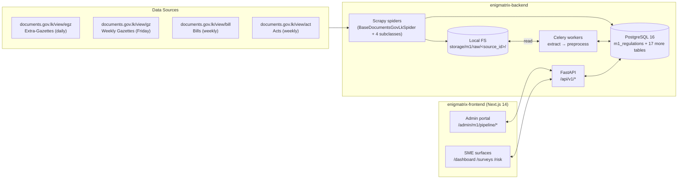

# Enigmatrix Project Atlas

> One-screen TL;DR followed by 26 sections (A → Z) covering what the project is, how the codebase is laid out, what's shipped, and what's pending. Everything links back to source files; nothing is restated when an existing doc already has the canonical text.

## TL;DR

**Enigmatrix** is a unified multilingual web platform for Sri Lankan SMEs that automates four regulatory-intelligence functions across four interlocking research modules. Built on FastAPI + Celery + Scrapy + Next.js 14, with Postgres + Redis + a Scrapy spider stack that ingests gazettes from `documents.gov.lk`. The codebase spans four repos (`enigmatrix-backend`, `enigmatrix-frontend`, `enigmatrix-ml`, `enigmatrix-docs`), a monorepo shell `xyz`, and an Obsidian research vault (`C:\sme\`).



**Status grid** (as of 2026-05-19):

| Layer | Status | Notes |
|---|---|---|
| M1 Stage A–B+ (scrape → extract → preprocess) | ✅ | Phase 2 complete, multi-source (EGZ/GZ/BILL/ACT) shipped |
| M1 Stage C (classify) | 🔲 | XLM-R + LoRA training deferred |
| M1 Stage D (verify) | ✅ | Admin expert review wired |
| M1 Stage E (summarize) | 🔲 | MarianMT translation pipeline designed, not built |
| M1 Stage F (alert) | 🔲 | Sector-matched dispatch deferred |
| M2 Knowledge Hub | 🔲 | ChromaDB scaffolded; ingestion + eval pending |
| M3 Risk Scoring | 🔲 | Architecture designed; training data not collected |
| M4 Misinformation classifier | 🔲 | Data sources + prompts drafted; classifier not trained |
| Admin portal (sources hub, recovery, categorize) | ✅ | Shipped Sessions 42-46 |
| SME surfaces (dashboard, surveys) | 🟡 | Foundation shipped, M2/M3 question banks pending |
| Frontend deploy (Vercel) | ✅ | `enigmatrix-frontend.vercel.app` |
| Backend deploy | ❌ | Vercel attempt failing `FUNCTION_INVOCATION_FAILED`; [Render migration plan](../04-Technology-Stack/infra/Render-Migration-Plan.md) drafted |

---

## A. The research problem

Sri Lankan SMEs are ~52% of GDP but have no automated regulatory monitoring infrastructure. Of the 2023 IRD penalties levied against SMEs, **34% were for changes gazetted more than 90 days prior** — measurable information asymmetry between the state's publication channel (`documents.gov.lk`, `gazette.lk`) and the SMEs the regulations apply to.

Canonical statement: [`Project-Overview.md`](./Project-Overview.md), [`Core-Problem.md`](./Core-Problem.md).

## B. The four-module solution

| # | Module | Function | Status |
|---|---|---|---|
| 1 | **Awareness Gap** (M1) | Ingest gazette PDFs → classify into 12 SME categories + 10 sectors → alert matched SMEs within 24 h | 🟡 ingest done, classifier pending |
| 2 | **Knowledge Hub** (M2) | Retrieval-augmented Q&A over gazettes + regulatory KB with citation grounding | 🔲 designed |
| 3 | **Risk Scoring** (M3) | Predict SME regulatory non-compliance with SHAP explanations | 🔲 designed |
| 4 | **Misinformation Classifier** (M4) | 9-class classifier separating authentic regulatory info from 8 misinformation patterns | 🔲 designed |

Per-module folder: [`02-Research-Modules/`](../02-Research-Modules/). Feature flags: [`08-Findings-Log/FEATURES.md`](../08-Findings-Log/FEATURES.md).

## C. Research questions

- **RQ-M1.1** — Are regulatory changes reaching SMEs in time? What is the info lag between gazette publication and awareness?
- **RQ-M2.1** — Can a RAG system answer SME regulatory questions with ≥ 95% citation accuracy?
- **RQ-M2.2** — Do SMEs find the KB more useful than off-the-shelf legal search?
- **RQ-M3.1** — Can a gradient-boosting model predict non-compliance risk with AUROC ≥ 0.80?
- **RQ-M3.2** — Do SHAP explanations change SME compliance behaviour?
- **RQ-M4.1** — Can a 9-class classifier distinguish authentic regulatory info from 8 misinfo patterns (macro F1 ≥ 0.78)?
- **RQ-M4.2** — Does Perplexity verification reduce false positives?

## D. System architecture

Five logical units. `xyz/` is the monorepo shell that contains the three Git submodule-style code repos plus the orchestration config.

```
xyz/                                   # monorepo shell, git@github.com:ifham-mohamed/xyz.git, branch initiate
  enigmatrix-backend/                  # FastAPI + Celery + Scrapy, git@github.com:Enigmatrixx/enigmatrix-backend.git
  enigmatrix-frontend/                 # Next.js 14, git@github.com:Enigmatrixx/enigmatrix-frontend.git
  enigmatrix-ml/                       # Python ML workspace, canonical extractors + preprocessing
  enigmatrix-docs/                     # BUILD + SETUP docs per domain
  graphify-out/                        # network graph of the codebase (regenerated by /graphify)
  docker-compose.dev.yml               # local dev stack (Postgres + Redis + backend + worker)
  .env                                 # shared dev env

C:\sme\                                # Obsidian research vault (separate from code)
  01-Project-Overview/                 # research framing (this folder)
  02-Research-Modules/                 # per-module research docs (M1..M4)
  04-Technology-Stack/                 # tech docs (backend / frontend / infra / ml / shared)
  08-Findings-Log/                     # session tracker, feature matrix, plans/, changes
  ... 10 more folders ...
```

Detailed topology: [`enigmatrix-docs/shared/03_Architecture.md`](../../Reasearch/xyz/enigmatrix-docs/shared/03_Architecture.md).

## E. Technology stack

**Backend** (Python 3.12) — FastAPI, SQLAlchemy 2.0 async, asyncpg, Alembic, Pydantic v2, Celery + Redis, Scrapy 2.11, PyMuPDF + pdfplumber + Tesseract for PDF extraction, python-jose + passlib (bcrypt) for auth, structlog for logging, slowapi for rate limiting.

**Frontend** (Node ≥ 20, pnpm) — Next.js 14.2 App Router, React 18, TypeScript 5.6, TanStack Query 5, shadcn/ui + Radix primitives, Tailwind CSS 3.4, react-day-picker, react-hook-form + zod, lucide-react, recharts, next-intl (en/si/ta), next-themes, sonner toasts, framer-motion.

**ML** (Python 3.12) — PyTorch + XLM-R (planned), MarianMT (planned), `fastText` for language ID, custom Wijesekara-Sinhala font converter, segmenter, OCR fallback. Lives in [`enigmatrix-ml/m1/`](../../Reasearch/xyz/enigmatrix-ml/m1/).

**Infra** — PostgreSQL 16 (managed; user has connection string), Redis (broker + result backend), Docker Compose for local dev, Vercel for frontend (and currently broken backend attempt), planned Render migration for backend + worker + Redis.

Stack index: [`04-Technology-Stack/00_INDEX.md`](../04-Technology-Stack/00_INDEX.md).

## F. Repository layout

**`enigmatrix-backend/`** — `app/` (FastAPI factory, routers under `app/api/v1/`, models, services, tasks, middleware), `scraper/` (Scrapy project: spiders/, pipelines.py, items.py, settings.py), `alembic/versions/` (18 migrations), `app/tests/` (unit + integration), `storage/m1/raw/<source_id>/` (downloaded PDFs), `api/` (Vercel serverless shim).

**`enigmatrix-frontend/`** — `app/` (App Router: route groups `(auth)`, `(app)`, `(admin)`), `components/` (`ui/` shadcn, `layout/`, `m1-extraction/`, `m1-pipeline/`, `research-log/`, `forms/`), `lib/api/` (typed fetch wrappers), `lib/i18n/messages/` (en/si/ta), `tests/`, `e2e/`, `scripts/extract-m1-docs.mjs`.

**`enigmatrix-ml/`** — `m1/extraction/` (text_extractors.py, pdf_classifier.py, language_detection.py, ocr.py, wijesekara.py, segmenter.py), `m1/preprocessing/` (clean, metadata extract, chunk, classification_input, summarise_input), `scripts/`, `tests/`, `storage/` (model checkpoints).

**`enigmatrix-docs/`** — `m1/` (61 markdown files: research → roadmap), `backend/`, `frontend/`, `infra/`, `ml/`, `shared/`, `tracker/` (legacy).

**`xyz/`** — monorepo shell; the three repos sit as nested directories.

**`C:\sme\`** — Obsidian vault; 14 top-level folders documented in §X.

## G. Data model

18 Alembic migrations between 2026-05-08 and 2026-05-27. Each follows `YYYYMMDDhhmm_<purpose>.py`. Migration list lives in [`enigmatrix-backend/alembic/versions/`](../../Reasearch/xyz/enigmatrix-backend/alembic/versions/).

Core tables:

| Table | Purpose | Source |
|---|---|---|
| `users` | Email + bcrypt hash + role (sme/admin/annotator) + preferred_language | `app/models/user.py` |
| `sme_profile` | 1-to-1 with users; sector_code, primary_language | `app/models/sme_profile.py` |
| `audit_log` | Every business event + every `/api` request | `app/models/audit_log.py` |
| `m1_regulations` | One regulation per PDF; status state machine `ingested → extracted → preprocessed → classified → summarized → alerted`; `last_error`, `last_error_at` for recovery | `app/models/regulation.py` |
| `m1_regulation_penalty` | Multi-penalty rows per regulation; `is_admin_set` for manual overrides | `app/models/m1_regulation_penalty.py` |
| `m1_sub_document` | Section-detected sub-rows (Part I / Schedule 1 / etc.) | `app/models/m1_sub_document.py` |
| `m1_regulation_sectors` | Junction: many-to-many regulation × sector | (part of regulation.py) |
| `survey_question`, `survey`, `survey_session`, `admin_survey` | Unified Q&A engine across M1/M2/M3 with i18n | `app/models/survey*.py` |
| `m2_knowledge_score`, `m3_behavioural_signals`, `m3_compliance_history` | M2 / M3 scoring + signals | `app/models/m2*.py`, `app/models/m3*.py` |
| `sectors`, `regulatory_domains`, `survey_limits` | Reference tables | `app/models/lookup.py` |

`m1_regulations.document_type` Literal: `bill | act | extraordinary_gazette | weekly_gazette | circular | order | notification | unknown`.

## H. M1 pipeline — Stage A: Scrape

`BaseDocumentsGovLkSpider` (in [`scraper/spiders/_base.py`](../../Reasearch/xyz/enigmatrix-backend/scraper/spiders/_base.py)) holds date-range scope, scope-exhaustion early-exit, and the listing-page row parser. Four concrete subclasses set source-specific URL templates + document-number regex: `gazette_spider.py` (EGZ), `weekly_gazette_spider.py` (GZ — two-step year→date crawl), `bills_spider.py` (BILL), `acts_spider.py` (ACT).

Triggered by `POST /api/v1/admin/m1/extraction/trigger` (admin UI) or Beat schedule every 6 h. `run_scraper(source_id, date_from, date_to)` in [`app/tasks/m1/run_scraper.py`](../../Reasearch/xyz/enigmatrix-backend/app/tasks/m1/run_scraper.py) is a polymorphic dispatcher; it launches `scrapy crawl <spider_name>` as a subprocess (keeps Twisted reactor out of Celery).

Pipelines ([`scraper/pipelines.py`](../../Reasearch/xyz/enigmatrix-backend/scraper/pipelines.py)): `PDFDownloadPipeline` writes to `storage/m1/raw/<source_id>/<slug>.pdf`; `M1RegulationsInsertPipeline` INSERTs the row with `status='ingested'` and dispatches `extract_gazette.delay(regulation_id)`.

## I. M1 pipeline — Stage B: Extract

[`app/tasks/m1/extract_gazette.py`](../../Reasearch/xyz/enigmatrix-backend/app/tasks/m1/extract_gazette.py) loads the row, calls `classify_pdf()` to route the PDF through PyMuPDF (text PDFs), pdfplumber (hybrid), or Tesseract (scanned). Writes `raw_text`, `extraction_method`, `extracted_at`; advances `status='extracted'`. On any exception, writes `last_error` + flips `status='extraction_failed'` and re-raises so Celery's retry policy fires.

Canonical extractors live in [`enigmatrix-ml/m1/extraction/`](../../Reasearch/xyz/enigmatrix-ml/m1/extraction/) — `extract_pymupdf`, `extract_pdfplumber`, `extract_tesseract`, plus the `extract_with_chain(pdf_path, enable_ocr_fallback=True)` orchestrator. The backend re-exports them through `app/extraction/__init__.py`.

## J. M1 pipeline — Stage B+: Preprocess

Chained automatically after extract. [`app/tasks/m1/preprocess_gazette.py`](../../Reasearch/xyz/enigmatrix-backend/app/tasks/m1/preprocess_gazette.py) calls `preprocess_gazette(raw_text, regulation_id, published_date)` from [`enigmatrix-ml/m1/preprocessing/__init__.py`](../../Reasearch/xyz/enigmatrix-ml/m1/preprocessing/__init__.py). Writes `cleaned_text`, `amendment_type`, fills in `gazette_number` / `effective_date` / `penalty_range_lkr` / `principal_act_amended` where empty, rebuilds `m1_regulation_penalty` rows (DELETE-then-INSERT, skipping `is_admin_set=TRUE` rows), rebuilds `m1_sub_document` rows from `detect_sections_with_labels()`. Advances `status='preprocessed'`.

## K. M1 pipeline — Stage C: Classify

🔲 **Deferred.** XLM-R + LoRA fine-tune planned for BUILD_11 (Phase 3). Targets: macro-F1 ≥ 0.92 across 12 change categories + 10 sectors. Annotation: Label Studio, 800-label active-learning cycle. Deployment: ONNX + INT8 quantization on Fly.io with p95 latency ≤ 2 s. Spec: [`enigmatrix-docs/m1/16_M1_Development_Roadmap.md`](../../Reasearch/xyz/enigmatrix-docs/m1/16_M1_Development_Roadmap.md) Phase 3.

## L. M1 pipeline — Stage D: Verify

Admin expert review wired today. `POST /api/v1/m1/regulations/{id}/verify` flips `expert_verified=TRUE` and records `expert_verified_by` + `expert_verified_at` in the row; the action is logged to `audit_log`. Service: [`app/services/m1_regulation_service.py`](../../Reasearch/xyz/enigmatrix-backend/app/services/m1_regulation_service.py).

## M. M1 pipeline — Stage E: Summarize

🔲 **Deferred.** MarianMT EN→SI/EN→TA translation pipeline planned; will fill `title_si`, `title_ta`, `summary_si`, `summary_ta`. Spec: [`enigmatrix-docs/m1/12_M1_Translation.md`](../../Reasearch/xyz/enigmatrix-docs/m1/12_M1_Translation.md).

## N. M1 pipeline — Stage F: Alert

🔲 **Deferred.** Sector-matched dispatch with 24-hour delivery window planned for BUILD_12 (Phase 4). Channels: email + SMS. Tracks per-channel `m1_propagation_events`. Spec: [`enigmatrix-docs/m1/16_M1_Development_Roadmap.md`](../../Reasearch/xyz/enigmatrix-docs/m1/16_M1_Development_Roadmap.md) Phase 4.

## O. Multi-source extraction

Shipped Sessions 42-44. The single-source EGZ spider was refactored into `BaseDocumentsGovLkSpider` + three new subclasses (Acts, Bills, Weekly Gazettes). The frontend gained a Sources hub with per-source dynamic extraction pages.

Sources catalogue lives in code, not DB: [`app/services/m1_sources_catalogue.py`](../../Reasearch/xyz/enigmatrix-backend/app/services/m1_sources_catalogue.py) declares the `SOURCES: tuple[SourceMeta, ...]` registry mapping `source_id` ↔ `document_type` ↔ `spider_name` ↔ `landing_url`. The catalogue is the single source of truth for spiders, pipelines, reconcile, and the API.

Storage partitioned: PDFs now land under `m1/raw/EGZ/`, `m1/raw/GZ/`, `m1/raw/BILL/`, `m1/raw/ACT/` instead of a flat root. Legacy flat files are migrated by `POST /migrate-raw-layout` (one-off).

Weekly Gazettes use a two-level crawl (year listing → per-date subpage → ~20 per-section / per-language PDFs). Each PDF becomes one row with a slugified `<date>_<part>_<lang>` identifier.

## P. Recovery & categorize layer

When extraction or preprocessing fails, the row carries `last_error` + `last_error_at` (added in migration `202605270001`). The admin UI surfaces these and offers three recovery actions per row:

| Action | Endpoint | Behaviour |
|---|---|---|
| **Retry** | `POST /regulations/{id}/retry` | Only valid on `extraction_failed`. Resets to `ingested`, clears extract outputs + `last_error`, re-dispatches `extract_gazette`. |
| **Re-extract** | `POST /regulations/{id}/re-extract` | Force full re-run regardless of current status. Clears extract + preprocess outputs + pipeline-set child rows. |
| **Re-preprocess** | `POST /regulations/{id}/re-preprocess` | Only on `extracted`/`preprocessed`. Keeps `raw_text`, rebuilds cleaned outputs. |

Filesystem ↔ DB reconciliation: `POST /reconcile?source_id=<sid>` walks every known source subdir + legacy root + `UNKNOWN/` and inserts rows for PDFs without a DB match.

Un-categorizable PDFs (random drops, unknown filename shapes) get `document_type='unknown'` and land in `m1/raw/UNKNOWN/`. The Sources hub shows a "Needs categorization" tile; admins pick the real type via `POST /regulations/{id}/categorize` which renames the file + flips the type atomically.

All endpoints in [`app/api/v1/m1_gazette_extraction.py`](../../Reasearch/xyz/enigmatrix-backend/app/api/v1/m1_gazette_extraction.py).

## Q. Admin portal

Lives under `app/(admin)/admin/` on the frontend. The M1 pipeline area:

| Route | Purpose |
|---|---|
| `/admin/m1/pipeline` | Observability overview — status counts, throughput (24h / 7d), Celery health, recent errors |
| `/admin/m1/pipeline/recent` | Recent runs table |
| `/admin/m1/pipeline/trace/[id]` | Per-regulation deep dive: timeline, raw + cleaned text, penalties, sub-documents |
| `/admin/m1/pipeline/steps/[id]` | Per-stage Celery diagnostics |
| `/admin/m1/pipeline/sources` | Sources hub — 4 tiles (EGZ/GZ/BILL/ACT) + conditional "Needs categorization" tile |
| `/admin/m1/pipeline/sources/[sourceId]/extraction` | Per-source extraction workspace: date-range picker, trigger button, status pill, summary card, progress panel, recovery actions, "Show all in scope" toggle |
| `/admin/m1/pipeline/sources/UNKNOWN/extraction` | Categorize uncategorised PDFs |
| `/admin/m1/pipeline/extraction` | 301 redirect → `/sources/EGZ/extraction` (legacy bookmark support) |

Other admin areas: `/admin/regulations`, `/admin/surveys`, `/admin/survey-questions`, `/admin/users`, `/admin/research-log/{sessions,changes,features,findings}`, `/admin/translations`, `/admin/activity-log`, `/admin/settings`.

## R. SME-facing surfaces

`app/(app)/` route group. `/dashboard` (entry + M2/M3 scores), `/surveys` (module hub) with `/surveys/module/[id]`, `/surveys/regulation/[id]`, `/surveys/unified`. `/regulations` (read-only gazette list), `/risk` (M3 signals + compliance), `/qa` (Q&A interface), `/verify` (identity verification placeholder), `/profile`, `/docs` (Markdown docs viewer with `/docs/m1/[section]` subtree).

## S. Authentication & authorization

JWT access (15 min) + refresh (7 days) tokens, both signed with `JWT_SECRET` (HS256). `/auth/register` creates `users` row + bcrypt hash (72-byte truncation guard) + empty `sme_profile`; `/auth/login` mints token pair; `/auth/refresh` rotates them. The frontend stores the access token in a cookie set by Next.js, threaded as `Authorization: Bearer <token>` on every API call. Audit-log middleware logs every `/api` call with the user, method, path, status, latency.

Three roles: **sme** (default), **admin** (regulation CRUD, pipeline ops, survey config), **annotator** (subset of admin, for future labelling work). Dependency injection: `Depends(require_admin)` on every admin endpoint.

CORS: `CORS_ORIGINS` (exact-match JSON array) + new optional `CORS_ORIGIN_REGEX` (default `None`) so a single regex like `^https://enigmatrix-frontend(-[a-z0-9-]+)?\.vercel\.app$` covers production + every PR preview URL. Code: [`app/main.py`](../../Reasearch/xyz/enigmatrix-backend/app/main.py).

## T. Multilingual support

UI: `next-intl` with en/si/ta message files in [`enigmatrix-frontend/lib/i18n/messages/`](../../Reasearch/xyz/enigmatrix-frontend/lib/i18n/messages/) (29 KB / 43 KB / 48 KB). Locale persisted in `NEXT_LOCALE` cookie. Per-user preference column `users.preferred_language`.

Regulation summaries: planned via MarianMT EN→SI/EN→TA in Stage E (🔲 deferred). The schema already has `title_si`, `title_ta`, `summary_si`, `summary_ta` columns — they fill in once the translation pipeline ships.

PDF extraction: handles mixed Sinhala + Tamil + English gazettes via the language-detection module ([`enigmatrix-ml/m1/extraction/language_detection.py`](../../Reasearch/xyz/enigmatrix-ml/m1/extraction/language_detection.py)) and the Wijesekara-Sinhala converter (legacy gazette PDFs use a custom font).

## U. Theming & UI system

Aurora palette (Session 36 / F-162): teal primary (`#1D9E75`), navy accent (`#1B3A5C`), cool off-white background (light) / deep-navy background (dark). Per-module CSS variables (`--module-color`, `--module-surface`, `--module-border`) so M1/M2/M3/M4 each have a visual identity. Semantic tokens: `success`, `destructive`, `warning`, `info`.

Component primitives: **shadcn/ui** (Radix-based) — Button, Card, Dialog, Dropdown, Input, Label, Popover, Select, Tabs, Tooltip, StatusBadge (custom), Skeleton, Toast (Sonner), Calendar (react-day-picker). Icons: **lucide-react**.

CSS lives in [`app/globals.css`](../../Reasearch/xyz/enigmatrix-frontend/app/globals.css). Theme switcher in `components/layout/theme-toggle.tsx` via `next-themes`.

## V. Testing strategy

**Backend** (`pytest`) — unit tests for security, M2 scoring, PDF classifier, text extractors, gazette scraper task validation; integration tests for the spider→DB flow, extract task chain, preprocess task, M2/M3 flows, full session lifecycle. Testcontainer Postgres (session-scoped). 12 test files in [`enigmatrix-backend/app/tests/`](../../Reasearch/xyz/enigmatrix-backend/app/tests/).

**Frontend** (`vitest` + `playwright`) — Vitest for unit (jsdom), Playwright for e2e. Light coverage today (one of the deferred follow-ups).

**ML** (`pytest`) — extractor + segmenter unit tests in `enigmatrix-ml/tests/`.

**Gaps** — no tests yet for: the four new recovery endpoints (retry / re-extract / re-preprocess / categorize / migrate-raw-layout), the reconcile_raw multi-source walk, the Sources hub frontend page, or the Acts/Bills/Weekly spiders against recorded HTML fixtures. Flagged in §Z.

## W. CI/CD & deployment

| Surface | Host | Status |
|---|---|---|
| Frontend | Vercel — `enigmatrix-frontend.vercel.app` | ✅ Working; auto-deploys on push to `main`. pnpm-lock.yaml sync verified. |
| Backend | Vercel attempt — `enigmatrix-backend.vercel.app` | ❌ `FUNCTION_INVOCATION_FAILED` (missing env vars + Vercel can't host Celery/Scrapy/persistent disk anyway) |
| Celery worker | not deployed | ❌ Needs a long-running host |
| Redis | not deployed | ❌ Same |
| Postgres | managed (user-supplied connection string) | ✅ |

Migration plan: [`04-Technology-Stack/infra/Render-Migration-Plan.md`](../04-Technology-Stack/infra/Render-Migration-Plan.md). Render gives us managed Redis + always-on web service + always-on worker + persistent disk for ~$16.50/mo, with `render.yaml` Infrastructure-as-Code.

Vercel keeps the frontend; backend + worker + Redis + storage move to Render. `NEXT_PUBLIC_API_BASE_URL` on the frontend repoints at the Render URL.

## X. Vault sync & research log

Project decisions live in two parallel surfaces:

1. **Obsidian vault** `C:\sme\` — 14 top-level folders (00-Meta, 01-Project-Overview, 02-Research-Modules, 03-Data-Sources, 04-Technology-Stack, 06-Timeline, 07-Team, 08-Findings-Log, 09-Prompts, 10-Highlights, Interim, _Attachments, _Templates, graphify-out). 100+ markdown files.

2. **Findings tracker** [`08-Findings-Log/`](../08-Findings-Log/) — session-by-session trail: `SESSIONS.md` (per-session "Done / Decisions / Risks / Files" notes), `CHANGES.md` (one F-### row per logical change), `FEATURES.md` (108-row feature matrix with 🟢/🟡/🔲/🔴 status). The vault convention is to append entries after every shipped change.

3. **Plan-vault hook** — when Claude finalises a plan via `ExitPlanMode`, a `PostToolUse` hook copies the plan file from `~/.claude/plans/` to `C:\sme\08-Findings-Log\plans\YYYY-MM-DD_<slug>.md`. Script: [`~/.claude/scripts/copy-plan-to-vault.ps1`](../../Users/Administrator/.claude/scripts/copy-plan-to-vault.ps1). Auto-runs on plan approval; logs to `_plan-copies.log`.

4. **Graphify** — `/graphify --update` rebuilds two persistent graphs (one for the code, one for the vault) in `C:\Reasearch\xyz\graphify-out\` and `C:\sme\graphify-out\` respectively. Used for navigation queries and architecture audits.

## Y. What's shipped

**Phase 1 — Foundation** ✅
Admin CRUD for regulations, audit-log middleware, unified survey engine (M0 → M2 → M3 branching), 5 seeded demo regulations.

**Phase 2 — Ingest + extraction** ✅ *(Session 32 / F-155)*
Scrapy spider (gazette.lk + documents.gov.lk), Celery task wiring, PDF type classifier + 3-tier extraction (PyMuPDF → pdfplumber → Tesseract), language detection (fastText) + Wijesekara conversion, preprocessing chain (cleaning + metadata + chunking), Celery pipeline + `m1_regulation_penalties` persistence.

**Multi-source extension** ✅ *(this and prior session)*
`BaseDocumentsGovLkSpider` + Acts / Bills / Weekly subclasses; polymorphic `run_scraper(source_id, ...)`; sources catalogue; partitioned storage `m1/raw/<source_id>/`; sources hub UI; dynamic per-source extraction page; UNKNOWN categorize flow.

**Recovery layer** ✅
`last_error` capture in extract + preprocess; retry / re-extract / re-preprocess / reconcile / categorize / migrate-raw-layout endpoints; "Show all in scope" toggle with summary + progress panels in sync.

**Observability portal** ✅ *(Session 37 / F-160)*
Pipeline overview with funnel, throughput charts, Celery health, recent errors. Per-regulation trace view.

**Research log portal** ✅ *(Session 36 / F-159)*
`/admin/research-log` reads the Obsidian vault live and surfaces sessions, features, changes, findings inside the app.

**Aurora theme** ✅ *(Session 36 / F-162)*

108 features tracked, 77 🟢 done, 20 🟡 in progress, 11 🔲 deferred. Per [`08-Findings-Log/FEATURES.md`](../08-Findings-Log/FEATURES.md).

## Z. What's pending

Ordered roughly by effort.

| Item | Effort | Notes |
|---|---|---|
| Render backend migration | 1 day | `render.yaml` already drafted in [Render-Migration-Plan.md](../04-Technology-Stack/infra/Render-Migration-Plan.md). Once done, login on `enigmatrix-frontend.vercel.app` works. |
| Backend test coverage for recovery endpoints | 1 day | Retry / re-extract / re-preprocess / categorize / migrate-raw-layout — see §V gaps. |
| Backend test coverage for new spiders | 1 day | Acts / Bills / Weekly Gazettes against recorded HTML fixtures. |
| Forms / Notices / Calendar sources | 1–2 days | Notices + Calendar are currently 404 on `documents.gov.lk`. Forms has no date scope — different UX. |
| Weekly Gazette multi-language ingest | 1 day | Currently English-only. Add `_S.pdf` and `_T.pdf` variants with sub-section + language encoded in `document_number`. |
| gazettes.lk fallback | 2 days | Site returns 403 to scrapers. Needs Playwright or UA-rotation. |
| **M1 Phase 3 — Classifier** | 4–6 weeks | XLM-R + LoRA. Label Studio + 800-label active-learning cycle. Macro-F1 ≥ 0.92 target. ONNX export + INT8 quant for inference. |
| **M1 Phase 4 — Alerts + scheduler** | 2 weeks | 15-source registry, 2-hourly scans, sector-matched dispatch with 24h delivery window, email + SMS channels. |
| **M1 Stage E — Translation** | 2 weeks | MarianMT EN→SI/EN→TA, fill `title_si`/`title_ta`/`summary_si`/`summary_ta`. |
| **M2 Knowledge Hub** | 6–8 weeks | ChromaDB ingestion, RAG harness, citation grounding, eval set (95% target). |
| **M3 Risk Scoring** | 4–6 weeks | Training data collection (the bottleneck), gradient-boosting model, SHAP. AUROC ≥ 0.80. |
| **M4 Misinformation Classifier** | 4–6 weeks | 9-class classifier, Perplexity verification step, macro-F1 ≥ 0.78. |

🔲 + 🟡 features in [`FEATURES.md`](../08-Findings-Log/FEATURES.md) — 31 rows.

---

## Appendix A1 — Glossary

- **Gazette** — official publication of the Sri Lankan government. Two variants: **Extraordinary** (EGZ, daily) and **Weekly** (GZ, Friday).
- **Regulation** — one logical row in `m1_regulations`. Usually one PDF, sometimes one section of a larger gazette.
- **Sub-document** — a section detected inside a regulation's PDF (Part I, Schedule 1, etc.). Stored in `m1_sub_document`.
- **Sector** — one of 10 SME sectors used for alert targeting. Reference table `sectors`.
- **Module** — one of M1–M4 research-and-product units.
- **RQ** — research question. Numbered RQ-M&lt;module&gt;.&lt;n&gt;.
- **F-###** — feature ID in `FEATURES.md`. 108 declared as of 2026-05-19.

## Appendix A2 — Top file paths

```
enigmatrix-backend/app/main.py                       FastAPI factory + middleware
enigmatrix-backend/app/api/v1/router.py              Mounts every v1 route
enigmatrix-backend/app/api/v1/m1_gazette_extraction.py   Extraction + recovery + sources hub API
enigmatrix-backend/app/models/regulation.py          m1_regulations + DocumentType Literal
enigmatrix-backend/app/services/m1_sources_catalogue.py  SOURCES tuple — single source of truth
enigmatrix-backend/app/services/m1_pipeline_service.py   Slug helpers, scope filter, progress aggregation
enigmatrix-backend/app/tasks/m1/__init__.py          Celery task exports
enigmatrix-backend/app/tasks/m1/run_scraper.py       Polymorphic spider dispatcher
enigmatrix-backend/app/tasks/m1/extract_gazette.py   Stage B
enigmatrix-backend/app/tasks/m1/preprocess_gazette.py Stage B+
enigmatrix-backend/app/tasks/m1/reconcile_raw.py     Filesystem ↔ DB reconciliation
enigmatrix-backend/app/tasks/m1/migrate_raw_layout.py One-off legacy-flat → partitioned migration
enigmatrix-backend/scraper/spiders/_base.py          BaseDocumentsGovLkSpider
enigmatrix-backend/scraper/pipelines.py              Download + DB-insert pipelines
enigmatrix-backend/app/celery_config.py              Celery app + include list + beat
enigmatrix-backend/app/settings.py                   Pydantic Settings (env)

enigmatrix-frontend/app/(admin)/admin/m1/pipeline/sources/page.tsx   Sources hub
enigmatrix-frontend/app/(admin)/admin/m1/pipeline/sources/[sourceId]/extraction/page.tsx   Per-source workspace
enigmatrix-frontend/app/(admin)/admin/m1/pipeline/sources/[sourceId]/extraction/_unknown-panel.tsx   Categorize flow
enigmatrix-frontend/components/m1-extraction/extraction-progress-panel.tsx   Live row feed + recovery actions
enigmatrix-frontend/components/m1-extraction/extraction-summary-card.tsx     Aggregate stats
enigmatrix-frontend/lib/api/m1-gazette-extraction.ts Typed API client
enigmatrix-frontend/lib/api/client.ts                Base fetch wrapper
enigmatrix-frontend/lib/i18n/messages/{en,si,ta}.json i18n strings

enigmatrix-ml/m1/extraction/text_extractors.py       PyMuPDF + pdfplumber + Tesseract wrappers
enigmatrix-ml/m1/extraction/pdf_classifier.py        text_pdf / hybrid / scanned router
enigmatrix-ml/m1/preprocessing/__init__.py           preprocess_gazette orchestrator
```

## Appendix A3 — Common commands

```bash
# Backend
uv run alembic upgrade head                  # apply migrations
uv run uvicorn app.main:app --reload         # FastAPI dev server
uv run celery -A app.celery_config:celery_app worker --loglevel=info
uv run celery -A app.celery_config:celery_app beat
uv run scrapy crawl gazette_spider -a date_from=2026-05-01 -a date_to=2026-05-19
uv run pytest app/tests/ -v
uv run pytest app/tests/integration/test_gazette_spider.py -v
uv run python -m app.scripts.seed_dev        # seed dev data

# Frontend
pnpm install                                  # install deps (use corepack pnpm 9.x)
pnpm dev                                      # next dev
pnpm build                                    # next build (production)
pnpm typecheck                                # tsc --noEmit
pnpm lint                                     # next lint
pnpm test                                     # vitest
pnpm e2e                                      # playwright

# Both via Docker
docker compose -f docker-compose.dev.yml up   # postgres + redis + backend + worker

# Vault
/graphify --update                            # rebuild code + vault graphs (Claude skill)
```

## Appendix A4 — Cross-references

This Atlas is a navigation hub. Each section links back to:

- [`Project-Overview.md`](./Project-Overview.md) — research framing (the "why")
- [`02-Research-Modules/`](../02-Research-Modules/) — per-module RQs + worked examples
- [`02-Research-Modules/1 Module-1-Awareness-Gap/02_M1_Data_Requirements.md`](../02-Research-Modules/1%20Module-1-Awareness-Gap/02_M1_Data_Requirements.md) — M1 schema + pipeline stages canonical text
- [`04-Technology-Stack/00_INDEX.md`](../04-Technology-Stack/00_INDEX.md) — tech-stack docs entry point
- [`04-Technology-Stack/infra/Render-Migration-Plan.md`](../04-Technology-Stack/infra/Render-Migration-Plan.md) — deployment plan
- [`08-Findings-Log/FEATURES.md`](../08-Findings-Log/FEATURES.md) — 108-row feature matrix (authoritative status)
- [`08-Findings-Log/SESSIONS.md`](../08-Findings-Log/SESSIONS.md) — chronological build trail
- [`08-Findings-Log/CHANGES.md`](../08-Findings-Log/CHANGES.md) — per-change rationale
- [`enigmatrix-docs/m1/16_M1_Development_Roadmap.md`](../../Reasearch/xyz/enigmatrix-docs/m1/16_M1_Development_Roadmap.md) — Phase 1/2/3/4 roadmap
- `git log --oneline` in each repo — canonical commit trail

---

*Atlas last updated 2026-05-19. Re-run when a major phase ships (M1 Phase 3, M2 launch, etc.). The status grid at the top is the single source for "what's shipped right now"; keep it in sync with `FEATURES.md`.*
