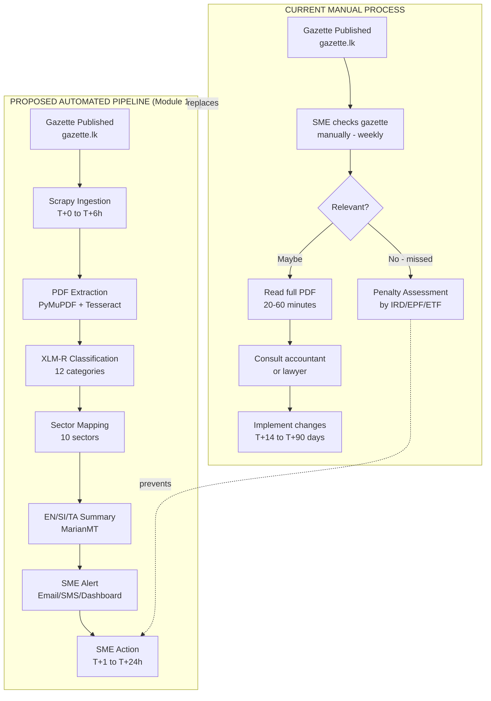

# 01 — Module 1: Research Problem & Motivation

> **Cross-references:** [02_M1_Data_Requirements.md](02_M1_Data_Requirements.md) · [05_M1_Model_Architecture.md](05_M1_Model_Architecture.md) · [08_M1_Full_System_Architecture.md](08_M1_Full_System_Architecture.md)
> **See also:** [13_M1_Folder_Structure_and_Implementation_Flow.md](13_M1_Folder_Structure_and_Implementation_Flow.md) for where Stage-G (lag measurement) code lives in the project tree.
> **Sub-step companion:** [01_M1_1_Research_Motivation_Evidence.md](01_M1_1_Research_Motivation_Evidence.md) — expanded IRD/EPF awareness-gap evidence + SME pre-pilot survey data.

---

## Abstract

Sri Lanka publishes over 500 official gazette notifications annually through the Department of Government Printing, each carrying binding regulatory changes that affect small and medium enterprises (SMEs) across manufacturing, retail, services, and agriculture. Empirical evidence from the Inland Revenue Department (IRD) and the Employees' Provident Fund (EPF) indicates that the majority of SMEs — particularly those with fewer than 50 employees — remain unaware of relevant amendments until enforcement action commences. This research designs, trains, and deploys a multilingual natural language processing (NLP) pipeline that automatically ingests gazette PDFs, classifies them into 12 SME-relevant regulatory categories, maps them to affected industry sectors, and delivers structured alerts to registered SMEs within two hours of publication. The system, designated **Module 1 (Regulatory Awareness Gap)** of the Enigmatrix platform, aims to achieve a macro-averaged F1 score ≥ 0.92 on category classification and ≥ 0.88 on sector assignment across English, Sinhala, and Tamil gazette texts.

---

## 1. Introduction

### 1.1 Background

The Sri Lankan regulatory environment is administered by a constellation of agencies — the Inland Revenue Department (IRD), Employees' Provident Fund (EPF), Employees' Trust Fund (ETF), Registrar of Companies (eROC), Sri Lanka Standards Institution (SLSI), and Central Bank of Sri Lanka (CBSL) — each publishing amendments through the Official Gazette ([gazette.lk](https://www.gazette.lk) / [documents.gov.lk](https://documents.gov.lk)). The Gazette is published in three languages (English, Sinhala, Tamil), appears in both machine-readable and scanned-image PDF formats, and does not maintain structured metadata beyond volume/part/date identifiers.

For large enterprises, dedicated legal and compliance teams monitor gazette publications continuously. For SMEs — which represent 52% of Sri Lanka's GDP and 45% of employment (Department of Census and Statistics, 2022) — no equivalent monitoring infrastructure exists. The result is a systemic information asymmetry that exposes SMEs to retrospective penalties, license revocations, and reputational damage.

### 1.2 Motivation: The Awareness Gap

The IRD's 2023 Annual Report records that 34% of SME penalty assessments arose from non-compliance with amendments that had been gazetted more than 90 days prior. EPF field audit reports (2022–2023) indicate that 61% of audited SMEs were unaware of at least one EPF contribution rate change within the preceding 12 months. These figures represent a measurable, addressable information gap — not wilful non-compliance.

The root cause is structural: gazettes are published as PDF documents without push notification infrastructure, API access, or machine-readable metadata. Secondary dissemination through newspapers, trade associations, and government portals introduces lags ranging from 7 to 58 days. By the time regulatory information reaches a typical SME, compliance deadlines may already have passed.

---

## 2. Problem Statement

**Formal statement:** Given a set of Sri Lankan Official Gazette PDF documents $G = \{g_1, g_2, \ldots, g_n\}$ published at timestamps $T = \{t_1, t_2, \ldots, t_n\}$, construct an automated pipeline $P$ such that:

1. Each gazette $g_i$ is ingested within 6 hours of publication
2. A classifier $C$ assigns $g_i$ to one of 12 regulatory categories $K = \{k_1, \ldots, k_{12}\}$ with macro-averaged F1 ≥ 0.92
3. A sector mapper $S$ assigns $g_i$ to one or more of 10 SME industry sectors with F1 ≥ 0.88
4. Structured alerts reach registered SMEs matched to the affected sectors within 24 hours of $t_i$

**Secondary research question:** What is the measurable information lag $\Delta t = t_{\text{awareness}} - t_{\text{publication}}$ between gazette publication and SME first-awareness, and which dissemination channels minimise this lag?

---

## 3. Research Questions

| # | Question | Method | Success Criterion |
|---|---|---|---|
| RQ1 | Can NLP classify Sri Lankan gazettes into SME-relevant categories with F1 ≥ 0.92? | Fine-tuned XLM-R + LoRA on 800+ labeled examples | Macro F1 ≥ 0.92 on held-out test set |
| RQ2 | Can multilingual models handle English/Sinhala/Tamil gazette text without per-language pipelines? | XLM-R vs mBERT vs IndicBERT ablation | F1 within 5% across all three languages |
| RQ3 | What is the median information lag between gazette publication and SME awareness? | Propagation event timestamps + survey responses | Dataset of ≥ 200 regulations × ≥ 4 stages |
| RQ4 | Which dissemination channels deliver regulatory information fastest? | Channel-stratified lag analysis | Ranked channel table with median lag in days |

---

## 4. Scope and Boundaries

### In Scope
- Official Gazette PDFs from [gazette.lk](https://www.gazette.lk) and [documents.gov.lk](https://documents.gov.lk), 2015–present
- 12 regulatory categories (defined in [09_M1_Annotation_Guidelines.md](09_M1_Annotation_Guidelines.md))
- 10 SME industry sectors: manufacturing, retail, services, agriculture, construction, IT/BPO, hospitality, transport, healthcare, finance
- English, Sinhala, and Tamil text (gazette primary language + translated summaries)
- Administrative districts: all 25 districts of Sri Lanka

### Out of Scope
- Provincial council regulations (separate legal hierarchy)
- Court judgments and orders
- Internal government circulars not published in the Official Gazette
- Regulations from countries other than Sri Lanka

---

## 5. Success Metrics

| Metric | Target | Measurement Method |
|---|---|---|
| Category classification F1 (macro) | ≥ 0.92 | 15% held-out test set |
| Sector assignment F1 (macro) | ≥ 0.88 | 15% held-out test set |
| Ingestion latency | ≤ 6 hours from publication | Automated timestamp logging |
| Alert delivery latency | ≤ 24 hours from publication | `m1_propagation_events` table |
| System uptime | ≥ 99.9% | Uptime monitoring (UptimeRobot) |
| Labeled training corpus | ≥ 800 examples (≥ 50/category) | Annotation tracker |
| SME survey responses | ≥ 100 unique SMEs | `m1_sme_awareness_responses` table |
| Propagation data points | ≥ 800 (200 regulations × 4 stages) | `m1_propagation_events` COUNT |
| Admin verification rate (needs_review) | < 20% flagged for manual review | `needs_review` field ratio |

---

## 6. Current Manual Process vs Proposed Automation

---

## 7. Prior Work and Related Research

### 7.1 Regulatory NLP
- **Chalkidis et al. (2019)** — "Large-Scale Multi-Label Text Classification on EU Legislation" established that BERT-based models outperform TF-IDF+SVM on legal text classification by 8–15% F1 (EUR-Lex 4341 dataset).
- **Bommarito & Katz (2018)** — "A quantitative analysis of the practice of law in the U.S." demonstrated that regulatory documents exhibit strong domain-specific vocabulary that benefits from domain-adapted tokenization.
- **Loper & Bird (2002)** — NLTK: A toolkit for natural language processing and computational linguistics.

### 7.2 South Asian NLP
- **Kakwani et al. (2020)** — "IndicNLPSuite: Monolingual Corpora, Evaluation Benchmarks and Pre-trained Multilingual Language Models for Indian Languages" — relevant for Sinhala/Tamil handling in the absence of dedicated Sri Lankan NLP resources.
- **Conneau et al. (2019)** — "Unsupervised Cross-lingual Representation Learning at Scale" — XLM-R trained on 100 languages including Sinhala (`si`) and Tamil (`ta`).

### 7.3 Sri Lankan Regulatory Context
- IRD Annual Report 2023 — [https://www.ird.gov.lk/en/publications/annual_report_2023.pdf](https://www.ird.gov.lk/en/publications/annual_report_2023.pdf)
- EPF Statistical Report 2022 — [https://www.epf.lk/publications/](https://www.epf.lk/publications/)
- Department of Census and Statistics — SME Survey 2022

---

## 8. Stage-by-Stage Regulatory Diffusion Timeline

Understanding the research problem requires mapping the full information diffusion path from cabinet decision to SME compliance action. Module 1 measures the lag at each transition. The multi-pin adapter example (Gazette 2486/22) shows concrete timestamps at each stage:

| Stage | Who / Event | Typical Timing | Measured Lag |
|---|---|---|---|
| **T0** | Cabinet approves regulation | Day 0 | — |
| **T1** | Bill/draft published on `documents.gov.lk` | Day 0 → +X days | Pre-gazette baseline |
| **T2** | Act certified by Speaker; published on `documents.gov.lk` | Day X → +Y days | Bill-to-act lag |
| **T3** | Implementing notice published in Official Gazette | Day Y → +Z days | T3 = **research baseline (Day 0)** |
| **T4** | IRD / SLSI / Ministry publishes secondary notice on own portal | Day Z + 7 days (median) | **Portal lag** (RQ4) |
| **T5** | News outlets (Daily FT, Lankadeepa) report on it | Day Z + 23 days (median) | **Media lag** (RQ4) |
| **T6** | SME owner in Colombo first hears about it | Day Z + 33–45 days (est.) | **Urban SME lag** (RQ3) |
| **T7** | Same regulation reaches SME in Jaffna or Hambantota | Day Z + 45–70 days (est.) | **Rural SME lag** (RQ3) |
| **T8** | Effective date of regulation | Gazette-specified future date | Compliance window |
| **T9** | First enforcement action / fine against non-compliant SME | After T8 | Gap (T9 − T6) = compliance risk window |

**Module 1's novel empirical contribution** = the measured distribution of T6−T3, T6−T5, T4−T3, T5−T3, and T9−T6 across ≥ 200 regulations and ≥ 100 SME survey respondents. This lag dataset does not exist for the Sri Lankan regulatory context. Generating it — through the automated pipeline and the awareness survey — is the primary research output.

### 8.1 Lag-measurement methodology preview

Each lag is computed from concrete event timestamps emitted by the pipeline (see [03_M1_Data_Collection.md](03_M1_Data_Collection.md) for the timestamp sources) and aggregated nightly via the `v_m1_regulation_lag_summary` view ([02_M1_Data_Requirements.md §3.5](02_M1_Data_Requirements.md)). The full measurement procedure — sample-size requirement, statistical test, expected effect size, and the four research notebooks that consume the data — is detailed in [08_M1_1_Research_Findings_Extraction.md](08_M1_1_Research_Findings_Extraction.md). Monitoring of the lag-measurement pipeline (data-source uptime, view refresh latency, RSS publish-delay calibration) lives in [12_M1_Monitoring_Maintenance.md](12_M1_Monitoring_Maintenance.md). The point at which a measurement becomes statistically defensible (sample size ≥ 50 per channel, IAA-validated survey responses ≥ 100 SMEs) is documented in the success-metrics table above.

---

## 9. Two Research Outputs

Module 1 produces two simultaneous, mutually reinforcing outputs from the same pipeline:

| Output | What It Is | Academic Value | Practical Value |
|---|---|---|---|
| **Deployed Alert System** | Automated pipeline: gazette ingestion → NLP classification → multilingual summary → SME notification | Demonstrates feasibility of NLP-driven regulatory monitoring in a low-resource multilingual setting | Reduces SME awareness lag from 33–70 days (baseline) to < 24 hours for subscribed SMEs |
| **Empirical Lag Dataset** | 200+ regulations × 4+ channel timestamps + 100+ SME awareness survey responses | First quantified measurement of Sri Lankan regulatory information diffusion — publishable as standalone research contribution | Provides government and chambers with evidence to reform gazette dissemination practices |

The platform is the *vehicle* for the research, and the empirical findings are the *justification* for the platform. Each strengthens the other's impact: without the alert system, the lag dataset would require prohibitively manual data collection; without the lag measurement, the alert system would have no empirically demonstrated impact.

---

## 10. Implementation Risk Register

Each mitigation pins one **implementation hook** — a concrete file path or monitoring metric the team must wire up. Without the hook, the mitigation is aspirational; with it, the risk is observable.

| Risk | Probability | Impact | Mitigation + implementation hook |
|---|---|---|---|
| Older gazettes are scanned PDFs with no extractable text | High (pre-2018) | Medium — reduces training corpus quality | Tesseract OCR fallback ([03_M1_1_PDF_Extraction_Chain.md](03_M1_1_PDF_Extraction_Chain.md)); accept ≤ 10% CER; manual spot-check 5% of OCR output. **Hook:** `backend/app/tasks/m1/analytics.py` logs daily `extraction_method` distribution; Prometheus alert if scanned share exceeds 2× the 30-day baseline. |
| Sinhala/Tamil OCR quality insufficient for classification | Medium | High — degrades multilingual F1 | Tesseract 5.3.x LSTM mode with `sin`/`tam` packs ([10_M1_2_OCR_Wijesekara_Conversion.md](10_M1_2_OCR_Wijesekara_Conversion.md)); quantify CER in thesis limitations. **Hook:** quarterly CER recalibration via 50-doc hand-checked sample; results stored in `storage/models/m1/v<X>/model_registry.json:ocr_cer_per_language`. |
| Government gazette portal changes URL structure | Low | High — breaks entire ingestion pipeline | Spider health-check job; manual URL override table. **Hook:** `backend/app/tasks/m1/portal_watcher.py` writes per-source HTTP status to `m1_sources.last_check_status`; alert on consecutive non-200 for any source. |
| Survey response rate too low for lag measurement (< 100 SMEs) | Medium | High — RQ3 underpowered | Bundle survey with M2/M3 questionnaires; partner with NEDA and Chamber of Commerce. **Hook:** dashboard widget at `/admin/m1/survey-coverage` shows running count by sector; flag below-target sectors weekly. |
| News scrapers blocked by paywalls | Medium | Low — RSS headlines sufficient for first-mention timestamp | RSS feeds + headline-only scraping; document as methodology limitation. **Hook:** `m1_sources` rows for paywalled outlets carry `access_method='rss_headline_only'` to flag this caveat in research outputs. |
| Classifier confused by long gazette PDFs (> 512 tokens) | High | Medium — truncation loses regulatory tail clauses | Section-aware chunking ([04_M1_3_Text_Chunking_Strategy.md](04_M1_3_Text_Chunking_Strategy.md)); classify per section, aggregate. **Hook:** `ml/m1/preprocessing/chunking.py` emits `chunks_per_gazette` metric; >10 chunks triggers a spot-check task. |
| New regulatory category appears mid-project (taxonomy lock) | Low | Medium — new category misclassified as OTHER | Lock taxonomy by Week 5; `needs_review=true` path for low-confidence; re-label batch. **Hook:** when daily count of `needs_review=true` exceeds 15% of new gazettes, [12_M1_2_Retraining_Deployment_Rollback.md](12_M1_2_Retraining_Deployment_Rollback.md) re-training trigger fires. |

---

## 11. Conclusion and Document Roadmap

This document establishes the research problem, formal research questions, scope boundaries, and success metrics for Module 1. The remaining documents in this series cover each stage of the solution:

| Next Step | Document |
|---|---|
| Data sourcing and schema | [02_M1_Data_Requirements.md](02_M1_Data_Requirements.md) |
| Web scraping and PDF extraction | [03_M1_Data_Collection.md](03_M1_Data_Collection.md) |
| Text preprocessing | [04_M1_Preprocessing_Pipeline.md](04_M1_Preprocessing_Pipeline.md) |
| Model architecture | [05_M1_Model_Architecture.md](05_M1_Model_Architecture.md) |
| Training and evaluation | [06_M1_Training_Evaluation.md](06_M1_Training_Evaluation.md) |
| Deployment | [07_M1_Deployment_Integration.md](07_M1_Deployment_Integration.md) |
| Full system view | [08_M1_Full_System_Architecture.md](08_M1_Full_System_Architecture.md) |
