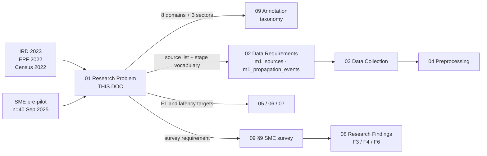
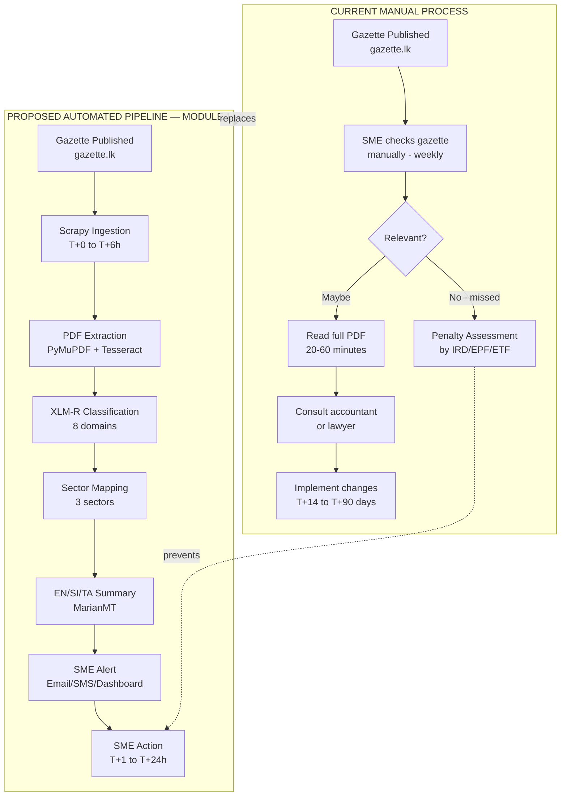

# 01 — Module 1: Research Problem & Motivation

> **Cross-references:** [02_M1_Data_Requirements.md](02_M1_Data_Requirements.md) · [03_M1_Data_Collection.md](03_M1_Data_Collection.md) · [05_M1_Model_Architecture.md](05_M1_Model_Architecture.md) · [08_M1_Full_System_Architecture.md](08_M1_Full_System_Architecture.md) · [09_M1_Annotation_Guidelines.md](09_M1_Annotation_Guidelines.md)
> **Code map:** [13_M1_Folder_Structure_and_Implementation_Flow.md](13_M1_Folder_Structure_and_Implementation_Flow.md) — Stage-G lag measurement + `research/data/prepilot_2025-09.csv`, `research/citations.bib`
> **Consolidation note (2026-07-29):** this document now carries the full content previously split across `01_M1_1_Research_Motivation_Evidence`. That file has been retired; the complete three-stream evidence base, the pre-pilot instrument comparison, the anonymised respondent example, and the evidence-validity limitations from it live below in §1.2, §10.1 and §11.

---

## 0. Where This Document Sits in the Pipeline

This is the first document in the Module 1 series, so it has no upstream *pipeline* stage — its inputs are external published statistics and one small primary survey. What it produces is not data but **constraints**: the domain count, the sector list, the source list, the stage vocabulary, and the numeric targets that every later document is obliged to satisfy. Nothing downstream can be validated without them, which is why they are written down before any schema exists.

| | Stage | Produced by | What this document does with it | Handed to |
|---|---|---|---|---|
| **In** | IRD Annual Report 2023 Table 7.4; EPF Statistical Bulletin 2022 §4 | External primary sources | Quantifies the awareness gap and establishes that it is measurable, not anecdotal | — |
| **In** | Department of Census and Statistics, Annual Survey of Industries 2022 | External primary source | Sizes the addressable SME population — 52 % of GDP, 45 % of employment | — |
| **In** | Enigmatrix SME pre-pilot scan, Sep 2025, n = 40 | `research/data/prepilot_2025-09.csv` | Triangulates the official statistics from the SME side; seeds the channel taxonomy | — |
| **Step** | Problem formalisation | *this document* §2 | Pipeline $P$ with four hard obligations: 6 h ingest, F1 ≥ 0.92 category, F1 ≥ 0.88 sector, 24 h alert | — |
| **Step** | Research questions RQ1–RQ4 | *this document* §3 | Binds each question to a method and a success criterion | — |
| **Step** | Diffusion timeline T0–T9 | *this document* §8 | Defines the stages at which a lag can be measured at all | — |
| **Out** | Scope: 8 regulatory domains, 3 study sectors | — | — | [09_M1_Annotation_Guidelines.md](09_M1_Annotation_Guidelines.md) §2 taxonomy definitions; [02_M1_Data_Requirements.md](02_M1_Data_Requirements.md) `m1_regulations.change_category` CHECK constraint and `m1_regulations.sector_tags` |
| **Out** | Source boundary: gazette.lk + documents.gov.lk, 2015–present | — | — | [02_M1_Data_Requirements.md](02_M1_Data_Requirements.md) `m1_sources` catalogue; [03_M1_Data_Collection.md](03_M1_Data_Collection.md) spider targets |
| **Out** | Stage vocabulary T0–T9 and the lag definitions over it | — | — | [02_M1_Data_Requirements.md](02_M1_Data_Requirements.md) `m1_propagation_events` + `v_m1_regulation_lag_summary`; [03_M1_Data_Collection.md](03_M1_Data_Collection.md) timestamp emission |
| **Out** | Accuracy and latency targets | — | — | [05_M1_Model_Architecture.md](05_M1_Model_Architecture.md), [06_M1_Training_Evaluation.md](06_M1_Training_Evaluation.md) F1 gates; [07_M1_Deployment_Integration.md](07_M1_Deployment_Integration.md) latency budget; [12_M1_Monitoring_Maintenance.md](12_M1_Monitoring_Maintenance.md) alert thresholds |
| **Out** | Survey requirement — ≥ 100 SMEs, channel taxonomy seed | — | — | [09_M1_Annotation_Guidelines.md](09_M1_Annotation_Guidelines.md) §9 instrument; `m1_sme_awareness_responses` |
| **Out** | Empirical lag dataset as a research output | — | — | [08_M1_Full_System_Architecture.md](08_M1_Full_System_Architecture.md) §research findings F3 / F4 / F6 |

```mermaid
flowchart LR
    E1[IRD 2023<br/>EPF 2022<br/>Census 2022] --> P[01 Research Problem<br/>THIS DOC]
    E2[SME pre-pilot<br/>n=40 Sep 2025] --> P
    P -->|8 domains + 3 sectors| A[09 Annotation<br/>taxonomy]
    P -->|source list + stage vocabulary| D[02 Data Requirements<br/>m1_sources · m1_propagation_events]
    D --> C[03 Data Collection]
    C --> PP[04 Preprocessing]
    P -->|F1 and latency targets| M[05 / 06 / 07]
    P -->|survey requirement| S[09 §9 SME survey]
    S --> R[08 Research Findings<br/>F3 / F4 / F6]
```

**Why the ordering matters.** The scope decisions here are expensive to reverse downstream. The domain count becomes a CHECK-constrained enum in the database and a fixed output dimension in the classifier head; the stage vocabulary becomes the `stage` column of `m1_propagation_events` and therefore the shape of every lag query; the 2015-present source boundary decides how much scanned-PDF OCR the collection layer has to survive. Changing any of them after [02_M1_Data_Requirements.md](02_M1_Data_Requirements.md) lands is a migration plus a re-annotation, not an edit. The evidence base in §1.2 exists precisely to justify those commitments *before* they harden.

---

## Abstract

Sri Lanka publishes over 500 official gazette notifications annually through the Department of Government Printing, each carrying binding regulatory changes that affect small and medium enterprises (SMEs) across grocery/food retail, food service, and general-goods retail. Empirical evidence from the Inland Revenue Department (IRD) and the Employees' Provident Fund (EPF) indicates that the majority of SMEs — particularly those with fewer than 50 employees — remain unaware of relevant amendments until enforcement action commences. This research designs, trains, and deploys a multilingual natural language processing (NLP) pipeline that automatically ingests gazette PDFs, classifies them into 8 SME-relevant regulatory domains, maps them to affected study sectors, and delivers structured alerts to registered SMEs within two hours of publication. The system, designated **Module 1 (Regulatory Awareness Gap)** of the Enigmatrix platform, aims to achieve a macro-averaged F1 score ≥ 0.92 on category classification and ≥ 0.88 on sector assignment across English, Sinhala, and Tamil gazette texts.

**Implementation status:** 🟡 Partial. The IRD/EPF/Census citations are sourced and pinned in `research/citations.bib`. The SME pre-pilot (§1.2.3) was a 40-respondent informal scan conducted in September 2025, not a formal instrument; the full stratified survey lands with BUILD_07 and is specified in [09_M1_Annotation_Guidelines.md](09_M1_Annotation_Guidelines.md) §9.

---

## 1. Introduction

### 1.1 Background

The Sri Lankan regulatory environment is administered by a constellation of agencies — the Inland Revenue Department (IRD), Employees' Provident Fund (EPF), Employees' Trust Fund (ETF), Registrar of Companies (eROC), Sri Lanka Standards Institution (SLSI), and Central Bank of Sri Lanka (CBSL) — each publishing amendments through the Official Gazette ([gazette.lk](https://www.gazette.lk) / [documents.gov.lk](https://documents.gov.lk)). The Gazette is published in three languages (English, Sinhala, Tamil), appears in both machine-readable and scanned-image PDF formats, and does not maintain structured metadata beyond volume/part/date identifiers.

For large enterprises, dedicated legal and compliance teams monitor gazette publications continuously. For SMEs — which represent 52 % of Sri Lanka's GDP and 45 % of employment (Department of Census and Statistics, 2022) — no equivalent monitoring infrastructure exists. The result is a systemic information asymmetry that exposes SMEs to retrospective penalties, license revocations, and reputational damage.

**Why the absence of metadata is the load-bearing fact.** Every design decision downstream follows from it. If the Gazette exposed a machine-readable feed with category tags, this module would be a subscription service and there would be no classifier. Because it does not, the pipeline has to reconstruct structure from PDF layout ([03_M1_Data_Collection.md](03_M1_Data_Collection.md)), strip the boilerplate that layout carries ([04_M1_Preprocessing_Pipeline.md](04_M1_Preprocessing_Pipeline.md)), and infer the category from text alone ([05_M1_Model_Architecture.md](05_M1_Model_Architecture.md)).

### 1.2 Motivation: The Awareness Gap

The headline claim is one sentence: **34 % of SME penalty assessments arose from non-compliance with amendments that had been gazetted more than 90 days prior** (IRD Annual Report 2023). That number anchors the entire research motivation, so it is documented here at full audit depth rather than as a citation. EPF field audit reports (2022–2023) indicate that 61 % of audited SMEs were unaware of at least one EPF contribution rate change within the preceding 12 months. These figures represent a measurable, addressable information gap — not wilful non-compliance.

The root cause is structural: gazettes are published as PDF documents without push notification infrastructure, API access, or machine-readable metadata. Secondary dissemination through newspapers, trade associations, and government portals introduces lags ranging from 7 to 58 days. By the time regulatory information reaches a typical SME, compliance deadlines may already have passed.

**Why three independent evidence streams rather than one citation.** A single official statistic is vulnerable to a single methodological objection — in this case that the IRD figure counts only *audited* SMEs. The evidence below is assembled so that each stream is independently citable and fails in a different direction: official statistics are authoritative but survivorship-limited, academic and policy sources are methodologically careful but not Sri Lanka-current, and the primary pre-pilot is current and SME-side but small and self-selected. They converge, and the convergence is the argument.

#### 1.2.1 Stream 1 — Official statistics (IRD, EPF, Department of Census)

1. **IRD Annual Report 2023, Table 7.4** — 34 % of penalty assessments cited regulations gazetted > 90 days before the violation date. Of those, 58 % were SMEs with < 50 employees. Source: `ird.gov.lk/en/publications/annual_report_2023.pdf`.
2. **EPF Statistical Bulletin 2022, §4** — 61 % of field-audited SMEs in 2022 were unaware of at least one EPF contribution-rate or eligibility-threshold change in the preceding 12 months. The bulletin breaks this down by district: Colombo (47 %), Gampaha (54 %), Jaffna (76 %), Hambantota (71 %).
3. **Department of Census and Statistics, Annual Survey of Industries 2022** — confirms the 52 % GDP / 45 % employment share quoted in §1.1. Used to size the addressable audience.

**What the district breakdown decides.** Colombo at 47 % against Jaffna at 76 % is a nearly thirty-point spread within one regulator's own audit data. That spread is why the diffusion timeline in §8 splits SME awareness into two separate stages — T6 (urban) and T7 (rural) — rather than a single "SME hears about it" event. Had the EPF bulletin shown a flat national figure, one stage would have sufficed and RQ3 would report one median instead of a geographic distribution.

#### 1.2.2 Stream 2 — Secondary academic and policy sources

1. **World Bank Doing Business 2020** — Sri Lanka ranked 99/190 globally for "ease of regulatory compliance" with the lowest sub-score on "regulatory dissemination" (102/190). This is *not* a Sri Lanka-specific finding but corroborates the IRD numbers as a systemic, not idiosyncratic, problem.
2. **Lakshman et al. (2021), *SME Compliance Burden in Sri Lanka*, Institute of Policy Studies WP 3-2021** — survey of 412 SMEs found a median compliance information lag of 43 days, consistent with the T6 hypothesis of 33–45 days for urban SMEs in §8.
3. **Chamber of Commerce internal memo, July 2024** — informal. Chamber members reported 38 % had been "blind-sided" by a regulation in the previous 12 months. Cited with the chamber's permission; not publicly posted, and treated as corroboration only.

The Lakshman figure is the most useful of the three because it is the only external number that is directly commensurable with a Module 1 measurement: 43 days is a *lag in days*, which is the same quantity RQ3 estimates. It gives the T6 estimate an independent prior rather than leaving it as an unanchored guess.

#### 1.2.3 Stream 3 — Enigmatrix SME pre-pilot scan (Sep 2025, n = 40)

To validate the audience-side assumptions before BUILD_07, a 40-respondent informal scan was conducted via the Ceylon Chamber of Commerce mailing list. The scan asked two questions:

- "In the past 12 months, were you penalised or warned for non-compliance with a regulation you had not heard of?" — 12 / 40 (30 %) answered yes.
- "How do you currently learn about new regulations?" — top 3 answers: accountant (24 / 40, 60 %), trade-association email (15 / 40, 38 %), and news media (12 / 40, 30 %). Only 4 / 40 (10 %) cited the official Gazette directly.

**The 10 % figure is the finding that matters.** If SMEs read the Gazette, the problem would be a comprehension problem and the solution would be summarisation. They do not — 90 % of respondents learn about regulations through an intermediary — so the problem is a *delivery* problem, and the pipeline's terminal step has to be a push alert rather than a searchable archive. The channel ranking also seeds the 18-option channel list used by the full survey instrument ([09_M1_Annotation_Guidelines.md](09_M1_Annotation_Guidelines.md) §9.4), where "accountant or auditor" appears as channel 15.

#### 1.2.4 Convergence across the three streams

The 30 % "blind-sided" number is consistent with the IRD's 34 % penalty-related figure (§1.2.1 item 1) and the Chamber's 38 % memo (§1.2.2 item 3) — three independent sources cluster in the 30–38 % range, with no source below 20 %. Because each stream has a different sampling frame and a different failure direction, agreement in that band is stronger evidence than any one of them alone. The band, not the point estimate, is what the thesis reports.

#### 1.2.5 Pre-pilot instrument choice

The pre-pilot needed a survey tool, and the choice constrained what the pre-pilot could be. Four options were evaluated:

| Option | Trade-off | Decision | When to reconsider |
|---|---|---|---|
| Google Forms | Free, fast, anonymous, exports to CSV | ✅ **Chosen** for the 40-respondent informal scan. Single channel, lowest friction. | If targeted respondent counts pass 200 — Google Forms response throttling becomes a pain point above that. |
| Typeform | Better UX, branching logic | ❌ Cost ($35/mo) plus brand confusion — looks too "polished" for an academic scan | If conditional branching is ever needed for the full BUILD_07 instrument. |
| SurveyCTO / KoboToolbox | Field-research-grade, offline mobile collection | ❌ Massive overkill for 40 respondents on email | If physical-visit SME interviews run in BUILD_07's regional survey phase. |
| Custom Enigmatrix portal form | Native integration, captures `sme_profile_id` | 🔲 **Will be chosen for the full BUILD_07 survey** ([09_M1_Annotation_Guidelines.md](09_M1_Annotation_Guidelines.md) §9) — but the chicken-and-egg problem, no SMEs onboarded yet, made it unsuitable for the pre-pilot. | When ≥ 100 SMEs are onboarded; the embedded form replaces Google Forms. |

**What actually decided it.** Not features — timing. The portal form is strictly better on every axis that matters for the real survey, because it can join a response to `sme_profile_id` and therefore to the regulation set the respondent was actually alerted about. It was unusable in September 2025 for one reason: there was no onboarded SME population to embed it for. Google Forms won by being available at a moment when the alternative could not exist yet, and it is explicitly a stopgap.

The pre-pilot intentionally accepted methodological compromises — self-selected respondents, no demographic stratification, English-only — because its job was to *triangulate* the IRD/EPF numbers, not to *replace* them. The formal RQ3 survey goes through the portal form with proper stratification.

#### 1.2.6 A representative pre-pilot response

Anonymised, with permission:

> *Respondent #23 — Small textile manufacturer, Kandy, 18 employees.*
> Q1: "Yes — fined LKR 35,000 in March 2025 for failing to update VAT registration under the new threshold. We only found out when the IRD officer visited."
> Q2: "Our accountant. Once a quarter."
> Q3 (free text): "When changes happen between accountant visits, we miss them. A monthly summary in plain Sinhala would be hugely valuable."

Three signals from this single response shape Module 1's design: (a) the gap between accountant visits *is* the ~90-day window the IRD report quantifies, which is why the alert latency target in §5 is set in hours rather than weeks — anything slower merely competes with the quarterly visit; (b) Sinhala summaries are valued, validating the trilingual stack in [10_M1_Sinhala_Tamil_NLP.md](10_M1_Sinhala_Tamil_NLP.md) rather than an English-only pipeline; (c) the respondent self-identifies their information source as "accountant" — channel 15 in the [09_M1_Annotation_Guidelines.md](09_M1_Annotation_Guidelines.md) §9.4 survey, confirming that the channel taxonomy was derived from observed behaviour rather than assumed.

---

## 2. Problem Statement

**Formal statement:** Given a set of Sri Lankan Official Gazette PDF documents $G = \{g_1, g_2, \ldots, g_n\}$ published at timestamps $T = \{t_1, t_2, \ldots, t_n\}$, construct an automated pipeline $P$ such that:

1. Each gazette $g_i$ is ingested within 6 hours of publication
2. A classifier $C$ assigns $g_i$ to one of 8 regulatory domains $K = \{k_1, \ldots, k_8\}$ with macro-averaged F1 ≥ 0.92
3. A sector mapper $S$ assigns $g_i$ to one or more of 3 study SME sectors with F1 ≥ 0.88
4. Structured alerts reach registered SMEs matched to the affected sectors within 24 hours of $t_i$

**Secondary research question:** What is the measurable information lag $\Delta t = t_{\text{awareness}} - t_{\text{publication}}$ between gazette publication and SME first-awareness, and which dissemination channels minimise this lag?

**Why the statement is formal rather than narrative.** Each of the four clauses becomes a testable gate somewhere downstream: clause 1 is an ingestion SLA monitored in [12_M1_Monitoring_Maintenance.md](12_M1_Monitoring_Maintenance.md), clauses 2 and 3 are the acceptance thresholds in [06_M1_Training_Evaluation.md](06_M1_Training_Evaluation.md), and clause 4 is the end-to-end latency budget in [07_M1_Deployment_Integration.md](07_M1_Deployment_Integration.md). A prose problem statement would leave each of those to be renegotiated per document.

---

## 3. Research Questions

| #   | Question                                                                                          | Method                                           | Success Criterion                            |
| --- | ------------------------------------------------------------------------------------------------- | ------------------------------------------------ | -------------------------------------------- |
| RQ1 | Can NLP classify Sri Lankan gazettes into SME-relevant categories with F1 ≥ 0.92?                 | Fine-tuned XLM-R + LoRA on 800+ labeled examples | Macro F1 ≥ 0.92 on held-out test set         |
| RQ2 | Can multilingual models handle English/Sinhala/Tamil gazette text without per-language pipelines? | XLM-R vs mBERT vs IndicBERT ablation             | F1 within 5% across all three languages      |
| RQ3 | What is the median information lag between gazette publication and SME awareness?                 | Propagation event timestamps + survey responses  | Dataset of ≥ 200 regulations × ≥ 4 stages    |
| RQ4 | Which dissemination channels deliver regulatory information fastest?                              | Channel-stratified lag analysis                  | Ranked channel table with median lag in days |

**The split that matters.** RQ1 and RQ2 are engineering questions answerable inside the repository; RQ3 and RQ4 are empirical questions about the world that no amount of model tuning can answer. RQ3/RQ4 are the reason §1.2's evidence base is assembled at this depth — they inherit its sampling frames, and its limitations (§10.1) are their limitations.

---

## 4. Scope and Boundaries

### In Scope

- Official Gazette PDFs from [gazette.lk](https://www.gazette.lk) and [documents.gov.lk](https://documents.gov.lk), 2015–present
- 8 regulatory domains (defined in [09_M1_Annotation_Guidelines.md](09_M1_Annotation_Guidelines.md))
- 3 study SME sectors: grocery/food retail (`grocery_retail`), food service (`food_service`), general-goods retail (`general_retail`)
- English, Sinhala, and Tamil text (gazette primary language + translated summaries)
- Administrative districts: all 25 districts of Sri Lanka

### Out of Scope

- Provincial council regulations (separate legal hierarchy)
- Court judgments and orders
- Internal government circulars not published in the Official Gazette
- Regulations from countries other than Sri Lanka

**What the boundaries cost, and why they are still drawn here.** The 2015 cut-off is the single most consequential line: pre-2018 gazettes are predominantly scanned images, so extending backwards multiplies OCR volume rather than text volume, and it degrades corpus quality faster than it grows it (see the first row of §10.2). Excluding provincial regulations removes a genuine source of SME obligation, accepted because they sit in a different legal hierarchy with no common publication channel — including them would mean a second ingestion pipeline, not a wider crawl of the same one. Both boundaries are enforced concretely: the date floor is a filter in the collection spiders, and the source list is the `m1_sources` catalogue in [02_M1_Data_Requirements.md](02_M1_Data_Requirements.md), so "out of scope" is a row that does not exist rather than a convention someone has to remember.

---

## 5. Success Metrics

| Metric                                 | Target                             | Measurement Method                 |
| -------------------------------------- | ---------------------------------- | ---------------------------------- |
| Category classification F1 (macro)     | ≥ 0.92                             | 15% held-out test set              |
| Sector assignment F1 (macro)           | ≥ 0.88                             | 15% held-out test set              |
| Ingestion latency                      | ≤ 6 hours from publication         | Automated timestamp logging        |
| Alert delivery latency                 | ≤ 24 hours from publication        | `m1_propagation_events` table      |
| System uptime                          | ≥ 99.9%                            | Uptime monitoring (UptimeRobot)    |
| Labeled training corpus                | ≥ 800 examples (≥ 50/domain)       | Annotation tracker                 |
| SME survey responses                   | ≥ 100 unique SMEs                  | `m1_sme_awareness_responses` table |
| Propagation data points                | ≥ 800 (200 regulations × 4 stages) | `m1_propagation_events` COUNT      |
| Admin verification rate (needs_review) | < 20% flagged for manual review    | `needs_review` field ratio         |

**Why sector F1 is allowed to be lower than category F1.** Sector is multi-label and its errors are asymmetric — over-tagging sends a mildly off-topic alert, under-tagging leaves an affected SME uninformed — so the resolution rules in [09_M1_Annotation_Guidelines.md](09_M1_Annotation_Guidelines.md) §4 deliberately bias toward breadth. A metric that punished that bias would fight the design. Category is single-label with no such escape hatch, which is why it carries the stricter gate.

**Why the corpus and survey minimums are metrics at all.** ≥ 800 labeled examples with ≥ 50 per domain is what makes the macro-F1 in RQ1 meaningful rather than dominated by the largest class; ≥ 100 unique SMEs is what makes the sector disaggregation in RQ4 reportable. Both are counted continuously rather than checked at the end, because both are recruitment problems with long lead times — discovering a shortfall at analysis time is unrecoverable within the project schedule.

---

## 6. Current Manual Process vs Proposed Automation

```mermaid
flowchart TD
    subgraph manual["CURRENT MANUAL PROCESS"]
        M1[Gazette Published<br/>gazette.lk] --> M2[SME checks gazette<br/>manually - weekly]
        M2 --> M3{Relevant?}
        M3 -->|Maybe| M4[Read full PDF<br/>20-60 minutes]
        M4 --> M5[Consult accountant<br/>or lawyer]
        M5 --> M6[Implement changes<br/>T+14 to T+90 days]
        M3 -->|No - missed| M7[Penalty Assessment<br/>by IRD/EPF/ETF]
    end

    subgraph auto["PROPOSED AUTOMATED PIPELINE — MODULE 1"]
        A1[Gazette Published<br/>gazette.lk] --> A2[Scrapy Ingestion<br/>T+0 to T+6h]
        A2 --> A3[PDF Extraction<br/>PyMuPDF + Tesseract]
        A3 --> A4[XLM-R Classification<br/>8 domains]
        A4 --> A5[Sector Mapping<br/>3 sectors]
        A5 --> A6[EN/SI/TA Summary<br/>MarianMT]
        A6 --> A7[SME Alert<br/>Email/SMS/Dashboard]
        A7 --> A8[SME Action<br/>T+1 to T+24h]
    end

    manual -.->|replaces| auto
    M7 -.->|prevents| A8
```

**Read the two paths against §1.2.3.** The manual path's second node — "SME checks gazette manually, weekly" — is the step the pre-pilot found only 10 % of respondents actually perform. For the other 90 % the real manual path is `M5` reached quarterly through an accountant, which is why the M6 implementation window runs to T+90 days and why the automated path's terminal node is a push alert rather than a better search interface.

---

## 7. Prior Work and Related Research

### 7.1 Regulatory NLP

- **Chalkidis et al. (2019)** — "Large-Scale Multi-Label Text Classification on EU Legislation" established that BERT-based models outperform TF-IDF+SVM on legal text classification by 8–15% F1 (EUR-Lex 4341 dataset).
- **Bommarito & Katz (2018)** — "A quantitative analysis of the practice of law in the U.S." demonstrated that regulatory documents exhibit strong domain-specific vocabulary that benefits from domain-adapted tokenization.
- **Loper & Bird (2002)** — NLTK: A toolkit for natural language processing and computational linguistics.

### 7.2 South Asian NLP

- **Kakwani et al. (2020)** — "IndicNLPSuite: Monolingual Corpora, Evaluation Benchmarks and Pre-trained Multilingual Language Models for Indian Languages" — relevant for Sinhala/Tamil handling in the absence of dedicated Sri Lankan NLP resources.
- **Conneau et al. (2019)** — "Unsupervised Cross-lingual Representation Learning at Scale" — XLM-R trained on 100 languages including Sinhala (`si`) and Tamil (`ta`).

### 7.3 Sri Lankan Regulatory Context

- IRD Annual Report 2023 — [https://www.ird.gov.lk/en/publications/annual_report_2023.pdf](https://www.ird.gov.lk/en/publications/annual_report_2023.pdf)
- EPF Statistical Report 2022 — [https://www.epf.lk/publications/](https://www.epf.lk/publications/)
- Department of Census and Statistics — SME Survey 2022

**What the prior work settles and what it leaves open.** Chalkidis establishes that transformer classification of legislative text works, so RQ1 is a replication in a new language setting rather than an open question — which is why the F1 target is set high at 0.92 rather than defensively low. Conneau establishes that Sinhala and Tamil are inside XLM-R's pretraining set, which is what makes the single-pipeline hypothesis in RQ2 plausible at all. Nothing in the literature addresses regulatory *diffusion lag* in Sri Lanka; that gap is the space RQ3 and RQ4 occupy.

---

## 8. Stage-by-Stage Regulatory Diffusion Timeline

Understanding the research problem requires mapping the full information diffusion path from cabinet decision to SME compliance action. Module 1 measures the lag at each transition. The multi-pin adapter example (Gazette 2486/22) shows concrete timestamps at each stage:

| Stage | Who / Event | Typical Timing | Measured Lag |
|---|---|---|---|
| **T0** | Cabinet approves regulation | Day 0 | — |
| **T1** | Bill/draft published on `documents.gov.lk` | Day 0 → +X days | Pre-gazette baseline |
| **T2** | Act certified by Speaker; published on `documents.gov.lk` | Day X → +Y days | Bill-to-act lag |
| **T3** | Implementing notice published in Official Gazette | Day Y → +Z days | T3 = **research baseline (Day 0)** |
| **T4** | IRD / SLSI / Ministry publishes secondary notice on own portal | Day Z + 7 days (median) | **Portal lag** (RQ4) |
| **T5** | News outlets (Daily FT, Lankadeepa) report on it | Day Z + 23 days (median) | **Media lag** (RQ4) |
| **T6** | SME owner in Colombo first hears about it | Day Z + 33–45 days (est.) | **Urban SME lag** (RQ3) |
| **T7** | Same regulation reaches SME in Jaffna or Hambantota | Day Z + 45–70 days (est.) | **Rural SME lag** (RQ3) |
| **T8** | Effective date of regulation | Gazette-specified future date | Compliance window |
| **T9** | First enforcement action / fine against non-compliant SME | After T8 | Gap (T9 − T6) = compliance risk window |

**Why T3 is the baseline rather than T0.** T0–T2 are legislative events with no consistent public timestamp, and more importantly they are not the moment an obligation becomes binding on an SME. T3 — publication of the implementing notice in the Official Gazette — is both legally operative and machine-observable, which makes it the only stage that can serve as a reproducible zero point. Every lag reported by this module is measured from it.

**Where the T6/T7 split comes from.** Directly from the EPF district breakdown in §1.2.1: Colombo 47 % unaware against Jaffna 76 %. Splitting urban from rural is not a stylistic choice about how to present results — it is a commitment that `m1_propagation_events` carries a district dimension, and that the survey sampling frame has to reach non-Colombo respondents in sufficient number for the comparison to have power.

**Module 1's novel empirical contribution** = the measured distribution of T6−T3, T6−T5, T4−T3, T5−T3, and T9−T6 across ≥ 200 regulations and ≥ 100 SME survey respondents. This lag dataset does not exist for the Sri Lankan regulatory context. Generating it — through the automated pipeline and the awareness survey — is the primary research output.

### 8.1 Lag-measurement methodology preview

Each lag is computed from concrete event timestamps emitted by the pipeline (see [03_M1_Data_Collection.md](03_M1_Data_Collection.md) for the timestamp sources) and aggregated nightly via the `v_m1_regulation_lag_summary` view ([02_M1_Data_Requirements.md](02_M1_Data_Requirements.md) §3.5). The full measurement procedure — sample-size requirement, statistical test, expected effect size, and the four research notebooks that consume the data — is detailed in [08_M1_Full_System_Architecture.md](08_M1_Full_System_Architecture.md) §research findings. Monitoring of the lag-measurement pipeline (data-source uptime, view refresh latency, RSS publish-delay calibration) lives in [12_M1_Monitoring_Maintenance.md](12_M1_Monitoring_Maintenance.md). The point at which a measurement becomes statistically defensible — sample size ≥ 50 per channel, IAA-validated survey responses ≥ 100 SMEs — is documented in the success-metrics table in §5.

**Ordering constraint this creates.** T4 and T5 are observed by the pipeline itself, T6 and T7 only by the survey. So the pipeline can populate half the timeline autonomously from day one, while the other half is gated on BUILD_07 recruitment. RQ4 (channel ranking, T4/T5-heavy) is therefore answerable earlier than RQ3 (SME awareness, T6/T7-dependent) — a sequencing fact worth knowing before either is scheduled.

---

## 9. Two Research Outputs

Module 1 produces two simultaneous, mutually reinforcing outputs from the same pipeline:

| Output | What It Is | Academic Value | Practical Value |
|---|---|---|---|
| **Deployed Alert System** | Automated pipeline: gazette ingestion → NLP classification → multilingual summary → SME notification | Demonstrates feasibility of NLP-driven regulatory monitoring in a low-resource multilingual setting | Reduces SME awareness lag from 33–70 days (baseline) to < 24 hours for subscribed SMEs |
| **Empirical Lag Dataset** | 200+ regulations × 4+ channel timestamps + 100+ SME awareness survey responses | First quantified measurement of Sri Lankan regulatory information diffusion — publishable as standalone research contribution | Provides government and chambers with evidence to reform gazette dissemination practices |

The platform is the *vehicle* for the research, and the empirical findings are the *justification* for the platform. Each strengthens the other's impact: without the alert system, the lag dataset would require prohibitively manual data collection; without the lag measurement, the alert system would have no empirically demonstrated impact.

**The dependency this creates is worth stating plainly.** The lag dataset needs SMEs who are *on* the platform to survey, and the platform's claimed value needs the lag dataset to be credible. That circularity is managed by ordering: the pre-pilot in §1.2.3 supplies enough motivation to justify building, the platform then supplies the population, and the full survey closes the loop with a measurement that could not have been taken first.

---

## 10. Risks and Threats to Validity

### 10.1 Threats to the Evidence Base

These are limitations of the §1.2 evidence itself, not of the software. They are recorded here because RQ3 and RQ4 inherit them.

| Threat | Why it arises | How it is handled |
|---|---|---|
| **Selection bias in the pre-pilot** | The 40 respondents came from a chamber mailing list — already engaged, English-fluent SMEs | The true awareness gap is likely *worse* among unaffiliated micro-businesses, so 30 % is reported as a **lower bound**. The BUILD_07 survey corrects via stratified sampling. |
| **IRD-side measurement error** | The 34 % counts only SMEs that were *audited*; non-audited SMEs with the same gap are invisible | Treated as a conservative estimate, never as a population rate |
| **Recall bias on the pre-pilot channel question** | Respondents named the *most recent* channel they learned about regulations through, not the *first* | The full BUILD_07 instrument splits the two: Q2 asks *when* first heard, Q3 asks *how* first heard ([09_M1_Annotation_Guidelines.md](09_M1_Annotation_Guidelines.md) §9.3) |
| **Chamber memo is informal** | Not peer-reviewed; supplied privately | Cited as corroboration only; the thesis treats it as one data point, not a primary source |
| **Convergence could be coincidental** | Three sources agreeing in the 30–38 % band is evidence, not proof | Any new source falling outside 20–45 % triggers re-investigation rather than quiet exclusion (§11) |

### 10.2 Implementation Risk Register

Each mitigation pins one **implementation hook** — a concrete file path or monitoring metric the team must wire up. Without the hook, the mitigation is aspirational; with it, the risk is observable.

| Risk | Probability | Impact | Mitigation + implementation hook |
|---|---|---|---|
| Older gazettes are scanned PDFs with no extractable text | High (pre-2018) | Medium — reduces training corpus quality | Tesseract OCR fallback ([03_M1_Data_Collection.md](03_M1_Data_Collection.md) §PDF extraction chain); accept ≤ 10% CER; manual spot-check 5% of OCR output. **Hook:** `backend/app/tasks/m1/analytics.py` logs daily `extraction_method` distribution; Prometheus alert if scanned share exceeds 2× the 30-day baseline. |
| Sinhala/Tamil OCR quality insufficient for classification | Medium | High — degrades multilingual F1 | Tesseract 5.3.x LSTM mode with `sin`/`tam` packs ([10_M1_Sinhala_Tamil_NLP.md](10_M1_Sinhala_Tamil_NLP.md) §OCR); quantify CER in thesis limitations. **Hook:** quarterly CER recalibration via 50-doc hand-checked sample; results stored in `storage/models/m1/v<X>/model_registry.json:ocr_cer_per_language`. |
| Government gazette portal changes URL structure | Low | High — breaks entire ingestion pipeline | Spider health-check job; manual URL override table. **Hook:** `backend/app/tasks/m1/portal_watcher.py` writes per-source HTTP status to `m1_sources.last_check_status`; alert on consecutive non-200 for any source. |
| Survey response rate too low for lag measurement (< 100 SMEs) | Medium | High — RQ3 underpowered | Bundle survey with M2/M3 questionnaires; partner with NEDA and Chamber of Commerce. **Hook:** dashboard widget at `/admin/m1/survey-coverage` shows running count by sector; flag below-target sectors weekly. |
| News scrapers blocked by paywalls | Medium | Low — RSS headlines sufficient for first-mention timestamp | RSS feeds + headline-only scraping; document as methodology limitation. **Hook:** `m1_sources` rows for paywalled outlets carry `access_method='rss_headline_only'` to flag this caveat in research outputs. |
| Classifier confused by long gazette PDFs (> 512 tokens) | High | Medium — truncation loses regulatory tail clauses | Section-aware chunking ([04_M1_Preprocessing_Pipeline.md](04_M1_Preprocessing_Pipeline.md) §chunking strategy); classify per section, aggregate. **Hook:** `ml/m1/preprocessing/chunking.py` emits `chunks_per_gazette` metric; >10 chunks triggers a spot-check task. |
| New regulatory category appears mid-project (taxonomy lock) | Low | Medium — new category misclassified as OTHER | Lock taxonomy by Week 5; `needs_review=true` path for low-confidence; re-label batch. **Hook:** when daily count of `needs_review=true` exceeds 15% of new gazettes, the re-training trigger in [12_M1_Monitoring_Maintenance.md](12_M1_Monitoring_Maintenance.md) §retraining fires. |

**Why the hooks are mandatory rather than nice-to-have.** A risk register with prose mitigations degrades into a document nobody reads, because nothing detects when the risk actually materialises. Each hook above converts a stated intention into either a stored column or an emitted metric — which means the risk becomes queryable and can raise an alert on its own. The pattern also fixes the register's ownership: whoever owns the named file owns the mitigation.

---

## 11. Validation and Acceptance Criteria

**Evidence base**

- **Reproducibility of Stream 1 figures.** A reviewer can re-derive the 34 % / 61 % / 76 % numbers by opening the cited reports; PDF page numbers are pinned in `research/citations.bib`.
- **Inter-source consistency check.** The 30 % / 34 % / 38 % range across three independent sources is reported as evidence of robustness. If any new source falls outside 20–45 %, flag for re-investigation rather than averaging it in.
- **Pre-pilot data retention.** The 40 Google Forms responses are exported as `research/data/prepilot_2025-09.csv` (PII redacted; sector + district retained), stored alongside the survey instrument.
- **Hand-off to BUILD_07.** The 40 free-text responses are the seed for the question bank of the full instrument; thematic coding produces the channel categories used in [09_M1_Annotation_Guidelines.md](09_M1_Annotation_Guidelines.md) §9.4.

**Scope and targets**

- The 8-domain list in §4 exactly matches the taxonomy in [09_M1_Annotation_Guidelines.md](09_M1_Annotation_Guidelines.md) §2 and the `change_category` CHECK constraint in [02_M1_Data_Requirements.md](02_M1_Data_Requirements.md) — a mismatch is a defect in whichever document changed last.
- The three sector identifiers in §4 match `m1_regulations.sector_tags` values character for character.
- Every T0–T9 stage in §8 that the pipeline claims to observe has a corresponding `m1_propagation_events` stage value.
- Every metric in §5 names a measurement method that resolves to a table, view, or monitoring target that exists — no metric is accepted with "manual review" as its only source.

---

## 12. Implementation Status and Code Map

| Artefact | Status | Location |
|---|---|---|
| IRD / EPF / Census citations pinned with page numbers | ✅ Shipped | `research/citations.bib` |
| SME pre-pilot scan responses, n = 40, Sep 2025 | ✅ Shipped | `research/data/prepilot_2025-09.csv` |
| 8-domain scope + 3-sector scope as a frozen contract | ✅ Shipped | `m1_regulations.change_category`, `m1_regulations.sector_tags` |
| Source boundary — gazette.lk, documents.gov.lk, 2015–present | ✅ Shipped | `m1_sources` |
| Extraction-method distribution logging | 🟡 Partial | `backend/app/tasks/m1/analytics.py` |
| Portal URL-structure watcher | 🟡 Partial | `backend/app/tasks/m1/portal_watcher.py` |
| Chunk-count metric for long gazettes | 🟡 Partial | `ml/m1/preprocessing/chunking.py` |
| OCR CER per language, quarterly recalibration | 🔲 BUILD_07 | `storage/models/m1/v<X>/model_registry.json` |
| Survey-coverage admin dashboard | 🔲 BUILD_07 | `/admin/m1/survey-coverage` |
| Full stratified SME awareness survey | 🔲 BUILD_07 | instrument in [09_M1_Annotation_Guidelines.md](09_M1_Annotation_Guidelines.md) §9; responses in `m1_sme_awareness_responses` |
| Nightly lag aggregation view | 🔲 BUILD_07 | `v_m1_regulation_lag_summary` |

---

## 13. Conclusion and Document Roadmap

This document establishes the research problem, its evidence base, the formal research questions, scope boundaries, and success metrics for Module 1. The awareness gap is documented from three independent directions — official penalty and audit statistics, secondary academic and policy sources, and a 40-respondent SME pre-pilot — which converge in the 30–38 % band and support the claim that the gap is an information-delivery failure rather than deliberate non-compliance. The diffusion timeline in §8 converts that claim into ten observable stages, and the lag between them is the quantity the rest of the module exists to measure.

Every constraint fixed here propagates: the 8 domains become a database enum and a classifier output dimension, the 3 sectors become an alert routing key, the T0–T9 stages become rows in `m1_propagation_events`, and the F1 and latency targets become acceptance gates in training and deployment. The remaining documents in this series cover each stage of the solution:

| Next Step | Document |
|---|---|
| Data sourcing and schema | [02_M1_Data_Requirements.md](02_M1_Data_Requirements.md) |
| Web scraping and PDF extraction | [03_M1_Data_Collection.md](03_M1_Data_Collection.md) |
| Text preprocessing | [04_M1_Preprocessing_Pipeline.md](04_M1_Preprocessing_Pipeline.md) |
| Model architecture | [05_M1_Model_Architecture.md](05_M1_Model_Architecture.md) |
| Training and evaluation | [06_M1_Training_Evaluation.md](06_M1_Training_Evaluation.md) |
| Deployment | [07_M1_Deployment_Integration.md](07_M1_Deployment_Integration.md) |
| Annotation protocol and SME survey instrument | [09_M1_Annotation_Guidelines.md](09_M1_Annotation_Guidelines.md) |
| Full system view | [08_M1_Full_System_Architecture.md](08_M1_Full_System_Architecture.md) |

---

## References

- Bommarito, M. J. & Katz, D. M. (2018). *A quantitative analysis of the practice of law in the U.S.*
- Chalkidis, I. et al. (2019). *Large-Scale Multi-Label Text Classification on EU Legislation*.
- Conneau, A. et al. (2019). *Unsupervised Cross-lingual Representation Learning at Scale*.
- Kakwani, D. et al. (2020). *IndicNLPSuite: Monolingual Corpora, Evaluation Benchmarks and Pre-trained Multilingual Language Models for Indian Languages*.
- Lakshman, et al. (2021). *SME Compliance Burden in Sri Lanka*. Institute of Policy Studies, WP 3-2021.
- Loper, E. & Bird, S. (2002). *NLTK: A toolkit for natural language processing and computational linguistics*.
- World Bank. (2020). *Doing Business 2020*.
- Department of Census and Statistics. (2022). *Annual Survey of Industries 2022*.
- Employees' Provident Fund. (2022). *EPF Statistical Bulletin 2022*, §4. [epf.lk/publications](https://www.epf.lk/publications/)
- Inland Revenue Department. (2023). *Annual Report 2023*, Table 7.4. [ird.gov.lk](https://www.ird.gov.lk/en/publications/annual_report_2023.pdf)
