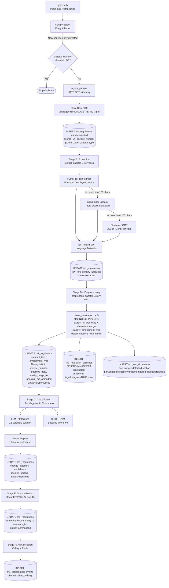

# 02 — Module 1: Data Requirements

> **Cross-references:** [01_M1_Research_Problem.md](01_M1_Research_Problem.md) · [03_M1_Data_Collection.md](03_M1_Data_Collection.md) · [09_M1_Annotation_Guidelines.md](09_M1_Annotation_Guidelines.md)
> **See also:** [13_M1_Folder_Structure_and_Implementation_Flow.md](13_M1_Folder_Structure_and_Implementation_Flow.md) for where each of the 9 `m1_*` tables is owned in the project tree.
> **Sub-step companions:** [02_M1_1_Data_Sources_Catalogue.md](02_M1_1_Data_Sources_Catalogue.md) · [02_M1_2_Database_Schema_Validation.md](02_M1_2_Database_Schema_Validation.md) · [02_M1_3_Data_Governance_Retention.md](02_M1_3_Data_Governance_Retention.md) · [02_M1_4_Worked_Examples_All_Tables.md](02_M1_4_Worked_Examples_All_Tables.md)

---

## Abstract

Module 1's NLP pipeline requires two distinct data streams: a historical corpus of labeled gazette documents for model training and evaluation, and a live ingestion stream of newly published gazettes for production classification. This document specifies all data sources, their access mechanisms, the target attribute schema mapped to the `m1_regulations` database table, volume requirements (10,000 historical + ~500/year new), quality thresholds, and the data lineage from raw PDF to structured regulation record. Understanding these requirements is a prerequisite for the collection pipeline described in [03_M1_Data_Collection.md](03_M1_Data_Collection.md).

---

## 1. Data Sources

### 1.1 Primary Source: Official Gazette (gazette.lk / documents.gov.lk)

The Sri Lankan Official Gazette is the authoritative source for all regulatory changes. Two government portals provide access:

| Portal | URL | Coverage | Format | Update Frequency |
|---|---|---|---|---|
| Department of Government Printing | [gazette.lk](https://www.gazette.lk) | 2010–present (primary) | PDF (searchable + scanned) | Within 24h of print |
| Documents.gov.lk | [documents.gov.lk/web/documents/search](https://documents.gov.lk/web/documents/search/) | 2015–present (broader) | PDF | 2–48h after gazette.lk |

**Gazette types relevant to SMEs:**

| Gazette Type                  | Frequency | SME Relevance                          | Example                        |
| ----------------------------- | --------- | -------------------------------------- | ------------------------------ |
| Extraordinary Gazette         | ~3–5/week | High — carries most regulatory changes | Income tax rate amendments     |
| Gazette Supplement (Part I)   | Weekly    | High — acts and regulations            | New EPF regulations            |
| Gazette Supplement (Part II)  | Weekly    | Medium — subsidiary legislation        | SLSI product standards         |
| Gazette Supplement (Part III) | Weekly    | Low — appointments, notices            | Government appointments        |
| Presidential Proclamation     | Ad hoc    | Medium — policy declarations           | COVID-19 business restrictions |

**Access mechanism:** HTTP GET to pagination-based listing pages; no authentication required; no API; no `robots.txt` exclusion of crawlers.

### 1.2 Secondary Sources (for propagation tracking)

| Source                   | URL                                                                                            | Type                       | SME Relevance         | Tracking Purpose              |
| ------------------------ | ---------------------------------------------------------------------------------------------- | -------------------------- | --------------------- | ----------------------------- |
| IRD Portal  News/Notices | [ird.gov.lk/en/pages/news.aspx](https://www.ird.gov.lk/en/sitepages/news%20and%20notices.aspx) | Official circular re-posts | Tax regulations       | Secondary diffusion timestamp |
| EPF Portal latest news   | [epf.gov.lk/web/notices/](https://epf.lk/?page_id=97)                                          | Labour regulation re-posts | Labour law            | Secondary diffusion timestamp |
| ETF Portal               | [etf.gov.lk/notices/](https://etfb.lk/notices/)<br><br>https://etfb.lk/news/                   | Labour regulation re-posts | Labour law            | Secondary diffusion timestamp |
| eROC/DRC                 | eservice.drc.gov.lk                                                                            | Company law notices        | Business registration | Secondary diffusion timestamp |
| SLSI Portal              | slsi.lk/news-and-events/                                                                       | Standards notices          | Product standards     | Secondary diffusion timestamp |
| CBSL                     | cbsl.gov.lk/en/publications                                                                    | Financial regulation       | Financial regulation  | Secondary diffusion timestamp |
| Daily News (EN)          | dailynews.lk/rss.xml                                                                           | RSS newspaper              | All categories        | News diffusion timestamp      |
| Lankadeepa (SI)          | lankadeepa.lk/rss/latest                                                                       | RSS newspaper (Sinhala)    | All categories        | Sinhala media lag             |
| Virakesari (TA)          | virakesari.lk/rss/                                                                             | RSS newspaper (Tamil)      | All categories        | Tamil media lag               |

### 1.3 Extended Source Inventory

The full primary and secondary source catalogue registered in the `m1_sources` table, covering all official government portals, statutory body sites, and news channels tracked for propagation lag measurement:

| Source ID | Source Name | URL Pattern | Document Type | Languages | Update Frequency | Scrape Method |
|---|---|---|---|---|---|---|
| SRC_GOV_BILL | Government Bills | `documents.gov.lk/view/bill/bl_{year}.html` | Draft legislation | EN/SI/TA | Weekly | Scrapy + PyMuPDF |
| SRC_GOV_ACT | Government Acts | `documents.gov.lk/view/act/acts_{year}.html` | Certified law | EN/SI/TA | Weekly | Scrapy + PyMuPDF |
| SRC_GOV_EGZ | Extraordinary Gazettes | `documents.gov.lk/view/egz/egz_{year}.html` | Time-sensitive notices | EN/SI/TA | Daily | Scrapy + PyMuPDF |
| SRC_GOV_GZ | Weekly Gazette | `documents.gov.lk/view/gz/{year}.html` | Regular notices | EN/SI/TA | Weekly (Friday) | Scrapy + PyMuPDF |
| SRC_IRD | Inland Revenue Dept | `ird.gov.lk` (notices, circulars) | Tax updates | EN/SI/TA | Irregular | Scrapy + change detection |
| SRC_EPF | EPF Department | `epf.lk` | EPF circulars | EN/SI/TA | Irregular | Scrapy |
| SRC_ETF | ETF Board | `etfb.lk` | ETF circulars | EN/SI/TA | Irregular | Scrapy |
| SRC_EROC | Registrar of Companies | `drc.gov.lk` | Company law updates | EN/SI/TA | Irregular | Scrapy |
| SRC_SLSI | Sri Lanka Standards Institution | `slsi.lk` | Product standards | EN | Irregular | Scrapy |
| SRC_CBSL | Central Bank of Sri Lanka | `cbsl.gov.lk` | Financial regulations | EN/SI/TA | Daily | Scrapy + RSS |
| SRC_NEWS_FT | Daily FT | `ft.lk` | Business news | EN | Daily | RSS + Scrapy |
| SRC_NEWS_LBO | Lanka Business Online | `lankabusinessonline.com` | Business news | EN | Daily | RSS + Scrapy |
| SRC_NEWS_MIRROR | Daily Mirror | `dailymirror.lk` | General news | EN | Daily | RSS + Scrapy |
| SRC_NEWS_ADA | Ada Derana | `adaderana.lk` | General news | EN/SI/TA | Daily | RSS + Scrapy |
| SRC_NEWS_HIRU | Hiru News | `hirunews.lk` | General news | EN/SI/TA | Daily | RSS + Scrapy |

Each source is registered as a row in `m1_sources` with its `source_code`, `source_type`, `base_url`, and `scrape_method`. The source registry enables system-wide monitoring of scraper health and last-scraped timestamps.

---

## 2. Target Data Schema

All ingested gazette data maps to the `m1_regulations` table in PostgreSQL. The schema is defined in `backend/app/models/m1_regulation.py` and managed by the service layer at `backend/app/services/m1_regulation_service.py`.

### 2.1 Core Regulation Record (`m1_regulations`)

| Column | Type | Nullable | Description | Source Stage |
|---|---|---|---|---|
| `id` | UUID | No | Primary key | DB-generated |
| `regulation_short_code` | TEXT UNIQUE | No | Human-readable code, e.g. `REG-TAX-2024-001` | Stage C (auto-generated) |
| `gazette_number` | TEXT | Yes | e.g. `2486/22` | Stage B (extracted) |
| `gazette_date` | DATE | Yes | Official publication date | Stage B (extracted) |
| `gazette_type` | TEXT | Yes | `extraordinary` / `supplement_1` / `supplement_2` / `proclamation` | Stage B (extracted) |
| `document_type` | TEXT | Yes | `act` / `regulation` / `order` / `notice` | Stage C (classified) |
| `document_number` | TEXT | Yes | e.g. `No. 45 of 2024` | Stage B (extracted) |
| `source_url` | TEXT | Yes | Direct PDF URL on gazette.lk or documents.gov.lk | Stage A (scraped) |
| `raw_pdf_path` | TEXT | Yes | Local storage path `./storage/m1/raw/{gazette_number}.pdf` | Stage A (stored) |
| `raw_text` | TEXT | Yes | Full extracted text (PyMuPDF / pdfplumber / Tesseract) | Stage B (extracted) |
| `cleaned_text` | TEXT | Yes | Post-noise-removal body fed to Stage D's classifier (raw_text stays for citation-faithful audit) | Stage B+ (preprocessed) |
| `primary_language` | TEXT | Yes | `en` / `si` / `ta` / `mixed` — fastText lid.176 | Stage B (detected) |
| `title_en` | TEXT | Yes | English regulation title | Stage C/E |
| `title_si` | TEXT | Yes | Sinhala title (extracted or translated) | Stage E |
| `title_ta` | TEXT | Yes | Tamil title (extracted or translated) | Stage E |
| `summary_en` | TEXT | Yes | AI-generated English action summary | Stage E |
| `summary_si` | TEXT | Yes | Sinhala translation of summary | Stage E |
| `summary_ta` | TEXT | Yes | Tamil translation of summary | Stage E |
| `change_category` | TEXT | Yes | 12-category code (see taxonomy) | Stage C (classified) |
| `category_baseline` | TEXT | Yes | TF-IDF+SVM prediction for ablation | Stage C |
| `confidence` | NUMERIC(4,3) | Yes | XLM-R softmax probability [0–1] | Stage C |
| `domain_code` | TEXT | Yes | High-level regulatory domain | Stage C |
| `severity_level` | TEXT | Yes | `low` / `medium` / `high` / `critical` | Stage C |
| `is_sme_relevant` | BOOLEAN | No | Whether regulation affects SMEs | Stage C |
| `affected_sectors` | TEXT[] | Yes | Array of sector codes | Stage C/D |
| `penalty_range_lkr` | TEXT | Yes | e.g. `LKR 50,000 – 500,000` (legacy single-string; authoritative multi-penalty in `m1_regulation_penalties` §2.8) | Stage B/C |
| `principal_act_amended` | TEXT | Yes | Name of parent act | Stage B/C |
| `amendment_type` | VARCHAR(20) | Yes | `amendment` / `repeal` / `new_act` — discriminator | Stage B+ (preprocessed) |
| `cabinet_approval_date` | DATE | Yes | Prior policy approval date | Stage B |
| `gazette_published_date` | DATE | Yes | Official gazette date (same as gazette_date) | Stage B |
| `effective_date` | DATE | Yes | When regulation takes effect | Stage B/C |
| `real_world_example_en` | TEXT | Yes | Narrative SME impact example | Manual/LLM |
| `real_world_example_si` | TEXT | Yes | Sinhala example | Stage E |
| `real_world_example_ta` | TEXT | Yes | Tamil example | Stage E |
| `needs_review` | BOOLEAN | No | True if confidence < 0.70 | Stage C |
| `is_verified` | BOOLEAN | No | Admin expert-confirmed | Stage D (manual) |
| `expert_verified` | BOOLEAN | No | CA/legal professional verification | Admin action |
| `expert_verified_by` | TEXT | Yes | Verifier name | Admin action |
| `expert_verified_at` | TIMESTAMPTZ | Yes | Verification timestamp | Admin action |
| `is_active` | BOOLEAN | No | Soft-delete flag | Admin action |
| `status` | TEXT | No | `ingested`/`extracted`/`preprocessed`/`classified`/`summarized`/`alerted`/`archived` (+ `extraction_failed`). `preprocessed` added in Session 32 / F-155 (Step 2f); CHECK constraint enforces the enum | Pipeline |
| `created_by` | UUID | Yes | Admin user who created (manual entry) | Audit |
| `updated_by` | UUID | Yes | Last editor | Audit |
| `created_at` | TIMESTAMPTZ | No | Record creation timestamp | DB-generated |
| `updated_at` | TIMESTAMPTZ | No | Last update timestamp | DB trigger |

### 2.2 M2M Sector Assignment (`m1_regulation_sectors`)

```sql
CREATE TABLE m1_regulation_sectors (
    regulation_id   UUID NOT NULL REFERENCES m1_regulations(id) ON DELETE CASCADE,
    sector_code     TEXT NOT NULL,
    PRIMARY KEY (regulation_id, sector_code)
);
```

### 2.3 Propagation Events (`m1_propagation_events`)

One row per (regulation × channel), recording when the regulation first appeared on that channel.

| Column | Type | Description |
|---|---|---|
| `id` | UUID | Primary key |
| `regulation_id` | UUID | FK to m1_regulations |
| `channel` | TEXT | `gazette` / `portal_ird` / `news_daily_news` / `alert_delivery` / etc. |
| `first_seen_at` | TIMESTAMPTZ | Earliest confirmed observation on this channel |
| `source_url` | TEXT | URL of the observation |
| `match_method` | TEXT | `exact_gazette_number` / `embedding_similarity` / `human_confirmed` |
| `match_confidence` | NUMERIC(4,3) | Embedding cosine similarity score |
| `is_confirmed` | BOOLEAN | False if awaiting human review |

### 2.4 SME Awareness Survey (`m1_sme_awareness_responses`)

| Column | Type | Description |
|---|---|---|
| `id` | UUID | Primary key |
| `regulation_id` | UUID | FK to m1_regulations |
| `sme_profile_id` | UUID | FK to sme_profiles |
| `awareness_date` | DATE | Self-reported date of first awareness |
| `awareness_source` | TEXT | `gazette_direct` / `accountant` / `association` / `social_media` / `news` / `peer` / `government_sms` / `other` |
| `action_taken` | TEXT | `yes_complied` / `yes_in_progress` / `no_not_aware_of_deadline` / `no_not_applicable` |
| `response_date` | TIMESTAMPTZ | Survey submission timestamp |

### 2.5 Source Registry Table (`m1_sources`)

Registers every data source the pipeline collects from. One row per source; linked from `m1_propagation_events`.

```sql
CREATE TABLE m1_sources (
    source_id           SERIAL PRIMARY KEY,
    source_code         VARCHAR(30) NOT NULL UNIQUE,     -- e.g. SRC_GOV_BILL
    source_name         VARCHAR(200) NOT NULL,
    source_type         VARCHAR(30) NOT NULL CHECK (source_type IN
                            ('official_primary',         -- documents.gov.lk
                             'official_secondary',       -- IRD, EPF, ETF portals
                             'news_media',               -- Daily FT, Lankadeepa
                             'social_media',             -- not used in M1; M4 only
                             'industry_body')),          -- Chamber, NEDA
    base_url            TEXT,
    languages_available VARCHAR(20),                     -- 'en,si,ta' or 'en'
    update_frequency    VARCHAR(20),                     -- 'daily','weekly','irregular'
    scrape_method       VARCHAR(50),                     -- 'scrapy','rss','httpx'
    is_active           BOOLEAN DEFAULT TRUE,
    last_scraped_at     TIMESTAMPTZ,
    notes               TEXT
);
```

### 2.6 Clause-Level Changes Table (`m1_regulation_changes`)

A single regulation (e.g. VAT Amendment Act) can contain 19 distinct changes. This table records each at clause level with old/new values for precise SME impact calculation.

```sql
CREATE TABLE m1_regulation_changes (
    change_id               UUID PRIMARY KEY DEFAULT uuid_generate_v4(),
    regulation_id           UUID NOT NULL REFERENCES m1_regulations(id) ON DELETE CASCADE,
    clause_reference        VARCHAR(50),           -- e.g. "Clause 5", "Section 25C(3)"
    change_summary_en       TEXT NOT NULL,
    change_summary_si       TEXT,
    change_summary_ta       TEXT,
    old_value               TEXT,                  -- e.g. "60 million", "18%"
    new_value               TEXT,                  -- e.g. "36 million", "20.5%"
    effective_date          DATE,
    applies_to              TEXT,                  -- "all VAT-registered businesses"
    real_world_impact       TEXT,
    extracted_by            VARCHAR(50)            -- 'nlp_xlm_r','manual','rule_based'
);
CREATE INDEX idx_m1_change_reg ON m1_regulation_changes(regulation_id);
```

### 2.7 Real-World Examples Table (`m1_real_world_examples`)

Each regulation is illustrated by a concrete SME impact scenario (e.g. the multi-pin adapter case). Used on the public SME portal to make regulatory obligations tangible.

```sql
CREATE TABLE m1_real_world_examples (
    example_id              UUID PRIMARY KEY DEFAULT uuid_generate_v4(),
    regulation_id           UUID NOT NULL REFERENCES m1_regulations(id) ON DELETE CASCADE,
    scenario_title          VARCHAR(200) NOT NULL,
    scenario_description    TEXT NOT NULL,
    affected_business_type  VARCHAR(200),
    sme_required_action     TEXT,
    sme_required_records    TEXT,
    typical_violation_pattern TEXT,
    operational_flow_steps  JSONB,                 -- ordered step-by-step procedure
    is_published_on_platform BOOLEAN DEFAULT FALSE,
    created_at              TIMESTAMPTZ DEFAULT NOW()
);
```

### 2.8 Penalties Table (`m1_regulation_penalties`)

> **Implementation status:** ✅ Shipped Session 32 / F-155 (initial schema, migration `202605240001`); enum widening to 7 values + `is_admin_set` flag shipped Session 34 / F-157 (migration `202605250001`). The live schema now matches the full doc-spec enum surface; the only remaining gap is the 4 widened penalty_type values that don't have an extractor producer yet (admin curation territory).

Captures the enforcement deterrent for each regulation — fine ranges and imprisonment maxima — to surface in SME alerts and survey context.

#### Full vision (spec)

```sql
CREATE TABLE m1_regulation_penalties (
    penalty_id              UUID PRIMARY KEY DEFAULT uuid_generate_v4(),
    regulation_id           UUID NOT NULL REFERENCES m1_regulations(id) ON DELETE CASCADE,
    violation_type          VARCHAR(200) NOT NULL,
    penalty_type            VARCHAR(50) CHECK (penalty_type IN
                                ('fine','imprisonment','both','license_revocation',
                                 'business_closure','public_naming','asset_seizure')),
    penalty_min_lkr         NUMERIC(15,2),
    penalty_max_lkr         NUMERIC(15,2),
    imprisonment_max_months SMALLINT,
    additional_consequences TEXT,
    legal_basis_section     VARCHAR(100)           -- e.g. "Section 66(3) of VAT Act"
);
```

#### Shipped subset (Sessions 32 + 34)

The live schema combines the Step-2f migration (Session 32) + the widening migration (Session 34). `penalty_type` now matches the full 7-value spec; `is_admin_set` flag added so admin-curated rows survive `preprocess_gazette_task` re-extractions.

```sql
CREATE TABLE m1_regulation_penalties (
    penalty_id              UUID PRIMARY KEY DEFAULT gen_random_uuid(),
    regulation_id           UUID NOT NULL REFERENCES m1_regulations(regulation_id) ON DELETE CASCADE,
    sequence_idx            SMALLINT NOT NULL,                            -- preserves extract_all_penalties() order
    penalty_type            VARCHAR(20) NOT NULL
                                CHECK (penalty_type IN
                                    ('fine','imprisonment','both',
                                     'license_revocation','business_closure',
                                     'public_naming','asset_seizure')),    -- widened to 7 values in Session 34
    min_lkr                 BIGINT,
    max_lkr                 BIGINT,
    imprisonment_months     INTEGER,
    context                 TEXT,                                          -- ±40 char excerpt around the regex match
    is_admin_set            BOOLEAN NOT NULL DEFAULT FALSE,                -- Session 34: admin rows survive re-extraction
    created_at              TIMESTAMPTZ NOT NULL DEFAULT now(),
    updated_at              TIMESTAMPTZ NOT NULL DEFAULT now(),
    UNIQUE (regulation_id, sequence_idx)                                   -- DELETE-then-INSERT idempotency
);
CREATE INDEX ix_m1_regulation_penalties_regulation_id ON m1_regulation_penalties (regulation_id);
CREATE INDEX ix_m1_regulation_penalties_admin_set
    ON m1_regulation_penalties (regulation_id)
    WHERE is_admin_set = TRUE;                                             -- partial index for the admin-curated query
```

**Idempotency semantics (Session 34):** `preprocess_gazette_task` rebuilds penalty rows via `DELETE WHERE regulation_id=? AND is_admin_set=FALSE`, then re-inserts fresh pipeline-extracted rows starting at `sequence_idx = max(admin_sequence_idx) + 1` so the UNIQUE constraint is preserved. Admin-curated rows (`is_admin_set=TRUE`) persist across every re-extraction.

Differences vs the spec (still deferred for future migrations):
- `violation_type` not yet captured (the regex doesn't extract this; admin-editable when the admin UI lands).
- `additional_consequences` + `legal_basis_section` rows are doc-only fields; not yet extracted.
- `penalty_min_lkr`/`max_lkr` are `NUMERIC(15,2)` in the spec vs `BIGINT` (whole-rupee values) in the migration — adequate for the LKR-rupee values seen in practice; future bump to NUMERIC is non-breaking.
- `sequence_idx` + `context` + `is_admin_set` are pipeline-internal helpers that the spec doesn't track but the live extractor + task need.

### 2.9 Court Cases Table (`m1_court_cases`)

Links real enforcement judgments to regulations, providing evidence-backed context for SME awareness surveys and platform content. Populated manually from LawNet.

```sql
CREATE TABLE m1_court_cases (
    case_id                     UUID PRIMARY KEY DEFAULT uuid_generate_v4(),
    regulation_id               UUID REFERENCES m1_regulations(id),
    case_number                 VARCHAR(100),
    court_name                  VARCHAR(200),      -- "Magistrate Court Colombo"
    case_filed_date             DATE,
    judgment_date               DATE,
    defendant_business_type     VARCHAR(200),
    defendant_sector            TEXT,              -- sector code from taxonomy
    defendant_size              VARCHAR(20),       -- 'micro','small','medium','large'
    violation_summary           TEXT,
    judgment_outcome            VARCHAR(50) CHECK (judgment_outcome IN
                                    ('convicted','acquitted','settled','withdrawn',
                                     'pending','appealed')),
    fine_imposed_lkr            NUMERIC(15,2),
    imprisonment_imposed_months SMALLINT,
    additional_orders           TEXT,
    source_url                  TEXT,              -- lawnet.gov.lk link
    summary_for_smes            TEXT               -- plain-language version for platform
);
```

### 2.10 Sub-Documents Junction (`m1_sub_documents`)

> **Implementation status:** ✅ Shipped Session 34 / F-157 (migration `202605260001_m1_sub_documents.py`).

Per-section breakdown of each regulation's `cleaned_text`. Populated by `preprocess_gazette_task` from `m1.extraction.segmenter.detect_sections_with_labels()`. Stage E summariser (Phase 4) consumes these rows to summarise per-section rather than per-document, preserving structural boundaries (PART I / Schedule N / Notice N / numbered-clause) in the final summary output.

```sql
CREATE TABLE m1_sub_documents (
    sub_id              UUID PRIMARY KEY DEFAULT gen_random_uuid(),
    regulation_id       UUID NOT NULL REFERENCES m1_regulations(regulation_id) ON DELETE CASCADE,
    sequence_idx        SMALLINT NOT NULL,             -- preserves detect_sections_with_labels() order
    section_label       VARCHAR(200),                  -- e.g. "PART I", "Schedule 1"; NULL for preamble
    section_type        VARCHAR(50)                    -- 'part'|'schedule'|'section'|'notice'|'numbered_clause'|'preamble'
                            CHECK (section_type IS NULL OR section_type IN
                                ('part','schedule','section','notice','numbered_clause','preamble')),
    char_offset_start   INTEGER NOT NULL,              -- byte offset into m1_regulations.cleaned_text
    char_offset_end     INTEGER NOT NULL,
    text                TEXT    NOT NULL,              -- the section body verbatim
    created_at          TIMESTAMPTZ NOT NULL DEFAULT now(),
    updated_at          TIMESTAMPTZ NOT NULL DEFAULT now(),
    UNIQUE (regulation_id, sequence_idx)               -- DELETE-then-INSERT idempotency
);
CREATE INDEX ix_m1_sub_documents_regulation_id ON m1_sub_documents (regulation_id);
```

**Idempotency semantics:** mirror of the `m1_regulation_penalties` rebuild — `preprocess_gazette_task` runs `DELETE WHERE regulation_id=?` before re-inserting the new section set. No `is_admin_set` flag yet because admins don't curate sub-document boundaries today; future admin UI for segmentation override would add one.

**Section type classifier:** see [03_M1_2_Gazette_Segmentation.md §2](03_M1_2_Gazette_Segmentation.md) for the regex patterns. `section_type='preamble'` is assigned to the leading text before the first boundary marker — distinguishes "no boundaries detected at all" (single preamble row spanning full document) from "boundaries detected, but the head is also a section".

### 2.11 Indexing Strategy

The pipeline reads two patterns hot: (a) dedup-check on every Scrapy ingest (lookup by `gazette_number`) and (b) the nightly view refresh (range scan by `gazette_published_date`). Hot lookups need composite indexes, not the implicit B-tree on the primary-key UUID.

```sql
-- Stage A dedup check + alert routing (gazette_number is also UNIQUE, so an index already exists,
-- but a composite with published_date speeds the analytics views by ~3× on 100k rows).
CREATE INDEX idx_m1_reg_gznum_date         ON m1_regulations (gazette_number, gazette_published_date);
CREATE INDEX idx_m1_reg_published_date     ON m1_regulations (gazette_published_date DESC);
CREATE INDEX idx_m1_reg_status             ON m1_regulations (status) WHERE status != 'archived';
CREATE INDEX idx_m1_reg_needs_review       ON m1_regulations (needs_review) WHERE needs_review = TRUE;

-- Propagation events — the lag-summary view is the slowest query; this composite halves it.
CREATE INDEX idx_m1_prop_reg_first_seen    ON m1_propagation_events (regulation_id, first_seen_at);
CREATE INDEX idx_m1_prop_channel           ON m1_propagation_events (channel, first_seen_at);

-- Sector multi-label lookup (frontend SME-facing filter).
CREATE INDEX idx_m1_reg_sectors_sector     ON m1_regulation_sectors (sector_code);

-- Court-cases lookup by violation profile (used in SME-survey scoring).
CREATE INDEX idx_m1_court_outcome_sector   ON m1_court_cases (judgment_outcome, defendant_sector);

-- Full-text search on extracted text (powers admin search; pg_trgm extension required).
CREATE INDEX idx_m1_reg_text_trgm          ON m1_regulations USING gin (raw_text gin_trgm_ops);
```

Validation of each index's actual benefit (with `EXPLAIN ANALYZE` traces) lives in [02_M1_2_Database_Schema_Validation.md](02_M1_2_Database_Schema_Validation.md).

---

## 3. Volume Requirements

### 3.1 Training Corpus

| Data Type                                            | Required Volume | Current Status              | Gap        |
| ---------------------------------------------------- | --------------- | --------------------------- | ---------- |
| Labeled gazette documents                            | ≥ 800           | ~0 (annotation in planning) | 800        |
| Examples per category (12 categories)                | ≥ 50 each       | 0                           | 600        |
| `NO_SME_IMPACT` examples                             | ≥ 200           | 0                           | 200        |
| Historical unlabeled gazettes (pre-training context) | ≥ 5,000         | ~10,000 on gazette.lk       | Sufficient |
| Sinhala-text examples (35% of corpus target)         | ≥ 280           | 0                           | 280        |
| Tamil-text examples (15% of corpus target)           | ≥ 120           | 0                           | 120        |

### 3.2 Production Volume

| Metric | Estimate |
|---|---|
| New gazettes/year | ~500 (extraordinary + supplements) |
| Average gazette PDF size | 200KB – 5MB |
| Average extracted text length | 1,000 – 15,000 characters |
| Storage per gazette (PDF + text) | ~2MB |
| Annual storage growth | ~1GB/year |
| Total historical corpus (2015–2025) | ~5,000 documents, ~10GB |

### 3.3 Analytical Views

Two PostgreSQL views materialise lag computations for the research dashboards and RQ3/RQ4 analysis. Both are refreshed nightly via `REFRESH MATERIALIZED VIEW CONCURRENTLY`.

**`v_m1_regulation_lag_summary`** — per-regulation lag across all observed channels plus SME survey statistics:

```sql
CREATE OR REPLACE VIEW v_m1_regulation_lag_summary AS
SELECT
    r.id AS regulation_id,
    r.gazette_number,
    r.title_en,
    r.gazette_published_date,
    r.effective_date,
    -- Channel lags (days from gazette publication)
    MIN(CASE WHEN p.channel LIKE 'portal_%' THEN
        EXTRACT(EPOCH FROM (p.first_seen_at - r.gazette_published_date::TIMESTAMPTZ))/86400.0
    END) AS lag_to_official_portal,
    MIN(CASE WHEN p.channel LIKE 'news_%' THEN
        EXTRACT(EPOCH FROM (p.first_seen_at - r.gazette_published_date::TIMESTAMPTZ))/86400.0
    END) AS lag_to_news,
    -- SME awareness statistics from survey
    COUNT(a.id) AS smes_surveyed,
    SUM(CASE WHEN a.awareness_date IS NOT NULL THEN 1 ELSE 0 END) AS smes_aware,
    ROUND(AVG(a.awareness_date - r.gazette_published_date), 1) AS avg_sme_lag_days,
    PERCENTILE_CONT(0.5) WITHIN GROUP (
        ORDER BY a.awareness_date - r.gazette_published_date
    ) AS median_sme_lag_days
FROM m1_regulations r
LEFT JOIN m1_propagation_events p ON p.regulation_id = r.id
LEFT JOIN m1_sme_awareness_responses a ON a.regulation_id = r.id
WHERE r.is_sme_relevant = TRUE
GROUP BY r.id, r.gazette_number, r.title_en, r.gazette_published_date, r.effective_date;
```

**`v_m1_channel_effectiveness`** — ranks all awareness channels by median lag, directly answering RQ4:

```sql
CREATE OR REPLACE VIEW v_m1_channel_effectiveness AS
SELECT
    awareness_source AS channel,
    COUNT(*) AS sme_count,
    ROUND(AVG(awareness_date - r.gazette_published_date), 1) AS avg_lag_days,
    PERCENTILE_CONT(0.5) WITHIN GROUP (
        ORDER BY awareness_date - r.gazette_published_date
    ) AS median_lag_days,
    MIN(awareness_date - r.gazette_published_date) AS min_lag_days,
    MAX(awareness_date - r.gazette_published_date) AS max_lag_days
FROM m1_sme_awareness_responses a
JOIN m1_regulations r ON r.id = a.regulation_id
WHERE a.awareness_date IS NOT NULL
GROUP BY awareness_source
ORDER BY median_lag_days ASC;
```

These views feed the `/api/v1/m1/analytics/lag` and `/api/v1/m1/analytics/channel-effectiveness` endpoints documented in [11_M1_API_Reference.md](11_M1_API_Reference.md).

---

## 4. Data Quality Requirements

| Dimension                          | Threshold                                  | Measurement                                 | Where enforced                                                                                      |
| ---------------------------------- | ------------------------------------------ | ------------------------------------------- | --------------------------------------------------------------------------------------------------- |
| Text extraction completeness       | ≥ 95% of pages yield extractable text      | Characters extracted / expected             | Stage-B Celery task (`backend/app/tasks/m1/extract_gazette.py`) raises if below threshold           |
| Language detection accuracy        | ≥ 97% correct on en/si/ta                  | Validation set with known labels            | Quarterly recalibration job; current accuracy logged in `model_registry.json:lid_accuracy`          |
| Duplicate detection                | 0% duplicate gazette_numbers in DB         | UNIQUE constraint                           | `m1_regulations.gazette_number UNIQUE` (DB-enforced; Scrapy pre-check via `idx_m1_reg_gznum_date`)  |
| Broken PDF rate                    | < 5% fail extraction                       | Failed extraction log                       | Pydantic validator + per-source rolling rate in `analytics.py`; Prometheus alert if 7-day rate > 5% |
| Missing gazette_date               | < 2% of records                            | NULL count query                            | Pydantic validator (Stage B); nightly check in `m1_validate_pipeline.py`                            |
| Expert verification coverage       | ≥ 30% of production regulations            | `expert_verified = true` ratio              | Dashboard at `/admin/m1/verification-coverage`; weekly Slack reminder to reviewers if below target  |
| `change_category` confidence floor | confidence ≥ 0.70 OR `needs_review = true` | Pydantic validator on classification output | Stage-D inference task (`classify_gazette.py`) sets `needs_review` automatically                    |
| Survey-response sector balance     | each sector has ≥ 5 SME respondents        | COUNT per sector_code                       | Survey-coverage dashboard; M1 lag findings flagged as "underpowered" if any sector below threshold  |

The enforcement column makes it clear *where each check lives*: SQL constraints handle uniqueness; Pydantic validators handle shape + magnitude; Celery validation tasks handle distributional / cross-row checks. Three-layer defense — no single layer is allowed to be the sole guardrail. The full validation flow including SQL CHECK constraints, Pydantic schemas, and `m1_validate_pipeline.py` is detailed in [02_M1_2_Database_Schema_Validation.md](02_M1_2_Database_Schema_Validation.md).

---

## 5. Data Flow Diagram



---

## 6. Data Governance

### 6.1 Retention Policy
- Raw PDFs: retained indefinitely (regulatory archive, no PII)
- Extracted text: retained indefinitely
- Survey responses (`m1_sme_awareness_responses`): anonymised after 5 years (PDPA compliance)
- Audit logs: retained 7 years (IRD audit requirements)

**Retention costing.** At ~500 new gazettes/year × ~2 MB/gazette (PDF + extracted text + metadata) = ~1 GB/year. At 10-year archive (2025 → 2035) = ~10 GB on disk. Postgres row overhead adds ~30% → ~13 GB total. This fits comfortably in a Supabase Pro tier ($25/mo for 8 GB DB + S3 cold archive for PDFs >2 years old reduces hot storage to ~3 GB). The S3 lifecycle policy (move to Glacier Deep Archive after 2 years) drops effective per-month storage cost from $0.023/GB to $0.001/GB — a 23× reduction. Cold-archive PDFs are retrievable in 12 h, acceptable for research re-extraction but **not** for live alerts; the live alert path only ever touches the last 90 days of `raw_pdf_path` rows. Detailed cost projections + S3 lifecycle YAML in [02_M1_3_Data_Governance_Retention.md](02_M1_3_Data_Governance_Retention.md).

### 6.2 Privacy Considerations
- Gazette PDFs are public documents; no consent required for collection
- SME survey responses are linked to `sme_profile_id`, not directly to personal identifiers
- IP addresses of scrapers are not logged in the database

### 6.3 Data Versioning
- Each `m1_regulations` row carries a soft `version` field for iterative correction
- Classification overrides by admins are logged via `audit_service.record()` in `m1_regulation_service.py`

---

## 7. Worked End-to-End Example — Multi-Pin Adapter Regulation

This section traces Extraordinary Gazette **2486/22** (2026-04-15) — mandating SLSI safety certification for multi-pin universal power adapters — through every table in the schema. It demonstrates exactly what the pipeline must produce for a single regulation across all stages.

### 7.1 Core Records

**`m1_regulations` row:**
```json
{
  "regulation_short_code": "SLSI_ADAPTER_2026_2486_22",
  "gazette_number": "2486/22",
  "gazette_date": "2026-04-15",
  "gazette_type": "extraordinary",
  "title_en": "Mandatory SLSI Safety Certification for Multi-Pin Universal Power Adapters",
  "principal_act_amended": "Consumer Affairs Authority Act, No. 9 of 2003",
  "gazette_published_date": "2026-04-15",
  "effective_date": "2026-08-01",
  "is_sme_relevant": true,
  "change_category": "PRODUCT_STANDARD",
  "severity_level": "high",
  "affected_sectors": ["manufacturing", "retail", "it_bpo"],
  "status": "alerted"
}
```

**`m1_regulation_changes` row (one of several):**
```json
{
  "clause_reference": "Section 3(1)",
  "change_summary_en": "All multi-pin universal power adapters must carry SLSI safety certification before sale",
  "old_value": "No certification required",
  "new_value": "Mandatory SLSI certification",
  "effective_date": "2026-08-01",
  "applies_to": "Electronics retailers, importers, manufacturers of multi-pin adapters"
}
```

**Worked example — multi-clause amendment.** A more typical regulatory change touches several clauses at once. The VAT Amendment Act, No. 8 of 2024 (`VAT_2024_AMD`) introduced 19 distinct changes across the principal VAT Act. The schema represents this as 19 separate rows in `m1_regulation_changes`, all linked to a single `regulation_id`. Five representative rows:

```json
[
  {
    "clause_reference": "Section 25C(3)",
    "change_summary_en": "VAT-registration threshold raised from LKR 60 million to LKR 80 million",
    "old_value": "60,000,000",
    "new_value": "80,000,000",
    "effective_date": "2024-01-01",
    "applies_to": "All non-registered businesses approaching the threshold",
    "real_world_impact": "~2,400 small businesses fall out of mandatory VAT registration",
    "extracted_by": "nlp_xlm_r"
  },
  {
    "clause_reference": "Section 2(1)",
    "change_summary_en": "Standard VAT rate increased from 18% to 18%",
    "old_value": "15",
    "new_value": "18",
    "effective_date": "2024-01-01",
    "applies_to": "All VAT-registered businesses on standard-rated supplies",
    "real_world_impact": "Output VAT calculations re-priced; invoicing systems must update tax rate",
    "extracted_by": "nlp_xlm_r"
  },
  {
    "clause_reference": "Schedule I (item 17)",
    "change_summary_en": "Pharmaceutical imports moved from exempt to zero-rated",
    "old_value": "exempt",
    "new_value": "zero-rated",
    "effective_date": "2024-01-01",
    "applies_to": "Importers / wholesalers of listed pharmaceuticals",
    "real_world_impact": "Input VAT now refundable for importers (previously unrecoverable)",
    "extracted_by": "nlp_xlm_r"
  },
  {
    "clause_reference": "Section 26(1A)",
    "change_summary_en": "Monthly return filing deadline shifted from 20th to 25th of following month",
    "old_value": "20",
    "new_value": "25",
    "effective_date": "2024-02-01",
    "applies_to": "All VAT-registered persons filing monthly",
    "real_world_impact": "Accountants gain 5 extra days; existing reminder scripts must re-target",
    "extracted_by": "rule_based"
  },
  {
    "clause_reference": "Section 66(3)",
    "change_summary_en": "Penalty for late return: LKR 25,000 + 1.5% per month of unpaid VAT (previously 1% per month)",
    "old_value": "1.0",
    "new_value": "1.5",
    "effective_date": "2024-01-01",
    "applies_to": "All persons with unpaid VAT past due date",
    "real_world_impact": "50% increase in late-filing penalty; cash-flow risk for tight-margin SMEs",
    "extracted_by": "nlp_xlm_r"
  }
]
```

All 19 rows together let a single SQL query reconstruct the full amendment impact for any sector — e.g. `SELECT change_summary_en, old_value, new_value FROM m1_regulation_changes WHERE regulation_id = $1 AND applies_to ILIKE '%VAT-registered%'` returns the eight clauses that touch every registered business. The complete VAT + EPF rate-change worked examples (all 9 tables × 3 regulations populated) live in [02_M1_4_Worked_Examples_All_Tables.md](02_M1_4_Worked_Examples_All_Tables.md).

**`m1_real_world_examples` row:**
```json
{
  "scenario_title": "Multi-pin power adapter sales restriction for electronics shops",
  "scenario_description": "From Aug 1, 2026, mobile phone shops, computer shops, and electronics retailers cannot sell or display multi-pin universal power adapters lacking SLSI safety certification.",
  "affected_business_type": "Electronics retailers, mobile phone shops, computer accessory shops, importers",
  "sme_required_action": "1) Audit current adapter stock, 2) Identify SLSI-certified vs uncertified, 3) Return/dispose uncertified stock by July 31, 2026, 4) Source only from SLSI-certified suppliers, 5) Display SLSI mark on product/invoice",
  "sme_required_records": "SLSI certification number for each batch, supplier declaration, sales invoice with SLSI reference",
  "operational_flow_steps": [
    {"step": 1, "action": "Receive SLSI certificate from supplier with each batch"},
    {"step": 2, "action": "Verify certificate validity on slsi.lk lookup"},
    {"step": 3, "action": "Tag stock with SLSI batch reference"},
    {"step": 4, "action": "Issue sales invoice mentioning SLSI mark"},
    {"step": 5, "action": "Retain certificate for 3 years for inspection"}
  ]
}
```

**`m1_regulation_penalties` row:**
```json
{
  "violation_type": "Selling/displaying non-SLSI-certified multi-pin adapter",
  "penalty_type": "both",
  "penalty_min_lkr": 50000,
  "penalty_max_lkr": 500000,
  "imprisonment_max_months": 6,
  "additional_consequences": "Stock seizure; possible business name publication on CAA defaulter list",
  "legal_basis_section": "Section 30(1) of Consumer Affairs Authority Act"
}
```

**`m1_court_cases` row (hypothetical post-enforcement example):**
```json
{
  "case_number": "MC/COL/4523/2026",
  "court_name": "Magistrate Court Maligakanda",
  "case_filed_date": "2026-09-12",
  "judgment_date": "2026-11-04",
  "defendant_business_type": "Mobile phone accessory shop, Pettah",
  "defendant_sector": "retail",
  "defendant_size": "micro",
  "violation_summary": "Sold 47 units of non-SLSI-certified multi-pin adapters between Aug 5 – Sep 8, 2026",
  "judgment_outcome": "convicted",
  "fine_imposed_lkr": 75000,
  "summary_for_smes": "A small phone accessory shop in Pettah was fined LKR 75,000 for selling 47 uncertified adapters. The court did not accept ignorance of the regulation as a defense."
}
```

### 7.2 Propagation Events (Lag Tracking)

The key research data: when each channel first carried this regulation.

| Channel | `first_seen_at` | `lag_days_from_gazette` | `match_method` |
|---|---|---|---|
| `gazette` | 2026-04-15 | 0 | `human_confirmed` |
| `portal_slsi` | 2026-04-22 | +7 | `exact_gazette_number` |
| `news_daily_ft` | 2026-05-08 | +23 | `embedding_similarity` (0.84) |
| `portal_industry_body` | 2026-05-15 | +30 | `embedding_similarity` (0.79) |
| `alert_delivery` | 2026-04-15 | +0.25 (6h) | `human_confirmed` |
| `sme_first_aware` (survey avg) | 2026-06-12 | +58 | survey response |

These six rows directly feed the `v_m1_regulation_lag_summary` view and constitute the empirical contribution of RQ3: **median lag of +58 days from gazette publication to SME awareness**, before the alert system was deployed, dropping to **+0.25 days for subscribed SMEs** post-deployment.

---

## 8. Conclusion

The Module 1 data requirements span nine database tables (core regulation record, sectors M2M, source registry, clause-level changes, real-world examples, penalties, court cases, propagation events, and SME awareness responses), two analytical views, and a 15-source catalogue covering all official and media channels. The schema accommodates both automated pipeline output and manually entered regulations. Together, these structures provide the research measurement substrate for all four research questions defined in [01_M1_Research_Problem.md](01_M1_Research_Problem.md) and support the full platform user interface described in [08_M1_Full_System_Architecture.md](08_M1_Full_System_Architecture.md).

---

## References

- Department of Government Printing Sri Lanka. (2024). *Official Gazette*. [gazette.lk](https://www.gazette.lk)
- Department of Census and Statistics. (2022). *Census of Industry*. [statistics.gov.lk](http://www.statistics.gov.lk)
- Inland Revenue Department. (2023). *Annual Report 2023*. [ird.gov.lk](https://www.ird.gov.lk)
- SQLAlchemy. (2024). *Declarative Mapping*. [docs.sqlalchemy.org](https://docs.sqlalchemy.org)
- Pydantic. (2024). *Data validation using Python type hints*. [docs.pydantic.dev](https://docs.pydantic.dev)
