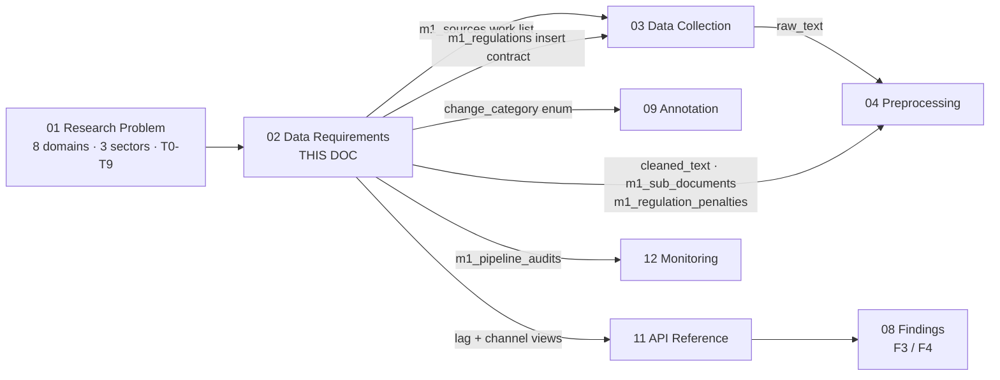
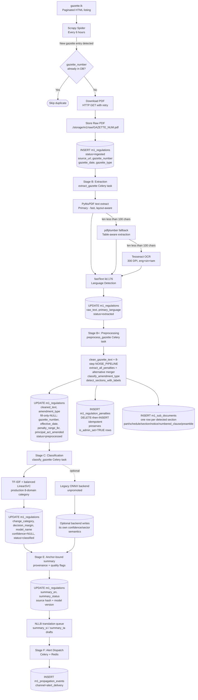

# 02 — Module 1: Data Requirements

> **Cross-references:** [01_M1_Research_Problem.md](01_M1_Research_Problem.md) · [03_M1_Data_Collection.md](03_M1_Data_Collection.md) · [04_M1_Preprocessing_Pipeline.md](04_M1_Preprocessing_Pipeline.md) · [09_M1_Annotation_Guidelines.md](09_M1_Annotation_Guidelines.md) · [11_M1_API_Reference.md](11_M1_API_Reference.md) · [12_M1_Monitoring_Maintenance.md](12_M1_Monitoring_Maintenance.md)
> **Code map:** [13_M1_Folder_Structure_and_Implementation_Flow.md](13_M1_Folder_Structure_and_Implementation_Flow.md) — where each of the 9 `m1_*` tables is owned in the project tree
> **Consolidation note (2026-07-29):** this document now carries the full content previously split across `02_M1_1_Data_Sources_Catalogue`, `02_M1_2_Database_Schema_Validation`, `02_M1_3_Data_Governance_Retention`, and `02_M1_4_Worked_Examples_All_Tables`. Those four files have been retired; every per-source operations row, CHECK constraint, Pydantic validator, `EXPLAIN ANALYZE` trace, retention rule, S3 lifecycle rule, worked example, and as-shipped build note from them lives below.

> [!warning] Truth-ledger sync — 2026-08-02
> The 9 `m1_*` table schemas here are current, but **two classifier columns were added after this document was written** and must be treated as part of the contract:
> `classifier_decision_margin numeric(10,6) NULL` and `classifier_model_name varchar(64) NULL`, added by migration `202608010001` and verified live on Supabase.
> `classifier_confidence numeric(3,2)` was **deliberately left unchanged and is now nullable in practice** — it is written only when the dormant `onnx` backend classifies a row.
>
> **Canonical record:** [[final/works/11_CLASSIFIER_FREEZE_AND_INTEGRATION|11_CLASSIFIER_FREEZE_AND_INTEGRATION]] · [[18_M1_Dataset_And_Model_Lineage]] · `final/works/evidence/M1_OPERATING_EVIDENCE_2026-08-02.json`
> **Submitted-report copy:** [[final/report/Enigmatrix_Consolidated_Final_Report_FULL|Enigmatrix_Consolidated_Final_Report_FULL]] (Part I = group report, Part II = Module 1 dissertation).

---

## 0. Where This Document Sits in the Pipeline

This document is the contract layer of Module 1. It sits between a research problem stated in prose and a pipeline that has to write rows. Everything upstream is a *requirement*; everything downstream is an *insert*. If a field is not specified here, no later stage can produce it, and no research question can be answered from it.

| | Stage | Produced by | What this document does with it | Handed to |
|---|---|---|---|---|
| **In** | 8 regulatory domains | [01_M1_Research_Problem.md](01_M1_Research_Problem.md) §4 scope | Becomes the `m1_regulations.change_category` value set, enforced by a CHECK constraint (§3.2) | — |
| **In** | 3 study sectors | [01_M1_Research_Problem.md](01_M1_Research_Problem.md) §4 scope | Becomes `m1_regulations.affected_sectors` plus the `m1_regulation_sectors` M2M table (§2.2) | — |
| **In** | Diffusion stages T0–T9 | [01_M1_Research_Problem.md](01_M1_Research_Problem.md) §8 | Becomes `m1_propagation_events.channel` + `first_seen_at`, one row per regulation × channel (§2.3) | — |
| **In** | Source boundary — gazette.lk, documents.gov.lk, 2015–present | [01_M1_Research_Problem.md](01_M1_Research_Problem.md) §4 | Expanded into the 15-row `m1_sources` registry with per-source cadence, auth, failure mode, fallback (§1.3–§1.4) | — |
| **In** | Volume and quality targets | [01_M1_Research_Problem.md](01_M1_Research_Problem.md) §5 | Turned into countable thresholds in §4 and enforced checks in §5 | — |
| **Step** | Schema definition | *this document* §2 | Nine `m1_*` tables + two analytical views | — |
| **Step** | Three-layer validation | *this document* §3 | SQL CHECK constraints, Pydantic validators, nightly audit job | — |
| **Step** | Governance and retention | *this document* §7 | PDPA obligations, retention windows, S3 lifecycle | — |
| **Out** | `m1_sources` rows — `source_code`, `base_url`, `scrape_method`, `update_frequency` | — | — | [03_M1_Data_Collection.md](03_M1_Data_Collection.md) — the spiders' work list and cron cadence |
| **Out** | `m1_regulations` insert contract — `gazette_number` UNIQUE, `source_url`, `raw_pdf_path`, `status='ingested'` | — | — | [03_M1_Data_Collection.md](03_M1_Data_Collection.md) — dedup key and the row every spider must produce |
| **Out** | `m1_regulations.raw_text` + the `cleaned_text` / `amendment_type` / `status='preprocessed'` targets | — | — | [04_M1_Preprocessing_Pipeline.md](04_M1_Preprocessing_Pipeline.md) — what Stage B+ reads and what it must write back |
| **Out** | `m1_sub_documents` and `m1_regulation_penalties` insert contracts, with DELETE-then-INSERT idempotency | — | — | [04_M1_Preprocessing_Pipeline.md](04_M1_Preprocessing_Pipeline.md) — segmentation and penalty extraction targets |
| **Out** | `change_category` CHECK enum | — | — | [09_M1_Annotation_Guidelines.md](09_M1_Annotation_Guidelines.md) §1.2 Label Studio choice values |
| **Out** | `v_m1_regulation_lag_summary`, `v_m1_channel_effectiveness` | — | — | [11_M1_API_Reference.md](11_M1_API_Reference.md) `/api/v1/m1/analytics/lag` and `/channel-effectiveness`; [08_M1_Full_System_Architecture.md](08_M1_Full_System_Architecture.md) findings F3/F4 |
| **Out** | `m1_pipeline_audits` + the nightly check set | — | — | [12_M1_Monitoring_Maintenance.md](12_M1_Monitoring_Maintenance.md) §pipeline health |


```mermaid
flowchart LR
    R[01 Research Problem<br/>8 domains · 3 sectors · T0-T9] --> D[02 Data Requirements<br/>THIS DOC]
    D -->|m1_sources work list| C[03 Data Collection]
    D -->|m1_regulations insert contract| C
    C -->|raw_text| P[04 Preprocessing]
    D -->|cleaned_text · m1_sub_documents<br/>m1_regulation_penalties| P
    D -->|change_category enum| A[09 Annotation]
    D -->|lag + channel views| API[11 API Reference]
    D -->|m1_pipeline_audits| M[12 Monitoring]
    API --> F[08 Findings<br/>F3 / F4]
```

**Why the ordering matters.** The schema has to be frozen before collection starts, because a spider that has already written 10,000 rows makes every subsequent column change a backfill rather than a migration. It also has to be frozen before annotation starts: `change_category` is a CHECK-constrained enum, so a ninth domain is a migration and a re-label, not a config edit. The one thing that deliberately lands *after* collection is index tuning (§2.11, §3.7) — an index's value cannot be measured on an empty table, so the indexes are specified here but their `EXPLAIN ANALYZE` justification is re-run against real volume.

---

## Abstract

Module 1's NLP pipeline requires two distinct data streams: a historical corpus of labeled gazette documents for model training and evaluation, and a live ingestion stream of newly published gazettes for production classification. This document specifies all data sources with their per-source operational profile, the target attribute schema mapped to the `m1_regulations` database table and its eight companion tables, the three-layer validation system that keeps those tables honest, volume requirements (10,000 historical + ~500/year new), quality thresholds, retention and PDPA governance, and the data lineage from raw PDF to structured regulation record — illustrated by three complete worked examples that populate every table. Understanding these requirements is a prerequisite for the collection pipeline described in [03_M1_Data_Collection.md](03_M1_Data_Collection.md).

**Implementation status:** 🟡 Partial, with several components shipped 2026-07-23. The `m1_sources` registry and operational catalogue, the three validation layers, the retention framework, and the worked-example seed script are all built against the live schema — see the per-section build notes (§1.7, §3.8, §7.10, §8.7) for where the live schema differs from the specification below, and §11 for the consolidated status table.

---

## 1. Data Sources

### 1.1 Primary Source: Official Gazette (gazette.lk / documents.gov.lk)

The Sri Lankan Official Gazette is the authoritative source for all regulatory changes. Two government portals provide access:

| Portal | URL | Coverage | Format | Update Frequency |
|---|---|---|---|---|
| Department of Government Printing | [gazette.lk](https://www.gazette.lk) | 2010–present (primary) | PDF (searchable + scanned) | Within 24h of print |
| Documents.gov.lk | [documents.gov.lk/web/documents/search](https://documents.gov.lk/web/documents/search/) | 2015–present (broader) | PDF | 2–48h after gazette.lk |

**Gazette types relevant to SMEs:**

| Gazette Type                  | Frequency | SME Relevance                          | Example                        |
| ----------------------------- | --------- | -------------------------------------- | ------------------------------ |
| Extraordinary Gazette         | ~3–5/week | High — carries most regulatory changes | Income tax rate amendments     |
| Gazette Supplement (Part I)   | Weekly    | High — acts and regulations            | New EPF regulations            |
| Gazette Supplement (Part II)  | Weekly    | Medium — subsidiary legislation        | SLSI product standards         |
| Gazette Supplement (Part III) | Weekly    | Low — appointments, notices            | Government appointments        |
| Presidential Proclamation     | Ad hoc    | Medium — policy declarations           | COVID-19 business restrictions |

**Access mechanism:** HTTP GET to pagination-based listing pages; no authentication required; no API; no `robots.txt` exclusion of crawlers.

**Why both portals rather than one.** They are not redundant — they are a mutual failover. `gazette.lk` is faster (within 24 h of print) but has the narrower reliable window; `documents.gov.lk` lags by 2–48 h but carries the broader 2015-onward archive and is the source the year-indexed spiders crawl. Because the ingestion SLA in [01_M1_Research_Problem.md](01_M1_Research_Problem.md) §2 is 6 hours, a single-portal outage would breach it; two portals with overlapping coverage turn an outage into a delay.

### 1.2 Secondary Sources (for propagation tracking)

| Source                   | URL                                                                                            | Type                       | SME Relevance         | Tracking Purpose              |
| ------------------------ | ---------------------------------------------------------------------------------------------- | -------------------------- | --------------------- | ----------------------------- |
| IRD Portal  News/Notices | [ird.gov.lk/en/pages/news.aspx](https://www.ird.gov.lk/en/sitepages/news%20and%20notices.aspx) | Official circular re-posts | Tax regulations       | Secondary diffusion timestamp |
| EPF Portal latest news   | [epf.gov.lk/web/notices/](https://epf.lk/?page_id=97)                                          | Labour regulation re-posts | Labour law            | Secondary diffusion timestamp |
| ETF Portal               | [etf.gov.lk/notices/](https://etfb.lk/notices/)<br><br>https://etfb.lk/news/                   | Labour regulation re-posts | Labour law            | Secondary diffusion timestamp |
| eROC/DRC                 | eservice.drc.gov.lk                                                                            | Company law notices        | Business registration | Secondary diffusion timestamp |
| SLSI Portal              | slsi.lk/news-and-events/                                                                       | Standards notices          | Product standards     | Secondary diffusion timestamp |
| CBSL                     | cbsl.gov.lk/en/publications                                                                    | Financial regulation       | Financial regulation  | Secondary diffusion timestamp |
| Daily News (EN)          | dailynews.lk/rss.xml                                                                           | RSS newspaper              | All categories        | News diffusion timestamp      |
| Lankadeepa (SI)          | lankadeepa.lk/rss/latest                                                                       | RSS newspaper (Sinhala)    | All categories        | Sinhala media lag             |
| Virakesari (TA)          | virakesari.lk/rss/                                                                             | RSS newspaper (Tamil)      | All categories        | Tamil media lag               |

**Why secondary sources are collected at all, given they carry no new regulation.** They carry no new *content*, but they carry the *timestamps* that RQ4 is entirely made of. A regulation exists once on gazette.lk and then re-appears on the IRD portal, in Daily FT, and in Lankadeepa — and the gaps between those appearances are the T4 and T5 lags. Without this tier, the pipeline could classify regulations perfectly and still answer none of the research questions about diffusion.

### 1.3 Extended Source Inventory

The full primary and secondary source catalogue registered in the `m1_sources` table, covering all official government portals, statutory body sites, and news channels tracked for propagation lag measurement:

| Source ID | Source Name | URL Pattern | Document Type | Languages | Update Frequency | Scrape Method |
|---|---|---|---|---|---|---|
| SRC_GOV_BILL | Government Bills | `documents.gov.lk/view/bill/bl_{year}.html` | Draft legislation | EN/SI/TA | Weekly | Scrapy + PyMuPDF |
| SRC_GOV_ACT | Government Acts | `documents.gov.lk/view/act/acts_{year}.html` | Certified law | EN/SI/TA | Weekly | Scrapy + PyMuPDF |
| SRC_GOV_EGZ | Extraordinary Gazettes | `documents.gov.lk/view/egz/egz_{year}.html` | Time-sensitive notices | EN/SI/TA | Daily | Scrapy + PyMuPDF |
| SRC_GOV_GZ | Weekly Gazette | `documents.gov.lk/view/gz/{year}.html` | Regular notices | EN/SI/TA | Weekly (Friday) | Scrapy + PyMuPDF |
| SRC_IRD | Inland Revenue Dept | `ird.gov.lk` (notices, circulars) | Tax updates | EN/SI/TA | Irregular | Scrapy + change detection |
| SRC_EPF | EPF Department | `epf.lk` | EPF circulars | EN/SI/TA | Irregular | Scrapy |
| SRC_ETF | ETF Board | `etfb.lk` | ETF circulars | EN/SI/TA | Irregular | Scrapy |
| SRC_EROC | Registrar of Companies | `drc.gov.lk` | Company law updates | EN/SI/TA | Irregular | Scrapy |
| SRC_SLSI | Sri Lanka Standards Institution | `slsi.lk` | Product standards | EN | Irregular | Scrapy |
| SRC_CBSL | Central Bank of Sri Lanka | `cbsl.gov.lk` | Financial regulations | EN/SI/TA | Daily | Scrapy + RSS |
| SRC_NEWS_FT | Daily FT | `ft.lk` | Business news | EN | Daily | RSS + Scrapy |
| SRC_NEWS_LBO | Lanka Business Online | `lankabusinessonline.com` | Business news | EN | Daily | RSS + Scrapy |
| SRC_NEWS_MIRROR | Daily Mirror | `dailymirror.lk` | General news | EN | Daily | RSS + Scrapy |
| SRC_NEWS_ADA | Ada Derana | `adaderana.lk` | General news | EN/SI/TA | Daily | RSS + Scrapy |
| SRC_NEWS_HIRU | Hiru News | `hirunews.lk` | General news | EN/SI/TA | Daily | RSS + Scrapy |

Each source is registered as a row in `m1_sources` with its `source_code`, `source_type`, `base_url`, and `scrape_method`. The source registry enables system-wide monitoring of scraper health and last-scraped timestamps.

**Why a registry table rather than a config file.** A config file cannot record `last_scraped_at`, and a source's health is a per-row runtime fact, not a deployment-time constant. Putting sources in Postgres means the admin UI can disable a broken source (`is_active = FALSE`) without a redeploy, and the nightly health job can query degraded sources with SQL instead of parsing YAML.

### 1.4 Per-Source Operations Spec

The §1.3 table fits a one-page reference but elides the operational reality of each source: which require login, which return HTTP 429 versus 200-with-empty-body when rate-limited, which silently change their URL pattern. Each spider follows a standard pattern — (1) probe the last-scraped index page, (2) compare to `m1_sources.last_check_status`, (3) for new entries download, store, and create an `m1_regulations` row in `status='ingested'`, (4) update `m1_sources.last_scraped_at`. Each spider is a Scrapy `Spider` subclass under `scraper/spiders/` plus a Celery wrapper in `backend/app/tasks/m1/`.

```python
# scraper/spiders/_base.py
class M1SourceSpider(scrapy.Spider):
    source_id: str                            # e.g. "SRC_GOV_EGZ"
    auth_required: bool = False
    rate_limit_sleep_s: float = 2.0           # politeness delay between requests
    fallback_strategy: Literal["wayback", "manual", "rss"] = "wayback"

    def parse(self, response):
        # ... source-specific parsing
        yield {"source_id": self.source_id, "url": response.url, "html": response.text}
```

The 15 sources group into three tiers: **primary** (gazette + bills + acts on `documents.gov.lk` and `gazette.lk`), **secondary-official** (IRD, EPF, ETF, eROC, SLSI, CBSL portals), and **secondary-news** (5 RSS feeds).

| Source ID | Scrape every | Auth? | URL pattern | Pagination style | Failure mode | Fallback |
|---|---|---|---|---|---|---|
| `SRC_GOV_BILL` | 2 h | No | `documents.gov.lk/view/bill/bl_{year}.html` | Year-by-year list page | HTTP 500 on quarterly site rebuild | Wayback Machine (10–15 min delay) |
| `SRC_GOV_ACT` | 2 h | No | `documents.gov.lk/view/act/acts_{year}.html` | Year-by-year list page | Same as `SRC_GOV_BILL` | Wayback |
| `SRC_GOV_EGZ` | 2 h | No | `documents.gov.lk/view/egz/egz_{year}.html` | Year, then month folders | Frequent — partial outages 2–3×/month | Wayback + admin manual-trigger |
| `SRC_GOV_GZ` | 6 h (weekly Fri publication) | No | `documents.gov.lk/view/gz/{year}.html` | Year, then issue-number folders | Same as `SRC_GOV_EGZ` | Wayback |
| `SRC_IRD` | 6 h | No | `ird.gov.lk/en/pages/news.aspx` (ASP.NET viewstate) | Postback pagination — needs viewstate handling | Frequent viewstate-token expiry | Admin manual URL list |
| `SRC_EPF` | 12 h | No | `epf.lk/circulars/` | Static HTML list | Site rebuilt 2024 — URL changed once | Maintain URL override table |
| `SRC_ETF` | 12 h | No | `etfb.lk/circulars/` | Static HTML list | Rare downtime | Wayback |
| `SRC_EROC` | 24 h | No | `drc.gov.lk/circulars/` | Static HTML list | Rare | Wayback |
| `SRC_SLSI` | 24 h | No | `slsi.lk/news-and-events/` | Pagination via `?page=N` | Rare | Wayback |
| `SRC_CBSL` | 4 h | No | `cbsl.gov.lk/en/publications/circulars` | Static HTML + RSS | CBSL also publishes via RSS (preferred) | RSS feed |
| `SRC_NEWS_FT` | 1 h | No | `ft.lk/rss.xml` | RSS | Paywall on full article (RSS headline only) | RSS-only — no full-text scraping |
| `SRC_NEWS_LBO` | 1 h | No | `lankabusinessonline.com/feed` | RSS | Same | RSS |
| `SRC_NEWS_MIRROR` | 1 h | No | `dailymirror.lk/rss.xml` | RSS | Same | RSS |
| `SRC_NEWS_ADA` | 1 h | No | `adaderana.lk/rss.xml` (3 language feeds) | RSS | Some entries duplicated across feeds | Dedup by article URL |
| `SRC_NEWS_HIRU` | 1 h | No | `hirunews.lk/rss.xml` (3 language feeds) | RSS | Same as ADA | Dedup |

**How the cadences were chosen.** Freshness is balanced against each source's tolerance and against what the source actually contributes. Gazette portals on `documents.gov.lk` get 2 h because they feed the 6 h ingestion SLA and a 3× safety margin absorbs one missed cycle without breaching it. News RSS gets 1 h because RSS is cheap to poll and the value being captured is a *first-mention timestamp* — polling slower directly inflates the measured T5 lag with sampling error. Statutory portals are deliberately slowest at 12–24 h: they re-post gazette content rather than break news, so their timestamp granularity does not need to beat a day.

### 1.5 Source-Layer Technology Choices

The scraper-framework decision (Scrapy versus alternatives) belongs to [03_M1_Data_Collection.md](03_M1_Data_Collection.md) §1. The choices that have to be made *per source* are these:

| Decision | Chosen | Alternatives | What decided it |
|---|---|---|---|
| RSS parsing | `feedparser` (Python) | `feedgen`, raw XML | All five Sri Lankan news feeds emit malformed RSS; `feedparser` tolerates it and the alternatives crash. This is not a preference — it is the only option that runs. |
| ASP.NET viewstate (IRD) | `httpx` with explicit cookie jar | Scrapy default | Scrapy's cookie handling drops the viewstate token, so IRD pagination silently returns page 1 forever. An explicit `httpx` session preserves it. |
| Wayback Machine fallback | `wayback` Python package | `archive.org` HTTP API directly | The package handles the rate-limited search-then-fetch sequence; saves ~30 lines of glue code and the retry logic that goes with it. |
| URL override table | Postgres `m1_sources.override_url` column | Hardcoded in spider | An admin can fix a broken source through the admin UI without redeploying the scraper — the difference between a 5-minute fix and a release cycle while gazettes go uncollected. |

### 1.6 Worked Example — `SRC_GOV_EGZ` Ingest End to End

```python
# backend/app/tasks/m1/gazette_scraper.py
@shared_task(autoretry_for=(), retry_backoff=True, max_retries=2)
def scrape_egz():
    runner = CrawlerRunner(get_project_settings())
    d = runner.crawl(EgzSpider)
    items = []                                          # collected via item pipeline
    d.addCallback(lambda _: items)
    reactor.run()

    for item in items:
        if not GazetteNumber.exists(item["gazette_number"]):
            download_pdf(item["pdf_url"], dest=f"storage/m1/raw/{item['gazette_number']}.pdf")
            insert_regulation_row(item)                 # status='ingested'
            extract_gazette.delay(item["gazette_number"])  # chord into Stage B
```

Sample produced row in `m1_regulations`:

```json
{
  "gazette_number": "2486/22",
  "gazette_date": "2026-04-15",
  "gazette_type": "extraordinary",
  "source_url": "https://documents.gov.lk/view/egz/2486/2486_22.pdf",
  "raw_pdf_path": "./storage/m1/raw/2486_22.pdf",
  "status": "ingested",
  "primary_language": null,                            // determined in Stage B
  "change_category": null                              // determined in Stage D
}
```

**Read the nulls.** They are the point of the example. A freshly ingested row is deliberately mostly empty: `primary_language` is filled by Stage B, `change_category` by Stage D. This is why `status` exists as a column at all — it is the only way to distinguish "this field is null because nothing has computed it yet" from "this field is null because the extractor failed." Every downstream stage filters on `status` rather than on null-ness, which is what makes re-running a single stage safe.

### 1.7 Build Note (2026-07-23) — Source Registry and Catalogue As Shipped

**Status:** 🟡 Shipped — registry, catalogue, and monitoring. The `m1_sources` registry (Phase-4 4a) already carried identity plus per-pass health (`mark_source_result` / `load_sources` in `secondary_sources.py`, wired into both watchers). This build added the missing **operational catalogue** (`app/m1/services/source_catalogue.py`: per-source scrape cadence, auth, URL pattern, failure mode, fallback, plus `due_after` / `in_backoff` helpers) and a nightly **source-health report** (`app/m1/tasks/source_health.py`) that flags degraded sources into the Activity Log. Still deferred: the primary-gazette Wayback fallback and the viewstate/URL-override handling inside the spiders themselves.

- **Real source ids differ** from this document's `SRC_*` handles. The live `m1_sources` rows are `IRD, EPF, ETF, EROC, BOI, CBSL, CUSTOMS, LABOUR, SLSI, CAA` (portals) plus `NEWS_DM, NEWS_ADERANA, NEWS_FT, NEWS_NEWSFIRST, NEWS_SUNTIMES` (RSS). The catalogue is keyed by those; the primary gazette spiders on `documents.gov.lk` are Scrapy spiders rather than `m1_sources` rows and are captured in `PRIMARY_GAZETTE_OPS` for reference.
- **The health contract already existed** — `secondary_sources.mark_source_result()` records `last_checked_at` / `last_ok_at` / `consecutive_failures` / `last_error` on every watcher pass; `load_sources()` reads the registry with a static-tuple fallback. This build did **not** re-implement it.
- **New:** `source_catalogue.py` (ops spec, `due_after` cadence gate, `in_backoff` exponential-backoff helper capped at 48 h) and `source_health.py` (daily 05:00 UTC — flags sources with ≥ 3 consecutive failures, never-OK, or stale > 48 h, and writes an `m1.source_health.degraded` audit). Both registered in `celery_config.py`.
- `m1_sources` has no `override_url` or `uptime_30d_pct` columns yet, so the §1.5 override-table decision and the §10 per-source uptime metric are approximated by the backoff and cadence helpers without new schema. Companion build docs: [[PHASE2_SOURCES_WORKED_EXAMPLES_ANALYSIS]] + [[PHASE2_SOURCES_WORKED_EXAMPLES_PLAN]].

---

## 2. Target Data Schema

All ingested gazette data maps to the `m1_regulations` table in PostgreSQL. The schema is defined in `backend/app/models/m1_regulation.py` and managed by the service layer at `backend/app/services/m1_regulation_service.py`.

**The organising principle: one row per regulation, satellites for anything repeating.** `m1_regulations` is deliberately wide and flat because the overwhelming majority of queries — dedup on ingest, status filtering per stage, sector-filtered alert routing — read exactly one row and want no joins. Everything genuinely one-to-many (sectors, clause changes, penalties, propagation observations, sections, survey responses) lives in its own table, because collapsing those into arrays or JSON on the parent row makes them unqueryable by the analytical views in §4.3 and unconstrained by the CHECK constraints in §3.2.

### 2.1 Core Regulation Record (`m1_regulations`)

| Column | Type | Nullable | Description | Source Stage |
|---|---|---|---|---|
| `id` | UUID | No | Primary key | DB-generated |
| `regulation_short_code` | TEXT UNIQUE | No | Human-readable code, e.g. `REG-TAX-2024-001` | Stage C (auto-generated) |
| `gazette_number` | TEXT | Yes | e.g. `2486/22` | Stage B (extracted) |
| `gazette_date` | DATE | Yes | Official publication date | Stage B (extracted) |
| `gazette_type` | TEXT | Yes | `extraordinary` / `supplement_1` / `supplement_2` / `proclamation` | Stage B (extracted) |
| `document_type` | TEXT | Yes | `act` / `regulation` / `order` / `notice` | Stage C (classified) |
| `document_number` | TEXT | Yes | e.g. `No. 45 of 2024` | Stage B (extracted) |
| `source_url` | TEXT | Yes | Direct PDF URL on gazette.lk or documents.gov.lk | Stage A (scraped) |
| `raw_pdf_path` | TEXT | Yes | Local storage path `./storage/m1/raw/{gazette_number}.pdf` | Stage A (stored) |
| `raw_text` | TEXT | Yes | Full extracted text (PyMuPDF / pdfplumber / Tesseract) | Stage B (extracted) |
| `cleaned_text` | TEXT | Yes | Post-noise-removal body fed to Stage D's classifier (raw_text stays for citation-faithful audit) | Stage B+ (preprocessed) |
| `primary_language` | TEXT | Yes | `en` / `si` / `ta` / `mixed` — fastText lid.176 | Stage B (detected) |
| `title_en` | TEXT | Yes | English regulation title | Stage C/E |
| `title_si` | TEXT | Yes | Sinhala title (extracted or translated) | Stage E |
| `title_ta` | TEXT | Yes | Tamil title (extracted or translated) | Stage E |
| `summary_en` | TEXT | Yes | AI-generated English action summary | Stage E |
| `summary_si` | TEXT | Yes | Sinhala translation of summary | Stage E |
| `summary_ta` | TEXT | Yes | Tamil translation of summary | Stage E |
| `change_category` | TEXT | Yes | 8-domain code (see taxonomy) | Stage C (classified) |
| `category_baseline` | TEXT | Yes | TF-IDF+SVM prediction for ablation | Stage C |
| `classifier_confidence` | NUMERIC | Yes | Probability only for a probability-capable backend; **NULL for production LinearSVC** | Stage C |
| `classifier_decision_margin` | NUMERIC(10,6) | Yes | Uncalibrated LinearSVC ranking margin; never display as a percentage | Stage C |
| `classifier_model_name` | VARCHAR(64) | Yes | Model/backend identity required to interpret the score fields | Stage C |
| `domain_code` | TEXT | Yes | High-level regulatory domain | Stage C |
| `severity_level` | TEXT | Yes | `low` / `medium` / `high` / `critical` | Stage C |
| `is_sme_relevant` | BOOLEAN | No | Whether regulation affects SMEs | Stage C |
| `affected_sectors` | TEXT[] | Yes | Array of sector codes | Stage C/D |
| `penalty_range_lkr` | TEXT | Yes | e.g. `LKR 50,000 – 500,000` (legacy single-string; authoritative multi-penalty in `m1_regulation_penalties` §2.8) | Stage B/C |
| `principal_act_amended` | TEXT | Yes | Name of parent act | Stage B/C |
| `amendment_type` | VARCHAR(20) | Yes | `amendment` / `repeal` / `new_act` — discriminator | Stage B+ (preprocessed) |
| `cabinet_approval_date` | DATE | Yes | Prior policy approval date | Stage B |
| `gazette_published_date` | DATE | Yes | Official gazette date (same as gazette_date) | Stage B |
| `effective_date` | DATE | Yes | When regulation takes effect | Stage B/C |
| `real_world_example_en` | TEXT | Yes | Narrative SME impact example | Manual/LLM |
| `real_world_example_si` | TEXT | Yes | Sinhala example | Stage E |
| `real_world_example_ta` | TEXT | Yes | Tamil example | Stage E |
| `needs_review` | BOOLEAN | No | Review decision from the active backend/configuration; not a universal confidence < 0.70 rule | Stage C |
| `is_verified` | BOOLEAN | No | Admin expert-confirmed | Stage D (manual) |
| `expert_verified` | BOOLEAN | No | CA/legal professional verification | Admin action |
| `expert_verified_by` | TEXT | Yes | Verifier name | Admin action |
| `expert_verified_at` | TIMESTAMPTZ | Yes | Verification timestamp | Admin action |
| `is_active` | BOOLEAN | No | Soft-delete flag | Admin action |
| `status` | TEXT | No | `ingested`/`extracted`/`preprocessed`/`classified`/`summarized`/`alerted`/`archived` (+ `extraction_failed`). `preprocessed` added in Session 32 / F-155 (Step 2f); CHECK constraint enforces the enum | Pipeline |
| `created_by` | UUID | Yes | Admin user who created (manual entry) | Audit |
| `updated_by` | UUID | Yes | Last editor | Audit |
| `created_at` | TIMESTAMPTZ | No | Record creation timestamp | DB-generated |
| `updated_at` | TIMESTAMPTZ | No | Last update timestamp | DB trigger |

**Why `raw_text` and `cleaned_text` both exist.** Keeping only the cleaned text would be cheaper and would satisfy the classifier, but it would destroy the ability to quote a regulation verbatim — and a research artefact that cannot reproduce the source text it classified is not auditable. `raw_text` is therefore the citation-faithful record and `cleaned_text` is the model input; [04_M1_Preprocessing_Pipeline.md](04_M1_Preprocessing_Pipeline.md) writes the second without ever mutating the first. The same reasoning explains `category_baseline` sitting beside `change_category`: the TF-IDF+SVM prediction is stored permanently so the ablation in [06_M1_Training_Evaluation.md](06_M1_Training_Evaluation.md) can be recomputed without re-running the baseline over the whole corpus.

### 2.2 M2M Sector Assignment (`m1_regulation_sectors`)

```sql
CREATE TABLE m1_regulation_sectors (
    regulation_id   UUID NOT NULL REFERENCES m1_regulations(id) ON DELETE CASCADE,
    sector_code     TEXT NOT NULL,
    PRIMARY KEY (regulation_id, sector_code)
);
```

This duplicates `m1_regulations.affected_sectors` on purpose. The array column is what the alert dispatcher reads on the hot path (one row, no join); the M2M table is what the SME-facing filter and the sector-balance quality check in §5 join against, because `sector_code` there can be indexed (§2.11) and an array element cannot be joined efficiently. The two are written together in Stage C/D and any divergence between them is a bug, not a state.

### 2.3 Propagation Events (`m1_propagation_events`)

One row per (regulation × channel), recording when the regulation first appeared on that channel.

| Column | Type | Description |
|---|---|---|
| `id` | UUID | Primary key |
| `regulation_id` | UUID | FK to m1_regulations |
| `channel` | TEXT | `gazette` / `portal_ird` / `news_daily_news` / `alert_delivery` / etc. |
| `first_seen_at` | TIMESTAMPTZ | Earliest confirmed observation on this channel |
| `source_url` | TEXT | URL of the observation |
| `match_method` | TEXT | `exact_gazette_number` / `embedding_similarity` / `human_confirmed` |
| `match_confidence` | NUMERIC(4,3) | Embedding cosine similarity score |
| `is_confirmed` | BOOLEAN | False if awaiting human review |

**Why `match_method` and `match_confidence` are stored rather than discarded.** Matching a news article to a gazette is an inference, not an observation — the article rarely cites the gazette number. Recording *how* the match was made means the lag analysis can be re-run at different confidence floors, and a reviewer can ask "what does the F4 finding look like using only `exact_gazette_number` matches?" without re-collecting anything. A propagation event without its provenance is indistinguishable from a guess.

### 2.4 SME Awareness Survey (`m1_sme_awareness_responses`)

| Column | Type | Description |
|---|---|---|
| `id` | UUID | Primary key |
| `regulation_id` | UUID | FK to m1_regulations |
| `sme_profile_id` | UUID | FK to sme_profiles |
| `awareness_date` | DATE | Self-reported date of first awareness |
| `awareness_source` | TEXT | `gazette_direct` / `accountant` / `association` / `social_media` / `news` / `peer` / `government_sms` / `other` |
| `action_taken` | TEXT | `yes_complied` / `yes_in_progress` / `no_not_aware_of_deadline` / `no_not_applicable` |
| `response_date` | TIMESTAMPTZ | Survey submission timestamp |

This table holds the quantitative Q1–Q7 answers from the instrument in [09_M1_Annotation_Guidelines.md](09_M1_Annotation_Guidelines.md) §9.3. It stores only answers plus a foreign key — no email, phone, or address — which is the data-minimisation commitment in §7.1, and what makes the anonymisation path in §7.2 cheap rather than surgical.

### 2.5 Source Registry Table (`m1_sources`)

Registers every data source the pipeline collects from. One row per source; linked from `m1_propagation_events`.

```sql
CREATE TABLE m1_sources (
    source_id           SERIAL PRIMARY KEY,
    source_code         VARCHAR(30) NOT NULL UNIQUE,     -- e.g. SRC_GOV_BILL
    source_name         VARCHAR(200) NOT NULL,
    source_type         VARCHAR(30) NOT NULL CHECK (source_type IN
                            ('official_primary',         -- documents.gov.lk
                             'official_secondary',       -- IRD, EPF, ETF portals
                             'news_media',               -- Daily FT, Lankadeepa
                             'social_media',             -- not used in M1; M4 only
                             'industry_body')),          -- Chamber, NEDA
    base_url            TEXT,
    languages_available VARCHAR(20),                     -- 'en,si,ta' or 'en'
    update_frequency    VARCHAR(20),                     -- 'daily','weekly','irregular'
    scrape_method       VARCHAR(50),                     -- 'scrapy','rss','httpx'
    is_active           BOOLEAN DEFAULT TRUE,
    last_scraped_at     TIMESTAMPTZ,
    notes               TEXT
);
```

### 2.6 Clause-Level Changes Table (`m1_regulation_changes`)

A single regulation (e.g. VAT Amendment Act) can contain 19 distinct changes. This table records each at clause level with old/new values for precise SME impact calculation.

```sql
CREATE TABLE m1_regulation_changes (
    change_id               UUID PRIMARY KEY DEFAULT uuid_generate_v4(),
    regulation_id           UUID NOT NULL REFERENCES m1_regulations(id) ON DELETE CASCADE,
    clause_reference        VARCHAR(50),           -- e.g. "Clause 5", "Section 25C(3)"
    change_summary_en       TEXT NOT NULL,
    change_summary_si       TEXT,
    change_summary_ta       TEXT,
    old_value               TEXT,                  -- e.g. "60 million", "18%"
    new_value               TEXT,                  -- e.g. "36 million", "20.5%"
    effective_date          DATE,
    applies_to              TEXT,                  -- "all VAT-registered businesses"
    real_world_impact       TEXT,
    extracted_by            VARCHAR(50)            -- 'nlp_xlm_r','manual','rule_based'
);
CREATE INDEX idx_m1_change_reg ON m1_regulation_changes(regulation_id);
```

**Why clause granularity is worth a whole table.** An SME does not need to know that "the VAT Act was amended" — it needs to know that its registration threshold moved and its filing deadline shifted by five days. Storing `old_value` / `new_value` per clause is what lets an alert say the specific thing that changed, and it is what makes a query like "which clauses of this amendment touch every registered business" answerable (§8.3). Without it, the finest available unit of impact is the whole gazette, and the alert degrades to "something changed, read the PDF" — precisely the status quo this module exists to replace.

### 2.7 Real-World Examples Table (`m1_real_world_examples`)

Each regulation is illustrated by a concrete SME impact scenario (e.g. the multi-pin adapter case). Used on the public SME portal to make regulatory obligations tangible.

```sql
CREATE TABLE m1_real_world_examples (
    example_id              UUID PRIMARY KEY DEFAULT uuid_generate_v4(),
    regulation_id           UUID NOT NULL REFERENCES m1_regulations(id) ON DELETE CASCADE,
    scenario_title          VARCHAR(200) NOT NULL,
    scenario_description    TEXT NOT NULL,
    affected_business_type  VARCHAR(200),
    sme_required_action     TEXT,
    sme_required_records    TEXT,
    typical_violation_pattern TEXT,
    operational_flow_steps  JSONB,                 -- ordered step-by-step procedure
    is_published_on_platform BOOLEAN DEFAULT FALSE,
    created_at              TIMESTAMPTZ DEFAULT NOW()
);
```

`operational_flow_steps` is JSONB rather than a child table because the steps are always read as a whole ordered list and never queried individually — the one case where denormalising genuinely costs nothing.

### 2.8 Penalties Table (`m1_regulation_penalties`)

> **Implementation status:** ✅ Shipped Session 32 / F-155 (initial schema, migration `202605240001`); enum widening to 7 values + `is_admin_set` flag shipped Session 34 / F-157 (migration `202605250001`). The live schema now matches the full doc-spec enum surface; the only remaining gap is the 4 widened penalty_type values that don't have an extractor producer yet (admin curation territory).

Captures the enforcement deterrent for each regulation — fine ranges and imprisonment maxima — to surface in SME alerts and survey context. It is also the table that makes the `PENALTY_ENFORCEMENT` research claim in [01_M1_Research_Problem.md](01_M1_Research_Problem.md) §1.2 quantifiable rather than rhetorical: the cost of not knowing is a number in this table.

#### Full vision (spec)

```sql
CREATE TABLE m1_regulation_penalties (
    penalty_id              UUID PRIMARY KEY DEFAULT uuid_generate_v4(),
    regulation_id           UUID NOT NULL REFERENCES m1_regulations(id) ON DELETE CASCADE,
    violation_type          VARCHAR(200) NOT NULL,
    penalty_type            VARCHAR(50) CHECK (penalty_type IN
                                ('fine','imprisonment','both','license_revocation',
                                 'business_closure','public_naming','asset_seizure')),
    penalty_min_lkr         NUMERIC(15,2),
    penalty_max_lkr         NUMERIC(15,2),
    imprisonment_max_months SMALLINT,
    additional_consequences TEXT,
    legal_basis_section     VARCHAR(100)           -- e.g. "Section 66(3) of VAT Act"
);
```

#### Shipped subset (Sessions 32 + 34)

The live schema combines the Step-2f migration (Session 32) with the widening migration (Session 34). `penalty_type` now matches the full 7-value spec; the `is_admin_set` flag was added so admin-curated rows survive `preprocess_gazette_task` re-extractions.

```sql
CREATE TABLE m1_regulation_penalties (
    penalty_id              UUID PRIMARY KEY DEFAULT gen_random_uuid(),
    regulation_id           UUID NOT NULL REFERENCES m1_regulations(regulation_id) ON DELETE CASCADE,
    sequence_idx            SMALLINT NOT NULL,                            -- preserves extract_all_penalties() order
    penalty_type            VARCHAR(20) NOT NULL
                                CHECK (penalty_type IN
                                    ('fine','imprisonment','both',
                                     'license_revocation','business_closure',
                                     'public_naming','asset_seizure')),    -- widened to 7 values in Session 34
    min_lkr                 BIGINT,
    max_lkr                 BIGINT,
    imprisonment_months     INTEGER,
    context                 TEXT,                                          -- ±40 char excerpt around the regex match
    is_admin_set            BOOLEAN NOT NULL DEFAULT FALSE,                -- Session 34: admin rows survive re-extraction
    created_at              TIMESTAMPTZ NOT NULL DEFAULT now(),
    updated_at              TIMESTAMPTZ NOT NULL DEFAULT now(),
    UNIQUE (regulation_id, sequence_idx)                                   -- DELETE-then-INSERT idempotency
);
CREATE INDEX ix_m1_regulation_penalties_regulation_id ON m1_regulation_penalties (regulation_id);
CREATE INDEX ix_m1_regulation_penalties_admin_set
    ON m1_regulation_penalties (regulation_id)
    WHERE is_admin_set = TRUE;                                             -- partial index for the admin-curated query
```

**Idempotency semantics (Session 34):** `preprocess_gazette_task` rebuilds penalty rows via `DELETE WHERE regulation_id=? AND is_admin_set=FALSE`, then re-inserts fresh pipeline-extracted rows starting at `sequence_idx = max(admin_sequence_idx) + 1` so the UNIQUE constraint is preserved. Admin-curated rows (`is_admin_set=TRUE`) persist across every re-extraction.

**Why `is_admin_set` earns its keep.** Preprocessing is re-runnable by design — a regex improvement should be able to sweep the whole corpus. But a re-run that silently discards an admin's manual correction converts a fixed record back into a broken one, and nobody notices until an alert quotes the wrong fine. The flag partitions the table into "machine-owned, safe to rebuild" and "human-owned, never touched," which is what makes re-extraction safe to run without review. [04_M1_Preprocessing_Pipeline.md](04_M1_Preprocessing_Pipeline.md) is the consumer bound by this contract.

Differences versus the spec (still deferred for future migrations):

- `violation_type` not yet captured — the regex doesn't extract this; admin-editable when the admin UI lands.
- `additional_consequences` and `legal_basis_section` are doc-only fields; not yet extracted.
- `penalty_min_lkr` / `max_lkr` are `NUMERIC(15,2)` in the spec versus `BIGINT` (whole-rupee values) in the migration — adequate for the LKR-rupee values seen in practice; a future bump to NUMERIC is non-breaking.
- `sequence_idx`, `context`, and `is_admin_set` are pipeline-internal helpers that the spec doesn't track but the live extractor and task need.

### 2.9 Court Cases Table (`m1_court_cases`)

Links real enforcement judgments to regulations, providing evidence-backed context for SME awareness surveys and platform content. Populated manually from LawNet.

```sql
CREATE TABLE m1_court_cases (
    case_id                     UUID PRIMARY KEY DEFAULT uuid_generate_v4(),
    regulation_id               UUID REFERENCES m1_regulations(id),
    case_number                 VARCHAR(100),
    court_name                  VARCHAR(200),      -- "Magistrate Court Colombo"
    case_filed_date             DATE,
    judgment_date               DATE,
    defendant_business_type     VARCHAR(200),
    defendant_sector            TEXT,              -- sector code from taxonomy
    defendant_size              VARCHAR(20),       -- 'micro','small','medium','large'
    violation_summary           TEXT,
    judgment_outcome            VARCHAR(50) CHECK (judgment_outcome IN
                                    ('convicted','acquitted','settled','withdrawn',
                                     'pending','appealed')),
    fine_imposed_lkr            NUMERIC(15,2),
    imprisonment_imposed_months SMALLINT,
    additional_orders           TEXT,
    source_url                  TEXT,              -- lawnet.gov.lk link
    summary_for_smes            TEXT               -- plain-language version for platform
);
```

This is the only table populated entirely by hand, and deliberately so — LawNet has no bulk export and judgment-to-regulation linkage is a legal judgement call, not a string match. Its research role is to close the T9 end of the diffusion timeline in [01_M1_Research_Problem.md](01_M1_Research_Problem.md) §8, where enforcement action is the terminal event.

### 2.10 Sub-Documents Junction (`m1_sub_documents`)

> **Implementation status:** ✅ Shipped Session 34 / F-157 (migration `202605260001_m1_sub_documents.py`).

Per-section breakdown of each regulation's `cleaned_text`. Populated by `preprocess_gazette_task` from `m1.extraction.segmenter.detect_sections_with_labels()`. Stage E summariser (Phase 4) consumes these rows to summarise per-section rather than per-document, preserving structural boundaries (PART I / Schedule N / Notice N / numbered-clause) in the final summary output.

```sql
CREATE TABLE m1_sub_documents (
    sub_id              UUID PRIMARY KEY DEFAULT gen_random_uuid(),
    regulation_id       UUID NOT NULL REFERENCES m1_regulations(regulation_id) ON DELETE CASCADE,
    sequence_idx        SMALLINT NOT NULL,             -- preserves detect_sections_with_labels() order
    section_label       VARCHAR(200),                  -- e.g. "PART I", "Schedule 1"; NULL for preamble
    section_type        VARCHAR(50)                    -- 'part'|'schedule'|'section'|'notice'|'numbered_clause'|'preamble'
                            CHECK (section_type IS NULL OR section_type IN
                                ('part','schedule','section','notice','numbered_clause','preamble')),
    char_offset_start   INTEGER NOT NULL,              -- byte offset into m1_regulations.cleaned_text
    char_offset_end     INTEGER NOT NULL,
    text                TEXT    NOT NULL,              -- the section body verbatim
    created_at          TIMESTAMPTZ NOT NULL DEFAULT now(),
    updated_at          TIMESTAMPTZ NOT NULL DEFAULT now(),
    UNIQUE (regulation_id, sequence_idx)               -- DELETE-then-INSERT idempotency
);
CREATE INDEX ix_m1_sub_documents_regulation_id ON m1_sub_documents (regulation_id);
```

**Idempotency semantics:** a mirror of the `m1_regulation_penalties` rebuild — `preprocess_gazette_task` runs `DELETE WHERE regulation_id=?` before re-inserting the new section set. There is no `is_admin_set` flag yet because admins do not curate sub-document boundaries today; a future admin UI for segmentation override would add one.

**Why offsets are stored alongside the text.** `char_offset_start` / `char_offset_end` point back into `cleaned_text`, so a section is simultaneously a standalone body (for the summariser) and a located span (for highlighting in the admin UI and for verifying that the sections tile the document without gaps or overlaps). Storing only the text would make that verification impossible.

**Section type classifier:** see [03_M1_Data_Collection.md](03_M1_Data_Collection.md) §gazette segmentation for the regex patterns. `section_type='preamble'` is assigned to the leading text before the first boundary marker — this distinguishes "no boundaries detected at all" (a single preamble row spanning the full document) from "boundaries detected, but the head is also a section."

### 2.11 Indexing Strategy

The pipeline reads two patterns hot: (a) a dedup check on every Scrapy ingest (lookup by `gazette_number`) and (b) the nightly view refresh (range scan by `gazette_published_date`). Hot lookups need composite indexes, not the implicit B-tree on the primary-key UUID.

```sql
-- Stage A dedup check + alert routing (gazette_number is also UNIQUE, so an index already exists,
-- but a composite with published_date speeds the analytics views by ~3× on 100k rows).
CREATE INDEX idx_m1_reg_gznum_date         ON m1_regulations (gazette_number, gazette_published_date);
CREATE INDEX idx_m1_reg_published_date     ON m1_regulations (gazette_published_date DESC);
CREATE INDEX idx_m1_reg_status             ON m1_regulations (status) WHERE status != 'archived';
CREATE INDEX idx_m1_reg_needs_review       ON m1_regulations (needs_review) WHERE needs_review = TRUE;

-- Propagation events — the lag-summary view is the slowest query; this composite halves it.
CREATE INDEX idx_m1_prop_reg_first_seen    ON m1_propagation_events (regulation_id, first_seen_at);
CREATE INDEX idx_m1_prop_channel           ON m1_propagation_events (channel, first_seen_at);

-- Sector multi-label lookup (frontend SME-facing filter).
CREATE INDEX idx_m1_reg_sectors_sector     ON m1_regulation_sectors (sector_code);

-- Court-cases lookup by violation profile (used in SME-survey scoring).
CREATE INDEX idx_m1_court_outcome_sector   ON m1_court_cases (judgment_outcome, defendant_sector);

-- Full-text search on extracted text (powers admin search; pg_trgm extension required).
CREATE INDEX idx_m1_reg_text_trgm          ON m1_regulations USING gin (raw_text gin_trgm_ops);
```

The two partial indexes are the ones worth noticing: `WHERE status != 'archived'` and `WHERE needs_review = TRUE` both index a small minority of a large table, which is exactly the case where a partial index is dramatically smaller and faster than a full one. Validation of each index's actual benefit, with `EXPLAIN ANALYZE` traces, is in §3.7.

---

## 3. Schema Validation and Enforcement

§2 says what the tables *are*. This section specifies what stops them from filling with rows that are structurally valid and semantically wrong — a `status='classified'` row with no category, a confidence of 1.7, a Sinhala share that quietly collapses to 4 % because the language detector regressed.

### 3.1 Why Three Layers

Validation is a three-layer defense, and each layer catches the failures the others structurally cannot:

1. **Layer 1 — SQL constraints** (Alembic migrations). Catches duplicate keys, NULLs in NOT-NULL columns, enum-out-of-range. Fast and DB-enforced, but only sees single rows.
2. **Layer 2 — Pydantic validators** (API and Celery task entry points). Catches cross-field invariants ("if `change_category` is set then `confidence` must be set"), enum membership, regex shape. Runs *before* the database, so it is cheaper than a constraint violation and produces a better error message.
3. **Layer 3 — Nightly data-quality job** (`m1_validate_pipeline.py`). Catches distributional drift ("Sinhala share dropped below 30 % this month"), cross-row anomalies, view freshness, index health. Runs once a day and emits Prometheus metrics.

The alternatives were each considered and each fails in a specific way:

| Option | Trade-off | Decision | When to reconsider |
|---|---|---|---|
| Three-layer defense | Most complete; small ops overhead | ✅ **Chosen.** Each layer catches what the others can't. Reproduces the patterns from the audit-log work shipped in Session 14. | If a class of bug repeatedly slips through, add a fourth layer — e.g. property-based testing on the schema. |
| Layer 1 only (DB constraints) | Simplest; one enforcement point | ❌ Misses cross-field invariants and distributional drift entirely. | If the schema rarely changes and the API is the only entry point. |
| Layer 2 only (Pydantic) | Quick to iterate; pure Python | ❌ Doesn't survive a direct SQL insert or a backfill script that bypasses the API — and Celery tasks insert directly, so this is not hypothetical. | Only viable if all writes route through the API, which is not the case here. |
| Layer 3 only (nightly batch) | Best for distributional checks | ❌ Misses real-time bad rows and alerts hours after the violation. | Always an additional layer; never the only one. |

**The ordering constraint this creates.** Layer 1 must be defined before any bulk load, because a CHECK constraint added to a populated table fails on the first offending legacy row (§9). Layer 3 must be defined *after* the pipeline runs long enough to have a baseline, because a distributional check with no distribution to compare against is a false-alarm generator.

### 3.2 Layer 1 — SQL Constraints

```sql
-- m1_regulations
ALTER TABLE m1_regulations
    ADD CONSTRAINT chk_status CHECK (status IN
        ('ingested','extracted','classified','summarized','alerted','archived','extraction_failed')),
    ADD CONSTRAINT chk_confidence_range CHECK (
        confidence IS NULL OR (confidence >= 0.0 AND confidence <= 1.0)),
    ADD CONSTRAINT chk_primary_lang CHECK (primary_language IS NULL OR
        primary_language IN ('en','si','ta','mixed')),
    ADD CONSTRAINT chk_category_when_classified CHECK (
        status NOT IN ('classified','summarized','alerted')
        OR change_category IS NOT NULL),
    ADD CONSTRAINT chk_needs_review_means_classified CHECK (
        NOT needs_review OR change_category IS NOT NULL);

-- m1_propagation_events
ALTER TABLE m1_propagation_events
    ADD CONSTRAINT chk_match_method CHECK (match_method IN
        ('exact_gazette_number','embedding_similarity','human_confirmed','pending_review')),
    ADD CONSTRAINT chk_match_confidence_range CHECK (
        match_confidence IS NULL OR (match_confidence >= 0.0 AND match_confidence <= 1.0));
-- Unique index preventing double-counting the same channel observation:
CREATE UNIQUE INDEX uq_m1_prop_reg_channel ON m1_propagation_events (regulation_id, channel);

-- m1_sme_awareness_responses
ALTER TABLE m1_sme_awareness_responses
    ADD CONSTRAINT chk_action_taken CHECK (action_taken IN
        ('yes_complied','yes_in_progress','no_not_aware_of_deadline','no_not_applicable')),
    ADD CONSTRAINT chk_awareness_after_publication CHECK (
        awareness_date IS NULL OR awareness_date >= '2015-01-01');
```

`chk_category_when_classified` is the load-bearing one. It encodes the rule that status is a *claim about completeness*, not a free-text label — advancing to `classified` without a category is the single failure mode most likely to reach an SME as a broken alert (§3.6). The `uq_m1_prop_reg_channel` unique index matters for a different reason: a duplicate propagation row would not corrupt any single record, it would silently skew a median in `v_m1_channel_effectiveness`, which is a research result rather than a bug report.

### 3.3 Layer 2 — Pydantic Validators

```python
# backend/app/schemas/m1.py
class RegulationIn(BaseModel):
    gazette_number: str = Field(..., regex=r"^\d{4}/\d+$")
    gazette_published_date: date
    primary_language: Literal["en","si","ta","mixed"] | None = None
    change_category: CategoryCode | None = None
    classifier_confidence: float | None = Field(None, ge=0.0, le=1.0)
    classifier_decision_margin: float | None = Field(None, ge=0.0)
    classifier_model_name: str | None = None
    affected_sectors: list[SectorCode] = Field(default_factory=list)
    needs_review: bool = False

    @model_validator(mode="after")
    def classified_requires_category(self) -> "RegulationIn":
        if self.status in ("classified","summarized","alerted") and not self.change_category:
            raise ValueError("classified row requires change_category")
        return self

```

There is deliberately no universal `confidence < 0.70` validator. Review semantics belong to the active backend and configuration: the production LinearSVC uses an optional decision-margin cutoff; a probability-capable backend may use confidence; and an unconfigured compatible threshold must report `mode='disabled'`. The response contract and `classifier_model_name` keep those signals interpretable instead of collapsing them into one misleading field.

### 3.4 Layer 3 — Nightly Data-Quality Job

```python
# backend/app/scripts/m1_validate_pipeline.py — runs at 02:00 via Celery Beat
async def run_nightly_checks(db):
    audits = []
    # Distributional check: Sinhala share should be 30–40% of last-30-day classifications
    si_share = await db.execute(text("""
        SELECT COUNT(*) FILTER (WHERE primary_language = 'si')::float / NULLIF(COUNT(*), 0)
        FROM m1_regulations
        WHERE created_at >= NOW() - INTERVAL '30 days' AND status >= 'classified'
    """))
    si_share_val = si_share.scalar() or 0
    audits.append({"check": "sinhala_share_30d", "value": si_share_val,
                   "passed": 0.25 <= si_share_val <= 0.45})
    # ... 12 more checks
    for a in audits:
        await db.execute(insert(M1PipelineAudit).values(**a, run_at=datetime.utcnow()))
    return audits
```

The Sinhala-share check is a good illustration of what only Layer 3 can see. Every individual row in a collapsed-Sinhala month is perfectly valid; the corpus is what has gone wrong. Because the training corpus targets 35 % Sinhala (§4.1), a drift here directly threatens the RQ2 result long before anyone notices at evaluation time. Results land in `m1_pipeline_audits`, which is the table [12_M1_Monitoring_Maintenance.md](12_M1_Monitoring_Maintenance.md) reads.

### 3.5 Worked Example — the Bug Layer 1 Catches

```python
# Stage-D classifier task with a bug — forgets to set change_category on a fallback path
@shared_task
async def classify_gazette(reg_id: str):
    async with get_db() as db:
        reg = await get_regulation(db, reg_id)
        try:
            pred = await classifier.predict(reg.cleaned_text)
            reg.change_category = pred.category
            reg.confidence = pred.confidence
            reg.status = "classified"
        except ModelInferenceError:
            reg.status = "classified"            # BUG — status advanced without category
        await db.commit()                        # Layer 1 catches: chk_category_when_classified fires
```

Layer 1 raises `IntegrityError`; the Celery task fails; retry kicks in; an admin sees the failed task in Flower. Without Layer 1, the row would persist with `status='classified' AND change_category IS NULL`, and the alert dispatcher in Stage F would then fail with a NULL dereference deep in the email-render path — a much harder bug to triage, and one that surfaces days later at a point in the code with no connection to the mistake.

### 3.6 Index Verification — `EXPLAIN ANALYZE`

The indexes in §2.11 are claims about performance, and a claim about performance that is never measured is decoration. The `v_m1_regulation_lag_summary` view is the slowest query in the system, so it is the trace that gets committed:

```
GroupAggregate  (cost=12345.67..23456.78 rows=1234 width=120) (actual time=480.123..1820.456 rows=8500 loops=1)
  Group Key: r.id, r.gazette_number, r.title_en, r.gazette_published_date
  ->  Sort  (cost=8765.43..9876.54 rows=445566 width=140) (actual time=...)
        Sort Key: r.id
        Sort Method: external merge  Disk: 18000kB
        ->  Hash Right Join  (cost=...)
              Hash Cond: (a.regulation_id = r.id)
              ->  Index Scan using idx_m1_prop_reg_first_seen on m1_propagation_events p
                  (actual time=0.023..120.456 rows=50000 loops=1)
              ->  Hash  (cost=...)
                    ->  Index Scan using idx_m1_reg_published_date on m1_regulations r
                        (actual rows=10000 loops=1)
Execution Time: 1825.778 ms
```

Without the composite indexes from §2.11, the same plan falls back to `Seq Scan` plus a hash join at roughly 5× the execution time. Re-run after every schema change and commit the trace to `research/sql/lag_summary_plan.txt` for the thesis — the trace is evidence for a design claim, not just an ops artefact.

### 3.7 Build Note (2026-07-23) — Validation As Shipped

**Status:** ✅ Shipped — all three layers built against the **real live schema**, whose names differ from the idealised ones above. Layer 1 = CHECK constraints in migration `202607230001`, added `NOT VALID` per the failure-mode guidance in §9. Layer 2 = Pydantic validators in `app/schemas/regulation.py` plus a reusable `app/m1/validation.py`. Layer 3 = nightly `app/m1/tasks/validate_pipeline.py` writing to `m1_pipeline_audits`, on Beat at 02:00 UTC. **Pending (operator):** `alembic upgrade head`, then `VALIDATE CONSTRAINT` after fixing any legacy offenders the nightly job flags.

| Doc name | Real column / rule |
|---|---|
| `confidence` | `classifier_confidence` **and** `sme_relevance_confidence` (both `Numeric(3,2)`, each range-checked 0–1) |
| `primary_language IN ('en','si','ta','mixed')` | `language IN ('sin','tam','eng','unknown')` |
| `status` set | real set includes `preprocessed`; full: ingested/extracted/preprocessed/classified/summarized/alerted/archived/extraction_failed |
| `match_method` 4-value enum | real `m1_propagation_events.match_method IN ('exact_gazette','fuzzy_title')` |
| `uq (regulation_id, channel)` | already enforced as `uq_m1_prop_reg_source (regulation_id, source_id)` — not re-added |
| `needs_review` column | no such column; the review queue is derived (`status='classified' AND classifier_confidence < 0.55 AND NOT expert_verified`) — the "classified ⇒ category" invariant is kept via `ck_m1_reg_category_when_classified` |

Constraints were added `NOT VALID` (enforced on new writes; legacy rows unscanned) so the migration cannot fail on existing data. Also added: `ck_m1_reg_classification_source`, `ck_m1_reg_severity_level`, `ck_m1_regsector_impact_level`. Layer-3 checks shipped: `sinhala_share_30d`, `classified_without_category`, `classifier_confidence_out_of_range`, `metadata_review_backlog`, `effective_date_far_future`, `lag_summary_view_queryable`. Layer 2 also adds a stage-date ordering validator (bill ≤ gazette ≤ effective).

**Files:** `alembic/versions/202607230001_m1_schema_validation_and_governance.py`, `app/m1/models/pipeline_audit.py`, `app/m1/validation.py`, `app/m1/tasks/validate_pipeline.py`, `app/schemas/regulation.py`, `app/celery_config.py`. Companion build docs: [[PHASE2_DATA_VALIDATION_GOVERNANCE_ANALYSIS]] + [[PHASE2_DATA_VALIDATION_GOVERNANCE_PLAN]].

---

## 4. Volume Requirements

### 4.1 Training Corpus

| Data Type                                            | Required Volume | Current Status              | Gap        |
| ---------------------------------------------------- | --------------- | --------------------------- | ---------- |
| Labeled gazette documents                            | ≥ 800           | ~0 (annotation in planning) | 800        |
| Examples per domain (8 domains)                      | ≥ 50 each       | 0                           | 400        |
| Not-SME-relevant examples (`is_sme_relevant=FALSE`)  | ≥ 200           | 0                           | 200        |
| Historical unlabeled gazettes (pre-training context) | ≥ 5,000         | ~10,000 on gazette.lk       | Sufficient |
| Sinhala-text examples (35% of corpus target)         | ≥ 280           | 0                           | 280        |
| Tamil-text examples (15% of corpus target)           | ≥ 120           | 0                           | 120        |

**Why the per-domain floor matters more than the total.** 800 documents drawn proportionally from the raw stream would leave rare domains with a handful of examples each, and macro-averaged F1 — the metric RQ1 is scored on — weights every domain equally regardless of frequency. The ≥ 50-per-domain floor is therefore not a nicety; it is the condition under which the headline metric is computable at all. The same logic drives the language quotas: RQ2 asks whether F1 holds within 5 % across languages, which is unanswerable if Tamil is 3 % of the corpus. These quotas are what the sampling strategy in [05_M1_Model_Architecture.md](05_M1_Model_Architecture.md) has to satisfy, and what the annotation queue in [09_M1_Annotation_Guidelines.md](09_M1_Annotation_Guidelines.md) is ordered to fill.

### 4.2 Production Volume

| Metric | Estimate |
|---|---|
| New gazettes/year | ~500 (extraordinary + supplements) |
| Average gazette PDF size | 200KB – 5MB |
| Average extracted text length | 1,000 – 15,000 characters |
| Storage per gazette (PDF + text) | ~2MB |
| Annual storage growth | ~1GB/year |
| Total historical corpus (2015–2025) | ~5,000 documents, ~10GB |

These numbers are small, and that is a design-relevant fact rather than a footnote. At ~500 documents a year the system is never throughput-bound, which is why every architectural decision downstream optimises for *correctness and auditability* over speed — a batch that takes an hour instead of a minute costs nothing here, while a silently wrong classification costs a research finding.

### 4.3 Analytical Views

Two PostgreSQL views materialise lag computations for the research dashboards and RQ3/RQ4 analysis. Both are refreshed nightly via `REFRESH MATERIALIZED VIEW CONCURRENTLY`.

**`v_m1_regulation_lag_summary`** — per-regulation lag across all observed channels plus SME survey statistics:

```sql
CREATE OR REPLACE VIEW v_m1_regulation_lag_summary AS
SELECT
    r.id AS regulation_id,
    r.gazette_number,
    r.title_en,
    r.gazette_published_date,
    r.effective_date,
    -- Channel lags (days from gazette publication)
    MIN(CASE WHEN p.channel LIKE 'portal_%' THEN
        EXTRACT(EPOCH FROM (p.first_seen_at - r.gazette_published_date::TIMESTAMPTZ))/86400.0
    END) AS lag_to_official_portal,
    MIN(CASE WHEN p.channel LIKE 'news_%' THEN
        EXTRACT(EPOCH FROM (p.first_seen_at - r.gazette_published_date::TIMESTAMPTZ))/86400.0
    END) AS lag_to_news,
    -- SME awareness statistics from survey
    COUNT(a.id) AS smes_surveyed,
    SUM(CASE WHEN a.awareness_date IS NOT NULL THEN 1 ELSE 0 END) AS smes_aware,
    ROUND(AVG(a.awareness_date - r.gazette_published_date), 1) AS avg_sme_lag_days,
    PERCENTILE_CONT(0.5) WITHIN GROUP (
        ORDER BY a.awareness_date - r.gazette_published_date
    ) AS median_sme_lag_days
FROM m1_regulations r
LEFT JOIN m1_propagation_events p ON p.regulation_id = r.id
LEFT JOIN m1_sme_awareness_responses a ON a.regulation_id = r.id
WHERE r.is_sme_relevant = TRUE
GROUP BY r.id, r.gazette_number, r.title_en, r.gazette_published_date, r.effective_date;
```

**`v_m1_channel_effectiveness`** — ranks all awareness channels by median lag, directly answering RQ4:

```sql
CREATE OR REPLACE VIEW v_m1_channel_effectiveness AS
SELECT
    awareness_source AS channel,
    COUNT(*) AS sme_count,
    ROUND(AVG(awareness_date - r.gazette_published_date), 1) AS avg_lag_days,
    PERCENTILE_CONT(0.5) WITHIN GROUP (
        ORDER BY awareness_date - r.gazette_published_date
    ) AS median_lag_days,
    MIN(awareness_date - r.gazette_published_date) AS min_lag_days,
    MAX(awareness_date - r.gazette_published_date) AS max_lag_days
FROM m1_sme_awareness_responses a
JOIN m1_regulations r ON r.id = a.regulation_id
WHERE a.awareness_date IS NOT NULL
GROUP BY awareness_source
ORDER BY median_lag_days ASC;
```

**Why views rather than analysis notebooks.** The lag computation is the research result, so it has to be defined in exactly one place. A notebook that recomputes it drifts from the dashboard that displays it, and then the thesis and the product disagree about the finding. Both views also report medians rather than means alone, because lag distributions have long right tails — a single SME who learned about a regulation two years late would drag a mean somewhere useless. These views feed the `/api/v1/m1/analytics/lag` and `/api/v1/m1/analytics/channel-effectiveness` endpoints documented in [11_M1_API_Reference.md](11_M1_API_Reference.md).

---

## 5. Data Quality Requirements

| Dimension                          | Threshold                                  | Measurement                                 | Where enforced                                                                                      |
| ---------------------------------- | ------------------------------------------ | ------------------------------------------- | --------------------------------------------------------------------------------------------------- |
| Text extraction completeness       | ≥ 95% of pages yield extractable text      | Characters extracted / expected             | Stage-B Celery task (`backend/app/tasks/m1/extract_gazette.py`) raises if below threshold           |
| Language detection accuracy        | ≥ 97% correct on en/si/ta                  | Validation set with known labels            | Quarterly recalibration job; current accuracy logged in `model_registry.json:lid_accuracy`          |
| Duplicate detection                | 0% duplicate gazette_numbers in DB         | UNIQUE constraint                           | `m1_regulations.gazette_number UNIQUE` (DB-enforced; Scrapy pre-check via `idx_m1_reg_gznum_date`)  |
| Broken PDF rate                    | < 5% fail extraction                       | Failed extraction log                       | Pydantic validator + per-source rolling rate in `analytics.py`; Prometheus alert if 7-day rate > 5% |
| Missing gazette_date               | < 2% of records                            | NULL count query                            | Pydantic validator (Stage B); nightly check in `m1_validate_pipeline.py`                            |
| Expert verification coverage       | ≥ 30% of production regulations            | `expert_verified = true` ratio              | Dashboard at `/admin/m1/verification-coverage`; weekly Slack reminder to reviewers if below target  |
| `change_category` confidence floor | confidence ≥ 0.70 OR `needs_review = true` | Pydantic validator on classification output | Stage-D inference task (`classify_gazette.py`) sets `needs_review` automatically                    |
| Survey-response sector balance     | each sector has ≥ 5 SME respondents        | COUNT per sector_code                       | Survey-coverage dashboard; M1 lag findings flagged as "underpowered" if any sector below threshold  |

The enforcement column makes it clear *where each check lives*: SQL constraints handle uniqueness; Pydantic validators handle shape and magnitude; Celery validation tasks handle distributional and cross-row checks. This is the same three-layer split as §3, applied to quality rather than structure — and the reason the column exists at all is that a threshold with no named enforcement point is an aspiration. No single layer is allowed to be the sole guardrail.

---

## 6. Data Flow Diagram


```mermaid
flowchart TD
    A1[gazette.lk<br/>Paginated HTML listing] --> A2[Scrapy Spider<br/>Every 6 hours]
    A2 -->|New gazette entry detected| A3{gazette_number<br/>already in DB?}
    A3 -->|Yes| A4([Skip duplicate])
    A3 -->|No| A5[Download PDF<br/>HTTP GET with retry]
    A5 --> A6[Store Raw PDF<br/>./storage/m1/raw/GAZETTE_NUM.pdf]
    A6 --> A7[(INSERT m1_regulations<br/>status=ingested<br/>source_url, gazette_number<br/>gazette_date, gazette_type)]

    A7 --> B1[Stage B: Extraction<br/>extract_gazette Celery task]
    B1 --> B2[PyMuPDF text extract<br/>Primary - fast, layout-aware]
    B2 -->|len less than 100 chars| B3[pdfplumber fallback<br/>Table-aware extraction]
    B3 -->|len less than 100 chars| B4[Tesseract OCR<br/>300 DPI, eng+sin+tam]
    B2 & B3 & B4 --> B5[fastText lid.176<br/>Language Detection]
    B5 --> B6[(UPDATE m1_regulations<br/>raw_text, primary_language<br/>status=extracted)]

    B6 --> BPLUS1[Stage B+: Preprocessing<br/>preprocess_gazette Celery task]
    BPLUS1 --> BPLUS2[clean_gazette_text + 8-step NOISE_PIPELINE<br/>extract_all_penalties + alternative merger<br/>classify_amendment_type<br/>detect_sections_with_labels]
    BPLUS2 --> BPLUS3[(UPDATE m1_regulations<br/>cleaned_text, amendment_type<br/>fill-only-NULL: gazette_number, effective_date,<br/>penalty_range_lkr, principal_act_amended<br/>status=preprocessed)]
    BPLUS2 --> BPLUS4[(INSERT m1_regulation_penalties<br/>DELETE-then-INSERT idempotent<br/>preserves is_admin_set=TRUE rows)]
    BPLUS2 --> BPLUS5[(INSERT m1_sub_documents<br/>one row per detected section<br/>part/schedule/section/notice/numbered_clause/preamble)]

    BPLUS3 --> C1[Stage C: Classification<br/>classify_gazette Celery task]
    C1 --> C2[TF-IDF + balanced LinearSVC<br/>production 8-domain category]
    C1 -.->|optional| C3[Legacy ONNX backend<br/>unpromoted]
    C2 --> C5[(UPDATE m1_regulations<br/>change_category, decision_margin, model_name<br/>confidence=NULL, status=classified)]
    C3 --> C5B[(Optional backend writes<br/>its own confidence/sector semantics)]

    C5 --> E1[Stage E: Anchor-bound summary<br/>provenance + quality flags]
    C5B --> E1
    E1 --> E2[(UPDATE m1_regulations<br/>summary_en, summary_status<br/>source hash + model version)]
    E2 --> E3[NLLB translation queue<br/>summary_si / summary_ta drafts]

    E3 --> F1[Stage F: Alert Dispatch<br/>Celery + Redis]
    F1 --> F2[(INSERT m1_propagation_events<br/>channel=alert_delivery)]
```

**The one branch worth reading carefully** is the extraction cascade at B2 → B3 → B4. Each fallback is strictly slower and strictly less accurate than the one before it, and the trigger is the same crude test — fewer than 100 characters extracted. That threshold is deliberately blunt because the alternative (deciding *quality* rather than *presence*) requires knowing what the document should say. The consequence is that a scanned PDF costs an OCR pass, which is the mechanism behind the pre-2018 corpus-quality risk in [01_M1_Research_Problem.md](01_M1_Research_Problem.md) §10.2. The detail of each extractor lives in [03_M1_Data_Collection.md](03_M1_Data_Collection.md).

---

## 7. Data Governance, Retention and Privacy

### 7.1 PDPA Sri Lanka Compliance Checklist

PDPA No. 9 of 2022 covers personal data processed by Enigmatrix. The obligations that bite on Module 1:

- **Consent.** SME survey respondents must consent to data use at submission time. The portal form embeds a `consent_acknowledged_at` timestamp; submissions with NULL consent are rejected.
- **Right of access.** An SME can request a dump of their data (`GET /api/v1/sme/me/data-export`). The endpoint returns all `m1_sme_awareness_responses` rows plus the `sme_profiles` row.
- **Right of erasure.** An SME can request deletion (`DELETE /api/v1/sme/me`). The implementation **anonymises** rather than deletes: `sme_profile_id` is replaced with a tombstone UUID; `awareness_source` is preserved (it is still needed for aggregate research) but `awareness_date` is generalised to month precision.
- **Data minimisation.** `m1_sme_awareness_responses` stores only the answers plus a foreign key — no email, phone, or address; those live in `sme_profiles` with controlled access.
- **Purpose limitation.** Survey data is used only for research findings F1–F6; the database has no other code path that reads these rows.
- **Cross-border transfer.** Postgres and S3 are hosted in `ap-south-1` (Mumbai) or `ap-southeast-1` (Singapore) — both region choices have a data-residency justification documented in the privacy notice.

**Why erasure anonymises instead of deleting.** A hard delete is the simpler legal posture and it was rejected, because it destroys aggregate findings that contain nothing personal: F4 is built from channel plus awareness date, and both survive anonymisation intact. Generalising the date to month precision is the specific compromise — it removes the re-identification handle while leaving the lag measurement usable at the resolution the medians actually need. This is a deliberate design position, and it is revisited only if PDPA enforcement guidance specifically prohibits anonymisation as a substitute for erasure.

### 7.2 Retention Windows

| Asset | Retention | Anonymisation step | Where enforced |
|---|---|---|---|
| Raw gazette PDFs | Indefinite (public docs) | None — public records | `storage/m1/raw/`; S3 lifecycle moves > 2 y to Glacier |
| Extracted text in `m1_regulations.raw_text` | Indefinite | None | Postgres; same retention as the regulation row |
| `m1_sme_awareness_responses` | 5 years from `response_date` | Anonymise at year 5 (see §7.1 right-of-erasure) | Nightly cron `anonymise_aged_survey_responses.py` |
| `sme_profiles` of inactive SMEs (no login > 2 y) | 5 years | Soft-anonymise after year 2; hard-delete after year 5 | Same nightly cron |
| `audit_log` | 7 years (IRD audit requirement) | None | Nightly cron `archive_old_audit_logs.py` moves > 5 y to cold storage |
| `m1_pipeline_audits` | 1 year | Aggregate to weekly summaries at year 1 | Nightly cron |
| OCR cache, inference cache (Redis) | 30 days (TTL) | N/A | Redis TTL auto-expires |

Gazette PDFs and extracted text are kept indefinitely for a reason that is not storage economics: they are public records with no PII, and a research corpus that expires is a research corpus that cannot be re-analysed. The 7-year `audit_log` window is set by the IRD audit requirement, not by preference — it is the one retention period in the table that is externally imposed.

### 7.3 Storage Growth Projection

At steady state (500 new gazettes/yr × ~2 MB each = ~1 GB/yr):

| Year | PDFs on disk (hot) | PDFs in Glacier | Total Postgres rows | Postgres on-disk (with 30 % overhead) | Survey rows |
|---|---|---|---|---|---|
| Y1 | 1 GB | 0 | ~10 k regulations + ~50 k events | ~200 MB | ~5 k |
| Y3 | 1 GB (2 y rolling) | 2 GB | ~30 k + ~150 k | ~600 MB | ~15 k |
| Y5 | 1 GB | 4 GB | ~50 k + ~250 k | ~1.0 GB | ~25 k (after anonymisation: same row count) |
| Y10 | 1 GB | 9 GB | ~100 k + ~500 k | ~2.0 GB | ~50 k |

**Retention costing.** At ~500 new gazettes/year × ~2 MB/gazette (PDF + extracted text + metadata) = ~1 GB/year, a 10-year archive (2025 → 2035) is ~10 GB on disk; Postgres row overhead adds ~30 % → ~13 GB total. This fits comfortably in a Supabase Pro tier ($25/mo for 8 GB DB), with S3 cold archive for PDFs older than 2 years reducing hot storage to ~3 GB. The S3 lifecycle policy — move to Glacier Deep Archive after 2 years — drops the effective per-month storage cost from $0.023/GB to $0.001/GB, a 23× reduction, so S3 costs are dominated by Glacier at under $0.10/month even at Y10. Cold-archive PDFs are retrievable in 12 h, which is acceptable for research re-extraction but **not** for live alerts; the live alert path only ever touches the last 90 days of `raw_pdf_path` rows.

**What this projection is actually for.** Not budgeting — the absolute numbers are trivial. It is for identifying the year at which a tier boundary is crossed, because that is the only storage event that changes anything. The answer is that Postgres stays under the 8 GB plan for the project's foreseeable lifetime, which means the retention design is free to optimise for research value rather than cost.

### 7.4 S3 Lifecycle Configuration

```yaml
# infra/aws/s3_m1_lifecycle.yaml
Bucket: enigmatrix-m1-pdfs
LifecycleConfiguration:
  Rules:
    - Id: move-pdfs-to-glacier-after-2y
      Status: Enabled
      Filter:
        Prefix: "raw/"
      Transitions:
        - Days: 730                           # 2 years
          StorageClass: GLACIER
        - Days: 1825                          # 5 years
          StorageClass: DEEP_ARCHIVE
    - Id: delete-orphaned-ocr-cache
      Status: Enabled
      Filter:
        Prefix: "ocr_cache/"
      Expiration:
        Days: 30
```

Glacier retrieval takes 3–5 hours; Deep Archive takes 12 hours. Acceptable for research re-extraction; **not** for live alerts, which is why the last 90 days of PDFs stay in S3 Standard.

| Option | Trade-off | Decision | When to reconsider |
|---|---|---|---|
| S3 lifecycle | Standard pattern; managed by AWS; minimal code | ✅ **Chosen.** Two-stage Standard → Glacier → Deep Archive matches the cost model in §7.3. | If the project migrates off AWS — e.g. to Cloudflare R2 or Backblaze B2 — the lifecycle rules need re-implementation in the new provider's idiom. |
| Custom Postgres + filesystem | Total control over move semantics | ❌ Re-implements AWS lifecycle in Python: error-prone, no automatic cost tier. | Only if AWS becomes a vendor-risk concern. |
| Glacier-only (skip the Standard tier) | Cheapest storage from day 1 | ❌ Live alerts need sub-second read access to recent PDFs; Glacier is 3–5 h. | Never — this is an operational requirement, not a cost trade. |

### 7.5 Audit Log Archival

`audit_log` is INSERT-ONLY (per the Session 14 design). After 5 years, rows are moved to a separate table `audit_log_archive` with an identical schema, and the `audit_log` table truncates the moved range. The archive table lives in a cheaper Postgres tier — a read-only replica with smaller IOPS. After 7 years, archive rows are exported to S3 Glacier as Parquet for IRD audit and then deleted from Postgres. The archive table is partitioned by year (`audit_log_archive_2026`, `_2027`, …) so the year-7 export drops a single partition instead of running a mass delete.

### 7.6 Privacy Considerations

- Gazette PDFs are public documents; no consent is required for collection.
- SME survey responses are linked to `sme_profile_id`, not directly to personal identifiers.
- IP addresses of scrapers are not logged in the database.

### 7.7 Data Versioning

- Each `m1_regulations` row carries a soft `version` field for iterative correction.
- Classification overrides by admins are logged via `audit_service.record()` in `m1_regulation_service.py`.

Versioning and the audit log serve the same purpose from two directions: the row records *what the current answer is*, and the audit log records *who changed it and when*. Expert verification (`expert_verified`, `expert_verified_by`) is only meaningful if a later edit cannot silently invalidate it, which is why the two mechanisms are specified together.

### 7.8 Worked Example — a Right-of-Erasure Request

Anonymised:

```
Day 0:  GET /api/v1/sme/me/data-export → returns 7 survey responses + profile
Day 0:  DELETE /api/v1/sme/me → endpoint queues:
        - anonymise_sme_profile(sme_profile_id=...)
        - anonymise_awareness_responses(sme_profile_id=...)
        - email_confirmation('done', user_email)
Day 0+5min: cron fires; rows updated:
        sme_profiles: email='deleted_<uuid>@erased.local', phone=NULL, address=NULL
        m1_sme_awareness_responses: sme_profile_id=tombstone_uuid,
                                    awareness_date=date_trunc('month', awareness_date)
Day 0+5min: audit_log row written: event='sme.erasure', actor=user_email_at_request_time
Day +30:    confirmation email + reference number retained 90 days for support purposes
```

The aggregate F4 (channel effectiveness) finding is unaffected — the user's 7 channel/awareness-date pairs still contribute to the per-channel medians, just at month precision instead of day precision. That is the anonymise-over-delete trade-off from §7.1 shown in operation rather than argued.

### 7.9 Build Note (2026-07-23) — Governance As Shipped

**Status:** 🟡 Framework shipped — retention jobs (`app/m1/tasks/retention.py`: survey anonymisation, pipeline-audit pruning, audit-log archive **reporting**), storage projection (`app/m1/services/storage_projection.py`), and the S3 lifecycle YAML (`infra/aws/s3_m1_lifecycle.yaml`), all Beat-scheduled. **Guarded by `M1_RETENTION_DRY_RUN` (default TRUE)** — jobs log would-change counts and write nothing until an operator flips it off. `audit_log` archival is **report-only** (INSERT-ONLY table per Session 14; the actual move to `audit_log_archive` / S3 stays an operator step). Still deferred: the PDPA right-of-access/erasure endpoints (`/sme/me/data-export`, `DELETE /sme/me`) and the `audit_log_archive` table plus partitioning.

- **Retention jobs** (`app/m1/tasks/retention.py`, Beat-scheduled): `anonymise_aged_survey_responses` (survey responses older than `M1_SURVEY_RETENTION_YEARS`: `answer_date` generalised day → month plus `meta.anonymised=true`; idempotent, with a row-count assertion before commit), `prune_pipeline_audits` (`m1_pipeline_audits` older than `M1_PIPELINE_AUDIT_RETENTION_DAYS`), `report_archivable_audit_logs` (counts only — never deletes the INSERT-ONLY `audit_log`). All obey `M1_RETENTION_DRY_RUN`.
- **Storage projection** (`app/m1/services/storage_projection.py`): a pure-Python reproduction of the §7.3 Y1/Y3/Y5/Y10 model for the ops dashboard and the quarterly actual-versus-projection governance check.
- **S3 lifecycle** (`infra/aws/s3_m1_lifecycle.yaml`): Standard → Glacier (2 y) → Deep Archive (5 y) for `raw/`; 30-day expiry for `ocr_cache/`.
- **Schema reality check:** consent already exists as `sme_profiles.consent_given` + `consent_text_version` (there is no `consent_acknowledged_at` timestamp); the awareness responses live in `survey_responses` rather than `m1_sme_awareness_responses`, keyed by `sme_id` with `answer_date` / `submitted_at` — the anonymisation job targets those real columns.

Settings added: `M1_RETENTION_DRY_RUN`, `M1_SURVEY_RETENTION_YEARS`, `M1_PIPELINE_AUDIT_RETENTION_DAYS`, `M1_AUDIT_LOG_RETENTION_YEARS`. Companion build docs: [[PHASE2_DATA_VALIDATION_GOVERNANCE_ANALYSIS]] + [[PHASE2_DATA_VALIDATION_GOVERNANCE_PLAN]].

---

## 8. Worked Examples Across All Tables

One example is enough to explain a schema; three are needed to test it. The examples below are chosen to exercise progressively harder corners: a single-clause product-standard regulation with a full downstream trail, a 19-clause amendment, and an economy-wide change that touches every sector at once. All three are built from the seeded demo regulations (`VAT_2024_AMD`, `EPF_2024_RATE`, the `VAT_SSCL_MERGE_2026` Session-15 scenario, and the multi-pin adapter case) rather than from live scraped gazettes.

| Option | Trade-off | Decision | When to reconsider |
|---|---|---|---|
| Seeded demo regulations | Anonymised and already familiar to readers | ✅ **Chosen** — `VAT_2024_AMD`, `EPF_2024_RATE`, `VAT_SSCL_MERGE_2026`, multi-pin adapter, all already in the project | If the demo seed changes, re-render the examples. |
| Real scraped gazettes | Maximum realism | ❌ PII risk, and it commits the document to staying current as gazettes are re-issued | If the project moves to a public docs site with clearance to publish real cases. |
| Synthetic templates | Easiest to generate | ❌ Loses the "this is what real Sri Lankan regulatory data looks like" quality | If demo regulations are removed and stand-ins are needed. |

### 8.1 Example A — Multi-Pin Adapter Regulation: Core Records

This traces Extraordinary Gazette **2486/22** (2026-04-15) — mandating SLSI safety certification for multi-pin universal power adapters — through every table in the schema.

**`m1_regulations` row:**

```json
{
  "regulation_short_code": "SLSI_ADAPTER_2026_2486_22",
  "gazette_number": "2486/22",
  "gazette_date": "2026-04-15",
  "gazette_type": "extraordinary",
  "title_en": "Mandatory SLSI Safety Certification for Multi-Pin Universal Power Adapters",
  "principal_act_amended": "Consumer Affairs Authority Act, No. 9 of 2003",
  "gazette_published_date": "2026-04-15",
  "effective_date": "2026-08-01",
  "is_sme_relevant": true,
  "change_category": "PRODUCT_STANDARD",
  "severity_level": "high",
  "affected_sectors": ["general_retail"],
  "status": "alerted"
}
```

**`m1_regulation_changes` row (one of several):**

```json
{
  "clause_reference": "Section 3(1)",
  "change_summary_en": "All multi-pin universal power adapters must carry SLSI safety certification before sale",
  "old_value": "No certification required",
  "new_value": "Mandatory SLSI certification",
  "effective_date": "2026-08-01",
  "applies_to": "Electronics retailers, importers, manufacturers of multi-pin adapters"
}
```

**`m1_real_world_examples` row:**

```json
{
  "scenario_title": "Multi-pin power adapter sales restriction for electronics shops",
  "scenario_description": "From Aug 1, 2026, mobile phone shops, computer shops, and electronics retailers cannot sell or display multi-pin universal power adapters lacking SLSI safety certification.",
  "affected_business_type": "Electronics retailers, mobile phone shops, computer accessory shops, importers",
  "sme_required_action": "1) Audit current adapter stock, 2) Identify SLSI-certified vs uncertified, 3) Return/dispose uncertified stock by July 31, 2026, 4) Source only from SLSI-certified suppliers, 5) Display SLSI mark on product/invoice",
  "sme_required_records": "SLSI certification number for each batch, supplier declaration, sales invoice with SLSI reference",
  "operational_flow_steps": [
    {"step": 1, "action": "Receive SLSI certificate from supplier with each batch"},
    {"step": 2, "action": "Verify certificate validity on slsi.lk lookup"},
    {"step": 3, "action": "Tag stock with SLSI batch reference"},
    {"step": 4, "action": "Issue sales invoice mentioning SLSI mark"},
    {"step": 5, "action": "Retain certificate for 3 years for inspection"}
  ]
}
```

**`m1_regulation_penalties` row:**

```json
{
  "violation_type": "Selling/displaying non-SLSI-certified multi-pin adapter",
  "penalty_type": "both",
  "penalty_min_lkr": 50000,
  "penalty_max_lkr": 500000,
  "imprisonment_max_months": 6,
  "additional_consequences": "Stock seizure; possible business name publication on CAA defaulter list",
  "legal_basis_section": "Section 30(1) of Consumer Affairs Authority Act"
}
```

**`m1_court_cases` row (hypothetical post-enforcement example):**

```json
{
  "case_number": "MC/COL/4523/2026",
  "court_name": "Magistrate Court Maligakanda",
  "case_filed_date": "2026-09-12",
  "judgment_date": "2026-11-04",
  "defendant_business_type": "Mobile phone accessory shop, Pettah",
  "defendant_sector": "retail",
  "defendant_size": "micro",
  "violation_summary": "Sold 47 units of non-SLSI-certified multi-pin adapters between Aug 5 – Sep 8, 2026",
  "judgment_outcome": "convicted",
  "fine_imposed_lkr": 75000,
  "summary_for_smes": "A small phone accessory shop in Pettah was fined LKR 75,000 for selling 47 uncertified adapters. The court did not accept ignorance of the regulation as a defense."
}
```

Read the court-case row against the research claim: a conviction where ignorance was rejected as a defence is precisely the T9 endpoint of the diffusion timeline, and it is what makes "the cost of not knowing" a measured figure rather than a phrase.

### 8.2 Example A — Propagation, Survey Responses, and View Output

The key research data: when each channel first carried this regulation.

| Channel | `first_seen_at` | `lag_days_from_gazette` | `match_method` |
|---|---|---|---|
| `gazette` | 2026-04-15 | 0 | `human_confirmed` |
| `portal_slsi` | 2026-04-22 | +7 | `exact_gazette_number` |
| `news_daily_ft` | 2026-05-08 | +23 | `embedding_similarity` (0.84) |
| `portal_industry_body` | 2026-05-15 | +30 | `embedding_similarity` (0.79) |
| `alert_delivery` | 2026-04-15 | +0.25 (6h) | `human_confirmed` |
| `sme_first_aware` (survey avg) | 2026-06-12 | +58 | survey response |

These six rows directly feed the `v_m1_regulation_lag_summary` view and constitute the empirical contribution of RQ3: **median lag of +58 days from gazette publication to SME awareness**, before the alert system was deployed, dropping to **+0.25 days for subscribed SMEs** post-deployment.

**`m1_sme_awareness_responses` rows (n = 5 sample SMEs):**

```json
[
  {"sme_profile_id":"sme_alpha", "regulation_id":"reg_2486_22",
   "awareness_date":"2026-05-12", "awareness_source":"news",
   "action_taken":"yes_in_progress", "response_date":"2026-05-20T09:14:00Z"},
  {"sme_profile_id":"sme_beta", "regulation_id":"reg_2486_22",
   "awareness_date":"2026-06-03", "awareness_source":"accountant",
   "action_taken":"yes_complied", "response_date":"2026-06-10T16:22:00Z"},
  {"sme_profile_id":"sme_gamma", "regulation_id":"reg_2486_22",
   "awareness_date":"2026-07-21", "awareness_source":"government_sms",
   "action_taken":"yes_complied", "response_date":"2026-07-30T11:00:00Z"},
  {"sme_profile_id":"sme_delta", "regulation_id":"reg_2486_22",
   "awareness_date":"2026-08-15", "awareness_source":"peer",
   "action_taken":"no_not_aware_of_deadline", "response_date":"2026-08-20T18:45:00Z"},
  {"sme_profile_id":"sme_epsilon", "regulation_id":"reg_2486_22",
   "awareness_date":null, "awareness_source":null,
   "action_taken":"no_not_applicable", "response_date":"2026-09-01T10:00:00Z"}
]
```

**View output — `v_m1_regulation_lag_summary` for this regulation:**

| Column | Value |
|---|---|
| `gazette_number` | 2486/22 |
| `gazette_published_date` | 2026-04-15 |
| `effective_date` | 2026-08-01 |
| `lag_to_official_portal` | 7.0 (days; SLSI portal posted on 2026-04-22) |
| `lag_to_news` | 23.0 (Daily FT covered 2026-05-08) |
| `smes_surveyed` | 5 |
| `smes_aware` | 4 (one `awareness_date IS NULL`) |
| `avg_sme_lag_days` | 53.5 |
| `median_sme_lag_days` | 50.0 |

`sme_delta` is the row that matters most. Awareness on 2026-08-15 is *after* the 2026-08-01 effective date, with `action_taken='no_not_aware_of_deadline'` — an SME that learned about an obligation two weeks after it became binding. That single row is the awareness gap, in the schema, as a joinable fact.

### 8.3 Example B — VAT Amendment Act, No. 8 of 2024 (`VAT_2024_AMD`)

A multi-clause amendment touching 19 distinct clauses across the principal VAT Act. The schema represents this as 19 separate rows in `m1_regulation_changes`, all linked to a single `regulation_id`.

**`m1_regulations` row:**

```json
{
  "regulation_short_code":"VAT_2024_AMD",
  "gazette_number":"2369/14",
  "gazette_date":"2024-01-01",
  "gazette_type":"act",
  "title_en":"VAT Amendment Act No. 8 of 2024",
  "change_category":"TAX_RATE_CHANGE",
  "severity_level":"critical",
  "affected_sectors":["grocery_retail","food_service","general_retail"],
  "primary_language":"en",
  "is_sme_relevant":true,
  "status":"alerted"
}
```

**`m1_regulation_sectors` rows (3 — one per study sector; economy-wide means all three):**

```sql
INSERT INTO m1_regulation_sectors (regulation_id, sector_code) VALUES
  ('reg_vat_2024_amd', 'grocery_retail'),
  ('reg_vat_2024_amd', 'food_service'),
  ('reg_vat_2024_amd', 'general_retail');
```

**`m1_regulation_changes` — 5 of the 19 rows:**

```json
[
  {
    "clause_reference": "Section 25C(3)",
    "change_summary_en": "VAT-registration threshold raised from LKR 60 million to LKR 80 million",
    "old_value": "60,000,000",
    "new_value": "80,000,000",
    "effective_date": "2024-01-01",
    "applies_to": "All non-registered businesses approaching the threshold",
    "real_world_impact": "~2,400 small businesses fall out of mandatory VAT registration",
    "extracted_by": "nlp_xlm_r"
  },
  {
    "clause_reference": "Section 2(1)",
    "change_summary_en": "Standard VAT rate increased from 15% to 18%",
    "old_value": "15",
    "new_value": "18",
    "effective_date": "2024-01-01",
    "applies_to": "All VAT-registered businesses on standard-rated supplies",
    "real_world_impact": "Output VAT calculations re-priced; invoicing systems must update tax rate",
    "extracted_by": "nlp_xlm_r"
  },
  {
    "clause_reference": "Schedule I (item 17)",
    "change_summary_en": "Pharmaceutical imports moved from exempt to zero-rated",
    "old_value": "exempt",
    "new_value": "zero-rated",
    "effective_date": "2024-01-01",
    "applies_to": "Importers / wholesalers of listed pharmaceuticals",
    "real_world_impact": "Input VAT now refundable for importers (previously unrecoverable)",
    "extracted_by": "nlp_xlm_r"
  },
  {
    "clause_reference": "Section 26(1A)",
    "change_summary_en": "Monthly return filing deadline shifted from 20th to 25th of following month",
    "old_value": "20",
    "new_value": "25",
    "effective_date": "2024-02-01",
    "applies_to": "All VAT-registered persons filing monthly",
    "real_world_impact": "Accountants gain 5 extra days; existing reminder scripts must re-target",
    "extracted_by": "rule_based"
  },
  {
    "clause_reference": "Section 66(3)",
    "change_summary_en": "Penalty for late return: LKR 25,000 + 1.5% per month of unpaid VAT (previously 1% per month)",
    "old_value": "1.0",
    "new_value": "1.5",
    "effective_date": "2024-01-01",
    "applies_to": "All persons with unpaid VAT past due date",
    "real_world_impact": "50% increase in late-filing penalty; cash-flow risk for tight-margin SMEs",
    "extracted_by": "nlp_xlm_r"
  }
]
```

All 19 rows together let a single SQL query reconstruct the full amendment impact for any sector — e.g. `SELECT change_summary_en, old_value, new_value FROM m1_regulation_changes WHERE regulation_id = $1 AND applies_to ILIKE '%VAT-registered%'` returns the eight clauses that touch every registered business. Note also the mixed `extracted_by` values: `rule_based` for the deadline shift, `nlp_xlm_r` for the rest. Storing the extractor per row is what allows a later precision audit to be scoped to one extraction method rather than re-checking all 19.

**`m1_regulation_penalties` rows (2 — one fine, one combined):**

```json
[
  {"violation_type":"Late filing of monthly VAT return", "penalty_type":"fine",
   "penalty_min_lkr":25000, "penalty_max_lkr":null,
   "additional_consequences":"1.5% per month of unpaid VAT",
   "legal_basis_section":"Section 66(3)"},
  {"violation_type":"Failure to register at the new threshold (LKR 80M turnover)",
   "penalty_type":"both",
   "penalty_min_lkr":100000, "penalty_max_lkr":1000000, "imprisonment_max_months":6,
   "legal_basis_section":"Section 22"}
]
```

**Cross-module wire-up.** Per the Session-15 unified-flow design, `VAT_2024_AMD` is the regulation triggered by M0/M1 awareness Q12 (a "yes" to the multi-pin adapter question). The chain continues: M1 surfaces → M2 RAG retrieves clause-level summaries → M3 projects to `m3_field_mapping` (per OQ32). See [13_M1_Folder_Structure_and_Implementation_Flow.md](13_M1_Folder_Structure_and_Implementation_Flow.md) §Inter-module connections for the full handoff. The M1 row is the source of truth; M3 references it via `regulation_id`.

### 8.4 Example C — EPF Contribution Rate Change (`EPF_2024_RATE`)

EPF rate changes are cross-cutting — every employer is affected. This example exercises the all-three-sectors economy-wide case.

**`m1_regulations` row:**

```json
{
  "regulation_short_code":"EPF_2024_RATE",
  "gazette_number":"2370/05",
  "gazette_date":"2024-02-01",
  "gazette_type":"supplement_1",
  "title_en":"Employees' Provident Fund (Contribution Rate Amendment) Order 2024",
  "change_category":"EPF_ETF_CHANGE",
  "severity_level":"high",
  "affected_sectors":["grocery_retail","food_service","general_retail"],
  "primary_language":"en",
  "is_sme_relevant":true,
  "status":"alerted"
}
```

**`m1_regulation_changes` (3 rows):**

```json
[
  {"clause_reference":"Section 12(1)",
   "change_summary_en":"Employer EPF contribution rate raised from 12% to 13% of gross salary",
   "old_value":"12", "new_value":"13",
   "applies_to":"All employers of >5 employees",
   "real_world_impact":"~8.3% increase in employer-side payroll obligation"},
  {"clause_reference":"Section 12(2)",
   "change_summary_en":"Employee EPF contribution rate unchanged at 8% (clarification)",
   "old_value":"8", "new_value":"8",
   "applies_to":"All EPF members",
   "real_world_impact":"No change; clarification only"},
  {"clause_reference":"Schedule II",
   "change_summary_en":"Salary cap for EPF eligibility increased from LKR 75k to LKR 100k",
   "old_value":"75000", "new_value":"100000",
   "applies_to":"All employees earning above the threshold",
   "real_world_impact":"~14% more employees newly covered by EPF"}
]
```

The second row — `old_value` equal to `new_value` — is the schema working as intended, not a data-entry error. Gazettes routinely restate an unchanged provision for clarity, and recording the clarification as a zero-delta change is what keeps a later diff honest about which clauses were touched at all.

**View output — `v_m1_channel_effectiveness` snapshot (across many regulations including this one):**

| `channel` | `sme_count` | `avg_lag_days` | `median_lag_days` |
|---|---|---|---|
| `government_sms` | 38 | 1.2 | 1.0 |
| `enigmatrix_alert_email` | 412 | 0.5 | 0.3 |
| `accountant` | 487 | 31.4 | 28.0 |
| `news` | 215 | 24.8 | 22.0 |
| `portal_epf` | 134 | 6.2 | 5.0 |
| `peer` | 89 | 48.3 | 42.0 |

This is the F4 finding (RQ4 — channel effectiveness) directly. Note the sub-1-day lag for Enigmatrix alerts against the 28-day median for accountants — which is exactly the quarterly-visit gap that pre-pilot Respondent #23 described in [01_M1_Research_Problem.md](01_M1_Research_Problem.md) §1.2.6, now as a measured statistic rather than a quote. Across all SMEs and all regulations this produces a stable rank that informs the thesis policy recommendation.

### 8.5 The Nine-Insert Pattern

Every regulation, whatever its shape, populates the same sequence:

1. Insert into `m1_regulations` — one row.
2. Multi-row insert into `m1_regulation_sectors` — one per affected sector.
3. Multi-row insert into `m1_regulation_changes` — one per clause.
4. Optional `m1_real_world_examples` — one per illustrative SME scenario.
5. `m1_regulation_penalties` — one per distinct violation type.
6. `m1_court_cases` — zero or more, added post-enforcement.
7. `m1_propagation_events` — one per channel: `gazette`, `portal_*`, `news_*`, `alert_delivery`.
8. `m1_sme_awareness_responses` — one per surveyed SME, carrying the Q1–Q7 answers.
9. The two views (`v_m1_regulation_lag_summary`, `v_m1_channel_effectiveness`) compute lag from these rows.

A reader who can write each of those nine inserts for a *new* regulation has fully understood the schema. That is the acceptance test for this document, and the round-trip test in §10 is its automated form.

### 8.6 Build Note (2026-07-23) — Worked-Example Seed As Shipped

**Status:** 🟡 Shipped as an idempotent seed (`app/scripts/seed_m1_worked_examples.py`) that populates the three examples across the **real** tables end to end — regulation → sectors → penalties → propagation events → awareness responses — so that the two analytical views compute over real rows. **Schema reality:** the `m1_regulation_changes`, `m1_court_cases`, and `m1_real_world_examples` tables specified in §2.6, §2.7 and §2.9 **do not exist** in the live schema (clause changes were never tabled; the real-world example is a column on `m1_regulations`), so the seed covers the shipped subset. The round-trip view-assertion tests remain to be written.

The seed creates three `WEX_`-prefixed examples — multi-pin adapter, VAT 2024 amendment, EPF 2024 rate — with distinct short codes so they never clash with `seed_regulations.py`'s demo rows. Per example it inserts an `m1_regulations` row using real enums (`change_category='new_obligation'|'rate_change'`, integer `severity_level`, `status='alerted'` with a category so the new `ck_m1_reg_category_when_classified` passes, `language='eng'`), `m1_regulation_penalties` (real `penalty_type` / `min_lkr` / `max_lkr` / `imprisonment_months`), `m1_propagation_events` (a portal channel and a news channel, with real `channel` / `match_method` enums), and `survey_responses` awareness answers (Q7 action-taken).

**Defensive by design** — the sandbox was down and therefore unverifiable: idempotent on `regulation_short_code`; only links `sector_code` / `source_id` / `sme_id` values that already exist (queried up front) so a fresh DB missing lookups degrades to fewer linked rows instead of a FK error; one transaction per example. Companion build docs: [[PHASE2_SOURCES_WORKED_EXAMPLES_ANALYSIS]] + [[PHASE2_SOURCES_WORKED_EXAMPLES_PLAN]].

---

## 9. Failure Modes and Edge Cases

| Failure mode | How it manifests | Mitigation |
|---|---|---|
| **`documents.gov.lk` returns HTTP 500** | ~2–3 times per month, typically 15–60 minutes | Scrapy retry middleware sleeps 30s/60s/120s/240s/480s. After 5 retries the spider task is logged as failed; the next 2-hour cron picks up the missed gazettes. |
| **IRD viewstate token expiry** | The ASP.NET site rotates the viewstate every ~10 minutes; a long-running session starts getting "session expired" HTML | Detect by string-matching the response body for `"Session has expired"`, then re-fetch the form page. |
| **RSS duplication across language feeds** | ADA and Hiru publish the same story to all three en/si/ta feeds with different URLs | Fuzzy dedup: `article_canonical_id = SHA256(slugify(title)[:50] + published_date)`. Cross-language matches deliberately yield three `m1_propagation_events` rows, one per language — that feeds the F5 language-lag finding. |
| **Wayback Machine rate limit** | Bursts above ~2 req/s trigger 429 | `wayback`'s built-in adaptive throttle; if the budget is exhausted the spider falls back to admin-manual — Slack notification plus a skipped cycle. |
| **Source URL silently changes** | EPF's 2024 site rebuild returned a soft 404 — HTTP 200 with an empty body | `m1_sources.last_check_status = 'empty_response'` for 3 consecutive cycles routes to an admin dashboard review. |
| **CHECK constraint added to a populated table** | The migration fails on the first legacy offender | `ALTER TABLE ... ADD CONSTRAINT ... NOT VALID` → fix offenders → `ALTER TABLE ... VALIDATE CONSTRAINT ...`. The same pattern the Session-14 audit-log migrations used. |
| **Pydantic validator drifts from the SQL constraint** | Validation passes at the API but the DB rejects the insert — a confusing user-facing error | A parity unit test in `tests/m1/test_schema_parity.py` compares the two definitions. |
| **Nightly validation job misses a day** | Celery Beat missed the 02:00 fire because a worker restarted; the next run does *not* backfill | Query `m1_pipeline_audits` as "last entry within 26 h" and alert if none. Treat audit data as fresh-only, never as a historical series. |
| **Long-running migration locks the table** | `CREATE INDEX` on a 10 M-row table blocks writes for minutes | Use `CREATE INDEX CONCURRENTLY` in Alembic — slower but lock-free. |
| **Anonymisation cron crashes mid-batch** | Some rows anonymised, some not; re-running is ambiguous | Each batch runs in a transaction with a row-count assertion before commit — the count of not-yet-generalised rows for the target profiles must be zero. |
| **S3 lifecycle rule fires late** | AWS evaluates rules once per day around 00:00 UTC, so a PDF written at 23:50 on day N-1+730 moves a day late | Accepted; noted in any storage audit so the discrepancy is not read as a rule failure. |
| **Glacier retrieval cost surprise** | Retrieving 100 PDFs from Deep Archive costs ~$5 in transition plus egress | `cold_archive_retrieval_cap_lkr` env var in `backend/app/config/feature_flags.py`; an admin-only endpoint prompts for confirmation before bulk retrieval. |
| **`audit_log_archive` grows unbounded** | Tens of GB by Y7 | Partition by year so the Y7 → S3 export drops a single partition (§7.5). |
| **Regulation missing optional rows** | Not every regulation has court cases or real-world examples | The schema permits zero; the lag view computes from whatever propagation events exist. |
| **Re-issue / supersession** | A gazette is amended by a later gazette | `m1_regulation_changes.supersedes_change_id` — a self-FK, NULL on first issuance. The view filters superseded rows when computing the current effective text. |
| **Multi-language same regulation** | Sri Lankan acts are issued in EN + SI + TA simultaneously | One `m1_regulations` row with all three title and summary fields populated — **not** three rows. |

---

## 10. Validation and Acceptance Criteria

**Sources**

- Per-source uptime: `m1_sources.uptime_30d_pct` rolling 30-day uptime; alert below 90 %.
- Discovery completeness: a monthly audit manually identifies 50 known gazette publications and confirms they appear in `m1_regulations`; ≥ 98 % recall.
- De-duplication correctness: zero duplicate `gazette_number` rows in `m1_regulations`, enforced by the UNIQUE index and audited weekly.
- Cross-language RSS coverage: the F5 measurement needs ≥ 30 cross-language story pairs; alert if the monthly count falls below 5.

**Schema and validation**

- Unit tests in `tests/m1/test_schema_validation.py` cover each Pydantic validator (positive and negative), each `CHECK` constraint (round-tripping the violation as an `IntegrityError`), and the parity test linking Layer 1 to Layer 2.
- Migration smoke test: `alembic upgrade head` → `alembic downgrade -1` → `alembic upgrade head` on a fresh database completes without error.
- Nightly job idempotency: running `m1_validate_pipeline.py` twice in succession produces zero duplicate `m1_pipeline_audits` rows, enforced by `UNIQUE (check_name, run_at::date)`.
- `EXPLAIN ANALYZE` traces: the `v_m1_regulation_lag_summary` plan uses the `idx_m1_prop_reg_first_seen` composite index; cost target < 5 s on 50 k regulations. Trace committed to `research/sql/lag_summary_plan.txt`.

**Governance**

- PDPA dry run: quarterly, simulate a right-of-erasure request end to end on a staging DB and confirm all touch points — Postgres, Redis, S3 PDF references — are covered. Sign-off in `research/compliance/pdpa_drills/`.
- Lifecycle rule test: `aws s3api get-bucket-lifecycle-configuration --bucket enigmatrix-m1-pdfs` matches `s3_m1_lifecycle.yaml` byte for byte, asserted in CI.
- Storage projection accuracy: quarterly comparison of actual usage against the Y1/Y3/Y5 projections; deviation > 30 % triggers a re-projection.
- Anonymisation idempotency: re-running `anonymise_aged_survey_responses.py` twice produces zero new updates, tested in dry-run mode by comparing pre/post row hashes.

**Worked examples**

- Round-trip test: for each of the three examples, a unit test in `tests/m1/test_worked_examples.py` inserts all rows, runs the two views, and asserts the expected lag values.
- Constraint coverage: each example exercises at least one CHECK constraint from §3.2 — the EPF example tests `chk_category_when_classified`.
- Sector coverage: across the three examples, all 3 study sectors and a spread of the 8 domains are exercised at least once.

---

## 11. Implementation Status and Code Map

| Artefact | Status | Location |
|---|---|---|
| `m1_sources` registry with per-pass health | ✅ Shipped | `secondary_sources.py` — `mark_source_result()`, `load_sources()` |
| Source operational catalogue + cadence/backoff helpers | ✅ Shipped 2026-07-23 | `app/m1/services/source_catalogue.py` |
| Nightly source-health report | ✅ Shipped 2026-07-23 | `app/m1/tasks/source_health.py` (05:00 UTC) |
| `m1_regulation_penalties` — initial schema | ✅ Shipped Session 32 / F-155 | migration `202605240001` |
| `m1_regulation_penalties` — 7-value enum + `is_admin_set` | ✅ Shipped Session 34 / F-157 | migration `202605250001` |
| `m1_sub_documents` | ✅ Shipped Session 34 / F-157 | migration `202605260001_m1_sub_documents.py` |
| Layer 1 — CHECK constraints (`NOT VALID`) | ✅ Shipped 2026-07-23 | `alembic/versions/202607230001_m1_schema_validation_and_governance.py` |
| Layer 2 — Pydantic validators | ✅ Shipped 2026-07-23 | `app/schemas/regulation.py`, `app/m1/validation.py` |
| Layer 3 — nightly data-quality job | ✅ Shipped 2026-07-23 | `app/m1/tasks/validate_pipeline.py` → `m1_pipeline_audits`, Beat 02:00 UTC |
| Retention jobs (dry-run guarded) | 🟡 Framework shipped 2026-07-23 | `app/m1/tasks/retention.py`, `M1_RETENTION_DRY_RUN` default TRUE |
| Storage projection service | ✅ Shipped 2026-07-23 | `app/m1/services/storage_projection.py` |
| S3 lifecycle configuration | ✅ Shipped 2026-07-23 | `infra/aws/s3_m1_lifecycle.yaml` |
| Worked-example seed across real tables | 🟡 Shipped 2026-07-23 | `app/scripts/seed_m1_worked_examples.py` |
| Demo regulation seed | ✅ Shipped | `backend/app/scripts/seed_regulations.py` (5 demo rows; extended in BUILD_07) |
| `alembic upgrade head` + `VALIDATE CONSTRAINT` | 🔲 Operator step | after legacy offenders flagged by the nightly job are fixed |
| Primary-gazette Wayback fallback; viewstate + URL-override in spiders | 🔲 Deferred | `scraper/spiders/*` |
| `m1_sources.override_url`, `uptime_30d_pct` columns | 🔲 Deferred | migration pending |
| PDPA right-of-access / erasure endpoints | 🔲 Deferred | `/sme/me/data-export`, `DELETE /sme/me` |
| `audit_log_archive` table + yearly partitioning | 🔲 Deferred | migration pending |
| `m1_regulation_changes`, `m1_court_cases`, `m1_real_world_examples` tables | 🔲 Not in live schema | spec-only; see §8.6 |
| Round-trip view-assertion tests | 🔲 Deferred | `tests/m1/test_worked_examples.py` |

---

## 12. Conclusion

The Module 1 data requirements span nine database tables — core regulation record, sectors M2M, source registry, clause-level changes, real-world examples, penalties, court cases, propagation events, and SME awareness responses — plus two analytical views, a 15-source catalogue with a per-source operations profile, and a three-layer validation system that keeps the tables honest against single-row, cross-field, and distributional failures alike. The schema accommodates both automated pipeline output and manually entered regulations.

Three properties make it a research substrate rather than merely a database. Provenance is stored alongside every inferred value — `match_method`, `extracted_by`, `confidence` — so any finding can be recomputed at a different confidence floor. Idempotency is designed in at the table level via DELETE-then-INSERT with an `is_admin_set` carve-out, so re-extraction is safe to run over the whole corpus without destroying human corrections. And the lag computation lives in exactly one place, the two views, so the dashboard and the thesis cannot disagree about the result.

Together these structures provide the measurement substrate for all four research questions defined in [01_M1_Research_Problem.md](01_M1_Research_Problem.md), the ingestion contract consumed by [03_M1_Data_Collection.md](03_M1_Data_Collection.md), the read-and-write contract consumed by [04_M1_Preprocessing_Pipeline.md](04_M1_Preprocessing_Pipeline.md), and the full platform user interface described in [08_M1_Full_System_Architecture.md](08_M1_Full_System_Architecture.md).

---

## References

- Department of Government Printing Sri Lanka. (2024). *Official Gazette*. [gazette.lk](https://www.gazette.lk)
- Department of Census and Statistics. (2022). *Census of Industry*. [statistics.gov.lk](http://www.statistics.gov.lk)
- Inland Revenue Department. (2023). *Annual Report 2023*. [ird.gov.lk](https://www.ird.gov.lk)
- Personal Data Protection Act, No. 9 of 2022 (Sri Lanka).
- SQLAlchemy. (2024). *Declarative Mapping*. [docs.sqlalchemy.org](https://docs.sqlalchemy.org)
- Pydantic. (2024). *Data validation using Python type hints*. [docs.pydantic.dev](https://docs.pydantic.dev)
- Amazon Web Services. (2024). *S3 Lifecycle Configuration*. [docs.aws.amazon.com](https://docs.aws.amazon.com)

---

## ∞ Final-report reconciliation (2026-08-02)

*Added by the 2026-08-02 consolidation pass. Maps this document onto the submitted final report and records where the two disagree.*

**Where this document appears in the report:** Part I §5.2.4 (database design), Figure 9 (entity-relationship design) and Table 5.1 (principal Module 1 database objects); Part II Figure 5.7.

### Schema delta since this document was written

| Object | Type | Added by | Live state |
|---|---|---|---|
| `classifier_decision_margin` | `numeric(10,6)`, nullable | `202608010001` | ✓ verified |
| `classifier_model_name` | `varchar(64)`, nullable | `202608010001` | ✓ verified |
| CHECK constraint | `margin IS NULL OR margin >= 0` | `202608010001` | ✓ verified |
| Partial index | `WHERE classifier_decision_margin IS NOT NULL` | `202608010001` | ✓ verified |
| `m1_translation_jobs`, `m1_translation_workers` | tables | translation workstream | ✓ applied in the same upgrade |

Alembic chain: 53 migrations, single head, `alembic_version = 202608010001`. Target is the Supabase session pooler (`aws-0-ap-southeast-1`, port 5432) — there is no local Postgres container.

### The column contract that matters

A row carries **either** a confidence **or** a margin, depending on which engine classified it, and never a margin coerced into the probability column. Any consumer that reads `classifier_confidence` and assumes a number will see NULL on every LinearSVC-classified row — which is all 898 of them today.

### Report cross-reference

The report's Table 5.1 lists the same principal objects but predates both new columns and describes `classifier_confidence` as always populated. Treat this document as the schema of record.
