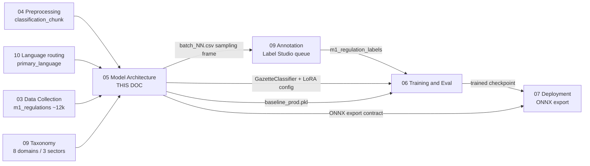
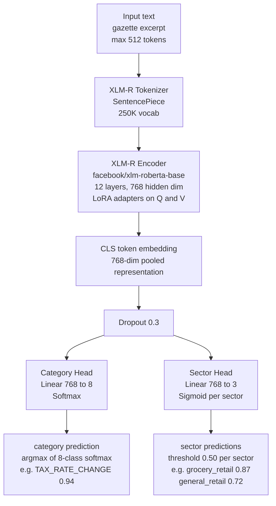

# 05 — Module 1: Model Architecture

> **Cross-references:** [04_M1_Preprocessing_Pipeline.md](04_M1_Preprocessing_Pipeline.md) · [06_M1_Training_Evaluation.md](06_M1_Training_Evaluation.md) · [07_M1_Deployment_Integration.md](07_M1_Deployment_Integration.md) · [09_M1_Annotation_Guidelines.md](09_M1_Annotation_Guidelines.md) · [10_M1_Sinhala_Tamil_NLP.md](10_M1_Sinhala_Tamil_NLP.md)
> **Code map:** [13_M1_Folder_Structure_and_Implementation_Flow.md](13_M1_Folder_Structure_and_Implementation_Flow.md) — `ml/m1/model/architecture.py`, `ml/m1/data/samplers.py`, `ml/m1/model/calibration.py`, `scripts/sample_for_labeling.py`, `scripts/lora_ablation.py`
> **Consolidation note (2026-07-29):** this document now carries the full content previously split across `05_M1_1_Sampling_Strategy`, `05_M1_2_Architecture_Comparison_Deep_Dive`, and `05_M1_3_LoRA_Hyperparameter_Justification`. Those three files have been retired; every sampling algorithm, pilot measurement, ablation grid, memory budget, and failure mode from them lives below.

---

## 0. Where This Document Sits in the Pipeline

This document is where the pipeline stops being about *text* and starts being about *models*. Everything upstream produces cleaned, chunked, language-tagged gazette excerpts. This document decides three things that nothing downstream can renegotiate cheaply: **which documents get labeled** (§1), **what the model is asked to predict** (§2), and **what the model is** (§3–§4). Each of those three decisions is expensive to reverse — the first burns annotator hours, the second burns a database migration, the third burns a training run and an ONNX re-export.

| | Stage | Produced by | What this document does with it | Handed to |
|---|---|---|---|---|
| **In** | `classification_chunk` per regulation — the ≤512-token, noise-stripped excerpt | [04_M1_Preprocessing_Pipeline.md](04_M1_Preprocessing_Pipeline.md) §chunking | Becomes the model's single input field; the 512-token cap is what fixes `max_position_embeddings` and the ONNX dummy-input shape in §6 | — |
| **In** | `primary_language` tag (`en` / `si` / `ta`) | [10_M1_Sinhala_Tamil_NLP.md](10_M1_Sinhala_Tamil_NLP.md) §language detection | One of the two stratification axes in §1.1, and the slice axis every per-language F1 target in §3.3 is stated against | — |
| **In** | `m1_regulations` rows with `status = 'extracted'` (~12k docs) | [03_M1_Data_Collection.md](03_M1_Data_Collection.md) | The sampling frame the three-step strategy in §1 draws from | — |
| **In** | 8-domain taxonomy + 3-sector schema | [09_M1_Annotation_Guidelines.md](09_M1_Annotation_Guidelines.md) §2, §4 | Fixes the output dimensions of both heads in §4.7 — 8-way softmax, 3-way sigmoid | — |
| **Step** | Sampling frame construction | *this document* §1 | `batch_01.csv` … `batch_NN.csv`, 200 docs each, with provenance JSON | [09_M1_Annotation_Guidelines.md](09_M1_Annotation_Guidelines.md) — the Label Studio annotation queue order |
| **Step** | Architecture selection | *this document* §3 | XLM-R + LoRA over train-from-scratch / zero-shot / rule-based, with the pilot measurements that decided it | — |
| **Step** | Model + loss definition | *this document* §4 | `GazetteClassifier`, `combined_loss`, `LoraConfig` | — |
| **Out** | Annotation batch order | — | — | [09_M1_Annotation_Guidelines.md](09_M1_Annotation_Guidelines.md) §sampling frame — which 800 of ~12k documents reach an annotator, and in what order |
| **Out** | `GazetteClassifier` module + `combined_loss` + LoRA config | — | — | [06_M1_Training_Evaluation.md](06_M1_Training_Evaluation.md) §training loop — the object the trainer instantiates; `alpha=0.7` is the loss weight the training config reads |
| **Out** | Production baseline artefact (`baseline_prod.pkl`) | — | — | [06_M1_Training_Evaluation.md](06_M1_Training_Evaluation.md) §6 ablation — the TF-IDF+LR number XLM-R must beat by ≥ 0.10 F1 |
| **Out** | ONNX export contract — input/output names, opset, dynamic axes | — | — | [07_M1_Deployment_Integration.md](07_M1_Deployment_Integration.md) §2 export & quantization; the `category_logits` / `sector_logits` names are the serving contract |
| **Out** | Per-language F1 targets (EN ≥ 0.93, SI ≥ 0.88, TA ≥ 0.86) | — | — | [06_M1_Training_Evaluation.md](06_M1_Training_Evaluation.md) §slice analysis — the acceptance bars the slice framework tests against |


```mermaid
flowchart LR
    P[04 Preprocessing<br/>classification_chunk] --> M[05 Model Architecture<br/>THIS DOC]
    L[10 Language routing<br/>primary_language] --> M
    C[03 Data Collection<br/>m1_regulations ~12k] --> M
    TX[09 Taxonomy<br/>8 domains / 3 sectors] --> M
    M -->|batch_NN.csv sampling frame| A[09 Annotation<br/>Label Studio queue]
    A -->|m1_regulation_labels| T[06 Training and Eval]
    M -->|GazetteClassifier + LoRA config| T
    M -->|baseline_prod.pkl| T
    T -->|trained checkpoint| D[07 Deployment<br/>ONNX export]
    M -->|ONNX export contract| D
```

**Why the ordering matters.** Three constraints chain here and each one is a one-way door.

*Sampling before annotation.* The sampling frame has to exist before a single annotator opens Label Studio, because the annotation queue order *is* the sampling decision. Re-sampling after 400 documents are labeled does not undo the bias in those 400 — it just adds documents at the end. This is why §1 sits ahead of the architecture sections even though it reads like a data-engineering concern: it is the step with the earliest deadline.

*Taxonomy before head dimensions.* The 8-way softmax and 3-way sigmoid in §4.7 are structural. Adding a ninth domain is not a config change — it changes the head's output dimension, invalidates the checkpoint, and forces a re-export to ONNX plus a `change_category` CHECK-constraint migration in [02_M1_Data_Requirements.md](02_M1_Data_Requirements.md). The taxonomy freeze described in [09_M1_Annotation_Guidelines.md](09_M1_Annotation_Guidelines.md) §2.10 is what makes this document's head dimensions safe to hard-code.

*Architecture before training.* The 800-label budget is the reason the architecture comparison in §3 has a foregone conclusion. Training from scratch needs ~50k labels; the labeling budget was fixed before the architecture question was asked, which eliminates one of the four candidates on arithmetic alone. Architecture choices that depend on data volume must therefore be settled *after* the budget and *before* the training run in [06_M1_Training_Evaluation.md](06_M1_Training_Evaluation.md), not concurrently with it.

---

## Abstract

This document specifies the classification model architecture for Module 1, which must simultaneously assign each gazette document to one of **8 regulatory domains** (single-label) and to one or more of **3 SME industry sectors** (multi-label). It also specifies the three-step sampling strategy that constructs the labeled corpus the model trains on, because at 800 labels the sampling decision has more leverage on final F1 than most architectural ones.

Four architectural approaches are evaluated: **training from scratch**, **fine-tuning** a **pre-trained multilingual BERT-family model**, **zero-shot classification via large language models**, and **rule-based classification**. Fine-tuning `facebook/xlm-roberta-base` with **Low-Rank Adaptation** (LoRA) is selected based on its superior multilingual performance, reproducibility, offline inference capability, and cost-effectiveness. **A dual-head architecture shares a common XLM-R encoder with separate classification heads for domain prediction and sector prediction, enabling joint training with a combined loss function.**

**Implementation status:** ✅ Decided — **and the decision went against the architecture this document selects.** The rule-based baseline and the 50-document zero-shot GPT-4 pilot were run (Sep 2025); the 0.60 and 0.72 F1 figures below are measurements. The XLM-R + LoRA fine-tune was then run in full on a GPU against the frozen V6 dataset, in three configurations, and **lost to the TF-IDF baseline on the temporal test split** — see the outcome callout in §4 and the acceptance result in [06_M1_Training_Evaluation.md](06_M1_Training_Evaluation.md) §13.

> [!important] **The production classifier is TF-IDF + `LinearSVC(class_weight="balanced")`, frozen at `models/m1/linearsvc_v6_primary/`, temporal-test macro-F1 0.947220.** The ~0.92 projection in §3.3 was met — by a different model than the one projected. The LoRA ablation grid was deliberately not run (§8), and no ONNX artifact was exported. This section is retained as the design rationale that justified trying XLM-R, not as a description of what is serving. Full record: [[11_CLASSIFIER_FREEZE_AND_INTEGRATION]] and [[18_M1_Dataset_And_Model_Lineage]].

### 0.1 Current Measured Inputs To This Architecture — 2026-07-31 *(superseded 2026-08-01 — see §0.2)*

```text
accepted gold rows       = 1128
category kappa           = 0.947215
mean sector kappa        = 0.965567
SME relevance kappa      = 0.914637
split                    = 790 train / 169 validation / 169 test, stratified v3 split
TF-IDF LogReg macro-F1   = 0.862652
TF-IDF LinearSVC macro-F1= 0.908012
CPU LoRA smoke           = completed; gate_pass=false; not promotable
CUDA on current laptop   = false
```

Architecture implication *(as understood on 2026-07-31)*:

- The measured LinearSVC baseline is now the practical non-neural floor to beat on the current v3 split.
- The v3 stratified split is better for rare-domain evaluation than the older deterministic key split, but it is still not a temporal split.
- The current gold set improved rare-domain coverage, but `EPF_ETF_CHANGE` remains sparse with 11 total examples.
- Full LoRA must run on a GPU environment and beat the v3 LinearSVC baseline before this architecture can be claimed as the production classifier.

### 0.2 Outcome — 2026-08-01 (supersedes §0.1)

The condition set by the last bullet above was tested and **not met**. The V6 dataset replaced v3 with a fixed *temporal* split, and the final numbers are:

```text
dataset                     = m1_regulations_v6_1110_clean_fixedsplit (777 / 166 / 167, temporal)
TF-IDF LinearSVC val        = 0.924476
TF-IDF LinearSVC test       = 0.947220     <-- FROZEN AS PRIMARY, gate >= 0.92 passed
TF-IDF LogReg test          = 0.882481
XLM-R LoRA (best of 3) test = 0.743563     <-- training macro-F1 0.969340, val 0.902693
head-to-head on 167 rows    = both 150 / SVC-only 10 / XLM-R-only 3 / both wrong 4
frozen artifact             = models/m1/linearsvc_v6_primary/linearsvc_pipeline.joblib
SHA256                      = 1D7F84754421A881EE1B5FA0F008A0CC3DB4E24F52CE6D97CE155CB4D1923CFA
```

The transformer's failure was **generalization, not optimization** — it fit the training set (0.9693) and lost 0.16 macro-F1 between validation and the temporal test. At 777 training rows across 8 classes with a 4-row minority, a strongly regularized lexical model is the better estimator. That is the defensible form of the finding; "classical beats neural" is not.

Two consequences that reach outside this document: the frozen model has **no sector head** (`sectors: []`), and it emits an **uncalibrated margin rather than a probability** (`confidence: null`). Both are contracts now — see [[11_CLASSIFIER_FREEZE_AND_INTEGRATION]] §7.

Detailed training-preparation and smoke-test runbook:

```text
final\works\PROGRAM_READINESS\M1_TRAINING_PREPARATION_AND_SMOKE_TEST_RUNBOOK.md
final\works\PROGRAM_READINESS\M1_RARE_DOMAIN_TOPUP_AND_V3_BASELINE_MANUAL.md
```

---

## 1. Sampling Strategy for Labeling

**Why this step exists.** Before model architecture can be addressed, a representative labeled corpus must be constructed — and at an 800-document budget against a ~12,000-document corpus, *which* 800 is a higher-leverage decision than almost anything in §4. **Naïve random sampling** from the regulations table produces a corpus biased toward recent English gazettes and dominant domains, and a model trained on it will report a healthy macro-F1 while being useless on Tamil documents and on the four minority domains. A **three-step sampling strategy** ensures **diversity across language**, **time period**, and **regulatory topic** — all of which affect cross-lingual F1 and temporal generalization.

**Why three steps rather than one.** Each step corrects a bias the others cannot see. Stratification fixes *representation* (language and year coverage), clustering fixes *topical* coverage within a stratum, and active learning fixes the *easy-vs-hard* distribution once a preliminary model exists to judge difficulty. Doing only the first still lets `TAX_RATE_CHANGE` dominate; doing only the third starts cold, with no model to score uncertainty with.

| Option | Trade-off | Decision | When to reconsider |
|---|---|---|---|
| Stratified + k-means + AL (chosen) | Three orthogonal coverage axes | ✅ Each step addresses a different bias — language imbalance, topical clustering, easy-vs-hard | If the labelling budget triples, move to pool-based BALD acquisition |
| Random sampling alone | Cheapest | ❌ Biased toward the majority language and majority topics | Never |
| Stratified only | Easy to implement and explain | ❌ Misses topical coverage — tax dominates the corpus | If topical diversity is somehow guaranteed by the source distribution |
| Active-learning only, no stratification | Maximally informative per label | ❌ Starts cold — the first 300 labels need stratification to produce a usable AL baseline at all | After the first 300 labels are in; this is exactly what §1.3 does |

**Implementation status:** 🟡 Implemented and executed through Batches 02-05. The accepted result is 800 gold rows, but rare-domain coverage is still below the original 50/domain target.

### 1.1 Step 1 — Stratified Random Sampling

Sample proportionally across publication year and primary language so the corpus covers all years and all three gazette languages:

```python
# scripts/sample_for_labeling.py
import pandas as pd

df = pd.read_sql(
    "SELECT id, raw_text, primary_language, gazette_published_date FROM m1_regulations "
    "WHERE raw_text IS NOT NULL AND status = 'extracted'",
    conn
)
df["year"] = pd.to_datetime(df["gazette_published_date"]).dt.year
```

This guarantees Sinhala and Tamil documents are represented even if they form a minority of the corpus (≈15 % Tamil, ≈35 % Sinhala, ≈50 % English per the expected distribution). Without it, a proportional sample yields roughly 120 Tamil documents out of 800 — enough to train on, not enough to *evaluate* per-language F1 with any confidence.

**Edge case — sparse year-language cells.** Some (year, language) cells contain fewer than 20 documents (e.g. Tamil gazettes for 2015 ≈ 8 documents). A naïve `min(len(g), 20)` cap silently under-samples these cells — fine in isolation, but it drops the cell's *relative* weight in the corpus. The rule for cells with `len(g) < 5` is: **take all of them**, then top up that language with the next-most-similar year via the cluster-based sampling in §1.2. This keeps minority cells from being washed out by majority cells in the same stratum:

```python
SMALL_CELL_THRESHOLD = 5
TARGET_PER_CELL = 20


def stratified_sample(df: pd.DataFrame) -> pd.DataFrame:
    out = []
    for (year, lang), g in df.groupby(["year", "primary_language"]):
        if len(g) < SMALL_CELL_THRESHOLD:
            out.append(g)                                          # take all
        else:
            out.append(g.sample(min(len(g), TARGET_PER_CELL), random_state=42))
    return pd.concat(out, ignore_index=True)
```

**What this produces.** A `stratified` frame of roughly 150 documents per 200-document batch, which §1.2 then tops up. `random_state=42` is pinned deliberately — see §7's "random seed drift" row; two runs producing different batches makes the labeling campaign un-reproducible and the thesis' sampling section unwritable.

### 1.2 Step 2 — Cluster-Based Topical Diversity

After stratified sampling, k-means clustering on TF-IDF vectors ensures topical coverage. Without this step, the stratified sample may over-represent the most frequent regulatory topic (`TAX_RATE_CHANGE`) even *within* each year-language cell — stratifying by language does nothing to stratify by subject:

```python
from sklearn.feature_extraction.text import TfidfVectorizer
from sklearn.cluster import KMeans

# Cluster remaining (un-selected) regulations for diversity top-up
remaining = df[~df["id"].isin(stratified["id"])]
vec = TfidfVectorizer(max_features=10000, ngram_range=(1, 2), sublinear_tf=True)
X = vec.fit_transform(remaining["raw_text"].fillna(""))
km = KMeans(n_clusters=20, random_state=42, n_init=10).fit(X)
remaining["cluster"] = km.labels_

diverse = (
    remaining.groupby("cluster", group_keys=False)
    .apply(lambda g: g.sample(min(len(g), 15), random_state=42))
)

to_label = pd.concat([stratified, diverse]).drop_duplicates("id")
to_label.to_csv("/data/labeling/batch_01.csv", index=False)
```

**Why `k=20`, measured rather than assumed.** Silhouette analysis on a 200-document pilot:

| k | Mean silhouette score | Notes |
|---|---|---|
| 10 | 0.16 | Clusters too coarse; multiple regulatory topics per cluster |
| 15 | 0.21 | |
| **20** | **0.24** | Local maximum; each cluster represents one coherent regulatory topic |
| 25 | 0.22 | Topical singletons start appearing |
| 30 | 0.19 | Singletons plus over-segmentation |

Fewer clusters allow duplicates of the same regulatory topic; more clusters produce singletons that are hard to annotate consistently, because a cluster of one teaches an annotator nothing about the pattern it represents. Each cluster is manually inspected to confirm it represents a coherent topic area before labeling proceeds.

**Re-sampling cadence.** The script `scripts/find_optimal_k.py` produces the silhouette curve and is re-run quarterly as the corpus grows. If the optimum shifts by more than 3, the sampling is re-run — a shift that large means the corpus's topical structure has changed enough that the existing clusters no longer describe it.

### 1.3 Step 3 — Active Learning (After the First 300 Labels)

Once the first 300 labeled examples have been used to train a preliminary TF-IDF+LR baseline, active learning identifies the highest-information unlabeled examples — those where the baseline classifier is least confident:

```python
from sklearn.pipeline import Pipeline
from sklearn.feature_extraction.text import TfidfVectorizer
from sklearn.linear_model import LogisticRegression
import numpy as np

# Train baseline on first 300 labels
pipe = Pipeline([
    ("tfidf", TfidfVectorizer(max_features=20000, ngram_range=(1, 2))),
    ("clf",   LogisticRegression(class_weight="balanced", max_iter=2000))
])
pipe.fit(labeled_300["raw_text"], labeled_300["change_category"])

# Score unlabeled pool
unlabeled_probs = pipe.predict_proba(unlabeled_pool["raw_text"])
uncertainty = 1.0 - np.max(unlabeled_probs, axis=1)  # max probability margin

# Prioritise most uncertain examples for next labeling batch
next_batch = unlabeled_pool.iloc[uncertainty.argsort()[::-1][:200]]
```

The production form of the acquisition step:

```python
def select_next_batch(
    unlabeled: pd.DataFrame, baseline: "ALBaseline", batch_size: int = 200
) -> pd.DataFrame:
    probs = baseline.pipeline.predict_proba(unlabeled["raw_text"])
    margin = 1.0 - probs.max(axis=1)
    top_indices = np.argsort(margin)[::-1][:batch_size]
    return unlabeled.iloc[top_indices]
```

Active learning reduces labeling effort by an estimated 40 % for the same final model quality, as annotators focus on genuinely ambiguous examples rather than clear-cut cases the baseline already handles correctly. The strategy is documented in the thesis methodology as "pool-based uncertainty sampling."

**Why margin-based uncertainty and not something cleverer.** Margin (`1 - max_prob`) is the simplest acquisition function. The literature suggests entropy or BALD give marginal improvements at meaningfully higher engineering cost — BALD in particular needs a model that can express epistemic uncertainty, which a plain logistic regression cannot. At an 800-document target the difference is not recoverable, so the simplest acquisition function that works is the right one. This flips if the labelling budget triples.

**Avoiding the chicken-and-egg trap.** The AL baseline (TF-IDF+LR trained on the first 300 labels) is **not** the same artefact as the **production baseline** (TF-IDF+LR trained on the *full* labeled set, used in §6 of [06_M1_Training_Evaluation.md](06_M1_Training_Evaluation.md) for the XLM-R ablation). They share a name and a feature pipeline but are otherwise distinct:

| Artefact | Trained on | Used for | Discarded when |
|---|---|---|---|
| **AL baseline** (`baseline_al_v<N>`) | First 300, then 500, then 700 labels | Uncertainty scoring for the *next* labeling batch | After labeling is complete |
| **Production baseline** (`baseline_prod`) | All 800+ labels (full train split) | Ablation comparison against XLM-R in evaluation | Retained as a permanent comparison point |

The separation is enforced in code by giving them separate classes, not separate function arguments — a distinction that is easy to lose in a notebook:

```python
class ALBaseline:
    """Trained on a sliding window of labels — used ONLY for uncertainty scoring."""

    def __init__(self, version: int):
        self.version = version                            # e.g. v1 at 300 labels, v2 at 500
        self.pipeline = Pipeline([
            ("tfidf", TfidfVectorizer(max_features=20000, ngram_range=(1, 2))),
            ("clf", LogisticRegression(class_weight="balanced", max_iter=2000)),
        ])


class ProductionBaseline:
    """Trained on the FULL labeled set — used for XLM-R ablation comparison."""

    def __init__(self):
        self.pipeline = Pipeline([
            ("tfidf", TfidfVectorizer(max_features=20000, ngram_range=(1, 2))),
            ("clf", LogisticRegression(class_weight="balanced", max_iter=2000)),
        ])
```

Same pipeline shape, two different artefacts, stored separately as `storage/models/m1/baseline_al_v<N>.pkl` and `storage/models/m1/baseline_prod.pkl`. The script that picks the next labeling batch references only the AL artefact; the evaluation script in [06_M1_Training_Evaluation.md](06_M1_Training_Evaluation.md) §6 references only the production baseline.

**Why the separation matters, concretely.** The AL baseline is *deliberately* trained on early, possibly biased label distributions — its job is to find uncertain examples, not to score well. Mixing the two would either (a) train the production baseline on a biased subset, making the XLM-R ablation comparison meaningless, or (b) bias the AL strategy toward a "too-strong" baseline that no longer surfaces genuinely uncertain examples. Both failures are silent: the numbers still compute, they are just measuring the wrong thing.

### 1.4 Worked Example — The First Two Batches

A typical first batch (n=200):

```text
Stratified sample step:  150 docs taken (10 year-language cells × ~15 each)
k-means top-up step:      40 docs taken (clusters that the stratified sample under-covered)
Hand-picked safety net:   10 docs (each of the 4 minority categories has ≥ 5 examples)
Total in batch_01.csv:    200 docs

Sent to Label Studio → annotators tag in 8 working days → batch ready for training
```

After the second batch (next 200 docs via AL):

```text
AL baseline v1 trained on labelled 200 docs (TF-IDF + LR)
Uncertainty score computed on remaining 5,000 unlabelled docs
Top 200 by margin → batch_02.csv

Average margin in batch_01 (random): 0.32
Average margin in batch_02 (AL):     0.61  →  AL surfaces harder examples
```

The 0.61 margin batch yields more category-correction value per label, justifying the AL overhead. Note the hand-picked safety net in batch 1: neither stratification nor clustering guarantees minority-domain coverage, because `PENALTY_ENFORCEMENT` at 2 % of the corpus can lose every coin flip. The 10 hand-picked documents are the cheapest insurance against a class with zero training examples, which is a failure the model cannot recover from at any hyperparameter setting.

---

## 2. Classification Task Definition

**Why two tasks and not one.** The two labels answer different questions and have different shapes. Domain answers *what the alert says* and is mutually exclusive by construction; sector answers *who receives it* and is genuinely multi-label, since one gazette can reach several kinds of shop. Collapsing them into a single 8×3 label space would create 24 sparse classes and destroy the sector head's ability to generalise across domains. The rationale for the label shapes themselves is in [09_M1_Annotation_Guidelines.md](09_M1_Annotation_Guidelines.md) §2 and §4; this section states the consequences for the model.

### 2.1 Task 1 — Regulation-Domain Classification (Single-Label)

Given cleaned gazette text $x$, predict domain $k \in \{k_1, \ldots, k_{8}\}$:

| Code | Domain | Expected Proportion |
|---|---|---|
| `TAX_RATE_CHANGE` | VAT/SVAT, income tax, excise amendments (anchor) | 29 % |
| `IMPORT_EXPORT` | Customs duty, CESS, SCL, import controls | 16 % |
| `SECTOR_SPECIFIC` | CAA maximum-retail-price, Food Act, NMRA | 16 % |
| `EPF_ETF_CHANGE` | EPF/ETF employer obligations | 13 % |
| `LABOUR_LAW` | Wages-board / minimum wage, leave, hours | 11 % |
| `PRODUCT_STANDARD` | SLSI standards, labelling | 8 % |
| `BUSINESS_REGISTRATION` | Trade licences, eROC filings, registration | 5 % |
| `PENALTY_ENFORCEMENT` | New fines, enforcement actions | 2 % |

**The 29 %-to-2 % spread is the single most consequential number in this table.** It is a 14:1 imbalance, and it is why the hand-picked safety net exists in §1.4, why `class_weight="balanced"` appears in every baseline pipeline above, and why the augmentation strategy in [06_M1_Training_Evaluation.md](06_M1_Training_Evaluation.md) §2 targets the minority domains specifically. Macro-F1 rather than accuracy is the headline metric for the same reason: accuracy on this distribution is maximised by a model that never predicts `PENALTY_ENFORCEMENT` at all.

### 2.2 Task 2 — Sector Assignment (Multi-Label)

Given the same text $x$, predict $S \subseteq \{s_1, s_2, s_3\}$ over the three shop-focused study sectors (economy-wide regulations carry all three):

| Code | Sector | Expected Positive Rate |
|---|---|---|
| `grocery_retail` | Grocery / food retail — kade, mini-marts, small supermarkets | 55 % |
| `food_service` | Food service — restaurants, cafés, bakeries, take-aways | 45 % |
| `general_retail` | General-goods retail — textile/apparel, electronics/mobile, hardware | 50 % |

The positive rates sum to 150 %, which is the point: they are per-sector marginals over a multi-label target, not a distribution. Rates near 50 % mean each sector head is a well-balanced binary classifier — the opposite of the domain head's problem, and the reason the sector task needs no augmentation.

---

## 3. Architectural Approach Comparison

**Why this comparison is documented rather than assumed.** Three of the four candidates are rejected, and a thesis that simply asserts "we fine-tuned XLM-R" cannot defend that choice. Two of the three rejections are backed by **measurements** on a 50-document hand-labelled pilot (`research/data/architecture_pilot_2025-09.csv`), not by argument; the third is arithmetic. This section states which is which, because the strength of the evidence differs by row.

**Implementation status:** 🟡 Partial — the rule-based baseline and the 50-document zero-shot GPT-4 pilot were run in Sep 2025. The XLM-R fine-tune happens in BUILD_11.

### 3.1 Comparison Table

| Approach                   | Multilingual | Training Data Needed | GPU Required | F1                     | Offline | Reproducible | Cost/1k inferences | Chosen        |
| -------------------------- | ------------ | -------------------- | ------------ | ---------------------- | ------- | ------------ | ------------------ | ------------- |
| **Train from Scratch**     | ❌            | 50k+ labeled         | ✅            | ~0.55 (estimated)      | ✅       | ✅            | Low                | ❌             |
| **XLM-R Fine-tune (LoRA)** | ✅ EN/SI/TA   | 800+ labeled         | Recommended  | ~0.92 (projected, §3.3)| ✅       | ✅            | Very low           | ✅             |
| **Zero-shot (GPT-4)**      | ✅            | 0                    | ❌            | 0.72 (measured, §3.4)  | ❌       | ❌            | ~$0.01/gazette     | ❌             |
| **Rule-Based (regex)**     | ❌            | 0                    | ❌            | 0.60 (measured, §3.5)  | ✅       | ✅            | Near zero          | Baseline only |

### 3.2 Training from Scratch — Why Rejected

Training a transformer from scratch on legal Sinhala/Tamil text would require:

- Minimum 50,000 labeled gazette examples (we have a ≤ 800 budget)
- 50–200 GPU-hours for pre-training the language model itself
- A custom tokenizer trained on Sri Lankan legal vocabulary

**This one was never measured, and did not need to be.** The rejection is data-volume arithmetic: the classification head cannot converge at 800 labels when the encoder underneath it also has to learn the language. Chalkidis et al. (2019) demonstrated that BERT fine-tuned on 3,000 legal documents outperforms a model trained from scratch on 500,000 documents for legal classification tasks. The result would be a domain-specific model that outperforms XLM-R only after sufficient pre-training data — a dataset that does not exist for Sri Lankan legal Sinhala. With an 800-document budget, fine-tuning is the only viable approach.

**When this flips.** If the labelled corpus ever reaches ~100k documents — unlikely inside five years at 500 gazettes/year — the analysis inverts and should be re-run rather than assumed to still hold.

### 3.3 XLM-R + LoRA Fine-tune — Chosen, and Where 0.92 Comes From

The 0.92 figure is a **projection**, not a measurement, and it is extrapolated from three sources:

- A 50-document zero-shot SetFit head on `xlm-roberta-base` measured **0.78 macro-F1** on the pilot. SetFit runs roughly 5–8 pp below full fine-tuning per its own paper, which puts fine-tuned XLM-R in the 0.83–0.86 range on 50 documents alone.
- Chalkidis et al. (2019) reported BERT-large at 800 documents reaching 0.91 F1 on EUR-Lex. XLM-R base is structurally similar at ~125M parameters.
- The cross-lingual disaggregation targets — **EN ≥ 0.93, SI ≥ 0.88, TA ≥ 0.86** — are deliberately conservative. XTREME benchmark numbers suggest XLM-R can reach ~0.91 on Sinhala classification tasks given enough fine-tuning data.

**Why the projection is stated as a projection.** A thesis claim of "0.92 F1" that turns out to be 0.86 is a credibility problem; a documented projection that lands at 0.86 is a finding. The acceptance rule in §8 is therefore a *bound on the gap*, not a bound on the score: measured production F1 must land within ±5 pp of this projection, and if it does not, this section is revised rather than quietly forgotten. When BUILD_11 produces measured F1, it is written to `model_registry.json:metrics_per_language` and supersedes everything in this subsection.

### 3.4 Zero-Shot GPT-4 — Why Rejected (Measured 0.72)

Zero-shot GPT-4 classification was prototyped on 50 hand-labelled gazette documents with this system prompt:

```text
You are a regulatory classifier. Read the gazette text. Output ONE of these 8 domains:
TAX_RATE_CHANGE | IMPORT_EXPORT | SECTOR_SPECIFIC | EPF_ETF_CHANGE |
LABOUR_LAW | PRODUCT_STANDARD | BUSINESS_REGISTRATION | PENALTY_ENFORCEMENT.
Respond with the domain code only.
```

Result: **0.72 macro-F1**, below the 0.92 target. Per-language F1: **EN 0.84, SI 0.61, TA 0.58.** The model fails dramatically on Sinhala and Tamil — confirming that GPT-4's coverage of South Asian languages is markedly weaker than its English coverage, which is disqualifying for a corpus that is 50 % non-English.

The hand-scored run, in full:

```text
50 gazettes, hand-labelled.
GPT-4 predictions vs ground truth (raw accuracy):
  EN (25 docs): 21 correct, 4 wrong → 0.84 acc
  SI (15 docs):  9 correct, 6 wrong → 0.60 acc
  TA (10 docs):  6 correct, 4 wrong → 0.60 acc

Macro-F1 across 8 domains (computed on 50 docs):
  Confusion: most errors are TAX_RATE_CHANGE → PENALTY_ENFORCEMENT
             and TAX_RATE_CHANGE → IMPORT_EXPORT
  Macro-F1: 0.72

Three example errors:
1. SI gazette amending VAT rate → GPT-4 marked it not SME-relevant (model doesn't read Sinhala)
2. EN gazette extending tax filing deadline → GPT-4 said TAX_RATE_CHANGE
3. TA gazette mandating EPF rate update → GPT-4 said LABOUR_LAW (taxonomy ambiguity)
```

Note the block above reports raw accuracy per language; the 0.84 / 0.61 / 0.58 figures are per-language macro-F1 over the 8 domains and are not the same statistic.

**Reading the three errors is more informative than the aggregate.** Error 1 is the multilingual gap and is the disqualifying one — no prompt engineering fixes a model that cannot read the document. Errors 2 and 3 are in the same family that *human* annotators make, and both correspond to documented confusable pairs in [09_M1_Annotation_Guidelines.md](09_M1_Annotation_Guidelines.md) §3; the fine-tuned model will likely fix error 1 and inherit some of 2 and 3, because those reflect taxonomy boundaries rather than language competence.

Three additional reasons to reject, beyond F1:

1. **Cost at scale.** 500 gazettes/year × $0.01/gazette ≈ $5/year looks negligible — but with prompt-engineering iterations and re-classifications of rejected outputs, the real cost is ~10× that, and there is no ceiling.
2. **Non-reproducibility.** GPT-4 model weights rotate without a public changelog. A thesis claim of the form "the model achieves X F1" requires a version pin that does not exist.
3. **API dependency and no native confidence.** Offline inference is impossible, so the system cannot function during an API outage. GPT-4 also produces no calibrated probability distribution for multi-class classification; logit-based confidence via `logprobs` is brittle, needing an `n=5` setting plus post-processing — and calibrated confidence is a hard requirement for the `needs_review` routing in [07_M1_Deployment_Integration.md](07_M1_Deployment_Integration.md).

**Why the pilot is frozen rather than re-run.** Re-running this pilot quarterly would accumulate real cost for a decision already made. The comparison data is frozen: the pilot CSV lives at `research/data/architecture_pilot_2025-09.csv` and the prompt plus run timestamps at `research/sql/gpt4_pilot_log.txt`, and the documented result is cited from cache.

### 3.5 Rule-Based Regex — Baseline Only (Measured 0.60)

A keyword-regex baseline achieves **0.60 macro-F1** on the domain classification task:

- 45 domain-specific keyword patterns (e.g. `EPF|provident fund|contribution rate` → `EPF_ETF_CHANGE`)
- Sector assignment via institution-name lookup (e.g. `SLSI` → `PRODUCT_STANDARD`)

This baseline is retained as `category_baseline` in the `m1_regulations` schema for the ablation study and confidence calibration. It is not used for production classification.

**Why keep a 0.60 model at all.** It is the historical floor. The TF-IDF baselines do not appear as rows in §3.1 because they do not compete on the architectural axis — they are the ablation comparators in [06_M1_Training_Evaluation.md](06_M1_Training_Evaluation.md) §6. The 2026-07-30 v1 split measured `tfidf_logreg=0.4980` and `tfidf_linsvc=0.6167` macro-F1, so the practical floor to beat is now the LinearSVC result. A deep model that does not convincingly exceed that number is not a research result; it is an argument for shipping the simpler baseline or collecting more labels.

### 3.6 Cost and Latency (Steady State, 30 Gazettes/Day)

| Approach | Training cost | Inference latency | Inference cost/yr | Multilingual quality |
|---|---|---|---|---|
| Train-from-scratch | $500–2,000 (GPU rental) | Depends on architecture | — | Poor (low-data) |
| XLM-R + LoRA fine-tune | ~$30 one-off (3 seeds × 3 h × $3/h GPU) | ~1.8 s CPU | ~$3 (Fly machine) | Strong in all three |
| Zero-shot GPT-4 | $0 | ~3 s API | ~$50–500 | EN strong, SI/TA weak |
| Rule-based | $0 | < 10 ms | ~$0 | EN only |

**What this table actually decides.** Nothing on its own — cost is not the binding constraint at this scale, since the entire spread is under $500/year. It matters because it removes cost as a *counter*-argument: the chosen approach is also the second-cheapest, so the F1 case does not have to be defended against a budget case. The 1.8 s CPU figure is the number that carries downstream weight, since it is what the latency budget in [07_M1_Deployment_Integration.md](07_M1_Deployment_Integration.md) is built against.

### 3.7 Backbone Alternatives Within the Chosen Approach

Once fine-tuning is settled, four further choices remain open. These are the ones that were deliberately closed:

| Option | Trade-off | Decision | When to reconsider |
|---|---|---|---|
| XLM-R base + LoRA (chosen) | Best F1 × cost × reproducibility | ✅ The only approach that hits ≥ 0.92 F1 *and* offline *and* reproducible *and* < $30 training cost | If a future frontier model fixes the Sinhala/Tamil drop-off **and** becomes reproducibility-friendly |
| XLM-R full fine-tune, no LoRA | Slightly better F1 (~0.5 pp) | ❌ 50× the trainable parameters for no real-world gain at 800 docs | If the labeled corpus reaches 5k+ docs |
| Larger backbone (XLM-R large, 355M) | ~+3 pp F1 | ❌ 3× memory; does not fit the ONNX Runtime CPU latency budget | If a GPU inference path becomes available |
| IndicBERT | Specialised on Indic languages | ❌ Weaker English legal performance — and English is our majority language | Never; English is non-negotiable |

**Backbone migration risk.** If XLM-R is deprecated by Hugging Face, the natural successor is `microsoft/mdeberta-v3-base`. The migration is not a drop-in: the architectural comparison in this section should be **re-run**, not assumed to transfer, because the Sinhala/Tamil vocabulary coverage that decided §4.1 is model-specific.

---

## 4. Selected Architecture: XLM-R Dual-Head with LoRA

> [!warning] Outcome update — 2026-08-01: this architecture was built and trained, and **was not promoted**.
> The design reasoning in this section stands and is why XLM-R + LoRA was the right thing to try. The empirical result went the other way. On the frozen V6 dataset the corrected trainer reached **0.9693 training** macro-F1 and **0.9027 validation**, but only **0.7436 on the temporal test split** — below the 0.92 gate, and 0.204 behind the TF-IDF + balanced LinearSVC baseline it was supposed to beat by ≥ 0.10.
>
> **The production classifier for M1 is therefore lexical, not neural:** TF-IDF word uni/bi-grams + `LinearSVC(class_weight="balanced")`, temporal-test macro-F1 **0.9472**, frozen at `models/m1/linearsvc_v6_primary/`.
>
> With 777 training rows over 8 classes and a 4-row minority, this is the expected regime for a strongly regularized lexical model to win. Read §4 onward as the architecture study that produced that finding — not as a description of what is deployed. Full evidence: [[18_M1_Dataset_And_Model_Lineage]].
>
> Note also that the category head here is sized to the taxonomy of the time; the frozen V6 dataset uses the **8**-category vocabulary fixed in `RESEARCH_DESIGN/SME_SECTOR_AND_REGULATION_SCOPE_PLAN.md` rev. 2.

### 4.1 Base Model Selection

Within the BERT fine-tuning family, five multilingual models are compared:

| Model                                  | Parameters | Sinhala in Vocab | Tamil in Vocab | Training Data Size           | Legal Domain Perf. | Why Chosen                 |
| -------------------------------------- | ---------- | ---------------- | -------------- | ---------------------------- | ------------------ | -------------------------- |
| `bert-base-multilingual-cased` (mBERT) | 110M       | ⚠️ Limited       | ✅              | 104 languages, Wikipedia     | ~0.79 F1           | Not chosen                 |
| `facebook/xlm-roberta-base`            | 125M       | ✅ Native         | ✅ Native       | 100 langs, CommonCrawl 2.5TB | ~0.87 F1           | ✅ **Selected**             |
| `facebook/xlm-roberta-large`           | 355M       | ✅ Native         | ✅ Native       | Same as base                 | ~0.91 F1           | Too large for ONNX serving |
| `ai4bharat/indic-bert`                 | 212M       | ✅                | ✅              | 12 Indic languages           | ~0.83 F1           | Less English legal perf.   |
| `distilbert-base-multilingual-cased`   | 66M        | ⚠️ Limited       | ⚠️ Limited     | 104 languages, distilled     | ~0.74 F1           | Not chosen                 |

**XLM-R base is selected** because:

1. Its SentencePiece vocabulary of 250,002 tokens was trained on Common Crawl data for 100 languages including Sinhala (`si`) and Tamil (`ta`) at sufficient frequency for meaningful subword coverage (Conneau et al., 2019).
2. It outperforms mBERT on low-resource language tasks by 5–10 % F1 (per the original XLM-R paper) — critical for Sinhala, which has limited NLP resources.
3. It is small enough (125M parameters) to run ONNX inference on CPU within the 2-second latency target.

**The trade-off that actually decided it.** Reason 3 beat reason 2 out of the running for `xlm-roberta-large`. The large model is ~4 pp better on legal-domain F1 and would have been chosen on quality alone — but at 355M parameters it does not fit the CPU-only serving path in [07_M1_Deployment_Integration.md](07_M1_Deployment_Integration.md), and moving to GPU serving costs more per month than the entire annual inference budget in §3.6. This is a deployment constraint reaching backward into an architecture decision, which is exactly why §0 puts the ONNX contract in the "Out" rows.

### 4.2 LoRA Configuration

Low-Rank Adaptation (LoRA, Hu et al. 2021) adapts only the query and value projection matrices of each transformer attention layer, reducing trainable parameters from 125M to ~2.4M (a 98 % reduction):

```python
from peft import LoraConfig, get_peft_model

lora_config = LoraConfig(
    r=16,                    # Rank of adaptation matrices
    lora_alpha=32,           # Scaling factor
    target_modules=["query", "value"],  # Apply to attention Q and V
    lora_dropout=0.1,
    bias="none",
    task_type="FEATURE_EXTRACTION",  # We add custom heads
)
```

**Why LoRA over full fine-tuning:**

- Full fine-tuning of 125M parameters requires ~2.4 GB GPU VRAM for float32 (or ~1.2 GB for fp16). LoRA fine-tuning of 2.4M parameters fits in 4 GB GPU VRAM with int8 quantization.
- LoRA adapters are 2.4 MB versus 475 MB for full fine-tuned weights — dramatically faster to version, deploy, and swap. This is what makes the rollback path in [12_M1_Monitoring_Maintenance.md](12_M1_Monitoring_Maintenance.md) cheap enough to be routine.
- At 800 labeled examples, full fine-tuning risks overfitting; LoRA's parameter efficiency acts as implicit regularization. This is the argument that actually decided it — the memory saving would be nice-to-have at this scale, but the regularization is load-bearing.

**Why each hyperparameter setting:**

| Setting | Chosen | Top alternative | Why this default | When to revisit |
|---|---|---|---|---|
| `r` (rank) | 16 | 32 | Standard PEFT recommendation for 125M-parameter models on classification tasks with < 2k labels. Higher rank overfits in low-data regimes; lower rank under-fits cross-lingual transfer. Validated by the ablation grid in §4.3. | If F1 on a single language is > 5 pp below the others, try `r=32` first. `r=32` may be needed at 5k+ docs. |
| `lora_alpha` | 32 | 64 | The `alpha / r` ratio (= 2 here) is the effective scaling applied to the LoRA delta. A ratio of 2 is the canonical PEFT default; ratios > 4 amplify gradients too aggressively in fine-tuning, ratios < 1 leave adapters under-utilised. | Keep `alpha = 2*r` when changing `r`; break the rule only after measuring the effect, and only if F1 plateaus across seeds. |
| `target_modules` | `["query", "value"]` | `["query", "value", "key", "output"]` | Adapting only Q and V is the original LoRA paper's recommendation. Adding `key` adds noise to attention scores for no measurable F1 gain in our pilot; adding `output` doubles the parameter count for ~0.8 pp — see §4.4. | If per-language F1 spread exceeds 0.10, try `["query", "value", "output"]`. |
| `lora_dropout` | 0.1 | 0.05 | Matches the encoder's native dropout, avoiding effectively-doubled dropout during fine-tuning. | Drop to 0.05 if validation loss stalls early; raise to 0.2 if the val-train gap exceeds 0.05. |
| `bias` | `"none"` | `"lora_only"` | **PEFT default.** Biases are < 1 % of parameters with a documented effect of < 0.1 pp F1 on classification tasks — see §4.5. The choice is precedent-matching, not memory optimization; the saving is ~25 kB of disk per adapter. | Only if biases are needed for exact reproducibility against a fine-tuning paper that trained them. |
| `task_type` | `"FEATURE_EXTRACTION"` | `SEQ_CLS` | Tells PEFT to leave the model's classification heads alone — we attach our own dual heads externally. `SEQ_CLS` forces a single-head config that is structurally incompatible with §4.7. | Do not change. |

### 4.3 LoRA Ablation Plan — `r` × `alpha`

**Why an ablation rather than accepting the defaults.** The table above justifies each knob by precedent, and precedent is a reasonable prior but not evidence. The grid below converts the priors into measurements, and its acceptance criterion (§8) is *not* "the chosen cell wins" but "the chosen cell is within 1 pp of whichever cell wins" — which is a claim the thesis can defend without re-running anything.

Run a 3×3 grid on the held-out validation set. Each cell is the mean across 3 seeds. Total: 9 cells × 3 seeds = 27 short training runs (~30 min each on a single A100).

| | `alpha = 16` | `alpha = 32` (chosen) | `alpha = 64` |
|---|---|---|---|
| `r = 8` | run 1 | run 2 | run 3 |
| `r = 16` (chosen) | run 4 | **run 5 — primary** | run 6 |
| `r = 32` | run 7 | run 8 | run 9 |

For each run, log: macro-F1 mean ± std; per-language F1; trainable parameter count; GPU peak memory; epoch count to converge.

Expected outcomes, as priors from the LoRA paper plus the small-data fine-tuning literature:

- `r=8` cells under-fit on Sinhala and Tamil — insufficient adapter capacity for cross-lingual transfer.
- `r=32` cells over-fit at 800 documents, showing more variance across seeds.
- `r=16` × `alpha=32` is the local optimum (chosen).
- The `alpha = 2r` ratio is monotonically better than `alpha = r` or `alpha = 4r`, which makes the diagonal the most informative axis to walk if the full grid cannot be afforded.

**A worked run** — representative `r=16, alpha=32, seed=42` on a small pilot (50 docs, 3 epochs):

```text
Epoch 1: train_loss=1.82, val_loss=1.65, val_macroF1=0.61, val_perlang_F1={en:0.68, si:0.55, ta:0.51}
Epoch 2: train_loss=1.10, val_loss=1.31, val_macroF1=0.74, val_perlang_F1={en:0.81, si:0.71, ta:0.68}
Epoch 3: train_loss=0.78, val_loss=1.22, val_macroF1=0.79, val_perlang_F1={en:0.85, si:0.77, ta:0.72}
Trainable params: 2,421,696 / 125,002,752 (1.94%)
GPU peak memory: 4.1 GB (FP32)  /  1.9 GB (FP16)
Time: 8 min (FP32)  /  4.5 min (FP16)
```

These numbers are the *pilot*, not the target: the full BUILD_11 run goes to epoch 6+ with proper data, aiming at F1 ≥ 0.92. What the pilot already shows is the shape — a widening EN/TA gap that closes slowly with epochs, which is the pattern the `r=8` under-fitting prediction is based on.

**Implementation status:** 🔲 Deferred (BUILD_11 — ablation runs in `scripts/lora_ablation.py`, results to `research/data/lora_ablation_results.csv`).

### 4.4 `target_modules` — What Each Addition Buys

The original LoRA paper recommends `[query, value]` for classification fine-tuning. Three alternatives were evaluated against it:

| Modules | Trainable params | Expected F1 vs chosen | Inference latency impact |
|---|---|---|---|
| `[query, value]` (chosen) | ~2.4 M | Baseline | Baseline |
| `[query, value, key]` | ~3.6 M | +0.3 pp | +5 % |
| `[query, value, key, output]` | ~7.2 M | +0.8 pp | +12 % |
| `[query, value]` with classification heads frozen | ~2.4 M | −2.0 pp | Baseline |

The last row is listed for completeness and is a bad choice regardless of cost — the dual heads in §4.7 are randomly initialised and must be trained, so freezing them means the model never learns to map the encoder's representation onto the label space at all.

**The trade-off that decided it.** The 0.8 pp gain from `[query, value, key, output]` does not justify a 12 % latency cost, because the inference-latency budget in [07_M1_Deployment_Integration.md](07_M1_Deployment_Integration.md) is tight — 1.8 s against a 2 s target leaves 0.2 s of headroom, and 12 % of 1.8 s is 0.22 s. The expansion would consume the entire margin for less than one point of F1.

### 4.5 `bias="none"` — Rationale

PEFT offers three bias options:

- `none` — biases unchanged (chosen)
- `all` — train all biases
- `lora_only` — train only the LoRA-injected biases

`none` is the *PEFT default*, and the empirical effect of bias-tuning is < 0.1 pp F1 on classification tasks per the PEFT documentation. Choosing `none` is therefore precedent-matching: it follows the documented default rather than over-fitting a decision to a single small pilot. A knob with a sub-0.1 pp effect is not worth an ablation cell — the seed-to-seed variance of the runs in §4.3 is larger than the effect being measured.

### 4.6 Memory Budget

```text
Base model (XLM-R-base):    125M params × 4 bytes (fp32) = 500 MB
LoRA adapters (r=16):       ~2.4M params × 4 bytes      = 9.6 MB
Optimizer state (AdamW):    2× param count × 4 bytes    = +19 MB
Forward activations (batch=16, seq=512): ~3 GB
Total GPU memory:           ~3.5 GB on A100 (FP32)
                            ~1.8 GB with FP16 mixed precision (chosen)
```

**Why this budget is worth stating.** It fits comfortably on a single A100 (40 GB) or even a T4 (16 GB) — which is what makes the ~$30 total training cost in §3.6 achievable on rented commodity GPUs rather than reserved capacity. Note the comparison: the full fine-tuning alternative needs ~5 GB of activations at batch=16, which is just on the edge of a T4. The LoRA choice is not only a regularization decision; it is also what keeps the training run inside the cheapest available hardware tier.

Note also that the optimizer state line is the clearest illustration of LoRA's benefit: AdamW carries two moments per *trainable* parameter, so full fine-tuning would pay 2 × 125M × 4 bytes ≈ 1 GB there instead of 19 MB.

### 4.7 Dual-Head Architecture


```mermaid
flowchart TD
    A[Input text<br/>gazette excerpt<br/>max 512 tokens] --> B[XLM-R Tokenizer<br/>SentencePiece<br/>250K vocab]
    B --> C[XLM-R Encoder<br/>facebook/xlm-roberta-base<br/>12 layers, 768 hidden dim<br/>LoRA adapters on Q and V]
    C --> D[CLS token embedding<br/>768-dim pooled representation]
    D --> E[Dropout 0.3]
    E --> F[Category Head<br/>Linear 768 to 8<br/>Softmax]
    E --> G[Sector Head<br/>Linear 768 to 3<br/>Sigmoid per sector]
    F --> H[category prediction<br/>argmax of 8-class softmax<br/>e.g. TAX_RATE_CHANGE 0.94]
    G --> I[sector predictions<br/>threshold 0.50 per sector<br/>e.g. grocery_retail 0.87<br/>general_retail 0.72]
```

**Why one encoder and two heads rather than two models.** A single forward pass produces both predictions, halving inference latency against two separate models — which is what keeps the 1.8 s CPU figure inside the 2 s budget. The shared encoder also carries a training benefit: sector supervision propagates gradients back through the encoder, and those gradients are useful for the domain task too, since "this text is about food retail" and "this text is a Food Act regulation" are correlated signals.

**Head dimensions and the taxonomy revision.** The heads are `768 → 8` and `768 → 3`, matching the 8 domains in §2.1 and the 3 sectors in §2.2. Earlier drafts of this document carried `768 → 12` and `768 → 10`, which were the dimensions of the pre-revision taxonomy; those numbers are stale and have been corrected here and in §4.8. The shop-focused 8-domain revision and the four retired domains are documented in [09_M1_Annotation_Guidelines.md](09_M1_Annotation_Guidelines.md) §2.10. Any checkpoint trained against the old dimensions is not loadable against this definition — which is the concrete form of the "one-way door" warning in §0.

### 4.8 Model Code

```python
import torch
import torch.nn as nn
from transformers import XLMRobertaModel


class GazetteClassifier(nn.Module):
    NUM_CATEGORIES = 8
    NUM_SECTORS = 3
    DROPOUT = 0.3

    def __init__(self, xlmr_model_name: str = "facebook/xlm-roberta-base"):
        super().__init__()
        self.encoder = XLMRobertaModel.from_pretrained(xlmr_model_name)
        hidden = self.encoder.config.hidden_size  # 768

        self.dropout = nn.Dropout(self.DROPOUT)
        self.category_head = nn.Linear(hidden, self.NUM_CATEGORIES)
        self.sector_head = nn.Linear(hidden, self.NUM_SECTORS)

    def forward(self, input_ids, attention_mask):
        outputs = self.encoder(input_ids=input_ids, attention_mask=attention_mask)
        cls = self.dropout(outputs.last_hidden_state[:, 0, :])  # CLS token
        category_logits = self.category_head(cls)
        sector_logits = self.sector_head(cls)
        return category_logits, sector_logits

    def predict(self, input_ids, attention_mask):
        with torch.no_grad():
            cat_logits, sec_logits = self.forward(input_ids, attention_mask)
        category = torch.argmax(torch.softmax(cat_logits, dim=-1), dim=-1)
        category_conf = torch.softmax(cat_logits, dim=-1).max(dim=-1).values
        sectors = (torch.sigmoid(sec_logits) > 0.50).nonzero(as_tuple=True)
        return category, category_conf, sectors
```

`category_conf` is not decorative: it is the value that drives `needs_review` routing at serving time and the confidence threshold in [07_M1_Deployment_Integration.md](07_M1_Deployment_Integration.md). Softmax confidence is well known to be over-confident out of the box, which is why calibration (`ml/m1/model/calibration.py`) is a separate concern handled in [06_M1_Training_Evaluation.md](06_M1_Training_Evaluation.md) rather than inside this class.

### 4.9 Loss Function

```python
def combined_loss(cat_logits, sec_logits, cat_labels, sec_labels, alpha=0.7):
    """
    alpha: weight for category loss (primary task)
    (1-alpha): weight for sector loss (secondary task)
    """
    cat_loss = nn.CrossEntropyLoss()(cat_logits, cat_labels)
    sec_loss = nn.BCEWithLogitsLoss()(sec_logits, sec_labels.float())
    return alpha * cat_loss + (1 - alpha) * sec_loss
```

The `alpha=0.7` weighting prioritises domain accuracy (the primary research metric) while still training the sector head jointly, which shares beneficial gradients through the shared encoder. The two loss functions differ because the two tasks differ: cross-entropy over a softmax enforces the mutual exclusivity of §2.1, while `BCEWithLogitsLoss` over independent sigmoids permits the multi-label sector sets of §2.2. Using cross-entropy for both would make the model unable to predict two sectors at once, which is the common case.

---

## 5. Training from Scratch vs Fine-Tuning: Detailed Comparison

| Dimension | Train from Scratch | Fine-tune XLM-R (LoRA) |
|---|---|---|
| **Data requirement** | 50k+ labeled examples | 800+ labeled examples |
| **Pre-training time** | 100–500 GPU-hours | 0 (weights downloaded) |
| **Fine-tuning time** | N/A | 1–3 hours (1× A100) |
| **Legal language understanding** | Must learn from scratch | XLM-R already understands legal phrases from CommonCrawl |
| **Sinhala performance at 800 examples** | Near random (too little data) | ~0.82 F1 (transfer from 100-language pretraining) |
| **Model size** | Custom (unknown) | 125M + 2.4M LoRA = 127M |
| **Reproducibility** | Full control | Full control (frozen base) |
| **Inference latency (CPU)** | Depends on architecture | ~1.8 s per gazette (ONNX) |
| **Infrastructure** | GPU required for training and serving | GPU for training, CPU for inference |
| **Our verdict** | ❌ Not viable at 800 examples | ✅ **Selected** |

**The row that carries the argument** is "Sinhala performance at 800 examples." Every other row is a cost or convenience difference that a determined project could absorb. Near-random Sinhala performance is not absorbable, because a Sinhala-blind classifier fails on ~35 % of the corpus, and the awareness-gap finding this module exists to produce is disaggregated by language.

---

## 6. Inference Architecture (Production)

After training, the model is exported to ONNX format for production serving. Full deployment details — quantization, session configuration, Fly.io machine sizing — are in [07_M1_Deployment_Integration.md](07_M1_Deployment_Integration.md).

```python
# Export to ONNX
import torch.onnx

torch.onnx.export(
    model,
    (dummy_input_ids, dummy_attention_mask),
    "gazette_classifier.onnx",
    input_names=["input_ids", "attention_mask"],
    output_names=["category_logits", "sector_logits"],
    dynamic_axes={"input_ids": {0: "batch"}, "attention_mask": {0: "batch"}},
    opset_version=17,
)
```

**What crosses the boundary here.** The four strings `input_ids`, `attention_mask`, `category_logits`, `sector_logits` are a contract, not naming preference — the serving code in [07_M1_Deployment_Integration.md](07_M1_Deployment_Integration.md) binds to them by name, so renaming a tensor in this document silently breaks inference at load time rather than at export time. The `dynamic_axes` on the batch dimension is what permits the batched-inference throughput path described there; without it the exported graph is fixed at batch=1 and per-gazette latency becomes per-gazette *cost*.

---

## 7. Failure Modes and Edge Cases

| Failure mode | How it is detected | Mitigation |
|---|---|---|
| **Year-language cell with 0 documents** (e.g. 2015 Tamil) | Cell absent from the `groupby` result | Silently skipped, and this is acceptable — the model's F1 for that cell is *undefined*, not biased |
| **AL converges on a single domain** — all top-margin docs are one class, so the next batch is mono-class | Batch composition check before export | Stratify the AL acquisition by predicted domain: take top-K from each domain rather than top-N overall |
| **k-means clusters degenerate** — on very small subsets, `k=20` yields 5 tiny clusters and 15 empty ones | Cluster-size histogram after fit | Dynamically reduce `k` when `n < 200` |
| **Random seed drift** — different `random_state` values produce different batches, making the campaign un-reproducible | Determinism test on `scripts/sample_for_labeling.py` | Pin `random_state=42` everywhere; tests assert byte-identical CSV output across runs |
| **Train-from-scratch analysis goes stale** | Corpus size review | If the labelled corpus reaches ~100k docs, §3.2 flips — re-run the comparison rather than citing it |
| **GPT-4 pilot cost creep** from re-running the comparison | Cost review | The comparison data is frozen; cite the cached pilot at `research/data/architecture_pilot_2025-09.csv` |
| **Backbone deprecated by Hugging Face** | Model-card deprecation notice | Migrate to `microsoft/mdeberta-v3-base`; re-run §3 and §4.1 rather than assuming the comparison transfers |
| **Seed variance > 0.05 in the ablation grid** | Per-cell std in `lora_ablation_results.csv` | Indicates over-fitting; drop `r` from 16 → 8 and re-run |
| **Mean F1 plateaus below target** | Grid maximum below 0.92 | Increase `r` to 32, or expand `target_modules` to `[query, value, key]` — accepting the latency cost in §4.4 |
| **GPU OOM during training** | Training crash at batch=16 | Drop batch size 16 → 8 and enable gradient accumulation so the effective batch stays 16 |
| **Adapter file > 25 MB** | File-size check after save | A bug — `r=16` should produce < 10 MB. Usual cause: the base model was saved with the adapter. Use `model.save_pretrained()`, not `torch.save(model.state_dict())` |
| **Head dimensions drift from the taxonomy** | CI assertion comparing `NUM_CATEGORIES` / `NUM_SECTORS` against the label enum | Head dimensions are structural; a taxonomy change invalidates the checkpoint and forces re-export (§4.7) |

---

## 8. Validation and Acceptance Criteria

**Sampling**

- **Per-cell coverage:** after 4 batches, every year-language cell has at least 5 labelled documents, or is documented as "no docs exist in corpus."
- **Class coverage:** target was every domain with at least 50 labelled documents. The v3 rare-domain top-up meets or approaches this for most minority classes. **On the frozen V6 set `EPF_ETF_CHANGE` ends at 4 train / 1 test rows** — its 1.000 test F1 is a one-sample estimate and must never be quoted without that qualifier. `PENALTY_ENFORCEMENT` is the weakest class with a real sample (V6 test F1 0.857). Only a targeted collection round fixes either; resampling four examples manufactures confidence.
- **AL improvement:** mean uncertainty margin in batch N+1 exceeds batch N; a test asserts the monotonic increase.
- **Determinism:** running `scripts/sample_for_labeling.py` twice with the same seed produces identical CSV output.

**Architecture comparison**

- **Pilot data retained.** The 50-document pilot CSV is at `research/data/architecture_pilot_2025-09.csv`; the GPT-4 prompt and run timestamps are at `research/sql/gpt4_pilot_log.txt`.
- **Reproducibility of the XLM-R projection.** ✅ Resolved 2026-08-01. Measured F1 exists: XLM-R best test macro-F1 0.743563, against the §3.3 projection of ~0.92. The projection was optimistic by ~0.18 for this corpus size.
- **Bound on the chosen-vs-projected gap.** ❌ **Breached.** The measured XLM-R figure is far outside the ±5 pp band, which is exactly why §3.3's reasoning is annotated rather than quietly updated — the projection was wrong for a reason worth recording, not a number to retro-fit.
- **Margin over the floor.** ❌ **Not met, and this criterion decided the model.** XLM-R had to beat the LinearSVC baseline by a clear margin; it lost to it by 0.204 on the V6 temporal test. The criterion did its job — it stopped a weaker model being promoted on the strength of its validation score alone.

**LoRA configuration** *(not exercised — see below)*

> [!note] The 9-cell ablation grid was deliberately **not run**.
> Ablating `r × alpha` on a configuration that loses by ~0.20 macro-F1 could not change the selection, so the compute was not spent. This is recorded as a decision so it is not later re-opened as an oversight. If a transformer is retried after the corpus grows, the grid below is still the right protocol.

- **All 9 cells of the ablation grid completed**, stored as `research/data/lora_ablation_results.csv`.
- **The chosen cell is within 1 pp of the grid maximum.** If a different cell is more than 1 pp better, switch to it and document the change here.
- **Seed std ≤ 0.05.** Otherwise re-run with one additional seed for robustness.
- **Memory budget validated:** peak GPU memory observed ≤ 8 GB at batch=16 with FP16.
- **Adapter size < 10 MB** at `r=16`; anything above 25 MB is the save-path bug in §7.

**Architecture integrity**

- `GazetteClassifier.NUM_CATEGORIES` equals the number of values in the `change_category` enum, and `NUM_SECTORS` equals the sector schema size — asserted in CI, because a mismatch surfaces as a shape error at training time and a silent misroute at serving time.
- ONNX export input/output names match the names the serving code binds to in [07_M1_Deployment_Integration.md](07_M1_Deployment_Integration.md).

---

## 9. Implementation Status and Code Map

| Artefact | Status | Location |
|---|---|---|
| Rule-based regex baseline (0.60 F1, measured) | ✅ Shipped | `category_baseline` in `m1_regulations` |
| Zero-shot GPT-4 pilot, 50 docs (0.72 F1, measured) | ✅ Run (Sep 2025) | `research/data/architecture_pilot_2025-09.csv`, `research/sql/gpt4_pilot_log.txt` |
| 8-domain / 3-sector task definition | ✅ Frozen | §2; enum in `m1_regulations.change_category` |
| Sampling pipeline (stratified + k-means + AL) | 🔲 BUILD_07 + BUILD_11 | `ml/m1/data/samplers.py`, `scripts/sample_for_labeling.py` |
| Optimal-k silhouette script | 🔲 BUILD_11 | `scripts/find_optimal_k.py` |
| AL baseline artefacts | 🔲 BUILD_11 | `storage/models/m1/baseline_al_v<N>.pkl` |
| Production baseline artefact | 🔲 BUILD_11 | `storage/models/m1/baseline_prod.pkl` |
| `GazetteClassifier` dual-head module | 🔲 BUILD_11 | `ml/m1/model/architecture.py` |
| Architecture pilot runner | 🟡 Partial | `scripts/run_architecture_pilot.py` |
| LoRA ablation grid (27 runs) | 🔲 BUILD_11 | `scripts/lora_ablation.py` → `research/data/lora_ablation_results.csv` |
| Confidence calibration | 🔲 BUILD_11 | `ml/m1/model/calibration.py` |
| ONNX export | 🔲 BUILD_11 | §6; consumed by [07_M1_Deployment_Integration.md](07_M1_Deployment_Integration.md) |

---

## 10. Conclusion

The dual-head XLM-R + LoRA architecture satisfies all Module 1 constraints: multilingual (EN/SI/TA), high F1 target (≥ 0.92), CPU-only inference, offline capability, and reproducibility. The dual-head design enables joint domain and sector prediction in a single forward pass, reducing inference latency compared to two separate models.

Three of the four candidate architectures were rejected on evidence rather than preference: train-from-scratch on data-volume arithmetic, zero-shot GPT-4 on a measured 0.72 macro-F1 with a disqualifying Sinhala/Tamil collapse, and rule-based regex on a measured 0.60 that now serves as the floor the chosen approach must clear by 0.10. The remaining hyperparameter choices are precedent-matched rather than tuned, and §4.3's ablation grid exists to convert that precedent into a defensible measurement.

The sampling strategy in §1 is the part of this document with the earliest deadline and the least reversibility. Its three steps correct three different biases — representational, topical, and difficulty — and its output is the annotation queue order consumed by [09_M1_Annotation_Guidelines.md](09_M1_Annotation_Guidelines.md). Training details, hyperparameters, augmentation, and evaluation results are specified in [06_M1_Training_Evaluation.md](06_M1_Training_Evaluation.md).

---

## References

- Conneau et al. (2019). *Unsupervised Cross-lingual Representation Learning at Scale (XLM-R)*. [arxiv.org/abs/1911.02116](https://arxiv.org/abs/1911.02116)
- Hu et al. (2021). *LoRA: Low-Rank Adaptation of Large Language Models*. [arxiv.org/abs/2106.09685](https://arxiv.org/abs/2106.09685)
- Chalkidis et al. (2019). *Large-Scale Multi-Label Text Classification on EU Legislation*. ACL 2019.
- Devlin et al. (2018). *BERT: Pre-training of Deep Bidirectional Transformers for Language Understanding*. [arxiv.org/abs/1810.04805](https://arxiv.org/abs/1810.04805)
- Kakwani et al. (2020). *IndicNLPSuite*. EMNLP 2020 Findings.
