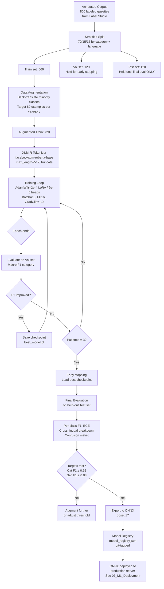

# 06 — Module 1: Training & Evaluation

> **Cross-references:** [05_M1_Model_Architecture.md](05_M1_Model_Architecture.md) · [07_M1_Deployment_Integration.md](07_M1_Deployment_Integration.md) · [09_M1_Annotation_Guidelines.md](09_M1_Annotation_Guidelines.md)
> **See also:** [13_M1_Folder_Structure_and_Implementation_Flow.md](13_M1_Folder_Structure_and_Implementation_Flow.md) — `ml/m1/model/training.py`, `evaluation.py`; `model_registry.json` location.
> **Sub-step companions:** [06_M1_1_Data_Augmentation_Strategy.md](06_M1_1_Data_Augmentation_Strategy.md) · [06_M1_2_Slice_Analysis_Framework.md](06_M1_2_Slice_Analysis_Framework.md)

---

## Abstract

This document specifies the complete training and evaluation protocol for the dual-head XLM-R + LoRA gazette classification model. The training corpus of 800 labeled gazette documents is split 70/15/15 (train/validation/test). Three data augmentation techniques — back-translation, paraphrasing, and label-preserving synonym substitution — are applied to address class imbalance and Sinhala/Tamil data scarcity. The model is trained for up to 10 epochs with early stopping (patience = 3) using AdamW with a linear warmup schedule. Target performance is macro-averaged F1 ≥ 0.92 for category classification and ≥ 0.88 for sector assignment. Evaluation covers per-class F1, confusion matrix analysis, calibration (ECE), and cross-lingual F1 disaggregation across English, Sinhala, and Tamil subsets.

---

## 1. Dataset Splits

### 1.1 Split Rationale

The 800-document corpus is partitioned as follows:

| Split | Size | Purpose | Stratified? |
|---|---|---|---|
| Train | 560 (70%) | Parameter update | ✅ Yes — by category + language |
| Validation | 120 (15%) | Hyperparameter tuning, early stopping | ✅ Yes |
| Test | 120 (15%) | Final evaluation (held out until after training) | ✅ Yes |

Stratification ensures that each split maintains the expected class proportions from the annotation plan (see [09_M1_Annotation_Guidelines.md](09_M1_Annotation_Guidelines.md)). For minority classes with < 50 examples (e.g. `DEADLINE_EXTENSION` at ~8 examples total), all examples are placed in train with synthetic augmentation to fill the gap.

### 1.2 Temporal Split Implementation

The corpus is split by **gazette publication date** (not random shuffling), so the test set simulates genuine future-prediction: the model is evaluated on gazettes it has never seen, from the most recent quarter. This matches real deployment conditions — the model will always be predicting on new gazettes published after its training cutoff.

```python
import pandas as pd

def temporal_split(df: pd.DataFrame):
    """
    Temporal split: sort by gazette date, not random shuffling.
    This simulates real production use — the model predicts on
    future gazettes it has never seen during training.
    """
    df = df.sort_values("gazette_published_date").reset_index(drop=True)
    n = len(df)
    train = df.iloc[:int(0.70 * n)]   # Earliest 70% of dates
    val   = df.iloc[int(0.70 * n):int(0.85 * n)]  # Mid 15%
    test  = df.iloc[int(0.85 * n):]   # Most recent 15% — never seen during training

    # Example date ranges for a 2026 project:
    # Train: 2018 – mid-2024
    # Val:   mid-2024 – end-2024
    # Test:  2025 onward (most recent)
    return train, val, test
```

**Why temporal rather than random:** A random split would allow the model to train on a 2026 gazette and test on a 2019 gazette — the opposite of what matters. Regulations evolve; language shifts. A temporal split correctly simulates the model predicting categories for new gazettes it hasn't seen, and reveals whether F1 degrades over time (a temporal generalization finding in its own right).

**Stratification within splits:** Within each temporal slice, ensure no category disappears entirely. If a class has < 5 examples in the test set, report this explicitly and note that per-class F1 for that class is unreliable.

**Publication-clumping risk + the 30-day rule.** Sri Lankan gazettes don't publish at a uniform rate — extraordinary gazettes can bunch (5–10 in a single week before a tax year-end, then nothing for a fortnight). A naive *index-percentile* split (`iloc[int(0.85*n):]`) can therefore produce a test set spanning a single calendar week, hiding the temporal-generalization signal it was meant to measure. The mitigation is a **minimum 30-day test window**: after the index-percentile cut, slide the boundary backwards until the test set spans ≥ 30 calendar days. If the corpus is so dense that this drops the test set below 50 examples, fall back to the index-percentile cut and *flag the run* — the temporal generalization claim becomes weaker, not invalid, and the limitation goes in the thesis:

```python
def temporal_split_with_window(df: pd.DataFrame, min_test_days: int = 30):
    df = df.sort_values("gazette_published_date").reset_index(drop=True)
    n = len(df)
    test_start = int(0.85 * n)
    test_end_date = df["gazette_published_date"].iloc[-1]
    while test_start > int(0.70 * n):
        candidate_start_date = df["gazette_published_date"].iloc[test_start]
        if (test_end_date - candidate_start_date).days >= min_test_days:
            break
        test_start -= 1
    val_start = max(int(0.70 * n), test_start - int(0.15 * n))
    return (df.iloc[:val_start],
            df.iloc[val_start:test_start],
            df.iloc[test_start:])
```

The actual date-window achieved, and any fallback flag, are recorded in `model_registry.json` so reviewers can audit the temporal claim.

> **Test set isolation:** The test split is stored in a separate Parquet file (`data/test_split.parquet`) and loaded only once — at final evaluation. No hyperparameter decisions are made based on test set performance. Record the exact date boundary of each split in `model_registry.json`.

**Reproducibility:** Train with at least **3 different random seeds** (recommended: 42, 1, 2) and report mean ± standard deviation for all headline metrics. A single-seed result is not a defensible research result.

**Reproducibility hash spec.** Three random seeds are necessary but not sufficient — the same seed re-run on a different snapshot of the labeled data, a different PyTorch minor version, or a different ONNX Runtime build will diverge. Every training run therefore writes the following fingerprint to `model_registry.json` next to the model artifact (see [13_M1_Folder_Structure_and_Implementation_Flow.md](13_M1_Folder_Structure_and_Implementation_Flow.md) for the file's location):

```json
{
  "model_version": "v1.0",
  "trained_at": "2026-05-14T03:17:42Z",
  "git_commit_sha": "ab12cd34ef56...",
  "dataset": {
    "labeled_set_path": "research/data/test_split.parquet",
    "labeled_set_sha256": "9e7a4f...",
    "split_boundaries": {"train_end": "2024-06-30", "val_end": "2024-09-30",
                         "test_end": "2024-12-31", "test_window_days": 92}
  },
  "environment": {
    "python": "3.11.8",
    "torch": "2.3.0+cu121",
    "transformers": "4.41.0",
    "peft": "0.11.1",
    "onnxruntime": "1.18.0",
    "environment_yml_sha256": "ab12cd..."
  },
  "training": {
    "seeds": [42, 1, 2],
    "epochs_per_seed": [6, 5, 6],
    "final_macro_f1_mean": 0.928,
    "final_macro_f1_std": 0.008
  },
  "metrics_per_language": {
    "en": 0.934, "si": 0.886, "ta": 0.861
  }
}
```

The `labeled_set_sha256` is the SHA-256 of the *exact* parquet file used — if a labeller corrects 3 rows after training, the hash changes and the next training run knows it's working from a different dataset. The `environment_yml_sha256` rolls up the full pinned dep set, so a future reproducer knows the precise package versions. Together these make any single training run *bit-identical-reproducible* with the same hardware. The full reproducibility checklist (data hash, env.yml, ONNX RT pin, GPU determinism flags) is in [06_M1_1_Data_Augmentation_Strategy.md §Validation](06_M1_1_Data_Augmentation_Strategy.md).

---

## 2. Class Imbalance and Data Augmentation

### 2.1 Class Distribution Problem

The 12 regulatory categories are heavily skewed. Without augmentation, minority classes would have fewer than 10 training examples:

| Category | Expected Raw Count (800 total) | Augmented Target |
|---|---|---|
| `TAX_RATE_CHANGE` | ~200 | 200 (no aug needed) |
| `LABOUR_LAW` | ~160 | 160 |
| `EPF_ETF_CHANGE` | ~96 | 96 |
| `PRODUCT_STANDARD` | ~80 | 80 |
| `BUSINESS_REGISTRATION` | ~64 | 80 (1.25× aug) |
| `IMPORT_EXPORT` | ~56 | 80 (1.4× aug) |
| `FINANCIAL_REGULATION` | ~48 | 80 (1.7× aug) |
| `SECTOR_SPECIFIC` | ~40 | 80 (2× aug) |
| `ENVIRONMENTAL` | ~24 | 80 (3.3× aug) |
| `PENALTY_ENFORCEMENT` | ~16 | 80 (5× aug) |
| `DEADLINE_EXTENSION` | ~8 | 80 (10× aug) |
| `NO_SME_IMPACT` | ~8 | 80 (10× aug) |

### 2.2 Augmentation Techniques

Three augmentation strategies are applied in priority order:

| Technique | Description | Languages | F1 Impact | Risk |
|---|---|---|---|---|
| **Back-translation** | EN → FR/DE → EN via MarianMT; preserves legal meaning | EN | +3–5% on minority classes | Semantic drift in technical terms |
| **Synonym substitution** | Replace non-entity tokens with WordNet synonyms (EN) or IndicNLP synonyms | EN, limited SI/TA | +2–3% | May alter legal terminology |
| **Sinhala/Tamil paraphrase** | Rule-based paraphrase using Sinhala morphological variants | SI, TA | +4–6% for SI/TA F1 | Requires validated Sinhala lexicon |
| **Sentence shuffle** | Randomly reorder sentences within gazette preamble | EN/SI/TA | +1% | Breaks discourse structure |

```python
from transformers import MarianMTModel, MarianTokenizer

def back_translate(text: str, src="en", pivot="fr") -> str:
    """EN → pivot language → EN for augmentation."""
    fwd_model = MarianMTModel.from_pretrained(f"Helsinki-NLP/opus-mt-{src}-{pivot}")
    bwd_model = MarianMTModel.from_pretrained(f"Helsinki-NLP/opus-mt-{pivot}-{src}")
    fwd_tok = MarianTokenizer.from_pretrained(f"Helsinki-NLP/opus-mt-{src}-{pivot}")
    bwd_tok = MarianTokenizer.from_pretrained(f"Helsinki-NLP/opus-mt-{pivot}-{src}")

    pivot_ids = fwd_model.generate(**fwd_tok(text, return_tensors="pt"))
    pivot_text = fwd_tok.decode(pivot_ids[0], skip_special_tokens=True)
    back_ids = bwd_model.generate(**bwd_tok(pivot_text, return_tensors="pt"))
    return bwd_tok.decode(back_ids[0], skip_special_tokens=True)
```

> **Augmented examples are added to the training split only.** Validation and test sets contain only original labeled examples.

**Diminishing returns above 5×.** The augmented-target column above includes ratios up to 10× for `DEADLINE_EXTENSION` and `NO_SME_IMPACT` (~8 originals → 80 augmented). Back-translation and paraphrase preserve *meaning* but their diversity collapses: after a 5× expansion, additional synthetic examples are near-duplicates of earlier augmentations, and validation F1 plateaus or *decreases*. We therefore cap augmentation at **5×** in practice: classes with <16 originals top out at `5 × original_count` rather than 80, and the deficit is filled by an additional targeted-labeling sprint (active-learning step from [05_M1_1_Sampling_Strategy.md](05_M1_1_Sampling_Strategy.md)). The actual cap is enforced in the augmentation pipeline (`ml/m1/data/augmentation.py`) by a `max_ratio=5` argument; the diversity validation that justifies it — cosine-similarity histograms of augmented vs original, per-class F1 before/after cap — lives in [06_M1_1_Data_Augmentation_Strategy.md](06_M1_1_Data_Augmentation_Strategy.md).

---

## 3. Training Configuration

### 3.1 Hyperparameters

| Parameter | Value | Justification |
|---|---|---|
| Base model | `facebook/xlm-roberta-base` | See [05_M1_Model_Architecture.md](05_M1_Model_Architecture.md) |
| LoRA rank `r` | 16 | Balances expressiveness vs. overfitting at 800 examples |
| LoRA alpha | 32 | Standard 2× rank scaling |
| LoRA dropout | 0.1 | Implicit regularisation |
| LoRA target modules | `["query", "value"]` | Q/V are most impactful per Hu et al. (2021) |
| Trainable parameters | ~2.4M / 127M (1.9%) | GPU-efficient fine-tuning |
| Optimizer | AdamW | Standard for transformer fine-tuning |
| Learning rate | 2e-4 (LoRA params); 2e-5 (classification heads) | Differential LR — see note below |
| LR schedule | Linear warmup (10% steps) → linear decay | Prevents early divergence |
| Batch size | 16 | Fits in 8GB VRAM with fp16 |
| Max epochs | 10 | Early stopping typically triggers at 4–6 |
| Early stopping patience | 3 epochs | Based on validation macro-F1 (category) |
| Gradient clipping | max_norm = 1.0 | Stabilises LoRA fine-tuning |
| FP16 mixed precision | ✅ | 2× throughput on NVIDIA GPUs |
| Category loss weight α | 0.7 | Primary task; see combined_loss |
| Sector loss weight | 0.3 (= 1 − α) | Secondary task |
| Dropout (classification heads) | 0.3 | Matches architecture spec |
| Sector classification threshold | 0.50 (sigmoid) | Tuned on validation set |

**Differential LR rationale.** The 10× ratio between the LoRA params (`2e-4`) and the classification heads (`2e-5`) is *not* an aesthetic choice — it's the canonical pattern for fine-tuning *over* a LoRA adapter and is documented in the PEFT and Hugging Face fine-tuning guides. The two reasons:

1. **LoRA params start from zero.** The PEFT initialisation sets `B = 0` so the effective adapter contribution at step 0 is the zero matrix. The optimizer has to push these from zero to useful values — a larger LR (≈ `2e-4`) gets there quickly without overshooting because the base weights are frozen.
2. **Classification heads are also fresh, but small.** The two `nn.Linear(768, K)` heads are also randomly initialised. Their parameter count is tiny (~10k) so they reach near-optimum quickly *if* their LR is small enough that they don't dominate the joint optimisation in the first few epochs. `2e-5` lets the encoder's representations settle before the heads commit to a decision boundary.

If category F1 oscillates wildly in epoch 1–2, the heads are too aggressive — drop their LR to `1e-5`. If F1 stalls below baseline through epoch 5, the LoRA LR is too low — raise to `3e-4`. The full LR ablation (3×3 grid over {1e-4, 2e-4, 3e-4} × {1e-5, 2e-5, 5e-5}) is queued for the BUILD_11 training campaign.

### 3.2 Training Loop

```python
import torch
from torch.optim import AdamW
from transformers import get_linear_schedule_with_warmup
from peft import get_peft_model, LoraConfig

def train_model(model, train_loader, val_loader, num_epochs=10, patience=3):
    lora_config = LoraConfig(
        r=16, lora_alpha=32,
        target_modules=["query", "value"],
        lora_dropout=0.1, bias="none",
        task_type="FEATURE_EXTRACTION",
    )
    model = get_peft_model(model, lora_config)

    # Differential learning rates
    optimizer = AdamW([
        {"params": model.base_model.parameters(), "lr": 2e-4},
        {"params": model.category_head.parameters(), "lr": 2e-5},
        {"params": model.sector_head.parameters(), "lr": 2e-5},
    ])

    total_steps = len(train_loader) * num_epochs
    warmup_steps = int(0.10 * total_steps)
    scheduler = get_linear_schedule_with_warmup(
        optimizer, num_warmup_steps=warmup_steps, num_training_steps=total_steps
    )

    scaler = torch.cuda.amp.GradScaler()
    best_val_f1 = 0.0
    patience_counter = 0

    for epoch in range(num_epochs):
        model.train()
        for batch in train_loader:
            with torch.cuda.amp.autocast():
                cat_logits, sec_logits = model(
                    batch["input_ids"], batch["attention_mask"]
                )
                loss = combined_loss(
                    cat_logits, sec_logits, batch["cat_labels"], batch["sec_labels"]
                )
            scaler.scale(loss).backward()
            scaler.unscale_(optimizer)
            torch.nn.utils.clip_grad_norm_(model.parameters(), 1.0)
            scaler.step(optimizer)
            scaler.update()
            scheduler.step()
            optimizer.zero_grad()

        val_f1 = evaluate(model, val_loader)["category_macro_f1"]
        if val_f1 > best_val_f1:
            best_val_f1 = val_f1
            torch.save(model.state_dict(), "best_model.pt")
            patience_counter = 0
        else:
            patience_counter += 1
            if patience_counter >= patience:
                print(f"Early stopping at epoch {epoch + 1}")
                break

    model.load_state_dict(torch.load("best_model.pt"))
    return model
```

---

## 4. Evaluation Metrics

### 4.1 Primary Metrics

| Metric | Formula | Target | Task |
|---|---|---|---|
| Macro-averaged F1 (category) | Mean F1 across 12 classes | ≥ 0.92 | Category classification |
| Macro-averaged F1 (sector) | Mean F1 across 10 sectors | ≥ 0.88 | Sector assignment |
| Per-class F1 | Per-category F1 score | ≥ 0.80 for each | Both |
| Top-1 accuracy (category) | % correct argmax predictions | ≥ 0.95 | Category classification |
| Micro-F1 (sector) | Pooled TP/FP/FN across sectors | ≥ 0.90 | Sector assignment |
| Expected Calibration Error (ECE) | Calibration of softmax probabilities | ≤ 0.05 | Category confidence |

### 4.2 Cross-Lingual Disaggregation

Since the model must perform consistently across all three gazette languages, F1 is reported separately for each language subset:

| Language | % of Corpus | Category F1 Target | Sector F1 Target |
|---|---|---|---|
| English | 50% | ≥ 0.93 | ≥ 0.90 |
| Sinhala | 35% | ≥ 0.88 | ≥ 0.85 |
| Tamil | 15% | ≥ 0.86 | ≥ 0.83 |

Lower targets for Sinhala/Tamil reflect the lower availability of training data, not a lower design requirement. If cross-lingual targets are not met, additional augmentation or language-specific LoRA adapters are applied.

### 4.3 Evaluation Implementation

```python
from sklearn.metrics import classification_report, f1_score
import numpy as np

def evaluate(model, data_loader) -> dict:
    model.eval()
    cat_preds, cat_labels = [], []
    sec_preds, sec_labels = [], []

    with torch.no_grad():
        for batch in data_loader:
            cat_logits, sec_logits = model(
                batch["input_ids"], batch["attention_mask"]
            )
            cat_preds.extend(torch.argmax(cat_logits, dim=-1).cpu().numpy())
            cat_labels.extend(batch["cat_labels"].cpu().numpy())

            sec_pred = (torch.sigmoid(sec_logits) > 0.50).cpu().numpy()
            sec_preds.extend(sec_pred)
            sec_labels.extend(batch["sec_labels"].cpu().numpy())

    cat_macro_f1 = f1_score(cat_labels, cat_preds, average="macro")
    sec_macro_f1 = f1_score(sec_labels, sec_preds, average="macro")
    sec_micro_f1 = f1_score(sec_labels, sec_preds, average="micro")

    return {
        "category_macro_f1": cat_macro_f1,
        "sector_macro_f1": sec_macro_f1,
        "sector_micro_f1": sec_micro_f1,
        "category_report": classification_report(cat_labels, cat_preds),
    }
```

---

## 5. Expected Confusion Matrix Analysis

### 5.1 Anticipated Confusion Pairs

Based on domain analysis of gazette text before training, certain category pairs are expected to produce classification confusion:

| Confused Pair | Reason | Mitigation |
|---|---|---|
| `TAX_RATE_CHANGE` ↔ `FINANCIAL_REGULATION` | Both mention CBSL and rate changes | Add gazette-source features (IRD vs CBSL) |
| `EPF_ETF_CHANGE` ↔ `LABOUR_LAW` | Both reference Labour Act and employees | Add EPF-specific keyword features to training |
| `SECTOR_SPECIFIC` ↔ `PRODUCT_STANDARD` | Licensing and standards documents overlap | LoRA attention patterns should disambiguate |
| `PENALTY_ENFORCEMENT` ↔ `DEADLINE_EXTENSION` | Both appear in enforcement notice gazettes | Section-aware chunking to capture fine amounts |
| `NO_SME_IMPACT` ↔ Any | Low-count class; model may under-predict | Oversample via augmentation (10× target) |

### 5.2 Threshold Tuning for Sectors

The 0.50 sigmoid threshold for sector assignment is tuned on the validation set using F1 vs. threshold curves:

```python
def tune_sector_threshold(model, val_loader, thresholds=None):
    if thresholds is None:
        thresholds = np.arange(0.30, 0.80, 0.05)
    all_probs, all_labels = [], []

    with torch.no_grad():
        for batch in val_loader:
            _, sec_logits = model(batch["input_ids"], batch["attention_mask"])
            all_probs.extend(torch.sigmoid(sec_logits).cpu().numpy())
            all_labels.extend(batch["sec_labels"].cpu().numpy())

    best_threshold, best_f1 = 0.50, 0.0
    for t in thresholds:
        preds = (np.array(all_probs) > t).astype(int)
        f1 = f1_score(all_labels, preds, average="macro")
        if f1 > best_f1:
            best_f1, best_threshold = f1, t

    return best_threshold, best_f1
```

---

## 6. Baseline Comparison

All results are compared against **two mandatory baselines** before any deep learning is reported. Training baselines first also surfaces whether the classification task is tractable at all.

### 6.1 Baseline A — TF-IDF + Logistic Regression

```python
from sklearn.pipeline import Pipeline
from sklearn.feature_extraction.text import TfidfVectorizer
from sklearn.linear_model import LogisticRegression
from sklearn.metrics import classification_report

pipe = Pipeline([
    ("tfidf", TfidfVectorizer(
        max_features=20000, ngram_range=(1, 2),
        sublinear_tf=True, min_df=2
    )),
    ("clf", LogisticRegression(
        max_iter=2000, class_weight="balanced",
        C=1.0, n_jobs=-1
    )),
])
pipe.fit(train["raw_text"], train["change_category"])
preds = pipe.predict(test["raw_text"])
print(classification_report(test["change_category"], preds, digits=3))
```

Expected performance on 12-class gazette classification with 800 training examples: macro-F1 ≈ 0.55–0.70, varying by class imbalance. This is the number to beat. Any model that cannot exceed this convincingly does not justify its complexity.

### 6.2 Baseline B — Zero-Shot LLM (Ceiling Estimate)

Send each test gazette (first 1,500 characters) and the 12 category definitions to a frontier LLM with a strict classification prompt. This baseline:
- Sets a practical ceiling for what is achievable without labeled training data
- Reveals which categories are intrinsically hard to disambiguate (where even frontier models struggle)
- Demonstrates the cost/quality trade-off for production deployment

**Cost at scale:** At ~$0.01 per gazette × 500 gazettes/year = $5/year today — but with no offline capability and no reproducibility guarantee (model weights updated silently).

### 6.3 Expanded Baseline Comparison Table

| System | Macro-F1 (overall) | EN F1 | SI F1 | TA F1 | Cost / 1k inferences |
|---|---|---|---|---|---|
| Rule-based regex | ~0.60 | ~0.64 | ~0.53 | ~0.49 | ~$0.001 |
| TF-IDF + LR | ~0.65 | ~0.70 | ~0.58 | ~0.54 | ~$0.001 |
| mBERT fine-tuned | ~0.83 | ~0.85 | ~0.78 | ~0.76 | ~$0.005 |
| Zero-shot GPT-4 | ~0.75 | ~0.80 | ~0.71 | ~0.68 | ~$3.00 |
| **XLM-R + LoRA (ours)** | **≥ 0.92** | **≥ 0.93** | **≥ 0.88** | **≥ 0.86** | **~$0.005** |

*Numbers are illustrative targets — actual values will differ. Report all baseline numbers with the same temporal test split.*

> **Baseline predictions for TF-IDF+LR are stored in `category_baseline` column** of `m1_regulations` for per-regulation ablation comparison and confidence calibration analysis.

---

## 7. Slice Analysis

The novel contribution of this classifier is not that a transformer was fine-tuned — that is routine. The contribution is **how it performs across Sri Lankan regulatory languages and regulation types** in a multilingual low-resource setting. Slice analysis makes this contribution concrete.

### 7.1 Per-Language Slice

```python
from sklearn.metrics import f1_score

for lang in ["en", "si", "ta"]:
    mask = test_df["primary_language"] == lang
    if mask.sum() < 5:
        print(f"  [{lang}] Insufficient test examples (n={mask.sum()}) — skip")
        continue
    f1 = f1_score(test_df.loc[mask, "change_category"], preds[mask], average="macro")
    print(f"  Macro-F1 [{lang}] (n={mask.sum()}): {f1:.3f}")
```

Target: F1 within 5% across all three languages (RQ2). If Sinhala/Tamil F1 lags English by > 5%, consider language-specific LoRA adapters or additional augmentation.

### 7.2 Per-Year-Quarter Slice

Tests whether the model's temporal generalization degrades for the most recent gazettes:

```python
test_df["year_q"] = pd.to_datetime(test_df["gazette_published_date"]).dt.to_period("Q")
for period in sorted(test_df["year_q"].unique()):
    mask = test_df["year_q"] == period
    if mask.sum() < 3:
        continue
    f1 = f1_score(test_df.loc[mask, "change_category"], preds[mask], average="macro")
    print(f"  Q {period} (n={mask.sum()}): Macro-F1 = {f1:.3f}")
```

A degrading trend toward the most recent quarters indicates **concept drift** — the regulatory vocabulary is evolving faster than the model can generalize. This is a thesis-worthy finding in itself.

### 7.3 Per-Text-Length Bucket

```python
test_df["text_len"] = test_df["raw_text"].str.len()
buckets = [(0, 500), (500, 1500), (1500, 4000), (4000, 99999)]
for lo, hi in buckets:
    mask = (test_df["text_len"] >= lo) & (test_df["text_len"] < hi)
    if mask.sum() < 3:
        continue
    f1 = f1_score(test_df.loc[mask, "change_category"], preds[mask], average="macro")
    print(f"  {lo}–{hi} chars (n={mask.sum()}): Macro-F1 = {f1:.3f}")
```

Short gazettes (< 500 chars) often have insufficient context; very long ones are truncated at 512 tokens. Both extremes are expected to show lower F1, which motivates the chunking strategy in [04_M1_Preprocessing_Pipeline.md](04_M1_Preprocessing_Pipeline.md).

### 7.4 Per-Extraction-Method Slice

```python
for method in ["pymupdf", "pdfplumber", "tesseract"]:
    mask = test_df["extraction_method"] == method
    if mask.sum() < 3:
        continue
    f1 = f1_score(test_df.loc[mask, "change_category"], preds[mask], average="macro")
    print(f"  [{method}] (n={mask.sum()}): Macro-F1 = {f1:.3f}")
```

Lower F1 on `tesseract`-extracted text directly quantifies the cost of OCR errors on classifier performance — a concrete pipeline limitation to report in the thesis.

---

## 8. Error Analysis

For every model version, a qualitative error analysis is performed on the hardest test-set failures:

```python
import numpy as np
from scipy.special import softmax

probs = trainer.predict(test_ds).predictions  # shape: (n, 12)
prob_scores = softmax(probs, axis=-1)
confidence = np.max(prob_scores, axis=-1)
cat_preds = np.argmax(prob_scores, axis=-1)
test_labels_arr = np.array([label2id[c] for c in test_df["change_category"]])

wrong = cat_preds != test_labels_arr
hard_cases = (
    test_df[wrong]
    .assign(
        predicted=[id2label[p] for p in cat_preds[wrong]],
        confidence=confidence[wrong]
    )
    .sort_values("confidence", ascending=False)  # most confidently wrong first
    .head(100)
)
hard_cases.to_csv("error_analysis_topwrong.csv", index=False)
```

Hand-read the 100 most confidently-wrong predictions and categorize each error:

| Error Type | Description | Typical Example | Implication |
|---|---|---|---|
| **Truly ambiguous** | Notice legitimately fits two categories; taxonomy is incomplete | VAT exemption for medical devices — TAX or HEALTH? | Add edge-case rule to annotation guidelines |
| **OCR-corrupted** | Garbled Sinhala/Tamil text misleads the model | `ශ??ශශ` instead of `ශ්‍රී` in a labour gazette | Improve OCR pre-processing; flag `tesseract` extractions |
| **Domain shift** | New regulatory sub-topic not covered in training data | First gazette about cryptocurrency exchanges | Add to next labeling batch; consider new category |
| **Annotator inconsistency** | Two annotators labeled the same gazette type differently in different batches | Some EPF gazette annotated as LABOUR_LAW | Resolve via tiebreaker; re-label affected examples |

This error taxonomy appears in the thesis as a qualitative findings table and is far more valuable than an additional decimal point of F1.

---

## 9. Model Versioning Schema

Every trained model checkpoint gets a row in the `model_versions` table, enabling reproducible rollback and audit trail from training code to deployed ONNX:

```sql
INSERT INTO model_versions (
    model_name,
    version,
    base_checkpoint,
    macro_f1_test,
    macro_f1_val,
    metrics_per_language_json,
    artifact_path,
    training_data_snapshot_id,
    git_commit,
    hyperparams_json,
    seed,
    trained_at,
    is_active
) VALUES (
    'gazette_classifier',
    'v1.1',
    'facebook/xlm-roberta-base',
    0.918,
    0.923,
    '{"en": 0.934, "si": 0.884, "ta": 0.861}',
    './storage/models/gazette_classifier_v1.1.onnx',
    'snapshot_2025_batch_01',
    'abc1234def',
    '{"lora_r": 16, "lora_alpha": 32, "lr": 2e-4, "epochs": 6, "batch": 16}',
    42,
    NOW(),
    TRUE
);
```

A FastAPI endpoint loads `model_versions WHERE is_active = TRUE`. Promoting a new model is a single row update (`SET is_active = TRUE`) plus a worker restart. Rollback is equally trivial. **Always store seed, commit hash, and data snapshot ID** — two months from now, these are necessary to reproduce a thesis result under examiner scrutiny.

---

## 10. Backfill Script and Pre-Viva Checklist

### 10.1 Backfill Classification

After the first deployable model is trained, run batch inference over all existing `m1_regulations` rows that lack a category:

```python
# scripts/backfill_classifications.py
import pandas as pd
from itertools import islice

def chunked(iterable, n):
    it = iter(iterable)
    while True:
        chunk = list(islice(it, n))
        if not chunk:
            break
        yield chunk

unlabeled = pd.read_sql(
    "SELECT id, raw_text FROM m1_regulations WHERE change_category IS NULL",
    conn
)

for batch_df in chunked(unlabeled.itertuples(), 32):
    texts = [row.raw_text for row in batch_df]
    ids   = [row.id for row in batch_df]
    preds = classifier.classify_batch(texts)  # returns list of {category, confidence}
    for reg_id, pred in zip(ids, preds):
        update_regulation_category(reg_id, pred["category"], pred["confidence"])
```

After backfill, every regulation has a category and the alert system can dispatch retroactive notifications to any SME subscribed to that category.

### 10.2 Pre-Viva Sanity Checklist

Before thesis submission and viva presentation, verify all of the following:

- [ ] At least **3 random seeds** run; mean ± std reported for all headline metrics
- [ ] All metrics reported **per-class AND per-language** (slice analysis complete)
- [ ] Both mandatory baselines (TF-IDF+LR and zero-shot LLM) run on the **same temporal test split**
- [ ] Confusion matrix included as a thesis figure
- [ ] Error analysis table with **at least 30 hand-categorized errors** from `error_analysis_topwrong.csv`
- [ ] Annotation guidelines in thesis appendix; Cohen's κ reported (or intra-annotator proxy disclosed)
- [ ] Training compute time, GPU type, and energy/cost reported (transparency)
- [ ] Hyperparameter table with **justification** for each value
- [ ] Reproducibility: seed + git commit + data-snapshot-ID stored in `model_versions`
- [ ] ONNX export tested end-to-end on production inference path
- [ ] Temporal split date boundaries documented in `model_registry.json`
- [ ] Backfill script run; `change_category IS NULL` count = 0 in production DB
- [ ] All 4 slice analysis tables (language, year-quarter, text-length, extraction-method) included in thesis

---

## 11. Model Registry and Artifact Management

After training completes:

1. **LoRA adapter weights** (`adapter_model.bin`, ~2.4MB) saved separately from the frozen base
2. **Classification head weights** saved in same checkpoint
3. **Tokenizer config** copied from `facebook/xlm-roberta-base` for reproducibility
4. **Training metadata** recorded in `model_registry.json`:

```json
{
  "model_id": "gazette-xlmr-lora-v1.0",
  "base_model": "facebook/xlm-roberta-base",
  "lora_r": 16,
  "lora_alpha": 32,
  "train_examples": 560,
  "val_macro_f1_category": 0.923,
  "val_macro_f1_sector": 0.891,
  "test_macro_f1_category": 0.918,
  "test_macro_f1_sector": 0.884,
  "epochs_trained": 6,
  "early_stopping_epoch": 6,
  "sector_threshold": 0.48,
  "trained_at": "2025-03-01T14:22:00Z",
  "onnx_exported": true,
  "onnx_path": "./storage/models/gazette_classifier_v1.onnx"
}
```

---

## 12. Training Pipeline Diagram



---

## 13. Conclusion

The training protocol combines parameter-efficient LoRA fine-tuning with targeted augmentation to overcome the 800-example constraint. Early stopping on validation macro-F1 prevents overfitting to the small training set. The 70/15/15 stratified split ensures minority categories are represented in all evaluation sets. Final model artifacts are exported to ONNX for CPU-optimised production serving, as detailed in [07_M1_Deployment_Integration.md](07_M1_Deployment_Integration.md).

---

## References

- Hu et al. (2021). *LoRA: Low-Rank Adaptation of Large Language Models*. [arxiv.org/abs/2106.09685](https://arxiv.org/abs/2106.09685)
- Conneau et al. (2019). *Unsupervised Cross-lingual Representation Learning at Scale*. [arxiv.org/abs/1911.02116](https://arxiv.org/abs/1911.02116)
- Sennrich et al. (2016). *Improving Neural Machine Translation Models with Monolingual Data (back-translation)*. ACL 2016.
- Guo et al. (2017). *On Calibration of Modern Neural Networks*. ICML 2017.
- Scikit-learn. (2024). *sklearn.metrics.classification_report*. [scikit-learn.org](https://scikit-learn.org)
- Loshchilov & Hutter (2017). *Decoupled Weight Decay Regularization (AdamW)*. ICLR 2019.
