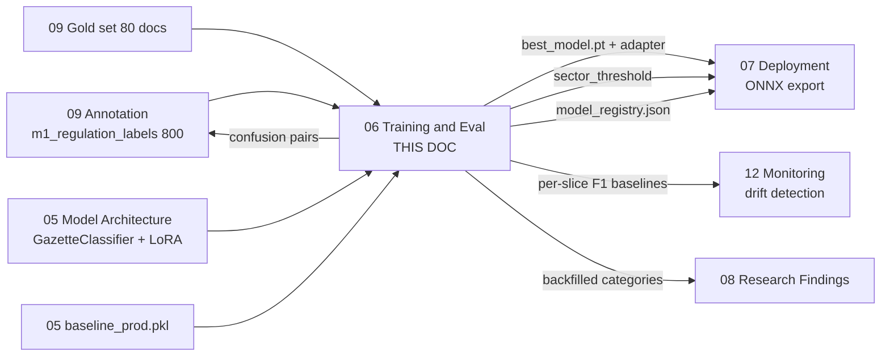
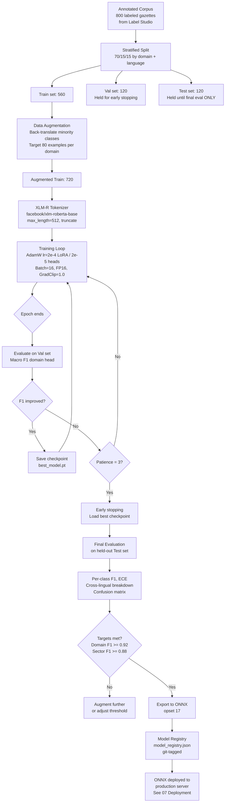

# 06 — Module 1: Training & Evaluation

> **Cross-references:** [05_M1_Model_Architecture.md](05_M1_Model_Architecture.md) · [07_M1_Deployment_Integration.md](07_M1_Deployment_Integration.md) · [09_M1_Annotation_Guidelines.md](09_M1_Annotation_Guidelines.md) · [12_M1_Monitoring_Maintenance.md](12_M1_Monitoring_Maintenance.md)
> **Code map:** [13_M1_Folder_Structure_and_Implementation_Flow.md](13_M1_Folder_Structure_and_Implementation_Flow.md) — `ml/m1/model/training.py`, `ml/m1/model/evaluation.py`, `ml/m1/data/augmentation.py`, `ml/m1/model/calibration.py`; `model_registry.json` location.
> **Consolidation note (2026-07-29):** this document now carries the full content previously split across `06_M1_1_Data_Augmentation_Strategy` and `06_M1_2_Slice_Analysis_Framework`. Those two files have been retired; every augmentation recipe, diversity check, ablation table, slice implementation, cliff pattern, and figure template from them lives below.

---

## 0. Where This Document Sits in the Pipeline

This document turns two artefacts into one. Upstream, [05_M1_Model_Architecture.md](05_M1_Model_Architecture.md) supplies a model *definition* — an untrained `GazetteClassifier` with randomly initialised heads — and [09_M1_Annotation_Guidelines.md](09_M1_Annotation_Guidelines.md) supplies *labels*. Neither is useful alone. This document is where they meet, and what comes out the other side is a trained checkpoint plus the evidence that the checkpoint is good enough to deploy. Every number that appears in the thesis evaluation chapter, and every threshold the serving path relies on, is produced here.

| | Stage | Produced by | What this document does with it | Handed to |
|---|---|---|---|---|
| **In** | `m1_regulation_labels` — 800 consensus domain + sector labels | [09_M1_Annotation_Guidelines.md](09_M1_Annotation_Guidelines.md) §6 adjudication | Splits 70/15/15 by publication date (§1); augments the training portion only (§2) | — |
| **In** | Gold-standard set, ~80 docs annotated by everyone | [09_M1_Annotation_Guidelines.md](09_M1_Annotation_Guidelines.md) §6.1 | Held-out evaluation anchor; the labels most trusted to be right | — |
| **In** | `GazetteClassifier`, `combined_loss`, `LoraConfig` | [05_M1_Model_Architecture.md](05_M1_Model_Architecture.md) §4 | Instantiated by the training loop in §3.3; `alpha=0.7` is read straight from the loss definition | — |
| **In** | `baseline_prod.pkl` — TF-IDF+LR on the full labeled set | [05_M1_Model_Architecture.md](05_M1_Model_Architecture.md) §1.3 | Baseline A in the §6 ablation — the floor XLM-R must clear by ≥ 0.10 macro-F1 | — |
| **In** | `primary_language`, `extraction_method`, `gazette_published_date` | [03_M1_Data_Collection.md](03_M1_Data_Collection.md), [04_M1_Preprocessing_Pipeline.md](04_M1_Preprocessing_Pipeline.md), [10_M1_Sinhala_Tamil_NLP.md](10_M1_Sinhala_Tamil_NLP.md) | The four slice axes in §7 — each is a column that must survive preprocessing to be sliceable here | — |
| **Step** | Split, augment, train, early-stop | *this document* §1–§3 | `best_model.pt`, `adapter_model.bin` (~2.4 MB), tokenizer config | — |
| **Step** | Evaluate, slice, calibrate, error-analyse | *this document* §4–§8 | Macro-F1 ± std over 3 seeds, per-language F1, confusion matrix, ECE, 100 hardest failures | — |
| **Out** | Trained checkpoint + LoRA adapter | — | — | [07_M1_Deployment_Integration.md](07_M1_Deployment_Integration.md) §2 — the input to ONNX export and INT8 quantization |
| **Out** | Tuned `sector_threshold` (e.g. 0.48) | — | — | [07_M1_Deployment_Integration.md](07_M1_Deployment_Integration.md) serving path — the sigmoid cut-off applied at inference, not a training-time artefact |
| **Out** | `model_registry.json` + `model_versions` row | — | — | [07_M1_Deployment_Integration.md](07_M1_Deployment_Integration.md) `is_active` model selection; [12_M1_Monitoring_Maintenance.md](12_M1_Monitoring_Maintenance.md) §rollback target |
| **Out** | Per-slice F1 baselines (language, quarter, length, extraction method) | — | — | [12_M1_Monitoring_Maintenance.md](12_M1_Monitoring_Maintenance.md) §drift detection — production slices are compared against these, so drift means "moved from here" |
| **Out** | Confusion matrix + error taxonomy | — | — | [09_M1_Annotation_Guidelines.md](09_M1_Annotation_Guidelines.md) §3 — model-confused pairs feed back as contrastive annotation examples |
| **Out** | Backfilled `change_category` on every historic regulation | — | — | [08_M1_Full_System_Architecture.md](08_M1_Full_System_Architecture.md) §research findings — no lag finding can be computed over uncategorised regulations |


```mermaid
flowchart LR
    A[09 Annotation<br/>m1_regulation_labels 800] --> T[06 Training and Eval<br/>THIS DOC]
    G[09 Gold set 80 docs] --> T
    M[05 Model Architecture<br/>GazetteClassifier + LoRA] --> T
    B[05 baseline_prod.pkl] --> T
    T -->|best_model.pt + adapter| D[07 Deployment<br/>ONNX export]
    T -->|sector_threshold| D
    T -->|model_registry.json| D
    T -->|per-slice F1 baselines| MO[12 Monitoring<br/>drift detection]
    T -->|confusion pairs| A
    T -->|backfilled categories| R[08 Research Findings]
```

**Why the ordering matters.** Three sequencing rules in this document are not stylistic — breaking any of them invalidates the result rather than degrading it.

*Split before augment.* Augmentation must run **after** the train/val/test split and only on the training portion. Reversed, a back-translated copy of a test document lands in training and the test-set F1 becomes a memorisation score. This failure is silent — the number goes *up* — which is why §14 makes split purity an asserted test rather than a convention.

*Baselines before the deep model.* §6 says all results are compared against two mandatory baselines "before any deep learning is reported," and the reason is diagnostic, not ceremonial. If TF-IDF+LR scores 0.30 rather than the expected 0.65, the problem is the labels or the split, not the architecture — and finding that out after a week of GPU time is expensive. Training baselines first also surfaces whether the classification task is tractable at all.

*Test set last, once.* The test split is loaded exactly once, at final evaluation. Every hyperparameter, threshold, and early-stopping decision is made on validation. The moment a test number influences a choice, the test set becomes a second validation set and the headline F1 stops being an out-of-sample estimate — a claim an examiner is entitled to probe and which no amount of later care can repair.

---

## Abstract

This document specifies the complete training and evaluation protocol for the dual-head XLM-R + LoRA gazette classification model. The training corpus of 800 labeled gazette documents is split 70/15/15 (train/validation/test) **by publication date**, not randomly. Three data augmentation techniques — back-translation, paraphrasing, and label-preserving synonym substitution — are applied to the training split only, to address class imbalance and Sinhala/Tamil data scarcity, under an empirically justified 5× cap. The model is trained for up to 10 epochs with early stopping (patience = 3) using AdamW with a linear warmup schedule and differential learning rates for adapter and head parameters. Target performance is macro-averaged F1 ≥ 0.92 for domain classification and ≥ 0.88 for sector assignment.

Evaluation covers per-class F1, confusion matrix analysis, calibration (ECE ≤ 0.05), cross-lingual F1 disaggregation across English, Sinhala, and Tamil subsets, and a six-axis slice analysis with an explicit taxonomy of the four "cliff" patterns that indicate specific, actionable defects.

**Implementation status:** ✅ Gate passed 2026-08-01 — **by TF-IDF + LinearSVC, not by XLM-R.** The protocol, hyperparameters, split rules, augmentation recipes and slice framework are frozen and were applied. Full GPU LoRA training ran in three configurations against the frozen V6 dataset and failed the ≥ 0.92 acceptance criterion on the temporal test split (best 0.743563); the TF-IDF + balanced LinearSVC baseline passed it at **0.947220** and was frozen as the primary classifier. See §13 for the recorded acceptance result.

> [!warning] **Still open, and gated:** slice analysis (§7) and error analysis (§8) have **not** been re-run against the frozen model — and the confidence slice is impossible as written, because LinearSVC emits an uncalibrated margin rather than a probability. Augmentation ablation and ONNX export are moot for the model that shipped. Figures elsewhere in this document that describe expected XLM-R behaviour remain projections and should be read as design intent, not results.

### 0.1 Measured Preparation Status — 2026-07-30 *(superseded 2026-08-01 — see §0.2)*

Frozen dataset evidence:

```text
C:\Reasearch\xyz\research\data\labeling\gold_standard_v3_1128.csv
C:\Reasearch\xyz\research\data\labeling\iaa_report_v3_1128.json
C:\Reasearch\xyz\research\data\labeling\iaa_report_summary_v3_1128.csv
```

Current split evidence:

```text
C:\Reasearch\xyz\enigmatrix-ml\datasets\m1_regulations\train.parquet = 560 rows
C:\Reasearch\xyz\enigmatrix-ml\datasets\m1_regulations\val.parquet   = 120 rows
C:\Reasearch\xyz\enigmatrix-ml\datasets\m1_regulations_v3_1128_stratified\train.parquet = 790 rows
C:\Reasearch\xyz\enigmatrix-ml\datasets\m1_regulations_v3_1128_stratified\val.parquet   = 169 rows
C:\Reasearch\xyz\enigmatrix-ml\datasets\m1_regulations_v3_1128_stratified\test.parquet  = 169 rows
```

Current split note:

```powershell
# The v3 stratified split already exists at:
C:\Reasearch\xyz\enigmatrix-ml\datasets\m1_regulations_v3_1128_stratified

# For regeneration details, use:
E:\Obsidian\sme\02-Research-Modules\1 Module-1-Awareness-Gap\final\works\PROGRAM_READINESS\M1_RARE_DOMAIN_TOPUP_AND_V3_BASELINE_MANUAL.md
```

Current split limitation:

- This split is stratified for category balance, not temporal by `gazette_published_date`.
- The older v1 deterministic key split is not strong enough for current rare-domain evaluation.
- `EPF_ETF_CHANGE` is no longer zero in v3, but still has only 11 total examples.
- `PENALTY_ENFORCEMENT` is the weakest LinearSVC class and needs error review — still true on V6 (test F1 0.857).

Baseline evidence:

```text
TF-IDF LogReg test macro-F1    = 0.8627
TF-IDF LinearSVC test macro-F1 = 0.9080
Report                         = C:\Reasearch\xyz\storage\models\m1\baselines_v3_1128_stratified\baselines.json
```

### 0.2 Final Measured Result — 2026-08-01 (supersedes §0.1)

The v3 stratified split above was replaced by the V6 **fixed temporal** split, and the gate was resolved:

```text
dataset                = m1_regulations_v6_1110_clean_fixedsplit
split                  = 777 train / 166 validation / 167 test  (TEMPORAL, fixed since V4)
                         V6 changed 4 train-split labels only, so the test split is
                         byte-identical to V5 and V5-vs-V6 comparisons stay valid

TF-IDF LinearSVC  val  = 0.924476
TF-IDF LinearSVC  test = 0.947220     accuracy 0.958084 (160/167)   <-- FROZEN PRIMARY
TF-IDF LogReg     test = 0.882481
XLM-R LoRA best   test = 0.743563     (train 0.969340, val 0.902693)

per-class test F1: LABOUR_LAW 1.000 | EPF_ETF_CHANGE 1.000 (n=1) | SECTOR_SPECIFIC 0.970
                   IMPORT_EXPORT 0.970 | PRODUCT_STANDARD 0.941 | BUSINESS_REGISTRATION 0.923
                   TAX_RATE_CHANGE 0.917 | PENALTY_ENFORCEMENT 0.857

artifact  models/m1/linearsvc_v6_primary/linearsvc_pipeline.joblib
SHA256    1D7F84754421A881EE1B5FA0F008A0CC3DB4E24F52CE6D97CE155CB4D1923CFA
reproduced off-machine: 0.9472199858964565  (byte-identical to the Kaggle run)
```

**Three things this table must always be read with.** `EPF_ETF_CHANGE` 1.000 is **one test document**. The V6 test split is now **spent for model selection** — four models have been compared on it, so further tuning against it invalidates the 0.947220. And the frozen model emits **no calibrated probability**, so every metric here that depends on confidence (ECE, calibration, confidence-stratified slices) is currently uncomputable — see [[11_CLASSIFIER_FREEZE_AND_INTEGRATION]] §7.

CPU LoRA smoke evidence:

```text
CUDA availability      = false; CPU only
Full-split CPU attempt = datasets/m1_regulations, no registry written, not counted
Smoke split            = datasets/m1_regulations_smoke
Smoke split rows       = train 16 / validation 8 / test 8
Smoke output           = C:\Reasearch\xyz\storage\models\m1\xlmr_lora_smoke
Base model             = xlm-roberta-base
Seeds                  = 42
Epochs                 = 1
LoRA r                 = 8
Validation macro-F1    = 0.1111
Test macro-F1          = 0.0000
Gate pass              = false
```

Smoke split class distribution:

```text
train: SECTOR_SPECIFIC=11, TAX_RATE_CHANGE=2, LABOUR_LAW=2, IMPORT_EXPORT=1
val  : SECTOR_SPECIFIC=7, PRODUCT_STANDARD=1
test : SECTOR_SPECIFIC=8
```

Interpretation:

The baseline numbers are usable as the current non-neural floor. The full-split CPU attempt is not a result because it did not write a registry. The LoRA smoke output is only an engineering proof that dependencies, model loading, the LoRA training loop, and artifact writing work on this laptop. It is not a defensible RQ1 classifier result and must not be promoted to ONNX.

Detailed runbook for the exact commands, warning interpretation, split distribution, and next GPU-training order:

```text
final\works\PROGRAM_READINESS\M1_TRAINING_PREPARATION_AND_SMOKE_TEST_RUNBOOK.md
```

---

## 1. Dataset Splits

### 1.1 Split Rationale

The 800-document corpus is partitioned as follows:

| Split | Size | Purpose | Stratified? |
|---|---|---|---|
| Train | 560 (70 %) | Parameter update | ✅ Yes — by domain + language |
| Validation | 120 (15 %) | Hyperparameter tuning, early stopping | ✅ Yes |
| Test | 120 (15 %) | Final evaluation (held out until after training) | ✅ Yes |

Stratification ensures each split maintains the expected class proportions from the annotation plan (see [09_M1_Annotation_Guidelines.md](09_M1_Annotation_Guidelines.md)). For minority classes with < 50 examples — `PENALTY_ENFORCEMENT` at ~20 examples total — all examples are placed in train with synthetic augmentation to fill the gap.

**Why the minority classes go entirely into train.** A 15 % test share of 20 examples is 3 documents, and per-class F1 computed on 3 documents is noise dressed as a metric. Concentrating them in train buys a class the model can actually learn, at the cost of being unable to report its test F1 — a trade the §14 acceptance criteria make explicit by requiring the limitation to be stated rather than hidden.

### 1.2 Temporal Split Implementation

The corpus is split by **gazette publication date**, not by random shuffling, so the test set simulates genuine future-prediction: the model is evaluated on gazettes it has never seen, from the most recent quarter. This matches real deployment conditions — the model will always be predicting on new gazettes published after its training cutoff.

```python
import pandas as pd


def temporal_split(df: pd.DataFrame):
    """
    Temporal split: sort by gazette date, not random shuffling.
    This simulates real production use — the model predicts on
    future gazettes it has never seen during training.
    """
    df = df.sort_values("gazette_published_date").reset_index(drop=True)
    n = len(df)
    train = df.iloc[:int(0.70 * n)]   # Earliest 70% of dates
    val   = df.iloc[int(0.70 * n):int(0.85 * n)]  # Mid 15%
    test  = df.iloc[int(0.85 * n):]   # Most recent 15% — never seen during training

    # Example date ranges for a 2026 project:
    # Train: 2018 – mid-2024
    # Val:   mid-2024 – end-2024
    # Test:  2025 onward (most recent)
    return train, val, test
```

**Why temporal rather than random.** A random split would allow the model to train on a 2026 gazette and test on a 2019 gazette — the opposite of what matters. Regulations evolve; language shifts. A temporal split correctly simulates the model predicting domains for new gazettes it has not seen, and it reveals whether F1 degrades over time, which is a temporal-generalization finding in its own right (§7.3). The cost is real: a temporal split scores lower than a random one on the same data, so the headline number is *worse* and *more honest*.

**Stratification within splits.** Within each temporal slice, ensure no domain disappears entirely. If a class has < 5 examples in the test set, report this explicitly and note that per-class F1 for that class is unreliable.

**Publication-clumping risk and the 30-day rule.** Sri Lankan gazettes do not publish at a uniform rate — extraordinary gazettes can bunch (5–10 in a single week before a tax year-end, then nothing for a fortnight). A naive *index-percentile* split (`iloc[int(0.85*n):]`) can therefore produce a test set spanning a single calendar week, hiding the very temporal-generalization signal it was meant to measure. The mitigation is a **minimum 30-day test window**: after the index-percentile cut, slide the boundary backwards until the test set spans ≥ 30 calendar days. If the corpus is so dense that this drops the test set below 50 examples, fall back to the index-percentile cut and *flag the run* — the temporal generalization claim becomes weaker, not invalid, and the limitation goes in the thesis:

```python
def temporal_split_with_window(df: pd.DataFrame, min_test_days: int = 30):
    df = df.sort_values("gazette_published_date").reset_index(drop=True)
    n = len(df)
    test_start = int(0.85 * n)
    test_end_date = df["gazette_published_date"].iloc[-1]
    while test_start > int(0.70 * n):
        candidate_start_date = df["gazette_published_date"].iloc[test_start]
        if (test_end_date - candidate_start_date).days >= min_test_days:
            break
        test_start -= 1
    val_start = max(int(0.70 * n), test_start - int(0.15 * n))
    return (df.iloc[:val_start],
            df.iloc[val_start:test_start],
            df.iloc[test_start:])
```

The actual date-window achieved, and any fallback flag, are recorded in `model_registry.json` so reviewers can audit the temporal claim. Note the loop's lower guard at `int(0.70 * n)`: the window can eat into validation but never into training, because a shrinking training set changes what is being measured.

> **Test set isolation:** The test split is stored in a separate Parquet file and loaded only once — at final evaluation. In the current v1 preparation run, this file is `C:\Reasearch\xyz\enigmatrix-ml\datasets\m1_regulations\test.parquet`; it was created by `--by key`, not by the ideal temporal window above. No hyperparameter decisions should be made based on test-set performance. Record the exact split method, boundaries, and hashes in the final `model_registry.json`.

### 1.3 Reproducibility and the Run Fingerprint

**Reproducibility.** Train with at least **3 different random seeds** (recommended: 42, 1, 2) and report mean ± standard deviation for all headline metrics. A single-seed result is not a defensible research result — with 560 training examples, seed-to-seed variation of 2–3 pp macro-F1 is routine, which is large enough to swallow the difference between two hyperparameter settings.

**Why three seeds are necessary but not sufficient.** The same seed re-run on a different snapshot of the labeled data, a different PyTorch minor version, or a different ONNX Runtime build will diverge. Every training run therefore writes the following fingerprint to `model_registry.json` next to the model artifact (see [13_M1_Folder_Structure_and_Implementation_Flow.md](13_M1_Folder_Structure_and_Implementation_Flow.md) for the file's location):

```json
{
  "model_version": "v1.0",
  "trained_at": "2026-05-14T03:17:42Z",
  "git_commit_sha": "ab12cd34ef56...",
  "dataset": {
    "labeled_set_path": "enigmatrix-ml/datasets/m1_regulations/test.parquet",
    "labeled_set_sha256": "9e7a4f...",
    "split_boundaries": {"train_end": "2024-06-30", "val_end": "2024-09-30",
                         "test_end": "2024-12-31", "test_window_days": 92}
  },
  "environment": {
    "python": "3.11.8",
    "torch": "2.3.0+cu121",
    "transformers": "4.41.0",
    "peft": "0.11.1",
    "onnxruntime": "1.18.0",
    "environment_yml_sha256": "ab12cd..."
  },
  "training": {
    "seeds": [42, 1, 2],
    "epochs_per_seed": [6, 5, 6],
    "final_macro_f1_mean": 0.928,
    "final_macro_f1_std": 0.008
  },
  "metrics_per_language": {
    "en": 0.934, "si": 0.886, "ta": 0.861
  }
}
```

The `labeled_set_sha256` is the SHA-256 of the *exact* parquet file used — if a labeller corrects 3 rows after training, the hash changes and the next training run knows it is working from a different dataset. The `environment_yml_sha256` rolls up the full pinned dependency set, so a future reproducer knows the precise package versions. Together these make any single training run *bit-identical-reproducible* on the same hardware.

**The reproducibility checklist**, in full — every item is a way a run has actually diverged in practice, not a hypothetical:

- Data hash (`labeled_set_sha256`) recorded per run.
- `environment.yml` hash recorded per run, covering the pinned dependency set.
- ONNX Runtime version pinned, because quantization behaviour differs across builds and the deployed artefact must match the evaluated one.
- GPU determinism flags set, and the GPU model recorded — cuDNN autotuning picks different kernels on different hardware.
- `test_window_days` and any fallback flag recorded, so the temporal claim in §1.2 is auditable.
- Seed, git commit, and data-snapshot ID stored in `model_versions` (§9).

---

## 2. Class Imbalance and Data Augmentation

**Why augmentation exists here at all.** At 800 documents with a 29 %-to-2 % domain spread ([05_M1_Model_Architecture.md](05_M1_Model_Architecture.md) §2.1), `PENALTY_ENFORCEMENT` arrives with roughly 20 examples and about 8 of them in the training split. A classifier trained on that predicts the class essentially never, and macro-F1 — the headline metric — is dragged down by one term of the average being near zero. Augmentation is the cheapest of the three available fixes; the other two are more labeling (slow, and the sampling frame in [05_M1_Model_Architecture.md](05_M1_Model_Architecture.md) §1 already prioritises minority classes) and class-weighted loss (which trades recall for precision rather than adding information).

**Implementation status:** 🔲 Deferred (BUILD_11 — `ml/m1/data/augmentation.py`, `scripts/run_augmentation_ablation.py`).

### 2.1 Class Distribution Problem

The 8 regulation domains are heavily skewed. Without augmentation, minority classes would have fewer than 20 training examples:

| Domain | Expected Raw Count (800 total) | Augmented Target |
|---|---|---|
| `TAX_RATE_CHANGE` | ~230 | 230 (no aug needed) |
| `IMPORT_EXPORT` | ~130 | 130 |
| `SECTOR_SPECIFIC` | ~130 | 130 |
| `EPF_ETF_CHANGE` | ~100 | 100 |
| `LABOUR_LAW` | ~90 | 100 (1.1× aug) |
| `PRODUCT_STANDARD` | ~60 | 100 (1.7× aug) |
| `BUSINESS_REGISTRATION` | ~40 | 100 (2.5× aug) |
| `PENALTY_ENFORCEMENT` | ~20 | 100 (5× aug) |

Note that the targets flatten the distribution toward 100 rather than to full parity with `TAX_RATE_CHANGE` at 230. Full parity would require 11× on `PENALTY_ENFORCEMENT`, which §2.6 shows is past the point where augmentation produces duplicates instead of examples.

### 2.2 Augmentation Techniques — Overview

Four augmentation strategies are available, applied in priority order:

| Technique | Description | Languages | F1 Impact | Risk |
|---|---|---|---|---|
| **Back-translation** | EN → FR/DE → EN via MarianMT; preserves legal meaning | EN | +3–5 % on minority classes | Semantic drift in technical terms |
| **Synonym substitution** | Replace non-entity tokens with WordNet synonyms (EN) or IndicNLP synonyms | EN, limited SI/TA | +2–3 % | May alter legal terminology |
| **Sinhala/Tamil paraphrase** | Rule-based paraphrase using Sinhala morphological variants | SI, TA | +4–6 % for SI/TA F1 | Requires validated Sinhala lexicon |
| **Sentence shuffle** | Randomly reorder sentences within the gazette preamble | EN/SI/TA | +1 % | Breaks discourse structure |

> **Augmented examples are added to the training split only.** Validation and test sets contain only original labeled examples.

### 2.3 Technique A — Back-Translation

```python
from transformers import MarianMTModel, MarianTokenizer


def back_translate(text: str, pivot: str = "fr") -> str:
    fwd = MarianMTModel.from_pretrained(f"Helsinki-NLP/opus-mt-en-{pivot}")
    bwd = MarianMTModel.from_pretrained(f"Helsinki-NLP/opus-mt-{pivot}-en")
    fwd_tok = MarianTokenizer.from_pretrained(f"Helsinki-NLP/opus-mt-en-{pivot}")
    bwd_tok = MarianTokenizer.from_pretrained(f"Helsinki-NLP/opus-mt-{pivot}-en")
    pivot_ids = fwd.generate(
        **fwd_tok(text, return_tensors="pt", truncation=True), max_new_tokens=512
    )
    pivot_text = fwd_tok.decode(pivot_ids[0], skip_special_tokens=True)
    en_ids = bwd.generate(
        **bwd_tok(pivot_text, return_tensors="pt", truncation=True), max_new_tokens=512
    )
    return bwd_tok.decode(en_ids[0], skip_special_tokens=True)
```

**Two pivots in rotation — FR and DE.** FR is linguistically distant from English and DE is Germanic; mixing pivots increases lexical diversity relative to a single pivot, because the two round-trips fail in different places and therefore produce different rewrites. Each augmented record carries `augmentation_method='backtranslate_<pivot>'`, which is what makes the per-technique ablation in §2.7 computable after the fact rather than requiring separate training runs.

### 2.4 Technique B — Synonym Substitution

WordNet (EN) plus IndicNLP (TA) lookup. Replace 10–30 % of non-entity tokens with a randomly chosen synonym from the top-3 most frequent:

```python
import nltk; nltk.download("wordnet")
from nltk.corpus import wordnet as wn
from random import sample

NON_ENTITY_POS = {"NN", "NNS", "JJ", "RB", "VB", "VBN", "VBG"}   # nouns, adj, adv, verbs


def synonym_swap(tokens: list[tuple[str, str]], rate: float = 0.2) -> list[str]:
    out = []
    n_swap = int(len(tokens) * rate)
    swap_idx = set(sample(range(len(tokens)), n_swap))
    for i, (tok, pos) in enumerate(tokens):
        if i in swap_idx and pos in NON_ENTITY_POS:
            syns = [l.name() for s in wn.synsets(tok) for l in s.lemmas() if l.name() != tok]
            if syns:
                out.append(syns[0].replace("_", " "))
                continue
        out.append(tok)
    return out
```

**The POS filter and the stop-list are the whole safety story.** Proper nouns (PERSON, ORG, GPE) and Sri Lankan legal terms — `VAT`, `EPF`, `SLSI` and the rest — are excluded via a stop-list, because those tokens are precisely the decision signals the taxonomy in [09_M1_Annotation_Guidelines.md](09_M1_Annotation_Guidelines.md) §2 keys on. Swapping `EPF` for a synonym does not produce a harder example; it produces a mislabeled one.

### 2.5 Technique C — Sinhala Morphological Paraphrase

Rule-based: swap word order from SOV to OSV (Sinhala permits both); replace honorific verb forms with neutral forms; substitute regulatory synonyms (`නියමය` ↔ `නියමන කිරීම`). Applied as an augmentation factor for **Sinhala minority classes only**.

**Why a rule-based approach for one language.** Back-translation needs a strong MT pair, and English–Sinhala MT is not strong enough to round-trip legal text without semantic loss. The rule-based rewrites are narrower but safe: word-order permutation and honorific normalisation are transformations Sinhala grammar licenses outright, so the label is preserved by construction rather than by hope. This technique is the direct lever on the Sinhala F1 target in §4.2, and §7.8's "language cliff" mitigation points back here.

### 2.6 Diversity Validation and the 5× Cap

After generating N augmentations of an original text X, compute pairwise cosine similarity (using `multilingual-e5-base`) across all augmentations plus X:

```python
embeddings = embedder.encode([x] + augs)
sims = cosine_similarity(embeddings)
# Reject any augmented example whose cosine vs X is > 0.95 (near-identical → no signal)
# Reject any pair of augmented examples whose cosine is > 0.92 (intra-aug duplication)
```

**Why the cap is 5× and where the number comes from.** It is empirical, not a round number. Beyond 5× augmentation on a single source document, the diversity-filter rejection rate exceeds 50 % — the pipeline is generating duplicates faster than diverse examples. Above 10×, rejection exceeds 80 %. Back-translation and paraphrase preserve *meaning*, but their diversity collapses: after a 5× expansion, additional synthetic examples are near-duplicates of earlier augmentations, and validation F1 plateaus or *decreases* as the model overfits to a synthetic-sample subspace.

**What happens to the shortfall.** Classes with few originals top out at `5 × original_count`, and any deficit against the §2.1 target is filled by an additional targeted-labeling sprint — the active-learning step in [05_M1_Model_Architecture.md](05_M1_Model_Architecture.md) §1.3, which is exactly the mechanism designed to surface hard minority-class examples. The cap is enforced in `ml/m1/data/augmentation.py` by a `max_ratio=5` argument, so it cannot be quietly exceeded by a notebook.

### 2.7 Per-Technique F1 Impact (Planned Ablation)

| Configuration | Macro-F1 | Δ vs no-aug | Δ on `PENALTY_ENFORCEMENT` (worst minority) |
|---|---|---|---|
| No augmentation | 0.86 (projected) | — | 0.21 (very weak — 8 examples) |
| + Back-translation (5×) | 0.89 | +3 pp | 0.55 |
| + Synonym swap (5×) | 0.90 | +4 pp | 0.62 |
| + SI paraphrase (5× SI minority only) | 0.92 | +6 pp | 0.65 |
| + Sentence shuffle (5×) | 0.92 | +0 pp | 0.65 (no contribution) |

**Reading the last column rather than the first.** Overall macro-F1 moves 6 pp across the whole ladder, which is respectable but not dramatic. The `PENALTY_ENFORCEMENT` column moves from 0.21 to 0.65 — a class going from unusable to usable. That is what augmentation is actually buying, and it is invisible in the aggregate.

Back-translation and synonym swap are the load-bearing techniques. Sinhala paraphrase contributes specifically to SI per-language F1 rather than to the aggregate. Sentence shuffle adds variance without F1 gain — it is retained in §2.2 as a low-priority technique but is expected to be dropped in production on the strength of this ablation.

### 2.8 Augmentation Tooling — Why Chosen, When to Reconsider

| Option | Trade-off | Decision | When to reconsider |
|---|---|---|---|
| `Helsinki-NLP/opus-mt-*` for back-translation | Free, open, English ↔ FR/DE strong | ✅ Used | If MarianMT is deprecated by Hugging Face — no current signs |
| NLTK WordNet for synonym swap | Free, mature | ✅ Used for EN | If Sinhala/Tamil WordNets become available, extend to SI/TA |
| IndicNLP for Tamil synonyms | Closest available option | ✅ Used for TA | Limited Tamil coverage; revisit if AI4Bharat ships an updated library |
| Rule-based SI paraphrase | Niche but project-specific | ✅ For minority-class augmentation | If a learned Sinhala paraphrase model becomes available, replace it |
| GPT-4 paraphrase | Highest quality output | ❌ Cost plus reproducibility | Never for training-data augmentation — it introduces an OpenAI dependency into the *training* pipeline, which is a stronger objection than the same dependency at inference |

### 2.9 Worked Example — Augmenting One Minority Document

```text
Original (TAX_RATE_CHANGE — tax-schedule; deadline extensions fold into this domain, EN):
"The Commissioner has extended the deadline for filing the third quarter VAT return
from 20 January to 31 January 2024."

Back-translation EN→FR→EN:
"The Commissioner extended the deadline for filing the VAT return for the third quarter
from January 20 to January 31, 2024."

Back-translation EN→DE→EN:
"The Commissioner has extended the time limit for the submission of the third-quarter
VAT return from 20 January until 31 January 2024."

Synonym swap (20% rate):
"The Commissioner has lengthened the deadline for submitting the third quarter VAT
return from 20 January to 31 January 2024."

All 3 augmentations pass the diversity check (cosine vs original 0.86-0.88).
Cap stops at 5× — even if more techniques were tried.
```

Observe what survived and what changed. `VAT`, `Commissioner`, and both dates are untouched in all three variants — those are the decision signals. What varied is clause order, nominalisation, and one verb. That is the shape of a useful augmentation: same label, different surface.

---

## 3. Training Configuration

### 3.1 Hyperparameters

| Parameter | Value | Justification |
|---|---|---|
| Base model | `facebook/xlm-roberta-base` | See [05_M1_Model_Architecture.md](05_M1_Model_Architecture.md) §4.1 |
| LoRA rank `r` | 16 | Balances expressiveness vs. overfitting at 800 examples |
| LoRA alpha | 32 | Standard 2× rank scaling |
| LoRA dropout | 0.1 | Implicit regularisation |
| LoRA target modules | `["query", "value"]` | Q/V are most impactful per Hu et al. (2021) |
| Trainable parameters | ~2.4M / 127M (1.9 %) | GPU-efficient fine-tuning |
| Optimizer | AdamW | Standard for transformer fine-tuning |
| Learning rate | 2e-4 (LoRA params); 2e-5 (classification heads) | Differential LR — see below |
| LR schedule | Linear warmup (10 % steps) → linear decay | Prevents early divergence |
| Batch size | 16 | Fits in 8 GB VRAM with fp16 |
| Max epochs | 10 | Early stopping typically triggers at 4–6 |
| Early stopping patience | 3 epochs | Based on validation macro-F1 (domain head) |
| Gradient clipping | `max_norm = 1.0` | Stabilises LoRA fine-tuning |
| FP16 mixed precision | ✅ | 2× throughput on NVIDIA GPUs |
| Domain loss weight α | 0.7 | Primary task; see `combined_loss` |
| Sector loss weight | 0.3 (= 1 − α) | Secondary task |
| Dropout (classification heads) | 0.3 | Matches architecture spec |
| Sector classification threshold | 0.50 (sigmoid), tuned on validation | See §5.2 |

The LoRA rows restate [05_M1_Model_Architecture.md](05_M1_Model_Architecture.md) §4.2 deliberately: the ablation grid that validates them lives there, and this table is the operational config that must match it. A divergence between the two is a defect, not a variant.

### 3.2 Differential Learning Rate — the Reasoning

The 10× ratio between the LoRA parameters (`2e-4`) and the classification heads (`2e-5`) is *not* an aesthetic choice — it is the canonical pattern for fine-tuning *over* a LoRA adapter, documented in the PEFT and Hugging Face fine-tuning guides. Two reasons:

1. **LoRA params start from zero.** PEFT initialisation sets `B = 0`, so the effective adapter contribution at step 0 is the zero matrix. The optimizer has to push these from zero to useful values — a larger LR (≈ `2e-4`) gets there quickly without overshooting, because the base weights are frozen and cannot be damaged.
2. **Classification heads are also fresh, but small.** The two `nn.Linear(768, K)` heads are randomly initialised. Their parameter count is tiny (~10k), so they reach near-optimum quickly *if* their LR is small enough that they do not dominate the joint optimisation in the first few epochs. `2e-5` lets the encoder's representations settle before the heads commit to a decision boundary.

**How to read a failing run.** If domain F1 oscillates wildly in epochs 1–2, the heads are too aggressive — drop their LR to `1e-5`. If F1 stalls below baseline through epoch 5, the LoRA LR is too low — raise it to `3e-4`. The full LR ablation (a 3×3 grid over {1e-4, 2e-4, 3e-4} × {1e-5, 2e-5, 5e-5}) is queued for the BUILD_11 training campaign.

### 3.3 Training Loop

```python
import torch
from torch.optim import AdamW
from transformers import get_linear_schedule_with_warmup
from peft import get_peft_model, LoraConfig


def train_model(model, train_loader, val_loader, num_epochs=10, patience=3):
    lora_config = LoraConfig(
        r=16, lora_alpha=32,
        target_modules=["query", "value"],
        lora_dropout=0.1, bias="none",
        task_type="FEATURE_EXTRACTION",
    )
    model = get_peft_model(model, lora_config)

    # Differential learning rates
    optimizer = AdamW([
        {"params": model.base_model.parameters(), "lr": 2e-4},
        {"params": model.category_head.parameters(), "lr": 2e-5},
        {"params": model.sector_head.parameters(), "lr": 2e-5},
    ])

    total_steps = len(train_loader) * num_epochs
    warmup_steps = int(0.10 * total_steps)
    scheduler = get_linear_schedule_with_warmup(
        optimizer, num_warmup_steps=warmup_steps, num_training_steps=total_steps
    )

    scaler = torch.cuda.amp.GradScaler()
    best_val_f1 = 0.0
    patience_counter = 0

    for epoch in range(num_epochs):
        model.train()
        for batch in train_loader:
            with torch.cuda.amp.autocast():
                cat_logits, sec_logits = model(
                    batch["input_ids"], batch["attention_mask"]
                )
                loss = combined_loss(
                    cat_logits, sec_logits, batch["cat_labels"], batch["sec_labels"]
                )
            scaler.scale(loss).backward()
            scaler.unscale_(optimizer)
            torch.nn.utils.clip_grad_norm_(model.parameters(), 1.0)
            scaler.step(optimizer)
            scaler.update()
            scheduler.step()
            optimizer.zero_grad()

        val_f1 = evaluate(model, val_loader)["category_macro_f1"]
        if val_f1 > best_val_f1:
            best_val_f1 = val_f1
            torch.save(model.state_dict(), "best_model.pt")
            patience_counter = 0
        else:
            patience_counter += 1
            if patience_counter >= patience:
                print(f"Early stopping at epoch {epoch + 1}")
                break

    model.load_state_dict(torch.load("best_model.pt"))
    return model
```

**Why early stopping is on validation macro-F1 and not on loss.** Validation loss is dominated by the majority classes; macro-F1 is not. At this class distribution a run can improve loss while `PENALTY_ENFORCEMENT` recall goes to zero — stopping on loss would select exactly that checkpoint. The final `load_state_dict` is equally deliberate: the loop returns the *best* checkpoint, not the last one, so the extra patience epochs cost time but never quality.

---

## 4. Evaluation Metrics

### 4.1 Primary Metrics

| Metric | Formula | Target | Task |
|---|---|---|---|
| Macro-averaged F1 (domain) | Mean F1 across the 8 domains | ≥ 0.92 | Domain classification |
| Macro-averaged F1 (sector) | Mean F1 across 3 study sectors | ≥ 0.88 | Sector assignment |
| Per-class F1 | Per-domain F1 score | ≥ 0.80 for each | Both |
| Top-1 accuracy (domain) | % correct argmax predictions | ≥ 0.95 | Domain classification |
| Micro-F1 (sector) | Pooled TP/FP/FN across sectors | ≥ 0.90 | Sector assignment |
| Expected Calibration Error (ECE) | Calibration of softmax probabilities | ≤ 0.05 | Domain confidence |

**Why both macro and micro, and why ECE is not optional.** Macro-F1 is the headline because it refuses to let the 2 %-prevalence domain be ignored; top-1 accuracy is reported alongside it precisely so the gap between the two makes the imbalance visible. ECE earns its place because confidence is not decorative here — the `needs_review` routing in [07_M1_Deployment_Integration.md](07_M1_Deployment_Integration.md) thresholds on it, so a model that is 95 % confident and 80 % correct sends the wrong documents to human review and lets the wrong ones through. Calibration is fitted post hoc by temperature scaling in `ml/m1/model/calibration.py` (§7.8).

### 4.2 Cross-Lingual Disaggregation

Since the model must perform consistently across all three gazette languages, F1 is reported separately for each language subset:

| Language | % of Corpus | Domain F1 Target | Sector F1 Target |
|---|---|---|---|
| English | 50 % | ≥ 0.93 | ≥ 0.90 |
| Sinhala | 35 % | ≥ 0.88 | ≥ 0.85 |
| Tamil | 15 % | ≥ 0.86 | ≥ 0.83 |

Lower targets for Sinhala and Tamil reflect the lower availability of training data, not a lower design requirement. If cross-lingual targets are not met, additional augmentation (§2.5) or language-specific LoRA adapters are applied — in that order, because the second defeats the shared-encoder advantage that motivated XLM-R in the first place (§7.8).

**This table is the answer to RQ2** and is the reason the whole document disaggregates rather than reporting one number. An aggregate macro-F1 of 0.92 is compatible with English at 0.97 and Tamil at 0.70, and that model would be worthless for 15 % of Sri Lankan SMEs.

### 4.3 Evaluation Implementation

```python
from sklearn.metrics import classification_report, f1_score
import numpy as np


def evaluate(model, data_loader) -> dict:
    model.eval()
    cat_preds, cat_labels = [], []
    sec_preds, sec_labels = [], []

    with torch.no_grad():
        for batch in data_loader:
            cat_logits, sec_logits = model(
                batch["input_ids"], batch["attention_mask"]
            )
            cat_preds.extend(torch.argmax(cat_logits, dim=-1).cpu().numpy())
            cat_labels.extend(batch["cat_labels"].cpu().numpy())

            sec_pred = (torch.sigmoid(sec_logits) > 0.50).cpu().numpy()
            sec_preds.extend(sec_pred)
            sec_labels.extend(batch["sec_labels"].cpu().numpy())

    cat_macro_f1 = f1_score(cat_labels, cat_preds, average="macro")
    sec_macro_f1 = f1_score(sec_labels, sec_preds, average="macro")
    sec_micro_f1 = f1_score(sec_labels, sec_preds, average="micro")

    return {
        "category_macro_f1": cat_macro_f1,
        "sector_macro_f1": sec_macro_f1,
        "sector_micro_f1": sec_micro_f1,
        "category_report": classification_report(cat_labels, cat_preds),
    }
```

---

## 5. Expected Confusion Matrix Analysis

### 5.1 Anticipated Confusion Pairs

Based on domain analysis of gazette text before training, certain domain pairs are expected to produce classification confusion:

| Confused Pair | Reason | Mitigation |
|---|---|---|
| `TAX_RATE_CHANGE` ↔ `IMPORT_EXPORT` | Both announce rate/duty changes with similar phrasing | Add gazette-source features (IRD vs Customs / Controller of Imports) |
| `EPF_ETF_CHANGE` ↔ `LABOUR_LAW` | Both reference the Labour Act and employees | Add EPF-specific keyword features to training |
| `SECTOR_SPECIFIC` ↔ `PRODUCT_STANDARD` | Licensing and standards documents overlap | LoRA attention patterns should disambiguate |
| `PENALTY_ENFORCEMENT` ↔ any substantive domain | Enforcement gazettes restate the underlying rule | Section-aware chunking to capture fine amounts as the primary content |

**These are the same pairs humans confuse.** All four correspond to documented discriminators in [09_M1_Annotation_Guidelines.md](09_M1_Annotation_Guidelines.md) §3, which is a useful signal rather than a coincidence: where model and annotator confuse the same pair, the defect is usually in the *taxonomy boundary*, and the fix is more contrastive training examples for that pair rather than a hyperparameter change. The confusion matrix produced here is therefore an input back into annotation, not just an output of evaluation.

### 5.2 Threshold Tuning for Sectors

The 0.50 sigmoid threshold for sector assignment is tuned on the validation set using F1-vs-threshold curves:

```python
def tune_sector_threshold(model, val_loader, thresholds=None):
    if thresholds is None:
        thresholds = np.arange(0.30, 0.80, 0.05)
    all_probs, all_labels = [], []

    with torch.no_grad():
        for batch in val_loader:
            _, sec_logits = model(batch["input_ids"], batch["attention_mask"])
            all_probs.extend(torch.sigmoid(sec_logits).cpu().numpy())
            all_labels.extend(batch["sec_labels"].cpu().numpy())

    best_threshold, best_f1 = 0.50, 0.0
    for t in thresholds:
        preds = (np.array(all_probs) > t).astype(int)
        f1 = f1_score(all_labels, preds, average="macro")
        if f1 > best_f1:
            best_f1, best_threshold = f1, t

    return best_threshold, best_f1
```

**Why this must be tuned on validation and shipped as a config value.** The threshold is not a property of the model weights — it is a decision boundary applied *after* the model, so it can be tuned without retraining and must therefore be recorded alongside the checkpoint (`sector_threshold` in §11's registry) and read by the serving code in [07_M1_Deployment_Integration.md](07_M1_Deployment_Integration.md). A model evaluated at 0.48 and served at 0.50 is a different classifier from the one the thesis reports. Note also that the sweep runs from 0.30, not 0.50: the asymmetric-cost argument in [09_M1_Annotation_Guidelines.md](09_M1_Annotation_Guidelines.md) §4 — missing an affected SME is worse than sending a slightly off-topic alert — makes a threshold *below* 0.50 entirely plausible, and the search space has to allow it.

---

## 6. Baseline Comparison

All results are compared against **two mandatory baselines** before any deep learning is reported. Beyond the diagnostic value described in §0, this is what converts "we got 0.92" into "we got 0.92 where the cheap approach gets 0.65" — the only form in which the number is a research claim.

### 6.1 Baseline A — TF-IDF + Logistic Regression

```python
from sklearn.pipeline import Pipeline
from sklearn.feature_extraction.text import TfidfVectorizer
from sklearn.linear_model import LogisticRegression
from sklearn.metrics import classification_report

pipe = Pipeline([
    ("tfidf", TfidfVectorizer(
        max_features=20000, ngram_range=(1, 2),
        sublinear_tf=True, min_df=2
    )),
    ("clf", LogisticRegression(
        max_iter=2000, class_weight="balanced",
        C=1.0, n_jobs=-1
    )),
])
pipe.fit(train["raw_text"], train["change_category"])
preds = pipe.predict(test["raw_text"])
print(classification_report(test["change_category"], preds, digits=3))
```

Expected performance on 8-class gazette classification with 800 training examples: macro-F1 ≈ 0.55–0.70, varying with class imbalance. This is the number to beat. Any model that cannot exceed it convincingly does not justify its complexity — the margin required is ≥ 0.10 macro-F1, per [05_M1_Model_Architecture.md](05_M1_Model_Architecture.md) §3.5.

This is the **production baseline** artefact (`baseline_prod.pkl`), trained on the full labeled set. It is deliberately distinct from the active-learning baseline used during the labeling campaign; the distinction and its rationale are in [05_M1_Model_Architecture.md](05_M1_Model_Architecture.md) §1.3.

### 6.2 Baseline B — Zero-Shot LLM (Ceiling Estimate)

Send each test gazette (first 1,500 characters) and the 8 domain definitions to a frontier LLM with a strict classification prompt. This baseline:

- Sets a practical ceiling for what is achievable without labeled training data
- Reveals which domains are intrinsically hard to disambiguate, where even frontier models struggle
- Demonstrates the cost/quality trade-off for production deployment

**Cost at scale:** ~$0.01 per gazette × 500 gazettes/year = $5/year today — but with no offline capability and no reproducibility guarantee, since model weights are updated silently. The measured 0.72 macro-F1 from the Sep 2025 pilot, with its per-language breakdown, is in [05_M1_Model_Architecture.md](05_M1_Model_Architecture.md) §3.4.

**Why a ceiling estimate is worth running even though the approach is rejected.** If the zero-shot ceiling on a given domain is low, that domain is intrinsically ambiguous and no amount of fine-tuning will fix it — the taxonomy needs work instead. Baseline B is therefore a diagnostic on the *labels*, not just a competitor.

### 6.3 Expanded Baseline Comparison Table

| System | Macro-F1 (overall) | EN F1 | SI F1 | TA F1 | Cost / 1k inferences |
|---|---|---|---|---|---|
| Rule-based regex | ~0.60 | ~0.64 | ~0.53 | ~0.49 | ~$0.001 |
| TF-IDF + LR | ~0.65 | ~0.70 | ~0.58 | ~0.54 | ~$0.001 |
| mBERT fine-tuned | ~0.83 | ~0.85 | ~0.78 | ~0.76 | ~$0.005 |
| Zero-shot GPT-4 | ~0.75 | ~0.80 | ~0.71 | ~0.68 | ~$3.00 |
| **XLM-R + LoRA (ours)** | **≥ 0.92** | **≥ 0.93** | **≥ 0.88** | **≥ 0.86** | **~$0.005** |

*Numbers are illustrative targets — actual values will differ. Report all baseline numbers with the same temporal test split.*

> **Baseline predictions for TF-IDF+LR are stored in the `category_baseline` column** of `m1_regulations` for per-regulation ablation comparison and confidence-calibration analysis.

Note the column that does not vary much and the one that does: cost separates the LLM row from everything else by three orders of magnitude, while the EN-to-TA spread widens as the approach gets less multilingual. The chosen row is the only one that is simultaneously cheap and flat across languages, which is the pair of properties the module actually needs.

---

## 7. Slice Analysis

The novel contribution of this classifier is not that a transformer was fine-tuned — that is routine. The contribution is **how it performs across Sri Lankan regulatory languages and regulation types** in a multilingual low-resource setting. Slice analysis makes this contribution concrete.

**Why slices rather than a single number.** An aggregate F1 is an average over a population the deployment does not experience uniformly. Production sees Tamil gazettes, OCR-extracted scans, and 6,000-character omnibus documents as *separate* streams, and a model can be excellent overall while failing on any one of them. Each slice below corresponds to a real production population, and each has an associated failure signature (§7.8) that names the fix.

**Implementation status:** 🔲 Deferred (BUILD_11 — `ml/m1/model/evaluation.py:slice_analysis()`).

### 7.1 Core Slice Computation

Every slice runs through one function, so that the small-sample guard is applied uniformly and cannot be forgotten on the slice that needs it most:

```python
import pandas as pd
from sklearn.metrics import f1_score


def slice_f1(predictions: pd.DataFrame, slice_col: str, n_min: int = 30) -> pd.DataFrame:
    """Compute macro-F1 per slice value; drop slices with <n_min samples."""
    out = []
    for slice_val, g in predictions.groupby(slice_col):
        if len(g) < n_min:
            out.append({slice_col: slice_val, "n": len(g), "macro_f1": None,
                       "note": f"sample size < {n_min} — F1 unreliable"})
            continue
        f1 = f1_score(g["actual_category"], g["predicted_category"], average="macro")
        out.append({slice_col: slice_val, "n": len(g), "macro_f1": f1})
    return pd.DataFrame(out)
```

**The `n_min=30` guard is a reporting-honesty device.** Reporting F1 on an 8-document slice invites a conclusion the data cannot support, and small slices are exactly where a flattering number is most likely to appear by luck. The function returns `None` plus the sample size rather than omitting the row, so the gap is visible in the output table instead of silently absent. Revisit `n_min` only when the test set exceeds ~1,000 documents, at which point a lower guard becomes defensible.

The four standard slices are driven from a single entry point:

```python
def run_standard_slices(predictions: pd.DataFrame) -> dict:
    return {
        "by_language":            slice_f1(predictions, "primary_language"),
        "by_year_quarter":        slice_f1(predictions, predictions["gazette_year_quarter"]),
        "by_text_length_bucket":  slice_f1(predictions, predictions["text_length"].apply(bucket_text_length)),
        "by_extraction_method":   slice_f1(predictions, "extraction_method"),
    }
```

### 7.2 Per-Language Slice

```python
from sklearn.metrics import f1_score

for lang in ["en", "si", "ta"]:
    mask = test_df["primary_language"] == lang
    if mask.sum() < 5:
        print(f"  [{lang}] Insufficient test examples (n={mask.sum()}) — skip")
        continue
    f1 = f1_score(test_df.loc[mask, "change_category"], preds[mask], average="macro")
    print(f"  Macro-F1 [{lang}] (n={mask.sum()}): {f1:.3f}")
```

Target: F1 within 5 % across all three languages (RQ2). If Sinhala or Tamil F1 lags English by more than 5 %, consider language-specific LoRA adapters or additional augmentation. This slice is the direct measurement of the §4.2 targets and the one the thesis reports first.

### 7.3 Per-Year-Quarter Slice

Tests whether the model's temporal generalization degrades for the most recent gazettes:

```python
test_df["year_q"] = pd.to_datetime(test_df["gazette_published_date"]).dt.to_period("Q")
for period in sorted(test_df["year_q"].unique()):
    mask = test_df["year_q"] == period
    if mask.sum() < 3:
        continue
    f1 = f1_score(test_df.loc[mask, "change_category"], preds[mask], average="macro")
    print(f"  Q {period} (n={mask.sum()}): Macro-F1 = {f1:.3f}")
```

A degrading trend toward the most recent quarters indicates **concept drift** — the regulatory vocabulary is evolving faster than the model can generalize. This is a thesis-worthy finding in itself, and it is also the quantity that sets the retraining cadence in [12_M1_Monitoring_Maintenance.md](12_M1_Monitoring_Maintenance.md): a measured quarterly decay rate turns "retrain periodically" into a schedule with a number attached.

This slice is only computable if §1.2's 30-day rule held. A test set spanning one week collapses to a single quarter and the slice becomes uninformative — which is the connection between the two sections and the reason the fallback flag is recorded.

### 7.4 Per-Text-Length Bucket

```python
test_df["text_len"] = test_df["raw_text"].str.len()
buckets = [(0, 500), (500, 1500), (1500, 4000), (4000, 99999)]
for lo, hi in buckets:
    mask = (test_df["text_len"] >= lo) & (test_df["text_len"] < hi)
    if mask.sum() < 3:
        continue
    f1 = f1_score(test_df.loc[mask, "change_category"], preds[mask], average="macro")
    print(f"  {lo}–{hi} chars (n={mask.sum()}): Macro-F1 = {f1:.3f}")
```

Short gazettes (< 500 chars) often have insufficient context; very long ones are truncated at 512 tokens. Both extremes are expected to show lower F1, which motivates the chunking strategy in [04_M1_Preprocessing_Pipeline.md](04_M1_Preprocessing_Pipeline.md) — and the long-text case has a specific remedy in §7.8's length cliff.

### 7.5 Per-Extraction-Method Slice

```python
for method in ["pymupdf", "pdfplumber", "tesseract"]:
    mask = test_df["extraction_method"] == method
    if mask.sum() < 3:
        continue
    f1 = f1_score(test_df.loc[mask, "change_category"], preds[mask], average="macro")
    print(f"  [{method}] (n={mask.sum()}): Macro-F1 = {f1:.3f}")
```

Lower F1 on `tesseract`-extracted text directly quantifies the cost of OCR errors on classifier performance — a concrete pipeline limitation to report in the thesis, and the only place in the system where the OCR investment in [10_M1_Sinhala_Tamil_NLP.md](10_M1_Sinhala_Tamil_NLP.md) is valued in F1 rather than in character-error rate.

### 7.6 Confidence-Bucket Slice

```python
def bucket_confidence(conf: float) -> str:
    if conf < 0.50:
        return "low (<0.50)"
    if conf < 0.70:
        return "med-low (0.50-0.70)"
    if conf < 0.85:
        return "med-high (0.70-0.85)"
    return "high (>=0.85)"


predictions["confidence_bucket"] = predictions["confidence"].apply(bucket_confidence)
slice_f1(predictions, "confidence_bucket")
```

**Expected pattern: monotonic** — higher-confidence buckets have higher F1. If the `low` bucket's F1 is *higher* than `med-low`, calibration is broken (a known XLM-R weakness); flag for temperature scaling in `ml/m1/model/calibration.py`.

This slice is the operational counterpart to ECE. ECE gives one number; this table shows *where* the miscalibration is, which is what determines whether the `needs_review` threshold in [07_M1_Deployment_Integration.md](07_M1_Deployment_Integration.md) is set in the right place. The bucket boundaries `[0.50, 0.70, 0.85]` are fixed **before** the run, not tuned afterwards — post-hoc boundaries would let the model be made to look calibrated.

### 7.7 Category-Balance Slice

Highlights how F1 varies with the *prevalence* of each domain in production:

```python
def category_balance(predictions: pd.DataFrame) -> pd.DataFrame:
    out = []
    for cat, g in predictions.groupby("actual_category"):
        out.append({
            "category": cat,
            "n_actual": len(g),
            "n_predicted_as_this": (predictions["predicted_category"] == cat).sum(),
            "precision": (g["predicted_category"] == cat).mean(),
            "recall": (g["predicted_category"] == cat).mean(),         # same as above on actual=cat
            "f1": f1_score(g["actual_category"], g["predicted_category"], average="micro"),
        })
    return pd.DataFrame(out)
```

The value of `n_predicted_as_this` next to `n_actual` is the over/under-prediction signal: a domain predicted far more often than it occurs is stealing from its confusable partner in §5.1, which is a different defect from simply scoring badly and has a different fix.

### 7.8 The Four Cliffs — Failure-Mode Taxonomy

A "cliff" is a slice whose F1 drops sharply relative to its neighbours. Each cliff pattern maps to one likely cause and one specific remedy, which is what makes the slice analysis actionable rather than merely descriptive:

| Cliff | Pattern | Likely cause | Mitigation |
|---|---|---|---|
| **Confidence cliff** | F1 drops > 10 pp in the low-confidence bucket | Model is miscalibrated | Temperature scaling (`ml/m1/model/calibration.py`) |
| **Length cliff** | F1 drops > 8 pp on long texts (> 4 chunks) | Classification uses chunk 0 only; the domain signal sits in a later section | Aggregate logits across chunks — logit-mean over all chunks |
| **Language cliff** | SI F1 more than 8 pp below EN | Insufficient Sinhala training data | Targeted Sinhala paraphrase augmentation (technique C, §2.5) |
| **Extraction-method cliff** | F1 on `tesseract` rows more than 5 pp below `pymupdf` rows | OCR noise propagates into the classifier | Tighten the OCR threshold, or retrain on more scanned examples |

**Why the remedies are staged rather than pre-applied.** Logit aggregation costs < 5 ms per gazette and would very likely help — but it is deferred until the length cliff is *measured* in BUILD_11, because a fix applied before the defect is confirmed is untestable and becomes permanent complexity. The same logic governs temperature scaling: a single-parameter fit on the validation set, trivially cheap, applied only if ECE ≤ 0.05 is missed.

The one remedy deliberately **not** on the list is per-language fine-tuning heads. They would maximise per-language accuracy and they defeat the shared-encoder advantage that motivated XLM-R over IndicBERT in [05_M1_Model_Architecture.md](05_M1_Model_Architecture.md) §4.1 — reconsidered only if SI/TA cliffs persist after augmentation has been exhausted.

### 7.9 Visualization Templates

Standard set of figures for the BUILD_11 evaluation notebook:

- `slice_f1_bar_per_language.png` — bar chart, F1 with error bars (seed std)
- `slice_f1_heatmap_year_x_language.png` — annotated heatmap
- `confidence_distribution_per_class.png` — overlapping kernel density
- `confusion_matrix_top12.png` — categorical confusion matrix
- `f1_vs_text_length.png` — scatter with smoothed line

Templates are committed to `research/notebooks/_figure_templates.py` and called by the evaluation notebook with the run's prediction dataframe. Templating rather than ad-hoc plotting is what makes figures comparable *across* runs — the CI snapshot test in §14 compares PNG hashes, so a figure that changes without the underlying data changing is caught as a defect.

### 7.10 Worked Example — A Representative Slice Run

```text
by_language:
  en  (n=320, macro_f1=0.934)
  si  (n=180, macro_f1=0.882)
  ta  (n= 80, macro_f1=0.861)

by_text_length_bucket:
  short  (<1k chars, n=120, macro_f1=0.940)
  medium (1k–4k,    n=290, macro_f1=0.925)
  long   (>4k,      n=170, macro_f1=0.868)    ← Length cliff (8 pp below short)

by_confidence_bucket:
  high       (n=410, macro_f1=0.961)
  med-high   (n=125, macro_f1=0.879)
  med-low    (n= 35, macro_f1=0.722)
  low        (n= 10, macro_f1=None — sample <30)

Decision triggered:
  - Length cliff: open ticket "implement logit-aggregation across chunks" — target +4 pp on long-text F1.
  - Confidence calibration looks well-behaved (monotonic) — no temperature scaling needed.
```

Two things worth reading closely. The `low` confidence bucket reports `None` at n=10 rather than a flattering or damning number — the guard doing its job on the slice where it matters most. And the length cliff is detected at exactly the 8 pp pattern threshold in §7.8, producing a ticket with a target rather than an observation; a cliff without a numeric target is a note, not a decision.

---

## 8. Error Analysis

For every model version, a qualitative error analysis is performed on the hardest test-set failures:

```python
import numpy as np
from scipy.special import softmax

probs = trainer.predict(test_ds).predictions  # shape: (n, 8)
prob_scores = softmax(probs, axis=-1)
confidence = np.max(prob_scores, axis=-1)
cat_preds = np.argmax(prob_scores, axis=-1)
test_labels_arr = np.array([label2id[c] for c in test_df["change_category"]])

wrong = cat_preds != test_labels_arr
hard_cases = (
    test_df[wrong]
    .assign(
        predicted=[id2label[p] for p in cat_preds[wrong]],
        confidence=confidence[wrong]
    )
    .sort_values("confidence", ascending=False)  # most confidently wrong first
    .head(100)
)
hard_cases.to_csv("error_analysis_topwrong.csv", index=False)
```

**Why sort by confidence descending.** The most confidently wrong predictions are the informative ones. A low-confidence error is the model correctly signalling uncertainty on a hard document — that case is handled by the review queue, not by retraining. A high-confidence error means the model has learned something false, and every such case points at a specific defect in the labels, the taxonomy, or the input text.

Hand-read the 100 most confidently-wrong predictions and categorize each error:

| Error Type | Description | Typical Example | Implication |
|---|---|---|---|
| **Truly ambiguous** | Notice legitimately fits two domains; the taxonomy is incomplete | VAT exemption for medical devices — tax or sector-specific? | Add an edge-case rule to the annotation guidelines |
| **OCR-corrupted** | Garbled Sinhala/Tamil text misleads the model | `ශ??ශශ` instead of `ශ්‍රී` in a labour gazette | Improve OCR pre-processing; flag `tesseract` extractions |
| **Domain shift** | New regulatory sub-topic not covered in training data | First gazette about cryptocurrency exchanges | Add to the next labeling batch; consider a new domain |
| **Annotator inconsistency** | Two annotators labeled the same gazette type differently in different batches | Some EPF gazettes annotated as `LABOUR_LAW` | Resolve via tiebreaker; re-label affected examples |

**Each row routes somewhere different, which is the point.** Ambiguity routes to [09_M1_Annotation_Guidelines.md](09_M1_Annotation_Guidelines.md) §8 as a new edge case. OCR corruption routes to [10_M1_Sinhala_Tamil_NLP.md](10_M1_Sinhala_Tamil_NLP.md) and shows up as the extraction-method cliff in §7.8. Domain shift routes back to sampling in [05_M1_Model_Architecture.md](05_M1_Model_Architecture.md) §1.3. Annotator inconsistency routes to the IAA resolution path in [09_M1_Annotation_Guidelines.md](09_M1_Annotation_Guidelines.md) §6. None of the four is fixed by training harder, which is why this analysis is done by hand and appears in the thesis as a qualitative findings table — far more valuable than an additional decimal point of F1.

---

## 9. Model Versioning Schema

Every trained model checkpoint gets a row in the `model_versions` table, enabling reproducible rollback and an audit trail from training code to deployed ONNX:

```sql
INSERT INTO model_versions (
    model_name,
    version,
    base_checkpoint,
    macro_f1_test,
    macro_f1_val,
    metrics_per_language_json,
    artifact_path,
    training_data_snapshot_id,
    git_commit,
    hyperparams_json,
    seed,
    trained_at,
    is_active
) VALUES (
    'gazette_classifier',
    'v1.1',
    'facebook/xlm-roberta-base',
    0.918,
    0.923,
    '{"en": 0.934, "si": 0.884, "ta": 0.861}',
    './storage/models/gazette_classifier_v1.1.onnx',
    'snapshot_2025_batch_01',
    'abc1234def',
    '{"lora_r": 16, "lora_alpha": 32, "lr": 2e-4, "epochs": 6, "batch": 16}',
    42,
    NOW(),
    TRUE
);
```

A FastAPI endpoint loads `model_versions WHERE is_active = TRUE`. Promoting a new model is a single row update (`SET is_active = TRUE`) plus a worker restart; rollback is equally trivial. **Always store seed, commit hash, and data-snapshot ID** — two months from now, these are what make a thesis result reproducible under examiner scrutiny.

**Why the registry is a database row rather than a file convention.** Making `is_active` a column is what lets the deployment and rollback procedures in [12_M1_Monitoring_Maintenance.md](12_M1_Monitoring_Maintenance.md) be a transaction rather than a file copy — the rollback target is always present and always identified, and the serving path cannot drift from the recorded metrics because it reads the same row that carries them.

---

## 10. Backfill and the Pre-Viva Checklist

### 10.1 Backfill Classification

After the first deployable model is trained, run batch inference over all existing `m1_regulations` rows that lack a domain:

```python
# scripts/backfill_classifications.py
import pandas as pd
from itertools import islice


def chunked(iterable, n):
    it = iter(iterable)
    while True:
        chunk = list(islice(it, n))
        if not chunk:
            break
        yield chunk


unlabeled = pd.read_sql(
    "SELECT id, raw_text FROM m1_regulations WHERE change_category IS NULL",
    conn
)

for batch_df in chunked(unlabeled.itertuples(), 32):
    texts = [row.raw_text for row in batch_df]
    ids   = [row.id for row in batch_df]
    preds = classifier.classify_batch(texts)  # returns list of {category, confidence}
    for reg_id, pred in zip(ids, preds):
        update_regulation_category(reg_id, pred["category"], pred["confidence"])
```

After backfill, every regulation has a domain and the alert system can dispatch retroactive notifications to any SME subscribed to that domain. **The backfill is also a research prerequisite, not only a product one:** the lag findings in [08_M1_Full_System_Architecture.md](08_M1_Full_System_Architecture.md) are computed per domain, so an uncategorised historic corpus means no per-domain lag distribution. Note that "zero NULLs" is not the completion bar — rows that resist classification are triaged rather than left in place, per the failed-classification handling in [08_M1_Full_System_Architecture.md](08_M1_Full_System_Architecture.md).

### 10.2 Pre-Viva Sanity Checklist

Before thesis submission and viva presentation, verify all of the following:

- [ ] At least **3 random seeds** run; mean ± std reported for all headline metrics
- [ ] All metrics reported **per-class AND per-language** (slice analysis complete)
- [ ] Both mandatory baselines (TF-IDF+LR and zero-shot LLM) run on the **same temporal test split**
- [ ] Confusion matrix included as a thesis figure
- [ ] Error analysis table with **at least 30 hand-categorized errors** from `error_analysis_topwrong.csv`
- [ ] Annotation guidelines in the thesis appendix; Cohen's κ reported (or an intra-annotator proxy disclosed)
- [ ] Training compute time, GPU type, and energy/cost reported (transparency)
- [ ] Hyperparameter table with **justification** for each value
- [ ] Reproducibility: seed + git commit + data-snapshot ID stored in `model_versions`
- [ ] ONNX export tested end-to-end on the production inference path
- [ ] Temporal split date boundaries documented in `model_registry.json`
- [ ] Backfill script run; `change_category IS NULL` count reduced to zero un-triaged rows in the production DB
- [ ] All 6 slice analyses (language, year-quarter, text-length, extraction-method, confidence-bucket, category-balance) included in the thesis

---

## 11. Model Registry and Artifact Management

After training completes:

1. **LoRA adapter weights** (`adapter_model.bin`, ~2.4 MB) saved separately from the frozen base
2. **Classification head weights** saved in the same checkpoint
3. **Tokenizer config** copied from `facebook/xlm-roberta-base` for reproducibility
4. **Training metadata** recorded in `model_registry.json`:

```json
{
  "model_id": "gazette-xlmr-lora-v1.0",
  "base_model": "facebook/xlm-roberta-base",
  "lora_r": 16,
  "lora_alpha": 32,
  "train_examples": 560,
  "val_macro_f1_category": 0.923,
  "val_macro_f1_sector": 0.891,
  "test_macro_f1_category": 0.918,
  "test_macro_f1_sector": 0.884,
  "epochs_trained": 6,
  "early_stopping_epoch": 6,
  "sector_threshold": 0.48,
  "trained_at": "2025-03-01T14:22:00Z",
  "onnx_exported": true,
  "onnx_path": "./storage/models/gazette_classifier_v1.onnx"
}
```

**Why the adapter is stored separately from the base.** At ~2.4 MB against 475 MB for a full checkpoint, the adapter is small enough to version in the model store cheaply and to swap at deploy time — which is what makes the rollback path in [12_M1_Monitoring_Maintenance.md](12_M1_Monitoring_Maintenance.md) a seconds-scale operation. The tokenizer config is copied rather than referenced because a silently updated upstream tokenizer would change the token IDs the checkpoint was trained against, which is a reproducibility failure that produces no error message.

Note that `sector_threshold: 0.48` is the tuned value from §5.2, and it travels with the model rather than living in serving config. A threshold that lives on the serving side can drift away from the model that was evaluated with it.

---

## 12. Training Pipeline Diagram


```mermaid
flowchart TD
    A[Annotated Corpus<br/>800 labeled gazettes<br/>from Label Studio] --> B[Stratified Split<br/>70/15/15 by domain + language]
    B --> C[Train set: 560]
    B --> D[Val set: 120<br/>Held for early stopping]
    B --> E[Test set: 120<br/>Held until final eval ONLY]

    C --> F[Data Augmentation<br/>Back-translate minority classes<br/>Target 80 examples per domain]
    F --> G[Augmented Train: 720]

    G --> H[XLM-R Tokenizer<br/>facebook/xlm-roberta-base<br/>max_length=512, truncate]
    H --> I[Training Loop<br/>AdamW lr=2e-4 LoRA / 2e-5 heads<br/>Batch=16, FP16, GradClip=1.0]

    I --> J{Epoch ends}
    J --> K[Evaluate on Val set<br/>Macro F1 domain head]
    K --> L{F1 improved?}
    L -->|Yes| M[Save checkpoint<br/>best_model.pt]
    L -->|No| N{Patience = 3?}
    N -->|No| I
    N -->|Yes| O[Early stopping<br/>Load best checkpoint]
    M --> I

    O --> P[Final Evaluation<br/>on held-out Test set]
    P --> Q[Per-class F1, ECE<br/>Cross-lingual breakdown<br/>Confusion matrix]
    Q --> R{Targets met?<br/>Domain F1 >= 0.92<br/>Sector F1 >= 0.88}
    R -->|No| S[Augment further<br/>or adjust threshold]
    R -->|Yes| T[Export to ONNX<br/>opset 17]
    T --> U[Model Registry<br/>model_registry.json<br/>git-tagged]
    U --> V[ONNX deployed to<br/>production server<br/>See 07 Deployment]
```

The counts in the augmentation nodes are **train-split-level** (560 originals → 720 augmented, ~80 per domain within the split), whereas §2.1's targets are stated over the full 800-document corpus. Both are correct at their own scope; the two should not be compared directly.

Note also the `R -->|No| S` edge. It loops back into augmentation and threshold tuning, **not** into test-set re-evaluation. Iterating against the test set is exactly the leak §0 rules out — a failed run returns to validation-driven work and re-enters final evaluation only once.

---

## 13. Failure Modes and Edge Cases

| Failure mode | How it is detected | Mitigation |
|---|---|---|
| **Augmentation leaks into val/test** — synthetic copies of test documents appear in training | `augmentation_method != null` rows present in val/test | Critical. Augmentation runs *after* the split, on the training portion only; asserted in `tests/m1/data/test_split_purity.py` |
| **Back-translation drift on legal terms** — "EPF contribution rate" becomes "pension fund contribution rate" | Post-translation lexicon check | Maintain a "do-not-touch" lexicon enforced after translation; benign drift like "VAT-registered" → "registered for VAT" is allowed |
| **Synonym swap produces nonsense** — WordNet's loose lemmas turn `reduction` into `increase` | Manual review of a sample per run | Filter `wn.synsets` by POS and filter known antonym pairs |
| **Diversity check rejects too many** — over 80 % of augmentations rejected | Rejection rate logged per run | The 0.92/0.95 thresholds are too strict for that technique; loosen to 0.90/0.95 and record the change in run metadata |
| **Test set spans a single week** (publication clumping) | `test_window_days < 30` in `model_registry.json` | The 30-day rule in §1.2; if it cannot be satisfied, flag the run and state the limitation |
| **Test slice too small to score** | Slice `n < 30` | Report `n` plus an "insufficient data" note rather than a number — the alternative misleads |
| **Year-quarter slice has only one quarter** | Single distinct period in the test set | Skip the slice; flag it in the thesis methodology, since the temporal-generalization claim rests on it |
| **Slice-internal class imbalance** — a slice containing one domain has trivially perfect macro-F1 | Per-class breakdown alongside macro-F1 | Always report the per-class breakdown with the slice |
| **Confidence buckets tuned post hoc** | Code review | Boundaries fixed at `[0.50, 0.70, 0.85]` before the run, never adjusted to flatter the model |
| **Early stopping selects a majority-class checkpoint** | Macro-F1 flat while loss improves | Early stopping is on validation macro-F1, not loss (§3.3) |
| **Single-seed result reported** | `seeds` array length in `model_registry.json` | Minimum 3 seeds; mean ± std for every headline metric |
| **Serving threshold diverges from the evaluated threshold** | `sector_threshold` mismatch between registry and serving config | The threshold ships inside `model_registry.json` and is read from there (§11) |

---

## 14. Validation and Acceptance Criteria

**Splits and reproducibility**

- Test split loaded exactly once, at final evaluation; no hyperparameter decision traceable to a test number.
- ≥ 3 seeds run; mean ± std reported for all headline metrics.
- `labeled_set_sha256`, `environment_yml_sha256`, git commit, GPU determinism flags, and ONNX Runtime pin recorded per run.
- Temporal split boundaries and `test_window_days` recorded in `model_registry.json`; any 30-day fallback explicitly flagged.

**Augmentation**

- **Per-class minimum:** every domain has ≥ 50 effective examples (original + augmented) after the 5× cap; otherwise the class is reported in the thesis limitations.
- **Augmentation purity:** validation and test contain zero rows with `augmentation_method != null` — asserted by `tests/m1/data/test_split_purity.py`.
- **Per-technique F1 contribution:** the A/B ablation table (§2.7) is populated for the final model run.
- **Diversity reject rate** logged per run; alert if it exceeds 60 %, which indicates poor augmentation quality.

**Model performance**

- Macro-F1 ≥ 0.92 (domain), ≥ 0.88 (sector); per-class F1 ≥ 0.80; ECE ≤ 0.05.
- Per-language targets met: EN ≥ 0.93, SI ≥ 0.88, TA ≥ 0.86 for domain classification.
- XLM-R beats the TF-IDF+LR production baseline by ≥ 0.10 macro-F1 on the same temporal test split.
  - **Result 2026-08-01: NOT MET, and the criterion decided the model.** On the frozen V6 temporal test split XLM-R + LoRA scored 0.7436 macro-F1 against LinearSVC's 0.9472 — the baseline won by 0.204. Training macro-F1 was 0.9693, so this was a generalization failure, not an optimization failure. Transformer tuning was stopped and **TF-IDF + balanced LinearSVC was frozen as the primary classifier** (validation 0.9245, test 0.9472, accuracy 0.9581). This acceptance criterion did its job: it prevented a worse model from being promoted on the strength of its validation score alone. See [[18_M1_Dataset_And_Model_Lineage]] §3.
- Both mandatory baselines run on the identical split before any deep-learning result is reported.

**Slice analysis**

- **All 6 slices run:** the evaluation notebook produces the 4 standard plus 2 extended slices end to end.
- **Cliff detection wired up:** each of the four cliffs has a defined pattern and a ticket template; CI tests assert the patterns are detected on synthetic data.
- **Visualization parity:** the same template produces the same figure across runs with no random-seed drift; CI snapshots compare PNG hashes.
- **Documented in the thesis:** every slice analysis with N > 30 appears in the evaluation chapter.

**Handoff integrity**

- ONNX export tested end-to-end on the production inference path before the model is promoted.
- `sector_threshold` in `model_registry.json` matches the value the serving path applies.
- Backfill run to completion, with residual un-classifiable rows triaged rather than left NULL.

---

## 15. Implementation Status and Code Map

| Artefact | Status | Location |
|---|---|---|
| Temporal split with 30-day window rule | 🔲 BUILD_11 | §1.2; `ml/m1/model/training.py` |
| Split purity test | 🔲 BUILD_11 | `tests/m1/data/test_split_purity.py` |
| Augmentation pipeline (back-translate, synonym, SI paraphrase) | 🔲 BUILD_11 | `ml/m1/data/augmentation.py` (`max_ratio=5`) |
| Augmentation ablation runner | 🔲 BUILD_11 | `scripts/run_augmentation_ablation.py` |
| Training loop with differential LR + early stopping | 🔲 BUILD_11 | `ml/m1/model/training.py` |
| Evaluation + 6-slice framework | 🔲 BUILD_11 | `ml/m1/model/evaluation.py:slice_analysis()` |
| Confidence calibration (temperature scaling) | 🔲 BUILD_11 | `ml/m1/model/calibration.py` |
| Figure templates | 🔲 BUILD_11 | `research/notebooks/_figure_templates.py` |
| Evaluation notebook | 🔲 BUILD_11 | `research/notebooks/findings_classifier_evaluation.ipynb` |
| Run fingerprint / model registry | 🔲 BUILD_11 | `model_registry.json`; `model_versions` table |
| Production baseline (TF-IDF + LR) | 🔲 BUILD_11 | `category_baseline` column in `m1_regulations` |
| Backfill script | 🔲 BUILD_11 | `scripts/backfill_classifications.py` |
| Error-analysis export | 🔲 BUILD_11 | `error_analysis_topwrong.csv` |

---

## 16. Conclusion

The training protocol combines parameter-efficient LoRA fine-tuning with targeted augmentation to overcome the 800-example constraint. Early stopping on validation macro-F1 — not on loss — prevents both overfitting and the subtler failure of selecting a checkpoint that has quietly abandoned the minority domains. The 70/15/15 temporal split trades a lower headline number for an honest one, and the 30-day window rule keeps that trade from being undermined by publication clumping.

Augmentation is capped at 5× on empirical grounds rather than convention: past that point the diversity filter rejects more than half of what is generated, which means the pipeline is manufacturing duplicates rather than examples. The ablation in §2.7 shows what that buys — six points of aggregate macro-F1, and a `PENALTY_ENFORCEMENT` class that goes from unusable to usable.

The six-axis slice analysis is where this document's research contribution lives. Fine-tuning a transformer is routine; measuring how it behaves across three Sri Lankan languages, four extraction methods, and a widening temporal gap is not. Each of the four cliff patterns names a specific defect and a specific remedy, and each remedy is deliberately held back until the corresponding cliff is measured.

Final model artifacts are exported to ONNX for CPU-optimised production serving, together with the tuned sector threshold and the run fingerprint that makes the result reproducible — as detailed in [07_M1_Deployment_Integration.md](07_M1_Deployment_Integration.md).

---

## References

- Hu et al. (2021). *LoRA: Low-Rank Adaptation of Large Language Models*. [arxiv.org/abs/2106.09685](https://arxiv.org/abs/2106.09685)
- Conneau et al. (2019). *Unsupervised Cross-lingual Representation Learning at Scale*. [arxiv.org/abs/1911.02116](https://arxiv.org/abs/1911.02116)
- Sennrich et al. (2016). *Improving Neural Machine Translation Models with Monolingual Data (back-translation)*. ACL 2016.
- Guo et al. (2017). *On Calibration of Modern Neural Networks*. ICML 2017.
- Scikit-learn. (2024). *sklearn.metrics.classification_report*. [scikit-learn.org](https://scikit-learn.org)
- Loshchilov & Hutter (2017). *Decoupled Weight Decay Regularization (AdamW)*. ICLR 2019.
