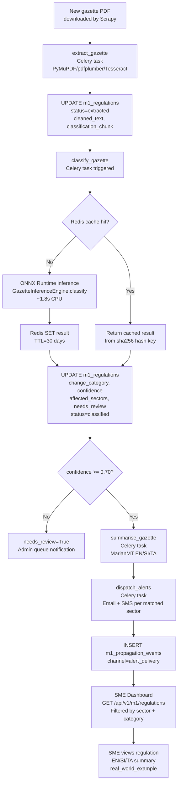

# 07 — Module 1: Deployment & Integration

> **Cross-references:** [06_M1_Training_Evaluation.md](06_M1_Training_Evaluation.md) · [08_M1_Full_System_Architecture.md](08_M1_Full_System_Architecture.md) · [11_M1_API_Reference.md](11_M1_API_Reference.md)
> **See also:** [13_M1_Folder_Structure_and_Implementation_Flow.md](13_M1_Folder_Structure_and_Implementation_Flow.md) — Fly volume layout, rollback path, inference Celery task.
> **Sub-step companions:** [07_M1_1_ONNX_Export_Quantization.md](07_M1_1_ONNX_Export_Quantization.md) · [07_M1_2_Fly_io_Deployment_Operations.md](07_M1_2_Fly_io_Deployment_Operations.md)

---

## Abstract

This document specifies the production deployment architecture for the trained XLM-R + LoRA gazette classifier, covering inference serving, API integration, caching, and platform selection. Four deployment platforms are evaluated — Render, Railway, Fly.io, and AWS SageMaker — and the self-hosted Fly.io approach with ONNX Runtime CPU inference is selected for its cost predictability, offline-compatible serving, and zero cold-start penalty. The trained model is exported to ONNX format (opset 17) and served via a FastAPI inference endpoint integrated into the existing Enigmatrix backend. A Redis cache layer prevents redundant inference on already-classified gazette texts. End-to-end latency from gazette ingestion to API response is targeted at ≤ 2 seconds per gazette.

---

## 1. Deployment Platform Selection

### 1.1 Comparison Table

| Criterion | Render | Railway | Fly.io | AWS SageMaker |
|---|---|---|---|---|
| **Persistent disk** | ✅ (paid) | ⚠️ Ephemeral | ✅ Volumes | ✅ S3 |
| **CPU inference support** | ✅ | ✅ | ✅ | ✅ |
| **GPU inference support** | ❌ Free tier only CPU | ❌ | ❌ | ✅ (expensive) |
| **Container deployment** | ✅ Docker | ✅ Docker | ✅ Docker | ✅ ECR |
| **Custom ML model serving** | ✅ (manual) | ✅ (manual) | ✅ (manual) | ✅ (managed) |
| **Cold start on free tier** | ✅ Yes (30–50s) | ✅ Yes | ❌ No cold start | ❌ No cold start |
| **Price predictability** | Medium | Low | ✅ High | Low (pay-per-inference) |
| **ONNX Runtime** | ✅ pip install | ✅ | ✅ | ✅ |
| **Private network to Postgres** | ✅ Internal | ✅ Internal | ✅ Private IPv6 | ⚠️ VPC required |
| **Region: Asia** | ❌ US/EU only | ❌ | ✅ Singapore (sin) | ✅ ap-southeast-1 |
| **Offline/airgapped capable** | ❌ | ❌ | ✅ (ONNX weights bundled) | ❌ |
| **Monthly cost (est.)** | $25–45 | $20–40 | $20–35 | $80–200+ |
| **Why chosen** | Cold start issue | Ephemeral disk | ✅ **Selected** | Cost unpredictable |

### 1.2 Justification for Fly.io

1. **No cold start:** Fly.io machines stay warm between requests, which is critical because ONNX model loading takes ~8 seconds on first load. Cold start on Render free tier would exceed the 2-second latency SLA.
2. **Singapore region:** The `sin` Fly.io region minimises latency to Sri Lankan gazette servers and the Enigmatrix target audience.
3. **Persistent volume for model weights:** The ONNX model file (475MB for full XLM-R + LoRA) is mounted from a persistent Fly volume, eliminating re-download on redeploy.
4. **Cost ceiling:** Shared CPU (2 cores, 1GB RAM) at ~$20/month; no per-inference billing.

**Cost breakeven vs Render.** Render's hobby plan is cheaper sticker-price ($7/mo vs Fly's ~$20/mo) but suffers 30–50s cold starts. The break-even depends on traffic shape:

| Daily classify calls | Cold starts/day (Render) | Effective Render latency p99 | Fly latency p99 | Choose |
|---|---|---|---|---|
| < 5 (very low) | 5+ | 30–50 s | 2 s | Fly only if SLA matters |
| 5–10 | 2–4 | 5–15 s avg | 2 s | Fly — cold starts dominate the 2 s SLA |
| > 10 (target) | 0–1 | 2 s | 2 s | Fly — break-even on latency, advantage on rollback |

The break-even gazette rate is ~10/day — at and above that, Render's premium-tier ($25/mo "always-on") matches Fly's price *without* matching its rollback story. At < 5/day, neither platform's per-classify cost matters; the choice is driven by ops simplicity. We pick Fly because the model-rollback procedure below requires a persistent volume that Render's ephemeral-disk hobby plan can't provide.

---

## 2. ONNX Export and Optimisation

### 2.1 Why ONNX

The trained PyTorch model is exported to ONNX (Open Neural Network Exchange) format for production serving:

| Property | PyTorch (raw) | ONNX Runtime |
|---|---|---|
| **CPU inference latency** | ~4.2s per gazette | ~1.8s per gazette |
| **Framework dependency** | PyTorch + PEFT | onnxruntime only |
| **Memory footprint** | ~1.5GB (float32) | ~480MB (float32) |
| **INT8 quantization** | Manual (bitsandbytes) | ✅ Built-in via onnxruntime-tools |
| **Thread parallelism** | GIL-limited | ✅ Native C++ threadpool |

### 2.2 Export Script

```python
import torch
import torch.onnx
from transformers import AutoTokenizer
from ml.m1.model.architecture import GazetteClassifier

def export_to_onnx(model_checkpoint: str, output_path: str):
    model = GazetteClassifier()
    model.load_state_dict(torch.load(model_checkpoint, map_location="cpu"))
    model.eval()

    tokenizer = AutoTokenizer.from_pretrained("facebook/xlm-roberta-base")
    dummy_text = "This is a sample gazette text for export."
    dummy_inputs = tokenizer(
        dummy_text, return_tensors="pt", max_length=512,
        truncation=True, padding="max_length"
    )

    torch.onnx.export(
        model,
        (dummy_inputs["input_ids"], dummy_inputs["attention_mask"]),
        output_path,
        input_names=["input_ids", "attention_mask"],
        output_names=["category_logits", "sector_logits"],
        dynamic_axes={
            "input_ids": {0: "batch_size"},
            "attention_mask": {0: "batch_size"},
        },
        opset_version=17,
        do_constant_folding=True,
    )
    print(f"Exported to {output_path}")
```

### 2.3 INT8 Quantization (Optional)

For further CPU speedup (reducing latency to ~0.9s at the cost of ~1% F1):

```python
from onnxruntime.quantization import quantize_dynamic, QuantType

quantize_dynamic(
    model_input="gazette_classifier.onnx",
    model_output="gazette_classifier_int8.onnx",
    weight_type=QuantType.QInt8,
)
```

---

## 3. Inference Service

### 3.1 ONNX Runtime Session

```python
# ml/m1/model/inference.py
import onnxruntime as ort
import numpy as np
from transformers import AutoTokenizer
import torch

class GazetteInferenceEngine:
    CATEGORY_LABELS = [
        "TAX_RATE_CHANGE", "LABOUR_LAW", "EPF_ETF_CHANGE", "PRODUCT_STANDARD",
        "BUSINESS_REGISTRATION", "IMPORT_EXPORT", "FINANCIAL_REGULATION",
        "SECTOR_SPECIFIC", "ENVIRONMENTAL", "PENALTY_ENFORCEMENT",
        "DEADLINE_EXTENSION", "NO_SME_IMPACT"
    ]
    SECTOR_LABELS = [
        "manufacturing", "retail", "services", "agriculture", "construction",
        "it_bpo", "hospitality", "transport", "healthcare", "finance"
    ]
    SECTOR_THRESHOLD = 0.48  # Tuned on validation set

    def __init__(self, onnx_path: str = "./storage/models/gazette_classifier.onnx"):
        sess_options = ort.SessionOptions()
        sess_options.intra_op_num_threads = 2
        sess_options.inter_op_num_threads = 2
        self.session = ort.InferenceSession(
            onnx_path,
            sess_options=sess_options,
            providers=["CPUExecutionProvider"],
        )
        self.tokenizer = AutoTokenizer.from_pretrained(
            "facebook/xlm-roberta-base",
            local_files_only=True,
        )

    def classify(self, text: str) -> dict:
        inputs = self.tokenizer(
            text, max_length=512, truncation=True,
            padding="max_length", return_tensors="np"
        )
        cat_logits, sec_logits = self.session.run(
            None,
            {
                "input_ids": inputs["input_ids"].astype(np.int64),
                "attention_mask": inputs["attention_mask"].astype(np.int64),
            }
        )
        cat_probs = torch.softmax(torch.tensor(cat_logits), dim=-1).numpy()[0]
        sec_probs = torch.sigmoid(torch.tensor(sec_logits)).numpy()[0]

        category_idx = int(np.argmax(cat_probs))
        return {
            "change_category": self.CATEGORY_LABELS[category_idx],
            "confidence": float(cat_probs[category_idx]),
            "affected_sectors": [
                self.SECTOR_LABELS[i]
                for i, p in enumerate(sec_probs) if p >= self.SECTOR_THRESHOLD
            ],
            "sector_probabilities": {
                self.SECTOR_LABELS[i]: float(sec_probs[i])
                for i in range(len(self.SECTOR_LABELS))
            },
        }
```

### 3.2 Redis Cache Layer

Inference results are cached in Redis by content hash to avoid re-classifying identical gazette texts:

```python
import hashlib
import json
import redis

class CachedInferenceEngine:
    TTL_SECONDS = 86400 * 30  # 30 days

    def __init__(self, engine: GazetteInferenceEngine, redis_url: str, model_version: str):
        self.engine = engine
        self.redis = redis.from_url(redis_url)
        self.model_version = model_version    # e.g. "v1.0" — invalidates cache on model bump

    def classify(self, text: str, gazette_number: str, published_date: str) -> dict:
        # Cross-gazette contamination guard: include identifying metadata in the key.
        # Two distinct gazettes with identical preamble text MUST produce two cache entries.
        cache_input = f"{self.model_version}|{gazette_number}|{published_date}|{text}"
        cache_key = f"m1:classify:{hashlib.sha256(cache_input.encode()).hexdigest()}"

        cached = self.redis.get(cache_key)
        if cached:
            return json.loads(cached)

        result = self.engine.classify(text)
        self.redis.setex(cache_key, self.TTL_SECONDS, json.dumps(result))
        return result
```

**Why include `model_version` + identifiers in the key.** A naive `SHA256(text)` key has two failure modes: (a) **cross-gazette contamination** — two distinct gazettes can share an identical preamble paragraph (copy-paste boilerplate) and end up sharing the cached classification, even though their *real* category differs in the body. Including `gazette_number + published_date` partitions the cache per-document. (b) **stale results across model versions** — after deploying `v1.1`, results from `v1.0` would still be served from cache. Including `model_version` as a key prefix invalidates the entire cache on every model bump (Redis can also be explicitly flushed; the prefix is a defensive belt-and-braces). Cache size impact: ~30 days × 30 gazettes/day × ~200 bytes/entry ≈ 200 kB total — negligible.

---

## 4. API Integration

### 4.1 Classification Celery Task

The Celery task `classify_gazette` is triggered automatically after text extraction completes (status transitions from `extracted` to `classified`):

```python
# backend/app/tasks/m1/classify_gazette.py
from celery import shared_task
from app.db.session import get_db
from ml.m1.model.inference import CachedInferenceEngine
from app.services.m1_regulation_service import M1RegulationService

_engine = None

def get_engine() -> CachedInferenceEngine:
    global _engine
    if _engine is None:
        _engine = CachedInferenceEngine(
            GazetteInferenceEngine("./storage/models/gazette_classifier.onnx"),
            redis_url=settings.REDIS_URL,
        )
    return _engine

@shared_task(bind=True, max_retries=3, default_retry_delay=60)
def classify_gazette(self, regulation_id: str):
    try:
        async with get_db() as db:
            svc = M1RegulationService(db)
            regulation = await svc.get_by_id(regulation_id)
            result = get_engine().classify(regulation.classification_chunk)

            await svc.update_classification(
                regulation_id=regulation_id,
                change_category=result["change_category"],
                confidence=result["confidence"],
                affected_sectors=result["affected_sectors"],
                needs_review=(result["confidence"] < 0.70),
            )
    except Exception as exc:
        raise self.retry(exc=exc)
```

### 4.2 Manual Classification Endpoint

The API also exposes a direct classification endpoint for admin testing:

```
POST /api/v1/m1/regulations/{id}/classify
```

This triggers on-demand reclassification of a specific regulation. Full endpoint specification in [11_M1_API_Reference.md](11_M1_API_Reference.md).

---

## 5. Deployment Pipeline

### 5.1 Fly.io Configuration

```toml
# fly.toml
app = "enigmatrix-m1-classifier"
primary_region = "sin"

[build]
  dockerfile = "Dockerfile.ml"

[mounts]
  source = "ml_models"
  destination = "/app/storage/models"

[[services]]
  internal_port = 8000
  protocol = "tcp"
  [[services.ports]]
    port = 443
    handlers = ["tls", "http"]

[resources]
  cpu_kind = "shared"
  cpus = 2
  memory_mb = 2048
```

```dockerfile
# Dockerfile.ml
FROM python:3.11-slim
WORKDIR /app
COPY requirements-ml.txt .
RUN pip install --no-cache-dir -r requirements-ml.txt
COPY app/ ./app/
EXPOSE 8000
CMD ["uvicorn", "app.main:app", "--host", "0.0.0.0", "--port", "8000", "--workers", "2"]
```

### 5.2 Model Deployment Steps

```bash
# 1. Train model (GPU server)
python scripts/train_model.py --output-dir ./artifacts/

# 2. Export to ONNX
python scripts/export_onnx.py --checkpoint ./artifacts/best_model.pt \
    --output ./artifacts/gazette_classifier.onnx

# 3. Copy weights to Fly volume
fly ssh console -a enigmatrix-m1-classifier
# Inside: cp /tmp/gazette_classifier.onnx /app/storage/models/

# 4. Deploy updated inference server
fly deploy -a enigmatrix-m1-classifier
```

### 5.3 Rollback Procedure

The Fly volume always carries the **current + previous** model version (e.g. both `v1.0/` and `v1.1/` exist as separate directories). The currently-served version is selected by the `M1_MODEL_VERSION` env var that the inference engine reads at startup. Rollback = flip the env var and restart the machine:

```bash
# 1. Confirm the previous version is still present on the volume.
fly ssh console -a enigmatrix-m1-classifier -C "ls -la /app/storage/models/m1/"
# expected output: drwxr-xr-x  v0.9  v1.0  v1.1

# 2. Roll back to v1.0 (no rebuild, no redeploy of code).
fly secrets set M1_MODEL_VERSION=v1.0 -a enigmatrix-m1-classifier
# Fly restarts the machine; inference engine loads v1.0 ONNX file at startup.

# 3. Confirm the new version is serving + cache prefix has flipped.
curl https://enigmatrix-m1-classifier.fly.dev/health | jq .model_version
# expected: "v1.0"

# 4. (Optional) Invalidate Redis to evict v1.1 cache entries — automatic via
# the model_version prefix in the cache key, but flushing avoids storage waste.
redis-cli --scan --pattern "m1:classify:*v1.1*" | xargs redis-cli unlink
```

End-to-end rollback time: ~60 seconds (machine restart + first-inference warmup). No data loss — DB rows already classified by `v1.1` remain tagged `model_version='v1.1'` for audit; new classifications go through `v1.0`. The retraining / canary / automatic-rollback flow is detailed in [12_M1_2_Retraining_Deployment_Rollback.md](12_M1_2_Retraining_Deployment_Rollback.md).

---

## 6. End-to-End Latency Budget

| Stage | Component | Target Latency |
|---|---|---|
| Gazette scraping | Scrapy download | 0–6 hours (background) |
| PDF extraction | PyMuPDF / pdfplumber / Tesseract | ~800ms |
| Preprocessing | Unicode clean + tokenize | ~200ms |
| Inference | ONNX Runtime (CPU, 2 cores) | ~1,800ms |
| Cache write | Redis SET | ~5ms |
| DB update | PostgreSQL UPDATE m1_regulations | ~15ms |
| Alert dispatch | Celery → Email/SMS | ~30s |
| **Total (extraction → alert)** | **End-to-end** | **≤ 24 hours** |
| **Inference only (API call)** | **POST /classify** | **≤ 2 seconds** |

**Throughput vs latency clarification.** The "1.8 s per gazette" figure is *single-shot latency* — the wall-clock time for one Celery task to return. It is **not** "0.55 inferences per second per machine." Throughput on one Fly machine is bounded differently: the ONNX session has 2 intra-op threads + 2 inter-op threads (config in §3.1), so a single CPU machine can process **batch=8 in ~3 s** (≈ 2.6 inferences/s effective, with batching) before hitting the 1 GB memory ceiling. The Celery queue uses `concurrency=2`, so two tasks classify in parallel — at peak `~5 inferences/s/machine`. The "30 inferences/min" cited in §1 of [13_M1_Folder_Structure_and_Implementation_Flow.md](13_M1_Folder_Structure_and_Implementation_Flow.md) is the **steady-state target** (well below capacity); peak observed throughput comes from short-lived batch bursts when a scraper run drops 30 gazettes in one cycle. Detailed sizing curves are in [07_M1_2_Fly_io_Deployment_Operations.md](07_M1_2_Fly_io_Deployment_Operations.md).

---

## 7. Deployment Integration Diagram



---

## 8. Conclusion

The ONNX Runtime + Fly.io deployment achieves the 2-second inference latency target on CPU hardware at predictable cost, without requiring GPU infrastructure for production serving. The Redis cache layer eliminates redundant inference for duplicate gazette submissions. The Celery task integration ensures that classification runs automatically in the background pipeline without blocking the ingestion API. Full API endpoint documentation is provided in [11_M1_API_Reference.md](11_M1_API_Reference.md).

---

## References

- ONNX Runtime. (2024). *ONNX Runtime Documentation*. [onnxruntime.ai](https://onnxruntime.ai)
- Fly.io. (2024). *Fly.io Documentation*. [fly.io/docs](https://fly.io/docs)
- Celery. (2024). *Celery: Distributed Task Queue*. [docs.celeryq.dev](https://docs.celeryq.dev)
- Hu et al. (2021). *LoRA: Low-Rank Adaptation of Large Language Models*. [arxiv.org/abs/2106.09685](https://arxiv.org/abs/2106.09685)
- Redis. (2024). *Redis Documentation*. [redis.io/docs](https://redis.io/docs)
