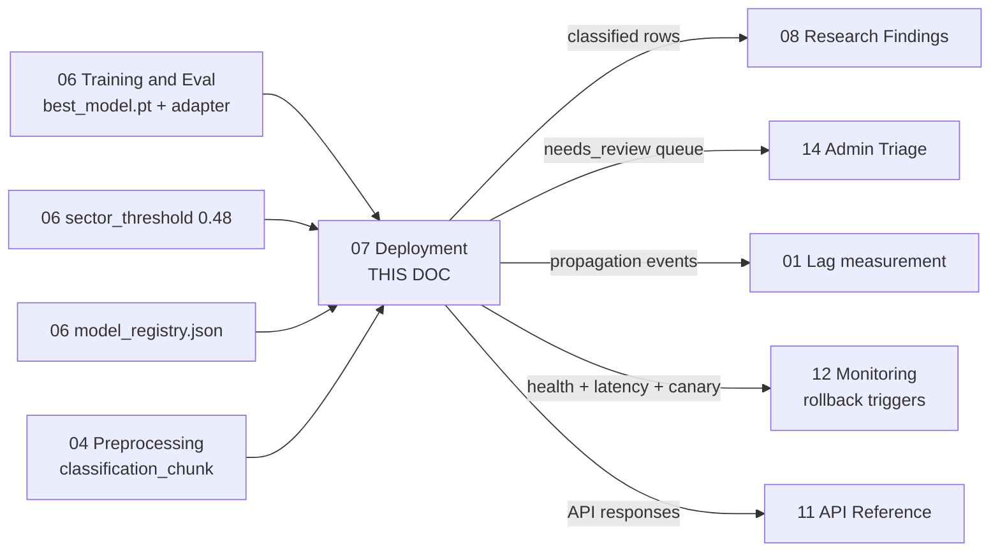
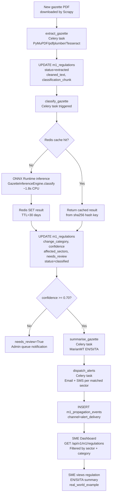

# 07 — Module 1: Deployment & Integration

> **Cross-references:** [06_M1_Training_Evaluation.md](06_M1_Training_Evaluation.md) · [08_M1_Full_System_Architecture.md](08_M1_Full_System_Architecture.md) · [11_M1_API_Reference.md](11_M1_API_Reference.md) · [12_M1_Monitoring_Maintenance.md](12_M1_Monitoring_Maintenance.md)
> **Code map:** [13_M1_Folder_Structure_and_Implementation_Flow.md](13_M1_Folder_Structure_and_Implementation_Flow.md) — Fly volume layout, rollback path, inference Celery task; `ml/m1/model/export_onnx.py`, `ml/m1/model/inference.py`, `backend/app/tasks/m1/classify_gazette.py`, `fly.toml`.
> **Consolidation note (2026-07-29):** this document now carries the full content previously split across `07_M1_1_ONNX_Export_Quantization` and `07_M1_2_Fly_io_Deployment_Operations`. Those two files have been retired; every export flag, quantization script, calibration reader, machine-sizing table, canary implementation, health check, and cost alert from them lives below.

> [!warning] Truth-ledger sync — 2026-08-02
> **This is the most out-of-date document in the set.** It specifies ONNX export, INT8 quantization and Fly.io serving for an XLM-R + LoRA model that was **rejected and never exported**.
> What actually deploys: a joblib-serialised scikit-learn pipeline loaded in-process by the backend behind `M1_CLASSIFIER_BACKEND` (default `linearsvc`). There is no ONNX session, no quantization step and no Fly volume in the live path.
> The ONNX/Fly.io material below is retained as the **contingency design** for the dormant `onnx` backend — it is not a description of production.
>
> **Canonical record:** [[final/works/11_CLASSIFIER_FREEZE_AND_INTEGRATION|11_CLASSIFIER_FREEZE_AND_INTEGRATION]] · [[18_M1_Dataset_And_Model_Lineage]] · `final/works/evidence/M1_OPERATING_EVIDENCE_2026-08-02.json`
> **Submitted-report copy:** [[final/report/Enigmatrix_Consolidated_Final_Report_FULL|Enigmatrix_Consolidated_Final_Report_FULL]] (Part I = group report, Part II = Module 1 dissertation).

---

## 0. Where This Document Sits in the Pipeline

This is the boundary between research and production. Upstream of it, a model is a file that scores well on a held-out split. Downstream of it, that model is a running service whose predictions land in the database, trigger alerts to real SMEs, and become the raw material for the lag findings. Everything in this document exists to make that transition survivable: to keep the served model numerically identical to the evaluated one, to make swapping it back a sixty-second operation, and to keep the whole thing inside a latency and cost budget that a research project can actually pay.

| | Stage | Produced by | What this document does with it | Handed to |
|---|---|---|---|---|
| **In** | `best_model.pt` + LoRA adapter (~2.4 MB) | [06_M1_Training_Evaluation.md](06_M1_Training_Evaluation.md) §11 | Loaded once and exported to ONNX opset 17 (§2); optionally quantized to INT8 | — |
| **In** | Tuned `sector_threshold` (0.48) | [06_M1_Training_Evaluation.md](06_M1_Training_Evaluation.md) §5.2 | Hard-wired into `GazetteInferenceEngine.SECTOR_THRESHOLD` — the serving cut-off must equal the evaluated one | — |
| **In** | `model_registry.json` / `model_versions` row with `is_active` | [06_M1_Training_Evaluation.md](06_M1_Training_Evaluation.md) §9 | Selects which version the machine loads at startup; the same string prefixes every cache key | — |
| **In** | Measured FP32 macro-F1 (0.928) and per-language F1 | [06_M1_Training_Evaluation.md](06_M1_Training_Evaluation.md) §4 | The reference the INT8 model is compared against — quantization is accepted or rejected against these numbers, not against a fresh evaluation | — |
| **In** | `classification_chunk` per regulation | [04_M1_Preprocessing_Pipeline.md](04_M1_Preprocessing_Pipeline.md) §chunking | The single text field the Celery task passes to `classify()` | — |
| **In** | 8-domain / 3-sector label strings | [09_M1_Annotation_Guidelines.md](09_M1_Annotation_Guidelines.md) §2, §4 | `CATEGORY_LABELS` and `SECTOR_LABELS` — index order must match the training label map exactly | — |
| **Step** | Export, validate, quantize | *this document* §2 | `gazette_classifier.onnx` (471 MB) and `gazette_classifier_int8.onnx` (118 MB) | — |
| **Step** | Serve, cache, integrate | *this document* §3–§4 | Running FastAPI + Celery inference path behind Redis | — |
| **Step** | Deploy, canary, roll back | *this document* §5 | Fly machine in `sin` with a versioned model volume | — |
| **Out** | Classified rows — `change_category`, `confidence`, `affected_sectors`, `needs_review`, `model_version` | — | — | [08_M1_Full_System_Architecture.md](08_M1_Full_System_Architecture.md) §research findings; [14_M1_Tracking_Workflows.md](14_M1_Tracking_Workflows.md) admin review queue for `needs_review = true` |
| **Out** | `m1_propagation_events` rows with `channel='alert_delivery'` | — | — | [08_M1_Full_System_Architecture.md](08_M1_Full_System_Architecture.md) lag computation; [01_M1_Research_Problem.md](01_M1_Research_Problem.md) §lag measurement |
| **Out** | `/health` payload, latency percentiles, canary split metrics | — | — | [12_M1_Monitoring_Maintenance.md](12_M1_Monitoring_Maintenance.md) §performance monitoring and §retraining/rollback |
| **Out** | Classification API responses | — | — | [11_M1_API_Reference.md](11_M1_API_Reference.md) — endpoint contracts and the SME dashboard |


```mermaid
flowchart LR
    T[06 Training and Eval<br/>best_model.pt + adapter] --> E[07 Deployment<br/>THIS DOC]
    TH[06 sector_threshold 0.48] --> E
    RG[06 model_registry.json] --> E
    P[04 Preprocessing<br/>classification_chunk] --> E
    E -->|classified rows| R[08 Research Findings]
    E -->|needs_review queue| AD[14 Admin Triage]
    E -->|propagation events| L[01 Lag measurement]
    E -->|health + latency + canary| MO[12 Monitoring<br/>rollback triggers]
    E -->|API responses| API[11 API Reference]
```

**Why the ordering matters.** Three dependencies here run backwards, from deployment into decisions made earlier, and they are the reason this document cannot be written after the fact.

*Export before quantize before serve.* The FP32 ONNX export must be validated against the PyTorch model to 1e-4 (§2.3) *before* INT8 quantization is attempted. Reversed, a quantization accuracy drop and an export bug are indistinguishable — both present as "the served model scores lower than the paper" with no way to tell which. Validating in order isolates the two.

*The latency budget reaches backward into architecture.* The 2-second inference SLA is why `xlm-roberta-large` was rejected in [05_M1_Model_Architecture.md](05_M1_Model_Architecture.md) §4.1, and why the `target_modules` expansion was rejected in §4.4 there. Those decisions were made against a budget this document owns. A deployment decision that relaxes the budget would reopen both.

*The rollback story decided the platform.* §1.2 selects Fly.io partly on cold-start grounds, but the load-bearing reason is that the rollback procedure in §5.4 requires a persistent volume holding two model versions simultaneously. A platform with ephemeral disk cannot do that, and rollback-by-redeploy takes minutes rather than seconds — which matters because [12_M1_Monitoring_Maintenance.md](12_M1_Monitoring_Maintenance.md) treats rollback as a routine automated response, not an emergency.

---

## Abstract

This document specifies the deployment architecture that *was designed* for a trained XLM-R + LoRA gazette classifier, covering ONNX export and quantization, inference serving, caching, API integration, and platform selection and operations. **As of 2026-08-02 none of it is the live path** — see the truth-ledger banner above and §∞ below. It is retained as the contingency design for the dormant `onnx` backend. Four deployment platforms are evaluated — Render, Railway, Fly.io, and AWS SageMaker — and the self-hosted Fly.io approach with ONNX Runtime CPU inference is selected for its cost predictability, offline-compatible serving, zero cold-start penalty, and persistent-volume rollback path.

The trained model is exported to ONNX format (opset 17) with dynamic batch and sequence axes, validated to within 1e-4 of the PyTorch model, and optionally quantized to INT8 for a 2× speedup at a measured 0.9 pp macro-F1 cost. It is served via a FastAPI inference endpoint integrated into the existing Enigmatrix backend, behind a Redis cache keyed on model version plus gazette identity. End-to-end latency from gazette ingestion to API response is targeted at ≤ 2 seconds per gazette, and model version changes roll out through a hash-bucketed canary with a sixty-second rollback.

**Implementation status:** 🔲 Deferred. The Fly app, `fly.toml`, and health-check endpoint land with BUILD_07; the ONNX export, quantization, and validation pipeline land with BUILD_11. All latency and F1 figures below are targets or projections until BUILD_11 measures them.

---

## 1. Deployment Platform Selection

**Why this decision comes first.** Every subsequent section assumes properties of the platform — that the machine stays warm, that a volume persists across deploys, that an environment variable can be flipped without a rebuild. Choosing the platform after designing the serving path would mean discovering that the serving path is unimplementable.

### 1.1 Comparison Table

| Criterion | Render | Railway | Fly.io | AWS SageMaker |
|---|---|---|---|---|
| **Persistent disk** | ✅ (paid) | ⚠️ Ephemeral | ✅ Volumes | ✅ S3 |
| **CPU inference support** | ✅ | ✅ | ✅ | ✅ |
| **GPU inference support** | ❌ Free tier only CPU | ❌ | ❌ | ✅ (expensive) |
| **Container deployment** | ✅ Docker | ✅ Docker | ✅ Docker | ✅ ECR |
| **Custom ML model serving** | ✅ (manual) | ✅ (manual) | ✅ (manual) | ✅ (managed) |
| **Cold start on free tier** | ✅ Yes (30–50 s) | ✅ Yes | ❌ No cold start | ❌ No cold start |
| **Price predictability** | Medium | Low | ✅ High | Low (pay-per-inference) |
| **ONNX Runtime** | ✅ pip install | ✅ | ✅ | ✅ |
| **Private network to Postgres** | ✅ Internal | ✅ Internal | ✅ Private IPv6 | ⚠️ VPC required |
| **Region: Asia** | ❌ US/EU only | ❌ | ✅ Singapore (`sin`) | ✅ ap-southeast-1 |
| **Offline/airgapped capable** | ❌ | ❌ | ✅ (ONNX weights bundled) | ❌ |
| **Monthly cost (est.)** | $25–45 | $20–40 | $20–35 | $80–200+ |
| **Why chosen** | Cold start issue | Ephemeral disk | ✅ **Selected** | Cost unpredictable |

### 1.2 Justification for Fly.io

1. **No cold start.** Fly.io machines stay warm between requests, which is critical because ONNX model loading takes ~8 seconds on first load. A cold start on Render's free tier would exceed the 2-second latency SLA on its own, before any inference happens.
2. **Singapore region.** The `sin` region minimises latency to Sri Lankan gazette servers and to the Enigmatrix target audience.
3. **Persistent volume for model weights.** The ONNX model file (471 MB for full XLM-R + LoRA) is mounted from a persistent Fly volume, eliminating re-download on redeploy — and, more importantly, allowing two versions to coexist (§5.4).
4. **Cost ceiling.** Shared CPU with no per-inference billing, so cost does not scale with gazette volume.

**Cost breakeven vs Render.** Render's hobby plan is cheaper on sticker price ($7/mo vs Fly's ~$20/mo) but suffers 30–50 s cold starts. The break-even depends on traffic shape:

| Daily classify calls | Cold starts/day (Render) | Effective Render latency p99 | Fly latency p99 | Choose |
|---|---|---|---|---|
| < 5 (very low) | 5+ | 30–50 s | 2 s | Fly only if the SLA matters |
| 5–10 | 2–4 | 5–15 s avg | 2 s | Fly — cold starts dominate the 2 s SLA |
| > 10 (target) | 0–1 | 2 s | 2 s | Fly — break-even on latency, advantage on rollback |

The break-even gazette rate is ~10/day. At and above that, Render's premium tier ($25/mo "always-on") matches Fly's price *without* matching its rollback story. Below 5/day, neither platform's per-classify cost matters and the choice comes down to ops simplicity.

**The criterion that actually decided it** is the last row of the table above, not the first: Fly is chosen because the model-rollback procedure in §5.4 requires a persistent volume holding the current *and* previous model, which Render's ephemeral-disk hobby plan cannot provide at any traffic level. Cold start is the reason Render loses at low volume; rollback is the reason it loses even at high volume where cold start stops mattering.

**When to reconsider.** Re-evaluated annually. A move to GPU serving would reopen the whole comparison, since it changes both the cost structure and the set of platforms that are viable.

---

## 2. ONNX Export, Validation, and Quantization

**Why ONNX rather than shipping PyTorch.** The trained artefact and the served artefact do not have to be the same object, and there are strong reasons for them not to be. Serving PyTorch means shipping PyTorch plus PEFT into the production image, running inference under the GIL, and carrying a 1.5 GB memory footprint. ONNX Runtime removes all three.

| Property | PyTorch (raw) | ONNX Runtime |
|---|---|---|
| **CPU inference latency** | ~4.2 s per gazette | ~1.8 s per gazette |
| **Framework dependency** | PyTorch + PEFT | `onnxruntime` only |
| **Memory footprint** | ~1.5 GB (float32) | ~480 MB (float32) |
| **INT8 quantization** | Manual (bitsandbytes) | ✅ Built-in via `onnxruntime-tools` |
| **Thread parallelism** | GIL-limited | ✅ Native C++ threadpool |

The 4.2 s → 1.8 s row is the one that matters: PyTorch CPU inference does not fit inside the 2-second SLA at all, so this is not an optimisation but a precondition.

**Implementation status:** 🔲 Deferred (BUILD_11 — `ml/m1/model/export_onnx.py`, `quantize.py`).

### 2.1 Export Configuration

```python
import torch
import torch.onnx
from transformers import AutoTokenizer
from ml.m1.model.architecture import GazetteClassifier


def export_to_onnx(model_checkpoint: str, output_path: str):
    model = GazetteClassifier()
    model.load_state_dict(torch.load(model_checkpoint, map_location="cpu"))
    model.eval()

    tokenizer = AutoTokenizer.from_pretrained("facebook/xlm-roberta-base")
    dummy_text = "This is a sample gazette text for export."
    dummy_inputs = tokenizer(
        dummy_text, return_tensors="pt", max_length=512,
        truncation=True, padding="max_length"
    )

    torch.onnx.export(
        model,
        (dummy_inputs["input_ids"], dummy_inputs["attention_mask"]),
        output_path,
        input_names=["input_ids", "attention_mask"],
        output_names=["category_logits", "sector_logits"],
        dynamic_axes={
            "input_ids":       {0: "batch", 1: "seq"},
            "attention_mask":  {0: "batch", 1: "seq"},
            "category_logits": {0: "batch"},
            "sector_logits":   {0: "batch"},
        },
        opset_version=17,                  # min that supports XLM-R operators cleanly
        do_constant_folding=True,
        export_params=True,
    )
    print(f"Exported to {output_path}")
```

**Each flag, and what breaks without it:**

- **`opset_version=17`** is the minimum where all RoBERTa-family operators (LayerNorm with axis ≠ −1, GatherElements) are stable. Earlier opsets emit warnings and can translate an operator incorrectly; later opsets are forward-compatible, so 17 is a floor rather than a pin.
- **`dynamic_axes` on `seq`** allows variable input lengths. Real gazette inputs are usually well under 512 tokens once padding is stripped; without a dynamic sequence axis the runtime always pads to 512 and pays full-length compute on every document. This is the single most commonly missed flag and its symptom is described in §8.
- **`dynamic_axes` on `batch`** is what enables the batched-throughput path in §6. Without it the graph is fixed at batch=1.
- **`do_constant_folding=True`** is a free 5–10 % latency improvement — constants that the graph can pre-compute are folded at export time rather than at every inference.
- **`export_params=True`** embeds the weights in the file rather than referencing external tensors, which is what makes the artefact a single copyable object on the Fly volume.

### 2.2 The Export Contract

The four tensor names — `input_ids`, `attention_mask`, `category_logits`, `sector_logits` — are a contract with [05_M1_Model_Architecture.md](05_M1_Model_Architecture.md) §6 upstream and with `GazetteInferenceEngine` in §3.1 downstream. `session.run` binds inputs by name, so a rename in any of the three places produces a load-time failure at best and a silently mismatched output ordering at worst. They are not adjustable.

Equally load-bearing and easier to get wrong: the **index order of `CATEGORY_LABELS` and `SECTOR_LABELS` in §3.1 must match the training label map**. The ONNX graph emits logits, not names. A reordered label list produces a service that is confidently and consistently wrong, with no exception raised anywhere.

### 2.3 Validation Against PyTorch Output

```python
import torch, onnxruntime as ort, numpy as np


def validate_export(pt_model, onnx_path: str, samples: list[str]) -> dict:
    sess = ort.InferenceSession(onnx_path)
    max_diff = 0.0
    for text in samples:
        inputs = tokenizer(text, return_tensors="pt", max_length=512, truncation=True, padding=True)
        pt_out = pt_model(inputs.input_ids, inputs.attention_mask)
        onnx_out = sess.run(None, {"input_ids": inputs.input_ids.numpy(),
                                    "attention_mask": inputs.attention_mask.numpy()})
        diff = np.abs(pt_out[0].detach().numpy() - onnx_out[0]).max()
        max_diff = max(max_diff, diff)
    return {"max_abs_diff": float(max_diff),
            "passes_threshold": max_diff < 1e-4}
```

The `1e-4` threshold is the standard ONNX export sanity check. Above it, something in the export went wrong — usually a misnamed dynamic axis or an operator that did not survive opset translation. **This check runs before quantization, always.** It is what lets a later F1 drop be attributed to quantization rather than to export, and it is cheap: 50 samples, seconds of runtime.

### 2.4 INT8 Quantization

For further CPU speedup — roughly halving latency at the cost of ~1 pp F1:

```python
from onnxruntime.quantization import quantize_dynamic, QuantType

quantize_dynamic(
    model_input="gazette_classifier.onnx",
    model_output="gazette_classifier_int8.onnx",
    weight_type=QuantType.QInt8,
    op_types_to_quantize=["MatMul", "Gather"],
)
```

**Dynamic rather than static, and why that is the right first choice.** `quantize_dynamic` needs no calibration dataset for weight quantization — only activations are quantized at runtime. Static quantization is up to 2× faster again but requires a representative calibration set and costs roughly another 0.3 pp F1. Starting dynamic means the first deployment has one fewer artefact to maintain and one fewer thing that can be silently unrepresentative. Static quantization is worth revisiting after ~6 months of production data, when a genuinely representative calibration set exists as a by-product rather than as a curation task.

If static quantization is adopted, the calibration reader is:

```python
from onnxruntime.quantization import quantize_static, CalibrationDataReader


class GazetteCalibrationReader(CalibrationDataReader):
    def __init__(self, samples: list[str]):
        self.iter = iter(self._stream(samples))

    def _stream(self, samples):
        for text in samples:
            inputs = tokenizer(text, return_tensors="np", max_length=512,
                               truncation=True, padding="max_length")
            yield {"input_ids": inputs["input_ids"], "attention_mask": inputs["attention_mask"]}

    def get_next(self):
        return next(self.iter, None)
```

Calibration set: 50 hand-picked gazettes spanning all 8 domains and all 3 languages, stored at `research/data/quantization_calibration.parquet`. The spanning requirement is not decoration — a calibration set that under-represents Sinhala produces activation ranges tuned to English, which is precisely the failure mode §8 warns about.

### 2.5 Post-Quantization F1 Validation

Run the full test split through both `gazette_classifier.onnx` (FP32) and `gazette_classifier_int8.onnx` (INT8) and compare:

```text
FP32 macro-F1:   0.928 (mean ± std across 3 seeds)
INT8 macro-F1:   0.919  (Δ = -0.9 pp)
INT8 latency:    0.92 s (vs FP32 1.82 s — 2.0× speedup)
INT8 file size:  118 MB (vs FP32 471 MB — 4× smaller)
```

**The accept/reject rule, stated before the measurement.** If Δ exceeds 1.5 pp macro-F1, the INT8 model is rejected and FP32 ships. The observed 0.9 pp is accepted in exchange for a 2× speedup and a 4× size reduction — the size reduction matters more than it looks, because it is what lets two model versions plus the baseline coexist on the Fly volume (§5.2), which is what makes the rollback in §5.4 possible.

**Per-language F1 is checked too, not just macro.** INT8 sometimes degrades minority-class and low-resource-language F1 disproportionately, and a macro-F1 that moves 0.9 pp can hide a Sinhala drop of several points. The validation alerts if any per-language F1 falls more than 2 pp.

### 2.6 Serving-Stack Alternatives

| Option | Trade-off | Decision | When to reconsider |
|---|---|---|---|
| `onnxruntime` (chosen) | Free, cross-platform, broad operator coverage | ✅ Industry standard | Never on current evidence |
| TorchScript | Native PyTorch, no export step | ❌ Slower CPU inference; bigger dependency footprint | Only if ONNX is dropped for an unrelated reason |
| Triton Inference Server | GPU-optimised, production-grade serving | ❌ GPU not in scope; ONNX Runtime is sufficient at this volume | If GPU deployment becomes affordable |
| Quantize dynamic (chosen) | No calibration set needed | ✅ For the first deployment | If the static-quantization F1 drop proves acceptable — a further ~30 % latency reduction |
| Quantize static | Faster still | ⚠️ Needs a calibration set; ~+0.3 pp F1 drop | After ~6 months of production data |
| `QInt8` weight quantization | 2× speedup | ✅ Standard | If the accuracy drop exceeds 1.5 pp, try FP16 weight quantization — ~1.2× speedup, ~0.3 pp drop |

### 2.7 Worked Example — A Full Export Run

```text
$ python scripts/export_onnx.py --checkpoint storage/models/m1/v1.0/best_model.pt \
                                 --out storage/models/m1/v1.0/gazette_classifier.onnx

[INFO]  Loading PyTorch checkpoint (471 MB)
[INFO]  Exporting to ONNX opset 17
[INFO]  Validating ONNX output against PyTorch (50 samples)
[INFO]  Max absolute diff: 8.3e-6 (threshold 1e-4) — PASS
[INFO]  Wrote 471 MB ONNX file
[INFO]  Done in 18.4 s

$ python scripts/quantize_onnx.py --input storage/models/m1/v1.0/gazette_classifier.onnx \
                                   --out storage/models/m1/v1.0/gazette_classifier_int8.onnx

[INFO]  Quantizing (dynamic INT8)
[INFO]  Wrote 118 MB ONNX file
[INFO]  Running full test set through INT8 model (120 samples)
[INFO]  FP32 macro-F1: 0.928   INT8 macro-F1: 0.919   Δ: -0.9 pp — PASS
[INFO]  Latency: FP32 1.82s   INT8 0.92s (2.0x speedup)
```

Note the ordering in the log: export, then validate against PyTorch, then quantize, then validate F1. Each gate passes before the next stage runs, which is what makes a failure diagnosable — the log line that fails names the stage that broke.

---

## 3. Inference Service

### 3.1 ONNX Runtime Session

```python
# ml/m1/model/inference.py
import onnxruntime as ort
import numpy as np
from transformers import AutoTokenizer
import torch


class GazetteInferenceEngine:
    CATEGORY_LABELS = [
        "TAX_RATE_CHANGE", "IMPORT_EXPORT", "SECTOR_SPECIFIC", "EPF_ETF_CHANGE",
        "LABOUR_LAW", "PRODUCT_STANDARD", "BUSINESS_REGISTRATION",
        "PENALTY_ENFORCEMENT"
    ]
    SECTOR_LABELS = [
        "grocery_retail", "food_service", "general_retail"
    ]
    SECTOR_THRESHOLD = 0.48  # Tuned on validation set — see 06 §5.2

    def __init__(self, onnx_path: str = "./storage/models/gazette_classifier.onnx"):
        sess_options = ort.SessionOptions()
        sess_options.intra_op_num_threads = 2
        sess_options.inter_op_num_threads = 2
        self.session = ort.InferenceSession(
            onnx_path,
            sess_options=sess_options,
            providers=["CPUExecutionProvider"],
        )
        self.tokenizer = AutoTokenizer.from_pretrained(
            "facebook/xlm-roberta-base",
            local_files_only=True,
        )

    def classify(self, text: str) -> dict:
        inputs = self.tokenizer(
            text, max_length=512, truncation=True,
            padding="max_length", return_tensors="np"
        )
        cat_logits, sec_logits = self.session.run(
            None,
            {
                "input_ids": inputs["input_ids"].astype(np.int64),
                "attention_mask": inputs["attention_mask"].astype(np.int64),
            }
        )
        cat_probs = torch.softmax(torch.tensor(cat_logits), dim=-1).numpy()[0]
        sec_probs = torch.sigmoid(torch.tensor(sec_logits)).numpy()[0]

        category_idx = int(np.argmax(cat_probs))
        return {
            "change_category": self.CATEGORY_LABELS[category_idx],
            "confidence": float(cat_probs[category_idx]),
            "affected_sectors": [
                self.SECTOR_LABELS[i]
                for i, p in enumerate(sec_probs) if p >= self.SECTOR_THRESHOLD
            ],
            "sector_probabilities": {
                self.SECTOR_LABELS[i]: float(sec_probs[i])
                for i in range(len(self.SECTOR_LABELS))
            },
        }
```

**Three details that are decisions, not boilerplate.** `intra_op_num_threads = 2` and `inter_op_num_threads = 2` match the two shared CPU cores — over-subscribing threads on a shared-CPU machine costs latency rather than saving it, and this setting is what the throughput arithmetic in §6 is computed against. `local_files_only=True` on the tokenizer forces it to load from the image rather than reaching out to the Hugging Face hub, which is what makes the offline-capable claim in §1.1 true and prevents a hub outage from becoming a classification outage. And `sector_probabilities` is returned alongside the thresholded `affected_sectors` so that the threshold can be re-tuned retroactively against stored probabilities without re-running inference.

### 3.2 Redis Cache Layer

Inference results are cached in Redis by content hash to avoid re-classifying identical gazette texts:

```python
import hashlib
import json
import redis


class CachedInferenceEngine:
    TTL_SECONDS = 86400 * 30  # 30 days

    def __init__(self, engine: GazetteInferenceEngine, redis_url: str, model_version: str):
        self.engine = engine
        self.redis = redis.from_url(redis_url)
        self.model_version = model_version    # e.g. "v1.0" — invalidates cache on model bump

    def classify(self, text: str, gazette_number: str, published_date: str) -> dict:
        # Cross-gazette contamination guard: include identifying metadata in the key.
        # Two distinct gazettes with identical preamble text MUST produce two cache entries.
        cache_input = f"{self.model_version}|{gazette_number}|{published_date}|{text}"
        cache_key = f"m1:classify:{hashlib.sha256(cache_input.encode()).hexdigest()}"

        cached = self.redis.get(cache_key)
        if cached:
            return json.loads(cached)

        result = self.engine.classify(text)
        self.redis.setex(cache_key, self.TTL_SECONDS, json.dumps(result))
        return result
```

**Why the cache key is not simply `SHA256(text)`.** A naive text-only key has two failure modes, and both are silent:

1. **Cross-gazette contamination.** Two distinct gazettes can share an identical preamble paragraph — copy-paste boilerplate is the norm in the gazette stream — and would then share a cached classification even though their real domains differ in the body. Including `gazette_number + published_date` partitions the cache per document.
2. **Stale results across model versions.** After deploying `v1.1`, results computed by `v1.0` would still be served from cache, so a model upgrade would appear to have no effect on anything already seen. Including `model_version` in the key invalidates the entire cache on every model bump. Redis can also be flushed explicitly; the prefix is belt-and-braces.

Cache size impact is negligible: ~30 days × 30 gazettes/day × ~200 bytes/entry ≈ 200 kB total. The cache is not there to save storage or money — it is there to make re-running a Celery task free, which is what makes the task safe to retry (§4.1).

---

## 4. API Integration

### 4.1 Classification Celery Task

The Celery task `classify_gazette` is triggered automatically after text extraction completes (status transitions from `extracted` to `classified`):

```python
# backend/app/tasks/m1/classify_gazette.py
from celery import shared_task
from app.db.session import get_db
from ml.m1.model.inference import CachedInferenceEngine, GazetteInferenceEngine
from app.services.m1_regulation_service import M1RegulationService

_engine = None


def get_engine() -> CachedInferenceEngine:
    global _engine
    if _engine is None:
        _engine = CachedInferenceEngine(
            GazetteInferenceEngine("./storage/models/gazette_classifier.onnx"),
            redis_url=settings.REDIS_URL,
            model_version=settings.M1_MODEL_VERSION,
        )
    return _engine


@shared_task(bind=True, max_retries=3, default_retry_delay=60)
def classify_gazette(self, regulation_id: str):
    try:
        async with get_db() as db:
            svc = M1RegulationService(db)
            regulation = await svc.get_by_id(regulation_id)
            result = get_engine().classify(regulation.classification_chunk)

            await svc.update_classification(
                regulation_id=regulation_id,
                change_category=result["change_category"],
                confidence=result["confidence"],
                affected_sectors=result["affected_sectors"],
                needs_review=(result["confidence"] < 0.70),
            )
    except Exception as exc:
        raise self.retry(exc=exc)
```

**Why the engine is a module-level singleton.** ONNX model loading takes ~8 seconds. Instantiating the engine per task would add that to every classification and blow the SLA by a factor of four. The lazy global means the first task on a worker pays the load cost and every subsequent one does not — which is also why `auto_stop_machines = "off"` in §5.1 is not a luxury: a stopped machine re-pays the 8 seconds.

**Why `needs_review` is thresholded at 0.70 here rather than inside the model.** Confidence routing is a policy decision, not a model property. The threshold governs how much human review capacity the admin queue in [14_M1_Tracking_Workflows.md](14_M1_Tracking_Workflows.md) receives, so it is tuned against reviewer throughput, not against F1. It also depends on the model being *calibrated* — an over-confident model sends too little to review — which is why ECE ≤ 0.05 is an acceptance criterion in [06_M1_Training_Evaluation.md](06_M1_Training_Evaluation.md) §4.1 rather than an optional nicety.

**Why retries are safe.** `max_retries=3` with a 60-second delay is only sound because classification is idempotent: the cache key in §3.2 is deterministic given the same model version and document, so a retry after a transient database failure re-uses the cached result rather than paying for inference twice.

### 4.2 Manual Classification Endpoint

The API also exposes a direct classification endpoint for admin testing:

```text
POST /api/v1/m1/regulations/{id}/classify
```

This triggers on-demand reclassification of a specific regulation. Full endpoint specification is in [11_M1_API_Reference.md](11_M1_API_Reference.md). Its main operational use is post-rollback: after a version flip, a specific misclassified regulation can be re-run against the newly active model without waiting for a full backfill.

---

## 5. Deployment Pipeline and Operations

**Implementation status:** 🔲 Deferred (BUILD_07 — Fly app provisioned, `fly.toml` in repo root, `backend/app/api/v1/health.py`).

### 5.1 Production `fly.toml`

```toml
# fly.toml — production
app           = "enigmatrix-m1-classifier"
primary_region = "sin"                              # Singapore — closest to SL
kill_signal   = "SIGINT"
kill_timeout  = 30                                  # grace period for in-flight tasks

[build]
  dockerfile = "Dockerfile.ml"

[mounts]
  source      = "ml_models"                          # Fly volume name
  destination = "/app/storage/models"
  # Volume layout:
  # /app/storage/models/m1/
  #   v1.1/    (current)
  #   v1.0/    (previous — rollback target)
  #   baseline/ (TF-IDF baseline — keep for ablation reporting)

[env]
  M1_MODEL_VERSION          = "v1.1"               # flipped to v1.0 to rollback
  M1_MODEL_CANARY_PCT       = "100"                # 10/50/100 during canary rollout
  M1_PDF_TEXT_THRESHOLD     = "200"
  M1_PDF_SCANNED_THRESHOLD  = "30"

[[services]]
  internal_port = 8000
  protocol      = "tcp"
  auto_stop_machines  = "off"                       # never stop — eliminates cold start
  auto_start_machines = "on"
  min_machines_running = 1

  [[services.ports]]
    port     = 443
    handlers = ["tls", "http"]
  [[services.ports]]
    port     = 80
    handlers = ["http"]
    force_https = true

  [services.concurrency]
    type     = "requests"
    soft_limit = 20
    hard_limit = 25

  [[services.tcp_checks]]
    interval = "15s"
    timeout  = "5s"
    grace_period = "30s"
  [[services.http_checks]]
    interval     = "30s"
    timeout      = "5s"
    method       = "get"
    path         = "/health"
    protocol     = "http"
    tls_skip_verify = false

[[vm]]
  size      = "shared-cpu-1x"
  memory_mb = 1024                                  # see the upgrade path in §5.2
  cpu_kind  = "shared"
```

```dockerfile
# Dockerfile.ml
FROM python:3.11-slim
WORKDIR /app
COPY requirements-ml.txt .
RUN pip install --no-cache-dir -r requirements-ml.txt
COPY app/ ./app/
EXPOSE 8000
CMD ["uvicorn", "app.main:app", "--host", "0.0.0.0", "--port", "8000", "--workers", "2"]
```

**The three settings that carry the design.** `auto_stop_machines = "off"` is what buys the "no cold start" property that §1.2 selected the platform for — turning it on to save a few dollars would silently reintroduce the 8-second model load into the p99. `kill_timeout = 30` gives in-flight Celery classifications time to finish during a deploy rather than being killed mid-task. And `hard_limit = 25` is the cost guard from §5.6: a runaway worker cannot spin up unbounded concurrency.

### 5.2 Machine-Size Upgrade Path

| Size | Memory | $/mo | When to use |
|---|---|---|---|
| `shared-cpu-1x` | 256 MB | $2 | NEVER for M1 — too little for the ONNX session |
| `shared-cpu-1x` | 1 GB (default) | $3 | Today; up to ~5 gazettes/day |
| `shared-cpu-2x` | 2 GB | $12 | When inference latency p95 exceeds 3 s |
| `shared-cpu-4x` | 4 GB | $24 | When batching is needed for > 30 gazettes/day bursts |
| `performance-2x` | 8 GB dedicated | $62 | High-throughput steady state (> 100 gazettes/day) |
| Multiple `shared-cpu-2x` machines | per-machine cost | additive | Horizontal scale plus sticky-session routing for canary |

The default is `shared-cpu-1x` with 1 GB, and the upgrade is triggered by the SLA alert in §6 rather than pre-emptively. Note that the two cost figures in this document operate at different granularity: §1.1's $20–35/month is the platform-level estimate used for the selection decision; the column above prices the VM line item alone.

**The volume layout is a capacity constraint, not just an organisational one.** Two FP32 versions at 471 MB each plus the baseline is already ~1 GB. This is the concrete reason the INT8 artefact's 118 MB size in §2.5 matters operationally: it is what keeps "current + previous + baseline" comfortably resident, and therefore what keeps §5.4's rollback instant rather than requiring a download.

### 5.3 Model Deployment Steps

```bash
# 1. Train model (GPU server)
python scripts/train_model.py --output-dir ./artifacts/

# 2. Export to ONNX
python scripts/export_onnx.py --checkpoint ./artifacts/best_model.pt \
    --output ./artifacts/gazette_classifier.onnx

# 3. Copy weights to Fly volume
fly ssh console -a enigmatrix-m1-classifier
# Inside: cp /tmp/gazette_classifier.onnx /app/storage/models/

# 4. Deploy updated inference server
fly deploy -a enigmatrix-m1-classifier
```

Note that steps 3 and 4 are separable, and that separation is the point: weights land on the volume *before* any traffic is routed to them, so the canary in §5.5 is a configuration change rather than a deployment.

### 5.4 Rollback Procedure

The Fly volume always carries the **current + previous** model version — both `v1.0/` and `v1.1/` exist as separate directories. The currently served version is selected by the `M1_MODEL_VERSION` environment variable that the inference engine reads at startup. Rollback is therefore a variable flip and a restart, with no rebuild and no redeploy of code:

```bash
# 1. Confirm the previous version is still present on the volume.
fly ssh console -a enigmatrix-m1-classifier -C "ls -la /app/storage/models/m1/"
# expected output: drwxr-xr-x  v0.9  v1.0  v1.1

# 2. Roll back to v1.0 (no rebuild, no redeploy of code).
fly secrets set M1_MODEL_VERSION=v1.0 -a enigmatrix-m1-classifier
# Fly restarts the machine; inference engine loads v1.0 ONNX file at startup.

# 3. Confirm the new version is serving + cache prefix has flipped.
curl https://enigmatrix-m1-classifier.fly.dev/health | jq .model_version
# expected: "v1.0"

# 4. (Optional) Invalidate Redis to evict v1.1 cache entries — automatic via
# the model_version prefix in the cache key, but flushing avoids storage waste.
redis-cli --scan --pattern "m1:classify:*v1.1*" | xargs redis-cli unlink
```

End-to-end rollback time is ~60 seconds — machine restart plus first-inference warm-up. **No data is lost:** rows already classified by `v1.1` remain tagged `model_version='v1.1'` for audit, and new classifications go through `v1.0`. That per-row tagging is what makes a rollback analysable after the fact rather than merely reversible; without it, a mixed-version corpus would be indistinguishable from a single-version one.

Step 4 is genuinely optional because the `model_version` prefix in the cache key (§3.2) already guarantees correctness — flushing only reclaims space. The retraining, canary, and automatic-rollback flow that drives these steps is detailed in [12_M1_Monitoring_Maintenance.md](12_M1_Monitoring_Maintenance.md) §retraining and rollback.

### 5.5 Canary Traffic Split

Fly has no native canary routing, so the decision happens at the Celery task level:

```python
# backend/app/tasks/m1/classify_gazette.py
import os, hashlib


def model_version_for_gazette(gazette_id: str) -> str:
    """Hash gazette_id to a 0-99 bucket; route by M1_MODEL_CANARY_PCT."""
    canary_pct = int(os.environ.get("M1_MODEL_CANARY_PCT", "100"))
    if canary_pct == 100:
        return os.environ["M1_MODEL_VERSION"]
    bucket = int(hashlib.sha256(gazette_id.encode()).hexdigest()[:8], 16) % 100
    if bucket < canary_pct:
        return os.environ["M1_MODEL_VERSION"]                       # new
    return os.environ.get("M1_PREVIOUS_MODEL_VERSION", "v1.0")      # old
```

**Why hash-bucketing rather than a random draw.** Hash-based routing is **sticky**: the same gazette always routes to the same version, so re-running a Celery task is idempotent and a retry cannot flip a document between models. A random draw would make retried tasks non-deterministic and would corrupt the A/B comparison, since the same document could contribute to both arms. The chosen version is stored on the `m1_regulations` row, which is what makes the day-1 comparison in §5.7 a simple `GROUP BY`.

**When to reconsider.** One environment variable controlling one split is simple and sufficient. If multiple independent flags start compounding, move to a feature-flag service rather than adding a second bespoke router.

### 5.6 Health Checks, Failover, and Cost Alerts

```python
# backend/app/api/v1/health.py
@router.get("/health")
async def health():
    onnx_loaded = inference_engine.session is not None
    redis_ok = redis_client.ping()
    db_ok = (await db.execute(text("SELECT 1"))).scalar() == 1
    if all([onnx_loaded, redis_ok, db_ok]):
        return {"status": "ok", "model_version": MODEL_VERSION}
    raise HTTPException(503, "unhealthy")
```

`/health` is hit every 30 s by Fly. Three consecutive failures trigger a machine restart. If `min_machines_running=1` is breached because the machine is permanently failing, Fly attempts to migrate to another node in `sin`. If `sin` itself is unavailable, the secondary region `bom` (Mumbai) takes over automatically when configured with `regions = ["sin", "bom"]` — but failover takes ~3 minutes, during which the API is degraded.

**The health check asserts three dependencies, not one.** A process that is up but whose ONNX session failed to load, or whose Redis is unreachable, is worse than a process that is down: it accepts traffic and fails per-request. Returning `model_version` in the payload is what makes the rollback verification in §5.4 step 3 a one-line check rather than a log dig.

Cost alerts:

```bash
fly orgs billing notification create --budget 50 --period monthly
```

Alerts fire at 50 % and 80 % of budget consumption — the 50 % alert exists to give time to upgrade the plan or pause traffic before the 80 % alert becomes urgent. These route to the PagerDuty integration in `infra/pagerduty/fly_budget_alerts.yaml`.

### 5.7 Worked Example — A Canary Rollout

```text
[Day 0: deploy v1.1 to volume — but traffic still on v1.0]
fly ssh console -a enigmatrix-m1-classifier
$ cp -r /app/storage/models/m1/v1.0 /app/storage/models/m1/v1.1   # placeholder
$ scp local:storage/models/m1/v1.1/* /app/storage/models/m1/v1.1/

[Day 0: 10% canary]
fly secrets set M1_MODEL_VERSION=v1.1 M1_PREVIOUS_MODEL_VERSION=v1.0 M1_MODEL_CANARY_PCT=10 -a enigmatrix-m1-classifier
# Fly restarts machine; 10% of new gazettes hit v1.1, 90% hit v1.0

[Day 1: review canary metrics]
SELECT model_version, COUNT(*) AS n, AVG(confidence) AS avg_conf
FROM m1_regulations
WHERE created_at >= NOW() - INTERVAL '24 hours'
GROUP BY model_version;
#  v1.0  108 gaz  avg_conf 0.81
#  v1.1   12 gaz  avg_conf 0.83  → +2 pp, looks good

[Day 1: ramp to 50%]
fly secrets set M1_MODEL_CANARY_PCT=50 -a enigmatrix-m1-classifier

[Day 2: full rollout if metrics hold]
fly secrets set M1_MODEL_CANARY_PCT=100 -a enigmatrix-m1-classifier

[Day 30: clean up old version]
fly ssh console -a enigmatrix-m1-classifier -C "rm -rf /app/storage/models/m1/v1.0"
```

Two things worth noticing. At 10 % the canary arm has 12 documents after a full day — too few for a confident conclusion, which is why the ramp is staged rather than going straight to 100 % on a promising first look. And the cleanup at day 30 is what re-arms the rollback: until the old version is deleted, rollback is a variable flip; after deletion, it is a file transfer. The 30-day gap is the window in which a regression is still cheap to undo.

---

## 6. End-to-End Latency Budget

| Stage | Component | Target Latency |
|---|---|---|
| Gazette scraping | Scrapy download | 0–6 hours (background) |
| PDF extraction | PyMuPDF / pdfplumber / Tesseract | ~800 ms |
| Preprocessing | Unicode clean + tokenize | ~200 ms |
| Inference | ONNX Runtime (CPU, 2 cores) | ~1,800 ms |
| Cache write | Redis SET | ~5 ms |
| DB update | PostgreSQL UPDATE `m1_regulations` | ~15 ms |
| Alert dispatch | Celery → Email/SMS | ~30 s |
| **Total (extraction → alert)** | **End-to-end** | **≤ 24 hours** |
| **Inference only (API call)** | **POST /classify** | **≤ 2 seconds** |

**Read the two totals as answering two different questions.** The 24-hour end-to-end figure is the research-relevant one — it is the platform's contribution to the awareness lag that [08_M1_Full_System_Architecture.md](08_M1_Full_System_Architecture.md) measures, and it is dominated entirely by the scraping poll interval, not by anything this document controls. The 2-second inference figure is the engineering SLA, and inference is 90 % of it, which is why it constrained the architecture choice in [05_M1_Model_Architecture.md](05_M1_Model_Architecture.md) §4.1.

**Throughput vs latency clarification.** The "1.8 s per gazette" figure is *single-shot latency* — the wall-clock time for one Celery task to return. It is **not** "0.55 inferences per second per machine." Throughput on one Fly machine is bounded differently: the ONNX session has 2 intra-op threads and 2 inter-op threads (§3.1), so a single CPU machine can process **batch=8 in ~3 s** — roughly 2.6 inferences/s effective with batching — before hitting the 1 GB memory ceiling. The Celery queue uses `concurrency=2`, so two tasks classify in parallel, giving a peak of ~5 inferences/s/machine. The "30 inferences/min" cited in §1 of [13_M1_Folder_Structure_and_Implementation_Flow.md](13_M1_Folder_Structure_and_Implementation_Flow.md) is the **steady-state target**, well below capacity; peak observed throughput comes from short-lived bursts when a scraper run drops 30 gazettes in one cycle. Detailed sizing curves are in §5.2.

Confusing the two numbers is the standard way capacity planning goes wrong here: dividing a daily volume by single-shot latency understates capacity by roughly 9×, and would trigger an unnecessary machine upgrade from the §5.2 table.

---

## 7. Deployment Integration Diagram


```mermaid
flowchart TD
    A[New gazette PDF<br/>downloaded by Scrapy] --> B[extract_gazette<br/>Celery task<br/>PyMuPDF/pdfplumber/Tesseract]
    B --> C[UPDATE m1_regulations<br/>status=extracted<br/>cleaned_text, classification_chunk]
    C --> D[classify_gazette<br/>Celery task triggered]

    D --> E{Redis cache hit?}
    E -->|Yes| F[Return cached result<br/>from sha256 hash key]
    E -->|No| G[ONNX Runtime inference<br/>GazetteInferenceEngine.classify<br/>~1.8s CPU]
    G --> H[Redis SET result<br/>TTL=30 days]
    H --> I[UPDATE m1_regulations<br/>change_category, confidence<br/>affected_sectors, needs_review<br/>status=classified]
    F --> I

    I --> J{confidence >= 0.70?}
    J -->|No| K[needs_review=True<br/>Admin queue notification]
    J -->|Yes| L[summarise_gazette<br/>Celery task<br/>MarianMT EN/SI/TA]
    L --> M[dispatch_alerts<br/>Celery task<br/>Email + SMS per matched sector]
    M --> N[INSERT m1_propagation_events<br/>channel=alert_delivery]

    N --> O[SME Dashboard<br/>GET /api/v1/m1/regulations<br/>Filtered by sector + category]
    O --> P[SME views regulation<br/>EN/SI/TA summary<br/>real_world_example]
```

The `J` branch is where this document hands off in two directions at once: low-confidence documents leave the automated path entirely and become human work in [14_M1_Tracking_Workflows.md](14_M1_Tracking_Workflows.md), while confident ones continue to summarisation and alerting. The `N` node is the research handoff — every `m1_propagation_events` row is one observation in the lag distribution that [08_M1_Full_System_Architecture.md](08_M1_Full_System_Architecture.md) computes.

---

## 8. Failure Modes and Edge Cases

| Failure mode | How it is detected | Mitigation |
|---|---|---|
| **Opset incompatibility** — a new PyTorch operator is absent from opset 17 | Export raises or emits warnings | Pin the `torch` version in `pyproject.toml`; on upgrade, re-export and re-validate against §2.3 |
| **Dynamic axis mismatch** — `seq` not marked dynamic, so the runtime always pads to 512 | Inference benchmark: latency on a 50-token input equals 512-token latency | Mark both `batch` and `seq` dynamic (§2.1); the benchmark is the only reliable detector since nothing errors |
| **Quantization eats Sinhala F1** — INT8 degrades minority-language F1 disproportionately | Post-quantization validation measures *per-language* F1, not only macro | Alert if any per-language F1 drops more than 2 pp; fall back to FP32 or FP16 weight quantization |
| **Label order drift** — `CATEGORY_LABELS` no longer matches the training label map | No runtime error; predictions are consistently wrong | CI assertion comparing the serving label lists against the training label map (§2.2) |
| **Serving threshold diverges from the evaluated threshold** | `SECTOR_THRESHOLD` differs from `model_registry.json` | The threshold ships with the model registry entry ([06_M1_Training_Evaluation.md](06_M1_Training_Evaluation.md) §11) and is asserted at startup |
| **ONNX file exceeds the Fly volume** | Deploy fails or the volume fills | A 1 GB volume holds at most two FP32 versions; `fly vol extend` is online and free. INT8 artefacts relieve the pressure |
| **Volume full from accumulated versions** | `df` on the volume; deploy failure | Two versions plus baseline is ~1 GB; clean up versions older than 30 days (§5.7) |
| **Health-check flapping after deploy** — a slow ONNX load makes the first `/health` fail | Restart loop immediately post-deploy | `grace_period = 30s` on the HTTP check (§5.1) |
| **Region outage in `sin`** | Health checks fail across machines | `fly regions set bom` for manual failover; ~3 min degraded window; documented in the runbook |
| **Budget overrun from a runaway worker** | Fly budget alert at 50 % / 80 % | `concurrency.hard_limit = 25` caps in-flight work; per-day spend alert to PagerDuty |
| **Cross-gazette cache contamination** — shared boilerplate produces a shared cache entry | Two regulations with identical categories and suspiciously identical confidences | `gazette_number + published_date` in the cache key (§3.2) |
| **Stale cache after a model bump** | New model appears to change nothing | `model_version` prefix in the cache key; optional explicit flush (§5.4 step 4) |
| **Cold start reintroduced** by enabling `auto_stop_machines` | p99 latency jumps by ~8 s | Keep `auto_stop_machines = "off"`; this is the setting §1.2 chose the platform for |

---

## 9. Validation and Acceptance Criteria

**Export and quantization**

- **Bit-equivalence:** FP32 ONNX max-abs-diff vs PyTorch < 1e-4 on the 50-sample check, run before any quantization.
- **INT8 accuracy:** macro-F1 drop ≤ 1.5 pp and per-language F1 drop ≤ 2 pp, else FP32 ships.
- **Latency speedup:** INT8 ≥ 1.7× faster than FP32.
- **Reproducibility:** running the export twice from the same checkpoint produces byte-identical ONNX files, modulo timestamps.
- **Contract integrity:** input/output tensor names and label index order match the training-side definitions — asserted in CI.

**Serving**

- Inference-only latency ≤ 2 s p99 for a single gazette on `shared-cpu-1x` with 1 GB.
- `sector_threshold` applied at serving equals the value recorded in `model_registry.json`.
- Cache key includes model version, gazette number, and published date; a CI test asserts two distinct gazettes with identical preamble text produce two entries.
- ONNX export tested end-to-end on the production inference path before promotion.

**Deployment operations**

- **Deploy and rollback complete in < 90 s**, measured by a CI smoke test.
- **Health-check stability:** no `unhealthy` events in normal operation more than once per week.
- **Canary fairness:** hash-based bucketing produces a ~50 % split at `CANARY_PCT=50`, verified by a chi-squared test on a 1,000-gazette sample.
- **Cost:** monthly Fly spend within the $50 budget, or an alert fires.
- Previous model version retained on the volume for ≥ 30 days after full rollout.

---

## 10. Implementation Status and Code Map

| Artefact | Status | Location |
|---|---|---|
| ONNX export script | 🔲 BUILD_11 | `ml/m1/model/export_onnx.py`, `scripts/export_onnx.py` |
| Export validation vs PyTorch | 🔲 BUILD_11 | §2.3; `tests/m1/model/test_inference.py` |
| INT8 quantization script | 🔲 BUILD_11 | `ml/m1/model/quantize.py`, `scripts/quantize_onnx.py` |
| Quantization calibration set | 🔲 BUILD_11 | `research/data/quantization_calibration.parquet` |
| FP32 production model | 🔲 BUILD_11 | `storage/models/m1/v1.0/gazette_classifier.onnx` (471 MB) |
| INT8 production model | 🔲 BUILD_11 | `storage/models/m1/v1.0/gazette_classifier_int8.onnx` (118 MB) |
| ONNX Runtime inference engine | 🔲 BUILD_11 | `ml/m1/model/inference.py` |
| Redis cache layer | 🔲 BUILD_11 | `ml/m1/model/inference.py:CachedInferenceEngine` |
| Classification Celery task | 🔲 BUILD_07 | `backend/app/tasks/m1/classify_gazette.py` |
| Canary router | 🔲 BUILD_07 | `backend/app/tasks/m1/classify_gazette.py:model_version_for_gazette()` |
| Fly app + `fly.toml` | 🔲 BUILD_07 | repo root `fly.toml`, `Dockerfile.ml` |
| Health endpoint | 🔲 BUILD_07 | `backend/app/api/v1/health.py` |
| Fly volume `ml_models` | 🔲 BUILD_07 | mounted at `/app/storage/models` |
| Cost alerts | 🔲 BUILD_07 | `infra/pagerduty/fly_budget_alerts.yaml` |
| Manual classification endpoint | 🔲 BUILD_07 | `POST /api/v1/m1/regulations/{id}/classify` |

---

## 11. Conclusion

The ONNX Runtime plus Fly.io deployment achieves the 2-second inference latency target on CPU hardware at predictable cost, without requiring GPU infrastructure for production serving. The export path is gated at two points — numerical equivalence against PyTorch before quantization, and a stated F1-drop budget after it — so that a regression can always be attributed to the stage that caused it rather than discovered as an unexplained gap between the paper and production.

Fly.io was selected on cold-start and region grounds, but the decision was settled by rollback: a persistent volume carrying the current and previous model turns a version regression into a sixty-second environment-variable flip, which is what allows [12_M1_Monitoring_Maintenance.md](12_M1_Monitoring_Maintenance.md) to treat rollback as routine rather than exceptional. The hash-bucketed canary makes the ramp to a new version staged and sticky, and per-row `model_version` tagging keeps the resulting mixed corpus analysable.

The Redis cache layer eliminates redundant inference for duplicate gazette submissions, and its composite key is what prevents the two silent failures — cross-gazette contamination and stale cross-version results — that a naive text hash would introduce. The Celery task integration ensures classification runs automatically in the background pipeline without blocking the ingestion API, and its retry safety follows directly from that cache being deterministic. Full API endpoint documentation is in [11_M1_API_Reference.md](11_M1_API_Reference.md).

---

## References

- ONNX Runtime. (2024). *ONNX Runtime Documentation*. [onnxruntime.ai](https://onnxruntime.ai)
- Fly.io. (2024). *Fly.io Documentation*. [fly.io/docs](https://fly.io/docs)
- Celery. (2024). *Celery: Distributed Task Queue*. [docs.celeryq.dev](https://docs.celeryq.dev)
- Hu et al. (2021). *LoRA: Low-Rank Adaptation of Large Language Models*. [arxiv.org/abs/2106.09685](https://arxiv.org/abs/2106.09685)
- Redis. (2024). *Redis Documentation*. [redis.io/docs](https://redis.io/docs)

---

## ∞ Final-report reconciliation (2026-08-02)

*Added by the 2026-08-02 consolidation pass. Maps this document onto the submitted final report and records where the two disagree.*

**Where this document appears in the report:** Part I §3.14 (storage and deployment), Table 3.7 (storage and deployment layers) and Figure 4 (deployment-level component view); Part II Figure 5.2.

### What actually deploys

| Setting | Default | Meaning |
|---|---|---|
| `M1_CLASSIFIER_BACKEND` | `linearsvc` | `linearsvc` (frozen primary) or `onnx` (dormant XLM-R dual-head) |
| `M1_MODEL_LINEARSVC_DIR` | `models/m1/linearsvc_v6_primary` | resolved against cwd, then the workspace root |
| `M1_MODEL_ONNX_DIR` | `storage/models/m1/onnx/v1` | **empty — no artifact was ever exported** |
| `M1_CLASSIFIER_MIN_CONFIDENCE` | `0.55` | **ONNX path only** — calibrated probability threshold |
| `M1_CLASSIFIER_MIN_MARGIN` | *(unset)* | LinearSVC path — margin threshold, disabled by default; `.env.example` opts into 0.40 |

Path resolution tries cwd, then the workspace root, then falls back to the cwd form so the error message names the path an operator expects. This matters because artifacts live one level above the backend package and the service can legitimately start from either directory.

### The crash that reading prevented

`classify_gazette.py` contained `Decimal(str(round(result["confidence"], 2)))` and `result["confidence"] < MIN_CONFIDENCE`. The LinearSVC engine returns `confidence: None` by design, so pointing the existing service at the new engine would have raised `TypeError` on **every row** — a total pipeline outage on the first gazette. It was found by reading the call site before switching the backend, not by running it. That is worth recording as a process result, not just a bug fix.

### The inference payload contract

```json
{
  "confidence": null,
  "confidence_type": "not_available_uncalibrated_linearsvc",
  "decision_score": 1.84,
  "decision_margin": 0.97,
  "second_category": "TAX_RATE_CHANGE",
  "second_decision_score": 0.87,
  "class_scores": { "…": "…" }
}
```

| Permitted | Not permitted |
|---|---|
| Ranking rows against each other | Displaying a margin as a percentage |
| Prioritising a review queue | Thresholding as though 0.5 meant "50% sure" |

### Tests at the freeze

6 targeted + 3 export + 7 chunk-contract tests; the non-slow M1 model suite runs **26 passed, 2 deselected**, reproduced three times. `py_compile` clean across five backend modules.

---

## ∞ · RA-HMT serving path — 2026-08-03

The ONNX Runtime / INT8 / Fly.io path specified above was never taken: no transformer met
the promotion gate, so no ONNX artefact was ever exported. The deployed path is the frozen
LinearSVC primary, and there is now a third selectable backend beside it.

**Serving shape for `M1_CLASSIFIER_BACKEND=rahmt`** ([[24_M1_RAHMT_Hybrid_Architecture]] §11):

```
Celery worker process
  └── classifier_service._engine()          @lru_cache(maxsize=1)
        └── m1.model.RAHMTGazetteInference
              └── src.predict.RAHMTPredictor      loaded ONCE per process
                    ├── Branch A  joblib pipeline        ~10 MB
                    ├── Branch B  xlm-roberta-base + LoRA + heads   ~1.1 GB RSS
                    ├── Branch C  multilingual-e5-base + 777×768 index  ~1.1 GB RSS
                    └── rules     in-process keyword lexicon
```

**Load once per process, never per request.** Constructing a predictor per request would
reload two ~1.1 GB encoders every time. Both `classifier_service._engine()` and
`src.rahmt_service.get_predictor()` are `lru_cache`d for exactly this reason.

**Resource envelope.** Roughly 2.5 GB RSS with both neural branches loaded, against ~50 MB
for the LinearSVC primary. On a CPU-only or memory-constrained worker, set
`M1_RAHMT_USE_XLMR=false` and/or `M1_RAHMT_USE_RETRIEVAL=false`: the fusion layer
renormalises its weights over the branches that actually loaded, so degrading to Branch A +
rules is a supported operating point. Its confidence figures are **not** comparable to the
full system's — the temperature was fitted for the four-branch mixture.

**Base models are not in the artefact bundle.** `branch_b/lora_adapter/` is 3.5 MB of
adapter matrices; LoRA freezes the pretrained weights, so `xlm-roberta-base` is still needed
at inference, and Branch C needs the exact encoder that produced its index. The first run on
a host needs internet, or `results/models/{xlm-roberta-base,multilingual-e5-base}` populated
in advance. Commit hashes are pinned in `results/_huggingface_repos.json`.

**Pre-flight.** `m1_rahmt/scripts/validate_artifacts.py` exits `2` when `branches_available`
in `fusion_config.json` is incomplete — weights fitted while a branch was absent, applied
when it is present, silently mis-weight the ensemble. Run it in the deploy step, not by hand.

**Health.** `classifier_status()` on the `rahmt` backend returns `confidence_available:true`,
`confidence_type:'calibrated_temperature_scaled'`, `evidence_available:true`, the active
branch list, the fitted weights and thresholds, and a review rule expressed as an abstention
rung rather than a raw threshold.
