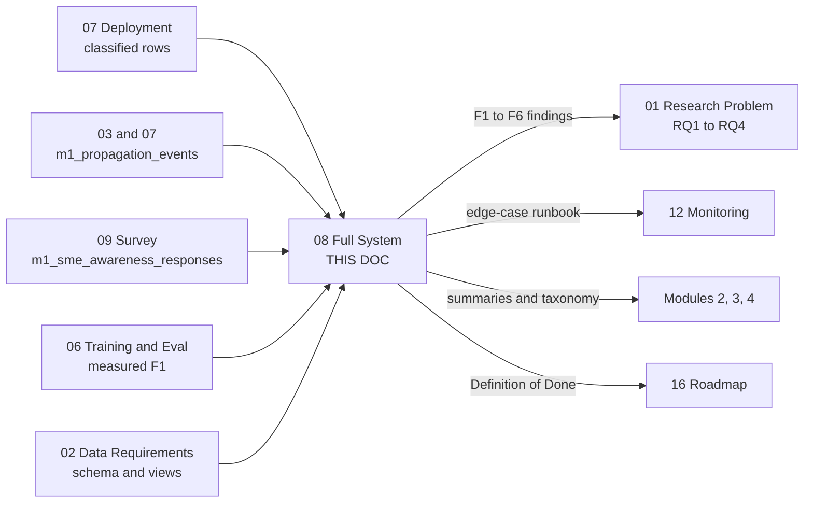
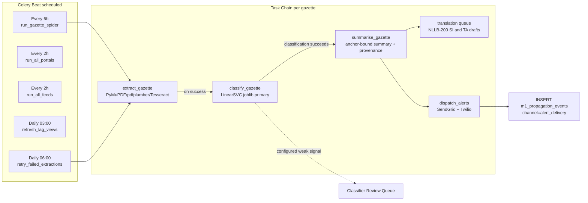
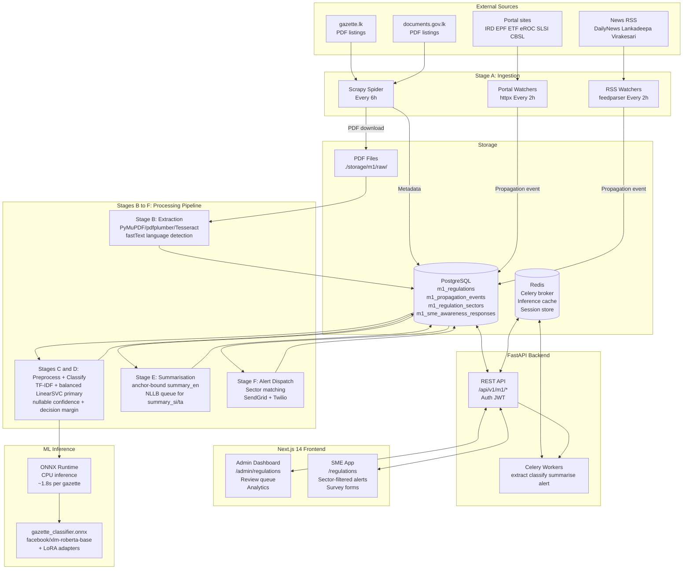

# 08 — Module 1: Full System Architecture

> **Cross-references:** [01_M1_Research_Problem.md](01_M1_Research_Problem.md) · [02_M1_Data_Requirements.md](02_M1_Data_Requirements.md) · [07_M1_Deployment_Integration.md](07_M1_Deployment_Integration.md) · [09_M1_Annotation_Guidelines.md](09_M1_Annotation_Guidelines.md) · [12_M1_Monitoring_Maintenance.md](12_M1_Monitoring_Maintenance.md)
> **Code map:** [13_M1_Folder_Structure_and_Implementation_Flow.md](13_M1_Folder_Structure_and_Implementation_Flow.md) — the full code tree this document's architecture maps to; `research/notebooks/findings_*.ipynb`, `m1_pipeline_errors`.
> **Consolidation note (2026-07-29):** this document now carries the full content previously split across `08_M1_1_Research_Findings_Extraction` and `08_M1_2_Edge_Cases_Failure_Modes`. Those two files have been retired; every finding-level SQL query, sample-size requirement, statistical test, notebook cell reference, and edge-case entry from them lives below. The parent document's 9-case table and the companion's 23-case catalogue have been merged into the **single deduplicated runbook in §13** — there is no longer a second overlapping list.

> [!warning] Truth-ledger sync — 2026-08-02
> The end-to-end architecture, happy-path timeline and failure runbook here remain accurate.
> Two corrections: the classification stage runs **LinearSVC V6 in-process**, not an ONNX session; and the review-queue predicate is now **mode-aware** (`confidence` / `margin` / `disabled`) rather than a fixed `confidence < 0.55`.
>
> **Canonical record:** [[final/works/11_CLASSIFIER_FREEZE_AND_INTEGRATION|11_CLASSIFIER_FREEZE_AND_INTEGRATION]] · [[18_M1_Dataset_And_Model_Lineage]] · `final/works/evidence/M1_OPERATING_EVIDENCE_2026-08-02.json`
> **Submitted-report copy:** [[final/report/Enigmatrix_Consolidated_Final_Report_FULL|Enigmatrix_Consolidated_Final_Report_FULL]] (Part I = group report, Part II = Module 1 dissertation).

---

## 0. Where This Document Sits in the Pipeline

Every other document in Module 1 describes one stage. This one describes the whole, and it does two jobs that no single-stage document can. First, it is the only place the pipeline is visible end to end, which is what makes the happy-path timeline in §9 and the failure runbook in §13 possible — both are statements about the *composition* of stages, not about any one of them. Second, it is where the pipeline stops being an engineering artefact and becomes a research instrument: §10 turns the rows the pipeline writes into the six findings the thesis reports.

| | Stage | Produced by | What this document does with it | Handed to |
|---|---|---|---|---|
| **In** | Classified regulations — `change_category`, `confidence`, `affected_sectors`, `needs_review`, `model_version` | [07_M1_Deployment_Integration.md](07_M1_Deployment_Integration.md) §4 | The denominator for every finding; `needs_review` drives the §13 runbook's Stage D rows | — |
| **In** | `m1_propagation_events` rows — one per channel observation per regulation | [07_M1_Deployment_Integration.md](07_M1_Deployment_Integration.md) §7 alert dispatch; [03_M1_Data_Collection.md](03_M1_Data_Collection.md) portal and RSS watchers | The raw material for F1, F2, F4, F5 — every lag is a difference between two timestamps in this table | — |
| **In** | `m1_sme_awareness_responses` — Q1–Q7 per respondent per regulation | [09_M1_Annotation_Guidelines.md](09_M1_Annotation_Guidelines.md) §9 survey instrument | The only source of `awareness_date`; F3, F4, F6 are computable from nothing else | — |
| **In** | Measured classifier F1 and per-language F1 | [06_M1_Training_Evaluation.md](06_M1_Training_Evaluation.md) §4 | The Definition of Done gate in §14 and the cross-module sensitivity claim in §15 | — |
| **In** | Schema, `v_m1_*` views, retention rules | [02_M1_Data_Requirements.md](02_M1_Data_Requirements.md) | The tables §2 enumerates and the views the §10 queries read | — |
| **Step** | Whole-system integration view | *this document* §1–§9 | Stage map, task graph, security posture, capacity envelope, happy-path timeline | — |
| **Step** | Findings extraction | *this document* §10–§11 | F1–F6 with SQL, tests, effect sizes, and four executable notebooks | — |
| **Step** | Failure cataloguing | *this document* §13 | A 28-entry runbook keyed by pipeline stage | — |
| **Out** | F1–F6 results, effect sizes, p-values, figures | — | — | [01_M1_Research_Problem.md](01_M1_Research_Problem.md) RQ1–RQ4 and the thesis findings chapter |
| **Out** | Edge-case runbook and detection metrics | — | — | [12_M1_Monitoring_Maintenance.md](12_M1_Monitoring_Maintenance.md) — every row's "monitoring" column is a dashboard or alert that document owns |
| **Out** | `m1_regulation_summaries`, `change_category`, `sector_tags`, `effective_date` | — | — | Modules 2, 3, and 4 — see §15 |
| **Out** | Definition of Done checklist | — | — | The thesis submission gate; [16_M1_Development_Roadmap.md](16_M1_Development_Roadmap.md) BUILD phase exit criteria |


```mermaid
flowchart LR
    D[07 Deployment<br/>classified rows] --> S[08 Full System<br/>THIS DOC]
    PE[03 and 07<br/>m1_propagation_events] --> S
    SV[09 Survey<br/>m1_sme_awareness_responses] --> S
    EV[06 Training and Eval<br/>measured F1] --> S
    SC[02 Data Requirements<br/>schema and views] --> S
    S -->|F1 to F6 findings| RQ[01 Research Problem<br/>RQ1 to RQ4]
    S -->|edge-case runbook| MO[12 Monitoring]
    S -->|summaries and taxonomy| MOD[Modules 2, 3, 4]
    S -->|Definition of Done| RM[16 Roadmap]
```

**Why the ordering matters.** This document can only be written last, and three dependencies explain why.

*Findings depend on a running pipeline, not on a design.* F1 through F6 are computed by SQL over tables that the pipeline fills during normal operation. No finding can be computed from a specification — which is why §10's implementation status is gated on BUILD_07/11 data flow rather than on writing more code, and why the notebooks in §11 exist as scaffolds long before they produce numbers.

*Pre-registration precedes unblinding.* §12.3 requires `research/preregistration.md` to list the hypotheses and tests *before* the data is unblinded. That ordering is what separates a finding from a post-hoc rationalisation, and it has to happen while §10 is still a plan.

*The runbook is written before the failures, not after.* Every row in §13 names a detection metric, and a detection metric that does not exist when the failure occurs means the failure is discovered by a user rather than by the system. The runbook is therefore an input to [12_M1_Monitoring_Maintenance.md](12_M1_Monitoring_Maintenance.md), which is why it is enumerated in advance rather than accumulated from incidents.

---

## Abstract

This document presents the complete end-to-end system architecture for Module 1 (Regulatory Awareness Gap) of the Enigmatrix platform. It integrates all subsystems — gazette collection, PDF extraction, text preprocessing, NLP classification, multilingual summarisation, alert dispatch, admin verification, SME survey collection, and propagation tracking — into a single unified view. The architecture follows a pipeline pattern driven by Celery task queues with PostgreSQL as the persistent store, Redis as the cache and broker, and a Next.js 14 frontend for admin management and SME self-service.

The document also specifies all database tables, all frontend routes, the interaction model between the ML inference engine and the API layer, the **six research findings F1–F6** with their SQL, sample-size requirements and statistical tests, and a **28-entry failure runbook** keyed by pipeline stage with a detection metric and resolution path for every entry.

**Implementation status:** 🟡 Partial. The pipeline stages, database layer, API layer, and the shipped frontend routes are live; deferred routes are marked BUILD_13 in §4. The research notebooks exist as scaffolds in `research/notebooks/` and populate during BUILD_07/11 once data flows. Edge-case handling is wired up alongside the code that produces each failure mode, so the §13 runbook is a mix of shipped and deferred entries.

---

## 1. Architecture Overview

The Module 1 system is organised as **six pipeline stages (A–F)** — matching the stage naming used in [02_M1_Data_Requirements.md](02_M1_Data_Requirements.md) §5 and [13_M1_Folder_Structure_and_Implementation_Flow.md](13_M1_Folder_Structure_and_Implementation_Flow.md) §Implementation flow. A seventh stage (G, Lag Measurement) runs asynchronously off the same data:

| Stage | Name | Components | Technology |
|---|---|---|---|
| **A** | Ingestion | Scrapy gazette spider, portal watchers, RSS watchers | Scrapy, httpx, feedparser |
| **B** | Extraction | PDF text extraction, language detection | PyMuPDF, pdfplumber, Tesseract, fastText |
| **C** | Preprocessing | Noise removal, metadata extraction, chunking | Regex rule sets, custom chunker |
| **D** | Classification | Frozen TF-IDF + balanced LinearSVC primary; optional legacy ONNX path | scikit-learn/joblib; ONNX Runtime retained but unpromoted |
| **E** | Summarisation | Anchor-bound English summary + queued SI/TA translation | FastAPI/Celery constrained service; NLLB-200 pull worker |
| **F** | Alerting | SME-sector matching, email/SMS dispatch | Celery, SendGrid, Twilio |
| — | Presentation | Admin dashboard, SME portal, survey forms | Next.js 14, FastAPI, PostgreSQL |
| **G** | Lag Measurement | Nightly view refresh + research notebooks | Postgres materialized views, pandas |

**Why stages C and D are listed separately here.** Earlier drafts collapsed them into a single "C / D — Preprocessing + Classification" row, which reads harmlessly but breaks the failure runbook: preprocessing failures (metadata regex misses, malformed effective dates) and classification failures (low confidence, tail-chunk misses) have entirely different owners, detection metrics, and resolution paths. §13 is organised by stage precisely so that a paged on-call knows which subsystem to open, and that only works if C and D are distinct.

Presentation is intentionally outside the A–F numbering — it observes the pipeline state but does not progress it. The earlier "six functional layers" framing has been unified with this stage-naming convention to remove the layer-versus-component ambiguity flagged in the original draft.

---

## 2. Database Layer

All Module 1 data is persisted in PostgreSQL (Aiven cloud instance). The core tables are:

| Table | Rows (est.) | Purpose |
|---|---|---|
| `m1_regulations` | ~10,000 | Central regulation records — all pipeline stages |
| `m1_regulation_sectors` | ~30,000 | M2M: regulation ↔ sector codes |
| `m1_propagation_events` | ~50,000 | Timestamped channel observations per regulation |
| `m1_sme_awareness_responses` | ~5,000 | Survey responses from registered SMEs |
| `sme_profiles` | ~1,000 | Registered SME accounts and sector preferences |
| `audit_log` | ~100,000 | All admin overrides and classification changes |

The `m1_regulations` status state machine:

```text
ingested → extracted → classified → summarized → alerted → archived
                               ↘
               classifier review signal (backend-declared mode)
               margin < configured cutoff · confidence < configured cutoff
               or disabled when no compatible threshold is configured
```

**Why one central table rather than a table per stage.** `m1_regulations` is the single source of truth and its `status` column is the pipeline's program counter. A stage-per-table design would make "where is this gazette right now" a join across six tables and would make the pipeline-state dashboard impossible to write cheaply. The cost is that every stage writes to the same row, which is why the audit trail in `audit_log` is not optional: without it, a status transition has no history and an admin override is indistinguishable from a model output.

The classifier-review branch is a side signal, not a probability claim or a terminal pipeline state. For the production LinearSVC backend, confidence is nullable and the raw decision margin ranks rows only. This matters for the Definition of Done in §14: the bar is that configured weak-signal rows are triaged and that `mode='disabled'` is visible, not that every model exposes the same score.

---

## 3. Backend API Layer

The FastAPI backend exposes the following Module 1 route groups:

| Route Group | Prefix | Auth | Description |
|---|---|---|---|
| Regulation CRUD | `/api/v1/m1/regulations` | Admin JWT | Full management of regulation records |
| Classification | `/api/v1/m1/regulations/{id}/classify` | Admin JWT | Trigger reclassification |
| Verification | `/api/v1/m1/regulations/{id}/verify` | Admin JWT | Expert verification |
| Sectors | `/api/v1/m1/regulations/{id}/sectors` | Admin JWT | Sector assignment management |
| Propagation | `/api/v1/m1/propagation-events` | Admin JWT | View channel propagation data |
| Survey | `/api/v1/m1/survey-responses` | SME JWT | Submit awareness survey |
| Public | `/api/v1/m1/regulations/public` | None | SME-facing read-only list |
| Analytics | `/api/v1/m1/analytics/lag` | Admin JWT | Propagation lag analytics |

Full endpoint specifications are in [11_M1_API_Reference.md](11_M1_API_Reference.md). The one unauthenticated route is deliberate: the public regulation list is the surface that lets a non-registered SME discover the platform, and requiring a login to see that regulations exist would defeat the awareness purpose the module is built around.

---

## 4. Frontend Routes

The Next.js 14 App Router frontend provides the following routes for Module 1.

### 4.1 Admin Routes (`/admin/*`)

> Real route paths verified against the shipped frontend. The earlier draft used placeholder component names (`RegulationsListPage`, `VerificationPage`, etc.) that do not match the actual Next.js App Router file structure — this table reflects what is in `frontend/app/(admin)/admin/` today, plus the deferred routes BUILD_13 will introduce. **For the user workflow on each surface, see [14_M1_Tracking_Workflows.md](14_M1_Tracking_Workflows.md).**

| Route | File | Status | Purpose |
|---|---|---|---|
| `/admin/regulations` | `(admin)/admin/regulations/page.tsx` | ✅ Shipped | Paginated table with filter rail (verification, domain, sector, status); bulk-verify action |
| `/admin/regulations/new` | `(admin)/admin/regulations/new/page.tsx` | ✅ Shipped | Manual entry — 4-card form (Identity / Dates / Sectors / Localised content) |
| `/admin/regulations/[id]/edit` | `(admin)/admin/regulations/[id]/edit/page.tsx` | ✅ Shipped | Edit + verify action (the verify action lives here, not on a separate `/verify` route) |
| `/admin/regulations/[id]/flow` | `(admin)/admin/regulations/[id]/flow/page.tsx` | ✅ Shipped | Visual M1→M2→M3 branching canvas |
| `/admin/regulations/[id]/authoring` | `(admin)/admin/regulations/[id]/authoring/page.tsx` | ✅ Shipped | 3-step guided wizard (Session-11 quick-start) |
| `/admin/surveys/awareness/responses` | `(admin)/admin/surveys/awareness/responses/page.tsx` | ✅ Shipped | M1 awareness response browser |
| `/admin/activity-log` | `(admin)/admin/activity-log/page.tsx` | ✅ Shipped | Audit-log viewer (Session 14) |
| `/admin/m1/pipeline/classifier-review` | `(admin)/admin/m1/pipeline/classifier-review/page.tsx` | ✅ Shipped | Mode-aware classifier triage for LinearSVC margin / legacy confidence / disabled threshold |
| `/admin/m1/analytics` | — | 🔲 Deferred (BUILD_13) | Lag dashboard + propagation tracker — see [14_M1_Tracking_Workflows.md](14_M1_Tracking_Workflows.md) §lag analytics |
| `/admin/m1/pipeline` | `(admin)/admin/m1/pipeline/page.tsx` | ✅ Shipped | Pipeline operations/health entry point; stage-detail depth remains partial |

Classifier triage and the pipeline operations page now consume Stage-D and Stage-A/B signals. Lag analytics is still deferred, so that part of the runbook's monitoring column continues to resolve to logs/SQL rather than a dedicated screen.

### 4.2 SME Routes (`/` and `/surveys/*`)

> The SME side uses `frontend/app/(app)/...` route groups, **not** `/portal/*`. The earlier draft's `/portal/regulations` and similar were aspirational; the real routes are `/regulations`, `/surveys/regulation/[id]`, and so on.

| Route | File | Status | Purpose |
|---|---|---|---|
| `/dashboard` | `(app)/dashboard/page.tsx` | ✅ Shipped | Pending regulations widget + stat cards |
| `/regulations` | `(app)/regulations/page.tsx` | ✅ Shipped | Full active-regulations browser |
| `/surveys` | `(app)/surveys/page.tsx` | ✅ Shipped | Surveys hub — two-tab (by regulation / by module) |
| `/surveys/regulation/[id]` | `(app)/surveys/regulation/[id]/page.tsx` | ✅ Shipped | Per-regulation unified M1→M2→M3 wizard |
| `/surveys/awareness` | `(app)/surveys/awareness/page.tsx` | ✅ Shipped | Standalone awareness instrument |
| `/surveys/history` | `(app)/surveys/history/page.tsx` | ✅ Shipped | Session history with status pills |
| `/profile` | `(app)/profile/page.tsx` | 🟡 View-only | Sector/region profile (editing deferred) |
| `/portal/m1/my-regulations` | — | 🔲 Deferred (BUILD_13) | Compliance/action-taken tracker — see [14_M1_Tracking_Workflows.md](14_M1_Tracking_Workflows.md) §compliance action tracking |
| `/portal/m1/deadlines` | — | 🔲 Deferred (BUILD_13) | Deadline countdown + alert history — see [14_M1_Tracking_Workflows.md](14_M1_Tracking_Workflows.md) §deadline alert history |

The `/surveys/awareness` route is the delivery surface for the instrument specified in [09_M1_Annotation_Guidelines.md](09_M1_Annotation_Guidelines.md) §9, and it is therefore load-bearing for F3, F4, and F6 — a broken survey page is a research outage, not a product one.

### 4.3 Workflow Reference

The verb-level workflow for each route — what an admin or SME *does* on the page, plus the intended workflow for deferred routes — is documented in the frontend workflow series:

| Surface | Workflow doc |
|---|---|
| Admin pipeline-state tracking | [14_M1_Tracking_Workflows.md](14_M1_Tracking_Workflows.md) §admin pipeline state tracking |
| Admin review queue | [14_M1_Tracking_Workflows.md](14_M1_Tracking_Workflows.md) §admin review queue triage |
| Admin verification | [14_M1_Tracking_Workflows.md](14_M1_Tracking_Workflows.md) §admin expert verification |
| Admin lag analytics | [14_M1_Tracking_Workflows.md](14_M1_Tracking_Workflows.md) §admin lag analytics |
| SME discovery | [14_M1_Tracking_Workflows.md](14_M1_Tracking_Workflows.md) §SME regulation discovery |
| SME awareness survey | [14_M1_Tracking_Workflows.md](14_M1_Tracking_Workflows.md) §SME awareness survey |
| SME compliance tracking | [14_M1_Tracking_Workflows.md](14_M1_Tracking_Workflows.md) §SME compliance action tracking |
| SME deadlines + alerts | [14_M1_Tracking_Workflows.md](14_M1_Tracking_Workflows.md) §SME deadline alert history |
| Category × Sector reference | [14_M1_Tracking_Workflows.md](14_M1_Tracking_Workflows.md) §category and sector workflows |

---

## 5. Celery Task Dependency Graph


```mermaid
flowchart LR
    subgraph Beat["Celery Beat scheduled"]
        B1[Every 6h<br/>run_gazette_spider]
        B2[Every 2h<br/>run_all_portals]
        B3[Every 2h<br/>run_all_feeds]
        B4[Daily 03:00<br/>refresh_lag_views]
        B5[Daily 06:00<br/>retry_failed_extractions]
    end

    subgraph Chain["Task Chain per gazette"]
        T1[extract_gazette<br/>PyMuPDF/pdfplumber/Tesseract]
        T2[classify_gazette<br/>LinearSVC joblib primary]
        T3[summarise_gazette<br/>anchor-bound summary + provenance]
        T3B[translation queue<br/>NLLB-200 SI and TA drafts]
        T4[dispatch_alerts<br/>SendGrid + Twilio]
    end

    B1 --> T1
    B5 --> T1
    T1 -->|on success| T2
    T2 -->|classification succeeds| T3
    T2 -.->|configured weak signal| REVIEW[Classifier Review Queue]
    T3 --> T3B
    T3 --> T4
    T4 --> PROP[INSERT m1_propagation_events<br/>channel=alert_delivery]
```

**Why the chain is a chain and not one task.** Each link is separately retryable, and the failure modes differ enough that a single task would have to distinguish them internally anyway — an OCR failure is permanent for that PDF, a SendGrid 429 is transient, and a low-confidence classification is neither. Splitting them means the retry policy in [07_M1_Deployment_Integration.md](07_M1_Deployment_Integration.md) §4.1 can be set per stage, and it means `retry_failed_extractions` at 06:00 can re-enter the chain at exactly one point rather than re-running the whole thing.

**The `B4` node is the research pipeline in miniature.** `refresh_lag_views` at 03:00 nightly is what makes the §10 findings queryable against materialized views rather than against a full scan of `m1_propagation_events`; if it fails silently, every finding still computes but against stale data. Its uptime is a monitoring concern owned by [12_M1_Monitoring_Maintenance.md](12_M1_Monitoring_Maintenance.md).

---

## 6. Complete System Architecture Diagram


```mermaid
flowchart TB
    subgraph External["External Sources"]
        G1[gazette.lk<br/>PDF listings]
        G2[documents.gov.lk<br/>PDF listings]
        G3[Portal sites<br/>IRD EPF ETF eROC SLSI CBSL]
        G4[News RSS<br/>DailyNews Lankadeepa Virakesari]
    end

    subgraph Ingestion["Stage A: Ingestion"]
        I1[Scrapy Spider<br/>Every 6h]
        I2[Portal Watchers<br/>httpx Every 2h]
        I3[RSS Watchers<br/>feedparser Every 2h]
    end

    subgraph Storage["Storage"]
        DB[(PostgreSQL<br/>m1_regulations<br/>m1_propagation_events<br/>m1_regulation_sectors<br/>m1_sme_awareness_responses)]
        PDF[PDF Files<br/>./storage/m1/raw/]
        CACHE[(Redis<br/>Celery broker<br/>Inference cache<br/>Session store)]
    end

    subgraph Pipeline["Stages B to F: Processing Pipeline"]
        B[Stage B: Extraction<br/>PyMuPDF/pdfplumber/Tesseract<br/>fastText language detection]
        C[Stages C and D: Preprocess + Classify<br/>TF-IDF + balanced LinearSVC primary<br/>nullable confidence + decision margin]
        E[Stage E: Summarisation<br/>anchor-bound summary_en<br/>NLLB queue for summary_si/ta]
        F[Stage F: Alert Dispatch<br/>Sector matching<br/>SendGrid + Twilio]
    end

    subgraph Backend["FastAPI Backend"]
        API[REST API<br/>/api/v1/m1/*<br/>Auth JWT]
        WORKER[Celery Workers<br/>extract classify summarise alert]
    end

    subgraph Frontend["Next.js 14 Frontend"]
        ADM[Admin Dashboard<br/>/admin/regulations<br/>Review queue<br/>Analytics]
        SME[SME App<br/>/regulations<br/>Sector-filtered alerts<br/>Survey forms]
    end

    subgraph ML["ML Inference"]
        ONNX[ONNX Runtime<br/>CPU inference<br/>~1.8s per gazette]
        MODEL[gazette_classifier.onnx<br/>facebook/xlm-roberta-base<br/>+ LoRA adapters]
    end

    G1 & G2 --> I1
    G3 --> I2
    G4 --> I3

    I1 -->|PDF download| PDF
    I1 -->|Metadata| DB
    I2 -->|Propagation event| DB
    I3 -->|Propagation event| DB

    PDF --> B
    B --> DB
    DB --> C
    C --> ONNX
    ONNX --> MODEL
    C --> DB
    DB --> E
    E --> DB
    DB --> F
    F --> DB

    DB <--> API
    CACHE <--> API
    CACHE <--> WORKER
    API --> WORKER

    API <--> ADM
    API <--> SME
```

**Read the arrows into and out of `DB` as the actual architecture.** Every stage reads from and writes to PostgreSQL rather than passing objects to the next stage, which makes the pipeline restartable at any point and makes the status column meaningful. The cost is that the database is a hard dependency for every stage — there is no degraded mode in which classification proceeds while the database is down — and that trade is why the `/health` check in [07_M1_Deployment_Integration.md](07_M1_Deployment_Integration.md) §5.6 asserts database reachability rather than just process liveness.

Note also that `I2` and `I3` write propagation events *without* going through the extraction pipeline. Portal and RSS watchers observe that a regulation has appeared somewhere; they do not ingest it as a new regulation. That asymmetry is what makes F1 and F2 measurable: the same regulation accumulates timestamped sightings across channels, and the lag is the difference between them.

---

## 7. Security Architecture

| Concern | Implementation |
|---|---|
| **API authentication** | JWT tokens (HS256, 24 h expiry) — admin and SME roles |
| **Admin-only endpoints** | `Depends(require_admin)` FastAPI dependency |
| **PDF storage** | Local filesystem, not served directly via HTTP |
| **Database** | Aiven managed PostgreSQL with TLS (`DB_SSL=True`) |
| **Redis** | Password-protected, internal network only |
| **ONNX model weights** | Fly.io persistent volume, not publicly accessible |
| **SME survey data** | Anonymised after 5 years per PDPA Sri Lanka |
| **Gazette PDFs** | Public documents — no PII concerns |

**The asymmetry in the last two rows is the whole security posture.** Gazettes are public records, so the pipeline's *input* needs no confidentiality protection at all — which removes an entire class of concern from Stages A through E. Everything sensitive enters at the survey: `m1_sme_awareness_responses` links a named business to statements about its own compliance behaviour, which is exactly the data an enforcement agency would find interesting. The 5-year anonymisation rule and the right-of-erasure path in [02_M1_Data_Requirements.md](02_M1_Data_Requirements.md) §governance exist for that table specifically.

---

## 8. Scalability Characteristics

| Dimension | Current Capacity | Bottleneck | Mitigation |
|---|---|---|---|
| **Inference throughput** | ~30 gazettes/minute (CPU) | ONNX Runtime CPU | INT8 quantization (2× speedup) |
| **Gazette ingestion volume** | ~500/year (comfortable) | None at current scale | Scrapy AutoThrottle self-adjusts |
| **Database connections** | 10 pool + 20 overflow | asyncpg pool exhaustion | Increase `pool_size` in `session.py` |
| **Redis memory** | ~50 MB for 1-year cache | Near zero at 500 docs/yr | 30-day TTL auto-expires old entries |
| **Alert dispatch** | ~1,000 SMEs per gazette | SendGrid rate limits | Batched dispatch — see §8.1 |

**None of these is the real constraint, and saying so is useful.** At 500 gazettes per year the system is running at a fraction of a percent of its inference capacity. The binding constraint on the whole module is human: 800 annotated documents, ~100 survey respondents, and one domain expert's review time. Capacity planning that optimises the machine side is optimising the wrong resource — which is why the §14 Definition of Done counts labels and respondents rather than throughput.

### 8.1 Alert Batching Contract

The T+0:15 happy-path timeline (§9) assumes ≤ 500 matched SMEs per gazette. At that volume, alerts dispatch concurrently within SendGrid's Pro-tier rate limit (100 emails/s). For *high-fan-out* gazettes — an EPF rate change reaches all 1,000+ registered SMEs, because it is economy-wide by construction — the dispatcher batches into 100-email chunks with 1-second sleeps, and the SLA shifts: **p99 alert delivery ≤ 1 hour** instead of the 24-hour end-to-end bound.

**Why the SLA bifurcates rather than being set to the worse number.** A single 1-hour SLA would hide the fact that the common case is 15 minutes, and the 15-minute figure is the one that matters for the research claim in §9 — it is the platform's measured contribution to closing the awareness gap. Stating both makes the claim honest about which gazettes it applies to. The chunked-dispatch implementation is in `backend/app/tasks/m1/alert_dispatch.py`, and the bifurcation is reflected in the monitoring spec ([12_M1_Monitoring_Maintenance.md](12_M1_Monitoring_Maintenance.md)).

---

## 9. Happy Path Timeline

The following timeline traces a single gazette from the moment the Scrapy spider detects a new URL to the moment SME alert emails are dispatched. All steps occur within a 15-minute window under normal operating conditions.

| Elapsed | Event | Component | Detail |
|---|---|---|---|
| T+0:00 | Scraper finds new gazette URL | Scrapy spider (`gazette_spider.py`) | Scheduler polls gazette.lk every 30 min; URL not in the `m1_sources` URL hash table |
| T+0:01 | PDF downloaded to `/tmp/` | Scrapy pipeline | `FilesPipeline` writes to local disk; SHA-256 hash computed; duplicate check against `m1_regulations.pdf_hash` |
| T+0:02 | PDF type classified; text extracted | `classify_pdf()` + PyMuPDF / Tesseract | `text_pdf` → PyMuPDF direct; `scanned` → Tesseract OCR (`sin`/`tam`/`eng` packs) |
| T+0:03 | Raw text stored; classify task enqueued | PostgreSQL `m1_regulations` INSERT; Celery `classify` queue | Status set to `INGESTED`; `classify_gazette` task dispatched |
| T+0:05 | LinearSVC category classification | Celery worker (`classify_gazette` task) | Frozen joblib pipeline returns one of 8 categories, decision margin, nullable confidence, and model name; no production sector head |
| T+0:07 | Constrained English summary attempted | Celery worker (`summarise_gazette` task) | Anchor-bound slots write `summary_en` + provenance/status flags, or `review_required`; SI/TA jobs are queued for NLLB |
| T+0:08 | Matching SMEs identified | `match_smes()` service | JOIN `m1_sme_profiles` ON sector overlap + district overlap; filter `is_subscribed=true` |
| T+0:10 | Alerts queued | Celery `alert` queue | One task per SME × channel (email / SMS / dashboard); dead-letter queue for failures |
| T+0:15 | Alerts dispatched; propagation event logged | SendGrid / Twilio / WebSocket push | `m1_propagation_events` row inserted with `channel='alert_delivery'`; status set to `ALERTED` |

**Research linkage.** The T+0:03 timestamp is the `gazette_published` propagation event; the T+0:15 timestamp is the `alert_delivery` event. The delta of ≤ 15 minutes is the platform's measured contribution to closing the 33–70-day baseline awareness lag (see [01_M1_Research_Problem.md](01_M1_Research_Problem.md) §8), and it is the quantity F6 tests for statistical significance in §10.7.

**Why this timeline is a research artefact and not just documentation.** Every row that writes a `m1_propagation_events` row is one term in a lag calculation. The timeline is therefore the operational definition of what the module measures — "awareness lag" means precisely the difference between two timestamps this table names, and a change to when an event is written is a change to the finding.

---

## 10. Research Findings Extraction

The pipeline generates the empirical dataset from which Module 1's academic findings are derived. Six primary research findings are targeted, and this section turns each from a claim into an executable plan: the SQL that produces the input, the statistical test run on it, the sample size that makes the test defensible, and the notebook cell that computes it.

**Implementation status:** 🟡 Notebook scaffolds exist in `research/notebooks/`; population happens during BUILD_07/11 once data flows.

### 10.1 The Six Findings

| Finding ID | Research Question | Statistical Test | Data Source | Expected Result |
|---|---|---|---|---|
| **F1** | Median lag: gazette → government portal | Median + IQR over ≥ 200 regulations | `m1_propagation_events` WHERE `channel LIKE 'portal_%'` | ~7 days (hypothesis) |
| **F2** | Median lag: gazette → news media first mention | Median + IQR over ≥ 200 regulations | `m1_propagation_events` WHERE `channel LIKE 'news_%'` | ~23 days (hypothesis) |
| **F3** | Median lag: gazette → SME first awareness | Median + IQR; Wilcoxon rank-sum (urban vs rural) | `m1_sme_awareness_responses.awareness_date` − `regulation_id → gazette_published` | 33 days urban / 58 days rural (hypothesis) |
| **F4** | Sector lag variance / channel effectiveness | One-way ANOVA / Kruskal-Wallis (3 sectors) | F3 disaggregated by `m1_sme_profiles.primary_sector`; `v_m1_channel_effectiveness` | ≥ 1 sector pair significantly different (p < 0.05) |
| **F5** | Language lag (EN vs SI vs TA gazette) | Kruskal-Wallis (3 groups) | F3 disaggregated by `m1_regulations.primary_language` | SI/TA lag > EN lag (hypothesis) |
| **F6** | Alert system lag reduction | Difference-in-Differences: subscribed vs non-subscribed SMEs | F3 split on `m1_sme_profiles.is_subscribed` | Subscribed SMEs ≤ 1 day lag; non-subscribed ~33–58 day baseline |

**These findings require only SQL queries against the production database.** No additional data collection is needed beyond the pipeline's normal operation and the SME awareness survey — which is the strongest argument for the pipeline-as-instrument design. The measurement apparatus and the product are the same system, so the data cannot drift apart from what the platform actually does.

Note the dependency structure: **F3 is the trunk and F4, F5, F6 are branches.** All three are F3 disaggregated on a different column, which means F3's sample size requirement is the binding one — under-recruiting survey respondents does not weaken one finding, it weakens four.

### 10.2 F1 — Median Lag: Gazette → Official Portal

- **Data source.** `m1_propagation_events` rows where `channel LIKE 'portal_%'`, joined with `m1_regulations.gazette_published_date`.
- **Sample size.** ≥ 200 regulations with ≥ 1 portal event each. A confidence interval on the median needs N ≥ 30 for the normal approximation; 200 is targeted for robustness across 6 portals, since the per-portal cells are what the sub-group analysis needs.
- **Statistical test.** Median + bootstrap 95 % CI (10k iterations). Optionally Mann-Whitney U when comparing two portal subsets, e.g. IRD vs CBSL.
- **Expected effect.** Median ≈ 7 days, range 3–14 across portals.
- **Notebook.** `findings_lag_analysis.ipynb`, cell 3.

```sql
SELECT
  pe.channel,
  pe.first_seen_at - r.gazette_published_date::TIMESTAMPTZ AS lag_interval
FROM m1_propagation_events pe
JOIN m1_regulations r ON r.id = pe.regulation_id
WHERE pe.channel LIKE 'portal_%'
  AND pe.is_confirmed = TRUE
  AND r.gazette_published_date IS NOT NULL;
```

The `is_confirmed = TRUE` filter is load-bearing: unconfirmed secondary-source matches sit in review (see §13, row G1) and including them would let a false match shorten the measured lag.

### 10.3 F2 — Median Lag: Gazette → News First Mention

- **Data source.** `m1_propagation_events` rows where `channel LIKE 'news_%'`, plus the RSS publish-delay calibration from `m1_sources.publish_delay_p50_minutes`.
- **Sample size.** ≥ 200 regulations with ≥ 1 news mention.
- **Statistical test.** Median + bootstrap CI, with `publish_delay_p50` subtracted from each row's lag to estimate true publication time.
- **Expected effect.** Median ≈ 23 days, IQR 14–35.
- **Notebook.** `findings_lag_analysis.ipynb`, cell 4.
- **Reporting rule.** The thesis reports **both raw and adjusted medians**, because the adjustment is itself an estimate and hiding the raw number would make the correction unfalsifiable.

**Measurement error in F2 and F5 — the RSS first-mention problem.** F2, and F5 which depends on F2 disaggregated by language, both rely on RSS-feed `published_at` timestamps. RSS is *not* the same as a news article's actual web publication time: outlets typically push RSS items 15 minutes to several hours after the article first appears, and archived articles can surface in RSS days late. Left uncorrected, this inflates every news lag by an unknown, outlet-specific amount.

The mitigation is a **per-source publish-delay calibration**. Each row in `m1_sources` for a news outlet carries `publish_delay_p50_minutes` and `publish_delay_p95_minutes`, measured against a quarterly hand-validated sample of 30 articles per outlet. The lag computation subtracts the p50 delay to estimate true publication time; the p95 is reported as a confidence interval. Outlets whose p95 exceeds 12 hours are flagged "low-precision" and treated as a coarse lower bound only.

**Why calibrate rather than exclude.** Dropping low-precision outlets would bias the sample toward well-resourced English-language press, which is precisely the disaggregation F5 is trying to measure. Keeping them with an honest error bar preserves the language comparison at the cost of a wider interval — the right trade when the comparison *is* the finding.

### 10.4 F3 — Median Lag: Gazette → SME First Awareness

- **Data source.** `m1_sme_awareness_responses.awareness_date` minus `m1_regulations.gazette_published_date`.
- **Sample size.** ≥ 100 SME respondents across ≥ 200 regulations — sufficient for the sub-group analysis by district.
- **Statistical test.** Mann-Whitney U (urban vs rural districts); Kruskal-Wallis if more than two groups.
- **Expected effect.** Median urban ≈ 33 days, rural ≈ 58 days; p < 0.05 on the urban-vs-rural difference.
- **Notebook.** `findings_lag_analysis.ipynb`, cells 5–6.

```sql
SELECT
  s.district_classification,                                -- urban / peri-urban / rural
  r.id AS regulation_id,
  a.awareness_date - r.gazette_published_date AS lag_days
FROM m1_sme_awareness_responses a
JOIN m1_regulations r        ON r.id = a.regulation_id
JOIN sme_profiles s          ON s.id = a.sme_profile_id
WHERE a.awareness_date IS NOT NULL;
```

**This is the finding the whole module exists to produce.** The classifier can date a regulation's publication; only the survey can date an SME's awareness of it. Everything upstream — scraping, extraction, classification, alerting — exists to make the left-hand side of that subtraction reliable and to make the right-hand side askable. The `WHERE awareness_date IS NOT NULL` filter is where respondents who answered "I don't remember exactly" drop out; they remain in the channel analysis and in F6's intention-to-treat arm (§13, row G2).

### 10.5 F4 — Sector Lag Variance and Channel Effectiveness

- **Data source.** `v_m1_channel_effectiveness` (see §2 and the view definition in [02_M1_Data_Requirements.md](02_M1_Data_Requirements.md)), plus F3 disaggregated by sector.
- **Sample size.** ≥ 10 SMEs per sector to enable per-sector ranking.
- **Statistical test.** One-way ANOVA / Kruskal-Wallis across the 3 sectors; Dunn post-hoc for pairwise differences.
- **Expected effect.** At least one sector pair differs at p < 0.05; `government_sms` and `enigmatrix_alert` rank fastest, `peer` slowest.
- **Notebook.** `findings_secondary_diffusion.ipynb`, cell 2.

The Dunn post-hoc is not optional decoration. Kruskal-Wallis answers only "are these three groups the same," and a rejected null with no pairwise test is a finding no one can act on — the policy recommendation depends on knowing *which* sector is underserved.

### 10.6 F5 — Language Lag (EN vs SI vs TA)

- **Data source.** F3 disaggregated by `m1_regulations.primary_language`.
- **Sample size.** ≥ 30 respondents reading each of EN / SI / TA.
- **Statistical test.** Kruskal-Wallis (3 groups, non-parametric).
- **Expected effect.** SI and TA lags exceed EN by ≥ 5 days; p < 0.05.
- **Notebook.** `findings_lag_analysis.ipynb`, cell 7.

F5 is the finding that connects the research question to the engineering investment: the multilingual model in [05_M1_Model_Architecture.md](05_M1_Model_Architecture.md) and the OCR work in [10_M1_Sinhala_Tamil_NLP.md](10_M1_Sinhala_Tamil_NLP.md) are justified by a language gap that F5 is designed to measure. A null result here would be a genuine finding, not a failure — it would mean the language of publication is not the mechanism behind the awareness gap.

### 10.7 F6 — Alert System Effectiveness (Difference-in-Differences)

- **Data source.** F3 split on `sme_profiles.is_subscribed_to_alerts`.
- **Sample size.** ≥ 30 subscribed and ≥ 30 non-subscribed respondents.
- **Statistical test.** Difference-in-Differences regression on `lag_days ~ subscribed + is_post_alert_intervention + subscribed*is_post`, controlling for sector and district.
- **Expected effect.** Subscribed SMEs ≤ 1 day lag post-deployment; non-subscribed 33–58 days. DiD estimate ≈ −30 days, p < 0.01.
- **Notebook.** `findings_alert_effectiveness.ipynb`, cells 4–6.

**Why DiD rather than a simple before/after comparison.** Subscribed and non-subscribed SMEs are not randomly assigned — businesses that opt into a compliance alerting tool are already more regulation-aware, so a raw comparison would attribute a self-selection difference to the intervention. DiD removes the time-invariant part of that difference by comparing *changes* rather than levels. What it cannot remove is a difference in *trends*, which is why the parallel-trends robustness check is mandatory rather than optional (§13, row G4).

### 10.8 Statistical Method Choices

| Option | Trade-off | Decision | When to reconsider |
|---|---|---|---|
| Bootstrap CI (chosen) | Distribution-free | ✅ Robust for skewed lag distributions | If the distributions turn out Gaussian — unlikely |
| Mann-Whitney U for 2-group comparisons | Non-parametric, no normality assumption | ✅ Lag data is heavy-tailed; a t-test would be wrong | Never use a t-test on these |
| Kruskal-Wallis for 3+ groups | Non-parametric ANOVA equivalent | ✅ Same reasoning | Never |
| DiD regression for F6 | Standard causal-inference workhorse | ✅ The pre/post × subscribed/not split is textbook DiD | If sample sizes ever support an RDD or an RCT — both stronger |
| Frequentist framing (chosen) | Standard in academic publishing | ✅ Aligns with reviewer expectations | If a Bayesian treatment (`pymc`) is requested |

**The common thread is non-parametric.** Lag distributions are right-skewed with long tails — a handful of SMEs learn about a regulation eighteen months late — and every parametric test assumes that away. Choosing the median over the mean and rank tests over t-tests is not conservatism; a mean lag on this distribution is a number that describes no actual SME.

### 10.9 Worked Example — F3 Output

Pseudo-output of the F3 cell after BUILD_07:

```text
F3 — SME awareness lag (n_respondents=112, n_regulations=237):
  Median urban (n=68):  31.2 days (95% bootstrap CI: 27.8 – 35.1)
  Median rural (n=44):  56.7 days (95% bootstrap CI: 49.3 – 63.4)
  Mann-Whitney U: 11,532  p < 0.001
  Effect size r:  0.42 (medium-to-large)

Caveat: 7 respondents have awareness_date=NULL ("don't remember") — excluded
from this analysis but included in F6 ITT analysis.
```

Reported in the thesis as: "SMEs in urban districts learn of new regulations a median of 31 days after publication; SMEs in rural districts a median of 57 days (Mann-Whitney U = 11,532, p < 0.001)."

**Note what is reported alongside the p-value.** The effect size `r = 0.42` is the number that says the difference *matters*; a p-value at n = 112 could reach significance on a difference of three days, which would be statistically real and practically irrelevant. The 26-day gap between the two medians is the finding; the p-value only says it is not noise.

---

## 11. Research Notebooks Structure

All academic findings are produced and audited via four Jupyter notebooks stored at `research/notebooks/`:

| Notebook | Purpose | Key Outputs |
|---|---|---|
| `findings_lag_analysis.ipynb` | Compute F1–F5 lag distributions; produce box plots and cumulative distribution functions; run Kruskal-Wallis and Mann-Whitney U tests | Median/IQR lag tables; p-values; `lag_distribution.png` |
| `findings_classifier_evaluation.ipynb` | Load held-out test set; run the full evaluation suite from [06_M1_Training_Evaluation.md](06_M1_Training_Evaluation.md); produce slice analysis tables | Per-class F1 table; confusion matrix heatmap; `error_analysis_topwrong.csv` |
| `findings_alert_effectiveness.ipynb` | Compute F6 (DiD); compare subscribed vs non-subscribed lag; produce a time series of alert volume | DiD estimate and 95 % CI; `alert_effectiveness_timeseries.png` |
| `findings_secondary_diffusion.ipynb` | Map each regulation's secondary-source coverage (portal / news / industry body); compute channel-effectiveness ranking via `v_m1_channel_effectiveness` | Channel effectiveness table; `secondary_diffusion_heatmap.png` |

Each notebook is self-contained: it connects to the production PostgreSQL database (read-only replica), runs all queries, and writes publication-ready figures to `research/figures/`. Notebooks are re-run before thesis submission to capture the latest data snapshot.

**Why a read-only replica rather than the primary.** A notebook that can write is a notebook that can corrupt the dataset it is measuring, and a long analytical query against the primary competes with the pipeline's own writes. The replica makes "re-run everything before submission" a safe operation rather than a risky one — which matters because that re-run is the step that makes every number in the thesis traceable to a single data snapshot.

---

## 12. Validation Methodology

### 12.1 Pipeline Reliability Validation

| Component | Validation Method | Sample Size | Target |
|---|---|---|---|
| PDF download | SHA-256 hash idempotency check | 100 % of ingested gazettes | Zero duplicate storage |
| PDF type classification (`classify_pdf`) | Manual spot-check: 50 text-PDFs, 50 scanned | 100 gazettes | ≤ 5 % misclassification |
| Tesseract OCR accuracy | Character Error Rate (CER) vs ground-truth transcription | 30 scanned gazettes (random sample) | CER ≤ 10 % |
| Segmentation (strategies A/B/C) | Annotator reviews segment boundaries for 50 multi-notice gazettes | 50 gazettes × 2 annotators | Inter-annotator boundary agreement ≥ 0.80 |
| Domain classifier | Held-out test set evaluation (temporal split) | 120 gazettes (15 % of corpus) | Macro F1 ≥ 0.92 |
| Sector mapper | Held-out test set evaluation | 120 gazettes (15 % of corpus) | Macro F1 ≥ 0.88 |
| Alert delivery | End-to-end integration test with test SME accounts | 10 test alerts per channel | 100 % delivery within 30 min |

### 12.2 Research Finding Validation

Each research finding requires a minimum sample size to be statistically valid:

| Finding | Minimum N | Confidence Level | Sub-group Analysis | Sensitivity Check |
|---|---|---|---|---|
| F1 (portal lag) | 200 regulations | 95 % CI on median | By agency (IRD/EPF/SLSI/CBSL) | Remove regulations with no portal notice |
| F2 (news lag) | 200 regulations | 95 % CI on median | By media outlet (Sinhala vs English press) | Restrict to regulations covered by ≥ 2 outlets |
| F3 (SME lag) | 100 SME respondents | 95 % CI; Wilcoxon p < 0.05 | By district (urban/peri-urban/rural) | Remove respondents with uncertain recall (Q2 confidence < 3) |
| F4 (sector variance) | ≥ 10 SMEs per sector | Kruskal-Wallis α = 0.05 | Pairwise Dunn post-hoc | Remove sectors with < 10 respondents |
| F5 (language lag) | ≥ 30 SI + 30 TA respondents | Kruskal-Wallis α = 0.05 | None (3-group test) | Remove bilingual respondents |
| F6 (alert DiD) | ≥ 30 subscribed + 30 non-subscribed | DiD 95 % CI | By subscription channel (email vs SMS) | Intention-to-treat analysis |

**Every row has a sensitivity check, and that column is the most important one.** Each check removes the respondents or regulations most likely to be driving the result for the wrong reason — uncertain recall in F3, single-outlet coverage in F2, bilingual respondents in F5. A finding that survives its sensitivity check is defensible; one that does not is a finding about the excluded subgroup.

### 12.3 Findings Acceptance Criteria

- **All 6 findings run end-to-end** on the production read-replica.
- **Confidence intervals computed for every median; effect sizes for every test.** A p-value without an effect size is not reportable.
- **Pre-registration document** at `research/preregistration.md` lists the hypotheses and tests **before** the data is unblinded.
- **Sensitivity analyses documented** for F4, F5, and F6 — remove extreme respondents, recompute, report both.
- **Under-powered cells reported as "insufficient data"**, never aggregated into a misleading median.

### 12.4 Edge-Case Catalogue Acceptance Criteria

- **Every row in §13 is detectable** — by a Prometheus metric, an `m1_pipeline_errors` reason code, or an admin dashboard view.
- **Every row in §13 has a resolution path** — either automated or with a documented admin action.
- **Unit tests cover the resolution path for every automated case.** A smoke test runs the failure scenario through the pipeline and asserts the expected database state.
- **Quarterly review.** Each quarter, audit the last 90 days of `m1_pipeline_errors` reason codes and add any new patterns to §13.

---

## 13. Edge Cases and Failure Modes — Unified Runbook

This is the on-call runbook: *the page has fired, what does this mean?* It is sorted by pipeline stage so that an entry points at one subsystem with one owner. For each case: the **trigger** (how it appears), the **detection** (the metric or log line that catches it), the **resolution** (automated and manual paths), and the **monitoring** surface where it shows up.

**Why an enumerated catalogue rather than general error handling.** Generic retry-and-log turns every failure into the same failure, which is exactly wrong here: an encrypted PDF is permanent and needs an admin decision, a SendGrid 429 is transient and needs backoff, and a low-confidence classification is neither — it needs a human classifier. Naming each case in advance is what lets the resolution path differ, and naming the detection metric in advance is what stops a failure from being discovered by a user. Every "Monitoring" cell below is a requirement levied on [12_M1_Monitoring_Maintenance.md](12_M1_Monitoring_Maintenance.md).

### Stage A — Ingestion

| # | Edge case | Trigger | Detection | Resolution | Monitoring |
|---|---|---|---|---|---|
| A1 | **gazette.lk down** | HTTP 5xx from the source | Scrapy retry middleware backs off (30 s, 60 s, 120 s, 240 s) and gives up after 5 attempts; the Celery task is marked failed | Wait for portal recovery; manual re-trigger via `POST /api/v1/m1/regulations/ingest` | `m1_sources.uptime_30d_pct` alert; health monitor notifies admin |
| A2 | **Source URL silently changed** | Scraper returns an empty list when new items should exist | `m1_sources.last_check_status='empty_response'` for 3 consecutive cycles | Admin updates the URL override table | Dashboard alert |
| A3 | **PDF download timeout > 30 s** | `asyncio.TimeoutError` | Celery retries once; still failing → `status='extraction_failed'` | Admin re-runs `POST /admin/m1/regulations/{id}/redownload` | `m1_pipeline_errors` table |
| A4 | **Duplicate gazette URL or PDF** | PDF hash matches an existing `m1_regulations.pdf_hash`; pre-check matches at download stage | Ingestion halts before storage; skipped silently | None needed — no duplicate row is created | Debug log; event logged |
| A5 | **Cabinet leak — news before gazette** | A news article arrives with no matching `m1_regulations` row | Tier-3 review queue entry with `pre_gazette_leak=true` | Admin links the article to the regulation once it is gazetted | Review queue dashboard |

### Stage B — Extraction

| # | Edge case | Trigger | Detection | Resolution | Monitoring |
|---|---|---|---|---|---|
| B1 | **PDF password-protected or encrypted** | `fitz.PasswordError` / `mupdf.MuPDFError: encrypted` | Caught in the extractor; `status='extraction_failed'`, `reason='encrypted'` | Admin decrypts manually, sources an alternative format, or marks `is_active=false` with a documented reason; the exclusion is noted in thesis limitations | Daily failure-reason summary |
| B2 | **OCR returns empty text** | Tesseract emits < 10 characters for a page; a TIFF-wrapper PDF emits < 10 chars on *all* pages | Per page: segment recorded as `[OCR_FAILURE]` and `needs_review=true`. Whole document: `chars_per_page < 5` across all pages | Per page: admin reviews the raw PDF image; annotation skipped for that segment. Whole document: auto-mark `is_active=false` and flag for manual review | Pipeline failure-rate metric |
| B3 | **Wijesekara font detected** | Legacy Sinhala font encoding in the PDF | Glyph-fingerprint heuristic in `ocr.py` sets `is_wijesekara_encoded=True` | Apply Wijesekara → Unicode conversion before classification | OCR conversion-rate metric |
| B4 | **Multi-language interleaved at line level** | Code-switching within a document | Language router reports `language='mixed'` for > 30 % of lines | Pipeline still runs; the thesis flags it as a data-quality limitation | `mixed` rate dashboard |
| B5 | **Tesseract version / language-pack mismatch** | Tesseract calls fail on a missing language pack | `subprocess.CalledProcessError` | Admin alert; the pipeline halts for that gazette | Stage-B failure-rate alert |

### Stage C — Preprocessing

| # | Edge case | Trigger | Detection | Resolution | Monitoring |
|---|---|---|---|---|---|
| C1 | **Metadata extraction returns 0 fields** | All 4 regex patterns miss | `extracted_metadata={}` | Auto-set `needs_review=true`; admin fills the fields manually | `needs_review` rate |
| C2 | **Multi-penalty regulation** | `finditer` returns more than one fine match | Multiple `m1_regulation_penalties` rows inserted | None needed — handled by design | Per-regulation penalty count |
| C3 | **Future-dated effective date beyond 5 years** | `effective_date > published + 5y` | Pydantic validator rejects the value | Admin reviews; usually a regex misfire rather than a real date | `m1_pipeline_errors` |
| C4 | **Repeal rather than amendment** | Repeal verbs in the operative clause | Verb regex sets `amendment_type='repeal'` | Special UI treatment; the SME alert states "repealed". Annotation labels by the *subject* of the repealed rule ([09_M1_Annotation_Guidelines.md](09_M1_Annotation_Guidelines.md) §8) | Repeal count per quarter |
| C5 | **Regulation spans multiple gazette issues** | The same instrument is published in parts | Each issue creates its own `m1_regulations` row; `m1_regulation_changes` links all clause-level changes under one `parent_regulation_id` | Summary indicates "part 1 of N"; sector mapping aggregated across parts | Parent-child link count |

### Stage D — Classification

| # | Edge case | Trigger | Detection | Resolution | Monitoring |
|---|---|---|---|---|---|
| D1 | **Decision margin below configured cutoff** | LinearSVC review mode + `M1_CLASSIFIER_MIN_MARGIN` | Review endpoint returns `mode='margin'`; lower margins rank first | Admin confirms/overrides in `/admin/m1/pipeline/classifier-review` | Queue yield + override rate by margin band |
| D2 | **Review threshold not configured** | LinearSVC backend with no compatible cutoff | Endpoint returns `mode='disabled'` | UI shows an explicit disabled state; operator decides capacity/threshold before interpreting queue depth | Disabled-mode health signal |
| D3 | **Nullable confidence misread as zero/probability** | Client assumes every backend emits probability | `confidence=null`, `confidence_type=not_available_uncalibrated_linearsvc` | Render `n/a`; use decision margin only as a rank and retain model identity | Contract/UI tests |
| D4 | **Long PDF — domain signal in a tail chunk** | Classifier scored chunk 0 only and mis-classified | Caught only by admin verification; no automatic signal | Open a ticket; roll out logit aggregation across chunks per [06_M1_Training_Evaluation.md](06_M1_Training_Evaluation.md) §7.8 | Length-cliff dashboard |
| D5 | **Domain drift — a new gazette type appears** | More than 5 `needs_review=true` rows sharing a keyword | Per-week pattern detector in `analytics.py` | Admin triggers retraining plus a taxonomy update ([09_M1_Annotation_Guidelines.md](09_M1_Annotation_Guidelines.md) §2.10) | Drift alert |

**On review semantics.** The old 0.30/0.60/0.70 probability ladder belonged to the unpromoted transformer design and is not the production contract. The frozen LinearSVC uses a validation-derived candidate margin cutoff (0.40 in `.env.example`) but leaves the code default unset. Margin magnitude is useful for ordering; it is not calibrated probability and must not be compared numerically with an ONNX confidence.

### Stage E — Summarisation

| # | Edge case | Trigger | Detection | Resolution | Monitoring |
|---|---|---|---|---|---|
| E1 | **Grounding/identity invariant fails** | Required source literal or trusted identity evidence is absent/conflicting | Summary service records `review_required` with named quality flags and source hash | Human review/edit; do not generate free-form filler | Generated/review-required/omission rates |
| E2 | **SI/TA draft changes a number or legal meaning** | NLLB translation drift | Sampled numeric-preservation and human faithfulness audit | Mark as draft, correct manually, and feed glossary/worker improvements | Per-language sampled error count |

### Stage F — Alerting

| # | Edge case | Trigger | Detection | Resolution | Monitoring |
|---|---|---|---|---|---|
| F1 | **High-fan-out gazette (> 500 matched SMEs)** | Per-gazette `matched_smes` count | Detected at dispatch time | Chunked dispatch at 100 emails/s, handled by `alert_dispatch.py`; SLA shifts to p99 ≤ 1 h (§8.1) | Per-gazette dispatch duration |
| F2 | **SendGrid rate limit (429)** | API error | Exponential backoff in the alert task; the task rejoins the queue | Auto-recovers; SLA shifts to 1 h | `alert_delivery` p99 latency |
| F3 | **SME unsubscribed mid-dispatch** | `sme_profiles.is_subscribed=false` set after matching | The dispatch task re-checks subscription status immediately before sending | Skip silently | Unsubscribe count |
| F4 | **Duplicate alert for the same (regulation, SME)** | Idempotency-key check fails | Caught by the `uq_alerts_reg_sme` unique index | Drop the second send | Zero duplicate alerts — alert if > 0 |

### Stage G — Research Data Capture

| # | Edge case | Trigger | Detection | Resolution | Monitoring |
|---|---|---|---|---|---|
| G1 | **Secondary-source match confidence 0.60–0.78** | Fuzzy match between a news or portal item and a regulation | Row written to `m1_propagation_events` with `confirmation_method='pending_review'`; excluded from findings by the `is_confirmed = TRUE` filter (§10.2) | Admin confirms or rejects within 48 h; a rejected match is counted as a research data gap | Pending-review age; per-channel confirmation rate |
| G2 | **Respondent cannot recall the awareness date** | Q2 answered "I don't remember exactly" | `awareness_date` stored as NULL; the Q2 confidence score is retained as a weight | The respondent stays in the channel analysis (Q3) and in F6's intention-to-treat arm, and is excluded from the F3 lag calculation | NULL-awareness-date rate per batch |
| G3 | **Insufficient sample in a findings cell** | Fewer than the §12.2 minimum in a sub-group | Cell-count check in the notebook | Report as "insufficient data" rather than aggregating into a misleading median | Notebook run report |
| G4 | **F6 parallel-trends assumption violated** | Subscribed and non-subscribed groups had different pre-intervention trends | Pre-intervention trend plot in `findings_alert_effectiveness.ipynb` | DiD is biased; report the parallel-trends figure as a robustness check and qualify the estimate accordingly | Robustness-check figure in the notebook output |
| G5 | **Survey self-selection bias** | Respondents opted into the Enigmatrix portal and are more regulation-aware than the population | Structural, not detectable per-response | Reported in thesis limitations; the BUILD_07 recruitment plan offsets it via partner outreach (NEDA, Chamber) — see [09_M1_Annotation_Guidelines.md](09_M1_Annotation_Guidelines.md) §9.1 | Per-channel respondent mix |
| G6 | **F1/F2 missing portal or news coverage** | Some regulations are never re-posted to portals — sector-specific gazettes the IRD does not cover | Rows contribute `lag_days = NULL` | The downstream median ignores them; the "remove regulations with no portal notice" sensitivity check in §12.2 quantifies the effect | Coverage rate per channel |
| G7 | **A failure not on this list** | An uncaught exception anywhere in the pipeline | Every uncaught exception in any Celery task logs to `m1_pipeline_errors` **with the stack trace** | Admin reviews weekly; recurring patterns are added to this runbook | Weekly `m1_pipeline_errors` review; quarterly audit (§12.4) |

**Row G7 is the one that keeps the rest honest.** A catalogue of anticipated failures is only as good as its coverage, and coverage is unknowable in advance. The stack-trace-to-`m1_pipeline_errors` fallback plus the weekly review is what converts an unanticipated failure into a new row rather than into a recurring mystery.

### 13.1 Worked Example — Resolving an Encrypted PDF (Case B1)

```text
[Day 0 14:23:11] Scrapy spider downloads gazette_2491_07.pdf (3.2 MB)
[Day 0 14:23:12] extract_gazette task starts
[Day 0 14:23:13] fitz.open() raises mupdf.MuPDFError: "encrypted"
[Day 0 14:23:13] Celery task catches; writes:
                   m1_pipeline_errors row: stage='extract', reason='encrypted_pdf'
                   m1_regulations.status = 'extraction_failed'
                   m1_regulations.error_detail = '{"library":"pymupdf","error":"encrypted"}'
[Day 0 14:23:13] Slack message to #enigmatrix-info (severity: info)

[Day 1 09:00 — admin in office]
Dashboard /admin/m1/failed-extractions shows 1 row
Admin clicks → 'gazette_2491_07.pdf' → 'Download Raw PDF'
Inspects: file requires no password but has DRM
Decision: mark is_active=false with reason='drm_unreadable'
Adds an entry to research/data/excluded_gazettes.csv (thesis limitations)

Resolution time: 18 hours (within 24h SLA for `info`)
```

Three things in this trace are the design working. The severity is `info`, not `page` — an encrypted PDF is not an outage and waking someone for it would train them to ignore the channel. The error detail is structured JSON naming the library and the error, so the weekly review can aggregate by cause rather than by message text. And the final action writes to `research/data/excluded_gazettes.csv`: an excluded document is a thesis limitation, so the operational decision and the research record are the same action rather than two that can drift apart.

### 13.2 Runbook Design Choices

| Option | Trade-off | Decision | When to reconsider |
|---|---|---|---|
| Per-stage failure taxonomy (chosen) | Localised resolution paths | ✅ Each failure has a clear owner — Stage A vs B vs F | Never |
| Centralised failure registry | One table to query | ❌ Loses the stage context that makes a page actionable | Only if observability tooling unifies the data without losing stage attribution |
| Auto-recovery vs admin-triggered | Mixed per row | ✅ Automatic for transient infrastructure faults; admin for semantic ones | Re-evaluated quarterly |

The auto-versus-admin split follows one rule: **automate what has a correct answer, escalate what has a judgement.** A 429 has a correct answer (wait and retry). An encrypted PDF does not — whether to source it elsewhere or exclude it from the corpus is a research decision with a thesis consequence, and automating it would silently shape the dataset.

---

## 14. Module 1 Definition of Done

The following checklist must be fully satisfied before Module 1 is considered complete for thesis submission:

- [ ] **Data:** ≥ 800 gazette documents ingested from gazette.lk (2015–present), stored in `m1_regulations`
- [ ] **Annotation:** ≥ 800 labeled examples in Label Studio; all 8 domains have ≥ 50 examples
- [ ] **Model:** XLM-R + LoRA trained; macro F1 ≥ 0.92 (domain) and ≥ 0.88 (sector) on the temporal test set
- [ ] **Baselines:** TF-IDF + LR and zero-shot LLM baselines evaluated; comparison table completed
- [ ] **Propagation events:** ≥ 800 rows in `m1_propagation_events` (≥ 200 regulations × 4 stages)
- [ ] **SME survey:** ≥ 100 unique SME respondents; all question blocks answered; `m1_sme_awareness_responses` populated
- [ ] **Research findings:** All 6 findings (F1–F6) computed; statistical tests run; significance assessed; results written into the thesis
- [ ] **Research notebooks:** All 4 notebooks execute end-to-end against the production database without errors
- [ ] **API:** All endpoints in [11_M1_API_Reference.md](11_M1_API_Reference.md) return correct responses; Swagger docs published
- [ ] **Backfill:** `POST /api/v1/m1/regulations/backfill` run to completion; zero rows remain with `change_category IS NULL` **or** are flagged for manual review — see below

> **Failed-classification edge case.** A gazette can resist automatic classification for reasons unrelated to model quality — a corrupted PDF, an OCR failure that produced an empty string, a non-regulatory document that slipped past the NOT_REGULATORY filter. After the backfill pass, rows with `change_category IS NULL` are split into two buckets: (a) `status='extraction_failed'` → routed to the admin **manual-label queue** with a "missing-PDF" or "OCR-empty" tag; the Definition of Done is satisfied if these are *triaged* — decided to be manually labelled, manually re-extracted, or marked permanently `is_active=false` with a documented reason — **not** if they sit in NULL purgatory. (b) `status='classified' AND confidence < 0.30` → also routed to manual review, the same queue (§13, row D1). The "zero NULLs after backfill" bar is therefore **"zero un-triaged NULLs"**, not "zero NULLs".

**Why the bar is triage rather than completeness.** A checklist that demands zero NULLs creates an incentive to assign a plausible domain to an unreadable document, which quietly corrupts the corpus that every finding is computed over. Triage keeps the honest outcome — "this document could not be classified, and here is why" — available and auditable, and it feeds `research/data/excluded_gazettes.csv`, which is the thesis' limitations section in machine-readable form.

---

## 15. Inter-Module Connections

Module 1's outputs feed three downstream modules in the Enigmatrix platform. These connections are the academic justification for treating Module 1 as foundational:

| Connection | Source (M1 artifact) | Destination | Mechanism | Research significance |
|---|---|---|---|---|
| **M1 → M2** | `m1_regulation_summaries` (EN/SI/TA, all lengths) | Module 2 RAG Knowledge Base | M2's vector store is seeded from M1 summaries; each SME query retrieves relevant regulation chunks | M1 accuracy sets the upper bound on M2 answer quality; M1 classification errors propagate into M2 retrieval |
| **M1 → M3** | `change_category` + `sector_tags[]` + `effective_date` | Module 3 Behavioral Nudge Engine | M3 computes a per-SME compliance risk score using the regulation taxonomy produced by M1 | M1 false negatives (missed regulations) become M3 blind spots — this motivates the F1 ≥ 0.92 target |
| **M1 → M4** | `m1_regulation_summaries` (authoritative, human-verified) | Module 4 Financial Impact Estimator | M4 grounds its cost projections in regulation text from M1; `m1_regulation_changes.new_value` provides structured numerical change data | M1 structured extraction quality determines whether M4 can automate impact estimates or must fall back to manual prompting |

**Cross-module research claim.** Modules 2, 3, and 4 each inherit M1's classification accuracy. An F1 drop from 0.92 to 0.80 in M1 would degrade M2 retrieval precision, M3 risk coverage, and M4 grounding quality. The downstream sensitivity is documented in `research/notebooks/findings_cross_module_sensitivity.ipynb`.

**This table is why the F1 ≥ 0.92 target is a system requirement rather than an aspiration.** In a standalone classifier, the difference between 0.92 and 0.85 is a paragraph in an evaluation chapter. Here it compounds three times over — a missed regulation is invisible to M2's retrieval, absent from M3's risk score, and unpriced by M4 — which is the concrete argument for the annotation discipline in [09_M1_Annotation_Guidelines.md](09_M1_Annotation_Guidelines.md) and the augmentation and slice work in [06_M1_Training_Evaluation.md](06_M1_Training_Evaluation.md).

---

## 16. Implementation Status and Code Map

| Artefact | Status | Location |
|---|---|---|
| `m1_regulations` + status state machine | ✅ Shipped | [02_M1_Data_Requirements.md](02_M1_Data_Requirements.md); `backend/app/services/m1_regulation_service.py` |
| Regulation CRUD / verify / sectors API | ✅ Shipped | `backend/app/api/v1/m1_regulations.py` |
| Admin regulation routes (list, new, edit, flow, authoring) | ✅ Shipped | `frontend/app/(admin)/admin/regulations/` |
| Admin awareness-response browser + activity log | ✅ Shipped | `frontend/app/(admin)/admin/surveys/awareness/responses/`, `.../activity-log/` |
| SME app routes (dashboard, regulations, surveys, history) | ✅ Shipped | `frontend/app/(app)/` |
| SME profile editing | 🟡 View-only | `frontend/app/(app)/profile/page.tsx` |
| Celery task chain (extract → classify → summarise → alert) | 🟡 Partial | `backend/app/tasks/m1/` |
| Chunked alert dispatch | 🟡 Partial | `backend/app/tasks/m1/alert_dispatch.py` |
| `m1_pipeline_errors` + per-stage reason codes | 🟡 Partial | `m1_pipeline_errors` table |
| Admin classifier triage + pipeline routes | ✅ Shipped / 🟡 partial depth | `/admin/m1/pipeline/classifier-review`, `/admin/m1/pipeline` |
| Admin lag analytics route | 🔲 BUILD_13 | `/admin/m1/analytics` |
| SME compliance tracker + deadline routes | 🔲 BUILD_13 | `/portal/m1/my-regulations`, `/portal/m1/deadlines` |
| Research notebooks (4) | 🟡 Scaffolds exist | `research/notebooks/findings_*.ipynb` |
| Lag materialized views + nightly refresh | 🟡 Partial | `v_m1_*` views; `refresh_lag_views` Celery beat task |
| Pre-registration document | 🔲 BUILD_07 | `research/preregistration.md` |
| Excluded-gazette register | 🔲 BUILD_07 | `research/data/excluded_gazettes.csv` |
| Cross-module sensitivity notebook | 🔲 Deferred | `research/notebooks/findings_cross_module_sensitivity.ipynb` |

---

## 17. Conclusion

The Module 1 system architecture integrates six pipeline stages (A–F), a presentation surface, and an asynchronous lag-measurement stage across a Celery-driven pipeline, a FastAPI backend, and a Next.js frontend. The central `m1_regulations` table is the single source of truth that advances through a well-defined status state machine as each stage completes. The current implementation combines a frozen scikit-learn category classifier, Tesseract EN/SI/TA extraction support, anchor-bound English summaries, and NLLB draft translation with the propagation and survey records needed for research measurement.

The measurability point is the one that distinguishes this system from an ordinary alerting product. Every timestamp the pipeline writes is a term in one of the six findings, which means the instrument and the product are the same artefact and cannot drift apart. §10 turns that into an executable plan — SQL, sample sizes, non-parametric tests chosen because lag distributions are heavy-tailed, and a pre-registration requirement that fixes the hypotheses before the data is unblinded.

The unified runbook in §13 names 28 failure modes across seven stages, each with a detection metric and a resolution path, and each distinguishing what can be automated from what requires a judgement with a research consequence. That distinction is also what shapes the Definition of Done in §14: the bar is triaged failures, not zero failures, because a checklist that forbids honest gaps produces dishonest data. Monitoring and maintenance of this system is specified in [12_M1_Monitoring_Maintenance.md](12_M1_Monitoring_Maintenance.md).

---

## References

- Enigmatrix Backend: `backend/app/api/v1/m1_regulations.py` · `backend/app/services/m1_regulation_service.py`
- Enigmatrix Frontend: `app/(admin)/admin/regulations/` · `app/(app)/regulations/`
- Celery. (2024). *Celery Project*. [docs.celeryq.dev](https://docs.celeryq.dev)
- FastAPI. (2024). *FastAPI Documentation*. [fastapi.tiangolo.com](https://fastapi.tiangolo.com)
- Next.js. (2024). *Next.js 14 App Router Documentation*. [nextjs.org/docs](https://nextjs.org/docs)
- Fly.io. (2024). *Fly.io Architecture*. [fly.io/docs](https://fly.io/docs)

---

## ∞ Final-report reconciliation (2026-08-02)

*Added by the 2026-08-02 consolidation pass. Maps this document onto the submitted final report and records where the two disagree.*

**Where this document appears in the report:** Part I §5.2 and Figures 3–10 (four-layer architecture, deployment component view, Level 0 and Level 1 DFDs, domain class diagram, sequence diagram, ER design, Module 1 pipeline); Part II Figures 5.1–5.8, with Mermaid source for several.

### Figure correspondence

| This document's diagram | Report figure (Part I) | Report figure (Part II) |
|---|---|---|
| Four-layer platform architecture | Figure 3 | Figure 5.1 |
| Deployment component view | Figure 4 | Figure 5.2 |
| Level 0 context DFD | Figure 5 | Figure 5.3 |
| Level 1 DFD | Figure 6 | Figure 5.4 |
| Domain class diagram | Figure 7 | Figure 5.5 |
| End-to-end sequence | Figure 8 | Figure 5.6 |
| Database ER design | Figure 9 | Figure 5.7 |
| Module 1 pipeline | Figure 10 | Figure 5.8 |
| Regulation status machine | Figure 11 | Figure 5.9 *(Mermaid source)* |
| Extraction / OCR routing | Figure 12 | Figure 5.10 *(Mermaid source)* |
| Propagation + alert dispatch | Figure 14 | Figure 5.12 *(Mermaid source)* |

Part II carries **8 diagrams as Mermaid source**, which is the version-controllable form. Prefer those over the rendered PNGs when a diagram needs editing.

### The status machine, as it actually runs

`ingested → extracted → preprocessed → classified → alerted`, with two guarded detours into `review`: `metadata_confidence` below threshold from `preprocessed`, and — on the ONNX path only — `classifier_confidence < 0.55` from `classified`. On the LinearSVC path the second detour is a **margin** comparison, and when no threshold is configured the endpoint issues no query at all and truthfully reports `mode='disabled'`.

> [!important] `mode='disabled'` exists so that *"nothing configured"* and *"nothing flagged"* cannot be confused. The original predicate `WHERE classifier_confidence < 0.55` matched nothing on the LinearSVC backend, and an empty review queue is indistinguishable from a clean bill of health. That is the failure worth naming: not an error, not a log line, just a screen saying everything is fine because it asked a question the data cannot answer.

### Findings F1–F6

The report's §6.3.1 and Figure 14 confirm the two materialised views this document's findings depend on: `v_m1_regulation_lag_summary` and `v_m1_channel_effectiveness`, both fed by `m1_propagation_events` (unique on `(regulation, source)`, carrying `first_seen_at`).
