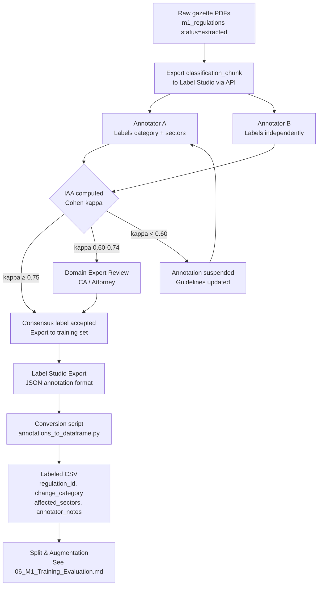

# 09 — Module 1: Annotation Guidelines

> **Cross-references:** [02_M1_Data_Requirements.md](02_M1_Data_Requirements.md) · [06_M1_Training_Evaluation.md](06_M1_Training_Evaluation.md) · [10_M1_Sinhala_Tamil_NLP.md](10_M1_Sinhala_Tamil_NLP.md)
> **See also:** [13_M1_Folder_Structure_and_Implementation_Flow.md](13_M1_Folder_Structure_and_Implementation_Flow.md) — `research/data/labeling/` + `tests/m1/fixtures/gold_labels.csv`.
> **Sub-step companions:** [09_M1_1_Category_Taxonomy_Examples.md](09_M1_1_Category_Taxonomy_Examples.md) · [09_M1_2_Annotation_Workflow_IAA_Protocol.md](09_M1_2_Annotation_Workflow_IAA_Protocol.md) · [09_M1_3_SME_Survey_Instrument.md](09_M1_3_SME_Survey_Instrument.md)

---

## Abstract

This document specifies the annotation protocol for constructing the 800-document labeled training corpus required by the Module 1 gazette classifier. It defines the complete 12-category taxonomy with per-category decision criteria, the 10-sector multi-label schema, annotator qualification requirements, inter-annotator agreement (IAA) targets (Cohen's κ ≥ 0.75), and the annotation tooling selection. Four annotation platforms are evaluated — Label Studio, Prodigy, Doccano, and a custom web-based tool — and Label Studio is selected for its active-learning integration, multi-label support, and zero licensing cost. The guidelines are designed to achieve labeling consistency sufficient for a training corpus that reaches the F1 ≥ 0.92 target defined in [06_M1_Training_Evaluation.md](06_M1_Training_Evaluation.md).

---

## 1. Annotation Tool Selection

### 1.1 Comparison Table

| Criterion | Label Studio | Prodigy | Doccano | Custom Web Tool |
|---|---|---|---|---|
| **Multi-label classification** | ✅ Native | ✅ Native | ✅ Native | ✅ Buildable |
| **Active learning integration** | ✅ ML-assisted pre-annotation | ✅ Built-in PRISM | ❌ | ✅ Buildable |
| **Multi-annotator support** | ✅ Teams + IAA dashboard | ❌ Single annotator | ✅ | ✅ Buildable |
| **PDF rendering** | ✅ HTML/text via converter | ❌ | ❌ | ✅ Embeddable |
| **API for data export** | ✅ REST API | ✅ | ✅ | ✅ |
| **Annotation agreement metrics** | ✅ Kappa built-in | ❌ Manual | ⚠️ Basic | ❌ Build separately |
| **Sinhala/Tamil text display** | ✅ UTF-8 native | ✅ | ✅ | ✅ |
| **Self-hosted** | ✅ Docker | ✅ | ✅ Docker | ✅ |
| **License cost** | ✅ Free (open source) | $595/seat/year | ✅ Free | Dev time: ~80h |
| **Learning curve** | Low-medium | Low | Low | High (custom) |
| **Why chosen** | ✅ **Selected** | Too expensive | No IAA dashboard | Too costly to build |

### 1.2 Label Studio Configuration

```yaml
# label_studio_config.xml
<View>
  <Text name="gazette_text" value="$classification_chunk" />

  <Header value="Regulatory Category (select ONE):" />
  <Choices name="change_category" toName="gazette_text" choice="single" required="true">
    <Choice value="TAX_RATE_CHANGE" />
    <Choice value="LABOUR_LAW" />
    <Choice value="EPF_ETF_CHANGE" />
    <Choice value="PRODUCT_STANDARD" />
    <Choice value="BUSINESS_REGISTRATION" />
    <Choice value="IMPORT_EXPORT" />
    <Choice value="FINANCIAL_REGULATION" />
    <Choice value="SECTOR_SPECIFIC" />
    <Choice value="ENVIRONMENTAL" />
    <Choice value="PENALTY_ENFORCEMENT" />
    <Choice value="DEADLINE_EXTENSION" />
    <Choice value="NO_SME_IMPACT" />
  </Choices>

  <Header value="Affected Sectors (select ALL that apply):" />
  <Choices name="affected_sectors" toName="gazette_text" choice="multiple">
    <Choice value="manufacturing" />
    <Choice value="retail" />
    <Choice value="services" />
    <Choice value="agriculture" />
    <Choice value="construction" />
    <Choice value="it_bpo" />
    <Choice value="hospitality" />
    <Choice value="transport" />
    <Choice value="healthcare" />
    <Choice value="finance" />
  </Choices>

  <Header value="Notes / Edge Case Flags:" />
  <TextArea name="annotator_notes" toName="gazette_text" rows="3" />
</View>
```

---

## 2. 12-Category Taxonomy — Decision Criteria

Each annotator must apply the following criteria in priority order. Categories are mutually exclusive (single-label).

### 2.1 `TAX_RATE_CHANGE`
**Applies when:** The gazette amends a tax rate, introduces a new tax bracket, changes VAT rates, modifies customs duty schedules, or introduces/removes tax exemptions under the Inland Revenue Act or Customs Ordinance.

**Decision signals:**
- Mentions IRD (Inland Revenue Department) as the issuing authority
- Contains phrases: `income tax`, `value added tax`, `VAT`, `customs duty`, `import duty`, `excise duty`, `stamp duty`
- Numerical rate change: e.g. `from 15% to 18%`, `duty-free threshold`

**Does NOT apply if:** The gazette imposes a penalty for non-payment of tax (→ `PENALTY_ENFORCEMENT`) or extends a tax filing deadline (→ `DEADLINE_EXTENSION`).

### 2.2 `LABOUR_LAW`
**Applies when:** The gazette amends the Shop and Office Employees Act, Wages Board Ordinance, or any minimum wage order; changes annual leave entitlements; modifies working hours; introduces new leave types (maternity, sick leave); or amends employment termination procedures.

**Decision signals:**
- Phrases: `minimum wage`, `wages board`, `overtime rate`, `working hours`, `annual leave`, `maternity leave`
- References: Shop and Office Employees Act, Industrial Disputes Act

**Does NOT apply if:** The gazette changes EPF/ETF contribution rates specifically (→ `EPF_ETF_CHANGE`).

### 2.3 `EPF_ETF_CHANGE`
**Applies when:** The gazette explicitly modifies EPF (Employees' Provident Fund) or ETF (Employees' Trust Fund) contribution rates, changes eligibility thresholds, modifies withdrawal procedures, or updates fund administration rules.

**Decision signals:**
- Mentions EPF Act, ETF Act explicitly
- Contribution percentages: `8% employee`, `12% employer`, `3% ETF`
- Phrases: `provident fund`, `trust fund contribution`, `EPF registration`

### 2.4 `PRODUCT_STANDARD`
**Applies when:** The gazette mandates compliance with Sri Lanka Standards Institution (SLSI) product safety standards, adds products to the mandatory certification list, updates technical specifications for imported or locally manufactured goods, or imposes labeling requirements.

**Decision signals:**
- SLSI cited as issuing authority
- SLS number cited: e.g. `SLS 1234:2023`
- Phrases: `mandatory certification`, `product conformity`, `consumer safety standard`

### 2.5 `BUSINESS_REGISTRATION`
**Applies when:** The gazette modifies company registration requirements under the Companies Act, changes annual return filing procedures via eROC (Department of Registrar of Companies), updates sole proprietorship/partnership registration requirements, or amends business licensing procedures.

**Decision signals:**
- DRC / eROC / Registrar of Companies as issuing authority
- Phrases: `annual return`, `business registration`, `company act`, `memorandum of association`

### 2.6 `IMPORT_EXPORT`
**Applies when:** The gazette imposes, lifts, or modifies import/export permits, quotas, bans, or licensing requirements for specific goods; updates prohibited or controlled goods lists; or modifies customs clearance procedures.

**Decision signals:**
- Customs/Excise authority cited
- Phrases: `import licence`, `export quota`, `banned imports`, `restricted goods`, `HS code`

### 2.7 `FINANCIAL_REGULATION`
**Applies when:** The gazette introduces CBSL (Central Bank of Sri Lanka) licensing requirements for financial institutions, modifies forex transaction limits, changes lending rate caps, introduces new capital adequacy requirements, or regulates non-bank financial intermediaries.

**Decision signals:**
- CBSL / Monetary Board as issuing authority
- Phrases: `banking licence`, `foreign exchange`, `lending rate`, `microfinance`, `finance company`

### 2.8 `SECTOR_SPECIFIC`
**Applies when:** The gazette introduces or modifies a licensing or regulatory requirement that applies exclusively to one industry sector and does not fit any of the above categories. Examples: food safety licensing (Ministry of Health), tourism operating permits (SLTDA), construction contractor registration (CIDA).

**Decision signals:**
- Sector-specific ministry as issuing authority
- Licensing language targeted at one industry

### 2.9 `ENVIRONMENTAL`
**Applies when:** The gazette imposes new environmental compliance obligations — effluent discharge standards, solid waste management requirements, emissions limits, or environmental impact assessment requirements — from the Central Environmental Authority (CEA).

**Decision signals:**
- CEA as issuing authority
- Phrases: `effluent`, `emissions`, `environmental protection licence`, `EIA`, `solid waste`

### 2.10 `PENALTY_ENFORCEMENT`
**Applies when:** The gazette's primary purpose is to announce new or increased fines, penalties, enforcement notices, or revocation of existing licenses for non-compliance. Note: most gazettes mention penalties incidentally — this category only applies when penalties are the primary subject.

**Decision signals:**
- Gazette title begins with "Enforcement Notice" or "Penalty Order"
- Penalty amounts are the central content, not incidental
- No underlying regulatory change is announced

### 2.11 `DEADLINE_EXTENSION`
**Applies when:** The gazette's sole or primary purpose is to extend a previously published compliance deadline or filing date, without changing any underlying regulation.

**Decision signals:**
- References a previous gazette number
- Phrases: `extended to`, `deadline extended`, `w.e.f. [new date]`, `compliance period`

### 2.12 `NO_SME_IMPACT`
**Applies when:** The gazette is a valid regulatory publication but does not impose any obligations or changes that affect SMEs. Examples: government appointment notices, military land acquisition orders, academic institution recognition, senior civil servant designations.

**Decision signals:**
- Content relates exclusively to: government appointments, land acquisitions for public works, court fee schedules, academic body recognition
- No business licensing, taxation, labour, or standards change

---

## 3. Sector Assignment Guidelines

Sector assignment is multi-label. Assign ALL sectors that are materially affected by the gazette's regulation.

| Sector | Assign when the gazette affects... |
|---|---|
| `manufacturing` | Factories producing physical goods: food processing, textiles, electronics, construction materials |
| `retail` | Shops, supermarkets, street vendors, e-commerce retailers |
| `services` | Professional services: accounting, law, IT consulting, security, cleaning |
| `agriculture` | Farming, fisheries, poultry, livestock, food crop production |
| `construction` | Building contractors, civil engineering, real estate development |
| `it_bpo` | Software development, BPO call centres, data processing companies |
| `hospitality` | Hotels, restaurants, travel agencies, event venues |
| `transport` | Freight transport, passenger transport, logistics, warehousing |
| `healthcare` | Pharmacies, private hospitals, medical device suppliers, labs |
| `finance` | Money changers, leasing companies, pawning establishments, microfinance |

> **Important:** Do NOT assign sectors by superficial keyword match. A gazette regulating "EPF contributions" applies to ALL sectors with employees — assign all 10. A gazette regulating "SLSI standards for electrical appliances" applies to `manufacturing` and `retail` only.

---

## 4. Inter-Annotator Agreement

### 4.1 IAA Protocol

- **Minimum annotators per document:** 2 independent annotators
- **Target agreement (Cohen's κ):** ≥ 0.75 for category; ≥ 0.70 for sector (multi-label Fleiss' κ)
- **Disagreement resolution:** Third annotator (domain expert) as tiebreaker
- **Gold standard batch:** 10% of corpus (~80 documents) annotated by all annotators + domain expert

### 4.2 Computing Cohen's κ

```python
from sklearn.metrics import cohen_kappa_score

def compute_category_kappa(annotator_a: list, annotator_b: list) -> float:
    return cohen_kappa_score(annotator_a, annotator_b)

def compute_sector_kappa(annotator_a: list[list], annotator_b: list[list]) -> float:
    """Multi-label Fleiss kappa approximated as mean of per-sector binary kappa."""
    from sklearn.preprocessing import MultiLabelBinarizer
    mlb = MultiLabelBinarizer(classes=[
        "manufacturing", "retail", "services", "agriculture", "construction",
        "it_bpo", "hospitality", "transport", "healthcare", "finance"
    ])
    a_bin = mlb.fit_transform(annotator_a)
    b_bin = mlb.transform(annotator_b)
    kappas = [
        cohen_kappa_score(a_bin[:, i], b_bin[:, i])
        for i in range(a_bin.shape[1])
    ]
    return float(sum(kappas) / len(kappas))
```

### 4.3 IAA Review Triggers

| κ Range | Action |
|---|---|
| ≥ 0.75 | Accept both annotations — add to training with consensus label |
| 0.60–0.74 | Flag for domain expert review — annotators must discuss |
| < 0.60 | Suspend annotation — re-train annotators, update guidelines |

### 4.4 Sector-Disagreement Resolution Rule

Sector is multi-label, so annotator disagreement is more subtle than a simple "different label." Three failure modes occur in practice:

| Disagreement type | Example | Resolution rule |
|---|---|---|
| **Strict-subset** | A: `[manufacturing, retail]` · B: `[manufacturing, retail, services]` | **Union** — accept B's superset. Rationale: missing a sector is worse than over-tagging (false negative misses an alert recipient; false positive sends a slightly off-topic alert). |
| **Overlap-with-extras** | A: `[manufacturing, retail]` · B: `[manufacturing, services]` | **Domain expert review.** Neither annotator's set strictly contains the other; this signals genuine ambiguity in the regulation's scope. |
| **Disjoint** | A: `[manufacturing]` · B: `[finance]` | **Domain expert review + flag** — the two annotators are reading the regulation as targeting different industries. Likely indicates a guideline ambiguity that needs an update to §3 (sector decision criteria). |

The strict-subset rule is implemented in `ml/m1/data/resolve_iaa.py:resolve_sector_iaa()`; the other two paths route to a Label Studio task queue for the domain expert. All resolution outcomes are logged with `resolution_method` so the eventual training set can be audited.

---

## 5. Annotator Qualifications

| Role | Required Qualifications | Count |
|---|---|---|
| Primary annotator | Fluent English; undergraduate degree in law, commerce, or business | 3 |
| Sinhala annotator | Native Sinhala speaker; familiarity with legal Sinhala | 2 |
| Tamil annotator | Native Tamil speaker; familiarity with legal Tamil | 1 |
| Domain expert | Chartered Accountant (CA Sri Lanka) or Attorney-at-Law | 1 |

All annotators complete a calibration session on 20 pre-labeled gold-standard gazettes before contributing to the training corpus. Calibration target: κ ≥ 0.80 on the calibration set.

### 5.1 Calibration Test Design

The 20-document calibration set is hand-picked by the domain expert to span (a) every category (including the rare ones), (b) every sector (single-sector + multi-sector cases), (c) at least 3 gazettes per language, and (d) the four most-common edge-case patterns from §7 below. A candidate annotator's score determines whether they pass:

| Calibration outcome | Score | Action |
|---|---|---|
| ≥ 0.80 κ on first attempt | Pass | Promoted to production annotator; assigned first batch within 48 h |
| 0.70–0.79 κ on first attempt | Conditional | One-hour debrief with domain expert; re-test on a fresh 20-doc set; ≥ 0.80 to pass |
| < 0.70 κ on first attempt | Fail | Annotator does not proceed to the training corpus |
| Annotator fails twice | Reject | Not eligible for re-application within this project |

Pass rate target: ≥ 60 % of candidates pass on first attempt; conditional pass rate ≥ 80 %. If the pass rate drops below the target, the **guidelines** are revised (not the threshold) — the calibration set is the IAA contract with the model, not the candidate's IQ test.

Calibration outcomes per annotator are stored in `m1_annotator_calibration` (`annotator_id`, `attempt_number`, `kappa_category`, `kappa_sector`, `passed_at`). The same table tracks ongoing performance — every annotator re-takes a fresh calibration test quarterly, with the rolling κ feeding a per-annotator quality dashboard. The full calibration-set construction protocol + a sample 20-document worksheet is in [09_M1_2_Annotation_Workflow_IAA_Protocol.md](09_M1_2_Annotation_Workflow_IAA_Protocol.md).

---

## 6. Annotation Workflow



---

## 6.1 Contrastive Examples for Confusable Categories

Three category pairs cause most inter-annotator disagreement. The contrasts below — anchored in seeded demo regulations from `app/scripts/seed_regulations.py` — give annotators concrete decision anchors:

| Confusable pair | Example A (label A) | Example B (label B) | What distinguishes them |
|---|---|---|---|
| `BUSINESS_REGISTRATION` vs `FINANCIAL_REGULATION` | "Annual return filing fees for limited companies increased from LKR 1,000 to LKR 5,000" → `BUSINESS_REGISTRATION` | "Annual financial reporting required from all NBFI license-holders to CBSL with quarterly disclosure" → `FINANCIAL_REGULATION` | Issuing authority + obligation: `BUSINESS_REGISTRATION` is about *existing as a registered business* (eROC); `FINANCIAL_REGULATION` is about *financial-sector conduct rules* (CBSL). When unsure, look at the issuing agency. |
| `TAX_RATE_CHANGE` vs `DEADLINE_EXTENSION` | "VAT rate increased from 15 % to 18 % effective 2024-01-01" → `TAX_RATE_CHANGE` | "VAT return filing deadline for Q4 2023 extended from 20 January to 31 January 2024" → `DEADLINE_EXTENSION` | Substance vs schedule: `TAX_RATE_CHANGE` modifies *what* SMEs owe; `DEADLINE_EXTENSION` modifies *when* an existing obligation is due. Same tax, different axis. |
| `PRODUCT_STANDARD` vs `ENVIRONMENTAL` | "Multi-pin adapters must carry SLSI safety certification before sale" (`VAT_SSCL_MERGE` example) → `PRODUCT_STANDARD` | "Lead content in industrial paints reduced from 0.06 % to 0.009 %" → `ENVIRONMENTAL` | Who is harmed by non-compliance: `PRODUCT_STANDARD` targets *consumer safety*; `ENVIRONMENTAL` targets *ecological harm*. Both can co-occur — when SLSI mandates lead reduction *for paint*, prefer `PRODUCT_STANDARD` (the consumer-facing framing wins). |

Eight more contrastive pairs (with full text excerpts) are in [09_M1_1_Category_Taxonomy_Examples.md](09_M1_1_Category_Taxonomy_Examples.md). Annotators study these *before* the calibration test, not after — the contrastive examples are part of the training, the calibration test measures whether the training stuck.

## 7. Common Edge Cases and Resolution

| Edge Case | Resolution |
|---|---|
| Gazette amends tax rates AND extends a deadline | Assign `TAX_RATE_CHANGE` (primary change); use annotator_notes to flag deadline extension |
| EPF gazette that also mandates wage increases | Assign `EPF_ETF_CHANGE` if EPF rates are the primary change; `LABOUR_LAW` if wages are primary |
| Gazette in Sinhala only, annotator cannot read it | Route to Sinhala annotator; do NOT use machine translation for annotation |
| SLSI standard gazette with both labeling and testing requirements | Assign `PRODUCT_STANDARD`; sectors = `manufacturing` + `retail` |
| Gazette with schedule listing 50 regulated substances | Treat as `PRODUCT_STANDARD` if substances are consumer products; `ENVIRONMENTAL` if they are pollutants |
| Extraordinary gazette announcing state of emergency business restrictions | Assign `SECTOR_SPECIFIC`; sectors = all 10 (economy-wide) |

---

## 9. SME Awareness Survey Instrument

This section documents the survey instrument used to collect the empirical lag data for research questions RQ3 and RQ4 (see [01_M1_Research_Problem.md](01_M1_Research_Problem.md)). The survey is administered to SME owners and managers via the Enigmatrix portal, embedded in the Module 2 onboarding flow, and distributed through partner networks (NEDA, Ceylon Chamber of Commerce).

### 9.1 Survey Flow

The survey is structured in three phases:

1. **Introduction block** — Consent, SME profile (sector, district, headcount, years in operation). Pre-fills from `m1_sme_profiles` if the respondent is already registered.
2. **Per-regulation question block** — Repeated for each of 7 sector-tailored regulations + 2 universal regulations (9 regulations total per respondent). Each block presents a plain-language description of the regulation and asks Q1–Q7.
3. **Open question block** — Q8 (open text) on what would most help the respondent stay compliant. Answered once, at the end.

### 9.2 Per-Regulation Question Block (Q1–Q7)

Each question block is anchored to one specific regulation, identified by a plain-language title and effective date. Respondents answer Q1–Q7 independently for each regulation shown.

| Q# | Question | Response Type | Research Use |
|---|---|---|---|
| **Q1** | "Before today, were you aware that [regulation title] had been published?" | Yes / No / Unsure | Awareness rate; whether the SME was in the survey's "aware" group |
| **Q2** | "Approximately when did you first hear about this regulation?" | Date picker (month + year accuracy accepted); optional: "I don't remember exactly" + confidence score (1–5) | `awareness_date` for lag calculation (T6) |
| **Q3** | "How did you first hear about it?" | Multi-select from 18 options (see §9.3); plus free-text "Other" | Channel-level lag disaggregation (RQ4) |
| **Q4** | "How well did you understand the regulation when you first heard about it?" | 1–5 Likert scale (1 = not at all, 5 = completely) | Understanding quality by channel — secondary finding |
| **Q5** | "Did you know the effective date of the regulation?" | Yes / No / Approximately | Compliance-window awareness |
| **Q6** | "Did you know what action your business was required to take?" | Yes / No / Partially | Action awareness — predicts compliance probability |
| **Q7** | "Did your business take the required action?" | Yes / Not yet / Not applicable / Still assessing | Actual compliance outcome — connects to [01_M1_Research_Problem.md §1.2](01_M1_Research_Problem.md) enforcement data |

### 9.3 Q3 Channel Options (18 options)

Respondents may select all channels that apply for Q3:

1. Official Gazette directly (gazette.lk)
2. IRD website or circular
3. EPF/ETF website or circular
4. SLSI notification
5. Registrar of Companies (eROC) notice
6. Central Bank of Sri Lanka (CBSL) circular
7. Ministry / Department website
8. Enigmatrix platform alert (email)
9. Enigmatrix platform alert (SMS)
10. Enigmatrix platform dashboard
11. Newspaper (Daily FT / Sunday Times / Business Times)
12. Sinhala newspaper (Divaina / Lankadeepa / Dinamina)
13. Tamil newspaper (Virakesari / Uthayan)
14. Television news (Sirasa / Hiru / Derana)
15. Accountant or auditor
16. Trade association or chamber of commerce
17. Another business owner / peer
18. Social media (Facebook / WhatsApp group / LinkedIn)

### 9.4 Open Question (Q8)

**Q8:** "What single change to how the Sri Lankan government communicates regulations would most help your business stay compliant?"

- Response type: Open text (500 character limit)
- Research use: Qualitative coding → thematic analysis for thesis discussion section; informs policy recommendations

### 9.5 Sector-Tailored Regulation Selection (SQL)

The 7 sector-specific regulations shown to each respondent are selected based on the respondent's `primary_sector` from `m1_sme_profiles`. The 2 universal regulations (one IRD, one EPF) are shown to all respondents regardless of sector.

```sql
-- Sector-tailored selection: 7 most recent regulations for the respondent's sector
WITH sector_regulations AS (
    SELECT
        r.id,
        r.title,
        r.gazette_published_date,
        r.change_category,
        r.sector_tags
    FROM m1_regulations r
    WHERE
        r.status = 'ALERTED'
        AND r.sector_tags && ARRAY[:respondent_sector]::VARCHAR[]
        AND r.gazette_published_date >= NOW() - INTERVAL '2 years'
        AND r.needs_review = false
    ORDER BY r.gazette_published_date DESC
    LIMIT 7
),
-- Universal regulations: one IRD + one EPF in the same 2-year window
universal_regulations AS (
    (SELECT id, title, gazette_published_date, change_category, sector_tags
     FROM m1_regulations
     WHERE change_category = 'TAX_RATE_CHANGE' AND status = 'ALERTED' AND needs_review = false
     ORDER BY gazette_published_date DESC LIMIT 1)
    UNION ALL
    (SELECT id, title, gazette_published_date, change_category, sector_tags
     FROM m1_regulations
     WHERE change_category = 'EMPLOYEE_CONTRIBUTION_CHANGE' AND status = 'ALERTED' AND needs_review = false
     ORDER BY gazette_published_date DESC LIMIT 1)
)
-- Final survey regulation list (up to 9 regulations)
SELECT * FROM sector_regulations
UNION ALL
SELECT * FROM universal_regulations
ORDER BY gazette_published_date DESC;
```

The SQL result is passed to the survey front-end, which renders one Q1–Q7 block per row. Regulations with no SME awareness responses yet (i.e., `m1_sme_awareness_responses` has no matching `regulation_id`) are prioritised by a secondary sort on `response_count ASC` to maximise data coverage across the corpus.

---

## 8. Conclusion

The annotation protocol establishes a rigorous, reproducible framework for constructing the 800-document labeled corpus. Label Studio is selected as the annotation platform for its IAA dashboard, multi-label support, and active-learning integration that enables the ML model to pre-annotate later batches — reducing annotator burden by an estimated 40% after the first 400 labeled examples. The 12-category taxonomy with explicit decision criteria and edge-case resolution guidance is designed to achieve κ ≥ 0.75, which research by Artstein & Poesio (2008) identifies as the minimum threshold for reliable ML training labels.

---

## References

- Artstein & Poesio (2008). *Inter-Coder Agreement for Computational Linguistics*. Computational Linguistics, 34(4).
- Fleiss, J. L. (1971). *Measuring nominal scale agreement among many raters*. Psychological Bulletin, 76(5).
- Label Studio. (2024). *Label Studio Open Source Documentation*. [labelstud.io](https://labelstud.io)
- Department of Government Printing Sri Lanka. *Official Gazette taxonomy*. gazette.lk
- Sri Lanka Standards Institution. (2023). *SLSI Mandatory Certification List*. slsi.lk
- Inland Revenue Department. (2023). *Gazette Notifications Archive*. ird.gov.lk
