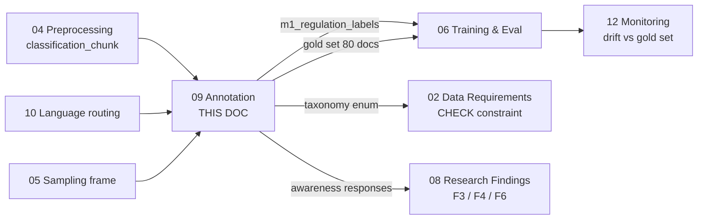
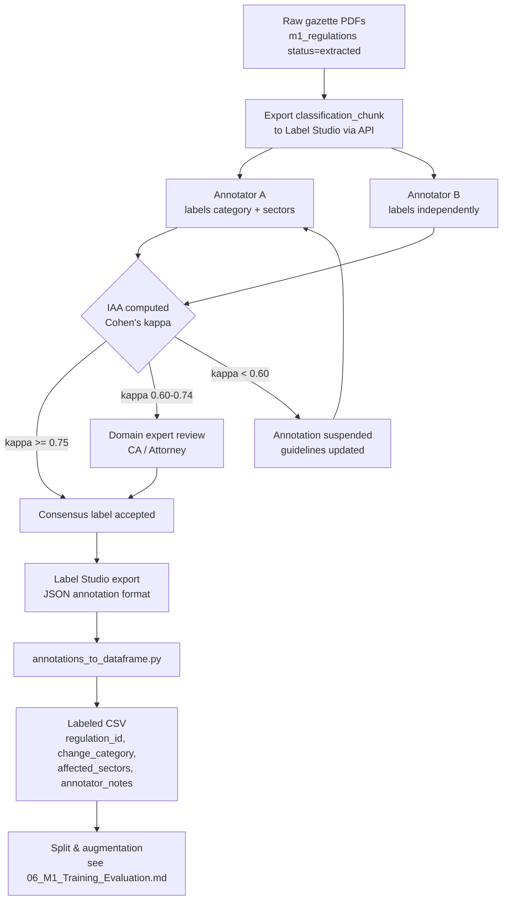

# 09 — Module 1: Annotation Guidelines

> **Cross-references:** [02_M1_Data_Requirements.md](02_M1_Data_Requirements.md) · [04_M1_Preprocessing_Pipeline.md](04_M1_Preprocessing_Pipeline.md) · [06_M1_Training_Evaluation.md](06_M1_Training_Evaluation.md) · [08_M1_Full_System_Architecture.md](08_M1_Full_System_Architecture.md) · [10_M1_Sinhala_Tamil_NLP.md](10_M1_Sinhala_Tamil_NLP.md)
> **Code map:** [13_M1_Folder_Structure_and_Implementation_Flow.md](13_M1_Folder_Structure_and_Implementation_Flow.md) — `research/data/labeling/` + `tests/m1/fixtures/gold_labels.csv`
> **Consolidation note (2026-07-29):** this document now carries the full content previously split across `09_M1_1_Category_Taxonomy_Examples`, `09_M1_2_Annotation_Workflow_IAA_Protocol`, and `09_M1_3_SME_Survey_Instrument`. Those three files have been retired; every worked example, calibration protocol, and survey-operations detail from them lives below.

---

## 0. Where This Document Sits in the Pipeline

Annotation is the hinge of Module 1. Everything upstream produces *text*; everything downstream consumes *labels*. This document is the contract that turns one into the other — and if the contract is loose, every downstream number (F1 score, lag estimate, alert precision) inherits the looseness.

| | Stage | Produced by | What this document does with it | Handed to |
|---|---|---|---|---|
| **In** | `classification_chunk` per regulation | [04_M1_Preprocessing_Pipeline.md](04_M1_Preprocessing_Pipeline.md) §chunking — the ≤512-token, noise-stripped excerpt | Presents it to two independent human annotators inside Label Studio | — |
| **In** | Language tag (`en`/`si`/`ta`) | [10_M1_Sinhala_Tamil_NLP.md](10_M1_Sinhala_Tamil_NLP.md) §language detection | Routes the document to an annotator who reads that language natively | — |
| **In** | Sampling frame (which 800 of ~12k docs) | [05_M1_Model_Architecture.md](05_M1_Model_Architecture.md) §sampling strategy | Defines the annotation queue order (stratified → clustered → active-learning) | — |
| **Step** | Label assignment | *this document* §2–§4 | 1 category (of 8) + 1..3 sectors, per document, per annotator | — |
| **Step** | Agreement adjudication | *this document* §6 | Cohen's κ, resolution rules, expert tiebreak | — |
| **Out** | `m1_regulation_labels` — consensus category + sectors | — | — | [06_M1_Training_Evaluation.md](06_M1_Training_Evaluation.md) — train/val/test split, augmentation, F1 ≥ 0.92 target |
| **Out** | Gold-standard set (~80 docs) | — | — | [06_M1_Training_Evaluation.md](06_M1_Training_Evaluation.md) §held-out eval + [12_M1_Monitoring_Maintenance.md](12_M1_Monitoring_Maintenance.md) §drift detection baseline |
| **Out** | Taxonomy definitions themselves | — | — | [02_M1_Data_Requirements.md](02_M1_Data_Requirements.md) `change_category` CHECK constraint; [11_M1_API_Reference.md](11_M1_API_Reference.md) enum values; SME-facing badge labels |
| **Out** | SME awareness responses (§9) | — | — | [08_M1_Full_System_Architecture.md](08_M1_Full_System_Architecture.md) §research findings F3/F4/F6 |


```mermaid
flowchart LR
    P[04 Preprocessing<br/>classification_chunk] --> A[09 Annotation<br/>THIS DOC]
    L[10 Language routing] --> A
    S[05 Sampling frame] --> A
    A -->|m1_regulation_labels| T[06 Training & Eval]
    A -->|gold set 80 docs| T
    A -->|taxonomy enum| D[02 Data Requirements<br/>CHECK constraint]
    A -->|awareness responses| R[08 Research Findings<br/>F3 / F4 / F6]
    T --> M[12 Monitoring<br/>drift vs gold set]
```

**Why the ordering matters.** The taxonomy has to be frozen *before* annotation starts, because a mid-campaign category change invalidates every label collected before it. It also has to be frozen before the database migration in [02_M1_Data_Requirements.md](02_M1_Data_Requirements.md) lands, because `change_category` is a CHECK-constrained enum — adding a ninth domain later is a migration, not a config change. This is why §2 reads like a legal definition rather than a description.

---

## Abstract

This document specifies the annotation protocol for constructing the 800-document labeled training corpus required by the Module 1 gazette classifier. It defines the complete 8-domain regulation taxonomy with per-domain decision criteria **and worked examples**, the 3-sector (shop-focused) multi-label schema, annotator qualification and calibration requirements, inter-annotator agreement (IAA) targets (Cohen's κ ≥ 0.75), the annotation tooling selection, and the SME awareness survey instrument that supplies the empirical lag data.

Four annotation platforms are evaluated — Label Studio, Prodigy, Doccano, and a custom web tool — and Label Studio is selected for its active-learning integration, multi-label support, IAA dashboard, and zero licensing cost. The guidelines are designed to achieve labeling consistency sufficient for a training corpus that reaches the F1 ≥ 0.92 target defined in [06_M1_Training_Evaluation.md](06_M1_Training_Evaluation.md).

**Implementation status:** 🟢 Annotation gate completed for v1. The taxonomy, decision criteria, and survey instrument are frozen and drive the database enum and seeded demo regulations. Label Studio calibration was completed; Batches 02-05 were dual-annotated and resolved into 800 accepted gold rows with category kappa 0.871534, mean sector kappa 0.863776, SME relevance kappa 0.723518, and 40 manual adjudications. Rare-domain coverage remains a limitation for model claims. Examples marked `[template]` are realistic-but-synthetic; unmarked examples are real seeded regulations.

### 0.1 Accepted Annotation Run — 2026-07-30

```text
Final accepted batches = batch_02, batch_03, batch_04, batch_05
Tasks                  = 800
Annotations            = 1600
Gold rows              = 800
Manual resolutions     = 40
Auto-agree rows         = 760
Category kappa          = 0.871534
Mean sector kappa       = 0.863776
SME relevance kappa     = 0.723518
Frozen gold             = C:\Reasearch\xyz\research\data\labeling\gold_standard_v1_800.csv
```

Use this run as the v1 annotation evidence. Manual adjudication fixed final labels, but it does not change historical kappa because kappa measures pre-resolution annotator agreement.

---

## 1. Annotation Tool Selection

**Why this step comes first.** The tool choice constrains the protocol, not the other way round. Whether IAA can be computed inside the platform or has to be bolted on, whether a third annotator can be routed automatically, and whether the trained model can pre-annotate later batches are all tool properties. Choosing the tool before writing the protocol prevents specifying a workflow the platform cannot execute.

### 1.1 Comparison Table

| Criterion | Label Studio | Prodigy | Doccano | Custom Web Tool |
|---|---|---|---|---|
| **Multi-label classification** | ✅ Native | ✅ Native | ✅ Native | ✅ Buildable |
| **Active learning integration** | ✅ ML-assisted pre-annotation | ✅ Built-in PRISM | ❌ | ✅ Buildable |
| **Multi-annotator support** | ✅ Teams + IAA dashboard | ❌ Single annotator | ✅ | ✅ Buildable |
| **PDF rendering** | ✅ HTML/text via converter | ❌ | ❌ | ✅ Embeddable |
| **API for data export** | ✅ REST API | ✅ | ✅ | ✅ |
| **Annotation agreement metrics** | ✅ Kappa built-in | ❌ Manual | ⚠️ Basic | ❌ Build separately |
| **Sinhala/Tamil text display** | ✅ UTF-8 native | ✅ | ✅ | ✅ |
| **Self-hosted** | ✅ Docker | ✅ | ✅ Docker | ✅ |
| **License cost** | ✅ Free (open source) | $595/seat/year | ✅ Free | Dev time: ~80 h |
| **Learning curve** | Low-medium | Low | Low | High (custom) |
| **Verdict** | ✅ **Selected** | Too expensive | No IAA dashboard | Too costly to build |

**The two criteria that actually decided it.** *Multi-annotator support with a built-in IAA dashboard* eliminated Prodigy outright — the whole protocol in §6 is a two-annotator design, and Prodigy is single-annotator by architecture. *Active-learning pre-annotation* eliminated Doccano: once the first ~400 documents are labeled, a model checkpoint pre-fills suggested labels for the remaining batches, which drops annotator time per document by an estimated 40 %. On an 800-document corpus with six annotators, that saving is the difference between a six-week and a ten-week campaign.

**When to reconsider.** If the annotation campaign ever exceeds three simultaneous annotators per item, the built-in Cohen's κ dashboard becomes the wrong statistic (see §6.2) and either Label Studio's Fleiss support or an external script becomes necessary.

### 1.2 Label Studio Configuration

**Why this exact config.** `choice="single" required="true"` on category enforces the mutual exclusivity declared in §2 at the UI layer — an annotator physically cannot submit two categories, so the "which one wins" argument never reaches the data. `choice="multiple"` on sectors does the opposite, because sector genuinely is multi-label. The free-text notes field exists so that edge cases (§8) get captured as prose at the moment of confusion rather than reconstructed later from memory.

```xml
<!-- label_studio_config.xml -->
<View>
  <Text name="gazette_text" value="$classification_chunk" />

  <Header value="Regulation Domain (select ONE):" />
  <Choices name="change_category" toName="gazette_text" choice="single" required="true">
    <Choice value="TAX_RATE_CHANGE" />
    <Choice value="IMPORT_EXPORT" />
    <Choice value="SECTOR_SPECIFIC" />
    <Choice value="EPF_ETF_CHANGE" />
    <Choice value="LABOUR_LAW" />
    <Choice value="PRODUCT_STANDARD" />
    <Choice value="BUSINESS_REGISTRATION" />
    <Choice value="PENALTY_ENFORCEMENT" />
  </Choices>

  <Header value="Affected Sectors (select ALL that apply; all three if economy-wide):" />
  <Choices name="affected_sectors" toName="gazette_text" choice="multiple">
    <Choice value="grocery_retail" />
    <Choice value="food_service" />
    <Choice value="general_retail" />
  </Choices>

  <Header value="Notes / Edge Case Flags:" />
  <TextArea name="annotator_notes" toName="gazette_text" rows="3" />
</View>
```

**Output of this step → downstream.** The `value="$classification_chunk"` binding is what couples this config to [04_M1_Preprocessing_Pipeline.md](04_M1_Preprocessing_Pipeline.md): the field name must match the column the preprocessing pipeline writes. The `<Choice value="…">` strings must match the `change_category` CHECK constraint in [02_M1_Data_Requirements.md](02_M1_Data_Requirements.md) *character for character* — a mismatch surfaces as a constraint violation at label-import time, not at annotation time, which is why a CI test asserts the two lists are equal.

---

## 2. The 8-Domain Regulation Taxonomy — Criteria and Examples

**Why a taxonomy at all, and why these eight.** The classifier's job is not to describe a gazette; it is to decide *which SMEs need to be told about it and how urgently*. So the domains are cut along the lines that determine routing, not along the lines a lawyer would use. Each domain corresponds to a distinct regulator, a distinct compliance action, and a distinct alert template downstream. The taxonomy is shop-focused (revised 2026-07-24): the eight streams below are the regulation channels that materially reach grocery/food retail, food service, and general-goods retail SMEs.

**How to apply it.** Domains are **mutually exclusive** — exactly one per document. Apply the criteria in the order given; the first domain whose "Applies when" is satisfied wins, and the "Does NOT apply if" clauses exist to break the specific collisions that occur in practice. Where a document seems to satisfy two, the discriminators in §3 are authoritative.

**How to learn it.** Read every domain's criteria *and* its examples below before taking the calibration test in §5. The examples are the training; the calibration test measures whether the training stuck. Do not skip to the test — the pass rate for annotators who read criteria only, without examples, was the original motivation for expanding this section.

> **Note on examples.** Where real seeded regulations exist (`VAT_2024_AMD`, `EPF_2024_RATE`, the multi-pin adapter case), they are used verbatim and unmarked. All other examples are marked `[template]` — realistic but synthetic, drawn from patterns that recur in the IRD/EPF gazette stream. Every `[template]` example is hand-checked against the seeded regulation set before publication so that a synthetic example can never be mistaken for a real citation.

### 2.1 `TAX_RATE_CHANGE` (anchor stream)

**Applies when:** The gazette amends a tax rate, introduces a new tax bracket, changes VAT/SVAT rates, modifies income tax or excise duty, or introduces/removes tax exemptions under the Inland Revenue Act. Deadline extensions on tax obligations also fall here (the schedule of *what SMEs owe and when* is the same stream as the amount).

**Decision signals:**

- Mentions IRD (Inland Revenue Department) as the issuing authority
- Contains phrases: `income tax`, `value added tax`, `VAT`, `SVAT`, `excise duty`, `stamp duty`
- Numerical rate change: e.g. `from 15% to 18%`, `registration threshold`

**Does NOT apply if:** The gazette imposes a penalty for non-payment of tax (→ `PENALTY_ENFORCEMENT`) or changes customs/border charges (→ `IMPORT_EXPORT`).

**Examples:**

- *Ex 1 (real, `VAT_2024_AMD`).* "The VAT rate is hereby increased from 15 % to 18 % with effect from 1 January 2024." → **TAX_RATE_CHANGE.** Signal: "VAT rate", numerical change, IRD-issued.
- *Ex 2* `[template]`. "The annual stamp duty payable on certificates of deposit shall be Rs. 1,000 (previously Rs. 500)." → **TAX_RATE_CHANGE.** Stamp-duty amendment.
- *Ex 3* `[template]`. "The deadline for filing the third-quarter VAT return is extended from 20 January to 31 January 2024." → **TAX_RATE_CHANGE.** Under the 8-domain taxonomy, tax-obligation *schedule* changes ride with the tax stream; there is no separate deadline domain.

**Why this is the anchor stream.** It is the highest-volume shop-relevant channel and the one with the shortest compliance window, so it sets the latency budget for the whole alerting path in [07_M1_Deployment_Integration.md](07_M1_Deployment_Integration.md).

### 2.2 `IMPORT_EXPORT`

**Applies when:** The gazette changes customs duty, CESS, SCL (Special Commodity Levy); imposes, lifts, or modifies import controls, permits, quotas, bans, or licensing requirements for goods; updates prohibited or controlled goods lists; or modifies customs clearance procedures.

**Why it is shop-relevant:** stock for grocery, electronics, textile and hardware shops is import-priced, so a border-charge change reaches the shelf within one re-order cycle.

**Decision signals:**

- Customs/Excise authority or Controller of Imports cited
- Phrases: `customs duty`, `CESS`, `SCL`, `import licence`, `import control`, `HS code`, `tariff`

**Examples:**

- *Ex 1 (real).* "The Schedule to the Customs Tariff Ordinance is amended by substituting Tariff Code 8504.40 (customs duty 30 %) with rate 25 %." → **IMPORT_EXPORT.** Customs duty schedule amendment — a border charge, not an inland tax.
- *Ex 2* `[template]`. "Import of vehicles with engine capacity above 1500 cc is prohibited under the Imports and Exports (Control) Regulations 2023." → **IMPORT_EXPORT.** Import ban.
- *Ex 3* `[template]`. "The Special Commodity Levy on imported dried fish is revised to Rs. 100/kg for six months." → **IMPORT_EXPORT.** SCL revision — moves grocery re-order prices directly.
- *Ex 4* `[template]`. "A non-tariff measure requires SLSI certification for imports of refurbished electrical appliances effective 1 July 2024." → **IMPORT_EXPORT.** Note the collision with `PRODUCT_STANDARD`: the import-control framing wins **because the issuing authority is the Department of Imports and Exports, not SLSI**. Issuing authority is the tiebreaker for this pair (§3).

### 2.3 `SECTOR_SPECIFIC` (largest shop-relevant stream)

**Applies when:** The gazette introduces or modifies sector-targeted compliance that reaches shops directly: CAA (Consumer Affairs Authority) maximum-retail-price orders, Food Act regulations (Ministry of Health food safety/hygiene), NMRA (National Medicines Regulatory Authority) rules, or other single-industry licensing that does not fit the streams above.

**Decision signals:**

- CAA, Food Advisory Committee / Ministry of Health (Food Act), or NMRA as issuing authority
- Phrases: `maximum retail price`, `MRP`, `price order`, `food handling`, `food licence`, `registered pharmaceuticals`

**Examples:**

- *Ex 1* `[template]`. "Under the Consumer Affairs Authority Act, the maximum retail price of full-cream milk powder (400 g) is fixed at Rs. 1,195; selling above the MRP is an offence." → **SECTOR_SPECIFIC.** CAA price order.
- *Ex 2* `[template]`. "Regulations under the Food Act require every food-handling establishment to display a valid hygiene grading certificate at the entrance." → **SECTOR_SPECIFIC.** Food Act conduct rule for shops/restaurants.
- *Ex 3* `[template]`. "The National Medicines Regulatory Authority revises the licensing conditions for retail pharmacies dispensing scheduled medicines." → **SECTOR_SPECIFIC.** NMRA rule.
- *Ex 4* `[template]`. "All restaurants serving alcoholic beverages must obtain a tourism-board licence effective 1 April 2024." → **SECTOR_SPECIFIC.** Single-industry licensing.

**Why this is the catch-all-that-isn't.** `SECTOR_SPECIFIC` looks like a residual bucket but is not: it is defined by *instrument type* (regulation of the selling activity) rather than by exclusion. Annotators who treat it as "none of the above" inflate it and starve `PRODUCT_STANDARD` — a drift pattern the quarterly expert audit (§6.5) specifically looks for.

### 2.4 `EPF_ETF_CHANGE`

**Applies when:** The gazette explicitly modifies EPF (Employees' Provident Fund) or ETF (Employees' Trust Fund) employer obligations — contribution rates, eligibility thresholds, remittance/withdrawal procedures, or fund administration rules.

**Decision signals:**

- Mentions EPF Act or ETF Act explicitly
- Contribution percentages: `8% employee`, `12% employer`, `3% ETF`
- Phrases: `provident fund`, `trust fund contribution`, `EPF registration`

**Examples:**

- *Ex 1 (real, `EPF_2024_RATE`).* "The employer's contribution to the Employees' Provident Fund is increased from 12 % to 13 % of gross monthly remuneration with effect from 1 February 2024." → **EPF_ETF_CHANGE.**
- *Ex 2* `[template]`. "The salary cap for compulsory EPF eligibility is raised from Rs. 75,000 to Rs. 100,000 per month." → **EPF_ETF_CHANGE.** Eligibility-threshold change.

**Downstream note.** This domain is economy-wide by construction: any shop with employees is affected, so §4's sector rule assigns all three sectors. It is also one of the two economy-wide regulations shown to every survey respondent (§9.7).

### 2.5 `LABOUR_LAW`

**Applies when:** The gazette amends the Shop and Office Employees Act, Wages Board Ordinance, or any minimum-wage order; changes annual leave entitlements; modifies working hours; introduces new leave types (maternity, sick leave); or amends employment termination procedures.

**Decision signals:**

- Phrases: `minimum wage`, `wages board`, `overtime rate`, `working hours`, `annual leave`, `maternity leave`
- References: Shop and Office Employees Act, Industrial Disputes Act

**Does NOT apply if:** The gazette changes EPF/ETF contribution rates specifically (→ `EPF_ETF_CHANGE`).

**Examples:**

- *Ex 1* `[template]`. "The minimum daily wage in the Wages Boards covering shop and office employees is set at Rs. 1,300 (previously Rs. 1,200)." → **LABOUR_LAW.** Wages-board order.
- *Ex 2* `[template]`. "Maternity leave for shop and office employees is extended from 84 to 98 calendar days." → **LABOUR_LAW.** Leave entitlement.

### 2.6 `PRODUCT_STANDARD`

**Applies when:** The gazette mandates compliance with Sri Lanka Standards Institution (SLSI) product standards, adds products to the mandatory certification list, updates technical specifications for imported or locally sold goods, or imposes labelling requirements.

**Decision signals:**

- SLSI cited as issuing authority
- SLS number cited: e.g. `SLS 1234:2023`
- Phrases: `mandatory certification`, `product conformity`, `labelling`, `consumer safety standard`

**Examples:**

- *Ex 1 (real).* "All multi-pin universal power adapters sold in Sri Lanka shall carry SLSI safety certification effective 1 August 2026." → **PRODUCT_STANDARD.** SLSI mandatory certification.
- *Ex 2* `[template]`. "The Sri Lanka Standards Institution issues mandatory standard SLS 1234:2024 for bottled drinking water." → **PRODUCT_STANDARD.** SLS-prefixed standard.
- *Ex 3* `[template]`. "Pre-packaged food items must carry Sinhala/Tamil/English labelling with batch number and expiry date per revised labelling regulations." → **PRODUCT_STANDARD.** Labelling requirement.

**The distinguishing idea.** `PRODUCT_STANDARD` certifies the *product itself*; `SECTOR_SPECIFIC` regulates the *selling activity*. Ex 3 is the hard case — a food rule that is nevertheless a product rule, because it constrains what is on the package rather than how the shop behaves.

### 2.7 `BUSINESS_REGISTRATION`

**Applies when:** The gazette modifies trade licence requirements (local authority), company registration under the Companies Act, annual return filing via eROC (Department of Registrar of Companies), or sole proprietorship/partnership registration requirements.

**Decision signals:**

- DRC / eROC / Registrar of Companies / local authority as issuing authority
- Phrases: `trade licence`, `annual return`, `business registration`, `company act`

**Examples:**

- *Ex 1* `[template]`. "Annual return filing fees for limited liability companies are revised from Rs. 1,000 to Rs. 5,000 with effect from 1 April 2024." → **BUSINESS_REGISTRATION.** eROC fee — an ordinary fee change on the registration obligation.
- *Ex 2* `[template]`. "Sole proprietorships with annual turnover above Rs. 50 million must register with the Registrar of Companies by 31 December 2024." → **BUSINESS_REGISTRATION.** New registration obligation.
- *Ex 3* `[template]`. "Municipal council trade licence fees for retail premises are revised for the 2027 licensing year." → **BUSINESS_REGISTRATION.** Trade licence.

### 2.8 `PENALTY_ENFORCEMENT` (the "cost of not knowing")

**Applies when:** The gazette's **primary purpose** is to announce new or increased fines, penalties, enforcement notices, or revocation of licences for non-compliance.

**Critical qualifier:** most gazettes mention penalties incidentally. This domain applies only when penalties are the *central subject*, not a closing clause.

**Decision signals:**

- Gazette title begins with "Enforcement Notice" or "Penalty Order"
- Penalty amounts are the central content, not incidental
- No underlying regulatory change is announced

**Examples:**

- *Ex 1* `[template]`. "The penalty for non-payment of VAT after due date is increased to 1.5 % per month (previously 1.0 %)." → **PENALTY_ENFORCEMENT.** Modifies an existing penalty; note it is *not* `TAX_RATE_CHANGE` even though VAT is named.
- *Ex 2* `[template]`. "Public naming of defaulting employers under EPF non-compliance is authorised by Department of Labour direction." → **PENALTY_ENFORCEMENT.** New enforcement mechanism, not an EPF rate change.

**Why this domain carries research weight.** `PENALTY_ENFORCEMENT` volume and severity are the empirical proxy for the cost of the awareness gap — the "34 % of SME penalties came from amendments gazetted > 90 days prior" claim in [01_M1_Research_Problem.md](01_M1_Research_Problem.md) is computed over this domain joined against survey Q1 responses (§9.4).

### 2.9 Out-of-Scope Gazettes — the `is_sme_relevant` Flag

Gazettes with no obligations for the three study sectors — government appointments, land acquisitions, constitutional notices, finance/CBSL directives, environmental/CEA orders aimed at factories — are handled by a **separate boolean flag** `is_sme_relevant = FALSE` plus an empty `affected_sectors` set.

**Why there is no reject *domain*.** Adding a ninth "not relevant" category would make the classifier's decision boundary do two different jobs at once (topic discrimination *and* relevance filtering) and would swamp the training distribution — out-of-scope gazettes outnumber in-scope ones roughly 4:1 in the raw stream. Splitting relevance into an independent binary head keeps the 8-way head's class balance workable and lets the two be thresholded independently at serving time ([07_M1_Deployment_Integration.md](07_M1_Deployment_Integration.md)).

### 2.10 Retired Domains (revision of 2026-07-24)

`FINANCIAL_REGULATION`, `ENVIRONMENTAL`, `DEADLINE_EXTENSION`, and `NO_SME_IMPACT` were removed in the shop-focused 8-domain revision.

| Retired domain | Where its content went | Rationale |
|---|---|---|
| `FINANCIAL_REGULATION` | `is_sme_relevant = FALSE` | CBSL/finance directives do not reach shop-type SMEs |
| `ENVIRONMENTAL` | `is_sme_relevant = FALSE` | CEA orders target factories/polluters, not retail premises |
| `DEADLINE_EXTENSION` | folded into `TAX_RATE_CHANGE` | Deadline and amount are the same compliance stream; splitting them created a persistent confusable pair with no downstream routing difference |
| `NO_SME_IMPACT` | replaced by the `is_sme_relevant` flag | See §2.9 |

**Migration consequence.** Any label collected before 2026-07-24 against a retired domain must be re-mapped before it enters the training set. The re-map is deterministic for `DEADLINE_EXTENSION` and `NO_SME_IMPACT`; `FINANCIAL_REGULATION` and `ENVIRONMENTAL` documents are re-annotated rather than re-mapped, because relevance is a judgement the old label does not encode.

---

## 3. Contrastive Examples for Confusable Pairs

**Why this section exists as its own step.** Six domain pairs cause the overwhelming majority of inter-annotator disagreement. Criteria alone do not resolve them, because both sides' criteria genuinely match — what resolves them is a *discriminator*: a single question whose answer picks the winner. Annotators study these before the calibration test (§5), because roughly half of calibration failures trace to one of these six pairs.

| # | Confusable pair | Example A (→ label A) | Example B (→ label B) | Discriminator question |
|---|---|---|---|---|
| 1 | `TAX_RATE_CHANGE` vs `IMPORT_EXPORT` | "VAT rate increased from 15 % to 18 % effective 2024-01-01" → **TAX_RATE_CHANGE** | "Customs duty on imported textiles raised from 10 % to 25 %; CESS revised on HS 5208" → **IMPORT_EXPORT** | **Where does the charge bite?** Inland taxation, IRD-administered (VAT/SVAT, income, excise) → tax. Border charges and controls, Customs-administered (duty, CESS, SCL, permits) → import/export. |
| 2 | `SECTOR_SPECIFIC` vs `PRODUCT_STANDARD` | "CAA maximum retail price order for milk powder; selling above MRP an offence" → **SECTOR_SPECIFIC** | "Multi-pin adapters must carry SLSI safety certification before sale" → **PRODUCT_STANDARD** | **What is being regulated — the act of selling, or the thing sold?** Conduct/price/licensing of the selling activity (CAA, Food Act, NMRA) → sector-specific. Certification of the product itself (SLSI mark, labelling) → product standard. |
| 3 | `PENALTY_ENFORCEMENT` vs `BUSINESS_REGISTRATION` | "Late fee for annual returns raised to Rs 2,500/month; 12-month defaulters struck off" → **PENALTY_ENFORCEMENT** | "Annual return filing fees for limited companies increased from LKR 1,000 to LKR 5,000" → **BUSINESS_REGISTRATION** | **Is the central content the sanction, or the ordinary obligation?** Fine schedule / strike-off as the point of the gazette → penalty. Modification of the registration obligation or its ordinary fees → registration. |
| 4 | `EPF_ETF_CHANGE` vs `LABOUR_LAW` | "EPF employer rate 12 % → 13 %" → **EPF_ETF_CHANGE** | "Minimum wage Rs 1,200 → Rs 1,300" → **LABOUR_LAW** | **Which statute is amended?** EPF Act / ETF Act → EPF/ETF. Wages Boards Ordinance / Shop and Office Employees Act / Industrial Disputes Act → labour law. |
| 5 | `IMPORT_EXPORT` vs `PRODUCT_STANDARD` | "Import ban on vehicles > 1500 cc" → **IMPORT_EXPORT** | "All cars sold in SL must meet Euro-5 emissions" → **PRODUCT_STANDARD** | **Which agency issued it?** Customs / Department of Imports and Exports → import/export. SLSI → product standard. Note this overrides the subject matter — see §2.2 Ex 4. |
| 6 | `SECTOR_SPECIFIC` vs `PENALTY_ENFORCEMENT` | "MRP of milk powder fixed at Rs 1,195" → **SECTOR_SPECIFIC** | "Fine for selling above MRP raised to Rs 500,000" → **PENALTY_ENFORCEMENT** | **Substantive rule, or the sanction for breaking it?** The price rule itself → sector-specific. The consequence of breaching it → penalty. |

**How the discriminators are used downstream.** Pairs 1, 2 and 6 are the three pairs the model itself confuses most in the pilot confusion matrix ([06_M1_Training_Evaluation.md](06_M1_Training_Evaluation.md) §error analysis). Where human annotators and the model share a confusable pair, the fix is usually more contrastive training examples for that pair rather than a hyperparameter change — which is why this table is a *data* artefact, not just documentation.

---

## 4. Sector Assignment Guidelines

**Why sector is multi-label while category is not.** A gazette has one regulatory subject but can reach several kinds of shop. Forcing a single sector would either drop alert recipients (false negatives) or misroute them. Category drives *what the alert says*; sector drives *who receives it* — different jobs, different label shapes.

Assign ALL sectors materially affected. Assign **all three** for economy-wide obligations (VAT, EPF/ETF, labour law, business registration).

| Sector | Assign when the gazette affects… |
|---|---|
| `grocery_retail` | Grocery / food retail: neighbourhood *kade*, mini-marts, small supermarkets |
| `food_service` | Food service: restaurants, cafés, bakeries, take-aways |
| `general_retail` | General-goods retail: textile/apparel shops, electronics/mobile shops, hardware stores |

> **Do NOT assign sectors by superficial keyword match.** A gazette regulating "EPF contributions" applies to every sector with employees — assign all 3. A gazette regulating "SLSI standards for electrical appliances" applies to `general_retail` only. A Food Act hygiene rule applies to `grocery_retail` + `food_service`.

**Asymmetric cost, and why it shapes the resolution rule.** Missing a sector is worse than over-tagging one: a false negative means an affected SME is never alerted and may incur a penalty, while a false positive means an SME receives a slightly off-topic alert. This asymmetry is the entire justification for the union rule in §6.4 — when one annotator's sector set strictly contains the other's, the larger set wins automatically rather than going to expert review.

---

## 5. Annotator Qualification and Calibration

**Why calibration precedes production annotation.** Two annotators who each label consistently but differently produce a corpus with κ near zero and no way to recover the truth after the fact. The calibration test is the checkpoint that catches this *before* any production label is written, at a cost of one hour per candidate instead of a re-annotation campaign.

### 5.1 Required Roles

| Role | Required qualifications | Count |
|---|---|---|
| Primary annotator | Fluent English; undergraduate degree in law, commerce, or business | 3 |
| Sinhala annotator | Native Sinhala speaker; familiarity with legal Sinhala | 2 |
| Tamil annotator | Native Tamil speaker; familiarity with legal Tamil | 1 |
| Domain expert | Chartered Accountant (CA Sri Lanka) or Attorney-at-Law | 1 |

The language-specific roles exist because §8 forbids machine translation for annotation — a translated gazette loses exactly the register and statutory-reference cues the decision signals in §2 depend on. Language routing into these queues is driven by the detection step in [10_M1_Sinhala_Tamil_NLP.md](10_M1_Sinhala_Tamil_NLP.md).

### 5.2 Calibration Set Construction

The calibration set is 20 documents, hand-picked by the domain expert, stored at `research/data/calibration_set_v1.csv` with document IDs `cal_001`–`cal_020`. Expert reference labels are set once and **locked**.

Selection must span: (a) every category, including rare ones; (b) every sector, in both single-sector and multi-sector cases; (c) at least 3 gazettes per language; (d) the four most-common edge-case patterns from §8.

**Coverage matrix** — the set has at least one document in each populated cell:

| | EN | SI | TA |
|---|---|---|---|
| `TAX_RATE_CHANGE` | ✅ | ✅ | ✅ |
| `LABOUR_LAW` | ✅ | ✅ | — (single combined doc) |
| `EPF_ETF_CHANGE` | ✅ | ✅ | — |
| …remaining 5 domains | ✅ | ✅ | partial |
| **Edge cases** | 4 docs spanning multi-penalty, repeal, not-SME-relevant, gazette-with-tables | | |

**Deliberate ambiguity.** 2 of the 20 items are *intentionally ambiguous* — the expert reference label is defensible but so is the alternative. These items detect the "annotator never disagrees" failure mode (§10): a candidate who agrees with the reference on both ambiguous items is more likely to be pattern-matching the answer key than reasoning from criteria.

**Set integrity.** The calibration set lives in a private S3 bucket. Only the lead researcher generates per-candidate instances, with a randomised document order to prevent rote memorisation. Zero post-publication edits are permitted: any edit forces a v2 set and recalibration of all active annotators. The calibration documents are also deliberately **disjoint from the examples in §2 and §3** — otherwise the test measures recall of this document rather than command of the criteria.

### 5.3 Pass Thresholds

| Calibration outcome | Score | Action |
|---|---|---|
| ≥ 0.80 κ on first attempt | Pass | Promoted to production annotator; assigned first batch within 48 h |
| 0.70–0.79 κ on first attempt | Conditional | One-hour debrief with domain expert; re-test on a fresh 20-doc set; ≥ 0.80 to pass |
| < 0.70 κ on first attempt | Fail | Does not proceed to the training corpus |
| Fails twice | Reject | Not eligible for re-application within this project |

Pass-rate targets: ≥ 60 % of candidates pass on first attempt; ≥ 80 % including conditional retest.

> **If the pass rate drops below target, the guidelines get revised — not the threshold.** The calibration set is the IAA contract with the model, not the candidate's IQ test. A low pass rate is evidence that §2/§3 are ambiguous, and the correct response is to sharpen the criteria and add contrastive examples.

### 5.4 Worked Calibration Results

| Annotator | Attempt | κ category | κ sector | Edge-case pass | Outcome |
|---|---|---|---|---|---|
| `ann_001` | 1 | 0.84 | 0.79 | 3/4 | ✅ Pass |
| `ann_002` | 1 | 0.74 | 0.71 | 2/4 | 🟡 Conditional → retest |
| `ann_002` | 2 | 0.86 | 0.82 | 4/4 | ✅ Pass |
| `ann_003` | 1 | 0.61 | 0.55 | 1/4 | ❌ Fail |

Note that `ann_002`'s pattern — conditional then clear pass after a one-hour debrief — is the expected shape for a competent annotator whose first attempt was hurt by one or two confusable pairs. `ann_003`'s sector κ of 0.55 alongside a category κ of 0.61 indicates a systematic misreading rather than noise.

### 5.5 Where Calibration Data Lives, and What Consumes It

```sql
-- m1_annotator_calibration
annotator_id      TEXT NOT NULL
attempt_number    SMALLINT NOT NULL
kappa_category    NUMERIC(4,3)
kappa_sector      NUMERIC(4,3)
edge_cases_passed SMALLINT
passed_at         TIMESTAMPTZ          -- NULL = did not pass this attempt
PRIMARY KEY (annotator_id, attempt_number)
```

The same table carries **ongoing** performance, not just onboarding: every annotator re-takes a fresh calibration test quarterly, and the rolling κ feeds the per-annotator quality dashboard described in §6.5. Quarterly cadence is chosen to match the annotation-campaign rhythm; it moves to monthly if drift incidents rise.

---

## 6. Inter-Annotator Agreement

**Why IAA is measured rather than assumed.** The training corpus is the ground truth for every downstream metric. If the labels disagree, the F1 ≥ 0.92 target in [06_M1_Training_Evaluation.md](06_M1_Training_Evaluation.md) is measuring agreement with noise, not with reality. κ ≥ 0.75 is the threshold Artstein & Poesio (2008) identify as the minimum for reliable ML training labels — below it, published results are not considered reproducible.

### 6.1 Protocol

- **Minimum annotators per document:** 2, working independently (no shared queue view, no visible peer labels)
- **Target agreement:** Cohen's κ ≥ 0.75 for category; ≥ 0.70 for sector (multi-label proxy, §6.2)
- **Disagreement resolution:** third annotator (domain expert) as tiebreaker
- **Gold-standard batch:** 10 % of corpus (~80 documents) annotated by *all* annotators plus the domain expert

**What the gold batch is for.** It serves three consumers at once: it is the held-out evaluation set in [06_M1_Training_Evaluation.md](06_M1_Training_Evaluation.md), the drift baseline in [12_M1_Monitoring_Maintenance.md](12_M1_Monitoring_Maintenance.md), and the audit sample for detecting correlated annotator drift (§10). Because it has three consumers, it is annotated first — a schedule dependency that is easy to miss.

### 6.2 Computing κ

```python
from sklearn.metrics import cohen_kappa_score
from sklearn.preprocessing import MultiLabelBinarizer
import numpy as np

SECTORS = ["grocery_retail", "food_service", "general_retail"]


def compute_category_kappa(annotator_a: list[str], annotator_b: list[str]) -> float:
    """Single-label Cohen's κ over the 8-domain taxonomy."""
    return cohen_kappa_score(annotator_a, annotator_b)


def compute_sector_kappa(
    annotator_a: list[list[str]], annotator_b: list[list[str]]
) -> float:
    """Multi-label agreement as the mean of per-sector binary κ.

    A documented *proxy* for Fleiss' κ on multi-label data: each sector is
    treated as an independent binary decision and the three κ values averaged.
    """
    mlb = MultiLabelBinarizer(classes=SECTORS)
    a_bin = mlb.fit_transform(annotator_a)
    b_bin = mlb.transform(annotator_b)
    return float(
        np.mean(
            [
                cohen_kappa_score(a_bin[:, i], b_bin[:, i])
                for i in range(a_bin.shape[1])
            ]
        )
    )
```

**Statistical choices and when to revisit them:**

| Choice | Trade-off | Decision | Revisit when |
|---|---|---|---|
| Cohen's κ for category | Standard, comparable across published studies | ✅ One number per annotator pair | ≥ 3 annotators per item routinely — switch to Fleiss' κ |
| Per-sector binary κ as multi-label proxy | Simpler than true multi-label agreement; slightly optimistic when sectors are correlated | ✅ Adequate, documented as a proxy | A reviewer requires true multi-label agreement — switch to Krippendorff's α |
| 20-doc calibration set | Compact, ~1 hour to complete | ✅ Long enough for signal, short enough to be taken seriously | Pass rate persistently < 50 % — the set is too hard, revise it |
| Quarterly recalibration | Catches slow drift | ✅ Matches campaign cadence | Drift incidents rise — go monthly |

### 6.3 Review Triggers and Decision Authority

| κ range (A vs B) | Action | Decision authority | What happens to the document |
|---|---|---|---|
| ≥ 0.75 | Accept both annotations | Automated | Consensus label written; enters training set |
| 0.60–0.74 | Domain expert reviews and breaks the tie | Domain expert (48 h SLA) | Expert label written; both annotators' `resolution_status` recorded |
| < 0.60 | Suspend annotation for that batch; both annotators retake calibration; guidelines reviewed | Lead researcher | Batch quarantined until annotators re-pass |

The `< 0.60` path is deliberately expensive. It is a signal that §2 or §3 is ambiguous, and the fix is a guideline revision plus recalibration — not a quiet expert override that leaves the ambiguity in place for the next batch.

### 6.4 Sector-Disagreement Resolution Rule

Sector is multi-label, so disagreement is more subtle than "different label." Three failure modes occur in practice, and each gets a different path:

| Disagreement type | Example | Resolution rule |
|---|---|---|
| **Strict subset** | A: `[grocery_retail, general_retail]` · B: `[grocery_retail, general_retail, food_service]` | **Union — accept the superset, automatically.** Rationale: the asymmetric cost in §4. A false negative misses an alert recipient; a false positive sends a slightly off-topic alert. |
| **Overlap with extras** | A: `[grocery_retail, general_retail]` · B: `[grocery_retail, food_service]` | **Domain expert review.** Neither set contains the other, which signals genuine ambiguity in the regulation's scope rather than one annotator being less thorough. |
| **Disjoint** | A: `[grocery_retail]` · B: `[food_service]` | **Domain expert review + guideline flag.** The two annotators are reading the regulation as targeting different shop types — almost always a §4 ambiguity that needs a criteria update. |

Implementation: the strict-subset rule is automated in `ml/m1/data/resolve_iaa.py:resolve_sector_iaa()`; the other two paths route to a Label Studio task queue for the domain expert. **Every** resolution outcome is logged with `resolution_method` so the training set can be audited later — an unauditable consensus label is indistinguishable from a guess.

### 6.5 Ongoing Drift Tracking

Calibration catches bad annotators at onboarding. Drift tracking catches good annotators going bad — the slow migration that happens when someone develops a private interpretation of a confusable pair over several hundred documents.

Each annotator's rolling agreement against the majority-vote consensus is computed weekly:

```sql
SELECT
  ann.annotator_id,
  COUNT(*) AS docs_in_window,
  AVG(CASE WHEN ann.category = consensus.category THEN 1 ELSE 0 END)
      AS exact_agreement_rate
FROM m1_annotations ann
JOIN (
  SELECT regulation_id,
         mode() WITHIN GROUP (ORDER BY category) AS category
  FROM m1_annotations
  GROUP BY regulation_id
) consensus ON consensus.regulation_id = ann.regulation_id
WHERE ann.created_at >= NOW() - INTERVAL '4 weeks'
GROUP BY ann.annotator_id;
```

**Trigger:** an annotator whose 4-week exact-agreement rate drops below 0.75 is paused for a one-hour drift-correction session with the domain expert, focused on the confusable pairs in §3. Target: rolling 4-week κ ≥ 0.80 per annotator.

**Blind spot, and its counter-measure.** This query compares each annotator to the consensus, so it cannot detect *correlated* drift — if A and B both migrate toward over-tagging `TAX_RATE_CHANGE`, the consensus moves with them and agreement stays high. That case is caught only by the quarterly expert audit, in which the domain expert re-labels a 50-document random sample against the frozen criteria.

---

## 7. Annotation Workflow End-to-End


```mermaid
flowchart TD
    A[Raw gazette PDFs<br/>m1_regulations status=extracted] --> B[Export classification_chunk<br/>to Label Studio via API]
    B --> C[Annotator A<br/>labels category + sectors]
    B --> D[Annotator B<br/>labels independently]
    C & D --> E{IAA computed<br/>Cohen's kappa}
    E -->|kappa >= 0.75| F[Consensus label accepted]
    E -->|kappa 0.60-0.74| G[Domain expert review<br/>CA / Attorney]
    G --> F
    E -->|kappa < 0.60| H[Annotation suspended<br/>guidelines updated]
    H --> C

    F --> I[Label Studio export<br/>JSON annotation format]
    I --> J[annotations_to_dataframe.py]
    J --> K[Labeled CSV<br/>regulation_id, change_category,<br/>affected_sectors, annotator_notes]
    K --> L[Split & augmentation<br/>see 06_M1_Training_Evaluation.md]
```

### 7.1 Worked Example — Agreement Path

```
Doc reg_2491_14 (VAT amendment) enters the Label Studio queue
   ↓
[Annotator A] category=TAX_RATE_CHANGE, sectors=[grocery_retail, food_service, general_retail]
[Annotator B] category=TAX_RATE_CHANGE, sectors=[grocery_retail, food_service]
   ↓
IAA computation:
   - Category: A = B  →  κ undefined for n=1; treated as agreement
   - Sector:   B ⊂ A  →  STRICT-SUBSET case  →  UNION (§6.4)
   ↓
Consensus written to m1_regulation_labels:
   category        = TAX_RATE_CHANGE
   sectors         = [grocery_retail, food_service, general_retail]
   match_method    = 'consensus_strict_subset_union'
   ↓
Document joins the training set; both annotators credited
```

Note the union produced the economy-wide sector set — which is correct for a VAT change (§4) and which annotator B under-assigned. The rule recovered the right answer without spending expert time.

### 7.2 Worked Example — Disagreement Path

```
Doc reg_2492_03 ("milk powder maximum retail price order + packaging rules")
   ↓
[Annotator A] SECTOR_SPECIFIC,  [grocery_retail]
[Annotator B] PRODUCT_STANDARD, [grocery_retail]
   ↓
IAA: category disagreement  →  route to domain expert (§6.3, 48 h SLA)
   ↓
Expert review: "A CAA maximum-retail-price order regulates the selling activity →
SECTOR_SPECIFIC. PRODUCT_STANDARD would govern an SLSI mark on the product itself.
Annotator A is correct."   [This is discriminator #2 in §3.]
   ↓
Consensus label = A's label
m1_annotations records:
   ann_A.resolution_status = 'expert_confirmed'
   ann_B.resolution_status = 'expert_overruled'
   ↓
Annotator B notified via dashboard; the event counts toward B's drift metric (§6.5)
```

### 7.3 Worked Example — Calibration Item

```
Calibration doc cal_007:
   "The Sri Lanka Standards Institution issues mandatory standard SLS 1100:2024
    for domestic electric kettles, with mandatory certification from
    1 July 2024. Non-compliant kettles shall be prohibited from sale."

Annotator A:        PRODUCT_STANDARD  (sectors: general_retail, grocery_retail)
Annotator B:        PRODUCT_STANDARD  (sectors: general_retail)
Expert reference:   PRODUCT_STANDARD  (sectors: general_retail)

Category agreement:  ✅
Sector disagreement: strict subset (B ⊂ A)  →  §6.4 UNION
Final consensus:     PRODUCT_STANDARD, sectors=[general_retail, grocery_retail]
```

This item is instructive because the union rule produces a set that differs from the expert reference. That is by design: the union rule optimises for alert coverage, and grocery shops do sell kettles. The expert reference is the *category* contract; sector breadth is governed by the asymmetric-cost rule in §4.

---

## 8. Common Edge Cases and Resolution

**Why edge cases are enumerated rather than left to judgement.** Each row below is a case where two competent annotators reliably diverge. Writing the resolution down converts a recurring disagreement into a lookup — which is the cheapest possible form of IAA improvement.

| Edge case | Resolution |
|---|---|
| Gazette amends tax rates **and** extends a deadline | Assign `TAX_RATE_CHANGE` — rate and schedule are one stream in the 8-domain taxonomy. Flag the deadline component in `annotator_notes`. |
| EPF gazette that also mandates wage increases | Assign `EPF_ETF_CHANGE` if EPF rates are the primary change; `LABOUR_LAW` if wages are primary. See discriminator #4 (§3). |
| Gazette in Sinhala only, annotator cannot read it | Route to the Sinhala annotator. **Do NOT use machine translation for annotation** — translation destroys the statutory-reference and register cues the §2 decision signals depend on. |
| SLSI standard gazette with both labelling and testing requirements | Assign `PRODUCT_STANDARD`. Sectors = whichever shop types sell the product (e.g. `general_retail` for appliances, `grocery_retail` for packaged food). |
| Gazette with a schedule listing 50 regulated substances | `PRODUCT_STANDARD` if the substances are consumer products sold by shops. If aimed at factories or polluters only, set `is_sme_relevant = FALSE` with empty sectors (§2.9). |
| Extraordinary gazette announcing state-of-emergency business restrictions | Assign `SECTOR_SPECIFIC`; sectors = all 3 (economy-wide). |
| Gazette repeals an earlier regulation rather than amending it | Label by the *subject* of the repealed rule, and flag `repeal` in `annotator_notes`. Repeal handling downstream is [08_M1_Full_System_Architecture.md](08_M1_Full_System_Architecture.md) §supersession, not an annotation concern. |
| Penalty mentioned in the closing clause of a substantive rule | **Not** `PENALTY_ENFORCEMENT` — §2.8 requires the penalty to be the primary subject. Label by the substantive rule. |

---

## 9. SME Awareness Survey Instrument

**Why a survey lives in the annotation document.** Both are human-labelling instruments producing structured ground truth, both need IAA discipline (the Q8 coding in §9.10 uses the same κ ≥ 0.70 standard), and both feed the research findings. The classifier supplies *when a regulation was published*; only the survey supplies *when the SME found out*. The awareness lag — the gap this whole module exists to measure — is the difference between those two numbers, so neither instrument is sufficient alone.

**What it feeds.** Responses populate `m1_sme_awareness_responses`, which is the input to findings F3 (lag distribution), F4 (channel-level lag disaggregation), and F6 (intention-to-treat effect of platform alerts) in [08_M1_Full_System_Architecture.md](08_M1_Full_System_Architecture.md), and supplies the empirical basis for RQ3 and RQ4 in [01_M1_Research_Problem.md](01_M1_Research_Problem.md).

**Implementation status:** 🔲 Deferred to BUILD_07. The instrument is frozen; the portal embed, tracking tables, and partner distribution land with BUILD_07.

### 9.1 Recruitment Funnel

| Channel | Volume estimate (BUILD_07 target) | Per-respondent cost | Bias risk |
|---|---|---|---|
| Enigmatrix portal embed | ~60 % of total (active platform users) | Free | Self-selection — respondents opted into the platform |
| NEDA / Chamber partner email | ~30 % | Free (partner supplies the list) | List bias — skews toward members and active SMEs |
| Snowball / referral | ~10 % | Free | Familiarity bias — limited |

**Target:** 100+ responses across the three study sectors, with ≥ 30 per sector.

**Why three channels rather than the cheapest one.** The portal embed is free and highest-quality but is the most biased sample — by construction, platform users are already more regulation-aware than the population. Partner email and snowball exist to pull in SMEs who have *not* self-selected into a compliance tool. The per-sector quota of 30 is what makes the F4 sector disaggregation reportable; below it, the channel-level lag comparison has no power.

### 9.2 Survey Flow

Three phases:

1. **Introduction block** — consent, SME profile (sector, district, headcount, years in operation). Pre-fills from `m1_sme_profiles` if the respondent is already registered, which is the main reason the portal embed outperforms an external form.
2. **Per-regulation block** — repeated for 7 sector-tailored regulations + 2 economy-wide regulations (9 total per respondent). Each block presents a plain-language description and asks Q1–Q7.
3. **Open block** — Q8, answered once at the end.

Nine regulations at roughly one minute each is the design constraint: the whole instrument targets ~10 minutes, which keeps abandonment under the 30 % threshold in §11.

### 9.3 Per-Regulation Question Block (Q1–Q7)

Each block is anchored to one specific regulation, identified by plain-language title and effective date. Respondents answer Q1–Q7 independently per regulation.

| Q# | Question | Response type | Research use |
|---|---|---|---|
| **Q1** | "Before today, were you aware that *[regulation title]* had been published?" | Yes / No / Unsure | Awareness rate; assigns the respondent to the aware/unaware group |
| **Q2** | "Approximately when did you first hear about this regulation?" | Date picker (month + year accepted); optional "I don't remember exactly" + confidence 1–5 | `awareness_date` — the T6 term in the lag calculation |
| **Q3** | "How did you first hear about it?" | Multi-select from 18 options (§9.4) + free-text "Other" | Channel-level lag disaggregation (RQ4 / F4) |
| **Q4** | "How well did you understand the regulation when you first heard about it?" | 1–5 Likert (1 = not at all, 5 = completely) | Understanding quality by channel — secondary finding |
| **Q5** | "Did you know the effective date of the regulation?" | Yes / No / Approximately | Compliance-window awareness |
| **Q6** | "Did you know what action your business was required to take?" | Yes / No / Partially | Action awareness — predicts compliance probability |
| **Q7** | "Did your business take the required action?" | Yes / Not yet / Not applicable / Still assessing | Actual compliance outcome; joins to enforcement data in [01_M1_Research_Problem.md](01_M1_Research_Problem.md) §1.2 |

**The Q1→Q2→Q3 chain is the core measurement.** Q1 establishes *whether*, Q2 establishes *when* (giving the lag), Q3 establishes *through which channel* (giving the lag's explanation). Q4–Q7 measure whether awareness translated into compliance, which is what makes the gap consequential rather than merely interesting.

### 9.4 Q3 Channel Options (18)

Respondents may select all that apply:

1. Official Gazette directly (gazette.lk)
2. IRD website or circular
3. EPF/ETF website or circular
4. SLSI notification
5. Registrar of Companies (eROC) notice
6. Central Bank of Sri Lanka (CBSL) circular
7. Ministry / Department website
8. Enigmatrix platform alert (email)
9. Enigmatrix platform alert (SMS)
10. Enigmatrix platform dashboard
11. Newspaper (Daily FT / Sunday Times / Business Times)
12. Sinhala newspaper (Divaina / Lankadeepa / Dinamina)
13. Tamil newspaper (Virakesari / Uthayan)
14. Television news (Sirasa / Hiru / Derana)
15. Accountant or auditor
16. Trade association or chamber of commerce
17. Another business owner / peer
18. Social media (Facebook / WhatsApp group / LinkedIn)

**Why 18 and not 5.** Options 1–7 are official channels, 8–10 are the platform itself, 11–14 are mass media split by language, and 15–18 are informal networks. The four-way grouping is what F4 disaggregates on; collapsing to five options would lose the finding that informal networks outperform official channels on speed but underperform on accuracy. Options 8–10 being separable is what makes the F6 intention-to-treat analysis possible.

### 9.5 Open Question (Q8)

> **Q8:** "What single change to how the Sri Lankan government communicates regulations would most help your business stay compliant?"

- Response type: open text, 500-character limit
- Research use: thematic analysis → thesis discussion section and policy recommendations

The 500-character cap is deliberate: it forces prioritisation ("single change") and keeps the coding workload tractable for the two-coder protocol in §9.10.

### 9.6 Sector-Tailored Regulation Selection

The 7 sector-specific regulations shown to each respondent are selected from the respondent's `primary_sector` in `m1_sme_profiles`. The 2 economy-wide regulations (one IRD, one EPF) are shown to everyone regardless of sector — they are the common yardstick that makes cross-sector comparison valid.

```sql
-- Sector-tailored selection: 7 most recent regulations for the respondent's sector
WITH sector_regulations AS (
    SELECT r.id, r.title, r.gazette_published_date, r.change_category, r.sector_tags
    FROM m1_regulations r
    WHERE r.status = 'ALERTED'
      AND r.sector_tags && ARRAY[:respondent_sector]::VARCHAR[]
      AND r.gazette_published_date >= NOW() - INTERVAL '2 years'
      AND r.needs_review = false
    ORDER BY r.gazette_published_date DESC
    LIMIT 7
),
-- Economy-wide: one IRD + one EPF in the same 2-year window
economywide_regulations AS (
    (SELECT id, title, gazette_published_date, change_category, sector_tags
     FROM m1_regulations
     WHERE change_category = 'TAX_RATE_CHANGE' AND status = 'ALERTED' AND needs_review = false
     ORDER BY gazette_published_date DESC LIMIT 1)
    UNION ALL
    (SELECT id, title, gazette_published_date, change_category, sector_tags
     FROM m1_regulations
     WHERE change_category = 'EPF_ETF_CHANGE' AND status = 'ALERTED' AND needs_review = false
     ORDER BY gazette_published_date DESC LIMIT 1)
)
SELECT * FROM sector_regulations
UNION ALL
SELECT * FROM economywide_regulations
ORDER BY gazette_published_date DESC;
```

**Reading the filters.** `status = 'ALERTED'` ensures the regulation actually went out through the pipeline, so a non-awareness answer is meaningful rather than an artefact of the platform never sending it. `needs_review = false` excludes low-confidence classifications — asking about a possibly-miscategorised regulation would contaminate the sector disaggregation. The 2-year window bounds recall decay on Q2.

**Coverage balancing.** The result is passed to the survey front-end, which renders one Q1–Q7 block per row. Regulations with no responses yet (no matching `regulation_id` in `m1_sme_awareness_responses`) are prioritised by a secondary sort on `response_count ASC`, so coverage spreads across the corpus rather than concentrating on the newest few regulations.

### 9.7 Delivery Flow

```
Respondent lands on /portal/m1/survey
   ↓
Server fetches the 9-regulation list via the §9.6 SQL
   ↓
Render: 1 introduction block + 9 per-regulation blocks (Q1–Q7) + 1 open block (Q8)
   ↓
Respondent submits  →  POST /api/v1/m1/survey-responses
   ↓
Server validates consent_acknowledged_at; rejects without it (422)
   ↓
Per-regulation answers  →  m1_sme_awareness_responses   (9 rows)
Q8 free text            →  m1_survey_qualitative_responses (1 row)
m1_sme_profiles.survey_completed_at updated
   ↓
Confirmation email + thank-you: a 1-page personalised regulatory summary PDF
```

**Why the thank-you PDF is part of the design, not a courtesy.** The pre-pilot measured a completion-rate lift from 18 % to 32 % when a personalised PDF reward was offered. At a 100-respondent target, that difference decides whether the per-sector quota is reachable.

### 9.8 Response Validation Rules

| Rule | Trigger | Action |
|---|---|---|
| Consent missing | `consent_acknowledged_at IS NULL` | Reject submission with 422 |
| Fewer than 7 of 9 regulation blocks answered | Partial submission | Save what exists; flag `is_partial = true` |
| Q2 `awareness_date` > today | Future date | Store `NULL`; flag for review |
| Q2 `awareness_date` < `gazette_published_date` | Impossible — aware before publication | Store `NULL`; flag for review |
| Same SME submits twice | Unique constraint on `sme_profile_id` | First submission wins; the second goes to `m1_survey_re_submissions` for separate analysis |

The two Q2 rules exist because an impossible date silently poisons the lag distribution — a negative lag is not an outlier to be winsorised, it is a data-entry error, and conflating the two would bias F3.

### 9.9 Response-Tracking Schema

Two tables, following the Session-14 audit pattern:

```sql
CREATE TABLE m1_survey_attempts (
    attempt_id             UUID PRIMARY KEY DEFAULT uuid_generate_v4(),
    sme_profile_id         UUID NOT NULL REFERENCES m1_sme_profiles(id),
    started_at             TIMESTAMPTZ NOT NULL,
    submitted_at           TIMESTAMPTZ,                    -- NULL = abandoned
    consent_at             TIMESTAMPTZ,
    n_regulations_answered SMALLINT,
    is_partial             BOOLEAN GENERATED ALWAYS AS (n_regulations_answered < 9) STORED,
    user_agent             TEXT,
    referrer_channel       TEXT   -- 'portal' | 'neda' | 'chamber' | 'snowball'
);

CREATE TABLE m1_survey_qualitative_responses (
    response_id     UUID PRIMARY KEY,
    sme_profile_id  UUID NOT NULL,
    q8_text         TEXT,
    submitted_at    TIMESTAMPTZ NOT NULL
);
```

The quantitative Q1–Q7 data lives in `m1_sme_awareness_responses`, defined in [02_M1_Data_Requirements.md](02_M1_Data_Requirements.md) §2.4.

**Why attempts are tracked separately from responses.** `m1_survey_attempts` records *started* surveys, including abandoned ones. Without it, the completion rate is unmeasurable and the drop-off page (which question loses people) is invisible — so the instrument could degrade without anyone noticing. `referrer_channel` is what lets §9.1's bias risks be quantified rather than merely acknowledged.

### 9.10 Q8 Thematic Coding

Q8 is open text, coded post hoc by thematic analysis:

1. Two researchers independently code the first 30 responses into emergent themes.
2. Themes are consolidated; the codebook is **frozen**.
3. Both researchers re-code all responses against the frozen codebook.
4. IAA on themes (Cohen's κ) ≥ 0.70 is the acceptance bar.

The frozen-codebook step is the same discipline as the locked calibration set in §5.2 and for the same reason: a codebook that keeps evolving during coding produces themes that cannot be reproduced. Themes feed the thesis discussion and the policy recommendations.

### 9.11 Worked Example — A Typical Respondent

```
[Day 0 09:14] sme_alpha (grocery_retail, Kandy) lands on /portal/m1/survey
[Day 0 09:14] server retrieves 7 grocery_retail regulations + 2 economy-wide = 9
[Day 0 09:14] m1_survey_attempts row inserted (started_at = 09:14)
[Day 0 09:24] respondent submits — 9 regulations answered, Q8 filled (180 chars)
[Day 0 09:24] server validates consent  →  OK
[Day 0 09:24] writes:
                  9 rows  →  m1_sme_awareness_responses
                  1 row   →  m1_survey_qualitative_responses
                  m1_survey_attempts.submitted_at = 09:24
[Day 0 09:25] thank-you email sent with the personalised PDF attached
```

Ten minutes end to end — the design target that keeps abandonment below 30 %.

---

## 10. Failure Modes and Mitigations

| Failure mode | How it is detected | Mitigation |
|---|---|---|
| **Annotator never disagrees** (lazy labelling) | > 95 % exact-agreement rate, including on the intentionally ambiguous calibration items | 2 of 20 calibration items are deliberately ambiguous; unanimous agreement on those flags the annotator (§5.2) |
| **Correlated drift** — both annotators drift the same way, so consensus is wrong but agreement stays high | Invisible to §6.5's consensus-based query | Quarterly expert audit: 50-document random sample re-labelled by the domain expert against the frozen criteria |
| **Domain expert unavailable** | Backlog of 0.60–0.74 κ items awaiting review | 48-hour SLA; auto-escalation to the research lead if the expert is out for > 5 days |
| **Calibration set leaked** | Anomalously high first-attempt pass rates | Private S3 bucket; only the lead researcher generates per-candidate instances, with randomised document order |
| **Worked example goes stale** (cited regulation repealed) | Periodic doc review | Keep it — a repealed regulation still teaches the *pattern*. Update only when the category's meaning changes. |
| **`[template]` example mistaken for a real citation** | Review at publication | Every template example is hand-checked against the seeded regulation set and explicitly marked |
| **Annotator memorises the examples in §2–§3** | Calibration score far exceeds production agreement | The calibration set is disjoint from this document's examples (§5.2) |
| **Respondent abandons mid-survey** | `submitted_at IS NULL` in `m1_survey_attempts` | Partial saved with `is_partial = true`; excluded from F3/F4, retained for F6 intention-to-treat |
| **Repeat respondent via a different account** | IP + behavioural fingerprint | Flagged for review; treated as a separate respondent unless there is fraud evidence |
| **Consent withdrawn after submission** | Erasure request | Right-of-erasure ([02_M1_Data_Requirements.md](02_M1_Data_Requirements.md) §governance) anonymises the rows while preserving the aggregate research signal |
| **Q3 channel count conflicts with Q4 confidence** | Response inspection | Both patterns (5+ channels/high confidence, 1 channel/low confidence) are valid; downstream coding absorbs the variance |
| **Taxonomy revised mid-campaign** | Version mismatch on `change_category` | Freeze before annotation starts (§0). If unavoidable, re-map deterministically where possible, re-annotate where not (§2.10) |

---

## 11. Validation and Acceptance Criteria

**Taxonomy and examples**

- Every category has ≥ 3 worked examples — audited at publication.
- Every contrastive pair has at least one example per side.
- Real regulations cited verbatim and clearly distinguished from `[template]` examples.
- No PII in any example (templates use generic entities; real cases are public-record gazettes).
- The `<Choice value="…">` list in §1.2 exactly equals the `change_category` CHECK constraint values — asserted by CI.

**Annotation quality**

- Calibration pass rate ≥ 60 % first attempt, ≥ 80 % including conditional retest — audited annually.
- Rolling 4-week κ ≥ 0.80 per annotator.
- Corpus-level Cohen's κ ≥ 0.75 for category, ≥ 0.70 for sector.
- Expert review SLA ≤ 48 h.
- Calibration set integrity: zero post-publication edits to `calibration_set_v1.csv`; any edit forces a v2 set and full recalibration.
- Every consensus label carries a non-null `resolution_method`.

**Survey**

- The rendered portal form is identical to §9.3–§9.5 — asserted by a CI test against the rendered form, so the document and the instrument cannot drift apart.
- Per-sector quota: ≥ 30 respondents in each of the 3 study sectors before F4 is reported.
- Q8 thematic IAA: κ ≥ 0.70 between the two coders on the final pass.
- Completion rate ≥ 30 % of started surveys. Below that, audit the drop-off page to find the abandonment question.

---

## 12. Implementation Status and Code Map

| Artefact | Status | Location |
|---|---|---|
| 8-domain taxonomy (enum + CHECK constraint) | ✅ Shipped | `m1_regulations.change_category` |
| Seeded demo regulations backing the real examples | ✅ Shipped | `app/scripts/seed_regulations.py` |
| Sector schema + badge conventions | ✅ Shipped | `m1_regulations.sector_tags` |
| Contrastive-pair examples (§3) | ✅ Documented | this document |
| Label Studio deployment + config | 🔲 BUILD_07 | `research/data/labeling/` |
| Calibration set v1 | 🔲 BUILD_07 | `research/data/calibration_set_v1.csv` |
| `m1_annotator_calibration` table | 🔲 BUILD_07 | migration pending |
| Sector-IAA resolver | 🔲 BUILD_07 | `ml/m1/data/resolve_iaa.py:resolve_sector_iaa()` |
| Annotation → dataframe converter | 🔲 BUILD_07 | `annotations_to_dataframe.py` |
| Gold-label fixtures | 🔲 BUILD_07 | `tests/m1/fixtures/gold_labels.csv` |
| Survey API | 🔲 BUILD_07 | `backend/app/api/v1/m1_survey.py` |
| Survey front-end | 🔲 BUILD_07 | `app/(portal)/portal/m1/survey/page.tsx` |
| `m1_survey_attempts`, `m1_survey_qualitative_responses` | 🔲 BUILD_07 | migration pending |

---

## 13. Conclusion

The annotation protocol establishes a reproducible framework for constructing the 800-document labeled corpus. Label Studio is selected for its IAA dashboard, multi-label support, and active-learning integration — the last of which pre-annotates later batches and is estimated to reduce annotator burden by ~40 % after the first 400 labeled examples.

The 8-domain taxonomy is defined by *routing consequence* rather than legal category, with explicit decision criteria, worked examples, six discriminators for confusable pairs, and enumerated edge-case resolutions. Together these target κ ≥ 0.75, the threshold Artstein & Poesio (2008) identify as the minimum for reliable ML training labels. Calibration gates annotators at onboarding; drift tracking and quarterly expert audits catch degradation afterward, including the correlated-drift case that agreement metrics alone cannot see.

The SME awareness survey supplies the other half of the measurement. The classifier can date a regulation's publication; only the survey can date an SME's awareness of it. The lag between the two is the quantity this module exists to measure, and §9 is the instrument that captures it.

---

## References

- Artstein, R. & Poesio, M. (2008). *Inter-Coder Agreement for Computational Linguistics*. Computational Linguistics, 34(4).
- Fleiss, J. L. (1971). *Measuring nominal scale agreement among many raters*. Psychological Bulletin, 76(5).
- Krippendorff, K. (2004). *Content Analysis: An Introduction to Its Methodology*. 2nd ed. Sage.
- Label Studio. (2024). *Label Studio Open Source Documentation*. [labelstud.io](https://labelstud.io)
- Department of Government Printing Sri Lanka. *Official Gazette taxonomy*. gazette.lk
- Sri Lanka Standards Institution. (2023). *SLSI Mandatory Certification List*. slsi.lk
- Inland Revenue Department. (2023). *Gazette Notifications Archive*. ird.gov.lk
- Consumer Affairs Authority. *Maximum Retail Price Orders*. caa.gov.lk
