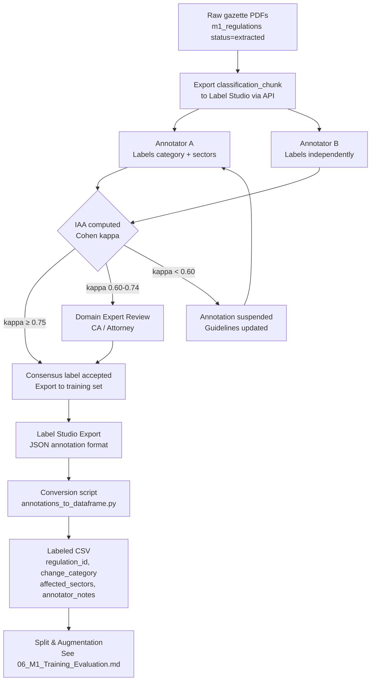

# 09 — Module 1: Annotation Guidelines

> **Cross-references:** [02_M1_Data_Requirements.md](02_M1_Data_Requirements.md) · [06_M1_Training_Evaluation.md](06_M1_Training_Evaluation.md) · [10_M1_Sinhala_Tamil_NLP.md](10_M1_Sinhala_Tamil_NLP.md)
> **See also:** [13_M1_Folder_Structure_and_Implementation_Flow.md](13_M1_Folder_Structure_and_Implementation_Flow.md) — `research/data/labeling/` + `tests/m1/fixtures/gold_labels.csv`.
> **Sub-step companions:** [09_M1_1_Category_Taxonomy_Examples.md](09_M1_1_Category_Taxonomy_Examples.md) · [09_M1_2_Annotation_Workflow_IAA_Protocol.md](09_M1_2_Annotation_Workflow_IAA_Protocol.md) · [09_M1_3_SME_Survey_Instrument.md](09_M1_3_SME_Survey_Instrument.md)

---

## Abstract

This document specifies the annotation protocol for constructing the 800-document labeled training corpus required by the Module 1 gazette classifier. It defines the complete 8-domain regulation taxonomy with per-domain decision criteria, the 3-sector (shop-focused) multi-label schema, annotator qualification requirements, inter-annotator agreement (IAA) targets (Cohen's κ ≥ 0.75), and the annotation tooling selection. Four annotation platforms are evaluated — Label Studio, Prodigy, Doccano, and a custom web-based tool — and Label Studio is selected for its active-learning integration, multi-label support, and zero licensing cost. The guidelines are designed to achieve labeling consistency sufficient for a training corpus that reaches the F1 ≥ 0.92 target defined in [06_M1_Training_Evaluation.md](06_M1_Training_Evaluation.md).

---

## 1. Annotation Tool Selection

### 1.1 Comparison Table

| Criterion | Label Studio | Prodigy | Doccano | Custom Web Tool |
|---|---|---|---|---|
| **Multi-label classification** | ✅ Native | ✅ Native | ✅ Native | ✅ Buildable |
| **Active learning integration** | ✅ ML-assisted pre-annotation | ✅ Built-in PRISM | ❌ | ✅ Buildable |
| **Multi-annotator support** | ✅ Teams + IAA dashboard | ❌ Single annotator | ✅ | ✅ Buildable |
| **PDF rendering** | ✅ HTML/text via converter | ❌ | ❌ | ✅ Embeddable |
| **API for data export** | ✅ REST API | ✅ | ✅ | ✅ |
| **Annotation agreement metrics** | ✅ Kappa built-in | ❌ Manual | ⚠️ Basic | ❌ Build separately |
| **Sinhala/Tamil text display** | ✅ UTF-8 native | ✅ | ✅ | ✅ |
| **Self-hosted** | ✅ Docker | ✅ | ✅ Docker | ✅ |
| **License cost** | ✅ Free (open source) | $595/seat/year | ✅ Free | Dev time: ~80h |
| **Learning curve** | Low-medium | Low | Low | High (custom) |
| **Why chosen** | ✅ **Selected** | Too expensive | No IAA dashboard | Too costly to build |

### 1.2 Label Studio Configuration

```yaml
# label_studio_config.xml
<View>
  <Text name="gazette_text" value="$classification_chunk" />

  <Header value="Regulation Domain (select ONE):" />
  <Choices name="change_category" toName="gazette_text" choice="single" required="true">
    <Choice value="TAX_RATE_CHANGE" />
    <Choice value="IMPORT_EXPORT" />
    <Choice value="SECTOR_SPECIFIC" />
    <Choice value="EPF_ETF_CHANGE" />
    <Choice value="LABOUR_LAW" />
    <Choice value="PRODUCT_STANDARD" />
    <Choice value="BUSINESS_REGISTRATION" />
    <Choice value="PENALTY_ENFORCEMENT" />
  </Choices>

  <Header value="Affected Sectors (select ALL that apply; all three if economy-wide):" />
  <Choices name="affected_sectors" toName="gazette_text" choice="multiple">
    <Choice value="grocery_retail" />
    <Choice value="food_service" />
    <Choice value="general_retail" />
  </Choices>

  <Header value="Notes / Edge Case Flags:" />
  <TextArea name="annotator_notes" toName="gazette_text" rows="3" />
</View>
```

---

## 2. 8-Domain Regulation Taxonomy — Decision Criteria

Each annotator must apply the following criteria in priority order. Domains are mutually exclusive (single-label). The taxonomy is shop-focused (2026-07-24): the eight streams below are the regulation channels that materially reach grocery/food retail, food service, and general-goods retail SMEs.

### 2.1 `TAX_RATE_CHANGE` (anchor stream)
**Applies when:** The gazette amends a tax rate, introduces a new tax bracket, changes VAT/SVAT rates, modifies income tax or excise duty, or introduces/removes tax exemptions under the Inland Revenue Act. Deadline extensions on tax obligations also fall here (the schedule of *what SMEs owe and when*).

**Decision signals:**
- Mentions IRD (Inland Revenue Department) as the issuing authority
- Contains phrases: `income tax`, `value added tax`, `VAT`, `SVAT`, `excise duty`, `stamp duty`
- Numerical rate change: e.g. `from 15% to 18%`, `registration threshold`

**Does NOT apply if:** The gazette imposes a penalty for non-payment of tax (→ `PENALTY_ENFORCEMENT`) or changes customs/border charges (→ `IMPORT_EXPORT`).

### 2.2 `IMPORT_EXPORT`
**Applies when:** The gazette changes customs duty, CESS, SCL (Special Commodity Levy), imposes/lifts/modifies import controls, permits, quotas, bans, or licensing requirements for goods; updates prohibited or controlled goods lists; or modifies customs clearance procedures. Highly shop-relevant: stock for grocery, electronics, textile and hardware shops is import-priced.

**Decision signals:**
- Customs/Excise authority or Controller of Imports cited
- Phrases: `customs duty`, `CESS`, `SCL`, `import licence`, `import control`, `HS code`, `tariff`

### 2.3 `SECTOR_SPECIFIC` (biggest shop-relevant stream)
**Applies when:** The gazette introduces or modifies sector-targeted compliance that reaches shops directly: CAA (Consumer Affairs Authority) maximum-retail-price orders, Food Act regulations (Ministry of Health food safety/hygiene), NMRA (National Medicines Regulatory Authority) rules, or other single-industry licensing that does not fit the streams above.

**Decision signals:**
- CAA, Food Advisory Committee / Ministry of Health (Food Act), or NMRA as issuing authority
- Phrases: `maximum retail price`, `MRP`, `price order`, `food handling`, `food licence`, `registered pharmaceuticals`

### 2.4 `EPF_ETF_CHANGE`
**Applies when:** The gazette explicitly modifies EPF (Employees' Provident Fund) or ETF (Employees' Trust Fund) employer obligations — contribution rates, eligibility thresholds, remittance/withdrawal procedures, or fund administration rules.

**Decision signals:**
- Mentions EPF Act, ETF Act explicitly
- Contribution percentages: `8% employee`, `12% employer`, `3% ETF`
- Phrases: `provident fund`, `trust fund contribution`, `EPF registration`

### 2.5 `LABOUR_LAW`
**Applies when:** The gazette amends the Shop and Office Employees Act, Wages Board Ordinance, or any minimum-wage order; changes annual leave entitlements; modifies working hours; introduces new leave types (maternity, sick leave); or amends employment termination procedures.

**Decision signals:**
- Phrases: `minimum wage`, `wages board`, `overtime rate`, `working hours`, `annual leave`, `maternity leave`
- References: Shop and Office Employees Act, Industrial Disputes Act

**Does NOT apply if:** The gazette changes EPF/ETF contribution rates specifically (→ `EPF_ETF_CHANGE`).

### 2.6 `PRODUCT_STANDARD`
**Applies when:** The gazette mandates compliance with Sri Lanka Standards Institution (SLSI) product standards, adds products to the mandatory certification list, updates technical specifications for imported or locally sold goods, or imposes labelling requirements.

**Decision signals:**
- SLSI cited as issuing authority
- SLS number cited: e.g. `SLS 1234:2023`
- Phrases: `mandatory certification`, `product conformity`, `labelling`, `consumer safety standard`

### 2.7 `BUSINESS_REGISTRATION`
**Applies when:** The gazette modifies trade licence requirements (local authority), company registration under the Companies Act, annual return filing via eROC (Department of Registrar of Companies), or sole proprietorship/partnership registration requirements.

**Decision signals:**
- DRC / eROC / Registrar of Companies / local authority as issuing authority
- Phrases: `trade licence`, `annual return`, `business registration`, `company act`

### 2.8 `PENALTY_ENFORCEMENT` (the "cost of not knowing")
**Applies when:** The gazette's primary purpose is to announce new or increased fines, penalties, enforcement notices, or revocation of existing licences for non-compliance. Note: most gazettes mention penalties incidentally — this domain only applies when penalties are the primary subject.

**Decision signals:**
- Gazette title begins with "Enforcement Notice" or "Penalty Order"
- Penalty amounts are the central content, not incidental
- No underlying regulatory change is announced

> **Out-of-scope gazettes:** Gazettes with no obligations for the three study sectors (government appointments, land acquisitions, constitutional notices, finance/CBSL directives, environmental/CEA orders aimed at factories, etc.) are handled by the separate `is_sme_relevant = FALSE` flag plus an empty `affected_sectors` set — there is no reject *domain* in the 8-domain taxonomy.

---

## 3. Sector Assignment Guidelines

Sector assignment is multi-label over the three shop-focused study sectors. Assign ALL sectors materially affected by the gazette's regulation; assign **all three** for economy-wide obligations (VAT, EPF/ETF, labour law, business registration).

| Sector | Assign when the gazette affects... |
|---|---|
| `grocery_retail` | Grocery / food retail: neighbourhood kade, mini-marts, small supermarkets |
| `food_service` | Food service: restaurants, cafés, bakeries, take-aways |
| `general_retail` | General-goods retail: textile/apparel shops, electronics/mobile shops, hardware stores |

> **Important:** Do NOT assign sectors by superficial keyword match. A gazette regulating "EPF contributions" applies to every sector with employees — assign all 3. A gazette regulating "SLSI standards for electrical appliances" applies to `general_retail` only; a Food Act hygiene rule applies to `grocery_retail` + `food_service`.

---

## 4. Inter-Annotator Agreement

### 4.1 IAA Protocol

- **Minimum annotators per document:** 2 independent annotators
- **Target agreement (Cohen's κ):** ≥ 0.75 for category; ≥ 0.70 for sector (multi-label Fleiss' κ)
- **Disagreement resolution:** Third annotator (domain expert) as tiebreaker
- **Gold standard batch:** 10% of corpus (~80 documents) annotated by all annotators + domain expert

### 4.2 Computing Cohen's κ

```python
from sklearn.metrics import cohen_kappa_score

def compute_category_kappa(annotator_a: list, annotator_b: list) -> float:
    return cohen_kappa_score(annotator_a, annotator_b)

def compute_sector_kappa(annotator_a: list[list], annotator_b: list[list]) -> float:
    """Multi-label Fleiss kappa approximated as mean of per-sector binary kappa."""
    from sklearn.preprocessing import MultiLabelBinarizer
    mlb = MultiLabelBinarizer(classes=[
        "grocery_retail", "food_service", "general_retail"
    ])
    a_bin = mlb.fit_transform(annotator_a)
    b_bin = mlb.transform(annotator_b)
    kappas = [
        cohen_kappa_score(a_bin[:, i], b_bin[:, i])
        for i in range(a_bin.shape[1])
    ]
    return float(sum(kappas) / len(kappas))
```

### 4.3 IAA Review Triggers

| κ Range | Action |
|---|---|
| ≥ 0.75 | Accept both annotations — add to training with consensus label |
| 0.60–0.74 | Flag for domain expert review — annotators must discuss |
| < 0.60 | Suspend annotation — re-train annotators, update guidelines |

### 4.4 Sector-Disagreement Resolution Rule

Sector is multi-label, so annotator disagreement is more subtle than a simple "different label." Three failure modes occur in practice:

| Disagreement type | Example | Resolution rule |
|---|---|---|
| **Strict-subset** | A: `[grocery_retail, general_retail]` · B: `[grocery_retail, general_retail, food_service]` | **Union** — accept B's superset. Rationale: missing a sector is worse than over-tagging (false negative misses an alert recipient; false positive sends a slightly off-topic alert). |
| **Overlap-with-extras** | A: `[grocery_retail, general_retail]` · B: `[grocery_retail, food_service]` | **Domain expert review.** Neither annotator's set strictly contains the other; this signals genuine ambiguity in the regulation's scope. |
| **Disjoint** | A: `[grocery_retail]` · B: `[food_service]` | **Domain expert review + flag** — the two annotators are reading the regulation as targeting different shop types. Likely indicates a guideline ambiguity that needs an update to §3 (sector decision criteria). |

The strict-subset rule is implemented in `ml/m1/data/resolve_iaa.py:resolve_sector_iaa()`; the other two paths route to a Label Studio task queue for the domain expert. All resolution outcomes are logged with `resolution_method` so the eventual training set can be audited.

---

## 5. Annotator Qualifications

| Role | Required Qualifications | Count |
|---|---|---|
| Primary annotator | Fluent English; undergraduate degree in law, commerce, or business | 3 |
| Sinhala annotator | Native Sinhala speaker; familiarity with legal Sinhala | 2 |
| Tamil annotator | Native Tamil speaker; familiarity with legal Tamil | 1 |
| Domain expert | Chartered Accountant (CA Sri Lanka) or Attorney-at-Law | 1 |

All annotators complete a calibration session on 20 pre-labeled gold-standard gazettes before contributing to the training corpus. Calibration target: κ ≥ 0.80 on the calibration set.

### 5.1 Calibration Test Design

The 20-document calibration set is hand-picked by the domain expert to span (a) every category (including the rare ones), (b) every sector (single-sector + multi-sector cases), (c) at least 3 gazettes per language, and (d) the four most-common edge-case patterns from §7 below. A candidate annotator's score determines whether they pass:

| Calibration outcome | Score | Action |
|---|---|---|
| ≥ 0.80 κ on first attempt | Pass | Promoted to production annotator; assigned first batch within 48 h |
| 0.70–0.79 κ on first attempt | Conditional | One-hour debrief with domain expert; re-test on a fresh 20-doc set; ≥ 0.80 to pass |
| < 0.70 κ on first attempt | Fail | Annotator does not proceed to the training corpus |
| Annotator fails twice | Reject | Not eligible for re-application within this project |

Pass rate target: ≥ 60 % of candidates pass on first attempt; conditional pass rate ≥ 80 %. If the pass rate drops below the target, the **guidelines** are revised (not the threshold) — the calibration set is the IAA contract with the model, not the candidate's IQ test.

Calibration outcomes per annotator are stored in `m1_annotator_calibration` (`annotator_id`, `attempt_number`, `kappa_category`, `kappa_sector`, `passed_at`). The same table tracks ongoing performance — every annotator re-takes a fresh calibration test quarterly, with the rolling κ feeding a per-annotator quality dashboard. The full calibration-set construction protocol + a sample 20-document worksheet is in [09_M1_2_Annotation_Workflow_IAA_Protocol.md](09_M1_2_Annotation_Workflow_IAA_Protocol.md).

---

## 6. Annotation Workflow


```mermaid
flowchart TD
    A[Raw gazette PDFs\nm1_regulations status=extracted] --> B[Export classification_chunk\nto Label Studio via API]
    B --> C[Annotator A\nLabels category + sectors]
    B --> D[Annotator B\nLabels independently]
    C & D --> E{IAA computed\nCohen kappa}
    E -->|kappa ≥ 0.75| F[Consensus label accepted\nExport to training set]
    E -->|kappa 0.60-0.74| G[Domain Expert Review\nCA / Attorney]
    G --> F
    E -->|kappa < 0.60| H[Annotation suspended\nGuidelines updated]
    H --> C

    F --> I[Label Studio Export\nJSON annotation format]
    I --> J[Conversion script\nannotations_to_dataframe.py]
    J --> K[Labeled CSV\nregulation_id, change_category\naffected_sectors, annotator_notes]
    K --> L[Split & Augmentation\nSee 06_M1_Training_Evaluation.md]
```

---

## 6.1 Contrastive Examples for Confusable Categories

Three domain pairs cause most inter-annotator disagreement. The contrasts below — anchored in seeded demo regulations from `app/scripts/seed_regulations.py` — give annotators concrete decision anchors:

| Confusable pair | Example A (label A) | Example B (label B) | What distinguishes them |
|---|---|---|---|
| `TAX_RATE_CHANGE` vs `IMPORT_EXPORT` | "VAT rate increased from 15 % to 18 % effective 2024-01-01" → `TAX_RATE_CHANGE` | "Customs duty on imported textiles raised from 10 % to 25 %; CESS revised on HS 5208" → `IMPORT_EXPORT` | Where the charge bites: `TAX_RATE_CHANGE` is inland taxation (IRD-administered — VAT/SVAT, income, excise); `IMPORT_EXPORT` is border charges and controls (Customs — duty, CESS, SCL, permits). |
| `SECTOR_SPECIFIC` vs `PRODUCT_STANDARD` | "CAA maximum retail price order for milk powder; selling above MRP an offence" → `SECTOR_SPECIFIC` | "Multi-pin adapters must carry SLSI safety certification before sale" → `PRODUCT_STANDARD` | Instrument type: `SECTOR_SPECIFIC` is conduct/price/licensing regulation of the *selling activity* (CAA, Food Act, NMRA); `PRODUCT_STANDARD` certifies the *product itself* (SLSI mark, labelling). |
| `PENALTY_ENFORCEMENT` vs `BUSINESS_REGISTRATION` | "Late fee for annual returns raised to Rs 2,500/month; 12-month defaulters struck off" → `PENALTY_ENFORCEMENT` | "Annual return filing fees for limited companies increased from LKR 1,000 to LKR 5,000" → `BUSINESS_REGISTRATION` | Primary purpose: if the gazette's central content is the *sanction* (fine schedule, strike-off), choose `PENALTY_ENFORCEMENT`; if it modifies the *registration obligation or its ordinary fees*, choose `BUSINESS_REGISTRATION`. |

Eight more contrastive pairs (with full text excerpts) are in [09_M1_1_Category_Taxonomy_Examples.md](09_M1_1_Category_Taxonomy_Examples.md). Annotators study these *before* the calibration test, not after — the contrastive examples are part of the training, the calibration test measures whether the training stuck.

## 7. Common Edge Cases and Resolution

| Edge Case | Resolution |
|---|---|
| Gazette amends tax rates AND extends a deadline | Assign `TAX_RATE_CHANGE` (rate + schedule are the same stream in the 8-domain taxonomy); use annotator_notes to flag the deadline component |
| EPF gazette that also mandates wage increases | Assign `EPF_ETF_CHANGE` if EPF rates are the primary change; `LABOUR_LAW` if wages are primary |
| Gazette in Sinhala only, annotator cannot read it | Route to Sinhala annotator; do NOT use machine translation for annotation |
| SLSI standard gazette with both labelling and testing requirements | Assign `PRODUCT_STANDARD`; sectors = whichever shop types sell the product (e.g. `general_retail` for appliances; `grocery_retail` for packaged food) |
| Gazette with schedule listing 50 regulated substances | Treat as `PRODUCT_STANDARD` if the substances are consumer products sold by shops; if aimed at factories/polluters only, mark `is_sme_relevant = FALSE` with empty sectors |
| Extraordinary gazette announcing state of emergency business restrictions | Assign `SECTOR_SPECIFIC`; sectors = all 3 (economy-wide) |

---

## 9. SME Awareness Survey Instrument

This section documents the survey instrument used to collect the empirical lag data for research questions RQ3 and RQ4 (see [01_M1_Research_Problem.md](01_M1_Research_Problem.md)). The survey is administered to SME owners and managers via the Enigmatrix portal, embedded in the Module 2 onboarding flow, and distributed through partner networks (NEDA, Ceylon Chamber of Commerce).

### 9.1 Survey Flow

The survey is structured in three phases:

1. **Introduction block** — Consent, SME profile (sector, district, headcount, years in operation). Pre-fills from `m1_sme_profiles` if the respondent is already registered.
2. **Per-regulation question block** — Repeated for each of 7 sector-tailored regulations + 2 economy-wide regulations (9 regulations total per respondent). Each block presents a plain-language description of the regulation and asks Q1–Q7.
3. **Open question block** — Q8 (open text) on what would most help the respondent stay compliant. Answered once, at the end.

### 9.2 Per-Regulation Question Block (Q1–Q7)

Each question block is anchored to one specific regulation, identified by a plain-language title and effective date. Respondents answer Q1–Q7 independently for each regulation shown.

| Q# | Question | Response Type | Research Use |
|---|---|---|---|
| **Q1** | "Before today, were you aware that [regulation title] had been published?" | Yes / No / Unsure | Awareness rate; whether the SME was in the survey's "aware" group |
| **Q2** | "Approximately when did you first hear about this regulation?" | Date picker (month + year accuracy accepted); optional: "I don't remember exactly" + confidence score (1–5) | `awareness_date` for lag calculation (T6) |
| **Q3** | "How did you first hear about it?" | Multi-select from 18 options (see §9.3); plus free-text "Other" | Channel-level lag disaggregation (RQ4) |
| **Q4** | "How well did you understand the regulation when you first heard about it?" | 1–5 Likert scale (1 = not at all, 5 = completely) | Understanding quality by channel — secondary finding |
| **Q5** | "Did you know the effective date of the regulation?" | Yes / No / Approximately | Compliance-window awareness |
| **Q6** | "Did you know what action your business was required to take?" | Yes / No / Partially | Action awareness — predicts compliance probability |
| **Q7** | "Did your business take the required action?" | Yes / Not yet / Not applicable / Still assessing | Actual compliance outcome — connects to [01_M1_Research_Problem.md §1.2](01_M1_Research_Problem.md) enforcement data |

### 9.3 Q3 Channel Options (18 options)

Respondents may select all channels that apply for Q3:

1. Official Gazette directly (gazette.lk)
2. IRD website or circular
3. EPF/ETF website or circular
4. SLSI notification
5. Registrar of Companies (eROC) notice
6. Central Bank of Sri Lanka (CBSL) circular
7. Ministry / Department website
8. Enigmatrix platform alert (email)
9. Enigmatrix platform alert (SMS)
10. Enigmatrix platform dashboard
11. Newspaper (Daily FT / Sunday Times / Business Times)
12. Sinhala newspaper (Divaina / Lankadeepa / Dinamina)
13. Tamil newspaper (Virakesari / Uthayan)
14. Television news (Sirasa / Hiru / Derana)
15. Accountant or auditor
16. Trade association or chamber of commerce
17. Another business owner / peer
18. Social media (Facebook / WhatsApp group / LinkedIn)

### 9.4 Open Question (Q8)

**Q8:** "What single change to how the Sri Lankan government communicates regulations would most help your business stay compliant?"

- Response type: Open text (500 character limit)
- Research use: Qualitative coding → thematic analysis for thesis discussion section; informs policy recommendations

### 9.5 Sector-Tailored Regulation Selection (SQL)

The 7 sector-specific regulations shown to each respondent are selected based on the respondent's `primary_sector` from `m1_sme_profiles` (one of `grocery_retail` / `food_service` / `general_retail`). The 2 economy-wide regulations (one IRD, one EPF) are shown to all respondents regardless of sector.

```sql
-- Sector-tailored selection: 7 most recent regulations for the respondent's sector
WITH sector_regulations AS (
    SELECT
        r.id,
        r.title,
        r.gazette_published_date,
        r.change_category,
        r.sector_tags
    FROM m1_regulations r
    WHERE
        r.status = 'ALERTED'
        AND r.sector_tags && ARRAY[:respondent_sector]::VARCHAR[]
        AND r.gazette_published_date >= NOW() - INTERVAL '2 years'
        AND r.needs_review = false
    ORDER BY r.gazette_published_date DESC
    LIMIT 7
),
-- Economy-wide regulations: one IRD + one EPF in the same 2-year window
economywide_regulations AS (
    (SELECT id, title, gazette_published_date, change_category, sector_tags
     FROM m1_regulations
     WHERE change_category = 'TAX_RATE_CHANGE' AND status = 'ALERTED' AND needs_review = false
     ORDER BY gazette_published_date DESC LIMIT 1)
    UNION ALL
    (SELECT id, title, gazette_published_date, change_category, sector_tags
     FROM m1_regulations
     WHERE change_category = 'EPF_ETF_CHANGE' AND status = 'ALERTED' AND needs_review = false
     ORDER BY gazette_published_date DESC LIMIT 1)
)
-- Final survey regulation list (up to 9 regulations)
SELECT * FROM sector_regulations
UNION ALL
SELECT * FROM economywide_regulations
ORDER BY gazette_published_date DESC;
```

The SQL result is passed to the survey front-end, which renders one Q1–Q7 block per row. Regulations with no SME awareness responses yet (i.e., `m1_sme_awareness_responses` has no matching `regulation_id`) are prioritised by a secondary sort on `response_count ASC` to maximise data coverage across the corpus.

---

## 8. Conclusion

The annotation protocol establishes a rigorous, reproducible framework for constructing the 800-document labeled corpus. Label Studio is selected as the annotation platform for its IAA dashboard, multi-label support, and active-learning integration that enables the ML model to pre-annotate later batches — reducing annotator burden by an estimated 40% after the first 400 labeled examples. The 8-domain taxonomy with explicit decision criteria and edge-case resolution guidance is designed to achieve κ ≥ 0.75, which research by Artstein & Poesio (2008) identifies as the minimum threshold for reliable ML training labels.

---

## References

- Artstein & Poesio (2008). *Inter-Coder Agreement for Computational Linguistics*. Computational Linguistics, 34(4).
- Fleiss, J. L. (1971). *Measuring nominal scale agreement among many raters*. Psychological Bulletin, 76(5).
- Label Studio. (2024). *Label Studio Open Source Documentation*. [labelstud.io](https://labelstud.io)
- Department of Government Printing Sri Lanka. *Official Gazette taxonomy*. gazette.lk
- Sri Lanka Standards Institution. (2023). *SLSI Mandatory Certification List*. slsi.lk
- Inland Revenue Department. (2023). *Gazette Notifications Archive*. ird.gov.lk
