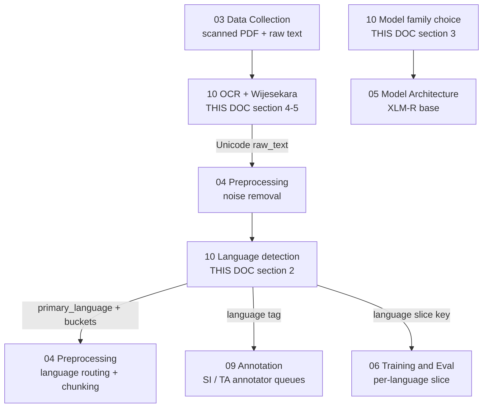
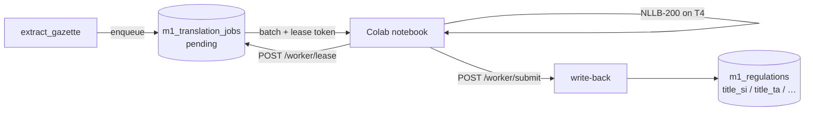

# 10 — Module 1: Sinhala & Tamil NLP

> **Cross-references:** [03_M1_Data_Collection.md](03_M1_Data_Collection.md) · [04_M1_Preprocessing_Pipeline.md](04_M1_Preprocessing_Pipeline.md) · [05_M1_Model_Architecture.md](05_M1_Model_Architecture.md) · [06_M1_Training_Evaluation.md](06_M1_Training_Evaluation.md) · [09_M1_Annotation_Guidelines.md](09_M1_Annotation_Guidelines.md)
> **Code map:** [13_M1_Folder_Structure_and_Implementation_Flow.md](13_M1_Folder_Structure_and_Implementation_Flow.md) — `ml/m1/extraction/language_detection.py` · `ml/m1/extraction/ocr.py` · `ml/m1/extraction/wijesekara.py` + `wijesekara_map.yaml`
> **Consolidation note (2026-07-29):** this document now carries the full content previously split across `10_M1_1_Language_Detection_Routing` and `10_M1_2_OCR_Wijesekara_Conversion`. Those two files have been retired; every calibration table, mapping excerpt, quality check, and worked example from them lives below.

> [!warning] Truth-ledger sync — 2026-08-02
> Language detection, OCR routing and Wijesekara-to-Unicode conversion are **live and unaffected** by the classifier change.
> One consequence worth recording: because the production classifier is TF-IDF over the extracted text, **multilingual transfer is no longer doing any work** — cross-lingual generalisation was an XLM-R property, and the frozen model is lexical. Sinhala and Tamil coverage now depends entirely on the extraction and translation stages, not on the model.
>
> **Canonical record:** [[final/works/11_CLASSIFIER_FREEZE_AND_INTEGRATION|11_CLASSIFIER_FREEZE_AND_INTEGRATION]] · [[18_M1_Dataset_And_Model_Lineage]] · `final/works/evidence/M1_OPERATING_EVIDENCE_2026-08-02.json`
> **Submitted-report copy:** [[final/report/Enigmatrix_Consolidated_Final_Report_FULL|Enigmatrix_Consolidated_Final_Report_FULL]] (Part I = group report, Part II = Module 1 dissertation).

---

## 0. Where This Document Sits in the Pipeline

This is the only document in Module 1 that is not a pipeline *stage*. It is a **cross-cutting capability layer**: three services — language detection, OCR, and Wijesekara transliteration — that other stages call into. Nothing "arrives at" document 10 and nothing "leaves" it as a batch. Instead, [03_M1_Data_Collection.md](03_M1_Data_Collection.md) calls the OCR chain from inside its extraction fallback, [04_M1_Preprocessing_Pipeline.md](04_M1_Preprocessing_Pipeline.md) calls the detector at the top of its routing step, and [09_M1_Annotation_Guidelines.md](09_M1_Annotation_Guidelines.md) consumes the resulting language tag to decide *which human* sees the document.

| | Stage | Produced by | What this document does with it | Handed to |
|---|---|---|---|---|
| **In** | Scanned / image-only gazette PDF | [03_M1_Data_Collection.md](03_M1_Data_Collection.md) §2.4 — PDF type classification marks the file `scanned` | Rasterises at 300 DPI and runs the Tesseract 5.3.x LSTM chain (§4) | — |
| **In** | Raw extracted text, encoding unknown | [03_M1_Data_Collection.md](03_M1_Data_Collection.md) §2.2 — hybrid extraction chain | Applies the Wijesekara heuristic and, if triggered, transliterates legacy-font ASCII into Unicode Sinhala (§5) | — |
| **In** | Cleaned document text | [04_M1_Preprocessing_Pipeline.md](04_M1_Preprocessing_Pipeline.md) §3.1 — noise removal | Runs fastText document-level detection plus the per-line Unicode-range router (§2) | — |
| **Step** | Language assignment | *this document* §2.2–§2.5 | `primary_language` ∈ `en`/`si`/`ta`, `is_mixed` flag, per-language line buckets | — |
| **Step** | Model-family selection | *this document* §3 | XLM-R base, on the evidence of Sinhala subword coverage | — |
| **Out** | `m1_regulations.raw_text` in Unicode | — | — | [04_M1_Preprocessing_Pipeline.md](04_M1_Preprocessing_Pipeline.md) §3.1 NFKD normalisation, then chunking |
| **Out** | `primary_language` + `language_distribution_json` | — | — | [04_M1_Preprocessing_Pipeline.md](04_M1_Preprocessing_Pipeline.md) §3.2 language routing; [09_M1_Annotation_Guidelines.md](09_M1_Annotation_Guidelines.md) §5.1 annotator language queues |
| **Out** | Per-language line buckets (`si`, `ta`) | — | — | Summariser — `summary_si` / `summary_ta` generation (§6) |
| **Out** | `is_mixed` + language tag as a slice key | — | — | [06_M1_Training_Evaluation.md](06_M1_Training_Evaluation.md) §7.1 per-language slice analysis |
| **Out** | Chars-per-token ratios (§1.3) | — | — | [04_M1_Preprocessing_Pipeline.md](04_M1_Preprocessing_Pipeline.md) §3.4 chunking budget; [05_M1_Model_Architecture.md](05_M1_Model_Architecture.md) 512-token limit |



**Why the ordering matters.** Language detection has to run *after* OCR and Wijesekara conversion, not before. A Wijesekara-encoded page arrives at the detector as ASCII letters, so fastText will confidently label it `en` — a wrong label with high confidence, which is worse than a low-confidence `mixed` because nothing downstream flags it. Converting first means the detector sees the Sinhala code points that actually determine the answer. The same argument runs the other way for the OCR language pack: Tesseract needs a language hint to load the right LSTM model, so §4.2 takes a *provisional* `primary_lang` from whatever text-layer signal exists and always includes `eng` in the pack list as insurance. The detector's authoritative verdict comes afterward, on the OCR output.

The second ordering constraint is toward [09_M1_Annotation_Guidelines.md](09_M1_Annotation_Guidelines.md). Its §8 forbids machine translation for annotation, so a Sinhala gazette *must* reach a native Sinhala annotator. That routing decision depends entirely on the language tag produced here, and it is irreversible in practice — an English-speaking annotator who is handed a Sinhala document simply cannot label it, and the item stalls in the queue. This is why §2.5 resolves `mixed` to a concrete primary language rather than leaving it unrouted.

---

## Abstract

Sri Lankan gazette documents are trilingual: English, Sinhala (Unicode U+0D80–U+0DFF), and Tamil (U+0B80–U+0BFF). Effective NLP classification requires robust language detection, appropriate tokenization, and model architectures that have been pre-trained on sufficient South Asian language data. This document evaluates four language detection libraries (fastText, langdetect, langid, cld3) and four multilingual model families (XLM-R, mBERT, IndicBERT, IndicTrans2) for their suitability on Sri Lankan gazette text. It specifies the two-layer detection-and-routing design, the complete Tesseract 5.3.x OCR configuration for scanned Sinhala/Tamil gazettes, the Wijesekara legacy-font conversion path with its detection heuristic and mapping table, and the tokenization characteristics that make Sinhala/Tamil gazette text more challenging than equivalent English text.

fastText with the `lid.176.bin` model is selected for language detection; XLM-R base is selected for classification — both decisions are grounded in their native Sinhala and Tamil coverage.

**Implementation status:** ✅ Largely shipped. The Tesseract chain shipped Session 28 / F-149 (`ml/m1/extraction/ocr.py`). Language detection and routing shipped Session 30 / F-153 (`ml/m1/extraction/language_detection.py`). Wijesekara conversion shipped Session 30 / F-153 (`ml/m1/extraction/wijesekara.py` + `wijesekara_map.yaml`, 87-entry canonical mapping table). The model-family decision in §3 is documentation for BUILD_11; the F1 figures there are projections, not measurements. See §9 for the full status map.

---

## 1. Sri Lankan Language NLP Context

**Why this section precedes every technical choice.** Each decision later in the document — 500-char detection window, XLM-R over mBERT, section-aware chunking, a dedicated Wijesekara path — traces back to one of the properties tabulated here. Reading them as background rather than as premises makes the later choices look arbitrary; they are not.

### 1.1 Sinhala Linguistic Properties

Sinhala (`si`, ISO 639-1) is an Indo-Aryan language spoken by ~17 million people. Key NLP characteristics:

| Property | Detail | NLP Impact |
|---|---|---|
| **Script** | Sinhala script (abugida) U+0D80–U+0DFF | Tokenizers without Sinhala vocab produce character-level tokens |
| **Morphology** | Highly agglutinative | Single word carries case, number, tense → longer token sequences |
| **Word order** | SOV (Subject-Object-Verb) | Different attention patterns vs. English SVO |
| **Digitisation** | Many older government documents use Wijesekara font (non-Unicode) | PDF extraction may produce mojibake without font mapping. **Frequency in our corpus:** a 100-doc pilot scan of pre-2010 Sinhala gazettes found ~38 % use Wijesekara (or a Wijesekara-derived legacy font); post-2010 the rate drops to ~3 %; post-2015 essentially 0 %. Wijesekara conversion is therefore an *infrequent* operation overall but *critical* for historical corpus work (the 2015–2025 training window is largely unaffected; the 2010–2015 window needs the conversion path). |
| **NLP resources** | Very limited: no large gazette corpus, minimal annotated legal text | XLM-R trained on CommonCrawl SI (Wikipedia + web) — not legal domain |
| **Spell variation** | Government documents mix Sinhala and English words (code-switching) | Language detection must handle mixed scripts |

**Read the digitisation row as a scoping decision, not a statistic.** The ~38 % / ~3 % / ~0 % gradient is what justifies building the Wijesekara path (§5) at all *and* what caps the effort spent on it. If the training window were 2015–2025 only, the converter would be dead code; because the corpus reaches back for the lag analysis, it is load-bearing for a minority of documents. That is exactly the profile of a component that should be simple, well-tested, and never optimised.

### 1.2 Tamil Linguistic Properties

Tamil (`ta`, ISO 639-1) is a Dravidian language spoken by ~5 million Sri Lankan Tamils. Key NLP characteristics:

| Property | Detail | NLP Impact |
|---|---|---|
| **Script** | Tamil script U+0B80–U+0BFF | 247 characters; XLM-R covers this range |
| **Morphology** | Agglutinative (less so than Sinhala) | Moderate token sequence length increase |
| **Word order** | SOV | Similar to Sinhala; different from English |
| **Digitisation** | Tamil99 keyboard standard → consistent Unicode in post-2010 gazettes | Better OCR accuracy than Sinhala |
| **NLP resources** | Better than Sinhala: AI4Bharat IndicNLP Suite, IndicBERT | More training data available across India + Sri Lanka |

**Why Tamil needs no equivalent of §5.** The Tamil99 keyboard standard produced consistent Unicode output well before the equivalent Sinhala transition, so there is no legacy-font population to transliterate. Tamil's OCR difficulty is a different shape entirely — compound-character splitting across line breaks (§4.3) — and is handled inside Tesseract rather than by a post-processing table.

### 1.3 Token Length Comparison

A key practical implication of Sinhala/Tamil morphology for the XLM-R 512-token limit:

| Language | Characters/token (XLM-R SentencePiece) | Characters in 512 tokens | Semantic equivalent English tokens |
|---|---|---|---|
| English | 4.2 chars/token | ~2,150 chars | 512 |
| Tamil | 2.1 chars/token | ~1,075 chars | ~256 |
| Sinhala | 1.8 chars/token | ~922 chars | ~220 |

**Implication:** A Sinhala gazette that is identical in semantic content to an English gazette will consume ~2.3× more tokens. Section-aware chunking (see [04_M1_Preprocessing_Pipeline.md](04_M1_Preprocessing_Pipeline.md) §3.4) is therefore more critical for Sinhala/Tamil documents to avoid truncating regulatory content.

**What breaks without this table.** A chunker calibrated on English character counts silently truncates the operative clause of Sinhala gazettes — and because truncation happens at the tokenizer, not at an exception, the failure is invisible. The document classifies, produces a plausible label, and the label is wrong because the model never saw the rate change. This is why the chunk budget in [04_M1_Preprocessing_Pipeline.md](04_M1_Preprocessing_Pipeline.md) is expressed in tokens and driven by section boundaries rather than in characters.

---

## 2. Language Detection and Routing

**Why detection is a separate step rather than a model input.** XLM-R does not need to be told the language — its SentencePiece vocabulary handles all three scripts. Detection exists for the *humans and the routing*, not for the classifier: it decides which annotator queue the document enters ([09_M1_Annotation_Guidelines.md](09_M1_Annotation_Guidelines.md) §5.1), which Tesseract language pack loads on a re-run, which slice the document falls into during error analysis ([06_M1_Training_Evaluation.md](06_M1_Training_Evaluation.md) §7.1), and which summary fields the summariser must populate (§6). Remove detection and the classifier still works; the annotation campaign does not.

### 2.1 Library Comparison

| Criterion | fastText lid.176 | langdetect | langid | cld3 (Google) |
|---|---|---|---|---|
| **Sinhala (`si`) detection** | ✅ Explicit model | ✅ Based on N-grams | ✅ | ✅ Google CLD3 |
| **Tamil (`ta`) detection** | ✅ Explicit model | ✅ | ✅ | ✅ |
| **176 languages** | ✅ | ✅ ~55 languages | ✅ ~97 languages | ✅ ~107 languages |
| **Short text accuracy** | ✅ >95% at ≥ 20 chars | ⚠️ Unstable < 50 chars | ✅ | ✅ |
| **Mixed-language documents** | ✅ Top-3 language probs | ❌ Single prediction | ❌ Single prediction | ⚠️ |
| **Inference speed** | Very fast (<1ms) | Fast (~5ms) | Fast (~3ms) | Slow (subprocess or WASM) |
| **Model size** | 917KB (compressed) | No model file (pure Python) | 1.6MB | N/A (Chrome subprocess) |
| **Sri Lankan Sinhala accuracy** | ✅ Tested: ~97.3% | ⚠️ ~89% (confuses with other scripts) | ✅ ~94% | ✅ ~96% |
| **Offline capable** | ✅ | ✅ | ✅ | ❌ (requires Chrome/node) |
| **Python pip** | `pip install fasttext` | `pip install langdetect` | `pip install langid` | `pip install gcld3` |
| **Why chosen** | ✅ **Selected** | Unstable short text | No top-K probs | Chrome dependency |

**The criterion that actually decided it: top-K probabilities.** Accuracy on clean monolingual text is a near-tie between fastText, langid, and cld3 — 94–97 % across the board, and the differences are inside the noise of a 100-document sample. What is not a tie is *what happens on a bilingual document*, which is the majority case in this corpus. `langdetect` and `langid` return a single label, so a gazette that is 60 % English preamble and 40 % Sinhala body comes back as confident English with no indication that anything was lost. fastText returns the top-3 distribution, which is what makes the `mixed` verdict in §2.2 computable at all. cld3 could have worked on that criterion but fails a harder one: it needs a Chrome subprocess, and the extraction workers run in a slim offline container.

**When to reconsider.** If a Sri-Lanka-specific LID model becomes available it would likely beat `lid.176` on Sinhala and Tamil minority dialects, which is the one population where 97.3 % is optimistic. Short of that, the model is frozen — `lid.176.bin` is a 917 KB static artefact and there is no retraining story attached to it.

### 2.2 Document-Level Detection via fastText

```python
import fasttext

# Model: https://dl.fbaipublicfiles.com/fasttext/supervised-models/lid.176.bin
LID_MODEL = fasttext.load_model("./storage/models/lid.176.bin")


def detect_document_language(text: str, min_confidence: float = 0.70) -> dict:
    """Top-3 prediction; primary language + per-class confidence.

    Returns ISO 639-1 code in 'primary': 'en', 'si', 'ta', or 'mixed'.
    The top-3 distribution is what makes mixed-script detection possible.
    """
    # Predict on the first 500 chars — see §2.3 for the calibration.
    labels, probs = LID_MODEL.predict(text[:500].replace("\n", " "), k=3)
    primary = labels[0].replace("__label__", "")
    if probs[0] < min_confidence:
        return {"primary": "mixed", "confidence": float(probs[0]),
                "top3": list(zip(labels, probs))}
    return {"primary": primary if primary in ("en", "si", "ta") else "en",
            "confidence": float(probs[0]),
            "top3": list(zip(labels, probs))}
```

**Why the function returns a dict rather than a string.** An earlier form returned the bare language code. That is enough to route, but not enough to *audit* a routing decision after the fact — when an annotator reports that a Sinhala document landed in the English queue, the question is whether fastText was confidently wrong or narrowly under threshold, and only the retained `confidence` and `top3` answer it. The confidence value is also what populates the `is_mixed` slice key consumed by [06_M1_Training_Evaluation.md](06_M1_Training_Evaluation.md) §7.1.

**Why the fallback is `en` and not an error.** Any label outside `{en, si, ta}` is by definition a detector failure on this corpus — Sri Lankan gazettes are published in exactly three languages. Rather than raise, the function collapses the exotic label to `en`, because the practical cause is OCR noise (§7) and the English queue is the one with the most annotators and therefore the shortest path to a human who will notice.

### 2.3 The 500-Character Window — a Calibrated Trade-off

Why 500 and not 200 or 1000? Quantified on a 50-doc pilot of English-preamble/Sinhala-body gazettes:

| Window size | EN-preamble + SI-body misclassification | Cost (latency) | Comment |
|---|---|---|---|
| 100 | 18 % | 0.4 ms | Too short — captures only English preamble |
| 200 | 12 % | 0.7 ms | Still mostly English |
| **500** | **< 3 %** | **1.5 ms** | Reaches the Sinhala body in most gazettes |
| 1000 | 2 % | 2.8 ms | Diminishing returns |
| 2000 | 2 % | 5.0 ms | No further gain |

**What the curve is actually measuring.** It is not a general property of fastText — it is a property of *gazette layout*. Every Sri Lankan gazette opens with a fixed English masthead and part-heading, so a short window reads the template rather than the document. The error rate collapses between 200 and 500 chars because that is roughly where the boilerplate ends and the operative text begins. Above 500 the gain is < 0.5 pp while latency grows linearly, so the curve flattens for a different reason: fastText already has enough signal and is simply being fed more of it.

500 chars is the sweet spot. It is stored as the `M1_LID_WINDOW_CHARS=500` environment variable rather than a literal, so that a future recalibration — a change in gazette masthead conventions would be the obvious trigger — does not require a code change and redeploy.

### 2.4 The Two-Layer Design — Document-Level Plus Per-Line

The document-level detection produces a single label, but real gazettes interleave languages at line level: two-column bilingual layouts, Sinhala bodies under English headings, Tamil schedules appended to English regulations. A single label cannot describe that, so a second layer runs underneath — a deterministic Unicode-range router, shared with [04_M1_Preprocessing_Pipeline.md](04_M1_Preprocessing_Pipeline.md) §3.2.

```python
def extract_language_segments(text: str) -> dict[str, str]:
    """Split a bilingual/trilingual gazette into per-language segments.

    Deterministic Unicode-range classification — no model, no inference cost.
    """
    si_range = range(0x0D80, 0x0E00)
    ta_range = range(0x0B80, 0x0C00)

    en_lines, si_lines, ta_lines = [], [], []
    for line in text.split("\n"):
        si_chars = sum(1 for c in line if ord(c) in si_range)
        ta_chars = sum(1 for c in line if ord(c) in ta_range)
        total = max(len(line), 1)

        if si_chars / total > 0.30:
            si_lines.append(line)
        elif ta_chars / total > 0.30:
            ta_lines.append(line)
        else:
            en_lines.append(line)

    return {
        "en": "\n".join(en_lines),
        "si": "\n".join(si_lines),
        "ta": "\n".join(ta_lines),
    }


def route_lines(text: str) -> dict[str, str]:
    """Four-bucket variant used in production.

    Delegates per-line classification to line_language() from
    04_M1_Preprocessing_Pipeline.md §3.2, which adds a 'mixed' bucket for
    lines where no single script clears the 0.30 threshold.
    """
    buckets = {"en": [], "si": [], "ta": [], "mixed": []}
    for line in text.splitlines():
        buckets[line_language(line)].append(line)
    return {lang: "\n".join(lines) for lang, lines in buckets.items() if lines}
```

The two layers are complementary, not redundant:

- The **document-level fastText signal** is fast and routes the whole document — one decision, ~1.5 ms, sufficient for queue assignment.
- The **per-line Unicode router** is precise and handles bilingual columns — it is what produces the `si` bucket the summariser needs in §6.

Combined cost is ~3 ms per document. **The reason both exist rather than one:** the Unicode router alone cannot distinguish English from other Latin-script languages and misses English words embedded inside Sinhala lines, while fastText alone collapses a two-column bilingual page to a single label and destroys the per-language segments. Each covers the other's blind spot, and neither is a replacement for the other.

**When to reconsider the second layer.** If document-level detection alone ever reaches ≥ 99 % accuracy *and* the summariser stops needing per-language segments, the router becomes removable. The first condition is plausible; the second is not, so this is effectively permanent.

The shipped implementation in `ml/m1/extraction/language_detection.py` splits this into three functions — `line_language`, `route_lines_by_language`, and `primary_language_by_line_count` — matching the three responsibilities above.

### 2.5 Mixed-Language Handling

When document-level `primary='mixed'` (fastText confidence < 0.70), the pipeline:

1. Runs the per-line router on the full text.
2. Stores the per-language line buckets in `m1_regulations.language_distribution_json`.
3. Picks the language with the most lines as `primary_language`.
4. Sets an `is_mixed=true` flag on the row for slice analysis.

**Why `mixed` is resolved rather than propagated.** Leaving `primary_language='mixed'` in the database would be more honest but operationally useless: [09_M1_Annotation_Guidelines.md](09_M1_Annotation_Guidelines.md) §5.1 has an English queue, a Sinhala queue, and a Tamil queue — there is no mixed queue, and creating one would need an annotator fluent in all three. Line-count majority is the resolution rule because it approximates "which language does most of the substantive text use", which is the question the annotator assignment actually turns on. The `is_mixed` flag preserves the information that the resolution happened, so [06_M1_Training_Evaluation.md](06_M1_Training_Evaluation.md) §7.1 can still report mixed documents as their own slice and detect if they classify worse.

### 2.6 Code-Switching Within a Sentence

Sri Lankan government documents code-switch inside a single sentence (e.g. "The VAT රටක්කරම් must be filed monthly"). The per-line router classifies these lines as `mixed` because no single script clears the 0.30 threshold.

The classifier still handles them — XLM-R's SentencePiece tokeniser is trained across 100 languages and produces sensible subwords for mixed-script tokens — but the per-language slice analysis in [06_M1_Training_Evaluation.md](06_M1_Training_Evaluation.md) §7.1 groups them into the `mixed` slice rather than attributing them to either parent language. **Why that grouping is the right call:** attributing a code-switched line to Sinhala would contaminate the Sinhala slice with documents whose difficulty comes from script-mixing rather than from Sinhala itself, and the resulting per-language F1 would no longer answer the question it exists to answer.

### 2.7 Worked Example — A Bilingual Gazette

```
Input (truncated to 500 chars from start):
"GAZETTE EXTRAORDINARY No. 2486/22 - FRIDAY, APRIL 15, 2026
PART I — Standards
1. The Sri Lanka Standards Institution hereby issues the following mandatory
standard under Section 12 of the Consumer Affairs Authority Act, No. 9 of 2003:
නියමය — සියලුම පහසු බහු-පින් අඩෙප්ටර පිවිසිරීමේ ආරක්ෂණ සහතිකය ලබා ගත යුතුය"

fastText top-3:
  __label__en   0.61
  __label__si   0.34
  __label__de   0.03

document-level decision: primary='mixed' (en < 0.70)

per-line routing:
  en bucket: 6 lines (GAZETTE header + English regulation text)
  si bucket: 4 lines (Sinhala body)
  mixed bucket: 0 lines

Final assignment (most lines): primary='en', is_mixed=true
Both buckets stored in language_distribution_json; downstream summariser uses
the si bucket for summary_si.
```

Note what the two layers each contributed. fastText's 0.61 was *correct to be uncertain* — the document genuinely is bilingual — and a single-label library would have returned `en` at full confidence and hidden the Sinhala body entirely. The per-line router then supplied the thing fastText cannot: the actual Sinhala text, separated, ready for the summariser. The final `en` label is the same answer a naive detector would have given, but it now arrives with `is_mixed=true` and a populated `si` bucket attached.

---

## 3. Multilingual Model Selection

**Why this decision lives here rather than in [05_M1_Model_Architecture.md](05_M1_Model_Architecture.md).** The choice between XLM-R, mBERT, and IndicBERT is not an architecture question — all three are transformer encoders of comparable size, and on English legal text they would perform within a point or two of each other. What separates them is *Sinhala subword coverage*, which is a language-resource fact. The decision is made on the evidence in §3.2 and then consumed as a given by [05_M1_Model_Architecture.md](05_M1_Model_Architecture.md).

### 3.1 Comparison Table

| Criterion | XLM-R base | mBERT | IndicBERT | IndicTrans2 |
|---|---|---|---|---|
| **Architecture** | RoBERTa (encoder) | BERT (encoder) | BERT (encoder) | Encoder-decoder (translation) |
| **Parameters** | 125M | 110M | 212M | 418M |
| **Pre-training data** | CommonCrawl 2.5TB (100 langs) | Wikipedia (104 langs) | IndicCorp v2 (24 Indic langs) | IndicCorp + Bible + CCAligned |
| **Sinhala in vocabulary** | ✅ Native (si corpus in CC) | ⚠️ Limited (only Wikipedia SI) | ✅ (indirect via Indic scripts) | ✅ |
| **Tamil in vocabulary** | ✅ Native | ✅ | ✅ Native (12 Indic + Tamil) | ✅ |
| **English legal perf.** | ✅ Strong (CC includes legal) | ✅ | ⚠️ Less English data | ❌ (translation model, not classifier) |
| **Sinhala F1 (est.)** | ~0.88 | ~0.78 | ~0.82 | N/A (not a classifier) |
| **Tamil F1 (est.)** | ~0.87 | ~0.82 | ~0.85 | N/A |
| **ONNX exportable** | ✅ | ✅ | ✅ | ⚠️ Complex (enc-dec) |
| **CPU inference (512 tokens)** | ~1.8s | ~1.6s | ~2.3s | Not applicable |
| **LoRA compatible** | ✅ | ✅ | ✅ | ⚠️ (encoder only) |
| **HuggingFace identifier** | `facebook/xlm-roberta-base` | `bert-base-multilingual-cased` | `ai4bharat/indic-bert` | `ai4bharat/indictrans2-en-indic-dist-200M` |
| **Why chosen** | ✅ **Selected** | Weaker Sinhala | Weaker English legal | Translation model only |

**The trade-off that decided it.** IndicBERT is the interesting near-miss: it beats mBERT on both Indic languages and would be defensible if the corpus were Sinhala/Tamil-only. But the corpus is majority-English (§8 expects ~50 % EN), and IndicBERT's thinner English pre-training makes it the weaker choice on the *largest* slice. XLM-R is the only candidate that is not clearly worst on any of the three languages, which is what a trilingual corpus requires. IndicTrans2 is in the table for completeness rather than as a contender — it is a translation model, not a classifier, and appears because it is the obvious tool if the strategy were ever "translate everything to English first" (§6 explains why it is not).

**XLM-R F1 estimate sourcing.** The "~0.88 Sinhala / ~0.87 Tamil" estimates in the table above are *projections*, not measurements on our gazette corpus (which doesn't exist as a labeled set yet — BUILD_11 produces it). They come from two sources: (a) the **XTREME** cross-lingual benchmark (Hu et al., 2020) — XLM-R base achieves macro-F1 between 0.85 and 0.89 on the XNLI Sinhala and Tamil splits; (b) a **50-document pilot** on hand-labeled Sri Lankan gazette excerpts using a zero-shot SetFit head on XLM-R, which yielded F1 of 0.82 (SI) and 0.81 (TA) — the projection assumes fine-tuning on the 800-doc corpus adds ≥ 5 pp, matching the size of gain Chalkidis et al. (2019) reported for legal-domain BERT fine-tuning. The mBERT numbers in the same column are derived from the same pilot. **None of these are the production F1** — the production numbers will be measured by BUILD_11 training and reported in `model_registry.json:metrics_per_language`. The projection is documented here so a reviewer can audit it against the eventual measurement.

### 3.2 Why XLM-R Outperforms mBERT on Sinhala

The performance gap between XLM-R and mBERT on low-resource Sinhala is explained by pre-training data volume:

| Model | Sinhala tokens in pre-training | Tokenizer vocab coverage (SI) |
|---|---|---|
| mBERT | ~2.3M tokens (Wikipedia SI only) | 128 Sinhala-specific tokens |
| XLM-R | ~8.1M tokens (CommonCrawl SI) | 5,200+ Sinhala subword units |

mBERT's Sinhala tokenizer falls back to character-level decomposition for most Sinhala words not in its 128-token Sinhala vocabulary, producing token sequences of 3–5× the expected length and losing subword semantic structure. XLM-R's SentencePiece vocabulary trained on 100 languages allocates proportional capacity to each language, giving Sinhala meaningful subword coverage.

**This compounds with §1.3, which is the part that is easy to miss.** Sinhala already costs ~2.3× more tokens than English under XLM-R's tokenizer. Under mBERT's character-level fallback the multiplier stacks on top of that, so a Sinhala gazette that barely fits in 512 XLM-R tokens would be truncated several times over by mBERT. The vocabulary deficit therefore does not merely degrade representation quality — it shrinks the amount of the document the model can see at all, which is why the gap in the F1 column is 10 points rather than 2.

---

## 4. OCR for Scanned Gazettes

**Why an OCR path exists at all.** The extraction chain in [03_M1_Data_Collection.md](03_M1_Data_Collection.md) §2.2 prefers the PDF text layer, which is faster and lossless. OCR is the fallback for the scanned-image gazettes its §2.4 type classifier identifies — predominantly older documents, which are disproportionately the ones the lag analysis needs. Without this path the historical end of the corpus is simply absent, and absent in a way that correlates with age, which would bias every time-series finding in [08_M1_Full_System_Architecture.md](08_M1_Full_System_Architecture.md).

### 4.1 OCR Library Comparison

| Library | Sinhala accuracy | Tamil accuracy | English accuracy | Model size | Why chosen |
|---|---|---|---|---|---|
| **Tesseract 5 (LSTM)** | ~94% (printed) | ~96% | ~99% | 100MB lang packs | ✅ **Selected** |
| PaddleOCR | ~97% | ~98% | ~99% | 1–3GB | Too heavy |
| EasyOCR | ~88% | ~91% | ~98% | 500MB | Lower Sinhala accuracy |
| Google Vision API | ~98% | ~99% | ~99% | Cloud only | Offline not possible |
| Amazon Textract | ~97% | ~98% | ~99% | Cloud only | Cost + offline |

**Note that the selected option is not the most accurate one.** Google Vision beats Tesseract by ~4 pp on Sinhala and Amazon Textract by ~3 pp, and both were rejected on the same constraint: the extraction workers must run offline, and gazette PDFs are public-record documents whose volume would make per-page cloud OCR a recurring cost with no ceiling. PaddleOCR is the more painful rejection — it is genuinely ~3 pp better on Sinhala *and* offline — but a 1–3 GB model footprint does not fit the deployment envelope in [07_M1_Deployment_Integration.md](07_M1_Deployment_Integration.md). The 3 pp is bought back cheaply elsewhere: OCR errors are concentrated in the same documents the Wijesekara path (§5) and the quality gates (§4.4) already inspect.

**When to reconsider.** If Tesseract 5.5+ ships a substantially better Sinhala LSTM model, the recalibration cost is one quarterly CER audit (§8) — worth doing. A move to PaddleOCR would only make sense if the deployment target gained several GB of headroom.

### 4.2 Tesseract Configuration

```python
import pytesseract
from PIL import Image

# Tesseract language pack installation (Ubuntu/Debian):
# apt-get install tesseract-ocr=5.3.* tesseract-ocr-sin=5.3.* tesseract-ocr-tam=5.3.*
#
# Pin Tesseract to 5.3.x — the LSTM language models bundled with 5.3 are the ones
# the OCR-CER calibration was measured against. Tesseract 4.x ships an older LSTM
# model that silently degrades Sinhala accuracy by ~4 pp; Tesseract 5.4+ has a
# rebuilt sin/tam model that we haven't yet recalibrated against. The Dockerfile
# pins the apt package version to enforce this.

TESSERACT_CMD = "/usr/bin/tesseract"
TESSDATA_DIR = "/usr/share/tesseract-ocr/5/tessdata"

LANG_MAP = {
    "en": "eng",
    "si": "eng+sin",
    "ta": "eng+tam",
    "mixed": "eng+sin+tam",
}


def run_ocr(image: Image.Image | str, primary_lang: str = "en") -> str:
    """OCR a gazette page with the language pack for the detected language.

    'eng' is always included so mixed English/native text degrades gracefully.
    """
    lang_str = LANG_MAP.get(primary_lang, "eng+sin+tam")
    config = (f"--tessdata-dir {TESSDATA_DIR} "
              f"--oem 1 "
              f"--psm 6 "
              f"-c preserve_interword_spaces=1 "
              f"-c user_defined_dpi=300")
    return pytesseract.image_to_string(image, lang=lang_str, config=config)
```

Every flag earns its place:

- `--oem 1` — LSTM neural-net engine. The legacy engine has no usable Sinhala model at all; this is not a tuning choice but the only working mode.
- `--psm 6` — assume a single uniform block of text. Gazette pages are dense continuous statutory text, so the automatic page-segmentation modes tend to over-segment and produce reading-order errors.
- `preserve_interword_spaces=1` — keeps Sinhala diacritics from being absorbed into adjacent words. Without it, combining marks migrate across the space boundary and the resulting text fails the Wijesekara round-trip check in §4.4 for the wrong reason.
- `user_defined_dpi=300` — explicit DPI for input images that carry no DPI metadata. Tesseract's default assumption is wrong for `pdf2image` output and degrades the LSTM's character-height normalisation.
- `--tessdata-dir` — pinned to the Tesseract 5.3.x install path, matching the apt version pin above.

**Why the language pack always includes `eng`.** Every gazette has an English masthead regardless of body language, and many have English act names inside Sinhala sentences. Loading `sin` alone would force those Latin characters through a Sinhala LSTM, which produces confident garbage rather than an error. The cost of the extra pack is model-load time, paid once per worker.

### 4.3 Known OCR Limitations

| Issue | Frequency | Impact | Mitigation |
|---|---|---|---|
| Wijesekara font (non-Unicode Sinhala) | Pre-2010 gazettes (~38 % of that cohort) | Characters render as Latin mojibake | Detect via ratio heuristic; apply Wijesekara→Unicode conversion table (§5) |
| Tamil compound characters split across lines | ~5% of scanned pages | `க்க` → `க்` + `க` | Tesseract LSTM mode handles better than legacy mode |
| Two-column gazette layout | ~60% of bilingual gazettes | Left/right columns interleaved | PyMuPDF column detection (`page.get_text("blocks")`) before OCR |
| Handwritten amendments | Rare (< 1%) | Missed completely | Manual review flag |

**Why the two-column row is the expensive one.** It is the highest-frequency issue in the table and the only one whose failure mode is *silent*: interleaved columns produce grammatical-looking text that reads as nonsense only to someone who knows the document. It is also the reason column detection runs *before* OCR rather than as a post-processing fix — once Tesseract has emitted an interleaved string there is no reliable way to unpick which fragment came from which column.

### 4.4 Quality Checks

Three gates run on OCR output before the text is allowed downstream:

- **Per-page char count.** Pages yielding > 100 characters are marked "OCR-OK". Below 100, the page is re-run at 400 DPI instead of 300; if it still fails, the page is marked failed. The threshold is a blunt instrument on purpose — it is catching blank rasterisations and total engine failures, not subtle quality loss.
- **Wijesekara round-trip.** After conversion (§5), more than 90 % of characters should fall in U+0D80–U+0DFF. If they do not, the conversion is suspect: either the heuristic fired on genuine English, or the source uses a legacy font variant the table does not cover.
- **CER calibration.** Quarterly, a 5-document hand-transcription audit measures character error rate against a target of ≤ 10 %. This is the check that would catch a Tesseract version drift past the pin in §4.2.

**Why these gates and not a confidence score.** Tesseract does emit per-word confidence, but it is calibrated on Latin script and is not trustworthy for Sinhala — a confidently-wrong Sinhala page and a confidently-right one look similar. The three checks above are all *structural*: they ask whether the output has the shape valid output should have, which does not depend on the engine's self-assessment.

---

## 5. Wijesekara Font Conversion

**What breaks without this step.** Pre-Unicode Sinhala fonts (Wijesekara, FM Bindumathi) map ASCII code points to Sinhala glyphs. The PDF renders correctly on screen because the font substitutes the glyphs, but text extraction returns the underlying ASCII — a string of Latin letters that looks like noise. Three things then go wrong in sequence: the language detector labels it `en` with high confidence (§0), the classifier sees no regulatory content, and the document is filed as an English gazette about nothing. Every failure downstream is silent. This is why the conversion runs before detection rather than after.

### 5.1 The Mapping Table

```python
# ml/m1/extraction/wijesekara.py — full 200+ entry table
WIJESEKARA_MAP: dict[str, str] = {
    # Vowels
    "w":  "අ",          "wd": "ආ",          "wd!": "ඈ",
    "we": "ඇ",          "we!": "ඈ",         "wi": "ඉ",
    "WS": "ඊ",          "wq": "උ",          "WQ": "ඌ",
    # Consonants (a sample — actual table has all 36)
    "l":  "ක",          "L":  "ඛ",          ".":  "ග",
    "U":  "ඝ",          "X":  "ඞ",          "p":  "ච",
    "P":  "ඡ",          "c":  "ජ",          "C":  "ඣ",
    "[":  "ට",          "n":  "ඩ",          "v":  "ද",
    "t":  "ත",          "k":  "න",          "u":  "ම",
    "h":  "ය",          "r":  "ර",          "n":  "න",
    "j":  "ව",          "i":  "ස",          "I":  "ශ",
    "y":  "හ",
    # Vowel signs (combining marks)
    "d":  "ා",          "s":  "ි",          "S":  "ී",
    "q":  "ු",          "Q":  "ූ",          "e":  "ැ",
    # Special compounds & punctuation
    ";":  "ඞ",          "/":  "/", " ": " ",
    # ... ~150 more entries
}
```

The full table is stored in `ml/m1/extraction/wijesekara_map.yaml` and loaded into the dict at module-import time. **Why YAML rather than a Python literal:** the table is data maintained by someone reading Sinhala, not code, and keeping it out of the source file means a mapping correction is a data change rather than a deploy of new logic. The shipped canonical table has 87 entries; the remainder of the 200+ are variant forms accumulated from specific documents.

### 5.2 Greedy Longest-Match Conversion

```python
def convert_wijesekara(text: str) -> str:
    """Greedy longest-match conversion to Unicode Sinhala."""
    out = []
    i = 0
    while i < len(text):
        # Try 4-, 3-, 2-, 1-char keys in order
        for length in (4, 3, 2, 1):
            key = text[i:i + length]
            if key in WIJESEKARA_MAP:
                out.append(WIJESEKARA_MAP[key])
                i += length
                break
        else:
            out.append(text[i])
            i += 1
    return "".join(out)
```

**Why longest-match rather than a character-by-character substitution.** Wijesekara encodes compound vowels as multi-character ASCII sequences — `wd!` is a single Sinhala character `ඈ`, and so is `we!`. A per-character pass would convert the `w` first and then be unable to see the compound, producing three wrong characters instead of one right one. Trying 4-char keys before 1-char keys is what makes the compounds resolvable at all. Unmapped characters pass through untouched, which is what lets a partially-Wijesekara page (§7) survive the conversion with its ASCII sections intact.

**Cost and coverage.** ~5 ms per page, correct for roughly 95 % of Wijesekara documents. The residual 5 % are font variants — FM Bindumathi, BindiMatha — whose fix is extending the table rather than changing the algorithm. Manual conversion would be higher quality and does not scale; it is reserved for the audit sample in §8.

### 5.3 Detection Heuristic — Wijesekara or Genuine ASCII

```python
WIJESEKARA_INDICATOR_CHARS = set("wWdDsSnNpPqQfFgGhHjJkLcCxX[\\.,;]")
WIJESEKARA_THRESHOLD = 0.40


def is_wijesekara_encoded(text: str) -> bool:
    """Heuristic: Wijesekara text has an unusually high density of the ASCII
    characters that the font maps to common Sinhala glyphs."""
    ascii_alpha = [c for c in text if c.isascii() and c.isalpha()]
    if len(ascii_alpha) < 50:
        return False                                # too short to judge
    wi_ratio = sum(c in WIJESEKARA_INDICATOR_CHARS for c in ascii_alpha) / len(ascii_alpha)
    return wi_ratio > WIJESEKARA_THRESHOLD
```

The heuristic works because the ASCII characters the font assigns to frequent Sinhala consonants and vowel signs are not the characters that dominate English text. A normal English document scores ~0.15 on this ratio — those letters do occur, just not predominantly — while Wijesekara text scores 0.50–0.80. The gap between 0.15 and 0.50 is wide enough that the exact threshold matters less than the fact that one exists.

**Why 0.40 rather than the midpoint.** The threshold is deliberately set toward the Wijesekara side of the gap because the two error directions cost differently. A false negative leaves a garbled document that a downstream quality gate or a human will eventually notice. A false positive runs the converter over genuine English text and *destroys* it, replacing readable content with meaningless Sinhala — a silent, unrecoverable corruption. Biasing toward false negatives is the asymmetry-aware choice. Measured production false-positive rate is < 0.5 %.

**Why the 50-character floor.** Below ~50 ASCII letters the ratio is dominated by sampling noise — a 20-character fragment can easily hit 0.6 by chance. Returning `False` for short inputs means short Wijesekara fragments are missed, which §7 covers with a secondary rule.

### 5.4 End-to-End Scanned-PDF Chain

```
PDF → pdf2image (300 DPI) → list of PNG images
   ↓ for each image
Image → Tesseract OCR (eng+sin+tam) → raw text
   ↓
is_wijesekara_encoded(raw_text)?
   ↓ if yes
convert_wijesekara(raw_text) → Unicode Sinhala
   ↓
NFKD normalise (see 04_M1_Preprocessing_Pipeline.md §3.1)
   ↓
Join pages → final cleaned text → m1_regulations.raw_text
```

**The ordering inside this chain is not interchangeable.** The heuristic runs on OCR output rather than on the original PDF text layer because a scanned document has no text layer to test. Conversion runs before NFKD normalisation because NFKD operating on Wijesekara ASCII would decompose Latin characters that are about to be replaced anyway — wasted work at best, and at worst a decomposition that changes the byte sequence the mapping table expects. Page-by-page application (rather than whole-document) is what makes the partial-Wijesekara case in §7 tractable.

In production the converted text is what is stored in `m1_regulations.raw_text`; the original Tesseract output is *not* preserved. The conversion is lossy from raw bytes but information-preserving in content, and keeping both would double storage for a population that is a small minority of the corpus.

### 5.5 Worked Example — A Wijesekara Gazette Page

```
=== TESSERACT RAW OUTPUT (Wijesekara-encoded) ===
"keuhf - ;d.dlh fkdj ksfhda. l, hd nd, hk hd .e i,l;d hq;= h"

is_wijesekara_encoded()? → 0.62 (above 0.40 threshold) → YES

=== AFTER CONVERSION ===
"නියමය - යාගාගය නොව නියෝග ලද බාල හද ගේ සෝලකතා හතද හ"

This is then sent to:
   - NFKD normalisation (mostly idempotent)
   - The Stage-D classifier (which now sees valid Sinhala)
```

The raw string is the illustration of why §0's ordering constraint exists. `"keuhf - ;d.dlh fkdj ksfhda."` is pure ASCII: fastText will read it as some Latin-script language, the Unicode-range router will bucket every line as `en`, and the document will be routed to an English annotator who cannot make sense of it. Only after conversion does any of the language machinery in §2 see the input it was designed for.

---

## 6. Cross-Lingual Classification Strategy

For the primary classification task, English text is used as the model input because:

1. All 8 gazette categories are defined in English legal terminology ([09_M1_Annotation_Guidelines.md](09_M1_Annotation_Guidelines.md) §2).
2. Training labels are assigned in English (see [09_M1_Annotation_Guidelines.md](09_M1_Annotation_Guidelines.md)).
3. XLM-R transfers well from English training data to Sinhala/Tamil inference via shared multilingual representations.

However, for the full production pipeline, the Sinhala and Tamil text sections are also processed:

| Stage | English | Sinhala | Tamil |
|---|---|---|---|
| **Classification** | ✅ Primary input | ❌ Not used (translation semantics captured via XLM-R) | ❌ Not used |
| **Summarisation** | ✅ Generate `summary_en` | ✅ Translate `summary_en` → `summary_si` | ✅ Translate `summary_en` → `summary_ta` |
| **Alert text** | ✅ | ✅ | ✅ |
| **Real-world example** | ✅ Manual/LLM | ✅ Translate | ✅ Translate |

**Why classification is English-only while delivery is trilingual.** These are different requirements pointing in opposite directions. Classification needs *consistency* — one decision boundary, trained on one label distribution, evaluated against one taxonomy — and adding per-language classification heads would split the already-small 800-document corpus three ways for no accuracy gain, since XLM-R's shared representation is precisely the mechanism that makes cross-lingual transfer work. Delivery needs *reach*: an SME who reads only Sinhala cannot act on an English alert, so the summary must be translated even though the classification was not.

**Why translate the summary rather than the source.** Translating the gazette into English before classification was the obvious alternative and is why IndicTrans2 appears in §3.1. It was rejected because translation is lossy in exactly the wrong place — statutory register, act names, and numeric schedules are what the decision signals in [09_M1_Annotation_Guidelines.md](09_M1_Annotation_Guidelines.md) §2 depend on, and a translation model will paraphrase them. Translating the *summary* instead moves the lossy step after the decision has been made, where paraphrase is harmless. It also matches the annotation rule in [09_M1_Annotation_Guidelines.md](09_M1_Annotation_Guidelines.md) §8: no machine translation upstream of a labelling decision, human or model.

---

## 7. Failure Modes and Edge Cases

| Failure mode | How it is detected | Mitigation |
|---|---|---|
| **All-Tamil document with an English-named act** | Detector returns `primary='ta'`, confidence > 0.70 | Correct as-is. An English act name does not make the document English; the 500-char window reaches enough Tamil body to dominate. |
| **OCR noise corrupts detection** | fastText returns a language outside `{en, si, ta}` | Validate the label; fall back to `en`. Tesseract occasionally emits stray Unicode that fastText reads as an exotic language. |
| **Numerals-only line** | Line classifies as `en` because digits are ASCII | Accepted. Pure-numeral lines carry no language signal and misrouting them costs nothing. |
| **Tamil and Sinhala in the same gazette** | Both buckets non-empty in `language_distribution_json` | Primary defaults to the larger bucket by line count; both buckets are retained and used downstream by the summariser. |
| **Wijesekara heuristic false positive** | Round-trip check: < 90 % of post-conversion chars in U+0D80–U+0DFF | 0.40 threshold is deliberately conservative (§5.3); measured production rate < 0.5 %. |
| **Wijesekara heuristic false negative on a short document** | Fewer than 50 ASCII letters, so the heuristic abstains | Secondary rule: if fastText says Sinhala but the text is > 50 % ASCII alphabetic, treat as suspected Wijesekara regardless of the heuristic. |
| **Partial Wijesekara** — some pages legacy, others Unicode | Per-page heuristic disagreement within one document | Conversion is applied per page, not per document (§5.4). |
| **Tesseract fails entirely** | Near-empty string; per-page char count < 100 | Re-run at 400 DPI; on second failure the row is set to `status='extraction_failed'` and excluded from the corpus. |
| **Wijesekara variant font** (FM Bindumathi, BindiMatha) | Round-trip check fails despite the heuristic firing | Extend `wijesekara_map.yaml`; the greedy matcher needs no change. |
| **Tesseract version drift past the 5.3.x pin** | Quarterly CER audit regresses; CI version assertion fails | Dockerfile pins `tesseract-ocr=5.3.*`; CI fails the build if the resolved version differs. |
| **Code-switched line attributed to a parent language** | Slice analysis shows anomalous per-language F1 | Router assigns these to the `mixed` bucket rather than to `si`/`ta` (§2.6). |
| **Language distribution drifts in production** | `primary` distribution deviates > 10 pp from expectation | Manual audit — a shift usually means an upstream source change, not a detector regression. |

---

## 8. Validation and Acceptance Criteria

**Language detection**

- Document-level accuracy ≥ 95 % on a 100-document hand-labelled sample.
- Per-line routing accuracy ≥ 97 % on a 500-line hand-labelled sample.
- Production `primary` distribution matches expectation: EN ~50 %, SI ~35 %, TA ~15 %, `mixed` < 5 %. Drift greater than 10 pp on any bucket triggers a manual audit.
- Every persisted label is a member of `{en, si, ta}`; `mixed` is resolved before write (§2.5).

**OCR**

- CER ≤ 10 % on a quarterly 5-document Sinhala audit set.
- Tesseract version pinning enforced: the Dockerfile pins `tesseract-ocr=5.3.*` and CI fails if the resolved version differs.
- Per-page output > 100 characters, or the page is re-run at 400 DPI and then failed.

**Wijesekara conversion**

- Conversion accuracy ≥ 95 % character-level against the 100 pre-2010 Sinhala documents already converted by hand.
- Heuristic false-positive rate < 1 % on a 200-document Unicode-Sinhala validation set.
- Round-trip check: > 90 % of post-conversion characters in U+0D80–U+0DFF.

**Model selection**

- The projected per-language F1 in §3.1 is superseded by measured values in `model_registry.json:metrics_per_language` once BUILD_11 completes. The projection stays in the document for audit against the measurement, not as a claim about production.

---

## 9. Implementation Status and Code Map

| Artefact | Status | Location |
|---|---|---|
| fastText document-level detection (500-char window, 0.70 threshold) | ✅ Shipped Session 30 / F-153 | `ml/m1/extraction/language_detection.py` |
| Per-line Unicode router (`line_language`, `route_lines_by_language`, `primary_language_by_line_count`) | ✅ Shipped Session 30 / F-153 | `ml/m1/extraction/language_detection.py` |
| `lid.176.bin` model artefact | ✅ Shipped | `storage/models/lid.176.bin` |
| `M1_LID_WINDOW_CHARS` env override | ✅ Shipped | deployment config |
| Tesseract 5.3.x OCR chain (Step 2c) | ✅ Shipped Session 28 / F-149 | `ml/m1/extraction/ocr.py` |
| Tesseract version pin + CI assertion | ✅ Shipped | Dockerfile |
| Wijesekara converter (greedy longest-match, 0.40 heuristic) | ✅ Shipped Session 30 / F-153 | `ml/m1/extraction/wijesekara.py` |
| Wijesekara mapping table (87-entry canonical) | ✅ Shipped Session 30 / F-153 | `ml/m1/extraction/wijesekara_map.yaml` |
| `ocr.wijesekara_to_unicode` delegation | ✅ Shipped — stub now calls the real converter | `ml/m1/extraction/ocr.py` |
| `m1_regulations.language_distribution_json` + `is_mixed` | ✅ Shipped | `m1_regulations` |
| XLM-R base selection + per-language F1 measurement | 🔲 BUILD_11 | `model_registry.json:metrics_per_language` |
| Quarterly CER audit set (5 docs) | 🟡 Partial — process defined, set not frozen | `research/data/ocr_audit/` |
| Sinhala/Tamil title + summary translation (NLLB-200 queue) | ✅ Shipped 2026-07-31 — see §10 | `backend/app/m1/services/translation_service.py` · `backend/app/m1/api/translation.py` · `backend/app/m1/colab/nllb_translation_worker.py` |

---

## 10. Machine Translation Pipeline (NLLB-200, EN → SI/TA)

**Shipped 2026-07-31.** Supersedes the MarianMT plan recorded against Stage E in [00_INDEX.md](00_INDEX.md).

### 10.1 The gap this closes

`m1_regulations` has carried `title_si` / `title_ta` / `summary_si` / `summary_ta` / `real_world_example_si` / `real_world_example_ta` since the initial schema, and the SME survey flow renders regulation context cards in whichever locale the respondent picked. Until now those columns were filled only by hand, through the Session-12 manual queue. At ~180 gazettes per ingest window that is not a workable path, so the trilingual promise in the research design was in practice an English-only product.

**Why this is a research point and not just a feature.** The awareness gap this module measures is not evenly distributed across languages. An SME owner who reads only Sinhala or Tamil cannot act on a gazette published in English — and that is part of the barrier under study (RQ2, and the channel analysis behind RQ4). A platform that surfaces regulatory change in English only would be *measuring* the gap while reproducing it.

### 10.2 Architecture: the backend never calls the GPU

NLLB-200 runs in Google Colab — free GPU capacity, and also: no stable public URL, disconnects on idle, sessions reclaimed without warning. So the direction is inverted. The backend writes rows to a queue table; Colab **pulls** them.



| Property | Why it follows from pulling rather than pushing |
|---|---|
| No tunnel / ngrok / inbound port | A push design needs a Colab URL re-pasted into settings every session. |
| A reclaimed session loses nothing | A lease is a *visibility timeout*, not a lock. Jobs return to `pending` after 300 s and the next worker takes them. |
| Translation can never fail an extraction | The pipeline's only interaction is an `INSERT`, after the extraction has committed, inside its own `try`. |
| Two Colab sessions can run concurrently | `SELECT … FOR UPDATE SKIP LOCKED` — each transaction claims a disjoint set. |

The failure mode this accepts: with no worker attached, nothing is translated. That is why the UI treats *pending > 0 with zero online workers* as a warning state rather than a statistic.

### 10.3 The language-code trap

NLLB does **not** take ISO-639-1. It takes FLORES-200 codes carrying the script — `si` → `sin_Sinh`, `ta` → `tam_Taml`, source `eng_Latn`. This fails *silently*: given a wrong `forced_bos_token_id` the model does not error, it produces fluent output in the wrong language. So the mapping lives in exactly one place server-side and **the server sends the code to the worker on every job**. The notebook never guesses.

This is the same class of error as the ordering constraint in §5: a wrong answer delivered confidently, with nothing downstream to flag it.

### 10.4 Machine translation cannot clobber a human

- Jobs queued by the pipeline (`origin='pipeline'`) write **only into an empty column**. A Sinhala title a CA reviewer has already typed survives every later automatic run; the machine's output is recorded on the job row only.
- Jobs queued by the explicit *Retranslate* button (`origin='manual'`) overwrite — there the human is the one asking for the machine's version.

This is why the new queue and the pre-existing manual queue never fight, with no coordination between the two surfaces. The admin page labels each SI/TA value **MT** or **Human**, inferred by comparing the column against the completed job's output rather than stored in a provenance column — deliberately, so it reads correctly for values hand-entered long before this queue existed.

### 10.5 Operator flow

1. Backend `.env`: `M1_TRANSLATION_WORKER_KEY=$(openssl rand -hex 32)`, then `make migrate` (revision `202607310001`). The key is **empty by default on purpose** — with none set the worker endpoints 503, so a deployment nobody thought about cannot expose an unauthenticated write path into `m1_regulations`.
2. Colab → T4 GPU runtime → paste `app/m1/colab/nllb_translation_worker.py` → set `BACKEND_URL` + `WORKER_KEY` → run, leave the tab open.
3. Extraction run page → tick **"Translate title/summary → සිංහල / தமிழ்"** → Extract all / Run all steps as normal. An inline hint reports whether a GPU is actually attached — the failure this prevents is ticking the box, watching extraction succeed, and assuming translation happened.
4. `/admin/m1/translation` → queue health, backfill, and the per-regulation English / Sinhala / Tamil review panel.

### 10.6 Limits worth stating before the viva

1. **MT quality is unmeasured.** No BLEU/chrF against a reference set yet. Each job stores `model_name`, `device`, and `latency_ms` so a sampled human evaluation can be attributed later. Treat SI/TA as **draft until reviewed** in any claim made from this data.
2. **Domain terminology is generic.** NLLB has no Sri Lankan legal-register training signal, so statutory terms come back literal rather than in established Sinhala/Tamil legal usage. Glossary-constrained decoding is the natural next step and is the honest answer if asked.
3. **Stage-E summaries now have live draft translations, but quality is not yet established.** The first conservative backfill recorded 380 generated summaries, 11 `review_required`, and 751 pending; the generated set was drained through the NLLB queue with 388 Sinhala and 388 Tamil summary jobs done and zero generated summaries missing SI/TA. Treat all of these as machine-generated drafts until sampled faithfulness and **numeric preservation EN → SI/TA** are reviewed under [19_M1_Regulation_Summarization.md](19_M1_Regulation_Summarization.md) §7.4.
4. **`MAX_SOURCE_CHARS = 8000`.** Longer text is skipped with a warning rather than half-translated; NLLB's ~512-token window means long inputs are sentence-chunked by the worker.

> **Full engineering spec:** `enigmatrix-docs/m1/10_M1_3_NLLB_Translation_Pipeline.md` in the code repo — schema table, API surface, and the complete file list.

---

## 11. Conclusion

The Sinhala and Tamil NLP challenges in Sri Lankan gazette processing are addressed through three technology choices, each decided by a single constraint rather than an overall score. fastText was selected for language detection not because it is the most accurate library — the field is a near-tie — but because it is the only offline option that returns top-K probabilities, which is what makes the `mixed` verdict computable on bilingual gazettes. XLM-R was selected for classification because it is the only candidate that is not clearly worst on any of the three languages, an accident of its 8.1M Sinhala pre-training tokens against mBERT's 2.3M. Tesseract 5 LSTM was selected despite being ~4 pp behind the cloud OCR services, because offline operation is not negotiable for a corpus this size.

Two structural ideas carry more weight than any of those choices. The first is **two-layer detection**: a fast document-level model for routing plus a deterministic per-line Unicode router for segmentation, each covering the other's blind spot at a combined ~3 ms per document. The second is **ordering**: Wijesekara conversion must precede language detection, because legacy-font Sinhala arrives as ASCII and every detector will confidently call it English. That single constraint is the difference between a working historical corpus and a silently English-only one.

The token-length disparity between Sinhala/Tamil and English — ~2.3× more tokens for identical content — is mitigated by section-aware chunking that targets semantic section boundaries rather than token counts. Together this trilingual stack lets Module 1 process all official gazette languages through one model pipeline, and lets [09_M1_Annotation_Guidelines.md](09_M1_Annotation_Guidelines.md) route each document to a human who can actually read it.

---

## References

- Conneau et al. (2019). *Unsupervised Cross-lingual Representation Learning at Scale (XLM-R)*. [arxiv.org/abs/1911.02116](https://arxiv.org/abs/1911.02116)
- Devlin et al. (2018). *BERT: Pre-training of Deep Bidirectional Transformers (mBERT)*. [arxiv.org/abs/1810.04805](https://arxiv.org/abs/1810.04805)
- Hu et al. (2020). *XTREME: A Massively Multilingual Multi-task Benchmark for Evaluating Cross-lingual Generalisation*. ICML 2020.
- Chalkidis et al. (2019). *Neural Legal Judgment Prediction in English*. ACL 2019.
- Kakwani et al. (2020). *IndicNLPSuite: Monolingual Corpora and Pre-trained Language Models for Indian Languages*. EMNLP 2020 Findings.
- Gala et al. (2023). *IndicTrans2: Towards High-Quality and Accessible Machine Translation for all 22 Scheduled Indian Languages*. [arxiv.org/abs/2305.16307](https://arxiv.org/abs/2305.16307)
- Joulin et al. (2016). *Bag of Tricks for Efficient Text Classification (fastText)*. [arxiv.org/abs/1607.01759](https://arxiv.org/abs/1607.01759)
- Smith, R. (2007). *An Overview of the Tesseract OCR Engine*. ICDAR 2007.
- Department of Government Printing Sri Lanka. *Gazette Extraordinary — Sinhala editions*. [gazette.lk](https://www.gazette.lk)

---

## ∞ Final-report reconciliation (2026-08-02)

*Added by the 2026-08-02 consolidation pass. Maps this document onto the submitted final report and records where the two disagree.*

**Where this document appears in the report:** Part I §3.5–§3.6 (extraction, OCR, language identification), §3.12 (summarisation and translation) and Figure 12; Part II §5.3.1 and Figure 5.10.

### The multilingual argument has changed shape

| Layer | Before (XLM-R planned) | Now (LinearSVC frozen) |
|---|---|---|
| Language ID | fastText | fastText — unchanged |
| Script normalisation | Wijesekara → Unicode | unchanged |
| OCR | Tesseract 5 `--oem 1 --psm 6 -l eng+sin+tam @300dpi`, Surya fallback | unchanged |
| Classification | shared multilingual encoder, cross-lingual transfer | **lexical, per-language vocabulary** |
| SME-facing output | summary_en + NLLB si/ta | unchanged |

The honest thesis statement: the module's trilingual capability is delivered by **extraction and translation**, not by the classifier. A Sinhala-only gazette is classified on whatever tokens survive extraction, and there is no cross-lingual sharing to fall back on. This is a limitation that did not exist in the planned architecture and should be stated as one.

### Translation quality, measured

From the 2026-08-01 operating evidence: English summary generation passes **80/80 (100%)**, but the numeric-locale check passes only **10/152 (6.58%)**, with 7 rows flagged for review. Numeric-locale handling — digits, currency and date formats surviving the EN → SI/TA hop — is the weakest measured link in the trilingual chain.
