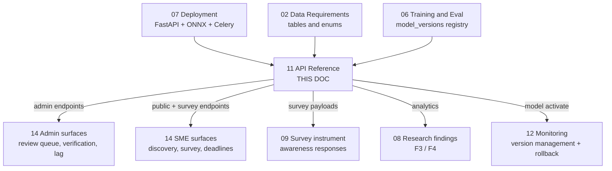

# 11 — Module 1: API Reference

> **Cross-references:** [02_M1_Data_Requirements.md](02_M1_Data_Requirements.md) · [06_M1_Training_Evaluation.md](06_M1_Training_Evaluation.md) · [07_M1_Deployment_Integration.md](07_M1_Deployment_Integration.md) · [08_M1_Full_System_Architecture.md](08_M1_Full_System_Architecture.md) · [12_M1_Monitoring_Maintenance.md](12_M1_Monitoring_Maintenance.md) · [14_M1_Tracking_Workflows.md](14_M1_Tracking_Workflows.md)
> **Code map:** [13_M1_Folder_Structure_and_Implementation_Flow.md](13_M1_Folder_Structure_and_Implementation_Flow.md) — `backend/app/api/v1/m1_regulations.py` · `services/m1_regulation_service.py` · `schemas/m1.py` · `dependencies.py` · `middleware/request_id.py`
> **Consolidation note (2026-07-29):** this document now carries the full content previously split across `11_M1_1_API_Authentication_Authorization` and `11_M1_2_API_Integration_Examples`. Those two files have been retired. The JWT contract, refresh flow, and request-id propagation are folded into §1; every cURL, Python, and troubleshooting example is attached to the endpoint it exercises rather than parked in a trailing appendix, so an integrator reads the contract and the call together.

---

## 0. Where This Document Sits in the Pipeline

This document is the **interface layer**. It sits directly on top of the runtime that [07_M1_Deployment_Integration.md](07_M1_Deployment_Integration.md) builds — the FastAPI app, the ONNX inference worker, the Redis cache, the Celery queue — and exposes it as a contract. Everything below the API is machinery; everything above it is a human surface. The endpoint list in §3–§12 is precisely what the nine tracking surfaces in [14_M1_Tracking_Workflows.md](14_M1_Tracking_Workflows.md) call: the admin review queue is `GET /regulations?needs_review=true`, expert verification is `POST /regulations/{id}/verify`, SME regulation discovery is `GET /regulations/public`, and the SME awareness survey is `POST /survey-responses`.

| | Stage | Produced by | What this document does with it | Handed to |
|---|---|---|---|---|
| **In** | Running FastAPI app + ONNX inference session | [07_M1_Deployment_Integration.md](07_M1_Deployment_Integration.md) §3 — ONNX Runtime session, Redis cache layer | Wraps it as `POST /regulations/{id}/classify` and the backfill batch endpoint | — |
| **In** | Celery classification task | [07_M1_Deployment_Integration.md](07_M1_Deployment_Integration.md) §4.1 | Exposes the enqueue path and the task-status response shape | — |
| **In** | Table + view definitions | [02_M1_Data_Requirements.md](02_M1_Data_Requirements.md) — `m1_regulations`, `m1_propagation_events`, `m1_sme_awareness_responses`, `v_m1_channel_effectiveness` | Projects them through Pydantic response schemas; enum values must match the CHECK constraints exactly | — |
| **In** | `model_versions` registry rows | [06_M1_Training_Evaluation.md](06_M1_Training_Evaluation.md) §9 model versioning schema | Exposes list + activate as an operator-facing surface | — |
| **Step** | Authentication and role enforcement | *this document* §1 | JWT verification, scope check, revocation check, uniform error envelope | — |
| **Step** | Endpoint contract | *this document* §3–§12 | Request schema, response schema, status codes, per-endpoint examples | — |
| **Out** | Admin endpoints | — | — | [14_M1_Tracking_Workflows.md](14_M1_Tracking_Workflows.md) — pipeline state, review queue, expert verification, lag analytics surfaces |
| **Out** | SME endpoints | — | — | [14_M1_Tracking_Workflows.md](14_M1_Tracking_Workflows.md) — regulation discovery, awareness survey, compliance tracking, deadline alerts |
| **Out** | `POST /survey-responses` payloads | — | — | [09_M1_Annotation_Guidelines.md](09_M1_Annotation_Guidelines.md) §9 survey instrument; `m1_sme_awareness_responses` |
| **Out** | Analytics endpoints | — | — | [08_M1_Full_System_Architecture.md](08_M1_Full_System_Architecture.md) §10 research findings F3/F4 |
| **Out** | Model activate endpoint | — | — | [12_M1_Monitoring_Maintenance.md](12_M1_Monitoring_Maintenance.md) §7.2 model version management, rollback |



**Why the ordering matters.** The API cannot be specified before [02_M1_Data_Requirements.md](02_M1_Data_Requirements.md) freezes the enums, because every `change_category` and sector string in a request body is validated against a database CHECK constraint. A value the API accepts but the database rejects surfaces as a 500 at write time rather than a 400 at validation time — the error appears in the wrong layer and the client cannot act on it. The dependency runs the other way toward [14_M1_Tracking_Workflows.md](14_M1_Tracking_Workflows.md): the surfaces there are built against this contract, so a breaking change here is a front-end change there. That is the reason the error envelope in §1.6 is specified once for the whole surface rather than per endpoint — nine consumers decoding nine error shapes is nine places to update.

A subtler ordering constraint runs to [12_M1_Monitoring_Maintenance.md](12_M1_Monitoring_Maintenance.md). Rollback there is executed *through* `POST /models/{id}/activate`, so that endpoint has to exist and be admin-gated before any automated rollback path can be built. An endpoint that promotes a model version is the single most dangerous verb on this surface, which is why it is the only one besides hard operations that requires `role=admin` outright rather than admin-or-expert.

---

## Abstract

This document provides the complete API reference for all Module 1 endpoints exposed by the Enigmatrix FastAPI backend. All endpoints are prefixed `/api/v1/m1/` and defined in `backend/app/api/v1/m1_regulations.py`, with business logic in `backend/app/services/m1_regulation_service.py`. Endpoints are grouped into: Regulation CRUD, Classification & Verification, Sector Management, Propagation Events, SME Survey, Public endpoints (no auth), Analytics, Backfill, and Model Version Management. Request/response schemas follow the Pydantic models defined in `backend/app/schemas/m1.py`.

Authentication uses JWT Bearer tokens with a role-plus-scope model: four roles (`admin`, `expert`, `sme`, anonymous) crossed with endpoint-group scopes, 60-minute access tokens, and rotating refresh tokens. Every endpoint below carries its own copy-pasteable cURL and, where the call is non-trivial, a Python `httpx` equivalent.

**Implementation status:** 🟡 Partial. Authentication is shipped — JWT verification and role checks run through FastAPI dependencies, and endpoint coverage matches the admin-CRUD slice. The full role matrix, the Stage-D/E/F endpoints, and the integration test suite land with BUILD_07. Examples against shipped endpoints are verified in CI against staging; the rest are forward-looking. See §15 for the artefact-level status map.

---

## 1. Authentication and Authorization

**Why auth is specified before any endpoint.** Every non-public endpoint below is a two-part contract — what it does, and who may make it do that — and the second part is not expressible per endpoint without repeating the same four roles fifteen times. Specifying the model once means each endpoint section carries a single `Auth:` line, and it means the CI test in §14 can iterate the matrix mechanically rather than reading prose.

All admin endpoints require a JWT Bearer token in the `Authorization` header:

```
Authorization: Bearer <access_token>
```

| Role | Permissions |
|---|---|
| `admin` | Full access to all endpoints |
| `expert` | Read + verify/unverify regulations |
| `sme` | Read public list + submit surveys |
| (none) | Public endpoints only |

### 1.1 JWT Payload Contract

```json
{
  "sub": "user_alpha",
  "role": "admin",
  "scope": ["m1:read", "m1:write", "m1:admin"],
  "iat": 1715680800,
  "exp": 1715684400,
  "jti": "tok_01J2Z3K4P5Q6R7S8T9V0W1X2Y3"
}
```

- `sub` — user UUID.
- `role` — one of `admin | expert | sme | (none — public token)`.
- `scope` — explicit endpoint groups; allows revoking write access without changing the role.
- `iat` / `exp` — issued-at / expiry; access tokens valid 60 minutes.
- `jti` — JWT ID; allows revocation by token-ID (logout, security incident).

**Why both `role` and `scope` when either alone would work.** Role alone forces a new role for every permission variation — a read-only admin, an expert who may verify but not re-classify — and role proliferation is how permission models become unauditable. Scope alone loses the coarse grouping that makes the matrix in §1.3 readable at a glance. Carrying both gives roughly 100 effective permissions out of four roles, and lets an incident response revoke write access from a compromised account by reissuing with a narrowed scope rather than by demoting the role and breaking the user's read workflows.

**Why `jti` exists on a stateless token.** JWT's whole selling point is that verification needs no server round-trip — which also means a stolen token is valid until it expires and there is nothing to revoke. `jti` buys back exactly one capability: a Redis blacklist checked on each request, holding revoked token IDs until their natural expiry. The blacklist stays small because entries self-expire, so the cost of the round-trip is bounded and the stateless property is preserved for the common case.

### 1.2 Token Lifecycle

```
[Login] POST /api/v1/auth/login (email + password)
   → Response: {access_token (60 min), refresh_token (30 days)}

[Use access] GET /api/v1/m1/regulations
   → 200 OK if token valid + scope matches

[Token expired] GET /api/v1/m1/regulations
   → 401 {code: "TOKEN_EXPIRED"}

[Refresh] POST /api/v1/auth/refresh (refresh_token in body)
   → Response: {access_token (new 60 min), refresh_token (rotated)}

[Logout] POST /api/v1/auth/logout
   → Server adds the access token's `jti` to a Redis blacklist (until exp);
     refresh token deleted from `user_refresh_tokens` table
```

**Example — login and first authenticated call:**

```bash
# Login (development environment)
curl -X POST https://api.enigmatrix.lk/api/v1/auth/login \
  -H "Content-Type: application/json" \
  -d '{"email":"admin@enigmatrix.lk","password":"<dev-password>"}'
# → {"access_token":"eyJ...","refresh_token":"ref_...","expires_in":3600}

# Use the access token
export ACCESS_TOKEN="eyJ..."

curl -X GET https://api.enigmatrix.lk/api/v1/m1/regulations \
  -H "Authorization: Bearer $ACCESS_TOKEN"
```

**Worked example — the full login-to-expiry-to-refresh cycle:**

```
[POST /api/v1/auth/login]
  body: {email: "admin@enigmatrix.lk", password: "..."}
  response 200: {access_token: "eyJhbGc...", refresh_token: "ref_...", expires_in: 3600}

[GET /api/v1/m1/regulations]
  header: Authorization: Bearer eyJhbGc...
  header: X-Request-ID: req_01J3K4P5
  middleware logs: 'request_id=req_01J3K4P5 user_id=admin@enigmatrix.lk role=admin'
  Pydantic validates query params (page, page_size, etc.)
  service returns paginated list
  response 200: [paginated regulations]
  response header: X-Request-ID: req_01J3K4P5

[Hour later — token expired]
GET /api/v1/m1/regulations
  Response 401: {code: "TOKEN_EXPIRED", request_id: req_01J3M..., ...}

[POST /api/v1/auth/refresh]
  body: {refresh_token: "ref_..."}
  response 200: {access_token: "eyJhbGc...new", refresh_token: "ref_new", expires_in: 3600}
```

**Why refresh tokens rotate.** A refresh token lives 30 days, which is a long window for a stolen credential. Rotation — issuing a new refresh token on every use and invalidating the old one — turns theft into a detectable event: when the legitimate user next refreshes, their token has already been consumed by the attacker, the server rejects it, and the user is forced to re-authenticate. The theft is not prevented, but it becomes loud instead of silent. The cost is the concurrent-refresh edge case in §13.

### 1.3 Role-Permission Matrix

The full matrix by endpoint group, with the role-specific HTTP responses. `R` = read, `W` = write, `A` = admin-only operations (verify, override, hard delete), `403` = forbidden:

| Endpoint group | `admin` | `expert` | `sme` | (anon) |
|---|---|---|---|---|
| `GET /regulations` (admin list) | R | R | `403` | `401` |
| `POST /regulations` (manual create) | W | `403` | `403` | `401` |
| `PATCH /regulations/{id}` | W | `403` | `403` | `401` |
| `DELETE /regulations/{id}` (soft delete `is_active=false`) | A | `403` | `403` | `401` |
| `POST /regulations/{id}/classify` (re-classify) | W | `403` | `403` | `401` |
| `POST /regulations/{id}/verify` | A | A | `403` | `401` |
| `GET /regulations/{id}/sectors` | R | R | R (via public path) | `401` |
| `PUT /regulations/{id}/sectors` (override) | W | `403` | `403` | `401` |
| `GET /propagation-events` | R | R | `403` | `401` |
| `POST /propagation-events` (manual) | W | `403` | `403` | `401` |
| `POST /survey-responses` (SME submits answer) | W | `403` | W | `401` |
| `GET /regulations/public` (sector-filtered list) | R | R | R | R |
| `GET /analytics/lag` | R | R | `403` | `401` |
| `GET /analytics/channel-effectiveness` | R | R | `403` | `401` |
| `POST /regulations/backfill` | A | `403` | `403` | `401` |
| `GET /models`, `POST /models/{id}/activate` | A | `403` | `403` | `401` |
| `GET /admin/audit-logs/m1` | A | `403` | `403` | `401` |

**401 versus 403 is a deliberate distinction, not a detail.** `(none)` — no token at all — yields `401 Unauthorized`; an authenticated user *with the wrong role* yields `403 Forbidden`. The two are enforced by separate FastAPI dependencies (`require_auth` for any valid token vs `require_role('admin')` for elevation), and the reason to keep them apart is client behaviour: a 401 means "get a token or refresh yours" and the client should retry after refreshing, while a 403 means "you will never be allowed to do this" and retrying is pointless. Collapsing both to 403 would send clients into refresh loops on permission errors. Public endpoints accept missing tokens entirely.

### 1.4 Role Enforcement in Code

```python
# backend/app/api/v1/m1_regulations.py
from app.dependencies import require_role

@router.post("/regulations/{id}/verify", dependencies=[Depends(require_role("admin", "expert"))])
async def verify_regulation(id: UUID, ...): ...

@router.delete("/regulations/{id}", dependencies=[Depends(require_role("admin"))])
async def deactivate_regulation(id: UUID, ...): ...
```

`require_role` is a FastAPI dependency that, in order:

1. Parses the JWT.
2. Checks the JWT signature and `exp`.
3. Checks `jti` is not in the revocation blacklist.
4. Checks `role` is in the allowed list.
5. Checks `scope` covers the endpoint.

**The order of those five checks is the security-relevant part.** Signature verification precedes every claim inspection, because an unverified token's `role` field is attacker-controlled input. The blacklist check precedes the role check so that a revoked admin token fails as revoked rather than passing a role check it should no longer be trusted for. Scope is checked last because it is the narrowest test and the most likely to change.

Declaring the dependency at the decorator rather than inside the handler means the check cannot be forgotten in a new endpoint's body — an endpoint written without a `dependencies=[...]` clause is visibly unprotected in review, whereas a missing in-body check looks like normal code.

### 1.5 Permission-Failure Worked Example

An `sme`-token user attempts an admin endpoint:

```
POST /api/v1/m1/regulations/{id}/verify
Authorization: Bearer <sme_token>

Response: 403 Forbidden
{
  "error": {
    "code": "FORBIDDEN",
    "message": "Role 'sme' lacks required scope 'm1:admin' for this endpoint",
    "request_id": "req_01J3...",
    "timestamp": "2026-05-14T03:17:42Z",
    "details": {
      "required_role": ["admin", "expert"],
      "required_scope": "m1:admin",
      "actual_role": "sme"
    }
  }
}
```

Note what `details` gives the client that the status code alone does not: the *required* role and scope, not just the fact of refusal. A front-end can use this to hide the control rather than let the user click it again, which is the difference between a permission model and a permission wall.

### 1.6 Standard Error Response Schema

All M1 endpoints emit a uniform error body so client code can decode failures consistently. The `request_id` lets the support team correlate a client-visible error to the backend log line:

```json
{
  "error": {
    "code": "REGULATION_NOT_FOUND",
    "message": "No regulation found with id 3fa85f64-5717-4562-b3fc-2c963f66afa6",
    "request_id": "req_01J2Z3K4P5Q6R7S8T9V0W1X2Y3",
    "timestamp": "2026-05-14T03:17:42Z",
    "details": {
      "regulation_id": "3fa85f64-5717-4562-b3fc-2c963f66afa6"
    }
  }
}
```

Top-level error codes used across the M1 surface:

| HTTP status | `code` | When emitted |
|---|---|---|
| 400 | `INVALID_REQUEST` (alias in earlier drafts: `VALIDATION_ERROR`) | Body fails Pydantic validation (e.g. missing required field), or invalid query params |
| 401 | `UNAUTHORIZED` / `TOKEN_EXPIRED` / `INVALID_TOKEN` | Missing, expired, or signature-invalid JWT |
| 403 | `FORBIDDEN` | Valid JWT but role or scope lacks the permission |
| 404 | `REGULATION_NOT_FOUND` / `EVENT_NOT_FOUND` / `SOURCE_NOT_FOUND` (generic alias: `NOT_FOUND`) | Referenced resource absent |
| 409 | `DUPLICATE_GAZETTE` / `DUPLICATE_PROPAGATION` | Unique constraint violation — e.g. `gazette_number` already exists, or the model version is already the active production model |
| 422 | `VALIDATION_FAILED` (alias in earlier drafts: `UNPROCESSABLE_ENTITY`) | Server-side semantic check — e.g. verifying an already-verified regulation, or a survey submission with no `consent_acknowledged_at` |
| 429 | `RATE_LIMITED` | Per-IP or per-token rate cap exceeded |
| 500 | `INTERNAL_ERROR` | Unhandled exception; backend stack trace logged separately |
| 503 | `SERVICE_UNAVAILABLE` | Downstream dependency (Postgres, Redis, ONNX Runtime) failed health check |

> **Defect noted at consolidation (2026-07-29).** The pre-merge documents carried two error contracts: the envelope above, and a shorter FastAPI-default `{"detail": {"code": ..., "message": ...}}` shape with the alias code names listed in the table. The envelope above is canonical because it is the only one carrying `request_id`, without which §1.7's support flow does not work. The aliases are recorded here so that a client written against the older table can be identified and migrated; they are not two valid contracts.

**Why a uniform envelope at all.** With nine consumer surfaces in [14_M1_Tracking_Workflows.md](14_M1_Tracking_Workflows.md), per-endpoint error shapes would mean each surface writing its own decoder and each new endpoint being a potential new shape. The envelope is the thing that lets a single client-side error handler serve the whole API, and `details` is the escape hatch that keeps the envelope uniform while still carrying endpoint-specific context.

### 1.7 Request-ID Propagation

Every request gets a `request_id` from middleware:

```python
# backend/app/middleware/request_id.py
@app.middleware("http")
async def add_request_id(request, call_next):
    request_id = request.headers.get("X-Request-ID") or f"req_{ulid.new()}"
    request.state.request_id = request_id
    response = await call_next(request)
    response.headers["X-Request-ID"] = request_id
    return response
```

The same `request_id` flows into:

- Every backend log line (`logger.bind(request_id=request.state.request_id)`).
- Every audit-log row (`audit_log.request_id`).
- Every error response body (`error.request_id`).
- Every Celery task spawned (`X-Request-ID` header propagated to the broker).

**What this buys, concretely.** When an SME reports "the site said something went wrong", support has one string to search on. Without it the alternative is reconstructing the request from a timestamp and an endpoint name, which fails exactly when it matters most — under load, when many identical requests share a minute. Propagating the ID into Celery is the part that is easy to skip and expensive to add later: classification runs asynchronously, so the log line explaining *why* a regulation was mis-classified is written minutes after the HTTP response, in a different process, and only the propagated ID links them.

ULID rather than UUID for the identifier, because ULIDs sort lexicographically by creation time — a log grep for a request ID prefix returns a time-ordered window for free.

### 1.8 Regulation Short-Code Exposure

`regulation_short_code` (e.g. `REG-TAX-2024-001`) is **not** a secret. It appears in alert emails (so SMEs can reference it in support conversations), is the canonical URL fragment for the public SME-facing detail page (`/portal/regulations/REG-TAX-2024-001`), and is logged in audit events. Treat it like a public ticket number.

By contrast, the internal UUID (`m1_regulations.id`) is *also* not a secret but is harder for humans to quote — short codes exist for that user-experience reason, not for access control. Stating this explicitly matters because a reader encountering two identifiers on the same resource will otherwise assume one of them is the private one and build access logic on that assumption. Neither is; access control is entirely in §1.3.

### 1.9 Authentication Technology Choices

| Choice | Trade-off | Decision | Revisit when |
|---|---|---|---|
| JWT | Stateless verification, scales horizontally; revocation needs a side-channel | ✅ Industry standard for SPA + API | Logout latency becomes a problem — switch to opaque tokens with a Redis backend |
| 60-minute access token | Short enough to limit the theft window; long enough to avoid refresh churn | ✅ | Users complain about constant refreshes — raise to 4 h |
| Refresh-token rotation | Detects theft at the cost of the concurrent-refresh edge case (§13) | ✅ Each refresh issues a new token; the old one is invalidated | Adding `refresh_token_family` tracking would allow retrospective theft detection |
| Role + scope together | Fine-grained without proliferating roles | ✅ 4 roles × scope ≈ 100 effective permissions without 100 roles | The matrix exceeds ~200 entries — adopt an RBAC library |
| ULID for `request_id` | Sortable and URL-safe, unlike UUIDv4 | ✅ Better than UUID for log correlation | Never |

---

## 2. Client Conventions

**Why these are stated once rather than per endpoint.** Pagination, retry behaviour, and rate limits are properties of the surface, not of individual routes. An integrator who reads them here does not need to rediscover them fifteen times, and an endpoint section that repeated them would bury its actual contract.

| Convention | Detail |
|---|---|
| **Base URL** | `https://api.enigmatrix.lk` — all M1 routes under `/api/v1/m1/` |
| **Auth header** | `Authorization: Bearer <access_token>` on every non-public endpoint |
| **Pagination** | `page` (1-based) and `page_size` (default 20, max 100); responses carry `total`, `page`, `page_size`, and where applicable `pages` |
| **Rate limits** | 60 req/min/IP unauthenticated; 600 req/min/user authenticated. Exceeding either returns `429 RATE_LIMITED` with a `Retry-After` header |
| **Retries** | Retry idempotent `GET`s with exponential backoff. Do **not** auto-retry `POST` without an idempotency key |
| **Idempotency** | ⚠️ Not yet server-enforced. Clients are asked to send an `Idempotency-Key` header on POSTs; server-side checking lands with BUILD_07 |
| **Request ID** | Send `X-Request-ID` to correlate your own traces with backend logs, or read the one the server generates from the response header |

**Recommended Python client: `httpx.AsyncClient`.** The backend is async end to end, and the integration examples below assume an async client so that a dashboard fetching several endpoints can do so concurrently. `requests` works fine for sync-only integrations; nothing in the API depends on the client library.

**Why pagination is offset-based despite its known weakness.** `page`/`page_size` matches the Session-14 admin endpoints, so the admin front-end uses one pagination component across both surfaces. The weakness is real — paging through a list that is being written to can duplicate or skip rows (§13) — and the fix is cursor pagination, which is deferred rather than rejected. The trade decided on consistency with the existing surface, because M1's lists are small enough (hundreds to low thousands) that the failure is rare in practice.

---

## 3. Regulation CRUD

### `GET /api/v1/m1/regulations`

List all regulations with filtering and pagination. This is the endpoint behind the admin pipeline-state and review-queue surfaces in [14_M1_Tracking_Workflows.md](14_M1_Tracking_Workflows.md).

**Auth:** Admin JWT

**Query Parameters:**

| Parameter | Type | Default | Description |
|---|---|---|---|
| `page` | int | 1 | Page number |
| `page_size` | int | 20 | Items per page (max 100) |
| `change_category` | str | — | Filter by category code (e.g. `TAX_RATE_CHANGE`) |
| `sector` | str | — | Filter by sector code (e.g. `grocery_retail`) |
| `status` | str | — | Filter by pipeline status |
| `needs_review` | bool | — | If true, return only needs_review=true |
| `is_verified` | bool | — | Filter by verification status |
| `primary_language` | str | — | `en`/`si`/`ta`/`mixed` |
| `gazette_date_from` | date | — | ISO date, inclusive |
| `gazette_date_to` | date | — | ISO date, inclusive |
| `search` | str | — | Full-text search on title_en, summary_en |

**Response `200 OK`:**

```json
{
  "items": [
    {
      "id": "3fa85f64-5717-4562-b3fc-2c963f66afa6",
      "regulation_short_code": "REG-TAX-2024-001",
      "gazette_number": "2486/22",
      "gazette_date": "2024-09-15",
      "gazette_type": "extraordinary",
      "title_en": "Income Tax (Amendment) Act No. 8 of 2024",
      "change_category": "TAX_RATE_CHANGE",
      "confidence": 0.947,
      "affected_sectors": ["grocery_retail", "food_service", "general_retail"],
      "is_sme_relevant": true,
      "needs_review": false,
      "is_verified": true,
      "status": "alerted",
      "primary_language": "en"
    }
  ],
  "total": 847,
  "page": 1,
  "page_size": 20,
  "pages": 43
}
```

**Why `needs_review` is a first-class filter rather than a `search` term.** It is the query the admin review queue runs on every page load, and it maps to an indexed boolean column. Expressing it through free-text search would turn the most frequent admin query into a sequential scan. The same argument applies to `change_category` and `status`: these three are the filters the tracking surfaces actually use, and they exist as parameters because they exist as indexes.

**Examples:**

```bash
# List regulations needing review — the admin review-queue query
curl -H "Authorization: Bearer $ACCESS_TOKEN" \
  "https://api.enigmatrix.lk/api/v1/m1/regulations?needs_review=true&page_size=10"

# Filter by category, paginated
curl -X GET "https://api.enigmatrix.lk/api/v1/m1/regulations?change_category=TAX_RATE_CHANGE&page=1&page_size=20" \
  -H "Authorization: Bearer $ACCESS_TOKEN"
```

```python
import httpx
import asyncio


async def list_regulations(token: str, category: str = "TAX_RATE_CHANGE"):
    async with httpx.AsyncClient(base_url="https://api.enigmatrix.lk", timeout=10.0) as client:
        r = await client.get(
            "/api/v1/m1/regulations",
            headers={"Authorization": f"Bearer {token}"},
            params={"change_category": category, "page": 1, "page_size": 20},
        )
        r.raise_for_status()
        return r.json()

asyncio.run(list_regulations(ACCESS_TOKEN))
```

---

### `POST /api/v1/m1/regulations`

Create a regulation record manually (pre-classifier phase or manual entry).

**Auth:** Admin JWT

**Request Body:**

```json
{
  "gazette_number": "2501/14",
  "gazette_date": "2024-11-01",
  "gazette_type": "extraordinary",
  "source_url": "https://gazette.lk/gazette/2501/14",
  "title_en": "Customs (Amendment) Regulations 2024",
  "change_category": "IMPORT_EXPORT",
  "affected_sectors": ["grocery_retail", "general_retail"],
  "is_sme_relevant": true,
  "penalty_range_lkr": "LKR 50,000 – 500,000",
  "effective_date": "2024-12-01",
  "real_world_example_en": "A textile importer bringing in cotton fabric will now require a new Category B import licence."
}
```

**Response `201 Created`:** Full `RegulationOut` schema (same as the GET item shape).

**Why a manual-create endpoint exists on an automated pipeline.** Two reasons, both operational. Before the classifier ships, the admin surfaces need real rows to render against — this endpoint is how the demo corpus is seeded. After it ships, gazettes that the scraper misses (an out-of-band circular, a print-only extraordinary) still need to reach SMEs, and the alternative to a manual create is a direct database write with no audit trail. `change_category` and `affected_sectors` are accepted here precisely because there is no classifier run to supply them.

**Example:**

```bash
curl -X POST https://api.enigmatrix.lk/api/v1/m1/regulations \
  -H "Authorization: Bearer $ACCESS_TOKEN" \
  -H "Content-Type: application/json" \
  -d '{
    "gazette_number":"2491/15",
    "gazette_date":"2026-05-14",
    "title_en":"Sample Regulation",
    "change_category":"PRODUCT_STANDARD",
    "affected_sectors":["general_retail"],
    "primary_language":"en"
  }'
```

A duplicate `gazette_number` returns `409 DUPLICATE_GAZETTE` rather than silently creating a second row — the uniqueness constraint lives in `m1_regulations` ([02_M1_Data_Requirements.md](02_M1_Data_Requirements.md)), and the API surfaces it as a distinct code so the client can offer "open the existing record" instead of "try again".

---

### `GET /api/v1/m1/regulations/{id}`

Get a single regulation by UUID.

**Auth:** Admin JWT

**Response `200 OK`:** Full `RegulationDetailOut` including all text fields:

```json
{
  "id": "3fa85f64-5717-4562-b3fc-2c963f66afa6",
  "regulation_short_code": "REG-TAX-2024-001",
  "gazette_number": "2486/22",
  "gazette_date": "2024-09-15",
  "gazette_type": "extraordinary",
  "title_en": "Income Tax (Amendment) Act No. 8 of 2024",
  "title_si": "ආදායම් බදු (සංශෝධන) පනත",
  "title_ta": "வருமான வரி (திருத்தம்) சட்டம்",
  "summary_en": "Increases the corporate income tax rate from 24% to 30% for financial institutions. Effective 1 January 2025.",
  "summary_si": "මූල්‍ය ආයතන සඳහා ආදායම් බදු අනුපාතය...",
  "summary_ta": "நிதி நிறுவனங்களுக்கான வருமான வரி விகிதம்...",
  "change_category": "TAX_RATE_CHANGE",
  "category_baseline": "TAX_RATE_CHANGE",
  "confidence": 0.947,
  "domain_code": "TAX",
  "severity_level": "high",
  "is_sme_relevant": true,
  "affected_sectors": ["grocery_retail", "food_service", "general_retail"],
  "penalty_range_lkr": null,
  "principal_act_amended": "Inland Revenue Act No. 24 of 2017",
  "effective_date": "2025-01-01",
  "real_world_example_en": "A general-goods retailer with annual revenue over LKR 500M will see their tax liability increase by ~6%.",
  "needs_review": false,
  "is_verified": true,
  "expert_verified_by": "Nalaka Perera, CA Sri Lanka",
  "expert_verified_at": "2024-09-17T09:30:00Z",
  "status": "alerted",
  "raw_pdf_path": "./storage/m1/raw/2486_22.pdf",
  "created_at": "2024-09-15T06:12:00Z",
  "updated_at": "2024-09-17T09:30:00Z"
}
```

**Why the detail shape differs from the list shape.** The list omits the trilingual title and summary fields, `raw_pdf_path`, and the verification metadata. On a 20-item page that is roughly a 5× payload difference, most of it text the list view never renders. The split also means the expensive fields — the translated summaries produced by the summariser in [10_M1_Sinhala_Tamil_NLP.md](10_M1_Sinhala_Tamil_NLP.md) §6 — are fetched only when a human actually opens the record.

`category_baseline` alongside `change_category` is the audit pair: the former is what the model said, the latter is what the record now claims after any admin override in the PATCH endpoint below. Keeping both is what makes the override rate measurable in [12_M1_Monitoring_Maintenance.md](12_M1_Monitoring_Maintenance.md).

**Example:**

```bash
curl -X GET https://api.enigmatrix.lk/api/v1/m1/regulations/3fa85f64-5717-4562-b3fc-2c963f66afa6 \
  -H "Authorization: Bearer $ACCESS_TOKEN"
```

---

### `PATCH /api/v1/m1/regulations/{id}`

Partial update of a regulation (admin override). All fields optional.

**Auth:** Admin JWT

**Request Body (partial):**

```json
{
  "change_category": "SECTOR_SPECIFIC",
  "affected_sectors": [],
  "is_sme_relevant": false,
  "is_active": true
}
```

**Response `200 OK`:** Updated `RegulationOut`.

**Why PATCH and not PUT here, when sectors use PUT.** The two endpoints answer different questions. A regulation record has ~25 fields, most of which an override never touches, so requiring a client to resend the whole object invites lost-update bugs where a stale field overwrites a concurrent change. Sector assignment is a set, and a set update is genuinely a replacement — see §5 for why that one is PUT.

The example above is the shape of the most common override: reclassifying a document and simultaneously marking it not SME-relevant with an empty sector set, which is the `is_sme_relevant = FALSE` path from [09_M1_Annotation_Guidelines.md](09_M1_Annotation_Guidelines.md) §2.9 applied by hand.

---

### `DELETE /api/v1/m1/regulations/{id}`

Soft-delete a regulation (`is_active = false`).

**Auth:** Admin JWT

**Response `204 No Content`**

**Why soft delete.** A regulation that has been alerted on already exists in SMEs' inboxes and in `m1_propagation_events`; hard-deleting the row would orphan those references and silently remove observations from the lag analysis in §9. `is_active = false` removes it from every list surface while preserving referential integrity and the research record. There is no hard-delete endpoint on this surface at all.

---

## 4. Classification and Verification

> [!warning] Contract change 2026-08-01 — **`confidence` is nullable, and every example below is written for the ONNX path.**
> The default backend is now `linearsvc` (`M1_CLASSIFIER_BACKEND`), serving the frozen TF-IDF + LinearSVC pipeline. On that path a classification response carries:
>
> ```json
> {
>   "confidence": null,
>   "confidence_type": "not_available_uncalibrated_linearsvc",
>   "decision_score": 1.84,
>   "decision_margin": 0.97,
>   "second_category": "TAX_RATE_CHANGE",
>   "class_scores": { "…": "…" },
>   "sectors": []
> }
> ```
>
> **Three rules for any client.** Treat `confidence` as nullable — a numeric literal like `0.947` in the samples below is an ONNX-path illustration, not the current default. **Never render `decision_margin` as a percentage**: it is a signed distance from a decision hyperplane, not a probability, and 0.5 does not mean "50% sure". Expect `sectors: []` — the frozen model is category-only; sector prediction remains with the ONNX dual-head engine.
>
> Margins may legitimately drive ranking and review-queue priority. A calibrated probability requires a separately trained and evaluated calibration layer — do not transform margins. Full contract: [[11_CLASSIFIER_FREEZE_AND_INTEGRATION]] §7 · lineage: [[18_M1_Dataset_And_Model_Lineage]] §4.

> [!note] Planned third shape — the V7 multitask backend (`m1_xlmr_v7_multitask`), not yet built.
> When promoted, a classification response gains `sectors`, `sector_probs`, `is_sme_relevant`, `relevance_probability`, `sector_thresholds`, `model_type` and `model_version`, and `category_confidence` becomes a **calibrated softmax probability**:
>
> ```json
> {
>   "category": "IMPORT_EXPORT",
>   "category_confidence": 0.9341,
>   "category_probs": { "TAX_RATE_CHANGE": 0.0112, "IMPORT_EXPORT": 0.9341, "...": "..." },
>   "sectors": ["general_retail", "grocery_retail"],
>   "sector_probs": { "grocery_retail": 0.7124, "food_service": 0.1831, "general_retail": 0.9437 },
>   "is_sme_relevant": true,
>   "relevance_probability": 0.9712,
>   "relevance_source": "derived_from_sector_predictions",
>   "sector_thresholds": { "grocery_retail": 0.48, "food_service": 0.46, "general_retail": 0.51 },
>   "model_type": "xlmr_lora_multitask",
>   "model_version": "m1_xlmr_v7_multitask"
> }
> ```
>
> **`is_sme_relevant` is a function of `sectors`, not an independent prediction.** `relevance_source: "derived_from_sector_predictions"` says so explicitly, and it is why `{"is_sme_relevant": false, "sectors": ["grocery_retail"]}` cannot occur. A client must not treat the two as separate evidence. `relevance_probability` comes from an auxiliary head whose only production role is flagging a row for review when it disagrees with the derivation.
>
> ⚠ **Three confidence semantics will coexist and are not interchangeable.** ONNX dual-head returns a calibrated probability; the frozen LinearSVC returns `null` plus an uncalibrated margin; V7 returns a calibrated softmax. Read `model_name` — persisted per row — before comparing any two confidence values, and never rank rows classified by different backends against each other. Design: [20_M1_Multitask_Classifier_Upgrade.md](20_M1_Multitask_Classifier_Upgrade.md) §7.2.

### `POST /api/v1/m1/regulations/{id}/classify`

Trigger on-demand reclassification of a specific regulation using the ONNX inference engine described in [07_M1_Deployment_Integration.md](07_M1_Deployment_Integration.md) §3.

**Auth:** Admin JWT

**Response `200 OK`:**

```json
{
  "regulation_id": "3fa85f64-5717-4562-b3fc-2c963f66afa6",
  "change_category": "TAX_RATE_CHANGE",
  "confidence": 0.947,
  "affected_sectors": ["grocery_retail", "food_service", "general_retail"],
  "sector_probabilities": {
    "grocery_retail": 0.821,
    "food_service": 0.763,
    "general_retail": 0.741
  },
  "needs_review": false,
  "classified_at": "2024-09-15T06:14:22Z"
}
```

> **Defect noted at consolidation (2026-07-29).** The integration examples documented this endpoint as returning `202 Accepted` with `{"task_id": "celery_task_uuid", "status": "queued"}` — the enqueued form, matching the Celery classification task in [07_M1_Deployment_Integration.md](07_M1_Deployment_Integration.md) §4.1 — while the reference above documents a synchronous `200` carrying the result. Both shapes are recorded here because both appear in the source material; the two need reconciling before BUILD_07 ships the endpoint. The synchronous shape is the one the admin re-classify button assumes, since it renders the new category immediately.

**Why an on-demand re-classify exists when classification is automatic.** Three triggers, all operational: a model version has just been promoted (§12) and a specific disputed regulation should be re-scored under it; an admin has corrected the extracted text and wants the classifier to see the fix; or a reviewer disagrees with a low-confidence label and wants to check whether it is stable. `sector_probabilities` is returned rather than just the thresholded set precisely for that third case — a 0.741 that crossed a 0.70 threshold is a different situation from a 0.95, and the reviewer needs to see which they are looking at.

**Example:**

```bash
curl -X POST https://api.enigmatrix.lk/api/v1/m1/regulations/3fa85f64-.../classify \
  -H "Authorization: Bearer $ACCESS_TOKEN"
```

---

### `POST /api/v1/m1/regulations/{id}/verify`

Mark a regulation as expert-verified. This is the endpoint behind the expert-verification surface in [14_M1_Tracking_Workflows.md](14_M1_Tracking_Workflows.md).

**Auth:** Admin JWT (role: `expert` or `admin`)

**Request Body:**

```json
{
  "verified": true,
  "verifier_name": "Nalaka Perera, CA Sri Lanka",
  "notes": "Category confirmed correct. Sector assignment reviewed — confirmed economy-wide (all 3 study sectors)."
}
```

**Response `200 OK`:**

```json
{
  "regulation_id": "3fa85f64-5717-4562-b3fc-2c963f66afa6",
  "is_verified": true,
  "expert_verified_by": "Nalaka Perera, CA Sri Lanka",
  "expert_verified_at": "2024-09-17T09:30:00Z"
}
```

**Why `expert` shares this endpoint with `admin` when it shares no other write path.** Verification is the one judgement on this surface that requires a professional qualification rather than an operational role — a Chartered Accountant or Attorney-at-Law, per [09_M1_Annotation_Guidelines.md](09_M1_Annotation_Guidelines.md) §5.1. Giving experts a narrow write scope for exactly this action is what lets them do their job without granting them the ability to delete records or promote models.

**Why `verifier_name` is a string in the body rather than derived from the token.** The verifying professional's name and credential go into alert emails and into the research record, and the display form ("Nalaka Perera, CA Sri Lanka") is not reconstructible from a user account. Re-verifying an already-verified regulation returns `422 VALIDATION_FAILED` rather than silently overwriting, so a duplicate click does not rewrite the verification timestamp.

**Example:**

```bash
curl -X POST -H "Authorization: Bearer $ACCESS_TOKEN" \
  -H "Content-Type: application/json" \
  -d '{"verified": true, "verifier_name": "Nalaka Perera, CA"}' \
  "https://api.enigmatrix.lk/api/v1/m1/regulations/3fa85f64-.../verify"
```

---

## 5. Sector Management

### `GET /api/v1/m1/regulations/{id}/sectors`

Get sector assignments for a regulation.

**Auth:** Admin JWT

**Response `200 OK`:**

```json
{
  "regulation_id": "3fa85f64-5717-4562-b3fc-2c963f66afa6",
  "sectors": ["grocery_retail", "food_service", "general_retail"]
}
```

---

### `PUT /api/v1/m1/regulations/{id}/sectors`

Replace sector assignments (full replacement, not append).

**Auth:** Admin JWT

**Request Body:**

```json
{
  "sectors": ["grocery_retail", "general_retail"]
}
```

**Response `200 OK`:** Updated sector list.

**Why replacement rather than append, and why that makes it PUT.** Sector assignment drives alert routing: an SME receives an alert if their sector is in this set. An append-only endpoint could never *remove* a wrongly-assigned sector, so an over-tagged regulation would keep alerting the wrong shops forever. Full replacement makes the set correctable, and a verb that replaces a resource wholesale is PUT by definition. The cost is that a client must send the complete intended set — sending `{"sectors": ["grocery_retail"]}` to add grocery to an existing pair silently drops the other two.

> **Defect noted at consolidation (2026-07-29).** The role matrix in §1.3 and the pre-merge integration examples both described this route as `PATCH /regulations/{id}/sectors`. The endpoint definition — full replacement — makes `PUT` the correct verb, and §1.3 has been corrected to match. Clients written against `PATCH` need updating.

**Example:**

```bash
curl -X PUT https://api.enigmatrix.lk/api/v1/m1/regulations/{id}/sectors \
  -H "Authorization: Bearer $ACCESS_TOKEN" \
  -H "Content-Type: application/json" \
  -d '{"sectors":["grocery_retail","food_service","general_retail"]}'
```

The set in this example is the economy-wide assignment — all three study sectors — which is the correct override for a VAT, EPF, labour-law, or business-registration change per [09_M1_Annotation_Guidelines.md](09_M1_Annotation_Guidelines.md) §4.

---

## 6. Propagation Events

### `GET /api/v1/m1/regulations/{id}/propagation`

Get all propagation events for a regulation across all channels. This is the per-regulation drill-down behind the admin lag-analytics surface.

**Auth:** Admin JWT

**Response `200 OK`:**

```json
{
  "regulation_id": "3fa85f64-5717-4562-b3fc-2c963f66afa6",
  "events": [
    {
      "channel": "gazette",
      "first_seen_at": "2024-09-15T00:30:00Z",
      "match_method": "exact_gazette_number",
      "match_confidence": 1.0,
      "is_confirmed": true,
      "source_url": "https://gazette.lk/gazette/2486/22"
    },
    {
      "channel": "portal_ird",
      "first_seen_at": "2024-09-16T14:20:00Z",
      "match_method": "exact_gazette_number",
      "match_confidence": 1.0,
      "is_confirmed": true,
      "source_url": "https://www.ird.gov.lk/en/pages/news.aspx"
    },
    {
      "channel": "news_daily_news",
      "first_seen_at": "2024-09-17T06:00:00Z",
      "match_method": "embedding_similarity",
      "match_confidence": 0.831,
      "is_confirmed": true,
      "source_url": "https://dailynews.lk/gazette-2486-22"
    },
    {
      "channel": "alert_delivery",
      "first_seen_at": "2024-09-15T06:30:00Z",
      "match_method": "human_confirmed",
      "match_confidence": 1.0,
      "is_confirmed": true,
      "source_url": null
    }
  ],
  "lag_summary": {
    "gazette_to_ird_days": 1.57,
    "gazette_to_news_days": 2.23,
    "gazette_to_alert_days": 0.25
  }
}
```

**Why `match_method` and `match_confidence` are exposed rather than hidden.** A propagation event asserts that a news article and a gazette are about the same regulation, and that assertion is sometimes made by an embedding-similarity match at 0.831 rather than by an exact gazette-number match at 1.0. The lag figures computed from these events feed research findings F3 and F4, so a reader must be able to see which observations rest on a fuzzy match. Serving a bare timestamp list would make a 0.83 similarity match indistinguishable from a certainty.

`lag_summary` is precomputed in the response rather than left to the client because every consumer computes the same three differences, and doing it server-side means the definition of "lag" lives in one place.

### `GET /api/v1/m1/propagation-events`

Collection-level listing of propagation events, filterable by regulation. Same event shape as above.

**Auth:** Admin JWT

**Example:**

```bash
curl -X GET "https://api.enigmatrix.lk/api/v1/m1/propagation-events?regulation_id=3fa85f64-..." \
  -H "Authorization: Bearer $ACCESS_TOKEN"
```

### `POST /api/v1/m1/propagation-events`

Manually record a propagation event — used when a channel appearance is observed out of band and the watchers did not catch it.

**Auth:** Admin JWT. A duplicate `(regulation_id, channel)` pair returns `409 DUPLICATE_PROPAGATION`; the uniqueness rule is what stops a manual entry from double-counting an event the watcher already recorded.

---

## 7. SME Survey

### `POST /api/v1/m1/survey-responses`

Submit an SME awareness survey response for a regulation. This is the write path for the survey instrument specified in [09_M1_Annotation_Guidelines.md](09_M1_Annotation_Guidelines.md) §9.

**Auth:** SME JWT

**Request Body:**

```json
{
  "regulation_id": "3fa85f64-5717-4562-b3fc-2c963f66afa6",
  "awareness_date": "2024-09-20",
  "awareness_source": "accountant",
  "action_taken": "yes_in_progress",
  "consent_acknowledged_at": "2026-05-20T09:14:00Z"
}
```

**Awareness source values:** `gazette_direct`, `accountant`, `association`, `social_media`, `news`, `peer`, `government_sms`, `other`

**Action taken values:** `yes_complied`, `yes_in_progress`, `no_not_aware_of_deadline`, `no_not_applicable`

**Response `201 Created`:**

```json
{
  "id": "7abc1234-0000-0000-0000-000000000001",
  "regulation_id": "3fa85f64-5717-4562-b3fc-2c963f66afa6",
  "awareness_date": "2024-09-20",
  "awareness_source": "accountant",
  "action_taken": "yes_in_progress",
  "response_date": "2024-10-01T10:15:00Z"
}
```

**Why `consent_acknowledged_at` is in the body and validated server-side.** The survey collects identifiable business data for research use, and consent is the legal basis for processing it. A submission without it is rejected with `422` rather than stored-and-flagged, because storing unconsented research data and cleaning it up later is not a recoverable position. The validation rules that reject impossible `awareness_date` values — a future date, or a date before the regulation was gazetted — are specified in [09_M1_Annotation_Guidelines.md](09_M1_Annotation_Guidelines.md) §9.8; they matter here because a negative lag silently poisons the F3 distribution rather than showing up as an outlier.

**Why this endpoint is writable by `admin` as well as `sme`.** Partner-channel responses arrive by other routes — a chamber-of-commerce collection, a phone interview — and need a path into the same table. The `admin` write permission in §1.3 is that path.

**Example:**

```bash
curl -X POST https://api.enigmatrix.lk/api/v1/m1/survey-responses \
  -H "Authorization: Bearer $SME_TOKEN" \
  -H "Content-Type: application/json" \
  -d '{
    "regulation_id":"3fa85f64-...",
    "awareness_date":"2026-05-12",
    "awareness_source":"news",
    "action_taken":"yes_in_progress",
    "consent_acknowledged_at":"2026-05-20T09:14:00Z"
  }'
```

---

## 8. Public Endpoint (No Auth)

### `GET /api/v1/m1/regulations/public`

SME-facing read-only list of classified, summarised, SME-relevant regulations. This backs the SME regulation-discovery surface in [14_M1_Tracking_Workflows.md](14_M1_Tracking_Workflows.md).

**Auth:** None

**Query Parameters:** `sector`, `page`, `page_size`, `language` (`en`/`si`/`ta`)

**Response `200 OK`:**

```json
{
  "items": [
    {
      "id": "3fa85f64-5717-4562-b3fc-2c963f66afa6",
      "regulation_short_code": "REG-TAX-2024-001",
      "gazette_date": "2024-09-15",
      "title_en": "Income Tax (Amendment) Act No. 8 of 2024",
      "summary_en": "Increases corporate income tax from 24% to 30%...",
      "change_category": "TAX_RATE_CHANGE",
      "affected_sectors": ["grocery_retail", "food_service", "general_retail"],
      "severity_level": "high",
      "effective_date": "2025-01-01",
      "real_world_example_en": "A general-goods retailer with annual revenue...",
      "source_url": "https://gazette.lk/gazette/2486/22"
    }
  ],
  "total": 412,
  "page": 1,
  "page_size": 20
}
```

**Why this is unauthenticated at all.** The awareness gap this module measures is partly a discoverability problem, and putting a login in front of the regulation list would reproduce the barrier the platform exists to remove. An SME who has heard about a rule should be able to look it up. The trade is that the endpoint is rate-limited more aggressively (60 req/min/IP versus 600 for authenticated users) and returns a strictly narrower projection.

**What the projection deliberately omits, and why.** No `confidence`, no `needs_review`, no `category_baseline`, no `is_verified`, no `raw_pdf_path`. These are pipeline-internal signals: exposing `confidence` on a public page invites SMEs to make compliance decisions weighted by a model's self-assessment, and exposing `needs_review` advertises which of our own labels we do not trust. The public list also shows only rows that are SME-relevant and past summarisation — the totals differ from the admin list (412 versus 847) for exactly that reason.

**Example:**

```bash
curl "https://api.enigmatrix.lk/api/v1/m1/regulations/public?sector=grocery_retail&language=en"

curl -X GET "https://api.enigmatrix.lk/api/v1/m1/regulations/public?sector=grocery_retail&page=1"
# → 200 OK (no auth header needed)
```

---

## 9. Lag Analytics

### `GET /api/v1/m1/analytics/lag`

Aggregated propagation lag statistics for research output (RQ3, RQ4). Serves the `v_m1_regulation_lag_summary` data.

**Auth:** Admin JWT

**Query Parameters:** `category`, `sector`, `date_from`, `date_to`

**Response `200 OK`:**

```json
{
  "total_regulations": 200,
  "channels": [
    {
      "channel": "gazette",
      "median_lag_days": 0.0,
      "mean_lag_days": 0.0,
      "p95_lag_days": 0.0,
      "count": 200
    },
    {
      "channel": "portal_ird",
      "median_lag_days": 1.8,
      "mean_lag_days": 3.2,
      "p95_lag_days": 14.0,
      "count": 142
    },
    {
      "channel": "news_daily_news",
      "median_lag_days": 2.1,
      "mean_lag_days": 4.7,
      "p95_lag_days": 21.0,
      "count": 178
    },
    {
      "channel": "alert_delivery",
      "median_lag_days": 0.25,
      "mean_lag_days": 0.31,
      "p95_lag_days": 0.5,
      "count": 200
    }
  ]
}
```

**Why median, mean, and p95 rather than one number.** The lag distribution is heavily right-skewed — most channels pick a regulation up within days, and a long tail never does. Reporting the mean alone would be dominated by the tail; the median alone would hide it. p95 is the figure that answers the operational question, which is not "how fast is a typical channel" but "how late is a bad case". `count` per channel matters because channels observe different subsets: `portal_ird` has 142 observations against `gazette`'s 200, so a comparison of their medians is over unequal samples.

**Example — fetch and aggregate for a research dashboard:**

```python
import httpx, asyncio, pandas as pd

API_BASE = "https://api.enigmatrix.lk"


async def fetch_all_lag_data(token: str) -> pd.DataFrame:
    async with httpx.AsyncClient(base_url=API_BASE, timeout=30.0) as client:
        r = await client.get(
            "/api/v1/m1/analytics/lag",
            headers={"Authorization": f"Bearer {token}"},
        )
        r.raise_for_status()
        data = r.json()["items"]
    return pd.DataFrame(data)

df = asyncio.run(fetch_all_lag_data(ACCESS_TOKEN))
print(df.groupby("change_category")["median_sme_lag_days"].median())
```

Output:

```
change_category
BUSINESS_REGISTRATION  14.5
EPF_ETF_CHANGE         42.0
SECTOR_SPECIFIC        55.0
LABOUR_LAW             38.0
TAX_RATE_CHANGE        31.0
...
```

> **Defect noted at consolidation (2026-07-29).** This script reads `r.json()["items"]` and groups on `change_category` / `median_sme_lag_days` — the per-regulation `v_m1_regulation_lag_summary` shape — while the response documented above is a `channels` array of per-channel aggregates. The endpoint evidently serves, or is intended to serve, both projections; the two must be reconciled into one documented response schema before the integration smoke test in §14 can pass against it.

```bash
curl -X GET https://api.enigmatrix.lk/api/v1/m1/analytics/lag \
  -H "Authorization: Bearer $ACCESS_TOKEN"
# → returns v_m1_regulation_lag_summary data
```

---

## 10. Channel Effectiveness Analytics

### `GET /api/v1/m1/analytics/channel-effectiveness`

Returns the `v_m1_channel_effectiveness` view data — a ranked table of secondary-source channels by median lag, used to produce Finding F4 (RQ4) in the research findings (see [08_M1_Full_System_Architecture.md](08_M1_Full_System_Architecture.md) §10).

**Auth:** Admin JWT

**Query Parameters:**

| Parameter | Type | Default | Description |
|---|---|---|---|
| `date_from` | ISO date | null | Filter propagation events on or after this date |
| `date_to` | ISO date | null | Filter propagation events on or before this date |
| `category` | string | null | Filter to one regulation category |
| `min_count` | integer | 10 | Exclude channels with fewer than N observations |

**Response `200 OK`:**

```json
{
  "generated_at": "2026-05-13T10:00:00Z",
  "channel_count": 6,
  "channels": [
    {
      "rank": 1,
      "channel": "alert_delivery",
      "median_lag_days": 0.01,
      "mean_lag_days": 0.01,
      "p25_lag_days": 0.01,
      "p75_lag_days": 0.02,
      "observation_count": 197
    },
    {
      "rank": 2,
      "channel": "portal_ird",
      "median_lag_days": 7.0,
      "mean_lag_days": 9.3,
      "p25_lag_days": 4.0,
      "p75_lag_days": 14.0,
      "observation_count": 143
    },
    {
      "rank": 3,
      "channel": "portal_slsi",
      "median_lag_days": 9.5,
      "mean_lag_days": 12.1,
      "p25_lag_days": 6.0,
      "p75_lag_days": 18.0,
      "observation_count": 87
    },
    {
      "rank": 4,
      "channel": "news_daily_ft",
      "median_lag_days": 23.0,
      "mean_lag_days": 28.4,
      "p25_lag_days": 14.0,
      "p75_lag_days": 41.0,
      "observation_count": 134
    },
    {
      "rank": 5,
      "channel": "news_lankadeepa",
      "median_lag_days": 27.0,
      "mean_lag_days": 31.2,
      "p25_lag_days": 18.0,
      "p75_lag_days": 45.0,
      "observation_count": 96
    },
    {
      "rank": 6,
      "channel": "sme_first_aware",
      "median_lag_days": 33.0,
      "mean_lag_days": 42.7,
      "p25_lag_days": 21.0,
      "p75_lag_days": 58.0,
      "observation_count": 100
    }
  ],
  "note": "Channels ranked by median_lag_days ASC. Finding F4: alert_delivery achieves 0.01-day median vs 33-day baseline SME awareness lag."
}
```

**Why `min_count` defaults to 10 rather than 0.** A channel with three observations can produce a spectacular median by accident, and F4 is a *ranking* claim — the whole point is that `alert_delivery` beats every other channel. A ranking that admits three-observation channels is not a finding, it is noise ordering itself. Setting the floor as a query parameter rather than hard-coding it keeps the exclusion visible and adjustable rather than buried in the view definition.

**How this differs from §9, which also reports channel lag.** §9's endpoint is per-regulation aggregation filtered by category and sector; this one is the ranked cross-channel comparison with quartiles, and it is the direct source of a published finding. They are separate endpoints because they answer different questions and are consumed by different surfaces — the admin lag dashboard uses §9, the research output uses this one.

---

## 11. Backfill Classification

### `POST /api/v1/m1/regulations/backfill`

Batch inference endpoint for classifying all regulations whose `change_category` is still `NULL`. Admin-only, and run once after model training to bring the historical corpus up to date.

**Auth:** Admin JWT (requires `role=admin`)

**Request Body:** None required. Optional filter parameters:

```json
{
  "date_from": "2015-01-01",
  "date_to": "2024-12-31",
  "dry_run": false
}
```

| Field | Type | Default | Description |
|---|---|---|---|
| `date_from` | ISO date string | `null` (all dates) | Only backfill regulations published on or after this date |
| `date_to` | ISO date string | `null` (all dates) | Only backfill regulations published on or before this date |
| `dry_run` | boolean | `false` | If `true`, count and return without writing classifications |

**Behaviour:**

1. Queries `SELECT id FROM m1_regulations WHERE change_category IS NULL AND status != 'FAILED'`
2. Batches rows in groups of 32
3. Runs ONNX-exported XLM-R dual-head forward pass for each batch
   - **Backend change 2026-08-01:** the default classifier backend is now `linearsvc` (`M1_CLASSIFIER_BACKEND`), loading the frozen TF-IDF + LinearSVC pipeline. It returns **`confidence: null`** with `confidence_type: "not_available_uncalibrated_linearsvc"`, plus `decision_score`, `decision_margin`, `second_category` and `class_scores`, and returns **empty `sectors`** (no sector head). Clients must treat `confidence` as nullable and must not render margins as percentages. The ONNX dual-head path described here remains available via `M1_CLASSIFIER_BACKEND=onnx` and is still the only engine that predicts sectors. See [[18_M1_Dataset_And_Model_Lineage]] §4.
4. Writes `change_category`, `sector_tags`, `classification_confidence` to each row
5. Sets `needs_review=true` for any row where `classification_confidence < 0.80`

**Response `200 OK`:**

```json
{
  "total_unclassified": 423,
  "classified_this_run": 423,
  "skipped_failed": 2,
  "needs_review_flagged": 38,
  "duration_seconds": 142.7,
  "model_version_used": "xlmr-lora-v3",
  "dry_run": false
}
```

**Why `dry_run` exists on a batch write.** The endpoint writes to hundreds of rows in one call and there is no undo. `dry_run: true` returns the same counts without writing, which lets an operator confirm the date filter selects what they expect before committing. This is the single most useful flag on the surface for a mistake that would otherwise require restoring from backup.

**Why `model_version_used` is echoed back.** The classifications this run writes are only interpretable against the model that produced them, and the active model can change between runs (§12). Recording the version in the response means an operator reviewing an anomalous backfill can tell which model to blame without cross-referencing the promotion log. The same value is what makes a targeted re-classification possible after a rollback.

**Why the 0.80 confidence floor flags rather than blocks.** A low-confidence classification is still better than `NULL` — it puts the regulation in the corpus and in front of a reviewer. Blocking would leave the row unclassified and invisible to the review queue, which is the surface that exists to fix exactly this.

**Example:**

```bash
curl -X POST -H "Authorization: Bearer $TOKEN" \
  -H "Content-Type: application/json" \
  -d '{"dry_run": false}' \
  "https://api.enigmatrix.lk/api/v1/m1/regulations/backfill"
```

---

## 12. Model Version Management

Endpoints for listing trained model versions and promoting a version to production. These support the model versioning schema described in [06_M1_Training_Evaluation.md](06_M1_Training_Evaluation.md) §9 and are the mechanism [12_M1_Monitoring_Maintenance.md](12_M1_Monitoring_Maintenance.md) §7.2 uses for rollback.

### `GET /api/v1/m1/models`

List all trained model versions, ordered by training date descending.

**Auth:** Admin JWT

**Query Parameters:** `active_only=true|false` (default `false`)

**Response `200 OK`:**

```json
{
  "models": [
    {
      "id": 3,
      "model_name": "gazette_classifier",
      "version": "v3",
      "base_checkpoint": "xlm-roberta-base",
      "macro_f1_test": 0.934,
      "macro_f1_val": 0.941,
      "metrics_per_language": {
        "en": 0.951,
        "si": 0.918,
        "ta": 0.929
      },
      "artifact_path": "s3://enigmatrix-models/m1/xlmr-lora-v3/",
      "git_commit": "a3f81c2",
      "seed": 42,
      "is_production": true,
      "trained_at": "2026-04-10T14:22:00Z"
    }
  ],
  "total": 3
}
```

**Why `git_commit` and `seed` are in the API response rather than only in the registry file.** Promotion is a decision made by a human looking at this list, and the two facts that make a model version reproducible — the code that trained it and the seed it used — need to be in front of that human at the moment of the decision. `metrics_per_language` is there for the same reason: a model with a strong macro-F1 but a collapsed Sinhala score is exactly the promotion that should not happen, and the aggregate number hides it.

### `POST /api/v1/m1/models/{model_id}/activate`

Promote a model version to production. The previously active version is automatically demoted. The new version is loaded into the ONNX inference worker on next task execution.

**Auth:** Admin JWT

**Path Parameter:** `model_id` — integer ID from `model_versions.id`

**Request Body:** None

**Response `200 OK`:**

```json
{
  "activated_model_id": 3,
  "version": "v3",
  "previous_production_version": "v2",
  "macro_f1_test": 0.934,
  "status": "activated",
  "note": "Worker will load new ONNX model on next task start. Force-restart worker to apply immediately."
}
```

**Response `409 CONFLICT`:** Returned if the requested model version is already the active production model.

**Why demotion is automatic rather than a second call.** Exactly one version can be `is_production = true`, and a two-call promote/demote sequence has a window in which zero or two versions are active. Making it one atomic call removes the window entirely. Returning `previous_production_version` in the response is what makes rollback trivial: the operator has the ID to activate if the promotion turns out badly, without querying for it.

**Why the worker does not reload immediately.** The ONNX session is loaded per worker process, and hot-swapping it mid-task would mean a single batch classified partly under one model and partly under another. Deferring to the next task start guarantees each classification is attributable to one version — which is what `model_version_used` in §11 assumes. The note in the response tells the operator the lever to pull when they need the change now.

---

## 13. Failure Modes and Edge Cases

| Failure mode | How it is detected | Mitigation |
|---|---|---|
| **Stolen access token** | Anomalous activity on a valid token | 60-minute TTL bounds the window; logout adds `jti` to the Redis revocation blacklist until natural expiry |
| **Stolen refresh token** | The legitimate user's next refresh presents an already-consumed token | Rotation rejects it and forces re-login — theft becomes a loud event rather than a silent one |
| **JWT signature mismatch** | Signature verification fails at step 2 of `require_role` | Server rotated its signing secret; all old tokens invalidated. Returns `401 INVALID_TOKEN` |
| **Clock skew between client and server** | Token `iat` appears to be in the future | 120-second skew tolerance on `iat` verification |
| **Concurrent refresh from two browser tabs** | Second refresh finds its parent token already used | Rotation marks the token *family*; the second request soft-fails with a "retry with current token" hint rather than logging the user out |
| **HTTP 429 rate limited** | `RATE_LIMITED` code with a `Retry-After` header | 60 req/min/IP unauthenticated, 600 req/min/user authenticated. Clients back off exponentially and honour `Retry-After` |
| **HTTP 5xx on a write** | `INTERNAL_ERROR` or `SERVICE_UNAVAILABLE` | Retry idempotent `GET`s only. Auto-retrying a `POST` without an idempotency key risks duplicate rows |
| **Long-running client's token silently expires** | Steady 401s from a previously working integration | Client should refresh proactively at 90 % of `expires_in` rather than waiting for the 401 |
| **Stale list response during pagination** | Duplicate or skipped rows across pages of a mutating list | Known limitation of offset pagination; cursor pagination (`?after=<id>`) is the planned fix |
| **Duplicate gazette on manual create** | `409 DUPLICATE_GAZETTE` | Unique constraint on `gazette_number`; client should offer to open the existing record |
| **Re-verifying an already-verified regulation** | `422 VALIDATION_FAILED` | Rejected rather than silently overwriting, so a double click cannot rewrite `expert_verified_at` |
| **Activating the already-active model** | `409 CONFLICT` | No-op rejected explicitly so an operator cannot mistake it for a successful re-promotion |
| **Backfill run against the wrong date range** | Row counts in the response do not match expectation | `dry_run: true` returns the same counts without writing — run it first |

---

## 14. Validation and Acceptance Criteria

**Authentication**

- Token signature verifiable with the public key in `auth/jwks.json`.
- Logout revokes: a second request with the same token returns `401`.
- Per-endpoint role check — a CI test calls every M1 endpoint with each of the four roles and asserts the expected `200`/`401`/`403` from the matrix in §1.3.
- `request_id` present in every log line and every error response body.

**Contract**

- Response shapes match the schemas in this document — validated against the OpenAPI spec via Pydantic.
- Enum values accepted by the API (`change_category`, sector codes, `awareness_source`, `action_taken`) exactly match the CHECK constraints in [02_M1_Data_Requirements.md](02_M1_Data_Requirements.md). A mismatch must fail in CI, not at write time.
- Exactly one error envelope shape across the whole surface (§1.6). The alias code names are permitted in client migration only.

**Integration examples**

- Every example in this document produces a 2xx against staging — CI runs a smoke test.
- The Postman collection imports successfully; `tests/m1/test_postman_collection.sh` validates the JSON.
- Examples for unshipped endpoints are marked as forward-looking and excluded from the smoke test until the endpoint lands.

**Open reconciliations** (see the defect notes in §4, §5, and §9)

- `POST /regulations/{id}/classify` — settle on the synchronous `200` or the enqueued `202` shape.
- `GET /analytics/lag` — settle on the per-channel or the per-regulation response projection.
- Client migration from `PATCH` to `PUT` on `/regulations/{id}/sectors`.

---

## 15. Implementation Status and Code Map

| Artefact | Status | Location |
|---|---|---|
| JWT verification + `require_role` dependency | ✅ Shipped | `backend/app/dependencies.py` |
| Login / refresh / logout endpoints | ✅ Shipped | `backend/app/api/v1/auth.py` |
| Request-ID middleware + propagation | ✅ Shipped | `backend/app/middleware/request_id.py` |
| Audit middleware (Session-14 pattern) | ✅ Shipped | `backend/app/middleware/audit_middleware.py` |
| Regulation CRUD endpoints (§3) | ✅ Shipped — admin-CRUD slice | `backend/app/api/v1/m1_regulations.py` |
| Pydantic request/response schemas | ✅ Shipped | `backend/app/schemas/m1.py` |
| Business logic layer | ✅ Shipped | `backend/app/services/m1_regulation_service.py` |
| Full role-permission matrix coverage (§1.3) | 🟡 Partial — matches the shipped endpoint slice | BUILD_07 |
| Classify / verify endpoints (§4) | 🔲 BUILD_07 | `m1_regulations.py` |
| Sector management (§5) | 🔲 BUILD_07 | `m1_regulations.py` |
| Propagation events (§6) | 🔲 BUILD_07 | `m1_regulations.py` |
| Survey responses (§7) | 🔲 BUILD_07 | `backend/app/api/v1/m1_survey.py` |
| Public listing (§8) | 🔲 BUILD_07 | `m1_regulations.py` |
| Analytics endpoints (§9, §10) | 🔲 BUILD_07 | backed by `v_m1_regulation_lag_summary`, `v_m1_channel_effectiveness` |
| Backfill (§11) | 🔲 BUILD_07 | `m1_regulations.py` |
| Model list / activate (§12) | 🔲 BUILD_07 | backed by `model_versions` |
| Server-side idempotency-key enforcement | 🔲 BUILD_07 | recommendation only today |
| Cursor pagination (`?after=<id>`) | 🔲 Deferred | offset pagination shipped |
| Integration test suite + Postman collection | 🔲 BUILD_07 | `tests/m1/integration/`, `tests/m1/integration/postman.json` |
| Per-role endpoint CI test | 🔲 BUILD_07 | `tests/m1/integration/` |

---

## 16. Conclusion

The M1 API surface is small — roughly fifteen routes — and almost all of its design weight sits in two places rather than in the routes themselves.

The first is the **authorization model**. Four roles crossed with endpoint scopes gives fine-grained control without role proliferation, and the deliberate 401/403 split gives clients enough information to behave correctly instead of retrying blindly. The choices that follow from it — declaring `require_role` at the decorator so an unprotected endpoint is visible in review, checking signature before claims, checking revocation before role — are all cheaper to make now than to retrofit.

The second is the **uniform error envelope with a propagated request ID**. Nine consumer surfaces decode failures from this API, and a single envelope is what lets them share one error handler. Propagating the request ID into logs, audit rows, and Celery tasks is what makes an asynchronous classification failure traceable back to the HTTP call that triggered it — the one piece of observability that cannot be added retroactively.

Three contract inconsistencies surfaced during consolidation and are recorded as open reconciliations in §14: the sync-versus-async shape of the classify endpoint, the two response projections on `/analytics/lag`, and the `PATCH`/`PUT` disagreement on sector replacement. Each is a documentation defect today and a client-breaking change if it reaches BUILD_07 unresolved, which is why they are listed as acceptance criteria rather than as footnotes.

---

## References

- Enigmatrix Backend: `backend/app/api/v1/m1_regulations.py`
- Enigmatrix Backend: `backend/app/services/m1_regulation_service.py`
- Enigmatrix Backend: `backend/app/schemas/m1.py`
- Enigmatrix Backend: `backend/app/dependencies.py`, `backend/app/middleware/request_id.py`, `backend/app/api/v1/auth.py`
- FastAPI. (2024). *OpenAPI Documentation*. [fastapi.tiangolo.com](https://fastapi.tiangolo.com)
- Pydantic. (2024). *Data validation using Python type hints*. [docs.pydantic.dev](https://docs.pydantic.dev)
- HTTPX. (2024). *A next-generation HTTP client for Python*. [python-httpx.org](https://www.python-httpx.org)
