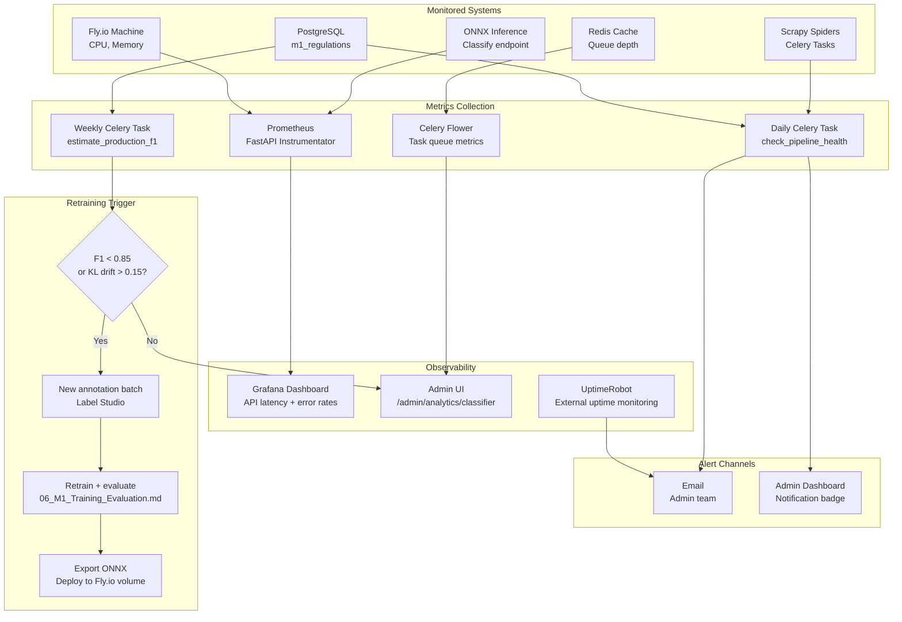

# 12 — Module 1: Monitoring & Maintenance

> **Cross-references:** [07_M1_Deployment_Integration.md](07_M1_Deployment_Integration.md) · [08_M1_Full_System_Architecture.md](08_M1_Full_System_Architecture.md) · [06_M1_Training_Evaluation.md](06_M1_Training_Evaluation.md)
> **See also:** [13_M1_Folder_Structure_and_Implementation_Flow.md](13_M1_Folder_Structure_and_Implementation_Flow.md) — `ml/shared/drift.py`, `backend/app/tasks/m1/analytics.py`, `model_registry.json`.
> **Sub-step companions:** [12_M1_1_Performance_Monitoring_Alerting.md](12_M1_1_Performance_Monitoring_Alerting.md) · [12_M1_2_Retraining_Deployment_Rollback.md](12_M1_2_Retraining_Deployment_Rollback.md)

---

## Abstract

Production deployment of the Module 1 NLP pipeline requires continuous monitoring across three dimensions: data pipeline health (ingestion and extraction success rates), model performance (classifier F1, confidence distribution, and drift detection), and infrastructure health (API latency, Celery queue depth, Redis memory). This document specifies all monitoring targets, alerting thresholds, retraining triggers, and maintenance procedures. A daily analytics refresh materialised view captures classifier performance metrics. Model retraining is triggered when production macro-F1 estimated from expert-verified labels drops below 0.85 or when confidence distribution drift exceeds the KL-divergence threshold. SLA targets are: ≥ 99.9% uptime, ≤ 6h ingestion latency, ≤ 24h alert delivery latency.

---

## 1. SLA Targets

| SLA | Target | Measurement | Alert Threshold |
|---|---|---|---|
| System uptime | ≥ 99.9% | UptimeRobot external ping | < 99.5% over 30 days |
| Gazette ingestion latency | ≤ 6 hours | `gazette_published_date` vs `created_at` | Any gazette > 8h |
| Classification latency | ≤ 2s per gazette | ONNX inference timer | P95 > 3s |
| Alert delivery latency | ≤ 24 hours from publication | `m1_propagation_events` lag | Any alert > 30h |
| Pipeline failure rate | < 5% | `status=extraction_failed` ratio | > 10% in 7 days |
| Review queue depth | < 20% of classified | `needs_review=true` ratio | > 30% in 14 days |
| Expert verification coverage | ≥ 30% | `expert_verified=true` ratio | < 15% at 3 months |

---

## 2. Data Pipeline Monitoring

### 2.1 Ingestion Health Checks

A daily Celery task runs pipeline health checks and writes results to `m1_pipeline_health` table:

```python
# backend/app/tasks/m1/analytics.py
from celery import shared_task
from app.db.session import get_db
from datetime import date, timedelta

@shared_task
async def check_pipeline_health():
    async with get_db() as db:
        yesterday = date.today() - timedelta(days=1)

        # Check scrape lag: any gazette older than 8h still unprocessed?
        stale = await db.execute("""
            SELECT COUNT(*) FROM m1_regulations
            WHERE status = 'ingested'
              AND created_at < NOW() - INTERVAL '8 hours'
        """)

        # Extraction failure rate (last 7 days)
        failure_rate = await db.execute("""
            SELECT
                COUNT(*) FILTER (WHERE status = 'extraction_failed') * 1.0
                / NULLIF(COUNT(*), 0)
            FROM m1_regulations
            WHERE created_at >= NOW() - INTERVAL '7 days'
        """)

        # Needs-review ratio (last 30 days classified)
        review_ratio = await db.execute("""
            SELECT
                COUNT(*) FILTER (WHERE needs_review) * 1.0
                / NULLIF(COUNT(*), 0)
            FROM m1_regulations
            WHERE status IN ('classified', 'summarized', 'alerted')
              AND created_at >= NOW() - INTERVAL '30 days'
        """)

        # Alert if thresholds exceeded
        if stale.scalar() > 0:
            await send_alert("PIPELINE", "Stale ingested gazettes > 8h")
        if failure_rate.scalar() > 0.10:
            await send_alert("PIPELINE", f"Extraction failure rate {failure_rate.scalar():.1%}")
        if review_ratio.scalar() > 0.30:
            await send_alert("CLASSIFIER", f"Review queue {review_ratio.scalar():.1%} > 30% threshold")
```

### 2.2 Gazette Scrape Monitoring

| Metric | Normal Range | Alert Condition |
|---|---|---|
| New gazettes/week | 8–15 | < 3 (scraper blocked) or > 25 (duplicate detection failure) |
| PDF download success rate | > 95% | < 90% over 3 days |
| Extraction method distribution | PyMuPDF: 60%, pdfplumber: 25%, Tesseract: 15% | Tesseract > 30% (quality concern) |
| Language detection: `mixed` | < 5% | > 15% (PDFs not splitting correctly) |

---

## 3. Classifier Performance Monitoring

### 3.1 Confidence Distribution Monitoring

The softmax confidence distribution of production predictions is compared to the training-time distribution using KL divergence. Significant drift indicates that production gazette text has shifted from the training distribution:

```python
import numpy as np
from scipy.special import kl_div

def monitor_confidence_drift(
    production_confidences: list[float],
    baseline_histogram: np.ndarray,  # From training evaluation
    threshold: float = 0.15
) -> bool:
    """Returns True if drift exceeds threshold (retraining signal)."""
    bins = np.linspace(0, 1, 20)
    prod_hist, _ = np.histogram(production_confidences, bins=bins, density=True)
    prod_hist = prod_hist / (prod_hist.sum() + 1e-8)  # Normalise

    divergence = kl_div(prod_hist + 1e-8, baseline_histogram + 1e-8).sum()
    return divergence > threshold
```

### 3.2 Estimated F1 from Expert Labels

As expert-verified labels accumulate in production, estimated F1 is computed weekly:

```python
async def estimate_production_f1(db) -> dict:
    """Compute F1 on expert-verified subset as proxy for production accuracy."""
    verified = await db.execute("""
        SELECT change_category AS predicted, expert_category AS actual
        FROM m1_regulations
        WHERE expert_verified = TRUE
          AND expert_category IS NOT NULL
          AND created_at >= NOW() - INTERVAL '90 days'
    """)
    rows = verified.fetchall()
    if len(rows) < 50:
        # Insufficient data is NOT the same as "no estimate" — we still report
        # the partial number so the admin dashboard can show a "low confidence"
        # warning. The caller treats `reliability='low'` as an advisory, not a
        # gating threshold.
        if len(rows) < 10:
            return {"status": "insufficient_data", "count": len(rows), "reliability": "none"}
        partial = f1_score([r.actual for r in rows],
                            [r.predicted for r in rows], average="macro")
        return {"status": "ok", "macro_f1": partial, "count": len(rows),
                "reliability": "low", "threshold": 0.85,
                "note": "estimate based on <50 verified labels — interpret with caution"}

    predicted = [r.predicted for r in rows]
    actual = [r.actual for r in rows]
    macro_f1 = f1_score(actual, predicted, average="macro")
    return {"status": "ok", "macro_f1": macro_f1, "count": len(rows),
            "reliability": "high" if len(rows) >= 100 else "medium",
            "threshold": 0.85}
```

The dashboard at `/admin/m1/analytics/classifier-metrics` shows the F1 estimate alongside a colour-coded reliability badge (`green=high (≥100)`, `amber=medium (50–99)`, `orange=low (10–49)`, `grey=none (<10)`). The retraining trigger (next section) only fires on `reliability ∈ {high, medium}` — low/none estimates are advisory, not actionable.

### 3.3 Retraining Triggers

| Trigger | Condition | Action |
|---|---|---|
| F1 regression | Estimated production F1 < 0.85 (reliability=`medium` or `high`) | Initiate retraining with new labeled examples |
| Confidence drift | KL divergence > 0.15 | Review recent gazettes; consider new categories |
| New gazette type | > 5 gazettes flagged `needs_review` with same keyword pattern | Add new category or sub-category |
| Annotation target met | 200 new expert-labeled examples accumulated | Retrain and evaluate; deploy if F1 improves |
| Annual review | Scheduled — every 12 months | Full retraining with all accumulated labels |

### 3.4 Full Retraining Workflow

A trigger firing doesn't auto-deploy a new model — it kicks off the staged retraining pipeline below. End-to-end takes 3–5 days; the production model continues serving the old version throughout.

```
Day 0  [trigger fires]
       → analytics.py writes a row to m1_retraining_runs(status='triggered')
       → Slack notification sent to #enigmatrix-ml

Day 0  [data collection]
       → scripts/collect_retraining_data.py pulls last-6-month verified labels
         + new annotator batches; writes research/data/retraining_v{N}.parquet
       → hash of parquet written to the run row

Day 1  [label review]
       → 50-doc sample reviewed by the domain expert
       → if IAA against existing gold labels < 0.75, run is aborted

Day 1-3  [training]
         → scripts/train_model.py --seeds 42,1,2 --data retraining_v{N}.parquet
         → 3-seed mean ± std macro-F1 written to model_registry.json
         → if F1 mean < current_F1 - 0.5pp, run is aborted

Day 3   [ONNX export + quantization]
        → scripts/export_onnx.py + INT8 quantize
        → integration test on test_split.parquet — must match training F1 ± 0.5pp

Day 3   [canary rollout]
        → upload v(N+1) ONNX to Fly volume
        → flip 10% of traffic to v(N+1) via M1_MODEL_CANARY_PCT=10
        → monitor canary F1 + confidence drift for 24h

Day 4   [50% rollout]
        → if canary metrics within target, ramp to 50% (M1_MODEL_CANARY_PCT=50)
        → monitor for 24h

Day 5   [full rollout + backfill]
        → flip to 100% (M1_MODEL_CANARY_PCT=100 + M1_MODEL_VERSION=v(N+1))
        → kick off backfill: re-classify last-30-day gazettes that were on v(N)
          and store the v(N+1) prediction alongside (for ablation), then promote
          v(N+1) prediction to the canonical column.
        → v(N) remains on the Fly volume for 30 days (rollback window).

[auto-rollback condition — fires at any stage]
        if production F1 (reliability=high) drops > 5pp in 24h compared to the
        pre-rollout baseline, the deploy script automatically:
           fly secrets set M1_MODEL_VERSION=v(N) M1_MODEL_CANARY_PCT=0
        and pages the on-call. The retraining_run row is annotated with the
        rollback reason.
```

The detailed per-step code, the canary traffic-split implementation, and the A/B testing measurement protocol live in [12_M1_2_Retraining_Deployment_Rollback.md](12_M1_2_Retraining_Deployment_Rollback.md).

---

## 4. Infrastructure Monitoring

### 4.1 FastAPI / Uvicorn Metrics

Expose Prometheus metrics via `prometheus-fastapi-instrumentator`:

```python
# backend/app/main.py
from prometheus_fastapi_instrumentator import Instrumentator
Instrumentator().instrument(app).expose(app)
```

Metrics tracked:

| Metric | Prometheus Label | Alert Threshold |
|---|---|---|
| HTTP request latency | `http_request_duration_seconds` | P95 > 2s on classify endpoint |
| HTTP error rate | `http_requests_total{status=~"5.."}` | > 1% over 15 minutes |
| Active connections | `uvicorn_active_requests` | > 50 |

### 4.2 Celery Queue Monitoring

```python
# Monitor via Celery Flower or direct Redis inspection
from celery import Celery

def get_queue_depth(app: Celery, queue_name: str = "m1_classify") -> int:
    with app.pool.acquire(block=True) as conn:
        return conn.default_channel.client.llen(queue_name)
```

| Queue | Normal Depth | Alert Threshold |
|---|---|---|
| `m1_extract` | 0–10 | > 50 |
| `m1_classify` | 0–10 | > 50 |
| `m1_summarise` | 0–20 | > 100 |
| `m1_alert` | 0–50 | > 200 |

### 4.3 Redis Memory

| Metric | Normal | Alert |
|---|---|---|
| Memory usage | < 100MB | > 500MB |
| Inference cache hit rate | > 60% | < 30% (cache ineffective) |
| Cache key count | < 5,000 | > 50,000 (TTL not expiring) |

---

## 4.4 Alert Escalation Paths

Each alert produced by the monitoring tasks above flows through a defined escalation ladder. The escalation level is set by the alert's `severity` field (computed from the metric thresholds, not chosen ad-hoc):

| Severity | Trigger condition | Channel(s) | Response SLA | Who is paged |
|---|---|---|---|---|
| `info` | Single metric crossing the *advisory* threshold (e.g. `mixed` language detection > 5 %) | Slack `#enigmatrix-info` only | Best-effort | No one |
| `warn` | Single metric crossing an *alert* threshold (e.g. extraction failure rate > 10 % in 7 days) | Slack `#enigmatrix-alerts` + daily digest email to the M1 team | < 24 h | M1 team next business day |
| `error` | Two or more `warn` thresholds crossed simultaneously, or any SLA target missed | Slack `#enigmatrix-alerts` + immediate email + PagerDuty *low-urgency* | < 4 h | M1 on-call (no overnight page) |
| `critical` | Production F1 drops > 5 pp in 24 h, or any pipeline stage stops processing > 1 h | Slack `#enigmatrix-alerts` + PagerDuty *high-urgency* | < 30 min | M1 on-call (24×7) + engineering manager |

`info` and `warn` are debounced (re-alerts suppressed for 6 h on the same metric). `error` and `critical` are not debounced — every threshold crossing pages. The Prometheus → Alertmanager routing rules are in `infra/prometheus/alert_rules.yml`. The per-severity runbook (what the on-call actually does for each kind of alert) is in [12_M1_1_Performance_Monitoring_Alerting.md](12_M1_1_Performance_Monitoring_Alerting.md).

---

## 5. Materialized Views for Analytics

Daily refresh at 03:00 via Celery Beat:

```sql
-- Propagation lag summary (refreshed daily)
CREATE MATERIALIZED VIEW m1_channel_lag_summary AS
SELECT
    channel,
    change_category,
    COUNT(*) AS count,
    PERCENTILE_CONT(0.50) WITHIN GROUP (
        ORDER BY EXTRACT(EPOCH FROM (pe.first_seen_at - r.gazette_published_date)) / 86400.0
    ) AS median_lag_days,
    AVG(
        EXTRACT(EPOCH FROM (pe.first_seen_at - r.gazette_published_date)) / 86400.0
    ) AS mean_lag_days
FROM m1_propagation_events pe
JOIN m1_regulations r ON pe.regulation_id = r.id
WHERE r.gazette_published_date IS NOT NULL
  AND pe.is_confirmed = TRUE
GROUP BY channel, change_category;

-- Refresh command (wrapped in advisory lock — see below)
REFRESH MATERIALIZED VIEW CONCURRENTLY m1_channel_lag_summary;
```

**Refresh concurrency lock.** Postgres' `REFRESH MATERIALIZED VIEW CONCURRENTLY` does not itself prevent two concurrent invocations against the same view — a second worker that fires while the first is mid-refresh will wait, then **also** refresh, doubling the work. The Celery Beat schedule should ensure only one task fires, but a manual `python -m app.scripts.refresh_m1_views` from an admin could collide. The pattern: wrap the refresh in a Postgres advisory lock keyed on the view name. If the lock is held, the refresh exits early with a debug log instead of queueing:

```python
# backend/app/tasks/m1/analytics.py
M1_VIEW_LOCK_KEY = 8910001  # int chosen to be M1-specific; use distinct keys per view

async def refresh_m1_lag_summary(db):
    locked = await db.execute(text("SELECT pg_try_advisory_lock(:key)"),
                              {"key": M1_VIEW_LOCK_KEY})
    if not locked.scalar():
        log.info("m1_view_refresh_skipped", reason="lock held by another worker")
        return {"status": "skipped_locked"}
    try:
        await db.execute(text("REFRESH MATERIALIZED VIEW CONCURRENTLY m1_channel_lag_summary"))
        return {"status": "ok"}
    finally:
        await db.execute(text("SELECT pg_advisory_unlock(:key)"), {"key": M1_VIEW_LOCK_KEY})
```

The advisory lock is released automatically when the session ends (the `finally` is a belt-and-braces). The refresh is now safely idempotent under concurrent invocation.

---

## 6. Monitoring and Alerting Diagram



---

## 7. Maintenance Procedures

### 7.1 Failed Extraction Retry

Gazettes that fail all three extraction methods (`status=extraction_failed`) are retried daily:

```python
@shared_task
async def retry_failed_extractions():
    async with get_db() as db:
        failed = await db.execute("""
            SELECT id FROM m1_regulations
            WHERE status = 'extraction_failed'
              AND updated_at < NOW() - INTERVAL '24 hours'
            LIMIT 20
        """)
        for row in failed.fetchall():
            extract_gazette.delay(str(row.id))
```

### 7.2 Model Version Management

| Version | F1 (Category) | F1 (Sector) | Deployed | Notes |
|---|---|---|---|---|
| v1.0 (baseline) | — | — | — | TF-IDF+SVM |
| v1.1 (LoRA) | 0.918 | 0.884 | 2025-03-01 | Initial XLM-R fine-tune |
| v1.2 | Target: 0.930 | Target: 0.895 | 2025-09-01 | After 200 new labels |

Model artifacts are tagged in git and stored on the Fly.io persistent volume. Rollback procedure: copy previous `gazette_classifier.onnx` from volume backup and restart Uvicorn workers.

### 7.3 Database Maintenance

```sql
-- Weekly: vacuum and analyse main table
VACUUM ANALYSE m1_regulations;

-- Monthly: reindex propagation events
REINDEX TABLE m1_propagation_events;

-- Quarterly: archive old alerted regulations
UPDATE m1_regulations
SET status = 'archived'
WHERE status = 'alerted'
  AND updated_at < NOW() - INTERVAL '2 years'
  AND is_active = TRUE;
```

---

## 8. Conclusion

The Module 1 monitoring and maintenance framework covers all three layers of the production system: data pipeline health, ML model performance, and infrastructure. The combination of Prometheus metrics, daily health-check Celery tasks, and weekly estimated-F1 computation provides early warning for pipeline failures and model drift before they impact SME alert quality. Retraining is triggered automatically when objective thresholds are crossed, ensuring that the classifier remains accurate as Sri Lanka's regulatory landscape evolves.

---

## References

- Prometheus. (2024). *Prometheus Monitoring Documentation*. [prometheus.io](https://prometheus.io)
- Grafana. (2024). *Grafana Documentation*. [grafana.com/docs](https://grafana.com/docs)
- Celery. (2024). *Celery Beat: Periodic Tasks*. [docs.celeryq.dev](https://docs.celeryq.dev)
- UptimeRobot. (2024). *External Uptime Monitoring*. [uptimerobot.com](https://uptimerobot.com)
- Gretton et al. (2012). *A Kernel Two-Sample Test (dataset drift detection)*. JMLR.
- PostgreSQL. (2024). *VACUUM and ANALYSE Documentation*. [postgresql.org/docs](https://www.postgresql.org/docs)
