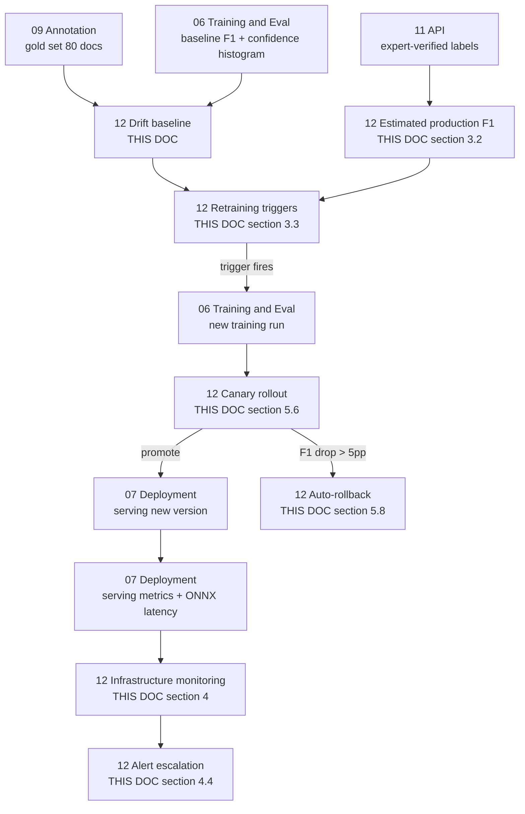
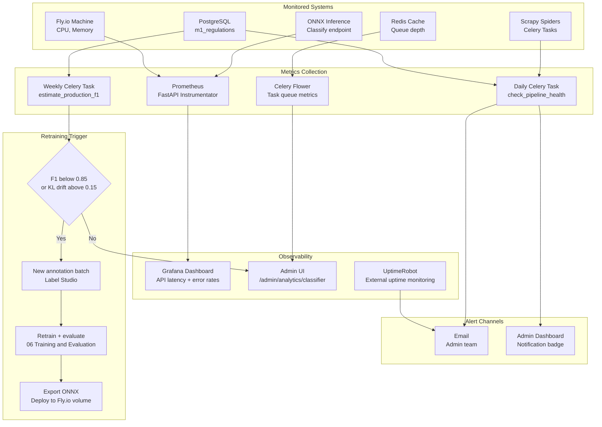

# 12 — Module 1: Monitoring & Maintenance

> **Cross-references:** [06_M1_Training_Evaluation.md](06_M1_Training_Evaluation.md) · [07_M1_Deployment_Integration.md](07_M1_Deployment_Integration.md) · [08_M1_Full_System_Architecture.md](08_M1_Full_System_Architecture.md) · [09_M1_Annotation_Guidelines.md](09_M1_Annotation_Guidelines.md) · [11_M1_API_Reference.md](11_M1_API_Reference.md)
> **Code map:** [13_M1_Folder_Structure_and_Implementation_Flow.md](13_M1_Folder_Structure_and_Implementation_Flow.md) — `ml/shared/drift.py` · `backend/app/tasks/m1/analytics.py` · `model_registry.json` · `infra/prometheus/` · `infra/grafana/dashboards/`
> **Consolidation note (2026-07-29):** this document now carries the full content previously split across `12_M1_1_Performance_Monitoring_Alerting` and `12_M1_2_Retraining_Deployment_Rollback`. Those two files have been retired; the per-severity runbook, Grafana dashboard layout, Alertmanager routing, retraining scripts, canary measurement protocol, and auto-rollback code all live below, folded into the sections they belong to rather than appended.

> [!warning] Truth-ledger sync — 2026-08-02
> Monitoring targets and topology are unchanged, but **the classifier-performance section monitors the wrong signal**.
> There is no calibrated probability to monitor on the default path. Drift detection, confidence-histogram alerts and ECE tracking must be re-specified against the **margin distribution**, or they will silently monitor a column that is always NULL.
>
> **Canonical record:** [[final/works/11_CLASSIFIER_FREEZE_AND_INTEGRATION|11_CLASSIFIER_FREEZE_AND_INTEGRATION]] · [[18_M1_Dataset_And_Model_Lineage]] · `final/works/evidence/M1_OPERATING_EVIDENCE_2026-08-02.json`
> **Submitted-report copy:** [[final/report/Enigmatrix_Consolidated_Final_Report_FULL|Enigmatrix_Consolidated_Final_Report_FULL]] (Part I = group report, Part II = Module 1 dissertation).

---

## 0. Where This Document Sits in the Pipeline

This document **closes the loop**. Every other document in Module 1 describes a path from gazette to alert; this one describes the path back. It consumes the gold-standard baseline that [06_M1_Training_Evaluation.md](06_M1_Training_Evaluation.md) and [09_M1_Annotation_Guidelines.md](09_M1_Annotation_Guidelines.md) produced at training time, watches the serving metrics that [07_M1_Deployment_Integration.md](07_M1_Deployment_Integration.md) emits at run time, and when the distance between them exceeds a threshold it fires a retraining trigger that lands *back* in [06_M1_Training_Evaluation.md](06_M1_Training_Evaluation.md) as a new training run. That cycle is the only mechanism by which the classifier stays accurate as Sri Lanka's regulatory language changes.

| | Stage | Produced by | What this document does with it | Handed to |
|---|---|---|---|---|
| **In** | Gold-standard set (~80 docs) + frozen taxonomy | [09_M1_Annotation_Guidelines.md](09_M1_Annotation_Guidelines.md) §6.1 | Uses it as the drift baseline and as the IAA reference for the Day-1 label-review gate (§5.3) | — |
| **In** | Training-time confidence histogram + baseline macro-F1 | [06_M1_Training_Evaluation.md](06_M1_Training_Evaluation.md) §4 evaluation metrics | Compares production confidence against it by KL divergence (§3.1) | — |
| **In** | `model_versions` registry rows | [06_M1_Training_Evaluation.md](06_M1_Training_Evaluation.md) §9 versioning schema | Reads the current production F1 to compute regression; writes back new versions | — |
| **In** | Serving metrics — inference latency, cache hit rate, queue depth | [07_M1_Deployment_Integration.md](07_M1_Deployment_Integration.md) §3 ONNX session + Redis cache | Feeds the SLA table (§1) and the infrastructure alerts (§4) | — |
| **In** | Expert-verified labels | [11_M1_API_Reference.md](11_M1_API_Reference.md) §4 `POST /regulations/{id}/verify` | Computes estimated production F1 on the verified subset (§3.2) | — |
| **Step** | Threshold evaluation | *this document* §1–§4 | Daily health check, weekly F1 estimate, severity assignment, escalation | — |
| **Step** | Staged retraining and rollout | *this document* §5 | 5-day pipeline with three abort gates and an auto-rollback | — |
| **Out** | Retraining trigger + collected label set | — | — | [06_M1_Training_Evaluation.md](06_M1_Training_Evaluation.md) — new training run, 3-seed evaluation |
| **Out** | Promoted model version | — | — | [07_M1_Deployment_Integration.md](07_M1_Deployment_Integration.md) §5.2 model deployment; executed via [11_M1_API_Reference.md](11_M1_API_Reference.md) §12 `POST /models/{id}/activate` |
| **Out** | Alerts, dashboards, runbooks | — | — | On-call, and the admin analytics surface in [14_M1_Tracking_Workflows.md](14_M1_Tracking_Workflows.md) |
| **Out** | `m1_channel_lag_summary` materialised view | — | — | [11_M1_API_Reference.md](11_M1_API_Reference.md) §9–§10 analytics endpoints; findings F3/F4 in [08_M1_Full_System_Architecture.md](08_M1_Full_System_Architecture.md) |


```mermaid
flowchart TD
    G[09 Annotation<br/>gold set 80 docs] --> B[12 Drift baseline<br/>THIS DOC]
    T[06 Training and Eval<br/>baseline F1 + confidence histogram] --> B
    S[07 Deployment<br/>serving metrics + ONNX latency] --> I[12 Infrastructure monitoring<br/>THIS DOC section 4]
    V[11 API<br/>expert-verified labels] --> F[12 Estimated production F1<br/>THIS DOC section 3.2]
    B --> D[12 Retraining triggers<br/>THIS DOC section 3.3]
    F --> D
    I --> A[12 Alert escalation<br/>THIS DOC section 4.4]
    D -->|trigger fires| RT[06 Training and Eval<br/>new training run]
    RT --> C[12 Canary rollout<br/>THIS DOC section 5.6]
    C -->|promote| DP[07 Deployment<br/>serving new version]
    C -->|F1 drop > 5pp| RB[12 Auto-rollback<br/>THIS DOC section 5.8]
    DP --> S
```

**Why the ordering matters.** The drift baseline has to be captured *at training time* and frozen, not recomputed later. A baseline recomputed from recent production data would move with the drift it is supposed to detect — the classic failure of comparing a system to itself. This is why the confidence histogram lives in `model_registry.json` alongside the model artefact rather than in a monitoring table: it is a property of the model version, and it retires when the version does.

The second constraint is that **the retraining trigger must not auto-deploy**. A trigger firing means "the numbers say something changed", which is not the same as "a new model will be better" — the change could be a new gazette type that needs new *categories* rather than more training data (§3.3). Inserting a human approval step and three abort gates (§5.3, §5.4, §5.5) between trigger and rollout is what stops a drift signal from silently replacing a working model with a worse one trained on the drifted labels that caused the signal.

The third is that **rollback must be faster than detection**. Detection of a bad model takes up to 24 hours because it needs enough expert-verified labels to reach `reliability='high'`; rollback takes under 90 seconds because it is a secrets flip against a previous version still sitting on the Fly volume. Keeping v(N) on the volume for 30 days after promoting v(N+1) is what makes that asymmetry possible, and it is the cheapest insurance in the module.

---

## Abstract

Production deployment of the Module 1 NLP pipeline requires continuous monitoring across three dimensions: data pipeline health (ingestion and extraction success rates), model performance (classifier F1, confidence distribution, and drift detection), and infrastructure health (API latency, Celery queue depth, Redis memory). This document specifies all monitoring targets, alerting thresholds, the four-level severity ladder with its per-severity runbook, retraining triggers, the staged 5-day retraining-and-canary pipeline with automatic rollback, and routine maintenance procedures.

A daily analytics refresh materialised view captures classifier performance metrics. Model retraining is triggered when production macro-F1 estimated from expert-verified labels drops below 0.85 or when confidence distribution drift exceeds the KL-divergence threshold of 0.15. Rollout is staged at 10 % → 50 % → 100 % with 24-hour dwell at each stage, and an automatic rollback fires if production F1 drops more than 5 pp in 24 hours. SLA targets are: ≥ 99.9 % uptime, ≤ 6 h ingestion latency, ≤ 24 h alert delivery latency.

**Implementation status:** 🟡 Partially shipped. The live analytics task now uses LinearSVC decision margins, category-distribution KL, dominant-category share, review-queue size, and confirmed/corrected review yield; it no longer treats nullable `classifier_confidence` as the production signal. The Prometheus/Alertmanager/Grafana stack, labelled production-F1 loop, retraining pipeline, and canary/rollback remain deferred. See the final-report reconciliation and §11 for the boundary.

---

## 1. SLA Targets

**Why the SLA table comes first.** Every threshold in the rest of the document is derived from a commitment in this table, and the severity ladder in §4.4 escalates on "any SLA target missed" as a distinct condition. Without the commitments stated up front, the individual thresholds look like arbitrary round numbers.

| SLA | Target | Measurement | Alert Threshold |
|---|---|---|---|
| System uptime | ≥ 99.9% | UptimeRobot external ping | < 99.5% over 30 days |
| Gazette ingestion latency | ≤ 6 hours | `gazette_published_date` vs `created_at` | Any gazette > 8h |
| Classification latency | ≤ 2s per gazette | ONNX inference timer | P95 > 3s |
| Alert delivery latency | ≤ 24 hours from publication | `m1_propagation_events` lag | Any alert > 30h |
| Pipeline failure rate | < 5% | `status=extraction_failed` ratio | > 10% in 7 days |
| Review queue depth | < 20% of classified | `needs_review=true` ratio | > 30% in 14 days |
| Expert verification coverage | ≥ 30% | `expert_verified=true` ratio | < 15% at 3 months |

**Note the gap between target and alert threshold on every row.** The alert fires at roughly 1.5–2× the target, not at the target. This is deliberate: a monitor that alerts the instant a target is grazed produces continuous noise and trains the on-call to ignore it (§9). The target is the commitment; the alert threshold is the point at which the commitment is in genuine danger.

**Why expert verification coverage is an SLA at all.** It is the only row that measures *human* throughput rather than system behaviour, and it is here because the estimated-F1 computation in §3.2 has no input without it. If verification coverage falls below 15 %, the model-quality monitoring silently degrades to `reliability='low'` and the retraining trigger stops being able to fire — a monitoring failure that looks exactly like a healthy system.

---

## 2. Data Pipeline Monitoring

**What this layer catches that the others cannot.** Model monitoring assumes documents are arriving; infrastructure monitoring assumes the machines are up. Neither notices that the gazette scraper has been silently returning zero results for a week because a source URL changed. Pipeline monitoring is specifically the check on *whether work is flowing*, which is the failure mode with the longest mean-time-to-detection if nobody watches for it.

### 2.1 Ingestion Health Checks

A daily Celery task runs pipeline health checks and writes results to the `m1_pipeline_health` table:

```python
# backend/app/tasks/m1/analytics.py
from celery import shared_task
from app.db.session import get_db
from datetime import date, timedelta

@shared_task
async def check_pipeline_health():
    async with get_db() as db:
        yesterday = date.today() - timedelta(days=1)

        # Check scrape lag: any gazette older than 8h still unprocessed?
        stale = await db.execute("""
            SELECT COUNT(*) FROM m1_regulations
            WHERE status = 'ingested'
              AND created_at < NOW() - INTERVAL '8 hours'
        """)

        # Extraction failure rate (last 7 days)
        failure_rate = await db.execute("""
            SELECT
                COUNT(*) FILTER (WHERE status = 'extraction_failed') * 1.0
                / NULLIF(COUNT(*), 0)
            FROM m1_regulations
            WHERE created_at >= NOW() - INTERVAL '7 days'
        """)

        # Needs-review ratio (last 30 days classified)
        review_ratio = await db.execute("""
            SELECT
                COUNT(*) FILTER (WHERE needs_review) * 1.0
                / NULLIF(COUNT(*), 0)
            FROM m1_regulations
            WHERE status IN ('classified', 'summarized', 'alerted')
              AND created_at >= NOW() - INTERVAL '30 days'
        """)

        # Alert if thresholds exceeded
        if stale.scalar() > 0:
            await send_alert("PIPELINE", "Stale ingested gazettes > 8h")
        if failure_rate.scalar() > 0.10:
            await send_alert("PIPELINE", f"Extraction failure rate {failure_rate.scalar():.1%}")
        if review_ratio.scalar() > 0.30:
            await send_alert("CLASSIFIER", f"Review queue {review_ratio.scalar():.1%} > 30% threshold")
```

**Why these three queries and not more.** Each maps to a distinct stage boundary where work can stop without erroring. `stale` catches documents that entered the system and never advanced — a stuck queue or a dead worker. `failure_rate` catches extraction degrading rather than stopping, which is what a new PDF format looks like. `review_ratio` catches the classifier losing confidence, which is the earliest cheap signal of the drift that §3.1 measures properly. All three use `NULLIF(COUNT(*), 0)` so that a genuinely empty window returns NULL rather than a division error — an empty window is a different problem and should not be reported as a rate.

**Why daily rather than continuous.** These are trend metrics computed over 7- and 30-day windows; evaluating them every minute would produce the same answer 1,440 times. The genuinely time-sensitive checks — latency, error rate, queue depth — are in §4 and run on Prometheus' scrape interval.

### 2.2 Gazette Scrape Monitoring

| Metric | Normal Range | Alert Condition |
|---|---|---|
| New gazettes/week | 8–15 | < 3 (scraper blocked) or > 25 (duplicate detection failure) |
| PDF download success rate | > 95% | < 90% over 3 days |
| Extraction method distribution | PyMuPDF: 60%, pdfplumber: 25%, Tesseract: 15% | Tesseract > 30% (quality concern) |
| Language detection: `mixed` | < 5% | > 15% (PDFs not splitting correctly) |

**Both directions of the gazette-count check are load-bearing.** Too few means the scraper is blocked or a source moved. Too many means de-duplication has failed and the same gazette is being ingested repeatedly, which would inflate every downstream count and corrupt the lag analysis. A one-sided threshold would catch only the first.

**The extraction-method distribution is an indirect quality proxy.** A Tesseract share above 30 % does not mean OCR is broken — it means an unusual number of documents are arriving as scans, and OCR output is measurably worse than text-layer extraction ([10_M1_Sinhala_Tamil_NLP.md](10_M1_Sinhala_Tamil_NLP.md) §4). The alert exists because that shift is invisible in any success-rate metric: every document extracts successfully, just worse. The same logic applies to the `mixed` language rate, where a spike means bilingual PDFs are not splitting into per-language buckets correctly rather than that more bilingual gazettes were published.

---

## 3. Classifier Performance Monitoring

**Why the model needs two independent monitors.** Confidence drift (§3.1) is *unsupervised* — it needs no labels and detects that inputs have changed distribution, but it cannot tell you whether accuracy actually fell. Estimated F1 (§3.2) is *supervised* — it measures real accuracy, but only on the expert-verified subset, and it lags because verification takes human time. Running both means a distribution shift is visible within days while the accuracy consequence is confirmed within weeks, and the two together are what distinguish "the world changed" from "the model broke".

### 3.1 Confidence Drift Detection

The softmax confidence distribution of production predictions is compared to the training-time distribution using KL divergence. Significant drift indicates that production gazette text has shifted from the training distribution:

```python
import numpy as np
from scipy.special import kl_div

# Baseline computed at training time, stored in model_registry.json
# (histogram over 20 bins spanning 0.0–1.0, stored normalised)
BASELINE_HIST = np.array([0.02, 0.03, 0.05, 0.08, 0.12, 0.15, 0.18, 0.15, 0.12, 0.10])


def check_confidence_drift(production_confidences: list[float]) -> dict:
    """Returns the divergence, the drift verdict, and the low-confidence share.

    Drift above threshold is a retraining signal, not a retraining decision —
    see §3.3 for what actually fires.
    """
    bins = np.linspace(0, 1, 21)
    prod_hist, _ = np.histogram(production_confidences, bins=bins, density=True)
    prod_hist = prod_hist / (prod_hist.sum() + 1e-8)
    divergence = float(kl_div(prod_hist + 1e-8, BASELINE_HIST + 1e-8).sum())
    return {
        "kl_divergence": divergence,
        "drift_detected": divergence > 0.15,
        "production_low_conf_share": float((np.array(production_confidences) < 0.50).mean()),
    }
```

> **Defect noted at consolidation (2026-07-29).** The pre-merge documents carried two variants of this function — one binning with `np.linspace(0, 1, 20)` (19 bins) returning a bare boolean, and the one above binning with `np.linspace(0, 1, 21)` (20 bins) returning the full dict. The richer variant is kept because §3.3 and §5.2 both consume `kl_divergence` as a number, not a boolean. Note also that the illustrative `BASELINE_HIST` above has 10 elements against a 20-bin histogram; the array shipped in `model_registry.json` must match the bin count the comparison uses, and a shape assertion belongs in the implementation.

**Why the `+ 1e-8` appears twice.** KL divergence is undefined where the reference distribution has zero mass, and confidence histograms routinely have empty bins — no production document scored between 0.05 and 0.10, say. Adding a floor to both histograms keeps the divergence finite instead of returning infinity the first time a bin empties. The normalisation before comparison matters for the same reason: `density=True` gives a density, not a probability mass, and comparing a density to a normalised baseline would scale the divergence by bin width.

**Why KL divergence rather than a simpler test.** It works directly on the histogram, is a single interpretable number, and needs no assumption about the shape of the distribution. The alternative worth naming is PSI (Population Stability Index), which is more robust when N is small — the switch to make if KL proves noisy in production. `production_low_conf_share` is returned alongside because it is the human-readable version of the same signal: "22 % of predictions are below 0.50" communicates to a non-specialist in a way "KL = 0.18" does not.

**Threshold: 0.15**, chosen conservatively so the alert fires well before catastrophic drift, and scheduled for re-tuning after six months of production data.

**Worked example — 30 days of production data:**

```
Baseline (training): low-conf < 0.5  share = 8%
                     KL vs baseline = 0.00

Day 1–30 production: low-conf share = 22% (gradual increase)
                     KL = 0.18  → DRIFT DETECTED

Interpretation: production gazettes are systematically harder than training set.
Likely cause: a new gazette type appeared (e.g. supply-chain regulation).
Action: open ticket "investigate Day-1 to Day-30 needs_review queue".
```

**Read the action line carefully — it is not "retrain".** A drift signal caused by a genuinely new *kind* of regulation is not fixed by more training data on the existing categories; it may need a new category, which is a taxonomy change and therefore a migration in [02_M1_Data_Requirements.md](02_M1_Data_Requirements.md) and a re-freeze in [09_M1_Annotation_Guidelines.md](09_M1_Annotation_Guidelines.md) §2. Retraining on drifted inputs without checking which case you are in produces a model that is confidently wrong about a category that should exist. That is why the drift trigger in §3.3 says "review recent gazettes; consider new categories" rather than "retrain".

### 3.2 Estimated F1 from Expert Labels

As expert-verified labels accumulate in production, estimated F1 is computed weekly:

```python
async def estimate_production_f1(db) -> dict:
    """Compute F1 on expert-verified subset as proxy for production accuracy."""
    verified = await db.execute("""
        SELECT change_category AS predicted, expert_category AS actual
        FROM m1_regulations
        WHERE expert_verified = TRUE
          AND expert_category IS NOT NULL
          AND created_at >= NOW() - INTERVAL '90 days'
    """)
    rows = verified.fetchall()
    if len(rows) < 50:
        # Insufficient data is NOT the same as "no estimate" — we still report
        # the partial number so the admin dashboard can show a "low confidence"
        # warning. The caller treats `reliability='low'` as an advisory, not a
        # gating threshold.
        if len(rows) < 10:
            return {"status": "insufficient_data", "count": len(rows), "reliability": "none"}
        partial = f1_score([r.actual for r in rows],
                            [r.predicted for r in rows], average="macro")
        return {"status": "ok", "macro_f1": partial, "count": len(rows),
                "reliability": "low", "threshold": 0.85,
                "note": "estimate based on <50 verified labels — interpret with caution"}

    predicted = [r.predicted for r in rows]
    actual = [r.actual for r in rows]
    macro_f1 = f1_score(actual, predicted, average="macro")
    return {"status": "ok", "macro_f1": macro_f1, "count": len(rows),
            "reliability": "high" if len(rows) >= 100 else "medium",
            "threshold": 0.85}
```

The dashboard at `/admin/m1/analytics/classifier-metrics` shows the F1 estimate alongside a colour-coded reliability badge (`green=high (≥100)`, `amber=medium (50–99)`, `orange=low (10–49)`, `grey=none (<10)`). The retraining trigger (§3.3) only fires on `reliability ∈ {high, medium}` — low/none estimates are advisory, not actionable.

**Why reliability is a returned field rather than an internal gate.** Two callers need the same number for different purposes and with different tolerances. The admin dashboard wants to display *something* even at n=30, with an honest caveat, because a blank panel is indistinguishable from a broken one. The retraining trigger wants to fire only on evidence, because a spurious trigger costs five days of pipeline time. Returning the estimate plus its reliability lets each caller apply its own bar, rather than the function deciding for both and being wrong for one.

**Why this estimate is biased, and why it is used anyway.** Expert verification is not a random sample — reviewers work the `needs_review` queue, which is enriched for exactly the documents the model found hard. The estimated F1 is therefore a *pessimistic* proxy for true production accuracy. That bias is acceptable because the trigger is a lower bound: a pessimistic estimate above 0.85 is strong evidence, and a pessimistic estimate below 0.85 is a reason to look rather than a verdict. It would not be acceptable to report this number as production accuracy in the thesis, which is why the reportable figures come from the held-out gold set in [06_M1_Training_Evaluation.md](06_M1_Training_Evaluation.md) instead.

### 3.3 Retraining Triggers

| Trigger | Condition | Action |
|---|---|---|
| F1 regression | Estimated production F1 < 0.85 (reliability=`medium` or `high`) | Initiate retraining with new labeled examples |
| Confidence drift | KL divergence > 0.15 | Review recent gazettes; consider new categories |
| New gazette type | > 5 gazettes flagged `needs_review` with same keyword pattern | Add new category or sub-category |
| Annotation target met | 200 new expert-labeled examples accumulated | Retrain and evaluate; deploy if F1 improves |
| Annual review | Scheduled — every 12 months | Full retraining with all accumulated labels |

The nightly check that evaluates them:

```python
# backend/app/tasks/m1/analytics.py — nightly retraining-trigger check
async def check_retraining_triggers(db):
    f1 = await estimate_production_f1(db)
    drift = await check_confidence_drift(db)
    new_label_count = await count_new_expert_labels_since_last_train(db)
    annual_due = await annual_review_due(db)

    triggers = []
    if f1["macro_f1"] < 0.85 and f1["reliability"] in ("medium", "high"):
        triggers.append("f1_regression")
    if drift["kl_divergence"] > 0.15:
        triggers.append("confidence_drift")
    if new_label_count >= 200:
        triggers.append("label_target_met")
    if annual_due:
        triggers.append("annual_review")

    if triggers:
        await db.execute(insert(M1RetrainingRun).values(
            triggered_at=datetime.utcnow(),
            triggers_json=triggers,
            status='triggered',
        ))
        await slack_notify("#enigmatrix-ml", f"Retraining triggered: {triggers}")
```

**Note that the five triggers are not equivalent, despite sharing a table.** Two are *reactive* — F1 regression and confidence drift mean something has gone wrong and the response is diagnostic. Two are *proactive* — the 200-label target and the annual review mean enough new evidence has accumulated to be worth exploiting, and the response is opportunistic. The fifth, new gazette type, is a taxonomy signal rather than a model signal and its action is the only one in the table that does not involve retraining at all. Collecting all triggers into `triggers_json` rather than firing on the first match preserves that distinction in the record, so an operator reviewing the run knows whether they are fixing something or improving something.

**A trigger firing does not deploy anything.** It writes a row and sends a Slack message; the staged pipeline in §5 requires human approval at Day 0 and passes three abort gates before any traffic moves.

---

## 4. Infrastructure Monitoring

### 4.1 FastAPI / Uvicorn Metrics

Expose Prometheus metrics via `prometheus-fastapi-instrumentator`:

```python
# backend/app/main.py
from prometheus_fastapi_instrumentator import Instrumentator
Instrumentator().instrument(app).expose(app)
```

Metrics tracked:

| Metric | Prometheus Label | Alert Threshold |
|---|---|---|
| HTTP request latency | `http_request_duration_seconds` | P95 > 2s on classify endpoint |
| HTTP error rate | `http_requests_total{status=~"5.."}` | > 1% over 15 minutes |
| Active connections | `uvicorn_active_requests` | > 50 |

**Why P95 rather than mean latency.** The classify endpoint runs ONNX inference, and inference time depends on document length — a mean is dominated by the many short documents and hides the long ones that actually breach the 2-second SLA in §1. The error-rate threshold matches on `5..` specifically because 4xx responses are client errors and a spike in 403s is a permissions problem for [11_M1_API_Reference.md](11_M1_API_Reference.md) to answer, not an infrastructure incident.

### 4.2 Celery Queue Monitoring

```python
# Monitor via Celery Flower or direct Redis inspection
from celery import Celery


def get_queue_depth(app: Celery, queue_name: str = "m1_classify") -> int:
    with app.pool.acquire(block=True) as conn:
        return conn.default_channel.client.llen(queue_name)
```

| Queue | Normal Depth | Alert Threshold |
|---|---|---|
| `m1_extract` | 0–10 | > 50 |
| `m1_classify` | 0–10 | > 50 |
| `m1_summarise` | 0–20 | > 100 |
| `m1_alert` | 0–50 | > 200 |

**Why each queue gets its own threshold instead of one global number.** The four queues have different natural depths because they process different volumes at different speeds — one gazette produces one extract task, one classify task, but potentially many alert tasks (one per affected SME). A single threshold would either alert constantly on `m1_alert` or never alert on `m1_classify`. Queue depth is the leading indicator for every latency SLA in §1: a queue backing up is visible minutes before the resulting alert-delivery breach.

### 4.3 Redis Memory

| Metric | Normal | Alert |
|---|---|---|
| Memory usage | < 100MB | > 500MB |
| Inference cache hit rate | > 60% | < 30% (cache ineffective) |
| Cache key count | < 5,000 | > 50,000 (TTL not expiring) |

**The cache-hit-rate alert is a model-monitoring signal in disguise.** The inference cache in [07_M1_Deployment_Integration.md](07_M1_Deployment_Integration.md) §3.2 is keyed on document content, so a collapsing hit rate means the same documents are no longer being re-classified — which usually means a re-classification storm, a cache key change, or an expiry misconfiguration. The key-count alert catches the specific case where TTLs stopped applying, which grows memory unboundedly and eventually evicts the entries that were actually useful.

### 4.4 Alert Escalation Paths

Each alert produced by the monitoring tasks above flows through a defined escalation ladder. The escalation level is set by the alert's `severity` field, computed from the metric thresholds rather than chosen ad hoc:

| Severity | Trigger condition | Channel(s) | Response SLA | Who is paged |
|---|---|---|---|---|
| `info` | Single metric crossing the *advisory* threshold (e.g. `mixed` language detection > 5 %) | Slack `#enigmatrix-info` only | Best-effort | No one |
| `warn` | Single metric crossing an *alert* threshold (e.g. extraction failure rate > 10 % in 7 days) | Slack `#enigmatrix-alerts` + daily digest email to the M1 team | < 24 h | M1 team next business day |
| `error` | Two or more `warn` thresholds crossed simultaneously, or any SLA target missed | Slack `#enigmatrix-alerts` + immediate email + PagerDuty *low-urgency* | < 4 h | M1 on-call (no overnight page) |
| `critical` | Production F1 drops > 5 pp in 24 h, or any pipeline stage stops processing > 1 h | Slack `#enigmatrix-alerts` + PagerDuty *high-urgency* | < 30 min | M1 on-call (24×7) + engineering manager |

`info` and `warn` are debounced — re-alerts suppressed for 6 h on the same metric. `error` and `critical` are not debounced; every threshold crossing pages.

**Why severity is computed rather than assigned.** A severity chosen by whoever wrote the check drifts upward over time — every author believes their own check is important — until everything is critical and nothing is. Deriving severity mechanically from *how many* thresholds are crossed and *whether an SLA is breached* keeps the ladder calibrated against the commitments in §1 rather than against opinion.

**Why the `error` tier exists between `warn` and `critical`.** Two simultaneous `warn`s usually mean a shared root cause, and a shared root cause is a different problem from two independent minor issues. Escalating on co-occurrence catches that without waiting for either individual metric to reach a critical threshold. Its low-urgency PagerDuty routing is the deliberate compromise: someone is woken up by `critical` and nobody is woken up by `error`.

**Why debouncing stops at `error`.** A repeating `warn` is the same information arriving twice and suppression costs nothing. A repeating `critical` may be a *second, different* failure, and suppressing it to avoid noise is how an incident gets missed during another incident.

### 4.5 Alertmanager Routing Rules

```yaml
# infra/prometheus/alertmanager.yml
route:
  receiver: 'enigmatrix-info'
  group_by: ['alertname']
  routes:
    - match: { severity: critical }
      receiver: 'pagerduty-high'
    - match: { severity: error }
      receiver: 'pagerduty-low'
    - match: { severity: warn }
      receiver: 'enigmatrix-alerts-slack'

receivers:
  - name: 'pagerduty-high'
    pagerduty_configs:
      - service_key: ${PAGERDUTY_HIGH_KEY}
  - name: 'enigmatrix-alerts-slack'
    slack_configs:
      - api_url: ${SLACK_WEBHOOK_URL}
        channel: '#enigmatrix-alerts'
```

The full rule set lives in `infra/prometheus/alert_rules.yml`. Note that `enigmatrix-info` is the *default* receiver rather than a matched route — anything that fails to declare a severity lands in the low-noise channel rather than paging someone, which is the safe direction for a misconfigured rule to fail.

### 4.6 Per-Severity Runbook

**Why a runbook rather than expecting the on-call to diagnose.** At 3 a.m. the on-call is not the person who wrote the check, and the value of an alert is bounded by whether the recipient knows what to do about it. Each runbook below is written so its first three steps can be executed without understanding the system.

**`info` runbook.** No action required. The data team reviews the `info` Slack channel weekly to spot trends.

**`warn` runbook.**

1. Open the alert; read the trigger metric and the threshold.
2. Open the Grafana dashboard `m1_classifier_health`; inspect related panels.
3. Check the `m1_pipeline_errors` table for the failing class (extraction / classification / dispatch).
4. If the error count exceeds 50 per hour, escalate to `error`.
5. Otherwise, open a Jira ticket, assign it to the M1 owner, and link the alert.

**`error` runbook.**

1. PagerDuty fires; on-call is notified.
2. On-call confirms acknowledgement within 4 h.
3. Inspect the Grafana dashboard and the Slack channel.
4. If the root cause is in Stage A (Scrapy / portal watcher), check whether a source URL has changed.
5. If in Stage B (extraction), check the `extraction_method` distribution for an OCR spike — this signals a new gazette format (§2.2).
6. If in Stage D (classifier), check the confidence histogram; if shifted left, escalate to `critical` and consider rollback.
7. Communicate status in `#enigmatrix-incidents` every 30 minutes.

**`critical` runbook.**

1. PagerDuty fires *high urgency*; on-call is paged.
2. On-call acknowledges within 30 minutes.
3. **Immediate action:** if F1 dropped more than 5 pp in 24 h, the automatic rollback in §5.8 fires on its own — confirm it succeeded.
4. If the rollback did not fire (manual mode), execute: `fly secrets set M1_MODEL_VERSION=<previous> M1_MODEL_CANARY_PCT=0`.
5. Engineering manager is paged at the 30-minute mark if the alert is not acknowledged.
6. Post-mortem within 48 h, written to `research/incidents/`.

**Note step 3 of the critical runbook.** The on-call's job during a model regression is to *verify the automation worked*, not to perform the rollback. Automation that a human is expected to duplicate is automation nobody trusts; making verification the instruction is what keeps the auto-rollback in §5.8 meaningful.

### 4.7 Grafana Dashboard Layout

Dashboard `m1_classifier_health`:

| Row | Panels (left → right) | Source |
|---|---|---|
| 1 — SLAs | (a) Uptime gauge (target 99.9%) (b) p95 inference latency (c) Pipeline failure rate 7d | UptimeRobot + Prometheus |
| 2 — Confidence drift | (a) KL divergence sparkline (b) Low-conf share | Daily Celery task results |
| 3 — Throughput | (a) Gazettes/hour (b) Celery queue depth per queue | Prometheus + Celery Flower |
| 4 — Model quality | (a) Expert-verified F1 (last 90d) (b) Confidence histogram | `m1_pipeline_audits` |
| 5 — Per-language slice F1 | EN / SI / TA (rolling) | Same |
| 6 — Recent alerts | List of recent Prometheus alerts | Alertmanager |

The JSON definition is stored at `infra/grafana/dashboards/m1_classifier_health.json`, committed to the repo for reproducibility.

**Why the row order is top-down by blast radius.** Row 1 answers "are we meeting our commitments"; rows 2–5 answer "why not"; row 6 is context. An on-call opening this dashboard mid-incident reads it in exactly that order, so putting model internals above the SLA gauges would cost seconds at the worst possible moment. Row 5 exists as its own row because a model can hold its overall F1 while collapsing on Sinhala — the per-language slice from [06_M1_Training_Evaluation.md](06_M1_Training_Evaluation.md) §7.1 is the only panel that would show it.

**Why the dashboard definition is committed rather than configured in the UI.** A dashboard edited in Grafana's UI exists in one Grafana instance and disappears with it. Committing the JSON makes the monitoring reproducible alongside the code it monitors, which is the same argument that puts the alert rules in `infra/prometheus/`.

### 4.8 Worked Example — A `warn` Alert End to End

```
[2026-05-20 13:00] Alertmanager fires:
   m1_extraction_failure_rate_7d = 12% (threshold 10%)
   Slack #enigmatrix-alerts: "WARN: M1 extraction failures elevated (12% over 7 days)"

[2026-05-20 14:30] On-call (M1 team lead) opens the alert during business hours
   - Grafana dashboard panel "Pipeline failure rate" shows spike on 2026-05-15
   - m1_pipeline_errors table query:
       SELECT reason, COUNT(*) FROM m1_pipeline_errors
       WHERE created_at >= NOW() - INTERVAL '7 days' GROUP BY reason
   - Top reason: 'tesseract_subprocess_timeout' (12 occurrences in last 7 days)
   - Hypothesis: scanned-PDF volume spiked

[2026-05-20 15:00] On-call action:
   - Open Jira M1-247: "Investigate scanned-PDF surge week of May 13"
   - Check: 18 of last 30 PDFs are 'scanned' type vs baseline 4/30 → confirmed surge
   - Likely cause: a backlog of older gazettes being added by a recent portal update
   - No immediate action; create monitoring follow-up to ensure surge subsides

[2026-05-25] Surge ends; Tesseract timeout count returns to <2/week
[2026-05-25] Jira M1-247 closed with no fix needed
```

**This is what a correctly-calibrated `warn` looks like: it ends in no fix.** The alert did its job by making a real change visible and by letting a human establish within 30 minutes that the change was benign. A monitoring system whose alerts always require action is one whose thresholds are set too high — the failures it misses are the ones between the threshold and reality. Note also the 90-minute gap between the alert firing and the on-call opening it: that is the `warn` tier working as designed, not a response failure.

### 4.9 Monitoring Technology Choices

| Choice | Trade-off | Decision | Revisit when |
|---|---|---|---|
| Prometheus + Alertmanager + Grafana | Industry standard, self-hosted, no per-metric cost | ✅ Open-source; aligned with the Session-14 audit-log pattern | A managed observability vendor (Datadog, New Relic) is adopted |
| KL divergence for drift | Standard distribution-shift metric; works on a histogram; one interpretable number | ✅ | KL proves noisy at small N — switch to PSI (Population Stability Index) |
| 0.15 KL threshold | Conservative — alerts before catastrophic drift, at the cost of some false positives | ✅ Empirically chosen | Re-tune after 6 months of production data |
| PagerDuty | Tied to the project's existing incident-management workflow | ✅ | PagerDuty pricing escalates — switch to Opsgenie |

---

## 5. Retraining, Deployment and Rollback

**Why retraining is a five-day staged pipeline rather than a script.** The naive version — retrain on new labels, export, deploy — has no point at which a bad outcome is caught before it reaches production. The pipeline below inserts three abort gates (label quality, training quality, export fidelity) and three traffic stages (10 %, 50 %, 100 %) with 24-hour dwell, so that every failure mode has a place where it surfaces while the blast radius is still small. The production model continues serving the old version throughout; nothing is at risk until Day 3.

### 5.1 Workflow Overview

```
Day 0  [trigger fires]
       → analytics.py writes a row to m1_retraining_runs(status='triggered')
       → Slack notification sent to #enigmatrix-ml

Day 0  [data collection]
       → scripts/collect_retraining_data.py pulls last-6-month verified labels
         + new annotator batches; writes research/data/retraining_v{N}.parquet
       → hash of parquet written to the run row

Day 1  [label review]
       → 50-doc sample reviewed by the domain expert
       → if IAA against existing gold labels < 0.75, run is aborted

Day 1-3  [training]
         → scripts/train_model.py --seeds 42,1,2 --data retraining_v{N}.parquet
         → 3-seed mean ± std macro-F1 written to model_registry.json
         → if F1 mean < current_F1 - 0.5pp, run is aborted

Day 3   [ONNX export + quantization]
        → scripts/export_onnx.py + INT8 quantize
        → integration test on test_split.parquet — must match training F1 ± 0.5pp

Day 3   [canary rollout]
        → upload v(N+1) ONNX to Fly volume
        → flip 10% of traffic to v(N+1) via M1_MODEL_CANARY_PCT=10
        → monitor canary F1 + confidence drift for 24h

Day 4   [50% rollout]
        → if canary metrics within target, ramp to 50% (M1_MODEL_CANARY_PCT=50)
        → monitor for 24h

Day 5   [full rollout + backfill]
        → flip to 100% (M1_MODEL_CANARY_PCT=100 + M1_MODEL_VERSION=v(N+1))
        → kick off backfill: re-classify last-30-day gazettes that were on v(N)
          and store the v(N+1) prediction alongside (for ablation), then promote
          v(N+1) prediction to the canonical column.
        → v(N) remains on the Fly volume for 30 days (rollback window).

[auto-rollback condition — fires at any stage]
        if production F1 (reliability=high) drops > 5pp in 24h compared to the
        pre-rollout baseline, the deploy script automatically:
           fly secrets set M1_MODEL_VERSION=v(N) M1_MODEL_CANARY_PCT=0
        and pages the on-call. The retraining_run row is annotated with the
        rollback reason.
```

### 5.2 Day 0 — Trigger and Data Collection

The trigger check itself is in §3.3. Once a run row exists and the M1 lead approves, data collection runs:

```bash
python scripts/collect_retraining_data.py --since "$(date -d '6 months ago' +%Y-%m-%d)" \
    --include verified=true \
    --include needs_review=false \
    --output research/data/retraining_v$(date +%Y%m%d).parquet
```

The script:

1. Pulls the last 6 months of `expert_verified=true` rows.
2. Pulls all new annotator-labelled batches.
3. Validates against `m1_validate_pipeline.py` rules.
4. Writes Parquet and computes SHA-256.
5. Records the hash in `M1RetrainingRun.input_data_sha256`.

**Why the input hash is recorded.** A retraining run is only reproducible if the exact input set can be recovered, and "the last 6 months of verified labels" is not a stable description — the same command run a day later selects a different set. The SHA-256 in the run row is what lets a later investigation confirm which data produced a given model, which matters most in exactly the case where it is hardest to reconstruct: a model that regressed and was rolled back.

**Why `needs_review=false` is an inclusion filter.** Rows still flagged for review have not been adjudicated, so their labels are model output rather than ground truth. Training on them would feed the model its own predictions — the self-reinforcing loop that makes drift accelerate rather than surface.

### 5.3 Day 1 — Label Review Gate

A 50-document random sample is reviewed by the domain expert against existing gold labels. IAA against the prior gold set must be ≥ 0.75 — otherwise the retraining run is **aborted**.

**Why the first gate is about labels rather than about the model.** If the new labels disagree with the frozen gold set, one of two things is true: the annotators have drifted, or the taxonomy's meaning has shifted. Both are reasons *not* to retrain, because a model trained on drifted labels will faithfully reproduce the drift and the resulting F1 will look fine while the classifier now means something different. The 0.75 threshold is the same κ bar [09_M1_Annotation_Guidelines.md](09_M1_Annotation_Guidelines.md) §6 applies to the original annotation campaign, and it is deliberately the same number — a retraining set held to a lower standard than the original corpus would degrade the model in a way no downstream metric could distinguish from noise.

### 5.4 Day 1–3 — Training Gate

```bash
python scripts/train_model.py --data research/data/retraining_v$DATE.parquet \
    --seeds 42 1 2 \
    --base-model facebook/xlm-roberta-base \
    --output-dir storage/models/m1/staging \
    --report storage/models/m1/staging/training_report.json
```

Three seeds run sequentially. Mean ± std macro-F1 is written to `model_registry.json`. If the mean F1 falls below current production F1 − 0.5 pp, the run is **aborted** and a notification is sent.

**Why three seeds and not one.** A single training run's macro-F1 varies by roughly the same magnitude as the improvements being chased, so a single-seed comparison cannot distinguish a better model from a luckier one. Reporting mean ± std across three seeds makes the comparison against the production baseline meaningful, and it is the minimum that produces a usable standard deviation. Running them sequentially rather than in parallel is a cost decision, and it is why this gate occupies two days of the five.

**Why the abort threshold is −0.5 pp rather than zero.** Requiring strict improvement would abort runs that are statistically indistinguishable from the incumbent, including ones triggered by the proactive label-target trigger where the point was to incorporate new data rather than to raise the score. A small tolerance lets those through while still blocking genuine regressions.

### 5.5 Day 3 — ONNX Export and Integration Test

```bash
python scripts/export_onnx.py --checkpoint storage/models/m1/staging/best.pt \
                               --out storage/models/m1/staging/gazette_classifier.onnx
python scripts/quantize_onnx.py --input ... --out staging/gazette_classifier_int8.onnx
python scripts/integration_test.py --model staging/gazette_classifier_int8.onnx \
                                    --test-set enigmatrix-ml/datasets/m1_regulations/test.parquet
# Asserts test-set F1 matches the training F1 ± 0.5 pp
```

**Why export is a gate rather than a build step.** ONNX export and INT8 quantization are both lossy transformations of the trained model, and the loss is not predictable from the checkpoint — quantization can cost anywhere from nothing to several points depending on the weight distribution. Testing the *quantized artefact* on the held-out split, rather than trusting the training-time F1, is what stops a model that trained well from being deployed as a model that serves badly. The ± 0.5 pp band is the same tolerance used at the training gate, so the two failures are held to a consistent standard.

### 5.6 Day 3–5 — Canary Rollout

```bash
# Upload staging model to Fly volume as v(N+1)
fly ssh sftp shell -a enigmatrix-m1-classifier
sftp> put storage/models/m1/staging/* /app/storage/models/m1/v1.1/

# Flip canary
fly secrets set M1_MODEL_VERSION=v1.1 \
                 M1_PREVIOUS_MODEL_VERSION=v1.0 \
                 M1_MODEL_CANARY_PCT=10 \
                 -a enigmatrix-m1-classifier
```

Monitor for 24 h, then compare per-version production accuracy:

```sql
SELECT model_version,
       COUNT(*) FILTER (WHERE expert_verified=true AND change_category = expert_category)::float
       / NULLIF(COUNT(*) FILTER (WHERE expert_verified=true), 0) AS verified_acc,
       AVG(confidence) AS avg_conf
FROM m1_regulations
WHERE created_at >= NOW() - INTERVAL '24 hours'
GROUP BY model_version;
```

If canary metrics are within target — `verified_acc` within 1 pp of baseline and `avg_conf` not lower — ramp to 50 %:

```bash
fly secrets set M1_MODEL_CANARY_PCT=50 -a enigmatrix-m1-classifier
```

Monitor another 24 h, then go to 100 %:

```bash
fly secrets set M1_MODEL_CANARY_PCT=100 -a enigmatrix-m1-classifier
python scripts/backfill_classifications.py --model v1.1 --since "30 days ago"
```

**Why the canary comparison is `GROUP BY model_version` on live traffic rather than an offline A/B.** Both versions are classifying the same stream during the canary window, so the comparison controls for the thing an offline test cannot: whatever is actually arriving today. `avg_conf` is checked alongside accuracy because a new model can match the old one's accuracy while being systematically less certain, which would flood the review queue and breach the SLA in §1 without ever showing up as an accuracy regression.

**Why 10/50/100 with 24-hour dwell rather than a faster ramp.** The dwell time is set by the measurement, not by caution for its own sake: 24 hours is roughly how long it takes for enough expert-verified labels to accumulate for `verified_acc` to mean anything at 10 % of traffic. Ramping faster would move traffic before the previous stage's evidence existed, which makes the staging decorative.

**Why canary assignment is by gazette-ID hash.** Hashing the document ID makes the assignment sticky and idempotent — the same document always goes to the same version, so a re-classification does not silently switch models mid-comparison. See [07_M1_Deployment_Integration.md](07_M1_Deployment_Integration.md) §5 for the deployment-side implementation.

### 5.7 Backfill After Full Rollout

The backfill re-classifies the last 30 days of regulations with v1.1, stores the new prediction alongside the v1.0 prediction for ablation, and promotes v1.1's prediction to the canonical column.

**Why backfill is required rather than optional.** Without it, the 30 days before promotion are classified by v1.0 and everything after by v1.1, so any cross-time analysis is comparing two different models. That is tolerable for operations and fatal for the thesis — the lag findings in [08_M1_Full_System_Architecture.md](08_M1_Full_System_Architecture.md) join across the whole corpus and would inherit an artificial discontinuity at the promotion date. Keeping both predictions rather than overwriting is what makes the model change itself measurable: the fraction of documents whose category changed is a direct estimate of the update's impact.

The backfill job is rate-limited to 10 gazettes/minute so it does not starve the live classify queue (§9).

### 5.8 Auto-Rollback

A nightly check fires the rollback if production F1 at `reliability='high'` drops more than 5 pp in 24 h against the pre-rollout baseline:

```python
# backend/app/tasks/m1/analytics.py
async def check_auto_rollback(db):
    f1 = await estimate_production_f1(db)
    if f1["reliability"] != "high":
        return                                           # not enough data
    baseline_f1 = await fetch_pre_rollout_baseline(db)
    if baseline_f1 - f1["macro_f1"] > 0.05:
        await trigger_rollback()
        await pagerduty_high(f"Auto-rollback fired: F1 dropped {baseline_f1 - f1['macro_f1']:.3f}")


async def trigger_rollback():
    await fly_secrets_set({
        "M1_MODEL_VERSION": os.environ["M1_PREVIOUS_MODEL_VERSION"],
        "M1_MODEL_CANARY_PCT": "0",
    })
    await db.execute(update(M1RetrainingRun).where(...).values(
        status='rolled_back', rolled_back_at=datetime.utcnow(),
        rollback_reason='auto_f1_regression'))
```

The retraining-run row is annotated with the rollback reason; post-mortem goes in `research/incidents/`.

**Why the `reliability != "high"` early return is the most important line in the function.** It requires N ≥ 100 expert-verified labels before the rollback can fire at all. Without it, a run of bad luck on a 20-label sample could roll back a perfectly good model, and an automation that fires wrongly is worse than no automation because it destroys trust in the one case where it is right. The cost of the guard is that detection is slower; the benefit is that a fired rollback is believable.

**Why 5 pp rather than a tighter threshold.** Production F1 is noisy week to week, and empirically a tighter trigger causes rollbacks during ordinary noisy weeks. 5 pp is large enough to be outside that noise and small enough to catch a genuine regression before it has run for long. It is scheduled for re-tuning after six months of production data, like the KL threshold.

**Why rollback is a secrets flip and nothing else.** The previous version is already on the Fly volume, so recovery requires no build, no download, and no model load beyond the next worker restart. That is what makes the < 90-second target in §10 achievable, and it is the direct reason for the 30-day volume-retention rule in §5.1.

### 5.9 Worked Example — A Full Retraining Cycle

```
[Day 0 02:00] analytics task fires:
   estimated production F1 = 0.842 (reliability=medium, n=63)
   triggers = ['f1_regression']
   Slack: 'Retraining triggered: f1_regression — current F1 0.842 < threshold 0.85'

[Day 0 09:00] M1 lead reviews triggers; approves retraining

[Day 0 10:00] collect_retraining_data.py runs:
   exported 287 verified labels + 156 new annotator labels = 443 rows
   SHA: ab12cd...

[Day 1 14:00] domain expert reviews 50-doc sample
   IAA against gold labels: κ=0.84 → PASS

[Day 1 15:00] train_model.py starts
[Day 3 09:00] training done
   v1.1 macro F1 = 0.928 ± 0.011 (vs v1.0 production 0.842)
   per-language: en 0.94, si 0.89, ta 0.86
   Slack: 'v1.1 ready: F1 0.928. Canary @ 10% starting now.'

[Day 3 10:00] export_onnx + quantize + integration test
   INT8 F1 = 0.919 (Δ -0.9 pp) → PASS (< 1.5 pp threshold)

[Day 3 11:00] canary at 10%; metrics monitored

[Day 4 11:00] 24h dwell complete
   v1.1: verified_acc 0.91, avg_conf 0.84
   v1.0: verified_acc 0.84, avg_conf 0.79
   → ramp to 50%

[Day 5 11:00] another 24h dwell complete; metrics stable
   → ramp to 100%

[Day 5 12:00] backfill last 30 days with v1.1
   reclassified 850 regulations; 23 changed change_category (3% rate)
   23 changes audited; all are improvements

[Day 5 16:00] retraining run marked complete; v1.0 retained on volume for 30 days
```

**Three things in this trace are worth reading closely.** First, the Day-0 trigger fired at `reliability=medium` with n=63 — inside the trigger's tolerance but well below the n≥100 the auto-rollback would require, which is the asymmetry described in §5.8 working as intended. Second, the INT8 quantization cost 0.9 pp, a real loss that passed only because the gate's tolerance is 1.5 pp; a model with a tighter margin over baseline would have failed here rather than in production. Third, the backfill changed 3 % of the last 30 days' categories and all 23 changes were audited as improvements — that audit is the evidence that the promotion was correct, and it is available only because both predictions were retained (§5.7).

### 5.10 Retraining and Deployment Technology Choices

| Choice | Trade-off | Decision | Revisit when |
|---|---|---|---|
| Canary by gazette-ID hash | Sticky and idempotent; a document never switches version mid-flight | ✅ See [07_M1_Deployment_Integration.md](07_M1_Deployment_Integration.md) §5 | A feature-flag service (GrowthBook) is adopted |
| 10/50/100 rollout with 24 h dwell | Conservative; five days end to end | ✅ Matches the SLA reliability requirements | Faster iteration is genuinely needed (rare) |
| Auto-rollback | Fast recovery with no human in the loop; risk of false positives | ✅ < 60 s rollback time | The false-positive rate exceeds 5 % — no real F1 drop but rollback fires |
| 5 pp auto-rollback threshold | Tighter triggers cause rollbacks during noisy weeks | ✅ Empirically chosen | Re-tune after 6 months of production data |
| Backfill after rollout | Consistent classification across the whole table | ✅ Required for thesis-time analysis | Backfill cost becomes prohibitive — unlikely at ~30 gazettes/day |

---

## 6. Monitoring and Alerting Topology


```mermaid
flowchart TD
    subgraph Sources["Monitored Systems"]
        S1[Scrapy Spiders<br/>Celery Tasks]
        S2[ONNX Inference<br/>Classify endpoint]
        S3[PostgreSQL<br/>m1_regulations]
        S4[Redis Cache<br/>Queue depth]
        S5[Fly.io Machine<br/>CPU, Memory]
    end

    subgraph Collectors["Metrics Collection"]
        C1[Prometheus<br/>FastAPI Instrumentator]
        C2[Celery Flower<br/>Task queue metrics]
        C3[Daily Celery Task<br/>check_pipeline_health]
        C4[Weekly Celery Task<br/>estimate_production_f1]
    end

    subgraph Dashboards["Observability"]
        D1[Grafana Dashboard<br/>API latency + error rates]
        D2[Admin UI<br/>/admin/analytics/classifier]
        D3[UptimeRobot<br/>External uptime monitoring]
    end

    subgraph Alerts["Alert Channels"]
        A1[Email<br/>Admin team]
        A2[Admin Dashboard<br/>Notification badge]
    end

    subgraph Retrain["Retraining Trigger"]
        R1{F1 below 0.85<br/>or KL drift above 0.15}
        R2[New annotation batch<br/>Label Studio]
        R3[Retrain + evaluate<br/>06 Training and Evaluation]
        R4[Export ONNX<br/>Deploy to Fly.io volume]
    end

    S1 --> C3
    S2 --> C1
    S3 --> C3
    S3 --> C4
    S4 --> C2
    S5 --> C1

    C1 --> D1
    C2 --> D2
    C3 --> A1
    C3 --> A2
    C4 --> R1

    D3 --> A1

    R1 -->|Yes| R2
    R2 --> R3
    R3 --> R4
    R1 -->|No| D2
```

**Note that UptimeRobot sits outside the collectors box.** Every other metric in this diagram is produced by the system being monitored, which means a total outage takes the monitoring down with it. An external ping is the only check that still reports when the application is entirely dead — it is there specifically to cover the failure the rest of the topology cannot see.

---

## 7. Materialized Views for Analytics

Daily refresh at 03:00 via Celery Beat:

```sql
-- Propagation lag summary (refreshed daily)
CREATE MATERIALIZED VIEW m1_channel_lag_summary AS
SELECT
    channel,
    change_category,
    COUNT(*) AS count,
    PERCENTILE_CONT(0.50) WITHIN GROUP (
        ORDER BY EXTRACT(EPOCH FROM (pe.first_seen_at - r.gazette_published_date)) / 86400.0
    ) AS median_lag_days,
    AVG(
        EXTRACT(EPOCH FROM (pe.first_seen_at - r.gazette_published_date)) / 86400.0
    ) AS mean_lag_days
FROM m1_propagation_events pe
JOIN m1_regulations r ON pe.regulation_id = r.id
WHERE r.gazette_published_date IS NOT NULL
  AND pe.is_confirmed = TRUE
GROUP BY channel, change_category;

-- Refresh command (wrapped in advisory lock — see below)
REFRESH MATERIALIZED VIEW CONCURRENTLY m1_channel_lag_summary;
```

**Why materialised rather than a plain view.** The percentile computation scans every confirmed propagation event joined against every regulation, and it is read by the analytics endpoints in [11_M1_API_Reference.md](11_M1_API_Reference.md) §9–§10 on every dashboard load. Computing it per request would put a full-table aggregation on an interactive path. Daily refresh is acceptable because lag statistics are a research output measured in days — a figure that is up to 24 hours stale is indistinguishable from a fresh one at that resolution.

**Why `is_confirmed = TRUE` is in the WHERE clause.** Unconfirmed propagation events include fuzzy embedding-similarity matches that have not been validated ([11_M1_API_Reference.md](11_M1_API_Reference.md) §6), and a false match produces a spurious lag observation. Excluding them at the view level means every consumer of this data gets the confirmed-only figure by default, rather than each consumer remembering to filter.

**Refresh concurrency lock.** Postgres' `REFRESH MATERIALIZED VIEW CONCURRENTLY` does not itself prevent two concurrent invocations against the same view — a second worker that fires while the first is mid-refresh will wait, then **also** refresh, doubling the work. The Celery Beat schedule should ensure only one task fires, but a manual `python -m app.scripts.refresh_m1_views` from an admin could collide. The pattern: wrap the refresh in a Postgres advisory lock keyed on the view name. If the lock is held, the refresh exits early with a debug log instead of queueing:

```python
# backend/app/tasks/m1/analytics.py
M1_VIEW_LOCK_KEY = 8910001  # int chosen to be M1-specific; use distinct keys per view

async def refresh_m1_lag_summary(db):
    locked = await db.execute(text("SELECT pg_try_advisory_lock(:key)"),
                              {"key": M1_VIEW_LOCK_KEY})
    if not locked.scalar():
        log.info("m1_view_refresh_skipped", reason="lock held by another worker")
        return {"status": "skipped_locked"}
    try:
        await db.execute(text("REFRESH MATERIALIZED VIEW CONCURRENTLY m1_channel_lag_summary"))
        return {"status": "ok"}
    finally:
        await db.execute(text("SELECT pg_advisory_unlock(:key)"), {"key": M1_VIEW_LOCK_KEY})
```

Note `pg_try_advisory_lock` rather than `pg_advisory_lock`: the *try* variant returns immediately with false instead of blocking, which is what turns a collision into a skip rather than into a queued duplicate refresh. The advisory lock is released automatically when the session ends, so the `finally` is belt-and-braces. The refresh is now safely idempotent under concurrent invocation.

---

## 8. Maintenance Procedures

### 8.1 Failed Extraction Retry

Gazettes that fail all three extraction methods (`status=extraction_failed`) are retried daily:

```python
@shared_task
async def retry_failed_extractions():
    async with get_db() as db:
        failed = await db.execute("""
            SELECT id FROM m1_regulations
            WHERE status = 'extraction_failed'
              AND updated_at < NOW() - INTERVAL '24 hours'
            LIMIT 20
        """)
        for row in failed.fetchall():
            extract_gazette.delay(str(row.id))
```

**Why retry at all when three methods already failed.** A meaningful share of extraction failures are transient rather than structural — a source URL that timed out, a Tesseract subprocess that hit its limit under load (§4.8), a PDF that was still uploading when fetched. Retrying after 24 hours costs almost nothing and recovers those. The `LIMIT 20` and the 24-hour age filter together bound the cost: a systemic failure that fails 500 documents does not produce a 500-task retry storm competing with live ingestion.

### 8.2 Model Version Management

| Version | F1 (Category) | F1 (Sector) | Deployed | Notes |
|---|---|---|---|---|
| v1.0 (baseline) | — | — | — | TF-IDF+SVM |
| v1.1 (LoRA) | 0.918 | 0.884 | 2025-03-01 | Initial XLM-R fine-tune |
| v1.2 | Target: 0.930 | Target: 0.895 | 2025-09-01 | After 200 new labels |

Model artifacts are tagged in git and stored on the Fly.io persistent volume. The manual rollback procedure — used only when the automation in §5.8 did not fire — is to copy the previous `gazette_classifier.onnx` from the volume backup and restart the Uvicorn workers. Promotion through the API surface is `POST /api/v1/m1/models/{id}/activate` ([11_M1_API_Reference.md](11_M1_API_Reference.md) §12), which demotes the previous version atomically and returns its ID so the operator holds the rollback target without a second query.

### 8.3 Database Maintenance

```sql
-- Weekly: vacuum and analyse main table
VACUUM ANALYSE m1_regulations;

-- Monthly: reindex propagation events
REINDEX TABLE m1_propagation_events;

-- Quarterly: archive old alerted regulations
UPDATE m1_regulations
SET status = 'archived'
WHERE status = 'alerted'
  AND updated_at < NOW() - INTERVAL '2 years'
  AND is_active = TRUE;
```

**Why archiving sets a status rather than deleting.** The 2-year-old alerted regulations are still referenced by propagation events and survey responses, and they are the historical end of the lag analysis. `status = 'archived'` removes them from the active working set and the admin queues while preserving every join — the same soft-delete reasoning as [11_M1_API_Reference.md](11_M1_API_Reference.md) §3. The `is_active = TRUE` condition in the WHERE clause means already-deactivated rows are left alone rather than having their status rewritten.

**Why `m1_propagation_events` gets a reindex and `m1_regulations` does not.** Propagation events accumulate continuously and are queried through the lag view's join, so its indexes bloat fastest. `VACUUM ANALYSE` on the main table is the lighter operation and runs more often because its purpose is different — keeping the planner's statistics current for the filtered list queries in [11_M1_API_Reference.md](11_M1_API_Reference.md) §3, which depend on accurate selectivity estimates for `needs_review` and `status`.

---

## 9. Failure Modes and Mitigations

| Failure mode | How it is detected | Mitigation |
|---|---|---|
| **Alert fatigue** — too many `info` alerts, so the on-call ignores `error` too | Rising alert volume with falling acknowledgement rate | Severity-based channel routing; `info` goes only to a separate Slack channel reviewed weekly; `info`/`warn` debounced 6 h |
| **False-positive drift detection** on a small sample | KL swings between runs with no corresponding accuracy change | Drift alerts fire only after N > 200 production gazettes |
| **PagerDuty outage** — critical alerts not delivered | No acknowledgement on a fired critical | Secondary channel: SMS direct to the on-call's phone |
| **Stale dashboard** — Grafana shows yesterday's data because the Prometheus pipeline broke | "Grafana liveness" widget on the dashboard itself | The widget is the check; a stale liveness timestamp is the signal |
| **Auto-rollback fires falsely** on an unlucky small verified sample | Rollback with no corresponding real regression | `reliability='high'` requirement means N ≥ 100 — small samples cannot trigger it (§5.8) |
| **Multiple retraining triggers fire simultaneously** | More than one active run would be queued | Only one active retraining run at a time; new triggers during an active run are recorded but do not fire |
| **Training aborts mid-run** (e.g. GPU crash) | Run status stuck in training | Run marked `status='aborted'`; input data preserved by hash; admin can resume manually |
| **Fly secrets propagation delay** — ~30 s machine restart | Both versions briefly serving | Accepted. Both versions are valid and the gap causes no errors; canary assignment is sticky per document so no document is classified twice |
| **Backfill starves the live classify queue** | `m1_classify` queue depth climbs during backfill | Backfill rate-limited to 10 gazettes/min |
| **Concurrent materialised-view refresh** | Two workers refreshing the same view, doubling the work | `pg_try_advisory_lock` keyed on the view; the loser skips rather than queues (§7) |
| **Drift signal misread as a data problem when it is a taxonomy problem** | Retraining completes but drift recurs on the next cycle | The confidence-drift trigger's action is "review recent gazettes; consider new categories", not "retrain" (§3.1) |
| **Expert verification coverage collapses**, silently disabling F1 monitoring | Coverage SLA row in §1: < 15 % at 3 months | Coverage is an SLA with its own alert, precisely so the monitoring's own input is monitored |
| **Baseline drifts with the data it measures** | Not detectable after the fact | The confidence histogram is frozen in `model_registry.json` at training time and retires with the model version (§0) |

---

## 10. Validation and Acceptance Criteria

**Alerting**

- All four severities tested quarterly: simulate each level on staging and confirm routing plus on-call response.
- Runbook freshness: quarterly review by the M1 lead, signed off in `research/incidents/runbook_review_<YYYY-QN>.md`.
- MTTR targets: mean time to resolution < 4 h for `error`, < 1 h for `critical`. Tracked in PagerDuty.
- Every alert carries a computed `severity`; an alert without one routes to `#enigmatrix-info` rather than paging.

**Drift and model monitoring**

- Drift detector accuracy: a synthetic-drift test injecting 20 % low-confidence predictions for 7 days must produce KL > 0.15 within 3 days.
- The baseline histogram shape in `model_registry.json` matches the bin count used by `check_confidence_drift` — asserted at load time.
- Estimated F1 is reported with a reliability badge on every surface that displays it; the retraining trigger consumes only `medium`/`high`.

**Retraining and rollout**

- End-to-end staging dry-run, quarterly: trigger a fake retraining, complete every step on staging, and confirm rollback fires correctly when given a synthetic F1 drop.
- Auto-rollback completes in under 90 seconds from PagerDuty page to the previous version serving traffic.
- Backfill correctness audited weekly: 10 random regulations re-classified by hand; the new model's prediction matches the manual label ≥ 90 % of the time.
- Retraining-run table complete: every run has a row with `triggered_at`, `completed_at`, `input_data_sha256`, F1, and rollback status populated.
- v(N) remains on the Fly volume for 30 days after v(N+1) reaches 100 %.

**Analytics**

- `m1_channel_lag_summary` refreshes daily at 03:00 and is idempotent under concurrent invocation.
- Analytics endpoints in [11_M1_API_Reference.md](11_M1_API_Reference.md) §9–§10 read only confirmed propagation events.

---

## 11. Implementation Status and Code Map

| Artefact | Status | Location |
|---|---|---|
| Daily pipeline health check | 🟡 Partial — task defined, thresholds not yet wired to Alertmanager | `backend/app/tasks/m1/analytics.py:check_pipeline_health` |
| Confidence-drift detector | 🔲 BUILD_12 | `ml/shared/drift.py` |
| Baseline confidence histogram | 🔲 BUILD_11 — written at training time | `model_registry.json` |
| Estimated production F1 | 🔲 BUILD_12 | `backend/app/tasks/m1/analytics.py:estimate_production_f1` |
| Retraining-trigger check | 🔲 BUILD_11 | `backend/app/tasks/m1/analytics.py:check_retraining_triggers` |
| Prometheus instrumentation | 🔲 BUILD_12 | `backend/app/main.py` |
| Alert rules + Alertmanager routing | 🔲 BUILD_12 | `infra/prometheus/alert_rules.yml`, `infra/prometheus/alertmanager.yml` |
| Grafana dashboard `m1_classifier_health` | 🔲 BUILD_12 | `infra/grafana/dashboards/m1_classifier_health.json` |
| Per-severity runbook | 🔲 BUILD_12 — documented here, not yet operational | this document §4.6 |
| Retraining data collection | 🔲 BUILD_11 | `scripts/collect_retraining_data.py` |
| Training script (3-seed) | 🔲 BUILD_11 | `scripts/train_model.py` |
| ONNX export + quantize + integration test | 🔲 BUILD_11 | `scripts/export_onnx.py`, `scripts/quantize_onnx.py`, `scripts/integration_test.py` |
| Canary deployment | 🔲 BUILD_11 | `scripts/deploy_canary.py`, `scripts/retrain.py` |
| Auto-rollback | 🔲 BUILD_12 | `backend/app/tasks/m1/analytics.py:check_auto_rollback` |
| Backfill after rollout | 🔲 BUILD_11 | `scripts/backfill_classifications.py` |
| `m1_retraining_runs` table | 🔲 BUILD_11 | migration pending |
| `m1_pipeline_health`, `m1_pipeline_errors` tables | 🔲 BUILD_12 | migration pending |
| `m1_channel_lag_summary` materialised view + advisory lock | 🟡 Partial — view defined, refresh task pending | `backend/app/tasks/m1/analytics.py:refresh_m1_lag_summary` |
| Failed-extraction retry | 🔲 BUILD_12 | `backend/app/tasks/m1/analytics.py:retry_failed_extractions` |
| Post-mortem archive | 🔲 BUILD_12 | `research/incidents/` |

---

## 12. Conclusion

The Module 1 monitoring framework covers three layers — data pipeline health, model performance, and infrastructure — and its design rests on three ideas rather than on the individual thresholds.

The first is **two independent model monitors**. Confidence drift needs no labels and detects distribution shift within days; estimated F1 needs expert-verified labels and confirms the accuracy consequence within weeks. Either alone is insufficient: drift without accuracy cannot tell you whether anything broke, and accuracy without drift arrives too late to be preventive. Running both is what lets the system distinguish "the world changed" from "the model broke", which is the distinction that decides whether the response is retraining or a taxonomy revision.

The second is **staging with abort gates**. A retraining trigger is a signal, not a decision. The five-day pipeline puts three gates — label IAA ≥ 0.75, training F1 within 0.5 pp of the incumbent, quantized-artefact F1 within 0.5 pp of training — before any traffic moves, then moves it in three stages with 24-hour dwell. Each gate exists because a specific failure would otherwise reach production silently, and the label gate is the most important of them, because a model trained on drifted labels regresses in a way no downstream metric can see.

The third is **asymmetric detection and recovery**. Detecting a bad model takes up to 24 hours because it needs enough verified labels to be believable; recovering takes under 90 seconds because the previous version is still on the volume and rollback is a secrets flip. The `reliability='high'` guard on the auto-rollback is the price of that asymmetry — it makes detection slower so that a fired rollback is trustworthy. Retaining v(N) for 30 days is what buys the speed on the other side.

Together these keep the classifier accurate as Sri Lanka's regulatory landscape evolves, and close the loop back to [06_M1_Training_Evaluation.md](06_M1_Training_Evaluation.md) that makes Module 1 a system rather than a one-time model.

---

## References

- Prometheus. (2024). *Prometheus Monitoring Documentation*. [prometheus.io](https://prometheus.io)
- Grafana. (2024). *Grafana Documentation*. [grafana.com/docs](https://grafana.com/docs)
- Celery. (2024). *Celery Beat: Periodic Tasks*. [docs.celeryq.dev](https://docs.celeryq.dev)
- UptimeRobot. (2024). *External Uptime Monitoring*. [uptimerobot.com](https://uptimerobot.com)
- Gretton et al. (2012). *A Kernel Two-Sample Test (dataset drift detection)*. JMLR.
- PostgreSQL. (2024). *VACUUM and ANALYSE Documentation*. [postgresql.org/docs](https://www.postgresql.org/docs)
- PostgreSQL. (2024). *Advisory Locks*. [postgresql.org/docs](https://www.postgresql.org/docs)

---

## ∞ Final-report reconciliation (2026-08-02)

*Added by the 2026-08-02 consolidation pass. Maps this document onto the submitted final report and records where the two disagree.*

**Where this document appears in the report:** Part I §7.1.10 (model drift), §7.1.8 (calibration: ECE and Brier) and Figure 20 (extraction accuracy measurement dashboard); Part II §7.2.

### What must be re-specified

| Monitor | Written against | Status on the live path |
|---|---|---|
| Confidence histogram | `classifier_confidence` | **dead** — column is always NULL |
| ECE / Brier drift | calibrated probability | **not computable** — no probability exists |
| Low-confidence review rate | `confidence < 0.55` | **matches zero rows** |
| Margin distribution | *(not written)* | **this is the signal that exists** |

### The margin baseline to monitor against

Established 2026-08-01 over 898 classified rows:

| Percentile | Margin |
|---|---:|
| min | 0.008653 |
| p10 | 1.12149 |
| p50 | 1.809804 |
| p90 | 2.081984 |
| max | 2.245461 |

A drift monitor for the frozen model now records the margin histogram, category-distribution KL, dominant-category share/concentration alert, and the count below the configured threshold (currently 18 of 898 at 0.40). It also records active-queue size and review correction yield. That is a rank-order/distribution signal, not a calibration signal, and the alert text must not describe it as a confidence drop. With zero completed review outcomes, 0.40 remains provisional rather than frozen or revised.

### Measurement runs are the extraction-side monitor

Report Figure 20 shows the measurement-run surface: 14 runs, 14 complete, 0 failed, scoring sealed dataset versions against manual ground truth. Recent overall scores 0.852 (15 fields) and 0.942 (11 fields) across 51 regulations. That is the working accuracy monitor today; the classifier-side equivalent does not yet exist.
