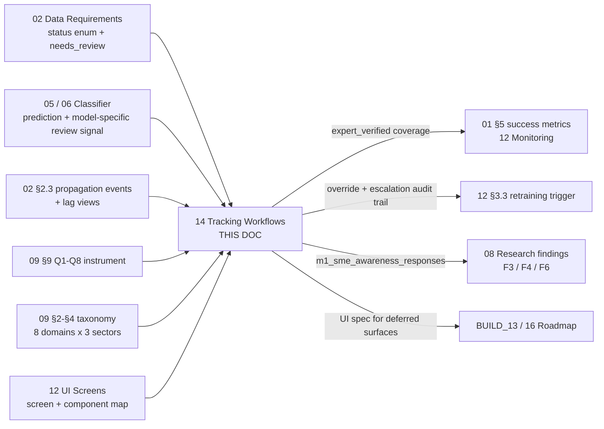
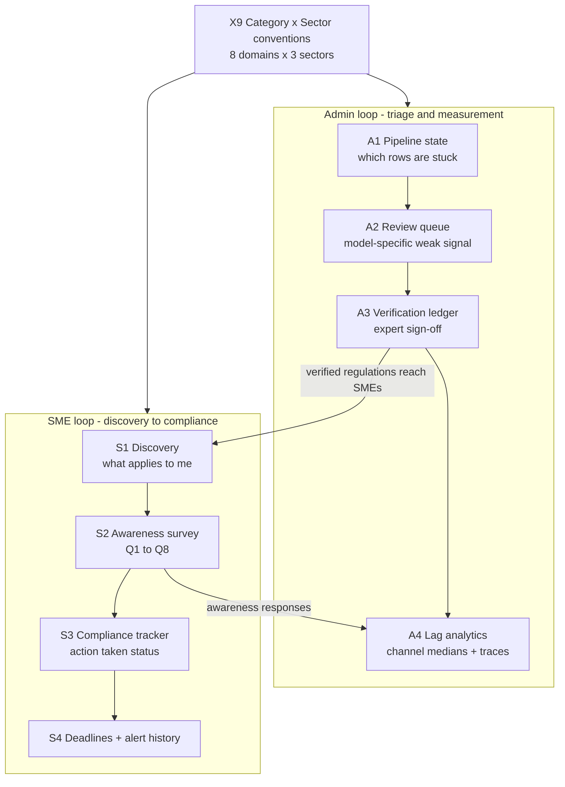

# 14 — Module 1: Tracking Workflows

> **Cross-references:** [02_M1_Data_Requirements.md](02_M1_Data_Requirements.md) · [08_M1_Full_System_Architecture.md](08_M1_Full_System_Architecture.md) · [09_M1_Annotation_Guidelines.md](09_M1_Annotation_Guidelines.md) · [12_M1_Monitoring_Maintenance.md](12_M1_Monitoring_Maintenance.md) · [12_UI_Screens_and_Loading.md](../frontend/SETUP/12_UI_Screens_and_Loading.md)
> **Code map:** [15_M1_Folder_Reference.md](15_M1_Folder_Reference.md) — `frontend/app/(admin)/admin/regulations/`, `frontend/app/(app)/surveys/`, `frontend/components/ui/domain-badge.tsx`
> **Consolidation note (2026-07-29):** this document now carries the full content previously split across `14_M1_1_Admin_Pipeline_State_Tracking`, `14_M1_2_Admin_Review_Queue_Triage`, `14_M1_3_Admin_Expert_Verification`, `14_M1_4_Admin_Lag_Analytics`, `14_M1_5_SME_Regulation_Discovery`, `14_M1_6_SME_Awareness_Survey`, `14_M1_7_SME_Compliance_Action_Tracking`, `14_M1_8_SME_Deadline_Alert_History`, and `14_M1_9_Category_Sector_Workflows`. Those nine files have been retired; every procedure, decision table, worked example, failure mode, and acceptance criterion from them lives below.

> [!warning] Truth-ledger sync — 2026-08-02
> Tracking surfaces are current — §Classifier review already reflects LinearSVC margins and nullable confidence.
> One thing to keep visible on the admin surfaces: a review queue reporting `mode='disabled'` means **no threshold has been configured**, not that nothing needs review.
>
> **Canonical record:** [[final/works/11_CLASSIFIER_FREEZE_AND_INTEGRATION|11_CLASSIFIER_FREEZE_AND_INTEGRATION]] · [[18_M1_Dataset_And_Model_Lineage]] · `final/works/evidence/M1_OPERATING_EVIDENCE_2026-08-02.json`
> **Submitted-report copy:** [[final/report/Enigmatrix_Consolidated_Final_Report_FULL|Enigmatrix_Consolidated_Final_Report_FULL]] (Part I = group report, Part II = Module 1 dissertation).

---

## 0. Where This Document Sits in the Pipeline

The M1 backend describes a regulation's life as a state machine: a gazette is ingested → text extracted → classified → summarised → alerted → archived. The frontend docs map the screens that exist today. Neither answers the question a new contributor most often asks: **"As an admin, what do I do when a weak classifier signal lands? As an SME, what do I do when an alert arrives?"** This document is that missing layer — it maps the *verbs*, where [12_UI_Screens_and_Loading.md](../frontend/SETUP/12_UI_Screens_and_Loading.md) maps the *screens* and [02_M1_Data_Requirements.md](02_M1_Data_Requirements.md) maps the *tables*.

| | Stage | Produced by | What this document does with it | Handed to |
|---|---|---|---|---|
| **In** | `m1_regulations.status` — the six-value pipeline enum | [02_M1_Data_Requirements.md](02_M1_Data_Requirements.md) §2.1 | Renders it as a per-row `<StatusBadge>` and defines the admin triage loop over it | — |
| **In** | Classifier prediction + model identity + review signal (`decision_margin` or confidence) | [05_M1_Model_Architecture.md](05_M1_Model_Architecture.md) inference path, persisted per [02_M1_Data_Requirements.md](02_M1_Data_Requirements.md) §2.1 | Defines mode-aware review ordering and the confirm/override decision; LinearSVC confidence remains nullable | — |
| **In** | `m1_propagation_events` + the lag views | [02_M1_Data_Requirements.md](02_M1_Data_Requirements.md) §2.3, §3.3 | Turns them into the four analytics cards and the per-regulation propagation timeline | — |
| **In** | The Q1–Q8 awareness instrument | [09_M1_Annotation_Guidelines.md](09_M1_Annotation_Guidelines.md) §9 | Delivers it through the survey wizard as a per-regulation flow | — |
| **In** | 8 domains × 3 sectors taxonomy | [09_M1_Annotation_Guidelines.md](09_M1_Annotation_Guidelines.md) §2–§4 | Fixes label, colour, URL-state, and sort conventions for every surface — §10 | — |
| **In** | Screen inventory + component catalogue | [12_UI_Screens_and_Loading.md](../frontend/SETUP/12_UI_Screens_and_Loading.md) | Names the exact screen each workflow runs on | — |
| **Step** | Admin triage loop A1 → A2 → A3 | *this document* §2–§4 | Stuck-row detection, low-signal clearing, expert sign-off | — |
| **Step** | Admin measurement loop A4 | *this document* §5 | Per-channel lag, propagation traces, weekly trend | — |
| **Step** | SME loop S1 → S2 → S3 → S4 | *this document* §6–§9 | Discovery, survey, compliance status, deadline and alert history | — |
| **Out** | `expert_verified` coverage ≥ 30 % | — | — | [01_M1_Research_Problem.md](01_M1_Research_Problem.md) §5 success metrics; [12_M1_Monitoring_Maintenance.md](12_M1_Monitoring_Maintenance.md) §1 |
| **Out** | Override + escalation decisions in `audit_log` | — | — | [12_M1_Monitoring_Maintenance.md](12_M1_Monitoring_Maintenance.md) §3.3 — the retraining trigger |
| **Out** | `m1_sme_awareness_responses` rows | — | — | [08_M1_Full_System_Architecture.md](08_M1_Full_System_Architecture.md) §research findings F3 / F4 / F6 |
| **Out** | Per-surface UI specification for the deferred pages | — | — | [../BUILD_PLAN/BUILD_13_Admin_and_Annotation.md](../frontend/BUILD_PLAN/BUILD_13_Admin_and_Annotation.md); [16_M1_Development_Roadmap.md](16_M1_Development_Roadmap.md) §tracking-workflow surfaces |



**Why the ordering matters.** The nine surfaces below are not an arbitrary list; they are ordered by the data's own dependency chain, and building them out of order produces empty screens. Nothing can be triaged that has not been classified, so A2 depends on Stage D; nothing can be verified that has not been triaged, so A3's coverage statistic is meaningless before A2 clears the low-confidence backlog; and no lag analytics exist until `m1_propagation_events` has accumulated enough observations to clear the 30-per-channel minimum in §5.4. The SME side has the same property — discovery (S1) has to name a regulation before the survey (S2) can ask about it, the survey has to record Q7 before the compliance tracker (S3) has anything to show, and the deadline page (S4) is a join of S3's status against the alert log.

The cross-cutting reference (X9, §10) sits outside that chain and *precedes* all of it. Every one of the eight surfaces renders the same eight domain codes and three sector codes; if the label, colour, or URL encoding is decided per-surface, the platform ends up with three spellings of `grocery_retail` and an admin filter that does not round-trip into an SME deep-link. That is why §10 is a convention contract rather than a workflow.

---

## Abstract

This document specifies the nine tracking surfaces of Module 1 — the procedures by which an admin and an SME follow regulatory information through the platform UI. Four are admin-facing (pipeline-state tracking, needs-review queue triage, expert-verification ledger, lag analytics), four are SME-facing (regulation discovery, awareness-survey participation, compliance/action tracking, deadline and alert history), and one is a cross-cutting convention reference for the 8-domain × 3-sector taxonomy as it appears across all eight.

Each surface section gives the user procedure, the design decisions with the trade-off that actually settled each one, and a worked example against the seeded demo regulations (`VAT_2024_AMD`, `EPF_2024_RATE`, and the multi-pin adapter case from [02_M1_Data_Requirements.md](02_M1_Data_Requirements.md) §worked examples). Failure modes are consolidated in §11, acceptance criteria in §12, and the shipped-versus-deferred code map in §13.

**Implementation status:** 🟡 Partial — of the eight tracking surfaces, 3 are ✅ shipped end-to-end (A2, A3, S2), 3 are 🟡 partial (A1, S1, S3), and 2 are 🔲 deferred (A4, S4). X9 is a reference whose conventions are already shipped in the component layer. Every section below carries the surface's own status marker verbatim.

> **Reading the markers.** `✅` = the workflow runs end-to-end in the UI today. `🟡` = the data plus some UI exists but a key surface is missing. `🔲` = backend-only today; the section describes the *intended* UI for when BUILD_07 / BUILD_13 lands it. Where a section describes an unbuilt page, the sub-heading says so explicitly, so a reader never mistakes an intended UI for a shipped one.

---

## 1. The Two Personas and the 8+1 Surfaces

**Why the split is by persona rather than by screen.** The same screen can serve both roles — `/admin/regulations` is the pipeline monitor *and* the verification list — and the same workflow can span three screens. Organising by persona keeps each procedure readable as a single narrative, which is what a new contributor actually needs; organising by screen would fragment the verification workflow across two sections and hide the fact that A1 and A3 are two different jobs done on the same table.

### 1.1 The Workflow Map

| # | Surface | Audience | Status | Detail in |
|---|---|---|---|---|
| A1 | Pipeline-state tracking — Stage A→F status machine | Admin | 🟡 Partial | §2 |
| A2 | Needs-review queue triage | Admin | ✅ Shipped | §3 |
| A3 | Expert-verification ledger | Admin | ✅ Shipped | §4 |
| A4 | Lag analytics + propagation tracker | Admin | 🔲 Deferred | §5 |
| S1 | Regulation discovery — sector + region filter | SME | 🟡 Partial | §6 |
| S2 | Awareness survey participation — Q1–Q8 | SME | ✅ Shipped | §7 |
| S3 | Compliance / action-taken status per regulation | SME | 🟡 Partial | §8 |
| S4 | Deadline + alert delivery history | SME | 🔲 Deferred | §9 |
| X9 | Category × Sector workflows — cross-cutting reference | Both | Reference | §10 |



Note the two cross-links. Verification (A3) is what releases a regulation into the SME's discovery surface with an expert's name attached, and the awareness survey (S2) is what feeds the SME-lag card in the admin analytics (A4). The loops are not independent tracks; they close on each other.

### 1.2 How an Admin Spends a Day with M1

The admin's M1 day-to-day is a triage loop. Drawn from the screen map in [12_UI_Screens_and_Loading.md](../frontend/SETUP/12_UI_Screens_and_Loading.md) plus the M1 backend state machine, the steady-state procedure looks like:

```text
[09:00] Open /admin/regulations
         ↓ apply filter "unverified=true" + sort by created_at DESC
         ↓ see the overnight ingestion batch (Stage A → C complete; Stage D pending review)
[09:10] Pick the top row → /admin/regulations/[id]/edit
         ↓ review classifier's change_category + sectors against the regulation summary
         ↓ if confident → click "Verify" → status flips, audit-log row written  [A3]
         ↓ if low-signal / wrong category → classifier triage + save  [A1, A2]
[10:30] Open /admin/regulations/[id]/flow  for any regulation that has a survey flow
         ↓ verify the M1→M2→M3 branching is wired
[11:30] Open /admin/m1/pipeline/classifier-review
         ↓ read mode + threshold before interpreting queue depth
         ↓ in LinearSVC mode, triage lowest decision margins first  [A2]
[14:00] (Once shipped) Open /admin/m1/analytics
         ↓ check lag p50 by channel; investigate if any channel slipped > 1 day vs last week  [A4]
[16:00] Open /admin/activity-log
         ↓ scan for verify / archive events; ensure expert_verified coverage trending toward 30%
```

The regulation flow and A2 classifier triage are shipped today. The A4 analytics line remains 🔲 — §5 documents that target so the UI lands consistent with the backend invariants rather than being designed from scratch under deadline pressure.

### 1.3 How an SME Spends a Week with M1

The SME's M1 cadence is *not* daily — it is "when a deadline approaches" or "when something new lands". That difference in rhythm is the reason the SME surfaces are built around pull (a dashboard widget the SME visits) rather than push (a queue the SME must clear). The procedure:

```text
[Monday morning] /dashboard
                  ↓ "Pending regulations" widget shows up to 3 sector-relevant cards  [S1, S3]
                  ↓ "Survey progress" stat shows 7/9 questions answered
[Click a card] → /surveys/regulation/[id]
                  ↓ unified M1→M2→M3 wizard scoped to that regulation
                  ↓ answer Q1–Q7 awareness questions + M2 knowledge + M3 vulnerability  [S2]
[After submit]   /surveys/history
                  ↓ see the completed session row; status pill = completed
                  ↓ scan recent runs to confirm action-taken on prior regulations  [S3]
[Later — once shipped] /portal/m1/deadlines
                  ↓ deadline countdown widget for the regulations they've engaged with  [S4]
                  ↓ alert-history table — every email/SMS sent to this SME for M1
```

S1 and S2 are shipped, with S1 missing the sector-applicability filter. S3 is captured in survey responses but has no dedicated tracker page. S4 is fully deferred.

### 1.4 The Two Readers of Each Section

Each surface section below serves two reader roles — the *user* (the admin or SME going through the procedure) and the *implementer* (the frontend dev building or maintaining the surface). The convention that separates them:

- **Detailed process** is the user procedure — verbs, no jargon, the sequence a person actually performs.
- **Design decisions** and the criteria in §12 are for the implementer — component picks, loading-state contracts, accessibility notes.
- **Worked example** is a concrete walkthrough using the seeded demo regulations (`VAT_2024_AMD`, `EPF_2024_RATE`, the multi-pin adapter case from [02_M1_Data_Requirements.md](02_M1_Data_Requirements.md) §worked examples).

Keeping the two readers separated in the prose matters because they disagree about what is important: the user does not care that the drawer is 480 px wide, and the implementer cannot ship from a description that stops at "the admin reviews the row."

---

## 2. A1 — Admin Pipeline-State Tracking

> **Implementation status:** 🟡 Partial — status field exists on every regulation row; admin list surfaces it in the table; no dedicated stage-by-stage dashboard yet.

### 2.1 Why This Surface Exists

A regulation moves through six pipeline stages (`ingested → extracted → classified → summarized → alerted → archived`) defined in [02_M1_Data_Requirements.md](02_M1_Data_Requirements.md) §2.1. At any moment, an admin needs to answer two questions: *which regulations are stuck mid-pipeline?* and *what stage is the bottleneck right now?*

**What breaks without it.** The pipeline fails silently. A dead Celery extraction worker does not raise an alert on any SME-facing surface — it simply means no new regulation reaches `classified`, and the first symptom is an SME asking why they were never told about a gazette from three weeks ago. A1 is the surface that converts a silent backlog into a visible one, which is why it is the daily-triage entry point and what the admin opens first in the morning.

### 2.2 Detailed Process — Today

Today the workflow runs through `/admin/regulations` with the status surfaced as a column on the table.

1. **Open the regulation bank.** Navigate to `/admin/regulations`. The page renders a polished `<Table>` (per [12_UI_Screens_and_Loading.md](../frontend/SETUP/12_UI_Screens_and_Loading.md) §3.1) with per-row `status` rendered as a `<StatusBadge>` (`components/ui/status-badge.tsx` — colour-coded success / warning / pending / error / neutral).
2. **Filter by status.** Use the vertical filter rail on the left to apply `Status = "ingested"` (or any pipeline stage). The URL reflects the filter (`?status=ingested`). Sort by `created_at DESC` to see the most recent stuck items first.
3. **Inspect a single regulation.** Click a row → `/admin/regulations/[id]/edit`. The detail page shows the regulation's current stage in the header band plus the next expected transition.
4. **Manual transition.** Where the admin can advance a stage manually — for example forcing a re-classify when the auto-pipeline is unhealthy — the action lives in the row's `<RowActions>` menu or as a primary button on the detail page.
5. **Bulk re-trigger** (advanced). For systemic issues — say, "yesterday's batch all stuck at `extracted` because the classifier was down" — the admin selects multiple rows and clicks "Re-classify selected" in the bulk-action bar. The action enqueues a Celery task per row; the Celery + Scrapy interaction is specified in [03_M1_Data_Collection.md](03_M1_Data_Collection.md) §6.1.

**Why the bulk path exists at all.** Single-row re-triggering is adequate for a one-off failure but useless for the failure mode that actually occurs, which is an infrastructure outage taking out an entire overnight batch. The bulk action is the recovery tool for a class of incident, not a convenience.

### 2.3 Intended Workflow — the Stage Dashboard

> 🔲 **Not yet built.** Once BUILD_13 ships the stage dashboard, an admin opens `/admin/m1/pipeline` for a Sankey-style view of how many regulations sit in each stage right now. Each block is clickable and filters the regulation list to that stage. This section documents the *target*.

The dashboard's value over the status column is that it shows *shape*, not rows: 42 items at `ingested` and 0 at `extracted` is instantly a broken extraction worker, whereas the same fact read off a filtered table requires the admin to already suspect where to look.

### 2.4 Design Decisions

| Option | Trade-off | Decision | When to reconsider |
|---|---|---|---|
| Status column on the existing `/admin/regulations` list (chosen) | Uses the regulation bank polish — filter rail, pagination, search — for free | ✅ Ship-fast — the column already exists | Once the regulation count exceeds ~500 active rows, a dedicated dashboard becomes more useful |
| Dedicated `/admin/m1/pipeline` Sankey-style dashboard | Best at-a-glance bottleneck view | 🔲 Deferred to BUILD_13 | After backend Stage A–F metrics are exposed in `m1_pipeline_audits` |
| Stage transitions as a separate `m1_regulation_stage_log` table | Audit-grade transition history | ❌ Audit log already captures every `status` field change — no new table needed | If we need ms-precision transitions for SLA reporting |
| Real-time push via websocket of status changes | Live dashboard | ❌ Polling every 30 s is sufficient for this workflow | If admins start reporting they want sub-second freshness |

**The trade-off that actually decided it.** Reusing the regulation-bank list was chosen over a purpose-built dashboard because the *data* answer and the *action* answer live in the same place: an admin who spots a stuck stage immediately wants to select those rows and re-trigger them. A separate dashboard would have shown the bottleneck and then bounced the admin back to the list to act on it. The dashboard only becomes worth its own page when the row count makes the list unreadable — hence the ~500-row reconsideration trigger.

**Why no stage-log table.** The tempting design is a dedicated transition-history table, and it was rejected because the audit log already records every `status` change with actor and timestamp. A second table would be a second source of truth for the same fact, and the two would eventually disagree. The only requirement that would justify it is millisecond-precision SLA reporting, which nothing downstream currently asks for.

### 2.5 Worked Example — Monday-Morning Triage

A triage on a hypothetical overnight batch:

```text
09:02 — admin opens /admin/regulations?status=ingested&sort=created_at:desc
         42 rows returned; all from the overnight Scrapy run; none have advanced
09:03 — admin spots that none reached "extracted" → Celery extraction worker is dead
09:04 — admin pages on-call (Slack #enigmatrix-ml); confirms Tesseract dependency missing
09:30 — on-call redeploys with the language pack; worker comes back up
09:35 — admin clicks "Refresh" → all 42 rows now at status="extracted"; 14 already at "classified"
09:40 — admin moves to the verification workflow (§4) for the 14 classified rows
```

The admin never had to write a SQL query — the table filter plus status badges surface the bottleneck. Note where the example ends: at the handoff into §4. A1 detects and unblocks; it does not decide anything about a regulation's content. That separation is what keeps the morning loop short.

---

## 3. A2 — Admin Review-Queue Triage

> **Implementation status:** ✅ Shipped — `/admin/m1/pipeline/classifier-review` consumes the backend's explicit review mode, handles LinearSVC decision margins and nullable confidence, and lets an admin confirm or override the eight-domain category.

### 3.1 Why This Surface Exists

The production TF-IDF + LinearSVC classifier produces an uncalibrated decision margin, not a probability. The review endpoint therefore declares its mode and threshold: `margin` for LinearSVC, `confidence` for a probability-capable backend, or `disabled` when no compatible threshold is configured. The page orders the weakest configured signal first and never turns a margin into a percentage.

**What breaks without mode awareness.** An empty queue can mean either “no row falls below the configured threshold” or “review is disabled.” Conflating those states creates a false clean bill of health. Likewise, rendering a LinearSVC margin as `42%` invents a probability that the model never produced. The shipped page makes both semantics visible.

**Ordering constraint.** A2 follows classification and precedes expert sign-off. It can rank only the signal defined by the row's model/backend, so model name and review mode are part of the contract rather than decoration.

### 3.2 Detailed Process

1. **Open the queue.** Navigate to `/admin/m1/pipeline/classifier-review`.
2. **Read the contract first.** The three summary cards show queue depth, active mode, and threshold. If mode is `disabled`, the page explains that a LinearSVC margin threshold has not been configured.
3. **Inspect a row.** Each row shows rank, regulation title/link, gazette number, source, classified date, model name, current category, and the active signal. In margin mode, confidence may appear as `n/a`; that is correct.
4. **Open source context.** Follow the trace link when the category cannot be judged from title/metadata alone.
5. **Decide.** Keep the existing category and **Confirm**, or choose another frozen domain and **Save**. The mutation refreshes the queue and reports success/failure.
6. **Continue by rank.** Pagination preserves the server-provided weakest-first order.

The current page intentionally does not invent top-3 probabilities for LinearSVC. `class_scores` and the second category may support a richer future detail view, but the present production obligation is more basic: preserve the distinction between an uncalibrated margin and a probability.

**What this step produces, and who consumes it.** Confirm/override decisions update the category through the backend review contract and belong in the audit trail. The override stream is also useful evidence for threshold yield and future retraining; a rising override rate on one domain is a stronger drift signal than nullable confidence.

### 3.3 Design Decisions

| Option | Trade-off | Decision | When to reconsider |
|---|---|---|---|
| Dedicated `/admin/m1/pipeline/classifier-review` page | Single-purpose surface with queue/mode/threshold visible | ✅ Shipped | Add filters only after live queue volume shows which ones matter |
| Explicit `disabled` state | Prevents an unconfigured threshold from looking like an empty clean queue | ✅ Shipped | Never collapse into the empty state |
| Mode-aware weakest-first order | Margin and confidence are different signal types | ✅ Shipped | Add severity as a secondary key only after evidence supports it |
| Per-row confirm/override | Safer than bulk category writes and easy to audit | ✅ Shipped | Consider bulk confirm only with explicit audit and mixed-category protection |
| Trace link instead of invented probability detail | Keeps source evidence available without misrepresenting LinearSVC | ✅ Shipped | Add class-score detail when its semantics and UX are tested |

**Why per-row decisions remain the safe default.** Bulk-confirm and bulk-override look symmetrical and are not. Bulk-override writes a human label across N rows from one glance and can contaminate the next training corpus. The cost of a wrong write, not convenience, keeps the shipped action per-row.

### 3.4 Worked Example — Morning Queue Clear

```text
09:15 — admin opens /admin/m1/pipeline/classifier-review
         Mode card says "Margin review"; threshold shows 0.40
         Queue depth is 12; lower decision margins rank first
09:16 — top row shows margin 0.182 and confidence n/a
         Admin opens the trace and confirms the source text is a tax-rate change
09:17 — category selector changes SECTOR_SPECIFIC → TAX_RATE_CHANGE; Save
         Success toast appears and the queue refreshes
09:18 — next row already has the correct category; Confirm
09:27 — admin records the day's queue yield and override count for threshold review
```

The example preserves the key semantic: `0.182` is a ranking margin, not 18.2% confidence. Live queue yield and override rate are the evidence needed to decide whether the candidate 0.40 threshold is operationally useful.

---

## 4. A3 — Admin Expert Verification

> **Implementation status:** ✅ Shipped — Verify button + `<VerificationBadge>` on every regulation row; bulk-verify action on the list; audit-log writes verified by Session 14.

### 4.1 Why This Surface Exists

Production-classified regulations carry the classifier's prediction, not an expert's. The verification workflow is the formal sign-off where a CA / Attorney admin says "yes, this category plus these sectors are correct" — flipping `expert_verified = true`, recording who verified, and emitting an `audit_log` event.

**What breaks without it.** A platform that tells an SME "this VAT change applies to you" on the strength of a model's softmax output is making a compliance claim it cannot stand behind. Verification is what converts a prediction into an assertion with a named human attached. The coverage-tracking widget answers the SLA question from the success metrics in [01_M1_Research_Problem.md](01_M1_Research_Problem.md) §5: ≥ 30 % of production regulations expert-verified.

**Ordering constraint.** Verification comes after triage (§3), not before. Verifying a row that is still in the low-confidence queue means the expert is doing the triage work by hand, one row at a time, without the top-3 display — the slowest possible ordering.

### 4.2 Detailed Process

This workflow runs across two surfaces — single-row verification on the regulation detail page, and bulk verification on the regulation list.

#### 4.2.1 Single-Row Verification

1. **Open the detail page.** `/admin/regulations/[id]/edit` (per [12_UI_Screens_and_Loading.md](../frontend/SETUP/12_UI_Screens_and_Loading.md) §3.2). The header band shows the `<VerificationBadge>` — red "Unverified" or green "Verified" with name and timestamp.
2. **Review the classification.** Scroll the form — Section 1 (Identity and classification) shows the `change_category` plus sectors. Section 4 (Localised content) shows the trilingual title and summary. The right-rail "Preview as SME" pane renders the `<RegulationContextCard>` exactly as the SME will see it.
3. **Override if needed.** Edit any field; the form is unrestricted for admins. The sticky save bar at the bottom shows a "Save changes" button.
4. **Click "Verify".** The button lives next to the save bar. On click:
   - Backend: `PATCH /api/v1/m1/regulations/{id}/verify { verified_by: "{ca_name}" }`.
   - The badge flips to green; the verifier's name and timestamp render.
   - Audit-log row written: `event_type='regulation.verified'`, `actor=current_user.email`, `old_value` / `new_value` showing `expert_verified false → true`.
5. **Toast confirmation.** A `toast(...)` "Verified by {name}" — dismissible.

**Why the "Preview as SME" pane is part of the verification step and not a separate tool.** The expert is not verifying a database row; they are verifying what an SME will read. A category that is technically correct but renders with a misleading badge or a missing Sinhala summary is still a defect, and the only moment anyone reliably notices is when the reviewed content is shown in its delivered form.

#### 4.2.2 Bulk Verification

1. **Open the regulation bank list.** `/admin/regulations`.
2. **Select rows.** Each row has a checkbox; the sticky bulk-action bar at the bottom appears when ≥ 1 row is selected.
3. **Click "Verify selected".** A modal prompts for the verifier's name — defaults to the current user's name; can be overridden if a CA is signing off for a batch they reviewed.
4. **Confirm.** The N rows verify in a single backend call: `POST /api/v1/m1/regulations/bulk-verify { ids: [...], verified_by: "{ca_name}" }`. Toast: "Verified N regulations".
5. **List refreshes.** Each verified row's badge flips green. The list-level "Verified coverage" stat at the top-right of the page header recomputes — for example `47 / 134 (35 %) verified`.

**Why bulk-verify is allowed here when bulk-override was rejected in §3.3.** The distinction is the same one: verification asserts that an existing label is right, and the expert has typically just read those rows one by one on the detail page before returning to the list. Bulk-verify compresses the *recording* of a decision already made. Bulk-override would compress the decision itself.

#### 4.2.3 Coverage Tracking

The list page renders a small `<Stat>` card or inline counter showing the running coverage percent. It refreshes every time the table re-fetches — every 30 s plus after every mutation. When coverage drops below 30 %, the counter renders in `destructive` colour with a tooltip linking to the success-metric definition.

**Why the number is on the working surface rather than a dashboard.** Coverage is a metric the admin can move only while they are on the list; putting it on a separate reporting page would surface it at exactly the moment nobody can act on it.

### 4.3 Design Decisions

| Option | Trade-off | Decision | When to reconsider |
|---|---|---|---|
| Single button on detail page (chosen) | Simple, discoverable | ✅ Shipped — most natural sign-off surface | Never remove |
| Bulk-verify on list (chosen) | Throughput when a CA reviews 20 rows in one session | ✅ Shipped | If bulk-verify is misused — admin verifying without review — gate behind an "I reviewed each row" checkbox |
| Verifier name override per action | Allows recording the actual CA's name | ✅ Default current user; admin can override | Never remove |
| Coverage stat inline on the list | Always-visible — admin sees it without navigating | ✅ Shipped | Add a dashboard-level rollup if coverage tracking becomes a weekly-review concern |
| Two-step verify — preview then confirm | Prevents fat-finger | ❌ Single click — admins find double-clicks annoying | If error rate (verify-then-immediately-unverify) exceeds 5 % |
| Unverify action | Allows mistakes to be undone | ✅ Available as `<RowActions>` "Unverify" — same audit trail | Never remove |

**Why the verifier name is a separate field from the acting user.** In practice a chartered accountant reviews a batch and an operations admin records the sign-off. Collapsing the two into `current_user` would put the wrong name on a professional assertion. The field defaults to the acting user precisely so that the common case costs nothing, while the accountable case is expressible.

**Why single-click verify, given that unverify exists.** The two-step confirm was rejected because the reversal path is cheap and fully audited: an accidental verify is undone by an Unverify that leaves both events in the log. Paying a confirmation dialog on every one of dozens of daily actions to prevent an error that costs one click to fix is the wrong trade — hence the 5 % churn rate as the tripwire that would reverse the decision.

### 4.4 Worked Example — CA-Led Batch Review

Using the seeded demo regulations:

```text
10:00 — CA "K. Perera (FCA)" logs in as admin
         opens /admin/regulations?domain=VAT&needs_review=false&is_verified=false
         filters down to 14 VAT regulations awaiting expert sign-off
10:05 — CA opens VAT_2024_AMD detail page
         reviews classifier output: change_category=TAX_RATE_CHANGE ✓
         reviews sectors: [grocery_retail, food_service, general_retail] ✓ (economy-wide VAT change)
         clicks "Verify" → green badge appears with "Verified by K. Perera at 2026-05-14 10:06"
         audit_log row: event_type='regulation.verified', actor='kperera@enigmatrix.lk'
10:15 — CA spot-checks 12 more rows individually; finds all correct
10:25 — CA returns to the list, selects the remaining 12 rows, clicks "Verify selected"
         modal prompts: verifier_name = "K. Perera (FCA)" (defaulted from user record)
         CA confirms → 12 rows verify in one batch call
10:26 — list refreshes; coverage counter goes from 31% → 38%
```

Throughout, the `expert_verified_by` and `expert_verified_at` columns from [02_M1_Data_Requirements.md](02_M1_Data_Requirements.md) §2.1 are populated, and the audit log captures every action. The sector check at 10:05 is the economy-wide rule from [09_M1_Annotation_Guidelines.md](09_M1_Annotation_Guidelines.md) §4 — a VAT change reaches every shop with a till, so all three sectors are correct rather than over-tagged.

---

## 5. A4 — Admin Lag Analytics and Propagation Tracker

> **Implementation status:** 🔲 Deferred — backend ingests `m1_propagation_events` rows on every channel observation and exposes them via `/api/v1/m1/analytics/lag` + `/api/v1/m1/analytics/channel-effectiveness`, but no admin UI consumes them. This section describes the intended dashboard.

### 5.1 Why This Surface Exists

The four lag findings F1–F4 in [08_M1_Full_System_Architecture.md](08_M1_Full_System_Architecture.md) §research findings are the platform's empirical research contribution. The admin lag dashboard is the *operational* surface for the same data: per-channel median lag, propagation traces per regulation, drill-down into which regulations are missing channel coverage, and trend lines week on week.

**What breaks without it.** Nothing breaks — which is precisely the problem. The data is being collected and is queryable, so the failure is not an outage but a permanent tax: every question about lag costs a Jupyter notebook session, and questions that cost a notebook session mostly do not get asked. The dashboard is the deferred surface that, once shipped, lets the project answer in 30 seconds what today requires a context switch into the research environment.

**Ordering constraint.** A4 is the last admin surface to become useful, because it needs volume rather than correctness. The 30-observations-per-channel minimum in §5.4 means the dashboard is empty until the watchers in Phase 4 have been running for weeks.

### 5.2 Detailed Process

> 🔲 Intended workflow — design not yet locked.

#### 5.2.1 Entry Point — `/admin/m1/analytics`

The page opens to four cards stacked top-to-bottom, designed to answer the four findings F1–F4 in order:

1. **Card 1 — Median lag by channel (F1 + F2).** A horizontal bar chart with one bar per channel, sorted ascending by median lag. Channel groups: `portal_*` (government portals), `news_*` (RSS news outlets), `alert_delivery` (Enigmatrix alerts as comparison), `government_sms` (when available). Y-axis = channels, X-axis = lag days. Click a bar → drill into the per-regulation lag table for that channel.
2. **Card 2 — SME awareness lag (F3).** Same bar shape but per district (`urban / peri-urban / rural`) with sub-bars per sector. Drill-down → respondent-level (anonymised) lag table.
3. **Card 3 — Channel effectiveness ranking (F4).** A ranked table of channels with columns: rank, channel, p50 lag, p95 lag, sample size, weekly change (▲/▼). The header has a toggle: "this week" vs "this month" vs "all time".
4. **Card 4 — Propagation tracker (per regulation).** A search-pickable per-regulation timeline view. Pick a regulation → see a horizontal timeline with each channel's `first_seen_at` plotted, plus the SME-awareness-survey responses overlaid. The visualisation is what the M1 backend docs call the T0–T9 diffusion timeline from [01_M1_Research_Problem.md](01_M1_Research_Problem.md) §8.

**Why the cards are ordered to match F1–F4 rather than by usage frequency.** The dashboard doubles as the operational mirror of the thesis findings, and keeping the two in the same order means a number on screen can be traced to a finding without a lookup. When the research narrative and the operational surface disagree about structure, one of them silently becomes stale.

#### 5.2.2 Filter Controls

At the top of the page:

- Time range: last 7 days / 30 days / quarter / all
- Sector filter (multi-select)
- Category filter (multi-select)
- Verified-only toggle — excludes `expert_verified=false` rows from analytics

**Why a verified-only toggle rather than a permanent filter.** Unverified rows carry the classifier's label, so including them mixes measurement error into the category dimension. But excluding them permanently would hide most of the corpus while coverage sits near 30 %. Making it a toggle forces the analyst to make the choice consciously, and the default state is what determines whether a number is research-grade or operational.

#### 5.2.3 Drill-Downs

Every chart is clickable and opens a slim `<Sheet>` with the underlying data table plus a CSV export button. The CSV exports the same data the research notebooks consume.

**Why the CSV matters more than it looks.** It is the reproducibility bridge: a thesis chart and a dashboard chart that were produced from the same export cannot silently diverge. Without it, the dashboard becomes a second, unversioned analysis pipeline.

### 5.3 Design Decisions

| Option | Trade-off | Decision | When to reconsider |
|---|---|---|---|
| Dedicated `/admin/m1/analytics` page (chosen target) | Single surface for all 4 findings | 🔲 Target — BUILD_13 | If analytics use becomes a daily power-user workflow, split into per-finding pages |
| Recharts as chart library | Already in the stack — used in `/risk` per [12_UI_Screens_and_Loading.md](../frontend/SETUP/12_UI_Screens_and_Loading.md) §2 | ✅ Recharts | If we need draggable / zoom-able timelines, evaluate Visx or D3 directly |
| Server-rendered cards with `loading.tsx` streaming | Each card streams independently | ✅ Streaming | If a card becomes interactive — a filter that reshapes the chart — go client-side |
| CSV export per drill-down | Reproducibility for thesis | ✅ Ship — small effort, large value | Never remove |
| Live web-socket updates | Always-fresh dashboard | ❌ Not needed — propagation data refreshes hourly | If admins request sub-minute freshness |
| Per-channel sparkline weeks (mini-trend) | Adds noise at MVP | ❌ Skip MVP; add post-launch if requested | After 3 months of production data |

**Why Recharts, when a timeline chart is the hardest card.** The propagation tracker is the one visualisation that would genuinely benefit from D3 or Visx. It still lost, because adding a second charting library to render one card costs bundle size, a second set of theming rules, and a second accessibility story for every future chart. The reconsideration trigger is specific — draggable or zoomable timelines — because that is the capability, not the aesthetic, that would justify the second library.

**Why streaming cards rather than one page-level fetch.** The four cards hit different aggregate queries with very different costs; a single blocking fetch means the fastest card waits for the slowest. Streaming also degrades correctly under the slow-query failure mode in §11.

### 5.4 Worked Example — Research-Finding Spot-Check

> Intended flow, on the deferred page.

```text
Quarterly review — admin opens /admin/m1/analytics
Filter: last quarter, verified-only

Card 1 (median lag by channel) shows:
  alert_delivery       0.3 days     ◄═══════
  government_sms       1.0 days     ◄════════════
  portal_ird           5.2 days     ◄═══════════════════
  portal_epf           7.1 days     ◄═══════════════════════
  news_daily_ft       22.5 days     ◄═══════════════════════════════════
  news_lankadeepa     27.0 days     ◄═══════════════════════════════════════
  news_virakesari     31.8 days     ◄══════════════════════════════════════════
  peer_referral       48.2 days     ◄══════════════════════════════════════════════

Card 4 (propagation tracker) — admin picks VAT_2024_AMD:
  gazette         | 2024-01-01 (T0)
  portal_ird      | 2024-01-09 (+8 days)
  news_daily_ft   | 2024-01-23 (+22)
  news_lankadeepa | 2024-02-03 (+33)
  sme_aware_50pct | 2024-02-18 (+48)
  alert_delivery  | 2024-01-01 (+0 — same-day to subscribed SMEs)

Click portal_ird bar → drill table shows all 27 regulations seen on the IRD portal last quarter
  Sortable by lag DESC → identifies 3 regulations the IRD took > 14 days to post
  CSV export → feeds the F1 thesis chapter
```

The dashboard makes the same numbers the research notebook computes available without a notebook context-switch. The drill on `portal_ird` is the shape of the workflow that justifies the page: an aggregate raises a question ("why is the IRD median 5.2 days?"), and the answer is three specific regulations — findable in two clicks, and otherwise a half-hour query.

---

## 6. S1 — SME Regulation Discovery

> **Implementation status:** 🟡 Partial — `/regulations` list + dashboard "Pending regulations" widget are shipped; the sector-applicability filter that the SME *would* expect is deferred.

### 6.1 Why This Surface Exists

An SME wants to answer one question: *which of the ~500 active regulations actually apply to my business?* Today the platform makes a partial answer — the dashboard's "Pending regulations" widget surfaces sector-relevant items via the backend filter, a server-side join on `m1_regulation_sectors` and the SME's `primary_sector`. The full discovery surface — sticky filter rail, applicability score, "save filter" affordance — is deferred.

**What breaks without it.** The awareness gap this module exists to close reappears inside the platform. A shop owner who opens a list of 500 regulations and cannot tell which twelve are theirs is in the same position as a shop owner reading the gazette. Discovery is the surface that makes the classification work visible as a benefit rather than as a catalogue.

**Ordering constraint.** S1 must precede S2: the survey is *per regulation*, so something has to name the regulation first. This is why the shipped half of S1 — the dashboard widget — was built before the full list, since a three-card recommendation is enough to start a survey session.

### 6.2 Detailed Process — Today (✅ Shipped)

1. **Open the dashboard.** `/dashboard`. The "Regulations awaiting your assessment" widget renders up to 3 `<RegulationCard>` instances (`components/surveys/regulation-card.tsx`) sourced from `GET /api/v1/dashboard/pending-regulations`.
2. **See what applies.** Each card shows: `regulation_short_code`, locale-aware title (with a "Showing English" badge if the SI/TA translation is missing), domain badge, severity badge, effective date. The card is clickable and routes to `/surveys/regulation/[id]`.
3. **"View all".** A small link → `/surveys?view=regulation` opens the surveys hub with the regulation tab pre-selected. Shows every pending regulation, paginated.
4. **Browse the full list.** `/regulations` (separate route) shows every active regulation, not just pending. Used as a reference catalogue rather than a triage queue.

**Why three cards and not ten.** The widget is a recommendation, not an inbox. Three is the number that fits above the fold on a phone and that a shop owner will actually read; a longer list converts the widget back into the catalogue it was meant to replace. The "View all" link exists so the ceiling is a display choice, not a data limit.

### 6.3 Detailed Process — Intended (🟡 What Is Missing)

> 🔲 Intended workflow — sector-applicability filter design not yet locked.

1. **Sticky filter chip bar** at the top of `/regulations`: chips for `Sector = grocery_retail`, `Region = Colombo`, `Status = applicable to me`, `Effective in next 30 days`, `Has my action?`. Clicking a chip toggles it; chips reflect in the URL (`?sector=grocery_retail&region=colombo&applicable=true`).
2. **Applicability score per row.** Each `<RegulationCard>` shows a small badge: `100 % applicable` (the SME's sector is in `affected_sectors` AND district matches), `50 % applicable` (sector match only), `economy-wide` (regulations that apply to all 3 study sectors). Computed client-side from the SME's profile plus the regulation's `affected_sectors[]`.
3. **Sort options.** Newest, earliest effective date, severity DESC, "most relevant to me" (applicability × severity).
4. **Save filter.** Power-user feature: save a filter set to the SME's profile so it is pre-applied on the next visit.

**Why an applicability *score* rather than a hard filter.** A binary "applies to me" filter would have to decide what to do with the 50 % case — sector match without district match — and either choice is wrong: hiding it loses a real obligation, showing it unlabelled misrepresents certainty. The score makes the partial match visible, which lets the SME apply local knowledge the platform does not have.

### 6.4 Design Decisions

| Option | Trade-off | Decision | When to reconsider |
|---|---|---|---|
| Dashboard widget (chosen) | One-glance recommendation | ✅ Shipped — top-of-page card on `/dashboard` | Never remove |
| Full `/regulations` list (chosen) | Browseable catalogue | ✅ Shipped — paginated table-cards hybrid | Never remove |
| Sector-applicability filter | Sharply narrows the list | 🟡 Target — backend supports it; UI deferred | Ship in BUILD_07 when sector-filter URL params are wired in the API client |
| Applicability score badge | Helps SMEs prioritise | 🟡 Target | Add when telemetry shows SMEs scroll the list without clicking |
| "Save filter" power-user feature | High value, low priority | ❌ Skip MVP | Add when ≥ 10 active SMEs request it |
| Client-side filtering | Snappy | ✅ Acceptable up to ~500 active regulations | If list grows past 1k rows, push filters server-side |

**Why client-side filtering survived review.** It is the wrong architecture at scale and the right one at 500 rows: the entire active set fits in a single fetch, filter toggles are instant, and there is no server round-trip to design, cache, or paginate around. The 1k-row trigger is where the payload cost starts to exceed the interaction benefit — and it is written down precisely because "we'll notice when it gets slow" is how a snappy list becomes a slow one.

### 6.5 Worked Example — Retail SME Discovery

Today's flow:

```text
Monday morning — SME opens /dashboard
Widget "Regulations awaiting your assessment" renders 3 cards:
  1. VAT_2024_AMD — VAT (severity 5, effective 2024-01-01)
  2. EPF_2024_RATE — EPF (severity 4, effective 2024-02-01)
  3. SLSI_ADAPTER — Product Standard (severity 3, effective 2026-08-01)

SME clicks card #1 → /surveys/regulation/VAT_2024_AMD-uuid → unified M1→M2→M3 wizard

(Later) SME wants the full list → clicks "View all" → /surveys?view=regulation
  sees the 3 cards above plus 2 more universal regulations
  no per-card "applies to me 100%/50%" badge yet (deferred)

(SME's actual flow ends here — 3-5 cards is enough.)
```

Intended (🟡):

```text
Same SME opens /regulations
Sticky filter bar pre-applies `sector = retail` + `applicable=true` from saved filter
  → list collapses from 47 active regulations to 12 retail-applicable
Each card shows applicability badge — 100 % for retail-specific, 50 % for cross-sector
Sort = "most relevant to me" → severity-weighted top first
Click card → same /surveys/regulation/[id] flow
```

Both flows converge on the same route into §7. That is deliberate: discovery is a set of alternative entry points into one survey path, not a parallel experience, so the deferred filter work cannot fork the downstream behaviour.

---

## 7. S2 — SME Awareness Survey Participation

> **Implementation status:** ✅ Shipped — `/surveys/regulation/[id]` runs the per-regulation flow, `/surveys/awareness` runs the standalone awareness instrument, `/surveys/history` tracks completed sessions.

### 7.1 Why This Surface Exists

The awareness survey is the *only* data-collection workflow in M1 today, and the entire RQ3 / RQ4 / F3 / F4 research relies on it. The instrument (Q1–Q8) is defined in [09_M1_Annotation_Guidelines.md](09_M1_Annotation_Guidelines.md) §9: 7 sector-tailored regulations plus 2 universal regulations = 9 question blocks per session, each capturing awareness date, channel, and action taken.

**What breaks without it.** The classifier can date a regulation's *publication*; only the survey can date an SME's *awareness* of it. The lag between those two numbers is the quantity the whole module exists to measure, so without S2 the platform is an alerting tool with no way to demonstrate that alerting changed anything.

**What it produces, and who consumes it.** Responses land in `m1_sme_awareness_responses`, which feeds findings F3 (lag distribution), F4 (channel disaggregation), and F6 (intention-to-treat effect of platform alerts) in [08_M1_Full_System_Architecture.md](08_M1_Full_System_Architecture.md) §research findings. Q7 within the same instrument is also the write path for the compliance status in §8 — one instrument, two consumers.

### 7.2 Detailed Process

The SME has two paths into the awareness survey.

#### 7.2.1 Path A — Per-Regulation Flow (`/surveys/regulation/[id]`)

1. **Trigger.** SME clicks a `<RegulationCard>` on `/dashboard` or `/surveys?view=regulation`.
2. **Wizard opens.** `/surveys/regulation/[id]/page.tsx` renders a header — regulation title, short code, locale-aware summary — then `<SurveyWizard>` (`components/forms/survey-wizard.tsx`) takes over.
3. **One question at a time.** The wizard calls `POST /api/v1/survey-sessions/start { survey_mode: "regulation", regulation_id: ... }`, then loops `GET /next-question` → `POST /answer` → `GET /next-question` until `flow_status: "completed"`.
4. **Module accent swap.** The wizard reads `module_number` (1 for M1 awareness, 2 for M2 knowledge, 3 for M3 vulnerability) from each question and swaps its accent class (`module-m1` blue → `module-m2` emerald → `module-m3` amber). The SME sees a colour transition as they cross modules.
5. **Context card.** When a question carries `linked_regulation`, the wizard shows `<RegulationContextCard>` above the question — the SME sees *which regulation* the question is about before answering.
6. **Submit.** Final question → submit → thank-you state with CTAs back to `/dashboard` or `/risk`.

**Why the accent swap is a feature and not decoration.** A respondent who does not notice that the subject changed from "did you know about this" to "what does it require" answers the second class of question with the first class of mindset. The colour transition is the cheapest available signal that the frame has changed, and it costs nothing in question wording or extra screens.

#### 7.2.2 Path B — Standalone Awareness Instrument (`/surveys/awareness`)

1. **Open** `/surveys/awareness`. The page renders `<SurveyForm>` (`components/forms/survey-form.tsx`) with all awareness questions concatenated — 12 baseline `is_baseline=true` questions first, then per-regulation awareness questions sorted by `effective_date DESC`.
2. **Auto-grow.** Adding a regulation in admin auto-adds its awareness question to this survey — no code change. The list is fetched via `SurveysApi.questionsForInstrument("awareness", { sector, include_baseline: true })`.
3. **Submit as one batch.** Unlike Path A, which streams answers, Path B collects all answers and submits once. Limits are documented in [13_Unified_Survey_Configuration.md](../frontend/SETUP/13_Unified_Survey_Configuration.md).

**Why two paths rather than one.** They serve different moments. Path A is triggered by a specific regulation and needs server-controlled branching, because Q2 is skipped when Q1 is "No" and the branch has to be authoritative. Path B is a sweep for a returning respondent who wants to answer everything at once, where a full-page form is faster and branching is not required. Consolidating on the wizard would slow the sweep; consolidating on the form would break the branch.

#### 7.2.3 Resume and History

- **Resume.** If the SME closes mid-session, `<SurveyAutosave>` has already persisted a draft to `localStorage`. On the next visit, `<SurveyForm>` shows a banner: "Resume your survey from {N of total}?".
- **History.** `/surveys/history` lists every completed and in-progress session (`session_id`, `survey_mode`, `questions_answered/total`, `started_at`, `completed_at`, `status`). Each row has a status pill (`<StatusBadge>`) plus a "Resume" button for in-progress sessions and "View summary" for completed ones.

**Why resume is non-negotiable at nine regulation blocks.** The instrument targets ten minutes, which is long enough that a shop interruption mid-session is the normal case rather than the exception. Losing a partially completed session does not just cost the data — it costs the respondent, who will not start again.

### 7.3 Design Decisions

| Option | Trade-off | Decision | When to reconsider |
|---|---|---|---|
| `<SurveyWizard>` — one question per screen — for per-regulation | Focused; cross-module accent swap teaches the SME where they are | ✅ Shipped — natural for the unified M1→M2→M3 flow | Never replace for per-regulation flow |
| `<SurveyForm>` — full-page form — for standalone awareness | Faster for repeat users who want to sweep through | ✅ Shipped — supports section dividers for baseline + per-regulation groups | If standalone-survey completion rate drops below per-regulation rate, consolidate on wizard |
| Session API — start → next-question loop → complete | Server-controlled branching | ✅ Used by per-regulation flow | Never replace |
| Batch submit — one POST at end | Simpler for non-branching flows | ✅ Used by standalone awareness | Switch to streamed answers if branching is added to the instrument |
| `<SurveyAutosave>` to localStorage | Resume works across tabs / page refresh | ✅ Used by both paths | If localStorage limits become an issue, move to IndexedDB |
| Trilingual question content via next-intl | Required by the project's EN/SI/TA scope | ✅ Used everywhere | Never compromise |

**Why branching lives on the server.** The Q1 → Q2 skip is a research-instrument rule, not a UI convenience: if the client decides which question comes next, then a client bug becomes a silent change to the instrument, and the resulting response set is not comparable across respondents. Server-controlled branching means the instrument is one artefact with one implementation.

### 7.4 Worked Example — A Retail SME's First Session

Using seeded demo regulations:

```text
Dashboard → SME clicks VAT_2024_AMD card
Route: /surveys/regulation/VAT_2024_AMD-uuid
Page renders: header "VAT Amendment Act, No. 8 of 2024" + summary

POST /survey-sessions/start { mode: "regulation", regulation_id: "..." }
→ { session_id: "sess_01...", next_question: { code: "awareness.v1.q1", module: 1, prompt: "Were you aware..." } }

Wizard shows Q1 with two options [Yes, No]; module-m1 (blue) accent
SME picks "No"; POST /answer { session_id, answer: "no" }
→ next_question: { code: "awareness.v1.q3", module: 1, prompt: "How did you first hear..." }
   (note: Q2 is skipped because Q1=No — branching rule from 09_M1_Annotation_Guidelines §9.3)
SME picks "news" → POST /answer
→ next_question: { module: 2, prompt: "What is the new VAT registration threshold?" }
   Wizard fades the m1 blue to m2 emerald; <RegulationContextCard> stays sticky at top

... continues through M2 + M3 questions for VAT_2024_AMD ...

Final answer → POST /answer
→ { flow_status: "completed", next_question: null }
Wizard renders thank-you state; "Back to dashboard" CTA

/surveys/history now shows the session row:
  session_id, mode=regulation, questions_answered=11, completed_at=NOW, status=completed
```

The full instrument (Q1–Q8), its channel options, and its validation rules are specified in [09_M1_Annotation_Guidelines.md](09_M1_Annotation_Guidelines.md) §9.

---

## 8. S3 — SME Compliance and Action-Taken Tracking

> **Implementation status:** 🟡 Partial — action-taken status (`yes_complied / in_progress / no_not_aware / no_not_applicable`) is captured per regulation by the awareness survey's Q7; survey-history surfaces it; no dedicated "My Regulations" tracker page yet.

### 8.1 Why This Surface Exists

After the SME has answered the awareness survey for a regulation, the platform knows their action status. The SME wants a single screen that says: *for each regulation, what did I last say I am doing, and when?* — a personal compliance ledger.

Today that data lives in `m1_sme_awareness_responses.action_taken` ([02_M1_Data_Requirements.md](02_M1_Data_Requirements.md) §2.4) and can be inferred from `/surveys/history`, but there is no purpose-built tracker.

**What breaks without it.** The status becomes write-only. An SME who marked a regulation `yes_in_progress` three weeks ago and has since completed the work has no way to say so short of re-taking the entire survey — so the platform's picture of compliance drifts stale in exactly the direction that matters, and the F6 analysis inherits that staleness.

### 8.2 Detailed Process — Today (✅ Partial)

1. **Capture.** During a per-regulation flow (§7), Q7 asks "Did your business take the required action?" with four options: `yes_complied`, `yes_in_progress`, `no_not_aware_of_deadline`, `no_not_applicable`. The answer writes one row to `m1_sme_awareness_responses` keyed by `(sme_profile_id, regulation_id)`.
2. **Recall via history.** `/surveys/history` shows every session; clicking a completed session opens a summary panel listing each question and answer. The SME can scroll for the Q7 answer per regulation.
3. **Recall via dashboard.** The "Pending regulations" widget excludes regulations where the SME has already completed the awareness survey. So a fully-pending list means "regulations I have not dealt with yet" — an implicit compliance state.

**Why the implicit signal is not enough.** Absence from the pending widget conflates "done" with "answered", and those diverge the moment an SME answers `yes_in_progress`. The widget is a reasonable proxy for triage and a poor one for a ledger.

### 8.3 Detailed Process — Intended (`/portal/m1/my-regulations`)

> 🔲 Intended workflow — design not yet locked.

1. **Open `/portal/m1/my-regulations`** (intended route; may live at `/regulations/mine` depending on routing convention).
2. **Each row** is a regulation × the SME's action status:
   - regulation short code plus locale-aware title
   - `<ActionStatusPill>` showing `yes_complied` (green) / `yes_in_progress` (amber) / `no_not_aware` (red) / `no_not_applicable` (grey)
   - last-updated timestamp — "answered 3 weeks ago"
   - severity plus effective date
   - upcoming deadline indicator, when applicable — see §9
3. **Update the status.** Click a row → opens a slim drawer, the same drawer pattern as §3.2 → SME picks a new status → `PATCH /api/v1/m1/sme/compliance/{regulation_id} { action_taken: "yes_complied" }`. The drawer surfaces the regulation summary plus the original Q7 answer for comparison.
4. **Filter by status.** Chips at the top: "Show all", "Still pending", "In progress", "Completed".
5. **Sort by severity, effective date, or "needs attention".** The "needs attention" sort surfaces regulations where the status is stale — more than 30 days since the last update — AND the deadline is approaching.

**Why "needs attention" is a compound sort rather than two filters.** Staleness alone flags regulations nobody needs to think about; an approaching deadline alone flags regulations already marked complete. The intersection is the only set worth putting at the top of a shop owner's screen, and computing it for them is the whole value of the page.

### 8.4 Design Decisions

| Option | Trade-off | Decision | When to reconsider |
|---|---|---|---|
| Q7 captures status inside the survey (shipped) | Reuses the survey engine; no separate UI to maintain | ✅ Shipped — works as an MVP | Insufficient when SMEs want to *update* status without re-doing the survey |
| Dedicated `/portal/m1/my-regulations` tracker (target) | Single-purpose surface for compliance management | 🟡 Target — BUILD_13 or earlier if SMEs request | Ship when ≥ 5 SMEs have completed > 3 surveys — real signal of need |
| Inline status edit on `/regulations` cards | Cheap to add | ❌ Mixes browsing (find a regulation) with managing (update my status) — bad UX | Never |
| Per-status counts on the dashboard — "3 in progress, 1 needs action" | Tiny stat that motivates return visits | 🟡 Easy add when the tracker page ships | Ship together |
| Reminders / scheduled checks | Push behaviour | ❌ Out of scope — handled by alerts (§9) | — |

**Why inline editing was rejected outright rather than deferred.** Discovery (§6) and compliance management are opposite mental modes: one is "what else is out there", the other is "what do I still owe". Putting an editable status control on a browse surface means every scroll past a card is a chance to mis-set a compliance record, and it makes the browse list stateful for no gain. This is the one decision in the table marked *never*.

### 8.5 Worked Example — A Compliance Audit

A mix of today's workaround and the intended flow:

```text
Today:
SME opens /surveys/history
  Session row: regulation=VAT_2024_AMD, completed 3 weeks ago, status=completed
  Click → summary panel: 11 questions answered
  Scroll to Q7: "Did your business take the required action?" → answered "yes_in_progress"
  SME thinks: "I should have completed that by now"
  → No way to update without re-doing the survey
  → SME re-takes /surveys/regulation/VAT_2024_AMD → answers Q7 = "yes_complied"
  → A new m1_sme_awareness_responses row written; the old row is preserved (insert-only)
  → /surveys/history now has 2 session rows for this regulation

Intended (🟡):
SME opens /portal/m1/my-regulations
  3 cards visible:
    VAT_2024_AMD     yes_in_progress  updated 3 weeks ago  ⚠ effective 2024-01-01
    EPF_2024_RATE    yes_complied     updated 2 weeks ago  ✓ done
    SLSI_ADAPTER     no_not_aware     updated 1 month ago  ⚠ effective 2026-08-01
  SME clicks VAT_2024_AMD row → drawer opens
  Sees Q7 answer "yes_in_progress" + the regulation's required action checklist
  Updates status to "yes_complied" → save → drawer closes; card flips to green
  No re-survey needed; single PATCH call writes the update
```

The intended flow takes ~30 s against the workaround's ~5 min. Note the side effect of the workaround: a duplicate survey session inflates the session count and creates a second awareness record for a regulation the SME already answered, which is noise the research analysis then has to filter. The tracker page is a data-quality fix as much as a UX one.

---

## 9. S4 — SME Deadline and Alert Delivery History

> **Implementation status:** 🔲 Deferred — backend writes one `m1_propagation_events` row per alert with `channel='alert_delivery'`; no SME-facing UI exists. This section describes the intended page.

### 9.1 Why This Surface Exists

After the alert pipeline (Stage F, [02_M1_Data_Requirements.md](02_M1_Data_Requirements.md) §3.5) sends an SME their first regulation alert, the SME needs two things:

1. **Deadline countdown** — "I have 12 days left to comply with this regulation"; visible at a glance, persistent across sessions.
2. **Alert history** — "did the system actually send me an alert for this last month?" — an auditable record of email, SMS, and in-portal alerts.

**What breaks without it.** Today the SME receives alerts but has no UI to confirm receipt, see upcoming deadlines, or browse historical alerts. That makes the platform unfalsifiable from the user's side: an SME who missed a deadline cannot tell whether the alert was never sent, was sent to a stale email, or was sent and overlooked — and neither can support. This is the highest-friction deferred SME surface.

**Ordering constraint.** S4 depends on both S3 and the alert pipeline. The deadline card is a join of the SME's action status against effective dates, and the history table is a read of alert-delivery events — so BUILD_07 must land alert dispatch before BUILD_13 can render either.

### 9.2 Detailed Process

> 🔲 Intended workflow — design not yet locked.

#### 9.2.1 Entry Point — `/portal/m1/deadlines`

1. **Open the page.** Two cards stacked top-to-bottom:
   - **Card 1 — Upcoming deadlines:** sorted by `effective_date` ASC. Each row shows the regulation short code, locale-aware title, and a `<DeadlineCountdown>` ("12 days left" / "5 hours left" / "passed 3 days ago"). Click → opens the status drawer from §8.3.
   - **Card 2 — Alert history table:** paginated; columns = regulation, channel (email / SMS / portal), sent_at, status (`delivered` / `opened` / `failed`).
2. **Filter deadlines.** Chips: "Next 7 days" / "Next 30 days" / "Past due" — the last is rare, and only appears if the SME ignored alerts.
3. **Resend / unsubscribe.** Per-row actions in the alert history:
   - **Resend** — an admin-only operation, but the SME can request it. POSTs a re-delivery request to the backend; the admin sees the request in `/admin/m1/resend-queue` (not in scope of this section).
   - **Mute this regulation** — flags the SME's profile so future alerts for this regulation are not sent. Rare; usually for already-completed regulations.
4. **Drill into a single alert.** Click a row → opens a drawer showing the alert content as it was sent: `subject`, `body_preview`, `language_sent`, and links to the regulation detail.

**Why the drawer replays the alert as sent rather than re-rendering it.** The question the SME is asking is "what did I actually receive?", and re-rendering from current data would answer a different question — what the alert would say today. Since alert text is generated at send time and regulations get amended, a re-render would quietly rewrite history, defeating the audit purpose of the page.

#### 9.2.2 Deadline Countdown Widget on Dashboard

A condensed version of Card 1 appears on `/dashboard` — a single banner: "1 deadline in 12 days · 2 deadlines this month" — clickable, routing to `/portal/m1/deadlines`.

**Why the condensed banner matters more than the page.** Per §1.3, the SME's cadence is weekly at best. A deadline page nobody opens has no value; the banner is what puts the deadline in front of someone who came to the dashboard for another reason.

### 9.3 Design Decisions

| Option | Trade-off | Decision | When to reconsider |
|---|---|---|---|
| Dedicated `/portal/m1/deadlines` page (target) | Single-purpose surface for deadline + alert history | 🔲 Target — BUILD_13 | If alert volume per SME stays below ~5/month, a section on the dashboard might suffice |
| `<DeadlineCountdown>` component (target) | Reusable across dashboard banner + tracker page | 🔲 Target | Ship with the page |
| Real-time countdown vs polling | Countdown re-renders every minute via `setInterval` — cheap | ✅ `setInterval` per minute | If sub-minute precision needed, switch to a `requestAnimationFrame` updater |
| Alert history paginated server-side | Standard for unbounded history | ✅ `?page=&size=` URL state | Never client-side fetch for unbounded data |
| Resend / unsubscribe per-row | Power features without cluttering MVP | 🟡 Add post-MVP; observe whether SMEs ask for them | Survey users after 3 months in production |
| Deadline filter chips | URL state shareable | ✅ Same pattern as §6.3 | Never |

**Why alert history is server-paginated when the regulation list (§6.4) is not.** The two datasets have different growth curves. Active regulations are bounded by what the government publishes — roughly 500, and slow-growing. Alert history grows per SME per regulation per channel, without limit, and the SME who most needs the page is the one with the longest history. Applying the §6 client-side pattern here would make the page slowest for its heaviest user.

**Why the countdown ticks every minute rather than every second.** A one-second countdown on a compliance deadline measured in days communicates false precision and burns a render per second for no information gain. The one exception — a sub-day deadline — is exactly the reconsideration trigger.

### 9.4 Worked Example — A Deadline Check

> Intended flow, on the deferred page.

```text
SME opens /portal/m1/deadlines

Card 1 — Upcoming deadlines:
  SLSI_ADAPTER     effective Aug 1, 2026   12 days left   severity 3   action: no_not_aware
  VAT_2024_AMD     effective Jan 1, 2024   passed 4 months ago         severity 5   action: yes_complied

SME clicks SLSI_ADAPTER row → status drawer opens (from §8.3)
SME sees the regulation's required action checklist; updates status to "yes_in_progress"

Card 2 — Alert history (paginated, last 50):
  date         regulation       channel  status     language
  2026-04-15   SLSI_ADAPTER     email    delivered  en
  2026-04-15   SLSI_ADAPTER     sms      delivered  en
  2026-04-22   SLSI_ADAPTER     portal   opened     en
  2024-01-01   VAT_2024_AMD     email    delivered  en
  ...

SME clicks the SMS row → drawer shows: "From: Enigmatrix. Re: SLSI safety cert mandate.
New rule effective Aug 1, 2026. View: enigmatrix.lk/r/SLSI_ADAPTER"
SME notes the SMS arrived 0 days after gazette publication → confirms the system worked
```

The final line is the point of the whole surface. The SME independently verifies the platform's core claim — same-day notification — from their own record, which is a stronger form of trust than any number the platform could report about itself.

---

## 10. X9 — Category × Sector: the Cross-Cutting Dimension

> **Implementation status:** Reference — describes existing conventions across the 8 tracking surfaces (A1–A4, S1–S4). The 8 domains and 3 sectors are shipped in the schema and admin form; the badge colour conventions documented here are shipped via `components/ui/`.

### 10.1 Why This Section Is a Contract, Not a Workflow

The M1 taxonomy has 8 mutually-exclusive **regulation domains** (single-label) plus 3 shop-focused **study sectors** (multi-label), defined in [09_M1_Annotation_Guidelines.md](09_M1_Annotation_Guidelines.md) §2 and §4. Each value appears on dozens of frontend surfaces — admin filters, badges on cards, columns in tables, chips in URL state, accent colours on per-module shells.

**What breaks without a single reference.** Naming and colour drift across surfaces: "Grocery / Food Retail" versus "grocery_retail" versus "Grocery"; tax-blue on one screen and slate on another. Each drift is individually trivial and collectively fatal to the claim that the admin filter and the SME card are showing the same thing. This section is the lookup table — what each value is, where it appears, what colour and label it carries.

**Ordering constraint.** These conventions have to be settled before any surface renders, which is why X9 sits outside the A/S dependency chain in §0.

### 10.2 Domain Convention Table

| Code | Label (EN) | Badge variant | Where it appears |
|---|---|---|---|
| `TAX_RATE_CHANGE` | Tax rate change | `<DomainBadge variant="domain-tax">` (slate) | Admin list filter, regulation card, survey context card |
| `IMPORT_EXPORT` | Import / export | `<DomainBadge variant="domain-trade">` | same |
| `SECTOR_SPECIFIC` | Sector-specific — CAA MRP / Food Act / NMRA | `<DomainBadge variant="domain-sector">` | same |
| `EPF_ETF_CHANGE` | EPF / ETF change | `<DomainBadge variant="domain-epf">` | same |
| `LABOUR_LAW` | Labour law | `<DomainBadge variant="domain-labour">` | same |
| `PRODUCT_STANDARD` | Product standard | `<DomainBadge variant="domain-product">` | same |
| `BUSINESS_REGISTRATION` | Business registration | `<DomainBadge variant="domain-business">` | same |
| `PENALTY_ENFORCEMENT` | Penalty enforcement | `<DomainBadge variant="domain-penalty">` | same |

Labels render in EN by default; SI/TA arrive via next-intl message keys `m1.category.{code}`. Trilingual parity is a CI-tested invariant.

### 10.3 Sector Convention Table

| Code | Label (EN) | Badge | Affects (sample) |
|---|---|---|---|
| `grocery_retail` | Grocery / Food Retail | `<SectorBadge>` — uniform colour; sector identity is not colour-coded, only labelled | VAT, CAA MRP, Food Act, SCL |
| `food_service` | Food Service | same | VAT, Food Act hygiene, Labour, Excise licences |
| `general_retail` | General-Goods Retail | same | VAT, Customs/CESS, SLSI standards, MRP |

> Domains use **colour** as a primary identity cue — 8 distinct hues; sectors use **label only** — 3 uniform-coloured chips.

**Why the asymmetry is deliberate.** Domains are the more numerous dimension and the one an admin scans a filter rail for, so colour buys real speed there. Sectors are only three values and are usually read in combination, so colour-coding them would put up to eleven hues on a single card. The design constraint that decided it: an admin filter rail can hold 8 coloured filter chips without becoming a rainbow soup — it cannot hold 11.

### 10.4 Where These Values Appear Across the Eight Surfaces

| Surface | Category usage | Sector usage |
|---|---|---|
| A1 — Pipeline-state (§2) | Filter column on `/admin/regulations` | Filter column on `/admin/regulations` |
| A2 — Review queue (§3) | Category dropdown in the override drawer | Sector multi-select in the override drawer |
| A3 — Verification (§4) | Read-only badge on the detail page | Read-only chip list on the detail page |
| A4 — Lag analytics (§5) | Cross-tab dimension — lag-by-category | Cross-tab dimension — lag-by-sector |
| S1 — Discovery (§6) | Filter chip on `/regulations` | Filter chip + applicability badge |
| S2 — Survey (§7) | Survey is partitioned per-regulation; categories are read-only on the context card | Sector-tailored regulation selection — 7 sector regulations + 2 economy-wide |
| S3 — Compliance tracker (§8) | Status pill on the row + category badge | Sector chips on the row |
| S4 — Deadlines + alerts (§9) | Category badge in the alert-history table | n/a — alerts are already filtered to the SME's sector at send time |

The cross-cutting requirement: **the same enum value must render identically on every surface**. The `<DomainBadge>` component is the single source of truth — every surface imports it; nobody hand-rolls a coloured pill. The CI rule in §12.5 exists to make that enforceable rather than aspirational.

### 10.5 URL-State Convention

When categories or sectors land in URL state, they use lowercase enum codes — NOT labels — comma-separated:

```text
/admin/regulations?change_category=TAX_RATE_CHANGE,EPF_ETF_CHANGE
/regulations?sector=grocery_retail,general_retail
```

Multi-value uses a comma. Negation uses a leading `!` — for example `change_category=!PENALTY_ENFORCEMENT`. Date-range and other filters follow the same lowercase + comma + `!` convention.

**Why codes and not labels in the URL.** A label is locale-dependent, so a URL built from labels breaks the moment the sender and receiver are on different locales — which, in a trilingual product, is the normal case rather than an edge case. Codes make a shared deep-link reproduce the same view for a Sinhala-reading SME and an English-reading admin.

### 10.6 Sort Orderings

Default sort across surfaces uses `(severity_level DESC, effective_date ASC)` — most-severe-soonest-first. Categories and sectors are alphabetised in their filter dropdowns by code, not label, so the order is stable across locales.

**Why sort by code rather than label.** The same reason as §10.5: sorting by label means the filter rail reorders itself when the SME switches language, and a user who has learned the position of a chip loses it. Stability across locales beats alphabetical correctness in the user's own language.

### 10.7 Accessibility Considerations

- Every badge has both colour AND a label — colour is never the sole carrier of information.
- Badge variants use the WCAG AA contrast ratio of 4.5:1 on both light and dark themes, verified by the project's existing axe-core CI.
- Trilingual labels are mandatory; CI fails any PR that adds a new category or sector without `m1.{category|sector}.{code}` translations in `messages/{en,si,ta}.json`.

### 10.8 Where Each Convention Is Locked

This is a reference section; the conventions are shipped, not designed from scratch. The choices captured:

| Convention | Locked at | Why |
|---|---|---|
| 8 domains single-label | [09_M1_Annotation_Guidelines.md](09_M1_Annotation_Guidelines.md) §2 | Mutually exclusive in the data model — UI mirrors it |
| 3 sectors multi-label | Same | Multi-label in the data model — UI mirrors it |
| `<DomainBadge>` per-category colour | `frontend/components/ui/domain-badge.tsx` | One component owns the colour map |
| Sector chips uniform colour | `frontend/components/ui/sector-badge.tsx` | Avoids the rainbow-soup problem |
| Lowercase enum + comma URL state | Existing pattern across `/admin/regulations`, `/admin/questions` | Consistency across admin surfaces |
| Trilingual labels via next-intl | Project-wide convention | EN/SI/TA is the project's scope |

Note the pattern in the "Locked at" column: two of the six conventions are locked in a *document* and four in a *component*. That is the correct split — the taxonomy's shape is a research decision that the UI must obey, while its presentation is a frontend decision the research does not constrain.

### 10.9 Worked Examples

An admin filter on `/admin/regulations`:

```text
URL: /admin/regulations?change_category=TAX_RATE_CHANGE,EPF_ETF_CHANGE&sector=grocery_retail&page=1

Filter rail (left):
  Domain
    [✓] Tax rate change         (slate badge)
    [ ] Labour law
    [✓] EPF / ETF change        (purple badge)
    [ ] Product standard
    ... 4 more
  Sector
    [✓] Grocery / Food Retail
    [ ] Food Service
    [ ] General-Goods Retail

Result table renders 18 rows.
Each row's category column shows the same coloured <DomainBadge> as the filter rail.
Sector column shows multi-chip stack — sectors alphabetised.
```

The SME-side mirror (intended):

```text
URL: /regulations?sector=general_retail&applicable=true

Filter chip bar (top):
  [Sector: General-Goods Retail ×]  [Applicable to me ×]

Result: 12 cards, each showing:
  <DomainBadge variant="domain-tax">   for a VAT regulation
  <SectorBadge>grocery_retail</SectorBadge>   <SectorBadge>general_retail</SectorBadge>
  <ApplicabilityBadge level="100%">applicable</ApplicabilityBadge>
```

The two examples are deliberately parallel. Same enum codes, same badge component, same URL grammar — the only difference is which filters each audience is offered. That parallelism is the observable proof that the contract in this section is being kept.

---

## 11. Consolidated Failure Modes and Edge Cases

**Why they are enumerated rather than left to judgement.** Each row below is a case where a surface behaves in a way a reasonable implementer would not predict from the happy path. Writing the mitigation down converts a recurring bug report into a lookup — and several of these mitigations are the reason a design decision in §2–§10 reads the way it does.

### 11.1 Admin Surfaces

| Surface | Failure mode | How it is detected | Mitigation |
|---|---|---|---|
| A1 | **Status badge colour ambiguity** — `extraction_failed` and `extracted` confusable at a glance | Visual review | `StatusBadge` renders `extraction_failed` in `destructive` red and `extracted` in `pending` amber; visual hierarchy reinforced by an icon — X versus ⏳ |
| A1 | **Stuck rows** — a regulation at the same status > 24 h is probably stuck | Age of row versus SLA | When the stage dashboard ships, rows older than the SLA flash an `<Alert>` per [12_M1_Monitoring_Maintenance.md](12_M1_Monitoring_Maintenance.md) §1 |
| A1 | **Stale list during a Celery backlog** — counts shift under the user as workers catch up | User-visible flicker mid-page | The admin list uses React Query's default `staleTime: 30s`; a refresh button is available in the topbar |
| A1 | **Archived rows invisible** | Row missing from an expected filter result | `is_active=false` rows hide by default unless `?include_archived=true`; admin can still filter to find them |
| A2 | **Stale queue** — admin works a row already confirmed in another tab or by another admin | Confirm returns 409 Conflict | Optimistic UI; the drawer surfaces "Already confirmed by {admin_email} at {time}" and offers "Move to next" |
| A2 | **Confidence-only sort hides high-impact items** — a 0.85-confidence classification on a nationwide VAT change still deserves a second look | Sort review | A secondary `severity_level >= 4` view at the top of the page, collapsible |
| A2 | **Expert queue grows unbounded** when the domain expert is out of office | Aged escalations | 7-day SLA banner at the top of `/admin/m1/expert-queue`; aged items annotate the regulation bank with a warning badge |
| A2 | **Override choice taxonomy drift** — old override choices need migration if the 8-domain taxonomy changes | Version mismatch on `change_category` | Per [09_M1_Annotation_Guidelines.md](09_M1_Annotation_Guidelines.md) §2, the taxonomy is locked at Week 5 of the project; changes go through a migration script |
| A3 | **CA verifies own override** — the admin who overrode the classifier then verifies it | Audit log shows both actions with timestamps | Allowed today, and visible to a reviewer. If institutional rules require separation, gate via role: `m1.classify` can be set by an `admin` while `m1.verify` requires an additional `expert` role |
| A3 | **Verify-then-unverify churn** between colleagues | Both events log | `<VerificationBadge>` shows the *latest* state plus verifier; click to expand shows the full history |
| A3 | **Coverage stat lags** — computed client-side from the current paginated view, not the full table | Stat disagrees with the true total | A separate `/api/v1/admin/regulations/coverage` endpoint returns the true total plus verified count; the stat polls it every 30 s |
| A3 | **Bulk-verify on mixed-category rows** | Selection spans categories | Modal warns "10 rows span 3 categories — verify all anyway?"; admin can proceed or cancel |
| A4 | **Cold start with no data** — pre-BUILD_07, `m1_propagation_events` is empty | Empty result set | Page renders empty states: "Propagation data starts arriving when BUILD_07 ships the ingestion pipeline" |
| A4 | **One channel dominates** — if 90 % of observations are `alert_delivery`, the effectiveness ranking is degenerate | Channel share inspection | Minimum sample size of 30 per channel before it appears in the table |
| A4 | **Time-zone confusion** | Off-by-one-day disputes | All `first_seen_at` timestamps stored in UTC; rendered in Asia/Colombo by default; filter date inputs in IST, rounded to local day boundaries; documented at the bottom of the page in fine print |
| A4 | **Slow query on large windows** — quarter-range filter over 100k+ events | Query latency | Indexes pre-created per [02_M1_Data_Requirements.md](02_M1_Data_Requirements.md) §2.10; query timeout 30 s; pagination on drill-down tables |
| A4 | **CSV export of PII-adjacent data** — the per-respondent F3 drill-down | Export review | Respondent identifiers are hashed in the CSV — `sme_profile_id` anonymised; sector and district preserved |

### 11.2 SME Surfaces

| Surface | Failure mode | How it is detected | Mitigation |
|---|---|---|---|
| S1 | **SME has no `primary_sector`** — brand-new SME with an empty profile | Null profile field | The dashboard widget hides itself; the user is prompted to complete their profile, currently routing to `/profile` |
| S1 | **Cross-sector regulation** — economy-wide, `affected_sectors` is the full list | Sector count = 3 | Renders as "applicable to all sectors" today; a future variant could be "applies to everyone" with a special badge |
| S1 | **Profile updated, cached widget stale** — SME changes sector but the widget still shows old recommendations | Mismatch after profile edit | `react-query` invalidation on profile mutate — already in place per Session 13 |
| S1 | **Empty pending list** — SME has surveyed everything | Zero pending rows | Widget shows "All caught up — view all regulations →" |
| S1 | **Trilingual list gaps** | Missing SI/TA title | Locale-aware title with EN fallback and a "Showing English" badge; existing pattern from [12_UI_Screens_and_Loading.md](../frontend/SETUP/12_UI_Screens_and_Loading.md) §3.5 |
| S2 | **Mid-session network failure** | Session interrupted | `<SurveyAutosave>` retains progress; on reload the resume banner offers to continue. The `session_id` is in `localStorage`, so the next `GET /next-question` resumes from the correct question |
| S2 | **Limit reached** — SME has already submitted `survey_limits.sme_limit` sessions | `POST /start` returns 403 | The launcher shows "Daily limit reached" |
| S2 | **Translation missing** — a question's SI/TA translation is empty | Empty locale field | The locale-aware getter falls back to EN; the SME sees a "Showing English" badge inline |
| S2 | **Branching rule misconfigured** — `next_question_rules` points at a deleted question | Backend returns 500 | Wizard catches the error, shows "There was a problem loading the next question", and emails the admin |
| S2 | **Duplicate submission** — SME hits Submit twice | Two submit events | Backend's session-lifecycle idempotency prevents the second from creating a duplicate row |
| S3 | **Conflicting updates** — SME updates status, then re-takes the awareness survey | Two writes for one regulation | The newer survey answer wins; the tracker page reads the latest non-superseded `m1_sme_awareness_responses` row |
| S3 | **Status drift** — SME marks `yes_complied`, then the regulation is amended, e.g. `VAT_2024_AMD` → `VAT_2025_AMD2` | Supersession event | The tracker does not auto-reset; the SME re-engages when prompted by a new alert |
| S3 | **Stale "in progress" rows** — untouched for > 90 days | Age of last update | Row flashes a warning on the tracker — "this update is stale; please confirm"; clicking the warning opens the status drawer |
| S3 | **No SME profile** — `sme_profiles` not completed | Empty profile | Tracker is empty and prompts profile completion |
| S3 | **Migration of old responses** when the tracker ships | First load after launch | The page reads from existing `m1_sme_awareness_responses` rows, so SMEs immediately see historical Q7 answers without re-doing the survey |
| S4 | **No alerts yet** — brand-new SME | Empty alert history | Empty state: "No alerts yet. Subscribe to alerts in your profile." |
| S4 | **Alerts but no deadlines** — SME has only completed regulations | Empty deadline set | Card 1 hidden; Card 2 shown |
| S4 | **Past-due regulation** | Negative countdown | Countdown renders in red `destructive` with "passed N days ago"; an action drawer prompts the SME to update status to `yes_complied` retrospectively or `no_not_aware_of_deadline` honestly |
| S4 | **Channel failure** — e.g. SendGrid bounced the email | `status=failed` | Row renders in amber with a tooltip "Delivery failed. Try resending or update your contact email." |
| S4 | **Alert language mismatch** — SME's profile says SI, alert was sent in EN because the translation was missing at send time | `language_sent` differs from profile | Row tags `language_sent=en` with a note "your preferred language was Sinhala — translation not available at send time" |

### 11.3 Cross-Cutting (X9)

| Failure mode | How it is detected | Mitigation |
|---|---|---|
| **New domain added** | A 9th domain appears in a PR | Requires the full set: schema migration per [09_M1_Annotation_Guidelines.md](09_M1_Annotation_Guidelines.md) §2, a new `<DomainBadge>` variant with a new CSS class and colour, trilingual labels in `messages/*.json`, and a CI translation-test pass. The convention freezes new categories until the next quarterly review; taxonomy drift is documented as a risk in [01_M1_Research_Problem.md](01_M1_Research_Problem.md) §10 |
| **Renamed enum** — e.g. `EPF_ETF_CHANGE` → `EPF_CONTRIBUTION_CHANGE` | Breaks every URL ever shared | Never rename; deprecate and add new |
| **Locale-missing label** — a new category lands without SI/TA | CI translation test | CI fails the PR — the translation must land with the enum |
| **Colour-blind users** | Accessibility review | Categories rely on colour, mitigated by always-present labels; `<DomainBadge>` uses distinguishable hue and saturation pairs |
| **URL-state parsing errors** — unknown enum value, e.g. a hand-typed `?sector=manufaturing` | Parse failure | Filter falls back to "no filter" and a toast warns "Unknown filter value; showing all" |

---

## 12. Consolidated Validation and Acceptance Criteria

**Why these are gathered rather than left per-surface.** Four contracts recur on every surface — accessibility, loading, empty state, and URL persistence — and stating them once makes the exceptions visible. A surface that does not appear under a contract below is a surface that has not yet been specified against it.

### 12.1 Accessibility

- **A1.** Status badges render an accessible label — `aria-label="Status: extraction failed"` — in addition to colour. Confirmed by the axe-core CI sweep.
- **A2.** The drawer is focus-trapped; `Escape` closes it; keyboard navigation drives every action without a mouse.
- **A3.** `<VerificationBadge>` carries an `aria-label` describing both state and verifier — "Verified by K. Perera on May 14, 2026".
- **A4.** Every chart has a table-mode toggle — a visible table beneath the chart, readable by screen readers; bars carry an `aria-label` describing channel and value.
- **S1.** Filter chips are keyboard-toggleable; chip state is read aloud — "Sector retail, active filter".
- **S2.** Every input has a `<Label>`; radio groups are `<RadioGroup>` and keyboard-navigable; required-field violations are read by `<SurveyErrorSummary>`.
- **S3.** Status pills use both colour and label, never colour alone; `aria-label` describes status plus last-updated.
- **S4.** The countdown component has `aria-live="polite"` so screen readers announce remaining time on update.
- **X9.** All badge variants pass axe-core's contrast check on both themes at WCAG AA 4.5:1.

### 12.2 Loading States

- **A1.** The table shows `<AnimatedLoadingSkeleton>`, chrome-stripped, inside the `<Table>` border during the first React Query fetch and on filter changes.
- **A2.** While the queue fetches, show `<AnimatedLoadingSkeleton>` chrome-stripped to the table border. The drawer body uses `<Skeleton>` strips during the per-row fetch.
- **A4.** Each card streams via `loading.tsx`, with `<AnimatedLoadingSkeleton>` while data fetches.
- **S1.** The widget shows `<RegulationCardSkeleton>` placeholders while the dashboard's `Promise.all` fetches; the full list shows `<AnimatedLoadingSkeleton>`.
- **S2.** The wizard shows `<Skeleton>` strips during `GET /next-question`; the form's `<Skeleton>` mirrors the eventual question layout — radio buttons, textarea, or date picker.
- **S3.** `<RegulationCardSkeleton>` placeholders while the list fetches.
- **S4.** Cards stream independently via `loading.tsx`, with `<AnimatedLoadingSkeleton>` while data fetches.

### 12.3 Empty States

Never a blank canvas — every surface names why it is empty and offers the next action.

- **A1.** When the filter returns zero rows: "No regulations match this filter" plus a "Reset filters" button, not a blank table body.
- **A2.** "Queue clear" celebration at 0 items, with a link back to `/admin/regulations`.
- **A4.** Per card and per drill-down.
- **S1.** Widget: "All caught up — view all regulations". List: a per-filter specific message plus a "Reset filters" button.
- **S2.** "No questions to answer" — only seen if the per-regulation flow is launched for an unseeded regulation; shows a "We're sorry" message with a contact-admin CTA.
- **S3.** "You haven't taken any regulation surveys yet" plus a CTA to `/surveys`.
- **S4.** Distinct states for "no alerts" versus "no deadlines" versus "no SME profile yet".

### 12.4 URL, Filter, Sort, and Pagination Persistence

- **A1.** Filters persist in the URL so the browser back button returns to the same view, and refresh preserves filter state. Page and page-size in the URL — `?page=2&size=50` — so deep links work.
- **A2.** Sort and filter state in the URL so deep links share specific queries — `?sort=confidence:asc&min_severity=4`.
- **A4.** All filters in URL state for shareable deep links.
- **S1.** Filters in the URL so deep links and the back button work.
- **S4.** Page and filter in the URL.
- **X9.** A shared URL with filters renders the same view in any session. Sorting by category renders the same order regardless of locale — sort by code, not label.

### 12.5 Data Integrity, Idempotency, and Concurrency

- **A2.** Concurrent admin actions are eventually consistent — last-writer-wins on the regulation row, with the full audit log preserving each decision. Every Confirm / Override / Escalate writes an `audit_log` row referencing the `regulation_id`, the `user_id`, and the prior and new state.
- **A3.** Verifying an already-verified row is a no-op — returns 200 with no audit-log row written; the backend service deduplicates. Every verify and unverify writes exactly one `audit_log` row, asserted by a CI test on every PR that touches the verification path. Two admins clicking Verify on the same row simultaneously: one succeeds, the second sees the toast "Already verified by {name}". The verifier-name field rejects empty strings and strings over 200 characters, rendering truncated in the badge with full text in a tooltip.
- **S2.** Resume correctness — closing the tab on Q5 and reopening returns to Q5, not Q1 or Q6. Test: pause and resume across 10 separate browser sessions with zero data loss.
- **S3.** Status update is idempotent — submitting the same status twice is a no-op returning 200. Optimistic UI: the status drawer flips the card colour immediately and rolls back if the PATCH fails.
- **S4.** Channel-status truthfulness — the status column shows the *backend-recorded* delivery state; never an optimistic "delivered" without confirmation from the provider.
- **X9.** Single source of truth for badges — no surface re-implements category or sector rendering. CI grep: `class.*tax|class.*epf` outside `domain-badge.tsx` fails the build.

### 12.6 Content, Localisation, and Reporting Correctness

- **A4.** CSV format is UTF-8, RFC 4180 quoted, with columns documented in the page footer. Any chart with N < 30 per slice renders an amber "low-confidence" banner referencing [08_M1_Full_System_Architecture.md](08_M1_Full_System_Architecture.md) §research findings.
- **S1.** `<RegulationCard>` shows the "Showing English" badge when the SI/TA title is empty and never crashes on a missing locale. When the applicability badge ships, a unit test asserts `100 %` only when the SME's sector is in `affected_sectors` AND their district is in `affected_districts`, where present.
- **S2.** Trilingual parity — every question renders correctly in EN/SI/TA, and switching locale mid-survey does not lose answers.
- **S3.** Timezone display — "Updated 3 weeks ago" uses relative time in the SME's locale, with a tooltip showing the absolute timestamp in Asia/Colombo.
- **S4.** Past-due handling — countdown text and colour communicate "overdue" and never crash on a negative duration.
- **X9.** Trilingual parity is CI-tested: `Object.keys(messages.en.m1.category) === Object.keys(messages.si.m1.category) === Object.keys(messages.ta.m1.category)`.

---

## 13. Implementation Status and Code Map

| Surface / artefact | Status | BUILD phase | Location |
|---|---|---|---|
| **A1** — status column + `<StatusBadge>` on `/admin/regulations` | 🟡 Partial | BUILD_07 (backend Stage A–F) | `frontend/app/(admin)/admin/regulations/page.tsx`, `frontend/components/ui/status-badge.tsx` |
| **A1** — `/admin/m1/pipeline` stage dashboard | 🔲 Deferred | BUILD_13 | not yet created; needs Stage A–F metrics in `m1_pipeline_audits` |
| **A2** — mode-aware classifier-review endpoint + decision mutation | ✅ Shipped (backend) | BUILD_07/13 | `classifier-review` response exposes `margin`, `confidence`, or `disabled` mode plus threshold/model signal |
| **A2** — classifier triage page | ✅ Shipped | BUILD_13 §admin tracking dashboards | `frontend/app/(admin)/admin/m1/pipeline/classifier-review/page.tsx`, `frontend/lib/api/m1-pipeline.ts` |
| **A3** — Verify button + `<VerificationBadge>` + bulk-verify | ✅ Shipped | BUILD_13 §verification (shipped) | `frontend/app/(admin)/admin/regulations/page.tsx`, `frontend/app/(admin)/admin/regulations/[id]/edit/page.tsx`, `frontend/components/regulations/verification-badge.tsx` |
| **A3** — verification endpoints | ✅ Shipped | BUILD_13 | `PATCH /api/v1/m1/regulations/{id}/verify`, `POST /api/v1/m1/regulations/bulk-verify`, `GET /api/v1/admin/regulations/coverage` |
| **A3** — audit-log writes | ✅ Shipped | Session 14 | `backend/app/services/audit_service.py`, `backend/app/models/audit_log.py` |
| **A4** — lag + channel-effectiveness endpoints | ✅ Shipped (backend) | BUILD_12 §schedulers | `/api/v1/m1/analytics/lag`, `/api/v1/m1/analytics/channel-effectiveness`; views `v_m1_regulation_lag_summary`, `v_m1_channel_effectiveness` per [02_M1_Data_Requirements.md](02_M1_Data_Requirements.md) §3.3 |
| **A4** — `/admin/m1/analytics` dashboard | 🔲 Deferred | BUILD_13 §lag dashboard | `frontend/app/(admin)/admin/m1/analytics/page.tsx`, `frontend/components/analytics/*` |
| **S1** — dashboard widget + `/regulations` list | ✅ Shipped | BUILD_07 | `frontend/app/(app)/dashboard/page.tsx`, `frontend/app/(app)/regulations/page.tsx`, `frontend/components/surveys/regulation-card.tsx`; `GET /api/v1/dashboard/pending-regulations` |
| **S1** — sector-applicability filter + applicability badge | 🟡 Target | BUILD_07 (sector filter), BUILD_13 (saved filter) | `frontend/components/regulations/filter-chip-bar.tsx`, `frontend/components/regulations/applicability-badge.tsx` |
| **S2** — per-regulation flow, standalone instrument, history | ✅ Shipped | BUILD_05 (wizard), BUILD_07 (server-side flow engine) | `frontend/app/(app)/surveys/regulation/[id]/page.tsx`, `frontend/app/(app)/surveys/awareness/page.tsx`, `frontend/app/(app)/surveys/history/page.tsx`, `frontend/components/forms/survey-wizard.tsx`, `frontend/components/forms/survey-form.tsx`, `frontend/components/surveys/survey-launcher.tsx` |
| **S3** — Q7 action-taken capture | ✅ Shipped | BUILD_05 / BUILD_07 | `frontend/components/forms/survey-wizard.tsx` plus the awareness survey questions; written to `m1_sme_awareness_responses` |
| **S3** — `/portal/m1/my-regulations` tracker | 🟡 Target | BUILD_13 §SME tracker page | `frontend/app/(app)/portal/m1/my-regulations/page.tsx`, `frontend/components/regulations/action-status-pill.tsx`, `frontend/components/regulations/status-drawer.tsx`; `PATCH /api/v1/m1/sme/compliance/{regulation_id}` |
| **S4** — alert-delivery propagation events | ✅ Shipped (backend) | BUILD_07 §alert dispatch | `m1_propagation_events` with `channel='alert_delivery'` per [02_M1_Data_Requirements.md](02_M1_Data_Requirements.md) §2.3, §3.5 |
| **S4** — `/portal/m1/deadlines` page | 🔲 Deferred | BUILD_13 | `frontend/app/(app)/portal/m1/deadlines/page.tsx`, `frontend/components/regulations/deadline-countdown.tsx`, `frontend/components/regulations/alert-history-table.tsx` |
| **X9** — 8 domains + 3 sectors in schema and admin form | ✅ Shipped | BUILD_07 | `m1_regulations.change_category`, `m1_regulation_sectors` |
| **X9** — badge components | ✅ Shipped | — | `frontend/components/ui/domain-badge.tsx`, `sector-badge.tsx`, `severity-badge.tsx`, `module-badge.tsx` |
| **X9** — trilingual label keys | ✅ Shipped | — | `frontend/messages/{en,si,ta}.json` under `m1.category.*` and `m1.sector.*` |

The phase schedule for the deferred rows is tabulated in [16_M1_Development_Roadmap.md](16_M1_Development_Roadmap.md) §tracking-workflow surfaces, which maps each surface to the phase that supplies its *data* and the BUILD that supplies its *UI*. Those two are rarely the same phase, which is the single most common source of "why is this page empty?" confusion.

---

## 14. Conclusion

Module 1's tracking surfaces divide cleanly along the line between the two people the platform serves. The admin's four surfaces are a triage-and-measurement loop: detect what is stuck (A1), decide what the model got wrong (A2), sign off on what is right (A3), and measure how fast any of it reached anyone (A4). The SME's four are a discovery-to-compliance loop: find what applies (S1), record what was known and when (S2), track what was done about it (S3), and confirm what was sent and what is due (S4). The two loops close on each other — verification releases regulations into discovery, and survey responses feed the lag analytics.

The status distribution is honest about where the platform is: verification and the awareness survey run end-to-end today, discovery and compliance capture exist in partial form, and the three genuinely deferred surfaces — review-queue triage, lag analytics, and deadline history — are the ones that need either the classifier (A2) or accumulated propagation data (A4, S4) before they have anything to show. Documenting them in advance is not speculative design; it is what makes the eventual UI consistent with backend invariants that are already shipped.

X9 is the reason the eight surfaces read as one product rather than eight screens. Eight domain codes and three sector codes appear on every one of them, and the moment their label, colour, or URL encoding is decided locally, the admin's filter and the SME's card stop describing the same world. The conventions in §10 are cheap to keep and expensive to recover, which is the argument for treating them as a contract with CI enforcement rather than a style note.

---

## 15. Cross-References

- **Screen map:** [12_UI_Screens_and_Loading.md](../frontend/SETUP/12_UI_Screens_and_Loading.md) — every M1 screen referenced above is documented there, including the component catalogue in §4 (`<RegulationCard>`, `<VerificationBadge>`, `<SurveyWizard>`, `<FlowCanvas>`).
- **Survey engine internals:** [13_Unified_Survey_Configuration.md](../frontend/SETUP/13_Unified_Survey_Configuration.md).
- **Backend state machine, tables, and views:** [02_M1_Data_Requirements.md](02_M1_Data_Requirements.md) — §2.1 pipeline status enum and verification columns, §2.2 `m1_regulation_sectors`, §2.3 `m1_propagation_events`, §2.4 `m1_sme_awareness_responses`, §2.10 indexes, §3.3 lag views, §3.5 alert dispatch; [08_M1_Full_System_Architecture.md](08_M1_Full_System_Architecture.md) §4 route table and §8.1 alert-batching contract.
- **Taxonomy, examples, and the survey instrument:** [09_M1_Annotation_Guidelines.md](09_M1_Annotation_Guidelines.md) — §2 the 8 domains with worked examples, §3 confusable pairs, §4 sector assignment, §9 the Q1–Q8 instrument.
- **Research findings the analytics surfaces produce:** [08_M1_Full_System_Architecture.md](08_M1_Full_System_Architecture.md) §research findings F1–F6; diffusion timeline in [01_M1_Research_Problem.md](01_M1_Research_Problem.md) §8; success metrics in §5; taxonomy-drift risk in §10.
- **Monitoring, triage triggers, and retraining:** [12_M1_Monitoring_Maintenance.md](12_M1_Monitoring_Maintenance.md) — §1 pipeline health and coverage SLA, §3.3 the retraining linkage, §5 lag-pipeline monitoring.
- **Ingestion and Celery interaction:** [03_M1_Data_Collection.md](03_M1_Data_Collection.md) §6.1.
- **Code layout for every path named in §13:** [15_M1_Folder_Reference.md](15_M1_Folder_Reference.md); folder spec in [13_M1_Folder_Structure_and_Implementation_Flow.md](13_M1_Folder_Structure_and_Implementation_Flow.md).
- **Build phases that ship the deferred surfaces:** [../BUILD_PLAN/BUILD_13_Admin_and_Annotation.md](../frontend/BUILD_PLAN/BUILD_13_Admin_and_Annotation.md) for admin surfaces; BUILD_07 for the ingest pipeline feeding A1/A4; BUILD_12 for the schedulers feeding A4/S4; sequencing in [16_M1_Development_Roadmap.md](16_M1_Development_Roadmap.md).

---

## ∞ Final-report reconciliation (2026-08-02)

*Added by the 2026-08-02 consolidation pass. Maps this document onto the submitted final report and records where the two disagree.*

**Where this document appears in the report:** Part I Figures 19 (extraction pipeline console), 20 (measurement dashboard), 23 (translation review queue) and 24 (trilingual SME dashboard); Part II Figures 6.2–6.8.

### Screens the report evidences

| Surface | Report figure | State captured |
|---|---|---|
| Landing page | Figure 19 (a) | 4 modules · 12 sectors · 800+ regulations · ≤6h alert latency |
| Extraction run console | Figure 19 (b) | EGZ 2026-03-08→03-14, 59/59 through all three stages, versions v1–v5 sealed |
| M1 Datasets | Figure 20 (a) | 12 datasets, 20 versions, 0 ground truth, 0 archived |
| Measurement runs | Figure 20 (b) | 14 runs, 14 complete, 0 failed; overall 0.852 and 0.942 |
| Translation queue | Figure 23 | **1145** items awaiting Sinhala/Tamil |
| Sinhala admin console | Figure 24 | full UI in Sinhala, with one `[TODO si]` string still untranslated |
| Claim verification | Figures 38–39 | Module 4 verdict screens |

Two of those are usable as thesis evidence exactly as captured: the 59/59 extraction run and the 0.852 / 0.942 measurement scores.

### Open UI work implied by the classifier change

- The classifier-review screen must never render a margin as a percentage.
- A `mode='disabled'` state needs its own empty-state copy, distinct from "nothing to review".
- The `[TODO si]` Task Manager string visible in report Figure 24 is still untranslated.
