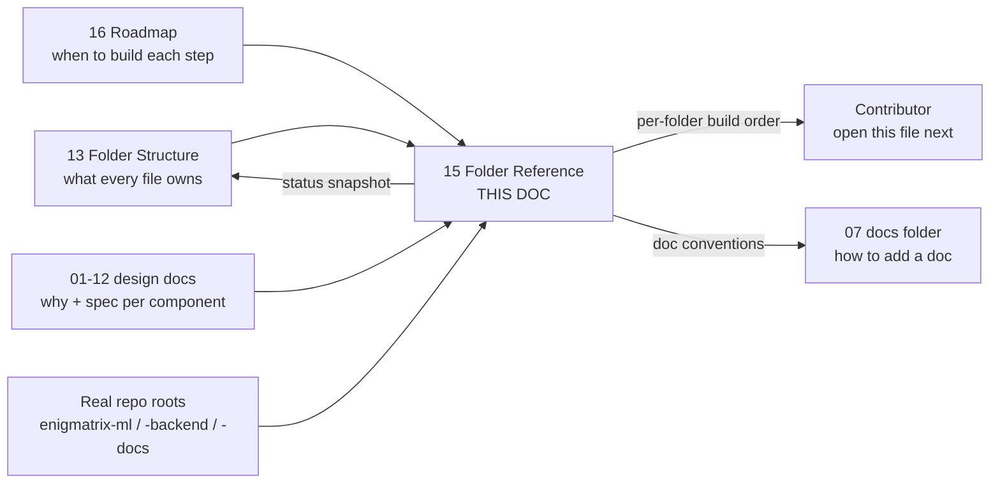
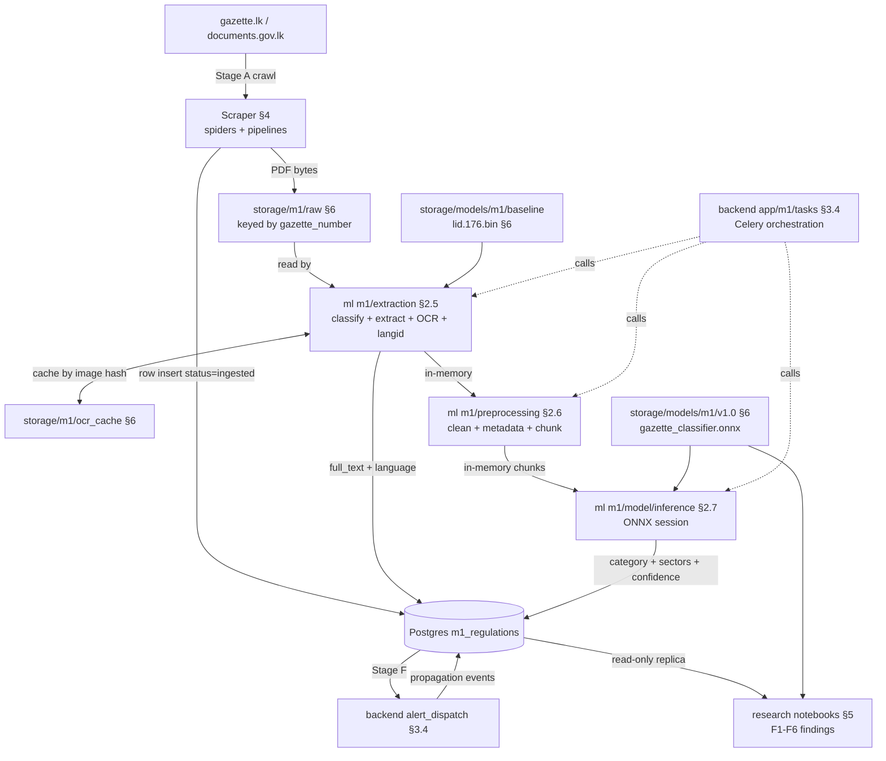

# 15 — Module 1: Folder Reference and Per-Folder Build Guides

> **Cross-references:** [13_M1_Folder_Structure_and_Implementation_Flow.md](13_M1_Folder_Structure_and_Implementation_Flow.md) — the folder-map spec, *what* every file owns · [16_M1_Development_Roadmap.md](16_M1_Development_Roadmap.md) — the sequenced *when* · [14_M1_Tracking_Workflows.md](14_M1_Tracking_Workflows.md) — the *what users do*, where this document is the *what code lives where* · [README.md](README.md) — the full m1 doc index
> **Audience:** the developer implementing M1. Status-aware: every file table marks entries ✅ / 🟡 / 🔲 to match doc 13.
> **Consolidation note (2026-07-29):** this document now carries the full content previously split across `15_M1_1_ML_Folder_Guide`, `15_M1_2_Backend_Folder_Guide`, `15_M1_3_Scraper_Folder_Guide`, `15_M1_4_Research_Folder_Guide`, `15_M1_5_Storage_Folder_Guide`, and `15_M1_6_Docs_Folder_Guide`. Those six files have been retired; every file inventory, build sequence, dependency edge, and acceptance criterion from them lives below.

> [!warning] Truth-ledger sync — 2026-08-02
> File ownership is unchanged; **four status snapshots were stale** and have been corrected in place. Model training is no longer "being validated" — it ran, XLM-R was rejected, and LinearSVC V6 is frozen and serving.
>
> **Canonical record:** [[final/works/11_CLASSIFIER_FREEZE_AND_INTEGRATION|11_CLASSIFIER_FREEZE_AND_INTEGRATION]] · [[18_M1_Dataset_And_Model_Lineage]] · `final/works/evidence/M1_OPERATING_EVIDENCE_2026-08-02.json`
> **Submitted-report copy:** [[final/report/Enigmatrix_Consolidated_Final_Report_FULL|Enigmatrix_Consolidated_Final_Report_FULL]] (Part I = group report, Part II = Module 1 dissertation).

---

## 0. Where This Document Sits in the Pipeline

This document is the map between the conceptual design docs (01–12) and the actual repository tree. Doc 13 specifies *every* file in the M1 codebase, and the numbered design docs explain the *why* and the *spec* for each major piece. But a new contributor opening doc 13's tree has no entry point for "I'm going to start by writing `ml/m1/extraction/pdf_classifier.py` — show me how." This reference closes that gap: one section per top-level folder, collecting every file in it into a table — owner, status, the numbered design doc that specifies it, and a one-liner on how to build — plus a sequenced "how to start building" for that folder.

| | Stage | Produced by | What this document does with it | Handed to |
|---|---|---|---|---|
| **In** | The folder map + file-by-file role table | [13_M1_Folder_Structure_and_Implementation_Flow.md](13_M1_Folder_Structure_and_Implementation_Flow.md) §M1 folder map, §File-by-file role description | Expands each top-level folder into a per-file build guide with status and build order | — |
| **In** | The phase-by-phase build sequence | [16_M1_Development_Roadmap.md](16_M1_Development_Roadmap.md) | Anchors each folder's "how to start building" to the phase that supplies its inputs | — |
| **In** | Per-component specifications | The numbered design docs 01–12 | Becomes the "Primary doc" column — one canonical spec per file | — |
| **In** | The real repo layout as of 2026-07-24 | The repository itself | Reconciles doc 13's idealised names (`ml/`, `backend/`, `scraper/`) against the actual `enigmatrix-*` roots — §1.1 | — |
| **Step** | Per-folder file inventories + build order | *this document* §2–§7 | Six folder guides sharing one skeleton | — |
| **Step** | Cross-folder data flow | *this document* §8 | Traces a single gazette from scraper → storage → ml → backend | — |
| **Out** | The concrete "open this file next" answer | — | — | The contributor; [16_M1_Development_Roadmap.md](16_M1_Development_Roadmap.md) steps 2a onward |
| **Out** | Per-file status snapshot | — | — | [13_M1_Folder_Structure_and_Implementation_Flow.md](13_M1_Folder_Structure_and_Implementation_Flow.md) status column; [README.md](README.md) index |
| **Out** | Documentation conventions for new docs | — | — | §7 — the docs folder documents itself |



**Why the ordering matters, and why doc 13 stays a separate file.** The three documents answer three different questions and are read at three different moments. Doc 13 answers *what does this file own* and is read once, to build a mental model of the tree; it is a specification, and specifications are read cover to cover. The roadmap answers *what do I do next* and is read at the start of a work session. This document answers *I am inside folder X — what is here and in what order do I touch it*, and is read with an editor already open. Merging 13 into 15 would produce a document that is too long to read as a spec and too structural to read as a build guide, so 13 remains its sibling rather than its parent.

The dependency runs one way: this document cites doc 13's tree and never redefines it. When a file moves, doc 13 changes first and the affected folder section in §2–§7 follows — never the reverse. That is what keeps two documents describing the same tree from drifting into two different trees.

---

## Abstract

This document is the per-folder build reference for Module 1. It covers six top-level folders — `enigmatrix-ml/`, `enigmatrix-backend/app/`, the Scrapy project under `enigmatrix-backend/scraper/`, `research/`, `storage/`, and `enigmatrix-docs/m1/` — giving for each: what the folder owns in the pipeline, which numbered design doc specifies it, a per-file inventory with implementation status, a sequenced build order, the folders it depends on, and its acceptance criteria.

§8 traces a single gazette across all six folders, which is the view no individual folder section can give. §9 consolidates every folder's acceptance criteria, and §10 is the single status table across the whole tree.

**Implementation status:** 🟡 Partial across the tree, and unevenly so. The scraper and the docs set are ✅ shipped; the ML extraction/preprocessing/evaluation/model scaffolds and the backend `app/m1/` package are largely shipped with the live classify path pending a trained/exported ONNX model; `research/` has completed the v1 annotation/gold gate; `enigmatrix-ml/datasets/` now holds the v1 parquet split; `storage/` holds baseline results and a CPU LoRA smoke artifact that is not promotable. Per-file status is in each section's tables and consolidated in §10.

---

## 1. The Repo Tree and How to Use This Reference

### 1.1 Real Repo Roots — Doc 13's Names Versus the Filesystem

Doc 13's tree uses the short names `ml/`, `backend/`, `scraper/`. The actual folders are the `enigmatrix-*` ones, and the scraper lives *under* the backend rather than beside it. The reconciliation as of 2026-07-24:

```text
xyz/
├── enigmatrix-ml/        → §2   (extraction, preprocessing, evaluation, model, data/samplers)
├── enigmatrix-backend/   → §3   (also hosts the Scrapy scraper → §4)
├── research/             → §5   (labelling data + notebooks)
├── mydata/               → live Label Studio instance (see §5 + PHASE3_ANNOTATION_RUNBOOK.md)
├── data/                 → Phase-2 extraction golden set + eval (data/golden, data/eval)
├── scripts/              → sample_for_labeling.py, score_calibration.py, run_baseline_measurement.py, …
├── storage/              → §6   (model artifacts, e.g. storage/models/m1/baseline/lid.176.bin)
└── enigmatrix-docs/      → §7
```

**Why the short names survive in the prose.** The design docs 01–12 were written against `ml/m1/...` paths and are cited by dozens of cross-references; renaming them everywhere would invalidate every link for a cosmetic gain. The convention below is therefore: file tables use the *real* path where it matters for opening a file, and the prose uses whichever name the linked design doc uses, with the mapping above as the key. Where a section's idealised names (`shared/`, `model/training.py`, `model/calibration.py`) map to real files, that is noted inline in the tables.

### 1.2 Folder → Section → Specifying Design Doc

Each folder has one or two numbered design docs that are its *specification* — the doc that must be changed before the folder's code changes.

| Folder | Section | Specified by | File count (approx) | Status snapshot |
|---|---|---|---|---|
| `enigmatrix-ml/` — extraction, preprocessing, evaluation, model, `data/samplers`, tests | §2 | [03_M1_Data_Collection.md](03_M1_Data_Collection.md) §PDF extraction chain, [04_M1_Preprocessing_Pipeline.md](04_M1_Preprocessing_Pipeline.md), [05_M1_Model_Architecture.md](05_M1_Model_Architecture.md), [06_M1_Training_Evaluation.md](06_M1_Training_Evaluation.md), [10_M1_Sinhala_Tamil_NLP.md](10_M1_Sinhala_Tamil_NLP.md) | ~100 files | ✅ Extraction + preprocessing + evaluation + model + sampler shipped; augmentation/summarisation deferred |
| `enigmatrix-backend/app/` — API routes, services, Celery tasks, models, schemas, migrations, scripts, middleware | §3 | [02_M1_Data_Requirements.md](02_M1_Data_Requirements.md) (schema), [11_M1_API_Reference.md](11_M1_API_Reference.md) (API), [08_M1_Full_System_Architecture.md](08_M1_Full_System_Architecture.md) (orchestration) | ~40 files | 🟡 Admin-CRUD + audit-log + Phase-2 ingest/extract pipeline shipped; alerts/schedulers deferred |
| Scrapy project under `enigmatrix-backend/` — settings, pipelines, spiders | §4 | [03_M1_Data_Collection.md](03_M1_Data_Collection.md) §1.2–§1.3, [02_M1_Data_Requirements.md](02_M1_Data_Requirements.md) §data sources | ~5 files | ✅ Phase-2 spiders shipped — gazette + weekly + acts + bills |
| `research/` — labeling data + config + calibration + runbook; notebooks/figures | §5 | [09_M1_Annotation_Guidelines.md](09_M1_Annotation_Guidelines.md) (annotation), [08_M1_Full_System_Architecture.md](08_M1_Full_System_Architecture.md) §research findings (F1–F6) | ~10+ files | ✅ v1 annotation gate complete — config, calibration, Batches 02-05 exports, manual resolutions, 800-row gold, and frozen v1 evidence files |
| `storage/` — raw PDFs, OCR cache, inference cache, model artifacts | §6 | [02_M1_Data_Requirements.md](02_M1_Data_Requirements.md) §governance and retention, [06_M1_Training_Evaluation.md](06_M1_Training_Evaluation.md) §reproducibility hash, [07_M1_Deployment_Integration.md](07_M1_Deployment_Integration.md) | ~5 directories | 🟡 Conventions documented; `lid.176.bin`, `baselines_v1/baselines.json`, and `xlmr_lora_smoke/model_registry.json` present |
| `enigmatrix-docs/m1/` — the docs set | §7 | [13_M1_Folder_Structure_and_Implementation_Flow.md](13_M1_Folder_Structure_and_Implementation_Flow.md) (placement), this document (conventions) | 17 canonical root Markdown files | ✅ Shipped — the docs themselves |

**Why one canonical spec per file rather than a list.** A file with three "relevant docs" has no owner, and when the three disagree nothing forces a resolution. The "Primary doc" column in every table below names exactly one; secondary references go into §12. That constraint is what makes the CI check in §9.6 — status-badge honesty and cross-ref integrity — meaningful rather than decorative.

### 1.3 The Shape of Each Folder Section

All six folder sections follow the same skeleton, so a developer learns it once and skips between folders:

1. **Purpose and specifying doc.** What the folder owns in the M1 pipeline, which stages it serves, and which numbered doc is its specification.
2. **Files in this folder.** A table per file: owner / status / primary doc / one-liner on how to build.
3. **How to start building.** Concrete sequenced first tasks. This section only *sequences* the work — the linked detail doc carries the *why* and the spec.
4. **Dependencies.** Which other folders must exist before this one builds.

Acceptance criteria, which each source guide carried per-folder, are consolidated into §9 so that the recurring contracts (idempotency, reproducibility, gitignore hygiene) are visible as contracts rather than repeated six times.

### 1.4 Conventions Used in the File Tables

- **Status badges,** per file: ✅ Shipped — works in production today · 🟡 Partial — exists but incomplete · 🔲 Deferred — the file does not exist yet and will land in a future BUILD.
- **Owner column** describes *what state or behaviour* the file controls — one line, no jargon.
- **How-to-build column** is at most one sentence. Anything longer means the underlying detail doc is the right place; this reference sequences and links, it does not duplicate.
- **Primary doc column** links to ONE doc per file — the canonical reference.

**Why the one-sentence limit is enforced rather than encouraged.** A build guide that starts explaining *how* an algorithm works becomes a second copy of the design doc, and the second copy is the one that goes stale — because nobody thinks to update a build guide when a threshold changes. Keeping the column short is what makes the design docs the single source of truth in practice and not just in principle.

### 1.5 The 30-Second Start-Here

1. **Don't know where to begin?** Open [16_M1_Development_Roadmap.md](16_M1_Development_Roadmap.md). The roadmap is phase-by-phase; it names the first concrete task.
2. **Already know which folder you're building in?** Open the matching section below. Find the file you're touching in its "Files in this folder" table. Click the primary-doc link for the spec.
3. **Need the bigger picture?** Open [13_M1_Folder_Structure_and_Implementation_Flow.md](13_M1_Folder_Structure_and_Implementation_Flow.md) for the full tree plus the Stage A→G implementation flow.
4. **Need to add a new module — M2/M3/M4?** [13_M1_Folder_Structure_and_Implementation_Flow.md](13_M1_Folder_Structure_and_Implementation_Flow.md) §5 (per-module template) tells you how to clone M1's tree.

---

## 2. `enigmatrix-ml/` — the ML Monorepo

> **Repo note (2026-07-24):** the real folder is **`enigmatrix-ml/`**, not `ml/`. Much of it is now **shipped**, not deferred: the full `m1/extraction/` chain (PDF classify → PyMuPDF/pdfplumber/pypdfium2/Tesseract/Surya page engines → Wijesekara + font-aware conversion → segmenter → language detection), `m1/preprocessing/` (cleaning, metadata, chunking), the `m1/evaluation/` extraction-metrics package, `m1/model/` (labels, architecture, `train_xlmr`, eval, baselines, `export_onnx`, inference, promotion), and `m1/data/samplers.py`. The idealised names below (`shared/`, `model/training.py`, `model/calibration.py`) map to real files noted inline.
> **Implementation status snapshot:** ✅ extraction + preprocessing + evaluation + model scaffolds + sampler shipped · ✅ model training complete — XLM-R rejected, `linearsvc_v6_primary` frozen and serving · 🔲 ONNX export never produced · 🔲 `data/sources.py` / `data/loaders.py` / `data/augmentation.py` / `summarization/` deferred.

### 2.1 Purpose and Specifying Docs

`enigmatrix-ml/` is the ML monorepo — everything that trains, evaluates, or runs the gazette classifier, plus the Phase-2 extraction chain and the Phase-2 extraction-quality **evaluation** package. It owns Stages B (extraction), C (preprocessing), D (classification and inference), and E (summarisation).

**Specified by:** [03_M1_Data_Collection.md](03_M1_Data_Collection.md) §PDF extraction chain for Stage B; [04_M1_Preprocessing_Pipeline.md](04_M1_Preprocessing_Pipeline.md) for Stage C; [05_M1_Model_Architecture.md](05_M1_Model_Architecture.md) and [06_M1_Training_Evaluation.md](06_M1_Training_Evaluation.md) for Stage D; [10_M1_Sinhala_Tamil_NLP.md](10_M1_Sinhala_Tamil_NLP.md) for the language-specific paths that cut across B and C.

Each module is isolated: `m1/` never imports sibling-module code — shared helpers stay local. **Labelling entry point:** `m1/data/samplers.py`, called by `xyz/scripts/sample_for_labeling.py`.

**Why the isolation rule is worth its cost.** A shared helper reached for by two modules becomes a coupling that neither module's tests cover, and the first sign of trouble is an M2 change breaking M1 inference. The rule pushes genuinely shared code into `ml/shared/` (§2.2) where it gets its own tests, and leaves everything else duplicated-but-local — which is the cheaper failure.

### 2.2 `ml/shared/` — Cross-Module Helpers

| File | Owns | Status | Primary doc | How to build (1-liner) |
|---|---|---|---|---|
| `shared/embeddings.py` | `multilingual-e5-base` wrapper | 🔲 | [03_M1_Data_Collection.md](03_M1_Data_Collection.md) §secondary sources §3 | Implement `embed(texts) -> np.ndarray`; cache the model singleton |
| `shared/drift.py` | KL-divergence + Population Stability Index helpers | 🔲 | [12_M1_Monitoring_Maintenance.md](12_M1_Monitoring_Maintenance.md) §3.1 | Two pure functions: `kl_divergence(p, q)` and `psi(prod, ref)`; pip-only deps |
| `shared/reproducibility.py` | `hash_dataset()` + `pin_environment()` | 🔲 | [06_M1_Training_Evaluation.md](06_M1_Training_Evaluation.md) §reproducibility hash | SHA-256 over the labeled parquet plus a `pip freeze` snapshot |

These three are the only things allowed to live here, and each earns its place by being needed by more than one module: embeddings by secondary-source matching, drift by monitoring, reproducibility by training and evaluation both.

### 2.3 `enigmatrix-ml/m1/data/` — the Labelling Sampler (Phase 3b)

| File | Owns | Status | Primary doc | Notes |
|---|---|---|---|---|
| `data/samplers.py` | Stratified + k-means-diversity + minority-class sampling for annotation batches | ✅ **Shipped** | [05_M1_Model_Architecture.md](05_M1_Model_Architecture.md) §sampling strategy | Public API: `stratified_sample(df, small_cell_threshold, target_per_cell)`, `kmeans_diversity_sample(df, exclude_ids, n, k)`, `find_minority_candidates(df, exclude_ids, min_per_category)`, `sample_for_labeling(df, n_strat, n_kmeans, n_handpick, k, random_state)`. Constants: `TARGET_PER_CELL=20`, `OPTIMAL_K=20`. Carries `CATEGORIES_8` in sync with `model/labels.py`. Called by `xyz/scripts/sample_for_labeling.py`. |
| `data/sources.py` | 15-source registry, matching the `m1_sources` table | 🔲 Deferred | [02_M1_Data_Requirements.md](02_M1_Data_Requirements.md) §data sources | Hard-code the 15 sources as `dict[str, Source]`; the registry seeds the DB table |
| `data/loaders.py` | Async DB → labeled-set iterator | 🔲 Deferred | [05_M1_Model_Architecture.md](05_M1_Model_Architecture.md) §sampling strategy | `async def load_labeled_set(split) -> AsyncIterator[Sample]`; in practice `scripts/sample_for_labeling.py::_load_from_db` currently fills this role |
| `data/augmentation.py` | Back-translation + paraphrase + Sinhala morph rules | 🔲 Deferred | [06_M1_Training_Evaluation.md](06_M1_Training_Evaluation.md) §augmentation | Cap at 5× per source doc; diversity-validate via embedding cosine |

**Why `CATEGORIES_8` is duplicated in `samplers.py` and `model/labels.py` rather than imported.** The sampler runs in the labelling loop and the label module runs in training; coupling them by import would mean a training-time dependency inside a data-preparation script. The duplication is deliberate and is protected by the constraint that both must stay in sync with the `change_category` enum in [02_M1_Data_Requirements.md](02_M1_Data_Requirements.md) — the same enum the Label Studio config mirrors.

> **Labelling data and Label Studio** live under `xyz/research/data/` and `xyz/mydata/`, not in `enigmatrix-ml/` — see §5 and `research/data/PHASE3_ANNOTATION_RUNBOOK.md`. The `model/labels.py` module here is the single source of truth for the 8 domains and 3 sectors that the Label Studio config mirrors.

### 2.4 `enigmatrix-ml/m1/evaluation/` — Phase-2 Extraction-Quality Metrics

Shipped, and not present in doc 13's original tree — this package was added when Phase-2 extraction needed to be measured against ground truth rather than eyeballed.

| File | Owns | Status | Notes |
|---|---|---|---|
| `evaluation/field_metrics.py`, `completeness.py`, `aggregates.py`, `strata.py`, `raw_text.py`, `date_scope.py`, `xlsx_reader.py`, `metrics/{strings,semantic,dates,categorical,numeric,text_summary}.py` | Scores legacy-extraction output against the `data/golden/` ground truth — the `structured_v1.xlsx` 21-field set; produces `data/eval/baseline_v0.json` | ✅ Shipped | Driven by `xyz/scripts/run_baseline_measurement.py`; see §5 and `data/golden/README.md`. This package did not exist in doc 13's original tree. |

**What it produces and who consumes it.** `data/eval/baseline_v0.json` is the number the backend's measurement admin surface (§3.3) renders and the number any extraction change is compared against. Without it, "did the new page engine help?" is an unanswerable question, which is why the package was built before the extraction chain was considered finished.

### 2.5 `ml/m1/extraction/` — Stage B

| File | Owns | Status | Primary doc | How to build (1-liner) |
|---|---|---|---|---|
| `extraction/pdf_classifier.py` | `classify_pdf(path) -> 'text' \| 'hybrid' \| 'scanned'` | 🔲 | [03_M1_Data_Collection.md](03_M1_Data_Collection.md) §PDF extraction chain | Thresholds `text > 200, scanned < 30` chars/page, read from env vars |
| `extraction/text_extractors.py` | PyMuPDF → pdfplumber → Tesseract chain | 🔲 | [03_M1_Data_Collection.md](03_M1_Data_Collection.md) §PDF extraction chain | Fallback chain; each tier needs ≥ 100 chars to win |
| `extraction/ocr.py` | Tesseract 5.3.x + Wijesekara conversion | 🔲 | [10_M1_Sinhala_Tamil_NLP.md](10_M1_Sinhala_Tamil_NLP.md) §OCR and Wijesekara conversion | `--oem 1 --psm 6 --lang eng+sin+tam`; Wijesekara via greedy longest-match table |
| `extraction/language_detection.py` | fastText `lid.176.bin` — 500-char window, top-3 | 🔲 | [10_M1_Sinhala_Tamil_NLP.md](10_M1_Sinhala_Tamil_NLP.md) §language detection and routing | Load the model once; `predict(text[:500], k=3)`; return top-1 or "mixed" |

**Why the classifier comes before the extractors.** Running the full three-tier chain on every PDF would put every document through OCR eventually, which is the slowest and lossiest tier. Classifying first means a born-digital gazette never touches Tesseract, and the classifier's thresholds are env-driven precisely so the split point can be retuned against the audit set without a redeploy.

### 2.6 `ml/m1/preprocessing/` — Stage C

| File | Owns | Status | Primary doc | How to build (1-liner) |
|---|---|---|---|---|
| `preprocessing/cleaning.py` | 8 noise classes + NFKD | 🔲 | [04_M1_Preprocessing_Pipeline.md](04_M1_Preprocessing_Pipeline.md) §noise removal | Fixed-order regex chain; idempotent — `clean(clean(x)) == clean(x)` |
| `preprocessing/metadata_extractor.py` | Gazette number, effective date, multi-penalty, principal act | 🔲 | [04_M1_Preprocessing_Pipeline.md](04_M1_Preprocessing_Pipeline.md) §metadata extraction | `re.finditer` for multi-penalty; output stored in `m1_regulation_penalties` |
| `preprocessing/chunking.py` | §-aware → 512-token sliding window, stride 64 | 🔲 | [04_M1_Preprocessing_Pipeline.md](04_M1_Preprocessing_Pipeline.md) §chunking | Detect sections via `NOTICE_BOUNDARY_RE`; emit `Chunk[]`; the classifier consumes `[0]` |
| `preprocessing/tokenization.py` | XLM-R SentencePiece wrapper | 🔲 | [05_M1_Model_Architecture.md](05_M1_Model_Architecture.md) §4.2 | Wrap `AutoTokenizer.from_pretrained('facebook/xlm-roberta-base')` |

**Why cleaning must be idempotent.** Stage C runs inline before Stage D with no persistence boundary between them (§8), so a re-run of the classify task re-runs cleaning on text that may already be clean. A non-idempotent chain would silently produce different classifier input on a retry than on the first attempt — a bug that only appears under failure, which is the worst time to discover it.

### 2.7 `ml/m1/model/` — Stage D

| File | Owns | Status | Primary doc | How to build (1-liner) |
|---|---|---|---|---|
| `model/architecture.py` | `GazetteClassifier` — XLM-R + LoRA + dual head | 🔲 | [05_M1_Model_Architecture.md](05_M1_Model_Architecture.md) §4 | `nn.Module` with a PEFT LoRA wrap plus 2 classification heads |
| `model/training.py` | 3-seed loop, AdamW, FP16, early stop | 🔲 | [06_M1_Training_Evaluation.md](06_M1_Training_Evaluation.md) | Differential LRs — LoRA 2e-4, heads 2e-5; 10-epoch cap |
| `model/evaluation.py` | macro-F1, ECE, slice analyses | 🔲 | [06_M1_Training_Evaluation.md](06_M1_Training_Evaluation.md) §slice analysis | 4 standard slices + 2 extended; outputs `EvaluationReport` |
| `model/inference.py` | ONNX Runtime session + Redis cache | 🔲 | [07_M1_Deployment_Integration.md](07_M1_Deployment_Integration.md) §ONNX export and quantization | Cache key = `SHA256(text + gazette# + date + model_version)` |
| `model/calibration.py` | Temperature scaling | 🔲 | [12_M1_Monitoring_Maintenance.md](12_M1_Monitoring_Maintenance.md) §performance monitoring | Fit `T` on the val set; apply at inference |

**Why the cache key includes the model version.** Without it, a model promotion silently serves stale predictions from the previous version for every cached document — and because the cache hit rate is highest on exactly the high-traffic regulations, the stale answers would be the most visible ones. Including gazette number and date in the key additionally prevents cross-gazette contamination when two documents share an identical cleaned chunk.

### 2.8 Stage E summarisation — implemented in the backend

| File | Owns | Status | Primary doc | Implementation note |
|---|---|---|---|---|
| `enigmatrix-backend/app/m1/services/summary_service.py` | Anchor-bound English summary construction + quality flags/provenance | ✅ Shipped | [19_M1_Regulation_Summarization.md](19_M1_Regulation_Summarization.md) | Writes only source-grounded slots or marks `review_required` |
| `enigmatrix-backend/app/m1/tasks/summarise_gazette.py` | Per-regulation Stage-E task | ✅ Shipped | [19_M1_Regulation_Summarization.md](19_M1_Regulation_Summarization.md) | Persists `summary_en`, status, source hash, and model version |
| `enigmatrix-backend/scripts/generate_regulation_summaries.py` | Controlled backfill | ✅ Shipped; partial live run | [19_M1_Regulation_Summarization.md](19_M1_Regulation_Summarization.md) | First evidence: 380 generated, 11 review-required, 751 pending |
| `m1/summarization/marianmt.py` | Earlier MarianMT proposal | Superseded | [10_M1_Sinhala_Tamil_NLP.md](10_M1_Sinhala_Tamil_NLP.md) §10 | Translation is handled by the shipped NLLB queue; this file is not required |

The first slice is deliberately non-LLM and runs after classification. Generated English summaries enqueue into the shipped NLLB translation path; remaining work is evaluation, review/edit UI, and full coverage rather than basic implementation.

### 2.9 `ml/m1/schema/` and `ml/m1/utils/`

| File | Owns | Status | Primary doc | How to build (1-liner) |
|---|---|---|---|---|
| `schema/pydantic_models.py` | `PreprocessedGazette`, `PredictionOut`, and friends | 🔲 | [04_M1_Preprocessing_Pipeline.md](04_M1_Preprocessing_Pipeline.md) §3.5 | Mirror the dataclass shape from doc 04; immutable and JSON-serialisable |
| `schema/manifest.py` | Dataset `manifest.yaml` schema | 🔲 | [06_M1_Training_Evaluation.md](06_M1_Training_Evaluation.md) §reproducibility hash | Validates the `model_registry.json` shape |
| `utils/constants.py` | 8 domain codes, 3 sector codes | 🔲 | [09_M1_Annotation_Guidelines.md](09_M1_Annotation_Guidelines.md) §2 + §4 | Two `Literal`-style enums; single source of truth |
| `utils/logging.py` | Structured JSON logging | 🔲 | — | `structlog` config; per-task `request_id` propagation |
| `utils/validation.py` | Data-quality assertions | 🔲 | [02_M1_Data_Requirements.md](02_M1_Data_Requirements.md) §schema validation | Functions consumed by Pydantic validators and nightly health checks |

`schema/manifest.py` is the validator behind the CI check in §9.5 — it is what makes "every committed `model_registry.json` is valid" enforceable rather than a hope.

### 2.10 `ml/tests/m1/`

| File | Owns | Status | Primary doc | How to build (1-liner) |
|---|---|---|---|---|
| `tests/m1/extraction/test_pdf_classifier.py` | Fixture PDFs × the 3-tier classifier | 🔲 | [03_M1_Data_Collection.md](03_M1_Data_Collection.md) §PDF extraction chain §validation | 50-doc audit set; ≥ 95 % correct classification |
| `tests/m1/preprocessing/test_cleaning.py` | Per-noise-class round-trip tests | 🔲 | [04_M1_Preprocessing_Pipeline.md](04_M1_Preprocessing_Pipeline.md) §noise removal §validation | 8 noise classes × 2 cases each = 16 unit tests minimum |
| `tests/m1/model/test_inference.py` | ONNX output ≈ PyTorch output within 1e-4 | 🔲 | [07_M1_Deployment_Integration.md](07_M1_Deployment_Integration.md) §ONNX export §validation | Smoke test on a 50-doc held-out set |
| `tests/m1/fixtures/sample_gazettes/` | Anonymised demo PDFs for tests | 🔲 | — | Use the 5 seeded demo regulations as fixture PDFs |

### 2.11 How to Start Building

Follow the roadmap's Phase 2 and Phase 3 ordering in [16_M1_Development_Roadmap.md](16_M1_Development_Roadmap.md). The fastest entry point in `ml/`:

1. **Set up the package skeleton.** `ml/__init__.py`, `ml/m1/__init__.py`, and so on — empty `__init__.py` files; the imports already work.
2. **Start with `ml/m1/extraction/pdf_classifier.py`.** It has zero dependencies on other `ml/` files; the only external deps are `pymupdf` plus the `M1_PDF_TEXT_THRESHOLD` / `M1_PDF_SCANNED_THRESHOLD` env vars. Tests live at `tests/m1/extraction/test_pdf_classifier.py` — TDD pattern.
3. **Then `text_extractors.py` + `ocr.py`.** These complete Stage B; without them the Celery `extract_gazette` task cannot advance a row past `status='ingested'`.
4. **Then `preprocessing/cleaning.py` + `metadata_extractor.py` + `chunking.py`.** Stage C — feeds Stage D's classifier input.
5. **Labeling loop — `data/samplers.py` is ✅ shipped.** It powers Phase 3b via `xyz/scripts/sample_for_labeling.py`. Remaining `data/` work is `sources.py` and `loaders.py` (DB registry plus labeled-set iterator) and `augmentation.py` (Phase 3d training-data augmentation). Operate the labelling loop from `research/data/PHASE3_ANNOTATION_RUNBOOK.md`.
6. **Then `model/*` files** in order: architecture → training → evaluation → inference. Each depends on the previous.
7. **Finally `summarization/marianmt.py`.** Independent of the classifier; can be built in parallel with `model/*` once Stage D has output to summarise.

Cross-module helpers in `ml/shared/` build alongside whatever needs them — embeddings first, used by secondary-source matching in Phase 4; then drift, for Phase 4 monitoring; then reproducibility, for Phase 3.

**Why `pdf_classifier.py` is the recommended first file in the entire codebase.** It is the only Stage-B module with no internal dependencies, it has a crisp acceptance number (≥ 95 % on a 50-doc audit set), and it is small enough that a contributor writes the test first without ceremony. Starting at the model instead would mean waiting on labelled data that Phase 3 has not produced yet.

### 2.12 Dependencies

- **Backend Celery task layer** (§3) — every `ml/m1/` module is called *from* a Celery task under the backend's M1 task tree. The boundary is one-way: `ml/m1/` never imports from the backend.
- **Scraper Stage A** (§4) — provides the PDFs that `ml/m1/extraction/` consumes.
- **`storage/` artifacts** (§6) — raw PDFs, OCR cache, model files; `ml/m1/` reads and writes here.
- **Postgres** — `data/loaders.py` reads the labeled set; the training script reads the DB directly. No ORM dependency — it uses `asyncpg` or raw `psycopg`.

**Why the ML package must not import the backend.** The direction of the dependency is what lets the ML code be tested, profiled, and retrained without a running FastAPI app, a Redis broker, or a database session. Reversing it even once — a single `from app.settings import ...` — makes every ML test require the backend's environment.

---

## 3. `enigmatrix-backend/app/` — the FastAPI + Celery Service

> **Repo note (2026-07-24):** the real folder is **`enigmatrix-backend/`**, and M1 code is a **self-contained package at `app/m1/`** (`api/`, `models/`, `schemas/`, `services/`, `tasks/`) — moved there from the flat `app/{services,models,...}` layout the old guide assumed. It is now **largely shipped**: Phase-2 ingest/extract/preprocess, the extraction dataset/measurement admin surface, alerts, drift, retraining, propagation matching, and pipeline validation all exist. Deferred: the live ONNX classify path, which waits on the trained model, plus some Stage-E summarisation.
> **Implementation status snapshot:** ✅ ~70 M1 files under `app/m1/` shipped — api/models/schemas/services/tasks — plus Scrapy Stage A, seeds, audit, and migrations · ✅ classify task live on the frozen LinearSVC backend (898 rows classified) · 🟡 summarise task pending the production batch generator · 🔲 MarianMT summarisation.

### 3.1 Purpose and Specifying Docs

`enigmatrix-backend/` is the FastAPI + Celery service that fronts M1 — the admin and SME API, the extraction/measurement admin tooling, the Celery task layer that drives Stages A–F by calling `enigmatrix-ml/m1/` for the algorithms, and the Postgres schema.

**Specified by:** [02_M1_Data_Requirements.md](02_M1_Data_Requirements.md) for the schema and every `m1_*` table; [11_M1_API_Reference.md](11_M1_API_Reference.md) for the endpoint contracts, with the permission matrix in [11_M1_API_Reference.md](11_M1_API_Reference.md) §authentication and authorization; [08_M1_Full_System_Architecture.md](08_M1_Full_System_Architecture.md) for the orchestration and route table.

M1 lives in its own `app/m1/` package so it never tangles with M2/M3 code; cross-module concerns — auth, surveys, audit — stay in the top-level `app/` directories.

**Why the package boundary is drawn at the module rather than the layer.** The alternative — one `services/` directory holding every module's services — makes the M2/M3 clone recipe in [13_M1_Folder_Structure_and_Implementation_Flow.md](13_M1_Folder_Structure_and_Implementation_Flow.md) §5 impossible to execute mechanically, because there is nothing to copy. Keeping M1 self-contained means adding a module is a directory copy plus a rename, not an archaeology exercise.

### 3.2 `app/m1/api/` — M1 REST and WebSocket Routers

All ✅ shipped.

| File | Owns |
|---|---|
| `api/regulations.py` | Admin + SME regulation CRUD / list / detail |
| `api/admin_pipeline.py` | Pipeline-state admin surface — surface A1 in [14_M1_Tracking_Workflows.md](14_M1_Tracking_Workflows.md) §2 |
| `api/extractions.py` + `api/extraction_ws.py` | Extraction runs plus the live WebSocket feed |
| `api/gazette_extraction.py` | Per-gazette extraction trigger and status |
| `api/datasets.py` | Golden/dataset upload and versioning |
| `api/measurements.py` + `api/completeness.py` | Baseline measurement and completeness reports |
| `api/alerts.py` | Alert history / dispatch surface |

> Cross-module routers stay in `app/api/v1/` — `regulations.py`, `verify.py`, `qa.py`, `risk.py`, `admin_*`, `survey_*`. Router assembly happens in `app/api/v1/router_slim.py` plus `app/main.py`.

### 3.3 `app/m1/services/` — Business Logic

✅ Shipped; approximately 30 modules.

| Area | Modules |
|---|---|
| Regulation + sources | `regulation_service`, `source_catalogue` / `sources_catalogue`, `secondary_sources`, `embeddings` |
| Extraction ops | `pipeline_service`, `extraction_run_status`, `extraction_run_archive`, `extraction_cancel`, `extraction_live_feed`, `pdf_resolver`, `metadata_confidence`, `profile_service` |
| Datasets + measurement | `dataset_service`, `dataset_upload`, `xlsx_parser`, `measurement_report`, `measurement_aggregates`, `completeness_check`, `overlap_service`, `snapshot_service`, `storage_projection` |
| Classify + drift + alerts | `classifier_service`, `drift`, `alert_service`, `alert_content`, `alert_providers` |
| Propagation (Phase 4) | `propagation_matching`, `propagation_service` |

> Shared audit writes live at `app/services/` (`audit_service`) plus the passive `app/middleware/` audit layer.

**Why audit is deliberately outside the M1 package.** Every module needs the same audit trail, and per [13_M1_Folder_Structure_and_Implementation_Flow.md](13_M1_Folder_Structure_and_Implementation_Flow.md) §5 the cardinal rule for cloning a module is that shared behaviour must not be duplicated per module. A per-module audit implementation would give M1 and M2 two different definitions of "who changed what", which is precisely the thing an audit log exists to make unambiguous.

### 3.4 `app/m1/tasks/` — the Celery Task Tree

✅ Shipped; classify and summarise pending the model.

| Stage | Tasks |
|---|---|
| A — Ingest | `run_scraper`, `gazette_scraper`, `reconcile_raw`, `migrate_raw_layout` |
| B/C — Extract + preprocess | `run_extraction`, `extract_gazette`, `preprocess_gazette`, `quality_probe`, `prune_extraction_runs` |
| D — Classify | `classify_gazette` — 🟡 wired; the live path waits on the trained ONNX model |
| F — Alerts | `alert_dispatch` |
| Secondary (Phase 4) | `portal_watcher`, `rss_watcher`, `source_health` |
| Measurement + governance | `run_measurement`, `validate_dataset_version`, `validate_pipeline`, `analytics`, `retention`, `retire_old_versions` |
| Retraining | `retraining` |

> Backend-side extraction helpers also live at `app/extraction/` — `pdf_classifier.py`, `text_extractors.py`, `pdf_metadata.py`; the heavier algorithms are in `enigmatrix-ml/m1/`.

**Why orchestration and algorithms are split across two repos at all.** The task layer owns retries, queue routing, transaction boundaries, and state transitions; the ML layer owns the maths. Keeping them apart means a retry-policy change never touches model code and a threshold change never touches Celery — and it is what makes the one-way import rule in §2.12 enforceable.

### 3.5 `app/m1/models/` and `app/m1/schemas/`

✅ Shipped.

| Layer | Modules |
|---|---|
| `m1/models/` | `regulation_penalty`, `sub_document`, `gazette_item`, `dataset`, `propagation_event`, `propagation_review`, `alert`, `retraining_run`, `extraction_profile`, `extraction_run`, `measurement`, `quality_probe`, `pipeline_audit`, `source` |
| top-level `app/models/` | `regulation` (`M1Regulation`), `regulatory_domain`, `audit_log` |
| `m1/schemas/` | `regulation_penalty`, `sub_document`, `dataset`, `pipeline`, `measurement`, `extraction`, `alert` |

### 3.6 Migrations, Seeds, Config

| Path | Owns | Status |
|---|---|---|
| `enigmatrix-backend/alembic/versions/*_m1_*.py` | Alembic migrations — e.g. `202607230001_m1_schema_validation_and_governance`, `202607210005_classification_source` | ✅ Shipped |
| `app/scripts/seed_*.py` | `seed_lookups` (8 domains + 3 sectors), `seed_regulations`, `seed_m1_worked_examples`, `seed_m23_questions`, `seed_phase4`, `seed_demo_responses`, `seed_dev` | ✅ Shipped |
| `app/settings.py` | Pydantic settings / feature flags, env-driven | ✅ Shipped |
| `app/middleware/` + `app/services/audit_service` | Passive HTTP audit logging | ✅ Shipped |

`seed_lookups.py` is load-bearing beyond development convenience: it is what puts the 8 domains and 3 sectors into the database in the form that [14_M1_Tracking_Workflows.md](14_M1_Tracking_Workflows.md) §10 requires every UI surface to render identically.

### 3.7 How to Start Building

Most of this is **already built** — the sequence below is retained as the dependency order for the remaining work (the live classify path and summarisation) and as orientation for new contributors. The M1 package is at `app/m1/`; run the API with `make dev` or `uvicorn app.main:app`, and Celery with the project's worker config.

1. **DB schema — ✅ shipped.** The `m1_*` migrations live under `enigmatrix-backend/alembic/versions/`; `alembic upgrade head` applies them. ORM under `app/m1/models/` plus `app/models/regulation.py`. Seeds via `app/scripts/seed_lookups.py` (8 domains + 3 sectors), then `seed_regulations.py` / `seed_m1_worked_examples.py`.
2. **`config/feature_flags.py`.** Stub it with env-var-backed flags. Every Celery task entry point reads from here. Build it before the tasks so they can gate themselves cleanly.
3. **`tasks/m1/__init__.py` + Celery routing.** Set up the task module plus the queue names (`m1-extract`, `m1-classify`, `m1-summarise`, `m1-alert`) before any individual task; the Celery Beat schedule lives in `backend/app/celery_config.py`.
4. **`tasks/m1/extract_gazette.py`.** First task — wraps Stage B from `ml/m1/extraction/`. Status transition `ingested → extracted`. Once this works, the rest of the chain follows the same pattern.
5. **`tasks/m1/classify_gazette.py` → `summarise_gazette.py` → `alert_dispatch.py`.** Chain order. Each fires on the previous one's success.
6. **`tasks/m1/portal_watcher.py` + `rss_watcher.py`.** Phase 4 — independent of the main chain. Both write `m1_propagation_events`.
7. **`tasks/m1/analytics.py`.** Phase 4 — nightly batch; depends on all prior tasks having populated the rows it aggregates.
8. **API endpoint extensions.** As each Celery task lands, add the matching admin endpoint to `api/v1/m1_regulations.py` — for example `POST /regulations/{id}/classify` triggering `classify_gazette.delay(id)`.
9. **Scripts — `m1_backfill_classifications.py`, `m1_validate_pipeline.py`.** Last, because they consume everything that came before.

**Why feature flags precede the tasks rather than following them.** A task written without a gate ships enabled, and the first production run of an unvalidated Stage-D path sends alerts to real SMEs. Building the flag module first means every task is born disabled, and `M1_*_ENABLED=true` becomes a deliberate deployment step covered by the pre-deploy gate in §9.2.

### 3.8 Dependencies

- **`enigmatrix-ml/m1/` modules** (§2) — tasks import the extraction, preprocessing, and model algorithms from the ML package. The boundary is strict: backend tasks own *orchestration*, not *algorithms*.
- **Postgres** — schema plus connection pool; the `m1_*` tables are the persistent state machine.
- **Redis** — Celery broker plus inference cache. Required for any Celery task to run.
- **`enigmatrix-backend/scraper/`** (§4) — Stage A produces the PDFs that Stage B consumes.
- **`storage/`** (§6) — raw PDFs, OCR cache, ONNX models. Tasks read and write here.

---

## 4. `enigmatrix-backend/scraper/` — the Scrapy Project

> **Repo note (2026-07-24):** the Scrapy project is **shipped** and lives at **`enigmatrix-backend/scraper/`** with project root `enigmatrix-backend/scrapy.cfg` — *not* a top-level `scraper/`. Secondary-source watchers were **not** built as Scrapy spiders; they are Celery tasks under `enigmatrix-backend/app/m1/tasks/` (`portal_watcher.py`, `rss_watcher.py`) backed by `services/secondary_sources.py`.
> **Implementation status snapshot:** ✅ Shipped — Stage A spiders (gazette + weekly + acts + bills) plus settings and pipelines. Phase-2 ingest is live.

### 4.1 Purpose and Specifying Docs

The Scrapy project owns **Stage A (Ingestion)** — it discovers new gazettes, acts, and bills on `gazette.lk` and `documents.gov.lk`, downloads PDFs, deduplicates against the DB, and hands off to Stage B. It sits *inside* `enigmatrix-backend/`, sharing the backend venv and DB session, and is driven in production by the `run_scraper` / `gazette_scraper` Celery tasks.

**Specified by:** [03_M1_Data_Collection.md](03_M1_Data_Collection.md) — §1.2 for the download/dedup pipeline, §1.3 for the Scrapy settings, §6.1 for the Celery boundary; [02_M1_Data_Requirements.md](02_M1_Data_Requirements.md) §data sources for the source registry and per-source fallbacks.

**Why it lives inside the backend rather than as a peer repo.** The spider's pipeline writes directly to `m1_regulations` and needs the same DB session, models, and settings as the rest of the service. A standalone repo would need its own copy of the ORM and its own migration awareness — two copies of the schema, guaranteed to diverge.

### 4.2 Files in This Folder

| File | Owns | Status | Primary doc | Notes |
|---|---|---|---|---|
| `scraper/settings.py` | Scrapy global config — autothrottle, retry, user-agent, ROBOTSTXT_OBEY | ✅ Shipped | [03_M1_Data_Collection.md](03_M1_Data_Collection.md) §1.3 | `DOWNLOAD_DELAY` plus AUTOTHROTTLE plus retry codes |
| `scraper/pipelines.py` | PDF → `storage/m1/raw/` write pipeline, dedup, row insert | ✅ Shipped | [03_M1_Data_Collection.md](03_M1_Data_Collection.md) §1.2 | SHA-256 the bytes; skip duplicate `gazette_number` |
| `scraper/spiders/_base.py` | Shared base spider — common parsing and item shape | ✅ Shipped | [03_M1_Data_Collection.md](03_M1_Data_Collection.md) | The 4 concrete spiders subclass this |
| `scraper/spiders/gazette_spider.py` | Extraordinary-gazette spider — `gazette.lk` / `documents.gov.lk` | ✅ Shipped | [03_M1_Data_Collection.md](03_M1_Data_Collection.md) §1.2 + §1.3 | Yields `{url, gazette_number, gazette_date, pdf_url}` |
| `scraper/spiders/weekly_gazette_spider.py` | Weekly-gazette spider | ✅ Shipped | [03_M1_Data_Collection.md](03_M1_Data_Collection.md) | Weekly issue cadence |
| `scraper/spiders/acts_spider.py` | Acts spider | ✅ Shipped | [02_M1_Data_Requirements.md](02_M1_Data_Requirements.md) §data sources | Parliament acts |
| `scraper/spiders/bills_spider.py` | Bills spider | ✅ Shipped | [02_M1_Data_Requirements.md](02_M1_Data_Requirements.md) §data sources | Draft bills |
| _Secondary sources_ — IRD/EPF/eROC/SLSI/CBSL plus news RSS | Not Scrapy spiders; Celery tasks instead | ✅ Shipped elsewhere | [03_M1_Data_Collection.md](03_M1_Data_Collection.md) §secondary sources | `app/m1/tasks/portal_watcher.py` + `rss_watcher.py` + `services/secondary_sources.py` — see §3 |

**Why secondary sources are Celery tasks and not spiders.** Scrapy's model is a crawl: discover a frontier, follow it, extract items. The secondary watchers do something different — they poll a known URL or RSS feed on a schedule and record *when* a known regulation first appeared there. That is a timestamp observation, not a crawl, and forcing it into a spider would mean running a Scrapy process per source per poll for a single HTTP GET.

### 4.3 How to Start Building

This folder is **already built** — Phase 2, roadmap Step 2a in [16_M1_Development_Roadmap.md](16_M1_Development_Roadmap.md). The notes below are how to *run and extend* it; the build history is retained for context.

> **Run it locally:** from `enigmatrix-backend/`, where `scrapy.cfg` lives, `scrapy list` shows `gazette_spider`, `weekly_gazette_spider`, `acts_spider`, `bills_spider`. `scrapy crawl gazette_spider -s CLOSESPIDER_ITEMCOUNT=5` fetches 5 issues into `storage/m1/raw/` and inserts `status='ingested'` rows. Production runs the same spiders inside the `run_scraper` / `gazette_scraper` Celery tasks.

1. **Project is scaffolded.** `enigmatrix-backend/scrapy.cfg` plus `scraper/settings.py` are in place; there is no `items.py` or `middlewares.py` — ad-hoc item dicts and default middlewares.
2. **Write `scraper/settings.py`.** Copy the `custom_settings` dict from [03_M1_Data_Collection.md](03_M1_Data_Collection.md) §1.3. Critical settings: `DOWNLOAD_DELAY=2`, `AUTOTHROTTLE_ENABLED=True`, `RETRY_HTTP_CODES=[500, 503, 429]`, `USER_AGENT='EnigmatrixResearchBot/1.0 (+https://enigmatrix.lk/bot)'`.
3. **Write `scraper/pipelines.py`.** A `FilesPipeline` subclass that:
   - downloads each PDF into `storage/m1/raw/{gazette_number}.pdf`
   - SHA-256 hashes the bytes, stored in `m1_regulations.pdf_hash`
   - skips if the `gazette_number` already exists in the DB
4. **Write `scraper/spiders/gazette_spider.py`.** Two `start_urls` — gazette.lk and documents.gov.lk. Parse the pagination and emit per-issue items. Use `scrapy crawl gazette_spider` against a fixture date first to validate; only enable in Celery once stable.
5. **Test locally.** `scrapy crawl gazette_spider --limit 5` produces 5 PDFs in `storage/m1/raw/` and 5 rows in `m1_regulations` with `status='ingested'`.
6. **Secondary sources are NOT Scrapy spiders.** IRD/EPF/ETF/eROC/SLSI/CBSL plus news-RSS diffusion tracking is handled by `app/m1/tasks/portal_watcher.py` and `rss_watcher.py`, together with `services/secondary_sources.py` and `propagation_matching.py`, which write `m1_propagation_events`. See §3.

The Scrapy CLI works standalone for local testing. Production runs the spiders *inside* the `run_scraper` / `gazette_scraper` Celery tasks (§3.4); the cooperative retry boundary between Scrapy and Celery is documented in [03_M1_Data_Collection.md](03_M1_Data_Collection.md) §6.1. Integration test: `enigmatrix-backend/app/tests/integration/test_gazette_spider.py`.

**Why the fixture-date dry run before enabling the Celery wrapper.** A spider validated only under Celery fails opaquely — the error surfaces as a task retry with no page context. Running it from the CLI against a known date gives a readable traceback and a directory of PDFs to inspect, which is the difference between a ten-minute fix and an afternoon.

### 4.4 Dependencies

- **`storage/m1/raw/`** (§6) — destination for downloaded PDFs. Must be writable.
- **Postgres `m1_regulations` table** — dedup check plus new-row insert. ORM in `enigmatrix-backend/app/m1/models/` (§3).
- **`enigmatrix-backend/app/m1/tasks/run_scraper.py` + `gazette_scraper.py`** (§3) — the Celery wrappers that trigger Scrapy on a schedule. The Scrapy CLI handles local dev; the wrappers handle production.
- **Wayback Machine plus the admin URL-override table** — the fallback when a source URL changes; see [02_M1_Data_Requirements.md](02_M1_Data_Requirements.md) §data sources, source-specific fallbacks.

---

## 5. `research/` — the Analytical Surface

> **Repo note (2026-07-30):** the annotation surface is **live and v1-complete**. The labeling config, calibration set, Batches 02-05, full Label Studio exports, IAA reports, `manual_resolutions.csv`, `gold_standard.csv`, and frozen v1 evidence files exist under `research/data/labeling/`; a working Label Studio instance is initialised at `xyz/mydata/`. The Jupyter findings notebooks (F1–F6) are still to scaffold.
> **Implementation status snapshot:** ✅ annotation config, calibration, Batches 02-05, reducer, IAA reports, manual resolutions, 800-row gold, frozen v1 files, deterministic parquet split, TF-IDF baselines, CPU smoke · ✅ full LoRA training ran and was rejected; LinearSVC V6 frozen instead · 🔲 ONNX never exported · 🔲 findings notebooks/figures deferred.

### 5.1 Purpose and Specifying Docs

`research/` is the analytical surface — the Jupyter notebooks that produce the F1–F6 thesis findings, the labelled dataset the classifier trains on, and the figures the thesis ships. Unlike `ml/` (production code) this is the *researcher's* surface: it reads from production replicas and does not write back. It lives outside `backend/` and `ml/` because the lifecycle is different — notebooks are exploratory and do not need to deploy.

**Specified by:** [09_M1_Annotation_Guidelines.md](09_M1_Annotation_Guidelines.md) for everything under `research/data/` — the Label Studio config (§1.2), the calibration set (§5.2), the IAA protocol (§6), the survey instrument (§9); [08_M1_Full_System_Architecture.md](08_M1_Full_System_Architecture.md) §research findings for the notebooks' methodology.

**Why the read-only-replica rule is architectural rather than advisory.** A notebook that can write to production is a notebook that can, one careless cell at a time, alter the data a finding is computed from. Enforcing it at the replica's permissions rather than by convention means the guarantee survives a contributor who has never read this section.

### 5.2 `research/notebooks/`

| File | Owns | Status | Primary doc | How to build (1-liner) |
|---|---|---|---|---|
| `notebooks/findings_lag_analysis.ipynb` | F1–F5 lag distributions plus statistical tests | 🔲 | [08_M1_Full_System_Architecture.md](08_M1_Full_System_Architecture.md) §research findings | Read replicas; median plus bootstrap 95 % CI plus Mann-Whitney U / Kruskal-Wallis tests |
| `notebooks/findings_classifier_evaluation.ipynb` | Full classifier eval suite — slice analyses plus confusion matrix | 🔲 | [06_M1_Training_Evaluation.md](06_M1_Training_Evaluation.md) + §slice analysis | Load `enigmatrix-ml/datasets/m1_regulations/test.parquet` plus the ONNX model; reproduce eval per language / quarter / length |
| `notebooks/findings_alert_effectiveness.ipynb` | F6 — DiD analysis on subscribed versus non-subscribed SMEs | 🔲 | [08_M1_Full_System_Architecture.md](08_M1_Full_System_Architecture.md) §research findings F6 | DiD regression with sector and district fixed effects; parallel-trends robustness check |
| `notebooks/findings_secondary_diffusion.ipynb` | F4 — channel-effectiveness ranking | 🔲 | [02_M1_Data_Requirements.md](02_M1_Data_Requirements.md) §3.3 — `v_m1_channel_effectiveness` | Query the view; sort by median lag; produce the channel-effectiveness heatmap |

### 5.3 `research/figures/`

| File | Owns | Status | Primary doc | How to build (1-liner) |
|---|---|---|---|---|
| `figures/lag_distribution.png` | F1–F3 box plots plus CDFs | 🔲 | [08_M1_Full_System_Architecture.md](08_M1_Full_System_Architecture.md) §research findings F1–F3 | Generated by `findings_lag_analysis.ipynb` — commit the PNG |
| `figures/confusion_matrix.png` | 8×8 domain confusion matrix | 🔲 | [06_M1_Training_Evaluation.md](06_M1_Training_Evaluation.md) | Generated by `findings_classifier_evaluation.ipynb` |
| `figures/alert_effectiveness_timeseries.png` | F6 DiD pre/post intervention plot | 🔲 | [08_M1_Full_System_Architecture.md](08_M1_Full_System_Architecture.md) §research findings F6 | Generated by `findings_alert_effectiveness.ipynb` |
| `figures/secondary_diffusion_heatmap.png` | F4 channel × sector lag heatmap | 🔲 | [08_M1_Full_System_Architecture.md](08_M1_Full_System_Architecture.md) §research findings F4 | Generated by `findings_secondary_diffusion.ipynb` |

**Why the PNGs are committed when they are derived artefacts.** They are small, and committing them means a thesis reviewer can see the chart without standing up a replica connection and an ONNX runtime. The cost is the byte-identical CI check in §9.4, which is what keeps a committed figure from silently disagreeing with the notebook that claims to produce it.

### 5.4 `research/data/` — the Annotation Surface

> **Full operational runbook:** [`research/data/PHASE3_ANNOTATION_RUNBOOK.md`](../../../../Reasearch/xyz/research/data/PHASE3_ANNOTATION_RUNBOOK.md) — the step-by-step for sampling → Label Studio → calibration → IAA → export. The table below is the file inventory; the runbook is the *how*.

| File | Owns | Status | Primary doc | How it's built |
|---|---|---|---|---|
| `data/label_studio_config.xml` | Labeling interface — 8-domain single-label, 3-sector multi-label, SME-relevance, confidence, notes | ✅ Shipped | [09_M1_Annotation_Guidelines.md](09_M1_Annotation_Guidelines.md) §1.2 | Paste into Label Studio → Labeling Interface → Code; kept in sync with `enigmatrix-ml/m1/model/labels.py` |
| `data/calibration_set_v1.csv` | 20-doc calibration test with **locked** expert reference labels — `expert_change_category`, `expert_affected_sectors` | ✅ Shipped | [09_M1_Annotation_Guidelines.md](09_M1_Annotation_Guidelines.md) §5.2 | Hand-picked by the domain expert; `cal_001`–`cal_020`; spans 8 domains, EN/SI/TA, and edge cases |
| `data/labeling/batch_01.csv` | First 200-doc annotation batch — 150 stratified + 40 k-means + 10 hand-pick | ✅ Shipped | [05_M1_Model_Architecture.md](05_M1_Model_Architecture.md) §sampling strategy | Emitted by `scripts/sample_for_labeling.py`, then imported into Label Studio |
| `data/labeling/batch_01_provenance.json` | Sampling provenance — seed, corpus size, language/year/type breakdowns | ✅ Shipped | [05_M1_Model_Architecture.md](05_M1_Model_Architecture.md) §sampling strategy | Auto-written alongside each `batch_NN.csv` |
| `data/PHASE3_ANNOTATION_RUNBOOK.md` | Operational runbook for the whole labelling loop | ✅ Shipped | [09_M1_Annotation_Guidelines.md](09_M1_Annotation_Guidelines.md) §6 | Living doc; describes data versus mydata, LS setup, calibration, IAA, export |
| `data/labeling/batch_02_annotations_full.json` … `batch_05_annotations_full.json` | Full Label Studio exports for the accepted v1 gold set | ✅ Shipped | [09_M1_Annotation_Guidelines.md](09_M1_Annotation_Guidelines.md) §6 | Reducer inputs for `scripts/resolve_iaa.py`; each accepted batch has 200 tasks and 400 annotations |
| `data/labeling/gold_standard.csv` and `gold_standard_v1_800.csv` | Final consensus labels at κ ≥ 0.75, plus frozen v1 copy | ✅ Shipped | [09_M1_Annotation_Guidelines.md](09_M1_Annotation_Guidelines.md) §6 | 800 rows from Batches 02-05 at the v1 freeze; **superseded** — Batches 06-07 took the gold set to 1128 rows (v3 category kappa 0.947215); 40 manual adjudications at v1 |
| `data/labeling/iaa_report*.json/csv`, `disagreements.csv`, `manual_resolutions.csv` | IAA evidence and adjudication audit trail | ✅ Shipped | [09_M1_Annotation_Guidelines.md](09_M1_Annotation_Guidelines.md) §6 | Category kappa 0.871534; mean sector kappa 0.863776; SME relevance kappa 0.723518 |
| `enigmatrix-ml/datasets/m1_regulations/{train,val,test}.parquet` | Current v1 train/validation/test split | ✅ Shipped with limitation | [06_M1_Training_Evaluation.md](06_M1_Training_Evaluation.md) §1.2 | 560/120/120 rows from `m1.model.data --by key`; deterministic but not temporal/stratified |
| `data/prepilot_2025-09.csv` | 40-respondent informal SME scan — EN-only Google Forms export | 🟡 Partial, already collected | [01_M1_Research_Problem.md](01_M1_Research_Problem.md) §motivation and evidence | Already collected; redact PII before commit |

> **Where the live Label Studio instance lives:** `xyz/mydata/` — `label_studio.sqlite3` plus `media/upload/1` for the Batch project, `/2` for the Calibration project, plus `.env`. Start it with `LABEL_STUDIO_BASE_DATA_DIR=C:\Reasearch\xyz\mydata`. This is **not** `research/data/`: `research/data/` holds the import *sources*, while `mydata/` is Label Studio's own store of tasks and submitted annotations.
>
> **Supporting scripts, in `xyz/scripts/`:** `sample_for_labeling.py` emits batches (✅), `score_calibration.py` scores a calibration export against the expert labels with Cohen's κ plus per-sector κ (✅), and `resolve_iaa.py` reduces full Label Studio JSON exports into disagreements, IAA reports, and `gold_standard.csv` (✅).

**Why the import sources and the Label Studio store are kept apart.** `research/data/` is version-controlled input; `mydata/` is a running application's mutable state. Collapsing them would put a SQLite database under git and make an annotation session a source-control event.

### 5.5 How to Start Building

`research/` builds *behind* `ml/` and `backend/` — the notebooks need real data from the production replicas, and the labelling data comes out of Phase 3 of the roadmap.

> **Labelling — Phase 3a/3b/3c — is v1 complete.** Steps 1–4 below are done for Batches 02-05. Follow [`PHASE3_ANNOTATION_RUNBOOK.md`](../../../../Reasearch/xyz/research/data/PHASE3_ANNOTATION_RUNBOOK.md) to repeat or extend it; the remaining research work is full GPU training, ONNX export, and the findings notebooks.

1. **Labeling interface — ✅ done.** `data/label_studio_config.xml` carries the 8-domain / 3-sector interface. Paste it into a Label Studio project's Code tab. Keep it in sync with `enigmatrix-ml/m1/model/labels.py`.
2. **Calibration set — ✅ done (Phase 3a).** The 20 expert-labelled docs are in `data/calibration_set_v1.csv`. Candidates label them in the "M1 Calibration Test v1" project; score with `scripts/score_calibration.py`, gating at κ ≥ 0.80. See runbook §5–6.
3. **First labelling batch — ✅ done (Phase 3b).** `data/labeling/batch_01.csv` (200 docs) plus `batch_01_provenance.json` are committed. Regenerate or add batches with `uv run python scripts/sample_for_labeling.py --batch N`. Versioned and append-only — the sampler refuses to overwrite an existing batch.
4. **Dual-annotate plus IAA (Phase 3c) — done for v1.** Two annotators per task; full JSON exports reduced by `scripts/resolve_iaa.py`; output is `data/labeling/gold_standard.csv` and frozen `gold_standard_v1_800.csv`. The row-count and IAA gates passed; rare-domain coverage did not meet the original 50/domain target.
5. **Parquet split (Phase 3d) — done with limitation.** `enigmatrix-ml/datasets/m1_regulations/{train,val,test}.parquet` exists from `m1.model.data --by key`; produce a better temporal/stratified split only if the thesis needs stronger evaluation evidence.
6. **Notebook environment plus scaffolds (Phase 5).** `requirements-research.txt` — `jupyterlab`, `pandas`, `scipy`, `matplotlib`, `pyarrow` — plus a `.env.research` pointing at the read-only Postgres replica and the ONNX model URL. Then scaffold `findings_classifier_evaluation.ipynb` first, since Phase 3 output feeds it, then `findings_secondary_diffusion.ipynb`, then `findings_lag_analysis.ipynb` and `findings_alert_effectiveness.ipynb`, which need SME survey data.
7. **Figures.** Each notebook writes to `figures/*.png` — commit the PNGs, which are small, so thesis reviewers can see the chart without re-running.
8. **Pre-registration.** Before unblinding the data, write `research/preregistration.md` listing the hypotheses and tests; the pattern is in [08_M1_Full_System_Architecture.md](08_M1_Full_System_Architecture.md) §research findings, validation.

The notebooks are the **thesis artifact** — they must re-run end to end against the production replica without errors. CI runs `nbconvert --execute` on each to catch drift.

**Why the sampler refuses to overwrite a batch.** A regenerated `batch_01.csv` would silently change what a set of already-submitted annotations refers to, and there is no way to detect that after the fact. Append-only batches make the provenance JSON meaningful: a batch, its seed, and its annotations are one immutable triple.

**Why pre-registration comes before unblinding rather than before publication.** The value of a pre-registered test is that it was chosen without knowledge of the result. Writing it after seeing the data is the same document with none of its epistemic force — which is why step 8 is positioned as a gate on the analysis, not a formality at write-up.

### 5.6 Dependencies

- **Postgres replica** — every notebook reads from a read-only replica. Notebooks must NOT write back; this is enforced by the replica's permissions.
- **`storage/models/m1/v*/`** (§6) — `findings_classifier_evaluation.ipynb` loads the ONNX model from here.
- **Label Studio** ([09_M1_Annotation_Guidelines.md](09_M1_Annotation_Guidelines.md) §1) — an external tool; the instance is initialised at `xyz/mydata/`; `data/labeling/*.csv` is the import format and JSON export is the annotation output.
- **`enigmatrix-ml/m1/data/samplers.py`** (§2.3) — the sampler (`stratified_sample`, `kmeans_diversity_sample`, `find_minority_candidates`, `sample_for_labeling`) that `scripts/sample_for_labeling.py` calls to produce the batch CSVs.
- **SME survey backend** (§3) — populates `m1_sme_awareness_responses`, which `findings_lag_analysis.ipynb` reads.

---

## 6. `storage/` — the On-Disk Artifact Store

> **Repo note (2026-07-30):** `storage/` now contains the fastText language-ID model at **`storage/models/m1/baseline/lid.176.bin`**, the baseline report at **`storage/models/m1/baselines_v1/baselines.json`**, and a CPU LoRA smoke output at **`storage/models/m1/xlmr_lora_smoke/`**. The smoke output is not a production classifier. The trained ONNX classifier lands only after full GPU training and export.
> **Implementation status snapshot:** ✅ Conventions documented; language-ID model, baseline report and smoke registry present; **`models/m1/linearsvc_v6_primary/` is the frozen production artifact** (joblib pipeline + SHA256 + second-machine verification JSON) · 🔲 `storage/models/m1/onnx/v1/` remains empty — no ONNX artifact was ever exported.

### 6.1 Purpose and Specifying Docs

`storage/` is the on-disk artifact store — raw PDFs the scraper downloads, OCR caches, the inference-cache mirror, and the versioned ONNX model files. Everything here is *operational state*: gitignored except for the `model_registry.json` manifests, which are small and version-controlled for reproducibility. On Fly.io the production mount is a persistent volume; locally it is the repo `storage/` directory.

**Specified by:** [02_M1_Data_Requirements.md](02_M1_Data_Requirements.md) §governance and retention for the raw-PDF lifecycle and S3 rules; [06_M1_Training_Evaluation.md](06_M1_Training_Evaluation.md) §reproducibility hash for the registry schema; [07_M1_Deployment_Integration.md](07_M1_Deployment_Integration.md) for the ONNX artefacts, the Fly volume, and rollback.

**Why this folder gets its own guide despite holding almost no code.** Its rules are the ones that break silently. A model file committed by accident bloats the repo permanently; an ungitignored OCR cache turns every local run into a dirty working tree; a missing `model_registry.json` makes a trained model unreproducible. The build work here is *setting up conventions and enforcing them in CI*, which is why §9.5 carries more assertions than the folder has files.

### 6.2 `storage/m1/` — Runtime Caches

| Path | Owns | Status | Primary doc | How to build (1-liner) |
|---|---|---|---|---|
| `m1/raw/` | Downloaded gazette PDFs, keyed by `gazette_number` | 🔲 | [03_M1_Data_Collection.md](03_M1_Data_Collection.md) + [02_M1_Data_Requirements.md](02_M1_Data_Requirements.md) §governance and retention | `scraper/pipelines.py` writes here; the S3 lifecycle moves anything over 2 years old to Glacier |
| `m1/ocr_cache/` | Tesseract output keyed by `SHA-256(image_bytes)` | 🔲 | [03_M1_Data_Collection.md](03_M1_Data_Collection.md) §PDF extraction chain | Idempotent — re-running OCR returns the cached result; TTL 30 days |
| `m1/inference_cache/` | Redis dump — operational, not authoritative | 🔲 | [07_M1_Deployment_Integration.md](07_M1_Deployment_Integration.md) §3.2 | Local backup of the Redis cache for cold-start warming |

**Why the OCR cache is keyed on image bytes rather than gazette number.** The same scanned page can arrive under two gazette numbers — a re-issue, a correction — and OCR is the single most expensive step in the chain. Hashing the image means the second arrival costs nothing, and it makes the cache correct under re-extraction, which a document-level key would not be.

### 6.3 `storage/models/m1/` — Model Artifacts

| Path | Owns | Status | Primary doc | How to build (1-liner) |
|---|---|---|---|---|
| `models/m1/v1.0/gazette_classifier.onnx` | Production FP32 ONNX model | 🔲 | [07_M1_Deployment_Integration.md](07_M1_Deployment_Integration.md) §ONNX export and quantization | Produced by `ml/m1/model/export_onnx.py` |
| `models/m1/v1.0/gazette_classifier_int8.onnx` | INT8-quantized variant, ~2× speedup | 🔲 | [07_M1_Deployment_Integration.md](07_M1_Deployment_Integration.md) §ONNX export, INT8 | Produced by `quantize_onnx.py`; F1 within 1.5 pp of FP32 |
| `models/m1/v1.0/adapter_model.bin` | LoRA adapter weights, for retraining | 🔲 | [05_M1_Model_Architecture.md](05_M1_Model_Architecture.md) §LoRA hyperparameters | PEFT's `save_pretrained()` output, ~10 MB; never overwrite |
| `models/m1/v1.0/tokenizer/` | XLM-R SentencePiece tokenizer, frozen | 🔲 | [05_M1_Model_Architecture.md](05_M1_Model_Architecture.md) §4.2 | Copied from `facebook/xlm-roberta-base` at training time |
| `models/m1/v1.0/model_registry.json` | Reproducibility fingerprint | 🔲 | [06_M1_Training_Evaluation.md](06_M1_Training_Evaluation.md) §reproducibility hash | **Committed to git** — small JSON; contains git SHA, data SHA-256, env.yml hash, per-language F1 |
| `models/m1/v1.0/metrics.json` | Per-language F1, confusion matrix, ECE | 🔲 | [06_M1_Training_Evaluation.md](06_M1_Training_Evaluation.md) §4 | **Committed to git**; consumed by the monitoring dashboard |
| `models/m1/v0.9/` | Previous version — the rollback target | 🔲 | [07_M1_Deployment_Integration.md](07_M1_Deployment_Integration.md) §Fly.io operations, rollback | Always kept on the Fly volume for ~60 s rollback |
| `models/m1/baseline/lid.176.bin` | fastText language-ID model for EN/SI/TA routing | ✅ **Present** | [10_M1_Sinhala_Tamil_NLP.md](10_M1_Sinhala_Tamil_NLP.md) §language detection and routing | Fetched by `enigmatrix-ml/scripts/download_lid_model.py`; read by `enigmatrix-ml/m1/extraction/language_detection.py` |
| `models/m1/baselines_v1/baselines.json` | TF-IDF baseline report for the v1 split | ✅ Shipped | [06_M1_Training_Evaluation.md](06_M1_Training_Evaluation.md) §baselines | LogReg macro-F1 0.4980; LinearSVC macro-F1 0.6167 |
| `models/m1/xlmr_lora_smoke/model_registry.json` | CPU LoRA smoke registry | ✅ Shipped / not promotable | [06_M1_Training_Evaluation.md](06_M1_Training_Evaluation.md) §training config | One seed, one epoch, tiny smoke split, `gate_pass=false`; engineering proof only |
| `models/m1/baseline/tfidf_lr_model.pkl` | Production-baseline TF-IDF + LR | 🔲 | [05_M1_Model_Architecture.md](05_M1_Model_Architecture.md) §architecture comparison | Trained on the full labelled set; used for ablation only |
| `models/m1/baseline/vocabulary.pkl` | The baseline's vocabulary | 🔲 | Same | Companion to `tfidf_lr_model.pkl`; pickle for reproducibility |

**Why the adapter weights are kept when the ONNX file is what serves traffic.** The ONNX export is a one-way transformation: you cannot resume training from it. Keeping the ~10 MB adapter is what makes the next retraining run an incremental step rather than a restart — which is why the "never overwrite" note is part of the file's contract, not a suggestion.

### 6.4 How to Start Building

This folder is **mostly conventions** — directories appear as Phase 2 and Phase 3 run.

1. **Create the directory tree.** `mkdir -p storage/m1/{raw,ocr_cache,inference_cache} storage/models/m1/{baseline,v1.0}`. Add `.gitkeep` files so empty dirs are tracked.
2. **`.gitignore` setup.** Add `storage/m1/raw/`, `storage/m1/ocr_cache/`, `storage/m1/inference_cache/`, `storage/models/m1/v*/*.onnx`, `storage/models/m1/v*/adapter_model.bin`, and `storage/models/m1/v*/tokenizer/` to gitignore. The only things that ARE tracked: the `model_registry.json` and `metrics.json` files — small and reproducibility-critical.
3. **S3 lifecycle config.** Per [02_M1_Data_Requirements.md](02_M1_Data_Requirements.md) §governance and retention, commit `infra/aws/s3_m1_lifecycle.yaml`. The AWS CLI applies the rules; CI asserts byte-equality with the committed YAML.
4. **Fly volume.** `fly volumes create ml_models --size 3 --region sin` once Phase 3 ships the first ONNX. The volume is mounted at `/app/storage/models/` per [07_M1_Deployment_Integration.md](07_M1_Deployment_Integration.md) §Fly.io operations, `fly.toml`.
5. **Model versioning convention.** When Phase 3's training pipeline lands, every `model_registry.json` must include: `model_version` (semver), `trained_at` (ISO), `git_commit_sha`, `dataset.labeled_set_sha256`, `dataset.split_boundaries`, `environment.python` plus `torch`, `transformers`, `peft`, and `onnxruntime` versions, `training.seeds` plus `final_macro_f1_mean` and `final_macro_f1_std`, and `metrics_per_language`. See [06_M1_Training_Evaluation.md](06_M1_Training_Evaluation.md) §reproducibility hash for the full schema.
6. **Backup and retention.** `storage/m1/raw/` PDFs older than 2 years auto-migrate to Glacier via the S3 lifecycle. In local repo dev, rely on the lifecycle; do not try to delete locally.

The two committed files per model version — `model_registry.json` and `metrics.json` — are the *only* things from this folder that ship in docs or PR review. Everything else is operational.

**Why the registry is committed while the model is not.** The registry is the claim; the model is the evidence. A reviewer needs to see which data hash, which git SHA, and which environment produced a reported F1, and all of that fits in a few kilobytes of JSON. Committing the weights themselves would add hundreds of megabytes to every clone in exchange for nothing a reviewer can verify by reading.

### 6.5 Dependencies

- **`enigmatrix-backend/scraper/pipelines.py`** (§4) — writes to `storage/m1/raw/`.
- **`enigmatrix-ml/m1/extraction/ocr.py`** (§2.5) — reads and writes `storage/m1/ocr_cache/`.
- **`enigmatrix-ml/m1/model/inference.py`** (§2.7) — reads `storage/models/m1/v<X>/*.onnx`.
- **`enigmatrix-ml/m1/model/train_xlmr.py`** plus `export_onnx.py` (§2.7) — writes the entire `storage/models/m1/v<X>/` tree.
- **AWS S3** — Glacier lifecycle for raw PDFs older than 2 years.
- **Fly.io persistent volume** — mounts production model files at `/app/storage/models/`.

---

## 7. `enigmatrix-docs/m1/` — the Docs Set

> **Two locations (2026-07-24):** the canonical docs live in **`enigmatrix-docs/m1/`** in the repo; they are also authored and mirrored in the **Obsidian research vault** at `E:\Obsidian\sme\02-Research-Modules\1 Module-1-Awareness-Gap\`, which additionally holds `findings/`, `local-dev/`, `planned-for-development/`, and `final/works/` that are not in the repo copy. Keep the numbered `NN_M1_*.md` set in sync between the two. Operational runbooks that pair with code — for example the Phase-3 annotation runbook — live next to the code under `research/data/`, **not** here.
> **Implementation status snapshot:** ✅ Shipped — the full numbered doc set: main docs 01–16 plus the tracking and folder guides plus README. Counts drift as docs are added; treat the numbers below as approximate.

### 7.1 Purpose and Specifying Docs

`enigmatrix-docs/m1/` is the canonical knowledge base for Module 1 — research framing, technical specs, deep-dives, tracking workflows, folder and dev guides. It is the only folder in this series that is *fully shipped today*. The guide exists so a contributor adding a new M1 doc knows the conventions: numbering, skeleton, badges, cross-link patterns. It is also the entry point for "where in the docs do I write X?" — naming and placement decisions.

**Specified by:** [13_M1_Folder_Structure_and_Implementation_Flow.md](13_M1_Folder_Structure_and_Implementation_Flow.md) for placement within the tree, and this document for the conventions themselves. Doc 13's tree summary line for this folder is `enigmatrix-docs/m1/ ├── 01_M1_*.md … 12_M1_*.md ├── 13_M1_Folder_Structure_and_Implementation_Flow.md`, and 14, 15, and 16 also exist.

### 7.2 The Doc Series

| Series | What it covers | Count | Skeleton |
|---|---|---|---|
| `01_M1_*` through `12_M1_*` | Main research and design docs — research problem, data, collection, preprocessing, model, training, deployment, system architecture, annotation, multilingual, API, monitoring | 12 | Long-form prose with section headings; each is a self-contained chapter that now also carries its former sub-step content |
| `13_M1_Folder_Structure_*` | The folder spec — what every file owns | 1 | Custom shape — folder map plus per-file role table plus implementation flow |
| `14_M1_Tracking_Workflows.md` | Frontend tracking workflows — 8 surfaces plus the cross-cutting category × sector reference | 1 | Pipeline position → per-surface sections → consolidated failure modes, criteria, code map |
| `15_M1_Folder_Reference.md` | Per-folder build guides — this document | 1 | Pipeline position → repo tree → per-folder sections → cross-folder flow → consolidated criteria and status |
| `16_M1_Development_Roadmap.md` | Sequenced "start here" guide | 1 | Phase-based; each phase has steps with "Do this next" call-outs |
| `README.md` | Index of everything above | 1 | Document Index table plus cross-refs |

> **Consolidation, 2026-07-29.** The doc set previously carried a parallel series of sub-step companions named `NN_M1_M_*.md` — 29 under the main docs 01–12, 9 under 14, and 6 under 15 — each using a locked 7-section skeleton (Purpose → Detailed process → Technology choices → Worked example → Failure modes → Validation → Cross-references). Those companions have been folded into their parent main docs, and the parents restructured so that companion material sits under the topic it belongs to rather than in a trailing appendix. Cross-references that used to point at a companion now point at a section of its parent.

**17 canonical root Markdown files in `enigmatrix-docs/m1/`** across index, main docs, tracking, folder guide, and roadmap, plus historical implementation notes in subfolders. The Obsidian vault mirror carries the same numbered set plus research-only folders. Exact counts drift — the `README.md` index is the source of truth, not this sentence.

**Why the count is explicitly not authoritative here.** A number in prose is a number nobody updates. Pointing at the README index — which has a CI check asserting it matches the directory listing (§9.6) — means the count is maintained by the same mechanism that would catch a missing file.

### 7.3 How to Add a New Doc

The conventions are deliberate — a new doc should slot into one of these patterns.

#### 7.3.1 Extending an Existing Main Doc (01–12)

If the new content is a deep-dive that belongs under a parent — say, expanding [04_M1_Preprocessing_Pipeline.md](04_M1_Preprocessing_Pipeline.md) with a new chunking variant — add it as a **new section inside that parent**, positioned next to the material it relates to, and update the parent's section numbering to stay sequential. Do not create a new file. Update the `README.md` Document Index only if the parent's scope line changes.

**Why this replaced the old companion-file rule.** The `NN_M1_M_*.md` pattern let a topic be split across two files, and in practice the split fell along the *authoring* boundary rather than a conceptual one — the parent held the framing and the companion held the detail, so a reader needed both and neither was complete. Folding detail back under its own heading is what the 2026-07-29 consolidation did across the set; adding a new companion now would immediately reintroduce the problem.

#### 7.3.2 New Top-Level Main Doc (rare)

If the new content is a *new* major topic that does not fit under 01–16, take the next available number — 17, 18, and so on — and use the long-form chapter shape. Add a row to the `README.md` Document Index. Cross-link from related existing docs.

#### 7.3.3 New Folder Build Guide

If a new top-level project folder is added — say an `infra/` folder lands — add a new section to this document following the §2–§7 skeleton in §1.3, insert it in tree order, and update the folder index in §1.2 plus the status table in §10. Update `README.md` if the doc's scope line changes.

#### 7.3.4 Conventions to Obey

- **Naming.** `NN_M1_<TitleSnakeCase>.md`, with `NN` zero-padded to 2 digits — `01`, `02`, …, `16`. The legacy sub-step form `NN_M1_M_<TitleSnakeCase>.md`, with a non-zero-padded `1..9` suffix, is retired; existing links to it have been rewritten to parent-plus-section references.
- **Status badges.** Every doc opens with `> **Implementation status:** ✅ Shipped | 🟡 Partial | 🔲 Deferred` in the header, and per-item badges appear in status tables. Honest — never `✅` for code that does not exist.
- **Cross-refs.** Every doc has a cross-references section at the bottom. Link to the roadmap plus the relevant detail docs.
- **Worked examples.** Use the seeded demo regulations — `VAT_2024_AMD`, `EPF_2024_RATE`, the multi-pin adapter case from [02_M1_Data_Requirements.md](02_M1_Data_Requirements.md) §worked examples. No PII; no real SME names.
- **EN-only.** Doc body content is English. Trilingual labels go in `frontend/messages/{en,si,ta}.json`; doc-body translation is deferred indefinitely.

### 7.4 When to Update Which Doc

| Trigger | Update |
|---|---|
| New M1 source code lands | The relevant folder section's file table in §2–§7 — flip the status badge from 🔲 to ✅, and the row in §10 |
| Schema migration adds a column | [02_M1_Data_Requirements.md](02_M1_Data_Requirements.md) §2, the table the column belongs to, plus its §schema validation constraint list |
| New regulation category added | [09_M1_Annotation_Guidelines.md](09_M1_Annotation_Guidelines.md) §2 — criteria and worked examples — plus `frontend/messages/*.json` |
| Classifier hyperparameter change | [05_M1_Model_Architecture.md](05_M1_Model_Architecture.md) §4.2 plus §LoRA hyperparameters |
| Retraining run completes | `storage/models/m1/v<X>/model_registry.json` plus the F1 table in [06_M1_Training_Evaluation.md](06_M1_Training_Evaluation.md) |
| New tracking surface (frontend) | [14_M1_Tracking_Workflows.md](14_M1_Tracking_Workflows.md) — the workflow map in §1.1 plus a new per-surface section |
| Build phase ships | [16_M1_Development_Roadmap.md](16_M1_Development_Roadmap.md) — flip the phase DoD checkmark |

**Why this table exists rather than a "keep docs updated" rule.** The failure it prevents is specific: a schema change that updates the table definition but not the constraint list, or a new category that updates the taxonomy but not the translation files. Each row is a pair of places that must move together, and naming the pair is what makes a partial update visible in review.

### 7.5 How to Start Building

1. **Decide which series.** Use the table in §7.2 — a section inside a main doc, a new main doc, a folder section here, or the roadmap?
2. **Pick a number** if a new file is genuinely warranted. Check the `README.md` Document Index for the next available.
3. **Copy the shape from a sibling.** Do not invent. [09_M1_Annotation_Guidelines.md](09_M1_Annotation_Guidelines.md) is the reference shape for a consolidated main doc; §2 of this document is the reference shape for a new folder section.
4. **Open `README.md` LAST.** Add your file to the Document Index and bump the file-count line.
5. **Run the cross-ref check.** From `enigmatrix-docs/m1/`, run the Python URL-only checker and assert there are no broken `.md` links.

### 7.6 Dependencies

This folder is the *destination* of every other folder's work — every code change should produce a documentation update. There are no upstream dependencies in code, only in *content*: the detail docs build on each other, and the cross-reference graph is the spec.

---

## 8. Cross-Folder Data Flow — One Gazette, Six Folders

**Why this section exists.** Every folder section above describes its own boundary correctly and none of them shows the whole path. The most common onboarding question — "where does the PDF actually go?" — spans four folders and two persistence layers, and answering it requires reading four sections and assembling the joins by hand.



The dotted edges are the important ones: the backend *calls* the ML modules but the ML modules never call back, which is the one-way boundary stated in §2.12 and §3.8. Everything else is a read or a write against one of three stores.

| Boundary | Who writes | Who reads | Where it lives |
|---|---|---|---|
| PDF bytes | `scraper/pipelines.py` (§4) | `ml/m1/extraction/` (§2.5) | `storage/m1/raw/{gazette_number}.pdf` (§6.2) |
| Ingested row | `scraper/pipelines.py` (§4) | Every backend task (§3.4) | `m1_regulations`, `status='ingested'` |
| OCR output | `ml/m1/extraction/ocr.py` (§2.5) | Itself, on re-run | `storage/m1/ocr_cache/`, keyed `SHA-256(image_bytes)` (§6.2) |
| Language-ID model | `enigmatrix-ml/scripts/download_lid_model.py` (§6.3) | `ml/m1/extraction/language_detection.py` (§2.5) | `storage/models/m1/baseline/lid.176.bin` |
| Cleaned chunks | `ml/m1/preprocessing/chunking.py` (§2.6) | `ml/m1/model/inference.py` (§2.7) | In-memory only — no persistence boundary |
| ONNX model | `ml/m1/model/export_onnx.py` (§2.7) | `ml/m1/model/inference.py` (§2.7), research notebooks (§5.2) | `storage/models/m1/v<X>/` (§6.3) |
| Classification result | `classify_gazette` task (§3.4) | Alert dispatch (§3.4), admin surfaces, research | `m1_regulations`, `m1_regulation_sectors` |
| Propagation events | `alert_dispatch`, `portal_watcher`, `rss_watcher` (§3.4) | Research notebooks (§5.2), the lag views | `m1_propagation_events` |
| Labelled batches | `scripts/sample_for_labeling.py` via `m1/data/samplers.py` (§2.3) | Label Studio at `xyz/mydata/` (§5.4) | `research/data/labeling/batch_NN.csv` |

**The one boundary with no persistence, and why.** Preprocessing hands chunks to the classifier in memory inside a single Celery worker process — there is no table between Stage C and Stage D. That is a deliberate trade documented in [13_M1_Folder_Structure_and_Implementation_Flow.md](13_M1_Folder_Structure_and_Implementation_Flow.md) §Implementation flow: it saves a DB round-trip per document, at the cost of no resumability mid-task, so a failure re-runs the whole classify step. It is also why cleaning must be idempotent (§2.6) — the re-run is the normal recovery path, not an exception.

**Where the loop closes back into training.** The research folder reads the replica and the ONNX artefact, produces `gold_standard.csv`, while `enigmatrix-ml/datasets/m1_regulations/{train,val,test}.parquet` carries the current split (§5.4), and those feed the next training run in `ml/m1/model/` (§2.7), which writes a new versioned directory under `storage/models/m1/` (§6.3), which the inference path then serves. The pipeline is not a line; it is a line plus a retraining cycle that runs through `research/`.

---

## 9. Consolidated Tests and Acceptance Criteria

**Why they are gathered here.** Four contracts recur across folders — idempotency, reproducibility, artefact hygiene, and honest status — and each folder's version of them is a specialisation rather than a separate rule. Reading them together is what makes the pattern visible; reading them six times separately does not.

### 9.1 `enigmatrix-ml/` (§2)

- **Coverage target.** Every public function in `ml/m1/` has ≥ 1 unit test; integration tests cover Stage B → C → D end to end on fixture PDFs.
- **Per-stage acceptance.** Stage B: extraction success rate ≥ 95 % on the audit set; OCR CER ≤ 10 % on Sinhala/Tamil. Stage D: macro-F1 ≥ 0.92 with 3-seed stability under 0.02 std. ONNX export: max-abs-diff versus PyTorch < 1e-4.
- **Validation docs.** Per-file specs reference the "Validation and acceptance criteria" section of the linked detail doc.

### 9.2 `enigmatrix-backend/app/` (§3)

- **Schema migrations.** `alembic upgrade head && alembic downgrade -1 && alembic upgrade head` succeeds on a fresh DB. Every migration is reversible.
- **Celery task tests.** Each task in `tests/m1/test_*.py` runs against a fixture row and asserts the post-state. Tasks must be idempotent — re-running advances state correctly without duplicates.
- **API integration.** `tests/m1/integration/` covers every endpoint with each role's expected status code, per the permission matrix in [11_M1_API_Reference.md](11_M1_API_Reference.md) §authentication and authorization.
- **Audit-log invariants.** Every state-changing API call writes one `audit_log` row; tests assert the row-count delta.
- **Pre-deploy gate.** `make test` and `alembic upgrade head` both pass before any task is enabled in production (`M1_*_ENABLED=true`).

### 9.3 Scraper (§4)

- **Discovery completeness.** Quarterly audit: hand-identify 50 known gazettes from `gazette.lk` and confirm Scrapy picks up all 50 — ≥ 98 % recall.
- **Download integrity.** SHA-256 hash check on every download; 0 % corruption.
- **De-duplication.** Running the spider twice on the same date produces zero duplicate rows in `m1_regulations`, enforced by the `UNIQUE` constraint on `gazette_number`.
- **Rate-limit politeness.** Honour `DOWNLOAD_DELAY=2` and `AUTOTHROTTLE_TARGET_CONCURRENCY=2`. Monitor the 429 rate from each source; alert if more than 1 % of requests get a 429.
- **Spider health.** `m1_sources.last_check_status` tracks the consecutive-failure count per source; alert if any source fails ≥ 3 consecutive checks.

### 9.4 `research/` (§5)

- **Notebook reproducibility.** Each notebook re-runs end to end against the production replica without errors. CI runs `jupyter nbconvert --execute` on every PR that touches `research/notebooks/`.
- **Figures byte-identical.** PNG outputs are deterministic — same data, same figure. CI snapshot test.
- **Statistical tests pre-registered.** Every finding F1–F6 has a pre-registered test in `research/preregistration.md`, and the notebook implements that exact test. Post-hoc deviations get a methodology footnote.
- **Sample-size disclaimers.** Any finding with N < 30 per slice is reported as "low confidence — N=X" in both the notebook and the thesis.
- **Per-finding definition of done.** F1: median portal lag with 95 % CI on ≥ 200 regulations. F2: the same for news. F3: median SME lag urban versus rural with a Mann-Whitney p-value, n ≥ 100. F4: channel ranking with ≥ 10 SMEs per sector. F5: Kruskal-Wallis on 3 language groups, n ≥ 30 each. F6: DiD with a parallel-trends check.

### 9.5 `storage/` (§6)

- **Gitignore correctness.** `git status` after a clean checkout plus a Phase-2 run shows ZERO untracked files under `storage/m1/raw/` and siblings — they are gitignored. CI test: the spider produces PDFs locally and `git status --porcelain storage/` is empty.
- **`model_registry.json` validity.** Every committed `model_registry.json` matches `ml/m1/schema/manifest.py`'s Pydantic schema. CI test on every PR.
- **No model files committed by accident.** CI fails any PR that adds `*.onnx`, `adapter_model.bin`, or files under `tokenizer/` to git. A pre-commit hook enforces it.
- **S3 lifecycle in sync.** `aws s3api get-bucket-lifecycle-configuration --bucket enigmatrix-m1-pdfs` byte-matches `infra/aws/s3_m1_lifecycle.yaml`. Drift detection in monitoring.
- **Rollback works.** Quarterly drill: flip `M1_MODEL_VERSION=v<previous>` on staging, confirm the previous model serves traffic correctly, end to end in under 60 s.

### 9.6 `enigmatrix-docs/m1/` (§7)

- **Cross-ref integrity.** Every markdown link to a `.md` target resolves. CI runs the Python URL-only checker against `enigmatrix-docs/m1/*.md` on every PR.
- **Skeleton conformance.** Every doc carries its series' required sections. CI grep.
- **Status-badge honesty.** Spot-check 3 random docs per quarter — does the badge match reality? Any `✅` claim that does not map to shipped code is a bug.
- **README index completeness.** Every file in the folder appears in `README.md`. CI test: `ls *.md | wc -l` matches the row count in the README's table.
- **No accidental code drift.** This folder is docs-only. CI test: any PR touching only `enigmatrix-docs/m1/` should have zero changes outside that folder.

### 9.7 The Four Recurring Contracts

Reading §9.1–§9.6 together, four rules appear in folder-specific dress:

| Contract | `ml/` | `backend/` | scraper | `research/` | `storage/` | docs |
|---|---|---|---|---|---|---|
| **Idempotency** — re-running must not corrupt state | `clean(clean(x)) == clean(x)`; OCR cache returns the cached result | Every Celery task re-runs without duplicates | Second crawl of the same date yields zero duplicate rows | Notebooks re-run end to end | OCR cache TTL 30 days, keyed by content hash | Re-running the link checker is read-only |
| **Reproducibility** — a result must be re-derivable | 3-seed stability < 0.02 std | Reversible migrations | SHA-256 on every download | Pre-registered tests; byte-identical figures | `model_registry.json` pins git SHA, data hash, env | Cross-ref graph is the spec |
| **Artefact hygiene** — the right things are committed | Fixtures committed; models not | Seeds committed | — | Small PNGs committed | `model_registry.json` + `metrics.json` only | README index matches directory |
| **Honest status** — badges reflect reality | Per-file ✅/🟡/🔲 in §2 | Per-area status in §3 | ✅ across §4 | Mixed status in §5 | 🟡 with one ✅ artefact in §6 | Quarterly spot-check |

---

## 10. Consolidated Implementation Status

| Folder | Component | Status | Where |
|---|---|---|---|
| `enigmatrix-ml/` | `m1/extraction/` chain — PDF classify, page engines, Wijesekara + font-aware conversion, segmenter, language detection | ✅ Shipped | §2.5 |
| `enigmatrix-ml/` | `m1/preprocessing/` — cleaning, metadata, chunking | ✅ Shipped | §2.6 |
| `enigmatrix-ml/` | `m1/evaluation/` extraction-metrics package | ✅ Shipped | §2.4 |
| `enigmatrix-ml/` | `m1/model/` — labels, architecture, `train_xlmr`, eval, baselines, `export_onnx`, inference, promotion | ✅ Shipped · primary classifier trained, frozen and reproduced (§13) | §2.7, §13 |
| `enigmatrix-ml/` | `m1/model/inference.py` — `LinearSVCGazetteInference` beside the ONNX `GazetteInference`; both exported from `m1.model` | ✅ Shipped · 🟡 not yet wired to FastAPI/Celery | §13.3 |
| `enigmatrix-ml/` | `m1/model/train_xlmr.py` XLM-R + LoRA dual-head path | 🟡 Built and trained · **not promoted** — failed the temporal-test gate (§13.2) | §13.2 |
| `enigmatrix-ml/` | `m1/data/samplers.py` | ✅ Shipped | §2.3 |
| `enigmatrix-ml/` | `m1/data/sources.py`, `loaders.py`, `augmentation.py` | 🔲 Deferred | §2.3 |
| `enigmatrix-ml/` | `m1/summarization/marianmt.py` | Superseded by backend Stage-E service + NLLB translation queue | §2.8 |
| `enigmatrix-ml/` | `shared/embeddings.py`, `drift.py`, `reproducibility.py` | 🔲 Deferred | §2.2 |
| `enigmatrix-ml/` | `m1/schema/`, `m1/utils/`, `tests/m1/` | 🔲 Deferred | §2.9, §2.10 |
| `enigmatrix-backend/` | `app/m1/api/` routers | ✅ Shipped | §3.2 |
| `enigmatrix-backend/` | `app/m1/services/` — ~30 modules | ✅ Shipped | §3.3 |
| `enigmatrix-backend/` | `app/m1/tasks/` — Stages A, B/C, F, secondary, measurement, retraining | ✅ Shipped | §3.4 |
| `enigmatrix-backend/` | `classify_gazette` default LinearSVC path (legacy ONNX path retained) | ✅ Wired and used on live gazettes | §3.4, §13.3 |
| `enigmatrix-backend/` | Anchor-bound Stage-E summarisation service/task/backfill | 🟡 Backend slice shipped and partially backfilled; evaluation/review open | §2.8, §3.4 |
| `enigmatrix-backend/` | `app/m1/models/`, `app/m1/schemas/`, migrations, seeds, settings, audit middleware | ✅ Shipped | §3.5, §3.6 |
| Scraper | Stage A spiders — gazette, weekly, acts, bills — plus settings and pipelines | ✅ Shipped | §4.2 |
| Scraper | Secondary-source watchers — built as Celery tasks, not spiders | ✅ Shipped elsewhere | §4.2, §3.4 |
| `research/` | `data/label_studio_config.xml` | ✅ Shipped | §5.4 |
| `research/` | `data/calibration_set_v1.csv` | ✅ Shipped | §5.4 |
| `research/` | `data/labeling/batch_01.csv` + `batch_01_provenance.json` | ✅ Shipped | §5.4 |
| `research/` | `data/PHASE3_ANNOTATION_RUNBOOK.md` | ✅ Shipped | §5.4 |
| `research/` | `data/prepilot_2025-09.csv` | 🟡 Partial — already collected | §5.4 |
| `research/` | `data/labeling/gold_standard.csv`, frozen v1 evidence, IAA reports, manual resolutions | ✅ v1 gold shipped | §5.4 |
| `research/` | `notebooks/` F1–F6 + `figures/` | 🔲 Deferred | §5.2, §5.3 |
| `storage/` | `models/m1/baseline/lid.176.bin` | ✅ Present | §6.3 |
| `storage/` | `m1/raw/`, `m1/ocr_cache/`, `m1/inference_cache/` | 🔲 Populate at runtime | §6.2 |
| `storage/` | `models/m1/baselines_v1/baselines.json`, `models/m1/xlmr_lora_smoke/model_registry.json` | ✅ baseline + smoke present | §6.3 |
| `storage/` | `models/m1/v*/` ONNX, adapter, tokenizer, registry, metrics | 🔲 Land with full Phase-3 GPU training/export | §6.3 |
| `storage/` | `models/m1/baseline/tfidf_lr_model.pkl` + `vocabulary.pkl` | 🔲 Deferred | §6.3 |
| `enigmatrix-docs/m1/` | The numbered doc set 01–16 plus README | 🟡 **Stale mirror** — 34 of 36 shared files diverged from the vault; vault is canonical | §7.2, §13.4 |
| workspace root | `datasets/` — frozen M1 dataset versions V4→V6 | ✅ V6 frozen + hashed | §13.1 |
| workspace root | `models/m1/linearsvc_v6_primary/` — frozen primary classifier + evidence CSV/JSON | ✅ Frozen, checksum-verified, locally reproduced | §13.2 |
| workspace root | `scripts/` — 31 flat research/ops scripts | ✅ Present · deliberately not subfoldered | §13.5 |
| workspace root | `documentation/m1/{records,structure_audit}/` — generated records and audits | ✅ Shipped | §13.5 |

The phase that supplies each deferred row is in [16_M1_Development_Roadmap.md](16_M1_Development_Roadmap.md): Phase 2 for the extraction chain and the raw-PDF store, Phase 3 for labelling and the model artefacts, Phase 4 for the watchers and propagation data, Phase 5 for the notebooks.

---

## 11. Conclusion

Six folders, one pipeline. The scraper discovers and downloads, `storage/` holds the bytes and the model artefacts, `enigmatrix-ml/` does the extraction, preprocessing, classification, and summarisation, `enigmatrix-backend/` orchestrates all of it and serves the API, `research/` reads the result and produces the findings, and `enigmatrix-docs/m1/` is where every one of those decisions is written down.

Two boundaries carry most of the architecture's weight. The first is the one-way import rule between the backend and the ML package — orchestration may call algorithms, never the reverse — which is what lets the ML code be trained and tested without a running service. The second is the read-only-replica rule for `research/`, which is what makes a finding a claim about data rather than a side effect on it. Both are conventions enforced at a boundary rather than by discipline, which is why they have held.

The status picture is honest about where the work stands: ingestion and the docs are done, the ML and backend packages are largely built with the live classify path waiting on labelled data, the annotation surface is running, and the findings notebooks and model artefacts land with Phase 3 and Phase 5. Everything deferred has a named specifying doc, a named phase, and a named path — which is the point of this reference. A contributor should never have to guess where a file goes or which document defines it.

---

## 12. Cross-References

- **Folder-map spec:** [13_M1_Folder_Structure_and_Implementation_Flow.md](13_M1_Folder_Structure_and_Implementation_Flow.md) — the tree, the file-by-file role table, the Stage A→G implementation flow, and §5's per-module template for cloning M1 into M2/M3/M4.
- **Sequenced build order:** [16_M1_Development_Roadmap.md](16_M1_Development_Roadmap.md) — Phase 2a for the scraper, Phase 2c–2f for extraction and preprocessing, Phase 3 for labelling and training, Phase 4 for schedulers and alerts, Phase 5 for notebooks.
- **Frontend counterpart:** [14_M1_Tracking_Workflows.md](14_M1_Tracking_Workflows.md) — what users *do* on the surfaces this code powers.
- **Data and schema:** [02_M1_Data_Requirements.md](02_M1_Data_Requirements.md) — table definitions, §data sources catalogue, §schema validation, §governance and retention, §3.3 lag views, §worked examples.
- **Ingestion and extraction:** [03_M1_Data_Collection.md](03_M1_Data_Collection.md) — §1.2–§1.3 Scrapy pipeline and settings, §6.1 the Celery boundary, §PDF extraction chain, §secondary sources.
- **Preprocessing:** [04_M1_Preprocessing_Pipeline.md](04_M1_Preprocessing_Pipeline.md) — §noise removal, §metadata extraction, §chunking, §3.5 schema shapes.
- **Model and training:** [05_M1_Model_Architecture.md](05_M1_Model_Architecture.md) — §4 architecture, §4.2 tokenizer, §sampling strategy, §architecture comparison, §LoRA hyperparameters; [06_M1_Training_Evaluation.md](06_M1_Training_Evaluation.md) — §1.2 splits, §4 metrics, §slice analysis, §augmentation, §reproducibility hash.
- **Deployment:** [07_M1_Deployment_Integration.md](07_M1_Deployment_Integration.md) — §ONNX export and quantization, §3.2 inference cache, §Fly.io operations and rollback.
- **Findings methodology:** [08_M1_Full_System_Architecture.md](08_M1_Full_System_Architecture.md) §research findings F1–F6, including the pre-registration pattern.
- **Annotation:** [09_M1_Annotation_Guidelines.md](09_M1_Annotation_Guidelines.md) — §1.2 the Label Studio config, §2 the taxonomy, §5.2 the calibration set, §6 the IAA protocol and resolution rules, §9 the survey instrument.
- **Multilingual:** [10_M1_Sinhala_Tamil_NLP.md](10_M1_Sinhala_Tamil_NLP.md) — §language detection and routing, §OCR and Wijesekara conversion.
- **API:** [11_M1_API_Reference.md](11_M1_API_Reference.md) — endpoint contracts, §authentication and authorization (the permission matrix), §integration examples.
- **Monitoring:** [12_M1_Monitoring_Maintenance.md](12_M1_Monitoring_Maintenance.md) — §3.1 drift helpers, §performance monitoring and calibration.
- **Evidence base:** [01_M1_Research_Problem.md](01_M1_Research_Problem.md) §motivation and evidence — the source of the pre-pilot dataset.
- **Operational runbook:** [`research/data/PHASE3_ANNOTATION_RUNBOOK.md`](../../../../Reasearch/xyz/research/data/PHASE3_ANNOTATION_RUNBOOK.md) — the labelling loop end to end.
- **Measured workspace map:** [[17_M1_Repo_Structure_Map]] — the physical `C:\Reasearch\xyz` tree, what is source versus generated, and which paths are contracts.
- **Dataset and model lineage:** [[18_M1_Dataset_And_Model_Lineage]] — V4→V6 corrections, split integrity, artifact hashes, and the model bake-off.

---

## 13. Workspace-Root Folders and the Trained-Model State (added 2026-08-01)

§2–§7 describe the six pipeline folders. Four more directories at the workspace root now hold the Phase-3 output, and this section documents them and corrects the model status above. Full physical map: [[17_M1_Repo_Structure_Map]].

### 13.1 `datasets/` — frozen dataset versions

```text
datasets/
├── m1_regulations_v4_1128/                    raw gold freeze (+ 2 stratified variants)
├── m1_regulations_v5_1110_clean_fixedsplit/   −18 OCR artifacts, +3 adjudicated corrections
└── m1_regulations_v6_1110_clean_fixedsplit/   +4 EPF/ETF corrections  ← CURRENT
    ├── adjudication/                          correction manifest + PDF adjudication evidence
    ├── applied_label_changes_v6.csv
    ├── dataset_manifest_v6.json               per-split SHA256
    └── {train,val,test}.parquet               777 / 166 / 167
```

The split has not moved since V4, which is what makes a V5-vs-V6 score difference attributable to labels rather than sampling. The legacy pre-V4 sets (`m1_regulations`, `_smoke`, `v2_1000`, `v3_1128_stratified`) still live in `enigmatrix-ml/datasets/` and are untracked in git.

### 13.2 `models/m1/` — the frozen primary classifier

**The production classifier is lexical, not neural.** This supersedes the "🟡 full GPU training pending" status the rest of this document carried.

| Model | Dataset | Val macro-F1 | Test macro-F1 | Outcome |
|---|---|---:|---:|---|
| XLM-R LoRA, balanced | V5 | 0.596014 | 0.685348 | Rejected — 0 EPF predictions |
| XLM-R LoRA, underfit-fix | V6 | 0.902693 | 0.743563 | Experimental only |
| **TF-IDF + balanced LinearSVC** | **V6** | **0.924476** | **0.947220** | **Primary — frozen** |

The V6 transformer reached 0.969340 *training* macro-F1, so the optimization fixes worked; it simply did not generalize to the temporal test split. Artifact:

```text
models/m1/linearsvc_v6_primary/
├── linearsvc_pipeline.joblib      SHA256 1D7F8475…23CFA
├── model_registry.json · labels.json · SHA256SUMS.json
├── local_windows_verification.json
├── {validation,test}_{summary.json,per_class.csv,confusion_matrix.csv,errors.csv,predictions.csv}
└── ../linearsvc_v6_primary_bundle.zip
```

Test macro-F1 reproduced exactly (`0.9472199858964565`) across Kaggle and local Windows.

### 13.3 `m1/model/inference.py` — two engines

`LinearSVCGazetteInference` loads the frozen joblib pipeline and validates `labels.json` + `model_registry.json`; the ONNX `GazetteInference` is unchanged and still serves the dual-head category/sector model. Both are public exports of `m1.model`.

Two contract consequences, both intentional:

- **`confidence` is `null`** for the LinearSVC engine (`confidence_type: "not_available_uncalibrated_linearsvc"`). Margins are exposed as `decision_score`, `decision_margin`, `second_category`, `class_scores` — usable for ranking, never for display as a percentage.
- **`sectors` is empty** — the frozen primary model has no sector head.

Non-slow M1 model tests: 26 passed, 2 deselected. Service wiring, config-based path resolution and persistence mapping are still open.

### 13.4 `enigmatrix-docs/m1/` is a stale mirror

The repo copy of this documentation set has diverged badly: 34 of 36 shared filenames differ, the vault is newer in 31, and this very file is 5.9 KB there against 101.6 KB here. **The vault is canonical**; refresh the mirror one-way from it. The repo set does hold 52 `NN_M1_N_*` deep-dive documents the vault lacks — companions, not duplicates. Evidence: `documentation/m1/structure_audit/DOCS_SYNC_REPORT.md`.

### 13.5 `scripts/` and `documentation/`

`scripts/` stays flat by decision: 26 files across the docs, runbooks, work log, ML tests and the frozen record reference those paths, so subfoldering would break documented commands for cosmetic gain. The lifecycle grouping is indexed in `C:\Reasearch\xyz\STRUCTURE.md` §4.

`documentation/` was reorganized on 2026-08-01 into `m1/records/`, `m1/structure_audit/`, `plans/`, `manuals/` and `_archive/`, with root-level planning documents moved in via `git mv`.
- **Doc index:** [README.md](README.md).
- **Build phases:** BUILD_07 (Stage A–F backend), BUILD_11 (ML training), BUILD_12 (schedulers), BUILD_13 (admin and SME tracking UI).

---

## ∞ Final-report reconciliation (2026-08-02)

*Added by the 2026-08-02 consolidation pass. Maps this document onto the submitted final report and records where the two disagree.*

**Where this document appears in the report:** Part I Table 3.2 (repository components) and Table 3.7 (storage and deployment layers).

### Artifact inventory, corrected

| Path | What it is | State |
|---|---|---|
| `models/m1/linearsvc_v6_primary/linearsvc_pipeline.joblib` | frozen production classifier | ✅ SHA256 `1D7F8475…23CFA` |
| `models/m1/linearsvc_v6_primary/local_windows_verification.json` | second-machine reproduction record | ✅ `0.9472199858964565` |
| `datasets/m1_regulations_v6_1110_clean_fixedsplit/dataset_manifest_v6.json` | frozen dataset manifest, per-split SHA256 | ✅ |
| `storage/models/m1/onnx/v1/` | dormant ONNX backend target | 🔲 empty |
| `research/data/labeling/gold_standard.csv` | adjudicated gold, Batches 01–07 | ✅ 1128 rows |

### Environment pin worth enforcing

`enigmatrix-ml/pyproject.toml` pins `scikit-learn>=1.5.2,<1.6` in **both** the `serving` and `training` extras, and declares `joblib` explicitly rather than relying on it arriving transitively. The rule behind it: *a model trained under one line must be loadable by the other.* The workspace had drifted to 1.8.0 and emitted `InconsistentVersionWarning`; it is now back on 1.5.2 / joblib 1.5.3, matching the artifact.
