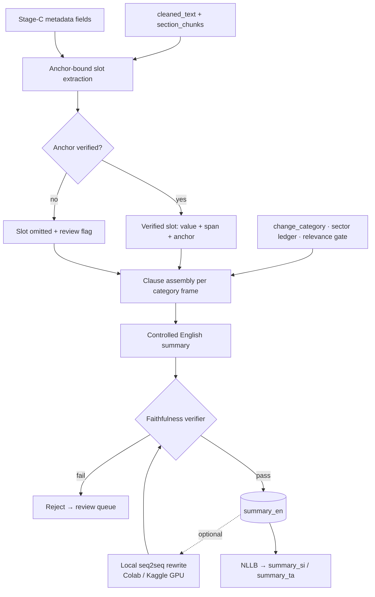

# 19 — Module 1: Regulation Summarization (Stage E)

> How a Sri Lankan gazette notice becomes a short, correct, SME-readable summary — from raw extracted text plus the structured fields already recovered in Stage B/C, through an approach comparison, to a selected design whose central property is that **it cannot state a figure the source does not contain**.
>
> Companion to [04_M1_Preprocessing_Pipeline.md](04_M1_Preprocessing_Pipeline.md) (what produces the input), [10_M1_Sinhala_Tamil_NLP.md](10_M1_Sinhala_Tamil_NLP.md) §10 (what consumes the output), and `final/works/PROGRAM_READINESS/M1_SUMMARIZATION_TRANSLATION_READINESS_PLAN.md` (the operational readiness plan this document supplies the method for).

> [!warning] Truth-ledger sync — 2026-08-02
> Summarisation and translation are independent of the classifier change and this document stands.
> The measured state as of 2026-08-01: English summary generation passes **80/80 (100%)**, but numeric-locale checking passes **10/152 (6.58%)** with 7 rows flagged. The translation queue holds **1145** items. Numeric-locale handling is the weakest link in the chain and should be treated as the next work item here.
>
> **Canonical record:** [[final/works/11_CLASSIFIER_FREEZE_AND_INTEGRATION|11_CLASSIFIER_FREEZE_AND_INTEGRATION]] · [[18_M1_Dataset_And_Model_Lineage]] · `final/works/evidence/M1_OPERATING_EVIDENCE_2026-08-02.json`
> **Submitted-report copy:** [[final/report/Enigmatrix_Consolidated_Final_Report_FULL|Enigmatrix_Consolidated_Final_Report_FULL]] (Part I = group report, Part II = Module 1 dissertation).

---

## 0. Where This Document Sits in the Pipeline

Stage E of the A–G pipeline. It runs **after** classification and **before** translation:

```text
A ingest → B extract → C preprocess → D classify → [E SUMMARISE] → E2 translate → F alert → G measure
                          │                │              │
                     cleaned_text     change_category   summary_en
                     + 6 metadata     + sector ledger   │
                       fields         + relevance       └──▶ NLLB → summary_si / summary_ta
```

Its position is not arbitrary. A summary that runs **before** classification cannot know whether the notice is SME-facing, so it cannot avoid writing SME-action language about a land-title settlement or a public-service appointment. A summary that runs **after** translation would be translating uncontrolled prose. Stage E sits where it does because it is the only point at which both the source text and the interpretive context exist.

---

## Abstract

Summarization in this module is a **compliance-communication** problem, not a text-compression problem. The reader is an SME owner deciding whether a gazette affects them; the cost of an omitted summary is an unread notice, and the cost of a *wrong figure in a confident summary* is an SME acting on a rate, date or penalty that does not exist. Those costs are not symmetric, and the design follows from that asymmetry.

This document specifies **field-grounded constrained generation**: the summary is assembled from verified slots, where a slot may only be filled by a value that is (a) present verbatim in the source text and (b) bound to that slot by a verified anchor, and where an unverifiable slot produces an **omitted clause rather than a hedged one**. An optional abstractive layer may rewrite the assembled text for fluency, but only through a deterministic verifier that rejects any output introducing a literal absent from the source.

The claimed contribution is **faithfulness by construction** — hallucination of regulatory figures is prevented structurally rather than detected statistically. §3 gives the measurement that motivates it, including the finding that verbatim-presence checking alone would catch **0 of 52** observed field errors, which is why the design needs anchor binding and not just span grounding.

**Implementation status:** 🟡 **First conservative backend slice built, not final evidence-complete.** As of 2026-08-02 the deterministic 80-English audit passed 80/80, and the sentence counter was repaired after `No.` in Act citations created four false length failures. Seven genuine low-margin classifier reviews remain. The SI/TA numeric audit had passed only 10/152 locale checks under machine translation; **§8.2 replaces MT for summaries with localised composition from the same verified slots, which makes numeric preservation exact by construction rather than something to re-audit** — the 144 queued replacement jobs are correspondingly no longer the path to a correct Sinhala summary. These engineering checks do not replace the planned human harm/faithfulness review, production `cleaned_text` diagnostic, or review workflow, and the SI/TA template wording still needs a native-speaker legal review.

### 0.1 Current decision

The correct implementation path is:

```text
extract better anchored facts first
→ assemble a controlled English evidence summary
→ verify every literal and every role
→ persist summary_en with provenance and review flags
→ queue NLLB translation for summary_si / summary_ta
→ optionally add a fluency rewrite only after the verifier exists
```

The best first version is therefore **not** an LLM summariser and not a plain template. It is a deterministic, anchor-bound, evidence-card summariser whose output can be rejected before it reaches SMEs. The optional neural layer may improve style later, but it must never become the source of regulatory facts.

### 0.2 2026-08-01 backend slice

The first built slice implements the safe part of this design:

| Area | Status |
|---|---|
| Pure summary service | Added at `enigmatrix-backend/app/m1/services/summary_service.py`. |
| DB provenance | Added summary status/source/model/version/flags/hash fields via Alembic revision `202608010002`. |
| Per-row task | Added `summarise_gazette_task`; rows at `classified` can advance to `summarized`. |
| Batch backfill | Added `scripts/generate_regulation_summaries.py`; dry-run unless `--write` is supplied. |
| Translation handoff | Added `scripts/enqueue_missing_m1_translations.py`; reuses `m1_translation_jobs`. |
| Tests | Added `app/tests/unit/test_m1_summary_service.py`. |

The service currently emits short controlled English evidence summaries using classification context, sector ledger values, ingest gazette identity, anchored effective-date phrases, and simple anchored figure/legal-reference slots. If a hard gate fails — missing source text, missing category, low-margin model row under the configured threshold, ungrounded output literal, unsafe non-SME wording, or length failure — it does **not** write `summary_en`; it records review flags instead.

### 0.3 2026-08-02 slice — routing hold + localised trilingual composition

Two changes, both consequences of the same observation: *a summary is composed from its classification, so it must not exist before the classification does, and once it does exist it is a template rather than prose.*

| Area | Status |
|---|---|
| Routing hold | Unrouted rows park at `summary_status='held'` with ordered `summary_hold_reasons` instead of being summarised or silently skipped. §8.1 |
| Release paths | Four: hourly Beat sweep, Stage-D completion, admin routing save, manual/force endpoint. §8.1 |
| Localised composition | `summary_si` / `summary_ta` composed from the same verified slots as `summary_en` via `summary_locale.py` — no MT, no GPU, literal parity asserted per row. §8.2 |
| Summary language of record | New `summary_lang` records the document's own locale (`eng`/`sin`/`tam` → `en`/`si`/`ta`); `mixed`/`unknown` lead with English |
| Migration | `202608020002` — `held` job + summary statuses, hold-reason arrays, `summary_lang`, and a backfill that parks the pre-existing unrouted summary queue |
| Percentage extraction fix | `_PERCENT_RE` could never match `%`; every rate change had been summarised without its rate. §9 failure 14 |
| Model version | `m1_anchor_bound_summary_v1` → `v2`, so a mixed corpus stays attributable |
| Tests | `test_m1_localised_summary.py` (32 cases), `test_m1_summary_hold_release.py` (17), `test_m1_summary_translation_gate.py` extended 16 → 18 |

---

## 1. What the Summary Has To Do

Six requirements, each of which rules out at least one otherwise-reasonable approach:

| #   | Requirement                                                                 | What it rules out                                                                        |
| --- | --------------------------------------------------------------------------- | ---------------------------------------------------------------------------------------- |
| R1  | State **what changed** in one clause a non-lawyer can act on                | Extractive sentence selection — gazette prose is not written in summary-shaped sentences |
| R2  | Preserve every rate, amount, date, threshold and legal citation **exactly** | Any free-running abstractive model without a verifier                                    |
| R3  | Never assert an obligation the source does not create                       | Zero-shot LLM prompting with no grounding contract                                       |
| R4  | Say nothing SME-facing when `is_sme_relevant = false`                       | Summarising before classification                                                        |
| R5  | Survive OCR damage without propagating it as fact                           | Trusting extracted fields uncritically (§3)                                              |
| R6  | Be translatable into Sinhala and Tamil without losing figures               | Idiomatic or elliptical English                                                          |

**R2 and R3 are the load-bearing ones.** A summary that says a levy is "Rs. 5.00 per kg" when the gazette says "Rs. 50.00 per kg" is worse than no summary at all: it is confidently actionable and wrong, and the SME has no way to detect it. This is the same failure class as the FLORES-200 language-code trap in [10_M1_Sinhala_Tamil_NLP.md](10_M1_Sinhala_Tamil_NLP.md) §10.3 and the Wijesekara ordering constraint in §5 of that document — **a confident wrong answer with nothing downstream to flag it.** The module has now met this failure three times in three different subsystems, which is itself an argument for handling it structurally.

### 1.1 Why generic summarization evaluation does not apply

ROUGE and BERTScore measure overlap with a reference summary. Here:

1. **There is no reference set.** No human-written gazette summaries exist in the corpus.
2. **Overlap is the wrong target anyway.** A summary can score well on ROUGE while inverting a rate, and score poorly while being perfectly correct but differently worded.
3. **The failure that matters is rare and catastrophic**, not average and mild. A metric that averages over 1,110 documents will not surface the one that fabricated a penalty.

§7 specifies what replaces them.

---

## 2. The Input Contract

### 2.1 What Stage C actually hands over

From `m1/preprocessing/types.py`, `PreprocessedGazette`:

| Field | Type | Role in a summary |
|---|---|---|
| `regulation_id` | str | Provenance |
| `gazette_number` | str \| None | Citation — **and the least reliable field, see §3** |
| `effective_date` | date \| None | The single most actionable fact when present |
| `penalty_range_lkr` | str \| None | Legacy single-string form derived from `penalties` |
| `penalties` | list[Penalty] | Per-clause: type, `min_lkr`, `max_lkr`, `imprisonment_months`, ±40-char `context` |
| `principal_act_amended` | str \| None | Legal basis |
| `amendment_type` | `amendment` \| `repeal` \| `new_act` | Whether something is created, changed or removed |
| `primary_language` | `en`/`si`/`ta`/`mixed` | Routing |
| `cleaned_text` | str | Primary evidence |
| `classification_chunk` | str | First window of first section — Stage D input |
| `section_chunks` | list[Chunk] | **All chunks — explicitly the Stage E input** |
| `sections` | list[SectionInfo] | Per-section language detection |

The `Penalty.context` field deserves note: it already carries a ±40-character excerpt around each match. **That is a source span**, and it is the pattern the rest of the slot contract generalises (§5.1).

### 2.2 What Stage D adds

| Field                        | Note                                                                  |
| ---------------------------- | --------------------------------------------------------------------- |
| `change_category`            | One of the frozen 8 (V6 taxonomy)                                     |
| `sector ledger`              | Sector applicability from `m1_regulation_sectors` / expert routing. The frozen LinearSVC model does **not** emit sectors. |
| `is_sme_relevant`            | Derived from category + sector/manual routing; this is the gate for R4 |
| `classifier_confidence`      | **`NULL` on the production backend**                                  |
| `classifier_decision_margin` | An uncalibrated margin — rankable, not thresholdable as a probability |

The confidence and sector contracts from [[11_CLASSIFIER_FREEZE_AND_INTEGRATION]] §7 reach directly into this design. A summariser cannot gate on "classifier confidence ≥ 0.8" because **there is no calibrated confidence**. It also cannot say "for grocery retail" because the classifier predicted that sector: the frozen primary is category-only. Routing must instead use `expert_verified`, `classification_source`, the sector ledger, and — when a threshold is used — `classifier_decision_margin` as a *rank*, not a probability.

### 2.3 Source priority

```text
1. section_chunks        — the designed Stage E input; full document, section-aware
2. cleaned_text          — when chunks are unavailable
3. classification_chunk  — first window only; sufficient for short notices
4. raw_text excerpt      — last resort, and always flags for review
```

---

## 3. The Measurement That Decided The Design

Before specifying anything, the obvious design — *fill a template from the extracted fields* — was tested against the extractors' real output.

**Method.** `m1.preprocessing.metadata_extractor.extract_metadata` was run over all **167 rows of the V6 temporal test split**. Ground truth for `gazette_number` was decoded from the row key, which encodes it by construction (`GZT_2487_02` → `2487/02`).

### 3.1 Result

| Field | Outcome |
|---|---|
| `gazette_number` correct | **34 / 167 — 20.4%** |
| `gazette_number` **wrong value returned** | **52 / 167 — 31.1%** |
| `gazette_number` absent (`None`) | 81 / 167 — 48.5% |
| `effective_date` extracted | **0 / 167** |
| `effective_date` extracted, restricted to the 11 rows whose text **states** an effective date | **0 / 11** |

### 3.2 The finding that changes the design

> **All 52 wrong `gazette_number` values are literally present in the source text.**
>
> Verbatim-presence checking would catch **0 of 52 — 0%**.

The extractor is not fabricating. It is returning a real string from the document that belongs to a **different role** — most often a *cross-referenced* gazette rather than *this* gazette.

Worked instance, `GZT_2487_02` (a real V6 test row):

```text
extracted gazette_number : 2469/12        ← the RESCINDED order, cited in clause 2
true gazette_number      : 2487/02
```

Only 60.5% of rows contain their own true gazette number in the text at all, so for the remainder no grounded extraction is possible from body text and the number must come from ingest metadata.

### 3.3 The existing safety net does not catch it

`app/m1/services/metadata_confidence.score_metadata` was run on the extractor's own output for that row:

```text
gazette_number         0.95      ← the WRONG gazette, scored 0.95
effective_date         0.00
penalty_range_lkr      0.00
principal_act_amended  0.90      ← carries the OCR error "CommodityLevy"
needs_review           False     ← the row passes review clean
```

`gazette_number` scores 0.95 because it *matches the `\d{4}/\d{1,3}` shape* — the check validates form, not identity. And `effective_date` at 0.00 does not flag, because the review rule deliberately only flags fields that are **present but low**, so that an absent penalty range does not flood the queue. That rule is right for its own purpose and wrong as a summarisation gate.

### 3.4 The field that does not exist

`GZT_2487_02` imposes **`Rs. 50.00 per kg`** on maize (HS 1005.90). That is the single most decision-relevant number in the document.

**No field captures it.** `penalty_range_lkr` is `None` and `penalties` is `[]` — correctly, since it is a levy, not a penalty. The schema has fields for penalties, dates, acts and amendment types, and none for **rates, levies, duties, thresholds or tariff amounts**.

### 3.5 What follows

Three conclusions, each load-bearing:

1. **A template filled from extracted fields is not faithful.** It would have cited the wrong gazette on ~31% of rows, with a 0.95 confidence score attached.
2. **Span grounding alone is insufficient.** Every wrong value passes a verbatim check. The design needs **role binding**, not just presence.
3. **The field schema does not cover what a summary must say.** Rate/amount extraction is a prerequisite, not a nice-to-have (§10, step 1).

### 3.6 Honest limits on this measurement

- It runs on the dataset's `text` column — a constructed training field, some rows of which carry `TITLE:` / `OFFICIAL GAZETTE METADATA:` prefixes — **not** the production `cleaned_text` emitted by `preprocess_gazette`.
- `published_date` was unavailable (the V6 `date` column is 100% null), and `extract_effective_date` accepts it as a disambiguation aid. That does **not** explain 0-of-11 on rows that state the date in plain English.
- Ground truth is decoded from the row key, which is assumed correct.

**Treat these as a diagnostic that justifies the design, not as a production field-accuracy audit.** Running the same script against `cleaned_text` on live rows is step 0 of §10.

---

## 4. Approach Comparison

### 4.1 The five candidates

| | Approach | Mechanism |
|---|---|---|
| **A** | **Extractive** | Score sentences (TextRank / lead-k) and select the top-n verbatim |
| **B** | **Template / slot-filling** | Deterministic per-category sentence frames filled from extracted fields |
| **C** | **Fine-tuned abstractive seq2seq** | mT5 / IndicBART fine-tuned on (document, summary) pairs |
| **D** | **Zero/few-shot LLM** | Instruction-prompted generation from the document |
| **E** | **Field-grounded constrained generation** | Verified slots → assembled clauses → optional gated rewrite |

### 4.2 Decisive-constraint comparison

Following the convention used in [03_M1_Data_Collection.md](03_M1_Data_Collection.md), [09_M1_Annotation_Guidelines.md](09_M1_Annotation_Guidelines.md) and [10_M1_Sinhala_Tamil_NLP.md](10_M1_Sinhala_Tamil_NLP.md): the choice is named by **one decisive constraint**, not by an aggregate score.

|                                      | Faithful by construction?   | Needs reference summaries? | Runs offline?                   | Handles OCR noise                      | **The one thing that decides it**                                                                                                                                                                 |
| ------------------------------------ | --------------------------- | -------------------------- | ------------------------------- | -------------------------------------- | ------------------------------------------------------------------------------------------------------------------------------------------------------------------------------------------------- |
| **A** Extractive                     | Yes — output is source text | No                         | Yes                             | Propagates it verbatim                 | **Gazette sentences are 60–120 words of statutory subordinate clause.** Selecting three of them is not a summary a shop owner can act on. Fails R1 outright.                                      |
| **B** Template                       | **No** — see §3             | No                         | Yes                             | Propagates field errors as fact        | **It inherits the extractor's 31% wrong-gazette rate and presents it in fluent prose.** Determinism is not faithfulness.                                                                          |
| **C** Fine-tuned seq2seq             | No                          | **Yes — and none exist**   | Yes (Colab/Kaggle for training) | Learns to imitate it                   | **There is no training set.** Building one means hand-writing ~1,000 reference summaries — larger than the annotation effort that produced the classifier.                                        |
| **D** Zero/few-shot LLM              | No                          | No                         | **No**                          | Silently "corrects" it, inventing text | **It fabricates plausible regulatory figures**, which is the one failure this domain cannot absorb. Also breaks the module's offline-operation rule, held for fastText, Tesseract and NLLB alike. |
| **E** **Field-grounded constrained** | **Yes — by verifier**       | No                         | Yes                             | Routes to review instead of asserting  | **It is the only option where "the output contains no figure absent from the source" is a checkable property rather than a hope.** ✅ **Selected**                                                 |

### 4.3 Scored matrix

Presented because it is conventional, and read with the caveat that follows.

Weights: Faithfulness ×5 (R2/R3 are the requirements that can harm a user), Actionability ×3, Buildability-now ×3, Offline ×2, Trilingual-readiness ×2, Fluency ×1. Scores 1–5.

| Criterion | W | A | B | C | D | E |
|---|---:|---:|---:|---:|---:|---:|
| Faithfulness | 5 | 5 | 2 | 2 | 1 | 5 |
| Actionability for an SME | 3 | 1 | 4 | 4 | 5 | 4 |
| Buildable with what exists today | 3 | 5 | 4 | 1 | 3 | 4 |
| Runs offline / on free GPU | 2 | 5 | 5 | 4 | 1 | 5 |
| Translation-safe (R6) | 2 | 2 | 5 | 3 | 3 | 5 |
| Fluency | 1 | 1 | 2 | 5 | 5 | 3 |
| **Total (max 80)** | | **54** | **53** | **41** | **43** | **68** |

> **This table did not make the decision, and should not be presented as though it did.** The weights were chosen after the constraints in §4.2 were understood, and different defensible weights change the A/B ordering. Its honest value is narrower: it shows that E does not win by trading away everything else — it is not first on fluency and does not need to be. **The decision rests on §4.2 and §3.**

### 4.4 Practical build options

The implementation choice is slightly narrower than the research comparison above. In practice there are five ways to ship something in this codebase:

| Option | What would be built | Strength | Blocking weakness | Use it? |
|---|---|---|---|---|
| **P0: no generated summary** | Keep title/category only; send users to raw text | Honest and fastest | Does not meet the trilingual summary claim | Only as fallback |
| **P1: template from current fields** | Fill sentences from `gazette_number`, `effective_date`, `penalties`, `principal_act_amended` | Easy to build | Known to cite wrong gazettes and miss rates/dates | **No** |
| **P2: raw-text LLM prompt** | Prompt an LLM with cleaned text and ask for SME summary | Fluent | Fabricates plausible rates, prior values, and audiences | **No for production claim** |
| **P3: anchor-bound evidence summary** | Extract verified slots from `section_chunks`, assemble controlled English, reject on verifier failure | Correct by construction; no reference summaries needed | Less fluent; requires extraction work first | **Yes — first shipped version** |
| **P4: P3 + optional rewrite** | Rewrite only the verified P3 summary, then re-run verifier | Better readability | Adds GPU/model complexity but no new facts | Later, after P3 passes |

**Best option:** build **P3** first. It is the smallest version that can be defended as a technology contribution and as a safe SME-facing product. P4 is a usability enhancement, not the core method. P1 and P2 should appear only as baselines in evaluation, not as deployed approaches.

The phrase to use in the thesis is therefore:

> The system uses anchor-bound evidence summarisation, not open-ended abstractive summarisation. The generated English is a controlled evidence statement whose numbers, dates, citations and sector claims are mechanically verified before translation.

### 4.5 Worked example — one real gazette through all five

**Source:** `GZT_2487_02`, V6 temporal test split, category `TAX_RATE_CHANGE`; sector applicability shown here is from the sector ledger / manual routing (`grocery_retail` + `food_service`), not from the LinearSVC classifier. Abridged, with the real OCR noise retained:

> `...LEVY ACT, No. 48 oF 2007 Order under Section 2 1. BY virtue of the powers vested in me under Section 2 of the Special CommodityLevy Act, No. 48 of 2007, I, [Minister], ... do by this Order impose in respect of the commodity specified in Colunm (I) of the Schedule hereto a Special Commodity Levy at the rate specified in corresponding entry in Colunm (II)... Schedule Column (I) Column (II) Commodity ... H. S. Code ... 1. 10.05 1005.90 Other – maize Rs. 50.00 per kg 2. The Order ... published in the Extraordinary Gazette Notification No. 2469/12 of December 31, 2025, in respect of Maize (HS Code 1005.90) is rescinded with effect from May 05, 2026. 1A - PG 7686 - 428 (05/2026) ... 2A I fldgi ( ^I& fPoh - YS% ,xld ... 3. This Order shall be effective commencing from May 05, 2026 to December 31, 2026...`

Note the hazards, all genuine: `Colunm` (OCR, twice) · `CommodityLevy` (lost space) · transliterated Sinhala noise · a printer's code `1A - PG 7686 - 428` · **two** gazette numbers, only one of which is this document · **two** dates · an HS code · and the rate `Rs. 50.00 per kg`.

Extractor output on this row (measured, §3.3): `gazette_number='2469/12'` ✗ · `effective_date=None` ✗ · `principal_act_amended='Special CommodityLevy Act, No. 48 of 2007'` (OCR error retained) · `amendment_type='new_act'` (contestable — clause 2 rescinds) · `penalties=[]` ✓ · **rate: no field**.

---

**A — Extractive (lead-3 / TextRank):**

> "BY virtue of the powers vested in me under Section 2 of the Special CommodityLevy Act, No. 48 of 2007, I, [Minister], do by this Order impose in respect of the commodity specified in Colunm (I) of the Schedule hereto a Special Commodity Levy at the rate specified in corresponding entry in Colunm (II) of that Schedule."

Faithful — it is the source. **Useless:** 60 words that never state the commodity, the rate, or the date. It also ships `Colunm` and `CommodityLevy` to the reader. *Fails R1.*

---

**B — Template from extracted fields:**

> "Gazette **2469/12** announces a tax or levy change under the Special **CommodityLevy** Act, No. 48 of 2007. Grocery retail and food service SMEs may be affected. No effective date was recorded."

Fluent, actionable-looking, and **wrong on the document's identity** — it cites the rescinded order. It repeats the OCR error as a legal name, and says no effective date was recorded when the text states one twice. *Fails R2, R5.* This is §3 in one sentence: determinism is not faithfulness.

---

**C — Fine-tuned seq2seq:** cannot be produced. No (document, summary) training pairs exist.

---

**D — Zero-shot LLM (representative of the failure mode):**

> "The government has imposed a Special Commodity Levy of Rs. 50 per kilogram on imported maize, effective 5 May 2026, replacing the previous levy of Rs. 25 per kg. Importers and food manufacturers should update their costings."

Reads best of the five. It gets the rate and date right — **and then invents `Rs. 25 per kg`** (no previous rate appears anywhere in the source), adds `imported` (the schedule does not say so), and manufactures an audience. Three fabrications, each plausible, none flagged. *Fails R3 — catastrophically, because it is the most convincing output on the page.*

---

**E — Field-grounded constrained generation (selected):**

> "A Special Commodity Levy of **Rs. 50.00 per kg** applies to maize (HS 1005.90) from **May 05, 2026** to **December 31, 2026**, under the Special Commodity Levy Act, No. 48 of 2007. This replaces the levy order published in Gazette **2469/12**. Grocery retail and food service businesses handling maize may be affected. *(Gazette number unverified — flagged for review.)*"

Every literal is anchor-verified. `Rs. 50.00 per kg` is bound by the schedule-row anchor; both dates by the `effective commencing from … to …` anchor; `2469/12` by the `published in the Extraordinary Gazette Notification No. …` anchor, which binds it to the **cross-reference** slot, not the identity slot — so it is stated as what it is. The document's own gazette number failed anchor verification and is therefore **omitted and flagged**, not guessed. `CommodityLevy` is normalised only because the act-name slot matched a known-act lexicon; had it not, the slot would have been omitted.

**This is the whole argument in one example.** The template got the identity wrong and sounded certain. The LLM got the rate right and invented a comparison. The constrained design stated what it could verify, omitted what it could not, and said which was which.

---

## 5. Selected Design — Field-Grounded Constrained Generation



### 5.1 The slot contract

A slot is never a bare value. It is:

```python
@dataclass(frozen=True)
class VerifiedSlot:
    name: str            # "levy_rate" | "effective_date" | "gazette_number" | ...
    value: str           # normalised surface form
    source_span: tuple[int, int]   # character offsets into cleaned_text
    anchor: str          # the pattern that BOUND it to this slot
    anchor_score: int    # anchor strength
    verified: bool
```

This generalises `Penalty.context`, which already carries a ±40-character excerpt — the codebase's existing instinct, made into a contract.

### 5.2 The four invariants

| | Invariant | Statement | Why it is not redundant |
|---|---|---|---|
| **F1** | **Span grounding** | Every literal in the output appears verbatim in `cleaned_text` after normalisation | Blocks fabrication (the LLM's `Rs. 25 per kg`) |
| **F2** | **Anchor binding** | Every literal is bound to its slot by a verified anchor, never by first-match or position | **F1 alone catches 0 of 52 observed errors (§3.2).** This is the invariant the measurement forced |
| **F3** | **Omission over invention** | An unverified slot yields an omitted clause and a review flag — never a hedge, a guess, or a default | Prevents "No effective date was recorded" when one exists |
| **F4** | **Relevance gating** | No SME-action wording when `is_sme_relevant = false` | R4 — a land-title notice must not read as a compliance duty |

**F2 is the technical core.** It is what separates this design from a template, and it exists because a measurement said F1 was insufficient.

### 5.3 The verifier

Deterministic, stdlib-only, unit-testable in isolation — the same design constraint that makes `promotion.decide()` and `alert_content.build_alert()` testable without a database. It rejects a candidate summary when:

| Check | Rejects when |
|---|---|
| Literal grounding | Any number, date, percentage or currency amount in the output is absent from the source after normalisation |
| Anchor coverage | Any slot filled without a verified anchor |
| Sector containment | A sector named that is not in the expert/manual sector ledger for the regulation |
| Relevance | SME-action wording present while `is_sme_relevant = false` |
| Figure preservation | A figure present in the title or schedule is silently dropped |
| Length | Outside 1–3 sentences |
| OCR damage | Source damage score above threshold → route to review, do not summarise |

A rejection is not an error. It routes the row to the admin review queue with the failed check named.

### 5.4 Correct Stage-E procedure

The production procedure should be deterministic up to the optional rewrite:

| Step | Procedure | Output |
|---|---|---|
| **E0** | Load the regulation row, `cleaned_text`, all `section_chunks`, extracted metadata, penalties/sub-documents, `change_category`, `classification_source`, `classifier_decision_margin`, and sector ledger rows. | Complete source bundle |
| **E1** | Refuse automatic summarisation when the row is not classified/verified enough for the selected policy. Low-margin rows can still be queued, but with `summary_status='review_required'`. | Eligibility decision |
| **E2** | Build candidate slots from `section_chunks`, not only `classification_chunk`. The classifier head chunk is allowed only as a fallback for very short notices. | Candidate slots |
| **E3** | Bind each slot to a role-specific anchor: identity gazette, cross-referenced gazette, effective-from date, effective-to date, rate/levy/duty, penalty, principal act, affected commodity/product, sector applicability. | `VerifiedSlot` list |
| **E4** | Compose a controlled English summary from verified slots and category-specific frames. Missing slots produce omitted clauses and named quality flags. | Draft `summary_en` |
| **E5** | Run the verifier: literal grounding, anchor coverage, sector containment, relevance gate, figure preservation, length, OCR damage. | Pass/reject |
| **E6** | Persist only passing summaries. For rejected summaries, leave `summary_en=NULL`, store the failed checks, and show the row in admin review. | DB write or review item |
| **E7** | When `summary_en` is written, enqueue `summary -> si` and `summary -> ta` through the existing `m1_translation_jobs` pull queue. | NLLB jobs |
| **E8** | Human review can approve, edit, or force re-generation. Manual edits must win over later machine output unless the admin explicitly requests retranslation. | Reviewed summary |

This procedure is intentionally conservative. It makes "not enough verified evidence to summarise" a valid system output. That is better than producing a fluent paragraph whose legal facts cannot be defended.

### 5.5 The optional abstractive layer, and where it runs

The assembled output is correct but stilted. A **local, offline** seq2seq model may rewrite it for fluency — under two rules:

1. **The rewrite is input-constrained.** It rewrites the *assembled summary*, not the source document. It has no opportunity to introduce a figure, because it never sees one that is not already verified.
2. **The rewrite re-enters the verifier.** Any output failing §5.3 is discarded and the assembled version ships instead. The fluent version is a bonus, never a dependency.

**Compute placement** follows the pattern already proven in this module. No paid API and no external inference service: local CPU where it fits, and **free GPU on Colab or Kaggle** where it does not — exactly as XLM-R training ran on Kaggle and NLLB translation runs on Colab.

For the GPU path, reuse the pull-based lease architecture from [[12_TRILINGUAL_TRANSLATION_PIPELINE]] rather than inventing a second one: a `m1_summary_jobs` table with `UNIQUE (regulation_id, field)` idempotency, `source_sha256` drift detection, `FOR UPDATE SKIP LOCKED` leasing, and a visibility timeout so a reclaimed Colab session loses nothing. That design already answers *"what happens when the free GPU vanishes mid-batch?"*, and the answer should not be re-derived.

**The fluency layer is explicitly optional.** If it is never built, the system still produces correct summaries. That ordering is the point.

---

## 6. The Novelty Claim

### 6.1 What is claimable

> **A regulatory summarisation pipeline in which faithfulness to source figures is a structural property of the generator, enforced by anchor-bound slot verification, rather than a behaviour hoped for from a language model and measured after the fact.**

Three defensible components:

1. **Anchor binding as a necessary condition, established empirically.** The measurement in §3.2 — that verbatim-presence checking catches **0 of 52** real field errors because every wrong value is genuinely in the document — is a concrete result about grounding in citation-dense legal text. Most faithfulness work in summarization treats "supported by the source" as the criterion. In a document that cites four other documents, support is not enough; **role** is the criterion. That distinction is stated, measured, and designed for here.
2. **Omission as a first-class output.** F3 makes "this field could not be verified" a produced result rather than a silent gap. The `GZT_2487_02` walkthrough shows the difference: the template asserts a wrong gazette number confidently; the constrained design omits the identity and says so.
3. **A faithfulness-first pipeline for a low-resource trilingual legal domain**, where the standard route — fine-tune an abstractive model on reference summaries — is unavailable because no reference summaries exist, and the standard fallback — prompt an LLM — is unacceptable because the failure mode is fabricated compliance obligations.

### 6.2 What is *not* claimable, and should be said first

Stating these before an examiner does is worth more than the claims themselves.

| Not novel | Why not |
|---|---|
| Constrained / grounded generation as an idea | An active research area. Data-to-text, copy mechanisms, constrained decoding and hallucination detection are all established. |
| Slot-filling summarization | Decades old. |
| Faithfulness metrics for summarization | An established literature (QAGS, FactCC, SummaC and successors). |
| NLLB, XLM-R, TF-IDF, Tesseract, fastText | All third-party components, selected — not built — and selected for stated constraints. |

**The novelty is the combination and the domain, not the mechanism.** Specifically: the application to Sri Lankan trilingual gazette notices, the measurement showing that span grounding is insufficient in citation-dense legal text, and the engineering result that a system with *no reference summaries at all* can still make a checkable faithfulness guarantee. That is a modest, defensible claim. An overstated one collapses under the first question about copy mechanisms.

### 6.3 The strongest question this will face

*"Isn't this just a template with extra steps?"*

The answer is §3, and it should be given as a number: a template filled from the extracted fields cites the **wrong gazette on 31.1% of test rows**, with a 0.95 confidence score and `needs_review=False` attached. The difference between a template and this design is the difference between filling a slot and **proving a slot may be filled** — and that difference is worth 52 wrong citations on 167 documents.

---

## 7. Evaluation Without Reference Summaries

Reference-free by necessity, and reference-free by design (§1.1).

### 7.1 Automatic, deterministic — run on every summary

| Metric | Definition | Target |
|---|---|---|
| **Literal grounding rate** | Fraction of output literals present verbatim in the source | **1.00 — a hard gate, not a target** |
| **Anchor coverage** | Fraction of filled slots carrying a verified anchor | 1.00 |
| **Figure preservation** | Fraction of source figures in title/schedule that survive into the summary | Report; a low value means over-omission, not error |
| **Omission rate** | Fraction of summaries with ≥ 1 omitted slot | Report per category — the honest cost of F3 |
| **Relevance-violation rate** | SME-action wording present while `is_sme_relevant = false` | **0** |
| **Rejection rate** | Candidates rejected by the verifier | Report; a spike is an upstream extraction regression |

The first and fifth are **gates**. The rest are diagnostics, and their job is to make the cost of faithfulness visible rather than to be maximised.

### 7.2 Human evaluation — a bounded, affordable protocol

A stratified sample of **80 summaries** — 10 per category — rated by two assessors on three binary axes:

| Axis | Question |
|---|---|
| **Correctness** | Does the summary assert anything the gazette does not? |
| **Actionability** | Could a shop owner decide from this whether it affects them? |
| **Harm** | Would acting on this summary alone cause a wrong compliance action? |

Report per-axis agreement (Cohen's κ) using the same protocol as [09_M1_Annotation_Guidelines.md](09_M1_Annotation_Guidelines.md) §6. **Harm is the one that matters** and should be reported as a raw count, never a percentage — "3 of 80 summaries could cause a wrong action" is informative; "96.3% harmless" is not.

### 7.3 The comparison worth running

The strongest evidence for §6 is an ablation on the same 80 documents:

| Arm | What it isolates |
|---|---|
| B — template from extracted fields | The baseline the design claims to beat |
| D — zero-shot LLM | The fluent-but-fabricating alternative |
| E — constrained, verifier on | The proposal |
| E′ — constrained, **verifier off** | **The ablation that isolates the contribution** |

E vs E′ is the experiment that shows the verifier is doing work rather than decorating the pipeline. Pre-register the decision rule before running it, consistent with `enigmatrix-ml/research/preregistration.md`.

### 7.4 Trilingual evaluation

Translation faithfulness is measured **separately** from summarisation faithfulness — otherwise a translation error is scored against the summariser:

| Check | Target |
|---|---|
| Numeric preservation EN → SI/TA | **1.00 — deterministic, checkable without a Sinhala/Tamil reader** |
| Gazette number / act name preservation | 1.00 |
| Adequacy, human-rated on a sample | Report |

Numeric preservation is the highest-value check in the trilingual leg precisely because it needs no bilingual assessor: the digits either survive or they do not. See [[12_TRILINGUAL_TRANSLATION_PIPELINE]] §6.1 — MT quality is currently unmeasured, and this is the cheapest first measurement of it.

---

## 8. Trilingual Handoff

Two rules inherited from [10_M1_Sinhala_Tamil_NLP.md](10_M1_Sinhala_Tamil_NLP.md) §10 and worth restating because they constrain the English:

1. **Translate from controlled English, never from Sinhala/Tamil OCR.** English is the pivot because it is the only language whose text has been cleaned, verified and constrained.
2. **Write English that survives translation.** Short declarative clauses; figures adjacent to their units (`Rs. 50.00 per kg`, not `a levy of fifty rupees on each kilogram`); no idioms; no elliptical constructions. R6 is a constraint on the English generator, not a hope about NLLB.

`summary_en` is an enqueue trigger in the shipped translation pipeline — `preprocess_gazette` tops up any field that became non-empty — so Stage E writing `summary_en` queues translation automatically, with no new wiring, because the `UNIQUE (regulation_id, field, target_lang)` contract makes re-enqueue free.

**As of 2026-08-02 that queue is the exception path for summaries rather than the primary one.** §8.2 explains why.

### 8.1 The routing hold — a waiting queue, not a drop

Stage E2 was gated on 2026-08-02 so that an unrouted regulation's summary is not handed to the borrowed Colab GPU. The gate is four conditions:

| # | Condition | Source |
|---|---|---|
| 1 | `domain_code IS NOT NULL` | admin routing |
| 2 | `change_category IS NOT NULL` | Stage D, or expert override |
| 3 | ≥ 1 row in `m1_regulation_sectors` | expert sector ledger |
| 4 | `is_sme_relevant IS TRUE` | derived, admin-settable |

3 and 4 are checked **independently** even though §1.3 derives `is_sme_relevant = any(sectors)`: the ledger is expert routing while the flag can be admin-set, and a disagreement between them is exactly the case that must not be published. `None` is not consent.

The first implementation of that gate **dropped** the work — it removed `summary` from the enqueue field list and returned. Nothing was recorded, so a row that became fully routed later was never revisited: the summary and its translations simply never happened, and the only trace was a log line that scrolled away. Because Stage D runs after extraction and expert routing runs after Stage D, *every* gazette passes through the gate while unrouted, so this was the normal case, not an edge one.

The gate now **holds**:

```text
Stage E   ──not routed──▶  summary_status = 'held'        (no summary written)
Stage E2  ──not routed──▶  translation job status='held'  (no GPU slot consumed)
                                  │
                          routing completes
                                  ▼
              summary composed EN/SI/TA  +  jobs → 'pending'
```

**Why the summary itself is held, and not merely its translation.** A summary is composed *from* the classification: sentence 1 is derived from `change_category` and sentence 2 names the sectors from the ledger. Composing one before those exist produces a confident paragraph about a routing that is still going to change — and because the applier fills blanks only (it never overwrites), that first wrong summary would then *block* the correct one. The hold is not an optimisation; it is what keeps a summary consistent with the routing it describes.

**A hold is not a review.** The two look identical from outside (no summary) and have completely different owners:

| State | Meaning | Owner | Clears by itself? |
|---|---|---|---|
| `held` | waiting on routing metadata | pipeline / routing expert | **yes** |
| `review_required` | facts could not be anchored | summary reviewer | no |

Conflating them is what made the backlog invisible before this change. `summary_status` now distinguishes them, and `summary_hold_reasons` carries the ordered reason codes so the queue can name the missing field rather than showing an unexplained gap.

**Four release paths**, all funnelling into `summary_hold_service.release_regulation`:

| # | Trigger | Latency | Why it exists |
|---|---|---|---|
| 1 | Beat sweep `m1-release-summary-holds-hourly` | ≤ 1 h | The **backstop**. Catches routing changed outside the application — a data import, a direct SQL fix, a hook that raised. Cadence is DB-backed and editable from `/admin/settings`. |
| 2 | `classify_gazette` completion | immediate | Stage D supplies `change_category`, the condition most rows wait on |
| 3 | Admin routing save (`update_regulation`, sector ledger write) | immediate | An expert who finishes routing sees the summary appear |
| 4 | `POST /m1/translation/holds/{id}/release` | on demand | Impatience, and `?force=true` for override |

Having all four is not redundancy. 2 and 3 make the system feel immediate; 1 makes it *correct* regardless of how the data moved. With only the hooks, rows change routing through paths nobody instrumented and are silently missed. With only the sweep, an expert waits an hour to see their own work. Triggers 2 and 3 are best-effort and swallow their errors — a release must never fail the classification or the admin save that triggered it — which is safe precisely because trigger 1 exists.

`force=true` skips the routing gate. It does **not** skip verification: a force-released row must still produce a summary whose every literal is anchored in the source document, because that check is about whether the facts are in the gazette, which no amount of admin intent changes. Forced releases are audited (`m1.summary.hold_release`).

**Backfill.** Migration `202608020002` parks every pre-existing pending non-manual `field='summary'` job whose regulation is not fully routed. This is the "explicit cancel pass" the previous session left open, done as a hold rather than a cancel: it frees the GPU slot *without* losing the request, which a cancel would have.

### 8.2 Localised composition — why SI/TA are not machine-translated

The Stage-E summary is not prose. It is:

```text
<category frame>   <sector scope>   Verified facts: <slot values>.
```

Everything except the slot values is a fixed string from a table of about a dozen entries. **A fixed string is translated once, by a human, and reviewed once**; machine translation re-translates it on every row and can be wrong on any of them. So `summary_si` and `summary_ta` are now *composed* from the same verified slots as `summary_en`, using localised templates in `app/m1/services/summary_locale.py`.

The stakes are measured, not hypothetical. The Session-105 SI/TA numeric audit failed **142 of 152 checks** — NLLB rewriting `Rs. 2,500` and `2478/1` into digits that do not appear in the gazette. Those literals are the only part of a summary an SME acts on. Composition makes that class of error *structurally impossible*: the slot value is copied through verbatim, never passed through a model.

Three properties follow, and each is asserted rather than assumed:

1. **Literal parity.** Every gazette number, money amount, percentage, date and legal reference in the English summary appears verbatim in the Sinhala and Tamil ones. `_literal_parity_flags` checks this per row and **drops** a locale that fails rather than shipping figures that disagree across languages. Parity holds by construction, so a failure means a template bug — a `{value}` placeholder dropped from a translated string — which is otherwise silent.
2. **English stays canonical.** Grounding verification runs against English only; it is the language the slots were anchored in. A Sinhala summary is accepted because it is the same facts in a reviewed template, not because it was independently verified.
3. **Zero GPU cost.** A trilingual summary now costs no Colab seconds at all. The ~1145-item pull queue keeps its capacity for `title` and `real_world_example`, which are free text and genuinely need a model.

**Language of record vs. language of the document.** `m1_regulations.summary_lang` records which locale is the *document's own* — `eng`/`sin`/`tam` → `en`/`si`/`ta`, with `mixed` and `unknown` leading with English because English is the language the facts were verified in. It changes which summary the UI leads with; it does not change what is composed. A Tamil gazette therefore gets a Tamil summary that leads, plus Sinhala and English renderings of the same verified facts — which is what "summarise in its own language and translate to the others" means once the summary is a template rather than prose.

**What is not translated:** slot values, sector codes (they are join keys), and a `change_category` code that has no frame. They are reproduced exactly as they appear in the source, in every language. Quoting a statute's figure is the one place where literal fidelity outranks fluency.

**Open:** the SI/TA template strings are a first human pass and have not been reviewed by a native-speaker legal translator. They are template copy, not extracted content, so a wording correction is a one-line edit in `summary_locale.py` that takes effect for every row — a much cheaper review surface than per-row MT output. §7.4's numeric-preservation check should now read 1.00 by construction for composed rows; it remains the correct check for any locale still filled by NLLB.

---

## 9. Failure Modes

| # | Failure | Detection | Response |
|---|---|---|---|
| 1 | Wrong gazette number from a cross-reference | Anchor binding (F2) | Omit identity, flag |
| 2 | Effective date present but unextracted | Anchor recall check against date phrases | Omit, flag; the missed-date rate is a tracked metric |
| 3 | OCR corrupts a figure (`Rs. 5O.OO`) | Grounding normalisation fails to match | Reject, route to review |
| 4 | Levy rate has no field | Slot returns nothing | **Extend the schema (§10 step 1)** — do not paraphrase around it |
| 5 | Category is wrong | Not detectable at Stage E | Inherit the classifier's review flag; do not second-guess |
| 6 | Non-SME notice summarised as SME-facing | Relevance check (F4) | Reject |
| 7 | Rewrite layer introduces a figure | Verifier re-run after rewrite | Discard rewrite, ship the assembled version |
| 8 | Colab/Kaggle session vanishes mid-batch | Lease expiry | Jobs return to `pending`; nothing lost |
| 9 | Summary drifts from a re-extracted source | `source_sha256` mismatch | Re-open the job |
| 10 | Everything is omitted and the summary is empty | Slot count zero | Emit no summary rather than a contentless one; the field stays NULL and the row stays visible in the queue |
| 11 | Summary written against routing that then changes | Cannot be detected after the fact — the applier fills blanks only, so the wrong summary blocks the right one | **Hold before composing** (§8.1). The row waits at `summary_status='held'` instead of being summarised early |
| 12 | Held row never revisited because its routing changed outside the app | Not detectable by any hook | Hourly Beat sweep re-evaluates every held row (§8.1 trigger 1) |
| 13 | Localised template drops a `{value}` placeholder | Literal-parity check across locales (§8.2) | Drop that locale, flag `localised_summary_literal_drift_<lang>`; English is unaffected |
| 14 | Percentage never reaches the summary | *(was undetected until 2026-08-02)* | Fixed: `_PERCENT_RE` ended in `\b` after `%`, which can never match — `%` and the character after it are both non-word, so there is no boundary. Every rate change had been composing its summary without the rate |

Failure 10 is a deliberate choice: **a NULL summary is honest and a contentless summary is not.** The SME discovery page can render a title; it cannot detect that a summary said nothing.

Failure 14 is worth recording as a methodological point rather than a bug note: it was found by *reading the composed output of a worked example*, not by any test — every test asserted on fields the regex did match. A verifier that only checks what was emitted cannot see what was silently never extracted.

---

## 10. Implementation Plan

| Step | Work | Why in this order |
|---|---|---|
| **0** | Re-run the §3 diagnostic against production `cleaned_text` with `published_date` supplied | The design rests on these numbers; confirm them on the real input before building |
| **1** | **Rate / amount / threshold extraction** — new slot family with anchors (schedule rows, `at the rate of`, `per kg`, `per cent`) | §3.4: the most decision-relevant figure has no field. Nothing downstream is worth building first |
| **2** | Fix `gazette_number` — take identity from ingest metadata, and bind body-text occurrences to a *cross-reference* slot | Turns a 31% error into a correctly-typed field |
| **3** | Anchor-bound `effective_date` — 0 of 11 stated dates are currently found | The most actionable fact in an SME summary |
| **4** | `summary_service.py` — slot contract, category frames, verifier. **stdlib-only, no DB** | Unit-testable in isolation, as `promotion.decide` and `build_alert` are |
| **5** | `summarise_gazette` Celery task + `scripts/generate_regulation_summaries.py` | The readiness plan already specifies the CLI surface |
| **6** | Alembic migration: `summary_source`, `summary_status`, `summary_model_version`, `summary_generated_at`, `summary_quality_flags` | Provenance must exist before summaries do, or the first batch is unattributable |
| **7** | Admin review surface for rejected/flagged summaries | F3 produces flags; a flag with nowhere to go is a silent failure |
| **8** | The 80-document human evaluation and the E/E′ ablation | The evidence for §6 |
| **9** | *(Optional)* local seq2seq rewrite on Colab/Kaggle via a `m1_summary_jobs` lease table | Fluency, never a dependency |

Steps 1–3 are extraction work, not summarisation work. **That ordering is the finding of §3**: the summariser is not the bottleneck; the fields it would have to trust are.

Current implementation note: steps 4–6 now exist as a conservative first slice. Steps 0–3 and 7–9 are still required before this becomes final programme evidence.

### 10.1 Build gates

| Gate | Can proceed when | Do not claim yet |
|---|---|---|
| **G0 — diagnostic confirmed** | The §3 measurement has been rerun on production `cleaned_text` with `published_date` supplied. | Production field accuracy |
| **G1 — slot extraction ready** | Identity gazette, cross-reference gazette, effective dates, rates/levies/duties/thresholds, principal act and penalty slots carry spans and anchors. | Automated summaries |
| **G2 — constrained summary ready** | `summary_service.py` can produce `summary_en` or a named rejection without DB access, with literal grounding and anchor coverage tests. | Trilingual summary feature |
| **G3 — backend integration ready** | A Celery/backfill command writes `summary_en`, provenance, status and quality flags, then marks status `summarized` only on verifier pass. | Production pipeline completion |
| **G4 — translation ready** | Existing `m1_translation_jobs` drains `summary -> si/ta`; numeric preservation EN→SI/TA passes. | Verified Sinhala/Tamil summaries |
| **G5 — evaluation ready** | The 80-document human protocol and E/E′ ablation are complete. | Technology novelty as evidence, rather than design |

This gate order is the answer to "what should I work on next?" Build G0–G2 before any UI polish for summaries. A UI showing unsafe summaries is worse evidence than no summary UI.

---

## 11. Validation and Acceptance Criteria

**Extraction prerequisites**

- [ ] §3 diagnostic re-run against production `cleaned_text`; results recorded
- [ ] `gazette_number` identity accuracy ≥ 0.95 (from ingest metadata, not body text)
- [ ] Cross-referenced gazette numbers land in a cross-reference slot, never the identity slot
- [ ] `effective_date` recall ≥ 0.90 **on rows whose text states one** — measured against that denominator, not all rows
- [ ] Rate/amount slot family implemented, with per-anchor precision recorded

**Generation**

- [ ] Literal grounding rate **= 1.00** on every generated summary — hard gate
- [ ] Anchor coverage = 1.00
- [ ] Relevance-violation rate = **0** on a set including ≥ 20 `is_sme_relevant=false` rows
- [ ] Omission and rejection rates reported per category
- [ ] Verifier is stdlib-only and unit-tested with no database

**Human evaluation**

- [ ] 80 summaries, 10 per category, two assessors, κ reported per axis
- [ ] **Harm count reported as a raw count**
- [ ] E vs E′ ablation run with a pre-registered decision rule

**Trilingual**

- [ ] Numeric preservation EN → SI/TA = 1.00
- [ ] Gazette numbers and act names unchanged through translation
- [ ] `summary_si` / `summary_ta` populated wherever `summary_en` exists

**Operational**

- [ ] Rejected summaries appear in the admin review queue with the failed check named
- [ ] `summary_*` provenance columns populated on every write
- [ ] DB snapshots include summary fields for measurement
- [ ] An empty slot set produces a NULL summary, never an empty-but-present one

---

## 12. Cross-References

- **Input production — cleaning, metadata extraction, chunking:** [04_M1_Preprocessing_Pipeline.md](04_M1_Preprocessing_Pipeline.md)
- **Field schema and storage contract:** [02_M1_Data_Requirements.md](02_M1_Data_Requirements.md)
- **Classifier context and the confidence contract:** [[final/works/11_CLASSIFIER_FREEZE_AND_INTEGRATION|11_CLASSIFIER_FREEZE_AND_INTEGRATION]]
- **Translation consumer:** [10_M1_Sinhala_Tamil_NLP.md](10_M1_Sinhala_Tamil_NLP.md) §10 · [[final/works/12_TRILINGUAL_TRANSLATION_PIPELINE|12_TRILINGUAL_TRANSLATION_PIPELINE]]
- **Operational readiness plan and CLI surface:** `final/works/PROGRAM_READINESS/M1_SUMMARIZATION_TRANSLATION_READINESS_PLAN.md`
- **Human-agreement protocol reused for §7.2:** [09_M1_Annotation_Guidelines.md](09_M1_Annotation_Guidelines.md) §6
- **Where summaries are displayed:** [14_M1_Tracking_Workflows.md](14_M1_Tracking_Workflows.md) (S1 discovery) · alert bodies via `alert_content.build_alert`
- **Latency budget placement:** [07_M1_Deployment_Integration.md](07_M1_Deployment_Integration.md)
- **Completeness monitoring:** [12_M1_Monitoring_Maintenance.md](12_M1_Monitoring_Maintenance.md)
- **Dataset the §3 measurement ran on:** [18_M1_Dataset_And_Model_Lineage.md](18_M1_Dataset_And_Model_Lineage.md)
- **Status ledger:** [[final/works/03_FEATURE_CHECKLIST|03_FEATURE_CHECKLIST]]

---

## References

- Maynez, J., Narayan, S., Bohnet, B., McDonald, R. (2020). *On Faithfulness and Factuality in Abstractive Summarization*. ACL 2020. [arxiv.org/abs/2005.00661](https://arxiv.org/abs/2005.00661)
- Kryściński, W., McCann, B., Xiong, C., Socher, R. (2020). *Evaluating the Factual Consistency of Abstractive Text Summarization (FactCC)*. EMNLP 2020. [arxiv.org/abs/1910.12840](https://arxiv.org/abs/1910.12840)
- Wang, A., Cho, K., Lewis, M. (2020). *Asking and Answering Questions to Evaluate the Factual Consistency of Summaries (QAGS)*. ACL 2020. [arxiv.org/abs/2004.04228](https://arxiv.org/abs/2004.04228)
- Laban, P., Schnabel, T., Bennett, P., Hearst, M. (2022). *SummaC: Re-Visiting NLI-based Models for Inconsistency Detection in Summarization*. TACL. [arxiv.org/abs/2111.09525](https://arxiv.org/abs/2111.09525)
- See, A., Liu, P. J., Manning, C. D. (2017). *Get To The Point: Summarization with Pointer-Generator Networks*. ACL 2017. [arxiv.org/abs/1704.04368](https://arxiv.org/abs/1704.04368)
- Puduppully, R., Dong, L., Lapata, M. (2019). *Data-to-Text Generation with Content Selection and Planning*. AAAI 2019. [arxiv.org/abs/1809.00582](https://arxiv.org/abs/1809.00582)
- Xue, L. et al. (2021). *mT5: A Massively Multilingual Pre-trained Text-to-Text Transformer*. NAACL 2021. [arxiv.org/abs/2010.11934](https://arxiv.org/abs/2010.11934)
- Dabre, R. et al. (2022). *IndicBART: A Pre-trained Model for Indic Natural Language Generation*. ACL Findings 2022. [arxiv.org/abs/2109.02903](https://arxiv.org/abs/2109.02903)
- NLLB Team (2022). *No Language Left Behind: Scaling Human-Centered Machine Translation*. [arxiv.org/abs/2207.04672](https://arxiv.org/abs/2207.04672)
- Department of Government Printing Sri Lanka. *Gazette Extraordinary*. [documents.gov.lk](https://documents.gov.lk)

---

## ∞ Final-report reconciliation (2026-08-02)

*Added by the 2026-08-02 consolidation pass. Maps this document onto the submitted final report and records where the two disagree.*

**Where this document appears in the report:** Part I §3.12 (summarization and translation), Figure 22 (summarisation and Sinhala/Tamil translation flow) and Figure 23 (administrative translation review queue); Part II Figures 6.6–6.7, with Mermaid source.

### The chain, as the report draws it

`Extracted + cleaned regulation text` + `classification (change_category + affected_sectors)` → **controlled English summary generation** (inputs: title, domain, sectors, amendment type, cleaned text) → `summary_en`; `title_en` from the gazette or the title scraper → **NLLB-200 distilled 600M** on a Colab/Kaggle GPU → `title_si`, `title_ta`, `summary_si`, `summary_ta` → **quality check** (length, script, empty, truncation) → *pass* publishes to SME alerts and the dashboard in the user's preferred language; *fail* routes to the admin translation review queue.

Part II carries this as Mermaid source (Figure 6.6), which is the editable form.

### Measured state, 2026-08-01

| Check | Result |
|---|---:|
| English summaries sampled | 80 |
| English summaries passing | **80 (100%)** |
| Rows translated | 76 |
| Numeric-locale checks run | 152 |
| Numeric-locale checks passing | **10 (6.58%)** |
| Rows flagged for review | 7 |
| Translation queue depth | **1145** |

### What 6.58% means

The figure-masking pipeline the report describes (mask → split → translate → restore → verify) is not preserving numerics through the EN → SI/TA hop. Since Module 1's alerts carry rates, thresholds, deadlines and penalty amounts, a numeric that silently changes in translation is the highest-severity failure this module can produce — worse than a missed alert, because it is confidently wrong in the user's own language.

Treat this as a correctness defect, not a quality metric. The status statement in the report — that the production batch summary generator and bulk translation backfill are the remaining pieces — is accurate but understates the severity.
