# Module 1 — Complete Research and Implementation Master

> [!abstract] What this file contains
> This is the consolidated technical and research record for Enigmatrix Module 1. It follows the work from problem framing through gazette discovery, PDF extraction, OCR and Unicode recovery, preprocessing, annotation, classification, retrieval evidence, grounded summaries, translation, alerting, lag measurement, deployment, trial-and-error decisions, quantitative evidence, limitations, and the remaining promotion plan.

## Navigation

- **Whole-project master:** [[Final-Report/07_ENIGMATRIX_RESEARCH_MASTER_DOCUMENTATION|Enigmatrix complete research master]]
- **Module index:** [[00_INDEX]]
- **Submitted report snapshot:** [[Final-Report/28_Enigmatrix _Final_Draft_Report.pdf]]
- **Dataset/model lineage:** [[18_M1_Dataset_And_Model_Lineage]]
- **Summarization design:** [[19_M1_Regulation_Summarization]]
- **Multitask upgrade:** [[20_M1_Multitask_Classifier_Upgrade]]
- **Limitations:** [[21_M1_Data_Limitations_and_Risk_Register]]
- **Audited row counts:** [[22_M1_Data_Usage_and_Row_Count_Register]]
- **Retrieval branch:** [[23_M1_Retrieval_Augmented_Evidence_Branch]]
- **RA-HMT:** [[24_M1_RAHMT_Hybrid_Architecture]]

## 1. Authoritative status statement

### 1.1 What is primary today

The current production/default Module 1 classifier is the **V6 word-TF-IDF + class-balanced LinearSVC** model. Its fixed-split test result is:

- macro-F1: **0.947219986**;
- weighted-F1: **0.958475011**;
- accuracy: **0.958083832** — 160/167 correct;
- validation macro-F1: **0.924475508**;
- fixed split: **777 train / 166 validation / 167 test**;
- model artifact SHA-256: `1D7F84754421A881EE1B5FA0F008A0CC3DB4E24F52CE6D97CE155CB4D1923CFA`.

The default setting in the current backend is `linearsvc`. A LinearSVC decision margin is exposed separately; it is **not** represented as a calibrated probability.

### 1.2 What is advanced but not promoted

**RA-HMT**—the retrieval-augmented hierarchical multi-task architecture—has a recorded V7 evaluation and serving/persistence integration pieces, but it has not passed the fresh-holdout promotion process. The recorded full-system results on n=167 were domain macro-F1 **0.9351**, sector macro-F1 **0.9014**, relevance F1 **0.9400**, joint exact match **0.8802**, and ECE **0.0319**. Its paired joint gain over the recorded Branch A was **0.0155**, CI **[-0.0411, 0.0767]**, p **0.548**, so the evidence does not establish a statistically reliable improvement.

### 1.3 What the final PDF represents

The July 31 PDF is an earlier snapshot. It records an 800-row annotation phase, TF-IDF baselines, and an XLM-R+LoRA pipeline whose one-epoch CPU smoke run correctly failed the promotion gate. It predates V5/V6, the fresh holdout, RA-HMT, deterministic localised summary composition, the NLLB queue, and the optional LLM draft worker. The PDF must not be quoted as the latest runtime status without this correction.

### 1.4 Status vocabulary used below

| Label | Meaning |
|---|---|
| **Implemented** | Code exists in the August 14 checkout. |
| **Evaluated** | Quantitative evidence is recorded against a named dataset/split. |
| **Built, not promoted** | Code or artifacts exist, but the production gate is open. |
| **Planned** | Design or acceptance target exists without completion evidence. |
| **Unverified execution** | Code exists, but a real target database, GPU, service, or artifact execution was not evidenced. |
| **Artifact absent** | The vault records an artifact/path that is not present in this checkout. |

## 2. Research framing

### 2.1 Human problem

A regulation can be legally effective before an SME discovers, understands, or acts on it. Sri Lankan gazettes are frequently long, multilingual, scanned, inconsistently encoded, and distributed separately from the practical channels SMEs use. Module 1 studies the time and information loss between publication and awareness, and builds the observable pipeline required to measure it.

### 2.2 Principal research questions

| ID | Question | Evidence required |
|---|---|---|
| **RQ1** | Can gazette changes be classified into the eight-domain and three-sector taxonomy with macro-F1 at or above 0.92, without unacceptable slice collapse? | Frozen labels, leakage-safe split, per-head and per-slice metrics, artifact lineage |
| **RQ2** | Can mixed English/Sinhala/Tamil gazette PDFs—including scans and legacy-font text—be extracted reliably enough for downstream use? | Page-type routing, extraction profiles, OCR/Unicode evaluation, error audits, downstream sensitivity |
| **RQ3** | What is the observed lag between gazette publication, secondary-source appearance, alert delivery, and SME awareness? | Timestamped source observations plus field-survey awareness dates |
| **RQ4** | Do targeted, understandable alerts reduce the actionable information delay relative to existing channels? | Alert assignment, delivery/read events, comparison design, field outcomes |

### 2.3 Research hypotheses and gates

- The category classifier should reach macro-F1 **≥0.92** on a sealed evaluation split.
- No declared language slice should fall more than **8 percentage points** below overall performance, subject to minimum-support warnings.
- Annotation agreement should be reported rather than assumed; relevance disagreement must be examined separately.
- Advanced candidates must improve more than a headline metric: joint task quality, calibration, evidence coverage, and slice stability matter.
- Field awareness-lag claims require actual SME responses; operational pipeline counts cannot substitute for field evidence.

### 2.4 Module 1 contribution

Module 1 contributes:

1. a versioned Sri Lankan gazette notice dataset with an eight-domain, three-sector, and relevance schema;
2. an extraction architecture for digital, hybrid, scanned, and legacy-font PDFs;
3. an evidence-gated model lineage with documented negative results;
4. a regulatory state machine connecting ingestion to SME-facing delivery;
5. provenance-preserving grounded summaries and multilingual delivery;
6. a measurable publication-to-awareness research framework;
7. the authoritative regulatory evidence consumed by Modules 2–4.

## 3. Scope, ownership, and boundaries

Module 1 owns the path from an official source to a structured, classified, evidence-anchored regulation and the timestamps needed for awareness research. It does not decide a company’s legal liability, invent a compliance procedure, or provide professional legal/tax advice.

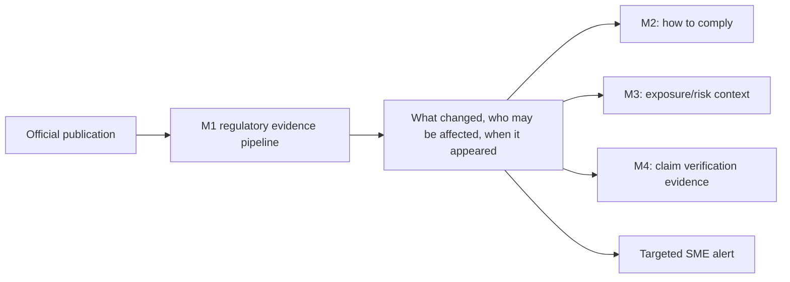

The report attributes end-to-end Module 1 responsibility to **Mohamed M.R.I (215075J)**, including status-machine design, extraction experiments, annotation and calibration, spiders, classification research, lag measurement design, and documentation.

## 4. Evidence chronology

| Period | Main work and decision |
|---|---|
| May 2026 | Gazette spiders, scheduled ingestion, Celery extraction, canonical ML extraction path, measurements and initial platform wiring. |
| June 2026 | Research framing, dynamic measurement design, Label Studio workflow, sampling, and thesis evidence consolidation. |
| July 18–21 | Module reorganisation; audit and canary work; extraction quality probes; runtime health; font-aware extraction; classifier provenance/readiness; source and SMS planning. |
| July 23–28 | WebSocket and worker reliability; language rejection; preprocessing starvation; resume/runtime artifact handling; classifier/taxonomy audit; task manager; OCR speed/force controls; database-pool and retry fixes; raw-text and calibration measurement corrections. |
| July 30–31 | Report snapshot; one-epoch XLM-R LoRA smoke evidence; NLLB queue and multilingual numeric-preservation work. |
| August 2 | Operating-evidence audit, public survey path, weighted V7 rejection, routing gate, summary hold/release redesign, and localised deterministic composition. |
| August 3 | RA-HMT storage, per-head/branch persistence, sector-source precedence, review routing, and frontend result panel. |
| August 4 | Optional Qwen2.5-7B LLM summary-draft queue, strict verifier, and human verdict hook; disabled by default. |
| August 14 audit | Code/vault/PDF reconciliation; V6 remains default; fresh holdout, human evidence review, fieldwork, and multilingual human evaluation remain open. |

This chronology explains why older documents sometimes describe a different model or a simpler extraction chain.

## 5. Complete Module 1 architecture

### 5.1 Research and operational flow

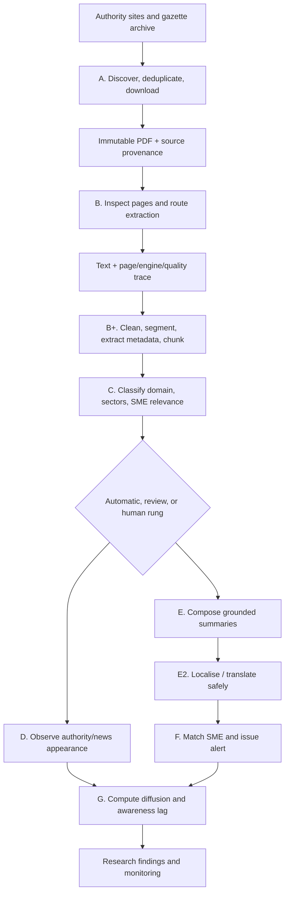

### 5.2 Runtime components

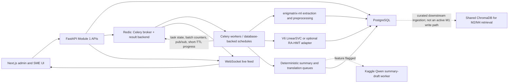

Redis is on the **control plane**, not the document-data plane: it transports Celery messages, stores temporary task results, coordinates bounded extraction batches, and carries best-effort live progress. PostgreSQL and versioned files/artifacts remain authoritative for regulations, extracted text, chunks, metadata, evidence, and research results. ChromaDB is shown only at the downstream boundary; the inspected Module 1 runtime does not insert extraction or classification chunks into it.

## 6. Stage A — source discovery, ingestion, and provenance

### 6.1 Sources

The primary source is the Sri Lankan Government Gazette archive at `documents.gov.lk`. The research design also observes regulatory authorities and secondary channels—IRD, EPF/ETF, eROC, news sites, and configured feeds—to measure when an already-published change becomes visible outside the gazette.

### 6.2 Ingestion sequence

1. A Scrapy spider discovers gazette listing/detail pages.
2. Canonical URLs and content identifiers are checked for duplicates.
3. PDFs are downloaded with rate limits, retries, and explicit failure state.
4. Source URL, gazette/date metadata, timestamps, and binary identity are stored.
5. An extraction task is queued; job identity supports idempotent resume.
6. Scheduled watchers record later appearances without replacing the primary publication timestamp.

### 6.3 Source rules

- The original URL and PDF identity are immutable evidence.
- Redownloads should become new observed versions if their content hash changes.
- A failed download or parse is a visible retryable state, not a missing row.
- Publication date, discovery time, download time, processing time, alert time, and SME-awareness time are different measurements and must not be conflated.
- Secondary-source observation proves that the source exposed a change by that time; it does not prove an SME saw it.

### 6.4 Implementation status

Gazette/weekly/acts-and-bills ingestion, scheduled tasks, extraction dispatch, retry/resume controls, source administration, and task observation have concrete code paths. Source completeness across all intended authority sites remains a coverage question and should be measured per source.

## 7. Stage B — PDF inspection and extraction

### 7.1 Why one extractor is insufficient

The gazette collection contains at least four materially different cases:

- **digital text PDFs** with usable embedded Unicode;
- **hybrid pages** containing both embedded text and raster content;
- **scanned pages** with no useful text layer;
- **legacy-font or broken-map text**, including `(cid:N)` artifacts and Sinhala glyphs that require font-aware mapping.

The correct architecture is therefore a page-routing and candidate-selection system, not a universal linear chain.

### 7.2 Active default profile

The current backend default extraction profile is `wijesekara_routing_v1`. Its effective decision flow is:

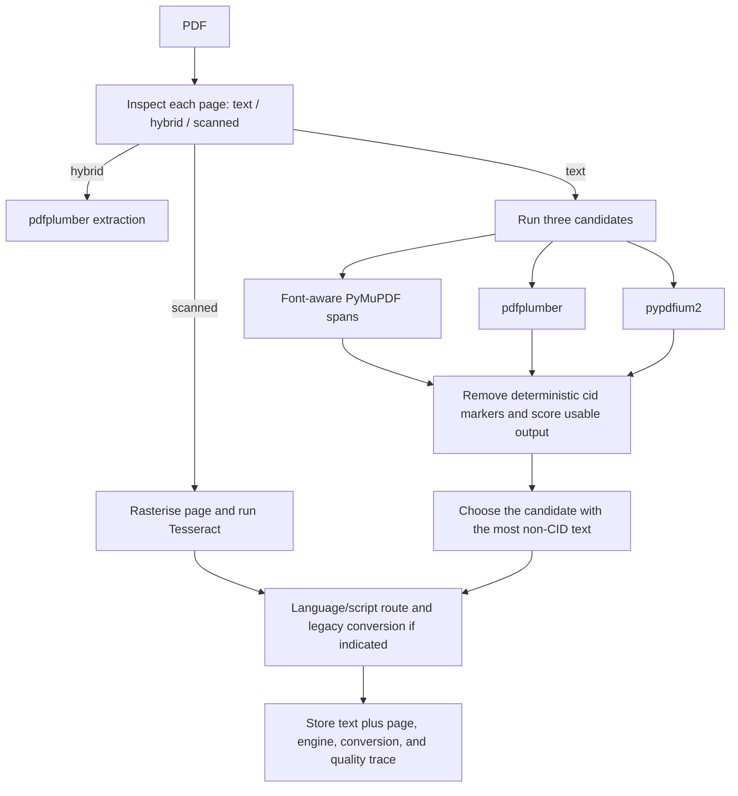

For text pages, the implementation compares font-aware PyMuPDF, pdfplumber, and pypdfium2 candidates and selects the result with the greatest length **when CID markers are ignored for scoring**. The selected raw text is retained and CID counts are recorded; the scoring step does not silently delete evidence from the stored candidate. For hybrid pages, pdfplumber is the intended route. For scanned pages, Tesseract is used after rasterisation.

This differs from the simplified plan often written as “PyMuPDF → pdfplumber → OCR.” That sequence describes the toolbox, but the active profile uses **inspection and routing**.

### 7.3 Legacy and compatibility profile

The older hybrid extractor attempts PyMuPDF and falls back to OCR when a page yields fewer than about 100 characters. It remains useful as a compatibility path, but it is less expressive because low character count is an imperfect proxy for a scan and does not resolve broken embedded text.

### 7.4 Engine roles

| Technology | Actual role | Strength | Main failure mode |
|---|---|---|---|
| **PyMuPDF** | Fast page/span extraction; font-aware traversal in the active profile | Speed, geometry, span/font metadata | Broken cmap, CID artifacts, visually encoded legacy fonts |
| **pdfplumber** | Alternative text extraction and hybrid/table-sensitive route | Layout and table awareness | Can be slower; still depends on usable PDF objects |
| **pypdfium2** | Independent candidate for text pages | Different rendering/extraction behavior can recover cases missed by others | Not automatically superior; candidate quality must be scored |
| **Tesseract 5** | OCR for scanned pages; `eng`/`sin`/`tam` packs are intended/available, while the active per-page call currently omits explicit `-l` selection | Local, auditable OCR | Slow; layout/noise and low-resolution errors; numeric substitutions; active multilingual-language wiring gap |
| **Surya OCR** | Optional/research extraction engine described in report/dependencies | Layout-aware OCR potential | Not the active default path and requires separate resource validation |
| **pdf2image/Poppler** | Rasterisation before OCR | Stable page images | Resolution/size trade-off and external binary dependency |

### 7.5 Font-aware Wijesekara-to-Unicode recovery

Legacy Sinhala text can look correct in a PDF viewer while its extracted code points are not meaningful Unicode. The improved path acts before page assembly:

1. PyMuPDF exposes text spans and font names.
2. A per-font mapping registry determines whether a span needs conversion.
3. Legacy glyph sequences are converted greedily, preferring longer mappings.
4. Converted and already-Unicode spans are assembled in page order.
5. A document-level heuristic performs a second check for remaining Wijesekara-style text.
6. The trace records font, mapping/version, pre/post text, and CID counts.

This approach is safer than applying one blind document-wide mapping because a page can contain English, valid Unicode Sinhala, legacy Sinhala, numbers, and identifiers at the same time.

The code-level term is **font-aware character transliteration using a versioned lookup table and greedy longest-match substitution**. It is not language translation and it is not an ML model. The current `wijesekara_map.yaml` parses to **84 canonical key/value mappings**; three override files add font-specific divergences (`bindumathi.yaml`: 3, `dl_manel.yaml`: 3, `fm_abhaya.yaml`: 4) on top of the canonical table. Older vault text that says 87 entries is stale relative to the inspected checkout. The generic converter permits keys up to four characters, but the current canonical table’s longest key is three characters, so the effective canonical walk is 3→2→1.

### 7.6 Language and script routing

- fastText language identification provides the document-level signal when its `lid.176.bin` model is available;
- Unicode script counts route individual lines, which is more robust for code-mixed pages;
- valid Unicode Sinhala/Tamil is preserved rather than remapped;
- the Wijesekara indicator uses a recorded heuristic threshold around **0.40** before conversion;
- numbers, gazette identifiers, dates, URLs, and form codes require literal-preservation checks.

#### 7.6.1 Exact fastText decision path in the current code

The language detector is `m1/extraction/language_detection.py`. Its behavior is precise:

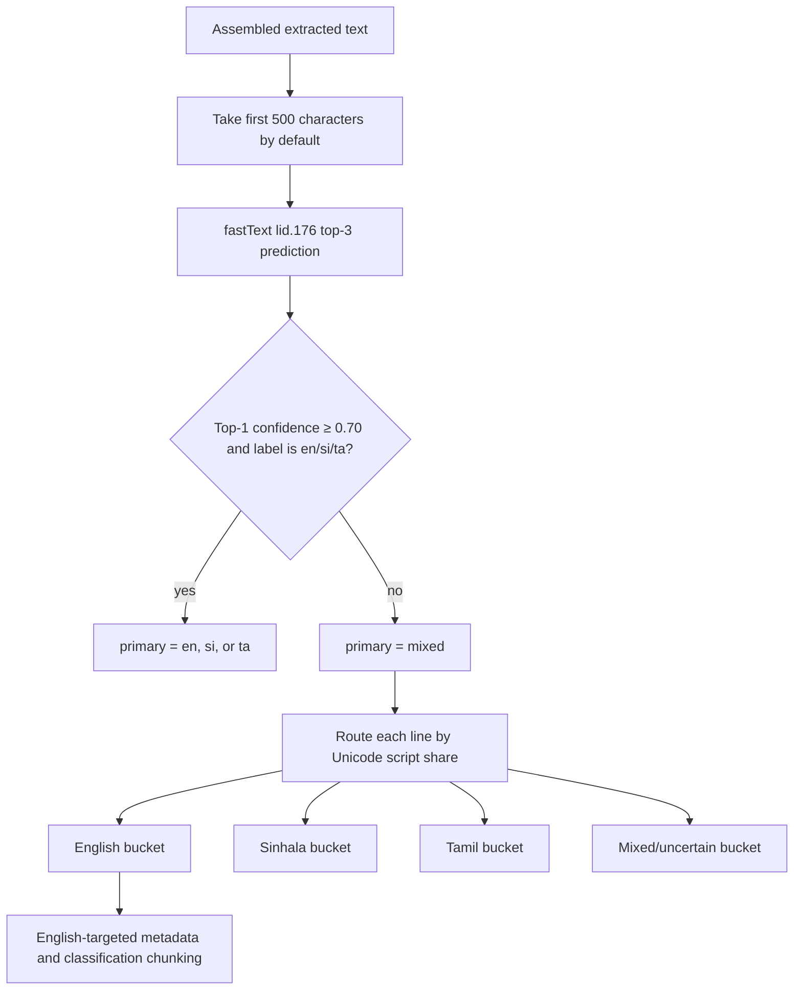

The defaults are configurable through `M1_LID_MODEL_PATH`, `M1_LID_WINDOW_CHARS`, and `M1_LID_MIN_CONFIDENCE`. The model is loaded lazily because `lid.176.bin` is roughly 127 MB. It returns the top three labels and probabilities. If the top prediction is below **0.70**, or its label is outside English/Sinhala/Tamil, the document becomes `mixed`.

For a mixed document, `route_lines_by_language()` counts characters in the Sinhala Unicode block `U+0D80–U+0DFF`, Tamil block `U+0B80–U+0BFF`, and Unicode names beginning with `LATIN`. A line is assigned to a script when at least **50%** of its non-whitespace characters belong to that script; otherwise it stays `mixed`.

The preprocessing orchestrator then uses the English bucket for English-regex metadata and classification chunking. The full cleaned multilingual text is still retained for sections, summaries, evidence, and audit. If fastText is missing or cannot load, preprocessing currently falls back to `primary="en"` instead of failing the regulation.

#### 7.6.2 What fastText does—and does not—decide

> [!important] Correct boundary
> fastText does **not** decide whether the PDF is digital, hybrid, or scanned. Per-page span count and image-area heuristics make that decision. In the active `wijesekara_routing_v1` profile, fastText runs after the page texts have been assembled and primarily controls document language metadata and mixed-language preprocessing.

The older `extract_hybrid()` compatibility path can inspect a low-text page, use fastText when available, and choose an OCR language string, with `eng+sin+tam` as fallback. The active page-routing Tesseract engine currently calls Tesseract with `--psm 6` but **does not pass an explicit `-l eng+sin+tam` language option**. It therefore uses the Tesseract installation’s default language, commonly English. This is a real multilingual OCR gap: the intended language-pack design exists in the legacy/full-document OCR path and documentation, but it is not wired into the active per-page OCR function. It should be corrected and evaluated before claiming that active scanned-page OCR is trilingual.

#### 7.6.3 NumPy 2 / fastText compatibility repair

`fasttext-wheel 0.9.2` predates NumPy 2 and its public prediction wrapper can raise `ValueError` because it calls `np.array(..., copy=False)`. This previously broke preprocessing for every row after the RA-HMT environment moved to NumPy 2. The current detector calls the lower-level pybind `model.f.predict()` and converts its plain Python results itself, falling back to the public wrapper only when necessary. This compatibility layer is part of the active language-detection technology, not merely an environment note.

### 7.7 Extraction output contract

An extraction result should include more than `text`:

| Field group | Required content |
|---|---|
| Source | regulation/gazette identifier, URL, binary hash, page number |
| Routing | page type, requested profile, actual engine, OCR flag |
| Language | document and page/line language signals, confidence or rule trace |
| Conversion | font mapping name/version, Wijesekara decision, before/after CID counts |
| Quality | character/token counts, printable/Unicode ratios, error flags |
| Timing | queued, started, completed, per-step duration |
| Failure | typed reason, retryability, attempt number, last worker |

### 7.8 Trial-and-error lessons from extraction

- Character count alone cannot distinguish high-quality text from long corrupted text.
- A digital text layer can be worse than OCR when its cmap is broken.
- Blind OCR wastes time and can damage precise digits; page routing is necessary.
- Converting legacy encoding after full-page concatenation loses font boundaries and can corrupt mixed text.
- Collapsing newlines before notice segmentation changed one notice into three in the RA-HMT audit; structure-preserving cleaning must precede segmentation decisions.
- An initial raw-text measurement path scored the wrong field/representation; measurement contracts now need explicit stage and field identity.
- Forced OCR and worker-speed controls were added because operational throughput and quality debugging require controllable profiles.

### 7.9 Advanced extraction work still planned

- table-aware extraction of rate/deadline schedules;
- typed slot extraction with page-level evidence;
- cross-page notice stitching;
- effective-date resolution across amendments;
- systematic CER/WER and numeric-preservation evaluation by language/page type;
- a calibrated candidate-quality function stronger than “longest usable text.”

## 8. Stage B+ — cleaning, segmentation, metadata, and chunks

### 8.1 Cleaning

The current `cleaning.py` implementation uses a fixed, idempotent cleaning pipeline. The order matters: `clean(clean(x)) == clean(x)` is a tested contract, and changing the order can change notice boundaries or literals.

| Order | Function / method | What it removes or changes | Why it is done | Preservation rule |
|---:|---|---|---|---|
| 1 | `unicodedata.normalize("NFKD", text)` | Compatibility-decomposes Unicode | Makes character representation more consistent for matching | Current code uses **NFKD**, despite older notes mentioning NFC/NFKC; Sinhala/Tamil effects require regression tests |
| 2 | dehyphenation regex | Joins `regulat-\nion`-style line-wrap splits | Reconstructs words broken only by PDF layout | Only joins word-character pairs separated by hyphen + newline |
| 3 | gazette-header regex | Repeated `GAZETTE EXTRAORDINARY No...` running headers | Removes high-frequency boilerplate that biases classification | Metadata extraction separately reads the raw text first so gazette number is not lost |
| 4 | page-number regexes | Standalone `- 3 -`, inline page markers, and Roman numeral page lines | Removes pagination noise | Source page identity must remain in provenance even when printed markers leave model text |
| 5 | horizontal-rule regex | Lines of six or more `_`, `=`, or `-` characters | Removes visual separators with no semantic content | Real minus signs and ordinary hyphens are not blanket-removed |
| 6 | signature-block regex | `By Order of His/Her Excellency...` tail | Intended to reduce boilerplate in a classification-only representation | Implemented/tested in `clean_for_classification()`, but not called by the active preprocessing orchestrator |
| 7 | repeated-blank-line collapse | Three or more newlines become two | Reduces empty layout space | Preserves paragraph/section separation instead of flattening all newlines |
| 8 | inner-whitespace collapse | Multiple spaces/tabs become one | Stabilises tokens and hashes | Newlines are not converted to spaces |

The cleaning module defines two intended outputs:

- `clean_gazette_text()` applies all steps except signature removal and is the cleaned evidence/audit representation;
- `clean_for_classification()` also removes the signature block because it is usually non-discriminative boilerplate.

However, the active `preprocess_gazette()` code calls `clean_gazette_text()` and passes that result to `chunk_hybrid()`; no non-test call to `clean_for_classification()` was found. Consequently, the live `classification_chunk` can still contain the signature block. The dual-view design is implemented at function/test level but is not fully wired into the active orchestrator.

The cleaning principle is conservative: retain legally meaningful text, dates, numbers, units, negatives, exceptions, schedules, and section references. Cosmetic normalization must not silently change content.

#### 8.1.1 What “unwanted metadata” means here

Running headers, printed page numbers, horizontal rules, repeated blank space, and classification-only signature boilerplate are treated as **layout noise**. Gazette number, publication/effective date, principal Act, amendment/repeal type, penalty amounts, imprisonment terms, authority names, section references, page/source anchors, and exception clauses are **research evidence**, not unwanted metadata, and should be extracted or retained.

Metadata extraction therefore runs on the raw English-targeted text, not solely on the cleaned text. This prevents removal of the header from also removing the gazette number. `metadata_extractor.py` uses bounded regular-expression and rule logic plus `dateparser`: effective dates must fall no more than one year before or five years after the known publication date, principal Acts are selected from scored legal anchor patterns, penalties are collected as structured fine/imprisonment records, and amendment type is rule-classified.

#### 8.1.2 Current mixed-language caveat

For a `mixed` document, classification chunking uses the Unicode-routed English bucket. The raw-text metadata helper currently excludes only lines beginning with a short set of Sinhala prefixes rather than reusing the complete Unicode router for every non-English line. This is narrower than the intended multilingual contract and can leave some Sinhala/Tamil text in the metadata input. The defensible next change is to route raw lines with the same script classifier while preserving their original order and source offsets.

### 8.2 Segmentation

The full gazette is split into notice-level units using headings, numbering, recurring legal patterns, and structural boundaries. Each notice retains page/source anchors. Segmentation quality matters because one bad boundary can:

- mix two regulatory domains in one classifier input;
- separate a rate from its subject;
- lose an effective-date qualifier;
- make a retrieved evidence passage non-self-contained;
- duplicate or suppress alerts.

### 8.3 Metadata extraction

The implemented preprocessing extracts or derives fields such as:

- gazette number and publication date;
- effective date candidates;
- principal Act and amendment references;
- penalty or monetary expressions;
- page and source anchors;
- language and extraction provenance.

Typed obligation slots—actor, action, object, deadline/effective date, amount/rate, exception, authority, evidence—are the safer target for future summary generation and evaluation.

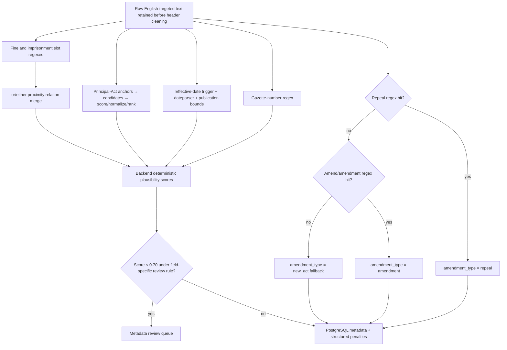

#### 8.3.1 Exact amendment-type decision: `repeal`, not “appeal”

The correct technical description is an **ordered, deterministic regex/lexicon rule classifier with precedence and a default class**. It is not a learned ML classifier and it is more precise than the vague phrase “keyword mapping.” The active function is `classify_amendment_type()` in `enigmatrix-ml/m1/preprocessing/metadata_extractor.py`:

| Evaluation order | Evidence pattern, case-insensitive | Returned value | Meaning |
|---:|---|---|---|
| 1 | `\brepeal(?:s|ed|ing)?\b` | `repeal` | Any matched form such as *repeal*, *repeals*, *repealed*, or *repealing* wins. |
| 2 | `\bamend(?:s|ed|ing|ment)?\b` | `amendment` | If no repeal form was found, a form of *amend* or *amendment* selects amendment. |
| 3 | No match, including empty text | `new_act` | This is a fallback/default produced by absence of the first two signals. |

The precedence is therefore:

```text
repeal evidence > amendment evidence > default new_act
```

If both word families appear anywhere in the supplied text, `repeal` wins. There is no `appeal` output in this field; **appeal** is a different legal concept. The field values are exactly `amendment | repeal | new_act`.

This rule is explainable and reproducible, but its current scope is document-wide. A historical quotation such as “the provision was repealed by…” can trigger `repeal`, and `new_act` means only “neither regex matched,” not positive proof that the document enacts a new statute. A safer future version should:

1. search the operative clause before background/history text;
2. record the matched span, rule identifier, section/page, and competing matches;
3. distinguish active operative wording from passive or cited historical wording;
4. add an `unknown/review` result when no positive evidence exists instead of always equating absence with `new_act`;
5. send multiple/conflicting hits to human review.

Those five points are proposed upgrades. They must not be described as current behavior.

#### 8.3.2 Principal-Act extraction is weighted anchor-based candidate ranking

`principal_act_amended` uses **rule-based information extraction with legal anchor patterns, candidate scoring, normalization, corroboration, and rejection rules**. This is not a flat keyword-to-label dictionary. The code finds every plausible statute citation, groups repeated citations by statute name, adjusts scores, and returns the best-ranked candidate.

| Anchor / rule ID | Base score | What it recognizes | Why the score differs |
|---|---:|---|---|
| `amend_verb` | 100 | Active `amends`, `amendment of/to`, `to amend`, or `repeal*` followed by a statute citation | Most direct statement of the principal instrument; `(?!\s+by\b)` rejects passive “repealed by”. |
| `heading` | 90 | An all-caps statute citation opening a line, uppercase ratio ≥ 0.60, length ≤ 120 | Strong structural evidence from the printed instrument heading. |
| `powers_vested` | 80 | “by virtue of / in pursuance of / in exercise of … powers … by/under … Act” | Common authority-vesting preamble. |
| `in_terms_of` | 70 | “in terms of [the provisions of] … Act” | Strong but less direct preamble anchor. |
| `under` | 60 | “made/issued/published/prescribed under … Act” | Broad fallback that can name an enabling instrument. |
| `constitution` | 30 | Constitution of Sri Lanka | Last-resort governing-instrument candidate. |

Ranking then applies the following mappings and guards:

- an `(Amendment)` instrument loses **60** points because it is often the amending instrument, not the principal Act;
- repeated independent citations earn **+3** each, capped at **+9**;
- ties are broken by earlier document position;
- name-equivalent citations with and without `No. N of YYYY` or `Chapter N` are grouped, and the richer printed form is retained;
- structural/anaphoric starts such as `section`, `schedule`, `principal`, `said`, `aforesaid`, `above`, `same`, and `such` are rejected;
- document-furniture words such as `notice`, `claims`, `correction`, `whereas`, `gazette`, `extraordinary`, and `notification` invalidate a runaway capture;
- the current explicit display alias is `registration of title act` → `Title Registration Act`;
- normalization repairs `No.21` → `No. 21`, canonicalizes chapter citations, title-cases shouting headings, and can retain an `as amended by Act No. …` suffix.

This is best called **anchor-based legal citation extraction and candidate ranking**, with **alias normalization** as a small final substep.

#### 8.3.3 Gazette number, effective date, and penalty rules

| Output | Correct method name | Exact current behavior |
|---|---|---|
| `gazette_number` | Regex-based named-field extraction | Searches `Gazette [Extraordinary] No. XXXX/N` and returns `XXXX/N`. |
| `effective_date` | Trigger-anchored date extraction + parsing + plausibility validation | Recognizes `with effect from`, `effective from`, `w.e.f.`, or `comes into operation on`; parses DMY with `dateparser`; rejects dates more than 365 days before or five years after publication. |
| fine penalty | Regex-based monetary slot extraction | Requires `fine`, `penalty`, or `sum`, optional `not exceeding`, `Rs.`/`LKR`, a value or range, and optional `million`. |
| imprisonment | Regex-based duration slot extraction | Recognizes imprisonment up to/not exceeding a number of months/years; years are converted to months. |
| combined penalty | Local relation/coordination rule | A fine and imprisonment within 30 characters are merged as `penalty_type="both"` only when the joining span contains `or` or `either`. |
| `penalty_range_lkr` | Deterministic aggregation | Uses the minimum and maximum monetary values over all `fine`/`both` records; imprisonment-only clauses produce no LKR range. |

Backend metadata confidence is a separate **deterministic plausibility scorer**, not a keyword map. `gazette_number` gets 0.95 only for `^\d{4}/\d{1,3}$`; effective dates score against a tighter backend window of 30 days before to 365 days after publication; a well-ordered numeric range scores 0.9; and the principal Act scores highest when its text is literally present. The review threshold is 0.70. Missing gazette identity always flags review; missing optional Act/penalty data does not.

#### 8.3.4 Section and chunk mapping

`NOTICE_BOUNDARY_RE` is a **structural boundary grammar**. Its ordered `_TYPE_PATTERNS` registry maps matched headings to controlled section types:

| Detected label form | Stored `section_type` |
|---|---|
| `PART` + Roman numeral | `part` |
| `Schedule` + Roman numeral/digit | `schedule` |
| `SECTION` + digit | `section` |
| `Notice [No.]` + digit | `notice` |
| Numbered clause such as `1. The…` | `numbered_clause` |
| Leading text before a boundary | `preamble` |

The subsequent chunker merges adjacent micro-sections below 100 tokens, uses 512-token windows with 64-token overlap when XLM-R tokenization is available, and drops only a final window below 50 tokens when another chunk exists. `classification_input()` chooses the first chunk; `summarise_input()` exposes all chunk texts. These mappings are structural and positional, not semantic keyword classification.

### 8.4 Chunking

Classification and retrieval have different chunk contracts.

- The classification path prepares a classifier-oriented chunk with an XLM-R-compatible maximum around 512 tokens and stride around 64 when transformer tokenization is used.
- Retrieval chunks must preserve coherent evidence, anchors, and enough surrounding context to interpret dates/numbers.
- The summary compositor consumes extracted slots and selected evidence, not an arbitrary whole-document free-form prompt.

Every chunk must retain the parent regulation, page range, profile/version, and text hash.

## 9. Annotation and gold-data construction

### 9.1 Label schema

Each notice is labelled on three connected tasks:

1. **one domain** from eight categories;
2. **zero or more sectors** from grocery retail, food service, and general retail;
3. **SME relevance** as a separate binary decision.

The eight-domain V6 distribution is:

| Domain | Rows |
|---|---:|
| sector | 679 |
| import/export | 112 |
| tax | 82 |
| labour | 75 |
| penalty | 66 |
| product standard | 53 |
| business registration | 36 |
| EPF/ETF | 7 |
| **Total** | **1,110** |

The imbalance is severe. EPF has only seven total examples and only one recorded test example, so a high aggregate score cannot establish robust EPF performance.

### 9.2 Annotation workflow

1. Export stable notice tasks to Label Studio with source context.
2. Apply a versioned codebook and positive/negative examples.
3. Double-annotate the reliability subset independently.
4. Compute field-specific agreement rather than only one aggregate number.
5. Adjudicate disagreements and retain original annotations.
6. Freeze the gold export and produce dataset manifests.
7. Any later correction becomes a new dataset version with a change ledger.

### 9.3 Reliability evidence

On the report’s 800 dual-annotated tasks:

| Field | Cohen’s κ | Raw/exact agreement where reported |
|---|---:|---:|
| Domain category | **0.8715** | 0.9600 raw agreement |
| Sector, mean of three heads | **0.8638** | 0.9525 sector-set exact agreement |
| SME relevance | **0.7235** | 0.9550 raw agreement |

The relevance result is lower because the boundary between a generally administrative notice and one materially relevant to SMEs is genuinely contestable. Relevance gates alerts, so disagreement here has higher operational consequence than an ordinary taxonomy difference.

### 9.4 Dataset lineage

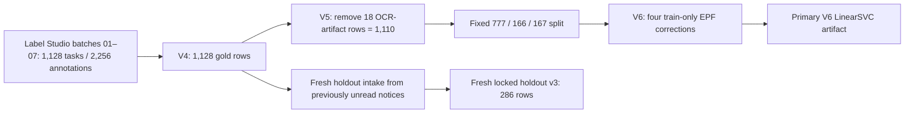

Key rules:

- The 18 removed rows were extraction/OCR artifacts, not inconvenient classification errors.
- The V6 corrections are train-only, so validation/test labels were not tuned to improve the reported score.
- Later V7-M experiments inspected/used the fixed test set; that test can no longer be used to make an unbiased final promotion choice among those candidates.
- Fresh holdout v3 was created to restore an honest single-use promotion test.

### 9.5 Sector-label geometry

- About **73.2%** of V6 rows have no sector label.
- Among sector-positive rows, about **84%** label all three sectors.
- Only **48 rows**—about **4.3%** of all data—carry a partial sector set.

This makes the sector task superficially easier on common patterns but much harder on the research-relevant partial-sector distinctions. Fresh holdout v3 intentionally changes this geometry: **93.4%** of sector-positive examples are partial, making it a stronger test of actual routing discrimination.

## 10. Stage C — classification research and production choice

### 10.1 V6 primary architecture

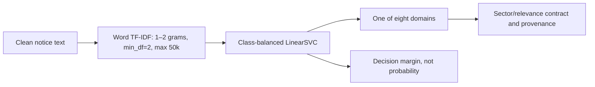

The linear model is not a weak temporary fallback. On this data size and label geometry, sparse lexical features are highly informative, training is deterministic and CPU-cheap, and error analysis is straightforward. It earned primary status through evaluation.

### 10.2 Main model chronology and decisions

| Candidate / phase | Evaluation | Result | Decision |
|---|---|---:|---|
| Logistic regression TF-IDF, report 800-row phase | Earlier test n=120 | macro-F1 **0.4980** | Baseline only |
| LinearSVC TF-IDF, report 800-row phase | Earlier test n=120 | macro-F1 **0.6167** | Stronger early baseline, still below gate |
| XLM-R+LoRA one-epoch CPU smoke | Reduced/smoke setup | validation **0.1111**, test **0.0000**, gate false | Validated plumbing only; never evidence of quality |
| V6 word-TFIDF + LinearSVC | Fixed 777/166/167 | validation **0.924476**, test **0.947220** | **Primary** |
| XLM-R temporal comparison | Recorded V6 comparison | validation **0.902693**, test **0.743563** | Rejected for generalisation collapse |
| V7-W weighted experiment | 1,103 no-leak rows | category **0.0936**, sector **0.1207** | Rejected immediately |
| V7-M strict candidate | Reused fixed evaluation | category **0.910533**, sector **0.888330**, relevance **0.9200**, exact **0.916168** | Sector gate failed; evaluation no longer pristine |
| V7-M seed 13 diagnostic | Validation only | category **0.929558**, sector **0.927620**, relevance **0.936170**, exact **0.957831** | Diagnostic only; never tested/promoted |
| RA-HMT full | V7 test n=167 | domain **0.9351**, sector **0.9014**, relevance **0.9400**, joint **0.8802**, ECE **0.0319** | Built, not promoted; paired gain non-significant |

### 10.3 Why XLM-R was rejected despite the report design

XLM-R was originally attractive because one encoder can represent English, Sinhala, and Tamil and LoRA reduces GPU cost. However, architecture suitability does not override observed generalisation. The recorded temporal comparison fell from validation macro-F1 **0.902693** to test **0.743563**, well below the V6 linear model. Possible causes include limited low-resource-language support, small minority classes, label geometry, domain shift, and training instability. The correct decision was to retain XLM-R as a research branch rather than promote it on intent.

### 10.4 Output semantics

The classification record should preserve:

- predicted domain and taxonomy version;
- sector set and per-sector provenance;
- relevance and its derivation/provenance;
- model backend, artifact hash, dataset/split version;
- raw decision margin for LinearSVC;
- calibrated probabilities only when a calibrated model actually produced them;
- routing rung and review reason;
- human override and original prediction separately.

The operating database deliberately keeps `confidence` null for the LinearSVC path and stores a margin separately. Treating the margin as a 0–1 probability would create false calibration and unsafe review thresholds.

### 10.5 Recorded live operating evidence

At the latest audit point:

- **898** live rows had been classified;
- margin min/p10/p50/p90/max was **0.008653 / 1.121490 / 1.809804 / 2.081984 / 2.245461**;
- the low-margin threshold was **0.40**;
- **18** rows fell below it;
- no completed human review outcomes were yet recorded.

This proves that classification and routing data exist. It does not prove low-margin review effectiveness until reviewers act and their outcomes are analysed.

## 11. RA-HMT — advanced multi-task research branch

### 11.1 Purpose

RA-HMT was designed to improve minority-class and partial-sector decisions by combining heterogeneous evidence while producing calibrated per-head outputs and a three-rung routing policy.

### 11.2 Architecture

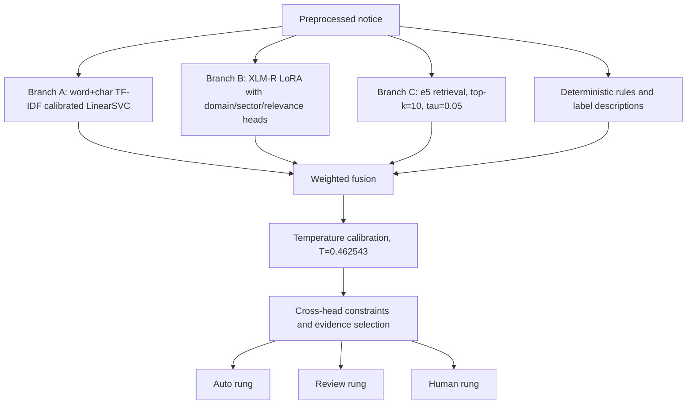

Recorded fusion weights:

| Branch | Weight |
|---|---:|
| TF-IDF/LinearSVC | 0.35 |
| Retrieval | 0.30 |
| Rules | 0.20 |
| XLM-R | 0.15 |

Recorded decision thresholds: relevance **0.52**; sector heads approximately **0.50 / 0.50 / 0.43**.

### 11.3 Branch results on the recorded n=167 evaluation

| System | Domain macro-F1 | Sector macro-F1 | Relevance F1 | Joint exact | ECE |
|---|---:|---:|---:|---:|---:|
| Branch A | 0.9197 | 0.8881 | 0.9109 | 0.8743 | 0.0805 |
| Branch B | 0.6443 | 0.8108 | 0.8444 | 0.7605 | 0.0581 |
| Branch C | 0.8590 | 0.8675 | 0.9020 | 0.8443 | 0.0564 |
| Full RA-HMT | **0.9351** | **0.9014** | **0.9400** | **0.8802** | **0.0319** |

Before calibration the weighted system’s ECE was **0.1357**; calibration reduced it substantially. Routing produced **134 auto**, **18 review**, and **15 human** cases. Evidence coverage was **167/167**, but the keyword-based evidence proxy was only **0.7246**, and human evidence evaluation remains open.

### 11.4 Why it remains unpromoted

- The joint paired gain over Branch A was not statistically significant.
- The evaluation set had already influenced V7 development decisions.
- Offline encoder/model resources must be fetched and hashed for reproducibility.
- The full artifact bundle recorded under `C:\Reasearch\xyz\m1_rahmt\results` is absent from the current `C:\research\xyz` checkout; only the serving adapter and surrounding persistence paths are visible.
- Current settings still default to `linearsvc`.
- Human evidence-quality and disagreement analysis remain incomplete.
- Fresh holdout v3 has not been consumed under a final locked protocol.

### 11.5 Engineering defects discovered

- A float32 probability could exceed 1.0 and required clamping/normalisation correction.
- Newline collapse altered notice segmentation from one unit to three, showing that preprocessing order can change both evidence and labels.
- Sector source/provenance required an explicit precedence rule so expert/human values are not overwritten by model-derived values.

These failures are scientifically useful: they show why an ensemble requires contract testing and provenance, not only component scores.

## 12. Fresh locked holdout v3

Fresh holdout v3 contains **286** previously unread, leakage-clean rows and is reserved for the final promotion decision.

| Property | Value |
|---|---|
| Language | 100% English |
| Date range | 2010-01-27 to 2025-12-23 |
| Relevant / not relevant | 152 / 134 |
| Domain counts | labour 88; sector 59; tax 58; product 30; import 22; business 16; penalty 10; EPF 3 |
| Sector challenge | 93.4% of sector-positive rows are partial-sector labels |
| Intended use | Evaluation-only, single use after candidate/threshold freeze |

Known coverage constraints:

- EPF examples are genuinely difficult to source; expected extraordinary-gazette material was not available in the examined source path.
- Penalty notices may not be fully represented on page 1.
- Import schedules often appear on later pages and stress cross-page extraction.
- Because the holdout is English-only, it cannot close the Sinhala/Tamil slice question.

### 12.1 Promotion protocol

1. Freeze code revision, environment, candidate artifacts, thresholds, taxonomy, and evaluation script.
2. Confirm no candidate has accessed holdout text or labels.
3. Run V6 and the single final advanced candidate once.
4. Report overall and per-domain/per-sector/relevance/joint/calibration results with confidence intervals.
5. Report source/date/text-length and partial-sector slices.
6. Record every error with evidence and extraction profile.
7. Promote only if the declared multi-metric criteria are met; otherwise retain V6.

## 13. Stage D — secondary-source tracking

### 13.1 Research purpose

The lag question needs a timestamp chain, not only a scraper:

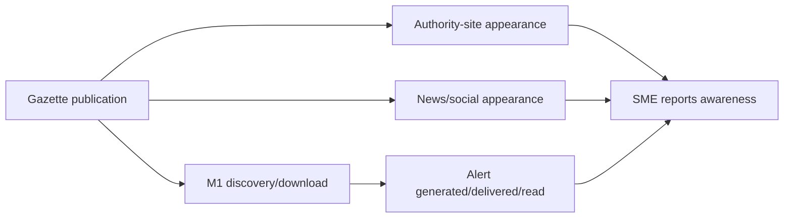

The key measures include:

- discovery lag = M1 discovery − publication;
- official diffusion lag = first authority appearance − publication;
- public-channel lag = first recorded news/social appearance − publication;
- delivery lag = alert delivery − publication;
- awareness lag = SME awareness − publication;
- action lead time = obligation deadline/effective date − SME awareness.

### 13.2 Causal caution

An alert being delivered before self-reported awareness does not prove the alert caused awareness. The field design should capture channel, exposure/read events, baseline channel use, and a comparison or phased-rollout design where feasible.

### 13.3 Current status

Watchers, source records, measurement APIs, measurement reports, and awareness-survey surfaces are implemented in part. The latest recorded fieldwork count was **0/100**, so the central empirical awareness-lag finding is still open.

## 14. Stage E — grounded summarization

### 14.1 Safety principle

The summary must transform evidence into accessible language without inventing a legal fact. The primary summary path is deterministic and field-grounded, not unconstrained generation.

### 14.2 Current primary flow

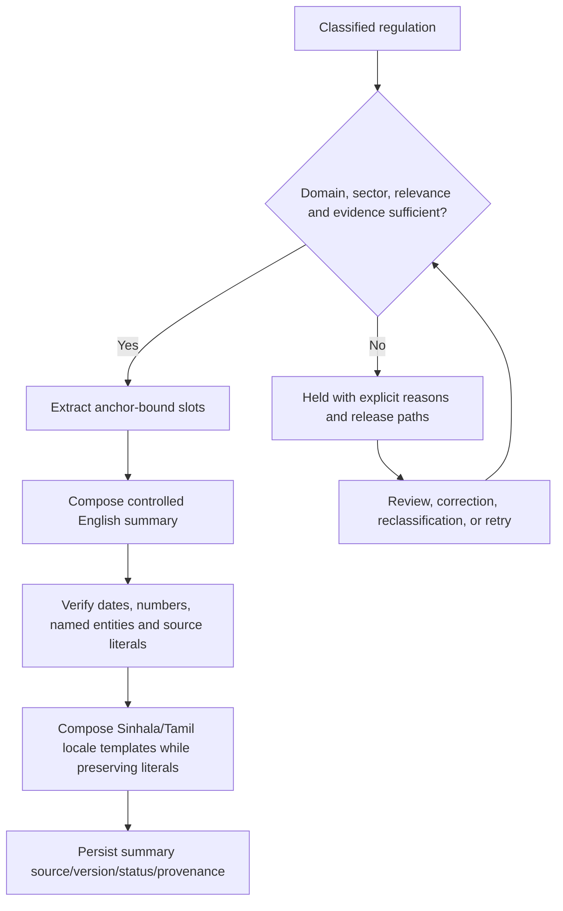

Required slot concepts include actor, action, regulated object, effective/deadline date, rates/amounts, exceptions, sector, authority, and evidence anchor. Not every notice supplies every field; absence must remain absence rather than becoming a guessed value.

### 14.3 Hold behavior

The earlier pipeline discarded some work when a summary gate failed. The upgraded behavior persists a **held** state with reasons. Release can occur through reclassification, evidence/metadata correction, human approval, or a new processing attempt. This protects both safety and operational recoverability.

### 14.4 Operating evidence

The latest audit recorded **80/80** Stage E summaries generated for the audited set. This supports operational completeness for that set, not human legal/linguistic faithfulness across the corpus.

## 15. Stage E2 — Sinhala/Tamil delivery and NLLB queue

### 15.1 Current design

Summary translation is no longer the primary summary-construction mechanism. Instead, locale-aware templates compose the same grounded slots in English, Sinhala, and Tamil. NLLB is primarily used for title translation and controlled fallback work.

### 15.2 NLLB queue contract

- Backend creates idempotent translation jobs.
- A Colab/GPU worker leases work through a shared-secret endpoint.
- Visibility timeouts allow abandoned jobs to be reclaimed.
- Uniqueness is scoped by regulation, field, and language.
- `source_sha` detects source drift so a translation is not applied to changed input.
- NLLB FLORES codes are `sin_Sinh` and `tam_Taml`.
- Human-authored text is never silently overwritten.

### 15.3 Numeric preservation

An operating audit found **10/152 = 6.58%** numeric mismatches in Sinhala/Tamil machine-translated titles/fields and queued **144** replacement items after repair logic. This is why rates, dates, amounts, form codes, identifiers, and URLs must be masked before translation and restored and verified afterward.

Fluency is not the primary safety measure. A fluent translation that changes “15%” to “5%” is a regulatory failure.

### 15.4 Remaining work

- execute and verify the full queued repair set;
- perform bilingual human review on a stratified sample;
- report literal preservation and semantic adequacy separately;
- measure code-mixed and legacy-font cases;
- retain English evidence beside localised output.

## 16. Optional Stage E3 — LLM summary drafts

### 16.1 Architecture

The August 4 code adds an optional Qwen2.5-7B-Instruct draft worker. It consumes classification chunks, typed slots, and RA-HMT outputs—not an already composed summary—and returns a candidate English draft to a verifier.

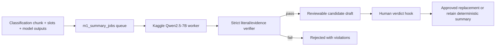

### 16.2 Safety properties

- disabled by default: `M1_LLM_SUMMARY_ENABLED=false`;
- separate worker secret from translation because the privilege can replace SME-visible English content;
- strict parity mode requires the permitted literal set by default;
- optional sourced mode/feature flags can be evaluated separately;
- dates and whitespace/literal variants are checked;
- prompt is server-controlled and versioned;
- failure cannot fail or erase the deterministic summary;
- human verdict is recorded.

### 16.3 Evidence and status

A stub harness recorded **65/65** cases passing its intended checks. Real PostgreSQL migration, GPU execution, end-to-end queue operation, and human faithfulness evaluation were not demonstrated in that session. The feature is therefore **built but disabled and execution-unverified**, not a production success.

## 17. Stage F — SME matching and alerts

### 17.1 Matching inputs

Alert relevance should be derived from:

- SME sector/profile and applicable business characteristics;
- regulation sector heads and relevance decision;
- domain subscription/preferences;
- effective/deadline dates and urgency;
- language preference;
- human overrides and review state.

### 17.2 Alert flow

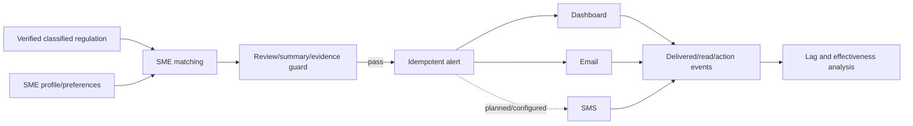

### 17.3 Safety and measurement rules

- Never alert from a held/unverified regulation unless the UI clearly indicates its status and a human approves the route.
- Deduplicate by SME, regulation version, and channel.
- Record generated, attempted, delivered, failed, read, and action timestamps separately.
- Keep the evidence link and original official source visible.
- Measure channel effects; do not infer impact from send counts.

## 18. Stage G — awareness-lag research

### 18.1 Unit of analysis

The preferred unit is a regulation–SME observation with:

- immutable regulation and publication identity;
- source-channel timestamps;
- SME sector/size/location/language covariates;
- reported awareness date or interval;
- first-awareness channel;
- alert exposure/read status;
- effective/deadline date and whether action remained possible.

### 18.2 Analysis plan

1. Describe lag distributions with median, IQR, tail percentiles, and censored/not-aware cases.
2. Stratify by domain, sector, language, geography, firm size, source channel, and extraction/review status.
3. Compare alerted and unalerted or phased-rollout groups while controlling for baseline channel use.
4. Report publication→discovery and discovery→delivery separately from delivery→awareness.
5. Test whether shorter lag improves actionable lead time, not only awareness.
6. Report recruitment, missingness, recall windows, and sensitivity to approximate dates.

### 18.3 Current evidence boundary

The operational system can record many of these timestamps, but the field survey had no completed research sample at the latest audit. Therefore Module 1 currently has strong pipeline/model evidence and an unclosed central field hypothesis.

## 19. Regulatory lifecycle and database state

### 19.1 Conceptual state machine

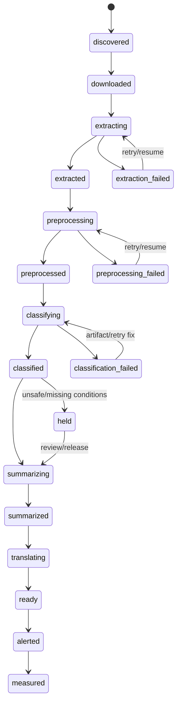

The exact database enums/fields evolve, but the semantic rule is stable: each transition is observable, retryable where safe, and tied to an input/output version.

### 19.2 Important persisted groups

The current model includes source/extracted/preprocessed/classified data; summary content and hold reasons; translation and LLM-summary jobs; RA-HMT rung, evidence, branches, and per-head outputs; margin/probability separation; metadata review; manual hold; penalties/subdocuments; alerts; and provenance/audit fields.

### 19.3 Idempotency

Every long-running task should have a natural idempotency key:

- download: canonical source + observed content identity;
- extraction: PDF hash + extraction profile/version;
- classification: chunk hash + model artifact;
- summary: slot/evidence hash + composer version + locale;
- translation: regulation + field + language + source SHA + model version;
- LLM draft: evidence/slot hash + prompt/model/verifier version;
- alert: SME + regulation version + channel.

## 20. API and user-interface map

### 20.1 Implemented backend surfaces

The current router includes Module 1 APIs for:

- regulations and public/admin alert feeds;
- dataset registry and Excel upload;
- extraction profiles, run dispatch, completeness, scoped gazette extraction, and WebSocket progress;
- measurement engine and reports;
- admin pipeline observability;
- NLLB translation status/jobs/enqueue/worker endpoints;
- LLM summary-draft status/jobs/enqueue/worker/verdict endpoints;
- survey sessions, awareness responses, scheduled-task configuration, task control, and audit logging.

### 20.2 Frontend surfaces found

- admin pipeline overview and trace views;
- extraction run/result controls and live progress;
- datasets and upload flows;
- measurement pages;
- classifier/review views;
- source and translation administration;
- regulation lists/details;
- awareness survey and response administration;
- SME alert/regulation views;
- knowledge documentation pages generated from vault material.

WebSocket progress is optional; the frontend is designed to fall back to polling.

### 20.3 Contract caution

Legacy generic `/regulations` routes still include deferred 501 behavior. Module 1 consumers should use the explicit `/m1/...` APIs rather than assuming every generic endpoint is complete.

## 21. Deployment and operations

### 21.1 Services

| Service | Responsibility |
|---|---|
| Next.js | SME/admin interfaces and internationalised display |
| FastAPI | authorization, APIs, orchestration, validation, audit |
| PostgreSQL | regulatory state, surveys, provenance, jobs, measurements |
| Redis | Celery broker/result backend, priority transport, bounded-batch counters, pub/sub live feed, and short-TTL progress/task-control state |
| Celery worker | extraction, preprocessing, classification, summary, alerts, monitoring |
| Database-backed scheduler / Beat | adjustable source and maintenance cadences |
| Local ML package | extraction, preprocessing, V6 inference, evaluation, optional RA-HMT adapter |
| Colab NLLB worker | GPU translation queue consumer |
| Kaggle LLM worker | optional, isolated summary-draft consumer |

### 21.2 Operational resilience added through failures

- resumable pipeline stages rather than restarting a full PDF;
- explicit worker/offline diagnosis and false-offline fixes;
- sequential RPC handling where concurrent calls caused instability;
- database fallback and connection-pool controls after max-client errors;
- typed retry semantics and visible errors;
- task cancel/force-stop/resume administration;
- WebSocket heartbeat with polling fallback;
- held summary jobs rather than dropped work;
- visibility timeouts for remote GPU leases;
- source SHA checks to reject stale worker results.

### 21.3 Dependency risks

The root workspace currently overrides scikit-learn to **1.6.1** and NumPy to **2.0–2.3** for newer RA-HMT work, while the frozen V6 artifact was trained under scikit-learn **1.5.2**, and fastText-facing ML dependencies still record NumPy `<2`. A reproducible release must isolate or reconcile these environments and verify that artifact loading produces identical predictions.

### 21.4 Redis: exact Module 1 scope

Redis is actively used, but not as a PDF-processing or embedding database.

| Redis responsibility | Code-level use | Durability / fallback |
|---|---|---|
| Celery broker | Queues scraper, extraction, preprocessing, classification, summary, watcher, alert, measurement, and maintenance tasks. Redis priority queues let downstream preprocessing/classification interleave ahead of a large extraction backlog. | Operational dependency; task handlers remain idempotent and PostgreSQL holds durable domain state. |
| Celery result backend | The same `CELERY_BROKER_URL` stores `AsyncResult` states and progress metadata; results expire after seven days. | PostgreSQL `m1_extraction_runs` and pipeline rows are authoritative when result keys expire. |
| Bounded batch coordination | `run_extraction.py` dispatches eight PDF subtasks at a time and increments `m1:extraction_run:{version_id}:completed`; it polls every 250 ms with a 300-second batch timeout, then deletes the counters best-effort. | Ephemeral coordination, not a dataset store. |
| Live progress pub/sub | Extraction tasks publish source/task-scoped JSON frames; FastAPI subscribes and forwards them to the WebSocket. | Best-effort; database checks, periodic polling, and heartbeat behavior keep progress usable if a message is missed or Redis is unavailable. |
| In-flight and console progress | Short-TTL hashes/keys aggregate stage counters and the item each prefork worker is processing. | Best-effort and self-expiring; failure must never fail extraction. |
| Task/control diagnostics | In-flight registry, queue inspection, result cleanup, revoke/cancel support, and task status surfaces read Redis. | Administrative/observability data only. |

Redis therefore belongs between the API/scheduler and Celery workers, plus the live-progress branch. It does **not** extract text, determine language, remove metadata, create chunks, classify a regulation, store authoritative summaries, or retain embeddings.

### 21.5 ChromaDB: exact boundary and non-use in the current M1 path

The infrastructure repository defines a persistent `chromadb/chroma:0.5.5` service at host port 8001 and passes `CHROMA_HOST`/`CHROMA_PORT` to the backend. However, the backend environment file labels those settings “unused now,” and the inspected Module 1 ML/backend code has no Chroma client, `chromadb` import, collection creation, or chunk-upsert call.

Current Module 1 persistence is:

- extracted/cleaned text, `classification_chunk`, `m1_sub_documents`, metadata, penalties, classifier/evidence fields → **PostgreSQL**;
- PDFs, frozen datasets, model bundles, hashes, evaluation outputs → **versioned files/object-style artifacts**;
- standalone Branch C chunks/embeddings/manifests → **`chunks.jsonl`, `embeddings.npy`, `index_manifest.json`**, searched by BM25 plus FAISS/sklearn/NumPy;
- RA-HMT retrieval → a local packaged Branch C index, not a Chroma collection.

ChromaDB is relevant to Module 1 only as a **downstream shared-vector-store integration boundary**: curated, versioned M1 regulatory passages may later be ingested by Module 2 procedural RAG and Module 4 evidence retrieval. That handoff needs an explicit collection schema, embedding model/version, parent regulation and page/section metadata, content hash, re-index policy, and deletion/supersession policy. Until that writer exists and is tested, “M1 uses ChromaDB to chunk PDFs” is an incorrect claim.

## 22. Complete Module 1 technology and methodology register

This register distinguishes a technology being present in the repository from it being the current production path. “Active” means it participates in the inspected default or operational path; “implemented optional” means callable code exists behind configuration or an extra; “research evaluated” means it was used in a recorded experiment; and “planned/deferred” means it must not be claimed as deployed.

### 22.1 Collection, backend, persistence, and orchestration

| Technology / term | Scope in Module 1 | Why it was selected | Status |
|---|---|---|---|
| **Python 3.11–3.12** | Extraction, preprocessing, ML, workers, API services, evaluation scripts | Dominant ecosystem for PDF/NLP/ML and one language across research and service code | Active |
| **uv workspace** | Dependency locking and editable backend/ML workspace integration | Fast reproducible installs and explicit optional ML extras | Active; dependency overrides require care |
| **Hatchling** | Builds backend and ML Python packages | Modern PEP 517 packaging with simple package discovery | Active build backend |
| **Scrapy** | Gazette, weekly-gazette, acts/bills discovery spiders | Rate limiting, retries, middleware, pipelines, and scheduled crawling are stronger than ad-hoc requests | Active |
| **HTTPX** | Async PDF fetches and external HTTP calls | Async support and clear timeout/error contracts inside FastAPI/Celery | Active |
| **AnyIO** | Async concurrency underneath FastAPI/HTTPX | Common structured-concurrency layer; explicitly version-pinned after a TaskGroup incompatibility | Active transitive/runtime dependency |
| **Tenacity** | Network retry/backoff | Makes transient source failures retryable without hiding terminal errors | Active |
| **feedparser** | News/RSS watcher for propagation timestamps | Lightweight standards-aware feed ingestion | Active for configured watcher paths |
| **Celery** | Extraction, preprocessing, classification, summary, alert, translation coordination | Long-running PDF/ML tasks must not block API requests; supports retries and task identity | Active |
| **Celery Beat / database scheduler** | Periodic crawls, watchers, and maintenance cadences | Repeatable schedules with admin-adjustable timing | Active architecture; environment scheduling must be running |
| **Redis** | Celery broker/result backend; priority queues; eight-item batch counters; pub/sub WebSocket frames; short-TTL in-flight/progress and task-control data | Low-latency cross-process coordination with established Celery support while PostgreSQL remains authoritative | Active infrastructure dependency; not a PDF/chunk/vector store |
| **ChromaDB** | No direct active M1 read/write path; possible downstream sink for curated M1 passages consumed by M2/M4 | Shared dense-retrieval infrastructure is useful only after a versioned ingestion contract exists | Infrastructure-present/integration target, not an active M1 dependency |
| **FastAPI** | Module 1 REST and WebSocket APIs | Typed async endpoints, automatic OpenAPI, dependency-based authorization | Active |
| **Pydantic v2 / pydantic-settings** | API schemas, configuration, validation | Prevents malformed cross-stage data and centralises environment settings | Active |
| **Uvicorn** | ASGI serving | Standard production/dev server for FastAPI | Active runtime |
| **WebSockets with polling fallback** | Per-PDF live extraction progress | Gives live sub-step feedback without making the UI depend on a persistent socket | Implemented |
| **SQLAlchemy 2 async + asyncpg** | Regulation state, jobs, evidence, surveys, alerts, measurements | Typed relational access and non-blocking PostgreSQL I/O | Active |
| **Alembic** | Versioned database migrations | Reproducible schema evolution and rollback | Active; target DB must reach latest migration |
| **PostgreSQL / JSONB** | Authoritative operational and research state | Transactions, relations, constraints, auditability, and flexible structured evidence where justified | Active platform dependency |
| **OpenPyXL** | Manual Excel dataset upload/import | Preserves researcher/admin spreadsheet workflows while applying server validation | Active for XLSX paths |
| **PyArrow / Parquet** | Frozen dataset splits and efficient tabular interchange | Typed, compact, reproducible train/validation/test artifacts | Active in research/data tooling |
| **structlog** | Structured operational logs | Machine-searchable stage, regulation, worker, and error context | Active |
| **JWT, python-jose, passlib/bcrypt** | SME/admin authentication and authorization | Secures research/admin surfaces and role-specific data access | Active shared backend |
| **SlowAPI** | Request rate limiting | Protects public and worker-facing endpoints from abuse | Active shared backend |

### 22.2 PDF extraction, language, cleaning, and structure

| Technology / method | Scope | Why used | Status |
|---|---|---|---|
| **PyMuPDF (`fitz`)** | Fast PDF inspection, spans/fonts/images, page rendering, primary extraction candidate | Exposes layout/font information needed for page routing and legacy-font recovery | Active |
| **pdfplumber** | Hybrid-page extraction, layout/table candidate, text-page consensus candidate | Better table-ish/mixed-content handling than a plain text dump | Active |
| **pypdfium2** | Third independent text extraction candidate | Diversity reduces dependence on one PDF parser and offers an Apache-licensed alternative | Active on text-page consensus |
| **Tesseract 5** | OCR executable for scanned pages | Local, inspectable OCR with Sinhala/Tamil language-pack availability | Active, but active page route currently lacks explicit trilingual `-l` wiring |
| **pytesseract** | Python wrapper around Tesseract | Integrates OCR and timeout/error handling with the Python extraction pipeline | Active |
| **Poppler + pdf2image** | Rasterises PDFs for the legacy/full-document OCR path | Reliable bridge from PDF pages to OCR images | Active in compatibility OCR; active page router renders with PyMuPDF instead |
| **Pillow** | Opens rendered PNGs before OCR | Image object bridge used by the active Tesseract page engine | Active transitive/runtime technology |
| **Surya OCR** | Intended confidence-triggered secondary OCR | Potentially stronger layout-aware OCR on difficult pages | Deferred stub/optional extra; not active |
| **Page-type heuristics** | Classifies each page as text, hybrid, or scanned from text spans and image-area ratio | Prevents a text-heavy cover from masking scanned/corrupt body pages | Active methodology |
| **Multi-engine consensus** | Runs PyMuPDF/pdfplumber/pypdfium2 on text pages and chooses most non-CID text | Recovers pages where one engine has broken character maps | Active methodology |
| **fastText `lid.176.bin`** | First-500-character document language prediction, top-3 confidence | Lightweight offline detection across many languages; isolates EN/SI/TA/mixed routing | Active when model present; English fallback otherwise |
| **Unicode script routing** | Per-line Sinhala/Tamil/Latin/mixed buckets | Handles code-mixed gazettes better than a single document label | Active |
| **Python `unicodedata`** | NFKD normalization, script/category/name checks | Standard-library deterministic Unicode handling without an external service | Active |
| **PyYAML + Wijesekara map** | Loads 84 canonical UTF-8 legacy-keyboard mappings plus three small per-font override tables | Human-auditable transliteration data that can be reviewed, versioned, and extended independently of logic | Active; older “87-entry” notes are stale |
| **Font-aware greedy mapping** | Converts known legacy-font spans by longest existing key; current canonical maximum is three characters, while the generic algorithm permits up to four | Preserves font boundaries and compound Sinhala sequences | Active in default profile |
| **Regular expressions** | Noise removal, headings, dates, penalties, statute anchors, identifiers | Gazette language has repeated legal/layout patterns that deterministic rules capture safely | Active |
| **dateparser** | Converts English effective-date phrases to dates | Handles several printed date forms, followed by publication-relative sanity bounds | Active when dependency available |
| **Section/notice segmentation** | Detects labelled subdocuments and notice boundaries | Creates stable research units and source-anchored retrieval passages | Active |
| **XLM-R SentencePiece tokenizer** | Section-aware 512-token windows with 64-token overlap | Keeps chunks compatible with transformer research paths | Implemented optional at runtime |
| **Deterministic fallback word tokenizer** | Offline chunking when XLM-R tokenizer is absent | Missing Hugging Face cache must not stop V6 TF-IDF processing | Active fallback |
| **Idempotent cleaning and intended dual views** | Evidence-clean helper plus a classification-only signature-stripping helper | Removes layout noise without destroying citation/provenance material | Base cleaning active; classification-only helper implemented/tested but not wired into `preprocess_gazette()` |

### 22.3 Annotation, modelling, retrieval, and model serving

| Technology / method | Scope | Why used | Status |
|---|---|---|---|
| **Label Studio** | Dual annotation, codebook application, adjudication exports | Open-source multi-annotator workflow with traceable task/annotation identity | Used for gold-data construction |
| **pandas / NumPy** | Dataset audits, features, metrics, result tables, RA-HMT data flow | Standard scientific tabular/array tooling | Active research and optional RA-HMT runtime |
| **scikit-learn** | TF-IDF, Logistic Regression, LinearSVC, calibration, metrics, cosine fallback | Strong transparent baselines and CPU serving on a small imbalanced corpus | Active primary model and evaluation |
| **word TF-IDF (1–2 grams)** | Sparse lexical feature representation | Gazette domains contain discriminative legal phrases and terminology | Active primary representation |
| **class-balanced LinearSVC** | Eight-domain V6 classifier | Highest defensible fixed-split result, fast CPU inference, deterministic behavior | Active primary |
| **Logistic Regression** | Probabilistic classical baseline | Establishes whether max-margin SVC adds value over a standard linear probability model | Research baseline |
| **joblib** | Serialises/loads the frozen scikit-learn pipeline | Standard scikit artifact format | Active V6 serving |
| **PyTorch** | XLM-R/LoRA research, RA-HMT transformer branch, remote neural work | Flexible research framework and GPU support | Research/optional runtime, not needed for V6 |
| **Hugging Face Transformers** | XLM-R tokenizer/model and NLLB/Qwen worker ecosystems | Standard pretrained multilingual/model interfaces | Used across optional/research paths |
| **PEFT / LoRA** | Parameter-efficient XLM-R adaptation | Makes transformer fine-tuning possible on limited GPU resources | Evaluated; XLM-R candidate rejected |
| **Hugging Face Datasets / Accelerate** | Training dataset and device/training support | Reproducible transformer training and efficient GPU execution | Research training extra |
| **ONNX / ONNX Runtime** | XLM-R export, optional INT8 inference path | Portable CPU inference and smaller/faster deployment | Implemented optional; not V6 primary |
| **Sentence-Transformers** | Dense multilingual retrieval encoding | Produces sentence embeddings suitable for cross-lingual evidence retrieval | Retrieval/RA-HMT branch |
| **LaBSE** | Default standalone retrieval encoder | Strong cross-lingual sentence alignment including Sinhala/Tamil | Implemented retrieval default |
| **multilingual-e5-large** | RA-HMT Branch C retrieval encoder | Query/passage retrieval quality and multilingual semantic evidence | Recorded RA-HMT branch; offline artifact required |
| **FAISS CPU** | Optional nearest-neighbour index | Accelerates dense search at larger scale | Optional; exact sklearn/NumPy search is sufficient for ~800 rows |
| **SciPy** | Statistical/calibration/research computations | Reliable numerical/statistical primitives | Research and RA-HMT dependency |
| **RA-HMT** | Fuses calibrated sparse, XLM-R, retrieval, and rule branches | Tests whether heterogeneous evidence improves multi-head routing and calibration | Evaluated/built in part; not promoted |
| **Temperature calibration / ECE** | Converts fused scores and evaluates probability reliability | Review/auto-routing requires calibrated uncertainty, not raw scores | Evaluated in RA-HMT |
| **Content hashes / manifests** | Dataset, split, model, retrieval-index, and source identity | Prevents silent data/model drift and supports exact claim lineage | Active methodology |

### 22.4 Summary, translation, and human safety

| Technology / method | Scope | Why used | Status |
|---|---|---|---|
| **Deterministic slot extraction and templates** | Primary EN/SI/TA regulation summaries | Prevents hallucinated rates/dates and keeps every statement evidence-bound | Active primary summary method |
| **Hold/release state machine** | Stops incomplete/unsafe summaries while retaining recovery paths | Safety failures must remain visible and retryable | Active methodology |
| **NLLB-200 distilled 600M** | Sinhala/Tamil title translation and controlled fallback | Open multilingual model supporting both Sinhala and Tamil | Implemented remote-worker path; quality repair ongoing |
| **SentencePiece** | NLLB tokenization | Required tokenizer representation for the NLLB model | Translation worker dependency |
| **Literal masking/restoration** | Protects rates, dates, amounts, URLs, and form codes during translation | Numeric fidelity is more important than fluent paraphrase | Active methodology |
| **Qwen2.5-7B-Instruct** | Optional evidence-constrained English summary draft | Tests improved readability while retaining deterministic fallback | Built/feature-flagged; disabled and execution-unverified |
| **Strict parity verifier** | Compares generated draft literals/evidence with the permitted source set | Rejects unsupported or altered facts before human review | Implemented with stub evidence |
| **Human-in-the-loop review** | Low-margin classification, evidence, translation, and optional draft verdicts | High-liability regulatory text requires accountable escalation | Implemented workflow; review evidence incomplete |
| **Colab and Kaggle notebooks/workers** | GPU training, NLLB jobs, optional LLM jobs | Accessible GPU compute without putting heavy models in the API process | Used/implemented remotely; availability is external |

### 22.5 Frontend, observability, testing, and deployment

| Technology | Scope | Why used | Status |
|---|---|---|---|
| **Next.js 14 + React 18 + TypeScript** | SME/admin application, regulations, alerts, survey, review, pipeline pages | Typed production UI, routing, server/client composition | Active |
| **Tailwind CSS** | Visual styling | Rapid consistent responsive design | Active |
| **Radix UI / shadcn-style components** | Accessible dialogs, selects, tabs, tooltips, etc. | Reusable accessible interaction primitives | Active |
| **next-intl** | English/Sinhala/Tamil interface localisation | Locale routing and message management | Active |
| **TanStack Query** | API cache/loading/refetch state | Reliable async server-state management | Active |
| **React Hook Form + Zod** | Survey/admin form state and validation | Shared client validation with explicit schemas | Active |
| **Recharts** | Measurement and monitoring visualisations | React-native charts for margins, counts, and lag evidence | Active |
| **Sonner / Framer Motion / Lucide** | Notifications, motion, icons | Clear operational feedback and consistent UI affordances | Active supporting UI |
| **pytest / pytest-asyncio / testcontainers** | Unit/integration tests with PostgreSQL | Reproducible backend/ML behavior and real database contract tests | Active quality tooling |
| **Ruff** | Python linting/security/style checks | Fast consistent static quality gate | Active |
| **Vitest / Testing Library** | Frontend unit/component tests | Fast TypeScript/React behavior tests | Active quality tooling |
| **Playwright** | End-to-end browser tests | Verifies complete survey/admin/SME flows | Active quality tooling |
| **jiwer** | CER/WER evaluation | Standard OCR error measurement | Optional evaluation extra |
| **RapidFuzz** | String similarity and matching | Robust fuzzy comparison for extracted/evaluated strings | Optional evaluation extra |
| **ROUGE / BERTScore** | Summary lexical/semantic comparison | Complementary automatic summary diagnostics | Optional evaluation; not a substitute for human faithfulness |
| **Jupyter, Matplotlib, pandas, SciPy** | Findings notebooks and figures | Reproducible exploratory/statistical research | Research extra |
| **Docker / Docker Compose** | Infrastructure stack for ChromaDB, backend, and optional frontend/ML/proxy services | Repeatable developer environment and service isolation | Infrastructure-supported; the inspected Compose file does not define Redis or PostgreSQL, which must be supplied separately/managed |
| **nginx** | Optional reverse proxy | Single ingress/TLS/routing point | Optional infrastructure |
| **Vercel / Render / Railway** | Frontend/API/worker deployment targets | Low-operations project hosting | Deployment targets; live state must be health-checked |

### 22.6 Methodologies and technical terms that must appear in the thesis

| Methodology / term | Meaning and purpose in Module 1 |
|---|---|
| **Per-page modality routing** | Decide text/hybrid/scanned per page rather than averaging the whole document. |
| **Multi-engine consensus** | Use independent parsers and a deterministic selection rule to reduce parser-specific failures. |
| **Font-aware transliteration/conversion** | Convert legacy Sinhala only where font evidence indicates it, preserving valid Unicode. |
| **Code-mixed language routing** | Combine document-level statistical LID with per-line Unicode-script rules. |
| **Idempotent preprocessing** | Re-running cleaning produces the same output; task retries do not accumulate transformations. The separate classification-only view is an intended contract with a current wiring gap. |
| **Representation separation** | Keep raw, cleaned evidence, classification-clean, chunks, slots, and summaries as distinct versioned forms. |
| **Rule-based information extraction** | Use bounded legal patterns for gazette number, effective date, Act, amendment, fines, and imprisonment. |
| **Section-aware sliding windows** | Respect notice structure, then use overlapping token windows only when sections exceed model limits. |
| **Multi-task / multi-label learning** | Domain is single-class; sectors are multi-label; relevance is a separate head/decision. |
| **Class imbalance handling** | Macro-F1, class-balanced LinearSVC, per-class evidence, and minority-aware error analysis prevent majority-class accuracy from misleading. |
| **Inter-annotator agreement** | Cohen’s κ and exact agreement measure whether the label scheme itself is reliable. |
| **Leakage control and immutable splits** | Hashes, duplicate checks, frozen fixed splits, and a single-use fresh holdout protect scientific validity. |
| **Calibration** | ECE and temperature scaling determine whether uncertainty can safely drive auto/review/human routing. |
| **Paired model comparison** | Compare candidates on the same cases with confidence intervals/significance, not just two headline scores. |
| **Evidence-grounded generation** | A summary or verdict must be supported by explicit source anchors and preserved literals. |
| **Human-in-the-loop escalation** | Ambiguous, low-confidence, or high-consequence cases move to accountable review. |
| **Provenance and content-addressability** | URLs, hashes, versions, worker attempts, and human overrides make every output traceable. |
| **Idempotent distributed jobs** | Natural keys, leases, visibility timeouts, and source hashes make Celery/remote-worker retries safe. |
| **Temporal diffusion measurement** | Separate publication, discovery, secondary appearance, alert, read, awareness, and action timestamps. |
| **Field validity and causal caution** | Operational delivery data does not prove awareness or impact without respondent evidence and a comparison design. |

### 22.7 Complete code-level rule, mapping, registry, and controlled-vocabulary catalogue

Calling all of these “keyword mapping” hides their different logic and validation requirements. The following names should be used in the thesis and implementation notes.

| Code mechanism | Correct technical term | What is mapped or decided | Scope / status |
|---|---|---|---|
| `REPEAL_VERB_RE`, `AMENDMENT_VERB_RE`, `classify_amendment_type()` | **Ordered regex/lexicon rule classifier** | Whole-text word evidence → `repeal`, else `amendment`, else default `new_act` | Active metadata extraction; document-wide and not context/negation aware. |
| `_ANCHORS`, heading rule, penalties/bonuses, `PRINCIPAL_ACT_ALIASES` | **Anchor-based legal citation extraction, candidate ranking, and alias normalization** | Legal preambles/headings/citations → ranked principal Act | Active; exposes candidate anchor, score, raw value, and normalized display. |
| Gazette/date/fine/imprisonment patterns | **Rule-based slot/entity extraction with sanity validation** | Printed legal phrases → typed identity/date/penalty fields | Active; dateparser and publication bounds supplement regex. |
| `ALTERNATIVE_RE` plus 30-character window | **Local relation/coordination rule** | Nearby fine + imprisonment joined by `or/either` → `both` penalty | Active. |
| `NOTICE_BOUNDARY_RE` and `_TYPE_PATTERNS` | **Structural boundary grammar and ordered type registry** | Gazette headings → `part`, `schedule`, `section`, `notice`, `numbered_clause`, or `preamble` | Active segmentation. |
| fastText label handling and `_VALID_LANGS` | **Statistical label normalization plus acceptance gating** | `__label__en/si/ta` + probability → EN/SI/TA/mixed document route | Active when `lid.176.bin` is available. |
| Sinhala/Tamil/Latin Unicode-block counts | **Deterministic script routing heuristic** | Character proportions ≥ 0.50 → per-line language bucket | Active for mixed text; not a vocabulary lookup. |
| `wijesekara_map.yaml` | **Character transliteration lookup table** | Legacy encoded character sequences → Unicode Sinhala | Active; 84 canonical mappings in this checkout. |
| `LEGACY_FONT_PREFIXES`, `normalise_font_prefix()`, per-font YAML | **Font-recognition lexicon and override registry** | Font names → conversion eligibility and override-table stem | Active; prefixes include FM, DL-, Iskoola Pota Wij, Bindumathi, Abhaya, Mihintale, Tikiri, Malithi, Bamini, Kaputa, Amalee, and Thibus. |
| `PROFILE_REGISTRY` | **Registry/factory mapping** | `legacy_v1`, `page_routing_v1`, `wijesekara_routing_v1`, `surya_fallback_v1` → extractor class | Active code registry; DB activation separately controls availability. |
| `PHASE_LABELS` | **Internal-code-to-display-label mapping** | `classifying`, `extracting_text`, `ocr`, `language_detection`, `wijesekara`, `preprocessing`, `indexing` → UI text | Active progress contract shared with frontend. |
| `CATEGORIES`, `CAT_TO_ID`, `ID_TO_CAT` | **Taxonomy label encoding/decoding** | Eight fixed domain codes ↔ integer model indices | Active; order is part of the model artifact contract. |
| `SECTORS`, `SECTOR_TO_ID`, `parse_sectors()`, `encode_sectors()` | **Controlled-vocabulary normalization and multi-hot encoding** | JSON/list/comma/pipe inputs → deduplicated three-sector vector | Active. |
| `TEXT_CANDIDATES` | **Ordered field fallback** | `classification_chunk` → `cleaned_text` → `raw_text` → `text` | Active model-data compatibility behavior; first populated field wins. |
| `EMBEDDING_PRESETS` and forbidden-model set | **Model configuration registry and guard list** | Encoder name → query/passage prefix, dimension, note; masked-LM checkpoints → rejection | Active in standalone Branch C; default LaBSE. |
| BM25 tokenizer + dense search + reciprocal-rank fusion | **Hybrid sparse/dense retrieval**, not keyword mapping | Query text → ranked train-only precedent chunks and evidence | Implemented Branch C; local files/index, no ChromaDB. |
| RA-HMT `DOMAIN_KEYWORDS` | **Domain lexicon producing a normalized rule prior** | Legal term matches → eight-domain probability prior; fitted fusion weight 0.20 | Recorded research branch. Exact lexicon source lives in external `m1_rahmt/src/labels.py`, which is not present in this checkout; do not invent or claim a fully re-audited word list from the adapter alone. |
| `HEURISTIC_CATEGORY_SIGNALS`, top-up signals, sector signal terms | **Candidate-generation / purposive-sampling lexicons** | Find under-represented documents and select relevant PDF excerpts for human annotation | Active research-data scripts only; these guesses are not production predictions or gold labels. |
| RA-HMT R1–R3 | **Post-prediction constraint/repair rules** | Relevance/sector/domain combinations → logically consistent outputs | Evaluated research branch; rules are distinct from the keyword prior. |
| `DOCUMENT_LANG_TO_SUMMARY_LANG` | **Locale-code normalization** | `eng/en`, `sin/si`, `tam/ta` → `en/si/ta`; unknown/mixed → English | Active deterministic summary selection. |
| `CATEGORY_FRAMES`, `PHRASES`, `SECTOR_NAMES` | **Controlled multilingual template and display-name tables** | Category/sector/fact slots → reviewed EN/SI/TA summary wording | Active; slot literals are copied, not machine-translated. |
| `_ACTION_WORD_RE` | **Safety lexicon/regex guard** | `must`, `should`, `need to`, `required`, `comply`, `pay`, `file`, `register`, etc. → unsafe action wording flag when not SME-facing | Active summary verifier. |
| Gazette/money/percentage/legal-reference regexes in `summary_service.py` | **Literal extraction and grounding/parity rules** | Source/summary literals → verified slots and cross-language equality checks | Active safety layer. |
| `NLLB_LANG` | **Locale-to-FLORES-200 model-code mapping** | `si` → `sin_Sinh`; `ta` → `tam_Taml`; source is `eng_Latn` | Active translation queue contract; server supplies the code so the worker does not guess. |
| `HEADER_ALIASES` / canonical XLSX fields | **Schema alias/canonicalization mapping** | Human spreadsheet headers such as `gazette no.`, `act amended`, `penalty (lkr)`, and SI/TA headers → 21 canonical fields | Active evaluation/upload tolerance. |
| `FIELD_METRICS`, `STAGE_ORDER`, snapshot-stage aliases | **Metric-dispatch and stage-canonicalization registries** | Each field → primary/diagnostic metric and threshold; status spelling → ingest/extract/preprocess/classify stage | Active reproducible evaluation contract. |
| metadata confidence rules | **Deterministic plausibility scoring** | Extracted fields → 0–1 per-field scores and review flag at 0.70 | Active backend review routing; not statistical model confidence. |
| valid statuses/languages/classification sources | **Controlled vocabularies / schema validation sets** | Pipeline values → accepted or rejected records | Active backend validation accepts classification sources `heuristic/model/expert` and languages `sin/tam/eng/unknown`. Extraction internally emits `en/si/ta/mixed`, so conversion at the persistence boundary must be tested; these vocabularies must not be conflated. |
| source catalogue and `PRIMARY_GAZETTE_OPS` | **Source/operations registry** | Source IDs → spider/cadence/health/operational behavior | Active source-monitoring configuration. |

The central distinction is:

- a **lexicon** lists meaningful terms;
- a **regex rule** recognizes a surface pattern;
- a **mapping/table** converts one controlled representation to another;
- a **registry/factory** selects code or configuration by name;
- a **heuristic** makes a thresholded decision from observable features;
- a **candidate ranker** combines multiple evidence patterns and scores;
- a **taxonomy encoder** maps research labels to model indices;
- a **constraint rule** repairs an otherwise inconsistent prediction.

#### 22.7.1 RA-HMT legal keyword prior: what is verifiable here

The vault and adapter establish that the research package contains `DOMAIN_KEYWORDS`, produces a normalized eight-domain rule prior, contributes weight **0.20** in the recorded fitted fusion, and achieved standalone macro-F1 **0.6228**. The serving adapter explicitly imports the separate `m1_rahmt/src` package rather than vendoring it. That package is absent from `C:\research\xyz` during this audit, so the exact per-domain word list cannot be truthfully reconstructed from the adapter. The right documentation status is **recorded and architecturally verified, lexicon contents pending artifact/package restoration**.

This does not affect the directly inspected amendment-type regexes: those live in `enigmatrix-ml/m1/preprocessing/metadata_extractor.py` and are fully verified above.

#### 22.7.2 Dataset sampling and candidate-mining keyword mappings

The repository contains a second family of keyword maps under `C:\research\xyz\scripts`. Their correct methodological name is **heuristic candidate generation for stratified/purposive annotation sampling**. They were used when no ML baseline existed or when rare domains/partial-sector cases needed top-up candidates. Human annotation remains the label source of truth.

`scripts/sample_for_labeling.py` defines this complete eight-domain preliminary signal table:

| Preliminary domain | Keyword/phrase signals used to find candidates |
|---|---|
| `TAX_RATE_CHANGE` | `VAT`, `SVAT`, `income tax`, `excise`, `stamp duty`, `tax rate`, `tax payable`, `taxes`, `tax exemption`, `levy`, `special commodity levy` |
| `IMPORT_EXPORT` | `import permit`, `export license`, `export licence`, `Controller of Imports`, `Controller General of Imports`, `HS Code`, `tariff`, `customs duty`, `customs ordinance`, `CESS`, `SCL`, `import control`, `imports and exports`, `importer`, `exporter` |
| `SECTOR_SPECIFIC` | `CAA`, `Consumer Affairs Authority`, `maximum retail price`, `MRP`, `Food Act`, `NMRA`, `price control`, `control price` |
| `EPF_ETF_CHANGE` | `EPF`, `ETF`, `employees provident fund`, `employees' provident fund`, `employees trust fund`, `employees' trust fund`, `provident fund`, `trust fund board` |
| `LABOUR_LAW` | `minimum wage`, `wages board`, `overtime`, `annual leave`, `working hours`, `maternity`, `employment`, `employee` |
| `PRODUCT_STANDARD` | `SLSI`, `SLS`, `Sri Lanka Standards Institution`, `mandatory certification`, `certification mark`, `consumer safety`, `labelling`, `labeling`, `product standard`, `specification`, `quality standard`, `standard mark` |
| `BUSINESS_REGISTRATION` | `Registrar of Companies`, `Companies Act`, `annual return`, `trade licence`, `trade license`, `business names`, `incorporation`, `registration of companies` |
| `PENALTY_ENFORCEMENT` | `penalty`, `fine`, `non-compliance`, `enforcement`, `prosecution`, `arrears`, `offence`, `offense`, `contravention`, `conviction`, `forfeiture`, `seizure`, `compounding`, `shall be guilty` |

The scorer is more than `if keyword then label`:

1. matching is case-insensitive, phrase spaces can span whitespace, and negative look-around prevents a signal from matching inside a longer alphanumeric word;
2. each distinct listed signal contributes one point to its domain;
3. when any non-penalty domain has evidence, generic penalty evidence is capped at one so a routine offence clause does not overwrite the substantive domain;
4. the tie order is `EPF_ETF_CHANGE` → `IMPORT_EXPORT` → `TAX_RATE_CHANGE` → `PRODUCT_STANDARD` → `BUSINESS_REGISTRATION` → `LABOUR_LAW` → `PENALTY_ENFORCEMENT` → `SECTOR_SPECIFIC`;
5. land-title, cadastral, election, public-security, armed-forces, police, and prisons noise signals can suppress a penalty-only guess and add weight to the sector-specific fallback;
6. if every score is zero, the preliminary fallback is `SECTOR_SPECIFIC`.

`scripts/collect_rare_domain_topup.py` uses a stricter five-domain candidate lexicon for official-listing top-ups. It adds `standards` to product-standard signals, `beneficial ownership` to business-registration, and `export development`/`revenue protection order` to import/export. It also applies stronger category-specific regexes, global noise patterns, and category-specific exclusion patterns before assigning its candidate-quality flags. Its priority order is EPF/ETF → product standard → business registration → penalty → import/export. Again, this orders **what to review**, not the final label.

`scripts/collect_pdf_rare_topup.py` adds a two-stage variant for six rare domains: `TITLE_PATTERNS` first scans official listing titles, while `PDF_SIGNAL_PATTERNS` verifies the downloaded text with more specific formulations. For example, EPF/ETF requires fund/Act/regulation or contribution wording; product standards use certification, labeling, food/product specifications, plastic/trans-fat/iodization/colour-coding, bottled-water, or helmet signals; business registration uses registrar/fees/business-name/beneficial-ownership/annual-return/certificate/registration-fee signals; and tax/labour/penalty have their own Act/rate/wage/offence phrases. Land-title, military/security, industrial-dispute, university, accounting/auditing, and similar patterns are noise filters. This is **two-stage candidate filtering**, not two-stage automatic labeling.

`scripts/collect_m1_partial_sector_candidates.py` uses richer sector lexicons to deliberately find cases that do not affect all three study sectors. Its food terms include named staples and food-hygiene/handling/preparation phrases; food-service terms include cafés, take-away, eating houses, bakeries, and handling establishments; and general-retail terms expand to electronics/mobile, fabrics/apparel, hardware/building materials, toys/batteries, cosmetics/pharmaceuticals, detergent/soap, plastic/glass/steel/rubber/tyres, lamps/wires/cables/adapters, appliances/furniture/bricks/blocks. Import, CAA/food, and SLSI/mandatory-standard signal lists narrow the candidate domain, while land/election/appointments/public-commission/strategic-project/price-index patterns remove common false positives.

`scripts/extract_m1_partial_sector_candidate_pdfs.py` uses sector terms to locate a useful excerpt inside a candidate PDF:

| Sector | Excerpt-localization signals |
|---|---|
| `grocery_retail` | food(s), rice, sugar, onion, potato, dhal/lentil, milk, fish, meat/chicken, egg(s), coconut, wheat/flour, salt, spice(s), vegetable(s), fruit(s), edible/cooking oil, packaged/pre-packaged food |
| `food_service` | restaurant(s), hotel(s), catering/caterer, canteen, food preparation/premises, bakery/bakeries, eating house, tea shop, food service |
| `general_retail` | retail/retailer, shop(s), stores, plastic, paper, packaging, textile, garment, footwear, electrical, appliance, cosmetic, toys, stationery, consumer goods |

The same excerpt script adds category terms for import/export, sector-specific regulation, and EPF/ETF, then filters generic gazette/legal words through a stopword set before scoring an excerpt. These mappings support document review efficiency; they must not be reported as a trained classifier, causal sector assignment, or RA-HMT’s `DOMAIN_KEYWORDS` prior.

### 22.8 Technologies mentioned in older plans but not verified as active M1 dependencies

- **MLflow, Weights & Biases, Optuna, Great Expectations, spaCy, and Playwright/Selenium scraping** appear in report-wide or build-plan material, but they are not the current primary Module 1 classifier/extraction dependencies evidenced by the inspected package and code paths.
- **ChromaDB** is infrastructure-present and principally part of Module 2/Module 4 retrieval in the report. Module 1’s inspected retrieval branch uses Sentence-Transformers plus a local index, with BM25 and FAISS/sklearn/NumPy search options; no M1 Chroma writer was found.
- **Surya OCR** is explicitly a deferred stub behind an optional extra.
- **XLM-R+LoRA and ONNX Runtime** are implemented/evaluated branches, not the current V6 production classifier.
- **Qwen2.5-7B** is disabled by default and cannot be described as an active summary generator.

## 23. Trial-and-error decision ledger

| Attempt/problem | Observation | Correction/decision | Research lesson |
|---|---|---|---|
| Simplified sequential PDF fallback | Embedded text could be long but corrupted; scans/hybrid pages behaved differently | Page classification plus engine-specific routing and candidate comparison | Extraction quality is conditional on page type, not tool reputation |
| Whole-page legacy conversion | Mixed fonts/scripts could be corrupted | Font-aware span conversion followed by conservative document check | Preserve font boundaries and valid Unicode |
| Newline collapse before segmentation | One notice became three in audit | Preserve structural boundaries until after segmentation | Cleaning order changes research units |
| Raw-text quality measurement | Wrong representation/field produced misleading scores | Versioned stage/field contracts and audit repair | Metrics need data lineage just like models |
| XLM-R chosen from architectural fit | Temporal test macro-F1 collapsed to 0.743563 | Reject and retain V6 LinearSVC | A sophisticated model is not automatically a better model |
| V7-W reweighting | Category/sector performance collapsed | Stop experiment; do not promote | Reweighting can destroy a multi-task label geometry |
| V7-M tuning on fixed evaluation | Some validation seeds looked good; sector gate failed and test was consumed | Create fresh locked holdout v3 | Repeated test inspection converts a test into development data |
| Ensemble probabilities | float32 result could exceed valid probability range | Correct numeric handling and add contract checks | Calibration code needs invariant tests |
| Summary gate failure | Work was discarded and difficult to recover | Persist held state with reasons and release paths | Safety gating and recoverability are compatible |
| Translation | 10/152 numeric mismatches | Literal masking/restoration, source SHA, repair queue | Numeric fidelity is more important than surface fluency |
| Remote GPU worker | Abandoned jobs and stale results were possible | Leases, visibility timeout, per-field uniqueness, source hash | Asynchronous ML needs distributed-systems safeguards |
| LLM summary desire | Free-form generation could invent facts | Keep deterministic primary; optional isolated draft plus strict verifier/human verdict | Generative quality never replaces evidence parity |

## 24. Verification and monitoring framework

### 24.1 Extraction metrics

- page-route distribution and route accuracy sample;
- usable character ratio, CID count, Unicode/script validity;
- CER/WER on stratified manually transcribed pages;
- exact preservation of dates, rates, amounts, identifiers, and form codes;
- notice-boundary precision/recall;
- extraction latency and OCR fallback rate by profile.

### 24.2 Classification metrics

- domain macro/weighted/per-class F1 and confusion matrix;
- three sector-head F1 plus sector-set exact match;
- relevance precision/recall/F1;
- joint exact match across all heads;
- calibration/ECE only for probabilistic outputs;
- language, source, date, text length, partial-sector, OCR, and evidence slices;
- paired candidate comparisons and confidence intervals.

### 24.3 Summary and translation metrics

- slot/evidence completeness;
- unsupported-literal and contradiction rate;
- numeric/date/form-code preservation;
- human faithfulness, usefulness, and readability;
- hold reason and release outcome distribution;
- translation adequacy by language and source extraction type.

### 24.4 Operational metrics

- stage throughput, queue age, retry/failure rate, and time-to-recovery;
- percentage stuck in each state;
- classifier margin/routing distribution and reviewer agreement;
- alert delivery/read/action rate;
- publication-to-discovery and processing latency;
- source drift and artifact-load health.

## 25. Limitations and threats to validity

### 25.1 Dataset/model

- V6 has only 1,110 rows and extreme class imbalance.
- EPF support is too small for a stable class claim.
- Sinhala/Tamil examples are scarce; the recorded lineage includes only small language slices.
- Sector labels are dominated by none/all-three patterns; partial-sector decisions are underrepresented in training.
- Relevance has the lowest annotation agreement and gates downstream alerts.
- Fixed test data influenced later V7 decisions; only fresh holdout can restore unbiased promotion evidence.
- Fresh holdout v3 is English-only and cannot prove trilingual generalisation.

### 25.2 Extraction/evidence

- Official archives can be incomplete and contain undetected replacements.
- Broken fonts, OCR noise, tables, and cross-page schedules can detach qualifiers from figures.
- “Longest candidate” is a useful heuristic, not a semantic-quality guarantee.
- Evidence proxy coverage is not the same as human evidence correctness.

### 25.3 Field research

- Awareness dates are subject to recall error and interval uncertainty.
- Survey recruitment can overrepresent digitally connected SMEs.
- Alert users self-select and may already have better information access.
- No completed field sample was recorded at the latest audit, so lag impact is still a planned research outcome.

### 25.4 Operational/reproducibility

- The recorded full RA-HMT artifact directory is absent from the current checkout.
- Database migrations through `202608040001` require target-environment execution.
- Remote NLLB/LLM workers depend on secrets, GPU availability, and lease health.
- Dependency overrides can change frozen model behavior.
- Some older docs and code comments reference missing submodules and stale paths.

## 26. Executable next plan

### Stage 0 — freeze and reconcile

- [ ] Record the exact root and submodule commits, Python lock, OS/runtime, and all artifact hashes.
- [ ] Restore or explicitly archive the missing RA-HMT artifact bundle and missing documentation references.
- [ ] Build a compatible inference environment for V6 and a separate reproducible RA-HMT environment if required.
- [ ] Verify that V6 predictions match the frozen expected-output fixture under the release environment.

### Stage 1 — database and worker readiness

- [ ] Apply and verify migrations through `202608040001`.
- [ ] Confirm translation and summary tables, indexes, constraints, and rollback behavior.
- [ ] Configure distinct translation and summary worker secrets.
- [ ] Run lease expiry, source-drift rejection, duplicate-job, retry, and worker-loss tests.

### Stage 2 — extraction evaluation

- [ ] Freeze a page-level benchmark stratified by digital/hybrid/scanned, EN/SI/TA, legacy font, table, and cross-page notice.
- [ ] Compare `wijesekara_routing_v1` against compatibility and optional OCR profiles.
- [ ] Score CER/WER, literal preservation, notice boundaries, metadata, throughput, and downstream classification sensitivity.
- [ ] Promote improvements only if they do not regress clean digital pages.

### Stage 3 — final model promotion

- [ ] Fetch/hash offline e5/XLM-R artifacts and complete the RA-HMT smoke/full-branch run.
- [ ] Freeze one advanced candidate and all thresholds.
- [ ] Run V6 and that candidate once on fresh holdout v3.
- [ ] Publish per-head/class/slice/calibration/evidence results and paired confidence intervals.
- [ ] Retain V6 unless the advanced candidate meets every declared promotion gate.

### Stage 4 — human evidence and multilingual quality

- [ ] Complete stratified human evaluation of retrieval evidence.
- [ ] Complete bilingual review of repaired Sinhala/Tamil items.
- [ ] Record reviewer decisions for low-margin/routed cases and measure routing precision.
- [ ] Evaluate deterministic and optional LLM drafts separately; never merge their evidence claims.

### Stage 5 — field awareness research

- [ ] Recruit the planned SME sample with sector/language/region reporting.
- [ ] Collect awareness date/interval, first channel, action, and baseline information behavior.
- [ ] Link only with explicit consent and pseudonymous identifiers.
- [ ] Estimate lag distributions and alert effect with missingness and selection sensitivity.
- [ ] Report null/inconclusive findings honestly if the sample or comparison does not support impact.

### Stage 6 — thesis and reproducibility pack

- [ ] Update the report chronology from 800-row/XLM-R-smoke to the full V4→V7/RA-HMT evidence line.
- [ ] Include as-built extraction, summary, translation, and deployment diagrams.
- [ ] Publish a claim-to-artifact table with dataset, split, hash, code revision, metric, and limitation.
- [ ] Archive run commands, expected outputs, environment locks, figures, and error analysis.

## 27. Reproduction checklist

Before accepting any Module 1 metric, a reviewer should be able to answer:

- Which raw/gold dataset version produced it?
- What rows were removed or corrected, and why?
- Which train/validation/test or holdout split was used?
- Had the test been inspected during development?
- What extraction/preprocessing profile produced the input?
- What code revision and dependency environment ran it?
- What model and retrieval-index hashes were loaded?
- Are scores overall, per class, per head, per slice, and calibrated where relevant?
- Were human overrides included, and were originals retained?
- Can the exact output table be regenerated without network-dependent silent changes?

If any answer is missing, the result is a useful observation but not a promotion-grade claim.

## 28. Code traceability map

| Concern | Current code location |
|---|---|
| Backend Module 1 API/services/tasks/models | `C:\research\xyz\enigmatrix-backend\app\m1` |
| Backend router composition | `C:\research\xyz\enigmatrix-backend\app\api\v1\router.py` |
| Backend settings/defaults | `C:\research\xyz\enigmatrix-backend\app\settings.py` |
| ML extraction | `C:\research\xyz\enigmatrix-ml\m1\extraction` |
| PDF engine orchestration | `C:\research\xyz\enigmatrix-ml\m1\extraction\text_extractors.py` and page-engine modules |
| Extraction profile registry | `C:\research\xyz\enigmatrix-ml\m1\extraction\profiles\__init__.py` |
| Language/script routing | `C:\research\xyz\enigmatrix-ml\m1\extraction\language_detection.py` |
| Wijesekara canonical/font maps | `C:\research\xyz\enigmatrix-ml\m1\extraction\wijesekara_map.yaml`, `font_aware_wijesekara.py`, and `wijesekara_maps\*.yaml` |
| Cleaning/preprocessing | `C:\research\xyz\enigmatrix-ml\m1\preprocessing` |
| Amendment, Act, effective-date, and penalty rules | `C:\research\xyz\enigmatrix-ml\m1\preprocessing\metadata_extractor.py` |
| Section grammar and chunking | `C:\research\xyz\enigmatrix-ml\m1\extraction\segmenter.py` and `m1\preprocessing\chunking.py` |
| Taxonomy encodings | `C:\research\xyz\enigmatrix-ml\m1\model\labels.py` |
| Model/evaluation/retrieval | `C:\research\xyz\enigmatrix-ml\m1\model` and `m1\evaluation` |
| RA-HMT serving adapter | `C:\research\xyz\enigmatrix-ml\m1\model\rahmt_inference.py` |
| XLSX schema aliases and metric registry | `C:\research\xyz\enigmatrix-ml\m1\evaluation\xlsx_reader.py` and `field_metrics.py` |
| Redis/Celery configuration and batch coordination | `C:\research\xyz\enigmatrix-backend\app\celery_config.py` and `app\m1\tasks\run_extraction.py` |
| Redis live progress/WebSocket bridge | `C:\research\xyz\enigmatrix-backend\app\m1\services\extraction_live_feed.py` and `app\m1\api\extraction_ws.py` |
| Summary locale/safety mappings | `C:\research\xyz\enigmatrix-backend\app\m1\services\summary_locale.py`, `summary_service.py`, and `translation_service.py` |
| ChromaDB infrastructure boundary | `C:\research\xyz\enigmatrix-infrastructure\docker-compose.yml`; no active M1 client/upsert module found |
| M1 tests | `C:\research\xyz\enigmatrix-ml\tests\m1` and backend Module 1 tests |
| Frontend Module 1/admin/survey surfaces | `C:\research\xyz\enigmatrix-frontend\app` and `components\m1` |
| Gold data and holdout lineage | `C:\research\xyz\research\data\labeling` |
| Candidate-sampling keyword maps | `C:\research\xyz\scripts\sample_for_labeling.py`, `collect_rare_domain_topup.py`, `collect_pdf_rare_topup.py`, `collect_m1_partial_sector_candidates.py`, and `extract_m1_partial_sector_candidate_pdfs.py` |
| Kaggle/offline bundle | `C:\research\xyz\kaggle_bundle` |

## 29. Vault source map

| Topic | Primary detailed note |
|---|---|
| Research problem | [[01_M1_Research_Problem]] |
| Data requirements | [[02_M1_Data_Requirements]] |
| Collection/extraction | [[03_M1_Data_Collection]] |
| Preprocessing | [[04_M1_Preprocessing_Pipeline]] |
| Model architecture | [[05_M1_Model_Architecture]] |
| Training/evaluation | [[06_M1_Training_Evaluation]] |
| Deployment | [[07_M1_Deployment_Integration]] |
| Full system | [[08_M1_Full_System_Architecture]] |
| Annotation | [[09_M1_Annotation_Guidelines]] |
| Sinhala/Tamil | [[10_M1_Sinhala_Tamil_NLP]] |
| APIs | [[11_M1_API_Reference]] |
| Monitoring | [[12_M1_Monitoring_Maintenance]] |
| Repository/workflow maps | [[13_M1_Folder_Structure_and_Implementation_Flow]], [[14_M1_Tracking_Workflows]], [[15_M1_Folder_Reference]], [[17_M1_Repo_Structure_Map]] |
| Roadmap | [[16_M1_Development_Roadmap]] |
| Lineage | [[18_M1_Dataset_And_Model_Lineage]] |
| Grounded summaries | [[19_M1_Regulation_Summarization]] |
| Multitask research | [[20_M1_Multitask_Classifier_Upgrade]] |
| Limitations | [[21_M1_Data_Limitations_and_Risk_Register]] |
| Counts/evidence | [[22_M1_Data_Usage_and_Row_Count_Register]] |
| Retrieval | [[23_M1_Retrieval_Augmented_Evidence_Branch]] |
| RA-HMT | [[24_M1_RAHMT_Hybrid_Architecture]] |

## 30. Final defensible conclusion

Module 1 is best described as a substantial, evidence-governed regulatory-intelligence pipeline with a strong current V6 classifier and a carefully documented advanced research branch—not as a finished field-impact study.

The strongest established claims are:

- the annotation taxonomy is reproducible on the double-annotated subset, though relevance is harder;
- page-aware, font-aware extraction is necessary for Sri Lankan gazettes;
- the V6 sparse linear classifier reaches high fixed-split performance and is the justified current default;
- XLM-R and several weighted/multitask variants were correctly rejected or held when evidence did not support promotion;
- RA-HMT improves calibration and some head metrics in the recorded evaluation but lacks significant paired superiority and fresh-holdout confirmation;
- deterministic evidence-bound summaries and explicit hold states are safer than unconstrained generation;
- numeric preservation and provenance are non-negotiable for multilingual regulatory delivery.

The most important unfinished claim is the central human one: how long SMEs remain unaware and whether targeted alerts shorten that delay. Closing that field-evidence gap, while preserving the fresh-holdout and human-review protocols, is the next step that converts an advanced system and model study into a complete awareness-gap research result.
