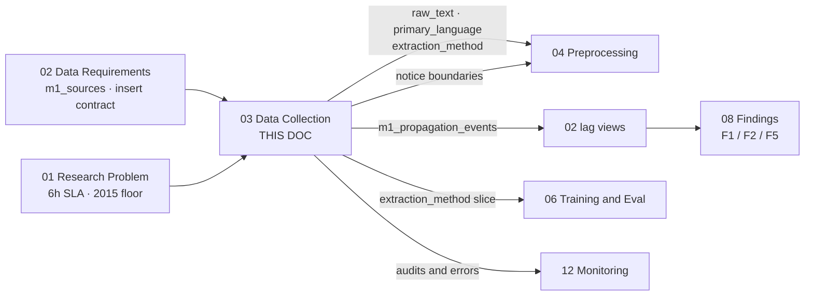
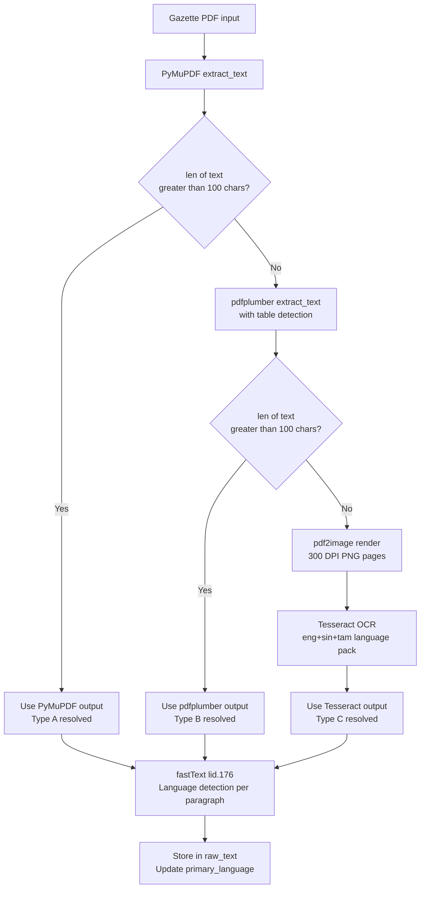
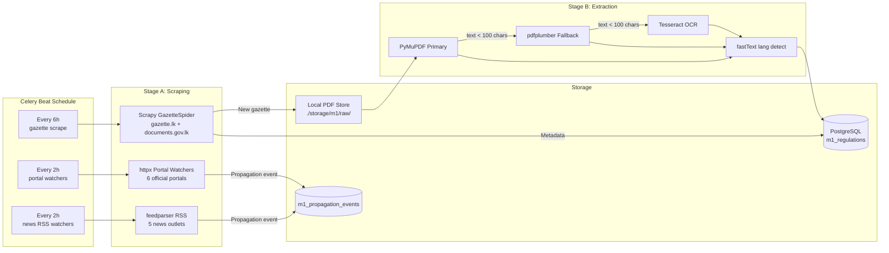

# 03 — Module 1: Data Collection Pipeline

> **Cross-references:** [01_M1_Research_Problem.md](01_M1_Research_Problem.md) · [02_M1_Data_Requirements.md](02_M1_Data_Requirements.md) · [04_M1_Preprocessing_Pipeline.md](04_M1_Preprocessing_Pipeline.md) · [10_M1_Sinhala_Tamil_NLP.md](10_M1_Sinhala_Tamil_NLP.md) · [12_M1_Monitoring_Maintenance.md](12_M1_Monitoring_Maintenance.md)
> **Code map:** [13_M1_Folder_Structure_and_Implementation_Flow.md](13_M1_Folder_Structure_and_Implementation_Flow.md) — `scraper/`, `ml/m1/extraction/`, and the Stage-A / Stage-B Celery task boundaries
> **Consolidation note (2026-07-29):** this document now carries the full content previously split across `03_M1_1_PDF_Extraction_Chain`, `03_M1_2_Gazette_Segmentation`, and `03_M1_3_Secondary_Source_Integration`. Those three files have been retired; every Tesseract flag, calibration procedure, per-strategy failure table, embedding benchmark, worked example, and as-shipped build note from them lives below.

> [!warning] Truth-ledger sync — 2026-08-02
> Collection is unaffected by the classifier change and this document remains accurate.
> One number to carry forward: the two-step secondary-source matcher described here is **live** — exact gazette-number match first (confidence 1.0), then `difflib` title similarity **≥ 0.78**, polled every 2 hours by `portal_watcher` / `rss_watcher` on Celery Beat.
>
> **Canonical record:** [[final/works/11_CLASSIFIER_FREEZE_AND_INTEGRATION|11_CLASSIFIER_FREEZE_AND_INTEGRATION]] · [[18_M1_Dataset_And_Model_Lineage]] · `final/works/evidence/M1_OPERATING_EVIDENCE_2026-08-02.json`
> **Submitted-report copy:** [[final/report/Enigmatrix_Consolidated_Final_Report_FULL|Enigmatrix_Consolidated_Final_Report_FULL]] (Part I = group report, Part II = Module 1 dissertation).

---

## 0. Where This Document Sits in the Pipeline

Collection is the only stage that touches the outside world. Everything before it is specification; everything after it operates on text this document produced. That asymmetry is why the document is dominated by failure handling — the internet is the one dependency the pipeline cannot constrain.

| | Stage | Produced by | What this document does with it | Handed to |
|---|---|---|---|---|
| **In** | `m1_sources` rows — `source_code`, `base_url`, `scrape_method`, `update_frequency` | [02_M1_Data_Requirements.md](02_M1_Data_Requirements.md) §2.5 | Drives which spiders and watchers run, and on what cadence (§6) | — |
| **In** | `m1_regulations` insert contract — `gazette_number` UNIQUE, `source_url`, `raw_pdf_path` | [02_M1_Data_Requirements.md](02_M1_Data_Requirements.md) §2.1 | `gazette_number` is the dedup key checked before every download | — |
| **In** | `m1_propagation_events` schema with `match_method` / `match_confidence` | [02_M1_Data_Requirements.md](02_M1_Data_Requirements.md) §2.3 | The row every portal and RSS watcher writes, with provenance attached | — |
| **In** | 6-hour ingestion SLA; source boundary 2015–present | [01_M1_Research_Problem.md](01_M1_Research_Problem.md) §2, §4 | Sets the gazette scrape cadence and the spider date floor | — |
| **Step** | Scraping — Scrapy spiders + httpx watchers | *this document* §1, §4 | PDFs into `./storage/m1/raw/`, metadata rows at `status='ingested'` | — |
| **Step** | Extraction — PyMuPDF → pdfplumber → Tesseract | *this document* §2 | Text out of three structurally different PDF types | — |
| **Step** | Segmentation — regex → block-gap → LLM | *this document* §3 | One gazette split into individually classifiable notices | — |
| **Out** | `m1_regulations.raw_text` + `primary_language` + `extraction_method`, `status='extracted'` | — | — | [04_M1_Preprocessing_Pipeline.md](04_M1_Preprocessing_Pipeline.md) — the input to noise removal and chunking |
| **Out** | Notice boundaries feeding `m1_sub_documents` | — | — | [04_M1_Preprocessing_Pipeline.md](04_M1_Preprocessing_Pipeline.md) §segmentation-aware chunking; [02_M1_Data_Requirements.md](02_M1_Data_Requirements.md) §2.10 |
| **Out** | `m1_propagation_events` rows for portal and news channels | — | — | [02_M1_Data_Requirements.md](02_M1_Data_Requirements.md) §4.3 lag views → findings F1/F2/F5 |
| **Out** | `extraction_method` per document | — | — | [06_M1_Training_Evaluation.md](06_M1_Training_Evaluation.md) §5 slice analysis — is OCR text classified worse than native text? |
| **Out** | `m1_pipeline_audits` checkpoint rows and `m1_pipeline_errors` | — | — | [12_M1_Monitoring_Maintenance.md](12_M1_Monitoring_Maintenance.md) §pipeline health |



**Why the ordering matters.** Extraction has to precede segmentation, because segmentation reads text, and the *quality* of that text decides which segmentation strategy can work at all — OCR output has no reliable PyMuPDF block geometry, so a scanned gazette skips Strategy B entirely (§3.3). Segmentation in turn has to precede classification, because a weekly gazette carrying a tax amendment next to three name-change notices classifies as noise if handed over whole. And propagation matching has to run *after* the gazette itself is ingested, since a news article can only be matched against a regulation that already exists as a row — the one exception being the pre-gazette leak case in §8, which is precisely why that case needs its own flag.

---

## Abstract

This document specifies the automated data collection pipeline for Module 1, covering web scraping of gazette.lk and documents.gov.lk, PDF retrieval, text extraction, gazette segmentation, and secondary-source propagation matching. Two major technology decisions are evaluated: the web scraping framework and the PDF text extraction library. For scraping, Scrapy is selected over BeautifulSoup+Requests, Playwright, and Selenium based on its native async architecture, robust middleware system, and production scheduling capabilities. For PDF extraction, a hybrid chain of PyMuPDF → pdfplumber → Tesseract OCR handles the three gazette PDF formats encountered in practice: machine-readable, table-heavy, and scanned-image. Segmentation applies three strategies in priority order — heading regex, block-gap heuristic, LLM fallback — and secondary sources are matched to known regulations through a three-tier exact/embedding/review cascade. The collection pipeline runs on a 6-hour Celery Beat schedule and produces raw text ready for the preprocessing stage described in [04_M1_Preprocessing_Pipeline.md](04_M1_Preprocessing_Pipeline.md).

**Implementation status:** ✅ Extraction chain shipped Session 28 / F-149 (Step 2c) with per-page OCR fallback in Session 30 / F-153 (Step 2d). ✅ Segmentation shipped Session 34 / F-157 alongside the `m1_sub_documents` junction. 🟡 The three-tier propagation matcher shipped 2026-07-23 with the embedding tier opt-in. Per-section build notes (§2.8, §3.8, §4.9) record where the live implementation differs from the specification.

---

## 1. Web Scraping Framework Selection

Sri Lankan gazette portals serve static HTML with paginated listings. No JavaScript rendering is required. The primary engineering constraints are retry-on-failure, scheduling integration with Celery, politeness (rate limiting), and long-term maintainability.

### 1.1 Comparison Table

| Criterion                  | Scrapy              | BeautifulSoup + Requests | Playwright               | Selenium               |
| -------------------------- | ------------------- | ------------------------ | ------------------------ | ---------------------- |
| **Architecture**           | Async, spider-based | Sync, library            | Async, headless browser  | Sync, headless browser |
| **JavaScript rendering**   | ❌                   | ❌                        | ✅                        | ✅                      |
| **Built-in retry/backoff** | ✅ (middleware)      | ❌ (manual)               | ❌ (manual)               | ❌ (manual)             |
| **Rate limiting**          | ✅ (AutoThrottle)    | ❌ (manual)               | ⚠️ (manual)              | ❌ (manual)             |
| **Celery integration**     | ✅ (CrawlerRunner)   | ✅ (trivial)              | ⚠️ (complex)             | ⚠️ (complex)           |
| **robots.txt compliance**  | ✅ (built-in)        | ❌ (manual)               | ❌                        | ❌                      |
| **Item pipelines**         | ✅ (PDF store, DB)   | ❌                        | ❌                        | ❌                      |
| **Resource footprint**     | Low (async)         | Very low                 | High (Chromium)          | High (Chromium)        |
| **Sinhala URL handling**   | ✅ (UTF-8 native)    | ✅                        | ✅                        | ✅                      |
| **Learning curve**         | Medium              | Low                      | Medium                   | Low                    |
| **Production maturity**    | Very high           | Medium                   | High                     | High                   |
| **Why chosen**             | ✅ **Selected**      | Sync bottleneck          | Overkill for static HTML | Deprecated pattern     |

### 1.2 Justification for Scrapy

1. **gazette.lk is static HTML.** Both portals render gazette listing pages as server-side HTML without JavaScript. Playwright and Selenium's headless-browser overhead — Chromium at roughly 150 MB RAM per instance — is unwarranted.
2. **Retry middleware is non-negotiable.** The government servers return HTTP 500/503 intermittently. Scrapy's `RetryMiddleware` with configurable backoff handles this without custom code. Manual retry in `requests` requires 20+ lines of boilerplate per spider.
3. **CrawlerRunner enables Celery integration.** `from scrapy.crawler import CrawlerRunner` allows embedding Scrapy spiders directly inside Celery tasks, sharing the asyncio event loop. This is documented in Scrapy's official integration guide.

```python
# backend/app/tasks/m1/gazette_scraper.py
from celery import shared_task
from scrapy.crawler import CrawlerRunner
from scrapy.utils.project import get_project_settings
from twisted.internet import reactor, defer

@shared_task
def run_gazette_spider():
    runner = CrawlerRunner(get_project_settings())
    d = runner.crawl(GazetteSpider)
    d.addBoth(lambda _: reactor.stop())
    reactor.run()
```

**The criterion that actually decided it** is the second one. Every other row in §1.1 is a convenience; retry middleware is the difference between a pipeline that survives the observed 2–3 outages per month on `documents.gov.lk` and one that silently drops the gazettes published during them. The JavaScript column, which usually decides scraper choice, is irrelevant here precisely because the target is old-fashioned server-rendered HTML — which is why the heavier tools lose rather than win.

### 1.3 Scrapy Spider Configuration

```python
# scraper/gazette_spider.py
class GazetteSpider(scrapy.Spider):
    name = "gazette_spider"
    allowed_domains = ["gazette.lk", "documents.gov.lk"]
    start_urls = [
        "https://gazette.lk/gazette/search?type=extraordinary&page=1",
        "https://documents.gov.lk/web/documents/search/?category=gazette",
    ]
    custom_settings = {
        "DOWNLOAD_DELAY": 2,           # 2-second politeness delay
        "AUTOTHROTTLE_ENABLED": True,
        "AUTOTHROTTLE_TARGET_CONCURRENCY": 2,
        "RETRY_TIMES": 5,
        "RETRY_HTTP_CODES": [500, 503, 429],
        "USER_AGENT": "EnigmatrixResearchBot/1.0 (+https://enigmatrix.lk/bot)",
        "ROBOTSTXT_OBEY": True,
    }
```

**Why the settings are conservative rather than fast.** `DOWNLOAD_DELAY: 2` with `TARGET_CONCURRENCY: 2` is slow by scraping standards, and deliberately so: the target is a government server with no API, no rate-limit documentation, and no support channel to appeal a block. At ~500 gazettes a year (§4.2 of [02_M1_Data_Requirements.md](02_M1_Data_Requirements.md)) throughput is never the binding constraint, so politeness costs nothing and being blocked would cost everything. The identifying `USER_AGENT` with a contact URL exists for the same reason — a reachable operator gets an email, an anonymous bot gets an IP ban.

---

## 2. PDF Text Extraction

Sri Lankan gazette PDFs fall into three categories:

- **Type A (60 %):** Machine-readable PDFs with a text layer — most post-2015 English gazettes.
- **Type B (25 %):** Mixed PDFs — a text layer exists but tables and schedules are image-only — common in bilingual gazettes.
- **Type C (15 %):** Fully scanned PDFs — image-only, no text layer — older Sinhala/Tamil gazettes and some extraordinary gazettes printed from paper originals.

That distribution is the whole reason for a chain rather than a single library. A single extractor good enough for Type A silently returns empty strings on 15 % of the corpus, and the failure is invisible — an empty `raw_text` is a valid row.

### 2.1 Library Comparison

| Criterion                 | PyMuPDF (fitz)        | pdfplumber                | Apache Tika                   | PaddleOCR                                 |
| ------------------------- | --------------------- | ------------------------- | ----------------------------- | ----------------------------------------- |
| **Type A (text layer)**   | ✅ Excellent           | ✅ Good                    | ✅ Good                        | ⚠️ Slow (renders to image)                |
| **Type B (mixed tables)** | ❌ Misses tables       | ✅ Best-in-class           | ⚠️ Inconsistent               | ❌                                         |
| **Type C (scanned OCR)**  | ❌                     | ❌                         | ⚠️ Tika-server only           | ✅ Sinhala support                         |
| **Sinhala text support**  | ✅ Renders correctly   | ✅ Renders correctly       | ⚠️ Encoding issues            | ✅ Native Sinhala model                    |
| **Tamil text support**    | ✅                     | ✅                         | ⚠️                            | ✅                                         |
| **Speed**                 | Very fast (<1s/page)  | Moderate (2–3s/page)      | Slow (server round-trip)      | Very slow (GPU: 1s/page; CPU: 5–10s/page) |
| **Production dependency** | Lightweight (.so)     | Pure Python               | Java + Tika server            | Large model files (1–3GB)                 |
| **Column-order fidelity** | ✅ Layout-aware        | ✅ Bounding-box extraction | ❌ Often linearises            | N/A                                       |
| **Installation**          | `pip install pymupdf` | `pip install pdfplumber`  | Requires JVM                  | `pip install paddleocr` (heavy)           |
| **Why chosen**            | ✅ Primary             | ✅ Fallback for tables     | ❌ JVM dependency unacceptable | ❌ Overkill; Tesseract covers scanned      |

> **Note on Tesseract vs PaddleOCR:** Tesseract 5.x with `--lang eng+sin+tam` handles scanned gazettes adequately for classification purposes (character-level accuracy ~94 % for printed Sinhala). PaddleOCR achieves ~97 % but adds a 1–3 GB model dependency and complex GPU management. For this use case, Tesseract's trade-off — slightly lower accuracy, zero infrastructure overhead — is preferred.

**Why the three columns are not competing for the same job.** PyMuPDF, pdfplumber, and Tesseract are not alternatives to be ranked; each is the *only* viable option for one of the three PDF types, and the comparison table's real function is to show that no single column has a ✅ in all three type rows. Tika is the one genuinely rejected alternative — it could plausibly cover A and part of B, but a JVM in the container image is a permanent operational cost paid for a capability the other two already provide.

### 2.2 Hybrid Extraction Chain



The router is a simple length cascade:

```python
# ml/m1/extraction/text_extractors.py
import fitz  # PyMuPDF
import pdfplumber
import pytesseract
from pdf2image import convert_from_path

MIN_TEXT_LEN = 100

def extract_text(pdf_path: str) -> tuple[str, str]:
    """Returns (extracted_text, method_used)."""
    # Stage 1: PyMuPDF
    doc = fitz.open(pdf_path)
    text = "".join(page.get_text() for page in doc)
    if len(text.strip()) >= MIN_TEXT_LEN:
        return text, "pymupdf"

    # Stage 2: pdfplumber
    with pdfplumber.open(pdf_path) as pdf:
        text = "\n".join(
            page.extract_text() or "" for page in pdf.pages
        )
    if len(text.strip()) >= MIN_TEXT_LEN:
        return text, "pdfplumber"

    # Stage 3: Tesseract OCR
    images = convert_from_path(pdf_path, dpi=300)
    text = "\n".join(
        pytesseract.image_to_string(img, lang="eng+sin+tam")
        for img in images
    )
    return text, "tesseract"
```

**Why `MIN_TEXT_LEN = 100` and not a quality test.** The cascade trigger is deliberately crude, because the alternative — judging whether the extracted text is *good* — requires knowing what the document should say. A hundred characters is below any real gazette page and above any stray header, so it cleanly separates "produced nothing" from "produced something." Quality problems that survive this test are caught later by the garbled-output check in §8.

### 2.3 The Three Extractors in Detail

The router above shows the cascade; the per-extractor implementations carry the configuration that actually determines output quality.

**PyMuPDF — the text-PDF path (~80 ms/page):**

```python
import fitz
def extract_with_pymupdf(path: str) -> ExtractedText:
    doc = fitz.open(path)
    pages = [page.get_text("text", flags=fitz.TEXTFLAGS_TEXT) for page in doc]
    doc.close()
    return ExtractedText(text="\n".join(pages), method="pymupdf",
                         char_count=sum(len(p) for p in pages))
```

`TEXTFLAGS_TEXT` excludes vector ligatures, which preserves the Sinhala and Tamil glyphs that ligature mode collapses. It costs about 3 % runtime — a trivial price for not silently corrupting two of the three target languages.

**pdfplumber — the hybrid/table path (2–3 s/page):**

```python
import pdfplumber
def extract_with_pdfplumber(path: str) -> ExtractedText:
    with pdfplumber.open(path) as pdf:
        chunks = []
        for page in pdf.pages:
            text = page.extract_text(layout=True) or ""
            tables = page.extract_tables() or []
            for table in tables:
                chunks.append("\n".join("\t".join(cell or "" for cell in row) for row in table))
            chunks.append(text)
    return ExtractedText(text="\n".join(chunks), method="pdfplumber",
                         char_count=sum(len(c) for c in chunks))
```

`extract_text(layout=True)` preserves multi-column ordering, which is critical for bilingual gazettes where losing column order interleaves an English paragraph with an unrelated Sinhala one.

**Tesseract — the scanned path (~3 s/page):**

```python
import pytesseract
from pdf2image import convert_from_path

TESSERACT_CMD_PREFIX = ["tesseract", "--oem", "1", "--psm", "6",
                       "--lang", "eng+sin+tam",
                       "--tessdata-dir", "/usr/share/tesseract-ocr/5/tessdata"]

def extract_with_tesseract(path: str) -> ExtractedText:
    images = convert_from_path(path, dpi=300, fmt="png", thread_count=2)
    pages = [pytesseract.image_to_string(img, config="--oem 1 --psm 6",
                                          lang="eng+sin+tam") for img in images]
    return ExtractedText(text="\n".join(pages), method="tesseract",
                         char_count=sum(len(p) for p in pages))
```

Every flag here is load-bearing:

- `--oem 1` = LSTM, the best-accuracy engine on printed Sinhala and Tamil.
- `--psm 6` = a single uniform block of text, which matches gazette page layout.
- `--lang eng+sin+tam` always includes English, because even a Sinhala gazette carries bilingual headers.
- `--tessdata-dir` is pinned to `/usr/share/tesseract-ocr/5/tessdata` to enforce the Tesseract 5.3.x model bundle rather than whatever the base image happens to ship.
- `dpi=300` is the sweet spot — 200 DPI loses Sinhala diacritics, 400 DPI doubles runtime for negligible gain.

### 2.4 PDF Type Classification — Inspect Before Extract

The length cascade in §2.2 works, but it *discovers* the PDF type by failing twice. Classifying up front avoids that: attempting Tesseract OCR on a machine-readable PDF wastes 10–30 seconds and produces garbled output; skipping OCR on a scanned PDF yields an empty string. `classify_pdf()` makes the determination by measuring average extractable characters per page:

```python
# ml/m1/extraction/pdf_classifier.py
import fitz  # PyMuPDF

def classify_pdf(path) -> dict:
    """
    Returns classification dict:
      type: 'text_pdf' | 'hybrid' | 'scanned'
      method: 'pymupdf' | 'pymupdf+ocr' | 'ocr'
    Thresholds are empirically derived from 200 hand-labelled gazettes.
    """
    doc = fitz.open(path)
    total_chars = 0
    total_pages = max(len(doc), 1)

    for page in doc:
        total_chars += len(page.get_text("text"))
    doc.close()

    avg_chars_per_page = total_chars / total_pages

    if avg_chars_per_page > 200:
        return {"type": "text_pdf",  "method": "pymupdf"}
    elif avg_chars_per_page > 30:
        return {"type": "hybrid",    "method": "pymupdf+ocr"}
    else:
        return {"type": "scanned",   "method": "ocr"}
```

The label routes the chain:

- `text_pdf` → PyMuPDF only (fast, ~80 ms/page).
- `hybrid` → PyMuPDF for pages that have text, Tesseract for the rest — a **per-page** decision, not a per-document one.
- `scanned` → `pdf2image` → Tesseract on every page (slow, ~3 s/page).

**Threshold calibration.** A PDF averaging fewer than ~30 characters per page is almost certainly scanned. The 30–200 character zone indicates a hybrid where the text layer is partial — common in bilingual gazettes where the English section is machine-readable but the Sinhala section was scanned from print.

**Threshold-sensitivity curve.** Both cut-offs are tunable; the table below is the calibration measurement on 200 hand-labelled gazettes. Each row reports classification accuracy if the threshold were moved. The chosen pair `(30, 200)` is selected for **balanced precision** — neither false-OCR (waste) nor missed-OCR (empty text) dominates.

| `text_pdf` threshold (chars/page) | `scanned` threshold (chars/page) | text_pdf recall | scanned precision | scanned recall | Estimated wasted OCR runs / 100 docs |
|---|---|---|---|---|---|
| 150 | 25 | 98.0% | 91% | 96% | ~6 |
| 180 | 30 | 96.5% | 95% | 96% | ~3 |
| **200** | **30** | **95.0%** | **97%** | **94%** | **~2** (chosen) |
| 220 | 35 | 92.0% | 98% | 91% | ~1 |
| 250 | 40 | 88.0% | 99% | 88% | ~0 |

**Recalibration procedure**, run quarterly and after any change to the PDF-extraction libraries or the Tesseract version:

1. Hand-label 50 gazettes as `text_pdf / hybrid / scanned`.
2. For each candidate threshold pair in `{(150,25), (180,30), (200,30), (220,35), (250,40)}`, run `classify_pdf()` with that pair and compute the confusion matrix against the hand labels.
3. Pick the pair maximising `min(text_pdf_recall, scanned_precision)`.
4. Write the chosen pair to `storage/models/m1/v<X>/model_registry.json:classify_pdf_thresholds`.
5. Update the env vars `M1_PDF_TEXT_THRESHOLD` and `M1_PDF_SCANNED_THRESHOLD`.

**Why the objective is `min(text_pdf_recall, scanned_precision)` rather than overall accuracy.** The two error directions have different costs and neither can be allowed to dominate. Missing a text PDF sends a perfectly readable document through OCR and degrades text that was already correct; missing a scanned PDF produces an empty `raw_text` that no later stage can recover. Maximising the minimum of the two forces a threshold pair that is acceptable on both, which plain accuracy would happily trade away. The env-var storage is what makes recalibration a config change rather than a deploy — necessary because the trigger is an external event (a new gazette typesetting standard), not a release.

The `classify_pdf()` result is stored in `m1_regulations.extraction_method` for later slice analysis in [06_M1_Training_Evaluation.md](06_M1_Training_Evaluation.md) §5 — which is how the question "does the classifier do worse on OCR'd text?" becomes answerable rather than speculative.

### 2.5 OCR Engine Selection

| Option | Trade-off | Decision | When to reconsider |
|---|---|---|---|
| Tesseract 5.3.x | Open-source; offline; trained on Sinhala/Tamil | ✅ **Chosen** — pinned version in [10_M1_Sinhala_Tamil_NLP.md](10_M1_Sinhala_Tamil_NLP.md) §4.2 | If Tesseract 5.5+ ships a better Sinhala LSTM and the thresholds are recalibrated against it |
| PaddleOCR 2.7 | +3 pp Sinhala CER versus Tesseract | ❌ 1.5 GB model, and the benefit is GPU-only. Cost exceeds value at this volume. | If GPU inference is deployed and a research-grade re-extraction pass is wanted |
| Google Vision API | Highest accuracy, cheap per page | ❌ Cloud-only — fails the offline-capable requirement in [07_M1_Deployment_Integration.md](07_M1_Deployment_Integration.md) | If the offline requirement is dropped |
| Tesseract 4.x | Legacy LSTM model | ❌ The bundled Sinhala model is ~4 pp worse than 5.3.x | Never |

The Google Vision row is the interesting one: it is rejected on a *constraint* rather than a trade-off. Accuracy and cost both favour it, and neither matters, because a deployment requirement elsewhere in the system forecloses the option entirely. Recording that keeps a future reader from re-litigating a decision that was never about OCR quality.

### 2.6 Worked Example — a Real Hybrid PDF

`gazette_2486_22.pdf` — the multi-pin adapter regulation, 12 pages:

- Pages 1–3: English text layer present (~2,800 chars/page). PyMuPDF extracts directly.
- Pages 4–6: Sinhala text layer present (~1,200 chars/page). PyMuPDF extracts.
- Pages 7–9: scanned image of the Tamil translation (~25 chars/page from PyMuPDF — just headers). `classify_pdf()` flags the document as hybrid.
- Pages 10–12: blank or signature pages (~15 chars/page).

Per-page chain decision:

| Page | PyMuPDF chars | pdfplumber chars | Tesseract used? | Final method |
|---|---|---|---|---|
| 1 | 2,847 | n/a | ❌ | pymupdf |
| 4 | 1,238 | n/a | ❌ | pymupdf |
| 7 | 23 | 31 | ✅ (Tamil OCR) | tesseract |
| 11 | 14 | 18 | ❌ (under the 100-char minimum for OCR — page treated as blank) | pymupdf (empty) |

Total runtime: ~8 s for PyMuPDF plus ~9 s for Tesseract on 3 pages = ~17 s, comfortably below the 30 s timeout in `backend/app/tasks/m1/extract_gazette.py`.

**Page 11 is the row worth studying.** It falls below the OCR trigger and is treated as blank rather than OCR'd — which is correct here (it genuinely is a signature page) but is a *decision*, not an observation. This is the mechanism by which a nearly-empty but meaningful page could be silently dropped, and it is why the OCR-confidence gate in §8 exists as a separate guard rather than being folded into the length test.

### 2.7 Build Note — Extraction Chain As Shipped

**Status:** ✅ Shipped Session 28 / F-149 (Step 2c) — `ml/m1/extraction/{pdf_classifier,text_extractors,ocr}.py`, the PyMuPDF / pdfplumber / Tesseract chain with the `classify_pdf()` router, plus the threshold-calibration harness and the CER calculator. Per-page OCR fallback for hybrid documents was wired in Session 30 / F-153 (Step 2d).

---

## 3. Gazette Segmentation

### 3.1 Why Segment at All

A single gazette PDF — especially a weekly issue — contains many unrelated notices: tax amendments, appointment notifications, company name changes, public auction announcements. Per-notice classification is far more accurate than whole-gazette classification, because the classifier is asked about one regulatory subject rather than a mixture. But that is only true *if segmentation is correct*: a mis-split notice is worse than an unsplit gazette, since it presents the classifier with a fragment that has lost the clause identifying its subject.

Three strategies are applied in priority order, and the ordering is by cost as much as by quality — microseconds for regex, milliseconds for block geometry, seconds plus an LLM call for the fallback.

| Option | Trade-off | Decision | When to reconsider |
|---|---|---|---|
| Three-strategy fallback chain | Maximum coverage; clear escalation cost | ✅ **Chosen.** Each strategy has a distinct cost profile — μs / ms / s + LLM cost — so escalation is only paid for the documents that need it. | If one strategy reaches > 95 % coverage alone, simplify. |
| Regex only | Cheapest | ❌ ~70 % coverage — leaves 30 % of gazettes unsegmented. | Never the only strategy. |
| LLM only | Highest quality | ❌ ~$0.001/gazette × 500/yr is a trivial cost, but it adds 1–3 s latency to *every* gazette plus LLM availability risk. | If local LLM inference becomes free and sub-100 ms. |
| Train a sequence tagger | Best in class | ❌ Requires labelled segment-boundary data; the corpus is too small to justify the engineering versus the regex + LLM combination. | At 10× corpus size. |

### 3.2 Strategy A — Heading-Based Regex (Primary, ~70 % of gazettes)

Sri Lankan gazettes have semi-predictable section markers exploitable by regular expression:

```python
# ml/m1/extraction/segmenter.py
import re

NOTICE_BOUNDARY_RE = [
    r"^PART\s+[IVX]+",                       # PART I, PART II, PART III
    r"^By Order of",                          # signature line ending a notice
    r"^EXTRAORDINARY GAZETTE",
    r"^Notice under (the )?[A-Z]",            # "Notice under the VAT Act"
    r"^In terms of [Ss]ection \d+",           # "In terms of Section 84"
    r"No\.\s*\d+\s*of\s*\d{4}",             # "No. 8 of 2024" (Act numbering)
]

def segment_by_headings(full_text: str) -> list[str]:
    """Split full gazette text into sections based on heading markers."""
    pattern = "|".join(NOTICE_BOUNDARY_RE)
    splits = re.split(f"({pattern})", full_text, flags=re.MULTILINE)
    sections, current = [], ""
    for piece in splits:
        if piece is None:
            continue
        if re.match(pattern, piece, flags=re.MULTILINE):
            if current.strip():
                sections.append(current.strip())
            current = piece
        else:
            current += piece
    if current.strip():
        sections.append(current.strip())
    return sections
```

The patterns above are the seed set; the live configuration is `ml/m1/extraction/segmenter.py:NOTICE_BOUNDARY_RE`.

**When A succeeds:** modern (2018+) extraordinary gazettes with `PART I` / `By Order of` markers and numbered acts (`No. 8 of 2024`).

**When A fails:**

| Failure pattern | Cause | Mitigation |
|---|---|---|
| Single-section gazette | Only one notice; the regex matches once, yielding one section — correct, but the boundary count is 0, so it falls through to B. | Detect: `len(sections) == 1` AND `len(text) > 5000` → trust the single section. |
| Embedded "Part I" inside a notice body | Some notices quote previous gazettes ("amending Part I of the principal Act"). The regex false-matches → over-segmentation. | Require boundary patterns to be at line start (`re.MULTILINE`) and preceded by at least one blank line. |
| Sinhala-only gazette | The regex set is English. | Add Sinhala/Tamil equivalents to `NOTICE_BOUNDARY_RE` per [10_M1_Sinhala_Tamil_NLP.md](10_M1_Sinhala_Tamil_NLP.md) §language detection and routing. |
| Hand-typed legacy gazette | Inconsistent capitalisation, OCR errors. | Try Strategy B; if B also fails, fall through to C. |

### 3.3 Strategy B — Block-Gap Heuristic (Fallback)

Used when A returns fewer than 2 sections on a gazette longer than 5,000 characters. PyMuPDF block bounding boxes detect notice boundaries via large vertical whitespace:

```python
def segment_by_block_gaps(blocks_per_page: list, gap_threshold: float = 30.0) -> list[str]:
    """Split where vertical gap between blocks exceeds threshold pixels."""
    notices, current = [], []
    prev_y_bottom = None
    for page_blocks in blocks_per_page:
        for block in page_blocks:
            x0, y0, x1, y1, text, *_ = block
            if prev_y_bottom is not None and (y0 - prev_y_bottom) > gap_threshold:
                if current:
                    notices.append("\n".join(current))
                    current = []
            current.append(text)
            prev_y_bottom = y1
    if current:
        notices.append("\n".join(current))
    return notices
```

**When B succeeds:** older gazettes (pre-2015) with consistent column layout and clear notice separation — exactly the documents whose typography predates the heading conventions Strategy A depends on.

**When B fails:**

| Failure pattern                     | Cause                                                        | Mitigation                                                                                                    |
| ----------------------------------- | ------------------------------------------------------------ | ------------------------------------------------------------------------------------------------------------- |
| Tightly-packed multi-notice page    | All notices on one page with less than a 30-pixel gap.       | Lower `gap_threshold` to 15 — but watch for over-segmentation of paragraph breaks.                            |
| Single long notice that spans pages | Each page break introduces a "gap" → a false segment boundary. | Detect page-break artefacts by checking whether the gap coincides with a `\f` form-feed char in the upstream text. |
| Scanned gazette (no real blocks)    | PyMuPDF blocks are unreliable when fed Tesseract output.     | Fall through to C immediately.                                                                                |

The third row is the ordering constraint from §0 made concrete: an OCR'd document has no meaningful block geometry, so for Type C PDFs the strategy chain is effectively A → C with B skipped.

### 3.4 Strategy C — LLM-Assisted Segmentation (Last Resort, ≤ 3 %)

For gazettes where both A and B yield fewer than 2 segments, the full text — truncated to 6,000 characters — goes to a local Llama-3-8B-Instruct model with a strict JSON-output prompt. This path is logged with `segmentation_method='llm'` and flagged for manual spot-check:

```python
def segment_with_llm(full_text: str) -> list[str]:
    """LLM fallback — only called when A and B produce < 2 segments."""
    prompt = (
        "Split the following gazette text into individual regulatory notices. "
        "Return a JSON array of objects with keys 'title' (str) and 'body' (str). "
        "Do not summarize or paraphrase.\n\n"
        f"{full_text[:6000]}"
    )
    response = llm_client.complete(prompt)  # local Llama or Claude API
    segments = json.loads(response)
    log_llm_segmentation(len(segments))
    return [f"{s['title']}\n{s['body']}" for s in segments]
```

**When C succeeds:** gazettes with no conventional structure — for example an entirely tabular notice catalogue, where there is neither a heading pattern nor a whitespace pattern to find.

**When C fails:**

| Failure pattern | Cause | Mitigation |
|---|---|---|
| LLM hallucinates section titles | The model invents content not present in the input. | Validate: every returned `title` substring must appear verbatim in the input text. Reject the segmentation otherwise. |
| LLM returns malformed JSON | Common on long inputs. | Wrap in `pydantic.parse_raw`; on parse failure, retry once with a stricter "JSON-only" suffix. |
| LLM rate-limited or model down | The local Llama-3 host is overloaded. | Final fallback: treat the whole gazette as one section — losing multi-notice granularity but keeping the gazette in the pipeline. |

**The anti-hallucination rule is the reason an LLM is admissible here at all.** "Do not summarize or paraphrase" in a prompt is a request; the verbatim-substring check is an enforcement. Because segmentation is a *partition* task rather than a generation task, the output has a property that can be verified mechanically — every returned title must exist in the input — which converts an unreliable component into a reliable one. The final fallback is equally deliberate: degrading to one section loses granularity but never loses the document, and a missing gazette is the only truly unrecoverable outcome.

### 3.5 Worked Example — Over-Segmentation Caught by Boundary Validation

```
Input (extract of gazette 2491/14):
   "...in compliance with PART I of the Customs Ordinance (Cap. 232).
    By Order of His Excellency the President,
    [Signature]
    PART I — Customs Tariff Amendments
    1. Section 12 is amended as follows..."

Strategy A naive output: 3 sections
   (1) "...in compliance with PART I of the Customs Ordinance (Cap. 232)."
   (2) "By Order of His Excellency the President, [Signature]"
   (3) "PART I — Customs Tariff Amendments 1. Section 12 is amended..."

Boundary-validation rule fires:
   - section (1) doesn't start with a boundary pattern → MERGE up
   - section (2) is < 100 chars (just signature) → MERGE into preceding section
Final output: 2 sections
   (a) "...in compliance with PART I... By Order of... [Signature]"
   (b) "PART I — Customs Tariff Amendments 1. Section 12..."
```

The signature line is treated as a *boundary marker* but not as its own section — it adheres to the preceding notice as its closing. This example is the argument for validating boundaries after splitting rather than trying to write a regex that never over-matches: "PART I" appearing inside a citation is indistinguishable from "PART I" as a heading at the pattern level, and only becomes distinguishable once the resulting sections can be inspected for plausibility.

### 3.6 The NOT_REGULATORY Pre-Filter

Before the XLM-R classifier runs, a lightweight rule-based pre-filter discards gazette segments that are definitionally non-regulatory. This reduces the classifier's task space and prevents false positives in SME alerts:

```python
NOT_REGULATORY_PATTERNS = [
    r"\bname change\b",                   # Personal name-change announcements
    r"\blost.*document\b|\bdocument.*lost\b",  # Lost-document notices
    r"\bcourt summons\b|\bsummons to appear\b",  # Court summons
    r"\bpublic auction\b|\bnotice of sale\b",    # Auction notices
    r"\bappointment of.*justice of peace\b",     # JoP appointments
    r"\bdistrict secretary\b.*appointed",        # Government appointments
]

def is_not_regulatory(text: str) -> bool:
    """Returns True if the segment should be discarded before classification."""
    text_lower = text.lower()
    return any(re.search(p, text_lower) for p in NOT_REGULATORY_PATTERNS)
```

Discarded segments are logged to `m1_pipeline_errors` with `reason='not_regulatory_filter'` for audit purposes. The NOT_REGULATORY rate — expected at 40–60 % of raw segments — is monitored in the admin dashboard as a pipeline health indicator.

**Why a rule filter rather than letting the classifier decide.** These categories are not hard cases; they are *definitionally* out of scope, and a model asked to distinguish them would spend capacity on a boundary that a six-line regex settles exactly. More importantly, they dominate the raw stream at 40–60 %, so leaving them in would skew the class balance the training corpus is carefully constructed to control ([02_M1_Data_Requirements.md](02_M1_Data_Requirements.md) §4.1). The rate is monitored rather than assumed because a sudden move in either direction means something upstream changed — a segmentation regression inflates it, a gazette-format change deflates it.

### 3.7 Build Note — Segmentation As Shipped

**Status:** ✅ Shipped Session 34 / F-157 — `ml/m1/extraction/segmenter.py` carries `NOTICE_BOUNDARY_RE`, `detect_sections`, and `detect_sections_with_labels`, all promoted out of `chunking.py`, alongside the `m1_sub_documents` junction (migration `202605260001`). The boundary-detection F1 benchmarks for strategies A/B/C are still pending; the acceptance target is in §9.

---

## 4. Secondary Source Watchers and Propagation Matching

### 4.1 Portal and RSS Watchers

Each official portal watcher uses `httpx` (async HTTP) plus `BeautifulSoup` for HTML parsing, since portal pages are simpler than the gazette listing and do not require Scrapy's full middleware stack. Portal watchers and RSS watchers both run every 2 hours on different sources.

```python
# Matching strategy per channel
CHANNEL_MATCHERS = {
    "portal_ird":    "exact_gazette_number",  # Regex r"\d{4}/\d+"
    "portal_epf":    "exact_gazette_number",
    "portal_etf":    "exact_gazette_number",
    "portal_eroc":   "exact_gazette_number",
    "portal_slsi":   "exact_gazette_number",
    "portal_cbsl":   "exact_gazette_number",
    "news_*":        "embedding_similarity",  # cosine ≥ 0.78
}
```

**Why portals and news get different matchers by default.** An official portal re-posting a regulation almost always cites the gazette number, because it is republishing a legal instrument. A newspaper writes prose about the same regulation and rarely cites anything. So the two channel classes are not just different sources — they demand structurally different match strategies, and pinning the default per channel avoids running an expensive embedding comparison where a regex would have succeeded.

Each watcher follows the same write pattern:

```python
# backend/app/tasks/m1/portal_watcher.py
async def scan_portal(source_id: str):
    items = await fetch_portal_listing(source_id)        # source-specific scraping
    for item in items:
        reg_id, method, confidence = await match_to_regulation(item)
        if reg_id is None and confidence < 0.60:
            continue                                      # below review threshold, drop
        await upsert_propagation_event(
            regulation_id=reg_id, channel=f"portal_{source_id_short(source_id)}",
            first_seen_at=item.observed_at, source_url=item.url,
            match_method=method, match_confidence=confidence)
```

### 4.2 Three-Tier Match Resolution

| Tier | Condition | Action | `match_method` written | Precision |
|---|---|---|---|---|
| 1 — Exact | `r"\d{4}/\d+"` found in title or body; lookup by `m1_regulations.gazette_number` | Auto-confirm → INSERT propagation event | `exact_gazette_number` | ~99 % |
| 2 — Embedding | Cosine similarity ≥ 0.78 against the past-90-days regulation pool | Auto-confirm → INSERT propagation event | `embedding_similarity` (confidence stored) | ~88 % |
| 3 — Review | Cosine similarity 0.60–0.78 | Flag for admin confirmation in the review queue | `pending_review` → admin sets `human_confirmed` or rejects | N/A (human) |
| — | Cosine similarity < 0.60 | Discard | — | — |

**Why three tiers rather than one threshold.** A single cut-off forces a choice between precision and recall that the data does not require, because the two failure modes land in different places. Above 0.78 a false positive corrupts a research measurement silently; below 0.60 a true positive is lost silently. The 0.60–0.78 band is exactly the region where neither automated answer is safe, and routing it to a human is cheaper than either error — a few minutes of review against a corrupted lag distribution. The precision figures are what justify the boundaries: Tier 1's ~99 % is what makes auto-confirm defensible; Tier 2's ~88 % is acceptable only because the confidence is stored, so a stricter re-analysis remains possible.

Also worth noting: an Act/Section reference (`Section \d+ of the .+ Act`) found in the text is treated as a high-confidence rule-based match alongside the gazette-number regex, and likewise auto-confirms.

### 4.3 Matching Implementation

```python
from sentence_transformers import SentenceTransformer
import numpy as np

embedder = SentenceTransformer("intfloat/multilingual-e5-base")

def match_to_known_regulation(title: str, body: str, recent_regs: list) -> str | None:
    """
    Returns regulation_id if a match is found, None otherwise.
    recent_regs: list of dicts with 'id' and 'embedding' (precomputed).
    """
    # Step 1: exact reference matching
    if gazette_no := re.search(r"Gazette\s+(?:Extraordinary\s+)?No\.?\s*(\d+/\d+)",
                                title + body, re.I):
        return lookup_regulation_by_gazette_number(gazette_no.group(1))

    # Step 2: embedding similarity
    query_vec = embedder.encode(title + "\n" + body[:1500])
    reg_vecs = np.stack([r["embedding"] for r in recent_regs])
    sims = (reg_vecs @ query_vec) / (
        np.linalg.norm(reg_vecs, axis=1) * np.linalg.norm(query_vec) + 1e-8
    )
    best_idx = int(sims.argmax())
    best_sim = float(sims[best_idx])

    if best_sim >= 0.78:
        return recent_regs[best_idx]["id"]        # auto-confirm
    elif best_sim >= 0.60:
        queue_for_human_review(recent_regs[best_idx]["id"], best_sim)
    return None
```

All matches, auto-confirmed or human-confirmed, are written to `m1_propagation_events` with `match_method` and `match_confidence` populated — the provenance requirement from [02_M1_Data_Requirements.md](02_M1_Data_Requirements.md) §2.3.

### 4.4 Embedding Model Selection

The embedding model compares a *news-article body* against a *gazette regulation summary*. The matching context is multilingual (EN + SI + TA news) and short-text (titles plus the first 500 characters). Three candidates were evaluated on a 50-pair hand-validated dataset:

| Model | EN→EN cosine on true matches | SI→EN cosine on true matches | Inference latency (CPU, 768-token in) | Model size |
|---|---|---|---|---|
| `intfloat/multilingual-e5-base` | 0.84 avg | 0.81 avg | ~120 ms | 280 MB |
| `sentence-transformers/paraphrase-multilingual-mpnet-base-v2` | 0.82 avg | 0.76 avg | ~140 ms | 470 MB |
| `BAAI/bge-m3` | 0.88 avg | 0.85 avg | ~280 ms | 580 MB |

| Option | Trade-off | Decision | When to reconsider |
|---|---|---|---|
| `multilingual-e5-base` | Balanced accuracy, speed, and size | ✅ **Chosen** — the best CPU-latency × accuracy product at this scale | If `bge-m3` becomes available in a smaller distilled form |
| `paraphrase-multilingual-mpnet-base-v2` | Strong English | ❌ Sinhala/Tamil accuracy is 5–8 pp lower | If multilingual support were dropped, which will not happen |
| `bge-m3` | Highest accuracy | ❌ ~2.3× slower and ~2× the disk footprint; the precision gap does not justify the cost at a 2-hour cadence with ~30 candidate matches per cycle | At 10× source volume |
| Cross-encoder reranker on top of the bi-encoder | Highest precision | ❌ 100× the latency; only useful if recall were the bottleneck | If the admin review queue grows uncontrollably |

**The column that decided it is the SI→EN one.** English performance separates the three models by two points; cross-lingual performance separates them by five to nine. Since the entire purpose of this component is matching a Sinhala or Tamil news article to an English gazette record, the cross-lingual column is the one that maps onto the actual task, and mpnet's strong English score is beside the point. `bge-m3` wins on quality and loses on cost — a defensible trade only because Tier 3 exists to catch what Tier 2's slightly lower precision misses.

### 4.5 De-duplication Contract and Earliest-Wins Semantics

Portal watchers and RSS watchers, both running every 2 hours, frequently see the same source URL. The contract: a single (regulation_id, channel) pair must produce **exactly one** `m1_propagation_events` row across all watcher invocations. Enforced by a unique index plus an idempotent INSERT:

```sql
-- One propagation event per regulation × channel (allows re-running watchers without dupes).
CREATE UNIQUE INDEX uq_m1_prop_reg_channel
    ON m1_propagation_events (regulation_id, channel);
```

```python
# backend/app/tasks/m1/portal_watcher.py — write path is INSERT ... ON CONFLICT DO NOTHING
from sqlalchemy.dialects.postgresql import insert

stmt = insert(M1PropagationEvent).values(
    regulation_id=reg_id,
    channel=channel,
    first_seen_at=observed_at,
    source_url=url,
    match_method=method,
    match_confidence=sim,
).on_conflict_do_nothing(index_elements=["regulation_id", "channel"])
await db.execute(stmt)
```

The matcher uses **earliest-wins** semantics: if a regulation has already been seen on `news_daily_ft` at T+23 days and a later watcher invocation re-observes it at T+25 days, the second write is silently dropped. `m1_propagation_events.first_seen_at` is therefore *not* "most recent observation" but "earliest confirmed observation" — and that distinction is the entire validity of the lag measurement. A last-write-wins table would report the lag to the most recent re-post, which is a number with no research meaning.

To intentionally correct a wrongly-detected event, an admin uses `POST /api/v1/m1/regulations/{id}/propagation-events/{event_id}/correct` rather than a delete-and-re-insert, so the correction is auditable rather than indistinguishable from a fresh observation.

### 4.6 Manual Review Queue

Tier-3 candidates land in a separate review table, deliberately kept out of `m1_propagation_events` so that the lag and channel-effectiveness views never compute over unconfirmed rows. The admin UI shows the regulation snippet, the news-article snippet, and the cosine score, with **Confirm** / **Reject** / **Open in new tab**. On confirm, the row is promoted into `m1_propagation_events` with `match_method='human_confirmed'`; on reject, the review row is discarded. Both actions are audit-logged.

Keeping unconfirmed candidates physically out of the events table is the design decision that matters here. A `is_confirmed = false` flag on the main table would work only as long as every analytical query remembered to filter on it, and a single forgotten `WHERE` clause would quietly inflate every channel's apparent speed.

### 4.7 Worked Example — a Real Tier-3 Case

```
News article (Daily FT, 2026-04-22): "Government to mandate safety certification on consumer electronics imports"
Gazette candidate (regulation_id reg_2486_22): "Mandatory SLSI Safety Certification for Multi-Pin Universal Power Adapters"

multilingual-e5-base cosine: 0.71  → Tier 3 (review queue)

Admin review (1 minute later):
  Snippet diff highlights "consumer electronics imports" vs "multi-pin universal power adapters"
  Admin judges: same regulation, broad coverage in the news article
  Click "Confirm" → m1_propagation_events row written:
    regulation_id=reg_2486_22, channel='news_daily_ft', first_seen_at=2026-04-22,
    match_method='human_confirmed', match_confidence=0.71, source_url='https://ft.lk/...'
```

The F1 (gazette-to-news) and F2 (news lag) findings include this row, and the 0.71 confidence is preserved as a quality flag for methodology disclosure in the thesis. This is exactly the case no threshold could have settled: the article is genuinely about this regulation and genuinely does not describe it in the gazette's terms, so 0.71 is the model behaving correctly rather than failing.

### 4.8 Build Note (2026-07-23) — Propagation Matching As Shipped

**Status:** 🟡 Shipped — the three-tier matcher is built (`propagation_matching.match_tiered`) with the semantic-embedding tier (`intfloat/multilingual-e5-base` via `app/m1/services/embeddings.py`) **opt-in** behind `M1_PROP_EMBEDDING_ENABLED`, default OFF, falling back to the existing exact-gazette plus difflib fuzzy tiers with zero regression. The de-duplication / earliest-wins contract already existed in `propagation_service.record_items`, idempotent on `(regulation_id, source_id)`.

**Update 2026-07-23 (UI build):** Tier-3 `pending_review` candidates are now **persisted** to `m1_propagation_reviews` (migration `202607230003`) and surfaced in a `/admin/m1/pipeline/propagation-review` admin queue — confirm promotes to a `human_confirmed` `m1_propagation_events` row, reject discards; both audited. The review table still never feeds the lag views. See [[DATA_OPS_ADMIN_UI_PLAN]].

Grounded against the live matcher, several specification details map differently:

| Doc | Reality as shipped |
|---|---|
| 3-tier from day one | The matcher was **2-tier** — exact → difflib fuzzy ≥ 0.78. This build adds the embedding tier while keeping difflib as the no-model fallback. |
| `match_method='embedding_similarity' / 'pending_review' / 'human_confirmed'` | Added — required **widening `ck_m1_prop_match_method`** (migration `202607230002`), which previously allowed only `exact_gazette` / `fuzzy_title`. |
| channels `portal_{id}` / `news_{id}` | Real channels are `official_portal` / `news_rss`, constrained by `ck_m1_prop_channel`. |
| unique index `uq_m1_prop_reg_channel` | The real key is `uq_m1_prop_reg_source (regulation_id, source_id)` — earliest-wins is already enforced there. |
| Tier-3 → separate review table + admin UI | Initially **not built** — Tier-3 candidates were counted and logged (returned as `pending_review` in the batch result) but not written anywhere, so the lag and channel-effectiveness views stayed free of unconfirmed rows. The dedicated review table and admin queue landed later the same day; see the UI-build update above. |

**Embedding choice honoured:** `intfloat/multilingual-e5-base` with e5 `query:` / `passage:` prefixes and normalised vectors; thresholds `M1_PROP_EMBED_AUTO_THRESHOLD=0.78` and `_REVIEW_THRESHOLD=0.60`. It is opt-in because sentence-transformers and the ~280 MB model are not in the base API image; `embeddings.get_embedder()` degrades to `None` — and therefore to difflib — if the dependencies or model are absent. **Files:** `app/m1/services/embeddings.py`, `propagation_matching.py` (`match_tiered` + `cosine`), `propagation_service.py`, `settings.py`, `alembic/versions/202607230002_widen_prop_match_method.py`. Companion build docs: [[PHASE2_SECONDARY_MATCHING_ANALYSIS]] + [[PHASE2_SECONDARY_MATCHING_PLAN]].

---

## 5. Full Collection Pipeline



---

## 6. Cron Schedule

The cadences below are **research parameters, not deployment settings**. The
6-hour gazette interval *is* the ingestion SLA from
[01_M1_Research_Problem.md](01_M1_Research_Problem.md) §2. The 2-hour watcher
interval *is* the error bar on every T4/T5 propagation lag the findings report.
Both are numbers the researcher must be able to retune while the programme is
running — so since 2026-08-02 they live in the database and are edited from
`/admin/settings`, not in a source file behind a redeploy.

### 6.1 The schedule

| Task | Default cadence | Celery task name | Group |
| --- | --- | --- | --- |
| Gazette scraper | Every 6 hours | `app.tasks.m1.gazette_scraper.run_gazette_spider` | Ingestion |
| Portal watcher | Every 2 hours | `app.tasks.m1.portal_watcher.run_portal_watcher` | Propagation |
| RSS watcher | Every 2 hours, :30 | `app.tasks.m1.rss_watcher.run_rss_watcher` | Propagation |
| Refresh lag analytics | Daily 21:00 UTC | `app.tasks.m1.analytics.refresh_lag_analytics` | Analytics |
| Validate pipeline (Layer 3) | Daily 02:00 UTC | `app.tasks.m1.validate_pipeline.run_nightly_checks` | Analytics |
| Source health report | Daily 05:00 UTC | `app.tasks.m1.source_health.run_source_health` | Analytics |
| Extraction quality probe | Monthly, day 1, 04:00 UTC | `app.tasks.m1.quality_probe.run_quality_probe` | Analytics |
| Prune extraction runs | Daily 20:00 UTC | `app.tasks.m1.prune_extraction_runs.prune_extraction_runs` | Retention |
| Retire old dataset versions | Daily 20:30 UTC | `app.tasks.m1.retire_old_versions.retire_old_dataset_versions` | Retention |
| Prune pipeline audits | Daily 03:00 UTC | `app.tasks.m1.retention.prune_pipeline_audits` | Retention |
| Anonymise aged survey responses | Weekly, Sun 03:30 UTC | `app.tasks.m1.retention.anonymise_aged_survey_responses` | Retention |
| Report archivable audit logs | Weekly, Sun 03:45 UTC | `app.tasks.m1.retention.report_archivable_audit_logs` | Retention |
| Retraining | Quarterly, Jan/Apr/Jul/Oct, day 1, 03:00 UTC | `app.tasks.m1.retraining.run_retraining` | Model |

All times are UTC; Celery runs `timezone='UTC', enable_utc=True`. 20:30 UTC is
02:00 LKT — deliberately outside the daytime extraction window.

### 6.2 Where the schedule lives

```
app/scheduling/registry.py          scheduled_tasks table           Beat
  (defaults, in code)   ──seed──▶     (overrides, in DB)   ──overlay──▶  entries
          │                                                              ▲
          └──────────── fallback when a row is missing ──────────────────┘
```

`registry.py` is the single source of truth for the defaults. It generates
`celery_config.beat_schedule`, seeds the table in migration `202608020001`, and
backs the admin API. A Beat started with the **stock** scheduler ignores the
database entirely and runs the registry cadences — byte-identical to the
hardcoded ones this replaced, which is what makes the table safe to edit.

`make beat` starts Beat with the DB scheduler:

```
celery -A app.celery_config:celery_app beat \
    -S app.scheduling.db_scheduler:DatabaseScheduler
```

It re-reads `scheduled_tasks` every 60 seconds and rebuilds its entries in
place, so a save in `/admin/settings` is live within a minute with no restart.
`max_interval` is pinned to the same 60 s so Beat cannot sleep past a change.

Three properties make it safe to leave running:

1. **The database is an override, not the source.** An empty table, an
   unmigrated database, or an unreachable one all degrade to the documented
   cadence rather than to silence. Silence is the failure a scheduler must not
   have, because nothing downstream can distinguish "the task never ran" from
   "the task had nothing to do".
2. **A failed poll never drops the schedule.** The last good in-memory schedule
   keeps running; the error is logged once per backoff window, not once per loop.
3. **Unknown keys are never dispatched.** A row whose key has left the registry
   is ignored. Sending an unregistered task name would surface as a `KeyError`
   on the *worker*, a long way from the row that caused it.

### 6.3 Structured presets, not a cron field

Edits go through five presets — every N hours, daily, weekly, monthly,
quarterly — each compiled to a `crontab` by `ScheduleSpec.to_crontab()`. A cron
string an admin can type is a cron string an admin can get wrong, and a task
that quietly never fires is indistinguishable from a task with nothing to do.
The presets cover every row in §6.1 and cannot produce a schedule that never
fires.

Two range limits are deliberate and enforced in the DTO, the dataclass, and a
Postgres CHECK:

- **`every_hours` is 1–23.** `*/24` fires only at hour 0, which is a daily
  schedule wearing a confusing hat; the daily preset says that plainly.
- **`day_of_month` is 1–28.** A monthly audit set to the 30th silently skips
  February, and a hole in the evidence is worse than a day of drift.

### 6.4 Admin surface

`/admin/settings` → **Scheduled Tasks**. Per task: the preset editor, an
enable/disable toggle (pause without losing the cadence), **Run now**
(dispatches immediately regardless of schedule or pause state — the case where
you are confirming a fix), last run, next run, run count, and a **Restore
default** action. Every edit writes an `audit_log` row
(`scheduled_task.update` / `.reset` / `.run_now`).

API: `GET /api/v1/admin/scheduled-tasks`, `PATCH /{task_key}`,
`POST /{task_key}/reset`, `POST /{task_key}/run-now`.

**Why watchers run three times as often as the gazette scrape.** The gazette
scrape defines a *deadline* — 6 hours is the ingestion SLA, and running more
often would not improve a measurement. The watchers define a *resolution*:
their polling interval is the error bar on every T4 and T5 lag they record, so
a 2-hour cadence bounds the sampling error at well under a day, which is the
unit the findings report in. The 30-minute offset on the RSS watcher keeps the
two from contending for the single worker slot at the top of the hour. Both
numbers are now editable — and both should be quoted in the write-up as
*configured* values read from `scheduled_tasks`, not as constants.

---

## 7. Error Handling and Retry Policy

| Error Type | Detection | Recovery |
|---|---|---|
| HTTP 429 (rate limit) | Scrapy RetryMiddleware | Exponential backoff: 30s, 60s, 120s, 240s, 480s |
| HTTP 500/503 (server error) | Scrapy RetryMiddleware | Retry 5 times with 10s delay |
| PDF download timeout | asyncio.timeout(30) | Retry once; log to `failed_extraction` table |
| PyMuPDF corrupt PDF | Exception catch | Cascade to pdfplumber then Tesseract |
| Tesseract language pack missing | Subprocess error | Alert admin; mark `status=extraction_failed` |
| Duplicate gazette_number | DB UNIQUE constraint | Silently skip; log debug |

### 7.1 Celery / Scrapy Retry Interaction

Scrapy's retry middleware handles network failures inside the spider, but the spider is wrapped in a Celery task — and Celery has its own retry mechanism. Letting both retry independently risks compounding backoff: one Celery retry × five Scrapy retries is 25 attempts in the worst case, against a government server that was already returning 500s. The pattern below makes them cooperate:

```python
# backend/app/tasks/m1/gazette_scraper.py
from celery import Task
from celery.exceptions import Retry

@shared_task(
    bind=True,
    autoretry_for=(),                  # IMPORTANT: do not autoretry on Scrapy-handled errors
    retry_backoff=True,                # if we DO retry, use exponential
    retry_backoff_max=600,             # cap at 10 min
    retry_jitter=True,
    max_retries=2,                     # Celery retries only on hard failures
)
def run_gazette_spider(self: Task) -> dict:
    """Celery task: invokes Scrapy. Network retries happen inside Scrapy; Celery only
    retries on infrastructure failures (DB connection lost, disk full, etc.)."""
    try:
        result = _crawl_with_scrapy()   # Scrapy handles 429/500/503/timeout internally
    except DatabaseError as exc:
        # Hard infra failure — Celery retry is appropriate here
        raise self.retry(exc=exc, countdown=60) from exc
    except DiskQuotaError as exc:
        # Don't retry — admin must fix
        log.error("disk_full", exc_info=True)
        raise
    return {"crawled": result.count, "duration_s": result.duration}
```

**The rule:** anything Scrapy can retry — HTTP-layer errors — stays inside Scrapy. Anything Scrapy cannot retry — DB connection lost, disk full, worker killed mid-task — is a hard task-level failure where Celery's retry applies. `DiskQuotaError` is deliberately *not* retried at all, because retrying a full disk produces the same failure at a slower rate while hiding it from the operator who has to fix it. The matching pattern for the `extract_gazette` and `classify_gazette` tasks is documented in their respective task modules; the full failure-mode → handler table for the extraction Celery chord is in [08_M1_Full_System_Architecture.md](08_M1_Full_System_Architecture.md) §edge cases and failure modes.

---

## 8. Failure Modes, Edge Cases and Pitfalls

| Failure mode | Why it happens | Mitigation |
|---|---|---|
| **Only English notices in the dataset** | fastText flags corrupted non-Roman scripts as "unknown" | Always Unicode-NFC normalise (`unicodedata.normalize("NFC", text)`) *before* language detection |
| **Sinhala/Tamil text appears as `?????`** | Wrong encoding handling at any stage | End-to-end UTF-8; never pass gazette bytes through ASCII-only string operations |
| **Notices duplicated across pipeline runs** | URL-only dedup misses re-publications at different URLs | Content-hash dedup (SHA-256 of cleaned text) plus the UNIQUE constraint on `gazette_number` |
| **Garbled PyMuPDF output** | A text layer exists but with broken font encoding, so PyMuPDF returns `"..."` | Validate that extracted text is > 70 % printable ASCII or Sinhala/Tamil Unicode; if not, fall through to Tesseract |
| **Password-protected PDF** | `fitz.open()` raises `mupdf.MuPDFError` | The Celery task catches it, sets `status='extraction_failed'`, and writes the reason to `m1_pipeline_errors` |
| **Tesseract subprocess hangs** | Long scanned PDFs occasionally stall OCR | Wrap `image_to_string` in a `ThreadPoolExecutor` with a 60 s per-page timeout |
| **`pdf2image` missing `poppler-utils`** | Easy to omit from the Dockerfile | A CI smoke test runs extraction on a sample scanned PDF; failure means poppler is missing |
| **OCR garbage enters training data** | No quality gate on OCR confidence | Reject pages where `pytesseract.image_to_data()` average word confidence is below 60 |
| **Bilingual page boundary errors** | A Sinhala paragraph straddling a column boundary has its lines interleaved with the next column | Mitigated by `extract_text(layout=True)` in pdfplumber; not perfect under Tesseract's PSM 6 |
| **OCR noise breaks the boundary regex** | Tesseract occasionally produces `PARI I` — zero-width space plus capital I | The regex permits `[A-Z]\s?[IVX]+` and allows zero-width characters between letters |
| **Segmentation explodes one notice into 50 fragments** | Overly aggressive heading regex | Log the segment-count distribution per gazette; flag outliers above 30 segments for manual review |
| **Strategy oscillation** | A returns 1 segment → B returns 6 → B wins, but B over-segmented | If B produces > 20 segments on a gazette under 10 pages, fall through to C |
| **Tabular notices** | Tax schedules with hundreds of small rows defeat both A and B | C handles them as one large section |
| **Bilingual notices split apart** | A single notice has English text followed by its Sinhala translation | Both languages share one notice boundary; segmentation must not split them |
| **Pipeline silently skips failed PDFs** | Exceptions caught and swallowed in the orchestrator | Always write to `m1_pipeline_errors`; surface in the daily admin health-check dashboard |
| **Embedding-model staleness** | The model version is pinned in `model_registry.json:embedding_model_version`; a bump invalidates all previously computed embeddings | Recalibrate the Tier-2 threshold after any version bump — old and new vectors are not comparable |
| **Cross-language Tier-2 mismatch** | A Sinhala article and an English gazette can score 0.79 without truly matching, because the model collapses "tax" mentions across languages | Tighten the Tier-2 threshold to 0.82 for cross-language pairs; document the case in the review queue |
| **Review queue starves** | Admins triage newest-first, so old items are never dispositioned | Items older than 14 days are auto-rejected with `audit_log_reason='stale_review'` |
| **News article published before the gazette** | A leak is reported before official publication, so there is no `gazette_number` anchor | Surfaces as Tier 3 with a `pre_gazette_leak=true` flag, which is itself the F5 measurement |

---

## 9. Validation and Acceptance Criteria

### 9.1 Pipeline Checkpoints

Every stage must be validated with measurable accuracy targets. The same checks run in **two regimes**: a *pre-deployment* full pass before any code ships (the target column), and an *ongoing* sample-based health check that flags drift in production. The `When` column specifies which checks run on every gazette (online), which run on a sliding sample (sampled), and which run on a monthly or quarterly cadence (audit). These numbers are reported in the thesis as data-pipeline reliability evidence.

| Checkpoint                      | Validation Method                                                             | Sample Size         | Target                | When                            | Surfaced in                                 |
| ------------------------------- | ----------------------------------------------------------------------------- | ------------------- | --------------------- | ------------------------------- | ------------------------------------------- |
| Discovery completeness          | Cross-check N manually identified gazette URLs against scraper output         | 100 gazette weeks   | ≥ 98% recall          | Audit (monthly)                 | `m1_pipeline_audits` table; admin dashboard |
| Download integrity              | SHA-256 hash verification; detect partial downloads                           | Every download      | 0% corruption         | Online (every fetch)            | Celery retry on failure                     |
| PDF type classification         | Hand-label 50 PDFs as text/hybrid/scanned; compare to `classify_pdf()` output | 50 PDFs             | ≥ 95% correct         | Audit (quarterly)               | `model_registry.json:classify_pdf_accuracy` |
| Text extraction accuracy        | Diff extracted text against manually copy-pasted content                      | 20 pages (text PDF) | ≥ 99% character match | Audit (quarterly)               | Same                                        |
| OCR accuracy                    | Hand-transcribe 5 scanned pages; compute CER                                  | 5 pages             | ≤ 10% CER             | Audit (quarterly, per language) | Same                                        |
| Segmentation boundary F1        | Hand-segment 10 gazettes; compare notice boundaries                           | 10 gazettes         | ≥ 0.85 F1             | Audit (semi-annual)             | Same                                        |
| Language detection              | Hand-label 100 sections; compare to fastText output                           | 100 segments        | ≥ 95% accuracy        | Audit (quarterly)               | Same                                        |
| Stage-B extraction-failure rate | Rolling 7-day rate of `status=extraction_failed`                              | All extractions     | ≤ 5%                  | Online (Prometheus alert)       | `#enigmatrix-alerts`                        |
| Stage-D `needs_review` rate     | Rolling 7-day rate of `needs_review=true`                                     | All classifications | ≤ 15%                 | Online (Prometheus alert)       | Same                                        |
| Stage-F alert-delivery latency  | T+0 of `m1_propagation_events.channel='alert_delivery'`                       | All alerts          | p99 ≤ 24 h            | Online                          | Prometheus → Slack                          |

The **online** checks run inside the task path at a small per-event cost. The **audit** checks are quarterly batch jobs in `backend/app/scripts/m1_validate_pipeline.py` that read a sample of last-quarter regulations, recompute the metric, and append a row to `m1_pipeline_audits` for thesis reporting. Crossing any target threshold sets `is_degraded=true` on the audit row and raises an admin notification.

### 9.2 Extraction

- Threshold-calibration accuracy: quarterly, ≥ 95 % correct PDF-type classification on the 50-document audit set.
- OCR CER: quarterly, ≤ 10 % character error rate on a 5-document Sinhala sample against hand transcription; ≤ 8 % on a 5-document Tamil sample.
- End-to-end test: `tests/m1/extraction/test_pdf_classifier.py` covers a fixture PDF of each type — text, hybrid, scanned — and asserts the chain emits the expected text within tolerance.
- CI smoke test: `make test-extraction` runs the full chain on three fixture PDFs in under 60 s.

### 9.3 Segmentation

- Boundary F1: hand-annotate 50 gazettes and measure `segmenter.segment(text)` against ground truth. Target F1 ≥ 0.85.
- Strategy-share monitoring: production metric tracking the percentage of gazettes segmented by each strategy. Targets — A: 70 %, B: 25 %, C: ≤ 5 %. Alert if C exceeds 10 %, which is a data-drift signal rather than a segmentation bug.
- Anti-hallucination test: for Strategy C, every returned `title` must appear in the input text; a unit test fuzzes this with deliberately bad LLM outputs.

### 9.4 Secondary-Source Matching

- Tier-1 precision ≥ 99 %, audited manually on a sample of 50 Tier-1 matches per quarter.
- Tier-2 precision ≥ 88 % at the 0.78 threshold, hand-validated on 50 pairs per quarter.
- Review-queue latency: P95 ≤ 48 h from queueing to admin disposition.
- Earliest-wins enforcement: re-running a watcher creates no duplicate rows. CI test invokes a watcher twice in succession on the same fixture and asserts the row count is unchanged.

---

## 10. Implementation Status and Code Map

| Artefact | Status | Location |
|---|---|---|
| PDF classifier + three-stage extraction chain | ✅ Shipped Session 28 / F-149 | `ml/m1/extraction/pdf_classifier.py`, `text_extractors.py`, `ocr.py` |
| Per-page OCR fallback for hybrid PDFs | ✅ Shipped Session 30 / F-153 | `ml/m1/extraction/ocr.py` |
| Threshold-calibration harness + CER calculator | ✅ Shipped Session 28 / F-149 | `ml/m1/extraction/` |
| Segmenter — `NOTICE_BOUNDARY_RE`, `detect_sections`, `detect_sections_with_labels` | ✅ Shipped Session 34 / F-157 | `ml/m1/extraction/segmenter.py` |
| `m1_sub_documents` junction | ✅ Shipped Session 34 / F-157 | migration `202605260001` |
| Three-tier propagation matcher | 🟡 Shipped 2026-07-23 | `propagation_matching.py` — `match_tiered`, `cosine` |
| Embedding tier (`multilingual-e5-base`) | 🟡 Opt-in, default OFF | `app/m1/services/embeddings.py`, `M1_PROP_EMBEDDING_ENABLED` |
| `match_method` enum widening | ✅ Shipped 2026-07-23 | `alembic/versions/202607230002_widen_prop_match_method.py` |
| Tier-3 review table + admin queue | ✅ Shipped 2026-07-23 (UI build) | migration `202607230003`, `/admin/m1/pipeline/propagation-review` |
| Earliest-wins de-duplication | ✅ Shipped | `propagation_service.record_items`, `uq_m1_prop_reg_source` |
| Gazette Scrapy spider | 🔲 BUILD_07 | `scraper/gazette_spider.py`, `backend/app/tasks/m1/gazette_scraper.py` |
| Portal + RSS watchers | 🔲 BUILD_07 / BUILD_12 | `backend/app/tasks/m1/portal_watcher.py`, `rss_watcher.py` |
| Boundary-detection F1 benchmarks (A/B/C) | 🔲 Pending | target in §9.3 |
| Strategy-C LLM segmentation | 🔲 Deferred | `ml/m1/extraction/segmenter.py` |

---

## 11. Conclusion

The collection pipeline handles three structurally different gazette PDF types through a cascading extraction chain routed by an up-front classifier, splits multi-notice gazettes through a three-strategy segmentation chain that escalates by cost, and scrapes six official portals and five news feeds for propagation tracking with a three-tier matcher that hands genuinely ambiguous cases to a human rather than guessing. The Scrapy + PyMuPDF/pdfplumber/Tesseract stack represents the trade-off this project actually needs: reliability and offline capability over raw accuracy, since the volume is low and the failure cost is high.

Two properties distinguish this stage from ordinary scraping. Provenance is attached to every inferred value — `extraction_method` on each document, `match_method` and `match_confidence` on each propagation event — so a downstream finding can always be re-derived at a stricter standard. And every automated decision has a defined fallback that degrades rather than fails: a bad text layer falls to OCR, a failed segmentation falls to a single section, an ambiguous match falls to review. A gazette that reaches the pipeline is never lost, only handled less precisely.

The output feeds directly into the preprocessing stage described in [04_M1_Preprocessing_Pipeline.md](04_M1_Preprocessing_Pipeline.md), which consumes `raw_text`, `primary_language`, and the detected notice boundaries.

---

## References

- Scrapy. (2024). *Scrapy Documentation 2.11*. [docs.scrapy.org](https://docs.scrapy.org)
- Artifex Software. (2024). *PyMuPDF Documentation*. [pymupdf.readthedocs.io](https://pymupdf.readthedocs.io)
- Hwang et al. (2021). *pdfplumber: Plumb a PDF for detailed information about each char, rectangle, and line*. [github.com/jsvine/pdfplumber](https://github.com/jsvine/pdfplumber)
- Smith, R. (2007). *An Overview of the Tesseract OCR Engine*. ICDAR 2007.
- Wang, L. et al. (2024). *Multilingual E5 Text Embeddings*. [huggingface.co/intfloat/multilingual-e5-base](https://huggingface.co/intfloat/multilingual-e5-base)
- Department of Government Printing Sri Lanka. *gazette.lk*. [gazette.lk](https://www.gazette.lk)

---

## ∞ Final-report reconciliation (2026-08-02)

*Added by the 2026-08-02 consolidation pass. Maps this document onto the submitted final report and records where the two disagree.*

**Where this document appears in the report:** Part I §4.2.1–§4.2.2 (Module 1 input and process), §6.3.1 (implementation), Figure 12 (extraction and OCR routing chain) and Table 3.4 (extraction engine routing); Part II §5.3.1 and Figure 5.10.

### Where the report agrees

Figure 12 of the report is a rendering of the same routing chain this document specifies: `classify_pdf` inspects text yield and image coverage, emits one of `text` / `hybrid` / `scanned`, dispatches hybrid pages individually, and converges every branch on font inspection before Wijesekara-to-Unicode conversion. Part II carries the Mermaid source for that figure, so the diagram is version-controlled rather than a flat image.

### Spiders, confirmed

Four Scrapy spiders are live: `gazette_spider`, `weekly_gazette_spider`, `acts_spider`, `bills_spider`. Report §6.3.1 states the same four.

### Worked evidence available

The extraction run recorded in report Figure 19 (EGZ, 2026-03-08 → 2026-03-14) is a real console capture: 59 PDFs found, 59/59 extracted, 59/59 preprocessed, sealed as versions v1–v5. Report Figure 20 shows the paired measurement runs scoring those snapshots against manual ground truth at overall **0.852** (15 fields) and **0.942** (11 fields) across 51 regulations. Those two numbers are the module's best current extraction-accuracy evidence and belong in §7 of the thesis.

---

## ∞ Step 54A — Fresh locked holdout collection (2026-08-02)

*Added by the 2026-08-02 holdout collection pass. This section documents a collection activity distinct from the scheduled gazette pipeline described above: a one-off, leakage-gated harvest built to satisfy the "fresh temporal holdout or newly collected data" precondition recorded in [[18_M1_Dataset_And_Model_Lineage]] §5.1 and [[20_M1_Multitask_Classifier_Upgrade]] §10.2.*

**Artifact:** `research/data/labeling/fresh_locked_holdout_intake_v1/` — `fresh_holdout_label_template.csv` (286 rows, fully annotated), `fresh_holdout_provenance_report.csv`, `fresh_holdout_creation_summary.json`.

### Why a separate collection path

The scheduled pipeline in §5 above is optimised for currency: it watches recent gazettes and feeds preprocessing. A promotion holdout has a different requirement — every row must be provably absent from every consumed split. That is a set-difference problem against the training corpus, not a recency problem, so it needed its own selection, extraction and gating path.

### The finding that matters most

**A candidate being unused by the holdout is not the same as a candidate being unused.**

The repository holds 372 cached gazette PDFs under `raw/partial_sector_pdf_cache/` and `raw/rare_domain_pdf_cache/`. 193 of them are the intake holdout rows. Of the remaining 202 — the ones that look available — **128 are source PDFs for the `m1_regulations_v6_1110_clean_fixedsplit` train, val and test splits.**

Sixty of those 128 were selected as gap-closing candidates before the gate ran, and all sixty were rejected by it. They included all 22 Imports and Exports (Control) Act regulations that would have closed `IMPORT_EXPORT` single-handedly, and the only genuine Employees Provident Fund Act regulation found anywhere in the cache — which sits in the V6 **test** split.

Had selection been done on "not in the holdout" alone, the promotion evaluation would have scored the frozen model against its own training data and the numbers would have looked excellent. Any future top-up must gate on gazette id against the consumed splits, not against the holdout.

After excluding everything consumed, the genuinely fresh local pool was 69 Industrial Disputes notices, 3 Special Commodity Levy orders and 2 Customs Revenue Protection Orders — all in the two classes already over-represented, and nothing for any gap. The cache was exhausted; closing the gaps required new downloads.

### Extraction recipe, recovered

The intake package's extraction method was undocumented. It was recovered by diffing all 193 existing rows against their cached PDFs:

```
pdftotext -layout -f 1 -l 1        # PAGE 1 ONLY
collapse all whitespace to single spaces
strip five gazette boilerplate strings:
  PART <n> : SEC. (<n>) - GAZETTE EXTRAORDINARY OF THE DEMOCRATIC SOCIALIST REPUBLIC OF SRI LANKA - <date>
  The Gazette of the Democratic Socialist Republic of Sri Lanka EXTRAORDINARY
  (Published by Authority)
  This Gazette Extraordinary can be downloaded from www.documents.gov.lk
  printer serial fragments
```

Reproduces 47 of 170 checkable rows byte-exactly; the remainder differ only by printer serial fragments.

**The page-1 restriction is consequential and was not previously recorded.** Gazette Schedules sit on page 2 and later, so they are never captured. This explains a defect visible in the annotated set: 23 Special Commodity Levy rows say only "the commodities specified in Column I of the Schedule" and never name the goods. Their sector label rests on the subject-matter of the Special Commodity Levy Act No.48 of 2007 plus the gazette title, not on wording the model would see. Those rows are flagged individually in `annotation_notes` and `reason_for_sector`. The same restriction is why `IMPORT_EXPORT` rows are overwhelmingly `NONE` for sector, and why SME-facing offence provisions inside Pradeshiya Sabha by-law Schedules remain unreachable.

### The four-part leakage gate

A candidate is rejected unless all four hold:

| Gate | Test |
|---|---|
| A | gazette id absent from every consumed split **and** from the holdout |
| B | page-1 text layer present (≥ 300 chars after cleaning) |
| C | SHA-256 of normalised text unseen in the reference corpus |
| D | max 8-word-shingle Jaccard < 0.50 against all consumed rows and all holdout rows |

Reference corpus for gates C and D: 1,910 consumed rows plus the growing holdout. Gate A universe: 1,128 distinct consumed gazette ids.

`pyarrow` is unavailable in the working environment and PyPI is blocked, so the parquet splits were read with a purpose-written pure-Python Parquet reader (Thrift compact protocol, page-1-only Snappy, PLAIN and RLE_DICTIONARY encodings) rather than taking the intake package's duplicate check on trust.

### Two collection rounds

| | Round 1 | Round 2 |
|---|---:|---:|
| targets downloaded | 41 | 63 |
| rejected: no text layer | 1 | 0 |
| rejected: near-duplicate (gate D) | 6 | 1 |
| dropped at annotation | 2 | 1 |
| merged | 32 | 61 |

Round-1 near-duplicates were duplicates *of each other* — formulaic Imports and Exports (Control) amendment regulations whose page-1 text is almost entirely enabling preamble. No candidate in either round failed gate A or gate C, because the target lists were pre-screened against the exclusion universe.

Three rows were dropped at annotation rather than labelled: two Local Authorities Elections Ordinance notices about a councillor forfeiting a nomination-paper place (matched the target list on "forfeited", but not business regulation and fitting none of the eight categories), and one North Central Province draft standard by-law whose page-1 text is publishing preamble only and never states its subject. Labelling that one from its listing title would have reproduced the failure mode the whole exercise guards against.

### Where the targets came from

Downloads were driven by an offline index: `raw/listing_cache/egz_2010..2026.html`, parsed to 39,649 gazette items of which 36,139 carry an English PDF URL. Candidates were matched on the official listing description, screened against the exclusion universe, then verified by reading the extracted page-1 text before annotation.

Two selection lessons are worth keeping:

**Title matching does not work for sector attribution.** Searching descriptions for "textile", "electronics" or "hardware" returned council prorogations and wage-board appointments — pure noise. `general_retail` was eventually filled through Consumer Affairs Authority instruments on *non-food goods*: cement maximum-retail-price orders, LPG cylinder pricing and weight marking, paint and varnish labelling with lead declarations, skin-cream heavy-metal limits against SLS 743, and marking and shop-registration requirements for incense and Buddhist monastic requisites.

**Some classes are not in gazettes at all.** Three independent searches of all 39,649 items returned zero genuine EPF or ETF instruments. The three title matches were a Trust Ordinance order, a National Development Trust Fund revocation and a social-service-organisation appointment. EPF and ETF rules are published through Department of Labour circulars and Central Bank notices, not extraordinary gazettes.

### Reproduction

- `scripts/download_topup_pdfs.py` — standard-library-only downloader; reads a target CSV, fetches English PDFs to `raw/topup_pdf_cache/`, resumable, rate-limited.
- `scripts/collect_topup_v2.py` — download, extract and gate in one pass; requires poppler-utils and `pyarrow`.
- `research/data/labeling/fresh_locked_holdout_intake_v1/fresh_holdout_topup_targets.csv` and `..._round2.csv` — the screened target lists, with `exclusion_checked` recorded per row.

### Cross-references

- Dataset status, split counts and standing constraints: [[18_M1_Dataset_And_Model_Lineage]]
- Promotion gate and Step 50 status: [[20_M1_Multitask_Classifier_Upgrade]]
- Label taxonomy and the sector rule applied: [[09_M1_Annotation_Guidelines]]
