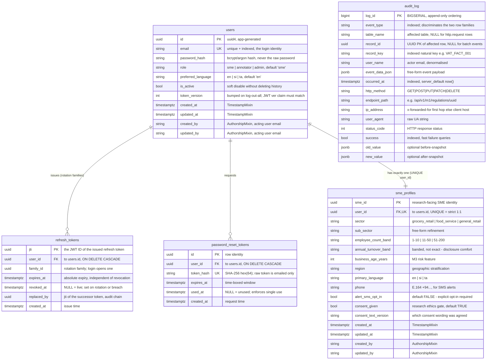
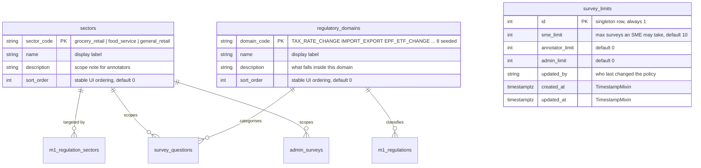
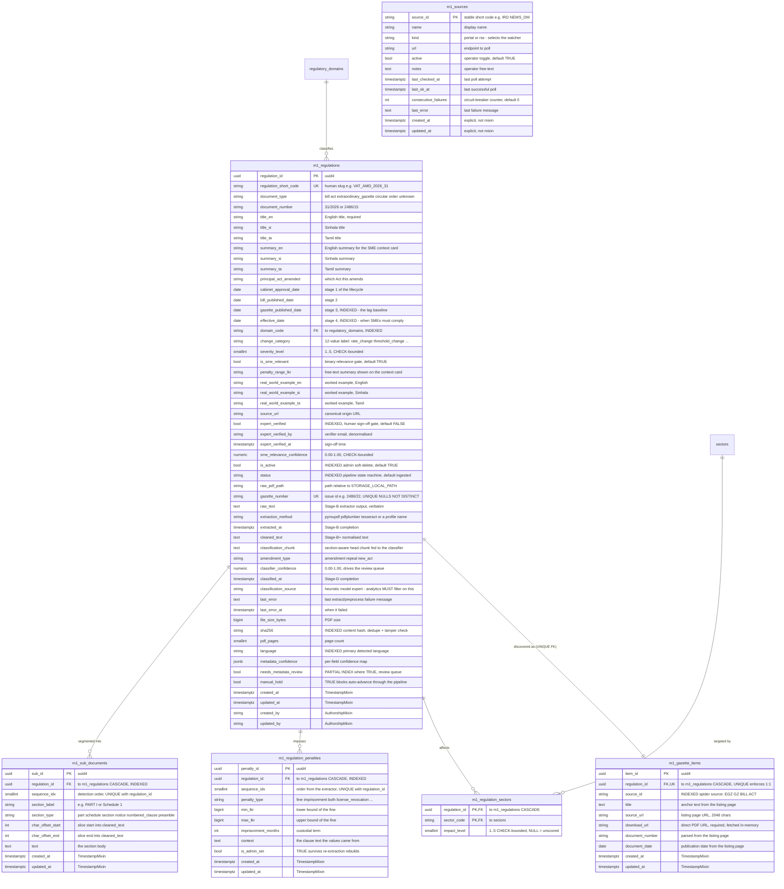
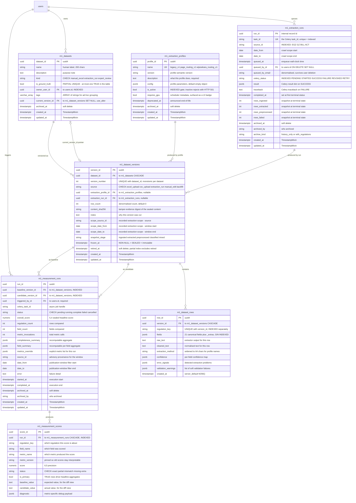
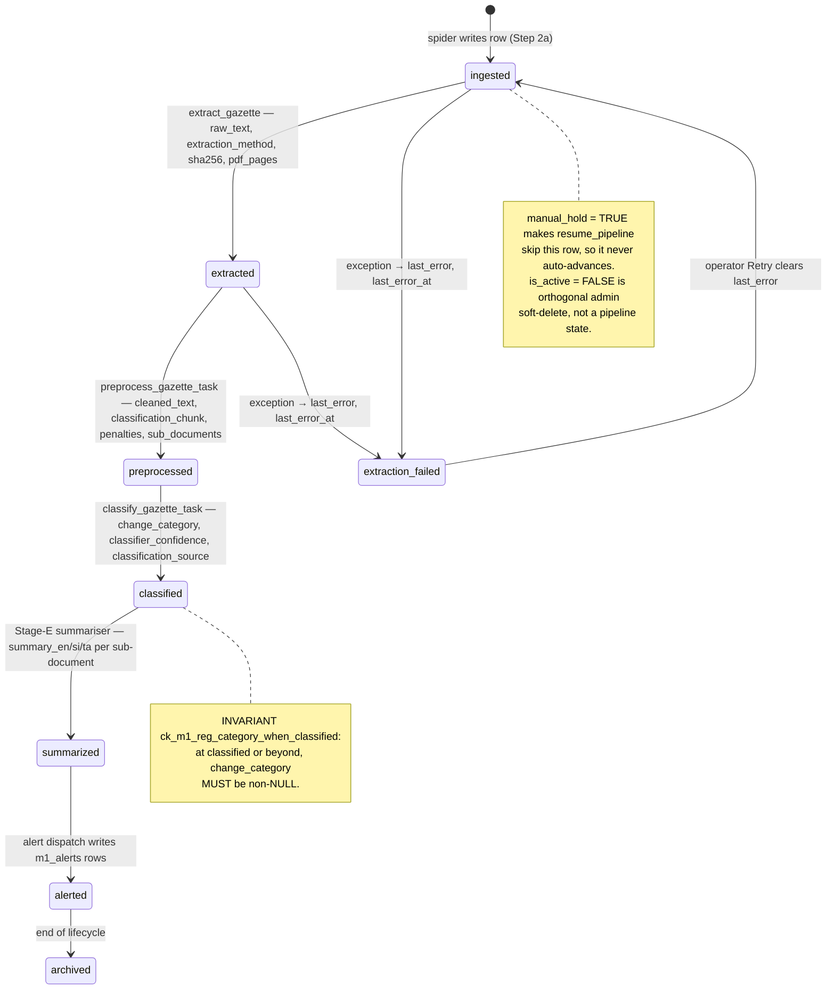
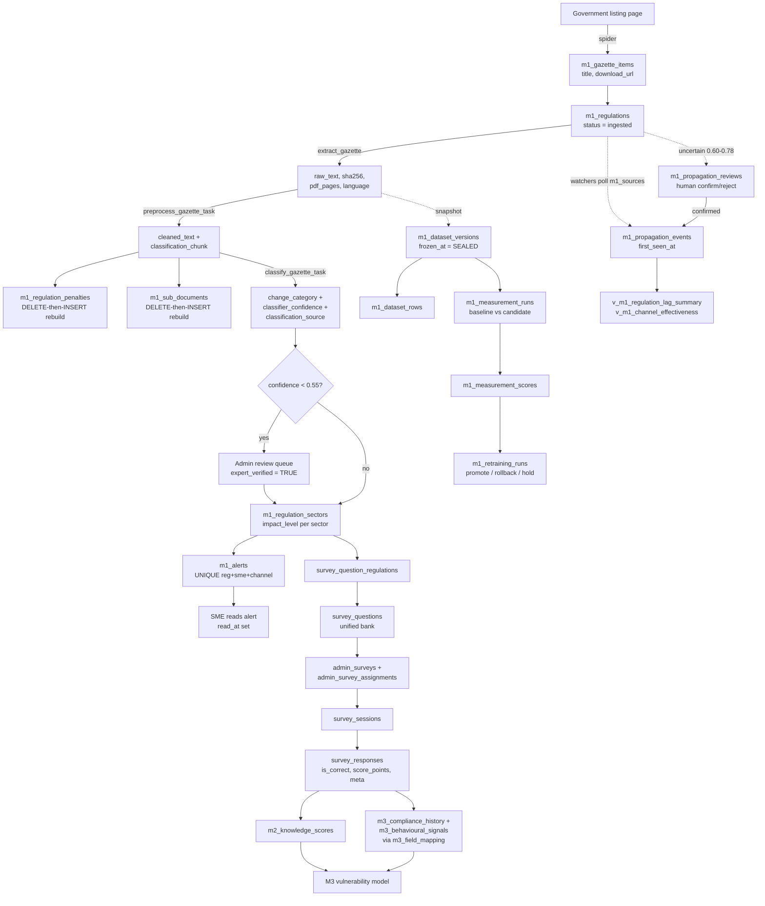
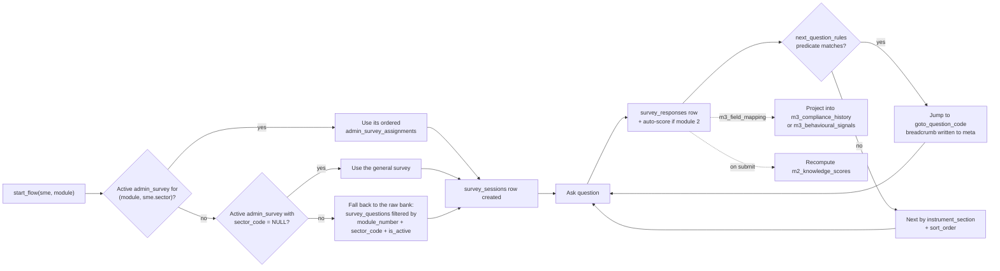

# Enigmatrix — Complete Database Schema Analysis & ER Mapping

> **Scope**: every table in the Postgres schema owned by `enigmatrix-backend`.
> **Method**: derived from the SQLAlchemy 2.0 ORM models (`app/models/`, `app/m1/models/`),
> cross-checked against all 51 Alembic migrations in `alembic/versions/`.
> **Counts**: 36 tables · 2 materialised views · 40 foreign-key edges · 5 logical domains.
> **Generated**: 2026-07-28

---

## 0. How to read this document

| Section | What it gives you |
|---|---|
| §1 Executive summary | The shape of the whole schema in one page |
| §2 Design principles | The 12 recurring patterns — read this before any per-table section, it answers most "why is this field here?" questions once instead of 36 times |
| §3 Master ERD | All 36 tables, keys only (Mermaid) |
| §4–§8 Domain sections | Per-domain ERD with **every column**, then per-table rationale: why the table, why each attribute, which fields matter most |
| §9 Relationship matrix | Every FK edge with cardinality and `ON DELETE` semantics |
| §10 Lifecycle diagrams | The regulation state machine and the survey flow |
| §11 Materialised views | The two derived analytics views |
| §12 Importance ranking | Which tables and which columns are load-bearing |
| §13 Findings | Inconsistencies and risks discovered during the analysis |

Every Mermaid block is standalone-renderable. Copies also live as `.mmd` files next to this document.

---

## 1. Executive summary

Enigmatrix is a regulatory-awareness research platform for Sri Lankan SMEs. The schema serves
four research modules plus the platform itself:

| Domain | Tables | Purpose |
|---|---:|---|
| **A. Identity & Access** | 5 | Users, tokens, SME profiles, audit trail |
| **B. Reference data** | 3 | Static lookups + one singleton config row |
| **C. M1 — Regulation core** | 6 | The regulatory-change record and everything that hangs off one regulation |
| **D. M1 — Pipeline & MLOps** | 13 | Extraction runs, dataset versioning, measurement, propagation, alerting, quality |
| **E. Survey + M2/M3** | 9 | Unified question bank, sessions, responses, knowledge scores, vulnerability signals |

The single most connected table is **`m1_regulations`** (11 inbound FKs) — it is the hub of the
entire system. The second is **`users`** (7 inbound FKs), and third is **`sme_profiles`** (5).
Everything else is a leaf or a two-hop satellite.

The schema is best understood as **three concentric rings**:

1. **Inner ring** — `users` → `sme_profiles`: who is using the system.
2. **Middle ring** — `m1_regulations`: what the system is about. Every M1 satellite table
   (`penalties`, `sub_documents`, `gazette_items`, `sectors`, `propagation_events`, `alerts`)
   is a 1:N or 1:1 decomposition of one regulation.
3. **Outer ring** — the measurement and survey machinery that connects the two: surveys ask SMEs
   about regulations; datasets/versions/measurement runs score how well the pipeline extracted them.

---

## 2. Design principles — the 12 patterns that explain most fields

These recur across the schema. Understanding them once removes ~60% of the "why is this column
here?" questions.

### P1 — UUID primary keys everywhere (except two)
Almost every PK is `UUID(as_uuid=True), default=uuid4`. **Why**: IDs are generated client-side /
in the app process before the INSERT, so a service can build an object graph (regulation + its
penalties + its sub-documents) in memory and flush it in one transaction without round-tripping
for sequence values. It also means IDs are safe to expose in URLs — a sequential integer would
leak row counts.

The two exceptions are deliberate: `audit_log.log_id` and `m1_pipeline_audits.audit_id` are
`BIGSERIAL`. **Why**: these are append-only, high-volume, never-exposed-in-a-URL log tables where
monotonic insert order is itself useful information and 8 bytes beats 16.

### P2 — Natural string PKs on lookups and the question bank
`sectors.sector_code`, `regulatory_domains.domain_code`, `survey_questions.question_code`
(`'VAT_FACT_001'`), `m1_sources.source_id` (`'IRD'`). **Why**: these values are authored by humans,
appear in seed files, spreadsheets and research papers, and must be readable in a raw `survey_responses`
dump without a join. `m1_sources` documents this explicitly — "renaming a source would orphan its
history; add a new row instead".

### P3 — `TimestampMixin` (`created_at` / `updated_at`)
Applied via mixin with `server_default=func.now()` and `onupdate=func.now()`. **Why**: server-side
defaults mean the timestamp is correct even for rows inserted by a migration, a `COPY`, or psql —
not just by the app.

### P4 — `AuthorshipMixin` (`created_by` / `updated_by`) — denormalised email, *not* an FK
Applied to `m1_regulations`, `survey_questions`, `survey_question_regulations`, `users`,
`sme_profiles`, `admin_surveys`. **Why (from `app/db/mixins.py`)**: they store the acting user's
email as a plain string so the provenance survives the user being deleted. The same reasoning
produces `m1_extraction_runs.queued_by_email` (alongside the nullable FK `queued_by_id`) and
`audit_log.user_name`. This is intentional denormalisation for archival durability.

Deliberately **not** applied to: static lookups (no author), the append-only `audit_log`
(has `user_name`), and SME-generated tables (`survey_responses`, `m2_knowledge_scores`,
`m3_*`) which already carry `sme_id`.

### P5 — Soft delete via a nullable timestamp or boolean
Two variants coexist:
- `archived_at TIMESTAMPTZ NULL` — `m1_datasets`, `m1_dataset_versions.retired_at`,
  `m1_extraction_runs`, `m1_measurement_runs`, `m1_extraction_profiles`.
- `is_active BOOLEAN` — `m1_regulations`, `survey_questions`, `admin_surveys`, `users`, `m1_sources.active`.

**Why the timestamp variant wins where it's used**: it records *when*, which a boolean cannot.
`m1_extraction_runs` goes further with `archived_by` + `archive_kind ∈ {history_only, with_regulations}`
because deleting an extraction run may or may not mean deleting the regulations it produced —
that intent must be recorded.

**Critically**, `m1_regulations` carries *both* `is_active` (admin soft-delete) and `status`
(pipeline state). The model comment states they are orthogonal: `status` is forward pipeline
progression; `is_active=false` is an admin hiding the row. Conflating them would make
"archived by admin" indistinguishable from "reached end of pipeline".

### P6 — JSONB as the schema escape hatch, with the hot fields promoted to columns
Every table that could face schema churn has a JSONB column: `survey_responses.meta`,
`m1_dataset_rows.fields`, `audit_log.event_data_json`, `m1_measurement_runs.field_summary`,
`m3_behavioural_signals.sector_specific_json`.

**Why**: the research design is still moving. `survey_responses.meta` is documented as existing
"so future M1/M4 modules can attach context without another migration". But anything queried
in a hot path is promoted out of JSONB into a real column — `survey_responses.domain_code`,
`module_number` and `is_correct` are all denormalised columns *specifically* so the M2 scoring
aggregate does not have to open JSONB. `m1_dataset_rows` even carries a **GIN index** on `fields`
so ad-hoc JSONB queries stay usable.

### P7 — CHECK constraints as the enum mechanism (no Postgres `ENUM` types)
`status IN (...)`, `kind IN (...)`, `channel IN (...)` — 10+ named CHECK constraints. **Why**:
a Postgres `ENUM` type requires `ALTER TYPE` to extend and cannot be narrowed at all; a CHECK is
`DROP CONSTRAINT` + `ADD CONSTRAINT`, which Alembic can express in both directions. The migration
history proves the value — `penalty_type` widened 3→7 values, `m1_regulations.status` widened 4→8,
`extraction_method` widened twice, `language` recoded `sin/tam/eng` → `si/ta/en/mixed`.

Migration `202607230001` adds Layer-1 CHECKs **`NOT VALID`** — enforced on new writes but not
retro-validated against existing rows. **Why**: adding a validating CHECK takes an
`ACCESS EXCLUSIVE` lock and a full table scan; `NOT VALID` is instant and can be validated later
during a maintenance window.

### P8 — Partial and composite indexes tuned to actual query shapes
- `ux_m1_datasets_one_ground_truth` — `UNIQUE (is_ground_truth) WHERE is_ground_truth = TRUE`.
  A one-line enforcement of "exactly one ground-truth dataset can exist at a time". This is the
  most elegant constraint in the schema.
- `ix_m1_dataset_versions_active` — `(dataset_id, version_number DESC) WHERE retired_at IS NULL`.
  Serves "latest live version of this dataset" from the index alone.
- `ix_m1_measurement_scores_run_status` — `WHERE status IN ('mismatch','missing','extra')`.
  The error-review UI only ever wants the failures; indexing the 90% that passed is wasted space.
- `ix_survey_questions_module_active`, `..._module_section`, `..._module_baseline` — three
  composite indexes on `module_number` + one discriminator, mirroring the three ways the
  question bank is filtered.

### P9 — Trilingual columns, not a translation table
`title_en/si/ta`, `summary_en/si/ta`, `prompt_en/si/ta`, `real_world_example_en/si/ta`.
**Why**: the language set is fixed at exactly three (English, Sinhala, Tamil) and will not grow —
this is a Sri Lanka–specific system. A normalised `translations(entity_id, lang, field, text)`
table would add a join to every read for zero flexibility gain. The `needs_translation` boolean on
`survey_questions` is the workflow flag that a normalised design would get for free from row absence.

### P10 — Append-only tables with a snapshot timestamp in the natural key
`m3_compliance_history`, `m3_behavioural_signals` — "one row per (sme, snapshot_at)". `audit_log`
is marked **INSERT ONLY — never UPDATE or DELETE**. **Why**: the M3 vulnerability model needs the
*trajectory* of an SME's compliance posture, not just its current state. An UPDATE would destroy
the research data. The read pattern ("most recent row per SME") is served by
`ix_m3_history_sme_snapshot (sme_id, snapshot_at)`.

### P11 — Immutable-after-seal versioning
`m1_dataset_versions.frozen_at`: "A version is mutable only between `created_at` and `frozen_at`.
Once `frozen_at` is non-null, no row keyed to this `version_id` may be inserted, updated, or
deleted." Plus `content_sha256` for tamper-evidence. **Why**: measurement runs compare two sealed
versions. If a version could change after being scored, every historical scorecard would become
meaningless. This is the schema-level guarantee that makes the research reproducible.

### P12 — Denormalised aggregates that are recomputable
`m1_measurement_runs.overall_score` / `field_summary` / `completeness_summary` are sealed at the
end of a run — and the docstring states they are "recomputable from `M1MeasurementScore` via
`measurement_aggregates` if a backfill is ever needed". Same for `m2_knowledge_scores`, which is
"recomputed eagerly on every M2 submit". **Why**: reads (dashboards, the M2→M3 inter-module
contract endpoint) vastly outnumber writes, and the source rows are never deleted, so the cache
can always be rebuilt. The rule is: cache aggregates, never cache anything unrecoverable.

---

## 3. Master ERD — all 36 tables (keys only)

```mermaid
erDiagram
    %% ============ A. IDENTITY & ACCESS ============
    users ||--o{ refresh_tokens : "issues"
    users ||--o{ password_reset_tokens : "requests"
    users ||--|| sme_profiles : "has profile"
    users ||--o{ m1_datasets : "owns"
    users ||--o{ m1_extraction_runs : "queues"
    users ||--o{ m1_measurement_runs : "triggers"
    users ||--o{ m1_alerts : "receives"

    %% ============ B. REFERENCE ============
    regulatory_domains ||--o{ m1_regulations : "classifies"
    regulatory_domains ||--o{ survey_questions : "categorises"
    sectors ||--o{ m1_regulation_sectors : "targeted by"
    sectors ||--o{ survey_questions : "scopes"
    sectors ||--o{ admin_surveys : "scopes"

    %% ============ C. M1 REGULATION CORE ============
    m1_regulations ||--|| m1_gazette_items : "discovered as"
    m1_regulations ||--o{ m1_regulation_sectors : "affects"
    m1_regulations ||--o{ m1_regulation_penalties : "imposes"
    m1_regulations ||--o{ m1_sub_documents : "segmented into"

    %% ============ D. M1 PIPELINE & MLOPS ============
    m1_regulations ||--o{ m1_propagation_events : "propagates via"
    m1_regulations ||--o{ m1_propagation_reviews : "pending match"
    m1_regulations ||--o{ m1_alerts : "notifies about"
    m1_datasets ||--o{ m1_dataset_versions : "versioned as"
    m1_datasets |o--|| m1_dataset_versions : "current pointer"
    m1_dataset_versions ||--o{ m1_dataset_rows : "contains"
    m1_dataset_versions ||--o{ m1_measurement_runs : "scored as baseline"
    m1_dataset_versions ||--o{ m1_measurement_runs : "scored as candidate"
    m1_measurement_runs ||--o{ m1_measurement_scores : "produces"
    m1_extraction_runs ||--o{ m1_dataset_versions : "sources"
    m1_extraction_profiles ||--o{ m1_dataset_versions : "extracted by"

    %% ============ E. SURVEY + M2/M3 ============
    m1_regulations ||--o{ survey_questions : "linked primary"
    m1_regulations ||--o{ survey_question_regulations : "asked about"
    m1_regulations ||--o{ survey_responses : "answered about"
    survey_questions ||--o{ survey_question_regulations : "maps to"
    survey_questions ||--o{ admin_survey_assignments : "assigned to"
    admin_surveys ||--o{ admin_survey_assignments : "contains"
    sme_profiles ||--o{ survey_sessions : "starts"
    sme_profiles ||--o{ survey_responses : "answers"
    sme_profiles ||--o{ m2_knowledge_scores : "scored"
    sme_profiles ||--o{ m3_compliance_history : "history snapshot"
    sme_profiles ||--o{ m3_behavioural_signals : "behaviour snapshot"
    survey_sessions ||--o{ survey_responses : "groups"

    %% ============ ENTITIES (keys only) ============
    users {
        uuid id PK
    }
    refresh_tokens {
        uuid jti PK
        uuid user_id FK
    }
    password_reset_tokens {
        uuid id PK
        uuid user_id FK
    }
    sme_profiles {
        uuid sme_id PK
        uuid user_id FK,UK
    }
    audit_log {
        bigint log_id PK
    }
    sectors {
        string sector_code PK
    }
    regulatory_domains {
        string domain_code PK
    }
    survey_limits {
        int id PK
    }
    m1_regulations {
        uuid regulation_id PK
        string regulation_short_code UK
        string gazette_number UK
        string domain_code FK
    }
    m1_gazette_items {
        uuid item_id PK
        uuid regulation_id FK,UK
    }
    m1_regulation_sectors {
        uuid regulation_id PK,FK
        string sector_code PK,FK
    }
    m1_regulation_penalties {
        uuid penalty_id PK
        uuid regulation_id FK
    }
    m1_sub_documents {
        uuid sub_id PK
        uuid regulation_id FK
    }
    m1_sources {
        string source_id PK
    }
    m1_extraction_runs {
        uuid run_id PK
        string task_id UK
        uuid queued_by_id FK
    }
    m1_extraction_profiles {
        uuid profile_id PK
        string name UK
    }
    m1_datasets {
        uuid dataset_id PK
        uuid owner_user_id FK
        uuid current_version_id FK
    }
    m1_dataset_versions {
        uuid version_id PK
        uuid dataset_id FK
        uuid extraction_profile_id FK
        uuid extraction_run_id FK
    }
    m1_dataset_rows {
        uuid row_id PK
        uuid version_id FK
    }
    m1_measurement_runs {
        uuid run_id PK
        uuid baseline_version_id FK
        uuid candidate_version_id FK
        uuid triggered_by_id FK
    }
    m1_measurement_scores {
        uuid score_id PK
        uuid run_id FK
    }
    m1_propagation_events {
        uuid event_id PK
        uuid regulation_id FK
    }
    m1_propagation_reviews {
        uuid review_id PK
        uuid regulation_id FK
    }
    m1_alerts {
        uuid alert_id PK
        uuid regulation_id FK
        uuid sme_id FK
    }
    m1_retraining_runs {
        uuid run_id PK
    }
    m1_quality_probes {
        uuid probe_id PK
    }
    m1_pipeline_audits {
        bigint audit_id PK
    }
    survey_questions {
        string question_code PK
        string domain_code FK
        string sector_code FK
        uuid linked_regulation_id FK
    }
    survey_question_regulations {
        string question_code PK,FK
        uuid regulation_id PK,FK
    }
    survey_sessions {
        uuid session_id PK
        uuid sme_id FK
    }
    survey_responses {
        uuid response_id PK
        uuid sme_id FK
        uuid session_id FK
        uuid regulation_id FK
        uuid linked_regulation_id FK
    }
    admin_surveys {
        uuid survey_id PK
        string sector_code FK
    }
    admin_survey_assignments {
        uuid survey_id PK,FK
        string question_code PK,FK
    }
    m2_knowledge_scores {
        uuid score_id PK
        uuid sme_id FK
    }
    m3_compliance_history {
        uuid history_id PK
        uuid sme_id FK
    }
    m3_behavioural_signals {
        uuid signals_id PK
        uuid sme_id FK
    }
```



---

## 4. Domain A — Identity & Access (5 tables)

### 4.1 Domain ERD (full columns)



### 4.2 `users` — the authentication root

**Why the table exists**: every actor in the system (SME respondent, annotator, admin) needs one
credential record. Roles are a column rather than separate tables because the three roles share
100% of their authentication surface and differ only in authorisation.

| Attribute | Why it is here |
|---|---|
| `id` (PK) | UUID so it can appear in URLs and in `audit_log.record_id` without leaking user counts. |
| `email` (UNIQUE, indexed) | Login identity. The unique index *is* the constraint — no separate uniqueness check needed in application code, which would race. |
| `password_hash` | Never the password. The column name is deliberately explicit so nobody mistakes it for a reversible field. |
| `role` | `sme` / `annotator` / `admin`. A string with a `server_default='sme'` rather than a FK to a roles table: with three fixed roles, a lookup table adds a join to every authorisation check for no benefit. |
| `preferred_language` | Drives which of the `*_en/_si/_ta` columns the API returns. Storing it on the user rather than reading `Accept-Language` makes the choice sticky across devices. |
| `is_active` | Disable an account without deleting it — deletion would cascade away refresh tokens and orphan the `sme_profiles` research data. |
| `token_version` | **The most subtle field in this table.** Access tokens are stateless JWTs and cannot be revoked individually. "Log out everywhere" increments this integer; every issued access token carries a matching `ver` claim, and `deps.get_current_user` rejects any token whose `ver` disagrees. One integer gives global revocation without a token blacklist. |

**Most important**: `id`, `email`, `password_hash`, `token_version`.

### 4.3 `refresh_tokens` — server-side session state with theft detection

**Why the table exists**: JWTs alone cannot detect a stolen refresh token. This table adds
server-side state so replay is detectable.

The mechanism, encoded entirely in the column design:

1. Login creates a row with a fresh `family_id`.
2. Each refresh sets `revoked_at` on the old row, writes a new row **in the same family**, and
   records the successor's id in the old row's `replaced_by`.
3. If a `jti` that already has `revoked_at` set is presented again, that is either a replay or a
   theft — so **the entire `family_id` is revoked**, logging out the attacker *and* the legitimate
   user, who must re-authenticate.

| Attribute | Why it is here |
|---|---|
| `jti` (PK) | The token's own JWT ID is the primary key — presented token maps to row in one indexed lookup, no secondary index needed. |
| `family_id` (indexed) | The blast radius of a detected theft. Indexed because breach response must revoke a whole family in one statement. |
| `revoked_at` vs `expires_at` | Two independent lifecycle ends. A token can expire naturally (`expires_at`) or be killed early (`revoked_at`). Collapsing them into one boolean would lose the reason and the time. |
| `replaced_by` | The forward pointer that makes the rotation chain walkable during an incident review. Deliberately *not* an FK — the successor row may be deleted by retention pruning while the predecessor is still interesting. |
| `user_id` (indexed, CASCADE) | Deleting a user must not leave live sessions behind. |

**Most important**: `jti`, `family_id`, `revoked_at`.

### 4.4 `password_reset_tokens` — single-use, time-boxed, hash-only

**Why the table exists**: self-service reset without a support ticket.

The security property is in one design choice: **`token_hash` stores SHA-256 of the token, and the
raw token exists only in the email**. A database read — from a backup, a dump, or a SQL injection —
therefore cannot be replayed to take over an account. `UNIQUE` on the hash both enforces
one-row-per-token and makes lookup by presented token a single index probe.

| Attribute | Why it is here |
|---|---|
| `token_hash` (UNIQUE, 64 chars) | Exactly the width of a SHA-256 hex digest. The fixed width is documentation. |
| `used_at` | Single-use enforcement. A nullable timestamp rather than a boolean so "when was this consumed" is answerable during an incident. |
| `expires_at` | Time-boxes the window even if the email is intercepted later. |

**Most important**: `token_hash`, `used_at`, `expires_at` — all three must be checked together.

### 4.5 `sme_profiles` — the research subject

**Why the table exists**: `users` is about authentication; this is about the *business*. Splitting
them means an admin or annotator (who has no business) simply has no profile row, rather than a
`users` table full of NULL business columns. The `UNIQUE` on `user_id` makes it a strict 1:1.

**Why a separate `sme_id` PK instead of reusing `user_id`**: every downstream research table
(`survey_responses`, `m2_knowledge_scores`, `m3_*`) keys on `sme_id`. Keeping it distinct from the
auth identity means a research export can carry `sme_id` without carrying anything that maps back
to a login.

| Attribute group | Why it is here |
|---|---|
| `sector`, `sub_sector` | The primary stratification variable — every M1/M2/M3 analysis segments by it. |
| `employee_count_band`, `annual_turnover_band` | **Banded, not exact.** SMEs will not disclose exact turnover; bands materially raise response rates, and the analysis only needs ordinal size anyway. |
| `business_age_years`, `region` | M3 risk-model features; also stratification controls. |
| `primary_language` | Distinct from `users.preferred_language` — this is the *business's* operating language (which language the accountant files in), a research variable, not a UI preference. |
| `phone` + `alert_sms_opt_in` | SMS costs money and unsolicited SMS is a legal problem in most jurisdictions, so the opt-in defaults to `FALSE` and is stored separately from the number. Having the number is not consent to use it. |
| `consent_given`, `consent_text_version` | Research-ethics requirement. Versioning the consent text means a later wording change does not retroactively claim the SME agreed to it. |

**Most important**: `sme_id`, `user_id`, `sector`, `consent_given`.

### 4.6 `audit_log` — one table, two row families

**Why the table exists**: regulatory-research software needs a defensible record of who changed
what. It is marked **INSERT ONLY — never UPDATE or DELETE**.

**Why one table instead of two**: the model docstring documents two row families sharing the table:

- **Business events** (`regulation.created`, `survey.submitted`, `auth.login`) written by
  `audit_service.record(...)`, carrying `table_name` / `record_id` / `record_key` / `event_data_json`.
- **`http.request` rows** written passively by `AuditMiddleware` for every `/api/v1/...` call,
  carrying `http_method` / `endpoint_path` / `ip_address` / `status_code` / `success`.

All columns of each family are nullable, so each family leaves the other's columns empty. The
payoff: a single chronological query answers "everything that happened around 14:32" across both
families, which a two-table design would require a UNION for.

| Attribute | Why it is here |
|---|---|
| `log_id` BIGSERIAL | Not a UUID (see P1) — monotonic insert order is meaningful here and this is the highest-volume table in the schema. |
| `event_type` (indexed) | The family discriminator *and* the primary filter. |
| `record_id` **and** `record_key` | Two identifier columns because the schema has two PK styles (P2). `record_id` for UUID-keyed rows, `record_key` for string-keyed ones (`question_code`, `domain_code`). Indexing `record_key` makes "all events for VAT_FACT_001" a direct query instead of a JSONB scan. |
| `user_name` | Denormalised email, not an FK — see P4. Audit rows must outlive the user. |
| `success` (indexed) | Failure queries are the common operational case; indexing the boolean makes "show me today's failures" cheap. |
| `old_value` / `new_value` | Present but noted as unused by current callers — reserved for structured before/after diffs. |

**Most important**: `event_type`, `occurred_at`, `record_id` + `record_key`, `user_name`.

---

## 5. Domain B — Reference data (3 tables)

### 5.1 Domain ERD (full columns)



### 5.2 `sectors` and `regulatory_domains` — the two controlled vocabularies

**Why these tables exist**: `sector_code` and `domain_code` are referenced by five other tables
between them. Making them real tables with FK constraints means a typo (`grocery_retails`) fails at
INSERT time rather than silently creating a phantom category that quietly disappears from every
`GROUP BY`.

**Why string PKs**: see P2 — these codes appear in seed YAML, annotation spreadsheets, question
codes (`VAT_FACT_001` embeds `VAT`), and research write-ups. A surrogate integer would force a join
just to read a raw data dump.

**Why `sort_order`**: display order is a *curatorial* decision (put VAT first because it affects
everyone), not an alphabetical or insertion-order fact. Without this column, the frontend would
hard-code an ordering array — which then drifts from the database.

**Why `description`**: this is the annotator-facing scope definition. When a human is deciding
whether a gazette is `VAT` or `INCOME_TAX`, this text is the tiebreaker; it belongs next to the
code, not in a separate style guide.

**Design note on `sectors`**: the docstring records that economy-wide regulations are tagged with
*all three* sectors, and non-sector-specific survey questions use `sector_code = NULL`. So "applies
to everyone" is represented differently in the two places — explicit fan-out on the regulation
side (because `m1_regulation_sectors` also carries a per-sector `impact_level`), NULL on the
question side (because there is nothing per-sector to record).

**Most important**: `sector_code` / `domain_code` (they *are* the table), then `sort_order`.

### 5.3 `survey_limits` — the singleton config row

**Why the table exists**: participation caps are policy that changes during fieldwork ("open it up
to 20 per SME for the final push"). Putting them in a table rather than in `settings.py` means an
admin can change them without a deploy.

**Why `id` defaults to `1`**: this is the single-row-table pattern. The integer PK with `default=1`
means every write targets the same row; the application upserts row 1 rather than managing rows.

| Attribute | Why it is here |
|---|---|
| `sme_limit` / `annotator_limit` / `admin_limit` | Three separate caps because the roles have different purposes. Annotators and admins default to `0` — they should be using the admin tooling, not consuming SME survey slots, and a stray admin response would contaminate the research sample. |
| `updated_by` | Policy changes need attribution even though this is not a mixin-bearing table. |

**Most important**: `sme_limit` — the one that actually gates fieldwork.

---

## 6. Domain C — M1 Regulation core (6 tables)

This is the hub of the schema. `m1_regulations` is one **regulatory change event**; the five other
tables are decompositions of a single regulation into its parts.

### 6.1 Domain ERD (full columns)



### 6.2 `m1_regulations` — the hub table

**Why the table exists**: one row = one regulatory change event. Eleven tables point at it. If you
understand this table you understand 70% of the system.

Its ~50 columns look sprawling until you see that they are **six coherent groups**, each written by
a different stage of the pipeline:

#### Group 1 — Identity
`regulation_id`, `regulation_short_code`, `document_type`, `document_number`, `gazette_number`.

Three identifier columns coexist deliberately:
- `regulation_short_code` (UNIQUE) — the **internal** human slug (`VAT_AMD_2026_31`). Stable,
  authored, used in cross-references and research notes.
- `gazette_number` (UNIQUE) — the **external** government identifier (`2486/22`), parsed by the
  spider. `UNIQUE NULLS NOT DISTINCT` is the Postgres default, so many admin-created rows can leave
  it NULL while non-NULL values stay unique — exactly the right semantics for "optional but must be
  unique when present".
- `document_number` — the number *as printed* on the document, which overlaps in shape with
  `gazette_number`. The model comment flags this as known redundancy with a planned consolidation.

`document_type` includes a sentinel value `'unknown'` for PDFs that arrived without a recoverable
source. **Why a sentinel rather than NULL**: NULL means "not yet asked"; `'unknown'` means "we
looked and could not tell", and it drives a "Needs categorization" tile in the admin UI. Encoding
that distinction in the value set turns a data gap into a work queue.

#### Group 2 — Multilingual content
`title_*`, `summary_*`, `real_world_example_*` (3 × 3 columns). Per P9. Note only `title_en` is
non-nullable — English is the pivot language; the other two arrive via the NLLB translation step.

`real_world_example_*` is a research-design column, not a technical one: awareness research shows
SMEs act on concrete worked examples, not statutory language, so the example is a first-class
field rather than something buried in `summary`.

#### Group 3 — Stage timestamps — **the heart of M1**
`cabinet_approval_date` → `bill_published_date` → `gazette_published_date` → `effective_date`.

**Why four separate date columns rather than an events table**: these four stages are fixed by Sri
Lankan legislative process and will not grow. Keeping them as columns makes the core research
question — *how long is the lag between publication and awareness?* — a subtraction, not a
self-join. `gazette_published_date` and `effective_date` are individually indexed, and there is a
composite `ix_m1_regulations_dates` over the last three, because the lag analytics scan on date
ranges constantly.

`gazette_published_date` is the **baseline for every lag calculation** in the system — the two
materialised views (§11) both subtract from it.

#### Group 4 — Classification and relevance
`domain_code` (FK), `change_category`, `severity_level`, `is_sme_relevant`,
`sme_relevance_confidence`, `classifier_confidence`, `classified_at`, `classification_source`.

The critical field here is **`classification_source`** (`heuristic` | `model` | `expert`). Its
comment is emphatic: *"Analytics MUST filter on this before treating `change_category` as model
output."* Without it, a regex-seeded label and a genuine ONNX-classifier prediction are
indistinguishable in the same column — which would silently corrupt any measurement of classifier
accuracy. This one 12-character column protects the validity of the study's headline metric.

`classifier_confidence` is `NUMERIC(3,2)` with a CHECK bounding it to 0.00–1.00. **Why NUMERIC and
not FLOAT**: exact decimal comparison. The review queue is defined as
`status='classified' AND classifier_confidence < 0.55 AND NOT expert_verified` — a float would make
the boundary case at exactly 0.55 platform-dependent.

`severity_level` and the confidences are all CHECK-bounded (`1..5`, `0.0..1.0`) because an
out-of-range value would not error anywhere — it would just quietly skew a mean.

#### Group 5 — Pipeline state
`status`, `manual_hold`, `is_active`, `last_error`, `last_error_at`.

`status` is a CHECK-constrained state machine over eight values:
`ingested → extracted → preprocessed → classified → summarized → alerted → archived`, plus the
terminal `extraction_failed`. Migration `202607230001` adds
`ck_m1_reg_category_when_classified`: a row at `classified` or beyond **must** have a
`change_category`. That is a genuine business invariant enforced in the database rather than hoped
for in application code.

`manual_hold` exists because operators need to single-step the pipeline during debugging:
`resume_pipeline` skips held rows so they never auto-advance. Default `FALSE` preserves normal
auto-recovery for everything else.

`last_error` / `last_error_at` are on the row rather than only in logs so the admin UI can offer
Retry / Re-extract / Re-preprocess **without leaving the page** — an operability decision that
justifies denormalising an error message into the domain table.

#### Group 6 — Extraction artefacts and file metadata
`raw_pdf_path`, `raw_text`, `cleaned_text`, `classification_chunk`, `extraction_method`,
`extracted_at`, `amendment_type`, `file_size_bytes`, `sha256`, `pdf_pages`, `language`,
`metadata_confidence`, `needs_metadata_review`.

**Why three text columns instead of one**: `raw_text` (verbatim extractor output), `cleaned_text`
(normalised), and `classification_chunk` (the section-aware head chunk actually fed to the model)
are three different artefacts. The comment on `classification_chunk` records a real bug this
column fixed: the chunk was previously computed and then *discarded*, so `classify_gazette`
re-derived its input by naively truncating `cleaned_text` — silently diverging from the documented
contract. Persisting the exact model input makes classification reproducible.

`sha256` (indexed) is the dedupe and tamper-evidence key: the same gazette fetched twice produces
the same digest.

`needs_metadata_review` is indexed with a **partial index** (`WHERE needs_metadata_review IS TRUE`)
rather than `index=True`, deliberately, so autogenerate does not also create a full index. In a
table where the flag is true for a small minority, the partial index is a fraction of the size.

**Most important columns**: `regulation_id`, `status`, `gazette_published_date`, `effective_date`,
`domain_code`, `change_category` + `classification_source`, `expert_verified`, `is_active`.

### 6.3 `m1_gazette_items` — spider discovery metadata (1:1)

**Why a separate table rather than more columns on `m1_regulations`**: these fields exist *only*
for regulations that came through the spider. Admin-curated regulations have no listing page, no
`download_url`, no anchor text. Putting them on the parent would add seven always-NULL columns to
the hub table for a subset of rows.

**Why the FK lives here (child→parent), enforcing 1:1 with `UNIQUE`**: this is the correct
direction. If the pointer lived on `m1_regulations` it would be NULL for every admin-created row;
here, the row simply does not exist. `UNIQUE(regulation_id)` turns a 1:N FK into a strict 1:1.

| Attribute | Why it is here |
|---|---|
| `download_url` (NOT NULL, 2048) | **The point of the table.** The docstring explains the design: the spider saves this *before* dispatching the Celery task, so the extraction chain fetches the PDF **in-memory** at task time rather than reading from disk. That decouples the scraper container from the worker container — no shared volume required. |
| `source_url` | The listing page, distinct from the PDF URL. Provenance for "where did we find this". |
| `title` | Anchor text as it appeared on the listing page — the raw evidence behind `m1_regulations.title_en`, kept unmodified. |
| `source_id` (indexed) | Which spider produced it (`EGZ`/`GZ`/`BILL`/`ACT`). Indexed for per-source crawl reporting. |
| `document_number`, `document_date` | Parsed from the listing page *before* the PDF is opened, so a crawl can be date-filtered without downloading. |

**Most important**: `regulation_id` (the 1:1 key) and `download_url`.

### 6.4 `m1_regulation_sectors` — M:N with a payload

**Why the table exists**: a regulation affects multiple sectors, and a sector is affected by many
regulations. Classic M:N.

**Why it is not just a junction**: `impact_level` (1–5) is an attribute *of the relationship*, not
of either side. A VAT change might be severity 5 for `grocery_retail` and 2 for `food_service`.
There is nowhere else this value can live — this is the textbook case for an associative entity.

The composite PK `(regulation_id, sector_code)` gives idempotent linking for free: re-tagging the
same pair is a no-op collision rather than a duplicate row. `impact_level` is nullable, so a link
can be asserted before it has been scored, with the CHECK (`1..5`) still guarding the values that
are set.

**Most important**: the composite PK, then `impact_level`.

### 6.5 `m1_regulation_penalties` — multi-penalty decomposition

**Why the table exists**: `m1_regulations.penalty_range_lkr` is a free-text *summary* for display.
This table is the **structured** version — one row per penalty clause, so penalties are queryable
("all regulations with a fine over LKR 500,000") and comparable.

| Attribute | Why it is here |
|---|---|
| `sequence_idx` (+ `UNIQUE(regulation_id, sequence_idx)`) | Real gazettes list penalties in a meaningful order — "First offence / Subsequent offence / Repeat". Order is semantic, so it is stored, and the unique constraint prevents a broken rebuild from producing two rows at the same position. |
| `min_lkr` / `max_lkr` as `BIGINT` | Statutory penalties are ranges, so two columns. `BIGINT` because LKR amounts in the millions overflow a 32-bit `INT`. Integers, not `NUMERIC` — statutory amounts are whole rupees. |
| `imprisonment_months` | Kept separate from the monetary columns because `penalty_type='both'` means a fine *and* imprisonment — one combined column could not express that. |
| `context` | The clause text the numbers were extracted from. Without it, a wrong number is unauditable; with it, a reviewer can see the extraction was misled. |
| **`is_admin_set`** | The most interesting column. `preprocess_gazette_task` rebuilds these rows with DELETE-then-INSERT for idempotency — but that would destroy admin corrections on every re-run. The rebuild filters on `is_admin_set = FALSE`, so curated rows survive. **This is how human curation and automated re-extraction coexist in the same table.** |

**Most important**: `regulation_id`, `penalty_type`, `is_admin_set`.

### 6.6 `m1_sub_documents` — structural segmentation

**Why the table exists**: a Sri Lankan gazette is not one document. It contains PART I, Schedules,
Notices and numbered clauses, often on unrelated subjects. Summarising the whole PDF as one blob
would blend them into mush. This table preserves the structural boundaries so the Stage-E
summariser can work **per section**.

| Attribute | Why it is here |
|---|---|
| `char_offset_start` / `char_offset_end` | Offsets into `cleaned_text`, kept alongside the copied `text`. **Why both**: the offsets let a UI highlight the section in the full document view without re-running the segmenter, and they let you verify the sections tile the document without gaps or overlaps. |
| `text` | The section body copied out. Denormalised against the offsets, but it means the summariser reads one column instead of slicing a large `TEXT` on every call. |
| `section_type` (CHECK) | Classifier output over six values; NULL when no pattern matched — again distinguishing "not applicable" from "tried and failed". |
| `section_label` | The literal first-line label ("PART I"), preserved verbatim for citation. |
| `sequence_idx` (+ UNIQUE) | Same reasoning as penalties: document order is meaning, and the unique constraint makes the DELETE-then-INSERT rebuild safe. |

**Most important**: `regulation_id`, `sequence_idx`, `section_type`.

### 6.7 `m1_sources` — the watcher registry

**Why the table exists** (from the docstring): the "15-source registry" previously lived as a
frozen 9-entry tuple in `services/secondary_sources.py`, so **operators could not add, disable, or
re-point a source without a code deploy**. This table is the registry; the loader falls back to
the static tuple when the table is empty, so a fresh database still boots.

**Why a string PK**: `source_id` is also written into `m1_propagation_events.source_id`. As the
docstring says, "renaming a source would orphan its history; add a new row instead". The PK choice
*is* the data-integrity policy.

| Attribute | Why it is here |
|---|---|
| `kind` (`portal` \| `rss`, CHECK) | Selects which watcher consumes the row — `portal_watcher` (HTML scrape) or `rss_watcher` (feedparser). One registry, two consumers. |
| `last_checked_at` / `last_ok_at` | Two timestamps, not one. The gap between them *is* the outage duration — a single "last run" column could not show that a source has been polled hourly and failing for three days. |
| `consecutive_failures` | A circuit-breaker counter. Resets on success, so it answers "is this broken *now*" rather than "has it ever broken". |
| `active` | Operator kill-switch, separate from `consecutive_failures` — an operator may disable a source that is technically healthy. |
| `notes` | Operational free-text, the thing that always ends up in a spreadsheet otherwise. |

**Note**: `m1_propagation_events.source_id` is **not** a declared FK to this table (see §13,
finding F3).

**Most important**: `source_id`, `kind`, `url`, `active`.

---

## 7. Domain D — M1 Pipeline & MLOps (13 tables)

This domain answers a different question from Domain C. Domain C stores *what the regulation says*;
Domain D stores *how well we extracted it, and who found out about it*. It splits cleanly in two.

### 7.1 D1 ERD — Dataset lineage & measurement (7 tables, full columns)



### 7.2 `m1_extraction_runs` — durable, shared crawl history

**Why the table exists**: the docstring is explicit — this "replaces the client-side localStorage
history (MAX 20, per-browser) with a durable, shared, unlimited record visible to every admin
session". Operational history that lives in one operator's browser is not history.

| Attribute | Why it is here |
|---|---|
| `task_id` (UNIQUE) | The Celery task id. Unique because the `/status` poll endpoint looks the row up by it and updates in place — a duplicate would make polling ambiguous. |
| `celery_status` (indexed) | Mirrors Celery's own lifecycle so the admin UI does not have to query the Celery result backend on every page load. Indexed because "show me running jobs" is the default view. |
| `queued_by_id` (FK, **SET NULL**) + `queued_by_email` | The pair pattern from P4. The FK gives a live join while the user exists; the email keeps the history readable after they are deleted. `SET NULL` rather than `CASCADE` — deleting an admin must not delete the crawl history. |
| `rows_ingested/extracted/preprocessed/failed` | A snapshot captured **once, at terminal status**. Recomputing them later would give different numbers as the pipeline advances rows — the point is what this run produced *at the time*. |
| `result` (JSONB) / `traceback` | Success payload and failure payload. Two columns because a run is one or the other, and a traceback is unstructured text while a result is structured. |
| `archive_kind` | `history_only` vs `with_regulations`. Deleting a bad crawl may or may not mean deleting the regulations it created; the operator's intent is recorded, not inferred. |

**Most important**: `task_id`, `celery_status`, `source_id` + `date_from`/`date_to`.

### 7.3 `m1_extraction_profiles` — swap the algorithm without a deploy

**Why the table exists**: the DB row carries the **operational toggle**; the code registry
(`PROFILE_REGISTRY`) carries the **runnable class**. `profile_service.load_profile` joins the two.
That split lets an operator disable a misbehaving extraction strategy instantly — an inactive
profile rejects with HTTP 501 — without shipping code.

| Attribute | Why it is here |
|---|---|
| `name` (UNIQUE) | The join key to the code registry. Uniqueness is what makes that join safe. |
| `version` | Separate from `name` so `page_routing_v1` can evolve while old `m1_dataset_versions` rows still record which exact version produced them. |
| `config` (JSONB) | Per-profile parameters. JSONB because every profile has a different parameter shape — columns would be a union of all of them, mostly NULL. |
| `requires_gpu` | Scheduler metadata. At MVP it is only a UI badge, but recording it now means the scheduler can start honouring it without a migration. |
| `deprecated_at` **and** `archived_at` | Two lifecycle ends: deprecated = "still runs, stop using it"; archived = "hidden from the picker". A single flag could not express the announcement period. |

**Most important**: `name`, `is_active`, `config`.

### 7.4 The dataset triple — `m1_datasets` → `m1_dataset_versions` → `m1_dataset_rows`

**Why three tables and not one**: this is the reproducibility backbone of the research, and each
level answers a different question.

- **`m1_datasets`** — *identity*. "The Q3 2026 gold-standard set." Stable name, stable owner,
  survives every re-extraction.
- **`m1_dataset_versions`** — *immutable snapshot*. "v3, sealed 2026-07-12, SHA `a91f…`."
- **`m1_dataset_rows`** — *content*. One regulation inside one version.

Collapsing them would make it impossible to say "score v2 against v3 of the same dataset", which is
the entire measurement workflow.

#### `m1_datasets` — the notable columns

| Attribute | Why it is here |
|---|---|
| **`is_ground_truth`** + `ux_m1_datasets_one_ground_truth` | A partial unique index — `UNIQUE (is_ground_truth) WHERE is_ground_truth = TRUE` — enforces **exactly one** ground-truth dataset across the whole table. Two competing "gold standards" would invalidate every comparison; this makes that state unrepresentable. There is a dedicated test asserting the index exists (`test_ground_truth_partial_unique_index_exists`). |
| `kind` (CHECK) | `manual_excel` \| `extraction_run` \| `expert_review` — provenance of the whole dataset. An expert-reviewed set and a raw extraction dump must never be mistaken for each other. |
| `current_version_id` (FK, `use_alter`) | A **circular FK**: `m1_datasets` → `m1_dataset_versions` → `m1_datasets`. `use_alter=True` tells Alembic to create the constraint *after* both tables exist. **Why accept a cycle**: "the version the API should serve" is a pointer that must be updatable independently of version creation — you can create v4, review it, and only then promote it. Deriving "current = max(version_number)" would make promotion impossible. `ON DELETE SET NULL` keeps the dataset alive if its current version is deleted. |
| `tags` (`ARRAY(String)`) | A Postgres array, not a junction table. Free-form operator labels with no referential meaning; a `dataset_tags` table would be three joins for a feature that is purely cosmetic. |
| `owner_user_id` (indexed) | Real ownership — "my datasets" is a first-class view. |

#### `m1_dataset_versions` — the immutability contract

| Attribute | Why it is here |
|---|---|
| **`frozen_at`** | The seal. Non-NULL means no row keyed to this `version_id` may be inserted, updated or deleted (service-layer enforced). This is what makes historical measurement scores meaningful — see P11. |
| `content_sha256` | Tamper evidence over the sealed content. A seal you cannot verify is a promise, not a guarantee. |
| `version_number` + `UNIQUE(dataset_id, version_number)` | Per-dataset monotonic numbering, not global. Users say "v2 of the gold set", not "version 4,817". There is a test asserting this constraint. |
| `source` (CHECK, 5 values) | How this version was produced. `backfill` is in the enum deliberately — historical data creation is a distinct provenance from a real extraction run and must not be counted as one. |
| `extraction_profile_id` / `extraction_run_id` (both nullable) | Lineage to *how* the rows were produced. Nullable because Excel-uploaded versions have neither. Together they answer "which algorithm, on which crawl, produced this snapshot" — the reproducibility question. |
| `scope_source_id` / `scope_date_from` / `scope_date_to` | The **coverage window** of the version. Used by `m1_overlap_service` to detect that a new extraction covers an already-covered window and route it as the next version of the existing dataset (auto v2) instead of forking a fresh v1 — preventing a proliferation of near-duplicate datasets. Indexed as a composite for exactly that lookup. |
| `snapshot_stage` | Which pipeline stage the rows were at when sealed. A seal taken before extraction and one taken after are wildly different artefacts; without this the UI could only show "v2" for both. |
| `retired_at` + `ix_m1_dataset_versions_active` | Soft delete, with a partial index `(dataset_id, version_number DESC) WHERE retired_at IS NULL` that serves "latest live version" straight from the index. |

#### `m1_dataset_rows` — content with a JSONB core

| Attribute | Why it is here |
|---|---|
| **`fields`** (JSONB, **GIN indexed**) | The 21 canonical fields per the locked schema in `xlsx_reader.py`, with unmapped source columns under `_extras`. **Why JSONB rather than 21 columns**: the canonical field set is a *measurement contract* that changes with the research design; a schema migration per change would be unworkable. The GIN index keeps ad-hoc queries into the blob usable. |
| `regulation_key` + `UNIQUE(version_id, regulation_key)` | The natural key *within* a version. Guarantees one row per regulation per version — the precondition for a well-defined row-by-row comparison in a measurement run. |
| `raw_text` / `cleaned_text` | Copied per row rather than joined from `m1_regulations`. **Why the duplication is correct**: the parent row is mutable and will be re-extracted; the version is sealed. If the dataset row joined to live data, sealing would be meaningless. |
| `confidence` / `error_signals` / `validation_warnings` (JSONB) | Three separate quality channels: how sure the extractor was, what went visibly wrong, and what failed soft validation. Splitting them means a reviewer can filter on "low confidence but no errors" — the interesting case. |
| `extraction_method` (widened 20→64) | Real profile labels like `wijesekara_routing_v1` (21 chars) overflowed the original 20. A small but instructive migration: enum-ish strings need headroom. |

**Most important across the triple**: `dataset_id`, `is_ground_truth`, `version_id`, `frozen_at`,
`version_number`, `regulation_key`, `fields`.

### 7.5 `m1_measurement_runs` / `m1_measurement_scores` — the scorecard

**Why two tables**: a run produces N × M × K score rows (regulations × fields × metrics). The run
holds the sealed aggregate; the scores hold the evidence.

**The defining design choice** is on `m1_measurement_runs`: two FKs to the *same* table —
`baseline_version_id` and `candidate_version_id`, both → `m1_dataset_versions.version_id`. A
measurement run is literally "two sealed snapshots in, one scorecard out". Both are individually
indexed because "every run that used this version" is asked from both directions.

| `m1_measurement_runs` attribute | Why it is here |
|---|---|
| `overall_score` `NUMERIC(5,4)` | Four decimal places on a 0–1 score. Exact decimal, not float, so a stored scorecard reproduces byte-identically. |
| `field_summary` / `completeness_summary` (JSONB) | Denormalised aggregates sealed at run end — and explicitly recomputable from the score rows (P12). |
| `metrics_override` | Which metrics this particular run used, if not the default set. Without it, a run's score would be uninterpretable after the default set changes. |
| `date_from` / `date_to` / `source_id` | Optional publication-window restriction. The comment is precise: the filter keys off `gazette_published_date`, while `source_id` is **advisory provenance only**. Recording that distinction stops a future reader assuming the source was part of the filter. |
| `status` (CHECK, 5 values incl. `cancelled`) + `is_terminal` property | The job lifecycle. `cancelled` was added by a later migration — an operator killing a long run is a distinct outcome from a failure. |
| `archived_at` / `archived_by`, but **no `archive_kind`** | The model comment explains the asymmetry with `m1_extraction_runs`: "a measurement run never owns other tables' rows beyond its own scores, which cascade-delete automatically". There is no second choice to record. |

| `m1_measurement_scores` attribute | Why it is here |
|---|---|
| Grain: `(run, regulation_key, field_name, metric_name)` | The finest useful resolution. Anything coarser loses the ability to say *which field of which regulation* regressed. |
| **`metric_version`** | A slice-1 contract. Persisting the metric implementation version means a 2026 score stays interpretable after the metric is rewritten in 2027. Without it, a score trend could reflect a metric change rather than a pipeline change — a classic silent-invalidation bug. |
| `is_primary` | Primary rows drive headline aggregates; secondary metrics are kept for diagnostics but excluded. One boolean lets you run many metrics without polluting the reported number. |
| `status` (CHECK: `exact`/`partial`/`mismatch`/`missing`/`extra`) | Five outcomes, not a boolean. `missing` (we failed to extract) and `extra` (we hallucinated a value) are opposite failure modes requiring opposite fixes — collapsing them into "wrong" would hide that. |
| `baseline_value` / `candidate_value` | The two values side by side, so the diff view needs no re-fetch of either version. |
| `ix_..._run_status` partial index | Indexed **only** `WHERE status IN ('mismatch','missing','extra')`. The review UI only ever wants failures; indexing the passing majority would be wasted space. |

**Most important**: `baseline_version_id` + `candidate_version_id`, `overall_score`, `status`,
`metric_version`, `is_primary`.

### 7.6 D2 ERD — Propagation, alerting & operations (6 tables, full columns)

```mermaid
erDiagram
    m1_regulations ||--o{ m1_propagation_events : "confirmed mention"
    m1_regulations ||--o{ m1_propagation_reviews : "uncertain candidate"
    m1_regulations ||--o{ m1_alerts : "notifies about"
    users ||--o{ m1_alerts : "recipient (NULL = broadcast)"

    m1_propagation_events {
        uuid event_id PK "uuid4"
        uuid regulation_id FK "to m1_regulations CASCADE"
        string source_id "source code - NOT a declared FK to m1_sources"
        string channel "CHECK official_portal or news_rss"
        timestamptz first_seen_at "earliest-wins timestamp, the research datum"
        string match_method "CHECK exact_gazette or fuzzy_title"
        numeric match_confidence "0.00-1.00 CHECK-bounded"
        string source_url "where the mention was found"
        string detail "extra match context"
        timestamptz created_at "TimestampMixin"
        timestamptz updated_at "TimestampMixin"
    }

    m1_propagation_reviews {
        uuid review_id PK "uuid4"
        uuid regulation_id FK "to m1_regulations CASCADE"
        string source_id "candidate source"
        string channel "official_portal or news_rss"
        numeric cosine "similarity in the 0.60-0.78 uncertain band"
        string item_url "candidate item URL"
        text item_text "candidate text for the reviewer to judge"
        timestamptz first_seen_at "candidate timestamp"
        string status "CHECK pending confirmed rejected"
        timestamptz created_at "server_default now()"
        timestamptz reviewed_at "decision time"
        string reviewed_by "decision maker"
    }

    m1_alerts {
        uuid alert_id PK "uuid4"
        uuid regulation_id FK "to m1_regulations CASCADE"
        uuid sme_id FK "to USERS.id CASCADE; NULL = public broadcast"
        string channel "in_app email sms"
        string status "pending sent failed skipped read"
        string sector_code "denormalised targeting snapshot"
        string title "notification headline, required"
        text body "notification body"
        string url "deep link target"
        timestamptz sent_at "dispatch time"
        timestamptz read_at "engagement signal"
        timestamptz created_at "TimestampMixin"
        timestamptz updated_at "TimestampMixin"
    }

    m1_retraining_runs {
        uuid run_id PK "uuid4"
        string trigger "scheduled drift manual"
        string status "queued running succeeded failed rolled_back"
        numeric candidate_f1 "4,3 new model score"
        numeric prod_f1 "4,3 incumbent score"
        string action "promote rollback hold"
        string reason "why that action was taken"
        bool promoted "outcome flag"
        bool rolled_back "outcome flag"
        timestamptz started_at "execution start"
        timestamptz finished_at "execution end"
        text notes "operator notes"
        timestamptz created_at "TimestampMixin"
        timestamptz updated_at "TimestampMixin"
    }

    m1_quality_probes {
        uuid probe_id PK "uuid4"
        timestamptz window_start "probe window start"
        timestamptz window_end "probe window end"
        int window_n "rows in window, all statuses"
        int sampled_n "texts sampled for content-level checks"
        jsonb metrics "flat metric_name to float map"
        bool degraded "TRUE on floor breach or >2 sigma drift"
        jsonb alerts "which metrics breached and why"
        timestamptz created_at "probe time"
    }

    m1_pipeline_audits {
        bigint audit_id PK "BIGSERIAL"
        date run_date "INDEXED logical UTC day, UNIQUE with check_name"
        string check_name "which nightly check this row reports"
        numeric value "measured rate count or age-hours, NULL if uncomputable"
        bool passed "did the check pass"
        jsonb detail "threshold n and message"
        timestamptz created_at "server_default now()"
    }
```



### 7.7 `m1_propagation_events` — the awareness-lag dataset

**Why the table exists**: this table *is* the answer to research questions RQ3/RQ4. One row records
the **first** time a downstream channel (an official portal or a news feed) mentioned a regulation.
Subtracting `m1_regulations.gazette_published_date` from `first_seen_at` gives the propagation lag.

| Attribute | Why it is here |
|---|---|
| **`UNIQUE(regulation_id, source_id)`** | The "earliest wins" rule, enforced structurally. A source may mention a regulation fifty times; only the first is research-relevant. The unique constraint makes duplicate ingestion a no-op instead of a data-quality problem. |
| `first_seen_at` | The datum. Everything else on the row is context for it. |
| `channel` (CHECK: `official_portal` \| `news_rss`) | Coarser than `source_id` because the research compares *channel types* ("do news outlets beat official portals?"), which is what the `v_m1_channel_effectiveness` view aggregates. |
| `match_method` (CHECK) + `match_confidence` | How the mention was tied to the regulation. `exact_gazette` (matched the gazette number) is near-certain; `fuzzy_title` is inference. Analytics can restrict to exact matches for a conservative estimate — without these columns the two would be indistinguishable and the lag figures unfalsifiable. |
| `source_url`, `detail` | The evidence trail for spot-checking a match by hand. |

**Most important**: `regulation_id` + `source_id` (the unique pair), `first_seen_at`, `channel`.

### 7.8 `m1_propagation_reviews` — the uncertain band

**Why a separate table rather than a `status` column on the events table**: the 3-tier matcher
produces three outcomes — confident match, confident non-match, and a middle band (cosine 0.60–0.78)
that is "plausible but not auto-confirmed". If those uncertain rows lived in
`m1_propagation_events`, **every lag view and channel-effectiveness figure would silently include
unconfirmed data**. Keeping them in a separate table means the analytics tables contain only
confirmed events *by construction*, with no filter to forget.

On confirmation, a real `human_confirmed` propagation event is written to the events table;
rejection is audited. `UNIQUE(regulation_id, source_id)` mirrors the events table — one pending
candidate per pair.

| Attribute | Why it is here |
|---|---|
| `cosine` | The raw similarity that put this row in the band. The reviewer sees *how* uncertain it was. |
| `item_text` | The candidate text itself, stored so the reviewer can judge without following a link that may have rotted. |
| `status` (CHECK: `pending`/`confirmed`/`rejected`) + `reviewed_at` + `reviewed_by` | A complete decision record. Rejections are kept, not deleted — they are training signal for improving the matcher. |

**Most important**: `regulation_id` + `source_id`, `cosine`, `status`.

### 7.9 `m1_alerts` — outbound notifications

**Why the table exists**: alerting is the intervention arm of the research. Whether an SME was
alerted, and whether they read it, is data.

| Attribute | Why it is here |
|---|---|
| **`UNIQUE(regulation_id, sme_id, channel)`** | Idempotency. The dispatcher can run repeatedly — a retry, an overlapping schedule, a redeploy — without double-notifying anyone. Delivery idempotency enforced by a constraint rather than by careful code is the right call. |
| `sme_id` **nullable** | NULL means a public broadcast for the non-logged-in feed. **Why the same table**: a broadcast and a targeted alert share every other column and the same rendering; two tables would duplicate the whole shape to express one NULL. |
| `channel` | `in_app` \| `email` \| `sms`, and part of the unique key — the same regulation *should* reach an SME both in-app and by email; those are different deliveries, not duplicates. |
| `status` | `pending`→`sent`→`read`, plus `failed` and `skipped`. `skipped` is distinct from `failed` on purpose: skipped means a rule declined to send (no SMS opt-in), failed means delivery was attempted and broke. Conflating them would make the SMS opt-in rate look like an infrastructure problem. |
| `read_at` | The engagement measurement. Without it the study can only show alerts *sent*, not alerts *received* — a much weaker claim. |
| `sector_code` (denormalised, no FK) | A snapshot of the targeting decision at send time. If the SME later changes sector, the record of why they were targeted must not change with it. |
| `title` / `body` / `url` | The rendered content is stored, not re-derived. A regulation's summary may be edited afterwards; what was actually sent is a fact. |

**Note**: the column is named `sme_id` but the FK targets **`users.id`**, not `sme_profiles.sme_id`
— see §13, finding F1.

**Most important**: the unique triple `(regulation_id, sme_id, channel)`, `status`, `read_at`.

### 7.10 `m1_retraining_runs` — the canary decision record

**Why the table exists**: one row per retraining attempt, recording the promote/rollback/hold
decision. **Why store the decision rather than just the model artefact**: six months later, "why is
production still on v3?" must be answerable. `candidate_f1` and `prod_f1` side by side, plus
`reason`, make the decision auditable rather than folkloric.

| Attribute | Why it is here |
|---|---|
| `trigger` (`scheduled`/`drift`/`manual`) | Why retraining happened at all. Drift-triggered retraining is a signal about the *data*; scheduled retraining is routine. |
| `candidate_f1` **and** `prod_f1` | Both sides of the comparison on one row, so the decision is verifiable without joining to another run. |
| `action` + `promoted` + `rolled_back` | Slightly redundant (the booleans are derivable from `action`), but the booleans make the common filters — "all promotions", "all rollbacks" — trivial index-friendly predicates. |
| `reason`, `notes` | The human-readable justification. This is the column someone will actually read during a post-mortem. |

**Most important**: `trigger`, `candidate_f1` vs `prod_f1`, `action`.

### 7.11 `m1_quality_probes` — trend, not snapshot

**Why the table exists**: stated bluntly in the docstring — "DoDs were audited once at ship time,
never monitored". A monthly Celery Beat task writes one row per probe so **degradation shows as a
trend, not a production surprise**.

| Attribute | Why it is here |
|---|---|
| `window_start` / `window_end` | The probe covers a window, not an instant. Two columns make the window explicit and comparable across probes. |
| `window_n` **and** `sampled_n` | Population size vs sample size. Content-level checks (CID ratio, Wijesekara detection) are expensive, so they run on a sample. Recording both means a later reader can compute the confidence interval instead of over-trusting a small sample. |
| `metrics` (JSONB, flat map) | Metric names change as checks are added. A flat `{name: float}` map absorbs that without migrations. |
| `degraded` (boolean) **plus** `alerts` (JSONB) | The boolean is the alarm; the JSONB is the explanation. The condition is documented: any metric breaching an absolute floor **or drifting >2σ from the trailing-probe mean**. That second clause is why the table must be a time series — a 2σ test is meaningless against a single row. |

**Most important**: `window_start`/`window_end`, `metrics`, `degraded`.

### 7.12 `m1_pipeline_audits` — nightly data-quality checks

**Why the table exists**: Layer-3 of the schema-validation strategy. Layer 1 is CHECK constraints
(reject bad writes), Layer 2 is application validation, Layer 3 is this — **nightly checks for
things a constraint cannot express**, like "the ratio of failed extractions this week" or "hours
since the last successful crawl".

| Attribute | Why it is here |
|---|---|
| **`UNIQUE(check_name, run_date)`** | Idempotency for the Beat task: re-running the job on the same day updates in place (`ON CONFLICT DO UPDATE`) instead of duplicating. Beat *will* double-fire eventually; the constraint makes that harmless. |
| `run_date` as `DATE`, not a timestamp | The logical UTC *day* is the grain. A timestamp would break the unique key the moment the job ran a minute later. |
| `value` nullable + `passed` non-nullable | A check can fail to compute (empty window → NULL value) yet still have a defined pass/fail outcome. Making `passed` non-nullable forces the check author to decide what an uncomputable result means. |
| `detail` (JSONB) | `{threshold, n, message}` — the threshold is stored **with the result**, so a later threshold change does not retroactively reinterpret old rows. |
| `audit_id` BIGSERIAL | Same reasoning as `audit_log` (P1). |

The docstring adds two operational rules worth noting: data is treated as **fresh-only** (the
dashboard queries "latest run within 26 h"; a missed Beat fire is *not* back-filled — a gap should
look like a gap), and rows are pruned after `M1_PIPELINE_AUDIT_RETENTION_DAYS` (default 365).

**Most important**: `check_name` + `run_date`, `passed`, `value`.

---

## 8. Domain E — Survey system + M2/M3 outcomes (9 tables)

### 8.1 Domain ERD (full columns)

```mermaid
erDiagram
    regulatory_domains ||--o{ survey_questions : "categorises"
    sectors ||--o{ survey_questions : "scopes"
    sectors ||--o{ admin_surveys : "scopes"
    m1_regulations ||--o{ survey_questions : "primary link (SET NULL)"
    survey_questions ||--o{ survey_question_regulations : "maps to N regulations"
    m1_regulations ||--o{ survey_question_regulations : "asked about by N questions"
    admin_surveys ||--o{ admin_survey_assignments : "contains ordered questions"
    survey_questions ||--o{ admin_survey_assignments : "assigned to surveys"
    sme_profiles ||--o{ survey_sessions : "starts"
    survey_sessions ||--o{ survey_responses : "groups"
    sme_profiles ||--o{ survey_responses : "answers"
    m1_regulations ||--o{ survey_responses : "answered about"
    sme_profiles ||--o{ m2_knowledge_scores : "scored"
    sme_profiles ||--o{ m3_compliance_history : "history snapshots"
    sme_profiles ||--o{ m3_behavioural_signals : "behaviour snapshots"

    survey_questions {
        string question_code PK "VAT_FACT_001 or awareness.v1.q04"
        int module_number "INDEXED 1 awareness 2 knowledge 3 vulnerability"
        string domain_code FK "to regulatory_domains, INDEXED"
        string sector_code FK "to sectors, INDEXED, NULL = all sectors"
        string knowledge_type "factual procedural application exception behavioural history"
        string question_format "mcq_single ordered_steps numeric likert yes_no ..."
        string prompt_en "English question text, required"
        string prompt_si "Sinhala question text"
        string prompt_ta "Tamil question text"
        bool needs_translation "translation workflow flag, default TRUE"
        jsonb options_json "answer options"
        jsonb correct_answer_json "NULL when the question is not scored"
        jsonb scoring_rubric_json "partial-credit rules"
        string ground_truth_source "citation for the correct answer"
        string ground_truth_verified_by "expert who signed off"
        timestamptz verified_at "sign-off time"
        string version "question-bank version, default v1"
        bool is_active "INDEXED, retire without deleting"
        bool is_required "must be answered"
        int sort_order "linear ordering within a section"
        bool is_baseline "always include, independent of active regulations"
        uuid linked_regulation_id FK "cached primary regulation, SET NULL"
        jsonb next_question_rules "branching predicates, default empty list"
        jsonb m3_field_mapping "which M3 column this answer projects into"
        string instrument_section "INDEXED grouping label"
        bool is_branching_root "INDEXED, can start a flow"
        timestamptz created_at "TimestampMixin"
        timestamptz updated_at "TimestampMixin"
        string created_by "AuthorshipMixin"
        string updated_by "AuthorshipMixin"
    }

    survey_question_regulations {
        string question_code PK,FK "to survey_questions CASCADE"
        uuid regulation_id PK,FK "to m1_regulations CASCADE"
        smallint weight "relative importance of this link, default 1"
        bool is_primary "at most one TRUE per question"
        timestamptz created_at "TimestampMixin"
        timestamptz updated_at "TimestampMixin"
        string created_by "AuthorshipMixin"
        string updated_by "AuthorshipMixin"
    }

    admin_surveys {
        uuid survey_id PK "uuid4"
        string title_en "English title, required"
        string title_si "Sinhala title"
        string title_ta "Tamil title"
        string description_en "English description"
        string description_si "Sinhala description"
        string description_ta "Tamil description"
        int module_number "INDEXED 1-4, NULL = unified across modules"
        string sector_code FK "to sectors, INDEXED, NULL = all sectors"
        jsonb sector_codes "multi-sector targeting, overrides sector_code"
        bool is_active "INDEXED"
        timestamptz created_at "TimestampMixin"
        timestamptz updated_at "TimestampMixin"
        string created_by "AuthorshipMixin"
        string updated_by "AuthorshipMixin"
    }

    admin_survey_assignments {
        uuid survey_id PK,FK "to admin_surveys CASCADE"
        string question_code PK,FK "to survey_questions CASCADE"
        int sort_order "presentation order inside this survey"
    }

    survey_sessions {
        uuid session_id PK "uuid4"
        uuid sme_id FK "to sme_profiles.sme_id, INDEXED"
        string survey_mode "CHECK per_module_m1..m4 or unified"
        string status "CHECK in_progress completed abandoned"
        timestamptz started_at "server_default now()"
        timestamptz completed_at "NULL until finished"
        int questions_shown "denominator for completion rate"
        int questions_answered "numerator for completion rate"
        string recruitment_channel "how this respondent was reached"
        string sector_code "sector at session time, denormalised"
    }

    survey_responses {
        uuid response_id PK "uuid4"
        uuid sme_id FK "to sme_profiles.sme_id, INDEXED"
        string survey_instrument "INDEXED awareness knowledge vulnerability"
        string question_id "INDEXED question code as answered"
        string answer_text "free-text or coded answer"
        numeric answer_numeric "numeric answers"
        date answer_date "date answers"
        timestamptz submitted_at "INDEXED server_default now()"
        uuid session_id FK "to survey_sessions SET NULL, INDEXED"
        uuid regulation_id FK "scoped regulation, SET NULL, INDEXED"
        string survey_mode "mode snapshot"
        jsonb answer_options "options as presented to this respondent"
        int module_number "INDEXED denormalised, default 0"
        string domain_code "INDEXED denormalised"
        string sector_code "denormalised"
        string question_version "which question version was answered"
        bool is_correct "auto-scored for M2, NULL otherwise"
        numeric score_points "awarded points incl partial credit"
        uuid linked_regulation_id FK "resolved regulation link, SET NULL, INDEXED"
        jsonb meta "flow breadcrumb and partial-credit reason, default empty"
    }

    m2_knowledge_scores {
        uuid score_id PK "uuid4"
        uuid sme_id FK "to sme_profiles CASCADE, INDEXED"
        string version "question-bank version, default v1"
        float overall_pct "0.0 to 1.0 headline score"
        numeric overall_score_points "points earned"
        numeric overall_max_points "points available"
        jsonb by_domain_json "per-domain pct n correct"
        jsonb instrument_breakdown_json "per knowledge_type breakdown"
        timestamptz computed_at "INDEXED recompute time"
    }

    m3_compliance_history {
        uuid history_id PK "uuid4"
        uuid sme_id FK "to sme_profiles CASCADE, INDEXED"
        bool missed_deadline_24mo "M3_HIST_001"
        string missed_count_band "1 2-3 4-6 7+ unknown"
        jsonb missed_kinds_json "which obligation types were missed"
        bool penalty_received "M3_HIST_004"
        string penalty_total_band "banded penalty exposure"
        bool under_audit "M3_HIST_006"
        bool back_taxes_paid "M3_HIST_007"
        int self_compliance_confidence_1_5 "M3_HIST_008 self-rating"
        timestamptz snapshot_at "INDEXED part of the natural key"
    }

    m3_behavioural_signals {
        uuid signals_id PK "uuid4"
        uuid sme_id FK "to sme_profiles CASCADE, INDEXED"
        string filing_method "self_efile self_paper accountant agent mixed"
        string books_method "none manual excel software mixed"
        string accounting_software "quickbooks zoho sage tally local none"
        string update_frequency "daily weekly monthly quarterly at_filing none"
        bool deadline_tracker "M3_BEH_005"
        string last_training_band "under6mo 6-12mo 1-2y over2y never"
        string responsibility_owner "owner finance_staff shared external none"
        string finance_staff_change "none one multiple no_finance_staff"
        string regulators_count_band "1 2 3 4 5+"
        int cash_flow_difficulty_1_5 "stress scale"
        bool delayed_due_to_cashflow "deferred compliance due to cash"
        int notice_difficulty_1_5 "difficulty understanding official notices"
        jsonb barriers_json "ranked barrier flags"
        jsonb sector_specific_json "per-sector risk items"
        timestamptz snapshot_at "INDEXED part of the natural key"
    }
```



### 8.2 `survey_questions` — one bank for three modules

**Why the table exists, and why it is unified**: it was originally `m2_questions`, then generalised
in session 6 to hold awareness (M1), knowledge (M2) and vulnerability (M3) questions in one table
discriminated by `module_number`. **Why merge them**: all three instruments need the same
machinery — trilingual prompts, versioning, active flags, ordering, expert verification, branching.
Three tables would triplicate all of it and make a unified survey (one session spanning modules) a
three-way UNION.

The columns that are NULL for some modules — `knowledge_type`, `correct_answer_json` — are the
price, and it is a small one.

| Attribute | Why it is here |
|---|---|
| `question_code` (PK) | Natural key (P2). It appears in `survey_responses.question_id`, in seed YAML, and in the research instrument appendix. |
| `module_number` (indexed, in 3 composite indexes) | The discriminator. Every question query filters on it, hence `(module, is_active)`, `(module, instrument_section)`, `(module, is_baseline)`. |
| `question_format` (10 values) | Drives frontend rendering *and* answer validation. Separate from `knowledge_type`, which is the pedagogical dimension — a `factual` question can be `mcq_single` or `numeric`. Two orthogonal concepts, two columns. |
| `options_json` / `correct_answer_json` / `scoring_rubric_json` | Three JSONB blobs because the shape differs per `question_format` (an MCQ's options are a list; `ordered_steps` needs a sequence). `correct_answer_json` NULL means "not scored" — exactly right for awareness and vulnerability questions that have no correct answer. |
| `ground_truth_source` / `ground_truth_verified_by` / `verified_at` | The academic-defensibility gate. A knowledge test is only valid if the "correct" answers are correct — so the citation and the verifying expert are stored on the question. |
| `is_baseline` vs `linked_regulation_id` | Explicitly orthogonal per the model comment. `is_baseline` = always ask, regardless of which regulations are active. A question can be both baseline *and* regulation-linked. Two booleans could not be collapsed without losing a valid combination. |
| **`next_question_rules`** (JSONB, default `[]`) | Branching logic as data: `[{"when": {"answer_eq": "no"}, "goto_question_code": "VAT_FACT_002"}]`. Empty list = linear progression. **Why in the database**: survey flow is a research-design decision that changes between pilot waves; encoding it in application code would need a deploy per change. |
| **`m3_field_mapping`** (JSONB) | The bridge from a generic answer to a typed M3 column: `{"target": "compliance_history", "column": "...", "coerce": "yes_no"}`. This is what lets `survey_service._project_m3_snapshots` write into `m3_compliance_history` / `m3_behavioural_signals` **generically**, without a hardcoded per-question switch. Adding an M3 question becomes a data change, not a code change. |
| `instrument_section` (indexed) | Grouping label whose meaning varies by module (domain code for M2, `history`/`behaviour`/`stress` for M3). |
| `is_branching_root` (indexed) | Marks legal flow entry points, so `start_flow()` picks a root by index rather than scanning. |
| `version`, `is_active` | Retire a question without deleting it — deleting would orphan historical `survey_responses` (which store `question_id` as a plain string, deliberately: see §8.6). |

**Most important**: `question_code`, `module_number`, `question_format`, `correct_answer_json`,
`next_question_rules`, `is_active`.

### 8.3 `survey_question_regulations` — M:N, replacing a 1:1 FK

**Why the table exists**: originally a question linked to one regulation via
`survey_questions.linked_regulation_id`. Reality is many-to-many — one question ("do you know the
current VAT registration threshold?") relates to every threshold-change regulation.

**Why `linked_regulation_id` still exists on the parent**: the model comment is precise — it is
kept as a **cached "primary regulation" pointer** (the row where `is_primary = TRUE`) so admin list
views hydrate the primary regulation with a single JOIN instead of a junction round-trip. This is
deliberate, documented denormalisation, with a partial unique index enforcing at most one primary
per question so the cache cannot go ambiguous.

| Attribute | Why it is here |
|---|---|
| Composite PK `(question_code, regulation_id)` | Idempotent linking; no duplicate edges possible. |
| `weight` (SMALLINT) | Relationship payload — not all links are equally strong. Lives here because it belongs to neither side alone. |
| `is_primary` | Which link is the cached one. The partial unique index is what keeps `linked_regulation_id` trustworthy. |
| `AuthorshipMixin` | Notably applied *to the junction*: who linked this question to this regulation is itself a curatorial decision worth attributing. |

**Most important**: the composite PK, then `is_primary`.

### 8.4 `admin_surveys` + `admin_survey_assignments` — curated instruments

**Why these tables exist**: `survey_questions` is the *bank*; an `AdminSurvey` is a *curated
instrument* drawn from it. Without them, question selection would be an implicit algorithm
("everything active for this module and sector"), which researchers cannot review or pin.

The resolution order is documented on the model: `start_flow()` looks for an active AdminSurvey for
`(module_number, sme.sector)`; falls back to the general survey (`sector_code = NULL`); falls back
to the raw sector-filtered bank. **Why a fallback chain rather than a required config**: the system
works out of the box with zero curation, and curation progressively overrides it.

| Attribute | Why it is here |
|---|---|
| `sector_code` (FK) **and** `sector_codes` (JSONB) | Both exist because the table outgrew single-sector targeting. `sector_codes` takes priority when set; `sector_code` is kept for legacy compatibility and for the FK-checked single-sector case. Transitional by design — see §13, finding F4. |
| `module_number` nullable | NULL = a unified survey spanning all modules. Nullability *is* the "all" semantics, consistent with `sector_code` NULL = all sectors. |
| Trilingual `title_*` / `description_*` | SMEs see these strings; per P9. |
| `admin_survey_assignments.sort_order` | Presentation order **within this survey**, distinct from `survey_questions.sort_order` (order within the bank). The same question can sit third in one instrument and tenth in another — which is exactly why the ordering belongs on the junction. |
| `UNIQUE(survey_id, question_code)` (on top of the composite PK) | Belt and braces; makes the intent explicit at the constraint level. |

**Most important**: `survey_id`, `module_number` + `sector_code`/`sector_codes`, `is_active`,
and the assignment `sort_order`.

### 8.5 `survey_sessions` — the run-level parent

**Why the table exists**: without it, `survey_responses` is a flat pile of answers with no notion of
a sitting. Sessions make **completion rate** (`questions_answered / questions_shown`) and
**abandonment** measurable — both are reported metrics in survey research.

| Attribute | Why it is here |
|---|---|
| `survey_mode` (CHECK, 5 values) | `per_module_m1..m4` or `unified`. The CHECK is a named constraint so widening it is a normal migration. |
| `status` (CHECK: `in_progress`/`completed`/`abandoned`) | `abandoned` is a distinct outcome, not a missing `completed_at`. Distinguishing "still going" from "gave up" is a research finding in itself. |
| `questions_shown` **and** `questions_answered` | Both counters, because branching means the denominator varies per respondent. Recomputing "shown" later is impossible — the branch path is gone. |
| `recruitment_channel` | How this respondent was reached. Sampling-bias analysis needs it, and it belongs to the *session*, not to the SME (the same SME may be re-recruited differently). |
| `sector_code` (denormalised, no FK) | The sector **at session time**. If the SME updates their profile later, the session's stratification must not silently change. |

**Most important**: `session_id`, `sme_id`, `status`, `questions_shown`/`questions_answered`.

### 8.6 `survey_responses` — the primary research dataset

**Why the table exists**: this is the table the thesis is written from. Grain: one row per
(SME, instrument, question, submission) — long form, not wide.

**Why long form**: a wide table (one row per respondent, one column per question) would need a
migration every time the instrument changes, and could not represent the same SME answering the
same question in two waves. Long form makes both free.

| Attribute | Why it is here |
|---|---|
| `question_id` as a **plain string, not an FK** | Deliberate. The comment on the denormalisation block says the columns are "all nullable to keep history queryable even if the question bank is later renamed/repurposed". A hard FK would block retiring a question, and cascade rules would put historical answers at risk. Research data must outlive its instrument. |
| `answer_text` / `answer_numeric` / `answer_date` | Three typed columns instead of one string. **Why**: `answer_numeric` is `NUMERIC`, so aggregates and range filters work in SQL without casting — and a bad cast on a text column would fail at query time, on the whole dataset, at analysis time. |
| `module_number`, `domain_code`, `sector_code`, `question_version` | Denormalised from the question at submit time (P6). Two reasons: analytical queries avoid a join to a mutable table, and the values are frozen as they were *when answered* — if a question is later re-categorised, historical rows keep the original classification. This is correct for research even though it looks like a normalisation violation. |
| `is_correct` / `score_points` | Auto-scored on submit for M2, NULL elsewhere. Scoring at write time means the scoring rules in force at submission are the ones applied — a later rubric change cannot silently rescore past responses. |
| `session_id` (SET NULL) | Links to the session. `SET NULL` rather than `CASCADE`: deleting a session must never delete the answers. |
| `regulation_id` **and** `linked_regulation_id` | Two regulation pointers with different meanings. `regulation_id` = the regulation the flow was scoped to; `linked_regulation_id` = the resolved link (the scoped regulation if present, else the question's cached primary). Keeping both distinguishes "asked in the context of X" from "is about X". Both `SET NULL`. |
| **`meta`** (JSONB, default `{}`) | The flow breadcrumb: `{"from_question_code": ..., "from_rule": {...}}` present only on rows reached by a branching jump. **Why this matters**: the full path each respondent took is reconstructible by walking `from_question_code` backwards. Branch-path analysis — "which answer led people down the penalty questions?" — is otherwise unrecoverable. Also carries `partial_credit_reason` for M2. |
| `answer_options` (JSONB) | The options **as presented to this respondent**. If the question's options are later edited, this row still shows what was actually on screen. |

**Most important**: `sme_id`, `question_id`, the three `answer_*` columns, `session_id`,
`is_correct`, `submitted_at`, `meta`.

### 8.7 `m2_knowledge_scores` — the inter-module contract

**Why the table exists**: it is the **M2 → M3 data contract**.
`GET /api/v1/m2/sme/{sme_id}/knowledge_score` returns this row's columns directly, and the M3
vulnerability model consumes knowledge score as an input feature. A materialised row rather than an
on-demand aggregate means the contract has a fixed shape and O(1) cost.

Recomputed eagerly on every M2 submit; fully recoverable from `survey_responses` (P12).

| Attribute | Why it is here |
|---|---|
| `version` (+ `ix_m2_scores_sme_version`) | Scores are per question-bank version. A v1 score and a v2 score are not comparable, so they coexist as separate rows rather than overwriting. |
| `overall_pct` **and** `overall_score_points` / `overall_max_points` | The ratio plus both of its components. Keeping the numerator and denominator means "80%" is interpretable — 4/5 and 40/50 carry very different confidence. |
| `by_domain_json` | `{"TAX_RATE_CHANGE": {"pct": 0.83, "n": 6, "correct": 5}}` — per-domain breakdown including `n`, so a domain answered twice is not reported as equal evidence to one answered twenty times. |
| `instrument_breakdown_json` | The same cut by `knowledge_type` (factual vs procedural). The research hypothesis is that SMEs know *facts* better than *procedures*; this column is where that gets tested. |
| `computed_at` (indexed) | Cache staleness. Indexed so "scores computed since X" is cheap. |

**Most important**: `sme_id` + `version`, `overall_pct`, `by_domain_json`.

### 8.8 `m3_compliance_history` and `m3_behavioural_signals` — the vulnerability features

**Why two tables rather than one**: they are different constructs measured on different scales.
Compliance history is **retrospective fact** ("did you miss a deadline in 24 months?");
behavioural signals are **current practice and capacity** ("how do you keep your books?"). They are
updated at different times and by different question sets, and the M3 model treats them as separate
feature blocks.

**Why append-only with `snapshot_at` in the natural key** (P10): the risk model needs the SME's
*trajectory*, not just their current state. An UPDATE would destroy the panel structure. Both carry
`ix_..._sme_snapshot (sme_id, snapshot_at)` because the standard read is "most recent row per SME".

**Why almost every column is nullable**: these are survey-derived. An SME who skipped a question
must produce a NULL, not a default — a default would fabricate data. Nullability here is a
research-integrity requirement.

**Why so many `*_band` columns**: `missed_count_band`, `penalty_total_band`, `last_training_band`,
`regulators_count_band`. Same reasoning as `sme_profiles` — respondents will not give exact figures
about their own non-compliance, and banded self-report is both more truthful and sufficient for an
ordinal model. Asking for exact numbers would reduce response rate *and* accuracy.

| Notable attribute | Why it is here |
|---|---|
| `missed_kinds_json` (JSONB list) | Which obligation types were missed — VAT return, EPF, WHT, etc. Multi-select, so a list. As JSONB rather than nine booleans because the obligation catalogue is jurisdiction-specific and still evolving. |
| `self_compliance_confidence_1_5`, `cash_flow_difficulty_1_5`, `notice_difficulty_1_5` | Likert integers with the scale **in the column name** — self-documenting, and a reader cannot misread a 4 as "out of 10". |
| `barriers_json` | `[{"key": "time_constraints", "rank": 1}, ...]` — flags *plus ranking*. Rank order is analytically richer than a set of booleans and cannot be expressed in columns without an ordering table. |
| `sector_specific_json` | Per-sector risk items keyed by sector code. **Why JSONB**: each sector has genuinely different items (grocery: daily reconciliation, MRP checks; general retail: returns documentation, SLSI certification). As columns this would be a sparse matrix that grows with every new sector. |
| `deadline_tracker`, `delayed_due_to_cashflow`, `under_audit`, `back_taxes_paid` | Nullable booleans — three-state (yes / no / not answered), which a NOT NULL boolean could not represent. |
| `filing_method`, `books_method`, `accounting_software`, `responsibility_owner` | Categorical practice variables. Stored as strings with documented value sets rather than FK lookups: they are analysis categories, not entities anything else refers to. |

**Most important**: `sme_id` + `snapshot_at` (the natural key in both tables), then
`missed_deadline_24mo` / `penalty_received` (history) and `filing_method` / `books_method` /
`cash_flow_difficulty_1_5` (signals) — the strongest risk-model features.

---

## 9. Relationship matrix — all 40 foreign-key edges

`ON DELETE` column: **CASCADE** = children die with the parent · **SET NULL** = link is severed,
child survives · **NO ACTION** = the delete is *blocked* while children exist (Postgres default
when `ondelete` is not specified).

### 9.1 Edges into `users` (7)

| Child table | Column | Cardinality | ON DELETE | Why this rule |
|---|---|---|---|---|
| `refresh_tokens` | `user_id` | 1 : N | CASCADE | Sessions must not outlive the account. |
| `password_reset_tokens` | `user_id` | 1 : N | CASCADE | A live reset token for a deleted user is a security hole. |
| `sme_profiles` | `user_id` (UNIQUE) | 1 : 1 | NO ACTION | **Protective.** Deleting a user with research data is blocked outright. |
| `m1_datasets` | `owner_user_id` | 1 : N | NO ACTION | Datasets are research assets; deletion must be handled explicitly. |
| `m1_extraction_runs` | `queued_by_id` | 1 : N | SET NULL | History survives; `queued_by_email` preserves who. |
| `m1_measurement_runs` | `triggered_by_id` | 1 : N | NO ACTION | Non-nullable column, so SET NULL is impossible; the delete is blocked. |
| `m1_alerts` | `sme_id` | 1 : N | CASCADE | Notifications are personal data — they go with the account. |

### 9.2 Edges into `m1_regulations` (11) — the hub

| Child table | Column | Cardinality | ON DELETE | Why this rule |
|---|---|---|---|---|
| `m1_gazette_items` | `regulation_id` (UNIQUE) | 1 : 1 | CASCADE | Discovery metadata is meaningless without the regulation. |
| `m1_regulation_sectors` | `regulation_id` | 1 : N | CASCADE | Pure association row. |
| `m1_regulation_penalties` | `regulation_id` | 1 : N | CASCADE | Penalties belong to a regulation; also enables the rebuild pattern. |
| `m1_sub_documents` | `regulation_id` | 1 : N | CASCADE | Sections are slices of the parent document. |
| `m1_propagation_events` | `regulation_id` | 1 : N | CASCADE | Lag data about a deleted regulation is unusable. |
| `m1_propagation_reviews` | `regulation_id` | 1 : N | CASCADE | Pending candidates for a deleted regulation are moot. |
| `m1_alerts` | `regulation_id` | 1 : N | CASCADE | Alerts are about a regulation. |
| `survey_questions` | `linked_regulation_id` | N : 1 | **SET NULL** | The question survives; it just stops being regulation-linked. |
| `survey_question_regulations` | `regulation_id` | 1 : N | CASCADE | Association row only. |
| `survey_responses` | `regulation_id` | N : 1 | **SET NULL** | **Research data must never be cascade-deleted.** |
| `survey_responses` | `linked_regulation_id` | N : 1 | **SET NULL** | Same. |

The pattern is consistent and correct: **M1-internal children CASCADE; anything holding research
evidence uses SET NULL.**

### 9.3 Edges into `sme_profiles` (5)

| Child table | Column | Cardinality | ON DELETE | Why this rule |
|---|---|---|---|---|
| `survey_sessions` | `sme_id` | 1 : N | NO ACTION | Blocks profile deletion while sessions exist. |
| `survey_responses` | `sme_id` | 1 : N | NO ACTION | Blocks profile deletion while answers exist. |
| `m2_knowledge_scores` | `sme_id` | 1 : N | CASCADE | A derived cache — safe to drop, recomputable. |
| `m3_compliance_history` | `sme_id` | 1 : N | CASCADE | Cascades on purpose (GDPR-style erasure path). |
| `m3_behavioural_signals` | `sme_id` | 1 : N | CASCADE | Same. |

**Note the inconsistency**: three children CASCADE while two block. See §13, finding F5.

### 9.4 Edges into lookups and the survey bank (7)

| Child table | Column | Parent | ON DELETE |
|---|---|---|---|
| `m1_regulations` | `domain_code` | `regulatory_domains` | NO ACTION |
| `survey_questions` | `domain_code` | `regulatory_domains` | NO ACTION |
| `survey_questions` | `sector_code` | `sectors` | NO ACTION |
| `admin_surveys` | `sector_code` | `sectors` | NO ACTION |
| `m1_regulation_sectors` | `sector_code` | `sectors` | NO ACTION |
| `survey_question_regulations` | `question_code` | `survey_questions` | CASCADE |
| `admin_survey_assignments` | `question_code` | `survey_questions` | CASCADE |

Lookups are never deleted in practice; NO ACTION is the correct default — it makes an accidental
lookup deletion fail loudly rather than silently NULL out thousands of classifications.

### 9.5 Edges inside the dataset / measurement lineage (10)

| Child table | Column | Parent | Cardinality | ON DELETE |
|---|---|---|---|---|
| `m1_datasets` | `current_version_id` | `m1_dataset_versions` | N : 1 (**circular**) | SET NULL |
| `m1_dataset_versions` | `dataset_id` | `m1_datasets` | 1 : N | CASCADE |
| `m1_dataset_versions` | `extraction_profile_id` | `m1_extraction_profiles` | N : 1 | NO ACTION |
| `m1_dataset_versions` | `extraction_run_id` | `m1_extraction_runs` | N : 1 | NO ACTION |
| `m1_dataset_rows` | `version_id` | `m1_dataset_versions` | 1 : N | CASCADE |
| `m1_measurement_runs` | `baseline_version_id` | `m1_dataset_versions` | N : 1 | NO ACTION |
| `m1_measurement_runs` | `candidate_version_id` | `m1_dataset_versions` | N : 1 | NO ACTION |
| `m1_measurement_runs` | `triggered_by_id` | `users` | N : 1 | NO ACTION |
| `m1_measurement_scores` | `run_id` | `m1_measurement_runs` | 1 : N | CASCADE |
| `admin_survey_assignments` | `survey_id` | `admin_surveys` | 1 : N | CASCADE |

The lineage FKs (`extraction_profile_id`, `extraction_run_id`, both `*_version_id` on measurement
runs) are all NO ACTION **on purpose**: provenance must not be silently erasable. You cannot delete
a profile that a sealed version claims to have been produced by.

### 9.6 Tables with no foreign keys at all (4)

`m1_sources`, `m1_retraining_runs`, `m1_quality_probes`, `m1_pipeline_audits`, plus `audit_log`,
`survey_limits`, `sectors` and `regulatory_domains` as parents-only.

**Why**: these are either registries, operational logs, or append-only observability tables. An
audit row must be insertable even if the entity it describes is later gone — an FK would make the
log fail exactly when it is most needed.

---

## 10. Lifecycle diagrams

### 10.1 The `m1_regulations.status` state machine

Every value below is enforced by the `ck_m1_reg_status` CHECK constraint.



### 10.2 Regulation ingest → SME awareness — the end-to-end data flow



### 10.3 Survey flow resolution



---

## 11. Materialised views

Migration `202606300004` creates two materialised views over `m1_propagation_events`, refreshed
nightly by the analytics task. They are not tables, but they are where the M1 research output
actually lands.

### `v_m1_regulation_lag_summary` — per-regulation lag

Grain: one row per regulation with a non-NULL `gazette_published_date`.

| Column | Derivation |
|---|---|
| `regulation_id`, `gazette_number`, `gazette_published_date` | From `m1_regulations` |
| `portal_first_seen` | `MIN(first_seen_at)` where `channel = 'official_portal'` |
| `news_first_seen` | `MIN(first_seen_at)` where `channel = 'news_rss'` |
| `portal_lag_days` | `(portal_first_seen − gazette_published_date)` in days |
| `news_lag_days` | `(news_first_seen − gazette_published_date)` in days |
| `propagation_count` | `COUNT(event_id)` |

**Why materialised**: the underlying aggregate is a `LEFT JOIN` + `GROUP BY` over the whole
regulation corpus. Dashboards hit it constantly and the data only changes when watchers run. It
carries a `UNIQUE INDEX` on `regulation_id`, which is what enables `REFRESH MATERIALIZED VIEW
CONCURRENTLY` — refreshing without locking readers.

**Why `LEFT JOIN`**: regulations with *zero* propagation events must still appear, with NULL lags.
Those rows are the most interesting finding of all — regulations nobody downstream ever mentioned.

### `v_m1_channel_effectiveness` — per-source, per-channel median lag

Grain: one row per `(source_id, channel)`.

| Column | Derivation |
|---|---|
| `mentions` | `COUNT(*)` |
| `median_lag_days` | `percentile_cont(0.5)` over the per-event lag |

**Why median rather than mean**: propagation lag is heavily right-skewed — one source that picked
up a regulation 400 days late would drag a mean into meaninglessness. The median is the honest
central-tendency statistic for this distribution, and choosing it in the view rather than in the
dashboard means every consumer gets the same answer.

Note this uses `JOIN` (not `LEFT JOIN`) — a source with no mentions has no row, which is correct
here: you cannot compute an effectiveness figure from zero observations.

---

## 12. Importance ranking

### 12.1 Tables, by structural load

| Rank | Table | Why |
|---:|---|---|
| 1 | **`m1_regulations`** | 11 inbound FKs. The hub. Delete this table and the schema has no subject. |
| 2 | **`survey_responses`** | The primary research dataset — the thesis is written from these rows. |
| 3 | **`users`** | 7 inbound FKs. Authentication root for every actor. |
| 4 | **`sme_profiles`** | 5 inbound FKs. The research subject and the stratification key. |
| 5 | **`survey_questions`** | The unified instrument for all three modules. |
| 6 | **`m1_dataset_versions`** | 4 inbound FKs. The immutability anchor that makes measurement reproducible. |
| 7 | **`m1_propagation_events`** | The awareness-lag dataset — the direct answer to RQ3/RQ4. |
| 8 | **`audit_log`** | The compliance and debugging record for everything above. |

### 12.2 The ten highest-leverage columns in the schema

| Column | Why it carries disproportionate weight |
|---|---|
| `m1_regulations.status` | The pipeline state machine. Every worker query filters on it. |
| `m1_regulations.gazette_published_date` | The baseline for every lag calculation in the system. |
| `m1_regulations.classification_source` | Prevents heuristic labels being mistaken for model output — protects the validity of the headline accuracy metric. |
| `m1_dataset_versions.frozen_at` | The seal. Without it, no historical measurement score means anything. |
| `m1_datasets.is_ground_truth` (partial unique) | Makes "two competing gold standards" unrepresentable. |
| `m1_propagation_events.first_seen_at` | The core research datum. |
| `survey_responses.meta` | The branch-path breadcrumb — the only record of the route each respondent took. |
| `survey_questions.next_question_rules` | Survey logic as data; changing the instrument needs no deploy. |
| `survey_questions.m3_field_mapping` | Generic answer → typed M3 feature. Adding an M3 question becomes a data change. |
| `users.token_version` | Global session revocation from one integer, with no token blacklist. |

### 12.3 The five constraints doing the most work

1. `ux_m1_datasets_one_ground_truth` — partial unique, exactly one gold standard.
2. `ck_m1_reg_category_when_classified` — a classified row must carry a category.
3. `UNIQUE(regulation_id, source_id)` on `m1_propagation_events` — "earliest wins", enforced structurally.
4. `UNIQUE(regulation_id, sme_id, channel)` on `m1_alerts` — delivery idempotency.
5. `UNIQUE(check_name, run_date)` on `m1_pipeline_audits` — Beat-task idempotency.

---

## 13. Findings — inconsistencies and risks

Observations from the analysis, ordered by likely impact. None is a defect in the *design*; they
are drift and naming issues of the kind any schema this size accumulates.

### F1 — `m1_alerts.sme_id` points at `users.id`, not `sme_profiles.sme_id` ⚠️ highest impact

```python
# app/m1/models/alert.py
sme_id: Mapped[UUID | None] = mapped_column(
    PGUUID(as_uuid=True), ForeignKey("users.id", ondelete="CASCADE")
)
```

Everywhere else in the schema — `survey_responses`, `survey_sessions`, `m2_knowledge_scores`,
`m3_compliance_history`, `m3_behavioural_signals` — `sme_id` means `sme_profiles.sme_id`. Here
alone it means `users.id`. Any query joining alerts to survey data on `sme_id` will silently return
zero rows (the UUIDs come from different generators, so there is no overlap and no error).

**Suggested fix**: rename the column to `user_id`, or re-point the FK to `sme_profiles.sme_id`.
Renaming is safer — alerting targets an account, not a research profile, and the comment
("NULL = public broadcast; else the target SME user") suggests `users` was the intent.

### F2 — Six models are invisible to Alembic autogenerate

`alembic/env.py` imports from `app.models`, which triggers `app/models/__init__.py` — the file whose
docstring says *"Import every model here so Alembic autogenerate can see them."* These six are not
in it:

`M1Alert` · `M1PropagationEvent` · `M1PropagationReview` · `M1RetrainingRun` · `M1PipelineAudit` · `SurveyLimits`

Their tables exist (created by explicit migrations), but `Base.metadata` at autogenerate time does
not contain them. **Consequence**: a future `alembic revision --autogenerate` will see six tables in
the database with no corresponding model and may emit `op.drop_table(...)` for all of them. That is
a data-loss shaped footgun.

**Suggested fix**: add the six imports to `app/models/__init__.py` and `__all__`.

### F3 — `source_id` is one column name with two vocabularies and no FK

| Table | Column | Value space | FK? |
|---|---|---|---|
| `m1_gazette_items` | `source_id` | `EGZ` / `GZ` / `BILL` / `ACT` (spiders) | no |
| `m1_extraction_runs` | `source_id` | `EGZ` / `GZ` / `BILL` / `ACT` (spiders) | no |
| `m1_sources` | `source_id` (PK) | `IRD` / `NEWS_DM` / … (watchers) | — |
| `m1_propagation_events` | `source_id` | watcher codes | **no** |
| `m1_propagation_reviews` | `source_id` | watcher codes | **no** |

The `m1_sources` docstring states its PK "is also the `source_id` written to
`m1_propagation_events`", but no FK enforces it — a typo in a watcher produces an orphan event that
silently drops out of `v_m1_channel_effectiveness`. Meanwhile the spider `source_id` is a *different*
vocabulary sharing the same column name.

**Suggested fix**: add the FK on the two propagation tables, and rename the spider column to
`spider_id` (or `crawl_source_id`) to end the collision.

### F4 — `admin_surveys` has two competing sector-targeting mechanisms

`sector_code` (FK to `sectors`, single) and `sector_codes` (JSONB array, multi), where the array
"takes priority over `sector_code` when set". Two sources of truth for the same decision. The FK
gives referential integrity for the single case; the JSONB gives multi-sector but no validation, so
`["grocery_retails"]` would be accepted silently.

**Suggested fix**: complete the migration to `sector_codes` and drop `sector_code`, or introduce an
`admin_survey_sectors` junction table (mirroring `m1_regulation_sectors`) to get both multi-value
and referential integrity.

### F5 — Inconsistent `ON DELETE` for the same parent

Deleting one `sme_profiles` row would CASCADE away `m2_knowledge_scores`,
`m3_compliance_history` and `m3_behavioural_signals`, but be **blocked** by `survey_sessions` and
`survey_responses` (NO ACTION). So the delete simply fails — the CASCADE rules never fire.

That is arguably a safe outcome, but it is accidental rather than designed, and it makes a
subject-erasure request ("delete my data") ambiguous to implement.

**Suggested fix**: decide the policy explicitly and make all five edges agree — most likely NO
ACTION everywhere, with an explicit anonymisation service for erasure requests.

### F6 — `document_number` and `gazette_number` overlap

Already flagged in the model comment ("Overlaps in shape with the existing `document_number`
column; tracker note documents the planned consolidation"). Two columns can hold `2486/22`, only
one is UNIQUE. Listed here for completeness — it is a known item.

### F7 — Stale docstrings that contradict the live schema

| Location | Says | Actually |
|---|---|---|
| `m1_regulations.language` comment | `'sin'` \| `'tam'` \| `'eng'` \| `'unknown'` | Migration `202607230004` recoded the CHECK to `'si','ta','en','mixed','unknown'` |
| `regulatory_domain.py` docstring | "9 domains", examples `'VAT'`, `'INCOME_TAX'` | `seed_lookups.py` seeds **8** domains: `TAX_RATE_CHANGE`, `IMPORT_EXPORT`, `SECTOR_SPECIFIC`, `EPF_ETF_CHANGE`, `LABOUR_LAW`, `PRODUCT_STANDARD`, `BUSINESS_REGISTRATION`, `PENALTY_ENFORCEMENT` |
| `regulation.py` module docstring | Lists PDF-pipeline columns as "deliberately omitted" | They were added later; the docstring was never updated |

Low severity, high nuisance — these are the comments a new contributor will trust.

### F8 — `domain_code` and `change_category` are easy to confuse

`regulatory_domains.domain_code` includes `TAX_RATE_CHANGE`, `SECTOR_SPECIFIC` and
`PENALTY_ENFORCEMENT`; `m1_regulations.change_category` includes `rate_change`, `sector_specific`
and `penalty_change`. They are genuinely orthogonal — domain is the *subject area*, category is the
*kind of change* — but the near-identical vocabularies invite mis-joins and mis-labelling in
annotation.

**Suggested fix**: no schema change needed; add the distinction to the annotator guidelines and to
both column comments.

### F9 — `audit_log` growth is reported but never pruned

`app/m1/tasks/retention.py::report_archivable_audit_logs` counts rows older than the retention
window and logs them as "cold-archive candidates" — by design, since the table is INSERT-ONLY. But
the table receives one row **per API request** via `AuditMiddleware`, and nothing ever moves those
rows out.

**Suggested fix**: partition by `occurred_at` (monthly) so old partitions can be detached cheaply,
or add a real cold-archive job. `m1_pipeline_audits` already has a working retention task
(`prune_pipeline_audits`, 365 days) that can serve as the pattern.

### F10 — Layer-1 CHECK constraints are all `NOT VALID`

Migration `202607230001` adds every Layer-1 CHECK as `NOT VALID` — correct for a zero-downtime
deploy, since it avoids the full table scan. But nothing in the migration history subsequently runs
`VALIDATE CONSTRAINT`, so **pre-existing rows have never been checked**. New writes are guarded;
historical data may violate `ck_m1_reg_severity_level`, `ck_m1_reg_language`, or
`ck_m1_reg_category_when_classified` today, undetected.

**Suggested fix**: run `ALTER TABLE … VALIDATE CONSTRAINT …` for each during a maintenance window,
and fix or quarantine whatever it surfaces. This is cheap to do and it is the only way to know
whether the invariants actually hold.

---

## 14. Appendix — table inventory

| # | Table | Domain | PK | PK type | Inbound FKs | Outbound FKs |
|---:|---|---|---|---|---:|---:|
| 1 | `users` | A | `id` | uuid | 7 | 0 |
| 2 | `refresh_tokens` | A | `jti` | uuid | 0 | 1 |
| 3 | `password_reset_tokens` | A | `id` | uuid | 0 | 1 |
| 4 | `sme_profiles` | A | `sme_id` | uuid | 5 | 1 |
| 5 | `audit_log` | A | `log_id` | bigserial | 0 | 0 |
| 6 | `sectors` | B | `sector_code` | string | 3 | 0 |
| 7 | `regulatory_domains` | B | `domain_code` | string | 2 | 0 |
| 8 | `survey_limits` | B | `id` | int (singleton) | 0 | 0 |
| 9 | `m1_regulations` | C | `regulation_id` | uuid | 11 | 1 |
| 10 | `m1_gazette_items` | C | `item_id` | uuid | 0 | 1 |
| 11 | `m1_regulation_sectors` | C | `(regulation_id, sector_code)` | composite | 0 | 2 |
| 12 | `m1_regulation_penalties` | C | `penalty_id` | uuid | 0 | 1 |
| 13 | `m1_sub_documents` | C | `sub_id` | uuid | 0 | 1 |
| 14 | `m1_sources` | C | `source_id` | string | 0 | 0 |
| 15 | `m1_extraction_runs` | D | `run_id` | uuid | 1 | 1 |
| 16 | `m1_extraction_profiles` | D | `profile_id` | uuid | 1 | 0 |
| 17 | `m1_datasets` | D | `dataset_id` | uuid | 1 | 2 |
| 18 | `m1_dataset_versions` | D | `version_id` | uuid | 4 | 3 |
| 19 | `m1_dataset_rows` | D | `row_id` | uuid | 0 | 1 |
| 20 | `m1_measurement_runs` | D | `run_id` | uuid | 1 | 3 |
| 21 | `m1_measurement_scores` | D | `score_id` | uuid | 0 | 1 |
| 22 | `m1_propagation_events` | D | `event_id` | uuid | 0 | 1 |
| 23 | `m1_propagation_reviews` | D | `review_id` | uuid | 0 | 1 |
| 24 | `m1_alerts` | D | `alert_id` | uuid | 0 | 2 |
| 25 | `m1_retraining_runs` | D | `run_id` | uuid | 0 | 0 |
| 26 | `m1_quality_probes` | D | `probe_id` | uuid | 0 | 0 |
| 27 | `m1_pipeline_audits` | D | `audit_id` | bigserial | 0 | 0 |
| 28 | `survey_questions` | E | `question_code` | string | 2 | 3 |
| 29 | `survey_question_regulations` | E | `(question_code, regulation_id)` | composite | 0 | 2 |
| 30 | `admin_surveys` | E | `survey_id` | uuid | 1 | 1 |
| 31 | `admin_survey_assignments` | E | `(survey_id, question_code)` | composite | 0 | 2 |
| 32 | `survey_sessions` | E | `session_id` | uuid | 1 | 1 |
| 33 | `survey_responses` | E | `response_id` | uuid | 0 | 4 |
| 34 | `m2_knowledge_scores` | E | `score_id` | uuid | 0 | 1 |
| 35 | `m3_compliance_history` | E | `history_id` | uuid | 0 | 1 |
| 36 | `m3_behavioural_signals` | E | `signals_id` | uuid | 0 | 1 |

**Totals**: 36 tables · 40 FK edges · 2 materialised views.

### Source files

| Layer | Path |
|---|---|
| Core ORM models | `enigmatrix-backend/app/models/` (18 files) |
| M1 ORM models | `enigmatrix-backend/app/m1/models/` (15 files) |
| Base + mixins | `enigmatrix-backend/app/db/base.py`, `app/db/mixins.py` |
| Migrations | `enigmatrix-backend/alembic/versions/` (51 files) |
| Lookup seeds | `enigmatrix-backend/app/scripts/seed_lookups.py` |

---

## 15. Verification record

Every structural claim in this document was re-derived programmatically from source and checked,
rather than transcribed by hand.

| Check | Method | Result |
|---|---|---|
| Table count | `__tablename__` extraction across `app/models/` + `app/m1/models/` | **36** ✓ matches §14 |
| FK edge count | Paren-balanced parse of every `mapped_column(... ForeignKey(...) ...)` | **40** ✓ matches §9 |
| Inbound-FK counts per parent | Aggregated from the same parse | ✓ matches the §14 appendix exactly (`m1_regulations` 11 · `users` 7 · `sme_profiles` 5 · `m1_dataset_versions` 4 · `sectors` 3 · `survey_questions` 2 · `regulatory_domains` 2 · five tables at 1) |
| `ON DELETE` distribution | Same parse | CASCADE 20 · NO ACTION 14 · SET NULL 6 |
| Every FK covered by prose | Cross-reference of each edge against the document text | **0 uncovered** |
| Finding F1 | Direct FK-target inspection of `m1_alerts.sme_id` | **Confirmed** — target is `users.id` |
| Finding F2 | `class X(Base)` scan vs `app/models/__init__.py` contents | **Confirmed** — 6 models unregistered: `SurveyLimits`, `M1Alert`, `M1PipelineAudit`, `M1PropagationEvent`, `M1PropagationReview`, `M1RetrainingRun` |
| Finding F7 | Migration `202607230004` vs the model comment | **Confirmed** — CHECK is `si/ta/en/mixed/unknown`, comment still says `sin/tam/eng/unknown` |
| Mermaid syntax | Structural validator over all 10 extracted diagrams (entity-block balance, key tokens restricted to `PK`/`FK`/`UK`, quoted-comment integrity, relationship cardinality tokens, bracket balance in flowcharts) | **10/10 pass, 0 errors** |

Two defensive syntax corrections were applied during validation: `PK_FK` / `FK_UK` were rewritten
as the comma-separated form `PK,FK` / `FK,UK` (Mermaid only accepts `PK`, `FK`, `UK` as key
tokens, so the underscore form is a parse error), and the master ERD's entity blocks were expanded
to canonical one-attribute-per-line form.

### Standalone diagram files

| File | Contents |
|---|---|
| `00_master_erd.mmd` | All 36 tables, keys only |
| `01_domainA_identity_access.mmd` | Users, tokens, SME profiles, audit log |
| `02_domainB_reference.mmd` | Lookups + singleton config |
| `03_domainC_m1_regulation_core.mmd` | `m1_regulations` and its five satellites |
| `04_domainD1_dataset_measurement.mmd` | Extraction runs, dataset triple, measurement |
| `05_domainD2_propagation_alerting_ops.mmd` | Propagation, alerts, retraining, quality, audits |
| `06_domainE_survey_m2_m3.mmd` | Question bank, sessions, responses, M2/M3 outcomes |
| `07_regulation_status_state_machine.mmd` | The `status` state machine |
| `08_end_to_end_data_flow.mmd` | Ingest → classify → alert → survey → risk model |
| `09_survey_flow_resolution.mmd` | How a survey's question set is resolved |
