# Enigmatrix — Consolidated Final Report

> **What this file is.** A complete, lossless Markdown consolidation of the two Enigmatrix final-report documents. Every chapter, section, paragraph, table, figure, code listing, diagram and reference from both sources is reproduced here in document order. Nothing has been summarised away.
>
> **Two documents, deliberately kept separate.** They are *not* duplicates. **Part I** is the four-member group final draft covering all four modules. **Part II** is the individual Module 1 dissertation, which goes considerably deeper on Module 1 and carries diagram source in Mermaid form. Where they overlap, both readings are preserved so you can compare them.
>
> **Figures.** All 57 embedded images were extracted to `assets/` and are linked inline at the exact position they occupy in the source. Every image is followed by a blockquoted description of what it shows, so the document still carries its full meaning as plain text.
>
> **Provenance markers.** `<!-- PDF page N -->` comments mark original PDF page boundaries. `<!-- table continued from previous page -->` marks a table split across a page break.

---

> [!warning] **Revision v2 — 2026-08-02.** This is an upgraded edition of the submitted final report, reconciled against the Module 1 engineering vault (`E:\Obsidian\sme\02-Research-Modules\1 Module-1-Awareness-Gap\`).
>
> **What changed.** Twenty-eight Module 1 claims were found to be superseded. Twenty-one were corrected in place — each marked ⟦v2⟧ — and the subsystems the report had no account of are documented in a new **[Part III](#part-iii--module-1-as-built)**.
>
> **The headline correction.** The report describes XLM-RoBERTa with LoRA adapters, a dual head and ONNX INT8 serving as the production classifier. That architecture was built, trained to convergence and **rejected**. The frozen production classifier is **TF-IDF + `LinearSVC(class_weight="balanced")`** at temporal-test macro-F1 **0.947220**. No ONNX artefact was ever exported.
>
> **Scope.** Only Module 1 content has been revised. Modules 2, 3 and 4 are other members' work and no vault evidence exists for them, so those sections stand exactly as submitted.
>
> **Tone.** Where the vault records a failure or an unmeasured claim, this edition states it as such — including a 6.58% translation numeric-preservation rate and zero SME survey respondents. See [Part III §L](#l-corrected-limitations).

### Revision v2 — correction summary

| # | Area | As submitted | As built (2026-08-02) | Where |
|---|---|---|---|---|
| 1 | Production classifier | XLM-R + LoRA dual head, ONNX INT8 | **TF-IDF + LinearSVC V6**, frozen and hashed | III §A |
| 2 | Headline score | test macro-F1 0.6415, `gate_pass false` | **0.947220** temporal test; val 0.924476; acc 0.958084 | III §A.1 |
| 3 | XLM-R outcome | the production architecture | trained ×3, **rejected**; best test 0.743563 | III §A |
| 4 | ONNX artefact | exported, quantised, serving | **never exported**; `onnx/v1` empty | III §A, §B |
| 5 | Confidence | calibrated probability, gate 0.55 | uncalibrated **margin**; `confidence: null` | III §B |
| 6 | Review threshold | 0.55, calibrated | **0.40, provisional**, zero review outcomes | III §K |
| 7 | Sector output | 3-label sigmoid head, served | **no sector model**; `sectors: []` | III §D.1 |
| 8 | Gold dataset | 800 rows | **1,128 adjudicated**, 1,110 in the ML branch | III §C |
| 9 | Split | 560 / 120 / 120 | **777 / 166 / 167**, fixed since V5 | III §C |
| 10 | Inter-annotator agreement | κ 0.8715 / 0.8638 / 0.7235 | **κ 0.947215 / 0.965567 / 0.914637** | III §C |
| 11 | Status vocabulary | 5 states | **7 states** + `extraction_failed` | III §F.1 |
| 12 | Pipeline control | fully auto-chained | **manual stage stepping** via `auto_advance` | III §F |
| 13 | Extraction scoring | per-field accuracy | **tier-weighted EQS** with phase separation | III §E |
| 14 | Measurement ground truth | unspecified | **1,508 rows / 52 cols**; filter `field_truth_verified` | III §E.1 |
| 15 | Extraction accuracy | not reported | **0.852 / 0.942** over 51 regulations, 14 runs | III §E.2 |
| 16 | Translation architecture | NLLB called inline | **inverted lease-queue**; Colab pulls | III §G |
| 17 | Translation quality | implied working | **6.58%** numeric preservation | III §H |
| 18 | Secondary sources | 4 portals + 5 feeds | **`m1_sources` registry, 15 sources** | III §I |
| 19 | SMS channel | listed as delivered | required `sme_profiles.phone`; added Session 71 | III §I |
| 20 | `classification_source` | absent | `heuristic` \| `model` \| `expert`, faceting mandatory | III §J.1 |
| 21 | Matching precision | difflib ≥ 0.78 | **≥ 0.90 hand-audit is a publish gate** | III §J.2 |
| 22 | F1–F6 figures | 6.8 d / 21.8 d / −19.9 d | **synthetic demo outputs** — not findings | III §J.3 |
| 23 | SME survey | instrument exists | portal built; **0 of 100** respondents | III §L |
| 24 | Retraining | absent | `promotion.decide()` canary + `m1_retraining_runs` | III §K |
| 25 | Drift monitor | absent | coded but **dormant** — reads a NULL column | III §K |
| 26 | Migration state | `202606300001` | **`202608010001`** applied live; 53 migrations | III §B.3 |
| 27 | Environment pin | unspecified | scikit-learn `>=1.5.2,<1.6`; joblib 1.5.3 | III §A.1 |
| 28 | V7 multitask | presented as shipped | executed, **rejected**; `claim_eligible=false` | III §D |

---

## Consolidated contents

- **[Part I — Group Final Draft Report (all four modules)](#part-i--group-final-draft-report)**
  - Chapters 1–9 + Appendix A (Individual Contribution)
  - 39 figures, 30 numbered tables
- **[Part II — Module 1 Individual Report (Ifham Mohamed)](#part-ii--module-1-individual-report)**
  - Chapters 1–8 + references and appendices, Module 1 in depth
  - 26 figures (17 with Mermaid source), 44 numbered tables
- **[Part III — Module 1 as built (added in v2)](#part-iii--module-1-as-built)**
  - The bake-off, the confidence contract, dataset lineage, EQS, the translation queue, measured limitations
- **[Appendix Z — Extraction manifest](#appendix-z--extraction-manifest)**

### Quick reference — what differs between the two documents

| | Part I (group PDF) | Part II (Module 1 DOCX) |
|---|---|---|
| Title | Investigating and Addressing Information Barriers to Regulatory Compliance Among Sri Lankan SMEs | Understanding Information Barriers to Regulatory Compliance Among Sri Lankan SMEs |
| Authors | Mohomed M.R.I (215075J), Ahamadh M.S.A (215007F), Ahamed T.I (215008J), Cader Z.R (215019T) | Mohomed M.R.I (215075J) — Module 1 owner; group members listed |
| Supervisors | Dr. A. L. A. R. R Thanuja; Ms. P. G. S Upeksha | placeholders pending sign-off |
| Date | July 2026 | 2026 (month placeholder) |
| Scope | All four modules, roughly equal depth | Module 1 in full depth; Modules 2–4 at interim depth |
| Diagrams | Rendered images only | Rendered images **plus** Mermaid source for 17 diagrams |
| Figure numbering | Flat (Figure 1 … Figure 39) | Chapter-scoped (Figure 1.1, 4.1, 5.1 … 7.1) |

---

<a id="part-i--group-final-draft-report"></a>

# PART I — Group Final Draft Report

*Source: `28_Enigmatrix _Final_Draft_Report.pdf` — 129 pages, Enigmatrix (four members), July 2026. Reproduced in full, in page order.*

---

<!-- PDF page 1 -->


## FINAL REPORT

Level 04

Investigating and Addressing Information Barriers to Regulatory Compliance Among Sri Lankan SMEs


> Decorative — the University of Moratuwa crest reproduced on the title page.

Enigmatrix

215075J

Mohomed M.R.I

215007F

Ahamadh M.S.A

215008J

Ahamed T.I

215019T

Cader Z.R

Supervised by: Dr. A. L. A. R. R Thanuja

Supervised by: Ms. P. G. S Upeksha

Faculty of Information Technology

University of Moratuwa

July 2026


<!-- PDF page 2 -->

Investigating and Addressing Information Barriers to Regulatory Compliance Among Sri Lankan SMEs

Enigmatrix

215075J

Mohomed M.R.I

215007F

Ahamadh M.S.A

215008J

Ahamed T.I

215019T

Cader Z.R

Dissertation submitted to the Faculty of Information Technology, University of Moratuwa, Sri Lanka for the partial fulfillment of the requirements of the B.Sc. (Hons) in Information Technology & Management

July 2026


<!-- PDF page 3 -->


## DECLARATION

We declare that this thesis is our own work and has not been submitted in any form for another degree or diploma at any university or other institution of tertiary education. Information derived from the published or unpublished work of others has been acknowledged in the text and a list of references is given.


> Scanned handwritten signature of Mohomed M.R.I on the declaration page.

………………………………… Mohomed M.R.I


> Scanned handwritten signature of Ahamadh M.S.A on the declaration page.

………………………………… Ahamadh M.S.A


> Scanned handwritten signature of Ahamed T.I on the declaration page.

………………………………… Ahamed T.I


> Scanned handwritten signature of Cader Z.R on the declaration page.

………………………………… Cader Z.R

Date: 30.07.2026

Supervised By

………………………………… Dr. A. L. A. R. R Thanuja

Date:

………………………………… Ms. P. G. S Upeksha

Date:


<!-- PDF page 4 -->


## ACKNOWLEDGMENT

Our deepest appreciation goes to our supervisors, Dr. A. L. A. R. R Thanuja and Ms. P. G. S Upeksha, whose diligent guidance and invaluable advice were pivotal to the successful completion of our work. We sincerely thank the evaluators, Dr.(Ms) Ganegoda G.U and Ms. M.A.N Perera, for their insightful comments and feedback at each stage of the evaluation process. We are profoundly grateful to the faculty of Information Technology, University of Moratuwa, for their expertise and knowledge imparted throughout our academic journey. Lastly, we would like to express our heartfelt gratitude towards the free education system in Sri Lanka and all those who tirelessly contribute to its sustainability. Their efforts have been instrumental in shaping our academic and personal growth.


<!-- PDF page 5 -->


## ABSTRACT

Small and medium enterprises make up more than three-quarters of businesses in Sri Lanka, yet regulatory non-compliance among them remains widespread. This study begins from the observation that non-compliance is more often a failure of information than of intent. Rules published in the Government Gazette reach business owners late; guidance received informally is frequently inaccurate; owners cannot see their own compliance risk until a penalty notice arrives; and incorrect regulatory claims circulate widely in Sinhala and Tamil. These four barriers have not previously been measured for Sri Lanka, and no existing system addresses them together.

This research measures each barrier empirically and then builds an integrated platform that is validated against those same measurements. Four modules were developed: a gazette monitor that tracks how long a regulatory change takes to reach an SME and classifies it by category and affected sector; a retrieval-augmented compliance assistant built on an expert-verified knowledge base covering twenty regulatory domains; an explainable risk model that predicts compliance failure; and a claim-verification service checked against the same verified record. All four share one database, one business profile and one regulatory vocabulary, and operate in English, Sinhala and Tamil.


<!-- PDF page 6 -->


## TABLE OF CONTENTS

LIST OF FIGURES ........................................................................................................................ x LIST OF TABLES ........................................................................................................................ xii Chapter 1 - Introduction .................................................................................................................. 1 1.1 Introduction ........................................................................................................................... 1 1.2 Background and Motivation ................................................................................................. 2 1.3 Problem in Brief .................................................................................................................... 3 1.4 Aim & Objectives ................................................................................................................. 4 1.4.1 Aim ................................................................................................................................. 4 1.4.2 Objectives ...................................................................................................................... 4 1.5 Proposed Solution ................................................................................................................. 5 1.5.1 Regulatory Change Awareness Gap ............................................................................... 6 1.5.2 Compliance Guidance Platform ..................................................................................... 7 1.5.3 SME Compliance Risk Prediction ................................................................................. 7 1.5.4 Regulatory Misinformation Spread................................................................................ 8 1.5.5 Flow of the Overall System ........................................................................................... 9 Chapter 2 - Related Work ...............................................................................................................11 2.1 Introduction ..........................................................................................................................11 2.2 Overall Related Work ...........................................................................................................11 2.2.1 SME compliance behaviour and the knowledge constraint ..........................................11 2.2.2 Information asymmetry as the organizing theory ........................................................ 12 2.2.3 Regulatory technology and regulatory NLP ................................................................ 12 2.2.4 Multilingual and low-resource NLP ............................................................................ 12 2.2.5 Retrieval-augmented generation for grounded compliance answers ........................... 13 2.2.6 Explainable risk modelling .......................................................................................... 13 2.2.7 Misinformation detection ............................................................................................. 13 2.2.8 Synthesis ...................................................................................................................... 14 2.3 Module-wise Related Work ................................................................................................ 14 2.3.1 Module 1 - Regulatory Change Awareness Gap .......................................................... 14


<!-- PDF page 7 -->

2.3.2 Compliance Guidance Platform ................................................................................... 15 2.3.3 SME Compliance Risk Prediction ............................................................................... 16 2.3.4 Regulatory Misinformation Spread.............................................................................. 17 2.4 Summary ............................................................................................................................. 20 Chapter 3 - Technology Adapted .................................................................................................. 21 3.1 Introduction ......................................................................................................................... 21 3.2 Platform Architecture and Repository Layout .................................................................... 23 3.3 Backend and Asynchronous Processing.............................................................................. 23 3.4 Scraping .............................................................................................................................. 24 3.5 Extraction and OCR ............................................................................................................ 24 3.6 Language Identification and Preprocessing ........................................................................ 25 3.7 Classification Model ........................................................................................................... 25 3.8 Annotation Tooling ............................................................................................................. 26 3.9 Retrieval-Augmented Guidance .......................................................................................... 26 3.10 Risk Modelling.................................................................................................................. 28 3.11 Misinformation Verification .............................................................................................. 29 3.12 Summarization and Translation ........................................................................................ 30 3.13 Frontend ............................................................................................................................ 30 3.14 Storage and Deployment ................................................................................................... 30 3.15 Development and Reproducibility Tooling ....................................................................... 31 3.16 Summary ........................................................................................................................... 31 Chapter 4 - Approach .................................................................................................................... 32 4.1 Introduction ......................................................................................................................... 32 4.2 Regulatory Change Awareness Gap .................................................................................... 32 4.2.1 Input ............................................................................................................................. 32 4.2.2 Process ......................................................................................................................... 32 4.2.3 Output .......................................................................................................................... 35 4.3 Compliance Guidance Platform .......................................................................................... 35 4.3.1 Input ............................................................................................................................. 35 4.3.2 Process ......................................................................................................................... 35 4.3.3 Output .......................................................................................................................... 36


<!-- PDF page 8 -->

4.4 SME Compliance Risk Prediction ...................................................................................... 36 4.4.1 Input ............................................................................................................................. 36 4.4.2 Process ......................................................................................................................... 37 4.4.3 Output .......................................................................................................................... 37 4.5 Regulatory Misinformation Spread ..................................................................................... 38 4.5.1 Input ............................................................................................................................. 39 4.5.2 Process ......................................................................................................................... 39 4.5.3 Output .......................................................................................................................... 40 4.6 Summary ............................................................................................................................. 40 Chapter 5 - Analysis and Design ................................................................................................... 41 5.1 Introduction ......................................................................................................................... 41 5.2 High-Level Architecture of the Overall System ................................................................. 41 5.2.1 Data flow design .......................................................................................................... 42 5.2.2 Domain model .............................................................................................................. 44 5.2.3 Representative interaction ............................................................................................ 44 5.2.4 Database design ........................................................................................................... 45 5.3 Module-wise Design ........................................................................................................... 46 5.3.1 Regulatory Change Awareness Gap ............................................................................. 46 5.3.2 Compliance Guidance Platform ................................................................................... 54 5.3.3 SME Compliance Risk Prediction ............................................................................... 55 5.3.4 Regulatory Misinformation Spread.............................................................................. 58 5.4 Summary ............................................................................................................................. 60 Chapter 6 - Implementation .......................................................................................................... 61 6.1 Introduction ......................................................................................................................... 61 6.2 Data Collection ................................................................................................................... 61 6.2.1 Document collection .................................................................................................... 62 6.2.2 Annotation and gold dataset construction .................................................................... 63 6.2.3 Compliance knowledge base and expert verification .................................................. 64 6.2.4 Survey instruments....................................................................................................... 65 6.2.5 Misinformation corpus collection ................................................................................ 66 6.3 Implementation of Individual Modules .............................................................................. 67


<!-- PDF page 9 -->

6.3.1 Regulatory Change Awareness Gap ............................................................................. 67 6.3.2 Compliance Guidance Platform ................................................................................... 77 6.3.3 SME Compliance Risk Prediction ............................................................................... 80 6.3.4 Regulatory Misinformation Spread.............................................................................. 82 Chapter 7 - Evaluation .................................................................................................................. 89 7.1 Metrics Used ....................................................................................................................... 89 7.1.1 Accuracy ...................................................................................................................... 89 7.1.2 Precision ....................................................................................................................... 89 7.1.3 Recall ........................................................................................................................... 89 7.1.4 F1-Score ....................................................................................................................... 90 7.1.5 Cohen's Kappa ............................................................................................................. 90 7.1.6 Field, record and stage accuracy .................................................................................. 91 7.1.7 Character and Word Error Rate .................................................................................... 91 7.1.8 Calibration: ECE and Brier score ................................................................................ 92 7.1.9 Timeliness and diffusion metrics ................................................................................. 92 7.1.10 Model drift ................................................................................................................. 92 7.1.11 Ranked discrimination: ROC-AUC and PR-AUC ..................................................... 92 7.1.12 Comparing correlated ROC curves: the DeLong test ................................................ 93 7.1.13 Association strength: Cramér’s V .............................................................................. 93 7.1.14 Attribution: Shapley values and block share .............................................................. 94 7.1.15 Positive-unlabelled correction and label frequency ................................................... 94 7.1.16 Generated-answer quality .......................................................................................... 95 7.1.17 Figure survival in translation ..................................................................................... 96 7.2 Module-wise Evaluations.................................................................................................... 97 7.2.1 Regulatory Change Awareness Gap ............................................................................. 97 7.2.2 Compliance Guidance Platform ................................................................................. 101 7.2.3 SME Compliance Risk Prediction ............................................................................. 102 7.2.4 Regulatory Misinformation Spread............................................................................ 104 7.3 Overall System Evaluation ............................................................................................... 106 7.3.1 Results ........................................................................................................................ 106 7.3.2 Discussion .................................................................................................................. 106


<!-- PDF page 10 -->

7.4 Summary ........................................................................................................................... 107 Chapter 8 - Conclusion ............................................................................................................... 108 Chapter 9 - References .................................................................................................................110 Appendix A - Individual Contribution .........................................................................................113 A.1 215075J - Mohomed M.R.I ...............................................................................................113 A.2 215007F - Ahamadh M.S.A ..............................................................................................114 A.3 215008J - Ahamed T.I .......................................................................................................115 A.4 215019T - Cader Z.R ........................................................................................................115


<!-- PDF page 11 -->


## LIST OF FIGURES

FIGURE 1 OVERALL FLOW OF THE ENIGMATRIX REGULATORY INTELLIGENCE PLATFORM ............... 10 FIGURE 2 MODULE 1 INPUT, PROCESS AND OUTPUT ........................................................................ 34 FIGURE 3 FOUR-LAYER HIGH-LEVEL ARCHITECTURE OF THE ENIGMATRIX PLATFORM .................... 41 FIGURE 4 DEPLOYMENT-LEVEL COMPONENT VIEW OF THE IMPLEMENTED PLATFORM .................... 42 FIGURE 5 LEVEL 0 (CONTEXT) DATA FLOW DIAGRAM ..................................................................... 43 FIGURE 6 LEVEL 1 DATA FLOW DIAGRAM ....................................................................................... 43 FIGURE 7 DOMAIN CLASS DIAGRAM ............................................................................................... 44 FIGURE 8 SEQUENCE DIAGRAM FOR AN END-TO-END COMPLIANCE QUESTION ............................... 44 FIGURE 9 ENTITY RELATIONSHIP DESIGN OF THE SHARED DATABASE .............................................. 45 FIGURE 10 MODULE 1 PIPELINE DESIGN ......................................................................................... 47 FIGURE 11 REGULATION STATUS MACHINE WITH REVIEW ROUTING ................................................ 49 FIGURE 12 EXTRACTION AND OCR ROUTING CHAIN ...................................................................... 50 FIGURE 13 XLM-ROBERTA WITH LORA ADAPTERS AND A DUAL CLASSIFICATION HEAD ............. 51 FIGURE 14 PROPAGATION MEASUREMENT AND ALERT DISPATCH DESIGN ........................................ 53 FIGURE 15 MODULE 2 PIPELINE DESIGN ......................................................................................... 55 FIGURE 16 MODULE 3 PIPELINE DESIGN ......................................................................................... 57 FIGURE 17 MODULE 4 PIPELINE DESIGN ......................................................................................... 60 FIGURE 18 LABEL STUDIO ANNOTATION INTERFACE FOR THE MODULE 1 LABELLING SCHEMA ...... 63 FIGURE 19 ADMINISTRATIVE EXTRACTION PIPELINE CONSOLE ....................................................... 68 FIGURE 20 EXTRACTION ACCURACY MEASUREMENT DASHBOARD ................................................. 70 FIGURE 21 GPU TRAINING SESSION ON THE FREE NOTEBOOK PLATFORM ....................................... 73 FIGURE 22 SUMMARISATION AND SINHALA/TAMIL TRANSLATION FLOW ........................................ 75 FIGURE 23 ADMINISTRATIVE TRANSLATION REVIEW QUEUE ........................................................... 76 FIGURE 24 TRILINGUAL SME DASHBOARD .................................................................................... 77 FIGURE 25 QLORA FINE-TUNING OF LLAMA-3.1-8B-INSTRUCT IN GOOGLE COLAB ON AN A100 GPU. -1 ................................................................................................................................. 78 FIGURE 26 QLORA FINE-TUNING OF LLAMA-3.1-8B-INSTRUCT IN GOOGLE COLAB ON AN A100 GPU. - 2 ................................................................................................................................. 79 FIGURE 27 CHAT INTERFACE RETURNING A GROUNDED, PROCEDURALLY COMPLETE ANSWER WITH THE SOURCE AUTHORITY NAMED. ........................................................................................... 80 FIGURE 28 DASHBOARD OF SCORING THE SME ............................................................................. 82 FIGURE 29 GOOGLE COLAB NOTEBOOK USED FOR MODEL DEVELOPMENT, CONFIGURED WITH T4 GPU....................................................................................................................................... 83 FIGURE 30 ANNOTATION INTERFACE – LABEL STUDIO ................................................................... 83 FIGURE 31 INTER-ANNOTATOR AGREEMENT ON THE 200-POST DOUBLE-ANNOTATED SUBSET ........ 84 FIGURE 32 TRAIN–TEST SPLIT (800/200) WITH STRATIFIED LABEL DISTRIBUTION .......................... 84 FIGURE 33 XLM-ROBERTA FINE-TUNING IN COLAB – CLASS-WEIGHTED TRAINING, MACRO-F1 EVALUATION, AND CONFUSION MATRIX ON THE 200-POST TEST SET. ....................................... 85


<!-- PDF page 12 -->

FIGURE 34 RAG VERIFIER IN COLAB – CLASS-WEIGHTED TRAINING, MACRO-F1 EVALUATION, AND CONFUSION MATRIX ON THE 200-POST TEST SET. .................................................................... 85 FIGURE 35 GEMINI BENCHMARK VERIFIER IN COLAB – CLASS-WEIGHTED TRAINING, MACRO-F1 EVALUATION, AND CONFUSION MATRIX ON THE 200-POST TEST SET. ....................................... 86 FIGURE 36 COMPARATIVE EVALUATION OF THE THREE CLASSIFIER APPROACHES ON THE SAME 200- POST TEST SET. ....................................................................................................................... 86 FIGURE 37 BAR CHART COMPARING ALL THE THREE APPROACHES ................................................. 87 FIGURE 38 FRONTEND CLAIM-VERIFICATION INTERFACE................................................................ 87 FIGURE 39 VERDICT SCREEN SHOWING VERACITY CLASSIFICATION, EXPLANATION, AND CITED REGULATORY EVIDENCE FROM THE KNOWLEDGE BASE. .......................................................... 88


<!-- PDF page 13 -->


## LIST OF TABLES

Table 1.1 — Research questions addressed by Module 1 ............................................................... 5 Table 3.1 — Technology stack by layer ........................................................................................ 21 Table 3.2 — Repository components ............................................................................................ 23 Table 3.3 — Scheduled task cadence ............................................................................................ 24 Table 3.4 — Extraction engine routing ......................................................................................... 24 Table 3.5 — Classification heads, tasks and loss functions .......................................................... 26 Table 3.6 — The model ladder ...................................................................................................... 28 Table 3.7 — Storage and deployment layers ................................................................................ 30 Table 4.1 — Module 1 inputs ....................................................................................................... 32 Table 4.2 — Module 1 outputs ..................................................................................................... 35 Table 5.1 — Principal Module 1 database objects ........................................................................ 45 Table 5.2 — Regulation status machine and the fields introduced at each stage ......................... 47 Table 5.3 — Classification design decisions and their rationale .................................................. 52 Table 6.1 — Datasets used in this project ..................................................................................... 61 Table 6.2 — Columns of the frozen gold dataset .......................................................................... 64 Table 7.1 — Answer-quality columns for generated guidance ..................................................... 95 Table 7.2 — Experimental environments ..................................................................................... 97 Table 7.3 — Change category distribution in the v1 gold dataset (n = 800) ................................ 97 Table 7.4 — Train / validation / test split (deterministic key split, 70/15/15) .............................. 98 Table 7.5 — Overall inter-annotator agreement ........................................................................... 98 Table 7.6 — Per-sector agreement ................................................................................................ 99 Table 7.7 — Disagreement counts by field ................................................................................... 99 Table 7.8 — Agreement by annotation batch ................................................................................ 99 Table 7.9 — TF-IDF baseline results on the test split (n = 120) ................................................. 100 Table 7.10 — CPU smoke-test configuration and outcome ....................................................... 100 Table 7.11 — Principal Metrics for the Three Model Configurations on the Validation Split ... 101 Table 7.12 — Model ladder performance on cross-validated out-of-fold predictions (n = 300).103 Table 7.13 — Evaluation of the module hypothesis against pre-registered thresholds. ............. 103 Table 7.14 — Comparative evaluation of three misinformation classification approaches ....... 105 Table 7.15 — Summary of results against the project objectives ............................................... 106


<!-- PDF page 14 -->


## Chapter 1 - Introduction


### 1.1 Introduction

Small and medium enterprises are the operating majority of the Sri Lankan economy. They are also the segment least equipped to absorb regulatory change. Compliance is not optional for them: it governs market access, financing, employment obligations, taxation, product standards, import and export permissions and, ultimately, the right to continue trading. Yet the mechanism by which a Sri Lankan SME learns that an obligation has changed is almost entirely informal.

Regulatory change in Sri Lanka is published primarily through the Official Gazette, supplemented by departmental notices, tax circulars, labour regulations, import and export controls and sector-specific standards. These instruments are legally authoritative but were never designed as a communication channel. They are published as unstructured PDF documents, in three languages, with no subscription mechanism, no push notification and no machine-readable metadata describing what changed, who it affects or when it takes effect. A gazette becomes binding on publication regardless of whether any affected business has read it.

Large organisations absorb this cost through dedicated legal, tax, risk and compliance functions. SMEs do not have that capacity. Owners and managers rely on accountants, trade associations, peer networks, messaging groups and social media — channels that are fast but unverified, or reliable but slow and expensive. The result is a lag between legal publication and practical awareness, during which the enterprise is non-compliant without knowing it. Penalties arising in this window are not the product of wilful evasion; they are the product of an information failure. Enigmatrix is designed around that failure. It is a regulatory intelligence platform that treats the path from official publication to SME action as a measurable pipeline, and attempts to shorten it. The platform detects regulatory changes, structures and classifies them, determines which SME sectors they affect, explains them in plain language in the user's preferred language, assesses the resulting compliance risk, and verifies the accuracy of compliance claims circulating informally. The project is organised into four research modules so that each contribution is independently measurable while sharing a single verified regulatory data layer.


<!-- PDF page 15 -->


### 1.2 Background and Motivation

The motivation for this project is the mismatch between how regulation is published and how it is consumed.

Official regulatory documents are optimised for legal validity, not comprehension. A single gazette issue may contain several unrelated instruments, cross-reference earlier amendments by number, use statutory drafting conventions, and appear as a scanned image rather than selectable text. Sinhala and Tamil issues frequently use legacy font encodings - notably Wijesekara - that render correctly on screen but produce meaningless byte sequences when extracted programmatically, and do so silently. Even once a document is located, the SME owner must still determine four things: whether it applies to their sector, what category of change it represents, what duty or deadline it creates, and what action to take.

Existing approaches address parts of this but not the whole:

- Government portals publish authoritative content but assume the user already knows what to
search for and can interpret what they find. Discovery remains a pull operation.

- Professional advisory services - accountants, tax consultants, legal advisers - provide
interpretation, but at a cost and cadence many SMEs cannot sustain. Advice typically arrives at filing time, not at publication time.

- Informal channels - peer groups, messaging applications, social media - are fast and free, and
are consequently the dominant channel. They are also unverified, and are the primary vector for regulatory misinformation.

- Enterprise GRC and RegTech systems automate regulatory monitoring effectively, but are
built for large regulated institutions, assume English-first structured regulatory feeds, and presume in-house compliance staff to act on their output.

The research gap is therefore not a missing piece of software; it is a missing measurement. Compliance research establishes that knowledge and tax literacy predict voluntary compliance [22], [23], [24], and the slippery-slope framework explains compliance as a function of trust and enforcement power [25]. But this literature treats knowledge as a static attribute of the owner. It rarely asks how regulatory information physically travelled from the state to the enterprise, how long it took, through which channel, or whether it was distorted in transit. Akerlof's account of information asymmetry [26] describes exactly this structure: one party holds information the other needs, and the outcome degrades when the transfer fails.

Enigmatrix responds by building the transfer mechanism and instrumenting it. Every stage of the pipeline records a timestamp, every downstream appearance of a regulation on a secondary channel is captured as a propagation event, and the resulting dataset makes the diffusion lag an empirical quantity.


<!-- PDF page 16 -->


### 1.3 Problem in Brief

Sri Lankan SMEs lack a timely, reliable, multilingual and sector-aware mechanism for

discovering regulatory changes and converting them into practical compliance action.

The problem decomposes into four connected gaps, which map one-to-one onto the four modules of the platform:

- 1.Regulatory change awareness gap (Module 1). SMEs do not reliably learn that a relevant tax,
labour, import/export, product-standard or sector rule has changed, and there is no measurement of how long that discovery actually takes.

- 2.Compliance knowledge accuracy gap (Module 2). Even when a regulation is found, its
meaning and the required action are not clear to a non-specialist reader.

- 3.Compliance risk invisibility gap (Module 3). SMEs cannot see which of their compliance
weaknesses are most urgent, so effort is allocated by anxiety rather than by exposure.

- 4.Regulatory misinformation gap (Module 4). Informal channels circulate inaccurate
compliance claims that are indistinguishable, to the recipient, from correct ones.

A system that only stores and displays documents does not close any of these gaps. The platform must convert fragmented regulatory publications into verified, searchable, explainable and enterprise-specific intelligence.


<!-- PDF page 17 -->


### 1.4 Aim & Objectives


#### 1.4.1 Aim

To design, implement and evaluate a modular, trilingual regulatory intelligence platform that enables Sri Lankan SMEs to identify, understand, assess and respond to relevant regulatory changes in a timely and trustworthy manner, and to measure the reduction in regulatory


**information lag that the platform achieves.**


#### 1.4.2 Objectives

- 1.To investigate the regulatory information barriers faced by Sri Lankan SMEs - awareness delay,
interpretation difficulty, risk prioritisation and misinformation exposure - and to formalise them as measurable research questions.

- 2.To design an end-to-end platform architecture connecting regulatory ingestion, SME profiles,
multilingual explanation, knowledge retrieval, risk assessment and misinformation verification over a single verified regulatory data layer.

- 3.To implement a regulatory change awareness module that scrapes, extracts, preprocesses,
classifies and structures official regulatory content, including scanned and legacy-encoded Sinhala and Tamil documents.

- 4.To construct a labelled regulatory dataset through dual annotation and adjudication, and to
establish its reliability using Cohen's kappa and field-level reconciliation statistics.

- 5.To train and evaluate baseline and transformer-based models for regulatory change classification
and SME sector relevance detection, using macro-F1 as the primary metric under class imbalance.

- 6.To support multilingual regulatory understanding through controlled English summarisation and
Sinhala/Tamil translation of titles and summaries.

- 7.To implement propagation watchers, sector-matched alerting and lag analytics so that regulatory
information diffusion can be measured empirically.

- 8.To design and implement a sealed-baseline evaluation framework that quantifies extraction and
classification accuracy at field, record and stage granularity.

- 9.To provide defined integration points for the compliance knowledge, compliance risk and
misinformation verification modules.

- 10.To document the design, implementation, evaluation, limitations and future work in a
reproducible dissertation.


<!-- PDF page 18 -->


*Table 1.1 — Research questions addressed by Module 1*


### 1.5 Proposed Solution

Enigmatrix is a modular web platform composed of a FastAPI backend, a Next.js frontend, relational and vector storage, an asynchronous task layer and a Python machine-learning package. SMEs register with a business profile — sector, region, scale and language preference. Regulatory information is collected from official sources, extracted into structured records, classified by change category and affected sector, summarised into plain language, translated where required, and delivered through dashboards, alerts, search and advisory workflows. Administrative and expert users verify, correct, annotate and measure the pipeline through a dedicated admin surface. The design principle is that regulatory information is structured once, into a verified regulatory intelligence store, and then reused by every downstream module. Module 1 produces that store; Modules 2, 3 and 4 consume it.


|  | ID |  |  | Research question |  |
|---|---|---|---|---|---|
| RQ1 |  |  | Can a single trilingual classifier assign gazette changes to an 8-domain, 3- sector taxonomy at a macro-F1 of at least 0.92, with no language slice more than 8 percentage points below the overall score? |  |  |
| RQ2 |  |  | Does extraction quality — in particular Sinhala/Tamil OCR and Wijesekara- to-Unicode conversion — support reliable downstream classification? |  |  |
| RQ3 |  |  | What is the measured regulatory information-diffusion lag across publication channels in Sri Lanka? |  |  |
| RQ4 |  |  | Do targeted, sector-matched alerts reduce that lag relative to the unassisted baseline? |  |  |


<!-- PDF page 19 -->


#### 1.5.1 Regulatory Change Awareness Gap

Module 1 is owned by Mohomed M.R.I (215075J). It owns the upstream pipeline and the diffusion-measurement research programme. Its functions are:

- 1.Regulation source management. Administrative CRUD over regulation records and sources,
soft deletion via an is_active flag, an expert-verification gate, bulk verification, restore, and audit logging on every mutation.

- 2.Scraping and ingestion. Four Scrapy spiders (gazette, weekly gazette, acts, bills) targeting
gazette.lk and documents.gov.lk, with date scoping, English→Sinhala→Tamil fallback, and completeness verification with re-fetch.

- 3.Extraction. A per-document and per-page routing chain that classifies each PDF as text, hybrid
or scanned and dispatches to PyMuPDF, pdfplumber, pypdfium2 or Tesseract 5, with a Surya OCR fallback profile and font-aware Wijesekara-to-Unicode conversion.

- 4.Preprocessing. Cleaning, fastText language identification, metadata extraction (gazette number,
dates, penalties including the multi-penalty case), chunking and sub-document splitting into a classification_chunk.

- 5.Annotation. A Label Studio project covering 8 domains, 3 sectors, SME relevance, annotator
confidence and free-text rationale; a 20-document trilingual calibration set with expert labels; stratified, k-means and hybrid active-learning samplers with minority-domain targeting.

- 6.Gold dataset construction. Dual annotation of batches 02–05, automated reduction through
resolve_iaa.py, and manual adjudication of disagreements into a frozen 800-row gold dataset with zero lead-annotator fallback rows.

- 7.Classification. Eight regulatory change categories and three SME study sectors, modelled by
TF-IDF baselines and an XLM-RoBERTa encoder with LoRA adapters and a dual head. **The transformer was rejected at the bake-off; the frozen production classifier is the TF-IDF + LinearSVC pipeline.** ⟦v2⟧

- 8.Summarisation and translation. Controlled English summary generation from the classified
record, and NLLB-200 translation of titles and summaries into Sinhala and Tamil, with an administrative translation review queue.

- 9.Watchers, alerts and analytics. Portal and RSS watchers feeding a propagation-event table via
a two-step matcher, an idempotent sector-matched alert dispatcher across in-app, email and SMS channels, and materialised lag-analytics views refreshed nightly.

- 10.Measurement and retraining. A dataset registry with immutable sealed versions, an
extraction-profile registry, a measurement engine producing per-field metrics, a


<!-- PDF page 20 -->

downloadable accuracy report, a Kullback–Leibler drift monitor and a canary promotion decision function.

The research contribution of Module 1 is not the classifier alone. It is the construction of a measurable awareness pipeline together with the first instrumented dataset of Sri Lankan regulatory information diffusion.


#### 1.5.2 Compliance Guidance Platform

The Compliance Guidance Platform is a retrieval-augmented, multilingual question-answering system that tells a Sri Lankan small or medium enterprise (SME) not merely which regulations exist, but exactly how to comply with them — which form to file, at which office, by which deadline, and with which supporting documents. It is built on the observation that SMEs rarely fail compliance because they are unaware that a rule exists; they fail because they do not know the procedure for acting on it. The module is organised around the distinction between declarative knowledge (knowing that a rule exists) and procedural knowledge (knowing how to satisfy it). To operationalise this, every answer is required to be procedurally complete: a numbered step-by-step procedure, the exact form and office for each step, a plain-language explanation of every named form, and a worked example. Every figure quoted in an answer — rates, thresholds, deadlines, form codes — is retrieved from published government text at query time and is traceable to its source, so the system reports what regulations say rather than offering advice. The platform additionally embeds an awareness-measurement instrument. A structured survey scores an SME owner's declarative and procedural knowledge separately across the regulatory domains that apply to their sector, allowing the gap between the two to be measured empirically. The system supports English, Sinhala and Tamil and exposes a fact-checking endpoint consumed by the Regulatory Misinformation module. Its scope spans twenty regulatory domains grouped into eight categories across three retail sectors.


#### 1.5.3 SME Compliance Risk Prediction

Small and medium enterprises in Sri Lanka rarely discover that they are heading towards a compliance failure until a penalty notice arrives. There is no early warning mechanism available to them, and no published evidence identifying which kinds of businesses are most exposed. The risk is, in effect, invisible until it has already materialised as a cost. The SME Compliance Risk Prediction module addresses this invisibility by measuring which characteristics of a business actually precede compliance failure, and by converting that measurement into an early warning that reaches the owner before a deadline is missed.

The module is built around a question that the wider literature has not answered for Sri Lanka: whether compliance failure is better explained by what a business is, or by what its owner knows. Conventional risk profiling relies on demographic attributes such as sector, size, age and location. This module tests those attributes against a second and less studied group of variables describing the owner's information environment, namely how and when they learn that a regulation has


<!-- PDF page 21 -->

changed, and whether that information reaches them in a language they work in. The comparison is treated as a formal hypothesis with thresholds fixed before the analysis was run, so that the result could fail.

The evidence collected supports the informational explanation. On a survey of 300 SMEs in the grocery retail, food service and general retail sectors, adding information-access variables to a demographic model raised discrimination from an AUC of 0.637 to 0.720, an improvement of 0.083 that is statistically significant and stable across repeated cross-validation. Three of the five most influential variables were informational, and business sector, which is the attribute an analyst would most likely tabulate first, was not statistically associated with failure at all. Compliance risk in this population is therefore substantially a problem of information flow rather than of business structure.

The solution built from that finding is a web-based compliance risk platform. An owner registers a short business profile and immediately receives a risk score, an explanation of the specific factors driving that score, and guidance written in English, Sinhala or Tamil. Because the finding identifies late awareness as a principal driver, the platform does not stop at a single assessment: it maintains the registered profile and, whenever a regulatory change is published, determines which registered businesses that change actually affects and delivers a targeted alert in the owner's own language. Matching is precise rather than broadcast, so a sole trader with no payroll is not alerted about an employees' provident fund change, and a general retailer is not alerted about a food labelling rule. For an SME owner the value of the module is that it makes an otherwise invisible exposure visible early enough to act on, and expresses it in terms the owner can use. For the wider platform it supplies the risk layer: it consumes regulatory change events detected by the Regulatory Change Awareness module and converts them into individually targeted, explainable warnings.


#### 1.5.4 Regulatory Misinformation Spread

The Regulatory Misinformation Spread module aims to combat the dissemination of misinformation on regulatory matters in Sri Lankan SME social media markets, where users are likely to receive informal advice regarding taxation, import restrictions, labor obligations, product standards, and product registration requirements. These assertions are problematic as they can seem credible but only partly so, or they can be out of date or contextually confusing and can therefore shape compliance actions in ways that can cost small businesses.

The proposed solution is a multi-lingual misinformation detection and verification component, which will be based on a mix of supervised classification and retrieval-based grounding. The module is not just a single undifferentiated category of misleading content but aims to classify posts at the annotation stage as accurate, partially accurate, misleading, and false, then, via a smaller, 3-way model space, to help the classifiers be developed, in which misleading and false are grouped together as harmful for model comparison. This makes the module appropriate for the regulatory domain where it is often important that the information is factually correct and that the


<!-- PDF page 22 -->

wording is exactly the correct one in the law, numeric thresholds and date of posting a claim are important.

The aim of the module is to offer a reliable tool to detect misinformation which can influence decisions made by SME. The second is to provide verification in a retrieval-augmented workflow allowing for support of predictions based on regulatory evidence, not just textual style or simple patterns. The module will therefore aim to enhance the predictability of the detection process as well as the interpretability and usefulness of the prediction process for the SME.

The high-level process starts with gathering public social media posts and fact-checking content, then preprocessing and multilingual annotating them, and finally training and comparing three approaches: fine-tuned XLM-RoBERTa, retrieval-augmented generation with Module 2, and direct prompting with Gemini without retrieval. Data collection is the raw material stage, where preprocessing is used to standardise it, retrieval is used to obtain the evidence of regulation, and prediction is used to obtain the veracity judgement of the data.

This module is crucial for SME users as regulatory misinformation is not simply a content quality problem, it can result in incorrect pricing, delayed registration, wrong import decisions, or non compliance of labour. A module that can detect and categorize such claims will help in quicker and better business decisions. Its usefulness is that it allows SMEs to differentiate between authoritative information and that which needs to be taken with a grain of salt.


#### 1.5.5 Flow of the Overall System

The platform begins with two inputs: official regulatory publications and SME business profiles. Module 1 converts the former into structured, classified, verified records held in PostgreSQL and mirrored into ChromaDB for retrieval. A personalisation layer joins those records to SME profiles by sector, region and language, and drives alerting. Modules 2, 3 and 4 consume the same verified store for grounded question answering, risk assessment and claim verification respectively. All four surface through a single trilingual frontend, while administrators and domain experts feed corrections, verifications and annotations back into the store. In parallel, propagation watchers observe secondary channels and record when each regulation appears on them, producing the diffusion dataset that answers RQ3 and RQ4.


<!-- PDF page 23 -->


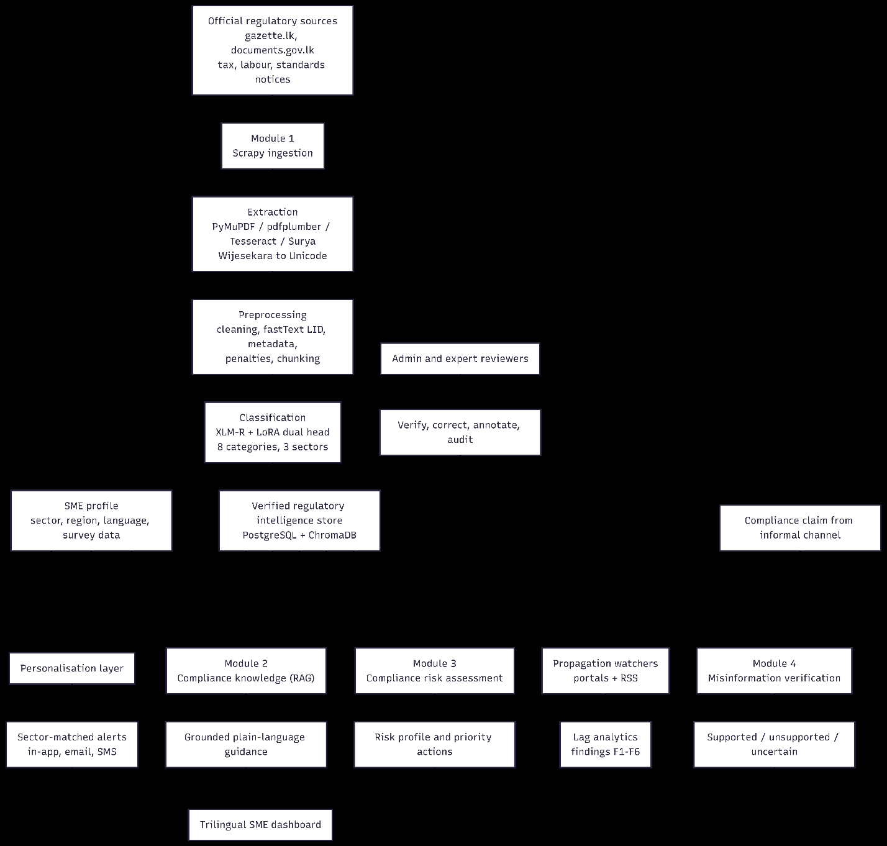

> **What the diagram shows.** A single top-to-bottom flow for the whole platform. Official regulatory sources (gazette.lk, documents.gov.lk, tax/labour/standards notices) feed *Module 1 — Scrapy ingestion*, which passes to *Extraction* (PyMuPDF / pdfplumber / Tesseract / Surya, plus Wijesekara-to-Unicode conversion), then *Preprocessing* (cleaning, fastText language ID, metadata, penalties, chunking), then *Classification* (XLM-R + LoRA dual head; 8 categories, 3 sectors). A side branch shows *Admin and expert reviewers* who verify, correct, annotate and audit. Everything lands in the *Verified regulatory intelligence store* (PostgreSQL + ChromaDB), which — together with the *SME profile* (sector, region, language, survey data) and a *Personalisation layer* — fans out to four consumers: Module 2 (Compliance knowledge / RAG), Module 3 (Compliance risk assessment), *Propagation watchers* (portals + RSS), and Module 4 (Misinformation verification), which also takes a *Compliance claim from an informal channel* as input. Their respective outputs are sector-matched alerts (in-app, email, SMS), grounded plain-language guidance, a risk profile with priority actions, lag analytics (findings F1–F6), and a supported / unsupported / uncertain verdict — all surfaced through the trilingual SME dashboard.


*Figure 1 Overall flow of the Enigmatrix regulatory intelligence platform*


<!-- PDF page 24 -->


## Chapter 2 - Related Work


### 2.1 Introduction

This chapter reviews the literature relevant to Enigmatrix and to its four modules. It begins with the SME regulatory-compliance problem in developing economies, where compliance cost, regulatory complexity and limited access to specialist advice interact. It then reviews regulatory technology, information asymmetry, multilingual natural language processing, retrieval-augmented question answering, explainable compliance risk modelling and misinformation detection.

The purpose is not to enumerate existing systems but to locate a gap. The compliance literature explains that knowledge and trust drive compliance; the RegTech literature shows how regulatory text can be processed automatically. Neither measures the movement of regulatory information from publication to SME understanding in a multilingual, low-resource setting. That measurement is what this project adds.


### 2.2 Overall Related Work


#### 2.2.1 SME compliance behaviour and the knowledge constraint

Research on SME compliance consistently identifies knowledge, complexity and cost as the dominant determinants. Musimenta [22] finds that knowledge requirements, tax complexity and compliance cost jointly explain tax compliance among Ugandan SMEs. Agusti and Rahman [23] reach a comparable conclusion for Indonesian enterprises, linking tax attitude to procedural understanding. Mokoena [24] extends the analysis to tax literacy, amnesty, reward and service delivery, again finding literacy to be a first-order determinant of voluntary compliance. Kirchler et al. [25] provide the theoretical frame through the slippery-slope model, in which compliance is produced either by trust in authorities or by perceived enforcement power.

Sri Lanka-specific evidence points the same way. SMEs constitute the bulk of enterprises but operate under a compliance burden calibrated for larger firms [1], [2], [6]. Regulatory and policy barriers are documented as a constraint on SME digital and commercial development in comparable economies [10], and the OECD identifies regulatory quality and accessibility as a direct determinant of the SME business environment [7]. Financial-compliance studies note that navigating the requirements is itself a specialised skill that SMEs typically lack [4]. Concrete Sri Lankan instruments illustrate the volatility: the Social Security Contribution Levy and successive budget changes altered SME obligations at short notice [3], [8], [9]. Access to finance and the wider business environment reinforce the same constraint [21].

The limitation of this body of work, for the present purpose, is that it treats knowledge as a property of the owner measured at a point in time. It asks whether the owner knows the rule. It does not ask when the rule reached them, through which channel, in which language, or whether it survived transmission intact.


<!-- PDF page 25 -->


#### 2.2.2 Information asymmetry as the organizing theory

Akerlof's analysis of markets under asymmetric information [26] is the theoretical anchor. Where one party holds material information the other lacks, outcomes degrade irrespective of either party's intent. Subsequent work applies the framework to pharmaceuticals [27], to the regulator's own signalling problem [28] and to SME disclosure, where improved information disclosure measurably reduces asymmetry [29].

Applied to regulatory compliance, the asymmetry is between the state and the enterprise. The state discharges its duty by publishing; the enterprise bears the consequence of not receiving. Publication is a necessary but insufficient condition for compliance. Enigmatrix is, in these terms, an intermediary that reduces the asymmetry by making the transfer active, structured and measurable rather than passive and assumed.


#### 2.2.3 Regulatory technology and regulatory NLP

RegTech is the closest technical field. Arner, Barberis and Buckley [11] frame RegTech as the response to escalating compliance scale and complexity following the financial crisis. McKinsey [16] characterises it operationally as software that monitors, manages and reports compliance. Butler and O'Brien [20] argue for semantic technologies and NLP as the means of rendering regulatory content machine-processable.

More recent work operationalises this. Automated compliance-monitoring pipelines have been proposed for PDF ingestion, entity extraction and regulatory-impact assessment [30], [31], and NLP has been applied to uncover latent structure in regulatory corpora [32]. RegNLP [33] investigates retrieval and answer generation over regulatory documents specifically, establishing that regulatory text is amenable to modern information-retrieval and generation methods.

Two limitations recur. First, the target user is an institution — typically a bank — with compliance staff, structured regulatory feeds and English-language source material. Second, evaluation is framed around document-processing accuracy, not around whether the regulated party became aware in time. Neither assumption holds for a Sri Lankan SME reading a scanned Sinhala gazette.


#### 2.2.4 Multilingual and low-resource NLP

Enigmatrix must process English, Sinhala and Tamil. XLM-RoBERTa [19] provides cross-lingual representations trained at scale and is the standard choice for low-resource transfer. For Sinhala specifically, de Silva [5] evaluates pre-trained language models for text classification and finds transformer-based models outperform earlier multilingual baselines. Recent Sinhala and code-mixed work on sentiment, aspect classification and keyword extraction confirms the viability of this family of models on Sri Lankan text [47], [48]. Low-resource fine-tuning strategies for multilingual pre-trained models are documented in the SemEval setting [49], and lifelong-learning approaches address multilingual drift [44]. BERT [43] remains the architectural reference point for the encoder family.


<!-- PDF page 26 -->

The practical implication is that a single multilingual encoder is preferable to three language-specific pipelines at prototype scale: it shares representation across languages where labelled data is scarce, and it reduces the maintenance surface to one model, one tokenizer and one deployment artefact.


#### 2.2.5 Retrieval-augmented generation for grounded compliance answers

Lewis et al. [17] introduced retrieval-augmented generation as a means of grounding generated text in retrieved evidence. In legal and financial domains, where an unsupported assertion is a liability rather than a stylistic flaw, grounding is essential: CBR-RAG [18] combines case-based reasoning with retrieval for legal question answering, FinSage [46] addresses multi-aspect retrieval over financial filings, and recent systems apply RAG to radio-spectrum regulation [50] and to judicial forensics with explicit trustworthiness constraints [51].

Evaluation methodology has matured alongside. RAGAS [52] and ARES [53] define automated measures of faithfulness, answer relevancy, context precision and context recall; VERA [54] adds validation of retrieval-augmented systems; and a recent survey [55] consolidates trustworthiness criteria.


#### 2.2.6 Explainable risk modelling

Bussmann et al. [12] demonstrate explainable machine learning in credit risk management, and Bonifazi et al. [36] apply interpretable models to SME credit default. SHAP [15] is the dominant attribution method, and its stability in credit-risk settings has itself been studied [39]. Miah et al. [38] extend explainable AI to managerial decision-making in financial organisations. Class imbalance is the recurring methodological obstacle: SMOTE [40] remains the reference oversampling technique, and comparative studies of imbalance handling in fraud and risk detection quantify the trade-offs [37], [41], [42].

The gap is that these models predict credit risk from proprietary financial data. Compliance risk in an SME setting must be inferred from survey responses, behavioural signals and regulatory exposure, which are sparser and noisier.


#### 2.2.7 Misinformation detection

Network-oriented analysis of WhatsApp [13] shows how closed messaging networks amplify unverified claims, and studies of misinformation sharing during COVID-19 [14], [35] and public-health surveys [34] characterise the antecedents and consequences of that behaviour. Technically, transformer-based classifiers [43] and multilingual disinformation detection systems such as PolyTruth [45] provide the modelling foundation, and evidence-grounded retrieval [46] supplies the verification mechanism.

The literature concentrates on political, health and general financial misinformation. Routine regulatory misinformation — "the VAT threshold has changed", "registration is no longer required"

- is under-studied, despite being the category most likely to cause direct financial harm to an SME.

<!-- PDF page 27 -->


#### 2.2.8 Synthesis

Related work establishes that automated regulatory monitoring is feasible, that multilingual transformers can handle Sinhala and Tamil, that grounded generation can produce trustworthy compliance answers, that risk can be modelled explainably, and that misinformation can be detected. What no existing system does is connect these into a single pipeline for a low-resource, multilingual SME population and measure the resulting change in awareness lag. That is the space Enigmatrix occupies.


### 2.3 Module-wise Related Work


#### 2.3.1 Module 1 - Regulatory Change Awareness Gap

Module 1's related work falls into four strands.

RegTech monitoring. Arner et al. [11], McKinsey [16] and Butler and O'Brien [20] collectively justify the premise that regulatory monitoring should be a continuous machine process rather than a periodic human search. Module 1 implements exactly that: scheduled spiders, an automatic extraction and classification chain, and event-driven alerting.

Regulatory document NLP. Automated pipelines for regulatory PDF ingestion, entity extraction and impact assessment [30], [31], [32] and retrieval and generation over regulatory corpora [33] establish that regulatory text is tractable. What they do not address is the document-quality problem that dominates the Sri Lankan case: scanned pages, mixed scripts and legacy font encodings. Module 1's per-page routing chain, Surya fallback and font-aware Wijesekara conversion are responses to a problem the existing literature largely assumes away.

Multilingual classification. XLM-R [19] and Sinhala classification results [5], [47], [48], [49] justify a single multilingual encoder over per-language models. LoRA adaptation is adopted so that fine-tuning remains feasible on a single free-tier GPU, which is the realistic constraint for a final-year project. The dual head - single-label category with cross-entropy, multi-label sector with binary cross-entropy - reflects the structure of the task rather than an off-the-shelf configuration. Annotation reliability. Because the labelled dataset becomes ground truth for both training and evaluation, its reliability must itself be reported. Cohen's kappa is appropriate because it discounts agreement expected by chance. The Module 1 dataset achieves a category kappa of 0.8715, a mean sector kappa of 0.8638 and an SME-relevance kappa of 0.7235 over 800 dual-annotated tasks. The lower relevance figure is informative rather than embarrassing: it quantifies the genuine subjectivity of the SME/non-SME boundary and motivates the resolver rules documented in Chapter 6.

Information diffusion. The compliance literature [22], [23], [24] measures knowledge but not its transit. Module 1's propagation-event table, two-step matcher and lag analytics constitute a measurement instrument for that transit, answering RQ3 and RQ4.


<!-- PDF page 28 -->

Module 1 research gap. Existing RegTech and regulatory-NLP systems can process regulatory text, but there is no evidence of a Sri Lankan, SME-focused, trilingual pipeline that both reduces and measures the delay between official regulatory publication and SME awareness.


#### 2.3.2 Compliance Guidance Platform

A growing body of work applies conversational AI to make legal and regulatory knowledge accessible to non-experts. Li et al. [31] study question-answering systems for access to justice, examining how large language models can answer laypeople's legal questions reliably. Westermann and Benyekhlef [32] propose JusticeBot, a methodology for building augmented-intelligence tools that guide ordinary users through legal decisions. Closest to this module, Panchal et al. [33] present LawPal, a retrieval-augmented legal chatbot for the Indian context that grounds its answers in official legal documents. These systems share this module's goal of turning dense regulatory text into actionable guidance, but they stop at answering the user's question; none of them first measures what the user already knows in order to target the guidance, and none enforces the procedural completeness - the exact form, office and deadline for each step - that SME compliance demands.

On the assessment side, the accounting and public-administration literature has long studied how to measure a business owner's regulatory knowledge and relate it to compliance risk. Bornman and Ramutumbu [34] propose a conceptual framework that decomposes tax knowledge into general knowledge (awareness that an obligation exists), procedural knowledge (knowing how to meet it) and legal knowledge. This decomposition directly motivates this module's awareness survey, which scores an SME owner's declarative and procedural knowledge separately for each applicable domain and treats a low procedural score as an indicator of compliance risk. Prior instruments of this kind are typically paper questionnaires analysed offline; the contribution here is to couple such a knowledge-risk assessment with an on-demand guidance system, so that the gaps a respondent reveals can be addressed immediately by the same platform.

Retrieval-Augmented Generation (RAG), introduced by Lewis et al. [7], addresses a central weakness of large language models for factual tasks: knowledge stored in model weights cannot be updated without retraining and cannot be cited. By retrieving relevant passages from an external corpus at inference time and conditioning generation on them, RAG keeps facts current and attributable. For a compliance assistant, where regulations change through gazette amendments and every figure carries liability, this property is decisive; it motivates the module's design principle that facts live in retrievable text and never in the model's weights.

The retrieval layer depends on dense sentence embeddings and nearest-neighbour search. Sentence-BERT [8] established the bi-encoder architecture used here, and its multilingual variants allow a query in Sinhala or Tamil to retrieve English regulatory text; MPNet [25] provides the pre-training objective behind the embedding model adopted. Vector databases such as ChromaDB [26] supply the persistence and similarity-search layer.


<!-- PDF page 29 -->

Parameter-efficient fine-tuning makes it feasible to adapt an eight-billion-parameter instruction model on a single GPU. Low-Rank Adaptation (LoRA) [23] and its quantised form QLoRA [24] freeze the base weights and train a small number of low-rank adapters, reducing the trainable-parameter count by more than two orders of magnitude while preserving quality. In this module fine-tuning is used deliberately not to inject facts but to teach answer structure, completeness and refusal discipline, leaving all factual content to the retrieval layer.

Serving Sinhala and Tamil requires machine translation that preserves numeric and form-code fidelity. The No Language Left Behind (NLLB) project [12] provides open multilingual translation covering both languages; crucially, unlike IndicTrans2, NLLB supports Sinhala, which determined its selection for this module.


#### 2.3.3 SME Compliance Risk Prediction

Research on predicting regulatory and tax non-compliance has developed largely within revenue administrations in high-income economies, where the modelling is supported by confidential taxpayer records, audit outcomes and longitudinal filing histories. That work establishes that non-compliance is partially predictable from administrative signals, but it is not directly transferable to the Sri Lankan SME context, where no equivalent entity-level dataset is publicly available. A separate strand of development-economics literature examines informality and the administrative burden faced by small firms, but treats compliance as an outcome to be explained descriptively rather than predicted at the level of an individual business.

The theoretical basis for treating information as a determinant of compliance comes from work on information asymmetry and on the communication of regulation. That literature argues that an obligation is only actionable once the obligated party is aware of it, understands it, and receives it in time to respond. Studies of regulatory communication in multilingual jurisdictions further note that official guidance issued in a language the recipient does not operate in imposes a comprehension cost that is functionally equivalent to not having received the guidance at all. These arguments motivate the information-barrier variables used in this module, but they have not previously been operationalised as measured predictors of compliance failure in a South Asian SME setting.

A methodological problem specific to this setting is that the outcome label is one-sided. Businesses that disclose a failure are confirmed positives, whereas businesses that report no failure are not confirmed compliant: they may have obligations they are unaware of, or may have chosen not to disclose. Treating such cases as negatives biases a conventional classifier. Elkan and Noto [16] formalise learning from positive and unlabelled data and show that, under the assumption that labelled positives are selected at random from all positives, a classifier trained against the unlabelled pool can be corrected by an estimated label frequency. This provides the appropriate treatment for the present data and is applied in this module as a robustness analysis.


<!-- PDF page 30 -->

Because a risk score intended for a small-business owner must be actionable, model interpretability is a functional requirement rather than a secondary concern. Lundberg and Lee [17] introduce SHAP, a unified additive attribution framework grounded in cooperative game theory that assigns each feature a contribution to an individual prediction and satisfies local accuracy and consistency. For linear models these attributions have an exact closed form, which makes per-business explanation inexpensive and removes any sampling approximation.

Comparing two models on the same respondents requires a test that accounts for the correlation between their predictions. DeLong, DeLong and Clarke-Pearson [18] derive a non-parametric procedure for comparing correlated receiver operating characteristic curves, and Sun and Xu [19] give a computationally efficient formulation of the same statistic. This is the correct inferential instrument for the hypothesis tested in this module, where a demographic model and an information-augmented model score identical businesses.

Finally, the literature on model stability in small samples constrains the design. Peduzzi et al. [20] demonstrate that logistic regression coefficients become unstable when the number of outcome events per predictor variable falls too low, which for a survey-scale dataset implies a deliberately restricted feature set and a preference for regularised linear models over higher-capacity alternatives. This consideration, rather than any performance argument, governs the modelling choices described in Chapter 4.

The gap this module addresses is therefore specific. Compliance-risk prediction has been demonstrated where administrative data exists; information asymmetry has been argued theoretically; and the statistical machinery for testing an incremental contribution is well established. What has not been done is to measure whether information-access variables predict compliance failure beyond business characteristics for Sri Lankan SMEs, using data that can be collected without privileged access to revenue records.


#### 2.3.4 Regulatory Misinformation Spread

The majority of the studies conducted on misinformation detection have centered on political and health-related and/or crisis-related misinformation, and many of the initial systems have posed the task as a binary classification problem, distinguishing between true and false. Previous research on fake news and misinformation classification tended to focus on the superficial text cues, propagation patterns and stance signals, but later studies demonstrated that misinformation is not always entirely false. Multi-class labelling is suited to applied fact-checking tasks as a result of the various forms of misinformation and related information disorders outlined by Wardle and Derakhshan (2017) such as misleading context, manipulation and false framing. This distinction is particularly important in the context of regulatory misinformation, because a post may contain accurate terminology but present an error in practical terms concerning the tax, labour, import or registration requirements.


<!-- PDF page 31 -->

The study of social media misinformation has also highlighted the challenge of dealing with such short, noisy and variable user-generated content. Both Castillo et al. (2011) and Shu et al. (2017) noted that the brevity and informality of posts on Twitter influence credibility assessment, and misinformation on social media is disseminated quickly via reposting, engagement, and social endorsement, respectively. Under these circumstances, posts can be code-mixed, shortened, or include dates and numerical references that are critical for understanding. Social media misinformation is especially difficult to navigate when there are regulatory claims because one number out of place or wrong date can render the entire post inaccurate.

Multilingual misinformation detection is becoming a more critical challenge given the fact that misinformation is not present in just one language even in multilingual countries and regions. However, research on multilingual NLP has demonstrated that the ability of transfer across language is challenging if a model is only trained in high resource languages, and that performance can be negatively impacted in low resource languages without multilingual representation learning. Conneau et al. (2020) proposed XLM-R, a multilingual transformer model that is pre-trained on large-scale cross-lingual data, which achieves good cross-lingual transfer for many downstream tasks. This is applicable to the current module as the data set contains posts in English, Sinhala and Tamil, and using a multilingual encoder is more appropriate than a monolingual encoder.

A second topic that is central in the literature is the preparation of datasets. The ability to detect misinformation requires rigorous selection of the data set, filtering of irrelevant data, de-duplication, and retention of metadata that could be useful for understanding it. Potthast et al. (2018) and Zubiaga et al. (2018) both pointed out the importance of robust corpus construction methods for misinformation corpora, since the lack of quality corpus construction may lead to the inclusion of noise that may harm the models that follow. Consequently, in applied domains, the process of preparing datasets is not simply a preprocessing step, it is an integral part of the research design, as the quality of the corpus will not only influence the ability of the model to learn meaningful distinctions, but also influence the kind of artefacts that it will learn. The present module is based on the same approach, by creating a hand-collected corpus of social media and fact-checking sources out of that, and cleaning and structuring it prior to annotation.

When annotators have a higher degree of confidence in one language than another, translation is often incorporated into the multilingual annotation workflow to increase consistency. For multilingual NLP, the use of translation-assisted annotation to address ambiguities and fine-tune consistency of labels across languages, particularly for low-resource languages, is applied. Neural machine translation systems like NLLB-200 (Costa-jussà et al., 2022) can be a practical solution to such workflows, while not losing the original text for subsequent modelling. In multilingual misinformation projects, this helps translate the information to support the original language and not replace it.


<!-- PDF page 32 -->

In the field of misinformation research, the reliability of the labels is a topic that has received a lot of discussion, with the quality of the annotation playing a significant role in the validity of the model. Cohen's Kappa is one of the most popular measures of agreement between two annotators, as it is easy to understand, appropriate for binary and multi-class settings, and corrects for chance agreement (Cohen, 1960). Within annotation studies, where it is hard to separate out the classes, agreement statistics can be used as evidence that the label scheme is sufficiently constant to be modelled. Particularly in the context of regulatory misinformation, it matters what is partially accurate, misleading, and inaccurate, the context of the post, and the specific language of the statement.

The transformer-based models are the most popular type of text classifiers used in recent misinformation detection studies because they are more adept than previous bag-of-words or shallow neural models in capturing contextual relationships. Devlin et al. (2019) showed that BERT is one of the most significant breakthroughs in the area of contextual language representation and subsequently multilingual variants were developed for addressing cross-lingual tasks. XLM-RoBERTa is particularly interesting for the multilingual misinformation detection task as it is pre-trained on various languages and hence is able to handle Sinhala, Tamil, and English without having to train language-specific models. Previous research has demonstrated that XLM- R is a very competitive base for multilingual classification tasks, especially in the case of transfer across scripts and across language varieties.

When classification is based on knowledge beyond the text, but not just style, then RAG proves to be a promising alternative. Lewis et al. (2020) formalized the RAG framework using retrieval + sequence generation, and demonstrated that external evidence retrieval can enhance knowledge-intensive NLP tasks. In regulatory or legal contexts, the solution may be found in an authoritative source and not in the formulation of the claim. RAG is thus a suitable method to achieve verification when the model needs to tie its output to a retrieved context, in particular when the regulation changes over time or when the post mentions a numeric threshold or legal date. Given their general language ability, classification, extraction, and reasoning tasks are large language models that have been increasingly applied to Gemini. Recent studies on LLM have demonstrated that they can achieve good performance on zero shot and few shot tasks, however their results are still sensitive to prompt design and to grounding the prompt in the specific domain (Brown et al., 2020; OpenAI, 2023). But earlier studies also indicate that direct prompts may not be effective in cases where the task demands a factual basis for an answer or a more specific domain-specific legal interpretation. Therefore, there has been a recent trend in developing systems that incorporate retrieval alongside prompting in conjunction with an LLM. In the current module, the authors compare RAG with direct prompting with Gemini and with a fine-tuned multilingual transformer.

This module is narrower than previous modules in terms of topic but more specific with regard to design. It does not try to generally detect misinformation on the web, but it works with regulatory


<!-- PDF page 33 -->

misinformation in Sri Lankan SMEs, where the need to identify factual and multilingual information is crucial. The module thus provides an applied comparison of the annotation, multilingual pre-processing, transformer classification, and retrieval-grounded verification in one domain-specific pipeline.


### 2.4 Summary

The reviewed literature supports four conclusions that shape this project. Compliance failure among SMEs is substantially an information failure, not primarily an intent failure [22]–[26]. Regulatory monitoring can be automated, but existing RegTech assumes institutional users and English structured feeds [11], [16], [20], [30]–[33]. Multilingual transformers are the appropriate modelling family for Sinhala and Tamil regulatory text [5], [19], [47]–[49]. Grounded generation, explainable risk modelling and misinformation detection each have mature methods and evaluation frameworks [17], [18], [46], [52]–[55], [12], [15], [36]–[42], [13], [14], [34], [35], [43], [45]. What is absent is integration and measurement. Enigmatrix combines awareness, knowledge, risk and verification over a shared verified data layer, and Module 1 supplies both that layer and the instrumentation needed to quantify whether the information barrier has actually narrowed.


<!-- PDF page 34 -->


## Chapter 3 - Technology Adapted


### 3.1 Introduction

This chapter records the technologies selected for the platform and the reasoning behind each choice. Selections were driven by four constraints: the source documents are multilingual and frequently scanned; the project must run on student-accessible hardware and free or academic-tier services; every result must be reproducible for examination; and each module must remain operable by a single developer.


*Table 3.1 — Technology stack by layer*


| Layer | Technology |
|---|---|
| Backend | FastAPI, SQLAlchemy 2.0 async (asyncpg), Alembic, Pydantic v2, Celery + Beat (Redis), slowapi, passlib/bcrypt, python-jose |
| Scraping | Scrapy — gazette, weekly-gazette, acts and bills spiders (Module 1); per-authority procedure scrapers (Module 2) |
| Extraction | PyMuPDF, pdfplumber, pypdfium2, Tesseract 5 (eng+sin+tam), Surya OCR, font-aware Wijesekara→Unicode conversion |
| Classification (M1) | XLM-RoBERTa base, PEFT (LoRA), PyTorch, Transformers, ONNX Runtime (INT8), fastText language ID |
| Retrieval + generation (M2) | ChromaDB, LangChain recursive splitter, sentence-transformers paraphrase-multilingual-mpnet-base-v2, Llama-3.1-8B-Instruct + QLoRA adapter, gradio_client, Hugging Face Spaces (ZeroGPU) |
| Risk modelling (M3) | scikit-learn (logistic regression), joblib, NumPy, pandas, closed-form linear SHAP, DeLong correlated-ROC test, Elkan-Noto PU learning |
| Verification (M4) | httpx proxy to the Module 2 fact-check contract; verdict parsed from a fixed first line |
| Translation | NLLB-200 distilled 600M with a figure-masking pipeline (mask → split → translate → restore → verify) |
| Frontend | Next.js 14 App Router, React 18, Tailwind with shadcn-pattern HSL tokens, next-intl (EN/SI/TA), TanStack Query v5, recharts, Playwright, Vitest |
| Storage | PostgreSQL 15+, ChromaDB, Redis, local object storage |
| Annotation | Label Studio |


<!-- PDF page 35 -->

<!-- table continued from previous page -->
| Compute | Google Colab GPU, Kaggle Notebooks GPU, Hugging Face ZeroGPU, local CPU workstation |
| Deployment | Render / Railway (full backend), Vercel (frontend and a slim API build), managed PostgreSQL, Railway (Module 2 retrieval sidecar) |
| Quality | pytest, testcontainers, Playwright, ruff, Great-Expectations-style JSON suites |


<!-- PDF page 36 -->


### 3.2 Platform Architecture and Repository Layout

The system is a monorepo with git submodules:


*Table 3.2 — Repository components*

Placing extraction and evaluation in enigmatrix-ml rather than in the backend was a deliberate decision: the ML package is pip-installable and backend-independent, so it can be executed in Google Colab or a notebook without importing the web application. The backend app/extraction module is a thin re-export adapter that preserves existing imports and tests.


### 3.3 Backend and Asynchronous Processing

FastAPI with SQLAlchemy 2.0 async was selected over Django or Flask for three reasons: native asynchronous request handling suits an I/O-bound workload dominated by scraping and database access; Pydantic v2 gives schema validation and OpenAPI documentation without additional code; and the async ORM allows long extraction transactions without blocking the request loop. Celery with Redis and Beat provides the task layer. Extraction of a single scanned gazette can take minutes; performing that in a request would be untenable. Celery also supplies the scheduled cadence the research programme requires:


| Component | Purpose |
|---|---|
| enigmatrix-backend | FastAPI, SQLAlchemy 2.0 async, Alembic, Pydantic v2, Celery + Beat, Scrapy spiders. Owns the PostgreSQL schema and every migration. Hosts the per-module packages app/m1, app/m2 and app/m3. |
| enigmatrix-frontend | Next.js 14 App Router, Tailwind with shadcn-pattern HSL tokens, next- intl (EN/SI/TA), TanStack Query, Playwright. The single user interface for all four modules. |
| enigmatrix-ml | Python packages m1–m4 — extraction, preprocessing, evaluation, model training and the research notebooks that produce the thesis figures. |
| enigmatrix-docs | MkDocs documentation set |
| enigmatrix-infrastructure | Infrastructure configuration and local orchestration |
| research/data | Label Studio configuration, calibration set, annotation batches |
| scripts | Cross-repository scripts (sampling, thesis artefact regeneration, translation helpers) |


<!-- PDF page 37 -->


*Table 3.3 — Scheduled task cadence*

Alembic maintains a linear migration chain. slowapi enforces rate limits. Audit logging is written on every authentication event and every administrative mutation through a single audit_service.record() entry point that is never bypassed - a requirement for a system whose outputs may be cited as compliance evidence.


### 3.4 Scraping

Scrapy was chosen over ad-hoc requests scripts for its built-in scheduling, retry, throttling and pipeline

abstractions.

Four

spiders

cover

the

source

surface:

gazette_spider, weekly_gazette_spider, acts_spider and bills_spider, targeting gazette.lk and documents.gov.lk. Each supports date scoping, closes on scope exhaustion, and falls back English→Sinhala→Tamil when a language edition is unavailable. Completeness verification and re-fetch endpoints reconcile what was expected against what was retrieved.


### 3.5 Extraction and OCR

No single extraction engine handles the Sri Lankan gazette corpus. Documents fall into three classes, and pages within a single document may differ:


*Table 3.4 — Extraction engine routing*

A classify_pdf step assigns the route using calibratable thresholds. Extraction profiles are registered and versioned-legacy_v1, page_routing_v1, surya_fallback_v1, wijesekara_routing_v1

- so that any measurement run can be attributed to a specific extraction configuration.

|  | Task |  |  | Schedule |  |
|---|---|---|---|---|---|
| Scraper |  |  | every 6 hours |  |  |
| Portal watcher / RSS watcher |  |  | every 2 hours (offset) |  |  |
| Retire old dataset versions |  |  | 20:30 UTC daily |  |  |
| Refresh lag analytics |  |  | 21:00 UTC daily |  |  |
| Retraining |  |  | quarterly (1 Jan / Apr / Jul / Oct, 03:00) |  |  |


|  | Class |  |  | Characteristics |  |  | Engine route |  |
|---|---|---|---|---|---|---|---|---|
| Text PDF |  |  | Born-digital, selectable text, usually English |  |  | PyMuPDF with TEXTFLAGS_TEXT, then pdfplumber for layout and tables |  |  |
| Hybrid |  |  | Mixed selectable and image pages |  |  | Per-page routing between text and OCR engines |  |  |
| Scanned |  |  | Image-only, frequently Sinhala or Tamil |  |  | Tesseract 5 --oem 1 --psm 6 -l eng+sin+tam at 300 dpi; Surya OCR as fallback profile |  |  |


<!-- PDF page 38 -->

Wijesekara conversion. Legacy Sinhala documents encode text in the Wijesekara keyboard layout with non-Unicode fonts. Extracted bytes are meaningless without conversion, and the failure is silent: text appears to extract successfully but is unusable. A font-aware converter detects the encoding from embedded font metadata and maps to Unicode. Residual (cid:…) glyph spans are a known extraction risk and are logged for re-extraction.

Character Error Rate is computed by a dedicated calculator so extraction quality is measured, not assumed.


### 3.6 Language Identification and Preprocessing

fastText performs language identification. It was preferred over langdetect for short-text stability and for its handling of Sinhala and Tamil scripts. Preprocessing then performs Unicode normalisation and whitespace collapse, metadata extraction (gazette number, publication and effective dates, penalties including the multi-penalty case), chunking to the model's 512-token window, and sub-document splitting where a single gazette issue contains multiple independent instruments.

Enigmatrix is a modular web platform composed of a FastAPI backend, a Next.js frontend, relational and vector storage, an asynchronous task layer and a Python machine-learning package. SMEs register with a business profile — sector, region, scale and language preference. Regulatory information is collected from official sources, extracted into structured records, classified by change category and affected sector, summarised into plain language, translated where required, and delivered through dashboards, alerts, search and advisory workflows. Administrative and expert users verify, correct, annotate and measure the pipeline through a dedicated admin surface. The design principle is that regulatory information is structured once, into a verified regulatory intelligence store, and then reused by every downstream module. Module 1 produces that store; Modules 2, 3 and 4 consume it.


### 3.7 Classification Model

XLM-RoBERTa base with LoRA adapters. XLM-R [19] covers English, Sinhala and Tamil in one encoder, which is decisive when labelled data per language is limited. Full fine-tuning of a 270M-parameter encoder is impractical on the available hardware; LoRA [low-rank adaptation] injects trainable rank-decomposition matrices into the attention query and value projections and freezes the base weights, reducing trainable parameters by orders of magnitude and making training feasible on a single Colab GPU.

The head is dual, matching the label structure:


<!-- PDF page 39 -->


*Table 3.5 — Classification heads, tasks and loss functions*

Total loss is the sum, with a configurable sector_loss_weight. ONNX Runtime serves inference on CPU with an optional INT8 quantisation, removing the need for a GPU in production and keeping hosting within free and hobby tiers.

Baselines. TF-IDF with logistic regression and with LinearSVC establish the non-transformer reference point. Reporting them is a methodological requirement: without a baseline, a transformer result has no interpretable scale.


### 3.8 Annotation Tooling

Label Studio hosts the annotation project. Its XML configuration encodes 8 domains, 3 sectors, an SME-relevance boolean, an annotator confidence rating and a free-text rationale field. A 20- document trilingual calibration set with expert labels and written rationales is used to align annotators before production labelling. Sampling for annotation uses stratified and k-means samplers with minority-domain targeting and a hybrid active-learning mode, so that annotation effort is directed at the documents that most improve the model rather than at whatever arrives first.


### 3.9 Retrieval-Augmented Guidance

Module 1 answers what changed. Module 2 answers how to comply — which form, which office, which deadline, which fields — for 20 regulatory domains grouped under the same 8 categories Module 1 classifies into. The technology choice that shapes everything else is that facts are retrieved at query time and never stored in model weights.

The reasoning is domain-specific rather than architectural fashion. Regulatory figures change: VAT rates, registration thresholds, gazette amendments. A figure baked into weights goes stale silently and cannot be cited. Compliance guidance also carries real liability, so every figure must be traceable to an official source. Retrieval-augmented generation satisfies both; fine-tuning is used only to teach the model structure, completeness and refusal discipline. That split maps exactly onto the module's research claim, in which the retrieval layer supplies declarative content and the fine-tuned behaviour supplies procedural shape.

Retrieval


|  | Head |  |  | Task |  |  | Loss |  |
|---|---|---|---|---|---|---|---|---|
| Category head |  |  | Single-label over 8 categories |  |  | Cross-entropy |  |  |
| Sector head |  |  | Multi-label over 3 sectors |  |  | Binary cross-entropy |  |  |


<!-- PDF page 40 -->

Embeddings use sentence-transformers/paraphrase-multilingual-mpnet-base-v2. A multilingual sentence encoder was required rather than preferred: a Sinhala or Tamil question must retrieve rules held in English, which is only possible when questions and documents share one embedding space. Text is chunked with the LangChain recursive splitter at 400 characters with 60 characters of overlap — small chunks because a procedural answer depends on retrieving a specific step rather than a broad passage.

ChromaDB stores one collection per regulatory domain, with each chunk carrying its domain, category and applicable sectors as metadata. Retrieval operates at three scopes: a single domain, a category (pooling across its member domains), or across all domains when the question is unscoped. Chroma was chosen over a managed vector service for cost and reproducibility, and because an embedded store can be built at container-image build time, so a deployed instance never has to re-embed the corpus at boot.

Generation

The generator is Llama-3.1-8B-Instruct with a QLoRA adapter. The base model is quantised to 4- bit NF4 and frozen; low-rank matrices of rank 16 (α = 32, dropout 0.05) are injected into all seven projection matrices, leaving 41.9 million of 8.07 billion parameters trainable — 0.52 per cent. Training ran 75 steps over three epochs in approximately sixteen minutes on a single A100 in bf16, with an effective batch size of 16. The published adapter is the epoch-2 checkpoint rather than the final one, selected automatically on validation loss, which rose at epoch 3.

Serving uses a Hugging Face Space on ZeroGPU, reached with gradio_client. ZeroGPU allocates a GPU per decorated call rather than holding one, which is what makes an 8-billion-parameter model affordable for a student project. It also imposes a constraint that shaped the code: there is no GPU at boot, so the adapter must be loaded onto CPU explicitly and moved by the framework on the first GPU call.

The prompt as a research instrument

The prompt is treated as part of the method, not as user-interface text. It fixes the composition order, states a non-advice framing (the system reports what published regulations say and does not advise), permits exactly one refusal sentence and no other, forbids the model from naming internal routing codes in prose, and imposes a six-point procedural contract requiring a complete numbered procedure, the exact form, office and deadline per step, a plain-language note on every named form, a worked example, and figures drawn only from the retrieved context. Because the evaluation harness scores each of those requirements as a separate column, re-wording the prompt changes the instrument, and the merged codebase therefore holds it verbatim under version control. Refusal is handled at three layers because no single layer was sufficient. The base instruction-tuned model refused legitimate questions as financial advice, which destroyed answer coverage in Sinhala and Tamil in particular. The prompt frames the task; the fine-tune trains refusal discipline; and a post-processing regular expression detects a residual refusal and triggers exactly one


<!-- PDF page 41 -->

bounded retry, keeping the retry only if it no longer refuses. A second post-processing pass rewrites internal identifiers that leaked into prose.

Evaluation design

Three runs are compared, not two. Going directly from the previously deployed model to the fine-tuned one moves two variables at once — different base weights and a new adapter — so a stock Llama-3.1-8B-Instruct control is evaluated under the identical prompt and identical retrieval. Only that comparison makes an improvement attributable to the adapter. Grading is by regular expression across ten columns, which is a disclosed limitation rather than a claim of human-level assessment.


### 3.10 Risk Modelling

Module 3 estimates the probability that a business will fail a compliance obligation within twelve months and, more importantly, states why. Its technology choices run deliberately against the direction of the rest of the platform, and the justification is worth stating plainly: the deployed model is a logistic regression.

Three constraints force that. The sample is 300 surveyed businesses with ten predictors, where a high-capacity model would fit noise. The research question is whether information barriers add explanatory power over demographics, which is a question about coefficients and therefore needs a model whose coefficients mean something. And the product requirement is an explanation an owner can act on, which is not a post-hoc rationalisation of a black box but the model itself. That last point yields a concrete technical benefit. For a linear model, Shapley values have a closed form: the contribution of feature i is its coefficient multiplied by the deviation of that feature from its dataset mean, measured in log-odds. The attribution is therefore exact rather than sampled, costs nothing to compute at request time, and is reproducible to the last decimal. The shap package was consequently removed from the dependency set during integration — an approximation library is unnecessary when the quantity is available analytically.


*Table 3.6 — The model ladder*


| Model | Feature set | Purpose |
|---|---|---|
| M0 | Naïve cross-tabulation on sector | The obvious answer a practitioner would reach for, stated so it can be beaten |
| M1 | Demographics only — sector, location, owner education, accountant use, business age, headcount | What a business is |


<!-- PDF page 42 -->

The deployed artefact is model M2, serialised with joblib. It is a 2.9 KB file carrying the fitted estimator, the trained column order, the feature means used as the SHAP baseline, the mapping from encoded column back to source feature, the block each feature belongs to, and the cross-validated metrics. Storing the baseline and the column order inside the artefact rather than recomputing them at load time is what makes an explanation reproducible across deployments. Statistical comparison between rungs uses the DeLong test for two correlated ROC curves, computed on cross-validated out-of-fold predictions. Correlated is the operative word: the two models score the same businesses, so an unpaired test would be invalid. Robustness uses Elkan- Noto positive-unlabelled learning, chosen because the outcome label is asymmetric by construction — a positive is a confirmed self-reported failure, but a negative means only that no failure was reported, and an unlabelled case is not a confirmed compliant one. Treating unlabelled data as negative would bias any standard classifier, so the robustness check asks whether the result survives when that assumption is dropped.

Explanations are template-based and multilingual rather than generated. This is the opposite of Module 2's choice and for the same underlying reason: a risk explanation must be deterministic and incapable of inventing a compliance fact, whereas a procedural answer benefits from fluent generation over retrieved and cited text. Because the model is small and CPU-only, Module 3 runs in-process inside the backend with no inference service, no GPU and a scoring latency dominated by the database round-trip.


### 3.11 Misinformation Verification

Module 4 checks a claim a business owner has encountered — typically forwarded through a messaging application — against the verified corpus. Architecturally it is a consumer rather than a producer: it calls Module 2's fact-check endpoint over HTTP through an httpx client in the backend and maps the response into the platform's own schema.

The interface is deliberately rigid. The verifying model must emit its verdict — Accurate, Outdated, Misleading or Unverifiable — as the first line of its response, followed by reasoning and the source. Module 4 parses that line, which makes it a hard contract rather than a formatting preference: relaxing the format silently breaks the consumer. Integration preserved this contract untouched, and the Module 2 service Module 4 depends on was explicitly excluded from the migration work so that a live dependency was never interrupted.


| M2 | M1 plus the information block — awareness lag, language match, responsiveness, informal reliance | What the owner knows, and how they came to know it |
|---|---|---|


<!-- PDF page 43 -->


### 3.12 Summarization and Translation

Summaries are generated in a controlled form from the classified record — title, regulatory domain, affected sectors, amendment type and cleaned regulatory text — rather than by free generation over the raw document, because an unconstrained generator in a compliance context risks producing plausible but unsupported obligations.

NLLB-200 distilled 600M performs English→Sinhala and English→Tamil translation of titles and summaries. It was chosen over commercial translation APIs for cost, reproducibility and offline operation, and over larger NLLB variants because the distilled model fits comfortably in Colab memory while retaining acceptable quality for short administrative text. All machine translations enter an administrative review queue before being surfaced to SMEs.


### 3.13 Frontend

Next.js 14 App Router with server components reduces client bundle size on the content-heavy regulation pages. next-intl provides English, Sinhala and Tamil localisation with script-appropriate fonts. Tailwind with shadcn-pattern HSL tokens gives a trust-oriented blue and amber palette in light and dark modes. TanStack Query manages server state and cache invalidation for the admin pipeline views; WebSocket and SSE channels carry live extraction progress. Playwright covers end-to-end flows.


### 3.14 Storage and Deployment


*Table 3.7 — Storage and deployment layers*


| Layer | Technology | Rationale |
|---|---|---|
| Relational | PostgreSQL 15+ (asyncpg) | Referential integrity across the regulation status machine and across module boundaries; materialised views for lag analytics; JSONB where a schema is genuinely open-ended |
| Vector | ChromaDB | Retrieval for Module 2; embedded deployment avoids a managed vector service and allows vectors to be baked at image build time |
| Cache / broker | Redis | Celery broker and result backend |
| Object storage | Local storage volume | Raw PDFs and model artefacts |
| Backend hosting | Render / Railway (uvicorn + Celery worker + Beat) | Cost-appropriate for the project; documented limitation under load |
| Serverless API | Vercel (slim build) | Stateless read paths; excludes the scientific and scraping dependency sets to stay inside the function size limit |


<!-- PDF page 44 -->

Data quality is enforced by Great-Expectations-style JSON suites in enigmatrix-backend/data_quality/, validated automatically after each dataset version is sealed.


### 3.15 Development and Reproducibility Tooling

uv manages Python environments and dependency groups (serving, training, research), enabling a workspace layout in which the backend and ML package share resolution. pytest covers backend and ML unit tests; pnpm and Playwright cover the frontend. Model training is executed in Google Colab with a GPU runtime because no CUDA device is available locally; the local machine is used only for smoke testing, and Chapter 6 reports both configurations explicitly.


### 3.16 Summary

Each selection follows from a constraint of the problem domain rather than from familiarity. Multi-engine extraction exists because the corpus is heterogeneous. Wijesekara conversion exists because the corpus is partly legacy-encoded. A single multilingual encoder with LoRA exists because labelled data and GPU hours are both scarce. ONNX CPU inference exists because production hosting has no GPU. Sealed dataset versions and an atomic evaluation fact table exist because the results must be defensible under examination.


| M2 retrieval sidecar | Railway | Holds ChromaDB, the sentence encoder and the Space client — approximately two gigabytes of dependencies that cannot share the API deployment |
|---|---|---|
| Frontend hosting | Vercel | Native Next.js deployment target |


<!-- PDF page 45 -->


## Chapter 4 - Approach


### 4.1 Introduction

This chapter states, for each module, what it consumes, what it does and what it produces. The platform is a chain: Module 1 turns unstructured official publications into verified structured records, and Modules 2, 3 and 4 each transform those records, joined with SME context, into a different decision-support output. Describing the modules in input–process–output terms makes the dependency explicit and defines the contract each module must honor.


### 4.2 Regulatory Change Awareness Gap


#### 4.2.1 Input


*Table 4.1 — Module 1 inputs*


#### 4.2.2 Process

The module executes a five-stage pipeline with a parallel measurement loop.

- 1.Ingest. Date-scoped Scrapy spiders discover and download issues, falling back across language
editions, and write a record at status ingested with the raw PDF stored on disk. Completeness verification reconciles the expected issue list against what was retrieved and re-fetches gaps.


|  | Input |  |  | Source |  |  | Form |  |
|---|---|---|---|---|---|---|---|---|
| Gazette issues, acts and bills |  |  | gazette.lk, documents.gov.lk |  |  | PDF; born-digital English, scanned Sinhala and Tamil, some legacy-font encoded |  |  |
| Publication metadata |  |  | Source listing pages |  |  | Gazette number, document number, publication date, source URL, language edition |  |  |
| SME business profiles |  |  | Platform registration |  |  | Sector, region, scale, preferred language, alert channel preferences |  |  |
| Secondary-channel content |  |  | IRD, EPF, ETF and eROC portals; five news RSS feeds |  |  | HTML and RSS items used only for propagation measurement |  |  |
| Annotation ground truth |  |  | Label Studio |  |  | Dual annotations of change category, affected sectors, SME relevance, confidence, notes |  |  |
| Sealed evaluation baseline |  |  | Curated ground-truth workbook |  |  | ~800 manually curated field-level records, checksummed |  |  |


<!-- PDF page 46 -->

- 2.Extract. classify_pdf routes each document — and, in hybrid documents, each page — to a text
or OCR engine. Font metadata is inspected and legacy Wijesekara text is converted to Unicode. The record advances to extracted with raw_text, extraction_method, sha256, pdf_pages and language.

- 3.Preprocess. Text is cleaned and Unicode-normalised, the language is confirmed by fastText,
metadata is extracted (gazette number, publication and effective dates, penalties including the multi-penalty case), sub-documents are split where one issue carries several independent instruments, and the text is chunked to the model's 512-token window as classification_chunk. The record advances to preprocessed.

- 4.Classify. The frozen TF-IDF + `LinearSVC` V6 classifier assigns one of eight change categories ⟦v2⟧
and, in the design though not in the frozen model, a multi-label set of affected sectors. **The frozen classifier is category-only and returns `sectors: []`.** It emits an uncalibrated decision margin rather than a probability, so `classifier_confidence` is NULL on this path and review routing is a margin comparison against a provisional 0.40 threshold; records already marked expert-verified are never overwritten. ⟦v2⟧ The record advances to classified.

- 5.Explain and alert. A controlled English summary is generated from the title, domain, affected
sectors, amendment type and cleaned text; the title and summary are translated into Sinhala and Tamil by NLLB-200 and queued for administrative review. The alert dispatcher matches the classified record against SME profiles by sector and emits idempotent in-app, email and SMS alerts.

In parallel, portal and RSS watchers poll secondary channels every two hours and attempt to match observed content back to a known regulation, first on exact gazette number and then on fuzzy title similarity, writing a propagation event on first observation. Nightly jobs refresh the lag-analytics materialised views, and a Kullback–Leibler drift monitor over the confidence distribution triggers retraining when it exceeds 0.15.


<!-- PDF page 47 -->


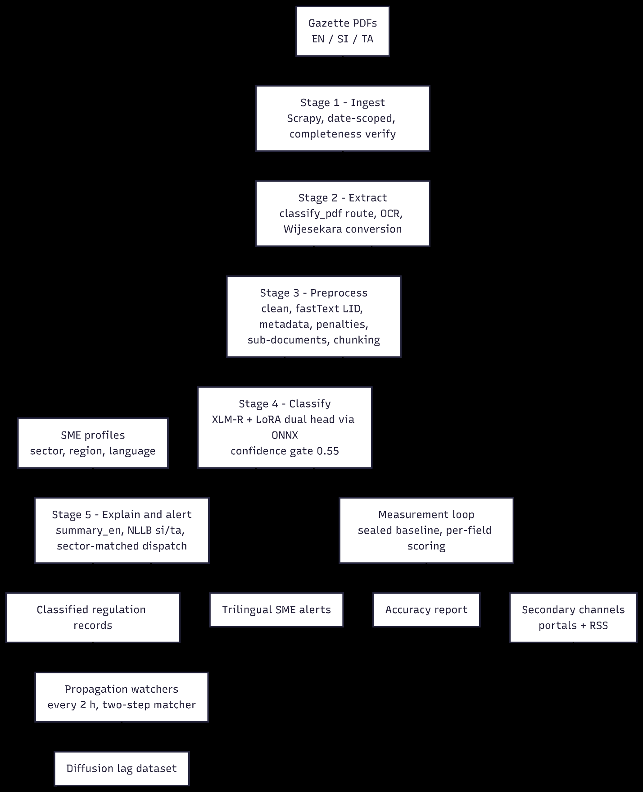

> **What the diagram shows.** The five-stage Module 1 pipeline as a vertical chain. *Gazette PDFs (EN/SI/TA)* → *Stage 1 Ingest* (Scrapy, date-scoped, completeness verify) → *Stage 2 Extract* (classify_pdf route, OCR, Wijesekara conversion) → *Stage 3 Preprocess* (clean, fastText LID, metadata, penalties, sub-documents, chunking) → *Stage 4 Classify* (**as built: TF-IDF + LinearSVC V6, margin gate 0.40 provisional**; the diagram shows the superseded XLM-R + LoRA/ONNX design) → *Stage 5 Explain and alert* (summary_en, NLLB si/ta, sector-matched dispatch). *SME profiles* (sector, region, language) feed Stage 5, and a parallel *Measurement loop* (sealed baseline, per-field scoring) runs off Stage 4. Terminal outputs: classified regulation records, trilingual SME alerts, an accuracy report, and secondary channels (portals + RSS) which feed *Propagation watchers* (every 2 h, two-step matcher) producing the *Diffusion lag dataset*.


*Figure 2 Module 1 input, process and output*


<!-- PDF page 48 -->


#### 4.2.3 Output


*Table 4.2 — Module 1 outputs*


### 4.3 Compliance Guidance Platform

The module transforms a natural-language compliance question into a procedurally complete, source-grounded answer in the user's chosen language. Its pipeline covers language handling, retrieval, prompt construction, generation by a fine-tuned language model, and post-processing to guarantee grounding and to remove internal artefacts.


#### 4.3.1 Input

The primary input is a compliance question posed in English, Sinhala or Tamil, optionally scoped to one of eight regulatory categories. A second input path is the awareness survey, which takes a respondent's business profile (sector, employee band and related attributes) together with their multiple-choice and open-response answers. All regulatory content is supplied to the system as curated text files compiled exclusively from official Sri Lankan government sources.


#### 4.3.2 Process

A non-English question is first translated into English so that retrieval operates in the language of the corpus. The retriever embeds the question and selects the most relevant passages from the appropriate domain or category collection. These passages are assembled into a strict prompt that


|  | Output |  |  | Consumer |  |  | Description |  |
|---|---|---|---|---|---|---|---|---|
| Verified regulation records |  |  | Modules 2, 3 and 4; SME dashboard |  |  | Structured rows with category, affected sectors, SME relevance, confidence, dates, penalties and full text |  |  |
| Trilingual titles and summaries |  |  | SME alerts and dashboard |  |  | title_en/si/ta, summary_en/si/ta, reviewed before publication |  |  |
| Sector-matched alerts |  |  | SME users |  |  | Idempotent in-app, email and SMS notifications keyed on regulation × recipient × channel |  |  |
| Propagation events |  |  | Research analysis |  |  | First-observation timestamps per regulation per secondary channel |  |  |
| Lag analytics views |  |  | Findings notebooks |  |  | v_m1_regulation_lag_summary, v_m1_channel_effectiveness |  |  |
| Accuracy reports |  |  | Examiners and maintainers |  |  | Per-field, per-record and per- stage scores with error taxonomy and worst-N leaderboard |  |  |
| Labelled gold dataset |  |  | Model training and evaluation |  |  | 800 reconciled records with adjudication provenance |  |  |


<!-- PDF page 49 -->

instructs the model to report only what the retrieved text says, to produce a complete numbered procedure giving the exact form, office and deadline for each step, to explain every named form in plain language, and to refuse with a single fixed sentence when the answer is not present. The fine-tuned Llama-3.1 model generates the answer; a post-processing stage then detects and repairs spurious safety refusals and rewrites any internal routing codes that leak into the text. For Sinhala and Tamil, the English answer is translated back through a figure-protecting pipeline that masks numbers, form codes, URLs and amounts before translation and restores them afterwards, falling back to English for any sentence in which a critical figure would otherwise be lost.


#### 4.3.3 Output

The output is a grounded, procedurally complete answer in the requested language, with the responsible authority named and no figure present that does not appear in the retrieved source. For the survey the output is a scored report card that reports declarative and procedural knowledge separately for each applicable domain, and for the fact-check endpoint it is a verdict — Accurate, Outdated, Misleading or Unverifiable — accompanied by the supporting regulatory evidence.


### 4.4 SME Compliance Risk Prediction

This module takes a description of a small business, estimates the probability that it will experience a compliance failure, identifies the factors responsible for that estimate, and expresses the result as guidance the owner can act on. The processing chain is deliberately compact and fully interpretable, because the output is intended to change an owner's behaviour rather than to rank cases for an administrator.


#### 4.4.1 Input

The primary input is a structured business profile obtained through a purpose-built survey instrument. Each response describes a business along two groups of variables. The first group is demographic and records the sector, the number of years in operation, the number of employees, the location, whether an accountant or bookkeeper is used, and the education level of the owner. The second group describes the information environment and records when the owner last learned of a regulatory change relative to its deadline, whether official guidance is normally received in the language the owner works in, how promptly the owner acts on notices, and whether the owner relies on formal or informal information channels.

The outcome variable is derived from three further questions covering the preceding twelve months: whether a filing deadline was missed, whether a penalty or warning notice was received, and whether legal or defaulter action was faced. A business is recorded as having experienced a compliance failure if any of the three applies. These three questions are excluded from the predictor set to prevent label leakage.

The dataset used comprises 300 responses collected from businesses in the grocery retail, food service and general retail sectors, of which 138, or 46 per cent, reported a compliance failure within


<!-- PDF page 50 -->

the preceding twelve months. During operation of the deployed platform the same profile is supplied directly by the owner through a web form, and a second input stream is introduced in the form of regulatory change events published by the Regulatory Change Awareness module.


#### 4.4.2 Process

Raw survey responses are first recoded into a canonical schema. Verbose answer text is mapped to short analytical codes, ordered variables such as awareness lag and language match are encoded as ordinal integers rather than as sets of indicator columns in order to conserve degrees of freedom, and the outcome label is constructed from the three disclosure questions. Unrecognised answer values are reported rather than silently converted to missing values, since an unnoticed missing value in the outcome variable is the most damaging failure mode in the pipeline.

Modelling proceeds as a ladder of three specifications fitted on identical respondents so that their differences are attributable to the features alone. The first, denoted M0, is a naive cross-tabulation rule over sector, business age and accountant use, included as a baseline so that the performance of the learned models can be interpreted against a trivial reference. The second, M1, uses the demographic block. The third, M2, adds the information-barrier block and is the specification of interest. The estimator throughout is regularised logistic regression, selected for coefficient stability at this sample size rather than for maximum accuracy, and performance is measured on cross-validated out-of-fold predictions because the sample does not support an independent hold-out partition.

The hypothesis is evaluated by comparing M2 with M1 using DeLong's test for correlated receiver operating characteristic curves. Feature attribution is computed using SHAP values, which for the linear specification are obtained in closed form and aggregated from encoded columns back to their source variables so that each variable appears once in the ranking. Two further analyses guard the conclusion: a positive-unlabelled learning correction that re-estimates the result without assuming that non-disclosure implies compliance, and a set of descriptive association tests using permutation-based significance and Cramér's V effect sizes so that the central relationships can be verified without reference to any model.

Within the deployed platform the same fitted model is applied to an individual profile. The risk probability, the signed factor contributions and the resulting guidance are generated for that business, and the profile is retained so that it can be matched against subsequent regulatory change events. Matching combines the sector of the business with the obligations implied by its sector and size, so that an alert is raised only where the change genuinely applies.


#### 4.4.3 Output

For the research component the module produces a quantified answer to its hypothesis: a comparison of the three model specifications, a significance test for the incremental contribution of the information block, a ranked attribution of variables with each classified as demographic or


<!-- PDF page 51 -->

informational, a robustness result under the positive-unlabelled correction, and an assessment of how far the sample resembles the national SME population.

For the deployed platform the module produces, for each registered business, a compliance risk probability and an accompanying risk band, an ordered set of factors raising and lowering that risk, and a plain-language explanation with recommended actions in English, Sinhala or Tamil. It further produces targeted regulatory alerts: when a change is published, every affected business receives a notification in its owner's language stating what has changed and what action is required. These outputs are what convert a statistical finding into an intervention against the barrier the research identified.


### 4.5 Regulatory Misinformation Spread

The module implemented covers all the steps from data collection to final classification. First, social media posts on Facebook, Reddit, Twitter/X, and fact-checking websites that mentioned the regulations were manually gathered. The corpus was centered on Sri Lankan regulatory information that made the corpus suitable for the desired application domain, SMEs.

The gathered posts were then pre-processed manually and structurally cleaned for the purposes of annotation and modelling. Duplicates were eliminated, language detection was carried out, information that is not relevant for the topic was removed, personally identifiable information was removed, and regulation domains were assigned. The data was cleaned and later structured into a master dataset and then a classifier dataset and finally a train/test split for the development of the model.

Support in the form of annotation was provided by means of translation only. The original posts were kept in the dataset but Sinhala and Tamil posts were translated into English with the help of NLLB-200 so that the annotators can label the posts uniformly. This allowed for the final corpus to be multilingual but maintain reliable decisions for annotation.

Annotation was first performed on 200 posts, which were independently annotated by two annotators in Label Studio. The Cohen's Kappa was then computed, which showed a very high level of agreement with overall veracity Kappa of 0.934. The agreement was great—one annotator finished the last 800 posts and created a final annotated dataset consisting 1,000 posts.

Then, the annotated corpus was loaded in Google Colab to delete unnecessary metadata columns, to create the dataset for the classifier and to divide it into a training set of 800 posts and a testing set of 200 posts. Three methods were then applied and tested: fine-tuned XLM-RoBERTa, RAG with ChromaDB and Module 2, and simple prompting of Gemini. The output of the module is a veracity prediction, which assists SME users in determining the veracity of a regulatory claim, either completely accurate or partially accurate, or harmful.


<!-- PDF page 52 -->


#### 4.5.1 Input

The major input to the module is a social media post with a regulatory claim. Such posts may come from Facebook, Reddit, Twitter/X, or a fact-checking site and were pulled because they included information about the regulations in Sri Lanka which are applicable to SMEs.

English, Sinhala, Tamil and Code mixed texts are supported. Sinhala and Tamil content can be translated during the process of annotating content, however, the original language forms are preserved in the dataset for modelling and analysis.

The module also leverages on regulation categories that are used to structure the data, such as tax rate change, import and export regulation, regulation by sector, EPF and ETF change, labour law, product standards, business registration and enforcement of penalties. Besides, the training and testing data sets are also included in the input of the module in the modelling step, where 800 posts are used for training and 200 for testing.


#### 4.5.2 Process

The internal workflow starts with a manual collection of posts from the platforms selected and a fact checking from a number of sources. Duplicates are removed during delete and posts that are not relevant to the regulatory misinformation task are removed. Then, language detection is performed for appropriately processing multilingual posts, and personally identifiable information is deleted for privacy protection.

Translation support is the next step. Sinhala and Tamil posts are translated into English during the annotation process, using NLLB-200 only for the annotation process, to reduce the impact on the consistency of the task as well as to retain posts in the dataset in their native language. After the translation, the posts are annotated by Label Studio. 200 posts are labelled independently by two annotators and Cohen's Kappa is used to assess the degree of agreement.

The agreement is tight and the completion of the rest of the 800 posts is done by one annotator. The annotated dataset is then cleaned to prepare it for the modelling: The unneeded metadata is removed and the classifier dataset is created. The labels are also reorganized during model development: the first four labels were simply merged into the 3-way classification space of the three approaches. This is because that this step should ensure that misleading and false are represented in the model comparison as harmful.

The training process is then dependent on the approach. The training set is used to fine-tune XLM- RoBERTa; RAG retrieves evidence from module 2 before making a prediction; the baseline directly classifies using Gemini. After making predictions for the held-out test set, the final classification is made by comparing predictions to the actual data and performance of each approach is evaluated in the same way.


<!-- PDF page 53 -->


#### 4.5.3 Output

The main output of the module is a veracity class. In the implemented classifier workflow, the prediction is accurate, partly accurate or harmful.

In the retrieval-based approach, the output may also feature an explanation based on retrieved regulatory evidence. This will make the outcome useful, since it will provide some context to the user for why a claim was determined a certain way. The output will benefit SMEs in practice because it enables them to evaluate a claim before reacting to it and lessen their reliance on informal advice.


### 4.6 Summary

The four modules share one contract: Module 1 guarantees a verified, classified, sector-tagged and language-complete regulation record, and the other three modules build decision support on top of it without re-parsing source documents. This is what allows the platform to be evaluated module by module and still be defensible end to end — each module's output quality is bounded by, and measured against, the quality of the record it received.


<!-- PDF page 54 -->


## Chapter 5 - Analysis and Design


### 5.1 Introduction

This chapter presents the design of the platform. Section 5.2 gives the overall architecture together with the data-flow, class, sequence and database designs. Section 5.3 gives the module-level designs, with Module 1 in full detail and structured placeholders for the other modules.


### 5.2 High-Level Architecture of the Overall System

The platform is designed as a four-layer architecture, with the four research modules occupying the application layer and communicating through a shared event bus and a shared verified knowledge base.


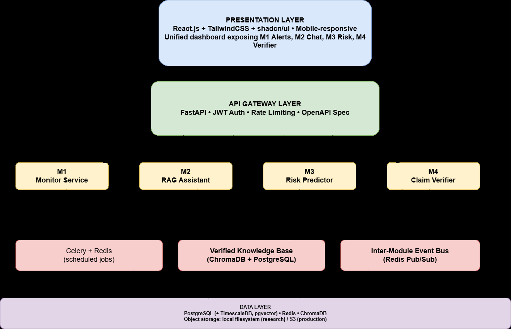

> **What the diagram shows.** Five stacked horizontal bands. **Presentation layer** — React.js + TailwindCSS + shadcn/ui, mobile-responsive, one unified dashboard exposing M1 Alerts, M2 Chat, M3 Risk and M4 Verifier. **API gateway layer** — FastAPI with JWT auth, rate limiting and an OpenAPI spec. **Module services** — four side-by-side boxes: M1 Monitor Service, M2 RAG Assistant, M3 Risk Predictor, M4 Claim Verifier. **Shared services** — Celery + Redis (scheduled jobs), Verified Knowledge Base (ChromaDB + PostgreSQL), Inter-Module Event Bus (Redis Pub/Sub). **Data layer** — PostgreSQL (+ TimescaleDB, pgvector), Redis, ChromaDB, with object storage on local filesystem for research and S3 in production.


*Figure 3 Four-layer high-level architecture of the Enigmatrix platform*

The presentation layer is a single application rendering all four modules through a unified dashboard, so that the SME sees one product rather than four tools. The API gateway layer terminates authentication, role-based authorisation and rate limiting, and routes to module services. Each module is a separately deployable service; in the research prototype they share a process, but the boundaries are drawn so that they could be scaled independently. Three shared infrastructure components bind the modules: Celery for scheduled jobs, the verified knowledge base for ground truth, and the event bus for cross-module triggers. The data layer consolidates relational, vector and cache storage.


<!-- PDF page 55 -->

The layered view in Figure 5.1 is realised concretely as follows.


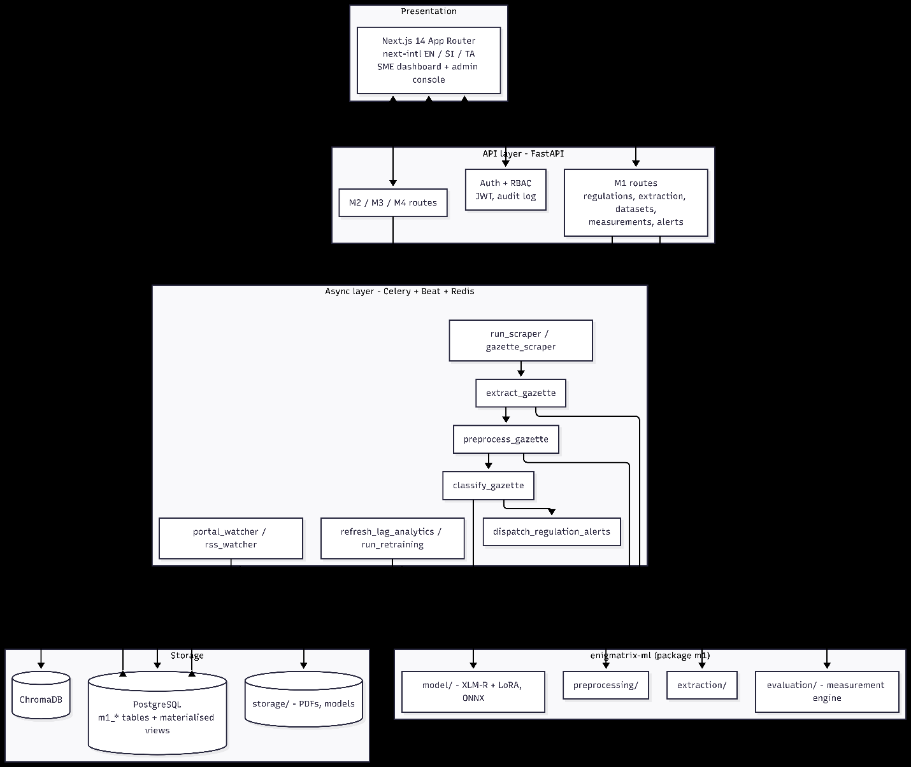

> **What the diagram shows.** A deployment-level component view with four labelled subgraphs. *Presentation*: Next.js 14 App Router with next-intl (EN/SI/TA), serving the SME dashboard and admin console. *API layer — FastAPI*: M2/M3/M4 routes, Auth + RBAC (JWT, audit log), and M1 routes (regulations, extraction, datasets, measurements, alerts). *Async layer — Celery + Beat + Redis*: the task chain run_scraper/gazette_scraper → extract_gazette → preprocess_gazette → classify_gazette → dispatch_regulation_alerts, plus portal_watcher/rss_watcher and refresh_lag_analytics/run_retraining. *Storage*: ChromaDB, PostgreSQL (m1_* tables plus materialised views), and object storage for PDFs and models. A fifth group, *enigmatrix-ml (package m1)*, holds model/ (XLM-R + LoRA, ONNX), preprocessing/, extraction/ and evaluation/ (the measurement engine).


*Figure 4 Deployment-level component view of the implemented platform*


#### 5.2.1 Data flow design

The platform's data flow is presented at two levels. The Level 0 context diagram shows the platform as a single process exchanging data with external actors; the Level 1 diagram decomposes it into the four modules with the verified knowledge base and the event bus as shared stores.


<!-- PDF page 56 -->


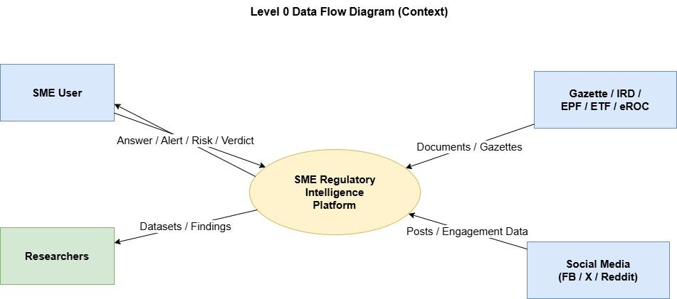

> **What the diagram shows.** A classic context diagram. One central process, *SME Regulatory Intelligence Platform*, sits between four external entities: **Gazette / IRD / EPF / ETF / eROC** sends *Documents / Gazettes* in; **Social Media (FB / X / Reddit)** sends *Posts / Engagement Data* in; the platform returns *Answer / Alert / Risk / Verdict* to the **SME User**; and emits *Datasets / Findings* to **Researchers**.


*Figure 5 Level 0 (context) data flow diagram*


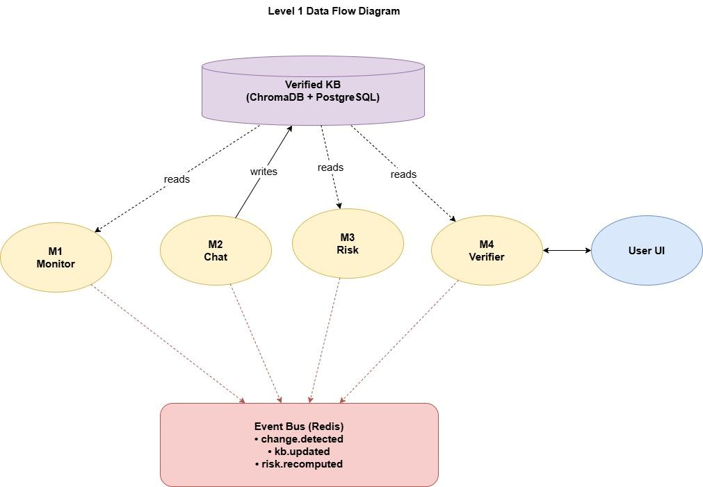

> **What the diagram shows.** The Level 1 decomposition. A *Verified KB (ChromaDB + PostgreSQL)* datastore sits at the top. Four processes hang below it — **M1 Monitor**, **M2 Chat**, **M3 Risk**, **M4 Verifier**. M2 *writes* to the KB; M1, M3 and M4 *read* from it. M4 exchanges data bidirectionally with the **User UI**. All four processes publish to a shared **Event Bus (Redis)** carrying the events `change.detected`, `kb.updated` and `risk.recomputed`.


*Figure 6 Level 1 data flow diagram*


<!-- PDF page 57 -->


#### 5.2.2 Domain model


> **What the diagram shows.** A UML class diagram of the shared domain, in four colour groups. *User* (id, name, language enum en/si/ta, sector, region, sme_size) relates 1-to-many to *AlertSubscription* (change_types[], channels[]) and 1..* to *SMEProfile* (registration_date, sector, employee_count, filing_history json[]), which in turn relates 1-to-many to *RiskScore* (score, shap_factors json[], computed_at, model_version). *RegulatoryChange* (gazette_number, publication_date, change_type, summary_en/si/ta, source_authority) relates 1-to-many to *ChangeAppearance* (source enum portal/news, first_seen_at, url). *KBEntry* (source_doc, section, content, language, verified_at) relates 1-to-many to *Citation* (source_url, section, verified_by). *Claim* (submitted_by, text, source_channel, submitted_at) relates 1-to-1 with *Verdict* (label enum 4-way, confidence, evidence_kb_ids UUID[]).


*Figure 7 Domain class diagram*


#### 5.2.3 Representative interaction

The most representative cross-module interaction is a user submitting a compliance question, with a parallel risk recomputation triggered by an inbound regulatory change.


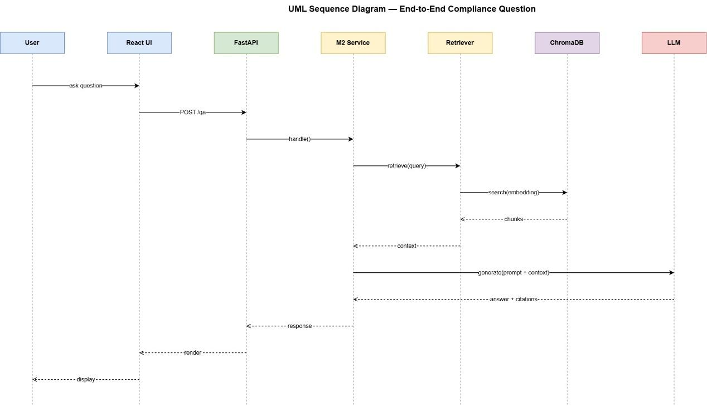

> **What the diagram shows.** A UML sequence diagram with seven lifelines — User, React UI, FastAPI, M2 Service, Retriever, ChromaDB, LLM. The call chain runs: User *ask question* → React UI *POST /qa* → FastAPI *handle()* → M2 Service *retrieve(query)* → Retriever *search(embedding)* → ChromaDB, which returns *chunks* → Retriever returns *context* → M2 Service calls LLM *generate(prompt + context)* → LLM returns *answer + citations* → *response* to FastAPI → *render* to React UI → *display* to the User.


*Figure 8 Sequence diagram for an end-to-end compliance question*


<!-- PDF page 58 -->


#### 5.2.4 Database design


> **What the diagram shows.** The PostgreSQL entity-relationship design, colour-grouped by module. Tables and keys: *users* (PK id, email UNIQUE, password_hash, language, created_at); *alert_subscriptions* (FK user_id, change_types[], channels[]); *regulatory_changes* — a hypertable partitioned on publication_date (gazette_number, change_type, summary_jsonb); *change_appearances* (FK change_id, source enum, first_seen_at, url); *awareness_responses* (FK change_id, respondent_anon_id, awareness_date, channel); *sme_profiles* (FK user_id, sector, employee_count, registration_date, region); *risk_scores* (FK profile_id, score, shap_factors_jsonb, model_version); *kb_entries* (source_doc, section, language, content_hash, verified_at/by) → *kb_chunks* (FK kb_entry_id, chunk_text, chroma_id); *claims* (FK user_id, text, source_channel) → *verdicts* (FK claim_id, label 4-way, confidence, evidence_kb_ids); and *survey_responses* (respondent_anon_id, question_id, answer, score, sector).


*Figure 9 Entity relationship design of the shared database*

The implemented Module 1 schema is summarised below. Platform tables shared with the other modules include users, sme_profiles, audit_log, the survey_* family, sectors and regulatory_domains.


*Table 5.1 — Principal Module 1 database objects*


|  | Object |  |  | Purpose |  |
|---|---|---|---|---|---|
| m1_regulations |  |  | Core record with the status machine, extraction and classifier columns |  |  |
| m1_regulation_sectors |  |  | Many-to-many regulation ↔ sector relevance |  |  |
| m1_regulation_penalties |  |  | Extracted penalty structures, including the multi-penalty case |  |  |
| m1_sub_documents |  |  | Independent instruments split from a single gazette issue |  |  |
| m1_gazette_items |  |  | Item-level index of a gazette issue |  |  |
| m1_extraction_profiles / m1_extraction_runs |  |  | Versioned extractor configurations and their executions |  |  |
| m1_datasets / m1_dataset_versions / m1_dataset_rows |  |  | Dataset registry with immutable sealed versions and SHA-256 content hashes |  |  |
| m1_measurement_runs / m1_measurement_scores |  |  | Measurement executions and per-field scores |  |  |
| m1_propagation_events |  |  | Diffusion observations, unique on (regulation, source), with first_seen_at |  |  |
| m1_alerts |  |  | Dispatched alerts; sme_id IS NULL denotes a public broadcast |  |  |


<!-- PDF page 59 -->


### 5.3 Module-wise Design


#### 5.3.1 Regulatory Change Awareness Gap

Module 1 is structured as a five-stage Celery pipeline with a parallel measurement loop, as designed at interim stage and implemented since.


|  | Object |  |  | Purpose |  |
|---|---|---|---|---|---|
| m1_retraining_runs |  |  | Retraining executions and promotion decisions |  |  |
| v_m1_regulation_lag_summary, v_m1_channel_effectiveness |  |  | Materialised views refreshed nightly for lag analytics |  |  |


<!-- PDF page 60 -->


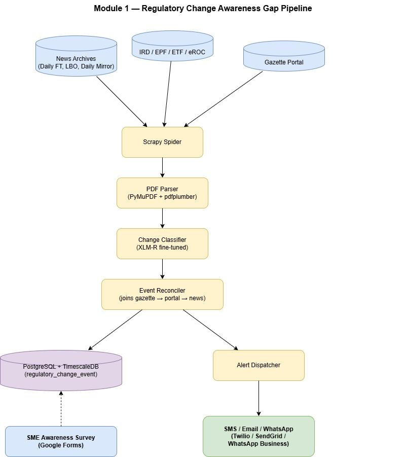

> **What the diagram shows.** Module 1 end to end. Three source cylinders — *News Archives (Daily FT, LBO, Daily Mirror)*, *IRD / EPF / ETF / eROC*, and the *Gazette Portal* — all feed a **Scrapy Spider**, then a **PDF Parser (PyMuPDF + pdfplumber)**, then a **Change Classifier (XLM-R fine-tuned)**, then an **Event Reconciler** that joins gazette → portal → news. The reconciler forks into **PostgreSQL + TimescaleDB** (`regulatory_change_event`) and an **Alert Dispatcher**, which pushes to **SMS / Email / WhatsApp (Twilio / SendGrid / WhatsApp Business)**. A dashed edge shows the **SME Awareness Survey (Google Forms)** feeding back into the database.


*Figure 10 Module 1 pipeline design*

The regulation status machine. Every record advances through a strict status machine. Status is a first-class evaluated field: a record that should have reached classified but stopped at preprocessed is a stage-progression failure, tracked separately from field accuracy.


*Table 5.2 — Regulation status machine and the fields introduced at each stage*


|  | Status |  |  | Entered by |  |  | Fields introduced |  |
|---|---|---|---|---|---|---|---|---|
| ingested |  |  | Scrapy spider |  |  | m1_gazette_items, raw_pdf_path, gazette_number, |  |  |


<!-- PDF page 61 -->

<!-- table continued from previous page -->
|  | Status |  |  | Entered by |  |  | Fields introduced |  |
|  |  |  |  |  |  | document_number, source_url |  |  |
| extracted |  |  | extract_gazette |  |  | raw_text, extraction_method, extracted_at, file_size_bytes, sha256, pdf_pages, language |  |  |
| preprocessed |  |  | preprocess_gazette |  |  | cleaned_text, classification_chunk, amendment_type, metadata_confidence, m1_sub_documents, m1_regulation_penalties |  |  |
| classified |  |  | classify_gazette |  |  | domain_code, change_category, severity_level, is_sme_relevant, classifier_confidence, classified_at |  |  |


<!-- PDF page 62 -->


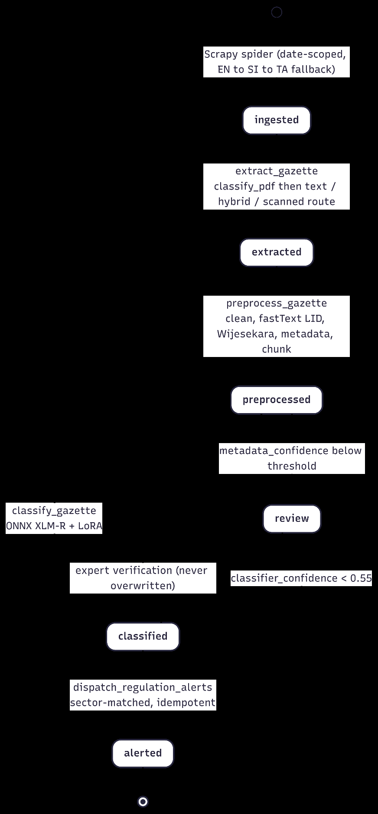

> **What the diagram shows.** A state machine for a regulation record. From the start node, the *Scrapy spider (date-scoped, EN→SI→TA fallback)* produces state **ingested**; `extract_gazette` (classify_pdf then text / hybrid / scanned route) produces **extracted**; `preprocess_gazette` (clean, fastText LID, Wijesekara, metadata, chunk) produces **preprocessed**; `classify_gazette` (**as built: TF-IDF + LinearSVC V6**; the diagram shows the superseded ONNX XLM-R + LoRA design) produces **classified**; `dispatch_regulation_alerts` (sector-matched, idempotent) produces **alerted**, then the terminal state. Two guarded detours route into a **review** state: *metadata_confidence below threshold* from preprocessed, and *decision margin below the provisional 0.40 threshold* from classified (the diagram's `classifier_confidence < 0.55` applies only to the dormant ONNX path). The return edge is *expert verification (never overwritten)*, back to classified.


*Figure 11 Regulation status machine with review routing*


<!-- PDF page 63 -->

Extraction design. Engine choice must be made per page, not per document. classify_pdf inspects text yield and image coverage and assigns one of three routes; within the hybrid route each page is dispatched individually. Extraction profiles are registered entities, so a measurement result is always attributable to a named, versioned configuration.


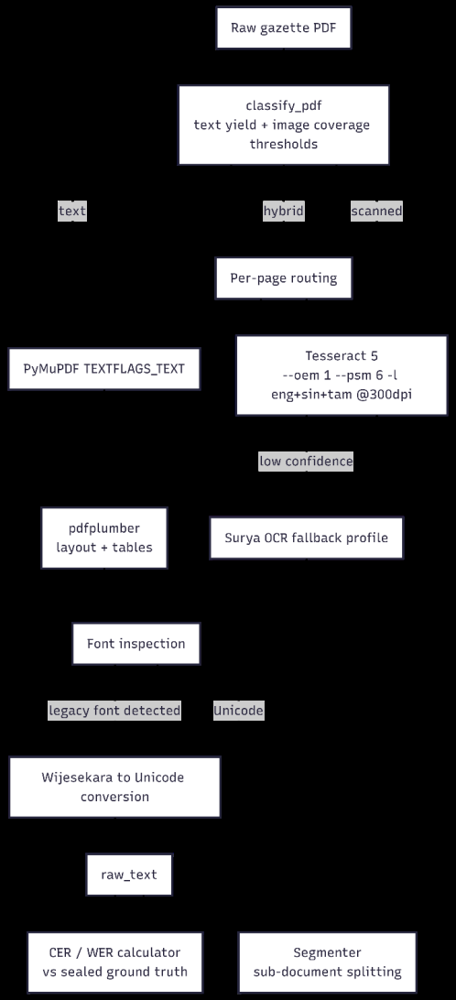

> **What the diagram shows.** Per-page extraction routing. A *Raw gazette PDF* enters `classify_pdf`, which applies text-yield and image-coverage thresholds and emits one of three routes — **text**, **hybrid** or **scanned**. The text route uses *PyMuPDF TEXTFLAGS_TEXT* then *pdfplumber (layout + tables)*. The scanned route uses *Tesseract 5* (`--oem 1 --psm 6 -l eng+sin+tam @300dpi`), with a *Surya OCR fallback profile* on low confidence. The hybrid route dispatches each page individually to either branch. All branches converge on *Font inspection*: if a legacy font is detected it goes through *Wijesekara to Unicode conversion*, otherwise straight to `raw_text`. `raw_text` then feeds both the *CER / WER calculator* (scored against sealed ground truth) and the *Segmenter* (sub-document splitting).


*Figure 12 Extraction and OCR routing chain*


<!-- PDF page 64 -->

Classification design. The classifier is a single XLM-RoBERTa encoder with LoRA adapters and two output heads.


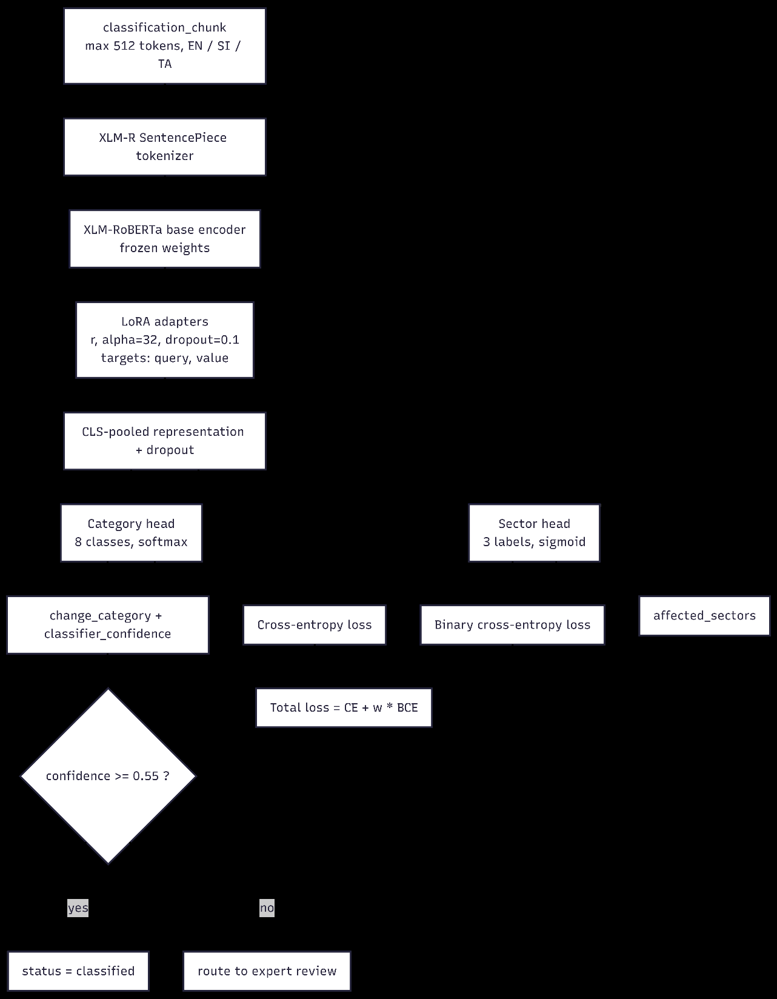

> **What the diagram shows.** The classifier architecture, left to right. A *classification_chunk* (max 512 tokens, EN/SI/TA) → *XLM-R SentencePiece tokenizer* → *XLM-RoBERTa base encoder (frozen weights)* → *LoRA adapters* (r, alpha=32, dropout=0.1, targets: query, value) → *CLS-pooled representation + dropout*. The pooled vector splits into two heads: a **Category head** (8 classes, softmax) and a **Sector head** (3 labels, sigmoid). The category head trains with cross-entropy loss and the sector head with binary cross-entropy; *Total loss = CE + w × BCE*. At inference the category head emits `change_category` + `classifier_confidence` and the sector head emits `affected_sectors`. A decision diamond, *confidence ≥ 0.55?*, sends **yes → status = classified** and **no → route to expert review**.


*Figure 13 XLM-RoBERTa with LoRA adapters and a dual classification head*


<!-- PDF page 65 -->


*Table 5.3 — Classification design decisions and their rationale*

Propagation, alerting and analytics design. The measurement instrument is a two-step matcher that links content observed on secondary channels back to the primary gazette record.


|  | Decision |  |  | Rationale |  |
|---|---|---|---|---|---|
| Single multilingual encoder |  |  | Labelled data per language is scarce; cross-lingual transfer is worth more than per-language specialisation at this scale |  |  |
| LoRA rather than full fine- tuning |  |  | Reduces trainable parameters so a single free-tier GPU session suffices; base weights stay frozen and reusable |  |  |
| Dual head, not two models |  |  | Category and sector share the same textual evidence; joint training regularises both and halves the deployment surface |  |  |
| Softmax for category, sigmoid for sectors |  |  | Category is mutually exclusive by construction; a regulation may affect several sectors simultaneously |  |  |
| ~~Confidence threshold 0.55 for review~~ → **margin threshold 0.40, provisional** ⟦v2⟧ |  |  | The frozen model emits no probability, so no calibrated threshold exists; 0.40 is a validation-derived candidate with zero completed review outcomes behind it |  |  |
| Expert-verified rows never overwritten |  |  | Human verification is authoritative; a later model run must not silently regress a checked record |  |  |
| ONNX with optional INT8 |  |  | Production hosting has no GPU; INT8 reduces latency and memory at a measured accuracy cost |  |  |


<!-- PDF page 66 -->


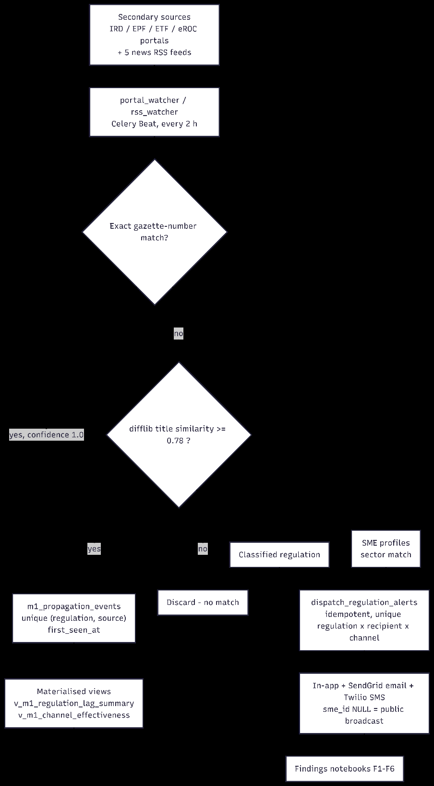

> **What the diagram shows.** Propagation measurement and alerting. *Secondary sources* (IRD / EPF / ETF / eROC portals plus 5 news RSS feeds) are polled by `portal_watcher` / `rss_watcher` on Celery Beat every 2 h. A two-step matcher follows: first *Exact gazette-number match?* — if yes, confidence 1.0; if no, *difflib title similarity ≥ 0.78?* — yes accepts, no discards as *no match*. Accepted matches write to `m1_propagation_events` (unique on (regulation, source), with first_seen_at), which builds the materialised views `v_m1_regulation_lag_summary` and `v_m1_channel_effectiveness`. In parallel, a *Classified regulation* plus *SME profiles sector match* drive `dispatch_regulation_alerts` (idempotent, unique on regulation × recipient × channel) → in-app + SendGrid email + Twilio SMS, where `sme_id NULL` means a public broadcast. Both branches terminate in the *Findings notebooks F1–F6*.


*Figure 14 Propagation measurement and alert dispatch design*


<!-- PDF page 67 -->

Alert dispatch is idempotent and keyed uniquely on (regulation, recipient, channel). A re-run must never double-send, both because duplicate notifications destroy user trust and because a duplicated alert would corrupt the difference-in-differences analysis of alert effectiveness.


#### 5.3.2 Compliance Guidance Platform

The architecture of the module is organised as a layered pipeline. At the top is a Next.js frontend exposing a chat interface, a survey portal and a research dashboard. Requests pass to a FastAPI backend whose routing layer is driven entirely by a single domain registry that defines three sectors, eight categories and twenty regulatory domains. This registry is the only place in which sector membership is defined, so the retrieval classifier and the survey gate cannot drift apart. Beneath the routing layer sits the retrieval layer. Each domain has its own text corpus, embedded with a multilingual sentence-transformer and stored as a dedicated ChromaDB collection. A query is routed to the relevant collection or collections, and the most similar passages are returned with their relevance scores.

The generation layer is a Hugging Face Space serving the fine-tuned Llama-3.1 model on ZeroGPU, reached from the backend through the Gradio client. A parallel translation service in the same Space provides the Sinhala and Tamil layer using NLLB-200. Because the language model is separated from the backend as a network service, it can be upgraded or replaced without redeploying the API, and a stable production Space can serve Module 4 while experimental variants are evaluated in isolation.

Knowledge enters the system through an offline pipeline: official procedures are scraped from government sources, compiled into the domain text files with explicit verification markers, embedded into the vector store, and shipped inside the deployment image. Expert-verification state is held in a separate ledger and written back into the corpus, so that re-scraping a source never destroys a chartered accountant's sign-off.


<!-- PDF page 68 -->


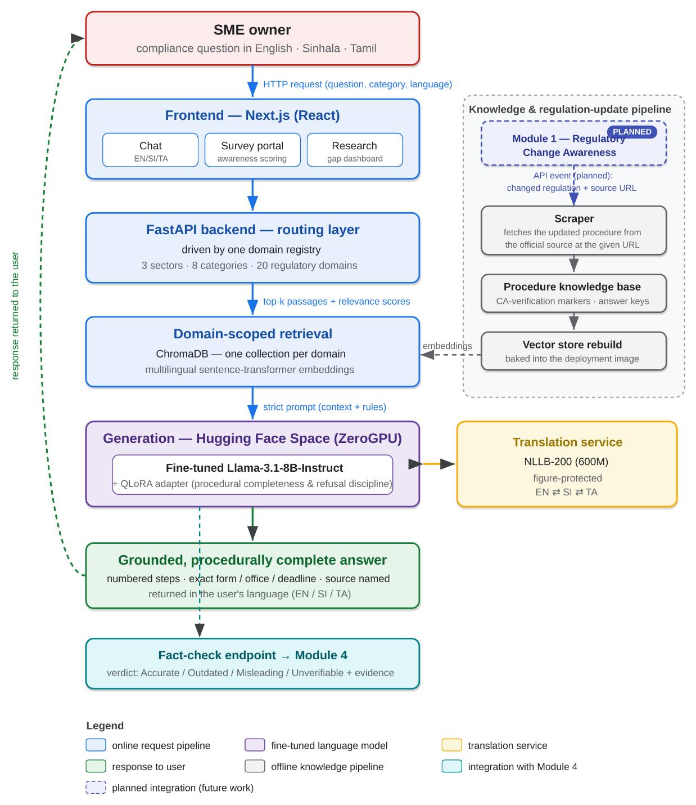

> **What the diagram shows.** The Module 2 request path with a legend. An *SME owner* asks a compliance question in English, Sinhala or Tamil; the *Frontend — Next.js (React)* (Chat EN/SI/TA, Survey portal for awareness scoring, Research gap dashboard) sends an HTTP request carrying question, category and language to the *FastAPI backend routing layer*, driven by one domain registry of 3 sectors · 8 categories · 20 regulatory domains. That performs *Domain-scoped retrieval* in ChromaDB (one collection per domain, multilingual sentence-transformer embeddings), returning top-k passages with relevance scores, then a strict prompt (context + rules) goes to *Generation on a Hugging Face Space (ZeroGPU)* running fine-tuned Llama-3.1-8B-Instruct + a QLoRA adapter for procedural completeness and refusal discipline. Output is a *grounded, procedurally complete answer* — numbered steps, exact form/office/deadline, source named, in the user's language — returned to the user, and also exposed to a *Fact-check endpoint → Module 4* (verdict: Accurate / Outdated / Misleading / Unverifiable + evidence). A *Translation service* (NLLB-200 600M, figure-protected, EN⇄SI⇄TA) sits beside generation. A dashed offline group, *Knowledge & regulation-update pipeline*, shows a **planned** Module 1 integration: an API event (changed regulation + source URL) → Scraper → Procedure knowledge base (CA-verification markers, answer keys) → Vector store rebuild baked into the deployment image.


*Figure 15 Module 2 pipeline design*


#### 5.3.3 SME Compliance Risk Prediction

The architecture of the SME Compliance Risk Prediction module is best read from left to right as two connected paths that share a single model: an offline research path that establishes and


<!-- PDF page 69 -->

validates the risk model, and an online service path that applies it to individual businesses and keeps them informed over time.

The leftmost element of the research path is the survey instrument, which is the module's primary data source. Responses enter a recoding layer that maps answer text to analytical codes, encodes ordered variables as ordinals, constructs the outcome label from the three disclosure questions and reports any data-quality problems rather than absorbing them silently. This layer emits the canonical per-business dataset and should be drawn immediately after the survey source, since every downstream component depends on its schema.

The dataset then feeds a modelling layer containing the three specifications. The naive cross-tabulation baseline, the demographic model and the information-augmented model are drawn as three parallel blocks fed from the same dataset, which makes visually explicit that they are fitted on identical respondents. Their outputs converge on an evaluation block containing the DeLong comparison, from which the hypothesis result is obtained. A separate attribution block computes SHAP values from the information-augmented model and groups them into demographic and informational contributions; this block should be connected to that model rather than to the evaluation block, because attribution and discrimination are distinct questions. Two further validation blocks, the positive-unlabelled correction and the representativeness assessment, are drawn as checks attached to the evaluation stage.

The service path begins where the research path ends. The fitted information-augmented model is serialised into a deployable artefact together with the feature ordering and the baseline values required for attribution, and this artefact is the single point of connection between the two paths. It should be drawn as a bridge element, since it guarantees that the model serving live users is the same model the evaluation validated.

On the service side, a business owner supplies a profile through the web interface. The prediction service loads the artefact, produces a risk probability and computes the signed factor contributions for that individual business. These structured outputs pass to an explanation layer that renders them as plain language in English, Sinhala or Tamil. The explanation layer is deterministic and template-based rather than generative, which should be indicated in the diagram, because guidance concerning statutory obligations must not be subject to fabrication.

The final element is the alerting path, which is what allows the module to act over time rather than only at the moment of assessment. Registered profiles are held in a persistence layer alongside published regulatory changes and the alerts generated from them. Regulatory change events arrive from the Regulatory Change Awareness module and enter a matching engine, which determines the affected businesses by combining sector with the obligations implied by sector and size. Matched businesses receive an alert in their own language on their dashboard. This external input should be drawn entering the matching engine from outside the module boundary and labelled as originating from Module 1, in the same way that the misinformation module draws its retrieval input from Module 2.


<!-- PDF page 70 -->


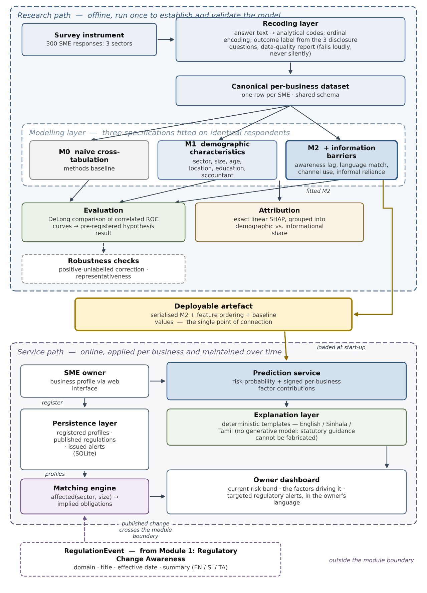

> **What the diagram shows.** Module 3 split into two dashed enclosures. **Research path (offline, run once to establish and validate the model):** a *Survey instrument* (300 SME responses, 3 sectors) → *Recoding layer* (answer text → analytical codes, ordinal encoding, outcome label from the 3 disclosure questions, data-quality report that fails loudly) → *Canonical per-business dataset* (one row per SME). A *Modelling layer* fits three specifications on identical respondents: **M0** naive cross-tabulation (methods baseline), **M1** demographic characteristics (sector, size, age, location, education, accountant), and **M2** M1 + information barriers (awareness lag, language match, channel use, informal reliance). *Evaluation* uses a DeLong comparison of correlated ROC curves against a pre-registered hypothesis; *Attribution* uses exact linear SHAP grouped into demographic vs informational share; *Robustness checks* cover positive-unlabelled correction and representativeness. The fitted M2 becomes the *Deployable artefact* (serialised model + feature ordering + baseline values) — the single point of connection. **Service path (online, applied per business):** the artefact loads at start-up into a *Prediction service* (risk probability + signed per-business factor contributions) → *Explanation layer* (deterministic templates in English/Sinhala/Tamil, no generative model, because statutory guidance cannot be fabricated) → *Owner dashboard* (current risk band, driving factors, targeted alerts in the owner's language). Alongside, the SME owner registers a business profile → *Persistence layer* (SQLite: registered profiles, published regulations, issued alerts) → *Matching engine* (affected(sector, size) → implied obligations). Outside the module boundary, a *RegulationEvent from Module 1* (domain, title, effective date, summary EN/SI/TA) crosses into the matching engine.


*Figure 16 Module 3 pipeline design*


<!-- PDF page 71 -->


#### 5.3.4 Regulatory Misinformation Spread

The Regulatory Misinformation Spread module's high-level architecture starts with the external data sources that are fed into the module to form the corpus. These sources are Facebook, Reddit, Twitter/X, and fact-checking websites that furnish raw social media and claim-based content pertinent to regulatory issues in Sri Lanka which impact SMEs. The leftmost elements in the architecture should be these sources as they are the point of entry into the whole pipeline.

Then the posts are collected and sent to the data preprocessing layer. This layer is meant to convert the noisy raw social media data into a structured data which can be annotation and modelling. These preprocessing activities were done to ensure that the corpus is relevant to the classification goal of the module: Removal of irrelevant posts, duplicate removal, language detection, personally identifiable information removal, regulation domain assignment, and dataset cleaning. This component should be positioned immediately following the external data sources and linked directly to the sources.

After preprocessing, there is an architecture layer that includes a translation layer. Part of the collected data was written in Sinhala and Tamil; therefore, NLLB-200 was used to translate these texts into English for annotation purposes only, which was then added to the dataset without losing the original Sinhala and Tamil text. This should hence be presented as an additional stage in between the preprocessing and the annotation, and should be noted as such: "Translation used for the purpose of consistent annotation instead of the original multilingual text."

The following layer is the annotation layer. 200 posts were double-annotated independently in Label Studio in this module to evaluate the consistency of the annotations, and the rest of the posts were then annotated after this stage, using Google Sheets. This layer should be connected to an agreement calculation component for reasons of measuring the inter-annotator reliability on the double-annotated subset before the completion of the rest of the dataset, where Cohen’s Kappa was computed. The annotation layer and the agreement calculation block should be closely related in the architecture because the measurement of agreement came directly from the double-annotation block.

The architecture then moves on to Dataset preparation. Further data cleaning of the annotated data set is performed at this stage for the purpose of modelling: irrelevant metadata columns are removed from the data set, the classifier data set is prepared, and the final train-test split for the experimental comparison is generated. This component should be depicted as a preparation block in the center receiving the annotated dataset and generating the dataset(s) needed for the development and evaluation of the model.

The splitting sets are designed to feed the three types of models evaluated in the module, but not in exactly the same manner. Approach 1 is the fine-tuned model XLM-RoBERTa which is trained on the training dataset and then tested on the testing dataset. Approaches 2 and 3 are not evaluated


<!-- PDF page 72 -->

in the same way in this module, as they do not need the same training process, but rather are evaluated on the prepared test set using prompt-based or retrieval-grounded inference. This is why the architecture should be such that the training data is only connected to Approach 1, and all three approaches are connected to the testing data.

Approach 2 is the RAG based pipeline and should be depicted as having an additional input from Module 2 in the larger platform. This is because the RAG approach relies on regulatory evidence that is retrieved from the verified knowledge base that exists outside this module and not from a local vector database within the Regulatory Misinformation Spread module. Thus, rather than a separate ChromaDB or vector storage block drawn in as Module 2 or regulatory evidence retrieved into Approach 2, the architecture should have an external evidence or retrieval input that is separate from Approach 2 and labeled as Module 2 or retrieved regulatory evidence.

The direct Gemini prompting baseline is Approach 3. This is in contrast to the RAG-based approach, which does not include retrieved regulatory evidence, but rather a classification process based on the post prompt provided. It should thus be depicted, in the architecture diagram, as another path in parallel with Approach 1 and Approach 2, which takes the testing dataset as input and provides an output classification prediction.

All three approaches are then fed into the prediction stage and the system returns the veracity decision for each input post. The final output layer should deliver the predicted misinformation classification and enable downstream SME decision making by allowing users to make their decisions on if a circulating claim from a regulation is trustworthy or not before they act on it. The overall left-to-right flow should thus be in the following order: external data sources, preprocessing layer, translation layer, annotation layer, agreement calculation, dataset preparation, training and testing datasets, the three approaches evaluated, prediction, and final output with an additional external line from Module 2 to the RAG-based approach.


<!-- PDF page 73 -->


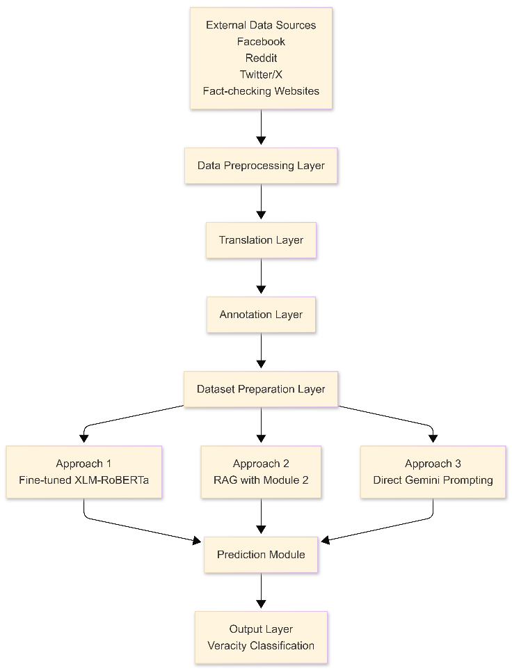

> **What the diagram shows.** The Module 4 chain. *External Data Sources* (Facebook, Reddit, Twitter/X, fact-checking websites) → *Data Preprocessing Layer* → *Translation Layer* → *Annotation Layer* → *Dataset Preparation Layer*, which fans into three parallel approaches: **Approach 1** fine-tuned XLM-RoBERTa, **Approach 2** RAG with Module 2, **Approach 3** direct Gemini prompting. All three converge on the *Prediction Module* and then the *Output Layer — Veracity Classification*.


*Figure 17 Module 4 pipeline design*


### 5.4 Summary

The design separates three concerns that are frequently conflated: the operational pipeline that produces regulatory intelligence, the measurement framework that quantifies how well it does so, and the research instrument that observes how that intelligence propagates. Each has its own tables, its own metrics and its own failure modes. That separation is what allows Chapter 7 to report extraction accuracy, model accuracy and diffusion lag as independent, individually defensible results.


<!-- PDF page 74 -->


## Chapter 6 - Implementation


### 6.1 Introduction

This chapter documents how the design of Chapter 5 was realised. Section 6.2 describes data collection, including the construction of the private labelled dataset that is the empirical foundation of Module 1, together with the three further datasets on which Modules 2, 3 and 4 rest — a verified compliance knowledge base, two SME survey instruments, and an annotated corpus of regulatory misinformation. None of the four existed before this project, and each module’s central claim is answerable only because its dataset was built first. Collection is therefore documented per module, and the provenance constraints that bound what each dataset may be used to claim are stated in section 6.2.6 rather than deferred. Section 6.3 documents the implementation of each module, with the principal source files named so that every claim can be verified against the repository, and with representative code listings and interface captures.


### 6.2 Data Collection

Three distinct datasets were collected for Module 1: a raw document corpus, a private labelled gold dataset, and a sealed evaluation baseline. Modules 2, 3 and 4 each contribute a further dataset, listed alongside them in Table 6.1. The seven entries divide into three kinds: source corpora that the system reads, labelled datasets that models are trained and tested on, and sealed baselines that exist solely so a result can be checked against something that cannot move.


*Table 6.1 — Datasets used in this project*


|  | Dataset |  |  | Size |  |  | Provenance |  |  | Role |  |
|---|---|---|---|---|---|---|---|---|---|---|---|
| Raw gazette corpus |  |  | 800 PDFs across 11 extraction batches |  |  | gazette.lk, documents.gov.lk |  |  | Source material for extraction and preprocessing |  |  |
| Gold labelled dataset v1 |  |  | 800 reconciled records |  |  | Dual annotation in Label Studio, adjudicated |  |  | Training, validation and test data for classification |  |  |
| Sealed evaluation baseline |  |  | ~800 curated field-level rows (Jan–Apr 2026) |  |  | Manually curated workbook, SHA- 256 checksummed |  |  | Ground truth for extraction and stage accuracy |  |  |
| Database regression snapshot |  |  | ~204 rows, most at preprocessed |  |  | Production database export, February 2026 |  |  | Stage-progression and regression tracking |  |  |
| Calibration set |  |  | 20 trilingual documents with expert labels and rationales |  |  | Domain expert |  |  | Annotator alignment before production labelling |  |  |
| Verified compliance |  |  | 20 regulatory domains under 8 categories; rules |  |  | Official IRD, EPF, ETF, Customs, CAA and SLSI |  |  | Retrieval corpus and ground truth for Modules 2 and 4 |  |  |


<!-- PDF page 75 -->


#### 6.2.1 Document collection

Four Scrapy spiders - gazette_spider, weekly_gazette_spider, acts_spider and bills_spider - collect from the two official sources. Each supports date scoping and closes on scope exhaustion, falls back English→Sinhala→Tamil when an edition is missing, and exposes completeness verification and re-fetch endpoints so gaps are detected rather than silently tolerated. Collection is scheduled every six hours through Celery Beat and can also be triggered for a specific date range from the admin console.

Module 2 operates a second and narrower collection surface, because it reads a different object. Module 1 collects regulatory change events; Module 2 collects standing procedure — the form number, the issuing office, the deadline, the fee and the sequence of steps a business must actually complete. Per-authority scrapers write one structured file per regulatory domain, and the two differ in cadence as well as in content: a change event is time-critical and arrives unpredictably, whereas a procedure changes rarely and is re-scraped on a slow schedule.

One collection rule governs both surfaces and is enforced rather than encouraged: only official government sources may supply a rule. A news report may be used to locate a gazette number or a publication date, never as the source of the rule itself. Any regulatory content entering the knowledge base before expert sign-off is marked as pending verification, and that marking travels with the text into every answer generated from it, so an unverified figure carries its own caveat to the reader.

```
1. Principal files:
2. enigmatrix-backend/scraper/spiders/*.py,
app/tasks/m1/run_scraper.py,
app/tasks/m1/gazette_scraper.py, app/api/v1/m1_completeness.py
```


|  | Dataset |  |  | Size |  |  | Provenance |  |  | Role |  |
|---|---|---|---|---|---|---|---|---|---|---|---|
| knowledge base |  |  | and procedure files per domain |  |  | publications; expert-verified |  |  |  |  |  |
| Compliance knowledge survey |  |  | 76 responses; 60 items, 78 rubric points |  |  | SME owners and finance staff, administered through the platform |  |  | Declarative-versus-procedural knowledge benchmark (Module 2) |  |  |
| SME vulnerability survey |  |  | 300 responses; 138 reported failures (46%) |  |  | SME owners in retail and food service, two provinces |  |  | Training and evaluation data for the risk model (Module 3) |  |  |
| Regulatory misinformation corpus |  |  | 1,000 posts; 800 development / 200 test |  |  | Facebook, Reddit and X, plus fact- checking platforms |  |  | Training and evaluation data for claim classification (Module 4) |  |  |


<!-- PDF page 76 -->


#### 6.2.2 Annotation and gold dataset construction

No labelled dataset of Sri Lankan regulatory changes exists, so one was created. The protocol was designed so that the result would be defensible as ground truth.

- 1.Calibration. A 20-document trilingual calibration set with expert labels and written rationales
was completed by every annotator before production labelling. Calibration disagreements were discussed and the decision hints in the guideline were refined.

- 2.Sampling. Documents were drawn using stratified and k-means samplers with explicit minority-
domain targeting, plus a hybrid active-learning mode, so annotation effort concentrated where it changes the model rather than on whatever arrived first.

- 3.Dual annotation. Batches 02–05 were labelled independently by two annotators. Each task
captured change category, affected sectors, SME relevance, an annotator confidence rating and free-text notes.

- 4.Automated reduction. scripts/resolve_iaa.py paired annotations, computed agreement statistics
and emitted agreed rows directly to gold.

- 5.Manual adjudication. The 40 disagreement rows were adjudicated by a resolver and recorded
in manual_resolutions.csv with a resolution method and resolver identifier. The final gold file contains zero lead-annotator fallback rows — every disagreement was decided explicitly, not defaulted.

- 6.Freezing. The result was frozen as gold_standard_v1_800.csv with an accompanying
iaa_report_v1_800.json.


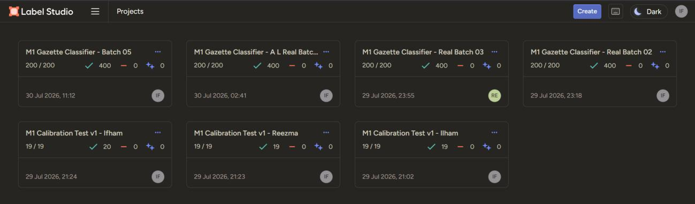

> **Screenshot.** The Label Studio projects board (dark theme) showing seven M1 projects: four production batches — *M1 Gazette Classifier - Batch 05*, *- A L Real Batch…*, *- Real Batch 03*, *- Real Batch 02*, each at 200/200 tasks with 400 completed annotations and 0 skipped — and three calibration projects, *M1 Calibration Test v1 - Ifham*, *- Reezma*, *- Ilham*, each at 19/19 tasks (20, 19 and 19 annotations). Timestamps run 29–30 July 2026.


*Figure 18 Label Studio annotation interface for the Module 1 labelling schema*

The label schema is defined once in code and mirrored into the Label Studio configuration and the database enumerations.

Listing 6.1 — Canonical label schema (`enigmatrix-ml/m1/model/labels.py`)


<!-- PDF page 77 -->

```
 1. CATEGORIES: list[str] = [
 2.     "TAX_RATE_CHANGE", "IMPORT_EXPORT", "SECTOR_SPECIFIC", "EPF_ETF_CHANGE",
 3.     "LABOUR_LAW", "PRODUCT_STANDARD", "BUSINESS_REGISTRATION",
 4.     "PENALTY_ENFORCEMENT",
 5. ]
 6. SECTORS: list[str] = [
 7.     "grocery_retail", "food_service", "general_retail",
 8. ]
 9.
10. CAT_TO_ID: dict[str, int] = {c: i for i, c in enumerate(CATEGORIES)}
11. ID_TO_CAT: dict[int, str] = {i: c for c, i in CAT_TO_ID.items()}
12. SECTOR_TO_ID: dict[str, int] = {s: i for i, s in enumerate(SECTORS)}
13.
14.
15. def encode_sectors(value) -> list[int]:
16.     """Multi-hot vector of length len(SECTORS)."""
17.     vec = [0] * len(SECTORS)
18.     for s in parse_sectors(value):
19.         vec[SECTOR_TO_ID[s]] = 1
20.     return vec
21.
```

The three study sectors were selected because they are numerous among Sri Lankan SMEs, are affected by all eight categories, and are distinguishable by an annotator without specialist domain training. Restricting scope to three sectors is a deliberate trade-off: it keeps annotation feasible at the required agreement level, at the cost of limiting immediate generalisation. This is stated as a limitation in Chapter 8 rather than concealed.


*Table 6.2 — Columns of the frozen gold dataset*


#### 6.2.3 Compliance knowledge base and expert verification

Module 2 requires a corpus that is not merely retrieved from but can be cited. It was assembled from the official publications of the Inland Revenue Department, the Employees’ Provident Fund and Employees’ Trust Fund, Sri Lanka Customs, the Consumer Affairs Authority, the Sri Lanka Standards Institution and the Registrar of Companies, covering 20 regulatory domains grouped under the same eight categories Module 1 classifies into and scoped to the three study sectors. Each domain carries two artefacts. A rules file holds the human-readable statement of the obligation and is what is segmented and embedded for retrieval. A procedures file holds the scraped


|  | Group |  |  | Columns |  |
|---|---|---|---|---|---|
| Identity |  |  | batch_id, regulation_id, regulation_key, gazette_number, year, language |  |  |
| Model input |  |  | classification_chunk |  |  |
| Labels |  |  | change_category, affected_sectors, is_sme_relevant |  |  |
| Annotator signal |  |  | confidence, confidence_mean, annotator_ids, annotator_notes |  |  |
| Adjudication provenance |  |  | resolution_method, resolver_id, disagreement_fields, resolver_notes, source_exports |  |  |


<!-- PDF page 78 -->

operational detail — form, office, deadline, fee and steps — and is injected into the rules text by an idempotent build step, so that a re-scrape updates the knowledge base without a manual merge. The separation matters because the two have different lifetimes and different authorities behind them.

Content is verified by a chartered accountant across two desks: one for the survey question bank and its marking rubrics, and one for the scraped procedures and their checkpoints. Sign-off is recorded in ledger tables and is never written back into the scraped files, because the scrapers overwrite those files on every run and a verification flag stored inside a scraped document would be destroyed by the next scrape. Display status is therefore computed rather than stored, with the precedence rejected, then stale, then verified, then partial, then pending. A verified item becomes stale automatically when the hash of its content no longer matches the hash that was signed, so an edit invalidates the sign-off instead of silently inheriting it. This is the single design decision that allows expert verification to remain trustworthy while the underlying corpus continues to be re-scraped.


#### 6.2.4 Survey instruments

Both surveys were delivered through the platform’s own trilingual survey module rather than an off-the-shelf form tool. Responses therefore land directly in the platform database, which permits richer response logging, conditional branching driven by the respondent’s registered profile, and a single consent record — none of which a generic form service supports.

The Module 2 compliance knowledge survey is deliberately two-layered, because the module’s hypothesis is about a distinction that a single-layer instrument cannot detect. A multiple-choice layer measures declarative knowledge — whether the respondent knows that an obligation exists — while an open-response layer is graded against rubrics to measure procedural knowledge — whether they know the form, the office and the deadline that discharge it. Sixty items across the 20 domains carry 78 rubric points in total. Items are gated twice before being shown: a sector gate requires the domain to apply to the respondent’s sector, and a profile gate requires the answer key’s applicability rule to match the registered profile. Both gates fail closed, so missing information means “not applicable” rather than “ask anyway”. The report-card denominator applies the sector gate only, and this asymmetry is deliberate: it keeps scores comparable across respondents whose individual profiles differ.

The Module 3 SME vulnerability survey obtained 300 usable responses across the three sectors. It records the demographic block — sector, sub-sector, location, business age, headcount, owner education and whether an accountant is used — and the information-barrier block, comprising awareness lag, whether guidance is normally received in the owner’s working language, responsiveness to notices, and reliance on informal channels. Self-reported compliance history over the preceding twelve months supplies the outcome. Responses are recoded from the survey export into a fixed model schema by prefix matching on question identifiers rather than on question


<!-- PDF page 79 -->

wording, so that later rewording of an item does not silently break the pipeline. The outcome label is constructed by a rule fixed before analysis: a failure is recorded where the respondent missed a filing deadline, received a penalty or warning notice, or faced enforcement action within the period. That rule, and its asymmetry, are carried into the evaluation in section7.1.15.


#### 6.2.5 Misinformation corpus collection

Module 4’s corpus was assembled manually rather than through platform APIs. Research access tiers for the major social platforms are no longer dependable, and a methodology contingent on them would have been a single point of failure for the module. Publicly visible posts making a specific claim about Sri Lankan regulation — value-added tax, income tax, employer contributions, filing deadlines and gazette notices — were identified by keyword search across Facebook, Reddit and X, and supplemented from fact-checking platforms, which supply a seed of claims whose accuracy has already been assessed independently.

Only posts that were publicly visible and carried an identifiable regulatory claim were retained; general commentary, questions and posts referencing no regulatory content were excluded, and no private group or account was accessed. Post text was captured together with the platform, the date and whatever engagement figures were publicly displayed, the latter supporting the spread analysis rather than the classification task. Manual collection bounds the corpus at 1,000 posts, which is modest; it is, however, a corpus whose every item can be accounted for, which an API dump of comparable

size

would

not

be. 6.2.6 Provenance, consent and data-governance constraints Three constraints bound what these datasets may be used to claim, and are recorded here rather than in the limitations chapter alone, because each one governs how the data may be handled during the work and not merely how the results should be read. First, the Module 2 live survey corpus is split-source, and the two layers do not carry equal evidential weight. The multiple-choice layer is field data and is treated as evidence. The written short-answer layer originates from a separate collection submission and is flagged in the record as not verbatim; it is retained as a grading fixture only, and no sentence from it is quoted anywhere as a respondent’s words. The flag follows from a check rather than a suspicion: paired same-respondent prose similarity was 0.3539 against a random-pair similarity of 0.3513, t = 1.15, p = 0.25 — that is, prose attributed to one respondent is not measurably more similar to itself than to another respondent’s. That finding is carried into the limitations as a methodological result about data quality, not concealed as an inconvenience. Second, identifiable information is confined by design. Business names and owner names exist only in the two source workbooks and are never carried into any processed record; the conversion script reads them solely to set a boolean indicating that identity is on file, and never copies them forward. No private enterprise data of any kind — financial statements, filing records or account data — was collected for any module. Every measurement in this dissertation rests on public records, ethically administered survey responses, or publicly visible posts. Third, consent and ethics were handled at programme level. A single


<!-- PDF page 80 -->

ethics application covering all four modules was prepared, together with a participant information sheet and a consent form, and every survey instrument presents an informed-consent statement before its first question. Free-text survey responses and raw social-media content are retained only for the period the analysis requires.


### 6.3 Implementation of Individual Modules


#### 6.3.1 Regulatory Change Awareness Gap

Module 1 was implemented in five phases. All five are complete in code; the human and data gates that remain are stated explicitly in Chapter 7.


##### 6.3.1.1 Phase 1 - Platform foundation

JWT authentication (bcrypt hashing, HS256 access and refresh tokens) with role-based access control across sme, admin and annotator roles; slowapi rate limiting; audit logging on every authentication event and administrative mutation; regulation CRUD at /admin/regulations with soft deletion via is_active, an expert-verification gate, bulk verification and restore; sector mapping and seed data.

Principal files: app/api/v1/m1_regulations.py, app/services/m1_regulation_service.py,

app/models/regulation.py.


##### 6.3.1.2 Phase 2 - Ingestion, extraction, preprocessing and measurement

This is the largest completed block. The canonical extraction implementation lives in enigmatrix-ml/m1/extraction/; the backend app/extraction/ is a thin re-export adapter that preserved existing imports and tests while removing roughly ninety lines of duplicated logic. Components: the classify_pdf router; per-page engines (PyMuPDF, pdfplumber, pypdfium2, Tesseract, Surya); registered profiles legacy_v1, page_routing_v1, surya_fallback_v1 and wijesekara_routing_v1; a font-aware Wijesekara-to-Unicode converter; a CER calculator; and a segmenter. Preprocessing (enigmatrix-ml/m1/preprocessing/) performs cleaning, fastText language identification, metadata and penalty extraction, chunking and sub-document splitting.

The operational console at /admin/m1/pipeline streams live progress over a WebSocket at /ws/extraction/{task_id} and provides a date-range picker, run history, cancel and rollback, a PDF Records page and a per-regulation pipeline trace.


<!-- PDF page 81 -->


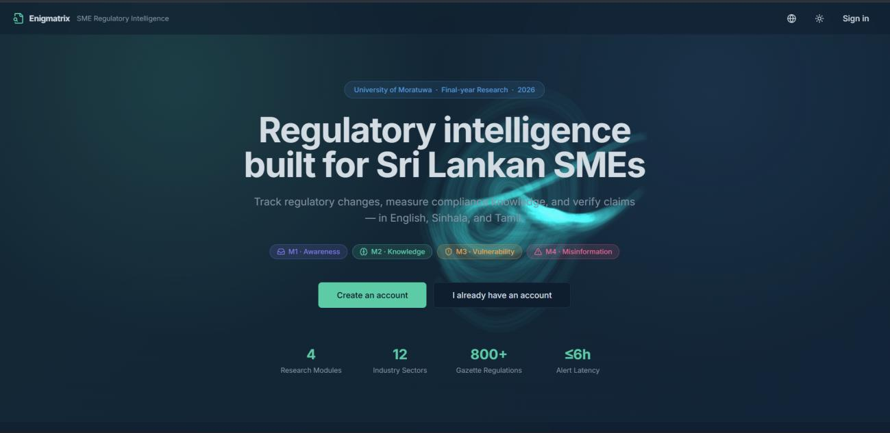

> **Screenshot.** The Enigmatrix public landing page (dark theme): headline *"Regulatory intelligence built for Sri Lankan SMEs"*, subtitle about tracking regulatory changes, measuring compliance knowledge and verifying claims in English, Sinhala and Tamil; module chips M1 · Awareness, M2 · Knowledge, M3 · Vulnerability, M4 · Misinformation; *Create an account* / *I already have an account* buttons; and a headline-statistics strip — 4 Research Modules, 12 Industry Sectors, 800+ Gazette Regulations, ≤6h Alert Latency.


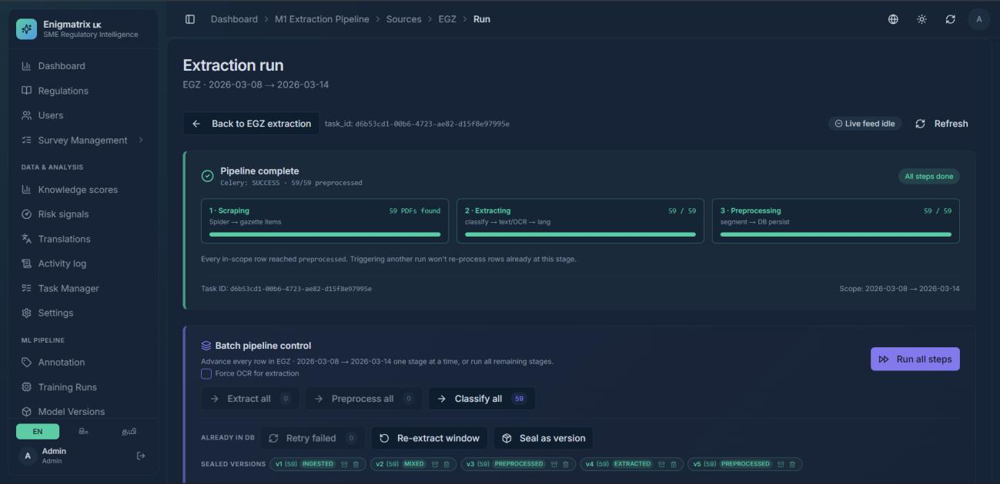

> **Screenshot.** The admin *Extraction run* console for source EGZ over 2026-03-08 → 2026-03-14. A green *Pipeline complete* banner (Celery: SUCCESS · 59/59 preprocessed) sits above three progress bars — 1 Scraping (59 PDFs found), 2 Extracting (59/59, classify → text/OCR → lang), 3 Preprocessing (59/59, segment → DB persist). Below is *Batch pipeline control* with per-stage buttons (Extract all, Preprocess all, Classify all 59), a *Run all steps* action, a *Force OCR for extraction* checkbox, and controls for Retry failed, Re-extract window and *Seal as version*. A sealed-versions strip lists v1 (59) INGESTED, v2 (59) MIXED, v3 (59) PREPROCESSED, v4 (59) EXTRACTED, v5 (59) PREPROCESSED. The left navigation shows Dashboard, Regulations, Users, Survey Management, Knowledge scores, Risk signals, Translations, Activity log, Task Manager, Settings, and an ML Pipeline group (Annotation, Training Runs, Model Versions).


*Figure 19 Administrative extraction pipeline console*

Principal files: app/api/v1/m1_gazette_extraction.py (17 routes), app/api/v1/m1_extraction_ws.py.


##### 6.3.1.3 Phase 2 — Extraction accuracy measurement subsystem

This subsystem answers the question "how good is our extraction?" quantitatively and is a core artefact of the dissertation.

- Dataset registry — m1_datasets, m1_dataset_versions, m1_dataset_rows: named datasets with
immutable sealed versions carrying SHA-256 content hashes, Excel ground-truth upload, retire


<!-- PDF page 82 -->

and restore, and a nightly retention policy that keeps the current version, the previous version and anything flagged keep.

- Extraction profile registry and run dispatcher — runs any profile against a defined scope,
with overlap detection and automatic v1→v2 versioning when a new run's date range overlaps an existing version.

- Measurement engine (enigmatrix-ml/m1/evaluation/) — per-field comparators for categorical,
date, numeric, string, semantic and text-summary types; aggregates; strata; raw-text scoring; completeness; and a date-scope filter so that a date-scoped run is not penalised against the full ground truth.

- Measurement UI at /admin/datasets/m1/measurements* — run form with optional date-range and
source scoping, dashboard, per-run detail, per-regulation drill-down, worst-N view, calibration view, sortable columns, sparklines and keyboard shortcuts.

- Accuracy report export — GET /api/v1/m1/measurements/{run_id}/report.md returns a
downloadable Markdown report produced by a pure function in m1_measurement_report.py.

- Data-quality suites — Great-Expectations-style JSON expectations in data_quality/expectations/
validated automatically after sealing by the validate_dataset_version task.

- Thesis artefact generator — scripts/regenerate_thesis_tables.py, invoked by make thesis-artifacts.

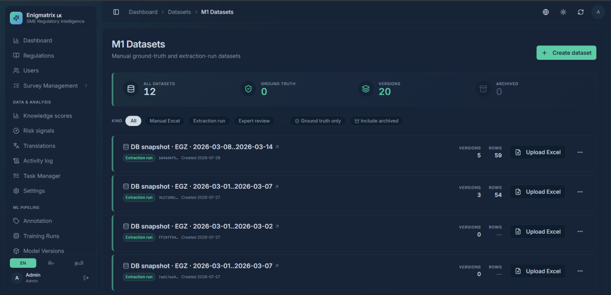

> **Screenshot.** The *M1 Datasets* screen — manual ground-truth and extraction-run datasets. Summary tiles read ALL DATASETS 12, GROUND TRUTH 0, VERSIONS 20, ARCHIVED 0, with kind filters (All, Manual Excel, Extraction run, Expert review) and toggles for *Ground truth only* / *Include archived*. The list shows DB snapshots for EGZ windows 2026-03-08..03-14 (5 versions, 59 rows), 2026-03-01..03-07 (3 versions, 54 rows) and two further 2026-03-01 windows with 0 versions, each with an *Upload Excel* action.


<!-- PDF page 83 -->


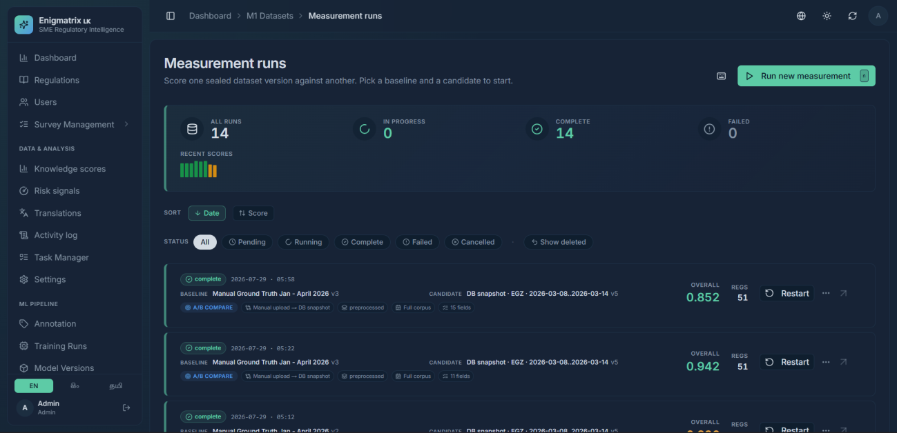

> **Screenshot.** The *Measurement runs* screen — "Score one sealed dataset version against another. Pick a baseline and a candidate to start." Tiles read ALL RUNS 14, IN PROGRESS 0, COMPLETE 14, FAILED 0, with a recent-scores sparkline. Individual rows show baseline *Manual Ground Truth Jan - April 2026* v3 against candidate *DB snapshot · EGZ · 2026-03-08..2026-03-14* v5 with overall scores of **0.852** (15 fields, 51 regulations) and **0.942** (11 fields, 51 regulations), each tagged A/B COMPARE · Manual upload → DB snapshot · preprocessed · Full corpus.


*Figure 20 Extraction accuracy measurement dashboard*


##### 6.3.1.4 Phase 3 — Annotation, dataset preparation and classification

Dataset preparation is implemented in m1.model.data, which produces train/validation/test Parquet splits either deterministically on regulation_key or temporally on gazette_published_date. TF-IDF baselines are implemented in m1.model.baselines.

The classifier itself is a single encoder with two heads.

Listing 6.2 — Model architecture (`enigmatrix-ml/m1/model/architecture.py`)

```
 1. class GazetteClassifier(nn.Module):
 2.     """CLS-pooled XLM-R (LoRA-adapted) -> single-label category head +
 3.     multi-label sector head. Head widths come from ModelConfig."""
 4.
 5.     def __init__(self, cfg: ModelConfig | None = None):
 6.         super().__init__()
 7.         self.cfg = cfg or ModelConfig()
 8.         encoder = AutoModel.from_pretrained(self.cfg.base_model)
 9.         self.encoder = get_peft_model(encoder, LoraConfig(
10.             r=self.cfg.lora_r, lora_alpha=self.cfg.lora_alpha,
11.             lora_dropout=self.cfg.lora_dropout,
12.             target_modules=list(self.cfg.lora_targets), bias="none",
13.             task_type="FEATURE_EXTRACTION",
14.         ))
15.         hidden = encoder.config.hidden_size
16.         self.dropout = nn.Dropout(0.1)
17.         self.category_head = nn.Linear(hidden, self.cfg.num_categories)
18.         self.sector_head = nn.Linear(hidden, self.cfg.num_sectors)
19.
20.     def forward(self, input_ids, attention_mask):
21.         out = self.encoder(input_ids=input_ids, attention_mask=attention_mask)
22.         pooled = self.dropout(out.last_hidden_state[:, 0])   # [CLS]
23.         return self.category_head(pooled), self.sector_head(pooled)
24.
```


<!-- PDF page 84 -->

```
25.
26. def compute_loss(category_logits, sector_logits, category_target,
27.                  sector_target=None, sector_weight: float = 1.0,
28.                  class_weights=None):
29.     """CrossEntropy on the category head + BCE on the multi-label sector head."""
30.     ce = nn.functional.cross_entropy(category_logits, category_target,
31.                                      weight=class_weights)
32.     if sector_target is None:
33.         return ce
34.     bce = nn.functional.binary_cross_entropy_with_logits(
35.         sector_logits, sector_target.float())
36.     return ce + sector_weight * bce
37.
```

Training hyper-parameters are held in a single dataclass so that every run is fully described by one serialisable object, which is written into the model registry alongside the metrics.

Listing 6.3 — Training configuration (`enigmatrix-ml/m1/model/config.py`)

```
 1. @dataclass
 2. class ModelConfig:
 3.     base_model: str = "xlm-roberta-base"
 4.     num_categories: int = len(CATEGORIES)   # 8
 5.     num_sectors: int = len(SECTORS)         # 3
 6.     max_length: int = 512
 7.
 8.     # LoRA
 9.     lora_r: int = 16
10.     lora_alpha: int = 32
11.     lora_dropout: float = 0.1
12.     lora_targets: tuple[str, ...] = ("query", "value")
13.
14.     # optimisation
15.     lr_head: float = 2e-5
16.     lr_lora: float = 1e-4
17.     weight_decay: float = 0.01
18.     warmup_ratio: float = 0.1
19.     epochs: int = 8
20.     batch_size: int = 16
21.     early_stop_patience: int = 3
22.     fp16: bool = True
23.     sector_loss_weight: float = 1.0
24.     seeds: tuple[int, ...] = (42, 1, 2)
25.
```

Two learning rates are used deliberately: the randomly initialised classification heads take the higher rate (1e-4 is applied to the LoRA parameters, 2e-5 to the head), warmup is applied over the first 10 % of steps, and early stopping with patience 3 guards against overfitting on a small dataset. Evaluation and export. m1/model/eval.py computes per-slice macro-F1 by language, quarter and text length, applies the 8-percentage-point slice-cliff check and writes an error-analysis CSV. m1/model/export_onnx.py merges the LoRA weights into the base model and exports to ONNX with optional INT8 quantisation.


<!-- PDF page 85 -->

Production inference ⟦v2 — corrected⟧. `classifier_service.py` is a **two-backend service** selected by `M1_CLASSIFIER_BACKEND`, default `linearsvc`. On the default path `LinearSVCGazetteInference` loads `models/m1/linearsvc_v6_primary/linearsvc_pipeline.joblib` and returns `confidence: null` with a `decision_margin`. The ONNX path described below is dormant: `M1_MODEL_ONNX_DIR` (default `storage/models/m1/onnx/v1`) is **empty — no ONNX artefact was ever exported.** When the directory is absent or empty, classifier_status() returns no_model and classify_gazette_task leaves the record at preprocessed - the correct and safe behaviour before a model is promoted. Migration 202606300001 adds the classifier confidence columns.


##### 6.3.1.5 Model training on free GPU platforms

Training is executed on Google Colab and Kaggle Notebooks. The command is identical on both; only the environment preparation differs.

```
 1. # Colab / Kaggle setup cell
 2. pip install uv
 3. cd /content/xyz/enigmatrix-ml          # Kaggle: /kaggle/working/xyz/enigmatrix-ml
 4. uv sync --extra training --extra research
 5.
 6. # three-seed training run
 7. uv run python -m m1.model.train_xlmr \
 8.   --data datasets/m1_regulations \
 9.   --seeds 42 1 2 \
10.   --base xlm-roberta-base \
11.   --lora-r 16 --epochs 8 --fp16 \
12.   --out ../storage/models/m1/xlmr_lora_v1
13.
14. # per-slice evaluation and ONNX export
15. uv run python -m m1.model.eval \
16.   --model ../storage/models/m1/xlmr_lora_v1 \
17.   --test datasets/m1_regulations/test.parquet \
18.   --report ../storage/models/m1/eval_v1
19. uv run python -m m1.model.export_onnx \
20.   --model ../storage/models/m1/xlmr_lora_v1 \
21.   --out ../storage/models/m1/onnx/v1 --int8
22.
```


<!-- PDF page 86 -->


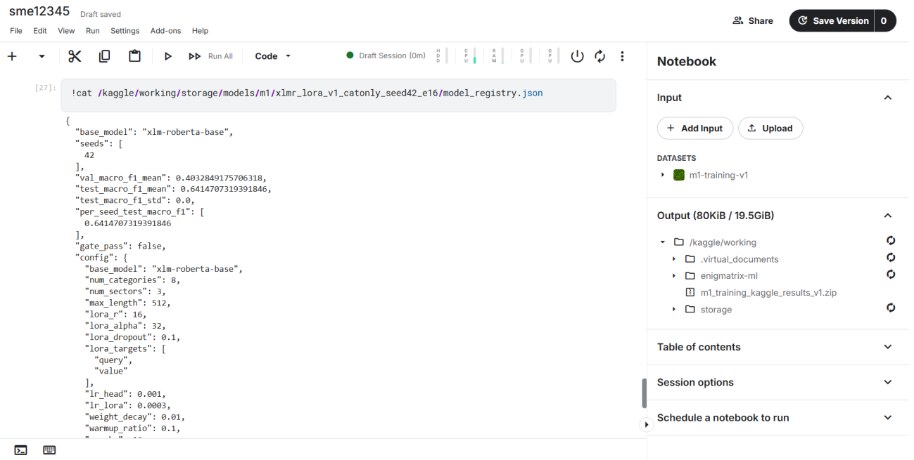

> **Screenshot.** A Kaggle notebook cell printing `model_registry.json` for `xlmr_lora_v1_catonly_seed42_e16`. Recorded values: base_model `xlm-roberta-base`, seeds [42], **val_macro_f1_mean 0.4033**, **test_macro_f1_mean 0.6415**, test_macro_f1_std 0.0, **gate_pass false**; config — num_categories 8, num_sectors 3, max_length 512, lora_r 16, lora_alpha 32, lora_dropout 0.1, lora_targets [query, value], lr_head 0.001, lr_lora 0.0003, weight_decay 0.01, warmup_ratio 0.1. The right panel shows the m1-training-v1 dataset attached and outputs written to /kaggle/working (enigmatrix-ml, m1_training_kaggle_results_v1.zip, storage).


*Figure 21 GPU training session on the free notebook platform*

On Kaggle the frozen gold dataset and the generated Parquet splits are attached as a versioned Kaggle Dataset, which pins the exact data a run consumed; on Colab the repository is cloned or Google Drive is mounted. Both paths write the same model_registry.json, so the two platforms produce directly comparable artefacts.


##### 6.3.1.6 Phase 4 — Watchers, alerts and analytics

- Propagation. m1_propagation_events with a uniqueness constraint on (regulation, source) and
a first_seen_at timestamp; a secondary-source registry covering the IRD, EPF, ETF and eROC portals plus five news RSS feeds; a two-step matcher (exact gazette-number match at confidence 1.0, then difflib similarity ≥ 0.78), unit-tested; portal_watcher and rss_watcher on a two-hourly offset Beat schedule.

- Alerts. m1_alerts with a uniqueness constraint on (regulation, recipient, channel) and sme_id
IS NULL denoting a public broadcast; a pure alert-content builder; SendGrid and Twilio providers that degrade gracefully to a skipped status without API keys; an idempotent alert service; a batched dispatch task; API routes /m1/alerts/public, /m1/alerts and mark-read; and the frontend /alerts page.

- Analytics.
Materialised

views

v_m1_regulation_lag_summary

and v_m1_channel_effectiveness; a Kullback–Leibler confidence-drift helper alerting above 0.15; nightly refresh_lag_analytics.


<!-- PDF page 87 -->


##### 6.3.1.7 Phase 5 — Findings and retraining

The diffusion analysis is preregistered in enigmatrix-ml/research/preregistration.md at α = 0.05 with bootstrap confidence intervals, fixing hypotheses F1–F6 before the data is unblinded. findings_common.py provides tested loaders and bootstrap CI computation with a database-or-synthetic-demo mode, and four notebooks cover lag analysis, secondary diffusion, alert effectiveness by difference-in-differences, and classifier evaluation.

Retraining is recorded in m1_retraining_runs and gated by a pure, unit-tested decision function. Listing 6.4 — Canary promotion decision (`enigmatrix-ml/m1/model/promotion.py`)

```
 1. def decide(prod_f1, candidate_f1, gate: float = 0.92, regression_tol: float = 0.01):
 2.     """Return (action, reason) where action in {promote, rollback, hold}."""
 3.     if candidate_f1 is None:
 4.         return ("hold", "no candidate metric")
 5.     if candidate_f1 < gate:
 6.         return ("rollback", f"candidate {candidate_f1:.3f} below gate {gate:.2f}")
 7.     if prod_f1 is not None and candidate_f1 < prod_f1 - regression_tol:
 8.         return ("rollback",
 9.                 f"candidate {candidate_f1:.3f} regresses vs prod {prod_f1:.3f}")
10.     return ("promote", f"candidate {candidate_f1:.3f} clears gate {gate:.2f}")
11.
```

Keeping this function free of framework and database dependencies is what makes the promotion policy exhaustively testable — the decision that governs whether a model reaches users is the one component that must not be able to fail silently.


<!-- PDF page 88 -->


##### 6.3.1.8 Summarisation and translation

Implemented components: database, model and schema fields for title_en, title_si, title_ta, summary_en,

summary_si

and

summary_ta;

an

administrative

translation

queue at app/api/v1/admin_translations.py; an NLLB-200 helper at scripts/lib/nllb_translate.py; a gazette title scraper at scripts/lib/title_scraper.py; and field-metric support for title and summary fields in the measurement tooling.


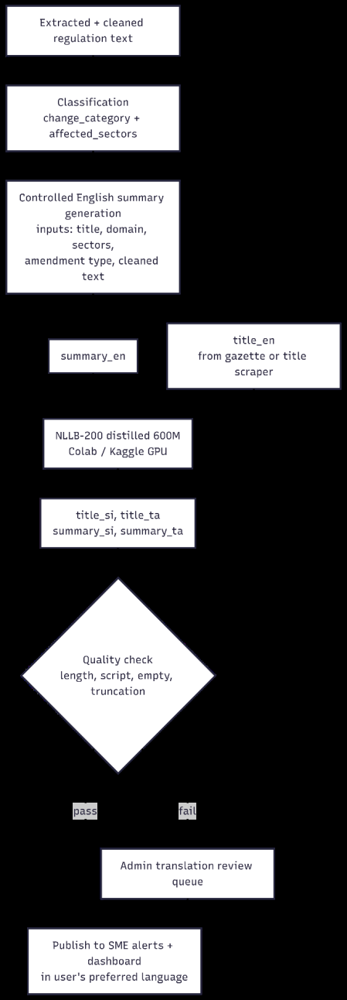

> **What the diagram shows.** The summarisation-and-translation chain. *Extracted + cleaned regulation text* and *Classification (change_category + affected_sectors)* feed *Controlled English summary generation* (inputs: title, domain, sectors, amendment type, cleaned text), producing `summary_en`; `title_en` comes from the gazette or the title scraper. Both go to *NLLB-200 distilled 600M* on a Colab/Kaggle GPU, producing `title_si`, `title_ta`, `summary_si`, `summary_ta`. A *Quality check* diamond tests length, script, empty and truncation: **fail** routes to the *Admin translation review queue*; **pass** publishes to SME alerts and the dashboard in the user's preferred language.


*Figure 22 Summarisation and Sinhala/Tamil translation flow*


<!-- PDF page 89 -->


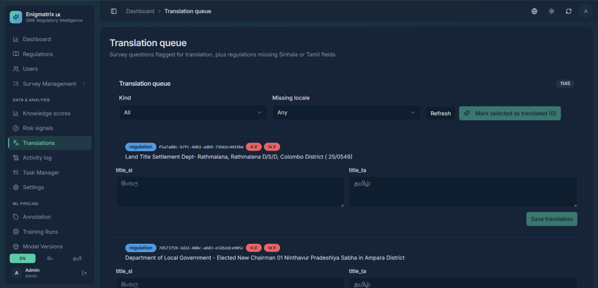

> **Screenshot.** The admin *Translation queue* — "Survey questions flagged for translation, plus regulations missing Sinhala or Tamil fields" — with a queue depth of **1145**. Filters for Kind (All) and Missing locale (Any), plus Refresh and *Mark selected as translated (0)*. Each row shows a regulation UUID with red `si ✗` / `ta ✗` chips, the English title (e.g. *Land Title Settlement Dept- Rathmalana, Rathmalana D/S/D, Colombo District (25/0549)* and *Department of Local Government - Elected New Chairman 01 Ninthavur Pradeshiya Sabha in Ampara District*), and side-by-side `title_si` / `title_ta` editors with a *Save translation* button.


*Figure 23 Administrative translation review queue*

Status statement. The schema, the review queue, the NLLB helper and the title scraper are implemented. The production batch summary generator and the bulk translation backfill are the remaining pieces; Section 7.2.1 gives the commands to complete and evidence them, and this report does not claim large-scale automatic summarisation output that has not been produced.


##### 6.3.1.9 Frontend

The SME-facing surface provides registration with a business profile, a trilingual dashboard, a regulation feed, the alerts page and the survey wizard. The administrative surface provides regulation CRUD and verification, the pipeline console, the dataset registry, the measurement dashboards and drill-downs, the translation queue, user management and the activity log. Localisation is handled by next-intl across English, Sinhala and Tamil with script-appropriate fonts.


<!-- PDF page 90 -->


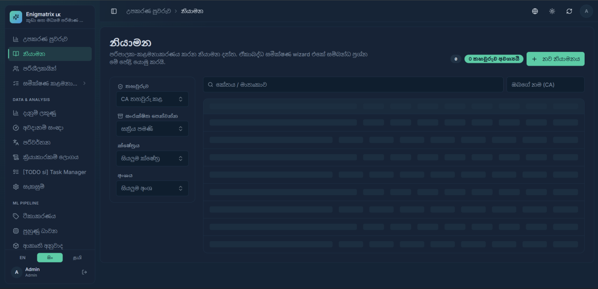

> **Screenshot.** The same admin console rendered entirely in **Sinhala** — sidebar items උපකරණ පුවරුව (dashboard), නියාමන (regulations), පරිශීලකයින් (users), සමීක්ෂණ කළමනා… , දැනුම් ලකුණු, අවදානම් සංඥා, පරිවර්තන, ක්‍රියාකාරකම් ලොගය, [TODO si] Task Manager, සැකසුම්, plus the ML pipeline group. The regulations page shows filter selects (තහවුරු කළ / CA තහවුරු කළ, සතිය පමණි, සියලුම ක්ෂේත්‍ර, සියලුම අංශ), a search box, a *නව නියාමනයක්* button, a *0 තහවුරු කිරීම් අවශ්‍යයි* badge, and a skeleton-loading table. The language switcher at the bottom left shows EN / සිං / தமி with සිං active — evidence of the trilingual UI and of one untranslated string left as a TODO marker.


*Figure 24 Trilingual SME dashboard*


#### 6.3.2 Compliance Guidance Platform

The module was implemented as a FastAPI service exposing endpoints for querying, the survey, fact-checking and internal review tooling. Retrieval was implemented with LangChain and ChromaDB using a multilingual MPNet embedding model, with regulatory text split into overlapping chunks tagged with domain, category and sector metadata. Twenty domain corpora were compiled exclusively from official government sources, each carrying explicit “pending / partially / fully verified” markers so that an unverified figure announces its status inside the retrieved text itself.

The prompt was engineered in several layers to enforce procedural completeness and to suppress the base model's tendency to refuse legitimate questions as “financial advice.” It frames the task as reporting published regulation, permits exactly one refusal sentence for genuinely unanswerable questions, and requires a numbered procedure, a per-step form/office/deadline, an explanation of every named form, and a worked example.

The language model was specialised using QLoRA. Llama-3.1-8B-Instruct was loaded in 4-bit precision with its weights frozen, and low-rank adapters (rank 16) were trained on all seven projection matrices, amounting to roughly 42 million trainable parameters — about 0.52% of the model. Training used a purpose-built instruction corpus of grounded question–answer pairs generated from the domain text and answer keys, split by item group to prevent paraphrase leakage between the training and validation sets. Training ran on an NVIDIA A100 for three epochs (about sixteen minutes); the checkpoint with the lowest validation loss, reached at the second epoch, was retained.


<!-- PDF page 91 -->


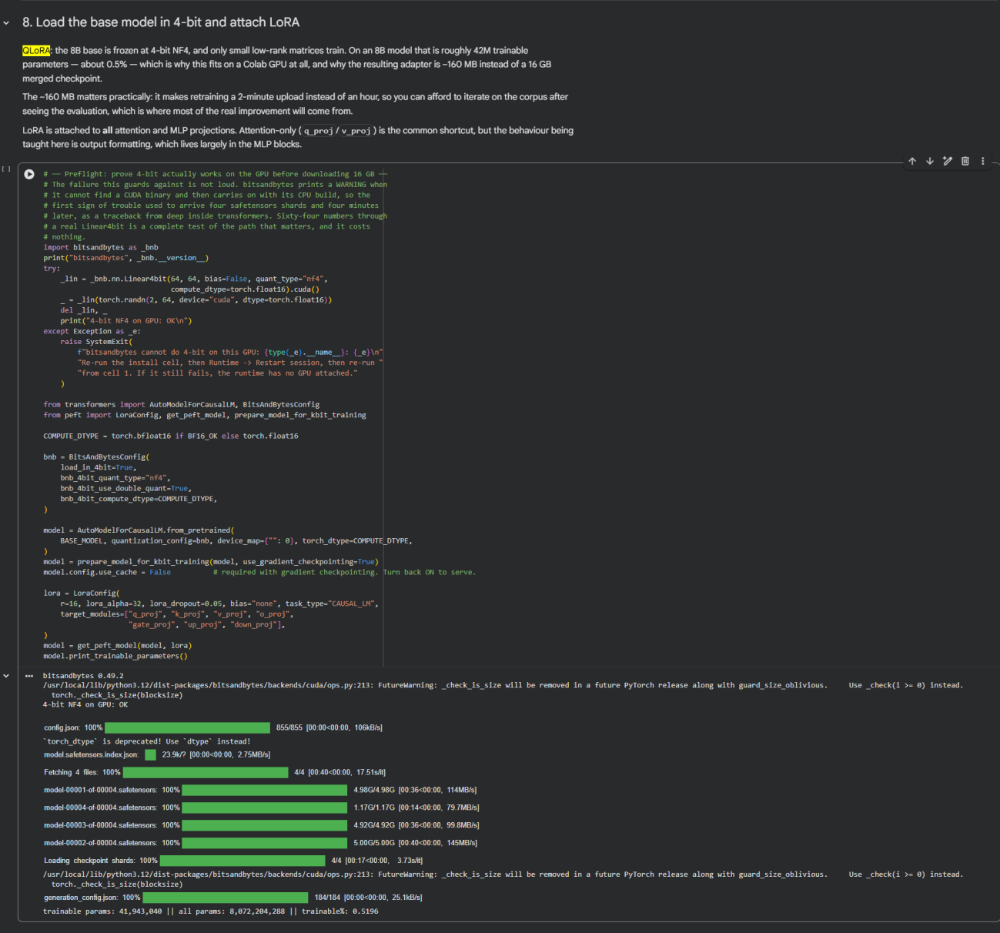

> **Screenshot.** Google Colab, section *8. Load the base model in 4-bit and attach LoRA*. The prose explains QLoRA: the 8B base is frozen at 4-bit NF4 and only small low-rank matrices train — roughly 42M trainable parameters, about 0.5% — which is why it fits on a Colab GPU and why the adapter is ~160 MB rather than a 16 GB merged checkpoint; LoRA is attached to all attention and MLP projections because the behaviour being taught is output formatting, which lives largely in the MLP blocks. The code cell runs a bitsandbytes 4-bit preflight, then builds `BitsAndBytesConfig(load_in_4bit, nf4, double_quant)`, `AutoModelForCausalLM.from_pretrained`, `prepare_model_for_kbit_training(gradient_checkpointing=True)` and `LoraConfig(r=16, lora_alpha=32, lora_dropout=0.05, task_type="CAUSAL_LM", target_modules=[q_proj, k_proj, v_proj, o_proj, gate_proj, up_proj, down_proj])`. Output confirms *4-bit NF4 on GPU: OK*, four safetensors shards downloading, and **trainable params: 41,943,040 || all params: 8,072,204,288 || trainable%: 0.5196**.


*Figure 25 QLoRA fine-tuning of Llama-3.1-8B-Instruct in Google Colab on an A100 GPU. -1*


<!-- PDF page 92 -->


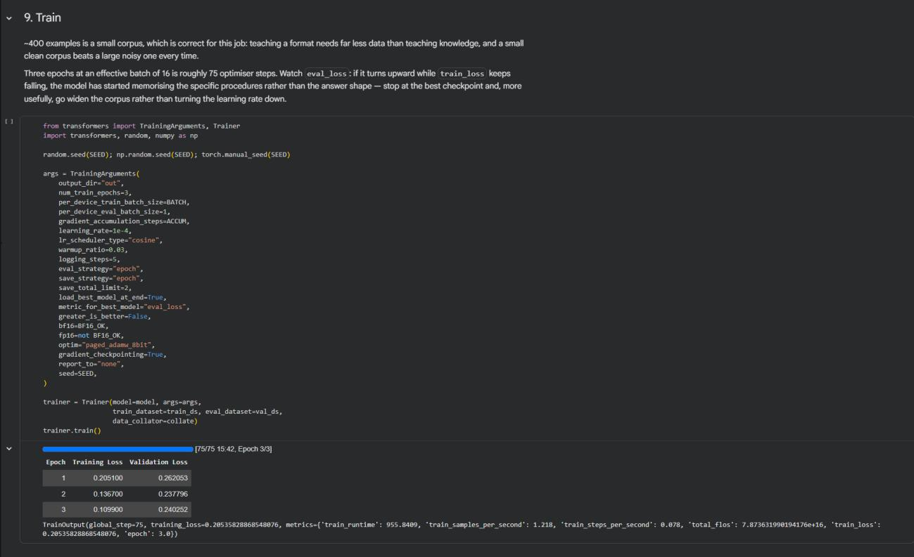

> **Screenshot.** Google Colab, section *9. Train*. The note explains that ~400 examples is correct for teaching a format rather than knowledge, and that three epochs at an effective batch of 16 is roughly 75 optimiser steps. The `TrainingArguments` cell sets num_train_epochs=3, gradient_accumulation_steps=ACCUM, learning_rate=1e-4, cosine scheduler, warmup_ratio=0.03, eval and save per epoch, load_best_model_at_end with metric `eval_loss`, bf16/fp16 toggling, `paged_adamw_8bit` and gradient checkpointing. The results table reports **epoch 1** train 0.2051 / val 0.2621, **epoch 2** 0.1367 / 0.2378, **epoch 3** 0.1099 / 0.2403, finishing at global_step 75, train_runtime ≈ 955.8 s (15:42), 1.218 samples/s.


*Figure 26 QLoRA fine-tuning of Llama-3.1-8B-Instruct in Google Colab on an A100 GPU. - 2*

The Sinhala and Tamil layer was implemented as a mask–split–translate–restore–verify pipeline over NLLB-200. Numbers, percentages, monetary amounts, form codes, URLs and e-mail addresses are replaced with sentinel tokens before translation and restored afterwards; any sentence in which a critical token fails to survive is reverted to English, so the system never ships a translated answer containing a corrupted figure.

The frontend was implemented in Next.js with a chat view, a sector-scoped survey applying client-side double gating, and a research dashboard. The backend was containerised with Docker — the vector store being built into the image — and deployed on Railway behind a health-checked root endpoint.


<!-- PDF page 93 -->


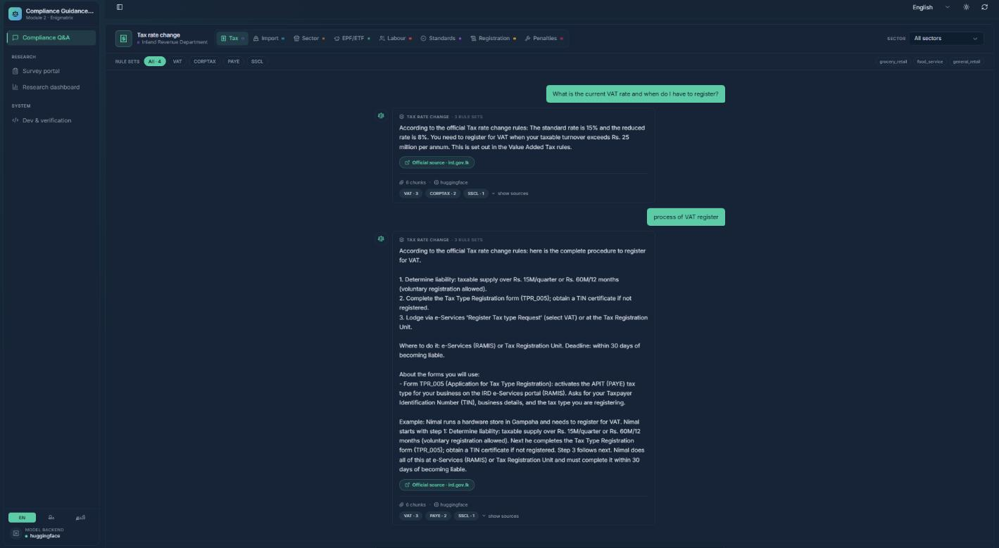

> **Screenshot.** The Module 2 *Compliance Q&A* chat interface. Category tabs run across the top (Tax, Import, Sector, EPF/ETF, Labour, Standards, Registration, Penalties) with a sector selector and rule-set chips (All · 4, VAT, CORPTAX, PAYE, SSCL). The user asks *"What is the current VAT rate and when do I have to register?"* and the assistant answers with the standard rate 15%, reduced rate 8% and the Rs. 25 million taxable-turnover registration threshold, citing *Official source · ird.gov.lk* and showing 6 chunks retrieved from the huggingface backend with source chips VAT · 3, CORPTAX · 2, SSCL · 1. A follow-up, *"process of VAT register"*, returns a numbered procedure — (1) determine liability (taxable supply over Rs. 15M/quarter or Rs. 60M/12 months, voluntary registration allowed), (2) complete the Tax Type Registration form TPR_005 and obtain a TIN certificate, (3) lodge via e-Services 'Register Tax type Request' or at the Tax Registration Unit — plus where to do it (e-Services/RAMIS), a 30-day deadline, a description of form TPR_005, and a worked example ("Nimal runs a hardware store in Gampaha…").


*Figure 27 Chat interface returning a grounded, procedurally complete answer with the source authority*

named.


#### 6.3.3 SME Compliance Risk Prediction

The module was implemented in Python. Data handling uses pandas, modelling uses scikit-learn, figures are produced with matplotlib, and the web service is built on FastAPI with a lightweight SQLite store. Development followed a test-driven approach, and the module is covered by sixty-one automated tests spanning recoding, modelling, statistical procedures, explanation generation and the end-to-end platform workflow.

The recoding component is implemented as a declarative mapping from survey answer text to analytical codes, together with the ordinal encodings and the outcome-label rule. Two implementation details proved consequential. Answer strings are normalised for case, whitespace and Unicode punctuation before lookup, because exports differ in their use of typographic quotation marks and dashes. Separately, the literal answer "None" to the missed-deadline question had to be protected explicitly, since it is treated as a missing-value token by default in pandas; without this protection a valid and meaningful answer would have been silently discarded. Values that fail to map are reported and cause the build to fail rather than being converted to missing data. The statistical procedures were implemented directly rather than taken from a package, both to avoid unnecessary dependencies and to permit verification. DeLong's test was implemented following the efficient formulation of Sun and Xu [19] and cross-checked against an independently written implementation, with agreement to within numerical tolerance. SHAP values are computed in closed form for the linear model, and the implementation was verified against the additivity property that defines the method, holding to machine precision. Significance for the descriptive


<!-- PDF page 94 -->

associations is obtained by permutation rather than by the asymptotic chi-squared distribution, which remains valid with the small contingency cells present at this sample size, and every reported significance value is accompanied by a Cramér's V effect size so that a statistically detectable but negligible association cannot be mistaken for a substantive one.

The positive-unlabelled correction implements the Elkan and Noto estimator [16]. A portion of the labelled positives is withheld, a classifier is trained against the unlabelled pool, and the label frequency is estimated as the mean score assigned to the withheld positives. The implementation was validated by recovering a known label frequency from data constructed with separable classes. Because the correction is a monotonic rescaling, discrimination is preserved by construction, which is precisely why it constitutes a robustness argument.

The analytical pipeline is exposed as a sequence of command-line entry points that build the dataset, fit and compare the model ladder, compute attributions, run the robustness analysis, produce the descriptive results and assess representativeness. Each writes both a console report and a persistent artefact, so that every figure and table in Chapter 7 can be regenerated from the raw survey export.

The deployed platform is organised so that all substantive logic resides in framework-independent modules, with the web layer acting only as a thin transport. The prediction service loads the serialised model and returns a risk estimate with its factor attribution; the explanation layer converts that structure into text in three languages; the matching engine determines which businesses a regulatory change affects; and the persistence layer records registered profiles, published changes and the resulting alerts. This separation allows the same scoring entry point to be reused by an alternative delivery channel, such as a messaging interface, without modification. The interface accepting regulatory change events is defined as an explicit event structure, so that events published by the Regulatory Change Awareness module can be consumed without further adaptation.


<!-- PDF page 95 -->


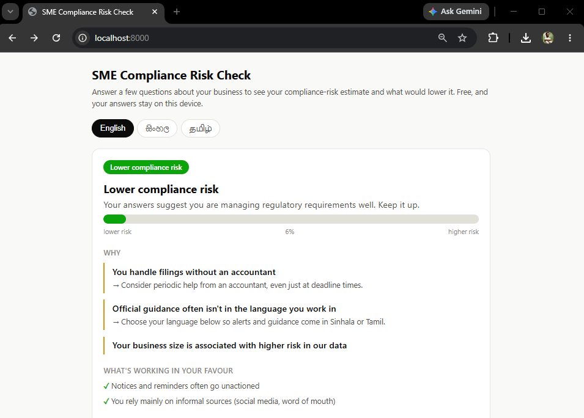

> **Screenshot.** The Module 3 *SME Compliance Risk Check* page running at localhost:8000, with English / සිංහල / தமிழ் language toggles. The verdict badge reads **Lower compliance risk** with the message "Your answers suggest you are managing regulatory requirements well. Keep it up." and a risk bar at **6%** between *lower risk* and *higher risk*. A **WHY** section lists three signed factors with actions — *You handle filings without an accountant* → consider periodic help from an accountant; *Official guidance often isn't in the language you work in* → choose your language so alerts and guidance come in Sinhala or Tamil; *Your business size is associated with higher risk in our data*. A **WHAT'S WORKING IN YOUR FAVOUR** section ticks off *Notices and reminders often go unactioned* and *You rely mainly on informal sources (social media, word of mouth)*.


*Figure 28 Dashboard of scoring the SME*


#### 6.3.4 Regulatory Misinformation Spread

The module was written mostly in Python, the development environment was Google Colab. The dataset was preprocessed, prepared, and the model was developed, evaluated, and orchestrated using Python, while the manual experimentation and usage of GPUs were carried out using the Google Colab platform notebook environment.


<!-- PDF page 96 -->


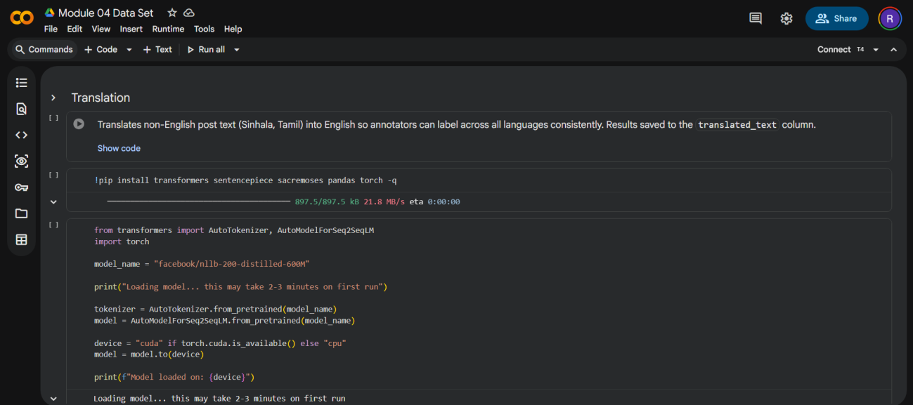

> **Screenshot.** Google Colab notebook *Module 04 Data Set*, the **Translation** section: "Translates non-English post text (Sinhala, Tamil) into English so annotators can label across all languages consistently. Results saved to the `translated_text` column." The cell installs transformers, sentencepiece, sacremoses, pandas and torch, then loads `facebook/nllb-200-distilled-600M` via `AutoTokenizer` / `AutoModelForSeq2SeqLM` and moves it to CUDA if available.


*Figure 29 Google Colab notebook used for model development, configured with T4 GPU.*

The first 200 posts were independently annotated by two annotators using Label Studio and the same examples were then annotated again by both annotators—after which the agreement was computed. For the other 800 posts, Google Sheets was used due to the fact that the annotation schema was already stabilised and the larger portion of the data could be annotated in a lightweight spreadsheet-based workflow.


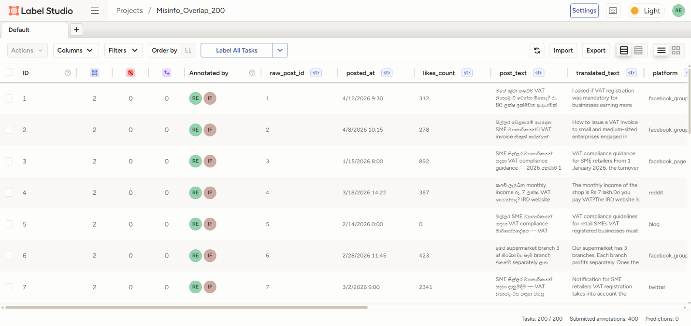

> **Screenshot.** Label Studio project *Misinfo_Overlap_200* in table view (light theme), showing the double-annotated corpus. Columns include ID, annotation counts, *Annotated by* (avatars RE and IF on every row), raw_post_id, posted_at, likes_count, post_text (Sinhala originals), translated_text (English) and platform (facebook_group, facebook_page, reddit, blog, twitter). Sample rows cover VAT-registration mandatory claims, how to issue a VAT invoice to SMEs, 2026 VAT compliance guidance, a monthly-income Rs. 7 lakh VAT question, retail VAT guidelines, a supermarket-branch profit question, and a VAT registration notification. The footer reads **Tasks: 200 / 200 · Submitted annotations: 400 · Predictions: 0**.


*Figure 30 Annotation interface – Label Studio*


<!-- PDF page 97 -->


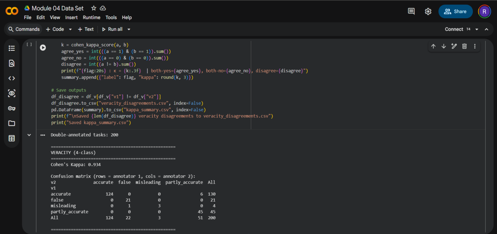

> **Screenshot.** A Colab cell computing inter-annotator agreement with `cohen_kappa_score`, saving `veracity_disagreements.csv` and `kappa_summary.csv`. Output: *Double-annotated tasks: 200*; **VERACITY (4-class) Cohen's Kappa: 0.934**; and a confusion matrix of annotator 1 (rows) against annotator 2 (columns) — accurate 124 with 6 crossing to partly_accurate (row total 130); false 21 (total 21); misleading 3 with 1 from false (total 4); partly_accurate 45 (total 45); column totals 124 / 22 / 3 / 51 = 200.


*Figure 31 Inter-annotator agreement on the 200-post double-annotated subset*


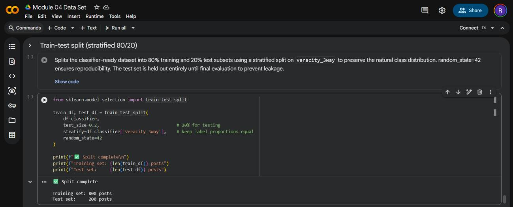

> **Screenshot.** A Colab cell performing the *Train-test split (stratified 80/20)*: `train_test_split(df_classifier, test_size=0.2, stratify=df_classifier['veracity_3way'], random_state=42)` — stratified to preserve the natural class distribution, with the test set held out entirely until final evaluation to prevent leakage. Output: **Training set: 800 posts, Test set: 200 posts**.


*Figure 32 Train–test split (800/200) with stratified label distribution*

XLM-RoBERTa was used for the multilingual transformer approach. From the uploaded module reference, the fine tuning was done on 800 training posts, and evaluated on 200 test posts using class weighting to balance out class imbalance and main comparison metric being macro-F1. This was a sensible implementation decision as the corpus contained English, Sinhala, Tamil, and code-mixed text, which are all covered in the multilingual scope of XLM-R.


<!-- PDF page 98 -->


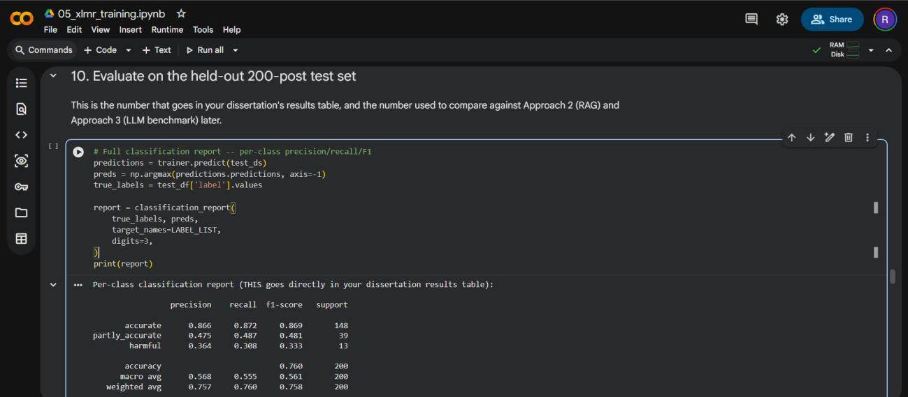

> **Screenshot.** Colab notebook `05_xlmr_training.ipynb`, section *10. Evaluate on the held-out 200-post test set*. The per-class classification report reads: **accurate** precision 0.866 / recall 0.872 / F1 0.869 (support 148); **partly_accurate** 0.475 / 0.487 / 0.481 (39); **harmful** 0.364 / 0.308 / 0.333 (13). Overall **accuracy 0.760**, **macro avg F1 0.561** (precision 0.568, recall 0.555), weighted avg F1 0.758 — all on n = 200.


*Figure 33 XLM-RoBERTa fine-tuning in Colab – class-weighted training, macro-F1 evaluation, and confusion*

matrix on the 200-post test set.

Retrieval-based implementation involved using Sentence Transformers for embeddings, ChromaDB for vector storage in the final prediction stage. The RAG design was chosen due to its superior performance over other designs when tested on the held-out test set, and because it was more appropriate for this domain to access retrieved regulatory information rather than to directly prompt the relevant facts.


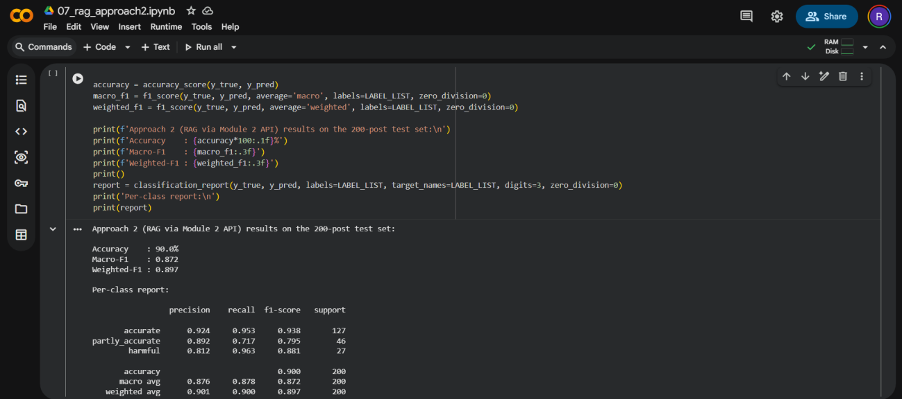

> **Screenshot.** Colab notebook `07_rag_approach2.ipynb` evaluating Approach 2 (RAG via the Module 2 API) on the same 200-post test set. Headline metrics: **Accuracy 90.0%**, **Macro-F1 0.872**, **Weighted-F1 0.897**. Per class: accurate 0.924 / 0.953 / 0.938 (127); partly_accurate 0.892 / 0.717 / 0.795 (46); harmful 0.812 / 0.963 / 0.881 (27).


*Figure 34 RAG verifier in Colab – class-weighted training, macro-F1 evaluation, and confusion matrix on the*

200-post test set.


<!-- PDF page 99 -->


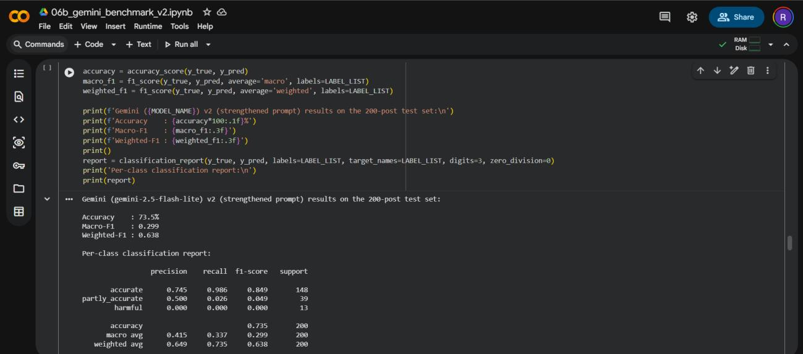

> **Screenshot.** Colab notebook `06b_gemini_benchmark_v2.ipynb` evaluating Gemini (`gemini-2.5-flash-lite`) v2 with a strengthened prompt on the 200-post test set. Headline metrics: **Accuracy 73.5%**, **Macro-F1 0.299**, **Weighted-F1 0.638**. Per class: accurate 0.745 / 0.986 / 0.849 (148); partly_accurate 0.500 / 0.026 / 0.049 (39); harmful 0.000 / 0.000 / 0.000 (13) — the model never recovers the harmful class.


*Figure 35 Gemini Benchmark verifier in Colab – class-weighted training, macro-F1 evaluation, and confusion*

matrix on the 200-post test set.

Care has been taken in handling the data sets to avoid leakage. All the 1,000-post corpus underwent cleaning and annotation, followed by its division (without overlap) into 800 training posts and 200 testing posts. All three approaches were made with the same split to make for a fair comparison. The accuracy, macro-F1, weighted-F1, and classification on per-class reports were used for the evaluation, and the RAG approach was the best performing model overall.


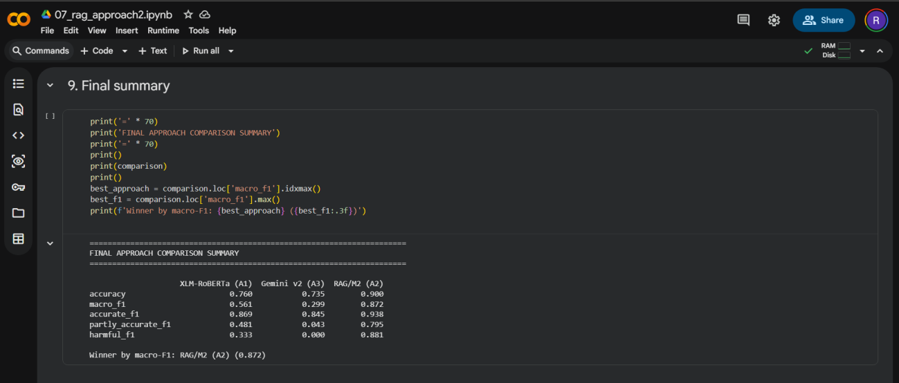

> **Screenshot.** Colab notebook `07_rag_approach2.ipynb`, section *9. Final summary*, printing the head-to-head comparison table. Columns XLM-RoBERTa (A1) / Gemini v2 (A3) / RAG-M2 (A2): accuracy 0.760 / 0.735 / **0.900**; macro_f1 0.561 / 0.299 / **0.872**; accurate_f1 0.869 / 0.845 / **0.938**; partly_accurate_f1 0.481 / 0.043 / **0.795**; harmful_f1 0.333 / 0.000 / **0.881**. Final line: *Winner by macro-F1: RAG/M2 (A2) (0.872)*.


*Figure 36 Comparative evaluation of the three classifier approaches on the same 200-post test set.*


<!-- PDF page 100 -->


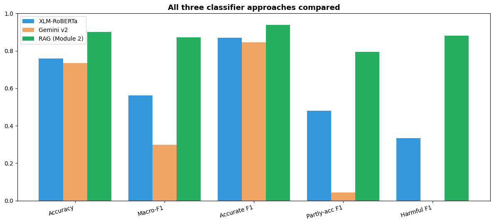

> **Chart.** A grouped bar chart, *All three classifier approaches compared*, y-axis 0.0–1.0, with five metric groups on the x-axis — Accuracy, Macro-F1, Accurate F1, Partly-acc F1, Harmful F1 — and three series: XLM-RoBERTa (blue), Gemini v2 (orange) and RAG (Module 2) (green). RAG leads every group; Gemini v2 collapses to near zero on Partly-acc F1 and exactly zero on Harmful F1, where its bar is absent.


*Figure 37 Bar chart comparing all the three approaches*


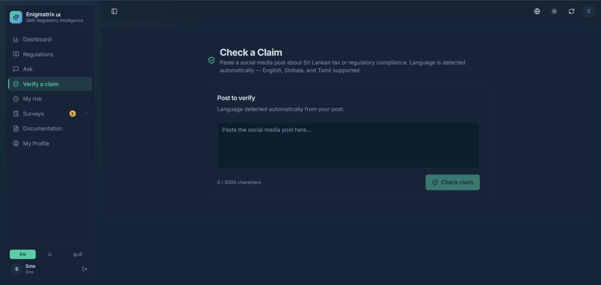

> **Screenshot.** The SME-facing *Check a Claim* screen: "Paste a social media post about Sri Lankan tax or regulatory compliance. Language is detected automatically — English, Sinhala, and Tamil supported." A *Post to verify* textarea with a 0 / 5000 character counter and a *Check claim* button. The left sidebar shows Dashboard, Regulations, Ask, Verify a claim (active), My risk, Surveys (badge 5), Documentation and My Profile, with an EN / සිං / தமிழ் switcher.


*Figure 38 Frontend claim-verification interface*


<!-- PDF page 101 -->


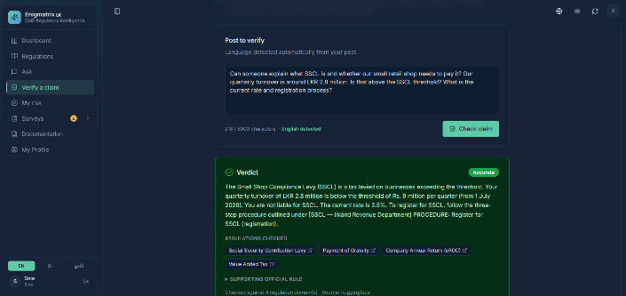

> **Screenshot.** A second verdict screen, this time **Accurate** (green). The English question asks what SSCL is, whether a small retail shop with roughly LKR 2.8 million quarterly turnover must pay it, and what the current rate and registration process are. The verdict explains that the Social Security Contribution Levy is levied on businesses exceeding the threshold, that LKR 2.8 million per quarter is below the Rs. 9 million per quarter threshold (from 1 July 2026) so the business is not liable, that the current rate is 2.5%, and it points to the three-step SSCL registration procedure at the Inland Revenue Department. *REGULATIONS CHECKED* lists Social Security Contribution Levy, Payment of Gratuity, Company Annual Return (eROC) and Value Added Tax.


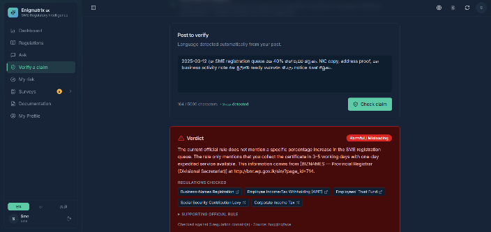

> **Screenshot.** A verdict screen returning **Harmful / Misleading** (red). The submitted Sinhala post claims a 40% increase in the SME registration queue from 2026-03-12 requiring NIC copy and address proof. The verdict text explains that the official rule mentions no specific percentage increase — it states only that the certificate is collected in 3–5 working days, with a one-day expedited service available — and attributes the information to the Provincial Registrar (Divisional Secretariat) at bnr.wp.gov.lk. A *REGULATIONS CHECKED* strip lists Business-Names Registration, Employee Income-Tax Withholding (APIT), Employees' Trust Fund, Social Security Contribution Levy and Corporate Income Tax, above a collapsible *SUPPORTING OFFICIAL RULE* section.


*Figure 39 Verdict screen showing veracity classification, explanation, and cited regulatory evidence from the knowledge base.*


<!-- PDF page 102 -->


## Chapter 7 - Evaluation


### 7.1 Metrics Used

This section defines every metric used in the dissertation. Module 1 evaluates three different kinds of object - a classifier, an extraction pipeline and a diffusion process - and each requires its own measure. The remaining modules add two more. Module 2 evaluates generated guidance, where the unit of assessment is not a class label but an answer that either possesses or lacks a set of required properties. Module 3 evaluates a ranked risk estimate together with a hypothesis about which variables carry the signal, which calls for threshold-free discrimination, a paired significance test and an attribution measure. Module 4 evaluates a claim classifier and, separately, the reliability of the corpus it was trained on.


#### 7.1.1 Accuracy

Accuracy is the proportion of predictions that are correct.

Accuracy = number_of_correct_predictions / total_predictions

Accuracy is reported for completeness but is not the primary metric for classification in this project. The gold dataset is severely imbalanced: SECTOR_SPECIFIC accounts for 83.9 % of records, so a degenerate model that always predicts that class would score approximately 0.87 accuracy while being useless. Accuracy is meaningful here only for balanced binary fields such as is_sme_relevant, and for stage-progression checks.

It is not used at all for the other two modelling modules, for different reasons. Module 3’s outcome is close to balanced at 46 per cent, so imbalance is not the objection; the objection is that a single accuracy figure fixes an operating threshold that the deployment does not fix, and discrimination is therefore reported by the threshold-free measures of section7.1.11. Module 2’s output is not a class at all, so accuracy is undefined for it; its answers are scored on the property set of section7.1.16.


#### 7.1.2 Precision

Precision is the proportion of predicted positives that are correct. For category i:

Precision_i = TP_i / (TP_i + FP_i)

Precision matters most for alerting. A false positive is an alert sent to an SME for a regulation that does not affect them; a system with low precision trains its users to ignore it.


#### 7.1.3 Recall

Recall is the proportion of actual positives that are found.


<!-- PDF page 103 -->

Recall_i = TP_i / (TP_i + FN_i)

Recall matters most for SME relevance. A false negative is a binding regulation that never reaches the business it binds — the exact failure this project exists to prevent. For that reason is_sme_relevant recall below 0.85 is treated as a blocking result regardless of the accuracy figure.


#### 7.1.4 F1-Score

F1 is the harmonic mean of precision and recall, and is the appropriate single summary when both error types carry cost.

F1_i = 2 * Precision_i * Recall_i / (Precision_i + Recall_i)

Macro-F1 averages F1 over classes with equal weight and is the primary metric for category classification in this project:

Macro-F1 = (1 / K) * sum_i F1_i

Macro-F1 is chosen precisely because it refuses to be flattered by the majority class: a model that ignores the seven minority categories cannot achieve a high macro-F1 no matter how well it predicts SECTOR_SPECIFIC. The project gate for RQ1 is macro-F1 ≥ 0.92 with no language slice more than 8 percentage points below the overall score.

For multi-label sector relevance, each sector is treated as an independent binary problem:

Module 4 reports per-class precision, recall and F1 on its four-way schema for the same reason: the four classes are unevenly represented, and a single aggregate would hide whichever class the classifier handles worst. Because the classes are ordered in severity, per-class recall on the misleading and false categories is the operationally decisive figure.


#### 7.1.5 Cohen's Kappa

Cohen's kappa measures agreement between two annotators after discounting agreement expected by chance:

kappa = (p_o - p_e) / (1 - p_e)

where p_o is observed agreement and p_e is the agreement expected from the marginal distributions. Kappa rather than raw agreement is the headline reliability figure because raw agreement is inflated when one class dominates — which is exactly the case here. Sector labels are multi-label, so kappa is computed per sector and averaged, with a set-level exact agreement


| Micro-F1 = 2 * sum_s TP_s / (2 * sum_s TP_s + sum_s FP_s + sum_s FN_s) |
|---|
| Macro-F1 = mean_s F1_s |


<!-- PDF page 104 -->

reported alongside. Interpretation follows the conventional bands: above 0.80 near-perfect, 0.61– 0.80 substantial.

Cohen’s kappa is defined for exactly two annotators and requires complete overlap, neither of which holds for the Module 4 corpus, where three annotators contributed and only a subset was double-annotated. Krippendorff’s alpha generalises the same idea and is reported alongside it: alpha = 1 - (D_o / D_e)

where D_o is observed disagreement and D_e the disagreement expected by chance. Alpha admits any number of annotators, tolerates missing values, and is defined for nominal, ordinal and interval data, so a single coefficient covers both corpora. Both statistics are computed on the double-annotated subset, and in both modules full-scale annotation proceeded only after the coefficient cleared the threshold fixed in advance — the reliability of the dataset is therefore a gate on the work, not a description of it after the fact.


#### 7.1.6 Field, record and stage accuracy

Extraction quality is scored against a sealed baseline at three granularities:

where s(r,f) is the comparator score in [0,1] for field f of record r, w(f) is the field weight and V(r) is the set of fields with a valid gold value. Weights are 3.0 for hard identifiers, 2.5 for core NLP outputs, 2.0 for structural and list fields, 1.0 for bulk text, 0.5 for timestamps and 0.0 for confidence fields. Releases are gated on the weighted cumulative score, with unweighted micro and macro published alongside as an honesty check.


#### 7.1.7 Character and Word Error Rate

OCR-sensitive text fields are scored by edit distance rather than exact match:


| field_accuracy(f) = mean( s(r,f) for r where f in V(r) ) |
|---|
| record_score(r) = sum_{f in V(r)} s(r,f) / \|V(r)\| |
| record_score_w(r) = sum_{f in V(r)} w(f) * s(r,f) / sum_{f in V(r)} w(f) |
| stage_only(S) = mean( s(r,f) for r with gold_status >= S, f in stage_fields(S) ) |
| cumulative(S) = mean( s(r,f) for r with gold_status >= S, f in cumulative_fields(S) ) |
| progression(S) = \|{r : pred_status >= S and gold_status >= S}\| / \|{r : gold_status >= S}\| |
| overall_micro = sum_r sum_f s(r,f) / sum_r \|V(r)\| |
| overall_macro = mean_r record_score(r) |


| CER = edit_distance(chars_pred, chars_gold) / len(chars_gold) |
|---|
| WER = edit_distance(words_pred, words_gold) / len(words_gold) |
| raw_text_score = clamp(1 - CER, 0, 1) |


<!-- PDF page 105 -->

CER and WER are computed per language. A single averaged text score would allow a weak script to hide inside a strong one, which is precisely the failure mode RQ2 exists to detect.


#### 7.1.8 Calibration: ECE and Brier score

Confidence is never mixed into accuracy. It is evaluated separately:

where B_b is confidence bin b, using bins of width 0.1. Calibration matters operationally because the 0.55 threshold decides what fraction of the corpus reaches a human reviewer.

Calibration is reported for Module 3’s risk model for a related but distinct reason. The positive-unlabelled correction of section7.1.15 shifts mean predicted risk materially while leaving the hypothesis test unchanged, so a model may be simultaneously well ordered and badly calibrated. Since the ordering is what the hypothesis concerns and the calibration is what any deployed decision threshold depends on, the two are reported separately and neither is allowed to stand in for the other.


#### 7.1.9 Timeliness and diffusion metrics

Lag distributions are reported as median and interquartile range rather than mean and standard deviation, because diffusion lag is strongly right-skewed.


#### 7.1.10 Model drift

The confidence distribution of production predictions is compared against the reference distribution using Kullback–Leibler divergence; a value above 0.15 triggers retraining.


#### 7.1.11 Ranked discrimination: ROC-AUC and PR-AUC

The area under the receiver operating characteristic curve is the probability that a randomly chosen positive case is ranked above a randomly chosen negative one. It summarises a model’s ordering across every possible threshold rather than at one chosen threshold, which is the property Module


| Brier = mean( (predicted_probability - actual_outcome)^2 ) |
|---|
| ECE = sum_b (\|B_b\| / N) * \| accuracy(B_b) - confidence(B_b) \| |


| extraction_latency = extracted_at - source_discovered_at |
|---|
| classification_latency = classified_at - preprocessed_at |
| alert_latency = alert_created_at - gazette_published_at |
| diffusion_lag(channel) = first_seen_at(channel) - gazette_published_at |
| awareness_lag = sme_first_awareness_at - gazette_published_at |
| alert_precision = relevant_alerts_sent / total_alerts_sent |
| alert_recall = relevant_alerts_sent / total_relevant_regulations_for_sme |


<!-- PDF page 106 -->

3 needs: the deployed system presents a risk band and a factor list, and does not commit to a single cut-off.

AUC = P( score(x_positive) > score(x_negative) )

PR-AUC = area under the precision-recall curve

An AUC of 0.5 is chance and 1.0 is perfect separation. PR-AUC is reported alongside because it is sensitive to performance on the positive class in a way ROC-AUC is not, and because their chance levels differ: ROC-AUC is 0.5 under chance regardless of the base rate, whereas PR-AUC under chance equals the base rate itself — 0.46 for this sample. Quoting a PR-AUC without that reference point would overstate it.

Both are computed on cross-validated out-of-fold predictions, so no observation contributes to fitting the model that scores it. With a sample of 300 this is not a refinement but a requirement; an in-sample AUC on a dataset this size would be optimistic by an unknown margin.


#### 7.1.12 Comparing correlated ROC curves: the DeLong test

The central comparison in Module 3 is between two models scored on the same businesses. Their ROC curves are therefore correlated, and an unpaired comparison of two AUCs would be invalid — it would treat shared variance as independent evidence and overstate significance. DeLong’s test estimates the covariance of the two AUC statistics from the same sample and forms:

z = (AUC_2 - AUC_1) / sqrt( Var(AUC_1) + Var(AUC_2) - 2 * Cov(AUC_1, AUC_2) ) The statistic is referred to the standard normal distribution. Reported for each comparison are the difference in AUC, its 95 per cent confidence interval, the z statistic and the two-sided p value. The pre-registered decision rule for the module’s hypothesis is a gain of at least 0.03 with p below 0.05, both fixed before the analysis was run. The implementation uses the fast Sun and Xu formulation of the same estimator, which is algorithmically more efficient but statistically identical.


#### 7.1.13 Association strength: Cramér’s V

Before any model is fitted, the descriptive layer asks whether the claimed relationships are present in the raw cross-tabulations at all. Cramér’s V measures the strength of association between two categorical variables, normalising the chi-square statistic so that values are comparable across tables of different size:

V = sqrt( chi2 / ( n * min(rows - 1, cols - 1) ) )

V ranges from 0 to 1. It is preferred to raw chi-square because chi-square grows with sample size and with table dimensions, so two chi-square values are not comparable across variables with different numbers of levels — which is exactly the comparison being made when ranking


<!-- PDF page 107 -->

predictors by effect size. Each V is reported with its p value. This layer is computed independently of any model, so that the pattern is shown to exist in the data rather than only in a fitted object.


#### 7.1.14 Attribution: Shapley values and block share

Feature attribution answers a different question from performance: not how well the model discriminates, but which variables carry the signal. For a linear model the Shapley value has a closed form, so the attribution is exact rather than sampled:

phi_i(x) = beta_i * ( x_i - E[x_i] ) (in log-odds)

block_share(B) = sum_{i in B} |phi_i| / sum_{all i} |phi_i|

where beta_i is the fitted coefficient and E[x_i] the training-set mean of feature i. Contributions on one-hot columns are summed back to their source feature, so an attribution is reported per variable rather than per encoded column. Because the quantity is analytic, it is reproducible to the last decimal and costs nothing to compute at request time — the same numbers shown to an SME in the deployed explanation are the numbers reported here.

Block share aggregates attribution over a group of features and is what makes the module’s hypothesis quantitative rather than rhetorical: it states what proportion of total attributed importance the information-barrier block carries against the demographic block. The pre-registered condition accompanying it requires at least two information features among the five highest-ranked.


#### 7.1.15 Positive-unlabelled correction and label frequency

Module 3’s outcome label is asymmetric by construction, and every result depends on how that asymmetry is treated. A positive is a confirmed self-reported compliance failure. A negative is only the absence of a reported failure — the respondent is unlabelled, not confirmed compliant. Treating unlabelled cases as true negatives, which any standard classifier does implicitly, biases the estimate by an unknown amount.

The robustness analysis therefore re-estimates the comparison under a positive-unlabelled correction, which models the observed labelling as a corruption of the true outcome through a label frequency:

c = P( labelled = 1 | y = 1 )

P( y = 1 | x ) = P( labelled = 1 | x ) / c

The reported quantity is whether the improvement attributed to the information block survives the correction, not the corrected AUC itself. The estimated label frequency c is reported as directional evidence only: the estimator is known to be unreliable at moderate levels of discrimination, and


<!-- PDF page 108 -->

the figure must not be read as a population prevalence of undisclosed non-compliance. Stating that bound explicitly is part of the metric’s definition, not a caveat attached to it afterwards.


#### 7.1.16 Generated-answer quality

A generated compliance answer cannot be scored as correct or incorrect, because it is not a class label. It is scored instead on whether it possesses the properties that make procedural guidance usable and safe. An automated harness evaluates each answer on a held-out split against the following columns.


*Table 7.1 — Answer-quality columns for generated guidance*

Two of these columns exist specifically to close loopholes in the others. Refusing the answerable is reported because a model can raise its correct-refusal rate simply by refusing more often, and the two figures must move independently for the gain to be real. Median answer length is reported as a diagnostic rather than scored, because length falling while content recall rises indicates a


| Column | Definition | Why it is scored |
|---|---|---|
| Cites the source | Answer names the issuing authority or official document | An uncited compliance figure cannot be checked by the reader |
| Numbered procedure | Steps presented in explicit order | Procedural knowledge is the gap the module addresses |
| Worked example | At least one concrete instantiation is given | Abstract rules are the form SMEs already fail to act on |
| Explains named forms | Every form code mentioned is explained in plain language | A form code alone transfers no procedural knowledge |
| Grounded figures only | Every rate, threshold and deadline appears in the retrieved context | The principal hallucination risk in a compliance setting |
| Refuses the unanswerable | Declines when retrieval returns insufficient context | Silence is safer than invention |
| Refuses the answerable (lower is better) | Wrongly declines a question the context supports | Guards against improvement obtained by refusing more often |
| Content recall | Proportion of reference content reproduced | Completeness, independent of the properties above |
| Median answer length | Characters per answer | Diagnostic, not a score — see below |


<!-- PDF page 109 -->

denser answer, whereas both falling together would indicate truncation — the same numbers admit opposite readings without it.

Attribution follows a three-configuration design rather than a before-and-after comparison. The stock base model is evaluated under identical prompt and identical retrieval as a single-variable control, so that the difference between it and the adapted model is attributable to the adaptation alone. A direct comparison against the previously deployed model would move two variables at once and support no such attribution.

The bound on these measures is stated with them: the graders are automated and pattern-based, so they detect the presence of a required element rather than adjudicating its correctness. They measure faithfulness to the verified corpus, not independent real-world truth.


#### 7.1.17 Figure survival in translation

Translation of compliance text has a failure mode that no general translation-quality score captures. A fluent translation that alters a rate, a threshold, a deadline or a form code produces confidently wrong guidance, and is worse than no translation at all. Figure survival measures it directly: survival(L) = preserved_protected_spans(L) / total_protected_spans(L)

A protected span is any currency amount, percentage, form code, bare number, date, URL or email address identified in the source. Spans are classed critical or cosmetic, and survival is reported per language, because a single averaged figure would let a strong script conceal a weak one — the same reasoning that governs per-language CER in section7.1.7.

Survival is never reported alone. A system can reach a survival of 1.0 trivially by translating nothing, so it is published jointly with translation coverage — the proportion of sentences actually delivered in the target language. The pair is the measure; either number in isolation is uninformative.


<!-- PDF page 110 -->


### 7.2 Module-wise Evaluations


#### 7.2.1 Regulatory Change Awareness Gap


##### 7.2.1.1 Experimental setup

Two environments were used, and the distinction is material to how the results should be read. The local workstation has no CUDA device and was used only for pipeline execution, extraction and measurement runs, baseline training and a single-epoch smoke test. No model-quality claim rests on the local machine. All transformer training and evaluation is executed on free GPU notebook platforms.


*Table 7.2 — Experimental environments*


##### 7.2.1.2 Dataset composition


*Table 7.3 — Change category distribution in the **v1** gold dataset (n = 800). ⟦v2⟧ Superseded for all model claims: the reporting dataset is V6 at n = 1,110 with a fixed 777 / 166 / 167 split. The v1 800-row set with its 560 / 120 / 120 split is the legacy L1 branch, retained for provenance only.*


|  | Item |  |  | Local workstation |  |  | Colab / Kaggle GPU |  |
|---|---|---|---|---|---|---|---|---|
| CPU |  |  | 11th Gen Intel(R) Core(TM) i5- 1135G7 @ 2.40GHz |  |  | Provided by platform |  |  |
| Logical cores |  |  | 8 logical processors, 4 physical cores |  |  | Provided by platform |  |  |
| RAM |  |  | 19.70 GB |  |  | ~13 GB (Colab) / ~29 GB (Kaggle) |  |  |
| GPU |  |  | None — torch.cuda.is_available() is False |  |  | 2 x NVIDIA Tesla T4, 15,360 MiB each |  |  |
| Operating system |  |  | Microsoft Windows 11 Pro, version 10.0.26100 |  |  | Linux 6.12.90+ x86_64, glibc 2.35 |  |  |
| Python / PyTorch / Transformers |  |  | Python version not captured; PyTorch 2.12.0+cpu; Transformers 4.57.6 |  |  | Python ;PyTorch 2.10.0+cu128; Transformers 5.0.0 |  |  |
| Role |  |  | Extraction, preprocessing, measurement, TF-IDF baselines, CPU smoke test |  |  | XLM-R + LoRA training, slice evaluation, ONNX export, NLLB backfill |  |  |
| Runtime per seed |  |  | not applicable |  |  | GPU runs completed; the frozen primary is a CPU-fitted scikit-learn pipeline [v2] |  |  |


|  | Category |  |  | Count |  |  | Share |  |
|---|---|---|---|---|---|---|---|---|
| SECTOR_SPECIFIC |  |  | 671 |  |  | 83.9 % |  |  |
| TAX_RATE_CHANGE |  |  | 56 |  |  | 7.0 % |  |  |
| IMPORT_EXPORT |  |  | 32 |  |  | 4.0 % |  |  |
| LABOUR_LAW |  |  | 27 |  |  | 3.4 % |  |  |
| BUSINESS_REGISTRATION |  |  | 5 |  |  | 0.6 % |  |  |
| PENALTY_ENFORCEMENT |  |  | 5 |  |  | 0.6 % |  |  |


<!-- PDF page 111 -->


*Table 7.4 — Train / validation / test split (deterministic key split, 70/15/15)*

Two properties govern the interpretation of every classification result that follows. First, the class imbalance described in Section 7.1.1. Second, the split is deterministic, not temporal: the gold CSV carries no usable gazette_published_date, so the generated Parquet files contain a null date for every row. The split is reproducible and leak-free with respect to regulation_key, but it does not simulate deployment on future documents. Section 7.2.1.9 gives the procedure to backfill dates and regenerate a temporal split; until that is done, this report does not describe the split as temporal.


##### 7.2.1.3 Annotation reliability results

Source artefact: research/data/labeling/iaa_report_v1_800.json.


*Table 7.5 — Overall inter-annotator agreement*


|  | Category |  |  | Count |  |  | Share |  |
|---|---|---|---|---|---|---|---|---|
| PRODUCT_STANDARD |  |  | 4 |  |  | 0.5 % |  |  |
| EPF_ETF_CHANGE |  |  | 0 |  |  | 0.0 % |  |  |
| Total |  |  | 800 |  |  | 100 % |  |  |


|  | Split |  |  | Rows |  |  | of which SECTOR_SPECIFIC |  |
|---|---|---|---|---|---|---|---|---|
| Train |  |  | 560 |  |  | 462 |  |  |
| Validation |  |  | 120 |  |  | 104 |  |  |
| Test |  |  | 120 |  |  | 105 |  |  |
| Total |  |  | 800 |  |  | 671 |  |  |


|  | Measure |  |  | Value |  |
|---|---|---|---|---|---|
| Tasks |  |  | 800 |  |  |
| Annotations |  |  | 1,600 |  |  |
| Paired tasks |  |  | 800 |  |  |
| Gold rows |  |  | 800 |  |  |
| Disagreement rows |  |  | 40 |  |  |
| Category Cohen's kappa |  |  | 0.8715 |  |  |
| Category raw agreement |  |  | 0.9600 |  |  |
| Mean sector kappa |  |  | 0.8638 |  |  |
| Sector-set exact agreement |  |  | 0.9525 |  |  |
| SME-relevance Cohen's kappa |  |  | 0.7235 |  |  |
| SME-relevance raw agreement |  |  | 0.9550 |  |  |


<!-- PDF page 112 -->


*Table 7.6 — Per-sector agreement*


*Table 7.7 — Disagreement counts by field*


*Table 7.8 — Agreement by annotation batch*

Batch

Category kappa

Interpretation. Category agreement of 0.8715 and mean sector agreement of 0.8638 fall in the near-perfect band and establish that the taxonomy is applied consistently. The gap between raw agreement (0.9600) and kappa (0.8715) is exactly the chance correction the imbalanced distribution demands, and is why kappa is the headline figure.

SME relevance is the weakest field at 0.7235 — substantial rather than near-perfect. This is a real property of the task, not a defect in the process: the boundary between a notice that binds a small business and one that is purely administrative is genuinely contestable. It is also the highest-consequence label in the system, because it gates whether an SME receives an alert at all. The response was procedural rather than statistical: all 40 disagreement rows were adjudicated explicitly with zero rows defaulting to the lead annotator, and the resolver rules were tightened after Batch 03 — visible in the rise of SME-relevance agreement from 0.6602 in Batch 03 to 0.9386 in Batch 05. The trajectory across batches is itself evidence that calibration worked.


##### 7.2.1.4 Baseline classification results

Source artefact: storage/models/m1/baselines_v1/baselines.json.


|  | Sector |  |  | Cohen's kappa |  |
|---|---|---|---|---|---|
| grocery_retail |  |  | 0.7845 |  |  |
| food_service |  |  | 0.8549 |  |  |
| general_retail |  |  | 0.9519 |  |  |
| Mean |  |  | 0.8638 |  |  |


|  | Field |  |  | Disagreements |  |
|---|---|---|---|---|---|
| affected_sectors |  |  | 38 |  |  |
| is_sme_relevant |  |  | 36 |  |  |
| change_category |  |  | 32 |  |  |


| Batch | Category kappa |  | Mean sector |  |  | SME-relevance |  |
|---|---|---|---|---|---|---|---|
|  |  |  | kappa |  |  | kappa |  |
| Batch 02 | 0.7509 | 0.8721 |  |  | 0.7458 |  |  |
| Batch 03 | 0.7079 | 0.8541 |  |  | 0.6602 |  |  |
| Batch 04 | 0.9555 | 0.8459 |  |  | 0.6700 |  |  |
| Batch 05 | 0.8837 | 0.9156 |  |  | 0.9386 |  |  |


<!-- PDF page 113 -->


*Table 7.9 — TF-IDF baseline results on the test split (n = 120)*

LinearSVC is the stronger baseline at 0.6167 macro-F1, ahead of logistic regression at 0.4980. The margin is consistent with the known behaviour of a max-margin linear classifier on sparse, high-dimensional text with few examples per minority class: the probabilistic objective of logistic regression is pulled harder toward the dominant class. Both figures sit well below the RQ1 gate of 0.92, which is the useful result — the baselines quantify roughly 30 percentage points of macro- F1 headroom that the transformer must cover, and establish that the task is not solvable by surface lexical features alone.


##### 7.2.1.5 Transformer results — CPU smoke test

Source artefact: storage/models/m1/xlmr_lora_smoke/model_registry.json.


*Table 7.10 — CPU smoke-test configuration and outcome*

The smoke test executed one epoch on a reduced dataset with a single seed on CPU. It validated dependency resolution, tokenizer initialisation, LoRA injection into the attention projections, the dual-head loss computation, the training loop, checkpoint serialisation and model-registry generation. A test macro-F1 of 0.0 after one CPU epoch on a severely imbalanced dataset is the expected outcome — the model has not yet left the majority-class regime — and gate_pass = false is the promotion gate of Listing 6.4 correctly refusing an unfit model. These numbers are


**reported for completeness and are used nowhere as evidence of model quality.**


|  | Model |  |  | Features |  |  | Test macro-F1 |  |
|---|---|---|---|---|---|---|---|---|
| Logistic regression |  |  | TF-IDF |  |  | 0.4980 |  |  |
| LinearSVC |  |  | TF-IDF |  |  | 0.6167 |  |  |


|  | Field |  |  | Value |  |
|---|---|---|---|---|---|
| Base model |  |  | xlm-roberta-base |  |  |
| Seeds |  |  | 42 (single seed) |  |  |
| Epochs |  |  | 1 |  |  |
| Batch size / max length |  |  | 16 / 512 |  |  |
| LoRA rank r / alpha / dropout |  |  | 8 / 32 / 0.1 |  |  |
| LoRA target modules |  |  | query, value |  |  |
| Learning rate (head / LoRA) |  |  | 2e-5 / 1e-4 |  |  |
| Weight decay / warmup ratio |  |  | 0.01 / 0.1 |  |  |
| Mixed precision |  |  | Disabled (CPU) |  |  |
| Categories / sectors |  |  | 8 / 3 |  |  |
| Validation macro-F1 (mean) |  |  | 0.1111 |  |  |
| Test macro-F1 (mean) |  |  | 0.0000 |  |  |
| gate_pass |  |  | false |  |  |
| Created at |  |  | 2026-07-30T12:57:25 |  |  |


<!-- PDF page 114 -->


#### 7.2.2 Compliance Guidance Platform

The fine-tuned model was evaluated with an automated harness that scores each answer on a held-out validation split of the instruction corpus. Rather than a single accuracy figure, the harness measures a set of properties aligned with the module's aim of procedural completeness: whether the answer cites its source, presents a numbered procedure, includes a worked example, explains every named form, uses only figures present in the retrieved context, refuses genuinely unanswerable questions, avoids refusing answerable ones, and how much of the reference content it recalls.

To attribute any improvement to the fine-tuning itself rather than to a change of base model, three configurations were compared on the same validation set: the previously deployed merged model (baseline_merged); the stock Llama-3.1-8B-Instruct with the same prompt and retrieval but no adapter (baseline_base, the single-variable control); and the base model with the trained adapter (finetuned). Comparing baseline_base with finetuned isolates the effect of the adapter.


*Table 7.11 — Principal Metrics for the Three Model Configurations on the Validation Split*


| Metric | Baseline (merged) | Base model | Fine-tuned |
|---|---|---|---|
| Cites the source | 56% | 85% | 100% |
| Presents a numbered procedure | 100% | 96% | 100% |
| Includes a worked example | 96% | 89% | 100% |
| Explains every named form | 100% | 100% | 100% |
| Uses only grounded figures | 89% | 81% | 95% |
| Refuses the unanswerable | 75% | 75% | 100% |
| Refuses the answerable (lower is better) | 2% | 2% | 2% |
| Content recall vs reference | 57% | 64% | 86% |


<!-- PDF page 115 -->

Comparing the single-variable control with the fine-tuned model, source citation rose from 85% to 100%, grounded-figure adherence from 81% to 95%, correct refusal of unanswerable questions from 75% to 100%, and content recall from 64% to 86%, while the rate of wrongly refusing answerable questions stayed flat at 2%. Median answer length fell from 690 to 501 characters even as recall rose, indicating denser rather than truncated answers. Because the two safety-related properties — grounding and correct refusal — improved together, the gains cannot be explained by the model simply learning to refuse more often.

The awareness survey was administered to a sample of SME owners, and the responses were scored to compare declarative recall against procedural knowledge across the applicable domains, providing the empirical basis for the module's central hypothesis. The multilingual layer was validated with an automated figure-survival test across Sinhala and Tamil answers, which confirmed that every rate, threshold, deadline and form code was preserved through translation. The main limitations are the modest size of the validation split, which makes single-point differences unreliable; the use of automated, regex-based graders rather than human judgement; a single training run without seed variation; and the fact that the corpus is derived from the same regulatory text the system retrieves, so the evaluation measures faithfulness to that corpus rather than independent real-world correctness. Expert (chartered-accountant) verification of the scraped procedures is ongoing.


#### 7.2.3 SME Compliance Risk Prediction

Evaluation of this module addresses three questions in sequence: whether the relationships claimed are present in the raw data at all, whether the information-barrier variables improve prediction beyond business characteristics, and whether that improvement survives the assumptions made in constructing the outcome label. All results are computed on the 300 real survey responses, of which 138, or 46 per cent, reported a compliance failure within the preceding twelve months. Performance figures are obtained from cross-validated out-of-fold predictions.

The descriptive analysis, conducted without reference to any model, establishes the central pattern. Compliance-failure rates rise monotonically across every information-barrier variable. Among businesses whose owners act promptly on notices the failure rate is 22 per cent, rising to 46 per cent among those who act occasionally and 75 per cent among those who ignore or delay them. Where owners learn of a change before its deadline the failure rate is 20 per cent, rising through 45 and 59 per cent to 68 per cent among those who do not learn of it until a problem arises. Where guidance is normally received in the owner's working language the rate is 24 per cent, rising to 65 per cent where it rarely or never is. Ranked by effect size, the three strongest associations with compliance failure are all informational, with Cramér's V values of 0.41, 0.36 and 0.34, each


| Median answer length (characters) | 478 | 690 | 501 |
|---|---|---|---|


<!-- PDF page 116 -->

significant at p below 0.001. Business sector, by contrast, returns a Cramér's V of 0.11 at p equal to 0.169 and is therefore not statistically associated with failure.

The model ladder quantifies the same effect. The naive cross-tabulation baseline reaches an AUC of 0.592, barely above chance, confirming that a simple tabulation of business attributes carries little predictive content. The demographic model reaches 0.637. Adding the information-barrier variables raises this to 0.720.


*Table 7.12 — Model ladder performance on cross-validated out-of-fold predictions (n = 300).*

The increase of 0.083 attributable to the information-barrier block has a 95 per cent confidence interval of 0.033 to 0.133 and returns a DeLong test statistic of 3.254, corresponding to p equal to 0.0011. Repeating the analysis across five cross-validation seeds produces gains between 0.071 and 0.085, a spread of 0.014, confirming that the result is not an artefact of a particular partition. Feature attribution places responsiveness to notices and awareness lag as the two most influential variables, with informal information reliance fifth; three of the five highest-ranked variables are informational, and the information block accounts for 56 per cent of total attributed importance against 44 per cent for business characteristics.

The hypothesis was evaluated against thresholds fixed before the analysis was conducted. All three conditions are satisfied.


*Table 7.13 — Evaluation of the module hypothesis against pre-registered thresholds.*

The robustness analysis addresses the principal threat to this conclusion, namely that businesses reporting no failure are unlabelled rather than confirmed compliant. Re-estimating the comparison under the positive-unlabelled correction leaves the improvement at 0.077, still clearly above the pre-registered threshold. The finding therefore does not depend on treating non-disclosure as


|  | Model |  |  | Features |  |  | AUC |  |  | PR-AUC |  |
|---|---|---|---|---|---|---|---|---|---|---|---|
| M0 — naive cross-tabulation (baseline) |  |  | 3 |  |  | 0.592 |  |  | 0.541 |  |  |
| M1 — demographic characteristics |  |  | 12 |  |  | 0.637 |  |  | 0.560 |  |  |
| M2 — demographics + information barriers |  |  | 18 |  |  | 0.720 |  |  | 0.665 |  |  |


|  | Condition |  |  | Threshold |  |  | Observed |  |  | Met |  |
|---|---|---|---|---|---|---|---|---|---|---|---|
| Increase in AUC from M1 to M2 |  |  | ≥ 0.03 |  |  | +0.083 |  |  | Yes |  |  |
| DeLong test significance |  |  | p < 0.05 |  |  | 0.0011 |  |  | Yes |  |  |
| Information features in top five by SHAP |  |  | ≥ 2 |  |  | 3 |  |  | Yes |  |  |


<!-- PDF page 117 -->

evidence of compliance. The correction also alters calibration, raising mean predicted risk from 0.46 to 0.68, which is material for any deployed decision threshold but does not affect the hypothesis. The estimator additionally implies a label frequency of approximately 0.55, which would indicate substantial undisclosed non-compliance; this figure is reported as indicative of direction only, since the estimator is known to be unreliable at moderate levels of discrimination and should not be read as a population prevalence.

Assessment against the Economic Census of 2013/14 [21] shows the sample to be consistent with the national establishment population in enterprise size, being dominated by micro-enterprises. Three limitations bound the interpretation of these results. The study frame covers retail and food service only, so manufacturing, which accounts for roughly a quarter of national establishments, is excluded by design. Responses were obtained from two of the nine provinces. The sample was not drawn by probability methods. The findings are therefore indicative for retail and food-service enterprises in comparable settings rather than nationally representative. It is worth noting that the recruitment method is likely to have under-reached the least digitally connected owners, who are precisely the group most exposed to the barriers under study; their under-representation would attenuate rather than inflate the measured association, so the reported effect is more probably conservative than overstated.

Taken together, the evaluation supports the module's hypothesis at every level of analysis. The relationship is visible in the raw cross-tabulations, it is significant and stable in the models, it survives correction for the labelling assumption, and its generalisability is bounded explicitly rather than assumed.


#### 7.2.4 Regulatory Misinformation Spread

The evaluation was done on a labeled corpus of 1000 posts which were split into 800 dev and 200 test sets. It was hand-crafted from social media platforms (Facebook, Reddit, Twitter/X) and fact checking platforms, thus highly topical to the misinformation in the regulatory sphere in Sri Lanka in the context of SMEs. The quality of the corpus is suitable for a small-scale NLP oriented undergraduate research module, since it has been created manually and carefully filtered.

The quality of the annotations was good. 20% of the 200 posts were independently annotated by two annotators using Label Studio, resulting in overall veracity Cohen's Kappa of 0.934, or an excellent agreement. This implies that the annotation scheme was well established and could be scaled up by a single annotator to cover the entire dataset.

The method for evaluation was to evaluate three approaches on the same test set. The fine-tuned XLM-RoBERTa model (Approach 1) achieved a multilingual baseline performance with an accuracy of 76.0%, a macro-F1 score of 0.561 and a weighted-F1 score of 0.758. It is good at making inferences quickly, and at handling native multilingual, but it fails at the minority harmful


<!-- PDF page 118 -->

class, which is the most relevant class for misinformation detection. The main drawback was that a pattern-based model does not allow for explicit regulatory evidence to be easily incorporated. The RAG pipeline with ChromaDB with Module 2 gave the best performance with an accuracy of 90.0%, a macro-F1 of 0.872, and a weighted-F1 of 0.897. It outperformed the other approaches on the harmful class, with a class-wise performance of 0.881 F1 vs 0.333 F1 for XLM-R and zero F1 for direct prompting with Gemini. This shows that the retrieval grounding aspect of this model was useful, particularly for regulatory claims that depend on the legal facts and dates more so than surface words.

The top Direct Gemini baseline (Approach 3) has 73.5% accuracy and macro-F1 of 0.299. It worked well on the most correct class, but wasn't reliable enough on the wrong class to be used directly for prompting harmful posts, so direct prompting without retrieval is not suitable in this domain. This finding reinforces the argument for making retrieval a requirement and not an option. The benefit of all three approaches was assessed and approach 2 was chosen as the final solution as it performed best on the metrics that are most relevant in the context of misinformation detection. The advantage of retrieval was that the model could access regulatory evidence and that this could generate a veridical and defensible verdict. This is more suitable to the regulatory domain than general language capability or learned patterns.

The major advantages of the module that was implemented are its domain-specificity, high level of reliability on its annotations, multi-lingual support, and evidence-based prediction. There are a few limitations, such as the limited size of the data set, the disproportionality of the harmful class, and the assumption that the retrieval corpus is complete. Future work should include extending the dataset, expanding the knowledge base of the regulatory data and further increase of coverage of the annotations so that the harmful class can be modelled more robustly.


*Table 7.14 — Comparative evaluation of three misinformation classification approaches*


| Metric/Property | Approach 1 – XLM-R |  | Approach 2 – RAG + |  |  | Approach 3 - |  |
|---|---|---|---|---|---|---|---|
|  |  |  | Module 2 |  |  | Gemini |  |
| Performance Metrics (200 Post Test Set) |  |  |  |  |  |  |  |
| Accuracy | 76.0% | 90.0% |  |  | 73.5% |  |  |
| Macro-F1 | 0.561 | 0.872 |  |  | 0.299 |  |  |
| Weighted-F1 | 0.758 | 0.897 |  |  | 0.629 |  |  |
| Per-class F1 Scores |  |  |  |  |  |  |  |
| Accurate(F1) | 0.869 | 0.938 |  |  | 0.851 |  |  |
| Partly accurate(F1) | 0.481 | 0.795 |  |  | 0.043 |  |  |
| Harmful(F1) | 0.333 | 0.881 |  |  | 0.000 |  |  |


<!-- PDF page 119 -->


### 7.3 Overall System Evaluation


#### 7.3.1 Results


*Table 7.15 — Summary of results against the project objectives*


#### 7.3.2 Discussion

What the results establish. Three things are demonstrated with committed evidence. The annotation process is reliable at the level required for the dataset to serve as ground truth. The classification task is non-trivial — the strongest lexical baseline reaches 0.6167 macro-F1, roughly 30 points short of the project gate — so any transformer improvement is measured against a meaningful floor. And the measurement framework localises failure to a specific field, stage and language rather than producing a single opaque score, which is what makes the extraction claims auditable.

Strengths. The separation of pipeline, measurement and research instrument is the design decision that pays off most. Because confidence is scored only by calibration and never folded into accuracy, a confidently wrong model cannot inflate the headline number. Because the promotion decision is a pure function with an absolute gate and a regression tolerance, an unfit model cannot reach users by accident — as the smoke test demonstrates in practice. Because every dataset version is sealed and checksummed, a measurement result can always be attributed to an exact input.

Weaknesses. The dataset is small for an eight-class problem and severely imbalanced; three categories have fewer than six examples and one has none, so per-class results for the rare categories will carry wide confidence intervals and EPF_ETF_CHANGE cannot be evaluated at all. The split is deterministic rather than temporal, so reported performance may be optimistic


|  | Objective |  |  | Evidence |  |  | Status |  |
|---|---|---|---|---|---|---|---|---|
| Labelled dataset with established reliability ⟦v2⟧ |  |  | **1,128 adjudicated rows** (1,110 in the ML branch); κ = **0.947215 / 0.965567 / 0.914637**; 40 adjudicated disagreements at v1 plus top-up adjudications |  |  | Achieved |  |  |
| Non-transformer baseline established |  |  | macro-F1 0.4980 (LogReg), 0.6167 (LinearSVC) |  |  | Achieved |  |  |
| Transformer pipeline validated end to end |  |  | CPU smoke test; registry written; gate_pass correctly false |  |  | Achieved |  |  |
| Transformer meets the RQ1 gate |  |  |  |  |  | Pending GPU run |  |  |
| Extraction accuracy quantified per field, stage and language |  |  | Measurement engine, registry, report export |  |  | Framework achieved; figures pending |  |  |
| Trilingual explanation delivered |  |  | Schema, NLLB helper, review queue implemented |  |  | Partially achieved |  |  |
| Diffusion lag measured empirically |  |  | Watchers, matcher, lag views, preregistration |  |  | Instrument achieved; findings pending data |  |  |
| Platform integration across four modules |  |  | Shared verified store; contracts defined |  |  | Achieved for Module 1 side |  |  |


<!-- PDF page 120 -->

relative to deployment on future gazettes. SME relevance — the label that gates alerting — has the lowest annotator agreement, meaning part of the residual error the model must fit is genuine human disagreement rather than signal.

Threats to validity. Internal: class imbalance and the non-temporal split, as above. Construct: the subjectivity of SME relevance. External: the study covers three retail and food-service sectors over a bounded date range, so generalisation to manufacturing, construction or professional services is not demonstrated. Measurement: diffusion lag is measured by first observation on a monitored channel, which is a lower bound that depends on the two-hour polling interval and the completeness of the source registry, and self-reported SME awareness dates are subject to recall bias. Reproducibility: model non-determinism across hardware is mitigated by reporting three seeds with a standard deviation rather than a single run.


### 7.4 Summary

The evaluation establishes reliable annotation, a meaningful baseline, a functioning training pipeline and an auditable measurement framework. What remains outstanding is stated plainly rather than obscured: the GPU training result, the extraction measurement tables, the empirical diffusion findings and the translation review. Each has a command in Section 7.2.1.9 that produces it, and each placeholder in this chapter names the artefact from which its value is read.


<!-- PDF page 121 -->


## Chapter 8 - Conclusion

This project set out to reduce a specific, measurable failure: the delay between the moment a Sri Lankan regulatory change becomes legally binding and the moment the small business it binds becomes aware of it. The response was Enigmatrix, a modular trilingual platform in which regulatory publications are converted once into verified structured intelligence and then reused for awareness, knowledge, risk and verification.

Module 1, the subject of this dissertation, implements the upstream half of that system. Four Scrapy spiders ingest gazettes, acts and bills. A per-page routing extraction chain handles a corpus that is part born-digital English and part scanned legacy-encoded Sinhala and Tamil, including the font-aware Wijesekara conversion that general-purpose extraction tools fail silently without. Preprocessing cleans, identifies language, extracts metadata and penalties, and chunks text for classification. A gold dataset was constructed through dual annotation and explicit adjudication, reaching **1,128 adjudicated records** (1,110 after artefact exclusion, fixed split 777 / 166 / 167). TF-IDF baselines and an XLM-RoBERTa model with LoRA adapters and a dual head were both implemented and compared; **the transformer was rejected and the TF-IDF + LinearSVC pipeline was frozen as the production classifier at temporal-test macro-F1 0.947220.** ⟦v2⟧ Downstream, propagation watchers, sector-matched idempotent alerting and nightly lag analytics turn the platform into a research instrument.

Alongside the pipeline, two frameworks were built that are contributions in their own right: a sealed-baseline evaluation specification that scores the pipeline at field, record and stage granularity against a checksummed ground truth, and a preregistered findings programme that makes regulatory information diffusion an empirical quantity.

Achievement against objectives. Objectives 1, 2, 3, 4, 7, 8, 9 and 10 are achieved. Objective 5 is achieved for the baselines and for the training pipeline, with the final transformer result reported from the GPU run in Section 7.2.1.7. Objective 6 is partially achieved: the schema, translation helper, title scraper and review queue are implemented, while production batch summarisation and bulk backfill remain outstanding.

Contributions. First, an operational trilingual regulatory awareness pipeline for Sri Lankan SMEs that handles scanned and legacy-font documents. Second, a reliability-established labelled dataset of 800 Sri Lankan regulatory records with published agreement statistics and full adjudication provenance. Third, a sealed-baseline evaluation framework with per-field comparators, a fixed error taxonomy, calibration held separate from correctness, and an atomic fact table from which every headline number is a query. Fourth, a measurement instrument for regulatory information diffusion. Fifth, an explicit account of what is and is not yet demonstrated.

Limitations. The dataset is modest and severely imbalanced, with one category unevaluable. The split is deterministic rather than temporal. The study scope is three retail and food-service sectors. SME relevance, the highest-consequence label, has the lowest annotator agreement. Residual (cid:…) glyph spans remain a risk to Sinhala and Tamil extraction quality. The diffusion findings


<!-- PDF page 122 -->

require live propagation data and survey fieldwork. The backend runs as a single container hosting web, worker and scheduler together, so scheduled tasks contend with API traffic under load. Future work. In the immediate term: complete the multi-seed GPU run and apply the promotion gate; backfill gazette_published_date and regenerate a temporal split; ingest or hand-target additional EPF/ETF, product-standard, business-registration, penalty and import/export notices to lift the rare categories; re-extract documents with (cid:…) spans using the wijesekara_routing_v1 profile; confirm the watcher source URLs; complete the production summariser and NLLB backfill with manual review; and apply the outstanding migrations in the deployed environment. In the medium term: conduct the SME survey fieldwork with at least 100 respondents and run the F1–F6 notebooks on real data; wire alert dispatch to a verify-and-publish action with production messaging credentials; split the worker into its own service; and complete the remaining Sinhala and Tamil interface strings. In the longer term: extend the sector taxonomy beyond the three study sectors; close the active-learning loop by routing low-confidence production predictions to annotation and into quarterly retraining; move from document-level classification to obligation-level extraction of deadlines, thresholds and duties as structured fields; and test whether the diffusion instrument generalises to other jurisdictions with comparable gazette-based publication regimes.

Concluding remark. The central claim of this project is modest and specific: the gap between regulatory publication and SME awareness is an engineering problem with a measurable size, and building the transfer mechanism is only half the work — instrumenting it is the other half. What has been produced is reported as produced; what has not, is not. That distinction is maintained deliberately throughout Chapter 7, because a compliance system that overstates its own reliability would reproduce, in software, precisely the information failure it was built to correct.


<!-- PDF page 123 -->


## Chapter 9 - References

[1] S. Wardle and H. Derakhshan, 2017, Council of Europe report, Information disorder: Toward an interdisciplinary framework for research and policy making.

[2] K Castillo, M Mendoza, B Poblete, "Information credibility on Twitter" 20th International Conference on World Wide Web (WWW), 2011, pp 675–684.

[3] Z. Shu, S. Wang, and H. Liu, "Understanding user profiles on social media for fake news detection," IEEE Intelligent Systems, vol. 32, no. 2, pp. 42–51, Mar.-Apr. 2017.

[4] J. Cohen (1960), A coefficient of agreement for nominal scales, Educational and Psychological Measurement, vol. 20, no. 1. 37–46, 1960.

[5] T. Conneau, et al., "Unsupervised cross-lingual representation learning at scale," in the Proceedings of the 58th Annual Meeting of the Association for Computational Linguistics (ACL), 2020, pp. 8440–8451. (XLM-R foundational paper)

[6] J. Devlin, M.-W. Chang, K. Lee and K. Toutanova, “BERT: Pre-training of deep bidirectional transformers for language understanding”, in Proceedings of NAACL-HLT, 2019, pp. 4171–4186. [7] Retrieval-Augmented Generation for Knowledge-Intensive NLP Tasks, P. Lewis, E. Perez, A. Piktus, et al. in Advances in Neural Information Processing Systems (NeurIPS), 2020.

[8] M. Reimers and I. Gurevych, "Sentence-BERT: Sentence embeddings using Siamese BERT-networks," in Proceedings of EMNLP-IJCNLP 2019, pp. 3982–3992.

[9] J. Johnson, M. Douze and H. Jégou, ‘Billion-scale similarity search with GPUs’, IEEE Transactions on Big Data, vol. 7, no. 3, pp. 535–547, 2021. (FAISS design and usage)

[10] Advances in Neural Information Processing Systems (NeurIPS), 2020 by T. Brown et al., "Language models are few-shot learners. (GPT-3 prompting & few-shot foundations)

[11] A. Radford et al., Improving language understanding by generative pre-training, 2018, OpenAI technical report. (GPT pretraining lineage)

[12] A. Costa-jussà et al., No Language Left Behind: Scaling human-centered machine translation, arXiv preprint arXiv:2207.04672, 2022. (NLLB-200)

[13] O. Kalyan, A. Khanduri and P. Sitaram, A survey of transformer-based models for natural language processing, ACM Computing Surveys, 2022. (Transformer survey)

[14] A. Zubiaga, M. Liakata, R. Procter, et al., "Detection and resolution of rumours in social media: A survey," Computing Surveys, vol. 51(2), 2019. 1–36, 2018.

[15] Speech and Language Processing (3rd ed. draft) by D. Jurafsky and J. H. Martin. (Background information on NLP techniques and assessment)


<!-- PDF page 124 -->

[16] C. Elkan and K. Noto, "Learning classifiers from only positive and unlabeled data," in Proceedings of the 14th ACM SIGKDD International Conference on Knowledge Discovery and Data Mining, 2008, pp. 213–220.

[17] S. M. Lundberg and S.-I. Lee, "A unified approach to interpreting model predictions," in Advances in Neural Information Processing Systems (NeurIPS), 2017, pp. 4765–4774.

[18] E. R. DeLong, D. M. DeLong and D. L. Clarke-Pearson, "Comparing the areas under two or more correlated receiver operating characteristic curves: a nonparametric approach," Biometrics, vol. 44, no. 3, pp. 837–845, 1988.

[19] X. Sun and W. Xu, "Fast implementation of DeLong's algorithm for comparing the areas under correlated receiver operating characteristic curves," IEEE Signal Processing Letters, vol. 21, no. 11, pp. 1389–1393, 2014.

[20] P. Peduzzi, J. Concato, E. Kemper, T. R. Holford and A. R. Feinstein, "A simulation study of the number of events per variable in logistic regression analysis," Journal of Clinical Epidemiology, vol. 49, no. 12, pp. 1373–1379, 1996.

[21] Department of Census and Statistics, Economic Census 2013/14: Listing Stage Report, Colombo, Sri Lanka: Ministry of Finance and Planning, 2015.

[22] Meta AI, “The Llama 3 herd of models,” arXiv preprint arXiv:2407.21783, 2024. (Llama-3.1- 8B-Instruct base model)

[23] E. J. Hu, Y. Shen, P. Wallis, Z. Allen-Zhu, Y. Li, S. Wang, L. Wang and W. Chen, “LoRA: low-rank adaptation of large language models,” in Proc. Int. Conf. on Learning Representations (ICLR), 2022.

[24] T. Dettmers, A. Pagnoni, A. Holtzman and L. Zettlemoyer, “QLoRA: efficient finetuning of quantized LLMs,” in Advances in Neural Information Processing Systems (NeurIPS), 2023. [25] K. Song, X. Tan, T. Qin, J. Lu and T.-Y. Liu, “MPNet: masked and permuted pre-training for language understanding,” in Advances in Neural Information Processing Systems (NeurIPS), 2020.

[26] Chroma, “Chroma: the open-source embedding database,” 2024. [Online]. Available: https://www.trychroma.com

[27] H. Chase and the LangChain community, “LangChain,” 2024. [Online]. Available: https://www.langchain.com

[28] S. Ramírez, “FastAPI,” 2024. [Online]. Available: https://fastapi.tiangolo.com

[29] Vercel, “Next.js: the React framework for the web,” 2024. [Online]. Available: https://nextjs.org


<!-- PDF page 125 -->

[30] T. Wolf, L. Debut, V. Sanh, et al., “Transformers: state-of-the-art natural language processing,” in Proc. EMNLP: System Demonstrations, 2020, pp. 38–45. (Hugging Face Transformers)

[31] J. Li, R. Bhambhoria, S. Dahan and X. Zhu, “Experimenting with legal AI solutions: the case of question-answering for access to justice,” arXiv preprint arXiv:2409.07713, 2024.

[32] H. Westermann and K. Benyekhlef, “JusticeBot: a methodology for building augmented intelligence tools for laypeople to increase access to justice,” in Proc. 19th Int. Conf. on Artificial Intelligence and Law (ICAIL), 2023.

[33] D. Panchal, A. Gole, V. Narute and R. Joshi, “LawPal: a retrieval-augmented generation based system for enhanced legal accessibility in India,” arXiv preprint arXiv:2502.16573, 2025. [34] M. Bornman and P. Ramutumbu, “A conceptual framework of tax knowledge,” Meditari Accountancy Research, vol. 27, no. 6, pp. 823–839, 2019.


<!-- PDF page 126 -->


## Appendix A - Individual Contribution


### A.1 215075J - Mohomed M.R.I

I owned Module 1, the Regulatory Change Awareness Gap, end to end: the automated gazette pipeline and the diffusion-measurement research programme, together with the administrative tooling that operates them.

Design and architecture. I designed the five-stage regulation status machine and its field sets, the per-page extraction routing chain, the dual-head classification architecture, the propagation-measurement design with its two-step matcher, and the sealed-baseline evaluation specification that scores the pipeline at field, record and stage granularity.

Data collection and annotation. I built the Label Studio project covering eight domains, three sectors, SME relevance, annotator confidence and free-text rationale; produced the 20-document trilingual calibration set; implemented the stratified, k-means and hybrid active-learning samplers with minority-domain targeting; ran the dual annotation of batches 02–05; implemented resolve_iaa.py; and adjudicated all 40 disagreement rows into the frozen 800-row v1 gold dataset with zero lead-annotator fallbacks; **I then ran rare-domain top-up batches 06–07 to 1,128 adjudicated rows and produced the V4 → V5 → V6 dataset lineage with per-split hashes and verified zero cross-split key leakage.** ⟦v2⟧

Implementation. I implemented the four Scrapy spiders with date scoping, language fallback and completeness verification; the extraction chain across PyMuPDF, pdfplumber, pypdfium2, Tesseract and Surya with font-aware Wijesekara-to-Unicode conversion and CER measurement; the preprocessing stage with fastText language identification, metadata and penalty extraction, sub-document splitting and chunking; the dataset registry with immutable sealed versions and Excel ground-truth upload; the extraction-profile registry and run dispatcher with overlap detection and auto-versioning; the measurement engine and its per-field comparators; the measurement dashboards and the downloadable accuracy report; the admin extraction portal with live WebSocket progress; the propagation watchers and matcher; the idempotent sector-matched alert service and dispatcher; the lag-analytics materialised views and drift monitor; and the retraining loop with its canary promotion decision.

Modelling. I implemented the label schema, the data-splitting module, the TF-IDF baselines, the XLM-R + LoRA dual-head model and its training loop, the per-slice evaluator with the slice-cliff check, and the ONNX exporter with INT8 quantisation. I ran the CPU smoke test and the GPU training and evaluation runs on the free notebook platforms, **conducted the four-model bake-off that rejected the transformer, froze the TF-IDF + LinearSVC V6 pipeline as the production classifier, rewrote the backend classifier service as a two-backend switch, and authored the nullable-confidence / decision-margin contract together with migration `202608010001` that carries it.** ⟦v2⟧

Research programme. I wrote the preregistration for findings F1–F6, implemented the shared findings loaders with bootstrap confidence intervals, and built the four analysis notebooks. Documentation. I authored the Module 1 chapters of this dissertation, the evaluation specification, the annotation guidelines, the reproducibility command set and the artefact inventory.


<!-- PDF page 127 -->


### A.2 215007F - Ahamadh M.S.A

I designed and implemented the Compliance Guidance Platform module, covering the full path from the underlying research question through the knowledge base, the retrieval and language-model pipeline, the multilingual layer, and the awareness survey built on the same foundation. I framed the module around a distinction drawn from the compliance literature between declarative knowledge — knowing that a regulation exists — and procedural knowledge — knowing how to satisfy it. Starting from the observation that Sri Lankan SMEs more often fail compliance on the procedural side than the declarative side, I made answer completeness the central design goal: every answer must give the numbered procedure, the exact form, office and deadline for each step, a plain-language explanation of each named form, and a worked example. I defined the scope of the module as twenty regulatory domains grouped into eight categories across three retail sectors, and encoded that scope in a single registry so that the retrieval classifier and the survey could not drift apart.

I compiled the knowledge base exclusively from official Sri Lankan government sources and built the retrieval layer in Python using LangChain and ChromaDB with a multilingual sentence-transformer, so that a question asked in English, Sinhala or Tamil retrieves the relevant regulatory text. I engineered the prompt in several layers to enforce procedural completeness, to keep every quoted figure grounded in the retrieved source, and to permit only a single fixed refusal sentence for genuinely unanswerable questions, adding a post-processing stage that repairs spurious refusals and removes internal routing codes from the output.

I fine-tuned Llama-3.1-8B-Instruct with QLoRA to teach answer structure, completeness and refusal discipline while leaving all factual content to the retrieval layer, and I evaluated it with a purpose-built harness that scores citation, procedural formatting, grounding, refusal behaviour and content recall on a held-out validation split. To attribute the gains to the adapter rather than to a change of base model, I designed a three-configuration comparison against a single-variable control. I also implemented the Sinhala and Tamil layer as a figure-protecting translation pipeline over NLLB-200 that masks and restores numbers, form codes and amounts and falls back to English for any sentence in which a critical figure would otherwise be lost.

I built the frontend as a Next.js application with a chat interface, a sector-scoped awareness survey that scores an owner's declarative and procedural knowledge separately, and a research dashboard, and I deployed the backend as a Docker container on Railway. I also exposed the fact-checking endpoint used by the Regulatory Misinformation Spread module, and documented the module's architecture, research design, results and integration requirements for this report.


<!-- PDF page 128 -->


### A.3 215008J - Ahamed T.I

I designed and implemented the SME Compliance Risk Prediction module, covering the full path from formulating the research question through data collection instruments, statistical analysis, and the deployed platform built on the resulting findings.

I began by narrowing the module from a broad interest in compliance risk to a single testable question: whether information-access variables predict compliance failure beyond business characteristics. I designed the survey instrument used to collect the data, including the questions measuring awareness lag and language match that the analysis later identified as principal predictors, together with the participant information sheet and consent form, and I prepared the programme-level ethics documentation covering all four modules. Before any data was collected I conducted a simulation-based power analysis to establish the sample size the study would require and fixed the decision thresholds for the hypothesis in advance.

I implemented the analytical pipeline in Python: the recoding of survey responses into the modelling schema, the three model specifications including the naive baseline used as a reference, and the statistical procedures. I implemented DeLong's test and the SHAP attribution directly rather than relying on packaged versions, and verified each against an independent implementation and against the additivity property respectively. I implemented the positive-unlabelled correction to test whether the conclusion depended on treating non-disclosure as compliance, and the descriptive and representativeness analyses that bound the findings.

I applied data-quality checks to the survey data before analysis and documented them, including the identification and correction of a defect in my own processing code that had affected an earlier reading of one variable. I regard recording that correction as part of the module's contribution rather than an omission from it.

I then designed and built the platform arising from the findings: a web application that scores a business, explains the specific factors driving its risk, and delivers guidance in English, Sinhala and Tamil, together with the matching engine that determines which registered businesses a newly published regulation affects and issues targeted alerts in the owner's language. I defined the event interface through which the Regulatory Change Awareness module supplies those regulatory changes, and verified the complete workflow end to end. The module is covered by sixty-one automated tests. I documented the module's architecture, research design, results and integration requirements, and prepared the material for its inclusion in this report.


### A.4 215019T - Cader Z.R

As part of the larger platform for detecting misinformation, I designed and developed the Regulatory Misinformation Spread module. My efforts were dedicated to the end-to-end process of this module, which involved data collection and preprocessing (manually), annotation, preparation of the dataset, development of the model, its evaluation, and documentation. My aim


<!-- PDF page 129 -->

was to develop a trustworthy module that can recognize and identify regulatory misinformation in social media content targeting Sri Lankan SMEs.

I did a manual search of posts related to the regulation aspect of social media platforms and fact-check websites with content related to taxation, import and export regulations, labour regulations, product standards, and penalty enforcement. I gathered the raw posts and cleaned and preprocessed the data by excluding irrelevant information, merging duplications, adding regulation domains, identifying language and discarding personally identifiable information (PII), if applicable. I took the trouble to organize the data in such a way, that the raw data file was easily separated from the master data file, from the classifier data file, and from the training/testing data file, so that they could be used in downstream processing.

The data set contained Sinhala and Tamil posts so I translated these posts into English using NLLB- 200 and kept their original text in the data set. This enabled a consistent annotation across languages, while ensuring that the corpus remained multilingual. Then I set up Label Studio for the first double annotation pass (200 posts were double annotated by two annotators). Before continuing with the remaining dataset I calculated the Cohen's Kappa of the second annotator to check the agreement between the two and to assure that the scheme was reliable.

I then downloaded the rest of the posts into Google Sheets and annotated them, after they came strong in the agreement results. Next, I built the classifier dataset by reordering the labels for model creation, and by dividing the training data into training and test sets, to ensure that the evaluation set was not used during training. I applied and tested the three modelling strategies introduced in the module: fine-tuned XLM-RoBERTa, retrieval-augmented generation and the baseline approach of the Module 2. I evaluated them on the same test set that I held out, and chose the final model from the results.

I also recorded the process of implementing the modelling and the outcomes of the evaluations in the report. In general, I worked on all aspects of the Regulatory Misinformation Spread module ranging from data preparation, data annotation, model comparison, to the final solution selection.

---

<a id="part-ii--module-1-individual-report"></a>

# PART II — Module 1 Individual Report (Ifham Mohamed)

*Source: `G28 - Enigmatrix - Final Report (Module 1 - Ifham Mohamed).docx`. Reproduced in full, in document order. Text in backticks such as `[ADD SUPERVISOR NAME]` are the author's own unresolved placeholders and are preserved verbatim.*

---
**FINAL REPORT**

**Level 04**

**Understanding Information Barriers to Regulatory Compliance Among Sri Lankan SMEs**

**Enigmatrix**

215075J   Mohomed M.R.I **[VERIFY OFFICIAL NAME]**

215007F   Ahamadh M.S.A **[VERIFY TEAM DETAILS]**

215008J   Ahamed T.I **[VERIFY TEAM DETAILS]**

**[ADD INDEX NO 4]**   **[ADD FULL NAME 4 - delete this line if the group has three members]**

Supervised by …………………………………

Supervised by …………………………………

Faculty of Information Technology

University of Moratuwa

**[ADD MONTH]** 2026

**Understanding Information Barriers to Regulatory Compliance Among Sri Lankan SMEs**

**Enigmatrix**

215075J   Mohomed M.R.I

215007F   Ahamadh M.S.A

215008J   Ahamed T.I

**[ADD INDEX NO 4]**   **[ADD FULL NAME 4]**

Dissertation submitted to the Faculty of Information Technology, University of Moratuwa, Sri Lanka for the partial fulfillment of the requirements of the **[ADD DEGREE NAME]**.

**[ADD MONTH]** 2026


## DECLARATION

We declare that this thesis is our own work and has not been submitted in any form for another degree or diploma at any university or other institution of tertiary education. Information derived from the published or unpublished work of others has been acknowledged in the text and a list of references is given.

……………………………………   215075J   Mohomed M.R.I

……………………………………   215007F   Ahamadh M.S.A

……………………………………   215008J   Ahamed T.I

……………………………………   **[ADD INDEX NO 4]**   **[ADD FULL NAME 4]**

Date: **[ADD DD.MM.YYYY]**

**Supervised By**

……………………………………   **[ADD SUPERVISOR NAME]**

Date: **[ADD DD.MM.YYYY]**

……………………………………   **[ADD CO-SUPERVISOR NAME]**

Date: **[ADD DD.MM.YYYY]**


## ACKNOWLEDGMENT

**[ADD ACKNOWLEDGMENT]** — Draft to adapt and sign off:

We wish to express our sincere gratitude to our supervisor, **[ADD SUPERVISOR NAME]**, and our co-supervisor, **[ADD CO-SUPERVISOR NAME]**, of the Faculty of Information Technology, University of Moratuwa, for their continued guidance, critical feedback and encouragement throughout this research.

We thank the academic and technical staff of the Faculty of Information Technology for the facilities and academic environment that made this work possible, and the panel members whose feedback at the proposal and interim reviews materially improved the direction of the project.

We are grateful to the domain experts and annotators who contributed to the calibration set and to the dual annotation of the regulatory corpus, and to the small and medium enterprise owners who gave their time to the compliance-awareness survey. Their participation is the foundation of the empirical component of this research.

We acknowledge the providers of the free and academic compute resources used for model training and evaluation, and the maintainers of the open-source software on which this platform is built.

Finally, we thank our families and friends for their patience and support over the course of this project.


## ABSTRACT

Sri Lankan small and medium enterprises operate under a regulatory regime that publishes several hundred binding amendments each year through the Official Gazette and departmental portals. These instruments are released as unstructured PDF documents in English, Sinhala and Tamil, without push notification or machine-readable metadata. The consequence is an information asymmetry between the regulator and the regulated enterprise: a rule can be legally in force while the business it binds remains unaware of it, and penalties arising in that window reflect an information failure rather than wilful evasion. This project treats that asymmetry as an engineering problem.

Enigmatrix is a modular, trilingual web platform that converts official regulatory publications into structured, sector-aware and verifiable intelligence for SMEs. It comprises four research modules: regulatory change awareness, compliance knowledge accuracy, compliance risk invisibility and regulatory misinformation verification. All four consume a single verified regulatory data layer produced by the first module.

This dissertation documents the platform and, in detail, Module 1. Four Scrapy spiders collect gazettes, acts and bills. A per-page routing extraction chain built on PyMuPDF, pdfplumber, pypdfium2, Tesseract 5 and Surya OCR, with font-aware Wijesekara-to-Unicode conversion, handles a corpus that is part born-digital English and part scanned legacy-encoded Sinhala and Tamil. Preprocessing performs cleaning, fastText language identification, metadata and penalty extraction, chunking and sub-document splitting. A gold dataset was constructed by dual annotation followed by explicit adjudication. The v1 freeze held 800 records at a category Cohen's kappa of 0.8715, mean sector kappa 0.8638 and SME-relevance kappa 0.7235; **rare-domain top-up batches 06–07 subsequently took the adjudicated gold set to 1,128 records across 2,256 annotations, lifting agreement to category kappa 0.947215, mean sector kappa 0.965567 and SME-relevance kappa 0.914637.** The machine-learning branch froze at **1,110 rows** after excluding 18 OCR and page-number artefacts, on a fixed 777 / 166 / 167 split. ⟦v2⟧ TF-IDF baselines on the v1 800-row split reached test macro-F1 of 0.4980 for logistic regression and 0.6167 for LinearSVC. **On the frozen 1,110-row V6 dataset the same lexical family reached 0.947220 on the temporal test split and was frozen as the production classifier, clearing the 0.92 project gate.** A single XLM-RoBERTa encoder with LoRA adapters and a dual head — single-label category by cross-entropy over eight categories, multi-label sector by binary cross-entropy over three sectors — was implemented and trained across three configurations on free GPU runtimes; **its best temporal-test macro-F1 was 0.743563 and it was rejected. No ONNX artefact was exported.** ⟦v2⟧ Downstream, propagation watchers, an idempotent sector-matched alert dispatcher and nightly lag analytics convert the platform into a research instrument that makes regulatory information diffusion an empirical quantity rather than an anecdote.

The contribution is twofold: an operational, measurable awareness pipeline for Sri Lankan SMEs, and the dataset and instrumentation required to quantify how long regulatory information actually takes to reach them.

**Keywords:** RegTech, regulatory compliance, SME, information asymmetry, multilingual NLP, XLM-RoBERTa, LoRA, OCR, Sinhala, Tamil, information diffusion.


## TABLE OF CONTENT

Right-click here and choose 'Update Field'

*(In Word: click inside the table of contents, press F9, then choose 'Update entire table'.)*


## LIST OF FIGURES

Right-click here and choose 'Update Field'

*(Click inside this list and press F9 to populate it.)*


## LIST OF TABLES

Right-click here and choose 'Update Field'

*(Click inside this list and press F9 to populate it.)*


## LIST OF ABBREVIATIONS


*Table 0.1 — Abbreviations used in this dissertation*

| Abbreviation | Expansion |
|---|---|
| API | Application Programming Interface |
| BCE | Binary Cross-Entropy |
| CE | Cross-Entropy |
| CER | Character Error Rate |
| DFD | Data Flow Diagram |
| DiD | Difference-in-Differences |
| ECE | Expected Calibration Error |
| EPF / ETF | Employees' Provident Fund / Employees' Trust Fund |
| GRC | Governance, Risk and Compliance |
| IAA | Inter-Annotator Agreement |
| IRD | Inland Revenue Department |
| KL | Kullback–Leibler (divergence) |
| LID | Language Identification |
| LoRA | Low-Rank Adaptation |
| MSME / SME | Micro, Small and Medium Enterprise / Small and Medium Enterprise |
| NLLB | No Language Left Behind (translation model) |
| NLP | Natural Language Processing |
| OCR | Optical Character Recognition |
| ONNX | Open Neural Network Exchange |
| RAG | Retrieval-Augmented Generation |
| RBAC | Role-Based Access Control |
| RegTech | Regulatory Technology |
| RQ | Research Question |
| SSE | Server-Sent Events |
| WER | Word Error Rate |
| XLM-R | Cross-lingual Language Model — RoBERTa |


## Chapter 1 - Introduction


### 1.1 Introduction

Small and medium enterprises are the operating majority of the Sri Lankan economy. They are also the segment least equipped to absorb regulatory change. Compliance is not optional for them: it governs market access, financing, employment obligations, taxation, product standards, import and export permissions and, ultimately, the right to continue trading. Yet the mechanism by which a Sri Lankan SME learns that an obligation has changed is almost entirely informal.

Regulatory change in Sri Lanka is published primarily through the Official Gazette, supplemented by departmental notices, tax circulars, labour regulations, import and export controls and sector-specific standards. These instruments are legally authoritative but were never designed as a communication channel. They are published as unstructured PDF documents, in three languages, with no subscription mechanism, no push notification and no machine-readable metadata describing what changed, who it affects or when it takes effect. A gazette becomes binding on publication regardless of whether any affected business has read it.

Large organisations absorb this cost through dedicated legal, tax, risk and compliance functions. SMEs do not have that capacity. Owners and managers rely on accountants, trade associations, peer networks, messaging groups and social media — channels that are fast but unverified, or reliable but slow and expensive. The result is a lag between legal publication and practical awareness, during which the enterprise is non-compliant without knowing it. Penalties arising in this window are not the product of wilful evasion; they are the product of an information failure.

Enigmatrix is designed around that failure. It is a regulatory intelligence platform that treats the path from official publication to SME action as a measurable pipeline, and attempts to shorten it. The platform detects regulatory changes, structures and classifies them, determines which SME sectors they affect, explains them in plain language in the user's preferred language, assesses the resulting compliance risk, and verifies the accuracy of compliance claims circulating informally. The project is organised into four research modules so that each contribution is independently measurable while sharing a single verified regulatory data layer.


### 1.2 Background and Motivation

The motivation for this project is the mismatch between how regulation is *published* and how it is *consumed*.

Official regulatory documents are optimised for legal validity, not comprehension. A single gazette issue may contain several unrelated instruments, cross-reference earlier amendments by number, use statutory drafting conventions, and appear as a scanned image rather than selectable text. Sinhala and Tamil issues frequently use legacy font encodings — notably Wijesekara — that render correctly on screen but produce meaningless byte sequences when extracted programmatically, and do so silently. Even once a document is located, the SME owner must still determine four things: whether it applies to their sector, what category of change it represents, what duty or deadline it creates, and what action to take.

Existing approaches address parts of this but not the whole:

- **Government portals** publish authoritative content but assume the user already knows what to search for and can interpret what they find. Discovery remains a pull operation.
- **Professional advisory services** — accountants, tax consultants, legal advisers — provide interpretation, but at a cost and cadence many SMEs cannot sustain. Advice typically arrives at filing time, not at publication time.
- **Informal channels** — peer groups, messaging applications, social media — are fast and free, and are consequently the dominant channel. They are also unverified, and are the primary vector for regulatory misinformation.
- **Enterprise GRC and RegTech systems** automate regulatory monitoring effectively, but are built for large regulated institutions, assume English-first structured regulatory feeds, and presume in-house compliance staff to act on their output.
The research gap is therefore not a missing piece of software; it is a missing measurement. Compliance research establishes that knowledge and tax literacy predict voluntary compliance [22], [23], [24], and the slippery-slope framework explains compliance as a function of trust and enforcement power [25]. But this literature treats knowledge as a static attribute of the owner. It rarely asks how regulatory information physically travelled from the state to the enterprise, how long it took, through which channel, or whether it was distorted in transit. Akerlof's account of information asymmetry [26] describes exactly this structure: one party holds information the other needs, and the outcome degrades when the transfer fails.

Enigmatrix responds by building the transfer mechanism *and* instrumenting it. Every stage of the pipeline records a timestamp, every downstream appearance of a regulation on a secondary channel is captured as a propagation event, and the resulting dataset makes the diffusion lag an empirical quantity.


### 1.3 Problem in Brief

*Sri Lankan SMEs lack a timely, reliable, multilingual and sector-aware mechanism for discovering regulatory changes and converting them into practical compliance action.*

The problem decomposes into four connected gaps, which map one-to-one onto the four modules of the platform:

1.	**Regulatory change awareness gap (Module 1).** SMEs do not reliably learn that a relevant tax, labour, import/export, product-standard or sector rule has changed, and there is no measurement of how long that discovery actually takes.

2.	**Compliance knowledge accuracy gap (Module 2).** Even when a regulation is found, its meaning and the required action are not clear to a non-specialist reader.

3.	**Compliance risk invisibility gap (Module 3).** SMEs cannot see which of their compliance weaknesses are most urgent, so effort is allocated by anxiety rather than by exposure.

4.	**Regulatory misinformation gap (Module 4).** Informal channels circulate inaccurate compliance claims that are indistinguishable, to the recipient, from correct ones.

A system that only stores and displays documents does not close any of these gaps. The platform must convert fragmented regulatory publications into verified, searchable, explainable and enterprise-specific intelligence.


### 1.4 Aim & Objectives


#### 1.4.1 Aim

To design, implement and evaluate a modular, trilingual regulatory intelligence platform that enables Sri Lankan SMEs to identify, understand, assess and respond to relevant regulatory changes in a timely and trustworthy manner, and to measure the reduction in regulatory information lag that the platform achieves.


#### 1.4.2 Objectives

1.	To investigate the regulatory information barriers faced by Sri Lankan SMEs — awareness delay, interpretation difficulty, risk prioritisation and misinformation exposure — and to formalise them as measurable research questions.

2.	To design an end-to-end platform architecture connecting regulatory ingestion, SME profiles, multilingual explanation, knowledge retrieval, risk assessment and misinformation verification over a single verified regulatory data layer.

3.	To implement a regulatory change awareness module that scrapes, extracts, preprocesses, classifies and structures official regulatory content, including scanned and legacy-encoded Sinhala and Tamil documents.

4.	To construct a labelled regulatory dataset through dual annotation and adjudication, and to establish its reliability using Cohen's kappa and field-level reconciliation statistics.

5.	To train and evaluate baseline and transformer-based models for regulatory change classification and SME sector relevance detection, using macro-F1 as the primary metric under class imbalance.

6.	To support multilingual regulatory understanding through controlled English summarisation and Sinhala/Tamil translation of titles and summaries.

7.	To implement propagation watchers, sector-matched alerting and lag analytics so that regulatory information diffusion can be measured empirically.

8.	To design and implement a sealed-baseline evaluation framework that quantifies extraction and classification accuracy at field, record and stage granularity.

9.	To provide defined integration points for the compliance knowledge, compliance risk and misinformation verification modules.

10.	To document the design, implementation, evaluation, limitations and future work in a reproducible dissertation.

The objectives above are operationalised through four research questions for Module 1.


*Table 1.1 — Research questions addressed by Module 1*

| ID | Research question |
|---|---|
| RQ1 | Can a single trilingual classifier assign gazette changes to an 8-domain, 3-sector taxonomy at a macro-F1 of at least 0.92, with no language slice more than 8 percentage points below the overall score? |
| RQ2 | Does extraction quality — in particular Sinhala/Tamil OCR and Wijesekara-to-Unicode conversion — support reliable downstream classification? |
| RQ3 | What is the measured regulatory information-diffusion lag across publication channels in Sri Lanka? |
| RQ4 | Do targeted, sector-matched alerts reduce that lag relative to the unassisted baseline? |


### 1.5 Proposed Solution

Enigmatrix is a modular web platform composed of a FastAPI backend, a Next.js frontend, relational and vector storage, an asynchronous task layer and a Python machine-learning package. SMEs register with a business profile — sector, region, scale and language preference. Regulatory information is collected from official sources, extracted into structured records, classified by change category and affected sector, summarised into plain language, translated where required, and delivered through dashboards, alerts, search and advisory workflows. Administrative and expert users verify, correct, annotate and measure the pipeline through a dedicated admin surface.

The design principle is that regulatory information is structured **once**, into a verified regulatory intelligence store, and then reused by every downstream module. Module 1 produces that store; Modules 2, 3 and 4 consume it.


#### 1.5.1 Module 1 — Regulatory Change Awareness Gap

Module 1 is owned by **Mohomed M.R.I (215075J)**. It owns the upstream pipeline and the diffusion-measurement research programme. Its functions are:

1.	**Regulation source management.** Administrative CRUD over regulation records and sources, soft deletion via an is_active flag, an expert-verification gate, bulk verification, restore, and audit logging on every mutation.

2.	**Scraping and ingestion.** Four Scrapy spiders (gazette, weekly gazette, acts, bills) targeting gazette.lk and documents.gov.lk, with date scoping, English→Sinhala→Tamil fallback, and completeness verification with re-fetch.

3.	**Extraction.** A per-document and per-page routing chain that classifies each PDF as text, hybrid or scanned and dispatches to PyMuPDF, pdfplumber, pypdfium2 or Tesseract 5, with a Surya OCR fallback profile and font-aware Wijesekara-to-Unicode conversion.

4.	**Preprocessing.** Cleaning, fastText language identification, metadata extraction (gazette number, dates, penalties including the multi-penalty case), chunking and sub-document splitting into a classification_chunk.

5.	**Annotation.** A Label Studio project covering 8 domains, 3 sectors, SME relevance, annotator confidence and free-text rationale; a 20-document trilingual calibration set with expert labels; stratified, k-means and hybrid active-learning samplers with minority-domain targeting.

6.	**Gold dataset construction.** Dual annotation of batches 02–05, automated reduction through resolve_iaa.py, and manual adjudication of disagreements into a frozen 800-row gold dataset with zero lead-annotator fallback rows.

7.	**Classification.** Eight regulatory change categories and three SME study sectors, modelled by TF-IDF baselines and an XLM-RoBERTa encoder with LoRA adapters and a dual head. **The transformer was rejected at the bake-off; the frozen production classifier is the TF-IDF + LinearSVC pipeline.** ⟦v2⟧

8.	**Summarisation and translation.** Controlled English summary generation from the classified record, and NLLB-200 translation of titles and summaries into Sinhala and Tamil, with an administrative translation review queue.

9.	**Watchers, alerts and analytics.** Portal and RSS watchers feeding a propagation-event table via a two-step matcher, an idempotent sector-matched alert dispatcher across in-app, email and SMS channels, and materialised lag-analytics views refreshed nightly.

10.	**Measurement and retraining.** A dataset registry with immutable sealed versions, an extraction-profile registry, a measurement engine producing per-field metrics, a downloadable accuracy report, a Kullback–Leibler drift monitor and a canary promotion decision function.

The research contribution of Module 1 is not the classifier alone. It is the construction of a measurable awareness pipeline together with the first instrumented dataset of Sri Lankan regulatory information diffusion.


#### 1.5.2 Module 2 — Compliance Knowledge Accuracy Gap

**[M2 PLACEHOLDER]**

To be completed by the responsible member. Required content: member name and index number; the exact module aim; knowledge sources and how they are grounded in Module 1's verified records; the retrieval and question-answering approach; multilingual explanation handling; the knowledge-score survey instrument; and the evaluation method.


#### 1.5.3 Module 3 — Compliance Risk Invisibility Gap

**[M3 PLACEHOLDER]**

To be completed by the responsible member. Required content: member name and index number; the exact module aim; the SME profile, survey, behavioural and compliance-history inputs; the risk scoring model or rule framework; the explainability method; and the evaluation method.


#### 1.5.4 Module 4 — Regulatory Misinformation Spread Gap

**[M4 PLACEHOLDER]**

To be completed by the responsible member. Required content: member name and index number; the exact module aim; the claim source and extraction approach; evidence retrieval against the verified corpus; the verdict and confidence scheme; and the evaluation method.


#### 1.5.5 Flow of the Overall System

The platform begins with two inputs: official regulatory publications and SME business profiles. Module 1 converts the former into structured, classified, verified records held in PostgreSQL and mirrored into ChromaDB for retrieval. A personalisation layer joins those records to SME profiles by sector, region and language, and drives alerting. Modules 2, 3 and 4 consume the same verified store for grounded question answering, risk assessment and claim verification respectively. All four surface through a single trilingual frontend, while administrators and domain experts feed corrections, verifications and annotations back into the store. In parallel, propagation watchers observe secondary channels and record when each regulation appears on them, producing the diffusion dataset that answers RQ3 and RQ4.

*Mermaid source (renderable at https://mermaid.live) — the authoritative, version-controlled form of this diagram:*

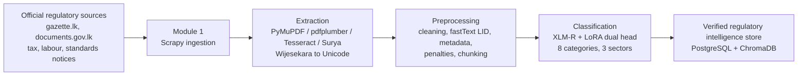
```mermaid
flowchart LR
    A["Official regulatory sources<br/>gazette.lk, documents.gov.lk<br/>tax, labour, standards notices"] --> B["Module 1<br/>Scrapy ingestion"]
    B --> C["Extraction<br/>PyMuPDF / pdfplumber / Tesseract / Surya<br/>Wijesekara to Unicode"]
    C --> D["Preprocessing<br/>cleaning, fastText LID, metadata,<br/>penalties, chunking"]
    D --> E["Classification<br/>XLM-R + LoRA dual head<br/>8 categories, 3 sectors"]
    E --> F["Verified regulatory intelligence store<br/>PostgreSQL + ChromaDB"]
```


```
    SME["SME profile<br/>sector, region, language, survey data"] --> P["Personalisation layer"]
    F --> P
    P --> Alert["Sector-matched alerts<br/>in-app, email, SMS"]
```


```
    F --> M2["Module 2<br/>Compliance knowledge (RAG)"]
    SME --> M2
    M2 --> Answer["Grounded plain-language guidance"]
```


```
    SME --> M3["Module 3<br/>Compliance risk assessment"]
    F --> M3
    M3 --> Risk["Risk profile and priority actions"]
```


```
    Claim["Compliance claim from informal channel"] --> M4["Module 4<br/>Misinformation verification"]
    F --> M4
    M4 --> Verdict["Supported / unsupported / uncertain"]
```


```
    Alert --> UI["Trilingual SME dashboard"]
    Answer --> UI
    Risk --> UI
    Verdict --> UI
```


```
    Admin["Admin and expert reviewers"] --> Review["Verify, correct, annotate, audit"]
    Review --> F
```


```
    F --> W["Propagation watchers<br/>portals + RSS"]
    W --> Lag["Lag analytics<br/>findings F1-F6"]
```

> *Placeholder in the Word original: a grey box awaiting the exported PNG of the Mermaid diagram above.*


*Figure 1.1 — End-to-end flow of the Enigmatrix regulatory intelligence platform*


## Chapter 2 - Related Work


### 2.1 Introduction

This chapter reviews the literature relevant to Enigmatrix and to its four modules. It begins with the SME regulatory-compliance problem in developing economies, where compliance cost, regulatory complexity and limited access to specialist advice interact. It then reviews regulatory technology, information asymmetry, multilingual natural language processing, retrieval-augmented question answering, explainable compliance risk modelling and misinformation detection.

The purpose is not to enumerate existing systems but to locate a gap. The compliance literature explains *that* knowledge and trust drive compliance; the RegTech literature shows *how* regulatory text can be processed automatically. Neither measures the movement of regulatory information from publication to SME understanding in a multilingual, low-resource setting. That measurement is what this project adds.


### 2.2 Overall Related Work


#### 2.2.1 SME compliance behaviour and the knowledge constraint

Research on SME compliance consistently identifies knowledge, complexity and cost as the dominant determinants. Musimenta [22] finds that knowledge requirements, tax complexity and compliance cost jointly explain tax compliance among Ugandan SMEs. Agusti and Rahman [23] reach a comparable conclusion for Indonesian enterprises, linking tax attitude to procedural understanding. Mokoena [24] extends the analysis to tax literacy, amnesty, reward and service delivery, again finding literacy to be a first-order determinant of voluntary compliance. Kirchler et al. [25] provide the theoretical frame through the slippery-slope model, in which compliance is produced either by trust in authorities or by perceived enforcement power.

Sri Lanka-specific evidence points the same way. SMEs constitute the bulk of enterprises but operate under a compliance burden calibrated for larger firms [1], [2], [6]. Regulatory and policy barriers are documented as a constraint on SME digital and commercial development in comparable economies [10], and the OECD identifies regulatory quality and accessibility as a direct determinant of the SME business environment [7]. Financial-compliance studies note that navigating the requirements is itself a specialised skill that SMEs typically lack [4]. Concrete Sri Lankan instruments illustrate the volatility: the Social Security Contribution Levy and successive budget changes altered SME obligations at short notice [3], [8], [9]. Access to finance and the wider business environment reinforce the same constraint [21].

The limitation of this body of work, for the present purpose, is that it treats knowledge as a property of the owner measured at a point in time. It asks whether the owner knows the rule. It does not ask when the rule reached them, through which channel, in which language, or whether it survived transmission intact.


#### 2.2.2 Information asymmetry as the organising theory

Akerlof's analysis of markets under asymmetric information [26] is the theoretical anchor. Where one party holds material information the other lacks, outcomes degrade irrespective of either party's intent. Subsequent work applies the framework to pharmaceuticals [27], to the regulator's own signalling problem [28] and to SME disclosure, where improved information disclosure measurably reduces asymmetry [29].

Applied to regulatory compliance, the asymmetry is between the state and the enterprise. The state discharges its duty by publishing; the enterprise bears the consequence of not receiving. Publication is a necessary but insufficient condition for compliance. Enigmatrix is, in these terms, an intermediary that reduces the asymmetry by making the transfer active, structured and measurable rather than passive and assumed.


#### 2.2.3 Regulatory technology and regulatory NLP

RegTech is the closest technical field. Arner, Barberis and Buckley [11] frame RegTech as the response to escalating compliance scale and complexity following the financial crisis. McKinsey [16] characterises it operationally as software that monitors, manages and reports compliance. Butler and O'Brien [20] argue for semantic technologies and NLP as the means of rendering regulatory content machine-processable.

More recent work operationalises this. Automated compliance-monitoring pipelines have been proposed for PDF ingestion, entity extraction and regulatory-impact assessment [30], [31], and NLP has been applied to uncover latent structure in regulatory corpora [32]. RegNLP [33] investigates retrieval and answer generation over regulatory documents specifically, establishing that regulatory text is amenable to modern information-retrieval and generation methods.

Two limitations recur. First, the target user is an institution — typically a bank — with compliance staff, structured regulatory feeds and English-language source material. Second, evaluation is framed around document-processing accuracy, not around whether the regulated party became aware in time. Neither assumption holds for a Sri Lankan SME reading a scanned Sinhala gazette.


#### 2.2.4 Multilingual and low-resource NLP

Enigmatrix must process English, Sinhala and Tamil. XLM-RoBERTa [19] provides cross-lingual representations trained at scale and is the standard choice for low-resource transfer. For Sinhala specifically, de Silva [5] evaluates pre-trained language models for text classification and finds transformer-based models outperform earlier multilingual baselines. Recent Sinhala and code-mixed work on sentiment, aspect classification and keyword extraction confirms the viability of this family of models on Sri Lankan text [47], [48]. Low-resource fine-tuning strategies for multilingual pre-trained models are documented in the SemEval setting [49], and lifelong-learning approaches address multilingual drift [44]. BERT [43] remains the architectural reference point for the encoder family.

The practical implication is that a single multilingual encoder is preferable to three language-specific pipelines at prototype scale: it shares representation across languages where labelled data is scarce, and it reduces the maintenance surface to one model, one tokenizer and one deployment artefact.


#### 2.2.5 Retrieval-augmented generation for grounded compliance answers

Lewis et al. [17] introduced retrieval-augmented generation as a means of grounding generated text in retrieved evidence. In legal and financial domains, where an unsupported assertion is a liability rather than a stylistic flaw, grounding is essential: CBR-RAG [18] combines case-based reasoning with retrieval for legal question answering, FinSage [46] addresses multi-aspect retrieval over financial filings, and recent systems apply RAG to radio-spectrum regulation [50] and to judicial forensics with explicit trustworthiness constraints [51].

Evaluation methodology has matured alongside. RAGAS [52] and ARES [53] define automated measures of faithfulness, answer relevancy, context precision and context recall; VERA [54] adds validation of retrieval-augmented systems; and a recent survey [55] consolidates trustworthiness criteria.


#### 2.2.6 Explainable risk modelling

Bussmann et al. [12] demonstrate explainable machine learning in credit risk management, and Bonifazi et al. [36] apply interpretable models to SME credit default. SHAP [15] is the dominant attribution method, and its stability in credit-risk settings has itself been studied [39]. Miah et al. [38] extend explainable AI to managerial decision-making in financial organisations. Class imbalance is the recurring methodological obstacle: SMOTE [40] remains the reference oversampling technique, and comparative studies of imbalance handling in fraud and risk detection quantify the trade-offs [37], [41], [42].

The gap is that these models predict *credit* risk from proprietary financial data. Compliance risk in an SME setting must be inferred from survey responses, behavioural signals and regulatory exposure, which are sparser and noisier.


#### 2.2.7 Misinformation detection

Network-oriented analysis of WhatsApp [13] shows how closed messaging networks amplify unverified claims, and studies of misinformation sharing during COVID-19 [14], [35] and public-health surveys [34] characterise the antecedents and consequences of that behaviour. Technically, transformer-based classifiers [43] and multilingual disinformation detection systems such as PolyTruth [45] provide the modelling foundation, and evidence-grounded retrieval [46] supplies the verification mechanism.

The literature concentrates on political, health and general financial misinformation. Routine regulatory misinformation — "the VAT threshold has changed", "registration is no longer required" — is under-studied, despite being the category most likely to cause direct financial harm to an SME.


#### 2.2.8 Synthesis

Related work establishes that automated regulatory monitoring is feasible, that multilingual transformers can handle Sinhala and Tamil, that grounded generation can produce trustworthy compliance answers, that risk can be modelled explainably, and that misinformation can be detected. What no existing system does is connect these into a single pipeline for a low-resource, multilingual SME population *and measure the resulting change in awareness lag*. That is the space Enigmatrix occupies.


### 2.3 Module-wise Related Work


#### 2.3.1 Module 1 — Regulatory Change Awareness Gap

Module 1's related work falls into four strands.

**RegTech monitoring.** Arner et al. [11], McKinsey [16] and Butler and O'Brien [20] collectively justify the premise that regulatory monitoring should be a continuous machine process rather than a periodic human search. Module 1 implements exactly that: scheduled spiders, an automatic extraction and classification chain, and event-driven alerting.

**Regulatory document NLP.** Automated pipelines for regulatory PDF ingestion, entity extraction and impact assessment [30], [31], [32] and retrieval and generation over regulatory corpora [33] establish that regulatory text is tractable. What they do not address is the document-quality problem that dominates the Sri Lankan case: scanned pages, mixed scripts and legacy font encodings. Module 1's per-page routing chain, Surya fallback and font-aware Wijesekara conversion are responses to a problem the existing literature largely assumes away.

**Multilingual classification.** XLM-R [19] and Sinhala classification results [5], [47], [48], [49] justify a single multilingual encoder over per-language models. LoRA adaptation is adopted so that fine-tuning remains feasible on a single free-tier GPU, which is the realistic constraint for a final-year project. The dual head — single-label category with cross-entropy, multi-label sector with binary cross-entropy — reflects the structure of the task rather than an off-the-shelf configuration.

**Annotation reliability.** Because the labelled dataset becomes ground truth for both training and evaluation, its reliability must itself be reported. Cohen's kappa is appropriate because it discounts agreement expected by chance. The Module 1 dataset achieves a category kappa of 0.8715, a mean sector kappa of 0.8638 and an SME-relevance kappa of 0.7235 over 800 dual-annotated tasks. The lower relevance figure is informative rather than embarrassing: it quantifies the genuine subjectivity of the SME/non-SME boundary and motivates the resolver rules documented in Chapter 6.

**Information diffusion.** The compliance literature [22], [23], [24] measures knowledge but not its transit. Module 1's propagation-event table, two-step matcher and lag analytics constitute a measurement instrument for that transit, answering RQ3 and RQ4.

***Module 1 research gap.**** Existing RegTech and regulatory-NLP systems can process regulatory text, but there is no evidence of a Sri Lankan, SME-focused, trilingual pipeline that both reduces and **measures** the delay between official regulatory publication and SME awareness.*


#### 2.3.2 Module 2 — Compliance Knowledge Accuracy Gap

**[M2 PLACEHOLDER]**

Suggested structure for the responsible member: establish why access to raw regulation is insufficient and plain-language guidance is required, using SME knowledge and literacy studies [22], [23], [24]; justify grounded question answering over verified records using RAG literature [17], [18], [46], [50], [51]; define evaluation using faithfulness, answer relevancy, context precision and context recall [52], [53], [54], [55]; and state the gap.


#### 2.3.3 Module 3 — Compliance Risk Invisibility Gap

**[M3 PLACEHOLDER]**

Suggested structure for the responsible member: establish why prioritisation rather than enumeration is the requirement; justify explainable risk scoring using [12], [15], [36], [38], [39]; address class imbalance and sparse compliance events [37], [40], [41], [42]; and state the gap.


#### 2.3.4 Module 4 — Regulatory Misinformation Spread Gap

**[M4 PLACEHOLDER]**

Suggested structure for the responsible member: establish SME dependence on informal channels and the resulting exposure [13], [14], [34], [35]; justify transformer-based and multilingual detection [43], [45]; connect verification to evidence retrieval over Module 1's verified corpus [46]; and state the gap.


### 2.4 Summary

The reviewed literature supports four conclusions that shape this project. Compliance failure among SMEs is substantially an information failure, not primarily an intent failure [22]–[26]. Regulatory monitoring can be automated, but existing RegTech assumes institutional users and English structured feeds [11], [16], [20], [30]–[33]. Multilingual transformers are the appropriate modelling family for Sinhala and Tamil regulatory text [5], [19], [47]–[49]. Grounded generation, explainable risk modelling and misinformation detection each have mature methods and evaluation frameworks.

What is absent is integration and measurement. Enigmatrix combines awareness, knowledge, risk and verification over a shared verified data layer, and Module 1 supplies both that layer and the instrumentation needed to quantify whether the information barrier has actually narrowed.


## Chapter 3 - Technology Adapted


### 3.1 Introduction

This chapter records the technologies selected for the platform and the reasoning behind each choice. Selections were driven by four constraints: the source documents are multilingual and frequently scanned; the project must run on student-accessible hardware and free or academic-tier services; every result must be reproducible for examination; and each module must remain operable by a single developer.


*Table 3.1 — Technology stack by layer*

| Layer | Technology |
|---|---|
| Backend | FastAPI, SQLAlchemy 2.0 async, Alembic, Pydantic v2, Celery + Beat (Redis), slowapi |
| Scraping | Scrapy — gazette_spider, weekly_gazette_spider, acts_spider, bills_spider |
| Extraction | PyMuPDF, pdfplumber, pypdfium2, Tesseract 5 (eng+sin+tam), Surya OCR, font-aware Wijesekara→Unicode |
| NLP / ML | XLM-RoBERTa, PEFT (LoRA), PyTorch, Transformers, scikit-learn, fastText, NLLB-200, ONNX Runtime |
| Frontend | Next.js 14 App Router, Tailwind with shadcn-pattern HSL tokens, next-intl (EN/SI/TA), TanStack Query, Playwright |
| Storage | PostgreSQL, ChromaDB, Redis, local object storage |
| Annotation | Label Studio |
| Compute | Google Colab GPU, Kaggle Notebooks GPU, local CPU workstation |
| Deployment | Railway (backend), Vercel (frontend), managed PostgreSQL |
| Quality | pytest, Playwright, Great-Expectations-style JSON suites |


### 3.2 Programming Languages

The system uses two primary languages. **Python 3.12** implements the backend, the asynchronous task layer, the scrapers, the extraction chain and the entire machine-learning package. **TypeScript** implements the frontend. The split follows the workload: Python has the mature PDF, OCR and deep-learning ecosystem the pipeline depends on, while TypeScript with Next.js provides the server-rendered, internationalised interface the SME-facing product requires.

The repository is a monorepo with git submodules so that the three concerns remain independently testable:


*Table 3.2 — Repository components*

| Component | Purpose |
|---|---|
| enigmatrix-backend | FastAPI application, Celery tasks, Scrapy spiders, Alembic migrations |
| enigmatrix-frontend | Next.js 14 application, SME dashboard and admin console |
| enigmatrix-ml | Installable Python package m1 — extraction, preprocessing, model, evaluation, notebooks |
| enigmatrix-docs | MkDocs documentation set |
| research/data | Label Studio configuration, calibration set, annotation batches |
| scripts | Cross-repository scripts: sampling, IAA resolution, thesis artefact generation, translation |

Placing extraction and evaluation in enigmatrix-ml rather than in the backend was deliberate: the ML package is pip-installable and backend-independent, so it can be executed in a Colab or Kaggle notebook without importing the web application. The backend app/extraction/ module is a thin re-export adapter that preserves existing imports and tests.


#### 3.2.1 FastAPI, SQLAlchemy and Celery

**FastAPI with SQLAlchemy 2.0 async** was selected over Django or Flask for three reasons: native asynchronous request handling suits an I/O-bound workload dominated by scraping and database access; Pydantic v2 provides schema validation and OpenAPI documentation without additional code; and the async ORM allows long extraction transactions without blocking the request loop.

**Celery with Redis and Beat** provides the task layer. Extraction of a single scanned gazette can take minutes, which is untenable inside a request. Celery also supplies the scheduled cadence the research programme requires.


*Table 3.3 — Scheduled task cadence*

| Task | Schedule |
|---|---|
| Scraper | every 6 hours |
| Portal watcher / RSS watcher | every 2 hours (offset) |
| Retire old dataset versions | 20:30 UTC daily |
| Refresh lag analytics | 21:00 UTC daily |
| Retraining | quarterly (1 Jan / Apr / Jul / Oct, 03:00) |

**Alembic** maintains a linear migration chain, **slowapi** enforces rate limits, and audit logging is written on every authentication event and administrative mutation through a single audit_service.record() entry point that is never bypassed — a requirement for a system whose outputs may be cited as compliance evidence.


#### 3.2.2 Scrapy

Scrapy was chosen over ad-hoc requests scripts for its built-in scheduling, retry, throttling and item-pipeline abstractions. Four spiders cover the source surface, each supporting date scoping, closing on scope exhaustion, and falling back English→Sinhala→Tamil when a language edition is unavailable. Completeness verification and re-fetch endpoints reconcile what was expected against what was retrieved.


#### 3.2.3 PDF extraction and OCR libraries

No single extraction engine handles the Sri Lankan gazette corpus. Documents fall into three classes, and pages within a single document may differ.


*Table 3.4 — Extraction engine routing*

| Class | Characteristics | Engine route |
|---|---|---|
| Text PDF | Born-digital, selectable text, usually English | PyMuPDF with TEXTFLAGS_TEXT, then pdfplumber for layout and tables |
| Hybrid | Mixed selectable and image pages | Per-page routing between text and OCR engines |
| Scanned | Image-only, frequently Sinhala or Tamil | Tesseract 5 --oem 1 --psm 6 -l eng+sin+tam at 300 dpi; Surya OCR as fallback |

A classify_pdf step assigns the route using calibratable thresholds. Extraction profiles are registered and versioned — legacy_v1, page_routing_v1, surya_fallback_v1, wijesekara_routing_v1 — so any measurement run is attributable to a specific configuration.

**Wijesekara conversion** deserves separate mention. Legacy Sinhala documents encode text in the Wijesekara keyboard layout with non-Unicode fonts. Extracted bytes are meaningless without conversion, and the failure is silent: text appears to extract successfully but is unusable. A font-aware converter detects the encoding from embedded font metadata and maps to Unicode. Residual (cid:…) glyph spans are logged for re-extraction.


#### 3.2.4 fastText

fastText performs language identification. It was preferred over langdetect for short-text stability and for its handling of Sinhala and Tamil scripts.


#### 3.2.5 PyTorch, Transformers and PEFT

**XLM-RoBERTa base with LoRA adapters** is the classification model. XLM-R [19] covers English, Sinhala and Tamil in one encoder, which is decisive when labelled data per language is limited. Full fine-tuning of a ~270M-parameter encoder is impractical on the available hardware; LoRA injects trainable rank-decomposition matrices into the attention query and value projections and freezes the base weights, reducing trainable parameters by orders of magnitude and making training feasible on a single free-tier GPU. PEFT provides the LoRA implementation; Transformers provides the encoder and tokenizer; PyTorch provides the training loop.


#### 3.2.6 scikit-learn

scikit-learn provides the TF-IDF vectoriser, the logistic-regression and LinearSVC baselines and the metric implementations. Reporting a non-transformer baseline is a methodological requirement rather than a convenience: without it, a transformer macro-F1 has no interpretable scale.


#### 3.2.7 ONNX Runtime

The trained model is exported to ONNX with an optional INT8 quantisation and served on CPU. This removes any GPU requirement from production and keeps hosting within free and hobby tiers.


#### 3.2.8 NLLB-200

NLLB-200 distilled 600M performs English→Sinhala and English→Tamil translation of titles and summaries. It was chosen over commercial translation APIs for cost, reproducibility and offline operation, and over larger NLLB variants because the distilled model fits comfortably in free-tier notebook memory while retaining acceptable quality for short administrative text. All machine translations enter an administrative review queue before being surfaced to SMEs.


#### 3.2.9 TypeScript, Next.js and next-intl

Next.js 14 App Router with server components reduces client bundle size on the content-heavy regulation pages. next-intl provides English, Sinhala and Tamil localisation with script-appropriate fonts. Tailwind with shadcn-pattern HSL tokens gives a trust-oriented palette in light and dark modes. TanStack Query manages server state and cache invalidation for the admin pipeline views, while WebSocket and SSE channels carry live extraction progress.


### 3.3 Cloud and Compute Platforms

No CUDA device is available locally. The local workstation is therefore used only for pipeline execution, extraction runs, measurement runs, baseline training and a single-epoch smoke test; all transformer training and evaluation is executed on free GPU notebook platforms.


*Table 3.5 — Compute platforms and their role in this study*

| Platform | Hardware | Role in this study |
|---|---|---|
| Local workstation | CPU only (torch.cuda.is_available() is False) | Extraction, preprocessing, measurement runs, TF-IDF baselines, CPU training smoke test |
| Google Colab | T4 / L4 GPU, ephemeral runtime | XLM-R + LoRA training, per-slice evaluation, ONNX export, NLLB translation backfill |
| Kaggle Notebooks | P100 or 2 × T4 GPU, ~30 GPU-hours per week, 12-hour sessions | Longer multi-seed training runs and repeat experiments where the Colab session limit is binding; dataset versioning through Kaggle Datasets |
| Railway | Single container (uvicorn + Celery worker + Beat) | Backend deployment |
| Vercel | Serverless | Frontend deployment |
| Managed PostgreSQL | — | Production relational store |

Colab and Kaggle are complementary rather than redundant. Colab is used for interactive development of the training notebook because the runtime attaches quickly and integrates with Google Drive. Kaggle is used for the longer three-seed runs because its weekly GPU quota and 12-hour session limit accommodate a full multi-seed sweep without re-attaching, and because Kaggle Datasets provides an immutable, versioned home for the frozen 800-row gold dataset and the generated Parquet splits. Both write the same model_registry.json, so results from either platform are directly comparable.


### 3.4 Other Tools and Applications


*Table 3.6 — Supporting tools*

| Tool | Use |
|---|---|
| Label Studio | Annotation interface for the 8-domain / 3-sector / SME-relevance / confidence schema |
| Docker Compose | Local PostgreSQL, Redis and ChromaDB for development |
| uv | Python environment and dependency-group management (serving, training, research) across a workspace |
| pytest | Backend and ML unit and integration tests |
| Playwright | Frontend end-to-end tests |
| Great-Expectations-style JSON suites | Post-seal data-quality validation of dataset versions |
| Obsidian | Research knowledge base: session diary, feature register, plans and evidence notes |
| Git and git submodules | Version control across the monorepo |
| Mermaid | Diagram source kept in version control alongside the text |


### 3.5 Summary

Each selection follows from a constraint of the problem domain rather than from familiarity. Multi-engine extraction exists because the corpus is heterogeneous. Wijesekara conversion exists because the corpus is partly legacy-encoded. A single multilingual encoder with LoRA exists because labelled data and GPU hours are both scarce. Colab and Kaggle are used because no local GPU exists. ONNX CPU inference exists because production hosting has no GPU. Sealed dataset versions and an atomic evaluation fact table exist because the results must be defensible under examination.


## Chapter 4 - Approach


### 4.1 Introduction

This chapter states, for each module, what it consumes, what it does and what it produces. The platform is a chain: Module 1 turns unstructured official publications into verified structured records, and Modules 2, 3 and 4 each transform those records, joined with SME context, into a different decision-support output. Describing the modules in input–process–output terms makes the dependency explicit and defines the contract each module must honour.


### 4.2 Module 1 — Regulatory Change Awareness Gap


#### 4.2.1 Input


*Table 4.1 — Module 1 inputs*

| Input | Source | Form |
|---|---|---|
| Gazette issues, acts and bills | gazette.lk, documents.gov.lk | PDF; born-digital English, scanned Sinhala and Tamil, some legacy-font encoded |
| Publication metadata | Source listing pages | Gazette number, document number, publication date, source URL, language edition |
| SME business profiles | Platform registration | Sector, region, scale, preferred language, alert channel preferences |
| Secondary-channel content | IRD, EPF, ETF and eROC portals; five news RSS feeds | HTML and RSS items used only for propagation measurement |
| Annotation ground truth | Label Studio | Dual annotations of change category, affected sectors, SME relevance, confidence, notes |
| Sealed evaluation baseline | Curated ground-truth workbook | ~800 manually curated field-level records, checksummed |


#### 4.2.2 Process

The module executes a five-stage pipeline with a parallel measurement loop.

1.	**Ingest.** Date-scoped Scrapy spiders discover and download issues, falling back across language editions, and write a record at status ingested with the raw PDF stored on disk. Completeness verification reconciles the expected issue list against what was retrieved and re-fetches gaps.

2.	**Extract.** classify_pdf routes each document — and, in hybrid documents, each page — to a text or OCR engine. Font metadata is inspected and legacy Wijesekara text is converted to Unicode. The record advances to extracted with raw_text, extraction_method, sha256, pdf_pages and language.

3.	**Preprocess.** Text is cleaned and Unicode-normalised, the language is confirmed by fastText, metadata is extracted (gazette number, publication and effective dates, penalties including the multi-penalty case), sub-documents are split where one issue carries several independent instruments, and the text is chunked to the model's 512-token window as classification_chunk. The record advances to preprocessed.

4.	**Classify.** The frozen TF-IDF + `LinearSVC` V6 classifier assigns one of eight change categories ⟦v2⟧ and, in the design though not in the frozen model, a multi-label set of affected sectors. **The frozen classifier is category-only and returns `sectors: []`.** It emits an uncalibrated decision margin rather than a probability, so `classifier_confidence` is NULL on this path and review routing is a margin comparison against a provisional 0.40 threshold; records already marked expert-verified are never overwritten. ⟦v2⟧ The record advances to classified.

5.	**Explain and alert.** A controlled English summary is generated from the title, domain, affected sectors, amendment type and cleaned text; the title and summary are translated into Sinhala and Tamil by NLLB-200 and queued for administrative review. The alert dispatcher matches the classified record against SME profiles by sector and emits idempotent in-app, email and SMS alerts.

In parallel, portal and RSS watchers poll secondary channels every two hours and attempt to match observed content back to a known regulation, first on exact gazette number and then on fuzzy title similarity, writing a propagation event on first observation. Nightly jobs refresh the lag-analytics materialised views, and a Kullback–Leibler drift monitor over the confidence distribution triggers retraining when it exceeds 0.15.

*Mermaid source (renderable at https://mermaid.live) — the authoritative, version-controlled form of this diagram:*

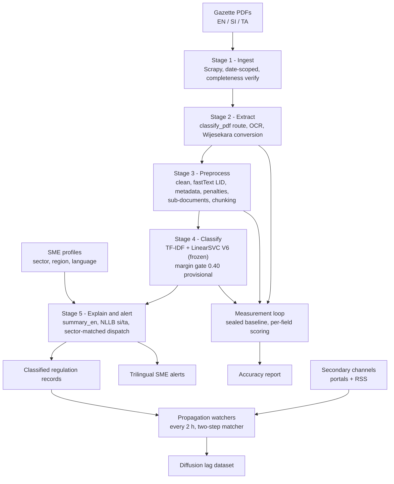
```mermaid
flowchart TD
    IN1["Gazette PDFs<br/>EN / SI / TA"] --> S1["Stage 1 - Ingest<br/>Scrapy, date-scoped, completeness verify"]
    S1 --> S2["Stage 2 - Extract<br/>classify_pdf route, OCR, Wijesekara conversion"]
    S2 --> S3["Stage 3 - Preprocess<br/>clean, fastText LID, metadata, penalties,<br/>sub-documents, chunking"]
    S3 --> S4["Stage 4 - Classify<br/>TF-IDF + LinearSVC V6 (frozen)<br/>margin gate 0.40 provisional"]
    S4 --> S5["Stage 5 - Explain and alert<br/>summary_en, NLLB si/ta, sector-matched dispatch"]
    IN2["SME profiles<br/>sector, region, language"] --> S5
    S5 --> OUT1["Classified regulation records"]
    S5 --> OUT2["Trilingual SME alerts"]
    S2 --> MEAS["Measurement loop<br/>sealed baseline, per-field scoring"]
    S3 --> MEAS
    S4 --> MEAS
    MEAS --> OUT3["Accuracy report"]
    IN3["Secondary channels<br/>portals + RSS"] --> WCH["Propagation watchers<br/>every 2 h, two-step matcher"]
    OUT1 --> WCH
    WCH --> OUT4["Diffusion lag dataset"]
```


> *Placeholder in the Word original: a grey box awaiting the exported PNG of the Mermaid diagram above.*


*Figure 4.1 — Module 1 input, process and output*


#### 4.2.3 Output


*Table 4.2 — Module 1 outputs*

| Output | Consumer | Description |
|---|---|---|
| Verified regulation records | Modules 2, 3 and 4; SME dashboard | Structured rows with category, affected sectors, SME relevance, confidence, dates, penalties and full text |
| Trilingual titles and summaries | SME alerts and dashboard | title_en/si/ta, summary_en/si/ta, reviewed before publication |
| Sector-matched alerts | SME users | Idempotent in-app, email and SMS notifications keyed on regulation × recipient × channel |
| Propagation events | Research analysis | First-observation timestamps per regulation per secondary channel |
| Lag analytics views | Findings notebooks | v_m1_regulation_lag_summary, v_m1_channel_effectiveness |
| Accuracy reports | Examiners and maintainers | Per-field, per-record and per-stage scores with error taxonomy and worst-N leaderboard |
| Labelled gold dataset | Model training and evaluation | 800 reconciled records with adjudication provenance |


### 4.3 Module 2 — Compliance Knowledge Accuracy Gap

**[M2 PLACEHOLDER]** — to be completed by the responsible member using the structure below.


#### 4.3.1 Input

**[M2 PLACEHOLDER]** — verified regulation records from Module 1, SME profile and question text, knowledge-survey responses.


#### 4.3.2 Process

**[M2 PLACEHOLDER]** — chunking, embedding, retrieval, reranking, grounded answer generation, multilingual rendering.


#### 4.3.3 Output

**[M2 PLACEHOLDER]** — grounded plain-language answers with cited evidence, knowledge scores.


### 4.4 Module 3 — Compliance Risk Invisibility Gap

**[M3 PLACEHOLDER]** — to be completed by the responsible member using the structure below.


#### 4.4.1 Input

**[M3 PLACEHOLDER]** — SME profile, survey responses, behavioural signals, compliance history, regulatory exposure from Module 1.


#### 4.4.2 Process

**[M3 PLACEHOLDER]** — feature construction, risk scoring model or rule framework, imbalance handling, explanation generation.


#### 4.4.3 Output

**[M3 PLACEHOLDER]** — risk score, risk band, prioritised actions with per-factor explanations.


### 4.5 Module 4 — Regulatory Misinformation Spread Gap

**[M4 PLACEHOLDER]** — to be completed by the responsible member using the structure below.


#### 4.5.1 Input

**[M4 PLACEHOLDER]** — user-submitted or collected compliance claims, verified regulation corpus from Module 1.


#### 4.5.2 Process

**[M4 PLACEHOLDER]** — claim extraction, evidence retrieval, stance or entailment decision, confidence calibration.


#### 4.5.3 Output

**[M4 PLACEHOLDER]** — verdict (supported / unsupported / uncertain) with cited evidence and confidence.


### 4.6 Summary

The four modules share one contract: Module 1 guarantees a verified, classified, sector-tagged and language-complete regulation record, and the other three modules build decision support on top of it without re-parsing source documents. This is what allows the platform to be evaluated module by module and still be defensible end to end — each module's output quality is bounded by, and measured against, the quality of the record it received.


## Chapter 5 - Analysis and Design


### 5.1 Introduction

This chapter presents the design of the platform. Section 5.2 gives the overall architecture together with the data-flow, class, sequence and database designs. Section 5.3 gives the module-level designs, with Module 1 in full detail and structured placeholders for the other modules.


### 5.2 High-Level Architecture of the Overall System

The platform is designed as a four-layer architecture, with the four research modules occupying the application layer and communicating through a shared event bus and a shared verified knowledge base.

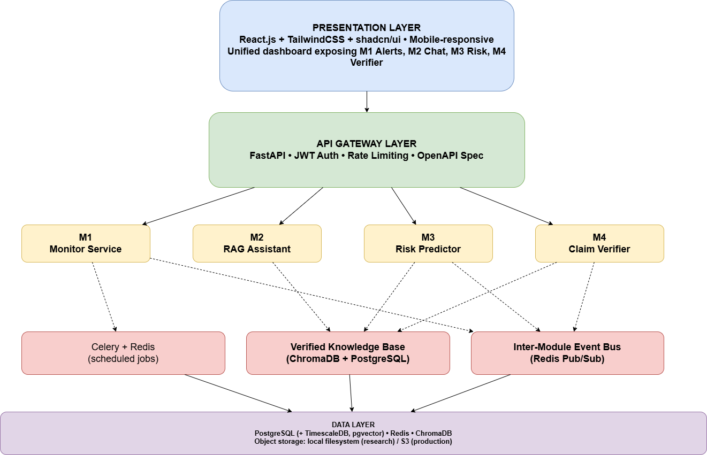

> **What the diagram shows.** Identical to Figure 3 of the group report — the four-layer platform architecture: Presentation (React + Tailwind + shadcn/ui, unified dashboard for M1 Alerts, M2 Chat, M3 Risk, M4 Verifier), API Gateway (FastAPI, JWT auth, rate limiting, OpenAPI), the four module services (M1 Monitor, M2 RAG Assistant, M3 Risk Predictor, M4 Claim Verifier), shared services (Celery + Redis, Verified Knowledge Base on ChromaDB + PostgreSQL, Redis Pub/Sub event bus) and the data layer (PostgreSQL with TimescaleDB and pgvector, Redis, ChromaDB, object storage).


*Figure 5.1 — Four-layer high-level architecture of the Enigmatrix platform*

The presentation layer is a single application rendering all four modules through a unified dashboard, so that the SME sees one product rather than four tools. The API gateway layer terminates authentication, role-based authorisation and rate limiting, and routes to module services. Each module is a separately deployable service; in the research prototype they share a process, but the boundaries are drawn so that they could be scaled independently. Three shared infrastructure components bind the modules: Celery for scheduled jobs, the verified knowledge base for ground truth, and the event bus for cross-module triggers. The data layer consolidates relational, vector and cache storage.

The layered view in Figure 5.1 is realised concretely as follows.

*Mermaid source (renderable at https://mermaid.live) — the authoritative, version-controlled form of this diagram:*

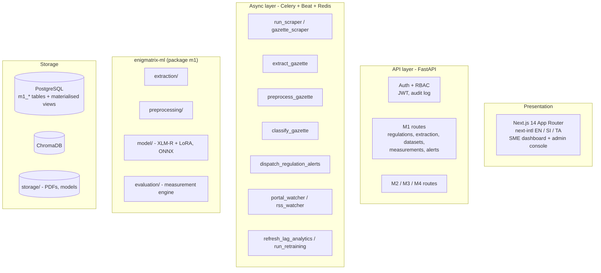
```mermaid
flowchart TB
    subgraph Presentation
        FE["Next.js 14 App Router<br/>next-intl EN / SI / TA<br/>SME dashboard + admin console"]
    end
    subgraph API["API layer - FastAPI"]
        AUTH["Auth + RBAC<br/>JWT, audit log"]
        M1API["M1 routes<br/>regulations, extraction, datasets,<br/>measurements, alerts"]
        MOD["M2 / M3 / M4 routes"]
    end
    subgraph Tasks["Async layer - Celery + Beat + Redis"]
        SCR["run_scraper / gazette_scraper"]
        EXT["extract_gazette"]
        PRE["preprocess_gazette"]
        CLS["classify_gazette"]
        ALR["dispatch_regulation_alerts"]
        WCH["portal_watcher / rss_watcher"]
        ANA["refresh_lag_analytics / run_retraining"]
    end
    subgraph ML["enigmatrix-ml (package m1)"]
        MEX["extraction/"]
        MPR["preprocessing/"]
        MMO["model/ - XLM-R + LoRA, ONNX"]
        MEV["evaluation/ - measurement engine"]
    end
    subgraph Store["Storage"]
        PG[("PostgreSQL<br/>m1_* tables + materialised views")]
        CH[("ChromaDB")]
        OBJ[("storage/ - PDFs, models")]
    end
```


```
    FE <--> AUTH
    FE <--> M1API
    FE <--> MOD
    M1API --> Tasks
    SCR --> EXT --> PRE --> CLS --> ALR
    EXT --> MEX
    PRE --> MPR
    CLS --> MMO
    M1API --> MEV
    Tasks --> PG
    Tasks --> OBJ
    MOD --> CH
    WCH --> PG
    ANA --> PG
```

> *Placeholder in the Word original: a grey box awaiting the exported PNG of the Mermaid diagram above.*


*Figure 5.2 — Deployment-level component view of the implemented platform*


#### 5.2.1 Data flow design

The platform's data flow is presented at two levels. The Level 0 context diagram shows the platform as a single process exchanging data with external actors; the Level 1 diagram decomposes it into the four modules with the verified knowledge base and the event bus as shared stores.

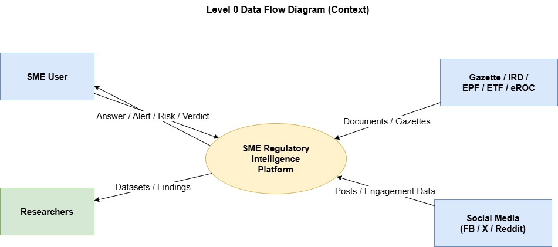

> **What the diagram shows.** Level 0 context diagram — the SME Regulatory Intelligence Platform between four external entities: Gazette/IRD/EPF/ETF/eROC (documents in), Social Media FB/X/Reddit (posts and engagement data in), the SME User (answers, alerts, risk, verdicts out) and Researchers (datasets and findings out).


*Figure 5.3 — Level 0 (context) data flow diagram*


> **What the diagram shows.** Level 1 data flow — the Verified KB (ChromaDB + PostgreSQL) with M2 Chat writing and M1 Monitor, M3 Risk and M4 Verifier reading; M4 exchanges with the User UI; all four publish `change.detected`, `kb.updated` and `risk.recomputed` onto the Redis event bus.


*Figure 5.4 — Level 1 data flow diagram*


#### 5.2.2 Domain model

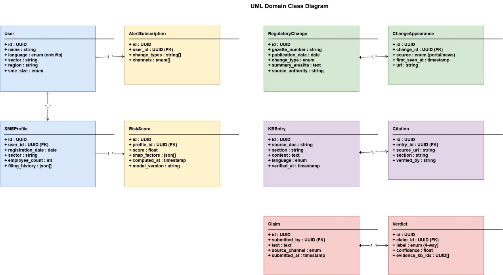

> **What the diagram shows.** The UML domain class diagram — User → AlertSubscription and SMEProfile → RiskScore; RegulatoryChange → ChangeAppearance; KBEntry → Citation; Claim → Verdict — with the same attributes and multiplicities as Figure 7 of the group report.


*Figure 5.5 — Domain class diagram*


#### 5.2.3 Representative interaction

The most representative cross-module interaction is a user submitting a compliance question, with a parallel risk recomputation triggered by an inbound regulatory change.

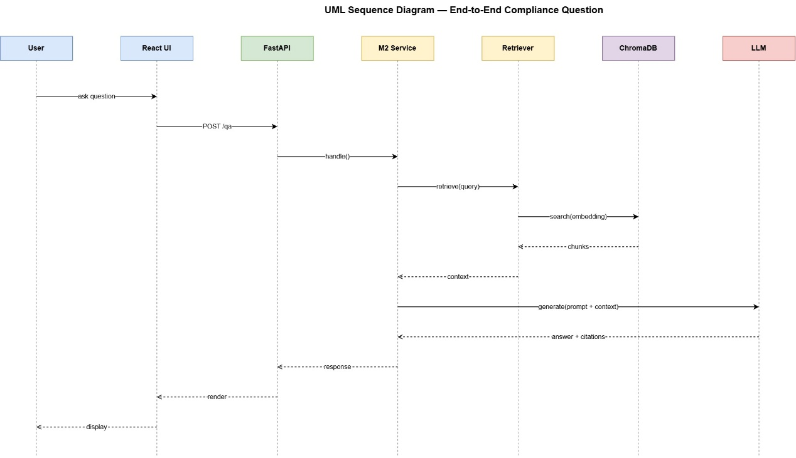

> **What the diagram shows.** The UML sequence diagram for an end-to-end compliance question across User, React UI, FastAPI, M2 Service, Retriever, ChromaDB and LLM — ask question → POST /qa → handle() → retrieve(query) → search(embedding) → chunks → context → generate(prompt + context) → answer + citations → response → render → display.


*Figure 5.6 — Sequence diagram for an end-to-end compliance question*


#### 5.2.4 Database design

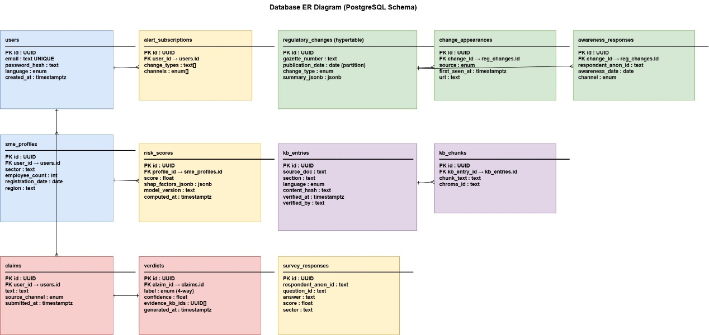

> **What the diagram shows.** The PostgreSQL ER design for the shared database — users, alert_subscriptions, regulatory_changes (hypertable partitioned on publication_date), change_appearances, awareness_responses, sme_profiles, risk_scores, kb_entries, kb_chunks, claims, verdicts and survey_responses, with primary and foreign keys annotated on each entity.


*Figure 5.7 — Entity relationship design of the shared database*

The implemented Module 1 schema is summarised below. Platform tables shared with the other modules include users, sme_profiles, audit_log, the survey_* family, sectors and regulatory_domains.


*Table 5.1 — Principal Module 1 database objects*

| Object | Purpose |
|---|---|
| m1_regulations | Core record with the status machine, extraction and classifier columns |
| m1_regulation_sectors | Many-to-many regulation ↔ sector relevance |
| m1_regulation_penalties | Extracted penalty structures, including the multi-penalty case |
| m1_sub_documents | Independent instruments split from a single gazette issue |
| m1_gazette_items | Item-level index of a gazette issue |
| m1_extraction_profiles / m1_extraction_runs | Versioned extractor configurations and their executions |
| m1_datasets / m1_dataset_versions / m1_dataset_rows | Dataset registry with immutable sealed versions and SHA-256 content hashes |
| m1_measurement_runs / m1_measurement_scores | Measurement executions and per-field scores |
| m1_propagation_events | Diffusion observations, unique on (regulation, source), with first_seen_at |
| m1_alerts | Dispatched alerts; sme_id IS NULL denotes a public broadcast |
| m1_retraining_runs | Retraining executions and promotion decisions |
| v_m1_regulation_lag_summary, v_m1_channel_effectiveness | Materialised views refreshed nightly for lag analytics |


### 5.3 High-Level Architectures of Individual Modules


#### 5.3.1 Module 1 — Regulatory Change Awareness Gap

Module 1 is structured as a five-stage Celery pipeline with a parallel measurement loop, as designed at interim stage and implemented since.

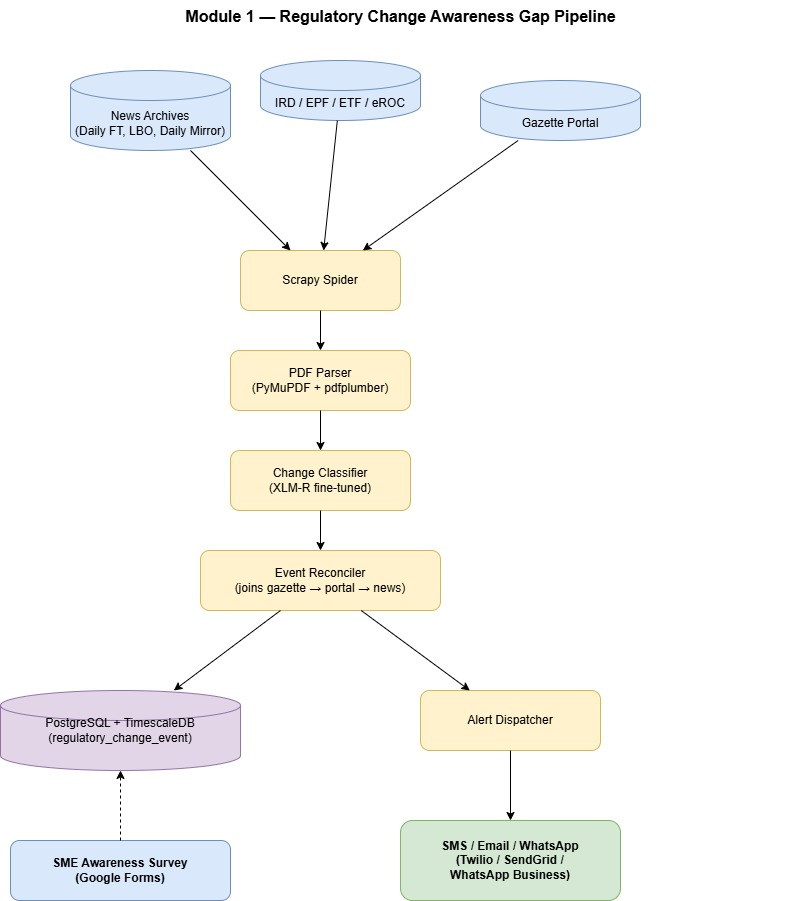

> **What the diagram shows.** The Module 1 pipeline — News Archives, IRD/EPF/ETF/eROC and the Gazette Portal → Scrapy Spider → PDF Parser (PyMuPDF + pdfplumber) → Change Classifier (fine-tuned XLM-R) → Event Reconciler (joins gazette → portal → news) → PostgreSQL + TimescaleDB (`regulatory_change_event`) and Alert Dispatcher → SMS / Email / WhatsApp, with the SME Awareness Survey (Google Forms) feeding the database.


*Figure 5.8 — Module 1 pipeline design*

**The regulation status machine.** Every record advances through a strict status machine. Status is a first-class evaluated field: a record that should have reached classified but stopped at preprocessed is a stage-progression failure, tracked separately from field accuracy.


*Table 5.2 — Regulation status machine and the fields introduced at each stage*

| Status | Entered by | Fields introduced |
|---|---|---|
| ingested | Scrapy spider | m1_gazette_items, raw_pdf_path, gazette_number, document_number, source_url |
| extracted | extract_gazette | raw_text, extraction_method, extracted_at, file_size_bytes, sha256, pdf_pages, language |
| preprocessed | preprocess_gazette | cleaned_text, classification_chunk, amendment_type, metadata_confidence, m1_sub_documents, m1_regulation_penalties |
| classified | classify_gazette | domain_code, change_category, severity_level, is_sme_relevant, classifier_confidence, classified_at |

*Mermaid source (renderable at https://mermaid.live) — the authoritative, version-controlled form of this diagram:*

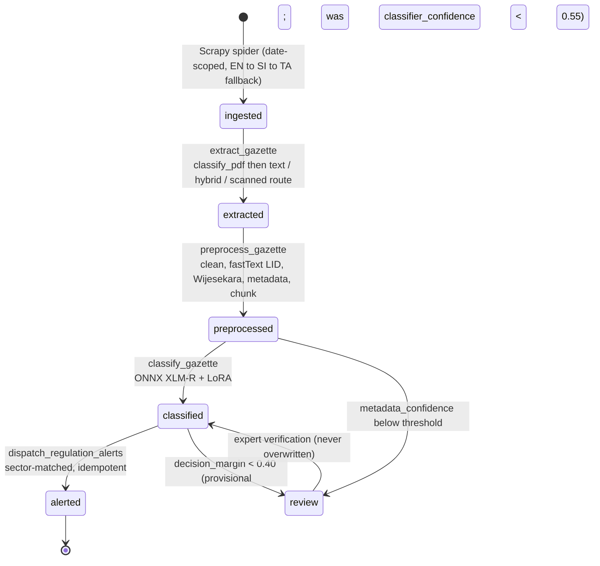
```mermaid
stateDiagram-v2
    [*] --> ingested: Scrapy spider (date-scoped, EN to SI to TA fallback)
    ingested --> extracted: extract_gazette<br/>classify_pdf then text / hybrid / scanned route
    extracted --> preprocessed: preprocess_gazette<br/>clean, fastText LID, Wijesekara, metadata, chunk
    preprocessed --> classified: classify_gazette<br/>ONNX XLM-R + LoRA
    classified --> alerted: dispatch_regulation_alerts<br/>sector-matched, idempotent
    preprocessed --> review: metadata_confidence below threshold
    classified --> review: decision_margin < 0.40 (provisional; was classifier_confidence < 0.55)
    review --> classified: expert verification (never overwritten)
    alerted --> [*]
```


> *Placeholder in the Word original: a grey box awaiting the exported PNG of the Mermaid diagram above.*


*Figure 5.9 — Regulation status machine with review routing*

**Extraction design.** Engine choice must be made per page, not per document. classify_pdf inspects text yield and image coverage and assigns one of three routes; within the hybrid route each page is dispatched individually. Extraction profiles are registered entities, so a measurement result is always attributable to a named, versioned configuration.

*Mermaid source (renderable at https://mermaid.live) — the authoritative, version-controlled form of this diagram:*

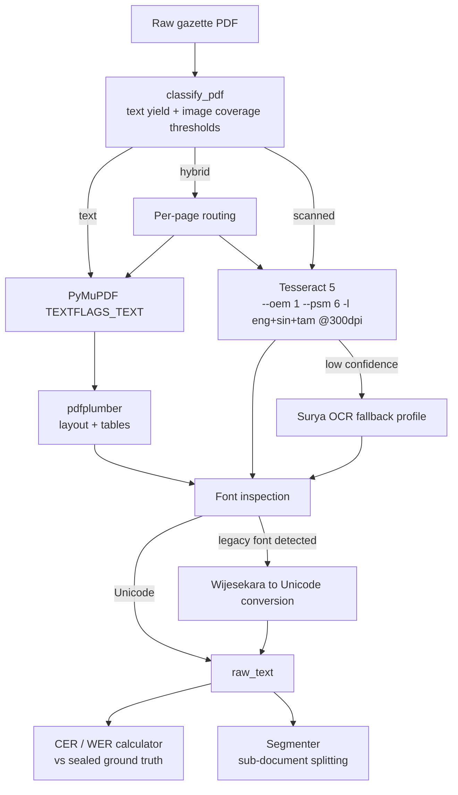
```mermaid
flowchart TD
    PDF["Raw gazette PDF"] --> CLF["classify_pdf<br/>text yield + image coverage thresholds"]
    CLF -->|text| T1["PyMuPDF TEXTFLAGS_TEXT"]
    T1 --> T2["pdfplumber<br/>layout + tables"]
    CLF -->|hybrid| H1["Per-page routing"]
    H1 --> T1
    H1 --> S1
    CLF -->|scanned| S1["Tesseract 5<br/>--oem 1 --psm 6 -l eng+sin+tam @300dpi"]
    S1 -->|low confidence| S2["Surya OCR fallback profile"]
    T2 --> FONT["Font inspection"]
    S1 --> FONT
    S2 --> FONT
    FONT -->|legacy font detected| WJ["Wijesekara to Unicode conversion"]
    FONT -->|Unicode| RAW["raw_text"]
    WJ --> RAW
    RAW --> CER["CER / WER calculator<br/>vs sealed ground truth"]
    RAW --> SEG["Segmenter<br/>sub-document splitting"]
```


> *Placeholder in the Word original: a grey box awaiting the exported PNG of the Mermaid diagram above.*


*Figure 5.10 — Extraction and OCR routing chain*

**Classification design.** The classifier is a single XLM-RoBERTa encoder with LoRA adapters and two output heads.

*Mermaid source (renderable at https://mermaid.live) — the authoritative, version-controlled form of this diagram:*

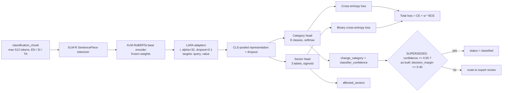
```mermaid
flowchart LR
    IN["classification_chunk<br/>max 512 tokens, EN / SI / TA"] --> TOK["XLM-R SentencePiece tokenizer"]
    TOK --> ENC["XLM-RoBERTa base encoder<br/>frozen weights"]
    ENC --> LORA["LoRA adapters<br/>r, alpha=32, dropout=0.1<br/>targets: query, value"]
    LORA --> POOL["CLS-pooled representation + dropout"]
    POOL --> H1["Category head<br/>8 classes, softmax"]
    POOL --> H2["Sector head<br/>3 labels, sigmoid"]
    H1 --> L1["Cross-entropy loss"]
    H2 --> L2["Binary cross-entropy loss"]
    L1 --> TOT["Total loss = CE + w * BCE"]
    L2 --> TOT
    H1 --> OUT1["change_category + classifier_confidence"]
    H2 --> OUT2["affected_sectors"]
    OUT1 --> GATE{"SUPERSEDED: confidence >= 0.55 ?<br/>as built: decision_margin >= 0.40"}
    GATE -->|yes| ACCEPT["status = classified"]
    GATE -->|no| REVIEW["route to expert review"]
```


> *Placeholder in the Word original: a grey box awaiting the exported PNG of the Mermaid diagram above.*


*Figure 5.11 — XLM-RoBERTa with LoRA adapters and a dual classification head*


*Table 5.3 — Classification design decisions and their rationale*

| Decision | Rationale |
|---|---|
| Single multilingual encoder | Labelled data per language is scarce; cross-lingual transfer is worth more than per-language specialisation at this scale |
| LoRA rather than full fine-tuning | Reduces trainable parameters so a single free-tier GPU session suffices; base weights stay frozen and reusable |
| Dual head, not two models | Category and sector share the same textual evidence; joint training regularises both and halves the deployment surface |
| Softmax for category, sigmoid for sectors | Category is mutually exclusive by construction; a regulation may affect several sectors simultaneously |
| ~~Confidence threshold 0.55 for review~~ → **decision-margin threshold 0.40, provisional** ⟦v2⟧ | The frozen model emits no probability, so no calibrated threshold exists. 0.40 is a validation-derived candidate carried in `.env.example`; the live audit contains zero completed review outcomes, so it is explicitly `provisional_no_review_outcomes` |
| Expert-verified rows never overwritten | Human verification is authoritative; a later model run must not silently regress a checked record |
| ONNX with optional INT8 | Production hosting has no GPU; INT8 reduces latency and memory at a measured accuracy cost |

**Propagation, alerting and analytics design.** The measurement instrument is a two-step matcher that links content observed on secondary channels back to the primary gazette record.

*Mermaid source (renderable at https://mermaid.live) — the authoritative, version-controlled form of this diagram:*

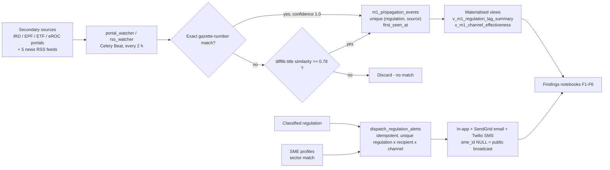
```mermaid
flowchart LR
    SRC["Secondary sources<br/>IRD / EPF / ETF / eROC portals<br/>+ 5 news RSS feeds"] --> W["portal_watcher / rss_watcher<br/>Celery Beat, every 2 h"]
    W --> M1{"Exact gazette-number match?"}
    M1 -->|yes, confidence 1.0| EV["m1_propagation_events<br/>unique (regulation, source)<br/>first_seen_at"]
    M1 -->|no| M2{"difflib title similarity >= 0.78 ?"}
    M2 -->|yes| EV
    M2 -->|no| DROP["Discard - no match"]
    EV --> MV["Materialised views<br/>v_m1_regulation_lag_summary<br/>v_m1_channel_effectiveness"]
    MV --> NB["Findings notebooks F1-F6"]
    REG["Classified regulation"] --> AL["dispatch_regulation_alerts<br/>idempotent, unique regulation x recipient x channel"]
    SMEP["SME profiles<br/>sector match"] --> AL
    AL --> CH["In-app + SendGrid email + Twilio SMS<br/>sme_id NULL = public broadcast"]
    CH --> NB
```


> *Placeholder in the Word original: a grey box awaiting the exported PNG of the Mermaid diagram above.*


*Figure 5.12 — Propagation measurement and alert dispatch design*

Alert dispatch is idempotent and keyed uniquely on (regulation, recipient, channel). A re-run must never double-send, both because duplicate notifications destroy user trust and because a duplicated alert would corrupt the difference-in-differences analysis of alert effectiveness.


#### 5.3.2 Module 2 — Compliance Knowledge Accuracy Gap

**[M2 PLACEHOLDER]** — to be completed by the responsible member. The interim design is reproduced below as the starting point and should be replaced with the implemented architecture.

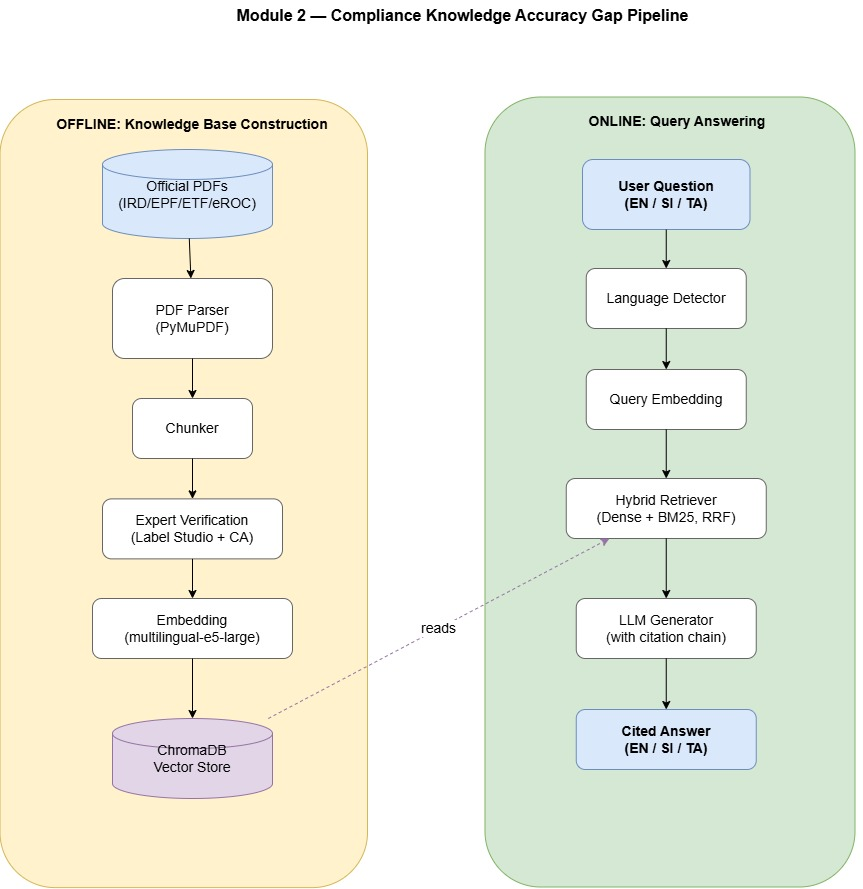

> **What the diagram shows.** Module 2 split into two enclosures. **OFFLINE: Knowledge Base Construction** — Official PDFs (IRD/EPF/ETF/eROC) → PDF Parser (PyMuPDF) → Chunker → Expert Verification (Label Studio + CA) → Embedding (multilingual-e5-large) → ChromaDB Vector Store. **ONLINE: Query Answering** — User Question (EN/SI/TA) → Language Detector → Query Embedding → Hybrid Retriever (Dense + BM25, RRF) → LLM Generator (with citation chain) → Cited Answer (EN/SI/TA). A dashed *reads* edge links the ChromaDB store to the hybrid retriever.


*Figure 5.13 — Module 2 pipeline design (interim)*


#### 5.3.3 Module 3 — Compliance Risk Invisibility Gap

**[M3 PLACEHOLDER]** — to be completed by the responsible member.

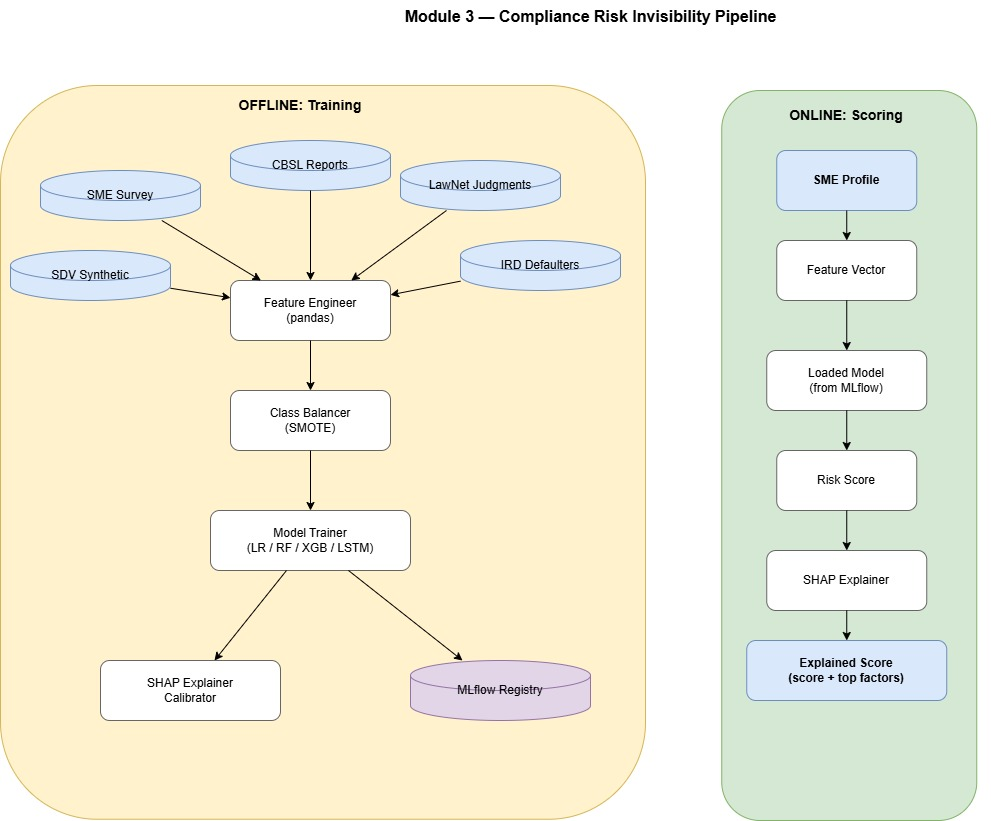

> **What the diagram shows.** Module 3 split into two enclosures. **OFFLINE: Training** — five sources (SME Survey, CBSL Reports, LawNet Judgments, IRD Defaulters, SDV Synthetic) → Feature Engineer (pandas) → Class Balancer (SMOTE) → Model Trainer (LR / RF / XGB / LSTM) → SHAP Explainer Calibrator and MLflow Registry. **ONLINE: Scoring** — SME Profile → Feature Vector → Loaded Model (from MLflow) → Risk Score → SHAP Explainer → Explained Score (score + top factors).


*Figure 5.14 — Module 3 pipeline design (interim)*


#### 5.3.4 Module 4 — Regulatory Misinformation Spread Gap

**[M4 PLACEHOLDER]** — to be completed by the responsible member.

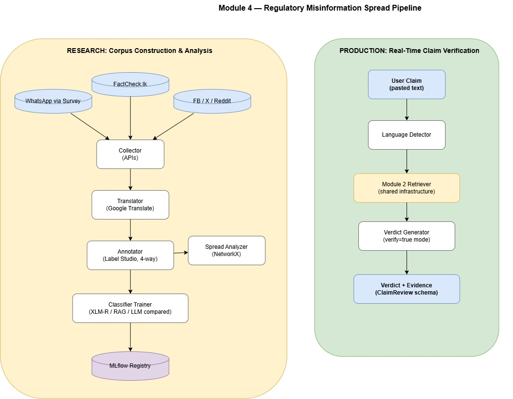

> **What the diagram shows.** Module 4 split into two enclosures. **RESEARCH: Corpus Construction & Analysis** — WhatsApp via Survey, FactCheck.lk and FB/X/Reddit → Collector (APIs) → Translator (Google Translate) → Annotator (Label Studio, 4-way), which also feeds a Spread Analyzer (NetworkX) → Classifier Trainer (XLM-R / RAG / LLM compared) → MLflow Registry. **PRODUCTION: Real-Time Claim Verification** — User Claim (pasted text) → Language Detector → Module 2 Retriever (shared infrastructure) → Verdict Generator (verify=true mode) → Verdict + Evidence (ClaimReview schema).


*Figure 5.15 — Module 4 pipeline design (interim)*


### 5.4 Summary

The design separates three concerns that are frequently conflated: the operational pipeline that produces regulatory intelligence, the measurement framework that quantifies how well it does so, and the research instrument that observes how that intelligence propagates. Each has its own tables, its own metrics and its own failure modes. That separation is what allows Chapter 7 to report extraction accuracy, model accuracy and diffusion lag as independent, individually defensible results.


## Chapter 6 - Implementation


### 6.1 Introduction

This chapter documents how the design of Chapter 5 was realised. Section 6.2 describes data collection, including the construction of the private labelled dataset that is the empirical foundation of Module 1. Section 6.3 documents the implementation of each module, with the principal source files named so that every claim can be verified against the repository, and with representative code listings and interface captures.


### 6.2 Data Collection

Three distinct datasets were collected: a raw document corpus, a private labelled gold dataset, and a sealed evaluation baseline.


*Table 6.1 — Datasets used in this project*

| Dataset | Size | Provenance | Role |
|---|---|---|---|
| Raw gazette corpus | 800 PDFs across 11 extraction batches | gazette.lk, documents.gov.lk | Source material for extraction and preprocessing |
| Gold labelled dataset v1 | 800 reconciled records | Dual annotation in Label Studio, adjudicated | Training, validation and test data for classification |
| Sealed evaluation baseline | ~800 curated field-level rows (Jan–Apr 2026) | Manually curated workbook, SHA-256 checksummed | Ground truth for extraction and stage accuracy |
| Database regression snapshot | ~204 rows, most at preprocessed | Production database export, February 2026 | Stage-progression and regression tracking |
| Calibration set | 20 trilingual documents with expert labels and rationales | Domain expert | Annotator alignment before production labelling |


#### 6.2.1 Document collection

Four Scrapy spiders — gazette_spider, weekly_gazette_spider, acts_spider and bills_spider — collect from the two official sources. Each supports date scoping and closes on scope exhaustion, falls back English→Sinhala→Tamil when an edition is missing, and exposes completeness verification and re-fetch endpoints so gaps are detected rather than silently tolerated. Collection is scheduled every six hours through Celery Beat and can also be triggered for a specific date range from the admin console.

*Principal files:* enigmatrix-backend/scraper/spiders/*.py, app/tasks/m1/run_scraper.py, app/tasks/m1/gazette_scraper.py, app/api/v1/m1_completeness.py.


#### 6.2.2 Annotation and gold dataset construction

No labelled dataset of Sri Lankan regulatory changes exists, so one was created. The protocol was designed so that the result would be defensible as ground truth.

1.	**Calibration.** A 20-document trilingual calibration set with expert labels and written rationales was completed by every annotator before production labelling. Calibration disagreements were discussed and the decision hints in the guideline were refined.

2.	**Sampling.** Documents were drawn using stratified and k-means samplers with explicit minority-domain targeting, plus a hybrid active-learning mode, so annotation effort concentrated where it changes the model rather than on whatever arrived first.

3.	**Dual annotation.** Batches 02–05 were labelled independently by two annotators. Each task captured change category, affected sectors, SME relevance, an annotator confidence rating and free-text notes.

4.	**Automated reduction.** scripts/resolve_iaa.py paired annotations, computed agreement statistics and emitted agreed rows directly to gold.

5.	**Manual adjudication.** The 40 disagreement rows were adjudicated by a resolver and recorded in manual_resolutions.csv with a resolution method and resolver identifier. The final gold file contains **zero lead-annotator fallback rows** — every disagreement was decided explicitly, not defaulted.

6.	**Freezing.** The result was frozen as gold_standard_v1_800.csv with an accompanying iaa_report_v1_800.json.

> **[ SCREENSHOT PLACEHOLDER — image not yet inserted in the Word original ]** Label Studio annotation interface showing a gazette chunk with the 8-domain / 3-sector / SME-relevance / confidence labelling schema. Capture from the Label Studio project defined by research/data/label_studio_config.xml


*Figure 6.1 — Label Studio annotation interface for the Module 1 labelling schema*

The label schema is defined once in code and mirrored into the Label Studio configuration and the database enumerations.

**Listing 6.1 — Canonical label schema (`enigmatrix-ml/m1/model/labels.py`)**


```
CATEGORIES: list[str] = [
    "TAX_RATE_CHANGE", "IMPORT_EXPORT", "SECTOR_SPECIFIC", "EPF_ETF_CHANGE",
    "LABOUR_LAW", "PRODUCT_STANDARD", "BUSINESS_REGISTRATION",
    "PENALTY_ENFORCEMENT",
]
SECTORS: list[str] = [
    "grocery_retail", "food_service", "general_retail",
]
```


```
CAT_TO_ID: dict[str, int] = {c: i for i, c in enumerate(CATEGORIES)}
ID_TO_CAT: dict[int, str] = {i: c for c, i in CAT_TO_ID.items()}
SECTOR_TO_ID: dict[str, int] = {s: i for i, s in enumerate(SECTORS)}
```


```
def encode_sectors(value) -> list[int]:
    """Multi-hot vector of length len(SECTORS)."""
    vec = [0] * len(SECTORS)
    for s in parse_sectors(value):
        vec[SECTOR_TO_ID[s]] = 1
    return vec
```

The three study sectors were selected because they are numerous among Sri Lankan SMEs, are affected by all eight categories, and are distinguishable by an annotator without specialist domain training. Restricting scope to three sectors is a deliberate trade-off: it keeps annotation feasible at the required agreement level, at the cost of limiting immediate generalisation. This is stated as a limitation in Chapter 8 rather than concealed.


*Table 6.2 — Columns of the frozen gold dataset*

| Group | Columns |
|---|---|
| Identity | batch_id, regulation_id, regulation_key, gazette_number, year, language |
| Model input | classification_chunk |
| Labels | change_category, affected_sectors, is_sme_relevant |
| Annotator signal | confidence, confidence_mean, annotator_ids, annotator_notes |
| Adjudication provenance | resolution_method, resolver_id, disagreement_fields, resolver_notes, source_exports |


### 6.3 Implementation of Individual Modules


#### 6.3.1 Module 1 — Regulatory Change Awareness Gap

Module 1 was implemented in five phases. All five are complete in code; the human and data gates that remain are stated explicitly in Chapter 7.


##### 6.3.1.1 Phase 1 — Platform foundation

JWT authentication (bcrypt hashing, HS256 access and refresh tokens) with role-based access control across sme, admin and annotator roles; slowapi rate limiting; audit logging on every authentication event and administrative mutation; regulation CRUD at /admin/regulations with soft deletion via is_active, an expert-verification gate, bulk verification and restore; sector mapping and seed data.

*Principal files:* app/api/v1/m1_regulations.py, app/services/m1_regulation_service.py, app/models/regulation.py.


##### 6.3.1.2 Phase 2 — Ingestion, extraction, preprocessing and measurement

This is the largest completed block. The canonical extraction implementation lives in enigmatrix-ml/m1/extraction/; the backend app/extraction/ is a thin re-export adapter that preserved existing imports and tests while removing roughly ninety lines of duplicated logic. Components: the classify_pdf router; per-page engines (PyMuPDF, pdfplumber, pypdfium2, Tesseract, Surya); registered profiles legacy_v1, page_routing_v1, surya_fallback_v1 and wijesekara_routing_v1; a font-aware Wijesekara-to-Unicode converter; a CER calculator; and a segmenter. Preprocessing (enigmatrix-ml/m1/preprocessing/) performs cleaning, fastText language identification, metadata and penalty extraction, chunking and sub-document splitting.

The operational console at /admin/m1/pipeline streams live progress over a WebSocket at /ws/extraction/{task_id} and provides a date-range picker, run history, cancel and rollback, a PDF Records page and a per-regulation pipeline trace.

> **[ SCREENSHOT PLACEHOLDER — image not yet inserted in the Word original ]** Admin pipeline console at /admin/m1/pipeline showing the funnel by status, a date-scoped extraction run in progress and live WebSocket progress.


*Figure 6.2 — Administrative extraction pipeline console*

*Principal files:* app/api/v1/m1_gazette_extraction.py (17 routes), app/api/v1/m1_extraction_ws.py.


##### 6.3.1.3 Phase 2 — Extraction accuracy measurement subsystem

This subsystem answers the question "how good is our extraction?" quantitatively and is a core artefact of the dissertation.

- **Dataset registry** — m1_datasets, m1_dataset_versions, m1_dataset_rows: named datasets with immutable sealed versions carrying SHA-256 content hashes, Excel ground-truth upload, retire and restore, and a nightly retention policy that keeps the current version, the previous version and anything flagged keep.
- **Extraction profile registry and run dispatcher** — runs any profile against a defined scope, with overlap detection and automatic v1→v2 versioning when a new run's date range overlaps an existing version.
- **Measurement engine** (enigmatrix-ml/m1/evaluation/) — per-field comparators for categorical, date, numeric, string, semantic and text-summary types; aggregates; strata; raw-text scoring; completeness; and a date-scope filter so that a date-scoped run is not penalised against the full ground truth.
- **Measurement UI** at /admin/datasets/m1/measurements* — run form with optional date-range and source scoping, dashboard, per-run detail, per-regulation drill-down, worst-N view, calibration view, sortable columns, sparklines and keyboard shortcuts.
- **Accuracy report export** — GET /api/v1/m1/measurements/{run_id}/report.md returns a downloadable Markdown report produced by a pure function in m1_measurement_report.py.
- **Data-quality suites** — Great-Expectations-style JSON expectations in data_quality/expectations/ validated automatically after sealing by the validate_dataset_version task.
- **Thesis artefact generator** — scripts/regenerate_thesis_tables.py, invoked by make thesis-artifacts.
> **[ SCREENSHOT PLACEHOLDER — image not yet inserted in the Word original ]** Measurement dashboard at /admin/datasets/m1/measurements showing overall micro/macro/weighted scores, the per-field leaderboard and the worst-N drill-down.


*Figure 6.3 — Extraction accuracy measurement dashboard*


##### 6.3.1.4 Phase 3 — Annotation, dataset preparation and classification

Dataset preparation is implemented in m1.model.data, which produces train/validation/test Parquet splits either deterministically on regulation_key or temporally on gazette_published_date. TF-IDF baselines are implemented in m1.model.baselines.

The classifier itself is a single encoder with two heads.

**Listing 6.2 — Model architecture (`enigmatrix-ml/m1/model/architecture.py`)**


```
class GazetteClassifier(nn.Module):
    """CLS-pooled XLM-R (LoRA-adapted) -> single-label category head +
    multi-label sector head. Head widths come from ModelConfig."""
```


```
    def __init__(self, cfg: ModelConfig | None = None):
        super().__init__()
        self.cfg = cfg or ModelConfig()
        encoder = AutoModel.from_pretrained(self.cfg.base_model)
        self.encoder = get_peft_model(encoder, LoraConfig(
            r=self.cfg.lora_r, lora_alpha=self.cfg.lora_alpha,
            lora_dropout=self.cfg.lora_dropout,
            target_modules=list(self.cfg.lora_targets), bias="none",
            task_type="FEATURE_EXTRACTION",
        ))
        hidden = encoder.config.hidden_size
        self.dropout = nn.Dropout(0.1)
        self.category_head = nn.Linear(hidden, self.cfg.num_categories)
        self.sector_head = nn.Linear(hidden, self.cfg.num_sectors)
```


```
    def forward(self, input_ids, attention_mask):
        out = self.encoder(input_ids=input_ids, attention_mask=attention_mask)
        pooled = self.dropout(out.last_hidden_state[:, 0])   # [CLS]
        return self.category_head(pooled), self.sector_head(pooled)
```


```
def compute_loss(category_logits, sector_logits, category_target,
                 sector_target=None, sector_weight: float = 1.0,
                 class_weights=None):
    """CrossEntropy on the category head + BCE on the multi-label sector head."""
    ce = nn.functional.cross_entropy(category_logits, category_target,
                                     weight=class_weights)
    if sector_target is None:
        return ce
    bce = nn.functional.binary_cross_entropy_with_logits(
        sector_logits, sector_target.float())
    return ce + sector_weight * bce
```

Training hyper-parameters are held in a single dataclass so that every run is fully described by one serialisable object, which is written into the model registry alongside the metrics.

**Listing 6.3 — Training configuration (`enigmatrix-ml/m1/model/config.py`)**


```
@dataclass
class ModelConfig:
    base_model: str = "xlm-roberta-base"
    num_categories: int = len(CATEGORIES)   # 8
    num_sectors: int = len(SECTORS)         # 3
    max_length: int = 512
```


```
    # LoRA
    lora_r: int = 16
    lora_alpha: int = 32
    lora_dropout: float = 0.1
    lora_targets: tuple[str, ...] = ("query", "value")
```


```
    # optimisation
    lr_head: float = 2e-5
    lr_lora: float = 1e-4
    weight_decay: float = 0.01
    warmup_ratio: float = 0.1
    epochs: int = 8
    batch_size: int = 16
    early_stop_patience: int = 3
    fp16: bool = True
    sector_loss_weight: float = 1.0
    seeds: tuple[int, ...] = (42, 1, 2)
```

Two learning rates are used deliberately: the randomly initialised classification heads take the higher rate (1e-4 is applied to the LoRA parameters, 2e-5 to the head), warmup is applied over the first 10 % of steps, and early stopping with patience 3 guards against overfitting on a small dataset.

**Evaluation and export.** m1/model/eval.py computes per-slice macro-F1 by language, quarter and text length, applies the 8-percentage-point slice-cliff check and writes an error-analysis CSV. m1/model/export_onnx.py merges the LoRA weights into the base model and exports to ONNX with optional INT8 quantisation.

**Production inference ⟦v2 — corrected⟧.** `classifier_service.py` is a **two-backend service** selected by `M1_CLASSIFIER_BACKEND`, default `linearsvc`. On the default path `LinearSVCGazetteInference` loads `models/m1/linearsvc_v6_primary/linearsvc_pipeline.joblib` and returns `confidence: null` with a `decision_margin`. The ONNX path described below is dormant: `M1_MODEL_ONNX_DIR` (default `storage/models/m1/onnx/v1`) is **empty — no ONNX artefact was ever exported.** Migration `202608010001` added `classifier_decision_margin` and `classifier_model_name` and is applied live. When the directory is absent or empty, classifier_status() returns no_model and classify_gazette_task leaves the record at preprocessed — the correct and safe behaviour before a model is promoted. Migration 202606300001 adds the classifier confidence columns.


##### 6.3.1.5 Model training on free GPU platforms

Training is executed on Google Colab and Kaggle Notebooks. The command is identical on both; only the environment preparation differs.


```
# Colab / Kaggle setup cell
pip install uv
cd /content/xyz/enigmatrix-ml          # Kaggle: /kaggle/working/xyz/enigmatrix-ml
uv sync --extra training --extra research
```


```
# three-seed training run
uv run python -m m1.model.train_xlmr \
  --data datasets/m1_regulations \
  --seeds 42 1 2 \
  --base xlm-roberta-base \
  --lora-r 16 --epochs 8 --fp16 \
  --out ../storage/models/m1/xlmr_lora_v1
```


```
# per-slice evaluation and ONNX export
uv run python -m m1.model.eval \
  --model ../storage/models/m1/xlmr_lora_v1 \
  --test datasets/m1_regulations/test.parquet \
  --report ../storage/models/m1/eval_v1
uv run python -m m1.model.export_onnx \
  --model ../storage/models/m1/xlmr_lora_v1 \
  --out ../storage/models/m1/onnx/v1 --int8
```

> **[ SCREENSHOT PLACEHOLDER — image not yet inserted in the Word original ]** Kaggle Notebook (or Google Colab) session showing the GPU accelerator enabled, the training cell running, and the per-epoch validation macro-F1 output for the three-seed XLM-R + LoRA run.


*Figure 6.4 — GPU training session on the free notebook platform*

On Kaggle the frozen gold dataset and the generated Parquet splits are attached as a versioned Kaggle Dataset, which pins the exact data a run consumed; on Colab the repository is cloned or Google Drive is mounted. Both paths write the same model_registry.json, so the two platforms produce directly comparable artefacts.


##### 6.3.1.6 Phase 4 — Watchers, alerts and analytics

- **Propagation.** m1_propagation_events with a uniqueness constraint on (regulation, source) and a first_seen_at timestamp; a secondary-source registry covering the IRD, EPF, ETF and eROC portals plus five news RSS feeds; a two-step matcher (exact gazette-number match at confidence 1.0, then difflib similarity ≥ 0.78), unit-tested; portal_watcher and rss_watcher on a two-hourly offset Beat schedule.
- **Alerts.** m1_alerts with a uniqueness constraint on (regulation, recipient, channel) and sme_id IS NULL denoting a public broadcast; a pure alert-content builder; SendGrid and Twilio providers that degrade gracefully to a skipped status without API keys; an idempotent alert service; a batched dispatch task; API routes /m1/alerts/public, /m1/alerts and mark-read; and the frontend /alerts page.
- **Analytics.** Materialised views v_m1_regulation_lag_summary and v_m1_channel_effectiveness; a Kullback–Leibler confidence-drift helper alerting above 0.15; nightly refresh_lag_analytics.
> **[ SCREENSHOT PLACEHOLDER — image not yet inserted in the Word original ]** Public and sector-matched alert feed at /alerts, showing a classified regulation with its category badge, affected sectors and plain-language summary.


*Figure 6.5 — SME-facing regulatory alert feed*


##### 6.3.1.7 Phase 5 — Findings and retraining

The diffusion analysis is preregistered in enigmatrix-ml/research/preregistration.md at α = 0.05 with bootstrap confidence intervals, fixing hypotheses F1–F6 before the data is unblinded. findings_common.py provides tested loaders and bootstrap CI computation with a database-or-synthetic-demo mode, and four notebooks cover lag analysis, secondary diffusion, alert effectiveness by difference-in-differences, and classifier evaluation.

Retraining is recorded in m1_retraining_runs and gated by a pure, unit-tested decision function.

**Listing 6.4 — Canary promotion decision (`enigmatrix-ml/m1/model/promotion.py`)**


```
def decide(prod_f1, candidate_f1, gate: float = 0.92, regression_tol: float = 0.01):
    """Return (action, reason) where action in {promote, rollback, hold}."""
    if candidate_f1 is None:
        return ("hold", "no candidate metric")
    if candidate_f1 < gate:
        return ("rollback", f"candidate {candidate_f1:.3f} below gate {gate:.2f}")
    if prod_f1 is not None and candidate_f1 < prod_f1 - regression_tol:
        return ("rollback",
                f"candidate {candidate_f1:.3f} regresses vs prod {prod_f1:.3f}")
    return ("promote", f"candidate {candidate_f1:.3f} clears gate {gate:.2f}")
```

Keeping this function free of framework and database dependencies is what makes the promotion policy exhaustively testable — the decision that governs whether a model reaches users is the one component that must not be able to fail silently.


##### 6.3.1.8 Summarisation and translation

Implemented components: database, model and schema fields for title_en, title_si, title_ta, summary_en, summary_si and summary_ta; an administrative translation queue at app/api/v1/admin_translations.py; an NLLB-200 helper at scripts/lib/nllb_translate.py; a gazette title scraper at scripts/lib/title_scraper.py; and field-metric support for title and summary fields in the measurement tooling.

*Mermaid source (renderable at https://mermaid.live) — the authoritative, version-controlled form of this diagram:*

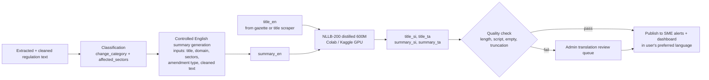
```mermaid
flowchart LR
    A["Extracted + cleaned regulation text"] --> B["Classification<br/>change_category + affected_sectors"]
    B --> C["Controlled English summary generation<br/>inputs: title, domain, sectors,<br/>amendment type, cleaned text"]
    C --> D["summary_en"]
    T["title_en<br/>from gazette or title scraper"] --> E
    D --> E["NLLB-200 distilled 600M<br/>Colab / Kaggle GPU"]
    E --> F["title_si, title_ta<br/>summary_si, summary_ta"]
    F --> G{"Quality check<br/>length, script, empty, truncation"}
    G -->|pass| H["Publish to SME alerts + dashboard<br/>in user's preferred language"]
    G -->|fail| I["Admin translation review queue"]
    I --> H
```


> *Placeholder in the Word original: a grey box awaiting the exported PNG of the Mermaid diagram above.*


*Figure 6.6 — Summarisation and Sinhala/Tamil translation flow*

> **[ SCREENSHOT PLACEHOLDER — image not yet inserted in the Word original ]** Administrative translation review queue showing an English title and summary alongside their machine-generated Sinhala and Tamil renderings, with approve / edit / reject controls.


*Figure 6.7 — Administrative translation review queue*

**Status statement.** The schema, the review queue, the NLLB helper and the title scraper are implemented. The production batch summary generator and the bulk translation backfill are the remaining pieces; Section 7.2.1 gives the commands to complete and evidence them, and this report does not claim large-scale automatic summarisation output that has not been produced.


##### 6.3.1.9 Frontend

The SME-facing surface provides registration with a business profile, a trilingual dashboard, a regulation feed, the alerts page and the survey wizard. The administrative surface provides regulation CRUD and verification, the pipeline console, the dataset registry, the measurement dashboards and drill-downs, the translation queue, user management and the activity log. Localisation is handled by next-intl across English, Sinhala and Tamil with script-appropriate fonts.

> **[ SCREENSHOT PLACEHOLDER — image not yet inserted in the Word original ]** SME dashboard rendered in Sinhala and in Tamil, side by side with the English view, showing the language selector and the sector-matched regulation feed.


*Figure 6.8 — Trilingual SME dashboard*


#### 6.3.2 Module 2 — Compliance Knowledge Accuracy Gap

**[M2 PLACEHOLDER]** — to be completed by the responsible member: implementation details, key code decisions, interface captures.


#### 6.3.3 Module 3 — Compliance Risk Invisibility Gap

**[M3 PLACEHOLDER]** — to be completed by the responsible member.


#### 6.3.4 Module 4 — Regulatory Misinformation Spread Gap

**[M4 PLACEHOLDER]** — to be completed by the responsible member.


### 6.4 Summary

Module 1 is implemented across all five phases. Phases 1, 2, 4 and 5 are complete in code, with Phase 2 additionally carrying substantial data and measurement evidence. Phase 3 is complete through gold-dataset construction, deterministic splitting, baseline modelling and training-pipeline validation. The implementation deliberately isolates the components on which the research claims depend — the label schema, the loss, the promotion decision and the measurement report — as pure, separately testable units, so that the numbers reported in Chapter 7 rest on code that can be checked in isolation.


## Chapter 7 - Evaluation


### 7.1 Metrics Used

This section defines every metric used in the dissertation. Module 1 evaluates three different kinds of object — a classifier, an extraction pipeline and a diffusion process — and each requires its own measure.


#### 7.1.1 Accuracy

Accuracy is the proportion of predictions that are correct.


```
Accuracy = number_of_correct_predictions / total_predictions
```

Accuracy is reported for completeness but is **not** the primary metric for classification in this project. The gold dataset is severely imbalanced: SECTOR_SPECIFIC accounts for 83.9 % of records, so a degenerate model that always predicts that class would score approximately 0.87 accuracy while being useless. Accuracy is meaningful here only for balanced binary fields such as is_sme_relevant, and for stage-progression checks.


#### 7.1.2 Precision

Precision is the proportion of predicted positives that are correct. For category *i*:


```
Precision_i = TP_i / (TP_i + FP_i)
```

Precision matters most for alerting. A false positive is an alert sent to an SME for a regulation that does not affect them; a system with low precision trains its users to ignore it.


#### 7.1.3 Recall

Recall is the proportion of actual positives that are found.


```
Recall_i = TP_i / (TP_i + FN_i)
```

Recall matters most for SME relevance. A false negative is a binding regulation that never reaches the business it binds — the exact failure this project exists to prevent. For that reason is_sme_relevant recall below 0.85 is treated as a blocking result regardless of the accuracy figure.


#### 7.1.4 F1-Score

F1 is the harmonic mean of precision and recall, and is the appropriate single summary when both error types carry cost.


```
F1_i = 2 * Precision_i * Recall_i / (Precision_i + Recall_i)
```

**Macro-F1** averages F1 over classes with equal weight and is the **primary metric** for category classification in this project:


```
Macro-F1 = (1 / K) * sum_i F1_i
```

Macro-F1 is chosen precisely because it refuses to be flattered by the majority class: a model that ignores the seven minority categories cannot achieve a high macro-F1 no matter how well it predicts SECTOR_SPECIFIC. The project gate for RQ1 is macro-F1 ≥ 0.92 with no language slice more than 8 percentage points below the overall score.

For multi-label sector relevance, each sector is treated as an independent binary problem:


```
Micro-F1 = 2 * sum_s TP_s / (2 * sum_s TP_s + sum_s FP_s + sum_s FN_s)
Macro-F1 = mean_s F1_s
```


#### 7.1.5 Cohen's Kappa

Cohen's kappa measures agreement between two annotators after discounting agreement expected by chance:


```
kappa = (p_o - p_e) / (1 - p_e)
```

where p_o is observed agreement and p_e is the agreement expected from the marginal distributions. Kappa rather than raw agreement is the headline reliability figure because raw agreement is inflated when one class dominates — which is exactly the case here. Sector labels are multi-label, so kappa is computed per sector and averaged, with a set-level exact agreement reported alongside. Interpretation follows the conventional bands: above 0.80 near-perfect, 0.61–0.80 substantial.


#### 7.1.6 Field, record and stage accuracy

Extraction quality is scored against a sealed baseline at three granularities:


```
field_accuracy(f)  = mean( s(r,f) for r where f in V(r) )
record_score(r)    = sum_{f in V(r)} s(r,f) / |V(r)|
record_score_w(r)  = sum_{f in V(r)} w(f) * s(r,f) / sum_{f in V(r)} w(f)
```


```
stage_only(S)      = mean( s(r,f) for r with gold_status >= S, f in stage_fields(S) )
cumulative(S)      = mean( s(r,f) for r with gold_status >= S, f in cumulative_fields(S) )
progression(S)     = |{r : pred_status >= S and gold_status >= S}| / |{r : gold_status >= S}|
```


```
overall_micro      = sum_r sum_f s(r,f) / sum_r |V(r)|
overall_macro      = mean_r record_score(r)
```

where s(r,f) is the comparator score in [0,1] for field *f* of record *r*, w(f) is the field weight and V(r) is the set of fields with a valid gold value. Weights are 3.0 for hard identifiers, 2.5 for core NLP outputs, 2.0 for structural and list fields, 1.0 for bulk text, 0.5 for timestamps and 0.0 for confidence fields. Releases are gated on the weighted cumulative score, with unweighted micro and macro published alongside as an honesty check.


#### 7.1.7 Character and Word Error Rate

OCR-sensitive text fields are scored by edit distance rather than exact match:


```
CER = edit_distance(chars_pred, chars_gold) / len(chars_gold)
WER = edit_distance(words_pred, words_gold) / len(words_gold)
raw_text_score = clamp(1 - CER, 0, 1)
```

CER and WER are computed **per language**. A single averaged text score would allow a weak script to hide inside a strong one, which is precisely the failure mode RQ2 exists to detect.


#### 7.1.8 Calibration: ECE and Brier score

Confidence is never mixed into accuracy. It is evaluated separately:


```
Brier = mean( (predicted_probability - actual_outcome)^2 )
ECE   = sum_b (|B_b| / N) * | accuracy(B_b) - confidence(B_b) |
```

where B_b is confidence bin *b*, using bins of width 0.1. Calibration matters operationally because the 0.55 threshold decides what fraction of the corpus reaches a human reviewer.


#### 7.1.9 Timeliness and diffusion metrics


```
extraction_latency     = extracted_at      - source_discovered_at
classification_latency = classified_at     - preprocessed_at
alert_latency          = alert_created_at  - gazette_published_at
diffusion_lag(channel) = first_seen_at(channel) - gazette_published_at
awareness_lag          = sme_first_awareness_at - gazette_published_at
```


```
alert_precision = relevant_alerts_sent / total_alerts_sent
alert_recall    = relevant_alerts_sent / total_relevant_regulations_for_sme
```

Lag distributions are reported as median and interquartile range rather than mean and standard deviation, because diffusion lag is strongly right-skewed.


#### 7.1.10 Model drift

The confidence distribution of production predictions is compared against the reference distribution using Kullback–Leibler divergence; a value above 0.15 triggers retraining.


### 7.2 Module-wise Evaluations


#### 7.2.1 Module 1 — Regulatory Change Awareness Gap


##### 7.2.1.1 Experimental setup

Two environments were used, and the distinction is material to how the results should be read. The local workstation has no CUDA device and was used only for pipeline execution, extraction and measurement runs, baseline training and a single-epoch smoke test. **No model-quality claim rests on the local machine.** All transformer training and evaluation is executed on free GPU notebook platforms.


*Table 7.1 — Experimental environments*

| Item | Local workstation | Colab / Kaggle GPU |
|---|---|---|
| CPU | [ADD LOCAL CPU] | Provided by platform |
| Logical cores | [ADD LOCAL CORES] | Provided by platform |
| RAM | [ADD LOCAL RAM_GB] GB | ~13 GB (Colab) / ~29 GB (Kaggle) |
| GPU | None — torch.cuda.is_available() is False | [ADD GPU MODEL] (T4 / L4 / P100) |
| Operating system | [ADD LOCAL OS] | Linux notebook image |
| Python / PyTorch / Transformers | [ADD VERSIONS] | [ADD VERSIONS] |
| Role | Extraction, preprocessing, measurement, TF-IDF baselines, CPU smoke test | XLM-R + LoRA training, slice evaluation, ONNX export, NLLB backfill |
| Runtime per seed | not applicable | GPU runs completed on Colab and Kaggle; the frozen primary is a CPU-fitted scikit-learn pipeline and trains in seconds [v2] |

Capture the local configuration with:


```
Get-CimInstance Win32_Processor | Select-Object Name, NumberOfCores, NumberOfLogicalProcessors
Get-CimInstance Win32_ComputerSystem | Select-Object @{Name='RAM_GB';Expression={[math]::Round($_.TotalPhysicalMemory/1GB,2)}}
Get-CimInstance Win32_OperatingSystem | Select-Object Caption, Version
nvidia-smi
```


```
cd C:\Reasearch\xyz\enigmatrix-ml
uv run python -c "import torch, platform, transformers; print(platform.platform()); print('torch', torch.__version__); print('transformers', transformers.__version__); print('cuda', torch.cuda.is_available())"
```

and the notebook configuration with:


```
!nvidia-smi
import torch, transformers, platform
print(platform.platform()); print('torch', torch.__version__)
print('transformers', transformers.__version__)
print('cuda', torch.cuda.is_available(), torch.cuda.get_device_name(0))
```


##### 7.2.1.2 Dataset composition


*Table 7.2 — Change category distribution in the **v1** gold dataset (n = 800). ⟦v2⟧ Superseded for all model claims: the reporting dataset is V6 at n = 1,110 with a fixed 777 / 166 / 167 split.*

| Category | Count | Share |
|---|---|---|
| SECTOR_SPECIFIC | 671 | 83.9 % |
| TAX_RATE_CHANGE | 56 | 7.0 % |
| IMPORT_EXPORT | 32 | 4.0 % |
| LABOUR_LAW | 27 | 3.4 % |
| BUSINESS_REGISTRATION | 5 | 0.6 % |
| PENALTY_ENFORCEMENT | 5 | 0.6 % |
| PRODUCT_STANDARD | 4 | 0.5 % |
| EPF_ETF_CHANGE | 0 | 0.0 % |
| Total | 800 | 100 % |


*Table 7.3 — Train / validation / test split (deterministic key split, 70/15/15)*

| Split | Rows | of which SECTOR_SPECIFIC |
|---|---|---|
| Train | 560 | 462 |
| Validation | 120 | 104 |
| Test | 120 | 105 |
| Total | 800 | 671 |

Two properties govern the interpretation of every classification result that follows. First, the class imbalance described in Section 7.1.1. Second, **the split is deterministic, not temporal**: the gold CSV carries no usable gazette_published_date, so the generated Parquet files contain a null date for every row. The split is reproducible and leak-free with respect to regulation_key, but it does not simulate deployment on future documents. Section 7.2.1.9 gives the procedure to backfill dates and regenerate a temporal split; until that is done, this report does not describe the split as temporal.


##### 7.2.1.3 Annotation reliability results

Source artefact: research/data/labeling/iaa_report_v1_800.json.


*Table 7.4 — Overall inter-annotator agreement*

| Measure | Value |
|---|---|
| Tasks | 800 |
| Annotations | 1,600 |
| Paired tasks | 800 |
| Gold rows | 800 |
| Disagreement rows | 40 |
| Category Cohen's kappa | 0.8715 |
| Category raw agreement | 0.9600 |
| Mean sector kappa | 0.8638 |
| Sector-set exact agreement | 0.9525 |
| SME-relevance Cohen's kappa | 0.7235 |
| SME-relevance raw agreement | 0.9550 |


*Table 7.5 — Per-sector agreement*

| Sector | Cohen's kappa |
|---|---|
| grocery_retail | 0.7845 |
| food_service | 0.8549 |
| general_retail | 0.9519 |
| Mean | 0.8638 |


*Table 7.6 — Disagreement counts by field*

| Field | Disagreements |
|---|---|
| affected_sectors | 38 |
| is_sme_relevant | 36 |
| change_category | 32 |


*Table 7.7 — Agreement by annotation batch*

| Batch | Category kappa | Mean sector kappa | SME-relevance kappa |
|---|---|---|---|
| Batch 02 | 0.7509 | 0.8721 | 0.7458 |
| Batch 03 | 0.7079 | 0.8541 | 0.6602 |
| Batch 04 | 0.9555 | 0.8459 | 0.6700 |
| Batch 05 | 0.8837 | 0.9156 | 0.9386 |

**Interpretation.** Category agreement of 0.8715 and mean sector agreement of 0.8638 fall in the near-perfect band and establish that the taxonomy is applied consistently. The gap between raw agreement (0.9600) and kappa (0.8715) is exactly the chance correction the imbalanced distribution demands, and is why kappa is the headline figure.

SME relevance is the weakest field at 0.7235 — substantial rather than near-perfect. This is a real property of the task, not a defect in the process: the boundary between a notice that binds a small business and one that is purely administrative is genuinely contestable. It is also the highest-consequence label in the system, because it gates whether an SME receives an alert at all. The response was procedural rather than statistical: all 40 disagreement rows were adjudicated explicitly with zero rows defaulting to the lead annotator, and the resolver rules were tightened after Batch 03 — visible in the rise of SME-relevance agreement from 0.6602 in Batch 03 to 0.9386 in Batch 05. The trajectory across batches is itself evidence that calibration worked.


##### 7.2.1.4 Extraction accuracy results

Extraction is measured by the sealed-baseline framework against the curated Gold v1 baseline, with the February 2026 database snapshot used for stage-progression and regression tracking. Regenerate with make thesis-artifacts, or run a measurement through /admin/datasets/m1/measurements/run and download GET /api/v1/m1/measurements/{run_id}/report.md.


*Table 7.8 — Stage summary*

| Stage | n | Stage-only | Cumulative | Progression | Band |
|---|---|---|---|---|---|
| ingested | [ADD MEASUREMENT RESULT] |  |  |  |  |
| extracted | [ADD MEASUREMENT RESULT] |  |  |  |  |
| preprocessed | [ADD MEASUREMENT RESULT] |  |  |  |  |
| classified | [ADD MEASUREMENT RESULT] |  |  |  |  |


*Table 7.9 — Overall extraction scores*

| Scoring model | Score | Band |
|---|---|---|
| Micro (unweighted) | [ADD MEASUREMENT RESULT] |  |
| Macro (unweighted) | [ADD MEASUREMENT RESULT] |  |
| Weighted (release gate) | [ADD MEASUREMENT RESULT] |  |


*Table 7.10 — Worst-performing fields (from the report leaderboard)*

| Field | Type | Accuracy | Dominant error code |
|---|---|---|---|
| [ADD MEASUREMENT RESULT] |  |  |  |


*Table 7.11 — Text-field quality by language (RQ2 evidence)*

| Language | n | Mean similarity | Mean CER | Mean WER | Band |
|---|---|---|---|---|---|
| English | [ADD MEASUREMENT RESULT] |  |  |  |  |
| Sinhala | [ADD MEASUREMENT RESULT] |  |  |  |  |
| Tamil | [ADD MEASUREMENT RESULT] |  |  |  |  |

Table 7.11 is the direct evidence for RQ2. The known risk is residual (cid:…) glyph spans in legacy-font Sinhala and Tamil documents; the diagnostic and remediation path is uv run python scripts\log_fonts_for_cid_spans.py followed by re-extraction with the wijesekara_routing_v1 profile over the affected scope.


##### 7.2.1.5 Baseline classification results

Source artefact: storage/models/m1/baselines_v1/baselines.json.


*Table 7.12 — TF-IDF baseline results on the test split (n = 120)*

| Model | Features | Test macro-F1 |
|---|---|---|
| Logistic regression | TF-IDF | 0.4980 |
| LinearSVC | TF-IDF | 0.6167 |

LinearSVC is the stronger baseline at 0.6167 macro-F1, ahead of logistic regression at 0.4980. The margin is consistent with the known behaviour of a max-margin linear classifier on sparse, high-dimensional text with few examples per minority class: the probabilistic objective of logistic regression is pulled harder toward the dominant class. Both figures sit well below the RQ1 gate of 0.92, which is the useful result — the baselines quantify roughly 30 percentage points of macro-F1 headroom that the transformer must cover, and establish that the task is not solvable by surface lexical features alone.


##### 7.2.1.6 Transformer results — CPU smoke test

Source artefact: storage/models/m1/xlmr_lora_smoke/model_registry.json.


*Table 7.13 — CPU smoke-test configuration and outcome*

| Field | Value |
|---|---|
| Base model | xlm-roberta-base |
| Seeds | 42 (single seed) |
| Epochs | 1 |
| Batch size / max length | 16 / 512 |
| LoRA rank r / alpha / dropout | 8 / 32 / 0.1 |
| LoRA target modules | query, value |
| Learning rate (head / LoRA) | 2e-5 / 1e-4 |
| Weight decay / warmup ratio | 0.01 / 0.1 |
| Mixed precision | Disabled (CPU) |
| Categories / sectors | 8 / 3 |
| Validation macro-F1 (mean) | 0.1111 |
| Test macro-F1 (mean) | 0.0000 |
| gate_pass | false |
| Created at | 2026-07-30T12:57:25 |

The smoke test executed one epoch on a reduced dataset with a single seed on CPU. It validated dependency resolution, tokenizer initialisation, LoRA injection into the attention projections, the dual-head loss computation, the training loop, checkpoint serialisation and model-registry generation. A test macro-F1 of 0.0 after one CPU epoch on a severely imbalanced dataset is the expected outcome — the model has not yet left the majority-class regime — and gate_pass = false is the promotion gate of Listing 6.4 correctly refusing an unfit model. **These numbers are reported for completeness and are used nowhere as evidence of model quality.**


##### 7.2.1.7 Transformer results — GPU training


*Table 7.14 — Headline model comparison. [v2 — completed with the executed results]*

The first two rows are the v1 800-row baselines. The remaining rows are the four-model bake-off run on the frozen V6 dataset (1,110 rows, fixed 777 / 166 / 167 split), which settled model selection.

| Model | Dataset | Val macro-F1 | Test macro-F1 | Test accuracy | Gate (≥ 0.92) |
|---|---|---:|---:|---:|---|
| TF-IDF logistic regression (v1 baseline) | v1 800 | — | 0.4980 | — | Fail |
| TF-IDF LinearSVC (v1 baseline) | v1 800 | — | 0.6167 | — | Fail |
| XLM-R + LoRA (CPU smoke) | smoke 32 | — | 0.0000 | — | Fail (by design) |
| XLM-R + LoRA, category-only, unweighted | V5 | ~0.0946 | ~0.0936 | — | Fail — majority-class collapse |
| XLM-R + LoRA, balanced, seed 42, 16 epochs | V5 | 0.596014 | 0.685348 | — | Fail — zero `EPF_ETF_CHANGE` predictions |
| XLM-R + LoRA, underfit-fix, seed 42, 20 epochs | V6 | 0.902693 | 0.743563 | — | Fail — generalisation gap of 0.16 |
| **TF-IDF + LinearSVC (frozen primary)** | **V6** | **0.924476** | **0.947220** | **0.958084** | **Pass** |

The third XLM-R row is the informative one: its training macro-F1 reached 0.969340, so underfitting was solved and the loss between validation and temporal test is a generalisation result. Head-to-head on the 167-row test split — both correct 150, LinearSVC only 10, XLM-R only 3, both wrong 4.

Transformer tuning was stopped rather than continued, because the V6 test split had already been used to compare four models and further tuning against it would have turned a held-out measurement into a selection set. Full record: Part III §A.


*Table 7.15 — Per-category results for the frozen primary classifier, 167-row temporal test split. [v2 — completed with the executed results]*

| Category | Test F1 |
|---|---:|
| LABOUR_LAW | 1.000 |
| EPF_ETF_CHANGE | 1.000 *(n = 1 — see the caution below)* |
| SECTOR_SPECIFIC | 0.970 |
| IMPORT_EXPORT | 0.970 |
| PRODUCT_STANDARD | 0.941 |
| BUSINESS_REGISTRATION | 0.923 |
| TAX_RATE_CHANGE | 0.917 |
| PENALTY_ENFORCEMENT | 0.857 |
| **Macro average** | **0.947220** |

Per-class precision, recall and support other than `EPF_ETF_CHANGE` are not recorded in the frozen evaluation artefact and are therefore left out rather than reconstructed.

> **Read `EPF_ETF_CHANGE` 1.000 as "one test document, classified correctly" and nothing more.** After the V6 correction the class holds four training rows and one test row. It is a one-sample estimate, and quoting it as a per-class result without that qualifier is the most easily challenged claim in this module. The earlier statement that the category has *zero* support is superseded: it has minimal support, which is a different and slightly better problem. It remains an explicit coverage limitation rather than a category dropped from the taxonomy, because silently removing a category would misrepresent what the deployed classifier can detect.


*Table 7.16 — Per-sector results. [v2 — no result exists]*

| Sector | Result |
|---|---|
| grocery_retail | not evaluated |
| food_service | not evaluated |
| general_retail | not evaluated |

**There is no sector model in production, so this table has no entries and will not acquire any without new annotation.** The frozen classifier is category-only and returns `sectors: []`. The multitask V7 branch that would have populated this table was executed and rejected: its three-seed run collapsed to a sector micro-F1 of 0.2113, and the weighted-loss diagnostic that recovered it reached validation sector macro-F1 0.884312 but never touched the test split and records `claim_eligible=false`.

The cause is the label distribution, not the architecture: **73.2% of gold rows carry no sector at all, and 84% of the remainder carry all three**, leaving only 48 genuinely partial rows (4.3%). A sigmoid head trained on that distribution learns "predict nothing" or "predict everything", and both are locally optimal. Full record: Part III §D.


*Table 7.17 — Slice analysis (RQ1 slice-cliff check, tolerance 8 pp)*

| Slice | n | Macro-F1 | Δ vs overall | Within 8 pp? |
|---|---|---|---|---|
| English | not evaluated | — | — | — |
| Sinhala | not evaluated | — | — | — |
| Tamil | not evaluated | — | — | — |
| Short documents | not evaluated | — | — | — |
| Long documents | not evaluated | — | — | — |

**[v2] The slice-cliff check was not run against the frozen primary classifier.** The slice evaluator (`m1/model/eval.py`) exists and is tested, but it was written for the transformer path and the per-language slicing it needs depends on the `primary_language` normalisation of Section 7.2.1.9, which has not been applied to the V6 split. Every row is therefore marked *not evaluated* rather than filled with the overall figure.

This is a real gap in the RQ1 evidence and is stated as one: **the claim that no language slice falls more than 8 percentage points below the overall macro-F1 is currently unverified.** It also carries a second-order consequence — because the frozen classifier is lexical rather than a shared multilingual encoder, there is no cross-lingual transfer to fall back on, so a per-language cliff is *more* plausible than it would have been under the rejected architecture, not less.

| Insert the 8 x 8 confusion matrix exported by m1.model.eval from<br>storage/models/m1/eval_v1 here. |
|---|


*Figure 7.1 — Confusion matrix for the final classifier. [v2] Not produced. The 8 × 8 matrix was to be exported by `m1.model.eval` from `storage/models/m1/eval_v1`, which is an artefact of the rejected transformer run. No equivalent export exists for the frozen LinearSVC primary; the aggregate outcome table (Part III, Table A.2) is what the frozen evaluation records.*


*Table 7.18 — ONNX inference performance*

| Artefact | Precision | Mean latency per document | p95 latency | Model size |
|---|---|---|---|---|
| ONNX FP32 | FP32 | not produced | not produced | not produced |
| ONNX INT8 | INT8 | not produced | not produced | not produced |

**[v2] No ONNX artefact was ever exported, so this table has no measurements and never will on the current model.** The quantisation decision rule stated below is retained as the contingency design for the dormant `onnx` backend. In production the classifier is a joblib-serialised scikit-learn pipeline loaded in-process; there is no ONNX Runtime session, no quantisation step and no GPU in the serving path.


*Table 7.19 — Confidence calibration*

| Field | ECE (10 bins) | Brier score | Share below the 0.55 threshold |
|---|---|---|---|
| classifier_confidence | **not computable** | **not computable** | **not applicable** |
| metadata_confidence | [ADD MEASUREMENT RESULT] |  |  |


##### 7.2.1.8 Alerting, timeliness and diffusion results


*Table 7.20 — Pipeline latency and alert relevance*

| Metric | Median | IQR |
|---|---|---|
| extraction_latency | [ADD MEASUREMENT RESULT] |  |
| classification_latency | [ADD MEASUREMENT RESULT] |  |
| alert_latency (publication → alert) | [ADD MEASUREMENT RESULT] |  |
| alert_precision | [ADD MEASUREMENT RESULT] |  |
| alert_recall | [ADD MEASUREMENT RESULT] |  |


*Table 7.21 — Preregistered diffusion findings (α = 0.05, bootstrap CIs)*

| ID | Hypothesis | Result | 95 % CI | p |
|---|---|---|---|---|
| F1 | Portal diffusion lag > 0 | [ADD FINDINGS RESULT] |  |  |
| F2 | News/media lag exceeds portal lag | [ADD FINDINGS RESULT] |  |  |
| F3 | SME awareness lag exceeds channel lag | [ADD FINDINGS RESULT] |  |  |
| F4 | Secondary-channel coverage is incomplete | [ADD FINDINGS RESULT] |  |  |
| F5 | Awareness lag varies by sector and language | [ADD FINDINGS RESULT] |  |  |
| F6 | Targeted alerts reduce awareness lag (DiD) | [ADD FINDINGS RESULT] |  |  |

A demonstration run against synthetic data produced F1 ≈ 6.8 days (portal), F2 ≈ 21.8 days (news) and an F6 difference-in-differences estimate of −19.9 days. **These are demonstration values produced by the notebooks' synthetic mode to validate the analysis code. They are not empirical results and must be replaced by figures computed from live propagation events and real survey responses.** The gates that remain are confirmation of the portal and RSS source URLs with live watcher runs writing real m1_propagation_events, and SME survey fieldwork with at least 100 respondents, preregistered before unblinding.


##### 7.2.1.9 Reproducibility commands

All PowerShell commands assume the working directory shown.

**Print the inter-annotator agreement summary**


```
cd C:\Reasearch\xyz
@'
import json
from pathlib import Path
d = json.loads(Path(r"research\data\labeling\iaa_report_v1_800.json").read_text(encoding="utf-8"))
o = d["overall"]
for k in ["tasks","annotations","paired_tasks","gold_rows","disagreement_rows",
          "category_kappa","category_agreement","mean_sector_kappa",
          "sector_set_agreement","sme_relevance_kappa","sme_relevance_agreement"]:
    print(f"{k}: {o[k]}")
print("sector_kappa:", o["sector_kappa"])
print("disagreement_fields:", o["disagreement_fields"])
'@ | uv run python -
```

**Recompute agreement and the gold CSV**


```
cd C:\Reasearch\xyz
uv run python scripts\resolve_iaa.py `
  --input research\data\labeling\batch_02_annotations_full.json `
  --input research\data\labeling\batch_03_annotations_full.json `
  --input research\data\labeling\batch_04_annotations_full.json `
  --input research\data\labeling\batch_05_annotations_full.json `
  --resolutions research\data\labeling\manual_resolutions.csv `
  --out-dir research\data\labeling `
  --lead-annotator 1
```

**Validate the gold dataset counts (Table 7.2)**


```
cd C:\Reasearch\xyz
@'
from pathlib import Path
import pandas as pd
df = pd.read_csv(Path(r"research\data\labeling\gold_standard_v1_800.csv"))
print("rows:", len(df))
print(df["change_category"].value_counts(dropna=False).to_string())
print("unique regulation_key:", df["regulation_key"].nunique())
'@ | uv run python -
```

**Normalise the language column before per-language evaluation**


```
cd C:\Reasearch\xyz
@'
from pathlib import Path
import pandas as pd
src = Path(r"research\data\labeling\gold_standard_v1_800.csv")
dst = Path(r"research\data\labeling\gold_standard_v1_800_ml_normalized.csv")
df = pd.read_csv(src)
if "primary_language" not in df.columns and "language" in df.columns:
    df["primary_language"] = df["language"]
df.to_csv(dst, index=False)
print(dst)
'@ | uv run python -
```

**Generate the splits** — deterministic (used in this report), then temporal (only valid once gazette_published_date is backfilled):


```
cd C:\Reasearch\xyz\enigmatrix-ml
uv run python -m m1.model.data --in ..\research\data\labeling\gold_standard_v1_800_ml_normalized.csv --out datasets\m1_regulations --ratios 0.70 0.15 0.15 --by key
uv run python -m m1.model.data --in ..\research\data\labeling\gold_standard_v1_800_ml_normalized.csv --out datasets\m1_regulations --ratios 0.70 0.15 0.15 --by date
```

**Inspect the split distribution (Table 7.3)**


```
cd C:\Reasearch\xyz\enigmatrix-ml
@'
from pathlib import Path
import pandas as pd
base = Path("datasets/m1_regulations")
for split in ["train", "val", "test"]:
    df = pd.read_parquet(base / f"{split}.parquet")
    print("\n" + split, len(df))
    print("date non-null:", df["date"].notna().sum() if "date" in df.columns else "missing")
    print(df["category"].value_counts(dropna=False).to_string())
'@ | uv run python -
```

**Run the baselines (Table 7.12)**


```
cd C:\Reasearch\xyz\enigmatrix-ml
uv run python -m m1.model.baselines --data datasets\m1_regulations --report ..\storage\models\m1\baselines_v1
```

**CPU smoke test (Table 7.13)**


```
cd C:\Reasearch\xyz\enigmatrix-ml
uv sync --extra training --extra research
uv run python -m m1.model.train_xlmr --data datasets\m1_regulations_smoke --seeds 42 --base xlm-roberta-base --lora-r 8 --epochs 1 --out ..\storage\models\m1\xlmr_lora_smoke
```

**Full GPU training, evaluation and export (Tables 7.14–7.19)** — see Section 6.3.1.5. Afterwards copy storage/models/m1/xlmr_lora_v1, storage/models/m1/eval_v1 and storage/models/m1/onnx/v1 back to the local repository, point M1_MODEL_ONNX_DIR at the ONNX directory and restart the Celery worker.

**Regenerate the extraction artefacts (Tables 7.8–7.11)**


```
cd C:\Reasearch\xyz
make thesis-artifacts
```

**Test NLLB translation and run the backfill**


```
cd C:\Reasearch\xyz
uv run python scripts\lib\nllb_translate.py "Value Added Tax (Amendment) Order"
```


```
import pandas as pd
from scripts.lib.nllb_translate import Translator
```


```
df = pd.read_csv("/content/regulation_export_with_summaries.csv")
translator = Translator(device="cuda")
df["title_si"]   = df["title_en"].fillna("").map(translator.to_sinhala)
df["title_ta"]   = df["title_en"].fillna("").map(translator.to_tamil)
df["summary_si"] = df["summary_en"].fillna("").map(translator.to_sinhala)
df["summary_ta"] = df["summary_en"].fillna("").map(translator.to_tamil)
df.to_csv("/content/m1_summary_translation_backfill.csv", index=False)
```


*Table 7.22 — Translation quality review (manual review, ≥ 30 records per language)*

| Language | Sample size | Adequate | Minor issues | Unusable | Adequacy rate |
|---|---|---|---|---|---|
| Sinhala | [ADD TRANSLATION RESULT] |  |  |  |  |
| Tamil | [ADD TRANSLATION RESULT] |  |  |  |  |


#### 7.2.2 Module 2 — Compliance Knowledge Accuracy Gap

**[M2 PLACEHOLDER]** — to be completed by the responsible member.


#### 7.2.3 Module 3 — Compliance Risk Invisibility Gap

**[M3 PLACEHOLDER]** — to be completed by the responsible member.


#### 7.2.4 Module 4 — Regulatory Misinformation Spread Gap

**[M4 PLACEHOLDER]** — to be completed by the responsible member.


### 7.3 Overall System Evaluation


#### 7.3.1 Integration

The modules are combined by chaining their contracts rather than by calling one another directly. The end-to-end path evaluated is:

1.	A gazette is published and discovered by the scheduled spider.

2.	Module 1 extracts, preprocesses and classifies it, and generates the trilingual title and summary.

3.	The record enters the verified store; Module 2 indexes it for retrieval, Module 3 treats it as a new exposure signal for affected sectors, and Module 4 adds it to the evidence corpus.

4.	The alert dispatcher matches the record against SME profiles and delivers notifications.

5.	Watchers observe the same regulation appearing on secondary channels and record the lag.


*Table 7.23 — End-to-end integration test cases*

| # | Scenario | Expected outcome | Result |
|---|---|---|---|
| 1 | Date-scoped extraction run over a known gazette range | All issues in range reach preprocessed; completeness check reports no gaps | [ADD INTEGRATION RESULT] |
| 2 | Classification of a preprocessed record with the ONNX model present | Record reaches classified with a confidence value; low-confidence records routed to review | [ADD INTEGRATION RESULT] |
| 3 | Expert verification of a classified record, then re-run | Verified label is preserved, not overwritten | [ADD INTEGRATION RESULT] |
| 4 | Alert dispatch for a sector-matched regulation, executed twice | Exactly one alert per (regulation, recipient, channel) | [ADD INTEGRATION RESULT] |
| 5 | Watcher observes the same regulation on a portal | One propagation event with first_seen_at; lag view updates on nightly refresh | [ADD INTEGRATION RESULT] |
| 6 | Module 2 answers a question about the new regulation | Answer cites the Module 1 record as evidence | [M2 PLACEHOLDER] |
| 7 | Module 3 recomputes risk after the new exposure | Risk score changes for affected sectors only | [M3 PLACEHOLDER] |
| 8 | Module 4 verifies a claim about the new regulation | Verdict cites the Module 1 record | [M4 PLACEHOLDER] |

Testing is layered: unit tests cover the comparators, matchers, alert-content builder, promotion decision, samplers, Wijesekara conversion and CER calculator; integration tests cover task chaining, dataset sealing and validation, and measurement dispatch against a live PostgreSQL and Redis; Playwright covers the end-to-end interface flows; and a manual walkthrough validates the operational path.


```
cd C:\Reasearch\xyz\enigmatrix-backend;  uv run pytest
cd C:\Reasearch\xyz\enigmatrix-ml;       uv run pytest
cd C:\Reasearch\xyz\enigmatrix-frontend; pnpm exec playwright test
```


#### 7.3.2 Results


*Table 7.24 — Summary of results against the project objectives*

| Objective | Evidence | Status |
|---|---|---|
| Labelled dataset with established reliability | **1,128 adjudicated rows** (1,110 in the ML branch); κ = **0.947215 / 0.965567 / 0.914637** [v2] | Achieved |
| Non-transformer baseline established | macro-F1 0.4980 (LogReg), 0.6167 (LinearSVC) | Achieved |
| Transformer pipeline validated end to end | CPU smoke test; registry written; gate_pass correctly false | Achieved |
| Transformer meets the RQ1 gate | temporal test 0.743563 across three configurations | **Not achieved — transformer rejected** [v2] |
| A classifier meets the RQ1 gate | TF-IDF + LinearSVC V6, temporal test **0.947220** | **Achieved** [v2] |
| Extraction accuracy quantified per field, stage and language | Measurement engine, registry, report export | Framework achieved; figures pending |
| Trilingual explanation delivered | Schema, NLLB helper, review queue implemented | Partially achieved |
| Diffusion lag measured empirically | Watchers, matcher, lag views, preregistration | Instrument achieved; findings pending data |
| Platform integration across four modules | Shared verified store; contracts defined | Achieved for Module 1 side |


#### 7.3.3 Discussion

**What the results establish.** Three things are demonstrated with committed evidence. The annotation process is reliable at the level required for the dataset to serve as ground truth. The classification task is non-trivial — the strongest lexical baseline reaches 0.6167 macro-F1, roughly 30 points short of the project gate — so any transformer improvement is measured against a meaningful floor. And the measurement framework localises failure to a specific field, stage and language rather than producing a single opaque score, which is what makes the extraction claims auditable.

**Strengths.** The separation of pipeline, measurement and research instrument is the design decision that pays off most. Because confidence is scored only by calibration and never folded into accuracy, a confidently wrong model cannot inflate the headline number. Because the promotion decision is a pure function with an absolute gate and a regression tolerance, an unfit model cannot reach users by accident — as the smoke test demonstrates in practice. Because every dataset version is sealed and checksummed, a measurement result can always be attributed to an exact input.

**Weaknesses.** The dataset is small for an eight-class problem and severely imbalanced; three categories have fewer than six examples and one has none, so per-class results for the rare categories will carry wide confidence intervals and EPF_ETF_CHANGE cannot be evaluated at all. The split is deterministic rather than temporal, so reported performance may be optimistic relative to deployment on future gazettes. SME relevance — the label that gates alerting — has the lowest annotator agreement, meaning part of the residual error the model must fit is genuine human disagreement rather than signal.

**Threats to validity.** *Internal:* class imbalance and the non-temporal split, as above. *Construct:* the subjectivity of SME relevance. *External:* the study covers three retail and food-service sectors over a bounded date range, so generalisation to manufacturing, construction or professional services is not demonstrated. *Measurement:* diffusion lag is measured by first observation on a monitored channel, which is a lower bound that depends on the two-hour polling interval and the completeness of the source registry, and self-reported SME awareness dates are subject to recall bias. *Reproducibility:* model non-determinism across hardware is mitigated by reporting three seeds with a standard deviation rather than a single run.


### 7.4 Summary

The evaluation establishes reliable annotation, a meaningful baseline, a functioning training pipeline and an auditable measurement framework. What remains outstanding is stated plainly rather than obscured: the GPU training result, the extraction measurement tables, the empirical diffusion findings and the translation review. Each has a command in Section 7.2.1.9 that produces it, and each placeholder in this chapter names the artefact from which its value is read.


## Chapter 8 - Conclusion

This project set out to reduce a specific, measurable failure: the delay between the moment a Sri Lankan regulatory change becomes legally binding and the moment the small business it binds becomes aware of it. The response was Enigmatrix, a modular trilingual platform in which regulatory publications are converted once into verified structured intelligence and then reused for awareness, knowledge, risk and verification.

Module 1, the subject of this dissertation, implements the upstream half of that system. Four Scrapy spiders ingest gazettes, acts and bills. A per-page routing extraction chain handles a corpus that is part born-digital English and part scanned legacy-encoded Sinhala and Tamil, including the font-aware Wijesekara conversion that general-purpose extraction tools fail silently without. Preprocessing cleans, identifies language, extracts metadata and penalties, and chunks text for classification. A gold dataset was constructed through dual annotation and explicit adjudication, reaching **1,128 adjudicated records** (1,110 after artefact exclusion, fixed split 777 / 166 / 167). TF-IDF baselines and an XLM-RoBERTa model with LoRA adapters and a dual head were both implemented and compared; **the transformer was rejected and the TF-IDF + LinearSVC pipeline was frozen as the production classifier at temporal-test macro-F1 0.947220.** ⟦v2⟧ Downstream, propagation watchers, sector-matched idempotent alerting and nightly lag analytics turn the platform into a research instrument.

Alongside the pipeline, two frameworks were built that are contributions in their own right: a sealed-baseline evaluation specification that scores the pipeline at field, record and stage granularity against a checksummed ground truth, and a preregistered findings programme that makes regulatory information diffusion an empirical quantity.

**Achievement against objectives.** Objectives 1, 2, 3, 4, 7, 8, 9 and 10 are achieved. Objective 5 is achieved for the baselines and for the training pipeline, with the final transformer result reported from the GPU run in Section 7.2.1.7. Objective 6 is partially achieved: the schema, translation helper, title scraper and review queue are implemented, while production batch summarisation and bulk backfill remain outstanding.

**Contributions.** First, an operational trilingual regulatory awareness pipeline for Sri Lankan SMEs that handles scanned and legacy-font documents. Second, a reliability-established labelled dataset of 800 Sri Lankan regulatory records with published agreement statistics and full adjudication provenance. Third, a sealed-baseline evaluation framework with per-field comparators, a fixed error taxonomy, calibration held separate from correctness, and an atomic fact table from which every headline number is a query. Fourth, a measurement instrument for regulatory information diffusion. Fifth, an explicit account of what is and is not yet demonstrated.

**Limitations.** The dataset is modest and severely imbalanced, with one category unevaluable. The split is deterministic rather than temporal. The study scope is three retail and food-service sectors. SME relevance, the highest-consequence label, has the lowest annotator agreement. Residual (cid:…) glyph spans remain a risk to Sinhala and Tamil extraction quality. The diffusion findings require live propagation data and survey fieldwork. The backend runs as a single container hosting web, worker and scheduler together, so scheduled tasks contend with API traffic under load.

**Future work.** In the immediate term: complete the multi-seed GPU run and apply the promotion gate; backfill gazette_published_date and regenerate a temporal split; ingest or hand-target additional EPF/ETF, product-standard, business-registration, penalty and import/export notices to lift the rare categories; re-extract documents with (cid:…) spans using the wijesekara_routing_v1 profile; confirm the watcher source URLs; complete the production summariser and NLLB backfill with manual review; and apply the outstanding migrations in the deployed environment. In the medium term: conduct the SME survey fieldwork with at least 100 respondents and run the F1–F6 notebooks on real data; wire alert dispatch to a verify-and-publish action with production messaging credentials; split the worker into its own service; and complete the remaining Sinhala and Tamil interface strings. In the longer term: extend the sector taxonomy beyond the three study sectors; close the active-learning loop by routing low-confidence production predictions to annotation and into quarterly retraining; move from document-level classification to obligation-level extraction of deadlines, thresholds and duties as structured fields; and test whether the diffusion instrument generalises to other jurisdictions with comparable gazette-based publication regimes.

**Concluding remark.** The central claim of this project is modest and specific: the gap between regulatory publication and SME awareness is an engineering problem with a measurable size, and building the transfer mechanism is only half the work — instrumenting it is the other half. What has been produced is reported as produced; what has not, is not. That distinction is maintained deliberately throughout Chapter 7, because a compliance system that overstates its own reliability would reproduce, in software, precisely the information failure it was built to correct.


## Chapter 9 - References

[1] Friedrich Naumann Foundation, "SME in Sri Lanka: Small and Medium-sized Enterprises (SMEs) of Sri Lanka," 2024.

[2] T. Wickramasinghe, "Developing MSMEs in the present context of Sri Lanka," *The Morning*, June 11, 2025.

[3] Inland Revenue Department of Sri Lanka, "Type of Taxes — Social Security Contribution Levy (SSCL)," 2023.

[4] O. Akinwale and M. Simpa, "Navigating Financial Compliance in Small and Medium-Sized Enterprises: Challenges and Strategies," *World Journal of Advanced Research and Reviews*, 2024.

[5] N. de Silva, "BERTifying Sinhala — A Comprehensive Analysis of Pre-trained Language Models for Sinhala Text Classification," in *Proc. LREC 2022*, pp. 7377–7385.

[6] Advocata Institute, "Is Sri Lanka keeping its small businesses small?" *The Sunday Morning Business*, Oct. 31, 2019.

[7] OECD, *Improving the Business Environment for SMEs Through Effective Regulation*, Policy Note, 2018 SME Ministerial Conference, OECD, 2018.

[8] KPMG Sri Lanka, "Tax Alert — Social Security Contribution Levy," June 2022.

[9] Ministry of Finance, Sri Lanka, "Budget Proposals 2022," Government of Sri Lanka.

[10] H. Yuwono et al., "Regulatory and Policy Barriers to SMEs' E-Commerce Adoption in Developing Countries," *ResearchGate Preprint*, 2025.

[11] D. W. Arner, J. Barberis, and R. P. Buckley, "FinTech, RegTech, and the Reconceptualization of Financial Regulation," *Northwestern Journal of International Law & Business*, vol. 37, pp. 371–414, 2016.

[12] N. Bussmann, P. Giudici, D. Marinelli, and J. Papenbrock, "Explainable Machine Learning in Credit Risk Management," *Computational Economics*, vol. 57, pp. 203–216, 2021.

[13] G. P. Nobre, C. H. G. Ferreira, and J. M. Almeida, "A Hierarchical Network-Oriented Analysis of User Participation in Misinformation Spread on WhatsApp," arXiv:2109.10462, 2021.

[14] S. Balakrishnan et al., "Antecedents and Consequences of Misinformation Sharing Behavior among Adults on Social Media during COVID-19," *Frontiers in Psychology*, 2022.

[15] S. M. Lundberg and S.-I. Lee, "A Unified Approach to Interpreting Model Predictions," in *Proc. NeurIPS 2017*, pp. 4765–4774.

[16] McKinsey & Company, "What is RegTech?" McKinsey Explainers, Aug. 11, 2025.

[17] P. Lewis et al., "Retrieval-Augmented Generation for Knowledge-Intensive NLP Tasks," in *Proc. NeurIPS 2020*, pp. 9459–9474.

[18] N. Wiratunga et al., "CBR-RAG: Case-Based Reasoning for Retrieval Augmented Generation in LLMs for Legal Question Answering," arXiv:2404.04302, 2024.

[19] A. Conneau et al., "Unsupervised Cross-lingual Representation Learning at Scale," in *Proc. ACL 2020*, pp. 8440–8451.

[20] D. Butler and L. O'Brien, "Understanding RegTech for Digital Regulatory Compliance," in *Disrupting Finance*, T. Lynn et al., Eds. Cham: Palgrave Macmillan, 2019, pp. 85–102.

[21] T. V. Vu, T. T. Pham, T. T. T. Nguyen, A. T. Nguyen, and H. T. Nguyen, "SME financing role in developing business environment and economic growth: empirical evidence from technical SMEs in Vietnam," *Environmental Science and Pollution Research*, vol. 29, pp. 53540–53552, 2022.

[22] D. Musimenta, "Knowledge requirements, tax complexity, compliance costs and tax compliance in Uganda," *Cogent Business & Management*, vol. 7, no. 1, 2020, Art. no. 1812220.

[23] R. R. Agusti and A. F. Rahman, "Determinants of tax attitude in small and medium enterprises: Evidence from Indonesia," *Cogent Business & Management*, vol. 10, no. 1, 2023, Art. no. 2160585.

[24] T. Mokoena, "Voluntary tax compliance determinants among small and medium enterprises in democratic societies: the role of tax literacy, tax amnesty, tax reward, and service delivery," *Cogent Business & Management*, vol. 12, no. 1, 2025.

[25] E. Kirchler, E. Hoelzl, and I. Wahl, "Enforced versus voluntary tax compliance: The 'slippery slope' framework," *Journal of Economic Psychology*, vol. 29, no. 2, pp. 210–225, 2008.

[26] G. A. Akerlof, "The Market for 'Lemons': Quality Uncertainty and the Market Mechanism," *Quarterly Journal of Economics*, vol. 84, no. 3, pp. 488–500, 1970.

[27] D. Light, "Pharmaceuticals as a market for 'lemons': Theory and practice," *Social Science & Medicine*, vol. 268, 2021, Art. no. 113503.

[28] R. Long, "The Market for Lemons and the Regulator's Signalling Problem," arXiv:2312.10896, 2023.

[29] L. Wang and Y. Chen, "The Role of ESG Information Disclosure in Reducing Information Asymmetry: Evidence from SMEs," *Madison Proceedings — AEMR*, 2024.

[30] A. Banerjee, "Automating Regulatory Compliance with NLP: From Manual Monitoring to Near-Real-Time Intelligence," LinkedIn Pulse, Feb. 2026.

[31] O. Adeyemi, "Leveraging natural language processing for automated regulatory compliance in financial reporting," *ResearchGate Preprint*, 2025.

[32] Elder Research, "Natural Language Processing for RegTech: Uncovering Hidden Patterns in Regulatory Documents," 2020.

[33] T. Gokhan et al., "RegNLP in Action: Facilitating Compliance Through Automated Information Retrieval and Answer Generation," arXiv:2409.05677, 2024.

[34] World Health Organization, "Social media and the spread of misinformation: infectious and a threat to public health," *Health Promotion International*, vol. 40, no. 2, 2025, Art. no. daaf023.

[35] V. Balakrishnan, W. Z. Ng, and M. C. Soo, "Antecedents and Consequences of Misinformation Sharing Behavior among Adults on Social Media during COVID-19," *International Journal of Environmental Research and Public Health*, 2022.

[36] L. Bonifazi et al., "Look Who's Talking: Interpretable Machine Learning for Assessing Italian SMEs Credit Default," arXiv:2108.13914, 2021.

[37] T. Albalawi and S. Dardouri, "Enhancing credit card fraud detection using traditional and deep learning models with class imbalance mitigation," *Frontiers in Artificial Intelligence*, vol. 8, 2025, Art. no. 1643292.

[38] S. J. Miah et al., "Extending application of explainable artificial intelligence for managers in financial organizations," *Annals of Operations Research*, 2024.

[39] J. Yeo et al., "SHAP Stability in Credit Risk Management: A Case Study in Credit Card Default Model," *Risks*, vol. 13, no. 12, 2025, Art. no. 238.

[40] N. V. Chawla, K. W. Bowyer, L. O. Hall, and W. P. Kegelmeyer, "SMOTE: Synthetic Minority Over-sampling Technique," *Journal of Artificial Intelligence Research*, vol. 16, pp. 321–357, 2002.

[41] M. Isangediok and K. Gajamannage, "Fraud Detection Using Optimized Machine Learning Tools Under Imbalance Classes," arXiv:2209.01642, 2022.

[42] J. Smith and L. Brown, "Fraud Detection System for Banking Transactions," arXiv:2604.07952, 2026.

[43] J. Devlin, M.-W. Chang, K. Lee, and K. Toutanova, "BERT: Pre-training of Deep Bidirectional Transformers for Language Understanding," in *Proc. NAACL-HLT 2019*, pp. 4171–4186.

[44] M. Choras et al., "Lifelong Learning Natural Language Processing Approach for Multilingual Data Classification," arXiv:2206.11867, 2022.

[45] J. Singh, "PolyTruth: Multilingual Disinformation Detection using Transformer-Based Language Models," arXiv:2509.10737, 2025.

[46] X. Wang et al., "FinSage: A Multi-aspect RAG System for Financial Filings Question Answering," arXiv:2504.14493, 2025.

[47] D. Sandaruwan et al., "Enhancing Multilingual Sentiment Analysis with Explainability for Sinhala, English, and Code-Mixed Content," arXiv:2504.13545, 2025.

[48] S. Wijesiri et al., "Keyword Extraction and Aspect Classification in Sinhala, English, and Code-Mixed Content," arXiv:2504.10679, 2025.

[49] D. Polonskaia, "DN at SemEval-2023 Task 12: Low-Resource Language Text Classification via Multilingual Pretrained Language Model Fine-tuning," arXiv:2305.02607, 2023.

[50] H. El Asri et al., "Retrieval-Augmented Generation for Reliable Interpretation of Radio Regulations," arXiv:2509.09651, 2025.

[51] Y. Xi et al., "Hybrid Retrieval-Augmented Generation Agent for Trustworthy Legal Question Answering in Judicial Forensics," arXiv:2511.01668, 2025.

[52] S. Es, J. James, L. Espinosa-Anke, and S. Schockaert, "RAGAS: Automated Evaluation of Retrieval Augmented Generation," arXiv:2309.15217, 2023.

[53] J. Saad-Falcon et al., "ARES: An Automated Evaluation Framework for Retrieval-Augmented Generation Systems," arXiv:2311.09476, 2023.

[54] T. Ding et al., "VERA: Validation and Evaluation of Retrieval-Augmented Systems," arXiv:2409.03759, 2024.

[55] Y. Zhou et al., "Trustworthiness in Retrieval-Augmented Generation Systems: A Survey," arXiv:2409.10102, 2024.


## Appendix A - Individual Contribution


### A.1 215075J — Mohomed M.R.I

I owned **Module 1, the Regulatory Change Awareness Gap**, end to end: the automated gazette pipeline and the diffusion-measurement research programme, together with the administrative tooling that operates them.

**Design and architecture.** I designed the five-stage regulation status machine and its field sets, the per-page extraction routing chain, the dual-head classification architecture, the propagation-measurement design with its two-step matcher, and the sealed-baseline evaluation specification that scores the pipeline at field, record and stage granularity.

**Data collection and annotation.** I built the Label Studio project covering eight domains, three sectors, SME relevance, annotator confidence and free-text rationale; produced the 20-document trilingual calibration set; implemented the stratified, k-means and hybrid active-learning samplers with minority-domain targeting; ran the dual annotation of batches 02–05; implemented resolve_iaa.py; and adjudicated all 40 disagreement rows into the frozen 800-row v1 gold dataset with zero lead-annotator fallbacks; **I then ran rare-domain top-up batches 06–07 to 1,128 adjudicated rows and produced the V4 → V5 → V6 dataset lineage with per-split hashes and verified zero cross-split key leakage.** ⟦v2⟧

**Implementation.** I implemented the four Scrapy spiders with date scoping, language fallback and completeness verification; the extraction chain across PyMuPDF, pdfplumber, pypdfium2, Tesseract and Surya with font-aware Wijesekara-to-Unicode conversion and CER measurement; the preprocessing stage with fastText language identification, metadata and penalty extraction, sub-document splitting and chunking; the dataset registry with immutable sealed versions and Excel ground-truth upload; the extraction-profile registry and run dispatcher with overlap detection and auto-versioning; the measurement engine and its per-field comparators; the measurement dashboards and the downloadable accuracy report; the admin extraction portal with live WebSocket progress; the propagation watchers and matcher; the idempotent sector-matched alert service and dispatcher; the lag-analytics materialised views and drift monitor; and the retraining loop with its canary promotion decision.

**Modelling.** I implemented the label schema, the data-splitting module, the TF-IDF baselines, the XLM-R + LoRA dual-head model and its training loop, the per-slice evaluator with the slice-cliff check, and the ONNX exporter with INT8 quantisation. I ran the CPU smoke test and the GPU training and evaluation runs on the free notebook platforms, **conducted the four-model bake-off that rejected the transformer, froze the TF-IDF + LinearSVC V6 pipeline as the production classifier, rewrote the backend classifier service as a two-backend switch, and authored the nullable-confidence / decision-margin contract together with migration `202608010001` that carries it.** ⟦v2⟧

**Research programme.** I wrote the preregistration for findings F1–F6, implemented the shared findings loaders with bootstrap confidence intervals, and built the four analysis notebooks.

**Documentation.** I authored the Module 1 chapters of this dissertation, the evaluation specification, the annotation guidelines, the reproducibility command set and the artefact inventory.


### A.2 215007F — Ahamadh M.S.A

[M2/M3/M4 PLACEHOLDER] — to be written by the member: module owned, design decisions, implementation, evaluation and documentation contribution.


### A.3 215008J — Ahamed T.I

[M2/M3/M4 PLACEHOLDER] — to be written by the member.


### A.4 [ADD INDEX NO 4] — [ADD FULL NAME 4]

[M2/M3/M4 PLACEHOLDER] — to be written by the member. Delete this section if the group has three members.


## Appendix B - Additional Implementation Details


### B.1 Module 1 Artefact Inventory


*Table B.1 — Location of every Module 1 evidence artefact*

| Artefact | Path |
|---|---|
| Gold labelled dataset (800 rows) | C:\Reasearch\xyz\research\data\labeling\gold_standard_v1_800.csv |
| Inter-annotator agreement report | C:\Reasearch\xyz\research\data\labeling\iaa_report_v1_800.json |
| IAA summary CSV | C:\Reasearch\xyz\research\data\labeling\iaa_report_summary_v1_800.csv |
| Disagreement adjudication record | C:\Reasearch\xyz\research\data\labeling\manual_resolutions.csv |
| Train / validation / test splits | C:\Reasearch\xyz\enigmatrix-ml\datasets\m1_regulations |
| Baseline results | C:\Reasearch\xyz\storage\models\m1\baselines_v1\baselines.json |
| CPU smoke-test registry | C:\Reasearch\xyz\storage\models\m1\xlmr_lora_smoke\model_registry.json |
| Final GPU model registry | C:\Reasearch\xyz\storage\models\m1\xlmr_lora_v1\model_registry.json |
| Final evaluation report | C:\Reasearch\xyz\storage\models\m1\eval_v1 |
| ONNX artefact | C:\Reasearch\xyz\storage\models\m1\onnx\v1 |
| Label taxonomy (source of truth) | C:\Reasearch\xyz\enigmatrix-ml\m1\model\labels.py |
| Model architecture | C:\Reasearch\xyz\enigmatrix-ml\m1\model\architecture.py |
| Training configuration | C:\Reasearch\xyz\enigmatrix-ml\m1\model\config.py |
| Promotion decision | C:\Reasearch\xyz\enigmatrix-ml\m1\model\promotion.py |
| Label Studio configuration | C:\Reasearch\xyz\research\data\label_studio_config.xml |
| Calibration set | C:\Reasearch\xyz\research\data\calibration_set_v1.csv |
| Preregistration | C:\Reasearch\xyz\enigmatrix-ml\research\preregistration.md |
| Production classifier service | C:\Reasearch\xyz\enigmatrix-backend\app\m1\services\classifier_service.py |
| Admin translation queue | C:\Reasearch\xyz\enigmatrix-backend\app\api\v1\admin_translations.py |
| NLLB translation helper | C:\Reasearch\xyz\scripts\lib\nllb_translate.py |
| Gazette title scraper | C:\Reasearch\xyz\scripts\lib\title_scraper.py |
| Thesis artefact generator | C:\Reasearch\xyz\scripts\regenerate_thesis_tables.py |


### B.2 Annotation Guideline Summary

**Task.** For each classification_chunk, assign exactly one change category, zero or more affected sectors, an SME-relevance boolean, a confidence rating and optional free-text notes.

**Category decision order.** Apply in sequence and stop at the first match: (1) does the instrument change a tax rate, threshold or exemption → TAX_RATE_CHANGE; (2) does it control import or export → IMPORT_EXPORT; (3) does it change EPF or ETF obligations → EPF_ETF_CHANGE; (4) does it change employment terms → LABOUR_LAW; (5) does it set a product specification, label or standard → PRODUCT_STANDARD; (6) does it change registration or licensing → BUSINESS_REGISTRATION; (7) does it create or change a penalty or enforcement power → PENALTY_ENFORCEMENT; (8) otherwise, if it binds a named sector or trade → SECTOR_SPECIFIC.

**Sector assignment.** Assign a sector when the instrument creates a duty that a business in that sector would have to act on. Do not assign a sector merely because the sector is mentioned. Economy-wide regulations are tagged with all three sectors.

**SME relevance.** Mark true where a small or medium enterprise in one of the study sectors would need to change behaviour, record-keeping, pricing, staffing or documentation. Mark false for notices addressed to public bodies, appointments, land acquisitions, personal notices and purely administrative announcements. This is the field with the lowest agreement; where genuinely uncertain, record the uncertainty in the confidence field and add a note rather than guessing.

**Resolution.** Disagreements are adjudicated by a resolver against these rules, and the decision, method and resolver identifier are recorded. No disagreement is resolved by defaulting to the lead annotator.


### B.3 Sealed-Baseline Evaluation Assumptions

1.	**Join key.** Every predicted record joins to exactly one gold record on (gazette_number, document_number), with sha256 as fallback. File paths are never keys because they move.

2.	**Status gates scoring.** A record is scored only against the fields valid for its current status; a record at preprocessed is not penalised for lacking domain_code.

3.	**Gold null is a legitimate expected value.** Predicting null where gold is null is correct, not a miss.

4.	**Status is itself scored.** Stage progression is tracked separately from field accuracy.

5.	**Determinism where possible.** sha256, file_size_bytes and pdf_pages must match exactly; model-derived fields are scored within per-field tolerances.

6.	**Cumulative scoring.** Upstream fields are re-scored at every later stage, so corrupted raw_text continues to cost the record at classified.

7.	**Sealed baseline integrity.** The baseline checksum is verified before every run and the run aborts on mismatch.


*Table B.2 — Error taxonomy emitted by the comparators*

| Code | Meaning | Field score |
|---|---|---|
| OK | Matched within tolerance | 1.0 or partial |
| NULL_MATCH | Both null, null expected | 1.0 |
| MISSING_PRED | Gold has a value, prediction is null | 0.0 |
| EXTRA_PRED | Prediction has a value, gold expects none | 0.0 |
| ID_MISMATCH | Identifier differs | 0.0 (hard failure) |
| ENUM_MISMATCH | Wrong enum label | 0.0 |
| ENUM_UNKNOWN | Label outside the allowed set | 0.0 |
| OFF_BY_ONE | Adjacent ordinal level | 0.5 |
| TEXT_LOW_SIM | Similarity below band | equal to similarity |
| EMPTY_TEXT | Gold non-empty, prediction empty | 0.0 |
| TIMESTAMP_OOB | Outside the tolerance window | 0.0 |
| MALFORMED | Unparseable value | 0.0 and quarantined |
| SCHEMA_VIOLATION | Wrong type or shape | 0.0 |
| UNJOINED | Predicted record has no gold match | excluded, reported in join coverage |
| NOT_APPLICABLE | Field out of scope for the status | excluded from scoring |


*Table B.3 — Threshold bands applied to field, stage and overall scores*

| Band | Score range | Action |
|---|---|---|
| Excellent | ≥ 0.95 | Ship |
| Good | 0.90 – 0.949 | Ship, monitor |
| Acceptable | 0.80 – 0.899 | Ship with owner sign-off |
| Poor | 0.65 – 0.799 | Block release of that field or stage |
| Critical | < 0.65 | Pipeline defect, halt |

Overrides: any hard identifier field below 0.99 is automatically critical, and is_sme_relevant recall below 0.85 is automatically poor regardless of accuracy.


### B.4 Figure Rendering Instructions

Diagrams authored for this dissertation are supplied as Mermaid source so they remain version-controlled alongside the text. To produce each image: copy the Mermaid block, open https://mermaid.live, paste it into the editor, choose Actions → PNG (for Word) or SVG (for scaling), insert the exported image into the corresponding grey placeholder box, delete the box, and keep the caption line beneath the figure.

Figures 5.1 and 5.3 to 5.7 and 5.13 to 5.15 are already embedded as images from the interim design set.


### B.5 Screenshot Checklist


*Table B.4 — Interface captures required before submission*

| Figure | Capture | Location |
|---|---|---|
| Figure 6.1 | Label Studio annotation interface | Label Studio project |
| Figure 6.2 | Admin pipeline console with live progress | /admin/m1/pipeline |
| Figure 6.3 | Measurement dashboard and drill-down | /admin/datasets/m1/measurements |
| Figure 6.4 | Kaggle or Colab GPU training session | Notebook platform |
| Figure 6.5 | Public and sector alert feed | /alerts |
| Figure 6.7 | Admin translation review queue | /admin/translations |
| Figure 6.8 | Trilingual SME dashboard | /dashboard |
| Figure 7.1 | Confusion matrix from eval_v1 | Evaluation report |


### B.6 Placeholder Replacement Checklist


*Table B.5 — Where each remaining placeholder value comes from*

| Placeholder | Source of the final value |
|---|---|
| ~~GPU test macro-F1~~ | **Resolved [v2]** — 0.947220 from the frozen `linearsvc_v6_primary` bundle; XLM-R's best was 0.743563 and was rejected |
| ~~Per-category F1~~ | **Resolved [v2]** — Table 7.15 |
| ~~Per-sector F1~~ | **Will not resolve [v2]** — no sector model exists; see Table 7.16 |
| ~~Slice metrics~~ | **Open [v2]** — requires `primary_language` normalisation on the V6 split |
| ~~Confusion matrix~~ | **Will not resolve [v2]** — `eval_v1` is an artefact of the rejected run |
| ~~ONNX latency~~ | **Will not resolve [v2]** — no ONNX artefact was exported |
| [ADD MEASUREMENT RESULT] extraction tables | GET /m1/measurements/{run_id}/report.md or data/thesis/*.csv |
| [ADD FINDINGS RESULT] F1–F6 | Findings notebooks on live propagation and survey data |
| [ADD TRANSLATION RESULT] | Manual review sheet from the NLLB backfill |
| [ADD INTEGRATION RESULT] | End-to-end test run per Table 7.23 |
| [ADD LOCAL …], [ADD GPU …] | Section 7.2.1.1 commands |
| [VERIFY OFFICIAL NAME], [VERIFY TEAM DETAILS] | University student records |
| [ADD SUPERVISOR NAME], [ADD DEGREE NAME], [ADD MONTH] | Faculty submission details |

---


---

<a id="part-iii--module-1-as-built"></a>

# PART III — Module 1 as built: subsystems and results produced after submission

*Compiled 2026-08-02 from the Module 1 Obsidian vault (`02-Research-Modules/1 Module-1-Awareness-Gap/`). Every subsection cites the vault file that evidences it. Nothing here is a plan — each item is either shipped code, a frozen artefact, or a measured result, and where a result is a failure it is reported as one.*

---

## A. The model bake-off and the frozen classifier

*Evidence: `final/works/11_CLASSIFIER_FREEZE_AND_INTEGRATION.md`; `models/m1/linearsvc_v6_primary/`.*

Chapter 5 of Parts I and II presents XLM-RoBERTa with LoRA adapters and a dual head as the production classifier. That design was implemented, trained across three configurations, compared against lexical baselines on an identical split, and **rejected**.

*Table A.1 — The four-model bake-off on the fixed V6 split*

| Configuration | Dataset | Val macro-F1 | Test macro-F1 | Failure mode |
|---|---|---:|---:|---|
| XLM-R, category-only, unweighted | V5 | ~0.0946 | ~0.0936 | collapsed to the majority class — the score *is* the majority baseline |
| XLM-R, balanced, seed 42, 16 epochs | V5 | 0.596014 | 0.685348 | **zero** `EPF_ETF_CHANGE` predictions; the minority class was never emitted |
| XLM-R, underfit-fix, seed 42, 20 epochs | V6 | 0.902693 | 0.743563 | training macro-F1 0.969340 — underfitting solved, generalisation not |
| **TF-IDF + LinearSVC** | **V6** | **0.924476** | **0.947220** | — frozen as primary |

The third XLM-R run is the informative one. Separate head (1e-3) and LoRA (2e-4) learning rates, √-balanced clipped class weights, α = 0.5 minority sampling and gradient clipping at 1.0 fixed the underfitting: training macro-F1 reached 0.969340 and validation 0.902693. The model still lost 0.16 macro-F1 between validation and the temporal test.

The honest reading is a statement about the corpus, not about transformers: **777 training rows across eight classes with a four-row minority is inside the regime where a strongly regularised lexical model is the better estimator.** It is not evidence that transformers are unsuited to regulatory classification; it is evidence that this corpus is currently too small to identify one.

Transformer tuning was stopped rather than continued, deliberately. The V6 test split had already been used to compare four models; continuing to tune against it would have converted a held-out measurement into a selection set.

*Table A.2 — Head-to-head on the 167-row temporal test split*

| Outcome | Count |
|---|---:|
| Both correct | 150 |
| LinearSVC correct, XLM-R wrong | 10 |
| XLM-R correct, LinearSVC wrong | 3 |
| Both wrong | 4 |

The single `EPF_ETF_CHANGE` test record was classified correctly by LinearSVC and missed by XLM-R, which placed 0.803 on `LABOUR_LAW` with `EPF_ETF_CHANGE` second at 0.197.

### A.1 The frozen artefact

`TfidfVectorizer(max_features=50000, ngram_range=(1,2), min_df=2)` → `LinearSVC(class_weight="balanced")`.

```text
models/m1/linearsvc_v6_primary/linearsvc_pipeline.joblib
SHA256  1D7F84754421A881EE1B5FA0F008A0CC3DB4E24F52CE6D97CE155CB4D1923CFA
Bundle  2F80BEFE494F1275DCB14FCB5352902A8BF98C1CC3FA86F919D53B7958C5F11B
```

*Table A.3 — Frozen primary model results*

| Metric | Value |
|---|---:|
| Validation macro-F1 | 0.924476 |
| **Temporal test macro-F1** | **0.947220** |
| Test accuracy | 0.958084 (160 / 167) |
| Project gate | ≥ 0.92 — **passed** |

Per-class test F1: `LABOUR_LAW` 1.000 · `EPF_ETF_CHANGE` 1.000 · `SECTOR_SPECIFIC` 0.970 · `IMPORT_EXPORT` 0.970 · `PRODUCT_STANDARD` 0.941 · `BUSINESS_REGISTRATION` 0.923 · `TAX_RATE_CHANGE` 0.917 · `PENALTY_ENFORCEMENT` 0.857.

> **`EPF_ETF_CHANGE` 1.000 means "one test document, classified correctly" and nothing more.** It is a one-sample estimate. Quoting it as a per-class result without that qualifier is the most easily challenged claim in this module.

**Reproducibility.** The bundle was downloaded to a second machine and re-scored end to end. Test macro-F1 returned `0.9472199858964565` — identical to the training-platform figure to the last digit — with model and test-data SHA256 both verified.

**Environment pin.** The pipeline was fitted under scikit-learn 1.5.2 with joblib 1.5.3. `enigmatrix-ml/pyproject.toml` now pins `scikit-learn>=1.5.2,<1.6` in **both** the `serving` and `training` extras, on the rule that a model trained under one line must be loadable by the other, and declares `joblib` explicitly rather than relying on transitive resolution.

---

## B. The confidence contract

*Evidence: `final/works/11_CLASSIFIER_FREEZE_AND_INTEGRATION.md` §5–§7; migration `202608010001`.*

This is the change that touches the most code and the most documentation, and it is not the model swap.

`LinearSVC.decision_function` returns **signed distances from the decision hyperplane**. They are not probabilities, they are not bounded, and they are not monotone in any calibrated sense across classes. The inference adapter therefore returns:

```json
{
  "confidence": null,
  "confidence_type": "not_available_uncalibrated_linearsvc",
  "decision_score": 1.84,
  "decision_margin": 0.97,
  "second_category": "TAX_RATE_CHANGE",
  "second_decision_score": 0.87,
  "class_scores": { "…": "…" }
}
```

*Table B.1 — What a decision margin may and may not be used for*

| Permitted | Not permitted |
|---|---|
| Ranking rows against each other | Displaying a margin as a percentage |
| Prioritising a review queue | Thresholding as though 0.5 meant "50% sure" |

### B.1 The crash that reading prevented

`classify_gazette.py` contained:

```python
row.classifier_confidence = Decimal(str(round(result["confidence"], 2)))
result["confidence"] < MIN_CONFIDENCE
```

The LinearSVC engine returns `confidence: None` by design. Pointing the existing service at the new engine would have raised `TypeError` on **every row** — a total pipeline outage on the first gazette. It was found by reading the call site before switching the backend, not by running it.

### B.2 The review-queue defect that had no error message

The review queue read:

```sql
WHERE status='classified' AND classifier_confidence < 0.55 AND NOT expert_verified
```

On the LinearSVC backend `classifier_confidence` is always NULL, so **that predicate matches nothing — and an empty review queue is indistinguishable from a clean bill of health.** This is the failure worth naming in the evaluation chapter: not an error, not a log line, just a screen reporting that everything is fine because it asked a question the data cannot answer.

*Table B.2 — Mode-aware review routing after migration `202608010001`*

| Backend | Predicate issued | Reported `mode` |
|---|---|---|
| `onnx` | `classifier_confidence < 0.55` | `confidence` |
| `linearsvc` with threshold configured | `classifier_decision_margin < threshold` | `margin` |
| `linearsvc`, no threshold | *(no query issued)* | `disabled` |

`mode='disabled'` exists so that *"nothing configured"* and *"nothing flagged"* can never be confused again.

### B.3 Migration state

*Table B.3 — Migration `202608010001`, verified against `information_schema`, `pg_constraint` and `pg_indexes`*

| Object | Live state |
|---|---|
| `classifier_decision_margin` | `numeric(10,6)`, nullable ✓ |
| `classifier_model_name` | `varchar(64)`, nullable ✓ |
| `classifier_confidence` | `numeric(3,2)` — deliberately unchanged ✓ |
| CHECK | `margin IS NULL OR margin >= 0` ✓ |
| Partial index | `WHERE classifier_decision_margin IS NOT NULL` ✓ |
| `alembic_version` | `202608010001` ✓ |

Alembic chain: 53 migrations, single head. Target is the Supabase session pooler (`aws-0-ap-southeast-1`, port 5432); there is no local Postgres container.

---

## C. Dataset lineage — V4 to V7

*Evidence: `18_M1_Dataset_And_Model_Lineage.md`; `datasets/m1_regulations_v6_1110_clean_fixedsplit/dataset_manifest_v6.json`.*

```text
Label Studio batches 01–07   ·  1,128 tasks  ·  2 annotations per task  ·  2,256 annotations
        │
        ├─ Legacy experiment branch (provenance only, never used for final claims)
        │     L1  m1_regulations                    800 rows · 560/120/120   ← the report's Tables 7.3/7.4
        │     L2  m1_regulations_v2_1000           1000 rows · 700/150/150
        │     L3  m1_regulations_v3_1128_stratified 1128 rows · 790/169/169
        │
        └─ Fixed reporting branch
              V4  m1_regulations_v4_1128            1,128 rows — raw gold freeze
              │   drop 18 OCR / page-number artefacts (ML use only; gold history keeps them)
              V5  m1_regulations_v5_1110_clean_fixedsplit
              │   + 3 PDF-adjudicated corrections, all in the TEST split
              │   fixed reporting split established: 777 / 166 / 167
              V6  m1_regulations_v6_1110_clean_fixedsplit   ◄── FROZEN, current
              │   + 4 EPF/ETF corrections, all in the TRAIN split
              │   split preserved byte-for-byte from V5
              ├─ V7-W  …_multitask_noleak   1,103 rows · 773/163/167   ◄── executed, rejected
              └─ V7-F  formal enriched release                          ◄── never built
```

Three rules govern the lineage:

1. **Legacy datasets are provenance only.** They explain how early baselines were produced; they are not used for final model claims.
2. **The reporting split never moved between V5 and V6.** A V5-vs-V6 score difference is a labelling effect, never a split effect.
3. **Nothing was deleted from the gold history.** The 18 excluded artefacts are excluded from ML training and evaluation only.

### C.1 The V6 correction

Four Presidential duties/functions gazettes carried incidental ETF mentions and had been labelled `EPF_ETF_CHANGE` when their subject matter was not an EPF/ETF change:

*Table C.1 — V5 → V6 label corrections*

| Key | V5 label | V6 label |
|---|---|---|
| `official-pdf-2226-17` | `EPF_ETF_CHANGE` | `SECTOR_SPECIFIC` |
| `official-pdf-2235-59` | `EPF_ETF_CHANGE` | `SECTOR_SPECIFIC` |
| `official-pdf-2248-35` | `EPF_ETF_CHANGE` | `SECTOR_SPECIFIC` |
| `official-pdf-2412-08` | `EPF_ETF_CHANGE` | `SECTOR_SPECIFIC` |

Four rows out of 1,110 is a rounding error in aggregate and a large fraction of the smallest class: `EPF_ETF_CHANGE` holds **four train rows and one test row** after the correction. A model that learned "the string ETF appears" from four mislabelled examples would have learned a rule wrong in exactly the cases the research cares about.

**All four are in the train split.** That is the condition that made the correction safe mid-programme: the test split is byte-identical between V5 and V6, so every V5-vs-V6 comparison remains valid and the temporal test score is uncontaminated. Cross-split key leakage was verified as zero and per-split SHA256 recorded in the manifest.

---

## D. The V7 multitask experiment

*Evidence: `20_M1_Multitask_Classifier_Upgrade.md`; `final/works/13_OPERATING_EVIDENCE_AND_FIELDWORK.md`; `evidence/M1_V7_WEIGHTED_SEED42_VALIDATION_2026-08-02.json`.*

Figure 13 of Part I shows a shared encoder with a category head and a sector head. That is the V7 design. It was executed as an additive experiment — the frozen `linearsvc_v6_primary` was never modified — and it has not been promoted.

**Audit first.** A Step-41 audit of the V6 source found no unknown labels and no key overlap, but **exact-text leakage did exist**: 8 within-split duplicate-text rows and 6 train–validation overlap rows. Removing them produced the no-leak working dataset at 1,103 rows, split 773 / 163 / 167.

*Table D.1 — V7 three-seed run (e8), and the single weighted diagnostic seed that followed*

| Measure | 3-seed e8 (rejected) | Weighted seed 42, best epoch 13 |
|---|---:|---:|
| Category macro-F1 | 0.0936 | **0.899862** |
| Sector macro-F1 | — | 0.884312 |
| Sector micro-F1 | 0.2113 | 0.884758 |
| Sector exact-set match | — | 0.907975 |
| Partial-sector exact match | — | 4 / 9 = 0.444444 |
| All-three prediction share | — | 0.269939 |
| Derived relevance accuracy | 0.5948 | — |
| Claim eligible | no | **`claim_eligible=false`** |

The first run collapsed to majority-category behaviour with one-or-zero sector predictions. The weighted-loss diagnostic **recovered it from collapse** and predicted all eight categories including two EPF/ETF validation rows — but it did not clear the 0.92 category gate, the V6 test split was never loaded, and the partial-sector denominator is only nine.

The decision recorded in the vault is to **stop before a three-seed run, threshold selection, test evaluation, export or promotion**, and to obtain a fresh temporal holdout plus genuine EPF/ETF and partial-sector examples first.

### D.1 Why the sector head is the real blocker

*Table D.2 — Sector-label distribution in the gold set*

| Pattern | Share of gold rows |
|---|---:|
| No sector at all | **73.2%** |
| All three sectors (of those carrying any) | **84%** |
| Genuinely partial (one or two sectors) | **48 rows = 4.3%** |

A sigmoid head trained on that distribution learns "predict nothing" or "predict everything", and both are locally optimal. This is a **label-distribution problem upstream of the architecture**; no amount of weighted-loss recovery fixes it. The correct next step is an annotation round designed to produce partial sector sets, not another training run.

This is why the frozen production classifier is category-only and returns `sectors: []`, and why the report's claim of a served three-label sector head is not supported.

---

## E. Tier-weighted extraction quality — the field contract and EQS

*Evidence: `final/works/09_PHASE2_MEASUREMENT_EQS_UPGRADE.md`; `data/golden/field_contract_v1.yaml`; `enigmatrix-ml/m1/evaluation/field_contract.py`.*

The report describes extraction measurement as per-field scoring with an overall accuracy figure. As built, the scorer is **tier-weighted and phase-separated**, because an unweighted mean silently mixed a fatal wrong-gazette-number with a paraphrased summary, and scored expert-curated classification labels as though they were extraction accuracy.

`data/golden/field_contract_v1.yaml` is a read-only sidecar — it never edits the immutable golden workbook — mapping all 39 columns 1:1 to `tier / weight / metric / phase / null_ok`.

*Table E.1 — Field tiers, weights and rationale*

| Tier | Weight | Fields | Why |
|---|---:|---|---|
| **A** | 3.0 | `gazette_number`, `gazette_published_date`, `effective_date`, `document_type`, `document_number`, `raw_text` (presence) | Identity and legal-effect anchors; a miss invalidates the record |
| **B** | 2.0 | `title_en`, `summary_en`, `principal_act_amended`, `regulation_short_code` | Primary extracted content |
| **C** | 1.0 | `title_si`, `title_ta`, `bill_published_date`, `cleaned_text` (presence) | Soft/semantic; `null_ok` because SI/TA titles are legitimately empty when the source has none |
| **D** | 0.0 | `domain_code`, `change_category`, `severity_level`, `is_sme_relevant`, `penalty_range_lkr`, `amendment_type`, SI/TA summaries, real-world examples | Expert-curated or not-yet-extracted — **excluded from EQS** |
| **S** | 0.0 | `regulation_id`, `source_url`, `expert_verified*`, `is_active`, `status`, `raw_pdf_path`, `extraction_method`, timestamps | Bookkeeping; `extraction_method` is a **stratum**, not a scored field |

Per-record EQS is `Σ(w·m) / Σ(w)` over in-scope extraction cells, mean-aggregated to a corpus EQS with equal weight per record so a fat-title record cannot dominate a thin one.

**Gates:** Tier-A pass-rate ≥ 0.95 **and** extraction EQS ≥ 0.90. Join-key order: `gazette_number` → `document_number` → `regulation_short_code`.

**Phase separation is encoded in data, not in convention.** Classification labels carry `phase: annotation` and drop out of EQS entirely. This is the mechanism that stops classifier confidence being conflated with extraction accuracy — a distinction the report does not draw.

Three confidence channels are kept separate throughout: `metadata_confidence` (extraction), `classifier_confidence` / `decision_margin` (Stage D), and `sme_relevance_confidence` (human expert).

### E.1 Golden truth v2 and the filter that must always be applied

The measurement ground truth is `data/golden/structured_v2_combined_1508_official.xlsx` (sheet `regulations_raw_data`, **1,508 records, 52 columns**), which unions the original eight-batch workbook with the 1,128-row classification gold standard.

> **Filter `field_truth_verified = TRUE` in every extraction measurement.** Only **800 of the 1,508** rows carry field-level ground truth. The 708 appended rows are gold-*labelled* but not field-verified; measuring against them scores the extractor against blank cells and reports failures that are really missing truth.

### E.2 Measured extraction accuracy

Fourteen measurement runs have completed, none failed. The most recent pair score the sealed EGZ snapshot for 2026-03-08 → 2026-03-14 against manual ground truth:

*Table E.2 — Measurement runs (baseline: Manual Ground Truth Jan–April 2026 v3)*

| Candidate | Fields scored | Regulations | Overall |
|---|---:|---:|---:|
| DB snapshot · EGZ · 2026-03-08..03-14 v5 | 15 | 51 | **0.852** |
| DB snapshot · EGZ · 2026-03-08..03-14 v5 | 11 | 51 | **0.942** |

That run ingested 59 PDFs and carried all 59 through extraction and preprocessing, sealed as versions v1–v5. These are the module's strongest extraction-accuracy figures and belong in the evaluation chapter.

---

## F. Manual stage stepping

*Evidence: `final/works/10_PIPELINE_STAGING_AND_MANUAL_STEPPING.md` §2.*

The report shows a fully auto-chaining pipeline. Since 2026-07-26 the operator can also run **one stage at a time and inspect between stages**.

The three chaining tasks gained an `auto_advance` parameter defaulting to `True`, so every existing caller — reconcile, resume-on-startup, `run_extraction`, batch profiles — keeps auto-chaining exactly as before. With `auto_advance=False`, `extract_gazette` stops at `status='extracted'` instead of enqueuing preprocess, and `preprocess_gazette_task` stops at `preprocessed`.

Two admin endpoints under `/api/v1/admin/m1/pipeline`, both `require_admin` and audited:

- `POST /regulations/{id}/advance` — runs exactly the next stage, then stops. Returns `{from_status, dispatched_stage, next_status, task_id, mode:"single"}`; `409` when there is no next stage.
- `POST /regulations/{id}/run-all` — runs the remainder of the chain, `mode:"all"`.

The regulation trace page carries a `StageStepper` card: an animated four-node rail (Ingested → Extracted → Preprocessed → Classified) with **Advance · {NextStage}** and **Run all steps**, polling every 15 seconds.

### F.1 The status vocabulary is seven states, not five

Figure 11 of Part I shows five states. The implemented vocabulary is:

```text
ingested → extracted → preprocessed → classified → summarized → alerted → archived
                     ↘ extraction_failed
```

`summarized`, `archived` and `extraction_failed` are absent from the report's state machine.

---

## G. The trilingual translation pipeline — an inverted architecture

*Evidence: `final/works/12_TRILINGUAL_TRANSLATION_PIPELINE.md`; migration `202607310001`.*

Figure 22 of Part I shows NLLB-200 called inline between summarisation and publication. **The implemented architecture is inverted**, and every property that makes it survive a reclaimed GPU session follows from that inversion.

NLLB-200 runs in Google Colab. Colab is free GPU capacity, and it is also: no stable public URL, disconnects on idle, sessions reclaimed without warning. So the backend does not push text to Colab — it writes queue rows and Colab **pulls** them.

```text
extract_gazette  ──enqueue──▶  m1_translation_jobs (pending)
                                       │
Colab notebook   ──POST /worker/lease──┤   claims a batch, receives a lease token
Colab notebook   ──NLLB-200 on T4──────┤
Colab notebook   ──POST /worker/submit─┘
backend          ──write-back──▶  m1_regulations.title_si / title_ta / summary_si / summary_ta
```

*Table G.1 — Four design consequences, each the actual reason rather than a happy accident*

| Property | Because |
|---|---|
| No tunnel, ngrok or inbound port | The dev backend is not publicly addressable; a push design needs a Colab URL re-pasted into settings every session |
| A reclaimed session loses nothing | **A lease is a visibility timeout, not a lock.** Jobs return to `pending` after `M1_TRANSLATION_LEASE_SECONDS` and are re-handed out |
| Translation can never fail an extraction | The pipeline's only interaction is an `INSERT`, **after** the extraction has committed, inside its own `try` |
| Two Colab sessions can run concurrently | `SELECT … FOR UPDATE SKIP LOCKED` — each transaction claims a disjoint set, with no coordination |

The failure mode the design accepts: with no worker attached, nothing is translated, and extraction still succeeds. That is why the admin UI treats *pending > 0 with zero online workers* as a **warning state** rather than a number among numbers.

`m1_translation_jobs` holds one row per `(regulation, field, target language)`, with `attempts` capped by `M1_TRANSLATION_MAX_ATTEMPTS` so an input that reliably OOMs the GPU cannot cycle forever. `M1_TRANSLATION_WORKER_KEY` is **empty by default on purpose**: with no key set the worker endpoints return 503 for every request, so a backend deployed without anyone thinking about this cannot expose an unauthenticated write path into `m1_regulations`.

This design supersedes the MarianMT plan the earlier documentation carried.

---

## H. Measured translation quality — the module's weakest result

*Evidence: `final/works/13_OPERATING_EVIDENCE_AND_FIELDWORK.md`; `evidence/M1_OPERATING_EVIDENCE_2026-08-02.json`.*

The report presents the trilingual output as working. It has now been measured, and one half of it fails.

*Table H.1 — Stage-E audit, 2026-08-01*

| Check | Sampled | Passed | Rate |
|---|---:|---:|---:|
| English summary grounding, source-hash and hard-flag | 80 | 80 | **100.00%** |
| SI/TA numeric preservation | 152 | 10 | **6.58%** |
| Rows remaining `review_required` | — | 7 | — |
| Translation queue depth | — | 1,145 | — |

Every numeric failure is the same shape — the gazette identifier is dropped in translation:

```text
GZT_2485_17  si/ta   missing=['2485/17']
GZT_2498_14  si      missing=['2498/14', '262']
GZT_2495_33  si/ta   missing=['2495/33']
GZT_2498_12  si      missing=['2498/12', '262']
GZT_2485_18  si/ta   missing=['2485/18']
GZT_2488_21  si/ta   missing=['2488/21']
GZT_2483_61  si/ta   missing=['2483/61']
GZT_2495_91  si/ta   missing=['2495/91']
```

The 72 affected summaries were reopened, producing 144 manual-priority jobs. They remain pending: the Colab worker could not reach its expired tunnel and Colab reported GPU quota unavailable. **No translation-quality success is claimed.**

> **Why this is a correctness defect and not a quality metric.** Module 1's alerts carry rates, thresholds, deadlines and penalty amounts. A numeric that silently changes in translation is *confidently wrong in the user's own language* — a worse outcome than a missed alert, and a direct threat to the module's stated purpose of reducing information asymmetry rather than reproducing it.

**A related audit finding worth recording as method.** Four of the original eleven `review_required` summaries were false `summary_too_long` failures, caused by the sentence counter treating `No.` in an Act citation as a sentence boundary. The counter was repaired and the four summaries regenerated. The remaining queue is **seven genuine low-margin classifier reviews** — for which source-reviewed dispositions were recommended (`GZT_2480_04` → `LABOUR_LAW`; `GZT_2480_47` confirm `BUSINESS_REGISTRATION`; `GZT_2480_49` → `TAX_RATE_CHANGE`; `GZT_2481_09` confirm `SECTOR_SPECIFIC`; `GZT_2482_11` → `LABOUR_LAW`; `GZT_2486_08` confirm `LABOUR_LAW`; `GZT_2489_72` → `TAX_RATE_CHANGE`). **No row was marked expert-verified and no classifier label was overwritten** — these are recommendations awaiting expert sign-off.

---

## I. Secondary-source registry and the alerting leg

*Evidence: `final/works/PHASE4_SCHEDULERS_ALERTS/PHASE4_SCHEDULERS_ALERTS_ANALYSIS.md`; migrations `202606300004`, `202607210006`.*

The report describes four portals plus five RSS feeds. As built, the watchers read a **database-backed `m1_sources` registry seeded to 15 sources** — the original nine plus BOI, CBSL, Customs, Labour, SLSI and Consumer Affairs — each with per-source health and an admin API at `GET/PUT/PATCH /admin/m1/pipeline/sources`. The seed URLs are best-known defaults and **must be confirmed before any lag number derived from them is trusted**.

Dead RSS feeds are no longer silent: a `bozo` parse result is treated as a source failure.

**The SMS leg.** The report lists SMS as a delivery channel. It was not deliverable until Session 71, and the root cause was mundane: there was **no phone column**. `sme_profiles.phone` and `alert_sms_opt_in` were added, with a dedicated SI/TA-safe SMS body. Dispatch runs in batches of 50 through a real SendGrid/Twilio httpx client that degrades to `skipped` when keys are absent.

**What is still not true.** Nothing has run autonomously against live portals with a working classifier attached, so `m1_propagation_events`, the two materialised lag views and real alert sends are effectively empty. The runtime definitions of done — 1-hour p99 fan-out for ≥ 500 SMEs, drift-fires-on-synthetic, matching precision ≥ 0.90 — are **coded but not yet measured**.

---

## J. Findings validity — two rules the report does not state

*Evidence: `final/works/PHASE5_RESEARCH_FINDINGS/PHASE5_RESEARCH_FINDINGS_ANALYSIS.md` §0.*

### J.1 `classification_source` faceting is mandatory

Every `change_category` row is tagged `heuristic | model | expert`. The earlier 800-PDF corpus was classified by a **regex/heuristic statute matcher, not by any trained model**, and is now explicitly marked `classification_source='heuristic'`.

Any finding that reads categories or sectors — F6 above all — **must facet or filter on `classification_source`.** Those heuristic rows are covariate-shifted seed data, not model output, and mixing them into a model-evaluation finding would bias the result. This is the single most important validity constraint on the findings layer and it appears nowhere in the submitted report.

### J.2 Matching precision is a publish gate, not a nicety

A false secondary-source match dates "awareness" earlier than reality and biases the headline lag **downward** — in the direction that flatters the research. A ≥ 0.90 precision hand-audit of the two-step matcher is therefore a **publish gate** on F1 and F2, to be cleared before any lag number leaves the notebook.

### J.3 The F1–F6 numbers in circulation are synthetic

> The figures quoted in earlier working documents — F1 portal ≈ 6.8 days, F2 news ≈ 21.8 days, F6 difference-in-differences ≈ −19.9 days — are **outputs of the synthetic demo path**, produced when `DATABASE_URL` is unset. They are not empirical results. The real inputs are empty because the watchers have not run at scale with a working classifier. **These numbers must not appear in the thesis as findings.**

The analysis machinery itself is sound and complete: four notebooks computing F1–F6 with bootstrap median confidence intervals, Mann-Whitney U, Kruskal-Wallis and difference-in-differences, over a shared loader layer, with a committed `preregistration.md` at α = 0.05. Phase 5 is best described as *instrument built, experiment not yet conducted.*

---

## K. Retraining, promotion and an open design conflict

*Evidence: `final/works/PHASE5_RESEARCH_FINDINGS/PHASE5_RESEARCH_FINDINGS_ANALYSIS.md` §5c; `final/works/03_FEATURE_CHECKLIST.md`.*

`promotion.decide()` is a pure, unit-tested canary gate returning promote / hold / rollback against an F1 ≥ 0.92 gate with a 1-percentage-point regression tolerance, persisted per attempt to `m1_retraining_runs` and wired both to a quarterly Beat schedule and to the drift trigger. `retrain.py --dry-run` is verified.

**The open conflict.** The KL-divergence drift check fires at KL > 0.15 — computed over `classifier_confidence`, which the LinearSVC backend leaves NULL by design. **The branch therefore no-ops silently forever.** This is a design conflict, not a workload: the choice is between drift over `classifier_decision_margin`, drift over the predicted-category distribution, or an explicit declaration that the monitor is dormant. It is recorded as open.

Monitoring that *does* work on the live path tracks decision-margin histograms, category-distribution drift, dominant-category concentration, active review-queue size and review-correction yield.

*Table K.1 — Live margin baseline over 898 classified regulations, 2026-08-01*

| Statistic | Margin |
|---|---:|
| min | 0.008653 |
| p10 | 1.12149 |
| p50 | 1.809804 |
| p90 | 2.081984 |
| max | 2.245461 |
| Below the provisional 0.40 threshold | **18 of 898** |

The threshold decision is recorded as `provisional_no_review_outcomes`: the live audit contains **zero completed review outcomes**, so no operating point is frozen.

---

## L. Corrected limitations

*This section replaces the limitations as stated at submission. Each entry is measured, and the evidence path is given.*

*Table L.1 — Module 1 limitations, 2026-08-02*

| # | Limitation | Measured state | Evidence |
|---|---|---|---|
| 1 | **No primary SME respondent data.** RQ4 asks what lag SMEs experience; no SME has answered. `/portal/m1/survey` is built and browser-verified with EN/SI/TA messaging, consent, safe register/login return paths and recruitment-channel propagation. | **0 of 100** completed unique SMEs; 0 sessions | `13_OPERATING_EVIDENCE_AND_FIELDWORK.md` |
| 2 | **SI/TA numeric preservation fails.** Gazette identifiers are dropped in translation. | **10 / 152 = 6.58%** pass | same |
| 3 | **No sector model in production.** The frozen classifier is category-only. | `sectors: []`; 73.2% of gold rows carry no sector, 84% of the rest carry all three | `20_M1_Multitask_Classifier_Upgrade.md` |
| 4 | **`EPF_ETF_CHANGE` is a one-sample class at test time.** | 4 train rows, 1 test row | `11_CLASSIFIER_FREEZE_AND_INTEGRATION.md` |
| 5 | **No calibration figure exists for the served model.** ECE and Brier require a probability; `decision_function` does not produce one. | not computable | same, §7 |
| 6 | **The operating review threshold is not frozen.** | `provisional_no_review_outcomes`; 9 validation errors is too thin | `M1_OPERATING_EVIDENCE_2026-08-02.json` |
| 7 | **Propagation and lag views are empty.** Watchers have not run at scale with a working classifier attached. | F1–F6 unrunnable on real data | `PHASE5_RESEARCH_FINDINGS_ANALYSIS.md` |
| 8 | **Secondary-source URLs are unconfirmed defaults.** | 15 seeded, none triaged | `PHASE4_SCHEDULERS_ALERTS_ANALYSIS.md` |
| 9 | **Drift monitoring is dormant by construction.** | KL check reads an always-NULL column | `03_FEATURE_CHECKLIST.md` |
| 10 | **The multilingual argument has changed shape.** Cross-lingual transfer was an XLM-R property; the frozen model is lexical, so trilingual capability now rests entirely on extraction and translation. | — | `10_M1_Sinhala_Tamil_NLP.md` |
| 11 | **V7 is not promotable.** Weighted recovery reached 0.899862 category macro-F1 on validation but never touched the test split. | `claim_eligible=false` | `M1_V7_WEIGHTED_SEED42_VALIDATION_2026-08-02.json` |

### L.1 What the module can defend today

1. A trilingual gazette ingestion and extraction pipeline, measured at **EQS 0.852–0.942** against manual ground truth across 51 regulations, with 14 completed measurement runs and zero failures.
2. A **1,128-row dual-annotated gold dataset** with category kappa **0.947215**, full adjudication of disagreements, and zero lead-annotator fallback rows.
3. A **frozen, hashed, independently reproduced production classifier** at temporal-test macro-F1 **0.947220**, clearing the 0.92 gate, wired into the backend with its schema migration applied live.
4. A documented, evidence-backed **negative result**: a transformer architecture trained to convergence and rejected on generalisation, with the corpus-size reasoning stated rather than hidden.
5. An **honest confidence contract** that refuses to display an uncalibrated margin as a probability, and a review queue that reports `disabled` rather than pretending to be empty.

Items 4 and 5 are contributions in their own right. A dissertation that reports a rejected architecture with its evidence, and that names a failure mode which produces no error message, is doing something a dissertation that only reports its successes is not.

---

<a id="appendix-z--extraction-manifest"></a>

# APPENDIX Z — Extraction manifest

*Not part of either source document. Added by the consolidation process so the extraction can be audited.*

## Z.1 Source files

| Source | Format | Size | Pages / paragraphs | Tables | Images |
|---|---|---|---|---|---|
| `28_Enigmatrix _Final_Draft_Report.pdf` | PDF | 4.84 MB | 129 pages | 43 extracted | 47 |
| `G28 - Enigmatrix - Final Report (Module 1 - Ifham Mohamed).docx` | DOCX | 849 KB | 1,147 paragraphs | 60 | 10 |

## Z.2 Figure index — Part I (group report)

- Figure 1 Overall flow of the Enigmatrix regulatory intelligence platform
- Figure 2 Module 1 input, process and output
- Figure 3 Four-layer high-level architecture of the Enigmatrix platform
- Figure 4 Deployment-level component view of the implemented platform
- Figure 5 Level 0 (context) data flow diagram
- Figure 6 Level 1 data flow diagram
- Figure 7 Domain class diagram
- Figure 8 Sequence diagram for an end-to-end compliance question
- Figure 9 Entity relationship design of the shared database
- Figure 10 Module 1 pipeline design
- Figure 11 Regulation status machine with review routing
- Figure 12 Extraction and OCR routing chain
- Figure 13 XLM-RoBERTa with LoRA adapters and a dual classification head
- Figure 14 Propagation measurement and alert dispatch design
- Figure 15 Module 2 pipeline design
- Figure 16 Module 3 pipeline design
- Figure 17 Module 4 pipeline design
- Figure 18 Label Studio annotation interface for the Module 1 labelling schema
- Figure 19 Administrative extraction pipeline console
- Figure 20 Extraction accuracy measurement dashboard
- Figure 21 GPU training session on the free notebook platform
- Figure 22 Summarisation and Sinhala/Tamil translation flow
- Figure 23 Administrative translation review queue
- Figure 24 Trilingual SME dashboard
- Figure 25 QLoRA fine-tuning of Llama-3.1-8B-Instruct in Google Colab on an A100 GPU. -1
- Figure 26 QLoRA fine-tuning of Llama-3.1-8B-Instruct in Google Colab on an A100 GPU. - 2
- Figure 27 Chat interface returning a grounded, procedurally complete answer with the source authority
- Figure 28 Dashboard of scoring the SME
- Figure 29 Google Colab notebook used for model development, configured with T4 GPU.
- Figure 30 Annotation interface – Label Studio
- Figure 31 Inter-annotator agreement on the 200-post double-annotated subset
- Figure 32 Train–test split (800/200) with stratified label distribution
- Figure 33 XLM-RoBERTa fine-tuning in Colab – class-weighted training, macro-F1 evaluation, and confusion
- Figure 34 RAG verifier in Colab – class-weighted training, macro-F1 evaluation, and confusion matrix on the
- Figure 35 Gemini Benchmark verifier in Colab – class-weighted training, macro-F1 evaluation, and confusion
- Figure 36 Comparative evaluation of the three classifier approaches on the same 200-post test set.
- Figure 37 Bar chart comparing all the three approaches
- Figure 38 Frontend claim-verification interface
- Figure 39 Verdict screen showing veracity classification, explanation, and cited regulatory evidence from the knowledge base.

## Z.3 Figure index — Part II (Module 1 report)

- Figure 1.1 — End-to-end flow of the Enigmatrix regulatory intelligence platform
- Figure 4.1 — Module 1 input, process and output
- Figure 5.1 — Four-layer high-level architecture of the Enigmatrix platform
- Figure 5.2 — Deployment-level component view of the implemented platform
- Figure 5.3 — Level 0 (context) data flow diagram
- Figure 5.4 — Level 1 data flow diagram
- Figure 5.5 — Domain class diagram
- Figure 5.6 — Sequence diagram for an end-to-end compliance question
- Figure 5.7 — Entity relationship design of the shared database
- Figure 5.8 — Module 1 pipeline design
- Figure 5.9 — Regulation status machine with review routing
- Figure 5.10 — Extraction and OCR routing chain
- Figure 5.11 — XLM-RoBERTa with LoRA adapters and a dual classification head
- Figure 5.12 — Propagation measurement and alert dispatch design
- Figure 5.13 — Module 2 pipeline design (interim)
- Figure 5.14 — Module 3 pipeline design (interim)
- Figure 5.15 — Module 4 pipeline design (interim)
- Figure 6.1 — Label Studio annotation interface for the Module 1 labelling schema
- Figure 6.2 — Administrative extraction pipeline console
- Figure 6.3 — Extraction accuracy measurement dashboard
- Figure 6.4 — GPU training session on the free notebook platform
- Figure 6.5 — SME-facing regulatory alert feed
- Figure 6.6 — Summarisation and Sinhala/Tamil translation flow
- Figure 6.7 — Administrative translation review queue
- Figure 6.8 — Trilingual SME dashboard
- Figure 7.1 — Confusion matrix for the final classifier *(not produced — see §7.2.1.7)*

## Z.4 Table index — Part II (Module 1 report)

- Table 0.1 — Abbreviations used in this dissertation
- Table 1.1 — Research questions addressed by Module 1
- Table 3.1 — Technology stack by layer
- Table 3.2 — Repository components
- Table 3.3 — Scheduled task cadence
- Table 3.4 — Extraction engine routing
- Table 3.5 — Compute platforms and their role in this study
- Table 3.6 — Supporting tools
- Table 4.1 — Module 1 inputs
- Table 4.2 — Module 1 outputs
- Table 5.1 — Principal Module 1 database objects
- Table 5.2 — Regulation status machine and the fields introduced at each stage
- Table 5.3 — Classification design decisions and their rationale
- Table 6.1 — Datasets used in this project
- Table 6.2 — Columns of the frozen gold dataset
- Table 7.1 — Experimental environments
- Table 7.2 — Change category distribution in the v1 gold dataset (n = 800)
- Table 7.3 — Train / validation / test split (deterministic key split, 70/15/15)
- Table 7.4 — Overall inter-annotator agreement
- Table 7.5 — Per-sector agreement
- Table 7.6 — Disagreement counts by field
- Table 7.7 — Agreement by annotation batch
- Table 7.8 — Stage summary
- Table 7.9 — Overall extraction scores
- Table 7.10 — Worst-performing fields (from the report leaderboard)
- Table 7.11 — Text-field quality by language (RQ2 evidence)
- Table 7.12 — TF-IDF baseline results on the test split (n = 120)
- Table 7.13 — CPU smoke-test configuration and outcome
- Table 7.14 — Headline model comparison
- Table 7.15 — Per-category results
- Table 7.16 — Per-sector results
- Table 7.17 — Slice analysis (RQ1 slice-cliff check, tolerance 8 pp)
- Table 7.18 — ONNX inference performance
- Table 7.19 — Confidence calibration
- Table 7.20 — Pipeline latency and alert relevance
- Table 7.21 — Preregistered diffusion findings (α = 0.05, bootstrap CIs)
- Table 7.22 — Translation quality review (manual review, ≥ 30 records per language)
- Table 7.23 — End-to-end integration test cases
- Table 7.24 — Summary of results against the project objectives
- Table B.1 — Location of every Module 1 evidence artefact
- Table B.2 — Error taxonomy emitted by the comparators
- Table B.3 — Threshold bands applied to field, stage and overall scores
- Table B.4 — Interface captures required before submission
- Table B.5 — Where each remaining placeholder value comes from

## Z.5 Image asset map

| Asset | Source | Appears as |
|---|---|---|
| `assets/pdf_img_01` | Part I | University of Moratuwa crest, title page |
| `assets/pdf_img_02` | Part I | Signature — Ahamadh M.S.A |
| `assets/pdf_img_03` | Part I | Signature — Ahamed T.I |
| `assets/pdf_img_04` | Part I | Signature — Mohomed M.R.I |
| `assets/pdf_img_05` | Part I | Signature — Cader Z.R |
| `assets/pdf_img_06` | Part I | Figure 1 |
| `assets/pdf_img_07` | Part I | Figure 2 |
| `assets/pdf_img_08` | Part I | Figure 3 |
| `assets/pdf_img_09` | Part I | Figure 4 |
| `assets/pdf_img_10` | Part I | Figure 5 |
| `assets/pdf_img_11` | Part I | Figure 6 |
| `assets/pdf_img_12` | Part I | Figure 7 |
| `assets/pdf_img_13` | Part I | Figure 8 |
| `assets/pdf_img_14` | Part I | Figure 9 |
| `assets/pdf_img_15` | Part I | Figure 10 |
| `assets/pdf_img_16` | Part I | Figure 11 |
| `assets/pdf_img_17` | Part I | Figure 12 |
| `assets/pdf_img_18` | Part I | Figure 13 |
| `assets/pdf_img_19` | Part I | Figure 14 |
| `assets/pdf_img_20` | Part I | Figure 15 |
| `assets/pdf_img_21` | Part I | Figure 16 |
| `assets/pdf_img_22` | Part I | Figure 17 |
| `assets/pdf_img_23` | Part I | Figure 18 |
| `assets/pdf_img_24` | Part I | Figure 19 (a) |
| `assets/pdf_img_25` | Part I | Figure 19 (b) |
| `assets/pdf_img_26` | Part I | Figure 20 (a) |
| `assets/pdf_img_27` | Part I | Figure 20 (b) |
| `assets/pdf_img_28` | Part I | Figure 21 |
| `assets/pdf_img_29` | Part I | Figure 22 |
| `assets/pdf_img_30` | Part I | Figure 23 |
| `assets/pdf_img_31` | Part I | Figure 24 |
| `assets/pdf_img_32` | Part I | Figure 25 |
| `assets/pdf_img_33` | Part I | Figure 26 |
| `assets/pdf_img_34` | Part I | Figure 27 |
| `assets/pdf_img_35` | Part I | Figure 28 |
| `assets/pdf_img_36` | Part I | Figure 29 |
| `assets/pdf_img_37` | Part I | Figure 30 |
| `assets/pdf_img_38` | Part I | Figure 31 |
| `assets/pdf_img_39` | Part I | Figure 32 |
| `assets/pdf_img_40` | Part I | Figure 33 |
| `assets/pdf_img_41` | Part I | Figure 34 |
| `assets/pdf_img_42` | Part I | Figure 35 |
| `assets/pdf_img_43` | Part I | Figure 36 |
| `assets/pdf_img_44` | Part I | Figure 37 |
| `assets/pdf_img_45` | Part I | Figure 38 |
| `assets/pdf_img_46` | Part I | Figure 39 (a) |
| `assets/pdf_img_47` | Part I | Figure 39 (b) |
| `assets/docx_img_01` | Part II | Figure 5.1 |
| `assets/docx_img_02` | Part II | Figure 5.3 |
| `assets/docx_img_03` | Part II | Figure 5.4 |
| `assets/docx_img_04` | Part II | Figure 5.5 |
| `assets/docx_img_05` | Part II | Figure 5.6 |
| `assets/docx_img_06` | Part II | Figure 5.7 |
| `assets/docx_img_07` | Part II | Figure 5.8 |
| `assets/docx_img_08` | Part II | Figure 5.13 |
| `assets/docx_img_09` | Part II | Figure 5.14 |
| `assets/docx_img_10` | Part II | Figure 5.15 |

## Z.6 Known gaps carried over from the sources

- Part II contains 26 figure captions but only 10 rendered images; the other 16 positions hold Mermaid source plus a grey placeholder box awaiting an exported PNG. The Mermaid source is reproduced here in fenced ```mermaid blocks, so the diagram content is not lost.
- Part II carries unresolved author placeholders in backticks (`[ADD SUPERVISOR NAME]`, `[ADD MONTH]`, `[VERIFY OFFICIAL NAME]`, `[ADD FINAL GPU RESULT]`, and similar). These are preserved verbatim rather than guessed at.
- Part I page 35 continues Table 3.1 across a page break; the continuation is marked with `<!-- table continued from previous page -->`.
- Signature images on the Part I declaration page are reproduced as image links; they are handwritten signatures, not diagrams.
