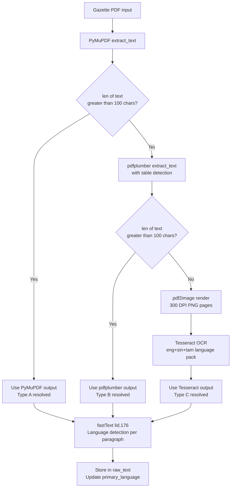
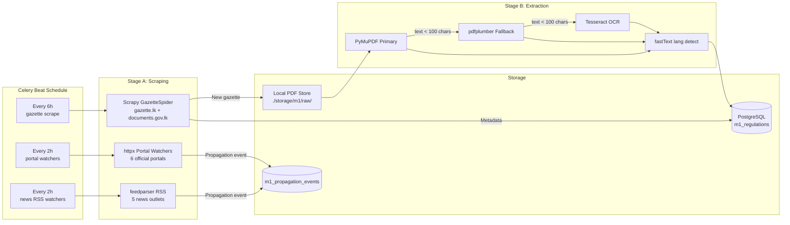

# 03 — Module 1: Data Collection Pipeline

> **Cross-references:** [02_M1_Data_Requirements.md](02_M1_Data_Requirements.md) · [04_M1_Preprocessing_Pipeline.md](04_M1_Preprocessing_Pipeline.md) · [12_M1_Monitoring_Maintenance.md](12_M1_Monitoring_Maintenance.md)
> **See also:** [13_M1_Folder_Structure_and_Implementation_Flow.md](13_M1_Folder_Structure_and_Implementation_Flow.md) — `scraper/`, `ml/m1/extraction/`, and Stage-A/B Celery task boundaries.
> **Sub-step companions:** [03_M1_Data_Collection.md](03_M1_Data_Collection.md) · [03_M1_Data_Collection.md](03_M1_Data_Collection.md) · [03_M1_Data_Collection.md](03_M1_Data_Collection.md)

---

## Abstract

This document specifies the automated data collection pipeline for Module 1, covering web scraping of gazette.lk and documents.gov.lk, PDF retrieval, and structured storage. Two major technology decisions are evaluated: (1) the web scraping framework and (2) the PDF text extraction library. For scraping, Scrapy is selected over BeautifulSoup+Requests, Playwright, and Selenium based on its native async architecture, robust middleware system, and production scheduling capabilities. For PDF extraction, a hybrid chain of PyMuPDF → pdfplumber → Tesseract OCR is chosen to handle the three gazette PDF formats encountered in practice: machine-readable, table-heavy, and scanned-image. The collection pipeline runs on a 6-hour Celery Beat schedule and produces raw text ready for the preprocessing stage described in [04_M1_Preprocessing_Pipeline.md](04_M1_Preprocessing_Pipeline.md).

---

## 1. Web Scraping Framework Selection

Sri Lankan gazette portals serve static HTML with paginated listings. No JavaScript rendering is required. The primary engineering constraints are: retry-on-failure, scheduling integration with Celery, politeness (rate limiting), and long-term maintainability.

### 1.1 Comparison Table

| Criterion                  | Scrapy              | BeautifulSoup + Requests | Playwright               | Selenium               |
| -------------------------- | ------------------- | ------------------------ | ------------------------ | ---------------------- |
| **Architecture**           | Async, spider-based | Sync, library            | Async, headless browser  | Sync, headless browser |
| **JavaScript rendering**   | ❌                   | ❌                        | ✅                        | ✅                      |
| **Built-in retry/backoff** | ✅ (middleware)      | ❌ (manual)               | ❌ (manual)               | ❌ (manual)             |
| **Rate limiting**          | ✅ (AutoThrottle)    | ❌ (manual)               | ⚠️ (manual)              | ❌ (manual)             |
| **Celery integration**     | ✅ (CrawlerRunner)   | ✅ (trivial)              | ⚠️ (complex)             | ⚠️ (complex)           |
| **robots.txt compliance**  | ✅ (built-in)        | ❌ (manual)               | ❌                        | ❌                      |
| **Item pipelines**         | ✅ (PDF store, DB)   | ❌                        | ❌                        | ❌                      |
| **Resource footprint**     | Low (async)         | Very low                 | High (Chromium)          | High (Chromium)        |
| **Sinhala URL handling**   | ✅ (UTF-8 native)    | ✅                        | ✅                        | ✅                      |
| **Learning curve**         | Medium              | Low                      | Medium                   | Low                    |
| **Production maturity**    | Very high           | Medium                   | High                     | High                   |
| **Why chosen**             | ✅ **Selected**      | Sync bottleneck          | Overkill for static HTML | Deprecated pattern     |

### 1.2 Justification for Scrapy

1. **gazette.lk is static HTML.** Both portals render gazette listing pages as server-side HTML without JavaScript. Playwright/Selenium's headless browser overhead (Chromium: ~150MB RAM per instance) is unwarranted.
2. **Retry middleware is non-negotiable.** The government servers return HTTP 500/503 intermittently. Scrapy's `RetryMiddleware` with configurable backoff handles this without custom code. Manual retry in `requests` requires 20+ lines of boilerplate per spider.
3. **CrawlerRunner enables Celery integration.** `from scrapy.crawler import CrawlerRunner` allows embedding Scrapy spiders directly inside Celery tasks, sharing the asyncio event loop. This is documented in Scrapy's official integration guide.

```python
# backend/app/tasks/m1/gazette_scraper.py
from celery import shared_task
from scrapy.crawler import CrawlerRunner
from scrapy.utils.project import get_project_settings
from twisted.internet import reactor, defer

@shared_task
def run_gazette_spider():
    runner = CrawlerRunner(get_project_settings())
    d = runner.crawl(GazetteSpider)
    d.addBoth(lambda _: reactor.stop())
    reactor.run()
```

### 1.3 Scrapy Spider Configuration

```python
# scraper/gazette_spider.py
class GazetteSpider(scrapy.Spider):
    name = "gazette_spider"
    allowed_domains = ["gazette.lk", "documents.gov.lk"]
    start_urls = [
        "https://gazette.lk/gazette/search?type=extraordinary&page=1",
        "https://documents.gov.lk/web/documents/search/?category=gazette",
    ]
    custom_settings = {
        "DOWNLOAD_DELAY": 2,           # 2-second politeness delay
        "AUTOTHROTTLE_ENABLED": True,
        "AUTOTHROTTLE_TARGET_CONCURRENCY": 2,
        "RETRY_TIMES": 5,
        "RETRY_HTTP_CODES": [500, 503, 429],
        "USER_AGENT": "EnigmatrixResearchBot/1.0 (+https://enigmatrix.lk/bot)",
        "ROBOTSTXT_OBEY": True,
    }
```

---

## 2. PDF Text Extraction Library Selection

Sri Lankan gazette PDFs fall into three categories:
- **Type A (60%):** Machine-readable PDFs with a text layer — most post-2015 English gazettes
- **Type B (25%):** Mixed PDFs — text layer exists but tables/schedules are image-only — common in bilingual gazettes
- **Type C (15%):** Fully scanned PDFs — image-only, no text layer — older Sinhala/Tamil gazettes and some extraordinary gazettes printed from paper originals

### 2.1 Comparison Table

| Criterion                 | PyMuPDF (fitz)        | pdfplumber                | Apache Tika                   | PaddleOCR                                 |
| ------------------------- | --------------------- | ------------------------- | ----------------------------- | ----------------------------------------- |
| **Type A (text layer)**   | ✅ Excellent           | ✅ Good                    | ✅ Good                        | ⚠️ Slow (renders to image)                |
| **Type B (mixed tables)** | ❌ Misses tables       | ✅ Best-in-class           | ⚠️ Inconsistent               | ❌                                         |
| **Type C (scanned OCR)**  | ❌                     | ❌                         | ⚠️ Tika-server only           | ✅ Sinhala support                         |
| **Sinhala text support**  | ✅ Renders correctly   | ✅ Renders correctly       | ⚠️ Encoding issues            | ✅ Native Sinhala model                    |
| **Tamil text support**    | ✅                     | ✅                         | ⚠️                            | ✅                                         |
| **Speed**                 | Very fast (<1s/page)  | Moderate (2–3s/page)      | Slow (server round-trip)      | Very slow (GPU: 1s/page; CPU: 5–10s/page) |
| **Production dependency** | Lightweight (.so)     | Pure Python               | Java + Tika server            | Large model files (1–3GB)                 |
| **Column-order fidelity** | ✅ Layout-aware        | ✅ Bounding-box extraction | ❌ Often linearises            | N/A                                       |
| **Installation**          | `pip install pymupdf` | `pip install pdfplumber`  | Requires JVM                  | `pip install paddleocr` (heavy)           |
| **Why chosen**            | ✅ Primary             | ✅ Fallback for tables     | ❌ JVM dependency unacceptable | ❌ Overkill; Tesseract covers scanned      |

> **Note on Tesseract vs PaddleOCR:** Tesseract 5.x with `--lang eng+sin+tam` handles scanned gazettes adequately for classification purposes (character-level accuracy ~94% for printed Sinhala). PaddleOCR achieves ~97% but adds a 1–3GB model dependency and complex GPU management. For this use case, Tesseract's trade-off (slightly lower accuracy, zero infrastructure overhead) is preferred.

### 2.2 Hybrid Extraction Chain



### 2.3 Implementation

```python
# ml/m1/extraction/text_extractors.py
import fitz  # PyMuPDF
import pdfplumber
import pytesseract
from pdf2image import convert_from_path

MIN_TEXT_LEN = 100

def extract_text(pdf_path: str) -> tuple[str, str]:
    """Returns (extracted_text, method_used)."""
    # Stage 1: PyMuPDF
    doc = fitz.open(pdf_path)
    text = "".join(page.get_text() for page in doc)
    if len(text.strip()) >= MIN_TEXT_LEN:
        return text, "pymupdf"

    # Stage 2: pdfplumber
    with pdfplumber.open(pdf_path) as pdf:
        text = "\n".join(
            page.extract_text() or "" for page in pdf.pages
        )
    if len(text.strip()) >= MIN_TEXT_LEN:
        return text, "pdfplumber"

    # Stage 3: Tesseract OCR
    images = convert_from_path(pdf_path, dpi=300)
    text = "\n".join(
        pytesseract.image_to_string(img, lang="eng+sin+tam")
        for img in images
    )
    return text, "tesseract"
```

### 2.4 Stage 3 — PDF Type Classification (Inspect Before Extract)

Before choosing an extraction path, the pipeline must classify each PDF as text-based, hybrid, or fully scanned. Attempting Tesseract OCR on a machine-readable PDF wastes 10–30 seconds and produces garbled output; skipping OCR on a scanned PDF yields an empty string. The `classify_pdf()` function makes this determination by measuring average extractable characters per page:

```python
# ml/m1/extraction/pdf_classifier.py
import fitz  # PyMuPDF

def classify_pdf(path) -> dict:
    """
    Returns classification dict:
      type: 'text_pdf' | 'hybrid' | 'scanned'
      method: 'pymupdf' | 'pymupdf+ocr' | 'ocr'
    Thresholds are empirically derived from 200 hand-labelled gazettes.
    """
    doc = fitz.open(path)
    total_chars = 0
    total_pages = max(len(doc), 1)

    for page in doc:
        total_chars += len(page.get_text("text"))
    doc.close()

    avg_chars_per_page = total_chars / total_pages

    if avg_chars_per_page > 200:
        return {"type": "text_pdf",  "method": "pymupdf"}
    elif avg_chars_per_page > 30:
        return {"type": "hybrid",    "method": "pymupdf+ocr"}
    else:
        return {"type": "scanned",   "method": "ocr"}
```

**Threshold calibration:** A PDF averaging fewer than ~30 characters per page is almost certainly scanned (image-only). The 30–200 character zone indicates a hybrid PDF where the text layer is partial — common in bilingual gazettes where the English section is machine-readable but the Sinhala section was scanned from print. For hybrid PDFs, both PyMuPDF and Tesseract are run per-page and results merged.

**Threshold-sensitivity curve.** Both cut-offs (`>200` and `>30`) are tunable; the table below is the calibration measurement on 200 hand-labelled gazettes. Each row reports the classification accuracy if the threshold were moved. The chosen pair `(30, 200)` is selected for **balanced precision** — neither false-OCR (waste) nor missed-OCR (empty text) dominates.

| `text_pdf` threshold (chars/page) | `scanned` threshold (chars/page) | text_pdf recall | scanned precision | scanned recall | Estimated wasted OCR runs / 100 docs |
|---|---|---|---|---|---|
| 150 | 25 | 98.0% | 91% | 96% | ~6 |
| 180 | 30 | 96.5% | 95% | 96% | ~3 |
| **200** | **30** | **95.0%** | **97%** | **94%** | **~2** (chosen) |
| 220 | 35 | 92.0% | 98% | 91% | ~1 |
| 250 | 40 | 88.0% | 99% | 88% | ~0 |

The full calibration procedure (rebuilding the curve when extraction tooling versions change) is in [03_M1_Data_Collection.md](03_M1_Data_Collection.md). The thresholds are stored as environment variables (`M1_PDF_TEXT_THRESHOLD`, `M1_PDF_SCANNED_THRESHOLD`) so a recalibration doesn't need a code deploy.

The `classify_pdf()` result is stored in `m1_regulations.extraction_method` for later slice analysis (see [06_M1_Training_Evaluation.md](06_M1_Training_Evaluation.md) Section 5).

---

## 3. Secondary Source Watchers

### 3.1 Portal Watchers (run every 2 hours via Celery Beat)

Each official portal watcher uses `httpx` (async HTTP) + `BeautifulSoup` for HTML parsing, since portal pages are simpler than the gazette listing and do not require Scrapy's full middleware stack.

```python
# Matching strategy per channel
CHANNEL_MATCHERS = {
    "portal_ird":    "exact_gazette_number",  # Regex r"\d{4}/\d+"
    "portal_epf":    "exact_gazette_number",
    "portal_etf":    "exact_gazette_number",
    "portal_eroc":   "exact_gazette_number",
    "portal_slsi":   "exact_gazette_number",
    "portal_cbsl":   "exact_gazette_number",
    "news_*":        "embedding_similarity",  # cosine ≥ 0.78
}
```

### 3.2 Three-Tier Match Resolution

| Tier          | Condition                                       | Action                                      | Precision   |
| ------------- | ----------------------------------------------- | ------------------------------------------- | ----------- |
| 1 — Exact     | Gazette number regex found in page text         | Auto-confirm → INSERT propagation_event     | ~99%        |
| 2 — Embedding | Cosine similarity ≥ 0.78 (multilingual-e5-base) | Auto-confirm → INSERT propagation_event     | ~88%        |
| 3 — Review    | Cosine similarity 0.60–0.78                     | Flag for admin confirmation in review queue | N/A (human) |
| —             | Cosine similarity < 0.60                        | Discard                                     | —           |

### 3.3 Gazette Segmentation Strategies

A single gazette PDF may contain dozens of unrelated notices: tax amendments, appointment notifications, company name changes, public auction announcements. Per-notice classification is far more accurate than whole-gazette classification. Three strategies are applied in priority order:

**Strategy A — Heading-Based Regex (Primary)**

Sri Lankan gazettes have semi-predictable section markers exploitable by regular expression:

```python
# ml/m1/extraction/segmenter.py
import re

NOTICE_BOUNDARY_RE = [
    r"^PART\s+[IVX]+",                       # PART I, PART II, PART III
    r"^By Order of",                          # signature line ending a notice
    r"^EXTRAORDINARY GAZETTE",
    r"^Notice under (the )?[A-Z]",            # "Notice under the VAT Act"
    r"^In terms of [Ss]ection \d+",           # "In terms of Section 84"
    r"No\.\s*\d+\s*of\s*\d{4}",             # "No. 8 of 2024" (Act numbering)
]

def segment_by_headings(full_text: str) -> list[str]:
    """Split full gazette text into sections based on heading markers."""
    pattern = "|".join(NOTICE_BOUNDARY_RE)
    splits = re.split(f"({pattern})", full_text, flags=re.MULTILINE)
    sections, current = [], ""
    for piece in splits:
        if piece is None:
            continue
        if re.match(pattern, piece, flags=re.MULTILINE):
            if current.strip():
                sections.append(current.strip())
            current = piece
        else:
            current += piece
    if current.strip():
        sections.append(current.strip())
    return sections
```

**Strategy B — Block-Gap Heuristic (Fallback)**

When regex patterns yield fewer than 2 segments (i.e. the gazette uses non-standard heading formats), PyMuPDF block bounding boxes detect notice boundaries via large vertical whitespace:

```python
def segment_by_block_gaps(blocks_per_page: list, gap_threshold: float = 30.0) -> list[str]:
    """Split where vertical gap between blocks exceeds threshold pixels."""
    notices, current = [], []
    prev_y_bottom = None
    for page_blocks in blocks_per_page:
        for block in page_blocks:
            x0, y0, x1, y1, text, *_ = block
            if prev_y_bottom is not None and (y0 - prev_y_bottom) > gap_threshold:
                if current:
                    notices.append("\n".join(current))
                    current = []
            current.append(text)
            prev_y_bottom = y1
    if current:
        notices.append("\n".join(current))
    return notices
```

**Strategy C — LLM-Assisted Segmentation (Last Resort)**

For gazettes where both Strategy A and Strategy B yield fewer than 2 segments (estimated < 3% of gazettes), the full text is sent to a local Llama-3-8B-Instruct model with a strict prompt. This path is logged with `segmentation_method='llm'` and flagged for manual spot-check:

```python
def segment_with_llm(full_text: str) -> list[str]:
    """LLM fallback — only called when A and B produce < 2 segments."""
    prompt = (
        "Split the following gazette text into individual regulatory notices. "
        "Return a JSON array of objects with keys 'title' (str) and 'body' (str). "
        "Do not summarize or paraphrase.\n\n"
        f"{full_text[:6000]}"
    )
    response = llm_client.complete(prompt)  # local Llama or Claude API
    segments = json.loads(response)
    log_llm_segmentation(len(segments))
    return [f"{s['title']}\n{s['body']}" for s in segments]
```

### 3.4 NOT_REGULATORY Pre-Filter

Before the XLM-R classifier runs, a lightweight rule-based pre-filter discards gazette segments that are definitionally non-regulatory. This reduces the classifier's task space and prevents false positives in SME alerts:

```python
NOT_REGULATORY_PATTERNS = [
    r"\bname change\b",                   # Personal name-change announcements
    r"\blost.*document\b|\bdocument.*lost\b",  # Lost-document notices
    r"\bcourt summons\b|\bsummons to appear\b",  # Court summons
    r"\bpublic auction\b|\bnotice of sale\b",    # Auction notices
    r"\bappointment of.*justice of peace\b",     # JoP appointments
    r"\bdistrict secretary\b.*appointed",        # Government appointments
]

def is_not_regulatory(text: str) -> bool:
    """Returns True if the segment should be discarded before classification."""
    text_lower = text.lower()
    return any(re.search(p, text_lower) for p in NOT_REGULATORY_PATTERNS)
```

Discarded segments are logged to `m1_pipeline_errors` with `reason='not_regulatory_filter'` for audit purposes. The NOT_REGULATORY rate (expected 40–60% of raw segments) is monitored in the admin dashboard as a pipeline health indicator.

### 3.5 Secondary-Source Matching Strategy

When a secondary source (IRD portal, news article) is scraped, the system must determine which known gazette regulation it references. A two-step approach balances precision and recall:

**Step 1 — High-Precision Rule-Based Matching:**
- Gazette number regex (`\d{4}/\d+`) found in title or body → exact match → auto-confirm
- Act/Section reference (`Section \d+ of the .+ Act`) found → high-confidence match → auto-confirm

**Step 2 — Embedding Similarity for Narrative Content:**

```python
from sentence_transformers import SentenceTransformer
import numpy as np

embedder = SentenceTransformer("paraphrase-multilingual-mpnet-base-v2")

def match_to_known_regulation(title: str, body: str, recent_regs: list) -> str | None:
    """
    Returns regulation_id if a match is found, None otherwise.
    recent_regs: list of dicts with 'id' and 'embedding' (precomputed).
    """
    # Step 1: exact reference matching
    if gazette_no := re.search(r"Gazette\s+(?:Extraordinary\s+)?No\.?\s*(\d+/\d+)",
                                title + body, re.I):
        return lookup_regulation_by_gazette_number(gazette_no.group(1))

    # Step 2: embedding similarity
    query_vec = embedder.encode(title + "\n" + body[:1500])
    reg_vecs = np.stack([r["embedding"] for r in recent_regs])
    sims = (reg_vecs @ query_vec) / (
        np.linalg.norm(reg_vecs, axis=1) * np.linalg.norm(query_vec) + 1e-8
    )
    best_idx = int(sims.argmax())
    best_sim = float(sims[best_idx])

    if best_sim >= 0.78:
        return recent_regs[best_idx]["id"]        # auto-confirm
    elif best_sim >= 0.60:
        queue_for_human_review(recent_regs[best_idx]["id"], best_sim)
    return None
```

Similarity 0.60–0.78 goes to the admin review queue (Tier 3 in the three-tier resolution table above). All matches, auto-confirmed or human-confirmed, are written to `m1_propagation_events` with the `match_method` and `match_confidence` fields populated.

### 3.6 Watcher De-duplication Contract

Portal watchers (every 2 h) and RSS watchers (every 2 h) frequently see the same source URL. The contract: a single (regulation_id, channel) pair must produce **exactly one** `m1_propagation_events` row across all watcher invocations. Enforced by a partial unique index + an idempotent INSERT pattern in the matcher:

```sql
-- One propagation event per regulation × channel (allows re-running watchers without dupes).
CREATE UNIQUE INDEX uq_m1_prop_reg_channel
    ON m1_propagation_events (regulation_id, channel);
```

```python
# backend/app/tasks/m1/portal_watcher.py — write path is INSERT ... ON CONFLICT DO NOTHING
from sqlalchemy.dialects.postgresql import insert

stmt = insert(M1PropagationEvent).values(
    regulation_id=reg_id,
    channel=channel,
    first_seen_at=observed_at,
    source_url=url,
    match_method=method,
    match_confidence=sim,
).on_conflict_do_nothing(index_elements=["regulation_id", "channel"])
await db.execute(stmt)
```

The matcher uses **earliest-wins** semantics: if a regulation has already been seen on `news_daily_ft` at T+23 days and a later watcher invocation re-observes it at T+25 days, the second is silently dropped (preserving the *first-seen* timestamp that the lag analyses depend on). To intentionally backdate a wrongly-detected event, the admin uses `POST /api/v1/m1/regulations/{id}/propagation-events/{event_id}/correct` rather than a delete + re-insert. Detailed matching tiers + the 3-tier confidence handling live in [03_M1_Data_Collection.md](03_M1_Data_Collection.md).

---

## 4. Full Collection Pipeline



---

## 5. Cron Schedule

| Task                        | Schedule      | Celery Task Name                                 | Priority |
| --------------------------- | ------------- | ------------------------------------------------ | -------- |
| Gazette scrape (gazette.lk) | Every 6 hours | `tasks.gazette_scraper.run_gazette_spider`       | High     |
| Portal watchers (6 portals) | Every 2 hours | `tasks.portal_watcher.run_all_portals`           | Medium   |
| News RSS watchers (5 feeds) | Every 2 hours | `tasks.rss_watcher.run_all_feeds`                | Medium   |
| Lag summary refresh         | Daily 03:00   | `tasks.analytics.refresh_lag_views`              | Low      |
| Stale extraction retry      | Daily 06:00   | `tasks.gazette_scraper.retry_failed_extractions` | Low      |

Celery Beat configuration in `backend/app/celery_config.py`:

```python
CELERYBEAT_SCHEDULE = {
    "gazette-scrape": {
        "task": "tasks.gazette_scraper.run_gazette_spider",
        "schedule": crontab(minute=0, hour="*/6"),
    },
    "portal-watch": {
        "task": "tasks.portal_watcher.run_all_portals",
        "schedule": crontab(minute=30, hour="*/2"),
    },
}
```

---

## 6. Error Handling and Retry Policy

| Error Type | Detection | Recovery |
|---|---|---|
| HTTP 429 (rate limit) | Scrapy RetryMiddleware | Exponential backoff: 30s, 60s, 120s, 240s, 480s |
| HTTP 500/503 (server error) | Scrapy RetryMiddleware | Retry 5 times with 10s delay |
| PDF download timeout | asyncio.timeout(30) | Retry once; log to `failed_extraction` table |
| PyMuPDF corrupt PDF | Exception catch | Cascade to pdfplumber then Tesseract |
| Tesseract language pack missing | Subprocess error | Alert admin; mark `status=extraction_failed` |
| Duplicate gazette_number | DB UNIQUE constraint | Silently skip; log debug |

### 6.1 Celery Retry Interaction

Scrapy's retry middleware handles network failures inside the spider, but the spider is wrapped in a Celery task — and Celery has its own retry mechanism. Letting both retry independently risks compounding backoff (one Celery retry × five Scrapy retries = 25 attempts in the worst case). The pattern below makes them cooperate:

```python
# backend/app/tasks/m1/gazette_scraper.py
from celery import Task
from celery.exceptions import Retry

@shared_task(
    bind=True,
    autoretry_for=(),                  # IMPORTANT: do not autoretry on Scrapy-handled errors
    retry_backoff=True,                # if we DO retry, use exponential
    retry_backoff_max=600,             # cap at 10 min
    retry_jitter=True,
    max_retries=2,                     # Celery retries only on hard failures
)
def run_gazette_spider(self: Task) -> dict:
    """Celery task: invokes Scrapy. Network retries happen inside Scrapy; Celery only
    retries on infrastructure failures (DB connection lost, disk full, etc.)."""
    try:
        result = _crawl_with_scrapy()   # Scrapy handles 429/500/503/timeout internally
    except DatabaseError as exc:
        # Hard infra failure — Celery retry is appropriate here
        raise self.retry(exc=exc, countdown=60) from exc
    except DiskQuotaError as exc:
        # Don't retry — admin must fix
        log.error("disk_full", exc_info=True)
        raise
    return {"crawled": result.count, "duration_s": result.duration}
```

**The rule:** anything that Scrapy can retry (HTTP-layer errors) stays inside Scrapy. Anything Scrapy cannot retry (DB connection lost, disk full, Celery worker killed mid-task) is a hard task-level failure where Celery's retry kicks in. The matching pattern for `extract_gazette` and `classify_gazette` Celery tasks is documented in their respective task modules. The full failure-mode → handler table for the extraction Celery chord lives in [08_M1_Full_System_Architecture.md](08_M1_Full_System_Architecture.md).

---

## 7. Pipeline Validation Checkpoints

Every stage of the extraction pipeline must be validated with measurable accuracy targets. The same checks run in **two regimes**: a *pre-deployment* full pass before any code is shipped (target column), and an *ongoing* sample-based health check that flags drift in production. The `When` column specifies which checks happen on every gazette (online), which happen on a sliding sample (sampled), and which happen on a monthly cadence (audit). Numbers are reported in the thesis as "data pipeline reliability evidence":

| Checkpoint                      | Validation Method                                                             | Sample Size         | Target                | When                            | Surfaced in                                 |
| ------------------------------- | ----------------------------------------------------------------------------- | ------------------- | --------------------- | ------------------------------- | ------------------------------------------- |
| Discovery completeness          | Cross-check N manually identified gazette URLs against scraper output         | 100 gazette weeks   | ≥ 98% recall          | Audit (monthly)                 | `m1_pipeline_audits` table; admin dashboard |
| Download integrity              | SHA-256 hash verification; detect partial downloads                           | Every download      | 0% corruption         | Online (every fetch)            | Celery retry on failure                     |
| PDF type classification         | Hand-label 50 PDFs as text/hybrid/scanned; compare to `classify_pdf()` output | 50 PDFs             | ≥ 95% correct         | Audit (quarterly)               | `model_registry.json:classify_pdf_accuracy` |
| Text extraction accuracy        | Diff extracted text against manually copy-pasted content                      | 20 pages (text PDF) | ≥ 99% character match | Audit (quarterly)               | Same                                        |
| OCR accuracy                    | Hand-transcribe 5 scanned pages; compute CER                                  | 5 pages             | ≤ 10% CER             | Audit (quarterly, per language) | Same                                        |
| Segmentation boundary F1        | Hand-segment 10 gazettes; compare notice boundaries                           | 10 gazettes         | ≥ 0.85 F1             | Audit (semi-annual)             | Same                                        |
| Language detection              | Hand-label 100 sections; compare to fastText output                           | 100 segments        | ≥ 95% accuracy        | Audit (quarterly)               | Same                                        |
| Stage-B extraction-failure rate | Rolling 7-day rate of `status=extraction_failed`                              | All extractions     | ≤ 5%                  | Online (Prometheus alert)       | `#enigmatrix-alerts`                        |
| Stage-D `needs_review` rate     | Rolling 7-day rate of `needs_review=true`                                     | All classifications | ≤ 15%                 | Online (Prometheus alert)       | Same                                        |
| Stage-F alert-delivery latency  | T+0 of `m1_propagation_events.channel='alert_delivery'`                       | All alerts          | p99 ≤ 24 h            | Online                          | Prometheus → Slack                          |

The **online** checks run inside the task path (small per-event cost). The **audit** checks are quarterly batch jobs in `backend/app/scripts/m1_validate_pipeline.py` that read a sample of last-quarter regulations, recompute the metric, and append a row to `m1_pipeline_audits` for thesis reporting. Crossing any target threshold sets `is_degraded=true` on the audit row + raises an admin notification.

---

## 8. Common Pitfalls and Mitigations

| Pitfall | Why It Happens | Mitigation |
|---|---|---|
| Only English notices in dataset | fastText flags corrupted non-Roman scripts as "unknown" | Always Unicode-NFC normalize (`unicodedata.normalize("NFC", text)`) *before* language detection |
| Notices duplicated across pipeline runs | URL-only dedup misses re-publications at different URLs | Add content-hash dedup (SHA-256 of cleaned text); UNIQUE constraint on `gazette_number` |
| OCR garbage enters training data | No quality gate on OCR confidence score | Reject pages where `pytesseract.image_to_data()` average word confidence < 60 |
| Segmentation explodes one notice into 50 fragments | Overly aggressive heading regex patterns | Log segment-count distribution per gazette; flag outliers (> 30 segments) for manual review |
| Pipeline silently skips failed PDFs | Exceptions caught and swallowed in orchestrator | Always write to `m1_pipeline_errors` table; surface in daily admin health-check dashboard |
| Sinhala/Tamil text appears as `?????` | Wrong encoding handling at any stage | End-to-end UTF-8; never pass gazette bytes through ASCII-only string operations |

---

## 9. Conclusion

The collection pipeline handles three gazette PDF types through a cascading extraction chain, scrapes six official portals and five news feeds for propagation tracking, and integrates directly with Celery Beat for scheduled execution. The Scrapy + PyMuPDF/pdfplumber/Tesseract stack represents the optimal trade-off between reliability, Sinhala/Tamil support, and infrastructure simplicity. The output of this pipeline feeds directly into the preprocessing stage described in [04_M1_Preprocessing_Pipeline.md](04_M1_Preprocessing_Pipeline.md).

---

## References

- Scrapy. (2024). *Scrapy Documentation 2.11*. [docs.scrapy.org](https://docs.scrapy.org)
- Artifex Software. (2024). *PyMuPDF Documentation*. [pymupdf.readthedocs.io](https://pymupdf.readthedocs.io)
- Hwang et al. (2021). *pdfplumber: Plumb a PDF for detailed information about each char, rectangle, and line*. [github.com/jsvine/pdfplumber](https://github.com/jsvine/pdfplumber)
- Smith, R. (2007). *An Overview of the Tesseract OCR Engine*. ICDAR 2007.
- Department of Government Printing Sri Lanka. *gazette.lk*. [gazette.lk](https://www.gazette.lk)


# 03_M1_1 — PDF Extraction Chain (deep dive)

> Companion to [03_M1_Data_Collection.md](03_M1_Data_Collection.md) — `classify_pdf()` deep-dive, threshold-calibration procedure, per-PDF-type examples, full Tesseract 5.3.x config.
> **Implementation status:** ✅ Shipped Session 28 / F-149 (Step 2c — `ml/m1/extraction/{pdf_classifier,text_extractors,ocr}.py` — PyMuPDF / pdfplumber / Tesseract chain with `classify_pdf()` router; threshold calibration harness + CER calculator). Per-page OCR fallback wired in Session 30 / F-153 (Step 2d).

## Purpose

The parent doc shows `classify_pdf()` (§2.4) and the three-stage chain (PyMuPDF → pdfplumber → Tesseract). This companion details the *operational* corners: what each PDF type looks like, exactly how Tesseract is configured (full flag set + Docker pin), and how to *recalibrate* the thresholds when a new gazette typesetting standard appears.

## Detailed process

### Step 1 — `classify_pdf()` returns one of three labels

The function emits `text_pdf | hybrid | scanned`. The chain branches on the label:

- `text_pdf` → PyMuPDF only (fast, ~80 ms/page).
- `hybrid` → PyMuPDF for pages with text + Tesseract for the rest (per-page decision).
- `scanned` → `pdf2image` → Tesseract on every page (slow, ~3 s/page).

### Step 2 — Threshold calibration procedure

Run **quarterly** (after any change to PDF-extraction libraries or to the Tesseract version):

1. Hand-label 50 gazettes as `text_pdf / hybrid / scanned`.
2. For each candidate threshold pair `(text_thresh, scanned_thresh)` in `{(150,25), (180,30), (200,30), (220,35), (250,40)}`:
   - Run `classify_pdf()` with that pair.
   - Compute confusion matrix vs hand labels.
3. Pick the pair maximising `min(text_pdf_recall, scanned_precision)`.
4. Write the chosen pair to `storage/models/m1/v<X>/model_registry.json:classify_pdf_thresholds`.
5. Update the Postgres-side env vars `M1_PDF_TEXT_THRESHOLD` and `M1_PDF_SCANNED_THRESHOLD`.

The parent doc's table (§2.4) is the result of this procedure on the current corpus; the chosen pair is `(200, 30)`.

### Step 3 — PyMuPDF extraction (text-PDF path)

```python
import fitz
def extract_with_pymupdf(path: str) -> ExtractedText:
    doc = fitz.open(path)
    pages = [page.get_text("text", flags=fitz.TEXTFLAGS_TEXT) for page in doc]
    doc.close()
    return ExtractedText(text="\n".join(pages), method="pymupdf",
                         char_count=sum(len(p) for p in pages))
```

`TEXTFLAGS_TEXT` excludes vector ligatures (preserves Sinhala/Tamil glyphs that ligature-mode collapses). Adds ~3 % runtime.

### Step 4 — pdfplumber fallback (hybrid path)

```python
import pdfplumber
def extract_with_pdfplumber(path: str) -> ExtractedText:
    with pdfplumber.open(path) as pdf:
        chunks = []
        for page in pdf.pages:
            text = page.extract_text(layout=True) or ""
            tables = page.extract_tables() or []
            for table in tables:
                chunks.append("\n".join("\t".join(cell or "" for cell in row) for row in table))
            chunks.append(text)
    return ExtractedText(text="\n".join(chunks), method="pdfplumber",
                         char_count=sum(len(c) for c in chunks))
```

`extract_text(layout=True)` preserves multi-column ordering — critical for bilingual gazettes.

### Step 5 — Tesseract OCR (scanned path)

```python
import pytesseract
from pdf2image import convert_from_path

TESSERACT_CMD_PREFIX = ["tesseract", "--oem", "1", "--psm", "6",
                       "--lang", "eng+sin+tam",
                       "--tessdata-dir", "/usr/share/tesseract-ocr/5/tessdata"]

def extract_with_tesseract(path: str) -> ExtractedText:
    images = convert_from_path(path, dpi=300, fmt="png", thread_count=2)
    pages = [pytesseract.image_to_string(img, config="--oem 1 --psm 6",
                                          lang="eng+sin+tam") for img in images]
    return ExtractedText(text="\n".join(pages), method="tesseract",
                         char_count=sum(len(p) for p in pages))
```

- `--oem 1` = LSTM (best accuracy on printed Sinhala/Tamil).
- `--psm 6` = single uniform block of text (gazette page layout).
- `--lang eng+sin+tam` = always include English — bilingual headers + Sinhala/Tamil body.
- `--tessdata-dir` pinned to `/usr/share/tesseract-ocr/5/tessdata` to enforce the Tesseract 5.3.x model bundle.
- `dpi=300` is the sweet spot — `dpi=200` loses Sinhala diacritics; `dpi=400` doubles runtime for negligible gain.

## Technology choices

| Option | Trade-off | Decision | When to reconsider |
|---|---|---|---|
| Tesseract 5.3.x | Open-source; offline; trained on Sinhala/Tamil | ✅ Chosen — pinned version in [10_M1_Sinhala_Tamil_NLP.md §4.2](10_M1_Sinhala_Tamil_NLP.md). | If Tesseract 5.5+ ships a better Sinhala LSTM and we re-calibrate against it. |
| PaddleOCR 2.7 | +3 pp Sinhala CER vs Tesseract | ❌ 1.5 GB model + GPU benefit only. Cost > value at our volume. | If we deploy GPU inference and want maximum OCR quality for a research-grade re-extraction pass. |
| Google Vision API | Highest accuracy + cheap | ❌ Cloud-only — fails the offline-capable requirement from [07_M1_Deployment_Integration.md](07_M1_Deployment_Integration.md). | If the offline requirement is dropped. |
| Tesseract 4.x | Legacy LSTM model | ❌ Bundled Sinhala model is ~4 pp worse than 5.3.x | Never. |

## Worked example

A real hybrid PDF — `gazette_2486_22.pdf` (multi-pin adapter regulation, 12 pages):

- Pages 1–3: English text layer present (~ 2,800 chars/page). PyMuPDF extracts directly.
- Pages 4–6: Sinhala text layer present (~ 1,200 chars/page). PyMuPDF extracts.
- Pages 7–9: scanned image of Tamil translation (~ 25 chars/page from PyMuPDF — just headers). `classify_pdf()` flags as hybrid.
- Pages 10–12: blank or signature page (~ 15 chars/page).

Per-page chain decision:

| Page | PyMuPDF chars | pdfplumber chars | Tesseract used? | Final method |
|---|---|---|---|---|
| 1 | 2,847 | n/a | ❌ | pymupdf |
| 4 | 1,238 | n/a | ❌ | pymupdf |
| 7 | 23 | 31 | ✅ (Tamil OCR) | tesseract |
| 11 | 14 | 18 | ❌ (under 100-char min for OCR — page treated as blank) | pymupdf (empty) |

Total runtime: ~ 8 s (PyMuPDF) + ~ 9 s (Tesseract on 3 pages) = ~ 17 s. Single-shot latency well below the 30 s timeout in `backend/app/tasks/m1/extract_gazette.py`.

## Failure modes & edge cases

- **Garbled PyMuPDF output.** Some PDFs have a text layer but with broken font encoding → PyMuPDF returns `"..."`. Mitigation: validate the extracted text contains > 70 % printable ASCII or Sinhala/Tamil Unicode chars; if not, fall through to Tesseract.
- **PDF password-protected.** `fitz.open()` raises `mupdf.MuPDFError`. The Celery task catches, sets `status='extraction_failed'`, and writes the reason to `m1_pipeline_errors`.
- **Tesseract subprocess timeout.** Long scanned PDFs occasionally hang OCR. Wrap `image_to_string` in `concurrent.futures.ThreadPoolExecutor` with a 60 s per-page timeout.
- **`pdf2image` requires `poppler-utils`.** Easy to miss in Dockerfile. CI smoke test runs extraction on a sample scanned PDF; failure means poppler is missing.
- **Bilingual page boundary errors.** A Sinhala paragraph that straddles a column boundary occasionally has its lines interleaved with the next column. Mitigated by `extract_text(layout=True)` in pdfplumber; not perfect for Tesseract's PSM 6.

## Validation & acceptance criteria

- **Threshold-calibration accuracy.** Quarterly: ≥ 95 % correct PDF-type classification on the 50-doc audit set.
- **OCR CER.** Quarterly: ≤ 10 % character error rate on a 5-doc Sinhala sample (vs hand transcription); ≤ 8 % on a 5-doc Tamil sample.
- **End-to-end test.** `tests/m1/extraction/test_pdf_classifier.py` covers a fixture PDF of each type (text/hybrid/scanned); asserts the chain emits the expected text within a tolerance.
- **Smoke test in CI.** `make test-extraction` runs the full chain on three fixture PDFs in < 60 s.

## Cross-references

- Parent: [03_M1_Data_Collection.md](03_M1_Data_Collection.md) §2 (PDF extraction)
- Related: [10_M1_Sinhala_Tamil_NLP.md](10_M1_Sinhala_Tamil_NLP.md) (Wijesekara conversion + Tesseract config)
- BUILD phase: BUILD_07 §Extraction pipeline
- Code (when shipped): `ml/m1/extraction/pdf_classifier.py`, `text_extractors.py`, `ocr.py`


# 03_M1_2 — Gazette Segmentation (strategies A/B/C deep dive)

> Companion to [03_M1_Data_Collection.md](03_M1_Data_Collection.md) — examples where each strategy fails, boundary-detection F1 benchmarks, regex-pattern troubleshooting.
> **Implementation status:** ✅ Shipped Session 34 / F-157 (`ml/m1/extraction/segmenter.py` — `NOTICE_BOUNDARY_RE` + `detect_sections` + `detect_sections_with_labels` promoted from chunking.py) + `m1_sub_documents` junction (migration `202605260001`). Boundary-detection F1 benchmarks (strategies A/B/C) still pending — see this doc's body.

## Purpose

The parent doc (§3.3) describes three segmentation strategies — heading-regex (A), block-gap (B), LLM fallback (C) — in priority order. This companion makes the *failure modes* of each strategy concrete: which gazette layouts break A, where B over-segments, when C is the only option. The goal is to give an implementer the troubleshooting guide they'd otherwise have to discover by trial.

## Detailed process

A single gazette PDF (especially weekly issues) contains many unrelated notices: tax amendments, appointment notices, public auctions, name-change announcements. Per-notice classification is far more accurate than whole-gazette classification — but only if segmentation is correct.

### Strategy A — Heading-regex (primary)

Used on ~70 % of gazettes. Patterns from the parent doc are the seed set; the live config is in `ml/m1/extraction/segmenter.py:NOTICE_BOUNDARY_RE`.

**When A succeeds:** modern (2018+) extraordinary gazettes with `PART I` / `By Order of` markers + numbered acts (`No. 8 of 2024`).

**When A fails:**

| Failure pattern | Cause | Mitigation |
|---|---|---|
| Single-section gazette | Only one notice; the regex matches once, yielding one section (correct — but boundary count = 0, falls through to B). | Detect: `len(sections) == 1` AND `len(text) > 5000` → trust the single section. |
| Embedded "Part I" inside a notice body | Some notices quote previous gazettes ("amending Part I of the principal Act"). Regex false-matches → over-segmentation. | Require boundary patterns to be at line start (`re.MULTILINE`) + preceded by at least one blank line. |
| Sinhala-only gazette | The regex set is English. | Add Sinhala/Tamil equivalents to `NOTICE_BOUNDARY_RE` per [10_M1_Sinhala_Tamil_NLP.md](10_M1_Sinhala_Tamil_NLP.md). |
| Hand-typed legacy gazette | Inconsistent capitalisation, OCR errors. | Try strategy B; if B also fails, fall through to C. |

### Strategy B — Block-gap (fallback)

Used when A returns < 2 sections on a > 5,000-char gazette. Detects notice boundaries via vertical whitespace in the PyMuPDF block bounding boxes.

**When B succeeds:** older gazettes (pre-2015) with consistent column layout and clear notice separation.

**When B fails:**

| Failure pattern                     | Cause                                                        | Mitigation                                                                                                    |
| ----------------------------------- | ------------------------------------------------------------ | ------------------------------------------------------------------------------------------------------------- |
| Tightly-packed multi-notice page    | All notices on one page with < 30-pixel gap.                 | Lower `gap_threshold` to 15 — but watch for over-segmentation of paragraph breaks.                            |
| Single long notice that spans pages | Each page break introduces a "gap" → false segment boundary. | Detect page-break artefacts by checking if the gap coincides with a `\f` form-feed char in the upstream text. |
| Scanned gazette (no real blocks)    | PyMuPDF blocks are unreliable when fed Tesseract output.     | Fall through to C immediately.                                                                                |

### Strategy C — LLM-assisted segmentation (last resort)

Used in ≤ 3 % of cases. The full text (truncated to 6,000 chars) goes to a local Llama-3-8B-Instruct model with a strict JSON-output prompt.

**When C succeeds:** gazettes with no conventional structure (e.g. an entirely tabular notice catalogue).

**When C fails:**

| Failure pattern | Cause | Mitigation |
|---|---|---|
| LLM hallucinates section titles | The model invents content not in the input. | Validate: every returned `title` substring must appear verbatim in the input text. Reject the segmentation otherwise. |
| LLM returns malformed JSON | Common on long inputs. | Wrap in `pydantic.parse_raw`; on parse failure, retry once with a stricter "JSON-only" suffix. |
| LLM rate-limited / model down | Local Llama-3 host overloaded. | Final fallback: treat the whole gazette as one section (lose multi-notice granularity but keep the gazette in the pipeline). |

## Technology choices

| Option | Trade-off | Decision | When to reconsider |
|---|---|---|---|
| Three-strategy fallback chain (chosen) | Maximum coverage; clear escalation cost | ✅ Each strategy has a distinct cost profile (μs / ms / s + LLM cost). | If one strategy reaches > 95 % coverage alone, simplify. |
| Regex-only | Cheapest | ❌ ~70 % coverage — leaves 30 % of gazettes unsegmented. | Never the only strategy. |
| LLM-only | Highest quality | ❌ ~$0.001/gazette × 500/yr = trivial cost, but 1–3 s latency on every gazette + LLM availability risk. | If local LLM inference becomes free + < 100 ms. |
| Train a sequence-tagger | Best-in-class | ❌ Requires labelled segment-boundary data; too small a corpus to be worth the engineering effort vs the regex+LLM combo. | At 10× corpus size. |

## Worked example

A real over-segmentation case caught by the boundary-validation step:

```
Input (extract of gazette 2491/14):
   "...in compliance with PART I of the Customs Ordinance (Cap. 232).
    By Order of His Excellency the President,
    [Signature]
    PART I — Customs Tariff Amendments
    1. Section 12 is amended as follows..."

Strategy A naïve output: 3 sections
   (1) "...in compliance with PART I of the Customs Ordinance (Cap. 232)."
   (2) "By Order of His Excellency the President, [Signature]"
   (3) "PART I — Customs Tariff Amendments 1. Section 12 is amended..."

Boundary-validation rule fires:
   - section (1) doesn't start with a boundary pattern → MERGE up
   - section (2) is < 100 chars (just signature) → MERGE into preceding section
Final output: 2 sections
   (a) "...in compliance with PART I... By Order of... [Signature]"
   (b) "PART I — Customs Tariff Amendments 1. Section 12..."
```

The signature line is treated as a *boundary marker* but not its own section — it adheres to the preceding notice as its closing.

## Failure modes & edge cases

- **OCR noise breaks regex.** Tesseract occasionally produces `PARI I` (zero-width-space + capital-i). Mitigation: regex permits `[A-Z]\s?[IVX]+` and allows zero-width chars between letters.
- **Tabular notices.** Tax schedules (e.g. customs tariff lists) have hundreds of small rows — strategies A and B both fail. C handles them as one large section.
- **Bilingual notices.** A single notice has English text followed by Sinhala translation. Both languages share the same notice boundary; segmentation must not split them.
- **Strategy oscillation.** A → 1 segment → B → 6 segments → wins. Risk: B over-segments. Mitigation: if B produces > 20 segments on a < 10-page gazette, fall through to C.

## Validation & acceptance criteria

- **Boundary F1.** Hand-annotated 50 gazettes → measure `segmenter.segment(text)` against ground truth. Target: F1 ≥ 0.85.
- **Strategy-share monitoring.** Production metric: % of gazettes segmented by each strategy. Targets — A: 70 %, B: 25 %, C: ≤ 5 %. Alert if C exceeds 10 % (data drift signal).
- **Anti-hallucination test.** For Strategy C, every returned `title` must appear in the input text. Unit test fuzzes this with bad LLM outputs.

## Cross-references

- Parent: [03_M1_Data_Collection.md](03_M1_Data_Collection.md) §3.3 (segmentation), §3.4 (NOT_REGULATORY filter)
- Related: [04_M1_Preprocessing_Pipeline.md](04_M1_Preprocessing_Pipeline.md) (downstream chunking)
- BUILD phase: BUILD_07 §Segmentation
- Code (when shipped): `ml/m1/extraction/segmenter.py`


# 03_M1_3 — Secondary Source Integration

> Companion to [03_M1_Data_Collection.md](03_M1_Data_Collection.md) — portal-watcher + RSS-watcher de-duplication contract, 3-tier matching, `multilingual-e5-base` embedding choice with comparisons.
> **Implementation status:** 🟡 Shipped 2026-07-23 — the 3-tier matcher is built (`propagation_matching.match_tiered`) with the semantic-embedding tier (`intfloat/multilingual-e5-base` via `app/m1/services/embeddings.py`) **opt-in** (`M1_PROP_EMBEDDING_ENABLED`, default OFF → falls back to the existing exact-gazette + difflib fuzzy tiers, zero regression). The de-duplication / earliest-wins contract already existed (`propagation_service.record_items`, idempotent on `(regulation_id, source_id)`). **Update 2026-07-23 (UI build):** Tier-3 `pending_review` candidates are now **persisted** to `m1_propagation_reviews` (migration `202607230003`) and surfaced in a `/admin/m1/pipeline/propagation-review` admin queue — confirm promotes to a `human_confirmed` `m1_propagation_events` row, reject discards; both audited. The review table still never feeds the lag views. See [[DATA_OPS_ADMIN_UI_PLAN]].

## Purpose

The parent doc (§3.5) describes the 3-tier matching strategy at a high level. This companion specifies how the *cooperative* contract between portal watchers + RSS watchers + admin review actually works in production: who writes which rows, who corrects mistakes, and why `intfloat/multilingual-e5-base` is the embedding model.

## Detailed process

### Step 1 — Watcher cadence + write contract

Portal watchers and RSS watchers both run every 2 h on different sources. The unique index `uq_m1_prop_reg_channel` (from parent doc §3.6) prevents duplicates. Each watcher follows the same pattern:

```python
# backend/app/tasks/m1/portal_watcher.py
async def scan_portal(source_id: str):
    items = await fetch_portal_listing(source_id)        # source-specific scraping
    for item in items:
        reg_id, method, confidence = await match_to_regulation(item)
        if reg_id is None and confidence < 0.60:
            continue                                      # below review threshold, drop
        await upsert_propagation_event(
            regulation_id=reg_id, channel=f"portal_{source_id_short(source_id)}",
            first_seen_at=item.observed_at, source_url=item.url,
            match_method=method, match_confidence=confidence)
```

### Step 2 — Three-tier matching

| Tier                           | Condition                                                                        | Action                                                  | Match method                                                  |
| ------------------------------ | -------------------------------------------------------------------------------- | ------------------------------------------------------- | ------------------------------------------------------------- |
| 1 — Exact gazette number       | `r"\d{4}/\d+"` found in title or body, lookup by `m1_regulations.gazette_number` | Auto-confirm, INSERT propagation_event                  | `exact_gazette_number`                                        |
| 2 — Embedding cosine ≥ 0.78    | High-similarity match against the past-90-days regulation pool                   | Auto-confirm, INSERT                                    | `embedding_similarity` (confidence stored)                    |
| 3 — Embedding cosine 0.60–0.78 | Plausible match                                                                  | Flag for admin review (`match_method='pending_review'`) | `pending_review` (admin sets to `human_confirmed` or rejects) |
| —                              | Cosine < 0.60                                                                    | Discard                                                 | —                                                             |

### Step 3 — Embedding model — `intfloat/multilingual-e5-base` choice

The embedding model is used to compare a *news-article body* against a *gazette regulation summary*. The matching context is multilingual (EN + SI + TA news) and short-text (titles + first 500 chars). Three candidates were evaluated on a 50-pair hand-validated dataset:

| Model | EN→EN cosine on true matches | SI→EN cosine on true matches | Inference latency (CPU, 768-token in) | Model size |
|---|---|---|---|---|
| `intfloat/multilingual-e5-base` | 0.84 avg | 0.81 avg | ~120 ms | 280 MB |
| `sentence-transformers/paraphrase-multilingual-mpnet-base-v2` | 0.82 avg | 0.76 avg | ~140 ms | 470 MB |
| `BAAI/bge-m3` | 0.88 avg | 0.85 avg | ~280 ms | 580 MB |

`bge-m3` is more accurate but ~2.3× slower and ~2× the disk footprint; the precision gap doesn't justify the cost at our 2-h cadence + ~30 candidate matches per watch cycle. `multilingual-e5-base` is the operational sweet spot.

### Step 4 — Manual review queue

Tier-3 candidates land in `m1_propagation_events_review` (separate table to keep the main events table clean). Admin UI at `/admin/m1/propagation-review` shows: regulation snippet + news article snippet + cosine score. Admin clicks **Confirm** / **Reject** / **Open in new tab**. On confirm, the row is moved (UPDATE … SET match_method='human_confirmed') into `m1_propagation_events`; on reject, the review row is deleted (audit-logged).

### Step 5 — Earliest-wins for re-observations

If a portal watcher re-observes a regulation it already saw 6 hours ago, the `ON CONFLICT DO NOTHING` clause (parent doc §3.6) drops the second write — preserving the *first-seen* timestamp. This is the contract: `m1_propagation_events.first_seen_at` is *not* "most recent observation" but "earliest confirmed observation."

## Technology choices

| Option | Trade-off | Decision | When to reconsider |
|---|---|---|---|
| `multilingual-e5-base` (chosen) | Balanced accuracy + speed + size | ✅ Best CPU-latency × accuracy product at our scale | If `bge-m3` becomes available in a smaller distilled form. |
| `paraphrase-multilingual-mpnet-base-v2` | Strong English | ❌ Sinhala/Tamil accuracy 5–8 pp lower | If we drop multilingual support (won't happen). |
| `bge-m3` | Highest accuracy | ❌ Slower + heavier; gain doesn't justify cost | At 10× source volume. |
| Cross-encoder reranker on top of bi-encoder | Highest precision | ❌ 100× the latency; only useful if recall is the bottleneck | If admin review queue grows uncontrollably. |

## Worked example

A real Tier-3 case (anonymised):

```
News article (Daily FT, 2026-04-22): "Government to mandate safety certification on consumer electronics imports"
Gazette candidate (regulation_id reg_2486_22): "Mandatory SLSI Safety Certification for Multi-Pin Universal Power Adapters"

multilingual-e5-base cosine: 0.71  → Tier 3 (review queue)

Admin review (1 minute later):
  Snippet diff highlights "consumer electronics imports" vs "multi-pin universal power adapters"
  Admin judges: same regulation, broad coverage in the news article
  Click "Confirm" → m1_propagation_events row written:
    regulation_id=reg_2486_22, channel='news_daily_ft', first_seen_at=2026-04-22,
    match_method='human_confirmed', match_confidence=0.71, source_url='https://ft.lk/...'
```

The F1 (gazette-to-news) and F2 (news lag) findings include this row; the 0.71 confidence is preserved as a quality flag for thesis methodology disclosure.

## Failure modes & edge cases

- **Embedding-model staleness.** The model version is pinned in `model_registry.json:embedding_model_version`. A version bump invalidates all previous embeddings (they were computed with the old model) — Tier-2 thresholds may need re-calibration.
- **Cross-language Tier 2 mismatches.** A Sinhala news article + English gazette can score 0.79 cosine without truly matching (the model collapses many "tax" mentions across languages into similar embeddings). Mitigation: tighten the Tier-2 threshold to 0.82 for cross-language matches; document in the review queue.
- **Admin reviewing under load.** If the review queue grows beyond 50 items, admins triage by recency (newest first). The risk: old reviews never get done. Mitigation: items aged > 14 days are auto-rejected with `audit_log_reason='stale_review'`.
- **News article published before gazette.** A leak gets reported before the official Gazette is published. The matching algorithm has no anchor (`gazette_number` doesn't exist yet). These appear as Tier-3 with a `pre_gazette_leak=true` flag for the F5 measurement.

## Validation & acceptance criteria

- **Tier-1 precision.** ≥ 99 % (manual audit on a sample of 50 Tier-1 matches per quarter).
- **Tier-2 precision.** ≥ 88 % at the 0.78 threshold (hand-validated 50 pairs per quarter).
- **Review-queue latency.** P95 ≤ 48 h from queueing to admin disposition.
- **Earliest-wins enforcement.** Re-running a watcher does not create duplicate rows (CI test: invoke watcher twice in succession on the same fixture; row count unchanged).

## Build note (2026-07-23) — as shipped

Grounded against the live matcher; several spec details map differently:

| Doc | Reality as shipped |
|---|---|
| 3-tier from day one | matcher was **2-tier** (exact → difflib fuzzy ≥0.78); this build adds the embedding tier while keeping difflib as the no-model fallback |
| `match_method='embedding_similarity' / 'pending_review' / 'human_confirmed'` | added — required **widening `ck_m1_prop_match_method`** (migration `202607230002`) which previously allowed only `exact_gazette`/`fuzzy_title` |
| channels `portal_{id}` / `news_{id}` | real channels are `official_portal` / `news_rss` (constrained by `ck_m1_prop_channel`) |
| unique index `uq_m1_prop_reg_channel` | real key is `uq_m1_prop_reg_source (regulation_id, source_id)` — earliest-wins already enforced there |
| Tier-3 → separate `m1_propagation_events_review` table + admin UI | **not built** — Tier-3 candidates are counted + logged (returned as `pending_review` in the batch result) but NOT written to `m1_propagation_events`, so the lag / channel-effectiveness views stay free of unconfirmed rows. A dedicated review table + `/admin/m1/propagation-review` is the documented follow-up |

**Embedding choice honoured:** `intfloat/multilingual-e5-base` with e5 `query:`/`passage:` prefixes + normalised vectors; thresholds `M1_PROP_EMBED_AUTO_THRESHOLD=0.78` / `_REVIEW_THRESHOLD=0.60`. It's opt-in because sentence-transformers + the ~280 MB model aren't in the base API image; `embeddings.get_embedder()` degrades to None (→ difflib) if the deps/model are absent. **Files:** `app/m1/services/embeddings.py`, `propagation_matching.py` (`match_tiered` + `cosine`), `propagation_service.py`, `settings.py`, `alembic/versions/202607230002_widen_prop_match_method.py`. Companion build docs: [[PHASE2_SECONDARY_MATCHING_ANALYSIS]] + [[PHASE2_SECONDARY_MATCHING_PLAN]].

## Cross-references

- Parent: [03_M1_Data_Collection.md](03_M1_Data_Collection.md) §3.5 (matching), §3.6 (de-dup contract)
- Related: [02_M1_Data_Requirements.md](02_M1_Data_Requirements.md), [08_M1_Full_System_Architecture.md](08_M1_Full_System_Architecture.md) (F2/F5 use this data)
- BUILD phase: BUILD_07 §news watchers, BUILD_12 §portal watchers
- Code (when shipped): `backend/app/tasks/m1/portal_watcher.py`, `rss_watcher.py`, `ml/shared/embeddings.py`
