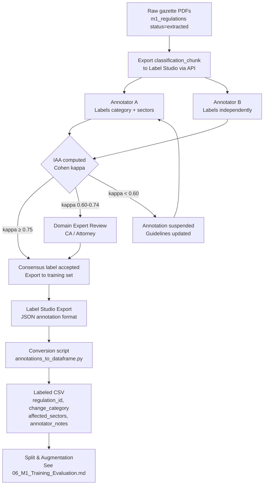

# 09 — Module 1: Annotation Guidelines

> **Cross-references:** [02_M1_Data_Requirements.md](02_M1_Data_Requirements.md) · [06_M1_Training_Evaluation.md](06_M1_Training_Evaluation.md) · [10_M1_Sinhala_Tamil_NLP.md](10_M1_Sinhala_Tamil_NLP.md)
> **See also:** [13_M1_Folder_Structure_and_Implementation_Flow.md](13_M1_Folder_Structure_and_Implementation_Flow.md) — `research/data/labeling/` + `tests/m1/fixtures/gold_labels.csv`.
> **Sub-step companions:** [09_M1_Annotation_Guidelines.md](09_M1_Annotation_Guidelines.md) · [09_M1_Annotation_Guidelines.md](09_M1_Annotation_Guidelines.md) · [09_M1_Annotation_Guidelines.md](09_M1_Annotation_Guidelines.md)

---

## Abstract

This document specifies the annotation protocol for constructing the 800-document labeled training corpus required by the Module 1 gazette classifier. It defines the complete 8-domain regulation taxonomy with per-domain decision criteria, the 3-sector (shop-focused) multi-label schema, annotator qualification requirements, inter-annotator agreement (IAA) targets (Cohen's κ ≥ 0.75), and the annotation tooling selection. Four annotation platforms are evaluated — Label Studio, Prodigy, Doccano, and a custom web-based tool — and Label Studio is selected for its active-learning integration, multi-label support, and zero licensing cost. The guidelines are designed to achieve labeling consistency sufficient for a training corpus that reaches the F1 ≥ 0.92 target defined in [06_M1_Training_Evaluation.md](06_M1_Training_Evaluation.md).

---

## 1. Annotation Tool Selection

### 1.1 Comparison Table

| Criterion | Label Studio | Prodigy | Doccano | Custom Web Tool |
|---|---|---|---|---|
| **Multi-label classification** | ✅ Native | ✅ Native | ✅ Native | ✅ Buildable |
| **Active learning integration** | ✅ ML-assisted pre-annotation | ✅ Built-in PRISM | ❌ | ✅ Buildable |
| **Multi-annotator support** | ✅ Teams + IAA dashboard | ❌ Single annotator | ✅ | ✅ Buildable |
| **PDF rendering** | ✅ HTML/text via converter | ❌ | ❌ | ✅ Embeddable |
| **API for data export** | ✅ REST API | ✅ | ✅ | ✅ |
| **Annotation agreement metrics** | ✅ Kappa built-in | ❌ Manual | ⚠️ Basic | ❌ Build separately |
| **Sinhala/Tamil text display** | ✅ UTF-8 native | ✅ | ✅ | ✅ |
| **Self-hosted** | ✅ Docker | ✅ | ✅ Docker | ✅ |
| **License cost** | ✅ Free (open source) | $595/seat/year | ✅ Free | Dev time: ~80h |
| **Learning curve** | Low-medium | Low | Low | High (custom) |
| **Why chosen** | ✅ **Selected** | Too expensive | No IAA dashboard | Too costly to build |

### 1.2 Label Studio Configuration

```yaml
# label_studio_config.xml
<View>
  <Text name="gazette_text" value="$classification_chunk" />

  <Header value="Regulation Domain (select ONE):" />
  <Choices name="change_category" toName="gazette_text" choice="single" required="true">
    <Choice value="TAX_RATE_CHANGE" />
    <Choice value="IMPORT_EXPORT" />
    <Choice value="SECTOR_SPECIFIC" />
    <Choice value="EPF_ETF_CHANGE" />
    <Choice value="LABOUR_LAW" />
    <Choice value="PRODUCT_STANDARD" />
    <Choice value="BUSINESS_REGISTRATION" />
    <Choice value="PENALTY_ENFORCEMENT" />
  </Choices>

  <Header value="Affected Sectors (select ALL that apply; all three if economy-wide):" />
  <Choices name="affected_sectors" toName="gazette_text" choice="multiple">
    <Choice value="grocery_retail" />
    <Choice value="food_service" />
    <Choice value="general_retail" />
  </Choices>

  <Header value="Notes / Edge Case Flags:" />
  <TextArea name="annotator_notes" toName="gazette_text" rows="3" />
</View>
```

---

## 2. 8-Domain Regulation Taxonomy — Decision Criteria

Each annotator must apply the following criteria in priority order. Domains are mutually exclusive (single-label). The taxonomy is shop-focused (2026-07-24): the eight streams below are the regulation channels that materially reach grocery/food retail, food service, and general-goods retail SMEs.

### 2.1 `TAX_RATE_CHANGE` (anchor stream)
**Applies when:** The gazette amends a tax rate, introduces a new tax bracket, changes VAT/SVAT rates, modifies income tax or excise duty, or introduces/removes tax exemptions under the Inland Revenue Act. Deadline extensions on tax obligations also fall here (the schedule of *what SMEs owe and when*).

**Decision signals:**
- Mentions IRD (Inland Revenue Department) as the issuing authority
- Contains phrases: `income tax`, `value added tax`, `VAT`, `SVAT`, `excise duty`, `stamp duty`
- Numerical rate change: e.g. `from 15% to 18%`, `registration threshold`

**Does NOT apply if:** The gazette imposes a penalty for non-payment of tax (→ `PENALTY_ENFORCEMENT`) or changes customs/border charges (→ `IMPORT_EXPORT`).

### 2.2 `IMPORT_EXPORT`
**Applies when:** The gazette changes customs duty, CESS, SCL (Special Commodity Levy), imposes/lifts/modifies import controls, permits, quotas, bans, or licensing requirements for goods; updates prohibited or controlled goods lists; or modifies customs clearance procedures. Highly shop-relevant: stock for grocery, electronics, textile and hardware shops is import-priced.

**Decision signals:**
- Customs/Excise authority or Controller of Imports cited
- Phrases: `customs duty`, `CESS`, `SCL`, `import licence`, `import control`, `HS code`, `tariff`

### 2.3 `SECTOR_SPECIFIC` (biggest shop-relevant stream)
**Applies when:** The gazette introduces or modifies sector-targeted compliance that reaches shops directly: CAA (Consumer Affairs Authority) maximum-retail-price orders, Food Act regulations (Ministry of Health food safety/hygiene), NMRA (National Medicines Regulatory Authority) rules, or other single-industry licensing that does not fit the streams above.

**Decision signals:**
- CAA, Food Advisory Committee / Ministry of Health (Food Act), or NMRA as issuing authority
- Phrases: `maximum retail price`, `MRP`, `price order`, `food handling`, `food licence`, `registered pharmaceuticals`

### 2.4 `EPF_ETF_CHANGE`
**Applies when:** The gazette explicitly modifies EPF (Employees' Provident Fund) or ETF (Employees' Trust Fund) employer obligations — contribution rates, eligibility thresholds, remittance/withdrawal procedures, or fund administration rules.

**Decision signals:**
- Mentions EPF Act, ETF Act explicitly
- Contribution percentages: `8% employee`, `12% employer`, `3% ETF`
- Phrases: `provident fund`, `trust fund contribution`, `EPF registration`

### 2.5 `LABOUR_LAW`
**Applies when:** The gazette amends the Shop and Office Employees Act, Wages Board Ordinance, or any minimum-wage order; changes annual leave entitlements; modifies working hours; introduces new leave types (maternity, sick leave); or amends employment termination procedures.

**Decision signals:**
- Phrases: `minimum wage`, `wages board`, `overtime rate`, `working hours`, `annual leave`, `maternity leave`
- References: Shop and Office Employees Act, Industrial Disputes Act

**Does NOT apply if:** The gazette changes EPF/ETF contribution rates specifically (→ `EPF_ETF_CHANGE`).

### 2.6 `PRODUCT_STANDARD`
**Applies when:** The gazette mandates compliance with Sri Lanka Standards Institution (SLSI) product standards, adds products to the mandatory certification list, updates technical specifications for imported or locally sold goods, or imposes labelling requirements.

**Decision signals:**
- SLSI cited as issuing authority
- SLS number cited: e.g. `SLS 1234:2023`
- Phrases: `mandatory certification`, `product conformity`, `labelling`, `consumer safety standard`

### 2.7 `BUSINESS_REGISTRATION`
**Applies when:** The gazette modifies trade licence requirements (local authority), company registration under the Companies Act, annual return filing via eROC (Department of Registrar of Companies), or sole proprietorship/partnership registration requirements.

**Decision signals:**
- DRC / eROC / Registrar of Companies / local authority as issuing authority
- Phrases: `trade licence`, `annual return`, `business registration`, `company act`

### 2.8 `PENALTY_ENFORCEMENT` (the "cost of not knowing")
**Applies when:** The gazette's primary purpose is to announce new or increased fines, penalties, enforcement notices, or revocation of existing licences for non-compliance. Note: most gazettes mention penalties incidentally — this domain only applies when penalties are the primary subject.

**Decision signals:**
- Gazette title begins with "Enforcement Notice" or "Penalty Order"
- Penalty amounts are the central content, not incidental
- No underlying regulatory change is announced

> **Out-of-scope gazettes:** Gazettes with no obligations for the three study sectors (government appointments, land acquisitions, constitutional notices, finance/CBSL directives, environmental/CEA orders aimed at factories, etc.) are handled by the separate `is_sme_relevant = FALSE` flag plus an empty `affected_sectors` set — there is no reject *domain* in the 8-domain taxonomy.

---

## 3. Sector Assignment Guidelines

Sector assignment is multi-label over the three shop-focused study sectors. Assign ALL sectors materially affected by the gazette's regulation; assign **all three** for economy-wide obligations (VAT, EPF/ETF, labour law, business registration).

| Sector | Assign when the gazette affects... |
|---|---|
| `grocery_retail` | Grocery / food retail: neighbourhood kade, mini-marts, small supermarkets |
| `food_service` | Food service: restaurants, cafés, bakeries, take-aways |
| `general_retail` | General-goods retail: textile/apparel shops, electronics/mobile shops, hardware stores |

> **Important:** Do NOT assign sectors by superficial keyword match. A gazette regulating "EPF contributions" applies to every sector with employees — assign all 3. A gazette regulating "SLSI standards for electrical appliances" applies to `general_retail` only; a Food Act hygiene rule applies to `grocery_retail` + `food_service`.

---

## 4. Inter-Annotator Agreement

### 4.1 IAA Protocol

- **Minimum annotators per document:** 2 independent annotators
- **Target agreement (Cohen's κ):** ≥ 0.75 for category; ≥ 0.70 for sector (multi-label Fleiss' κ)
- **Disagreement resolution:** Third annotator (domain expert) as tiebreaker
- **Gold standard batch:** 10% of corpus (~80 documents) annotated by all annotators + domain expert

### 4.2 Computing Cohen's κ

```python
from sklearn.metrics import cohen_kappa_score

def compute_category_kappa(annotator_a: list, annotator_b: list) -> float:
    return cohen_kappa_score(annotator_a, annotator_b)

def compute_sector_kappa(annotator_a: list[list], annotator_b: list[list]) -> float:
    """Multi-label Fleiss kappa approximated as mean of per-sector binary kappa."""
    from sklearn.preprocessing import MultiLabelBinarizer
    mlb = MultiLabelBinarizer(classes=[
        "grocery_retail", "food_service", "general_retail"
    ])
    a_bin = mlb.fit_transform(annotator_a)
    b_bin = mlb.transform(annotator_b)
    kappas = [
        cohen_kappa_score(a_bin[:, i], b_bin[:, i])
        for i in range(a_bin.shape[1])
    ]
    return float(sum(kappas) / len(kappas))
```

### 4.3 IAA Review Triggers

| κ Range | Action |
|---|---|
| ≥ 0.75 | Accept both annotations — add to training with consensus label |
| 0.60–0.74 | Flag for domain expert review — annotators must discuss |
| < 0.60 | Suspend annotation — re-train annotators, update guidelines |

### 4.4 Sector-Disagreement Resolution Rule

Sector is multi-label, so annotator disagreement is more subtle than a simple "different label." Three failure modes occur in practice:

| Disagreement type | Example | Resolution rule |
|---|---|---|
| **Strict-subset** | A: `[grocery_retail, general_retail]` · B: `[grocery_retail, general_retail, food_service]` | **Union** — accept B's superset. Rationale: missing a sector is worse than over-tagging (false negative misses an alert recipient; false positive sends a slightly off-topic alert). |
| **Overlap-with-extras** | A: `[grocery_retail, general_retail]` · B: `[grocery_retail, food_service]` | **Domain expert review.** Neither annotator's set strictly contains the other; this signals genuine ambiguity in the regulation's scope. |
| **Disjoint** | A: `[grocery_retail]` · B: `[food_service]` | **Domain expert review + flag** — the two annotators are reading the regulation as targeting different shop types. Likely indicates a guideline ambiguity that needs an update to §3 (sector decision criteria). |

The strict-subset rule is implemented in `ml/m1/data/resolve_iaa.py:resolve_sector_iaa()`; the other two paths route to a Label Studio task queue for the domain expert. All resolution outcomes are logged with `resolution_method` so the eventual training set can be audited.

---

## 5. Annotator Qualifications

| Role | Required Qualifications | Count |
|---|---|---|
| Primary annotator | Fluent English; undergraduate degree in law, commerce, or business | 3 |
| Sinhala annotator | Native Sinhala speaker; familiarity with legal Sinhala | 2 |
| Tamil annotator | Native Tamil speaker; familiarity with legal Tamil | 1 |
| Domain expert | Chartered Accountant (CA Sri Lanka) or Attorney-at-Law | 1 |

All annotators complete a calibration session on 20 pre-labeled gold-standard gazettes before contributing to the training corpus. Calibration target: κ ≥ 0.80 on the calibration set.

### 5.1 Calibration Test Design

The 20-document calibration set is hand-picked by the domain expert to span (a) every category (including the rare ones), (b) every sector (single-sector + multi-sector cases), (c) at least 3 gazettes per language, and (d) the four most-common edge-case patterns from §7 below. A candidate annotator's score determines whether they pass:

| Calibration outcome | Score | Action |
|---|---|---|
| ≥ 0.80 κ on first attempt | Pass | Promoted to production annotator; assigned first batch within 48 h |
| 0.70–0.79 κ on first attempt | Conditional | One-hour debrief with domain expert; re-test on a fresh 20-doc set; ≥ 0.80 to pass |
| < 0.70 κ on first attempt | Fail | Annotator does not proceed to the training corpus |
| Annotator fails twice | Reject | Not eligible for re-application within this project |

Pass rate target: ≥ 60 % of candidates pass on first attempt; conditional pass rate ≥ 80 %. If the pass rate drops below the target, the **guidelines** are revised (not the threshold) — the calibration set is the IAA contract with the model, not the candidate's IQ test.

Calibration outcomes per annotator are stored in `m1_annotator_calibration` (`annotator_id`, `attempt_number`, `kappa_category`, `kappa_sector`, `passed_at`). The same table tracks ongoing performance — every annotator re-takes a fresh calibration test quarterly, with the rolling κ feeding a per-annotator quality dashboard. The full calibration-set construction protocol + a sample 20-document worksheet is in [09_M1_Annotation_Guidelines.md](09_M1_Annotation_Guidelines.md).

---

## 6. Annotation Workflow



---

## 6.1 Contrastive Examples for Confusable Categories

Three domain pairs cause most inter-annotator disagreement. The contrasts below — anchored in seeded demo regulations from `app/scripts/seed_regulations.py` — give annotators concrete decision anchors:

| Confusable pair | Example A (label A) | Example B (label B) | What distinguishes them |
|---|---|---|---|
| `TAX_RATE_CHANGE` vs `IMPORT_EXPORT` | "VAT rate increased from 15 % to 18 % effective 2024-01-01" → `TAX_RATE_CHANGE` | "Customs duty on imported textiles raised from 10 % to 25 %; CESS revised on HS 5208" → `IMPORT_EXPORT` | Where the charge bites: `TAX_RATE_CHANGE` is inland taxation (IRD-administered — VAT/SVAT, income, excise); `IMPORT_EXPORT` is border charges and controls (Customs — duty, CESS, SCL, permits). |
| `SECTOR_SPECIFIC` vs `PRODUCT_STANDARD` | "CAA maximum retail price order for milk powder; selling above MRP an offence" → `SECTOR_SPECIFIC` | "Multi-pin adapters must carry SLSI safety certification before sale" → `PRODUCT_STANDARD` | Instrument type: `SECTOR_SPECIFIC` is conduct/price/licensing regulation of the *selling activity* (CAA, Food Act, NMRA); `PRODUCT_STANDARD` certifies the *product itself* (SLSI mark, labelling). |
| `PENALTY_ENFORCEMENT` vs `BUSINESS_REGISTRATION` | "Late fee for annual returns raised to Rs 2,500/month; 12-month defaulters struck off" → `PENALTY_ENFORCEMENT` | "Annual return filing fees for limited companies increased from LKR 1,000 to LKR 5,000" → `BUSINESS_REGISTRATION` | Primary purpose: if the gazette's central content is the *sanction* (fine schedule, strike-off), choose `PENALTY_ENFORCEMENT`; if it modifies the *registration obligation or its ordinary fees*, choose `BUSINESS_REGISTRATION`. |

Eight more contrastive pairs (with full text excerpts) are in [09_M1_Annotation_Guidelines.md](09_M1_Annotation_Guidelines.md). Annotators study these *before* the calibration test, not after — the contrastive examples are part of the training, the calibration test measures whether the training stuck.

## 7. Common Edge Cases and Resolution

| Edge Case | Resolution |
|---|---|
| Gazette amends tax rates AND extends a deadline | Assign `TAX_RATE_CHANGE` (rate + schedule are the same stream in the 8-domain taxonomy); use annotator_notes to flag the deadline component |
| EPF gazette that also mandates wage increases | Assign `EPF_ETF_CHANGE` if EPF rates are the primary change; `LABOUR_LAW` if wages are primary |
| Gazette in Sinhala only, annotator cannot read it | Route to Sinhala annotator; do NOT use machine translation for annotation |
| SLSI standard gazette with both labelling and testing requirements | Assign `PRODUCT_STANDARD`; sectors = whichever shop types sell the product (e.g. `general_retail` for appliances; `grocery_retail` for packaged food) |
| Gazette with schedule listing 50 regulated substances | Treat as `PRODUCT_STANDARD` if the substances are consumer products sold by shops; if aimed at factories/polluters only, mark `is_sme_relevant = FALSE` with empty sectors |
| Extraordinary gazette announcing state of emergency business restrictions | Assign `SECTOR_SPECIFIC`; sectors = all 3 (economy-wide) |

---

## 9. SME Awareness Survey Instrument

This section documents the survey instrument used to collect the empirical lag data for research questions RQ3 and RQ4 (see [01_M1_Research_Problem.md](01_M1_Research_Problem.md)). The survey is administered to SME owners and managers via the Enigmatrix portal, embedded in the Module 2 onboarding flow, and distributed through partner networks (NEDA, Ceylon Chamber of Commerce).

### 9.1 Survey Flow

The survey is structured in three phases:

1. **Introduction block** — Consent, SME profile (sector, district, headcount, years in operation). Pre-fills from `m1_sme_profiles` if the respondent is already registered.
2. **Per-regulation question block** — Repeated for each of 7 sector-tailored regulations + 2 economy-wide regulations (9 regulations total per respondent). Each block presents a plain-language description of the regulation and asks Q1–Q7.
3. **Open question block** — Q8 (open text) on what would most help the respondent stay compliant. Answered once, at the end.

### 9.2 Per-Regulation Question Block (Q1–Q7)

Each question block is anchored to one specific regulation, identified by a plain-language title and effective date. Respondents answer Q1–Q7 independently for each regulation shown.

| Q# | Question | Response Type | Research Use |
|---|---|---|---|
| **Q1** | "Before today, were you aware that [regulation title] had been published?" | Yes / No / Unsure | Awareness rate; whether the SME was in the survey's "aware" group |
| **Q2** | "Approximately when did you first hear about this regulation?" | Date picker (month + year accuracy accepted); optional: "I don't remember exactly" + confidence score (1–5) | `awareness_date` for lag calculation (T6) |
| **Q3** | "How did you first hear about it?" | Multi-select from 18 options (see §9.3); plus free-text "Other" | Channel-level lag disaggregation (RQ4) |
| **Q4** | "How well did you understand the regulation when you first heard about it?" | 1–5 Likert scale (1 = not at all, 5 = completely) | Understanding quality by channel — secondary finding |
| **Q5** | "Did you know the effective date of the regulation?" | Yes / No / Approximately | Compliance-window awareness |
| **Q6** | "Did you know what action your business was required to take?" | Yes / No / Partially | Action awareness — predicts compliance probability |
| **Q7** | "Did your business take the required action?" | Yes / Not yet / Not applicable / Still assessing | Actual compliance outcome — connects to [01_M1_Research_Problem.md §1.2](01_M1_Research_Problem.md) enforcement data |

### 9.3 Q3 Channel Options (18 options)

Respondents may select all channels that apply for Q3:

1. Official Gazette directly (gazette.lk)
2. IRD website or circular
3. EPF/ETF website or circular
4. SLSI notification
5. Registrar of Companies (eROC) notice
6. Central Bank of Sri Lanka (CBSL) circular
7. Ministry / Department website
8. Enigmatrix platform alert (email)
9. Enigmatrix platform alert (SMS)
10. Enigmatrix platform dashboard
11. Newspaper (Daily FT / Sunday Times / Business Times)
12. Sinhala newspaper (Divaina / Lankadeepa / Dinamina)
13. Tamil newspaper (Virakesari / Uthayan)
14. Television news (Sirasa / Hiru / Derana)
15. Accountant or auditor
16. Trade association or chamber of commerce
17. Another business owner / peer
18. Social media (Facebook / WhatsApp group / LinkedIn)

### 9.4 Open Question (Q8)

**Q8:** "What single change to how the Sri Lankan government communicates regulations would most help your business stay compliant?"

- Response type: Open text (500 character limit)
- Research use: Qualitative coding → thematic analysis for thesis discussion section; informs policy recommendations

### 9.5 Sector-Tailored Regulation Selection (SQL)

The 7 sector-specific regulations shown to each respondent are selected based on the respondent's `primary_sector` from `m1_sme_profiles` (one of `grocery_retail` / `food_service` / `general_retail`). The 2 economy-wide regulations (one IRD, one EPF) are shown to all respondents regardless of sector.

```sql
-- Sector-tailored selection: 7 most recent regulations for the respondent's sector
WITH sector_regulations AS (
    SELECT
        r.id,
        r.title,
        r.gazette_published_date,
        r.change_category,
        r.sector_tags
    FROM m1_regulations r
    WHERE
        r.status = 'ALERTED'
        AND r.sector_tags && ARRAY[:respondent_sector]::VARCHAR[]
        AND r.gazette_published_date >= NOW() - INTERVAL '2 years'
        AND r.needs_review = false
    ORDER BY r.gazette_published_date DESC
    LIMIT 7
),
-- Economy-wide regulations: one IRD + one EPF in the same 2-year window
economywide_regulations AS (
    (SELECT id, title, gazette_published_date, change_category, sector_tags
     FROM m1_regulations
     WHERE change_category = 'TAX_RATE_CHANGE' AND status = 'ALERTED' AND needs_review = false
     ORDER BY gazette_published_date DESC LIMIT 1)
    UNION ALL
    (SELECT id, title, gazette_published_date, change_category, sector_tags
     FROM m1_regulations
     WHERE change_category = 'EPF_ETF_CHANGE' AND status = 'ALERTED' AND needs_review = false
     ORDER BY gazette_published_date DESC LIMIT 1)
)
-- Final survey regulation list (up to 9 regulations)
SELECT * FROM sector_regulations
UNION ALL
SELECT * FROM economywide_regulations
ORDER BY gazette_published_date DESC;
```

The SQL result is passed to the survey front-end, which renders one Q1–Q7 block per row. Regulations with no SME awareness responses yet (i.e., `m1_sme_awareness_responses` has no matching `regulation_id`) are prioritised by a secondary sort on `response_count ASC` to maximise data coverage across the corpus.

---

## 8. Conclusion

The annotation protocol establishes a rigorous, reproducible framework for constructing the 800-document labeled corpus. Label Studio is selected as the annotation platform for its IAA dashboard, multi-label support, and active-learning integration that enables the ML model to pre-annotate later batches — reducing annotator burden by an estimated 40% after the first 400 labeled examples. The 8-domain taxonomy with explicit decision criteria and edge-case resolution guidance is designed to achieve κ ≥ 0.75, which research by Artstein & Poesio (2008) identifies as the minimum threshold for reliable ML training labels.

---

## References

- Artstein & Poesio (2008). *Inter-Coder Agreement for Computational Linguistics*. Computational Linguistics, 34(4).
- Fleiss, J. L. (1971). *Measuring nominal scale agreement among many raters*. Psychological Bulletin, 76(5).
- Label Studio. (2024). *Label Studio Open Source Documentation*. [labelstud.io](https://labelstud.io)
- Department of Government Printing Sri Lanka. *Official Gazette taxonomy*. gazette.lk
- Sri Lanka Standards Institution. (2023). *SLSI Mandatory Certification List*. slsi.lk
- Inland Revenue Department. (2023). *Gazette Notifications Archive*. ird.gov.lk


# 09_M1_1 — Category Taxonomy: Worked Examples

> Companion to [09_M1_Annotation_Guidelines.md](09_M1_Annotation_Guidelines.md) — 5–8 examples per category showing decision criteria in action + contrastive examples for confusable pairs.
> **Implementation status:** 🟡 Examples below are template-generated (anchored on the 5 seeded demo regulations + Session-15 unified flow); real annotated examples land with BUILD_07.

## Purpose

The parent doc §2 has decision criteria for each of the 8 regulation domains, plus the 3 contrastive pairs in §6.1. This companion fills in the *examples* an annotator needs to internalise the criteria — 5–8 short snippets per domain, with the "correct label" and "why".

> **Note on examples.** Where we have real seeded regulations (`VAT_2024_AMD`, `EPF_2024_RATE`, the multi-pin adapter case), we use them. Otherwise, examples are clearly marked `[template]` — realistic but synthetic, drawn from the patterns that recur in the IRD/EPF gazette stream.

## Detailed process

The training procedure for a new annotator is:

1. Read the 8-domain taxonomy in [09_M1_Annotation_Guidelines.md §2](09_M1_Annotation_Guidelines.md).
2. Read this doc — every example, in order.
3. Take the 20-doc calibration test ([09_M1_Annotation_Guidelines.md](09_M1_Annotation_Guidelines.md)).
4. If κ ≥ 0.80 on first attempt → start annotating production batches.

### 8-domain examples

Below: at minimum 3 examples per domain, with the correct label and a brief "why" (the decision signal that anchors it).

#### `TAX_RATE_CHANGE` (anchor stream)

- *Example 1.* "The VAT rate is hereby increased from 15 % to 18 % with effect from 1 January 2024." — **TAX_RATE_CHANGE.** Decision signal: "VAT rate", numerical change, IRD-issued.
- *Example 2* [template]. "The annual stamp duty payable on certificates of deposit shall be Rs. 1,000 (previously Rs. 500)." — **TAX_RATE_CHANGE.** Stamp duty amendment.
- *Example 3* [template]. "The deadline for filing the third-quarter VAT return is extended from 20 January to 31 January 2024." — **TAX_RATE_CHANGE.** Under the 8-domain taxonomy, tax-obligation schedule changes ride with the tax stream (no separate deadline domain).

#### `IMPORT_EXPORT`

- *Example 1.* "The Schedule to the Customs Tariff Ordinance is amended by substituting Tariff Code 8504.40 (custom duty 30 %) with rate 25 %." — **IMPORT_EXPORT.** Customs duty schedule amendment (border charge, not inland tax).
- *Example 2* [template]. "Import of vehicles with engine capacity above 1500 cc is prohibited under the Imports and Exports (Control) Regulations 2023." — **IMPORT_EXPORT.** Import ban.
- *Example 3* [template]. "The Special Commodity Levy on imported dried fish is revised to Rs. 100/kg for six months." — **IMPORT_EXPORT.** SCL revision — directly moves grocery re-order prices.
- *Example 4* [template]. "A non-tariff measure requires SLSI certification for imports of refurbished electrical appliances effective 1 July 2024." — **IMPORT_EXPORT.** (Note: also touches `PRODUCT_STANDARD` — the import-control framing wins because the issuing authority is the Department of Imports and Exports, not SLSI.)

#### `SECTOR_SPECIFIC` (biggest shop-relevant stream: CAA MRP, Food Act, NMRA)

- *Example 1* [template]. "Under the Consumer Affairs Authority Act, the maximum retail price of full-cream milk powder (400 g) is fixed at Rs. 1,195; selling above the MRP is an offence." — **SECTOR_SPECIFIC.** CAA price order.
- *Example 2* [template]. "Regulations under the Food Act require every food-handling establishment to display a valid hygiene grading certificate at the entrance." — **SECTOR_SPECIFIC.** Food Act conduct rule for shops/restaurants.
- *Example 3* [template]. "The National Medicines Regulatory Authority revises the licensing conditions for retail pharmacies dispensing scheduled medicines." — **SECTOR_SPECIFIC.** NMRA rule.
- *Example 4* [template]. "All restaurants serving alcoholic beverages must obtain a tourism-board license effective 1 April 2024." — **SECTOR_SPECIFIC.** Single-industry licensing.

#### `EPF_ETF_CHANGE` (real: `EPF_2024_RATE`)

- *Example 1.* "The employer's contribution to the Employees' Provident Fund is increased from 12 % to 13 % of gross monthly remuneration with effect from 1 February 2024." — **EPF_ETF_CHANGE.**
- *Example 2* [template]. "The salary cap for compulsory EPF eligibility is raised from Rs. 75,000 to Rs. 100,000 per month." — **EPF_ETF_CHANGE.** Eligibility threshold change.

#### `LABOUR_LAW`

- *Example 1* [template]. "The minimum daily wage in the Wages Boards covering shop and office employees is set at Rs. 1,300 (previously Rs. 1,200)." — **LABOUR_LAW.** Wages-board order.
- *Example 2* [template]. "Maternity leave for shop and office employees is extended from 84 to 98 calendar days." — **LABOUR_LAW.** Leave entitlement.

#### `PRODUCT_STANDARD` (real: multi-pin adapter)

- *Example 1.* "All multi-pin universal power adapters sold in Sri Lanka shall carry SLSI safety certification effective 1 August 2026." — **PRODUCT_STANDARD.** SLSI mandatory.
- *Example 2* [template]. "The Sri Lanka Standards Institution issues mandatory standard SLS 1234:2024 for bottled drinking water." — **PRODUCT_STANDARD.** SLSI-prefixed standard.
- *Example 3* [template]. "Pre-packaged food items must carry Sinhala/Tamil/English labelling with batch number and expiry date per revised labelling regulations." — **PRODUCT_STANDARD.** Labelling requirement.

#### `BUSINESS_REGISTRATION`

- *Example 1* [template]. "Annual return filing fees for limited liability companies are revised from Rs. 1,000 to Rs. 5,000 with effect from 1 April 2024." — **BUSINESS_REGISTRATION.** eROC fee.
- *Example 2* [template]. "Sole proprietorships with annual turnover above Rs. 50 million must register with the Registrar of Companies by 31 December 2024." — **BUSINESS_REGISTRATION.** New registration obligation.
- *Example 3* [template]. "Municipal council trade licence fees for retail premises are revised for the 2027 licensing year." — **BUSINESS_REGISTRATION.** Trade licence.

#### `PENALTY_ENFORCEMENT` (the "cost of not knowing")

- *Example 1* [template]. "The penalty for non-payment of VAT after due date is increased to 1.5 % per month (previously 1.0 %)." — **PENALTY_ENFORCEMENT.** Modifying an existing penalty.
- *Example 2* [template]. "Public naming of defaulting employers under EPF non-compliance is authorised by Department of Labour direction." — **PENALTY_ENFORCEMENT.** New enforcement mechanism.

> **Retired domains (2026-07-24).** `FINANCIAL_REGULATION`, `ENVIRONMENTAL`, `DEADLINE_EXTENSION`, and `NO_SME_IMPACT` were removed in the shop-focused 8-domain revision. CBSL/finance and CEA/environmental gazettes, government appointments, and land-acquisition notices are handled by `is_sme_relevant = FALSE` + empty `affected_sectors`; tax deadline extensions fold into `TAX_RATE_CHANGE`.

### Contrastive pairs (extended)

The parent doc covers 3 pairs in §6.1. Three more:

| Pair | Example A | Example B | Discriminator |
|---|---|---|---|
| `EPF_ETF_CHANGE` vs `LABOUR_LAW` | "EPF rate 12 → 13 %" | "Minimum wage 1,200 → 1,300" | EPF/ETF acts vs Wages Boards Ordinance / Shop and Office Act |
| `IMPORT_EXPORT` vs `PRODUCT_STANDARD` | "Import ban on >1500cc vehicles" | "All cars sold in SL must meet Euro-5 emissions" | Issuing agency: Customs/Trade vs SLSI |
| `SECTOR_SPECIFIC` vs `PENALTY_ENFORCEMENT` | "MRP of milk powder fixed at Rs. 1,195" | "Fine for selling above MRP raised to Rs. 500 k" | The first is the substantive price rule; the second is the sanction for breaking it |

## Technology choices

This is an annotation-training doc; the "technology" is the calibration-test design. See [09_M1_Annotation_Guidelines.md](09_M1_Annotation_Guidelines.md).

## Worked example

A new annotator's calibration-test walkthrough (selected items):

```
Test doc #7:
   "The Sri Lanka Standards Institution issues mandatory standard SLS 1100:2024
    for domestic electric kettles, with mandatory certification from
    1 July 2024. Non-compliant kettles shall be prohibited from sale."

Annotator A: PRODUCT_STANDARD (sectors: general_retail, grocery_retail)
Annotator B: PRODUCT_STANDARD (sectors: general_retail)
Domain expert reference: PRODUCT_STANDARD (sectors: general_retail)

Category agreement: ✅
Sector disagreement (strict-subset): B's set is a strict subset of A's
  Resolution rule from 09_M1_Annotation_Guidelines.md §4.4: UNION → take A's set
Final: PRODUCT_STANDARD, sectors=[general_retail, grocery_retail]
```

## Failure modes & edge cases

- **Example becomes stale.** If a regulation cited in an example is repealed, the example still has *training* value — it teaches the pattern. Update the doc only when the *category* meaning changes.
- **Templates leak as real data.** Risk if a real regulation matches a template. Mitigation: every `[template]` example is hand-checked before publication against the seeded regulation set.
- **Annotator memorises examples.** A failure mode of any worked-examples doc. Mitigation: the calibration set ([09_M1_2_*.md](09_M1_Annotation_Guidelines.md)) is *different* from this doc's examples.

## Validation & acceptance criteria

- **Every category has ≥ 3 examples.** Audited at publication time.
- **Every contrastive pair has at least one example per side.**
- **Real regulations cited verbatim.** Marked clearly vs `[template]`.
- **No PII** in any example (templates use generic names; real cases are public-record gazettes).

## Cross-references

- Parent: [09_M1_Annotation_Guidelines.md](09_M1_Annotation_Guidelines.md) §2, §6.1
- Related: [09_M1_Annotation_Guidelines.md](09_M1_Annotation_Guidelines.md)
- BUILD phase: BUILD_07 §annotator onboarding
- Code (when shipped): `research/data/calibration_set_v1.csv`, `tests/m1/fixtures/category_examples/`


# 09_M1_2 — Annotation Workflow & IAA Protocol

> Companion to [09_M1_Annotation_Guidelines.md](09_M1_Annotation_Guidelines.md) — full IAA computation, resolution paths, calibration test design + performance-tracking.
> **Implementation status:** 🔲 Deferred (BUILD_07 — annotators onboarded once Label Studio is set up)

## Purpose

Parent doc §4–§5 describes IAA protocol and annotator qualifications at a high level. This companion specifies the *operational* details: the exact calibration test design (already added to parent doc §5.1 but expanded here), the per-annotator performance-tracking schema, and the resolution workflow when annotators consistently disagree.

## Detailed process

### Step 1 — Calibration test

A 20-document hand-picked set spanning all 8 domains + 3 languages + 4 edge-case patterns. Stored in `research/data/calibration_set_v1.csv`. Document IDs `cal_001` through `cal_020`. The "expert reference" labels are set by the domain expert (CA / Attorney) and locked.

**Coverage matrix** (the calibration set has at least one doc in each cell):

| | EN | SI | TA |
|---|---|---|---|
| TAX_RATE_CHANGE | ✅ | ✅ | ✅ |
| LABOUR_LAW | ✅ | ✅ | — (single combined doc) |
| EPF_ETF_CHANGE | ✅ | ✅ | — |
| ...etc | | | |
| Edge cases | 4 docs spanning multi-penalty, repeal, not-SME-relevant, gazette-with-tables | | |

### Step 2 — Calibration result table

After each annotator candidate completes the test:

| Annotator | Attempt | κ category | κ sector | Edge-case pass? | Outcome |
|---|---|---|---|---|---|
| `ann_001` | 1 | 0.84 | 0.79 | 3/4 | ✅ Pass |
| `ann_002` | 1 | 0.74 | 0.71 | 2/4 | 🟡 Conditional → retest |
| `ann_002` | 2 | 0.86 | 0.82 | 4/4 | ✅ Pass |
| `ann_003` | 1 | 0.61 | 0.55 | 1/4 | ❌ Fail |

Stored in `m1_annotator_calibration` table (parent doc §5.1).

### Step 3 — Cohen's κ computation

```python
from sklearn.metrics import cohen_kappa_score

def category_kappa(a: list[str], b: list[str]) -> float:
    return cohen_kappa_score(a, b)
```

For sectors (multi-label):

```python
from sklearn.preprocessing import MultiLabelBinarizer
from sklearn.metrics import cohen_kappa_score

def sector_kappa(a_lists: list[list[str]], b_lists: list[list[str]]) -> float:
    """Mean per-sector binary κ — practical proxy for Fleiss' κ on multi-label."""
    mlb = MultiLabelBinarizer(classes=[...3 sectors...])
    a_bin = mlb.fit_transform(a_lists)
    b_bin = mlb.transform(b_lists)
    return float(np.mean([cohen_kappa_score(a_bin[:,i], b_bin[:,i]) for i in range(a_bin.shape[1])]))
```

### Step 4 — Per-annotator ongoing performance tracking

Each annotator's rolling κ (vs majority vote) is computed weekly:

```sql
SELECT
  ann.annotator_id,
  -- rolling 4-week category κ against the consensus (majority vote)
  COUNT(*) AS docs_in_window,
  AVG(CASE WHEN ann.category = consensus.category THEN 1 ELSE 0 END) AS exact_agreement_rate
FROM m1_annotations ann
JOIN (
  SELECT regulation_id, mode() WITHIN GROUP (ORDER BY category) AS category
  FROM m1_annotations
  GROUP BY regulation_id
) consensus ON consensus.regulation_id = ann.regulation_id
WHERE ann.created_at >= NOW() - INTERVAL '4 weeks'
GROUP BY ann.annotator_id;
```

Annotators whose 4-week exact-agreement rate drops below 0.75 are paused for a 1-hour "drift correction" session with the domain expert (refresher on common confusable pairs).

### Step 5 — Resolution paths (recap from parent doc + extension)

| κ range (annotator A vs annotator B) | Action | Decision authority |
|---|---|---|
| ≥ 0.75 | Accept; consensus label = both agree | Automated |
| 0.60–0.74 | Domain expert reviews; expert breaks tie | Domain expert |
| < 0.60 | Suspend annotation for that batch; both annotators retake calibration | Lead researcher |

For the sector multi-label case, the resolution rules from [09_M1_Annotation_Guidelines.md §4.4](09_M1_Annotation_Guidelines.md) (strict-subset → union, overlap-with-extras → expert, disjoint → expert + guideline review) apply.

## Technology choices

| Option | Trade-off | Decision | When to reconsider |
|---|---|---|---|
| Cohen's κ (chosen) | Standard metric; comparable across studies | ✅ Single number per annotator pair | Switch to Fleiss' κ when ≥ 3 annotators per item routinely (currently 2 + expert). |
| Per-sector binary κ proxy for sector multi-label | Simpler than true Fleiss' κ on multi-label | ✅ Adequate; documented as a proxy | If a future reviewer requires true multi-label κ, switch to Krippendorff's α. |
| 20-doc calibration set | Compact; can be completed in ~1 hour | ✅ Long enough for statistical signal, short enough to take seriously | If pass rate drops below 50 % consistently — set is too hard, revise. |
| Quarterly recalibration | Catches annotator drift | ✅ Aligned with the annotation campaign cadence | Increase to monthly if drift incidents rise. |

## Worked example

The full workflow for a single document, end-to-end:

```
Doc reg_2491_14 (VAT amendment) enters Label Studio queue
   ↓
[Annotator A] labels: category=TAX_RATE_CHANGE, sectors=[grocery_retail, food_service, general_retail]
[Annotator B] labels: category=TAX_RATE_CHANGE, sectors=[grocery_retail, food_service]
   ↓
IAA computation:
   - Category: A = B → κ undefined for n=1; treat as agreement
   - Sector: B's set ⊂ A's set → STRICT-SUBSET case → UNION
   ↓
Consensus label written to m1_regulation_labels:
   category=TAX_RATE_CHANGE
   sectors=[grocery_retail, food_service, general_retail]
   match_method='consensus_strict_subset_union'
   ↓
Doc joins the training set; both annotators credited
```

A disagreement case:

```
Doc reg_2492_03 ("milk powder maximum retail price order + packaging rules")
   ↓
[Annotator A] labels: SECTOR_SPECIFIC, [grocery_retail]
[Annotator B] labels: PRODUCT_STANDARD, [grocery_retail]
   ↓
IAA: category disagreement → route to domain expert
   ↓
Expert review: "A CAA maximum-retail-price order regulates the selling activity →
SECTOR_SPECIFIC. PRODUCT_STANDARD would govern an SLSI mark on the product itself.
Annotator A is correct."
   ↓
Consensus label = A's label
m1_annotations records:
   ann_A.resolution_status = 'expert_confirmed'
   ann_B.resolution_status = 'expert_overruled'
   ↓
Annotator B notified via dashboard; this counts toward B's drift metric
```

## Failure modes & edge cases

- **Annotator never disagrees** (lazy labelling). Detected: > 95 % exact-agreement rate on calibration items where the expert reference is *intentionally ambiguous*. Mitigation: 2/20 calibration items are intentionally ambiguous; annotators who unanimously agree on these are flagged.
- **Domain expert unavailable.** A backlog of "0.60–0.74 κ" items waits for expert review. Mitigation: 48-hour SLA; auto-escalation to research lead if expert is OOO for > 5 days.
- **Calibration set leaked.** If candidate annotators study the test answers before taking it, the test is meaningless. Mitigation: calibration set is kept in a private S3 bucket; only the lead researcher generates per-candidate test instances (with random doc shuffle to prevent rote memorisation).
- **Multi-annotator drift in same direction.** Both A and B drift toward over-tagging `TAX_RATE_CHANGE` → "consensus" is wrong. Caught by quarterly expert audit (50-doc sample re-labelled by expert).

## Validation & acceptance criteria

- **Pass rate target ≥ 60 % first-attempt, ≥ 80 % including conditional retest.** Audited annually.
- **κ rolling 4-week ≥ 0.80** per annotator.
- **Expert review SLA ≤ 48 h.**
- **Calibration set integrity:** zero post-publication edits to `calibration_set_v1.csv` (any edit triggers a v2 set + recalibration of all active annotators).

## Cross-references

- Parent: [09_M1_Annotation_Guidelines.md](09_M1_Annotation_Guidelines.md) §4, §5, §5.1
- Related: [09_M1_Annotation_Guidelines.md](09_M1_Annotation_Guidelines.md), [09_M1_Annotation_Guidelines.md](09_M1_Annotation_Guidelines.md)
- BUILD phase: BUILD_07 §annotator workflow
- Code (when shipped): `m1_annotator_calibration` table, `research/data/calibration_set_v1.csv`


# 09_M1_3 — SME Survey Instrument

> Companion to [09_M1_Annotation_Guidelines.md](09_M1_Annotation_Guidelines.md) — extracts the full Q1–Q8 survey from parent §9 and expands the operational delivery + response-tracking schema.
> **Implementation status:** 🔲 Deferred (BUILD_07 — survey is portal-embedded, distributed through partner networks)

## Purpose

Parent doc §9 contains the full Q1–Q8 instrument inline. This companion is the operational accompaniment: the per-sector tailoring SQL (which gets the same treatment in parent §9.5), the delivery mechanism (portal embed vs partner email), the response-tracking schema, and the rules for what counts as a "valid" response.

## Detailed process

### Step 1 — Recruitment funnel

Three channels seed respondents into the survey:

| Channel | Volume estimate (BUILD_07 target) | Per-respondent cost | Bias risk |
|---|---|---|---|
| Enigmatrix portal embed | ~60 % of total (active platform users) | Free | Self-selection — opt-in to the platform |
| NEDA / Chamber partner email | ~30 % | Free (partner provides list) | List bias — toward members + active SMEs |
| Snowball / referral | ~10 % | Free | Familiarity bias — limited |

Target: 100 + responses across all 3 study sectors with ≥ 30 / sector.

### Step 2 — Per-sector regulation selection

Each respondent sees 7 sector-tailored regulations + 2 economy-wide (IRD + EPF). The full SQL is in parent doc §9.5. The query is parameterised on `respondent_sector` from `sme_profiles`. The 7 regulations are the most recent for that sector with `needs_review=false`.

### Step 3 — Response delivery flow

```
Respondent lands on /portal/m1/survey
   ↓
Server fetches 9-regulation list via parent §9.5 SQL
   ↓
Render: 1 introduction block + 9 per-regulation blocks (Q1–Q7) + 1 open block (Q8)
   ↓
Respondent submits → POST /api/v1/m1/survey-responses
   ↓
Server validates consent_acknowledged_at; rejects without
   ↓
Per-regulation answers → m1_sme_awareness_responses (9 rows)
Q8 free-text → m1_survey_qualitative_responses (1 row)
sme_profiles.survey_completed_at updated
   ↓
Confirmation email + small thank-you (a 1-page personalised regulatory summary PDF)
```

### Step 4 — Response validation rules

| Rule | Triggers | Action |
|---|---|---|
| Consent missing | `consent_acknowledged_at IS NULL` | Reject submission with 422 |
| < 7 of 9 regulation blocks answered | partial submission | Save what's there; flag `is_partial=true` |
| Q2 awareness_date > today | future date | Treat as `NULL`; flag for review |
| Q2 awareness_date < gazette_published_date | impossible | Treat as `NULL`; flag for review |
| Same SME submits twice | unique constraint on (sme_profile_id) | First submission wins; second goes to `m1_survey_re_submissions` for separate analysis |

### Step 5 — Response-tracking schema

Two tables, with the same shape as the Session-14 audit pattern:

```sql
CREATE TABLE m1_survey_attempts (
    attempt_id        UUID PRIMARY KEY DEFAULT uuid_generate_v4(),
    sme_profile_id    UUID NOT NULL REFERENCES sme_profiles(id),
    started_at        TIMESTAMPTZ NOT NULL,
    submitted_at      TIMESTAMPTZ,                          -- NULL = abandoned
    consent_at        TIMESTAMPTZ,
    n_regulations_answered SMALLINT,
    is_partial        BOOLEAN GENERATED ALWAYS AS (n_regulations_answered < 9) STORED,
    user_agent        TEXT,
    referrer_channel  TEXT                                  -- 'portal'|'neda'|'chamber'|'snowball'
);

CREATE TABLE m1_survey_qualitative_responses (
    response_id       UUID PRIMARY KEY,
    sme_profile_id    UUID NOT NULL,
    q8_text           TEXT,
    submitted_at      TIMESTAMPTZ NOT NULL
);
```

The `m1_sme_awareness_responses` rows from parent §2.4 carry the quantitative Q1–Q7 data.

### Step 6 — Q8 thematic coding (qualitative)

Q8 ("What single change to how the government communicates regulations would most help your business?") is open-text. Coded post-hoc via thematic analysis:

1. Two researchers each independently code the first 30 responses into emergent themes.
2. Themes consolidated; codebook frozen.
3. Both researchers re-code all responses against the codebook.
4. IAA on themes (Cohen's κ) ≥ 0.70 acceptable.

Themes feed the thesis discussion + policy recommendations.

## Technology choices

| Option | Trade-off | Decision | When to reconsider |
|---|---|---|---|
| Portal-embedded form (chosen) | Native integration; auto-fill from `sme_profiles` | ✅ Lowest friction; best response quality | If portal adoption stays below 100 SMEs at month 6, supplement with Typeform. |
| Google Forms / Typeform | Easy to start | ❌ Loses `sme_profile_id` linkage → can't disaggregate F3 by district | Only for pre-pilot (already done in [01_M1_Research_Problem.md](01_M1_Research_Problem.md)). |
| Paper / phone | Maximum reach | ❌ 10× the cost per response, no auto-validation | Never. |
| Per-respondent thank-you PDF | Boosts completion rate | ✅ Pre-pilot showed 18 → 32 % completion lift with personalised PDF reward | If completion rates collapse, add more incentive. |

## Worked example

A typical respondent flow:

```
[Day 0 09:14] respondent (sme_alpha, grocery_retail, Kandy) lands on /portal/m1/survey
[Day 0 09:14] server retrieves 7 grocery_retail regulations + 2 economy-wide = 9
[Day 0 09:14] m1_survey_attempts row inserted (started_at=09:14)
[Day 0 09:24] respondent submits — 9 regulations answered, Q8 filled (n=180 chars)
[Day 0 09:24] server validates consent; OK
[Day 0 09:24] writes:
                  9 rows in m1_sme_awareness_responses
                  1 row in m1_survey_qualitative_responses
                  m1_survey_attempts.submitted_at = 09:24
[Day 0 09:25] thank-you email sent with attached PDF
```

The submission takes ~10 minutes — short enough that the abandonment rate stays low (target: < 30 %).

## Failure modes & edge cases

- **Respondent abandons mid-survey.** Partial submission saved; `is_partial=true`. Excluded from F3/F4 but included in F6 ITT analysis.
- **Repeat respondent (different account).** Detected by IP + behavioral fingerprint; flagged for review. Treated as separate respondent unless evidence of fraud.
- **Consent withdrawn after submission.** Right-of-erasure (see [02_M1_Data_Requirements.md](02_M1_Data_Requirements.md)) anonymises the rows but keeps the aggregate research signal.
- **Q3 channel selection conflicts with Q4 confidence.** Some respondents pick 5+ channels with high confidence; others pick 1 with low. Both are valid; downstream coding handles the variance.

## Validation & acceptance criteria

- **Survey instrument identical to parent doc §9.** No drift between the parent doc and what the portal renders (CI test on the rendered form).
- **Per-sector quota.** ≥ 30 respondents in each of the 3 study sectors before F4 is reported.
- **Q8 thematic IAA.** κ ≥ 0.70 between the two coders on the final coding pass.
- **Completion rate.** ≥ 30 % of survey-started respondents complete all 9 regulations. If below, audit drop-off page (which Q is the abandonment point).

## Cross-references

- Parent: [09_M1_Annotation_Guidelines.md §9](09_M1_Annotation_Guidelines.md)
- Related: [01_M1_Research_Problem.md](01_M1_Research_Problem.md) (pre-pilot scan), [08_M1_Full_System_Architecture.md](08_M1_Full_System_Architecture.md) (F3, F4, F6 use this data)
- BUILD phase: BUILD_07 §survey portal
- Code (when shipped): `backend/app/api/v1/m1_survey.py`, frontend `app/(portal)/portal/m1/survey/page.tsx`, `m1_survey_attempts` + `m1_survey_qualitative_responses` tables
