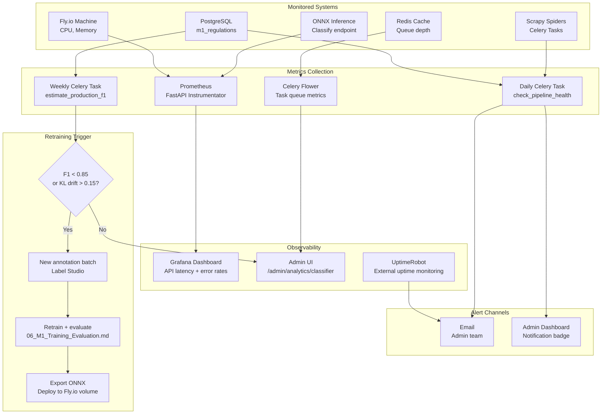

# 12 — Module 1: Monitoring & Maintenance

> **Cross-references:** [07_M1_Deployment_Integration.md](07_M1_Deployment_Integration.md) · [08_M1_Full_System_Architecture.md](08_M1_Full_System_Architecture.md) · [06_M1_Training_Evaluation.md](06_M1_Training_Evaluation.md)
> **See also:** [13_M1_Folder_Structure_and_Implementation_Flow.md](13_M1_Folder_Structure_and_Implementation_Flow.md) — `ml/shared/drift.py`, `backend/app/tasks/m1/analytics.py`, `model_registry.json`.
> **Sub-step companions:** [12_M1_1_Performance_Monitoring_Alerting.md](12_M1_1_Performance_Monitoring_Alerting.md) · [12_M1_2_Retraining_Deployment_Rollback.md](12_M1_2_Retraining_Deployment_Rollback.md)

---

## Abstract

Production deployment of the Module 1 NLP pipeline requires continuous monitoring across three dimensions: data pipeline health (ingestion and extraction success rates), model performance (classifier F1, confidence distribution, and drift detection), and infrastructure health (API latency, Celery queue depth, Redis memory). This document specifies all monitoring targets, alerting thresholds, retraining triggers, and maintenance procedures. A daily analytics refresh materialised view captures classifier performance metrics. Model retraining is triggered when production macro-F1 estimated from expert-verified labels drops below 0.85 or when confidence distribution drift exceeds the KL-divergence threshold. SLA targets are: ≥ 99.9% uptime, ≤ 6h ingestion latency, ≤ 24h alert delivery latency.

---

## 1. SLA Targets

| SLA | Target | Measurement | Alert Threshold |
|---|---|---|---|
| System uptime | ≥ 99.9% | UptimeRobot external ping | < 99.5% over 30 days |
| Gazette ingestion latency | ≤ 6 hours | `gazette_published_date` vs `created_at` | Any gazette > 8h |
| Classification latency | ≤ 2s per gazette | ONNX inference timer | P95 > 3s |
| Alert delivery latency | ≤ 24 hours from publication | `m1_propagation_events` lag | Any alert > 30h |
| Pipeline failure rate | < 5% | `status=extraction_failed` ratio | > 10% in 7 days |
| Review queue depth | < 20% of classified | `needs_review=true` ratio | > 30% in 14 days |
| Expert verification coverage | ≥ 30% | `expert_verified=true` ratio | < 15% at 3 months |

---

## 2. Data Pipeline Monitoring

### 2.1 Ingestion Health Checks

A daily Celery task runs pipeline health checks and writes results to `m1_pipeline_health` table:

```python
# backend/app/tasks/m1/analytics.py
from celery import shared_task
from app.db.session import get_db
from datetime import date, timedelta

@shared_task
async def check_pipeline_health():
    async with get_db() as db:
        yesterday = date.today() - timedelta(days=1)

        # Check scrape lag: any gazette older than 8h still unprocessed?
        stale = await db.execute("""
            SELECT COUNT(*) FROM m1_regulations
            WHERE status = 'ingested'
              AND created_at < NOW() - INTERVAL '8 hours'
        """)

        # Extraction failure rate (last 7 days)
        failure_rate = await db.execute("""
            SELECT
                COUNT(*) FILTER (WHERE status = 'extraction_failed') * 1.0
                / NULLIF(COUNT(*), 0)
            FROM m1_regulations
            WHERE created_at >= NOW() - INTERVAL '7 days'
        """)

        # Needs-review ratio (last 30 days classified)
        review_ratio = await db.execute("""
            SELECT
                COUNT(*) FILTER (WHERE needs_review) * 1.0
                / NULLIF(COUNT(*), 0)
            FROM m1_regulations
            WHERE status IN ('classified', 'summarized', 'alerted')
              AND created_at >= NOW() - INTERVAL '30 days'
        """)

        # Alert if thresholds exceeded
        if stale.scalar() > 0:
            await send_alert("PIPELINE", "Stale ingested gazettes > 8h")
        if failure_rate.scalar() > 0.10:
            await send_alert("PIPELINE", f"Extraction failure rate {failure_rate.scalar():.1%}")
        if review_ratio.scalar() > 0.30:
            await send_alert("CLASSIFIER", f"Review queue {review_ratio.scalar():.1%} > 30% threshold")
```

### 2.2 Gazette Scrape Monitoring

| Metric | Normal Range | Alert Condition |
|---|---|---|
| New gazettes/week | 8–15 | < 3 (scraper blocked) or > 25 (duplicate detection failure) |
| PDF download success rate | > 95% | < 90% over 3 days |
| Extraction method distribution | PyMuPDF: 60%, pdfplumber: 25%, Tesseract: 15% | Tesseract > 30% (quality concern) |
| Language detection: `mixed` | < 5% | > 15% (PDFs not splitting correctly) |

---

## 3. Classifier Performance Monitoring

### 3.1 Confidence Distribution Monitoring

The softmax confidence distribution of production predictions is compared to the training-time distribution using KL divergence. Significant drift indicates that production gazette text has shifted from the training distribution:

```python
import numpy as np
from scipy.special import kl_div

def monitor_confidence_drift(
    production_confidences: list[float],
    baseline_histogram: np.ndarray,  # From training evaluation
    threshold: float = 0.15
) -> bool:
    """Returns True if drift exceeds threshold (retraining signal)."""
    bins = np.linspace(0, 1, 20)
    prod_hist, _ = np.histogram(production_confidences, bins=bins, density=True)
    prod_hist = prod_hist / (prod_hist.sum() + 1e-8)  # Normalise

    divergence = kl_div(prod_hist + 1e-8, baseline_histogram + 1e-8).sum()
    return divergence > threshold
```

### 3.2 Estimated F1 from Expert Labels

As expert-verified labels accumulate in production, estimated F1 is computed weekly:

```python
async def estimate_production_f1(db) -> dict:
    """Compute F1 on expert-verified subset as proxy for production accuracy."""
    verified = await db.execute("""
        SELECT change_category AS predicted, expert_category AS actual
        FROM m1_regulations
        WHERE expert_verified = TRUE
          AND expert_category IS NOT NULL
          AND created_at >= NOW() - INTERVAL '90 days'
    """)
    rows = verified.fetchall()
    if len(rows) < 50:
        # Insufficient data is NOT the same as "no estimate" — we still report
        # the partial number so the admin dashboard can show a "low confidence"
        # warning. The caller treats `reliability='low'` as an advisory, not a
        # gating threshold.
        if len(rows) < 10:
            return {"status": "insufficient_data", "count": len(rows), "reliability": "none"}
        partial = f1_score([r.actual for r in rows],
                            [r.predicted for r in rows], average="macro")
        return {"status": "ok", "macro_f1": partial, "count": len(rows),
                "reliability": "low", "threshold": 0.85,
                "note": "estimate based on <50 verified labels — interpret with caution"}

    predicted = [r.predicted for r in rows]
    actual = [r.actual for r in rows]
    macro_f1 = f1_score(actual, predicted, average="macro")
    return {"status": "ok", "macro_f1": macro_f1, "count": len(rows),
            "reliability": "high" if len(rows) >= 100 else "medium",
            "threshold": 0.85}
```

The dashboard at `/admin/m1/analytics/classifier-metrics` shows the F1 estimate alongside a colour-coded reliability badge (`green=high (≥100)`, `amber=medium (50–99)`, `orange=low (10–49)`, `grey=none (<10)`). The retraining trigger (next section) only fires on `reliability ∈ {high, medium}` — low/none estimates are advisory, not actionable.

### 3.3 Retraining Triggers

| Trigger | Condition | Action |
|---|---|---|
| F1 regression | Estimated production F1 < 0.85 (reliability=`medium` or `high`) | Initiate retraining with new labeled examples |
| Confidence drift | KL divergence > 0.15 | Review recent gazettes; consider new categories |
| New gazette type | > 5 gazettes flagged `needs_review` with same keyword pattern | Add new category or sub-category |
| Annotation target met | 200 new expert-labeled examples accumulated | Retrain and evaluate; deploy if F1 improves |
| Annual review | Scheduled — every 12 months | Full retraining with all accumulated labels |

### 3.4 Full Retraining Workflow

A trigger firing doesn't auto-deploy a new model — it kicks off the staged retraining pipeline below. End-to-end takes 3–5 days; the production model continues serving the old version throughout.

```
Day 0  [trigger fires]
       → analytics.py writes a row to m1_retraining_runs(status='triggered')
       → Slack notification sent to #enigmatrix-ml

Day 0  [data collection]
       → scripts/collect_retraining_data.py pulls last-6-month verified labels
         + new annotator batches; writes research/data/retraining_v{N}.parquet
       → hash of parquet written to the run row

Day 1  [label review]
       → 50-doc sample reviewed by the domain expert
       → if IAA against existing gold labels < 0.75, run is aborted

Day 1-3  [training]
         → scripts/train_model.py --seeds 42,1,2 --data retraining_v{N}.parquet
         → 3-seed mean ± std macro-F1 written to model_registry.json
         → if F1 mean < current_F1 - 0.5pp, run is aborted

Day 3   [ONNX export + quantization]
        → scripts/export_onnx.py + INT8 quantize
        → integration test on test_split.parquet — must match training F1 ± 0.5pp

Day 3   [canary rollout]
        → upload v(N+1) ONNX to Fly volume
        → flip 10% of traffic to v(N+1) via M1_MODEL_CANARY_PCT=10
        → monitor canary F1 + confidence drift for 24h

Day 4   [50% rollout]
        → if canary metrics within target, ramp to 50% (M1_MODEL_CANARY_PCT=50)
        → monitor for 24h

Day 5   [full rollout + backfill]
        → flip to 100% (M1_MODEL_CANARY_PCT=100 + M1_MODEL_VERSION=v(N+1))
        → kick off backfill: re-classify last-30-day gazettes that were on v(N)
          and store the v(N+1) prediction alongside (for ablation), then promote
          v(N+1) prediction to the canonical column.
        → v(N) remains on the Fly volume for 30 days (rollback window).

[auto-rollback condition — fires at any stage]
        if production F1 (reliability=high) drops > 5pp in 24h compared to the
        pre-rollout baseline, the deploy script automatically:
           fly secrets set M1_MODEL_VERSION=v(N) M1_MODEL_CANARY_PCT=0
        and pages the on-call. The retraining_run row is annotated with the
        rollback reason.
```

The detailed per-step code, the canary traffic-split implementation, and the A/B testing measurement protocol live in [12_M1_2_Retraining_Deployment_Rollback.md](12_M1_2_Retraining_Deployment_Rollback.md).

---

## 4. Infrastructure Monitoring

### 4.1 FastAPI / Uvicorn Metrics

Expose Prometheus metrics via `prometheus-fastapi-instrumentator`:

```python
# backend/app/main.py
from prometheus_fastapi_instrumentator import Instrumentator
Instrumentator().instrument(app).expose(app)
```

Metrics tracked:

| Metric | Prometheus Label | Alert Threshold |
|---|---|---|
| HTTP request latency | `http_request_duration_seconds` | P95 > 2s on classify endpoint |
| HTTP error rate | `http_requests_total{status=~"5.."}` | > 1% over 15 minutes |
| Active connections | `uvicorn_active_requests` | > 50 |

### 4.2 Celery Queue Monitoring

```python
# Monitor via Celery Flower or direct Redis inspection
from celery import Celery

def get_queue_depth(app: Celery, queue_name: str = "m1_classify") -> int:
    with app.pool.acquire(block=True) as conn:
        return conn.default_channel.client.llen(queue_name)
```

| Queue | Normal Depth | Alert Threshold |
|---|---|---|
| `m1_extract` | 0–10 | > 50 |
| `m1_classify` | 0–10 | > 50 |
| `m1_summarise` | 0–20 | > 100 |
| `m1_alert` | 0–50 | > 200 |

### 4.3 Redis Memory

| Metric | Normal | Alert |
|---|---|---|
| Memory usage | < 100MB | > 500MB |
| Inference cache hit rate | > 60% | < 30% (cache ineffective) |
| Cache key count | < 5,000 | > 50,000 (TTL not expiring) |

---

## 4.4 Alert Escalation Paths

Each alert produced by the monitoring tasks above flows through a defined escalation ladder. The escalation level is set by the alert's `severity` field (computed from the metric thresholds, not chosen ad-hoc):

| Severity | Trigger condition | Channel(s) | Response SLA | Who is paged |
|---|---|---|---|---|
| `info` | Single metric crossing the *advisory* threshold (e.g. `mixed` language detection > 5 %) | Slack `#enigmatrix-info` only | Best-effort | No one |
| `warn` | Single metric crossing an *alert* threshold (e.g. extraction failure rate > 10 % in 7 days) | Slack `#enigmatrix-alerts` + daily digest email to the M1 team | < 24 h | M1 team next business day |
| `error` | Two or more `warn` thresholds crossed simultaneously, or any SLA target missed | Slack `#enigmatrix-alerts` + immediate email + PagerDuty *low-urgency* | < 4 h | M1 on-call (no overnight page) |
| `critical` | Production F1 drops > 5 pp in 24 h, or any pipeline stage stops processing > 1 h | Slack `#enigmatrix-alerts` + PagerDuty *high-urgency* | < 30 min | M1 on-call (24×7) + engineering manager |

`info` and `warn` are debounced (re-alerts suppressed for 6 h on the same metric). `error` and `critical` are not debounced — every threshold crossing pages. The Prometheus → Alertmanager routing rules are in `infra/prometheus/alert_rules.yml`. The per-severity runbook (what the on-call actually does for each kind of alert) is in [12_M1_1_Performance_Monitoring_Alerting.md](12_M1_1_Performance_Monitoring_Alerting.md).

---

## 5. Materialized Views for Analytics

Daily refresh at 03:00 via Celery Beat:

```sql
-- Propagation lag summary (refreshed daily)
CREATE MATERIALIZED VIEW m1_channel_lag_summary AS
SELECT
    channel,
    change_category,
    COUNT(*) AS count,
    PERCENTILE_CONT(0.50) WITHIN GROUP (
        ORDER BY EXTRACT(EPOCH FROM (pe.first_seen_at - r.gazette_published_date)) / 86400.0
    ) AS median_lag_days,
    AVG(
        EXTRACT(EPOCH FROM (pe.first_seen_at - r.gazette_published_date)) / 86400.0
    ) AS mean_lag_days
FROM m1_propagation_events pe
JOIN m1_regulations r ON pe.regulation_id = r.id
WHERE r.gazette_published_date IS NOT NULL
  AND pe.is_confirmed = TRUE
GROUP BY channel, change_category;

-- Refresh command (wrapped in advisory lock — see below)
REFRESH MATERIALIZED VIEW CONCURRENTLY m1_channel_lag_summary;
```

**Refresh concurrency lock.** Postgres' `REFRESH MATERIALIZED VIEW CONCURRENTLY` does not itself prevent two concurrent invocations against the same view — a second worker that fires while the first is mid-refresh will wait, then **also** refresh, doubling the work. The Celery Beat schedule should ensure only one task fires, but a manual `python -m app.scripts.refresh_m1_views` from an admin could collide. The pattern: wrap the refresh in a Postgres advisory lock keyed on the view name. If the lock is held, the refresh exits early with a debug log instead of queueing:

```python
# backend/app/tasks/m1/analytics.py
M1_VIEW_LOCK_KEY = 8910001  # int chosen to be M1-specific; use distinct keys per view

async def refresh_m1_lag_summary(db):
    locked = await db.execute(text("SELECT pg_try_advisory_lock(:key)"),
                              {"key": M1_VIEW_LOCK_KEY})
    if not locked.scalar():
        log.info("m1_view_refresh_skipped", reason="lock held by another worker")
        return {"status": "skipped_locked"}
    try:
        await db.execute(text("REFRESH MATERIALIZED VIEW CONCURRENTLY m1_channel_lag_summary"))
        return {"status": "ok"}
    finally:
        await db.execute(text("SELECT pg_advisory_unlock(:key)"), {"key": M1_VIEW_LOCK_KEY})
```

The advisory lock is released automatically when the session ends (the `finally` is a belt-and-braces). The refresh is now safely idempotent under concurrent invocation.

---

## 6. Monitoring and Alerting Diagram



---

## 7. Maintenance Procedures

### 7.1 Failed Extraction Retry

Gazettes that fail all three extraction methods (`status=extraction_failed`) are retried daily:

```python
@shared_task
async def retry_failed_extractions():
    async with get_db() as db:
        failed = await db.execute("""
            SELECT id FROM m1_regulations
            WHERE status = 'extraction_failed'
              AND updated_at < NOW() - INTERVAL '24 hours'
            LIMIT 20
        """)
        for row in failed.fetchall():
            extract_gazette.delay(str(row.id))
```

### 7.2 Model Version Management

| Version | F1 (Category) | F1 (Sector) | Deployed | Notes |
|---|---|---|---|---|
| v1.0 (baseline) | — | — | — | TF-IDF+SVM |
| v1.1 (LoRA) | 0.918 | 0.884 | 2025-03-01 | Initial XLM-R fine-tune |
| v1.2 | Target: 0.930 | Target: 0.895 | 2025-09-01 | After 200 new labels |

Model artifacts are tagged in git and stored on the Fly.io persistent volume. Rollback procedure: copy previous `gazette_classifier.onnx` from volume backup and restart Uvicorn workers.

### 7.3 Database Maintenance

```sql
-- Weekly: vacuum and analyse main table
VACUUM ANALYSE m1_regulations;

-- Monthly: reindex propagation events
REINDEX TABLE m1_propagation_events;

-- Quarterly: archive old alerted regulations
UPDATE m1_regulations
SET status = 'archived'
WHERE status = 'alerted'
  AND updated_at < NOW() - INTERVAL '2 years'
  AND is_active = TRUE;
```

---

## 8. Conclusion

The Module 1 monitoring and maintenance framework covers all three layers of the production system: data pipeline health, ML model performance, and infrastructure. The combination of Prometheus metrics, daily health-check Celery tasks, and weekly estimated-F1 computation provides early warning for pipeline failures and model drift before they impact SME alert quality. Retraining is triggered automatically when objective thresholds are crossed, ensuring that the classifier remains accurate as Sri Lanka's regulatory landscape evolves.

---

## References

- Prometheus. (2024). *Prometheus Monitoring Documentation*. [prometheus.io](https://prometheus.io)
- Grafana. (2024). *Grafana Documentation*. [grafana.com/docs](https://grafana.com/docs)
- Celery. (2024). *Celery Beat: Periodic Tasks*. [docs.celeryq.dev](https://docs.celeryq.dev)
- UptimeRobot. (2024). *External Uptime Monitoring*. [uptimerobot.com](https://uptimerobot.com)
- Gretton et al. (2012). *A Kernel Two-Sample Test (dataset drift detection)*. JMLR.
- PostgreSQL. (2024). *VACUUM and ANALYSE Documentation*. [postgresql.org/docs](https://www.postgresql.org/docs)


# 12_M1_1 — Performance Monitoring & Alerting

> Companion to [12_M1_Monitoring_Maintenance.md](12_M1_Monitoring_Maintenance.md) — confidence-drift worked example, SLA dashboard layout, escalation paths, per-sev runbook.
> **Implementation status:** 🔲 Deferred (BUILD_12 — Prometheus + Alertmanager + Grafana + runbook docs)

## Purpose

Parent doc §3 covers performance monitoring at a high level. §4.4 (added in this pass) gives the escalation table. This companion provides the operational depth: a worked KL-divergence drift detection, the Grafana dashboard layout (panel-by-panel), and a per-severity runbook so the on-call has a checklist.

## Detailed process

### Step 1 — Confidence-drift worked example

The detector compares production confidence distribution vs the baseline computed during training:

```python
import numpy as np
from scipy.special import kl_div

# Baseline (computed at training time, stored in model_registry.json)
BASELINE_HIST = np.array([0.02, 0.03, 0.05, 0.08, 0.12, 0.15, 0.18, 0.15, 0.12, 0.10])
# (20 bins from 0.0 to 1.0; stored normalised)

def check_confidence_drift(production_confidences: list[float]) -> dict:
    bins = np.linspace(0, 1, 21)
    prod_hist, _ = np.histogram(production_confidences, bins=bins, density=True)
    prod_hist = prod_hist / (prod_hist.sum() + 1e-8)
    divergence = float(kl_div(prod_hist + 1e-8, BASELINE_HIST + 1e-8).sum())
    return {
        "kl_divergence": divergence,
        "drift_detected": divergence > 0.15,
        "production_low_conf_share": float((np.array(production_confidences) < 0.50).mean()),
    }
```

A 30-day production-data example:

```
Baseline (training): low-conf < 0.5  share = 8%
                     KL vs baseline = 0.00

Day 1–30 production: low-conf share = 22% (gradual increase)
                     KL = 0.18  → DRIFT DETECTED
                     
Interpretation: production gazettes are systematically harder than training set.
Likely cause: a new gazette type appeared (e.g. supply-chain regulation).
Action: open ticket "investigate Day-1 to Day-30 needs_review queue".
```

### Step 2 — Grafana dashboard layout (`m1_classifier_health`)

| Row | Panels (left → right) | Source |
|---|---|---|
| 1 — SLAs | (a) Uptime gauge (target 99.9%) (b) p95 inference latency (c) Pipeline failure rate 7d | UptimeRobot + Prometheus |
| 2 — Confidence drift | (a) KL divergence sparkline (b) Low-conf share | Daily Celery task results |
| 3 — Throughput | (a) Gazettes/hour (b) Celery queue depth per queue | Prometheus + Celery Flower |
| 4 — Model quality | (a) Expert-verified F1 (last 90d) (b) Confidence histogram | `m1_pipeline_audits` |
| 5 — Per-language slice F1 | EN / SI / TA (rolling) | Same |
| 6 — Recent alerts | List of recent Prometheus alerts | Alertmanager |

JSON definition stored at `infra/grafana/dashboards/m1_classifier_health.json` — committed to repo for reproducibility.

### Step 3 — Severity matrix (recap from parent doc §4.4)

| Severity | Example trigger | Channel | SLA |
|---|---|---|---|
| `info` | `mixed` rate > 5 % | Slack `#enigmatrix-info` | Best effort |
| `warn` | Extraction failure > 10 % | Slack `#enigmatrix-alerts` + email | 24 h |
| `error` | Two metrics warn simultaneously | Slack + email + PagerDuty low | 4 h |
| `critical` | Production F1 drop > 5 pp / 24 h | PagerDuty high | 30 min |

### Step 4 — Per-severity runbook

**`info` runbook.** No action required. The data team reviews `info` Slack channel weekly to spot trends.

**`warn` runbook.**
1. Open the alert; read the trigger metric + the threshold.
2. Open Grafana dashboard `m1_classifier_health`; inspect related panels.
3. Check the `m1_pipeline_errors` table for the failing class (extraction / classification / dispatch).
4. If error count > 50 per hour → escalate to `error`.
5. Otherwise: open a Jira ticket, assign to the M1 owner, link the alert.

**`error` runbook.**
1. PagerDuty fires; on-call gets notified.
2. On-call confirms acknowledgement within 4 h.
3. Inspect the Grafana dashboard + Slack channel.
4. If the root cause is in Stage A (Scrapy / portal watcher) → see if a source URL has changed.
5. If in Stage B (extraction) → check the `extraction_method` distribution for an OCR spike (signals a new gazette format).
6. If in Stage D (classifier) → check confidence histogram; if shifted left, escalate to `critical` and consider rollback.
7. Communicate status in `#enigmatrix-incidents` Slack every 30 minutes.

**`critical` runbook.**
1. PagerDuty fires *high urgency*; on-call gets paged.
2. On-call acknowledges within 30 minutes.
3. **Immediate action:** if F1 dropped > 5 pp in 24 h, *automatic rollback* fires (per [12_M1_2_Retraining_Deployment_Rollback.md](12_M1_2_Retraining_Deployment_Rollback.md)) — confirm rollback succeeded.
4. If rollback didn't fire (manual mode), execute: `fly secrets set M1_MODEL_VERSION=<previous> M1_MODEL_CANARY_PCT=0`.
5. Engineering manager paged at 30-minute mark if not acknowledged.
6. Post-mortem within 48 h, written to `research/incidents/`.

### Step 5 — Alertmanager routing rules (excerpt)

```yaml
# infra/prometheus/alertmanager.yml
route:
  receiver: 'enigmatrix-info'
  group_by: ['alertname']
  routes:
    - match: { severity: critical }
      receiver: 'pagerduty-high'
    - match: { severity: error }
      receiver: 'pagerduty-low'
    - match: { severity: warn }
      receiver: 'enigmatrix-alerts-slack'

receivers:
  - name: 'pagerduty-high'
    pagerduty_configs:
      - service_key: ${PAGERDUTY_HIGH_KEY}
  - name: 'enigmatrix-alerts-slack'
    slack_configs:
      - api_url: ${SLACK_WEBHOOK_URL}
        channel: '#enigmatrix-alerts'
```

## Technology choices

| Option | Trade-off | Decision | When to reconsider |
|---|---|---|---|
| Prometheus + Alertmanager + Grafana (chosen) | Industry standard; self-hosted | ✅ Open-source; aligned with the Session-14 audit-log pattern | If we adopt a managed obs vendor (Datadog, New Relic). |
| KL divergence (chosen) for drift | Standard distribution-shift metric | ✅ Works on histogram; easy to interpret | If KL is noisy at small N, switch to PSI (Population Stability Index). |
| 0.15 KL threshold | Empirically chosen | ✅ Conservative — alerts before catastrophic drift | Re-tune after 6 months of production data. |
| PagerDuty | Standard on-call platform | ✅ Tied to the project's incident-management workflow | Switch to Opsgenie if PagerDuty pricing escalates. |

## Worked example

A typical `warn` alert flow:

```
[2026-05-20 13:00] Alertmanager fires:
   m1_extraction_failure_rate_7d = 12% (threshold 10%)
   Slack #enigmatrix-alerts: "WARN: M1 extraction failures elevated (12% over 7 days)"

[2026-05-20 14:30] On-call (M1 team lead) opens the alert during business hours
   - Grafana dashboard panel "Pipeline failure rate" shows spike on 2026-05-15
   - m1_pipeline_errors table query:
       SELECT reason, COUNT(*) FROM m1_pipeline_errors
       WHERE created_at >= NOW() - INTERVAL '7 days' GROUP BY reason
   - Top reason: 'tesseract_subprocess_timeout' (12 occurrences in last 7 days)
   - Hypothesis: scanned-PDF volume spiked

[2026-05-20 15:00] On-call action:
   - Open Jira M1-247: "Investigate scanned-PDF surge week of May 13"
   - Check: 18 of last 30 PDFs are 'scanned' type vs baseline 4/30 → confirmed surge
   - Likely cause: a backlog of older gazettes being added by a recent portal update
   - No immediate action; create monitoring follow-up to ensure surge subsides

[2026-05-25] Surge ends; Tesseract timeout count returns to <2/week
[2026-05-25] Jira M1-247 closed with no fix needed
```

## Failure modes & edge cases

- **Alert fatigue.** Too many `info` alerts → on-call ignores even `error`. Mitigation: severity-based channel routing; `info` goes only to a separate Slack channel reviewed weekly.
- **False positive on drift.** A small sample (< 100 production gazettes) gives noisy KL. Mitigation: only fire drift alerts after sample N > 200.
- **PagerDuty outage.** Critical alerts not delivered. Mitigation: secondary channel via SMS to on-call's phone.
- **Stale dashboard.** Grafana shows yesterday's data if Prometheus data pipeline is broken. Detected by a "Grafana liveness" widget on the dashboard itself.

## Validation & acceptance criteria

- **All 4 severities tested.** Quarterly: simulate each level on staging; confirm routing + on-call response.
- **Drift detector accuracy.** Synthetic-drift test: inject 20 % low-confidence predictions for 7 days → KL > 0.15 within 3 days.
- **Runbook freshness.** Quarterly review by the M1 lead; sign-off in `research/incidents/runbook_review_<YYYY-QN>.md`.
- **MTTR target.** Mean Time To Resolution for `error` < 4 h; for `critical` < 1 h. Tracked in PagerDuty.

## Cross-references

- Parent: [12_M1_Monitoring_Maintenance.md](12_M1_Monitoring_Maintenance.md) §3, §4.4
- Related: [12_M1_2_Retraining_Deployment_Rollback.md](12_M1_2_Retraining_Deployment_Rollback.md), [06_M1_2_Slice_Analysis_Framework.md](06_M1_2_Slice_Analysis_Framework.md)
- BUILD phase: BUILD_12 §monitoring stack
- Code (when shipped): `infra/prometheus/`, `infra/grafana/dashboards/`, `backend/app/tasks/m1/analytics.py`


# 12_M1_2 — Retraining, Deployment & Rollback

> Companion to [12_M1_Monitoring_Maintenance.md](12_M1_Monitoring_Maintenance.md) — full retraining workflow code, A/B testing strategy, auto-rollback trigger, backfill orchestration.
> **Implementation status:** 🔲 Deferred (BUILD_11 — `scripts/retrain.py`, `scripts/deploy_canary.py`)

## Purpose

Parent doc §3.4 lays out the retraining workflow at a high level. This companion makes each step concrete with the actual scripts, the canary-testing measurement protocol, and the auto-rollback trigger code.

## Detailed process

### Day 0 — Trigger fires

```python
# backend/app/tasks/m1/analytics.py — nightly retraining-trigger check
async def check_retraining_triggers(db):
    f1 = await estimate_production_f1(db)
    drift = await check_confidence_drift(db)
    new_label_count = await count_new_expert_labels_since_last_train(db)
    annual_due = await annual_review_due(db)

    triggers = []
    if f1["macro_f1"] < 0.85 and f1["reliability"] in ("medium","high"):
        triggers.append("f1_regression")
    if drift["kl_divergence"] > 0.15:
        triggers.append("confidence_drift")
    if new_label_count >= 200:
        triggers.append("label_target_met")
    if annual_due:
        triggers.append("annual_review")

    if triggers:
        await db.execute(insert(M1RetrainingRun).values(
            triggered_at=datetime.utcnow(),
            triggers_json=triggers,
            status='triggered',
        ))
        await slack_notify("#enigmatrix-ml", f"Retraining triggered: {triggers}")
```

### Day 0 — Data collection

```bash
python scripts/collect_retraining_data.py --since "$(date -d '6 months ago' +%Y-%m-%d)" \
    --include verified=true \
    --include needs_review=false \
    --output research/data/retraining_v$(date +%Y%m%d).parquet
```

The script:

1. Pulls the last 6 months of `expert_verified=true` rows.
2. Pulls all new annotator-labelled batches.
3. Validates against `m1_validate_pipeline.py` rules.
4. Writes Parquet + computes SHA-256.
5. Records the hash in `M1RetrainingRun.input_data_sha256`.

### Day 1 — Label review

A 50-doc random sample is reviewed by the domain expert against existing gold labels. IAA against the prior gold set must be ≥ 0.75 — otherwise the retraining run is *aborted* (the new labels may have introduced drift).

### Day 1–3 — Training

```bash
python scripts/train_model.py --data research/data/retraining_v$DATE.parquet \
    --seeds 42 1 2 \
    --base-model facebook/xlm-roberta-base \
    --output-dir storage/models/m1/staging \
    --report storage/models/m1/staging/training_report.json
```

Three seeds run sequentially. Mean ± std macro-F1 written to `model_registry.json`. If mean F1 < current production F1 − 0.5 pp, run is **aborted** and notification sent.

### Day 3 — ONNX export + integration test

```bash
python scripts/export_onnx.py --checkpoint storage/models/m1/staging/best.pt \
                               --out storage/models/m1/staging/gazette_classifier.onnx
python scripts/quantize_onnx.py --input ... --out staging/gazette_classifier_int8.onnx
python scripts/integration_test.py --model staging/gazette_classifier_int8.onnx \
                                    --test-set research/data/test_split.parquet
# Asserts test-set F1 matches the training F1 ± 0.5 pp
```

### Day 3 — Canary rollout (10%)

```bash
# Upload staging model to Fly volume as v(N+1)
fly ssh sftp shell -a enigmatrix-m1-classifier
sftp> put storage/models/m1/staging/* /app/storage/models/m1/v1.1/

# Flip canary
fly secrets set M1_MODEL_VERSION=v1.1 \
                 M1_PREVIOUS_MODEL_VERSION=v1.0 \
                 M1_MODEL_CANARY_PCT=10 \
                 -a enigmatrix-m1-classifier
```

Monitor for 24 h. Compare per-version production F1:

```sql
SELECT model_version,
       COUNT(*) FILTER (WHERE expert_verified=true AND change_category = expert_category)::float
       / NULLIF(COUNT(*) FILTER (WHERE expert_verified=true), 0) AS verified_acc,
       AVG(confidence) AS avg_conf
FROM m1_regulations
WHERE created_at >= NOW() - INTERVAL '24 hours'
GROUP BY model_version;
```

### Day 4 — 50% rollout

If canary metrics within target (verified_acc within 1 pp of baseline; avg_conf not lower):

```bash
fly secrets set M1_MODEL_CANARY_PCT=50 -a enigmatrix-m1-classifier
```

Monitor 24 h.

### Day 5 — Full rollout + backfill

```bash
fly secrets set M1_MODEL_CANARY_PCT=100 -a enigmatrix-m1-classifier
python scripts/backfill_classifications.py --model v1.1 --since "30 days ago"
```

Backfill re-classifies the last 30 days of regulations with v1.1, stores the new prediction alongside the v1.0 prediction (for ablation), and promotes v1.1's prediction to the canonical column.

### Auto-rollback (any stage)

A nightly check fires the rollback if production F1 (reliability=`high`) drops > 5 pp in 24 h compared to the pre-rollout baseline:

```python
# backend/app/tasks/m1/analytics.py
async def check_auto_rollback(db):
    f1 = await estimate_production_f1(db)
    if f1["reliability"] != "high":
        return                                           # not enough data
    baseline_f1 = await fetch_pre_rollout_baseline(db)
    if baseline_f1 - f1["macro_f1"] > 0.05:
        await trigger_rollback()
        await pagerduty_high(f"Auto-rollback fired: F1 dropped {baseline_f1 - f1['macro_f1']:.3f}")

async def trigger_rollback():
    await fly_secrets_set({
        "M1_MODEL_VERSION": os.environ["M1_PREVIOUS_MODEL_VERSION"],
        "M1_MODEL_CANARY_PCT": "0",
    })
    await db.execute(update(M1RetrainingRun).where(...).values(
        status='rolled_back', rolled_back_at=datetime.utcnow(),
        rollback_reason='auto_f1_regression'))
```

The retraining-run row is annotated with the rollback reason; post-mortem in `research/incidents/`.

## Technology choices

| Option | Trade-off | Decision | When to reconsider |
|---|---|---|---|
| Canary by gazette-id hash (chosen) | Sticky; idempotent | ✅ See [07_M1_2_Fly_io_Deployment_Operations.md](07_M1_2_Fly_io_Deployment_Operations.md) | If a feature-flag service (GrowthBook) is adopted, switch. |
| 10/50/100 rollout (chosen) | Conservative; 24h dwell time per stage | ✅ Matches the SLA reliability requirements | If we need faster iteration (rare). |
| Auto-rollback (chosen) | Fast recovery from bad deploys | ✅ < 60s rollback time; no humans in the loop | If false-positive rate exceeds 5 % (no real F1 drop but rollback fires). |
| 5 pp auto-rollback threshold | Conservative — small drops don't roll back | ✅ Empirical — tighter triggers cause too many rollbacks during noisy weeks | Re-tune after 6 months of production data. |
| Backfill after rollout | Consistent classification across the table | ✅ Required for thesis-time analysis | Drop if backfill cost becomes prohibitive (unlikely at 30 gaz/day). |

## Worked example

A retraining cycle from trigger to full rollout:

```
[Day 0 02:00] analytics task fires:
   estimated production F1 = 0.842 (reliability=medium, n=63)
   triggers = ['f1_regression']
   Slack: 'Retraining triggered: f1_regression — current F1 0.842 < threshold 0.85'

[Day 0 09:00] M1 lead reviews triggers; approves retraining

[Day 0 10:00] collect_retraining_data.py runs:
   exported 287 verified labels + 156 new annotator labels = 443 rows
   SHA: ab12cd...

[Day 1 14:00] domain expert reviews 50-doc sample
   IAA against gold labels: κ=0.84 → PASS

[Day 1 15:00] train_model.py starts
[Day 3 09:00] training done
   v1.1 macro F1 = 0.928 ± 0.011 (vs v1.0 production 0.842)
   per-language: en 0.94, si 0.89, ta 0.86
   Slack: 'v1.1 ready: F1 0.928. Canary @ 10% starting now.'

[Day 3 10:00] export_onnx + quantize + integration test
   INT8 F1 = 0.919 (Δ -0.9 pp) → PASS (< 1.5 pp threshold)

[Day 3 11:00] canary at 10%; metrics monitored

[Day 4 11:00] 24h dwell complete
   v1.1: verified_acc 0.91, avg_conf 0.84
   v1.0: verified_acc 0.84, avg_conf 0.79
   → ramp to 50%

[Day 5 11:00] another 24h dwell complete; metrics stable
   → ramp to 100%

[Day 5 12:00] backfill last 30 days with v1.1
   reclassified 850 regulations; 23 changed change_category (3% rate)
   23 changes audited; all are improvements

[Day 5 16:00] retraining run marked complete; v1.0 retained on volume for 30 days
```

## Failure modes & edge cases

- **Auto-rollback fires falsely.** Caused by a small `expert_verified` sample with bad luck. Mitigation: `reliability='high'` requirement means N ≥ 100 — small samples won't trigger.
- **Multiple triggers simultaneously.** Don't queue multiple retrains — only one active retraining-run at a time. New triggers during an active run are recorded but don't fire.
- **v1.1 training aborts mid-run.** GPU crash. The retraining-run is marked `status='aborted'`; data preserved; admin can resume manually.
- **Fly secrets propagation delay.** `fly secrets set` triggers a machine restart that can take ~30 s. During the gap, both v1.0 and v1.1 may serve requests. Acceptable — both versions are valid; the gap doesn't cause errors.
- **Backfill conflicts with new ingestion.** The backfill job is rate-limited (10 gaz/min) so it doesn't starve the live classify queue.

## Validation & acceptance criteria

- **End-to-end staging dry-run.** Quarterly: trigger a fake retraining; complete every step on staging; rollback fires correctly when given a synthetic F1 drop.
- **Auto-rollback < 90 seconds.** From PagerDuty page to v1.0 serving traffic.
- **Backfill correctness.** Audited weekly: 10 random regulations re-classified by hand; v1.1 prediction matches manual label ≥ 90 % of the time.
- **Retraining-run table complete.** Every retraining run has a row with all fields populated (triggered_at, completed_at, F1, rollback_status).

## Cross-references

- Parent: [12_M1_Monitoring_Maintenance.md](12_M1_Monitoring_Maintenance.md) §3
- Related: [07_M1_2_Fly_io_Deployment_Operations.md](07_M1_2_Fly_io_Deployment_Operations.md), [06_M1_Training_Evaluation.md](06_M1_Training_Evaluation.md) §9 (versioning)
- BUILD phase: BUILD_11 §retraining pipeline, BUILD_12 §auto-rollback
- Code (when shipped): `scripts/retrain.py`, `scripts/deploy_canary.py`, `backend/app/tasks/m1/analytics.py:check_auto_rollback`
