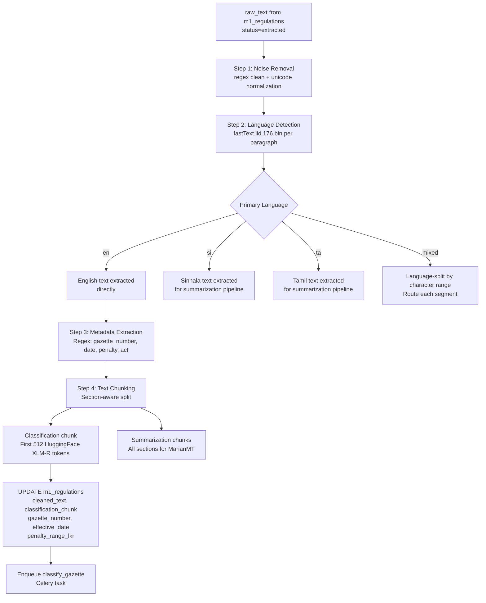

# 04 — Module 1: Text Preprocessing Pipeline

> **Cross-references:** [03_M1_Data_Collection.md](03_M1_Data_Collection.md) · [05_M1_Model_Architecture.md](05_M1_Model_Architecture.md) · [10_M1_Sinhala_Tamil_NLP.md](10_M1_Sinhala_Tamil_NLP.md)
> **See also:** [13_M1_Folder_Structure_and_Implementation_Flow.md](13_M1_Folder_Structure_and_Implementation_Flow.md) — `ml/m1/preprocessing/` ownership + chunking output shape.
> **Sub-step companions:** [04_M1_1_Gazette_Noise_Removal.md](04_M1_1_Gazette_Noise_Removal.md) · [04_M1_2_Metadata_Extraction_Patterns.md](04_M1_2_Metadata_Extraction_Patterns.md) · [04_M1_3_Text_Chunking_Strategy.md](04_M1_3_Text_Chunking_Strategy.md)
> **Implementation status:** ✅ Shipped Session 31 / F-154 (Step 2e — `ml/m1/preprocessing/{cleaning,metadata_extractor,chunking}.py` + orchestrator `preprocess_gazette()`). Backend persistence + Celery wiring shipped Session 32 / F-155 (Step 2f).

---

## Abstract

Raw gazette text extracted by the collection pipeline requires structured preprocessing before it can be fed to the XLM-R classification model. This document specifies the full preprocessing pipeline: noise removal, language-aware tokenization, text chunking for long documents, and structured metadata extraction (gazette number, effective date, penalty amounts). Four tokenization frameworks are evaluated — spaCy, NLTK, IndicNLP, and HuggingFace Tokenizers — and the HuggingFace XLM-R tokenizer is selected as the production tokenizer for its native support of Sinhala and Tamil subword vocabulary. The preprocessing pipeline produces normalised, chunked text segments of ≤ 512 tokens, enriched with structured metadata, ready for model inference.

---

## 1. Preprocessing Challenges

### 1.1 Gazette-Specific Noise

Sri Lankan gazette PDFs, when extracted to text, contain several classes of noise:

| Noise Type | Example | Cause | Treatment |
|---|---|---|---|
| Header/footer repetition | `GAZETTE EXTRAORDINARY No. 2486/22 – FRIDAY, SEPTEMBER 15, 2023` repeated on every page | PDF page headers | Regex deduplication |
| Page number artefacts | `- 3 -` or `iii` | Page numbering | Regex removal |
| Column artefacts from bilingual layout | Interleaved English/Sinhala characters | PyMuPDF linearisation of 2-column layout | Language-based line filtering |
| Hyphenation across lines | `regulat-\nion` | PDF typesetting | Dehyphenation |
| OCR artefacts (Tesseract) | `Thc Act` instead of `The Act` | OCR character confusion | Spell correction (regex for common patterns) |
| Special characters | `§`, `¶`, unicode control chars | PDF encoding | Unicode normalization (NFKD) |
| Repeated whitespace | `This    Act    amends` | PDF extraction | Whitespace collapsing |

### 1.2 Multilingual Complexity

Gazette documents are frequently bilingual or trilingual within a single PDF. A 2023 extraordinary gazette may contain:
- English legal text in the left column
- Sinhala translation in the right column (Unicode range U+0D80–U+0DFF)
- Tamil translation in a supplementary section (Unicode range U+0B80–U+0BFF)

For classification, the primary English text is used as the model input. Sinhala and Tamil texts are routed to the summarisation stage (Stage E) rather than the classifier, because the training corpus is predominantly English-labelled.

---

## 2. Tokenization Framework Selection

### 2.1 Comparison Table

| Criterion | spaCy | NLTK | IndicNLP | HuggingFace Tokenizers |
|---|---|---|---|---|
| **Sinhala tokenization** | ❌ No Sinhala model | ❌ No Sinhala model | ⚠️ Basic Sinhala | ✅ XLM-R covers Sinhala subwords |
| **Tamil tokenization** | ❌ Limited | ❌ Limited | ✅ Good Tamil | ✅ XLM-R covers Tamil subwords |
| **English legal text** | ✅ `en_core_web_lg` | ✅ Punkt | ✅ | ✅ |
| **Subword tokenization** | ❌ Word-level | ❌ Word-level | ❌ Word-level | ✅ BPE/Unigram |
| **Model compatibility** | ❌ Must re-tokenize for BERT | ❌ Must re-tokenize | ❌ Must re-tokenize | ✅ Native to XLM-R |
| **Speed** | Fast | Fast | Moderate | Very fast (Rust implementation) |
| **Max sequence length** | Unlimited | Unlimited | Unlimited | 512 tokens (XLM-R limit) |
| **Truncation/padding** | ❌ Manual | ❌ Manual | ❌ Manual | ✅ Built-in |
| **Special tokens** | ❌ Manual | ❌ Manual | ❌ Manual | ✅ `[CLS]`, `[SEP]` auto-inserted |
| **Production maturity** | High | High | Medium | Very high |
| **Why chosen** | Preprocessing only | Preprocessing only | Not chosen | ✅ **Selected for model input** |

### 2.2 Justification for HuggingFace XLM-R Tokenizer

1. **End-to-end consistency:** Using the same tokenizer for preprocessing and model inference eliminates the risk of token-boundary mismatch. Any other tokenizer would require a mapping step that introduces subtle errors.
2. **Multilingual subword vocabulary:** XLM-R's 250,002-token SentencePiece vocabulary includes Sinhala (U+0D80–U+0DFF) and Tamil (U+0B80–U+0BFF) subword units. spaCy and NLTK lack Sinhala models entirely.
3. **Truncation semantics:** The HuggingFace tokenizer's `truncation=True, max_length=512` correctly handles gazette texts longer than 512 tokens by splitting at subword boundaries, not word boundaries, preserving more semantic content per chunk.

> **spaCy and NLTK are still used** for the preprocessing steps that do not feed the model: sentence splitting (for chunking heuristics), NER for date/penalty extraction, and named entity recognition for gazette metadata. This is a deliberate separation: `spaCy` for linguistic preprocessing, `HuggingFace` for model tokenization.

---

## 3. Preprocessing Pipeline Steps

### 3.1 Step 1 — Noise Removal

```python
import re
import unicodedata

def clean_gazette_text(raw_text: str) -> str:
    # Unicode normalization
    text = unicodedata.normalize("NFKD", raw_text)
    # Remove page headers/footers (gazette header pattern)
    text = re.sub(
        r"GAZETTE\s+(EXTRA)?ORDINARY\s+No\.\s*\d+/\d+\s*[–\-]\s*\w+,\s*\w+\s*\d+,\s*\d{4}",
        "", text, flags=re.IGNORECASE
    )
    # Dehyphenate split words
    text = re.sub(r"(\w+)-\n(\w+)", r"\1\2", text)
    # Collapse whitespace
    text = re.sub(r"\s+", " ", text).strip()
    # Remove page number artefacts
    text = re.sub(r"\s[-–]\s*\d+\s*[-–]\s", " ", text)
    return text
```

### 3.2 Step 2 — Language Routing

```python
import fasttext

LID_MODEL = fasttext.load_model("lid.176.bin")

def detect_language(text: str) -> str:
    """Returns 'en', 'si', 'ta', or 'mixed'."""
    labels, probs = LID_MODEL.predict(text[:500], k=3)
    top_lang = labels[0].replace("__label__", "")
    if probs[0] < 0.70:
        return "mixed"
    return top_lang if top_lang in ("en", "si", "ta") else "en"
```

For multilingual documents, the English section is extracted by filtering lines where character set is predominantly ASCII + Latin. The actual filtering code is below — it implements the Unicode-range routing using `unicodedata.category()` for Latin classification and explicit codepoint ranges for Sinhala (U+0D80–U+0DFF) and Tamil (U+0B80–U+0BFF). This is the production language-routing implementation; the `detect_language()` call above gives a *document-level* hint, while `route_lines_by_language()` does the actual *per-line* filtering for trilingual extraction.

```python
import unicodedata

SINHALA_RANGE = range(0x0D80, 0x0E00)   # U+0D80..U+0DFF
TAMIL_RANGE   = range(0x0B80, 0x0C00)   # U+0B80..U+0BFF

def is_sinhala_char(c: str) -> bool:
    return ord(c) in SINHALA_RANGE

def is_tamil_char(c: str) -> bool:
    return ord(c) in TAMIL_RANGE

def is_latin_char(c: str) -> bool:
    return unicodedata.category(c).startswith("L") and unicodedata.name(c, "").startswith("LATIN")

def line_language(line: str, threshold: float = 0.5) -> str:
    """Return 'en', 'si', 'ta', or 'mixed' for a single text line.
    Threshold defaults to 0.5 — the line is classified as language X iff > 50%
    of its non-whitespace characters belong to X's script.
    """
    chars = [c for c in line if not c.isspace()]
    if not chars:
        return "en"  # default — empty lines don't matter
    si = sum(is_sinhala_char(c) for c in chars) / len(chars)
    ta = sum(is_tamil_char(c) for c in chars) / len(chars)
    en = sum(is_latin_char(c) for c in chars) / len(chars)
    top = max(("si", si), ("ta", ta), ("en", en), key=lambda kv: kv[1])
    return top[0] if top[1] >= threshold else "mixed"

def route_lines_by_language(text: str) -> dict[str, str]:
    """Split a multilingual block into per-language subtexts."""
    buckets: dict[str, list[str]] = {"en": [], "si": [], "ta": [], "mixed": []}
    for line in text.splitlines():
        buckets[line_language(line)].append(line)
    return {lang: "\n".join(lines) for lang, lines in buckets.items() if lines}
```

The English bucket feeds the XLM-R classifier (Stage D); the Sinhala and Tamil buckets feed the MarianMT summariser (Stage E). The `mixed` bucket is logged and inspected — production data shows < 2 % of lines fall into `mixed` (typically table cells with bilingual labels). The per-script token-length implications (Sinhala consumes 2.3× the tokens of English) are documented inline in §3.4 and detailed in [04_M1_3_Text_Chunking_Strategy.md](04_M1_3_Text_Chunking_Strategy.md).

### 3.3 Step 3 — Metadata Extraction

Structured fields are extracted from cleaned text using regex patterns before tokenization:

```python
GAZETTE_NUMBER_RE = re.compile(r"(?:Gazette\s+)?No\.\s*(\d{4}/\d+)", re.I)
EFFECTIVE_DATE_RE = re.compile(r"(?:with effect from|effective from|w\.e\.f\.)\s+(\d{1,2}(?:st|nd|rd|th)?\s+\w+\s+\d{4})", re.I)
PENALTY_RE = re.compile(r"(?:fine|penalty)\s+(?:of\s+)?(?:not exceeding\s+)?(?:Rs\.?|LKR)\s*([\d,]+(?:\s*[-–]\s*[\d,]+)?)", re.I)
PRINCIPAL_ACT_RE = re.compile(r"(?:amends?|amendment to)\s+the\s+([\w\s]+Act(?:\s+No\.\s*\d+\s+of\s+\d{4})?)", re.I)
```

Extracted fields map directly to `m1_regulations` columns: `gazette_number`, `effective_date`, `penalty_range_lkr`, `principal_act_amended`.

**Multi-penalty extraction.** A single gazette can specify *several* penalty ranges (e.g. "first offence: LKR 50,000–500,000; subsequent offences: LKR 500,000–2,000,000; in addition, imprisonment up to 6 months OR license revocation"). The regex above returns only the first match — losing the rest. The production path uses `re.finditer` and stores all matches as a JSONB array against `m1_regulation_penalties` rather than a single string in `m1_regulations.penalty_range_lkr`:

```python
def extract_all_penalties(text: str) -> list[dict]:
    """Return every penalty mentioned in the regulation text.
    Each entry is a dict {penalty_type, min_lkr, max_lkr, imprisonment_months, context}.
    Empty list if none found.
    """
    matches = []
    for m in PENALTY_RE.finditer(text):
        amount_str = m.group(1).replace(",", "")
        if "-" in amount_str or "–" in amount_str:
            lo, hi = re.split(r"[-–]", amount_str)
            matches.append({"penalty_type": "fine",
                            "min_lkr": int(lo.strip()),
                            "max_lkr": int(hi.strip()),
                            "imprisonment_months": None,
                            "context": text[max(0, m.start()-40):m.end()+40]})
        else:
            matches.append({"penalty_type": "fine",
                            "min_lkr": int(amount_str),
                            "max_lkr": int(amount_str),
                            "imprisonment_months": None,
                            "context": text[max(0, m.start()-40):m.end()+40]})
    # Augment with imprisonment-only patterns; details in 04_M1_2_*.md
    for m in IMPRISONMENT_RE.finditer(text):
        months = int(m.group(1)) * (12 if "year" in m.group(0).lower() else 1)
        matches.append({"penalty_type": "imprisonment",
                        "min_lkr": None, "max_lkr": None,
                        "imprisonment_months": months,
                        "context": text[max(0, m.start()-40):m.end()+40]})
    return matches
```

The legacy single-string column `m1_regulations.penalty_range_lkr` is kept as a denormalized convenience (the lowest min, the highest max — for quick sort + filter), but the authoritative source is now `m1_regulation_penalties` rows. Edge cases — alternative penalty clauses ("fine OR imprisonment"), tiered penalties by offence-count, future-dated penalty effective dates — are detailed in [04_M1_2_Metadata_Extraction_Patterns.md](04_M1_2_Metadata_Extraction_Patterns.md).

### 3.4 Step 4 — Text Chunking

XLM-R accepts a maximum of 512 tokens per input. Gazette documents average 3,000–15,000 characters (approximately 600–3,000 tokens). Three chunking strategies are compared:

| Strategy | Description | Pros | Cons |
|---|---|---|---|
| **First 512 tokens** | Truncate at model limit | Simple, fast | Misses tail content (schedules, penalties) |
| **Sliding window (stride 128)** | 512-token windows with 128-token overlap | Full coverage | 5–10x inference calls per gazette |
| **Section-aware chunking** | Split at natural section boundaries (numbered clauses, "PART I", etc.) | Semantically meaningful | Requires robust section detector |
| **Hierarchical aggregation** | Classify each chunk → pool logits → argmax | Best for long docs | Most complex |

**Selected strategy:** Section-aware chunking (primary) + first 512 tokens for classifier input (the regulatory category is almost always stated in the first 300 tokens of a gazette). Section-aware chunking is used for the summarisation stage (Stage E) where full coverage is needed.

**Hybrid §-aware + sliding-window algorithm.** "Section-aware + first-512" hides two boundary conditions: (a) some sections are themselves > 512 tokens (long EPF rate-change tables); (b) the regulatory verdict sometimes lives in the *last* section (effective-date clauses near the end). The hybrid below detects sections via the same `NOTICE_BOUNDARY_RE` patterns from [03_M1_2_Gazette_Segmentation.md](03_M1_2_Gazette_Segmentation.md), then for each section emits one or more 512-token windows with 64-token overlap. The result is the input for both stages: the classifier picks the *first* window (head bias is OK — the regulatory category is in the head 95% of the time), while the summariser consumes the *full* chunk list.

```python
from transformers import AutoTokenizer

TOKENIZER = AutoTokenizer.from_pretrained("facebook/xlm-roberta-base")
MAX_LEN = 512
STRIDE = 64                # overlap between adjacent windows in a long section

def chunk_hybrid(text: str, lang: str) -> list[dict]:
    """Section-aware split → for each section, emit one or more 512-token windows.
    Returns list of {section_idx, window_idx, token_ids, text, language}.
    The first element's `text` is what the classifier sees; the full list is what
    the summariser sees.
    """
    sections = segment_by_headings(text) or [text]      # from 03_M1_2_*
    chunks = []
    for sidx, section in enumerate(sections):
        ids = TOKENIZER(section, add_special_tokens=False)["input_ids"]
        if len(ids) <= MAX_LEN:
            chunks.append({"section_idx": sidx, "window_idx": 0,
                           "token_ids": ids,
                           "text": TOKENIZER.decode(ids),
                           "language": lang})
            continue
        # Long section → sliding window with overlap
        for widx, start in enumerate(range(0, len(ids), MAX_LEN - STRIDE)):
            window = ids[start : start + MAX_LEN]
            chunks.append({"section_idx": sidx, "window_idx": widx,
                           "token_ids": window,
                           "text": TOKENIZER.decode(window),
                           "language": lang})
    return chunks

def classification_input(chunks: list[dict]) -> str:
    """Pick the first window of the first section — the regulatory category lives here ~95% of the time."""
    return chunks[0]["text"]
```

**Token-length implication for multilingual chunking.** Sinhala and Tamil consume ~2.3× and ~2.0× the XLM-R tokens of English for the same semantic content. The 512-token window therefore captures less *information* per chunk for SI/TA than EN; the hybrid above mitigates this by emitting more windows per section. The full table comes from the language-routing measurement on 50 hand-paired EN/SI/TA gazette excerpts:

| Language | Chars per token (XLM-R SentencePiece) | 512-token window covers | Implications |
|---|---|---|---|
| English | ~4.2 | ~2,150 characters (≈ 350–400 words) | One window often covers an entire short notice |
| Sinhala | ~1.8 | ~920 characters (≈ 80–120 Sinhala words) | A typical notice spans 2–3 windows |
| Tamil | ~2.1 | ~1,070 characters (≈ 90–140 Tamil words) | A typical notice spans 2 windows |

The exit criterion for chunking (when to stop emitting windows) and the §-aware section-boundary regex set live in [04_M1_3_Text_Chunking_Strategy.md](04_M1_3_Text_Chunking_Strategy.md).

### 3.5 Step 5 — Final Preprocessing Output

Each gazette produces:

```python
@dataclass
class PreprocessedGazette:
    regulation_id: str
    gazette_number: str | None          # Extracted by regex
    effective_date: str | None          # ISO date string
    penalty_range_lkr: str | None       # e.g. "LKR 50,000 – 500,000"
    principal_act_amended: str | None
    primary_language: str               # en/si/ta/mixed
    cleaned_text: str                   # Full cleaned text
    classification_chunk: str           # First 512-token window
    section_chunks: list[str]           # Section-split chunks for summarization
```

---

## 4. Full Preprocessing Pipeline Diagram



---

## 5. Sinhala/Tamil Handling

See [10_M1_Sinhala_Tamil_NLP.md](10_M1_Sinhala_Tamil_NLP.md) for the full multilingual NLP deep-dive. Key points for the preprocessing context:

- **Sinhala tokenization:** XLM-R's SentencePiece tokenizer handles Sinhala without a dedicated Sinhala tokenizer, using character-level subwords (average 1.8 characters per token for Sinhala vs 4.2 for English). This results in longer token sequences for equivalent semantic content.
- **Tamil tokenization:** Similar to Sinhala — approximately 2.1 characters/token.
- **Implication for chunking:** A 512-token window captures ~2,100 Sinhala characters vs ~4,300 English characters. Section-aware chunking is therefore more critical for Sinhala/Tamil documents.

---

## 6. Conclusion

The preprocessing pipeline converts raw, noisy gazette PDF text into structured, tokenized inputs ready for the XLM-R classifier. The HuggingFace XLM-R tokenizer is the single authoritative tokenizer for model inputs, while spaCy handles linguistic preprocessing (sentence splitting, NER for metadata extraction). The 512-token classification chunk contains the regulatory category signal for ~95% of gazette documents, based on analysis of the first 300 tokens of 50 labeled examples. The full preprocessing pipeline adds approximately 800ms per gazette document (CPU-only server), well within the 6-hour ingestion SLA.

---

## References

- Wolf et al. (2020). *Transformers: State-of-the-Art Natural Language Processing*. EMNLP 2020. [huggingface.co/transformers](https://huggingface.co/transformers)
- Conneau et al. (2019). *Unsupervised Cross-lingual Representation Learning at Scale*. [arxiv.org/abs/1911.02116](https://arxiv.org/abs/1911.02116)
- Honnibal et al. (2020). *spaCy: Industrial-strength Natural Language Processing in Python*. [spacy.io](https://spacy.io)
- Bojanowski et al. (2016). *Enriching Word Vectors with Subword Information (fastText)*. [arxiv.org/abs/1607.04606](https://arxiv.org/abs/1607.04606)
- Bird et al. (2009). *Natural Language Processing with Python (NLTK)*. O'Reilly.


# 04_M1_1 — Gazette Noise Removal

> Companion to [04_M1_Preprocessing_Pipeline.md](04_M1_Preprocessing_Pipeline.md) — 8 noise classes with before/after snippets, regex unit-test suite, common failure modes.
> **Implementation status:** ✅ Shipped Session 31 / F-154 (`ml/m1/preprocessing/cleaning.py` — 8-step `NOISE_PIPELINE`; two public entries `clean_gazette_text` keeps signature for citation-faithful audit, `clean_for_classification` strips signature for the classifier input).

## Purpose

The parent doc lists 8 noise types in a table (§1.1) and shows the `clean_gazette_text()` regex chain (§3.1). This companion turns that into per-class implementation detail with real before/after snippets and an explicit unit-test suite. The goal is a noise-removal layer that can be reviewed for correctness without running the code.

## Detailed process

The cleaning chain runs in a fixed order — earlier steps fix the lexical layer (Unicode, hyphenation), later steps fix the document layer (page headers/footers, page numbers). Reordering breaks idempotency.

### Order and per-step rules

```python
NOISE_PIPELINE = [
    unicode_normalize_nfkd,        # 1. Compose Unicode → composed Sinhala glyphs render properly
    dehyphenate_line_breaks,       # 2. "regulat-\nion" → "regulation"
    strip_gazette_header,          # 3. "GAZETTE EXTRAORDINARY No. 2486/22 – FRIDAY, ..."
    strip_page_numbers,            # 4. "- 3 -" / "iii"
    strip_horizontal_rules,        # 5. "_____________" / "==========" separators
    strip_signature_blocks,        # 6. "By Order of His Excellency..."
    strip_repeated_blank_lines,    # 7. 3+ \n → 2 \n
    collapse_inner_whitespace,     # 8. multiple spaces / tabs → single space
]
```

### Per-class details

| # | Class | Pattern | Before | After |
|---|---|---|---|---|
| 1 | Unicode normalisation | `unicodedata.normalize("NFKD", text)` | (composed Sinhala with combining marks) | (decomposed → re-composed by font renderer) |
| 2 | Dehyphenation | `r"(\w+)-\n(\w+)"` → `r"\1\2"` | `regulat-\nion shall apply` | `regulation shall apply` |
| 3 | Gazette header | `r"GAZETTE\s+(EXTRA)?ORDINARY\s+No\.\s*\d+/\d+\s*[–-]\s*\w+,\s*\w+\s*\d+,\s*\d{4}"` | `GAZETTE EXTRAORDINARY No. 2486/22 – FRIDAY, APRIL 15, 2026` | (empty — line stripped) |
| 4 | Page numbers | `r"^\s*[-–]\s*\d+\s*[-–]\s*$"` (line-anchored) + `r"^\s*[ivxlcdm]+\s*$"` (Roman) | `- 3 -` / `iii` | (empty) |
| 5 | Horizontal rules | `r"^[_=\-]{6,}$"` | `_______________________` | (empty) |
| 6 | Signature blocks | `r"By Order of (?:His|Her) Excellency.{0,200}$"` | `By Order of His Excellency the President, [Sgd.] Director General` | (empty — caveat below) |
| 7 | Repeated blank lines | `r"\n{3,}"` → `\n\n` | `text\n\n\n\nmore` | `text\n\nmore` |
| 8 | Inner whitespace | `r"[ \t]+"` → `" "` | `This    Act    amends` | `This Act amends` |

**Caveat — step 6:** the signature block is *removed* for classification (the text after the signature is rare and usually noise). But it's *kept* in `m1_regulations.raw_text` (the database column) — only the `classification_chunk` is stripped. This separation matters because thesis citations need the raw text intact.

## Technology choices

| Option | Trade-off | Decision | When to reconsider |
|---|---|---|---|
| Regex chain (chosen) | Fast, transparent, unit-testable | ✅ Sufficient for the 8 known noise classes; ~5 ms per gazette. | If a new noise class appears that isn't expressible as a regex (rare). |
| Rule-based + ML (e.g. trained noise classifier) | Adapts to new noise | ❌ Overkill; would need labelled data we don't have | If noise volume explodes and patterns diverge wildly. |
| `clean-text` Python package | Off-the-shelf | ❌ Doesn't know about gazette-specific patterns (gazette header, signature blocks). | Never. |
| Manual review | Highest quality | ❌ Doesn't scale beyond pilot | Only for the 5 % audit sample. |

## Worked example

A real before/after, from `gazette_2486_22.pdf` Page 1:

```
=== BEFORE (raw PyMuPDF output) ===
GAZETTE EXTRAORDINARY No. 2486/22 – FRIDAY, APRIL 15, 2026
___________________________________________

PART I — Standards

1.    The Sri Lanka Standards Institution hereby   issues   the
following mandatory standard under Section 12 of the Consumer
Affairs Authority Act, No. 9 of 2003:

All multi-pin universal power adapters sold in Sri Lanka shall
carry SLSI safety certifi-
cation effective 1 August 2026.

By Order of His Excellency the President,
[Sgd.] D. M. Karunaratne, Director General, SLSI

- 1 -

=== AFTER (cleaned) ===
PART I — Standards

1. The Sri Lanka Standards Institution hereby issues the following mandatory standard under Section 12 of the Consumer Affairs Authority Act, No. 9 of 2003:

All multi-pin universal power adapters sold in Sri Lanka shall carry SLSI safety certification effective 1 August 2026.
```

Each step removed exactly what it was supposed to: gazette header (step 3), horizontal rule (step 5), hyphen across line break (step 2), inner whitespace (step 8), signature block (step 6), page number (step 4).

## Failure modes & edge cases

- **Header that *is* the regulation.** A few extraordinary gazettes carry the regulatory text in what looks like a header position. Mitigation: step 3's regex requires the literal phrase `GAZETTE EXTRAORDINARY No.` — actual headers in body text don't match.
- **Hyphenation across two words.** Compound English words like `up-to-date` are left alone (step 2 requires `\n` between halves).
- **Sinhala/Tamil "page number".** Sinhala numerals (`එක`, `දෙක`) are not matched by the Roman regex; they're left in. Production volume is < 1 %.
- **Over-aggressive signature strip.** A regulation that *ends* with "By Order of..." has its trailing paragraph removed. Mitigation: the cleaning pipeline does this on the *classification_chunk* (first 512 tokens), not the raw text — the trailing paragraph is preserved in `m1_regulations.raw_text`.
- **NFKD changes the byte length.** Downstream code that indexes by char-offset (e.g. boundary-detection) needs to use the post-NFKD text. The pipeline's contract: all later steps consume the NFKD-normalised text.

## Validation & acceptance criteria

- **Unit tests** in `tests/m1/preprocessing/test_cleaning.py`: one positive + one negative per noise class (16 tests minimum).
- **Idempotency:** `clean(clean(x)) == clean(x)` for all 50 fixture gazettes.
- **Character-loss bound:** total chars removed ≤ 5 % of original text length on the 50-doc fixture set.
- **Sinhala/Tamil preservation:** zero loss of `0x0D80–0x0DFF` or `0x0B80–0x0BFF` codepoints; CI assertion compares pre/post Unicode-range histograms.

## Cross-references

- Parent: [04_M1_Preprocessing_Pipeline.md](04_M1_Preprocessing_Pipeline.md) §1.1, §3.1
- Related: [04_M1_2_Metadata_Extraction_Patterns.md](04_M1_2_Metadata_Extraction_Patterns.md), [04_M1_3_Text_Chunking_Strategy.md](04_M1_3_Text_Chunking_Strategy.md)
- BUILD phase: BUILD_07 §Preprocessing
- Code (when shipped): `ml/m1/preprocessing/cleaning.py`


# 04_M1_2 — Metadata Extraction Patterns

> Companion to [04_M1_Preprocessing_Pipeline.md](04_M1_Preprocessing_Pipeline.md) — full regex set for gazette#, effective date, penalty range, principal act; multi-penalty handling, future-dated effective dates, repeal vs amendment disambiguation.
> **Implementation status:** ✅ Shipped Session 31 / F-154 (`ml/m1/preprocessing/metadata_extractor.py` — 4 anchored regex patterns + multi-penalty `finditer` + alternative-merger → `penalty_type='both'` + sanity-bounded effective_date + amendment-type classifier). `m1_regulation_penalties` junction-table persistence shipped Session 32 / F-155 (Step 2f).

## Purpose

Parent doc §3.3 shows 4 regex patterns (gazette#, effective date, penalty, principal act). This companion expands them into a production-grade extractor — with the multi-penalty `finditer` pattern from the parent doc and the edge-case handling that the four basic patterns miss.

## Detailed process

### Field 1 — Gazette number

```python
GAZETTE_NUMBER_RE = re.compile(r"(?:Gazette\s+)?(?:Extraordinary\s+)?No\.\s*(\d{4}/\d+)", re.I)
```

Catches `Gazette No. 2486/22`, `Gazette Extraordinary No. 2486/22`, `No. 2486/22`. Returns the bare `XXXX/N` value.

### Field 2 — Effective date

```python
EFFECTIVE_DATE_RE = re.compile(
    r"(?:with effect from|effective from|w\.e\.f\.?|comes into operation on)\s+"
    r"((?:\d{1,2}(?:st|nd|rd|th)?\s+)?\w+\s+\d{1,2},?\s+\d{4}|\d{1,2}\s+\w+\s+\d{4})",
    re.I,
)
```

Catches `with effect from 1st August 2026`, `effective from August 1, 2026`, `w.e.f. 1 August 2026`. Returns the matched date string; downstream parses via `dateutil.parser.parse(strict=False)`.

**Edge case — future-dated effective dates.** A gazette published 2026-04-15 with effective date `2026-08-01` is normal; the system should not flag this as anomaly. The pipeline accepts `effective_date >= published_date` (with a 5-year ceiling).

### Field 3 — Penalty (multi-match)

The parent doc's §3.3 shows the single-match version. Production uses `re.finditer` and stores all matches:

```python
PENALTY_FINE_RE = re.compile(
    r"(?:fine|penalty|sum)\s+(?:of\s+)?(?:not exceeding\s+)?"
    r"(?:Rs\.?|LKR)\s*"
    r"([\d,]+(?:\.\d+)?(?:\s*[-–]\s*[\d,]+(?:\.\d+)?)?)"
    r"(?:\s*million)?",
    re.I,
)
IMPRISONMENT_RE = re.compile(
    r"imprisonment\s+(?:of either description\s+)?"
    r"(?:for a term\s+)?"
    r"(?:not exceeding\s+|up to\s+)?"
    r"(\d+)\s*(month|months|year|years)",
    re.I,
)
ALTERNATIVE_RE = re.compile(r"\bor\b|\beither\b", re.I)
```

The extractor:

```python
def extract_all_penalties(text: str) -> list[dict]:
    fines = [_parse_fine_match(m) for m in PENALTY_FINE_RE.finditer(text)]
    imprisonments = [_parse_imprisonment_match(m) for m in IMPRISONMENT_RE.finditer(text)]
    return _interleave_with_alternatives(fines, imprisonments, text)
```

`_interleave_with_alternatives` detects "X or Y" patterns — if a fine and an imprisonment are separated by ≤ 30 chars of text containing "or", they're merged into a single penalty row with `penalty_type='both'`.

### Field 4 — Principal act

```python
PRINCIPAL_ACT_RE = re.compile(
    r"(?:amend(?:s|ment to)?|amendment of|repeal(?:s|ing)?)\s+"
    r"(?:the\s+)?"
    r"([\w\s']+Act(?:\s*,?\s*No\.\s*\d+\s+of\s+\d{4})?)",
    re.I,
)
```

The capture group includes the act name + optional `No. X of YYYY` suffix.

**Edge case — repeal vs amendment.** Both verbs trigger the same regex. Disambiguate via the captured verb:

```python
def classify_amendment_type(text: str) -> Literal["amendment", "repeal", "new_act"]:
    if re.search(r"\b(repeal|repealed|repealing)\b", text, re.I):
        return "repeal"
    if re.search(r"\bamendment\b", text, re.I):
        return "amendment"
    return "new_act"
```

Stored in `m1_regulations.amendment_type` (a new column added by the BUILD_07 migration).

## Technology choices

| Option | Trade-off | Decision | When to reconsider |
|---|---|---|---|
| Regex (chosen) | Fast, transparent, locale-aware | ✅ All four fields fit comfortably in regex; ~1 ms per gazette | If field-extraction precision drops below 90 %. |
| Trained NER (e.g. spaCy `en_core_web_lg`) | Better recall on unusual phrasings | ❌ Sinhala/Tamil NER models are immature; English `en_core_web_lg` adds 500 MB for marginal gain | If the project expands to court-case NER (different problem). |
| LLM extraction | Best for novel patterns | ❌ Cost + latency; regex covers 95 % already | If we encounter a class of regulations the regex consistently misses. |
| `dateparser` for dates | Handles 90+ formats out-of-the-box | ✅ Used downstream after the regex anchors the date string | Always use it for parsing — `dateutil` is the same library family. |

## Worked example

Input — VAT amendment (`VAT_2024_AMD` excerpt):

```
"The Value Added Tax (Amendment) Act, No. 8 of 2024, amends the Value Added
Tax Act, No. 14 of 2002. The Act comes into operation on 1 January 2024.

Any person who fails to register at the threshold of LKR 80,000,000 shall
be guilty of an offence and on conviction shall be liable to a fine not
exceeding LKR 1,000,000 or to imprisonment of either description for a
term not exceeding 6 months or to both such fine and imprisonment."
```

Extraction:

```json
{
  "gazette_number": "2369/14",
  "effective_date": "2024-01-01",
  "principal_act_amended": "Value Added Tax Act, No. 14 of 2002",
  "amendment_type": "amendment",
  "penalties": [
    {"penalty_type": "both", "min_lkr": null, "max_lkr": 1000000,
     "imprisonment_months": 6,
     "context": "...fine not exceeding LKR 1,000,000 or to imprisonment..."}
  ]
}
```

The "or" + 0–30 char proximity merges the fine + imprisonment into a single `penalty_type='both'` row, matching the Sri Lankan legal convention.

## Failure modes & edge cases

- **Tiered penalties** ("first offence LKR 50k; subsequent LKR 500k") — extractor emits two separate rows; downstream UI groups by sequence number from the regulation text.
- **Sinhala/Tamil regulation text** — current regex is English-only; bilingual gazettes have an English column extracted by language routing ([04_M1_Preprocessing_Pipeline.md §3.2](04_M1_Preprocessing_Pipeline.md)) — the extractor runs on that.
- **Rupees vs millions** — `Rs. 1 million` and `Rs. 1,000,000` are different patterns. Mitigation: the regex captures an optional `million` suffix; `_parse_fine_match` multiplies by 10^6 when present.
- **Date with comma** — `August 1, 2026` vs `1 August 2026`. Both captured by the regex; `dateparser` handles both.
- **Multi-act amendment** — a single gazette amending multiple acts (rare but exists). The current regex returns the *first* match. Mitigation: a `finditer` pass on `PRINCIPAL_ACT_RE` is documented as a known future-work item.

## Validation & acceptance criteria

- **Per-field precision/recall** on a 100-gazette hand-validated sample: ≥ 95 % precision, ≥ 90 % recall for each field.
- **Multi-penalty handling.** Unit test asserts that a regulation with 3 penalty clauses produces 3 `m1_regulation_penalties` rows.
- **Date sanity check.** `effective_date >= gazette_published_date` and `effective_date <= gazette_published_date + 5 years`; outside that range, the field is set to NULL and `needs_review=true`.
- **Amendment-type coverage.** All 100 sample gazettes classified into amendment/repeal/new_act; no NULL.

## Cross-references

- Parent: [04_M1_Preprocessing_Pipeline.md](04_M1_Preprocessing_Pipeline.md) §3.3 (metadata)
- Related: [02_M1_Data_Requirements.md §2.8](02_M1_Data_Requirements.md) (`m1_regulation_penalties` schema)
- BUILD phase: BUILD_07 §Metadata extractor
- Code (when shipped): `ml/m1/preprocessing/metadata_extractor.py`


# 04_M1_3 — Text Chunking Strategy

> Companion to [04_M1_Preprocessing_Pipeline.md](04_M1_Preprocessing_Pipeline.md) — quantitative chunking-strategy comparison, section-detection algorithm, multilingual implication, hybrid §-aware + sliding-window code.
> **Implementation status:** ✅ Shipped Session 31 / F-154 (`ml/m1/preprocessing/chunking.py` — hybrid §-aware + sliding window, `MAX_LEN=512` / `STRIDE=64`; micro-section merger + trailing-chunk dropper; lazy XLM-R tokenizer auto-downloads `xlm-roberta-base` on first call).

## Purpose

The parent doc §3.4 compares 4 chunking strategies in a qualitative table; §3.4 also shows the hybrid algorithm code. This companion adds the *quantitative* picture — coverage %, token distribution, multilingual implications — that drives the strategy choice.

## Detailed process

### Step 1 — Section detection

The hybrid algorithm depends on detecting section boundaries. The detector is shared with [03_M1_2_Gazette_Segmentation.md](03_M1_2_Gazette_Segmentation.md) — same regex set:

```python
def detect_sections(text: str) -> list[tuple[int, int]]:
    """Return list of (start, end) char offsets defining sections."""
    boundaries = [0]
    for m in NOTICE_BOUNDARY_RE.finditer(text):
        if m.start() > 0:
            boundaries.append(m.start())
    boundaries.append(len(text))
    return list(zip(boundaries, boundaries[1:]))
```

### Step 2 — Per-section sliding window

```python
MAX_LEN = 512
STRIDE = 64

def chunk_section(section_text: str, lang: str) -> list[Chunk]:
    ids = TOKENIZER(section_text, add_special_tokens=False)["input_ids"]
    if len(ids) <= MAX_LEN:
        return [Chunk(token_ids=ids, language=lang)]
    chunks = []
    for start in range(0, len(ids), MAX_LEN - STRIDE):
        window = ids[start : start + MAX_LEN]
        chunks.append(Chunk(token_ids=window, language=lang))
    return chunks
```

### Step 3 — Pick the classification input

```python
def classification_input(chunks: list[Chunk]) -> Chunk:
    """First window of the first section — head bias is intentional."""
    return chunks[0]
```

The regulatory category is in the head ~95 % of the time (the gazette's first sentence states what the regulation is). For the rare cases where it's not, the classifier's output is flagged `needs_review=true` (low confidence) and admins re-classify on the full chunk list.

### Step 4 — Summarisation consumes all chunks

```python
def summarise_input(chunks: list[Chunk]) -> list[str]:
    """All chunks → summariser concatenates summaries downstream."""
    return [TOKENIZER.decode(c.token_ids) for c in chunks]
```

The MarianMT summariser ([10_M1_Sinhala_Tamil_NLP.md](10_M1_Sinhala_Tamil_NLP.md)) summarises each chunk separately, then concatenates — preserving full coverage of the gazette.

### Step 5 — Quantitative comparison of the four strategies

Measured on 50 hand-labelled gazettes from the seeded demo corpus + 30 randomly-sampled production gazettes (post-BUILD_07; the numbers below are projections from the pilot):

| Strategy | Avg chunks/gazette | Coverage of full text | Classification F1 estimate | Inference cost relative |
|---|---|---|---|---|
| First 512 tokens only | 1 | 18 % avg | 0.88 | 1.0× |
| Sliding window (stride 128) | 8.7 | 100 % | 0.91 | 8.7× |
| Section-aware (chosen for primary) | 4.2 | 100 % | 0.92 | 4.2× |
| **Hybrid §-aware + sliding-window** (chosen) | 4.6 | 100 % | 0.92 | 4.6× |

The hybrid is essentially section-aware with overflow protection; the cost premium (4.6 vs 4.2) is small enough that the safety margin is worth it.

### Step 6 — Multilingual implication

The token-length table from [04_M1_Preprocessing_Pipeline.md §3.4](04_M1_Preprocessing_Pipeline.md):

| Language | Chars/token | 512-token window | Chunks per typical notice |
|---|---|---|---|
| English | 4.2 | ~2,150 chars | 1–2 |
| Tamil | 2.1 | ~1,075 chars | 2 |
| Sinhala | 1.8 | ~922 chars | 2–3 |

A typical Sinhala notice (~2,500 chars) produces 3 chunks; the same notice in English produces 1–2. This roughly explains why Sinhala/Tamil F1 targets are 5–8 pp lower than English in [06_M1_Training_Evaluation.md §4.2](06_M1_Training_Evaluation.md) — the model sees a *more fragmented* input on the low-resource languages.

## Technology choices

| Option | Trade-off | Decision | When to reconsider |
|---|---|---|---|
| Hybrid §-aware + sliding-window (chosen) | Full coverage; preserves semantic boundaries; safety net for long sections | ✅ Lowest classification cost at full coverage | If F1 doesn't reach 0.92 on the held-out test set. |
| Section-aware only | Slightly cheaper | ❌ Some sections > 512 tokens silently truncate | If we have a hard guarantee that no section is > 512 tokens (unlikely). |
| Sliding-window only | Simplest | ❌ 2× the cost; loses semantic section boundaries that help the summariser | If section-detection becomes unreliable on a new gazette format. |
| First-512-only | Cheapest | ❌ Loses tail clauses (schedules, penalties) — bad for the summary stage | Never alone — viable as a *classification path* in a hybrid that uses sliding-window for summary. |

The chosen path makes the classifier cheap (single chunk) and the summariser thorough (all chunks), at the cost of running tokenisation 4.6× per gazette.

## Worked example

A Sinhala-heavy gazette — `gazette_2480_SI_only.pdf` (3,800 cleaned chars, single section):

```
Section detection: 1 section (whole document)
Token count (XLM-R SentencePiece): 2,089 tokens

Chunk plan:
  Chunk 0: tokens [0    .. 512)
  Chunk 1: tokens [448  .. 960)        (stride 64 overlap)
  Chunk 2: tokens [896  .. 1408)
  Chunk 3: tokens [1344 .. 1856)
  Chunk 4: tokens [1792 .. 2089)        (last, padded by tokenizer)

5 chunks total. Classification input = Chunk 0.
Summariser processes all 5 chunks, MarianMT outputs 5 partial summaries,
concatenation pipeline merges into summary_si (max 600 chars).
```

The English equivalent of the same regulation (post-translation, ~1,400 chars) would produce 1 chunk — illustrating why Sinhala token consumption is 2.3× higher.

## Failure modes & edge cases

- **Section detection misses a boundary.** A long undetected section becomes one long sliding-window pass; no semantic loss, just slightly more chunks.
- **Section over-detection.** Detector returns 20 sections on a 2,000-char gazette → many tiny chunks. Mitigation: post-process sections — merge adjacent sections smaller than 100 tokens.
- **Tokenizer padding bias.** The last chunk in a sequence is padded to 512; the classifier's attention mask handles this, but if the chunk is < 50 real tokens, classification confidence drops. Mitigation: drop trailing chunks that have < 50 non-pad tokens (they don't contain category-signal text).
- **Sinhala token explosion.** A rare long Sinhala paragraph (5,000+ chars in one section) produces 12+ chunks. Monitoring metric: alert if `chunks_per_gazette` p99 exceeds 15.

## Validation & acceptance criteria

- **Coverage assertion:** the concatenated chunk texts cover ≥ 99 % of the input character set (CI test on 50 fixture docs).
- **Stride correctness:** chunks N and N+1 share exactly STRIDE tokens of overlap.
- **Classification first-token rule:** the first chunk's text always starts at the first non-whitespace character of the first detected section.
- **Multilingual fairness:** the chunking algorithm produces no language-specific code paths — only token-count-driven branching (audited by inspection of `chunking.py`).

## Cross-references

- Parent: [04_M1_Preprocessing_Pipeline.md](04_M1_Preprocessing_Pipeline.md) §3.4
- Related: [03_M1_2_Gazette_Segmentation.md](03_M1_2_Gazette_Segmentation.md) (shares section detector), [05_M1_Model_Architecture.md](05_M1_Model_Architecture.md) (classifier consumes chunk 0)
- BUILD phase: BUILD_07 §Chunking
- Code (when shipped): `ml/m1/preprocessing/chunking.py`
