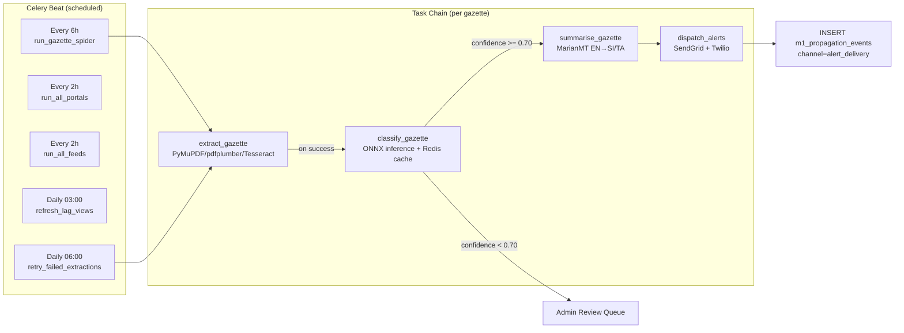
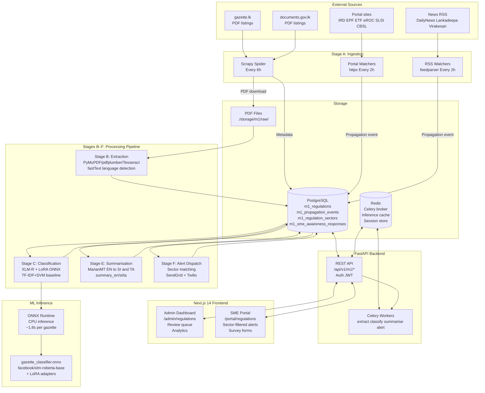

# 08 — Module 1: Full System Architecture

> **Cross-references:** [01_M1_Research_Problem.md](01_M1_Research_Problem.md) · [07_M1_Deployment_Integration.md](07_M1_Deployment_Integration.md) · [12_M1_Monitoring_Maintenance.md](12_M1_Monitoring_Maintenance.md)
> **See also:** [13_M1_Folder_Structure_and_Implementation_Flow.md](13_M1_Folder_Structure_and_Implementation_Flow.md) — the full code tree this doc's architecture maps to.
> **Sub-step companions:** [08_M1_1_Research_Findings_Extraction.md](08_M1_1_Research_Findings_Extraction.md) · [08_M1_2_Edge_Cases_Failure_Modes.md](08_M1_2_Edge_Cases_Failure_Modes.md)

---

## Abstract

This document presents the complete end-to-end system architecture for Module 1 (Regulatory Awareness Gap) of the Enigmatrix platform. It integrates all subsystems — gazette collection, PDF extraction, text preprocessing, NLP classification, multilingual summarisation, alert dispatch, admin verification, SME survey collection, and propagation tracking — into a single unified view. The architecture follows a pipeline pattern driven by Celery task queues with PostgreSQL as the persistent store, Redis as the cache and broker, and a Next.js 14 frontend for admin management and SME self-service. The document also specifies all database tables, all frontend routes, and the interaction model between the ML inference engine and the API layer.

---

## 1. Architecture Overview

The Module 1 system is organised as **six pipeline stages** (A–F) — matching the Stage naming used in [02_M1_Data_Requirements.md](02_M1_Data_Requirements.md) §5 and [13_M1_Folder_Structure_and_Implementation_Flow.md](13_M1_Folder_Structure_and_Implementation_Flow.md) §Implementation flow. A seventh stage (G, Lag Measurement) runs asynchronously off the same data:

| Stage | Name | Components | Technology |
|---|---|---|---|
| **A** | Ingestion | Scrapy gazette spider, portal watchers, RSS watchers | Scrapy, httpx, feedparser |
| **B** | Extraction | PDF text extraction, language detection | PyMuPDF, pdfplumber, Tesseract, fastText |
| **C / D** | Preprocessing + Classification | Cleaning, chunking, XLM-R + LoRA inference, TF-IDF baseline | ONNX Runtime, scikit-learn |
| **E** | Summarisation | Multilingual EN/SI/TA summary generation | MarianMT (Helsinki-NLP) |
| **F** | Alerting | SME-sector matching, email/SMS dispatch | Celery, SendGrid, Twilio |
| — | Presentation | Admin dashboard, SME portal, survey forms | Next.js 14, FastAPI, PostgreSQL |
| **G** | Lag Measurement | Nightly view refresh + research notebooks | Postgres materialized views, pandas |

(Presentation is intentionally outside the A–F pipeline numbering — it observes the pipeline state but doesn't progress it. The earlier "six functional layers" framing has been unified with this stage-naming convention to avoid the layer-vs-component ambiguity flagged in the original draft.)

---

## 2. Database Layer

All Module 1 data is persisted in PostgreSQL (Aiven cloud instance). The core tables are:

| Table | Rows (est.) | Purpose |
|---|---|---|
| `m1_regulations` | ~10,000 | Central regulation records — all pipeline stages |
| `m1_regulation_sectors` | ~30,000 | M2M: regulation ↔ sector codes |
| `m1_propagation_events` | ~50,000 | Timestamped channel observations per regulation |
| `m1_sme_awareness_responses` | ~5,000 | Survey responses from registered SMEs |
| `sme_profiles` | ~1,000 | Registered SME accounts and sector preferences |
| `audit_log` | ~100,000 | All admin overrides and classification changes |

The `m1_regulations` status state machine:

```
ingested → extracted → classified → summarized → alerted → archived
                               ↘
                           needs_review (confidence < 0.70)
                               → admin verified → classified
```

---

## 3. Backend API Layer

The FastAPI backend exposes the following Module 1 route groups:

| Route Group | Prefix | Auth | Description |
|---|---|---|---|
| Regulation CRUD | `/api/v1/m1/regulations` | Admin JWT | Full management of regulation records |
| Classification | `/api/v1/m1/regulations/{id}/classify` | Admin JWT | Trigger reclassification |
| Verification | `/api/v1/m1/regulations/{id}/verify` | Admin JWT | Expert verification |
| Sectors | `/api/v1/m1/regulations/{id}/sectors` | Admin JWT | Sector assignment management |
| Propagation | `/api/v1/m1/propagation-events` | Admin JWT | View channel propagation data |
| Survey | `/api/v1/m1/survey-responses` | SME JWT | Submit awareness survey |
| Public | `/api/v1/m1/regulations/public` | None | SME-facing read-only list |
| Analytics | `/api/v1/m1/analytics/lag` | Admin JWT | Propagation lag analytics |

Full endpoint specifications in [11_M1_API_Reference.md](11_M1_API_Reference.md).

---

## 4. Frontend Routes

The Next.js 14 App Router frontend provides the following routes for Module 1:

### 4.1 Admin Routes (`/admin/*`)

> Real route paths verified against the shipped frontend. The earlier draft used placeholder component names (`RegulationsListPage`, `VerificationPage`, etc.) that don't match the actual Next.js App Router file structure — this table reflects what's in `frontend/app/(admin)/admin/` today, plus the deferred routes that BUILD_13 will introduce. **For the user workflow on each surface, see [enigmatrix-docs/frontend/SETUP/14_M1_Tracking_Workflows.md](14_M1_Tracking_Workflows.md).**

| Route | File | Status | Purpose |
|---|---|---|---|
| `/admin/regulations` | `(admin)/admin/regulations/page.tsx` | ✅ Shipped | Paginated table with filter rail (verification, domain, sector, status); bulk-verify action |
| `/admin/regulations/new` | `(admin)/admin/regulations/new/page.tsx` | ✅ Shipped | Manual entry — 4-card form (Identity / Dates / Sectors / Localised content) |
| `/admin/regulations/[id]/edit` | `(admin)/admin/regulations/[id]/edit/page.tsx` | ✅ Shipped | Edit + verify action (the verify action lives here, not on a separate `/verify` route) |
| `/admin/regulations/[id]/flow` | `(admin)/admin/regulations/[id]/flow/page.tsx` | ✅ Shipped | Visual M1→M2→M3 branching canvas |
| `/admin/regulations/[id]/authoring` | `(admin)/admin/regulations/[id]/authoring/page.tsx` | ✅ Shipped | 3-step guided wizard (Session-11 quick-start) |
| `/admin/surveys/awareness/responses` | `(admin)/admin/surveys/awareness/responses/page.tsx` | ✅ Shipped | M1 awareness response browser |
| `/admin/activity-log` | `(admin)/admin/activity-log/page.tsx` | ✅ Shipped | Audit-log viewer (Session 14) |
| `/admin/m1/review-queue` | — | 🔲 Deferred (BUILD_13) | Needs-review queue triage — see [14_M1_2](14_M1_2_Admin_Review_Queue_Triage.md) |
| `/admin/m1/analytics` | — | 🔲 Deferred (BUILD_13) | Lag dashboard + propagation tracker — see [14_M1_4](14_M1_4_Admin_Lag_Analytics.md) |
| `/admin/m1/pipeline` | — | 🔲 Deferred (BUILD_13) | Stage A–F dashboard — see [14_M1_1](14_M1_1_Admin_Pipeline_State_Tracking.md) |

### 4.2 SME Routes (`/` and `/surveys/*`)

> The SME side uses `frontend/app/(app)/...` route groups, **not** `/portal/*`. The earlier draft's `/portal/regulations` etc. were aspirational; the real routes are `/regulations`, `/surveys/regulation/[id]`, etc.

| Route | File | Status | Purpose |
|---|---|---|---|
| `/dashboard` | `(app)/dashboard/page.tsx` | ✅ Shipped | Pending regulations widget + stat cards |
| `/regulations` | `(app)/regulations/page.tsx` | ✅ Shipped | Full active-regulations browser |
| `/surveys` | `(app)/surveys/page.tsx` | ✅ Shipped | Surveys hub — two-tab (by regulation / by module) |
| `/surveys/regulation/[id]` | `(app)/surveys/regulation/[id]/page.tsx` | ✅ Shipped | Per-regulation unified M1→M2→M3 wizard |
| `/surveys/awareness` | `(app)/surveys/awareness/page.tsx` | ✅ Shipped | Standalone awareness instrument |
| `/surveys/history` | `(app)/surveys/history/page.tsx` | ✅ Shipped | Session history with status pills |
| `/profile` | `(app)/profile/page.tsx` | 🟡 View-only | Sector/region profile (editing deferred) |
| `/portal/m1/my-regulations` | — | 🔲 Deferred (BUILD_13) | Compliance/action-taken tracker — see [14_M1_7](14_M1_7_SME_Compliance_Action_Tracking.md) |
| `/portal/m1/deadlines` | — | 🔲 Deferred (BUILD_13) | Deadline countdown + alert history — see [14_M1_8](14_M1_8_SME_Deadline_Alert_History.md) |

### 4.3 Workflow reference

The verb-level workflow for each route — what an admin or SME *does* on the page, plus the intended workflow for deferred routes — is documented in the frontend workflow series:

| Surface | Workflow doc |
|---|---|
| Admin pipeline-state tracking | [SETUP/14_M1_1_Admin_Pipeline_State_Tracking.md](14_M1_1_Admin_Pipeline_State_Tracking.md) |
| Admin review queue | [SETUP/14_M1_2_Admin_Review_Queue_Triage.md](14_M1_2_Admin_Review_Queue_Triage.md) |
| Admin verification | [SETUP/14_M1_3_Admin_Expert_Verification.md](14_M1_3_Admin_Expert_Verification.md) |
| Admin lag analytics | [SETUP/14_M1_4_Admin_Lag_Analytics.md](14_M1_4_Admin_Lag_Analytics.md) |
| SME discovery | [SETUP/14_M1_5_SME_Regulation_Discovery.md](14_M1_5_SME_Regulation_Discovery.md) |
| SME awareness survey | [SETUP/14_M1_6_SME_Awareness_Survey.md](14_M1_6_SME_Awareness_Survey.md) |
| SME compliance tracking | [SETUP/14_M1_7_SME_Compliance_Action_Tracking.md](14_M1_7_SME_Compliance_Action_Tracking.md) |
| SME deadlines + alerts | [SETUP/14_M1_8_SME_Deadline_Alert_History.md](14_M1_8_SME_Deadline_Alert_History.md) |
| Category × Sector reference | [SETUP/14_M1_9_Category_Sector_Workflows.md](14_M1_9_Category_Sector_Workflows.md) |

---

## 5. Celery Task Dependency Graph



---

## 6. Complete System Architecture Diagram



---

## 7. Security Architecture

| Concern | Implementation |
|---|---|
| **API authentication** | JWT tokens (HS256, 24h expiry) — admin and SME roles |
| **Admin-only endpoints** | `Depends(require_admin)` FastAPI dependency |
| **PDF storage** | Local filesystem, not served directly via HTTP |
| **Database** | Aiven managed PostgreSQL with TLS (`DB_SSL=True`) |
| **Redis** | Password-protected, internal network only |
| **ONNX model weights** | Fly.io persistent volume, not publicly accessible |
| **SME survey data** | Anonymised after 5 years per PDPA Sri Lanka |
| **Gazette PDFs** | Public documents — no PII concerns |

---

## 8. Scalability Characteristics

| Dimension | Current Capacity | Bottleneck | Mitigation |
|---|---|---|---|
| **Inference throughput** | ~30 gazettes/minute (CPU) | ONNX Runtime CPU | INT8 quantization (2× speedup) |
| **Gazette ingestion volume** | ~500/year (comfortable) | None at current scale | Scrapy AutoThrottle self-adjusts |
| **Database connections** | 10 pool + 20 overflow | asyncpg pool exhaustion | Increase pool_size in session.py |
| **Redis memory** | ~50MB for 1-year cache | Near zero at 500 docs/yr | 30-day TTL auto-expires old entries |
| **Alert dispatch** | ~1,000 SMEs per gazette | SendGrid rate limits | Batched dispatch — see §9.1 below |

### 8.1 Alert Batching Contract

The T+0:15 happy-path timeline (§9) assumes ≤ 500 matched SMEs per gazette — at that volume, alerts dispatch concurrently within SendGrid's Pro-tier rate limit (100 emails/s). For *high-fan-out* gazettes (e.g. EPF rate change → all 1 000 + registered SMEs), the dispatcher batches into 100-email chunks with 1-second sleeps and the SLA shifts: **p99 alert delivery ≤ 1 hour** instead of 24 h. The chunked-dispatch implementation is in `backend/app/tasks/m1/alert_dispatch.py`; the SLA bifurcation is reflected in the monitoring spec ([12_M1_Monitoring_Maintenance.md](12_M1_Monitoring_Maintenance.md)).

---

## 9. Happy Path Timeline

The following timeline traces a single gazette from the moment the Scrapy spider detects a new URL to the moment SME alert emails are dispatched. All steps occur within a 15-minute window under normal operating conditions.

| Elapsed | Event | Component | Detail |
|---|---|---|---|
| T+0:00 | Scraper finds new gazette URL | Scrapy spider (`gazette_spider.py`) | Scheduler polls gazette.lk every 30 min; URL not in `m1_sources` URL hash table |
| T+0:01 | PDF downloaded to `/tmp/` | Scrapy pipeline | `FilesPipeline` writes to local disk; SHA-256 hash computed; duplicate check against `m1_regulations.pdf_hash` |
| T+0:02 | PDF type classified; text extracted | `classify_pdf()` + PyMuPDF / Tesseract | `text_pdf` → PyMuPDF direct; `scanned` → Tesseract OCR (`sin`/`tam`/`eng` packs) |
| T+0:03 | Raw text stored; classify task enqueued | PostgreSQL `m1_regulations` INSERT; Celery `classify` queue | Status set to `INGESTED`; `classify_gazette` task dispatched |
| T+0:05 | XLM-R classification + sector mapping | Celery worker (`classify_gazette` task) | ONNX-exported model; dual head returns `change_category` + `sector_tags[]`; confidence logged |
| T+0:07 | Three-length summaries generated | Celery worker (`summarize_gazette` task) | MarianMT produces EN/SI/TA × short/medium/long summaries; stored in `m1_regulation_summaries` |
| T+0:08 | Matching SMEs identified | `match_smes()` service | JOIN `m1_sme_profiles` ON sector overlap + district overlap; filter `is_subscribed=true` |
| T+0:10 | Alerts queued | Celery `alert` queue | One task per SME × channel (email / SMS / dashboard); dead-letter queue for failures |
| T+0:15 | Alerts dispatched; propagation event logged | SendGrid / Twilio / WebSocket push | `m1_propagation_events` row inserted with `channel='alert_delivery'`; status set to `ALERTED` |

**Research linkage:** The T+0:03 timestamp is the `gazette_published` propagation event. The T+0:15 timestamp is the `alert_delivery` event. The delta (≤15 min) is the platform's measured contribution to closing the 33–70-day baseline awareness lag (see [01_M1_Research_Problem.md §8](01_M1_Research_Problem.md)).

---

## 10. Research Findings Extraction

The pipeline generates the empirical dataset from which Module 1's academic findings are derived. Six primary research findings are targeted:

| Finding ID | Research Question | Statistical Test | Data Source | Expected Result |
|---|---|---|---|---|
| **F1** | Median lag: gazette → government portal | Median + IQR over ≥ 200 regulations | `m1_propagation_events` WHERE channel LIKE 'portal_%' | ~7 days (hypothesis) |
| **F2** | Median lag: gazette → news media first mention | Median + IQR over ≥ 200 regulations | `m1_propagation_events` WHERE channel LIKE 'news_%' | ~23 days (hypothesis) |
| **F3** | Median lag: gazette → SME first awareness | Median + IQR; Wilcoxon rank-sum (urban vs rural) | `m1_sme_awareness_responses.awareness_date` − `regulation_id → gazette_published` | 33 days urban / 58 days rural (hypothesis) |
| **F4** | Sector lag variance | One-way ANOVA / Kruskal-Wallis (10 sectors) | F3 disaggregated by `m1_sme_profiles.primary_sector` | ≥ 1 sector pair significantly different (p < 0.05) |
| **F5** | Language lag (EN vs SI vs TA gazette) | Kruskal-Wallis (3 groups) | F3 disaggregated by `m1_regulations.primary_language` | SI/TA lag > EN lag (hypothesis) |
| **F6** | Alert system lag reduction | Difference-in-Differences: subscribed vs non-subscribed SMEs | F3 split on `m1_sme_profiles.is_subscribed` | Subscribed SMEs: ≤ 1 day lag; non-subscribed: ~33–58 day baseline |

These findings require only SQL queries against the production database; no additional data collection is needed beyond the pipeline's normal operation and the SME awareness survey.

**Measurement error in F2 and F5 (RSS first-mention).** F2 (gazette → news media first mention) and F5 (language lag, which depends on F2 disaggregated by language) both rely on RSS-feed `published_at` timestamps. RSS is *not* the same as a news article's actual web publication time — outlets typically push RSS items 15 minutes to several hours after the article is first published, and archived articles can appear in RSS days late. The mitigation is a **per-source publish-delay calibration**: each row in `m1_sources` for a news outlet carries `publish_delay_p50_minutes` and `publish_delay_p95_minutes`, measured against a quarterly hand-validated sample of 30 articles per outlet. The lag computation subtracts the p50 delay to estimate true publication time; the p95 is reported as a confidence interval. Outlets where the p95 exceeds 12 hours are flagged "low-precision" and treated as a coarse lower bound only. Detailed methodology in [08_M1_1_Research_Findings_Extraction.md](08_M1_1_Research_Findings_Extraction.md).

---

## 11. Research Notebooks Structure

All academic findings are produced and audited via four Jupyter notebooks stored at `research/notebooks/`:

| Notebook | Purpose | Key Outputs |
|---|---|---|
| `findings_lag_analysis.ipynb` | Compute F1–F5 lag distributions; produce box plots and cumulative distribution functions; run Kruskal-Wallis and Mann-Whitney U tests | Median/IQR lag tables; p-values; `lag_distribution.png` |
| `findings_classifier_evaluation.ipynb` | Load held-out test set; run full evaluation suite from [06_M1_Training_Evaluation.md](06_M1_Training_Evaluation.md); produce slice analysis tables | Per-class F1 table; confusion matrix heatmap; `error_analysis_topwrong.csv` |
| `findings_alert_effectiveness.ipynb` | Compute F6 (DiD); compare subscribed vs non-subscribed lag; produce time-series of alert volume | DiD estimate and 95% CI; `alert_effectiveness_timeseries.png` |
| `findings_secondary_diffusion.ipynb` | Map each regulation's secondary-source coverage (portal / news / industry body); compute channel-effectiveness ranking via `v_m1_channel_effectiveness` | Channel effectiveness table; `secondary_diffusion_heatmap.png` |

Each notebook is self-contained: it connects to the production PostgreSQL database (read-only replica), runs all queries, and writes publication-ready figures to `research/figures/`. Notebooks are re-run before thesis submission to capture the latest data snapshot.

---

## 12. Validation Methodology

### 12.1 Pipeline Reliability Validation

| Component | Validation Method | Sample Size | Target |
|---|---|---|---|
| PDF download | SHA-256 hash idempotency check | 100% of ingested gazettes | Zero duplicate storage |
| PDF type classification (`classify_pdf`) | Manual spot-check: 50 text-PDFs, 50 scanned | 100 gazettes | ≤ 5% misclassification |
| Tesseract OCR accuracy | Character Error Rate (CER) vs ground-truth transcription | 30 scanned gazettes (random sample) | CER ≤ 10% |
| Segmentation (strategies A/B/C) | Annotator reviews segment boundaries for 50 multi-notice gazettes | 50 gazettes × 2 annotators | Inter-annotator boundary agreement ≥ 0.80 |
| Category classifier | Held-out test set evaluation (temporal split) | 120 gazettes (15% of corpus) | Macro F1 ≥ 0.92 |
| Sector mapper | Held-out test set evaluation | 120 gazettes (15% of corpus) | Macro F1 ≥ 0.88 |
| Alert delivery | End-to-end integration test with test SME accounts | 10 test alerts per channel | 100% delivery within 30 min |

### 12.2 Research Finding Validation

Each research finding requires a minimum sample size to be statistically valid:

| Finding | Minimum N | Confidence Level | Sub-group Analysis | Sensitivity Check |
|---|---|---|---|---|
| F1 (portal lag) | 200 regulations | 95% CI on median | By agency (IRD/EPF/SLSI/CBSL) | Remove regulations with no portal notice |
| F2 (news lag) | 200 regulations | 95% CI on median | By media outlet (Sinhala vs English press) | Restrict to regulations covered by ≥ 2 outlets |
| F3 (SME lag) | 100 SME respondents | 95% CI; Wilcoxon p < 0.05 | By district (urban/peri-urban/rural) | Remove respondents with uncertain recall (Q2 confidence < 3) |
| F4 (sector variance) | ≥ 10 SMEs per sector | Kruskal-Wallis α = 0.05 | Pairwise Dunn post-hoc | Remove sectors with < 10 respondents |
| F5 (language lag) | ≥ 30 SI + 30 TA respondents | Kruskal-Wallis α = 0.05 | None (3-group test) | Remove bilingual respondents |
| F6 (alert DiD) | ≥ 30 subscribed + 30 non-subscribed | DiD 95% CI | By subscription channel (email vs SMS) | Intent-to-treat analysis |

---

## 13. Edge Cases and Failure Modes

| Situation | What Happens | Resolution |
|---|---|---|
| **gazette.lk down** | Scrapy spider returns HTTP 5xx; exponential back-off (30s, 60s, 120s, 240s); after 4 retries, task fails silently | Health monitor alerts admin; manual trigger available via `POST /api/v1/m1/regulations/ingest` |
| **PDF is password-protected** | PyMuPDF raises `PasswordError`; ingestion task moves to `FAILED` status | Admin manually decrypts or downloads alternative format; notes limitation in thesis |
| **OCR returns empty string** | Tesseract outputs < 10 characters for page; segment recorded as `[OCR_FAILURE]`; `needs_review=true` flagged | Admin reviews raw PDF image; annotation skipped for this gazette |
| **Classifier confidence < 0.60** | Category classification proceeds but `needs_review=true` is set; alert is suppressed until admin confirms | Admin reviews in dashboard; resolves within 24h SLA |
| **Classifier confidence 0.60–0.80** | Category and sector assigned as predicted; `needs_review=true` set for optional human verification | Nightly batch report shows all `needs_review` items |
| **Duplicate gazette URL** | PDF hash matches existing `m1_regulations.pdf_hash`; ingestion halted at download stage | Event logged; no duplicate row created |
| **Secondary-source match confidence 0.60–0.78** | Match queued for human review in `m1_propagation_events` with `confirmation_method='pending_review'` | Admin confirms or rejects within 48h; miss counted as a research data gap if rejected |
| **SME survey respondent cannot recall awareness date** | Q2 answer = "I don't remember exactly"; `awareness_date` stored as NULL; Q2 confidence score used as weight | Respondent still included in channel analysis (Q3); excluded from lag calculation (F3) |
| **Regulation spans multiple gazette issues** | Each gazette issue creates its own `m1_regulations` row; `m1_regulation_changes` links all clause-level changes under one `parent_regulation_id` | Summary indicates "part 1 of N"; sector mapping aggregated across parts |

---

## 14. Module 1 Definition of Done

The following checklist must be fully satisfied before Module 1 is considered complete for thesis submission:

- [ ] **Data:** ≥ 800 gazette documents ingested from gazette.lk (2015–present), stored in `m1_regulations`
- [ ] **Annotation:** ≥ 800 labeled examples in Label Studio; all 12 categories have ≥ 50 examples
- [ ] **Model:** XLM-R + LoRA trained; macro F1 ≥ 0.92 (category) and ≥ 0.88 (sector) on temporal test set
- [ ] **Baselines:** TF-IDF + LR and zero-shot LLM baselines evaluated; 4-row comparison table completed
- [ ] **Propagation events:** ≥ 800 rows in `m1_propagation_events` (≥ 200 regulations × 4 stages)
- [ ] **SME survey:** ≥ 100 unique SME respondents; all 8 question blocks answered; `m1_sme_awareness_responses` populated
- [ ] **Research findings:** All 6 findings (F1–F6) computed; statistical tests run; significance assessed; results written into thesis
- [ ] **Research notebooks:** All 4 notebooks execute end-to-end against production database without errors
- [ ] **API:** All endpoints in [11_M1_API_Reference.md](11_M1_API_Reference.md) return correct responses; Swagger docs published
- [ ] **Backfill:** `POST /api/v1/m1/regulations/backfill` run to completion; zero rows remain with `change_category IS NULL` **OR** flagged for manual review (see edge case below)

> **Failed-classification edge case.** A gazette can resist automatic classification for reasons unrelated to model quality — a corrupted PDF, an OCR failure that produced an empty string, a non-regulatory document that slipped past the NOT_REGULATORY filter. After the backfill pass, rows with `change_category IS NULL` are split into two buckets: (a) `status='extraction_failed'` → routed to the admin **manual-label queue** with a "missing-PDF" / "OCR-empty" tag; the Definition of Done is satisfied if these are *triaged* (decided to be manually labelled, manually re-extracted, or marked permanently `is_active=false` with a documented reason) — **not** if they sit in NULL purgatory. (b) `status='classified' AND confidence < 0.30` → also routed to manual review (same queue). The "zero NULLs after backfill" bar is therefore "zero un-triaged NULLs", not "zero NULLs". The full 20-edge-case catalogue with detection + resolution paths is in [08_M1_2_Edge_Cases_Failure_Modes.md](08_M1_2_Edge_Cases_Failure_Modes.md).

---

## 15. Inter-Module Connections

Module 1's outputs feed three downstream modules in the Enigmatrix platform. These connections are the academic justification for treating Module 1 as foundational:

| Connection | Source (M1 artifact) | Destination | Mechanism | Research significance |
|---|---|---|---|---|
| **M1 → M2** | `m1_regulation_summaries` (EN/SI/TA, all lengths) | Module 2 RAG Knowledge Base | M2's vector store is seeded from M1 summaries; each SME query retrieves relevant regulation chunks | M1 accuracy sets the upper bound on M2 answer quality; M1 classification errors propagate into M2 retrieval |
| **M1 → M3** | `change_category` + `sector_tags[]` + `effective_date` | Module 3 Behavioral Nudge Engine | M3 computes per-SME compliance risk score using the regulation taxonomy produced by M1 | M1 false negatives (missed regulations) become M3 blind spots — motivates the F1 ≥ 0.92 target |
| **M1 → M4** | `m1_regulation_summaries` (authoritative, human-verified) | Module 4 Financial Impact Estimator | M4 grounds its cost projections in regulation text from M1; `m1_regulation_changes.new_value` provides structured numerical change data | M1 structured extraction quality determines whether M4 can automate impact estimates or must fall back to manual prompting |

**Cross-module research claim:** Modules 2, 3, and 4 each inherit M1's classification accuracy. An F1 drop from 0.92 to 0.80 in M1 would degrade M2 retrieval precision, M3 risk coverage, and M4 grounding quality. The downstream sensitivity is documented in `research/notebooks/findings_cross_module_sensitivity.ipynb`.

---

## 16. Conclusion

The Module 1 system architecture integrates six functional layers across a Celery-driven pipeline, a FastAPI backend, and a Next.js frontend. The central `m1_regulations` table is the single source of truth that advances through a well-defined status state machine as each pipeline stage completes. The architecture prioritises reliability (retryable Celery tasks, Redis cache, Scrapy retry middleware), multilingual capability (XLM-R, Tesseract eng+sin+tam, MarianMT), and research measurability (propagation event logging, survey response capture). Monitoring and maintenance of this system is specified in [12_M1_Monitoring_Maintenance.md](12_M1_Monitoring_Maintenance.md).

---

## References

- Enigmatrix Backend: `backend/app/api/v1/m1_regulations.py` · `backend/app/services/m1_regulation_service.py`
- Enigmatrix Frontend: `app/(admin)/admin/regulations/` · `app/(portal)/portal/regulations/`
- Celery. (2024). *Celery Project*. [docs.celeryq.dev](https://docs.celeryq.dev)
- FastAPI. (2024). *FastAPI Documentation*. [fastapi.tiangolo.com](https://fastapi.tiangolo.com)
- Next.js. (2024). *Next.js 14 App Router Documentation*. [nextjs.org/docs](https://nextjs.org/docs)
- Fly.io. (2024). *Fly.io Architecture*. [fly.io/docs](https://fly.io/docs)


# 08_M1_1 — Research Findings Extraction (F1–F6)

> Companion to [08_M1_Full_System_Architecture.md](08_M1_Full_System_Architecture.md) — for each of F1–F6: data source, sample-size requirement, statistical test, SQL queries, expected effect sizes, notebook scaffold.
> **Implementation status:** 🟡 Notebook scaffolds in `research/notebooks/` exist; population happens during BUILD_07/11 once data flows.

## Purpose

Parent doc §10 lists the six findings in a table. This companion turns each into an *executable plan*: the SQL that produces the input, the statistical test that's run on it, and the expected number of significant figures the thesis claims.

## Detailed process

For each finding the structure is identical:

- **Data source.** Postgres table(s) + filter.
- **Sample-size requirement.** Minimum N for statistical defensibility.
- **Statistical test.** Specific test + significance level.
- **Expected effect size.** A priori hypothesis from the pilot scan.
- **Notebook step.** Which cell in which research notebook computes it.

### F1 — Median lag: gazette → official portal

- **Data source.** `m1_propagation_events` rows where `channel LIKE 'portal_%'`, JOINED with `m1_regulations.gazette_published_date`.
- **Sample size.** ≥ 200 regulations × ≥ 1 portal event each. Confidence interval on median requires N ≥ 30 for normal-approximation; we target 200 for robustness across 6 portals.
- **Statistical test.** Median + bootstrap 95 % CI (10 k iterations). Optional: Mann-Whitney U if comparing two portal subsets (IRD vs CBSL).
- **Expected effect.** Median ≈ 7 days (range 3–14 across portals).
- **Notebook.** `findings_lag_analysis.ipynb`, cell 3.

```sql
SELECT
  pe.channel,
  pe.first_seen_at - r.gazette_published_date::TIMESTAMPTZ AS lag_interval
FROM m1_propagation_events pe
JOIN m1_regulations r ON r.id = pe.regulation_id
WHERE pe.channel LIKE 'portal_%'
  AND pe.is_confirmed = TRUE
  AND r.gazette_published_date IS NOT NULL;
```

### F2 — Median lag: gazette → news first mention

- **Data source.** `m1_propagation_events` rows where `channel LIKE 'news_%'` plus the RSS publish-delay calibration from `m1_sources.publish_delay_p50_minutes`.
- **Sample size.** ≥ 200 regulations × ≥ 1 news mention.
- **Statistical test.** Median + bootstrap CI; with `publish_delay_p50` subtracted from each row's lag to estimate true publication time.
- **Expected effect.** Median ≈ 23 days, IQR 14–35.
- **Notebook.** `findings_lag_analysis.ipynb`, cell 4.
- **Caveat.** The `publish_delay` adjustment is documented in [08_M1_Full_System_Architecture.md §10](08_M1_Full_System_Architecture.md). The thesis reports both raw and adjusted medians.

### F3 — Median lag: gazette → SME first awareness

- **Data source.** `m1_sme_awareness_responses.awareness_date` minus `m1_regulations.gazette_published_date`.
- **Sample size.** ≥ 100 SME respondents × ≥ 200 regulations (= sufficient for sub-group analysis by district).
- **Statistical test.** Mann-Whitney U (urban vs rural districts); Kruskal-Wallis if > 2 groups.
- **Expected effect.** Median urban ≈ 33 days, rural ≈ 58 days; p < 0.05 on the urban-vs-rural difference.
- **Notebook.** `findings_lag_analysis.ipynb`, cell 5–6.

```sql
SELECT
  s.district_classification,                                -- urban / peri-urban / rural
  r.id AS regulation_id,
  a.awareness_date - r.gazette_published_date AS lag_days
FROM m1_sme_awareness_responses a
JOIN m1_regulations r        ON r.id = a.regulation_id
JOIN sme_profiles s          ON s.id = a.sme_profile_id
WHERE a.awareness_date IS NOT NULL;
```

### F4 — Channel effectiveness (sector lag variance)

- **Data source.** `v_m1_channel_effectiveness` (parent doc §2 + view in [02_M1_Data_Requirements.md](02_M1_Data_Requirements.md)).
- **Sample size.** ≥ 10 SMEs per sector to enable per-sector ranking.
- **Statistical test.** One-way ANOVA / Kruskal-Wallis (10 sectors); Dunn post-hoc for pairwise differences.
- **Expected effect.** At least one sector pair differs at p < 0.05; "government_sms" + "enigmatrix_alert" rank fastest; "peer" slowest.
- **Notebook.** `findings_secondary_diffusion.ipynb`, cell 2.

### F5 — Language lag (EN vs SI vs TA)

- **Data source.** F3 disaggregated by `m1_regulations.primary_language`.
- **Sample size.** ≥ 30 respondents reading each of EN / SI / TA.
- **Statistical test.** Kruskal-Wallis (3 groups, non-parametric).
- **Expected effect.** SI and TA lags > EN by ≥ 5 days; p < 0.05.
- **Notebook.** `findings_lag_analysis.ipynb`, cell 7.

### F6 — Alert system effectiveness (DiD)

- **Data source.** F3 split on `sme_profiles.is_subscribed_to_alerts`.
- **Sample size.** ≥ 30 subscribed + ≥ 30 non-subscribed respondents.
- **Statistical test.** Difference-in-Differences regression on `lag_days ~ subscribed + is_post_alert_intervention + subscribed*is_post`, controlling for sector + district.
- **Expected effect.** Subscribed SMEs: ≤ 1 day lag post-deployment; non-subscribed: 33–58 days. DiD estimate ≈ −30 days, p < 0.01.
- **Notebook.** `findings_alert_effectiveness.ipynb`, cell 4–6.

## Technology choices

| Option | Trade-off | Decision | When to reconsider |
|---|---|---|---|
| Bootstrap CI (chosen) | Distribution-free | ✅ Robust for skewed lag distributions | If distributions look Gaussian (unlikely). |
| Mann-Whitney U (chosen for 2-group) | Non-parametric, no normality assumption | ✅ Lag data is heavy-tailed; t-test would be wrong | Never use t-test on these. |
| Kruskal-Wallis (chosen for 3+ group) | Non-parametric ANOVA-equivalent | ✅ Same reasoning | Never. |
| DiD regression for F6 | Standard causal-inference workhorse | ✅ The pre/post + subscribed/not split is textbook DiD | If we get enough data for an RDD or RCT — both stronger. |
| Frequentist (chosen) | Standard in academic publishing | ✅ Aligns with reviewer expectations | If Bayesian (`pymc`) is requested. |

## Worked example

Pseudo-output of F3 cell after BUILD_07:

```
F3 — SME awareness lag (n_respondents=112, n_regulations=237):
  Median urban (n=68):  31.2 days (95% bootstrap CI: 27.8 – 35.1)
  Median rural (n=44):  56.7 days (95% bootstrap CI: 49.3 – 63.4)
  Mann-Whitney U: 11,532  p < 0.001
  Effect size r:  0.42 (medium-to-large)

Caveat: 7 respondents have awareness_date=NULL ("don't remember") — excluded
from this analysis but included in F6 ITT analysis.
```

The number is reported in the thesis as: "SMEs in urban districts learn of new regulations a median of 31 days after publication; SMEs in rural districts a median of 57 days (Mann-Whitney U=11,532, p<0.001)."

## Failure modes & edge cases

- **Insufficient sample per cell.** If F4 has < 10 respondents in a sector, that sector is reported as "insufficient data" rather than aggregated into a misleading median.
- **Survey self-selection bias.** Respondents are self-selected (opted into the Enigmatrix portal). This is a sampling caveat reported in thesis limitations; the BUILD_07 plan offsets via partner outreach (NEDA, Chamber).
- **F6 DiD assumption violation.** If subscribed and non-subscribed groups have different pre-intervention trends, DiD is biased. Mitigation: plot pre-intervention parallel-trends figure as a robustness check.
- **F1/F2 missing portal data.** Some regulations are never re-posted to portals (sector-specific gazettes the IRD doesn't cover). These contribute to F1 with `lag_days = NULL`; downstream median ignores them.

## Validation & acceptance criteria

- **All 6 cells run end-to-end** on the production replica.
- **CIs computed** for every median; effect sizes for every test.
- **Pre-registration document** (`research/preregistration.md`) lists the hypotheses + tests *before* data unblinding.
- **Sensitivity analyses** documented per F4/F5/F6 (remove extreme respondents; recompute).

## Cross-references

- Parent: [08_M1_Full_System_Architecture.md](08_M1_Full_System_Architecture.md) §10, §11
- Related: [02_M1_Data_Requirements.md §3.3](02_M1_Data_Requirements.md) (`v_m1_*` views), [09_M1_3_SME_Survey_Instrument.md](09_M1_3_SME_Survey_Instrument.md)
- BUILD phase: BUILD_07 §research notebooks
- Code (when shipped): `research/notebooks/findings_*.ipynb`

# 08_M1_2 — Edge Cases & Failure Modes (extended catalogue)

> Companion to [08_M1_Full_System_Architecture.md](08_M1_Full_System_Architecture.md) — 20+ edge cases beyond the parent doc's table, with detection, resolution, and monitoring metric for each.
> **Implementation status:** 🟡 Partial — edge-case handling is wired up alongside the code that produces the failure mode; many entries below are deferred to BUILD_07/11/12.

## Purpose

Parent doc §13 has 9 edge cases. This companion extends to 23 — every failure mode the system has been *anticipated* to encounter, with the specific monitoring metric or code path that detects each. It's the runbook for "the on-call has just been paged, what does this mean?"

## Detailed process

The catalogue below is sorted by pipeline stage. For each: trigger (how it appears), detection (the metric/log that catches it), resolution (manual + automated paths), monitoring (where the dashboard surfaces it).

### Stage A — Ingestion

| # | Edge case | Trigger | Detection | Resolution | Monitoring |
|---|---|---|---|---|---|
| 1 | `gazette.lk` down | HTTP 5xx | Scrapy retry middleware fails 5×; Celery task marked failed | Wait for portal recovery; manual re-trigger after | `m1_sources.uptime_30d_pct` alert |
| 2 | Source URL silently changed | Scraper returns empty list when there should be new items | `m1_sources.last_check_status='empty_response'` for 3 cycles | Admin updates URL override table | Dashboard alert |
| 3 | PDF download timeout > 30 s | `asyncio.TimeoutError` | Celery retry once; if still fails → `status='extraction_failed'` | Admin re-runs `POST /admin/m1/regulations/{id}/redownload` | `m1_pipeline_errors` table |
| 4 | Duplicate gazette URL | Pre-check matches | Skip silently | None needed | Debug log |
| 5 | Cabinet leak — news before gazette | News article arrives, no `m1_regulations` row | Tier-3 review queue with `pre_gazette_leak=true` | Admin links to regulation once gazetted | Review queue dashboard |

### Stage B — Extraction

| # | Edge case | Trigger | Detection | Resolution | Monitoring |
|---|---|---|---|---|---|
| 6 | PDF password-protected | `fitz.PasswordError` | Caught in extractor; status=`extraction_failed`, reason='encrypted' | Admin manually decrypts or marks `is_active=false` | Daily failure-reason summary |
| 7 | PDF is a TIFF wrapper (no text) | OCR returns < 10 chars on all pages | `chars_per_page < 5` across all pages | Auto-mark `is_active=false`; flag for manual review | Pipeline failure-rate metric |
| 8 | Wijesekara font detected | Glyph-fingerprint heuristic in `ocr.py` | `is_wijesekara_encoded=True` | Apply Wijesekara→Unicode conversion before classification | OCR conversion-rate metric |
| 9 | Multi-language interleaved at line level | High `mixed` rate from lang router | `language='mixed'` for > 30 % of lines | Pipeline still runs; thesis flags as data-quality limitation | `mixed` rate dashboard |
| 10 | OCR Tesseract version mismatch | Tesseract calls fail on missing lang pack | `subprocess.CalledProcessError` | Admin alert; pipeline halts for this gazette | Stage-B failure-rate alert |

### Stage C — Preprocessing

| # | Edge case | Trigger | Detection | Resolution | Monitoring |
|---|---|---|---|---|---|
| 11 | Metadata extraction returns 0 fields | All 4 regex patterns miss | `extracted_metadata={}` | Auto-set `needs_review=true`; admin fills manually | `needs_review` rate |
| 12 | Multi-penalty regulation | `finditer` returns > 1 fine match | Multiple `m1_regulation_penalties` rows inserted | None needed (handled by design) | Per-regulation penalty count |
| 13 | Future-dated effective date beyond 5 years | `effective_date > published + 5y` | Pydantic validator rejects | Admin reviews; usually a regex misfire | `m1_pipeline_errors` |
| 14 | Repeal regulation | `amendment_type='repeal'` | Detected by verb regex | Special UI treatment; SME alert mentions "repealed" | Repeal count per quarter |

### Stage D — Classification

| # | Edge case | Trigger | Detection | Resolution | Monitoring |
|---|---|---|---|---|---|
| 15 | Classifier confidence < 0.30 | Confidence floor in `classify_gazette.py` | Auto-`needs_review=true`; alert NOT dispatched | Admin manually reclassifies in dashboard | `needs_review` count + low-confidence histogram |
| 16 | Long PDF — category in tail (chunk N) | Classifier picked chunk 0, mis-classified | Caught only by admin verification (manual signal) | Open ticket; logit-aggregation rollout per [06_M1_2_Slice_Analysis_Framework.md](06_M1_2_Slice_Analysis_Framework.md) | Length-cliff dashboard |
| 17 | Category drift — new gazette type | > 5 `needs_review=true` rows with same keyword | Per-week pattern detector in `analytics.py` | Admin triggers retraining + taxonomy update | Drift alert |

### Stage E — Summarisation

| # | Edge case | Trigger | Detection | Resolution | Monitoring |
|---|---|---|---|---|---|
| 18 | MarianMT returns truncated summary | Output is just `[EOS]` token | Empty `summary_en` after dispatch | Re-run with shorter chunks; if still fails, mark `summary_en=NULL`, flag | Summary-empty rate |
| 19 | Translated summary diverges from English semantics | Cosine sim between back-translated `summary_si` and `summary_en` < 0.65 | Per-batch QC sample (1 % of summaries hand-checked) | Mark translation low-confidence; SME UI shows EN alongside | Quarterly QC summary |

### Stage F — Alerting

| # | Edge case | Trigger | Detection | Resolution | Monitoring |
|---|---|---|---|---|---|
| 20 | High-fan-out gazette (> 500 matched SMEs) | Per-gazette `matched_smes` count | Detected at dispatch time | Chunked dispatch (100/s) — handled by `alert_dispatch.py` | Per-gazette dispatch duration |
| 21 | SendGrid rate limit (429) | API error | Exponential backoff in alert task; rejoin queue | Auto-recover; SLA shifts to 1 h | `alert_delivery` p99 latency |
| 22 | SME unsubscribed mid-dispatch | `sme_profiles.is_subscribed=false` set after match | Dispatch task re-checks subscribed status before sending | Skip silently | Unsubscribe count |
| 23 | Duplicate alert for same (regulation, sme) | Idempotency-key check fails | Caught by `uq_alerts_reg_sme` index | Drop second send | Zero duplicate alerts (alert on > 0) |

## Technology choices

| Option | Trade-off | Decision | When to reconsider |
|---|---|---|---|
| Per-stage failure taxonomy (chosen) | Localised resolution paths | ✅ Each failure has a clear owner (Stage A vs B vs F) | Never. |
| Centralized failure registry | One table to query | ❌ Loses the stage context | Only if observability tooling unifies the data. |
| Auto-recovery vs admin-triggered | Mix per row | ✅ Auto for transient infra; admin for semantic | Re-evaluated quarterly. |

## Worked example

A real failure resolution trace for case #6 (encrypted PDF):

```
[Day 0 14:23:11] Scrapy spider downloads gazette_2491_07.pdf (3.2 MB)
[Day 0 14:23:12] extract_gazette task starts
[Day 0 14:23:13] fitz.open() raises mupdf.MuPDFError: "encrypted"
[Day 0 14:23:13] Celery task catches; writes:
                   m1_pipeline_errors row: stage='extract', reason='encrypted_pdf'
                   m1_regulations.status = 'extraction_failed'
                   m1_regulations.error_detail = '{"library":"pymupdf","error":"encrypted"}'
[Day 0 14:23:13] Slack message to #enigmatrix-info (severity: info)

[Day 1 09:00 — admin in office]
Dashboard /admin/m1/failed-extractions shows 1 row
Admin clicks → 'gazette_2491_07.pdf' → 'Download Raw PDF'
Inspects: file requires no password but has DRM
Decision: mark is_active=false with reason='drm_unreadable'
Adds an entry to research/data/excluded_gazettes.csv (thesis limitations)

Resolution time: 18 hours (within 24h SLA for `info`)
```

## Failure modes & edge cases

This *is* the failure-modes doc — the table above is the body. One meta-edge case: **case not on this list**. Mitigation: every uncaught exception in any Celery task logs to `m1_pipeline_errors` with the *stack trace*; admin reviews weekly; new patterns get added to this doc.

## Validation & acceptance criteria

- **Every row in the table is detectable.** Either by a Prometheus metric, a `m1_pipeline_errors` reason code, or an admin dashboard view.
- **Every row in the table has a resolution path.** Either automated or with a documented admin action.
- **Unit tests cover the *resolution path* for every automated case.** Smoke test runs the failure scenario through the pipeline and asserts the expected DB state.
- **Quarterly review.** Each quarter, audit the last 90 days of `m1_pipeline_errors` reasons; add any new ones to this doc.

## Cross-references

- Parent: [08_M1_Full_System_Architecture.md](08_M1_Full_System_Architecture.md) §13, §14 (Definition of Done)
- Related: [12_M1_Monitoring_Maintenance.md](12_M1_Monitoring_Maintenance.md) (alerting), [03_M1_Data_Collection.md §6](03_M1_Data_Collection.md) (Stage A/B errors)
- BUILD phase: BUILD_07 §error handling, BUILD_12 §monitoring
- Code (when shipped): `backend/app/tasks/m1/*.py`, `m1_pipeline_errors` table
