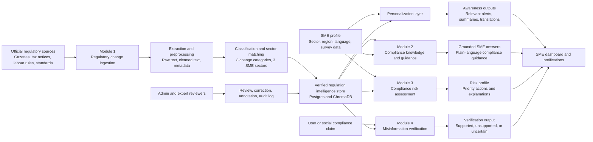

> [!warning] Superseded
> This is the first-pass draft, written before the official B21 FYP template was available. The live text is now in `Enigmatrix_Final_Report_Master.md` in the deliverable folder, restructured to the official 9-chapter format. Keep this note only as a record of the earlier wording. See [[00_FINAL_REPORT_CONTEXT_INDEX]] and [[04_OFFICIAL_TEMPLATE_STRUCTURE_MAP]].

# Chapter 1 - Introduction

## 1.1 Introduction

Small and medium-sized enterprises (SMEs) operate in an environment where regulatory compliance is necessary for survival, market access, financing, employee protection, consumer safety, taxation, and long-term business continuity. In Sri Lanka, an SME may need to follow changes published through gazettes, government department notices, tax circulars, labour regulations, import/export controls, product standards, sector-specific rules, and regional administrative requirements. These updates are often written in legal or technical language, published across different official sources, and not always presented in a form that is easy for a small business owner to interpret quickly.

For large organizations, compliance responsibilities are usually handled by dedicated legal, finance, risk, or operations teams. SMEs normally do not have that capacity. Owners and managers often depend on informal networks, accountants, social media groups, delayed professional advice, or manual checking of official websites. As a result, regulatory changes may be noticed late, misunderstood, or ignored until a penalty, inspection, blocked shipment, tax issue, licence delay, or operational disruption occurs.

Enigmatrix is proposed as a regulatory intelligence platform designed around this SME reality. The system focuses on the information gap between official regulatory publication and practical SME action. It combines regulatory change detection, multilingual explanation, knowledge retrieval, risk assessment, and misinformation verification into a single platform. The project is organized into four research modules so that the overall SME compliance problem can be addressed from multiple directions while keeping each technical contribution measurable.

## 1.2 Background and Motivation

The motivation for this project comes from the gap between how regulations are published and how SMEs actually consume regulatory information. Official regulatory documents are usually created for legal validity, not for rapid understanding by non-specialists. They may be lengthy, formatted as scanned or semi-structured PDFs, written in English, Sinhala, or Tamil, and released without SME-specific interpretation. Even when the document is publicly available, the business owner still needs to determine whether it applies to their sector, what type of change has occurred, what deadline or duty is implied, and what action should be taken.

Existing approaches only partially solve this problem. Government portals provide official information, but they usually expect users to search manually and interpret the content themselves. Professional compliance services and legal advisory services are useful, but may be too costly or slow for many SMEs. General-purpose search engines and social media groups provide quick access to explanations, but the reliability of those explanations is uncertain. Enterprise governance, risk, and compliance systems are generally designed for larger organizations and do not focus on multilingual Sri Lankan SME workflows.

The research gap is therefore not only a software gap. It is a combined problem of timeliness, interpretation, personalization, trust, and actionability. SMEs need to know that a change exists, understand it in plain language, check whether it applies to their sector, estimate the risk of non-compliance, and avoid misleading claims. Enigmatrix addresses this by designing an integrated pipeline in which official regulatory sources are processed into structured intelligence and then delivered through user-facing modules.

## 1.3 Problem in Brief

Sri Lankan SMEs lack a timely, reliable, multilingual, and sector-aware mechanism for understanding regulatory changes and converting them into practical compliance action.

The problem can be divided into four connected gaps:

1. Regulatory change awareness gap: SMEs may not know that a relevant legal, tax, labour, import/export, product, or sector rule has changed.
2. Compliance knowledge accuracy gap: Even when a regulation is found, SMEs may not understand what it means or what action is required.
3. Compliance risk invisibility gap: SMEs may not know which compliance weaknesses are most urgent or most risky for their own business profile.
4. Regulatory misinformation gap: SMEs may be exposed to inaccurate or misleading compliance claims through informal channels.

The final system must therefore do more than store documents. It must convert fragmented regulatory information into verified, searchable, explainable, and SME-specific intelligence.

## 1.4 Aim & Objectives

### 1.4.1 Aim

The aim of Enigmatrix is to design, implement, and evaluate a modular regulatory intelligence platform that helps Sri Lankan SMEs identify, understand, assess, and respond to relevant regulatory changes in a timely and trustworthy manner.

### 1.4.2 Objectives

The specific objectives of the project are:

1. To investigate the regulatory information challenges faced by Sri Lankan SMEs, including awareness delays, interpretation barriers, risk prioritization problems, and misinformation exposure.
2. To design an end-to-end platform architecture that connects regulatory data ingestion, SME profiles, multilingual explanations, knowledge retrieval, risk assessment, and misinformation verification.
3. To implement a regulatory change awareness module that collects, extracts, preprocesses, classifies, and structures official regulatory content for SME use.
4. To build a labelled regulatory dataset and evaluate annotation reliability using agreement measures such as Cohen's kappa and field-level reconciliation statistics.
5. To train and evaluate baseline and transformer-based models for regulatory change classification and sector relevance detection.
6. To support multilingual regulatory understanding through English summaries and Sinhala/Tamil translation workflows.
7. To provide placeholders and integration points for a compliance knowledge module, a compliance risk module, and a regulatory misinformation verification module.
8. To evaluate the implemented components using measurable criteria such as extraction accuracy, classification macro-F1, sector matching performance, annotation agreement, alert timeliness, and user-facing workflow completion.
9. To document the system design, implementation decisions, evaluation process, limitations, and future improvements in a reproducible final research report.

## 1.5 Proposed Solution

Enigmatrix is proposed as a modular web-based platform for SME regulatory intelligence. The system contains a backend API, a frontend application, relational and vector storage, data processing services, and machine-learning pipelines. SMEs register with business profile information such as sector, region, and language preference. Regulatory information is collected from official sources, transformed into structured records, classified by type and sector relevance, summarized into understandable language, translated where required, and exposed through dashboards, alerts, search, and advisory workflows.

The platform is organized into four modules. Module 1 focuses on regulatory change awareness. Module 2 focuses on compliance knowledge and explanation. Module 3 focuses on compliance risk assessment. Module 4 focuses on misinformation verification. Together, these modules address the path from official regulatory publication to SME decision support.

### 1.5.1 Module 1 - Regulatory Change Awareness Gap

Module 1 is owned by Ifham Mohamed / Mohamed M.R.I (215075J). It focuses on detecting and structuring regulatory changes that are relevant to SMEs. The module handles the early stages of the regulatory intelligence pipeline, starting from official regulatory sources and ending with classified, sector-aware, and alert-ready regulatory records.

The implemented Module 1 concept contains the following main functions:

1. Regulation source management: Admin users can manage regulatory source records, maintain metadata, archive or restore records, and track changes through audit logging.
2. Scraping and ingestion: The system includes services and scripts for collecting regulatory documents and maintaining source-level extraction status.
3. PDF/text extraction: Regulatory documents are extracted from source files into raw and cleaned text fields, with measurement support for field-level extraction accuracy.
4. Preprocessing: Extracted text is normalized into classification-ready chunks and metadata fields.
5. Annotation workflow: A labelled gold dataset was built through dual annotation and reconciliation. The current gold dataset contains 800 labelled records.
6. Classification taxonomy: The current implementation uses 8 regulatory change categories: `TAX_RATE_CHANGE`, `IMPORT_EXPORT`, `SECTOR_SPECIFIC`, `EPF_ETF_CHANGE`, `LABOUR_LAW`, `PRODUCT_STANDARD`, `BUSINESS_REGISTRATION`, and `PENALTY_ENFORCEMENT`.
7. Sector relevance taxonomy: The current implementation uses 3 SME sectors: `grocery_retail`, `food_service`, and `general_retail`.
8. Baseline modelling: TF-IDF Logistic Regression and TF-IDF LinearSVC baselines have been evaluated; the strongest current v1 result is stratified TF-IDF LinearSVC with macro-F1 of 0.7894.
9. Transformer training diagnostics: XLM-R with LoRA has been smoke-tested locally and tested on Kaggle GPU. The best v1 LoRA diagnostic reached 0.6415 macro-F1, remained below the baseline, and was not promoted.
10. Summarization and translation readiness: Database fields, admin translation workflow, NLLB translation helper support, title scraping, and field-metric support are present. Final production summarization and translation backfill should be completed or clearly reported as pending depending on the submission state.
11. Watchers and alerts: The module includes architecture and implementation support for matching classified regulatory changes against SME profiles and generating relevant alerts.
12. Evaluation evidence: The module includes inter-annotator agreement results, baseline classification results, extraction measurement specifications, and reproducibility commands.

The purpose of Module 1 is not merely to classify legal documents. Its research contribution is the creation of a measurable regulatory-change awareness pipeline that reduces the delay between official publication and SME awareness.

### 1.5.2 Additional Member-Owned Modules

The remaining modules should be completed by the responsible team members using the same structure: problem gap, input data, model or algorithm, user-facing workflow, implementation status, evaluation method, and final evidence.

#### Module 2 - Compliance Knowledge Accuracy Gap

`[M2 PLACEHOLDER]`

Suggested content to add:

- Responsible member name and index number.
- Exact module aim.
- Knowledge sources used by the module.
- Retrieval or question-answering approach.
- How answers are grounded in verified regulation records.
- How multilingual explanations are handled.
- Evaluation method, such as answer correctness, grounding quality, retrieval accuracy, or user task success.
- Screenshots and final metrics.

#### Module 3 - Compliance Risk Invisibility Gap

`[M3 PLACEHOLDER]`

Suggested content to add:

- Responsible member name and index number.
- Exact module aim.
- SME profile, survey, or compliance-history inputs.
- Risk scoring model or rule framework.
- Explainability method, such as feature contribution or SHAP if applicable.
- How risk categories are shown to SMEs/admins.
- Evaluation method, such as expert validation, consistency tests, predictive accuracy, or scenario-based validation.
- Screenshots and final metrics.

#### Module 4 - Regulatory Misinformation Spread Gap

`[M4 PLACEHOLDER]`

Suggested content to add:

- Responsible member name and index number.
- Exact module aim.
- Input source for claims or user-submitted messages.
- Claim extraction and verification approach.
- Evidence retrieval process against verified regulatory content.
- Misinformation labelling or confidence approach.
- Evaluation method, such as claim classification accuracy, evidence matching, or expert review.
- Screenshots and final metrics.

### 1.5.3 Flow of the Overall System

The overall Enigmatrix flow begins with official regulatory information and SME profile information. Regulatory data is processed by Module 1 into structured and classified records. These records support Module 2 knowledge retrieval, Module 3 risk assessment, and Module 4 misinformation verification. SME-facing outputs are delivered through dashboards, alerts, reports, and multilingual explanations, while admin-facing workflows support verification, correction, annotation, and evaluation.

Use the following Mermaid diagram as Figure 1.1.

Suggested caption:

> Figure 1.1: Overall flow of the Enigmatrix regulatory intelligence platform.

This flow shows the key design principle of the project: official regulatory information is converted into structured intelligence first, and then reused across awareness, knowledge, risk, and misinformation workflows.
