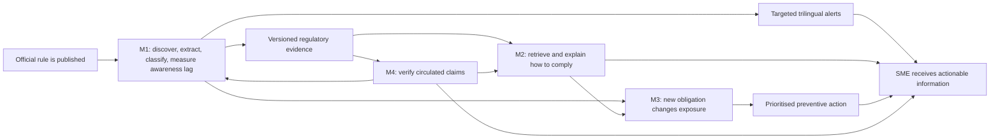
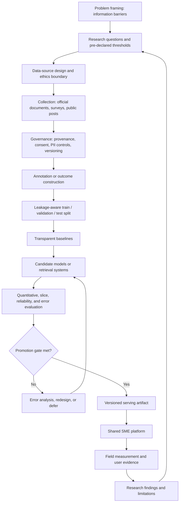
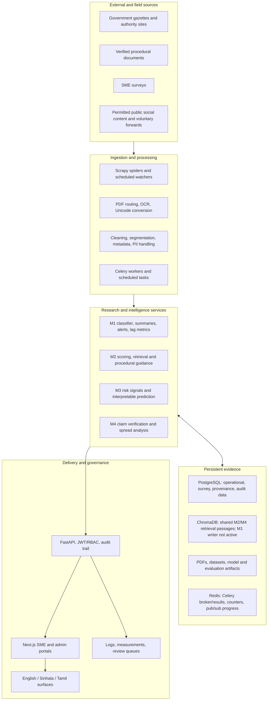
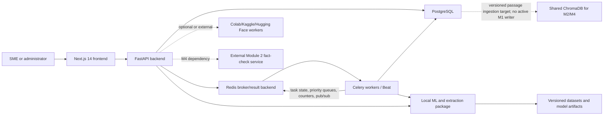
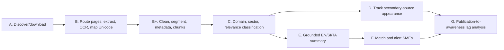
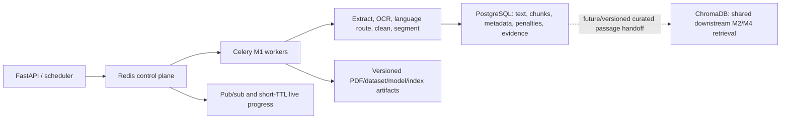
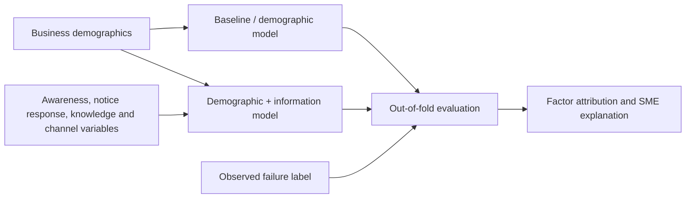
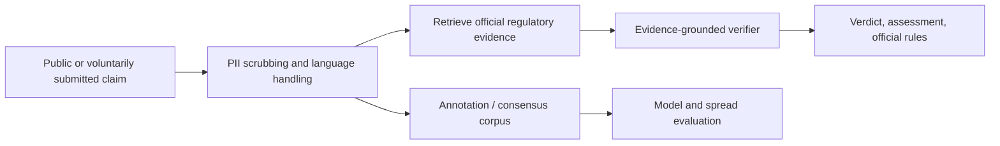
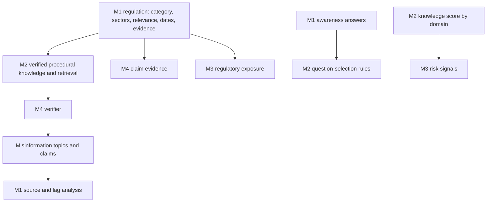

# Enigmatrix — Complete Research Master Documentation

> [!abstract] Purpose
> This is the evidence-reconciled master account of the Enigmatrix research project: its research problem, four research modules, datasets, experiments, platform architecture, technology choices, verified results, limitations, and executable next steps. It reconciles the July 31 final-report snapshot with the later Module 1 vault records and the repository state inspected on August 14, 2026.

## Navigation

- **Deep Module 1 record:** [[02-Research-Modules/1 Module-1-Awareness-Gap/27_M1_COMPLETE_RESEARCH_AND_IMPLEMENTATION_MASTER|Module 1 complete research and implementation master]]
- **Submitted report snapshot:** [[28_Enigmatrix _Final_Draft_Report.pdf]]
- **Final-report context:** [[00_FINAL_REPORT_CONTEXT_INDEX]]
- **Project atlas:** [[01-Project-Overview/Project-Atlas]]
- **Research proposal:** [[01-Project-Overview/Enigmatrix_Research_Proposal_Upgraded]]
- **Module 1 index:** [[02-Research-Modules/1 Module-1-Awareness-Gap/00_INDEX]]
- **Module 2 architecture:** [[02-Research-Modules/2 Module-2-Knowledge-Hub/13_Module2_Knowledge_Architecture]]
- **Module 3 architecture:** [[02-Research-Modules/3 Module-3-Risk/01_Module3_Risk_Architecture]]
- **Module 4 architecture:** [[02-Research-Modules/4 Module-4-Misinformation/01_Module4_Misinformation_Architecture]]

## 1. Reading rules and evidence status

This document does not treat every plan, report sentence, experiment, and code path as equally current. Claims use the following status vocabulary.

| Status | Meaning |
|---|---|
| **Implemented** | A concrete code path exists in the inspected August 14 repository. This does not, by itself, prove a live deployment or successful database/GPU execution. |
| **Experimentally evaluated** | A dataset, artifact, notebook, or recorded evaluation contains quantitative results. |
| **Built, not promoted** | Code or an experimental model exists, but the production/default gate remains closed. |
| **Report snapshot** | The claim is true of the July 31 final-report narrative, but later evidence may supersede it. |
| **Planned / acceptance target** | The vault specifies the design or target, but completion evidence was not found. |
| **Not verifiable in this checkout** | A document records the work, but the required artifact, package, service, or execution record is absent from the current local repository. |

### 1.1 Evidence precedence

When sources disagree, this document applies the following order:

1. Current executable code and configuration.
2. Immutable or reproducible dataset/model artifacts, hashes, result files, and test evidence.
3. The latest dated vault execution log and Module 1 evidence ledger.
4. The July 31 final-report PDF.
5. Older architecture plans, generated guides, and acceptance checklists.

The hierarchy is essential. For example, the report presents XLM-R with LoRA as the intended Module 1 classifier, while the later fixed-split evidence and current settings select the V6 TF-IDF + LinearSVC model. The report remains valuable as a thesis snapshot; it is not the final word on August runtime defaults.

## 2. Executive synthesis

### 2.1 Core problem

Sri Lankan SMEs often want to comply but do not receive the right regulatory information at the right time, in a usable form, and in the language in which they operate. Enigmatrix studies this as four connected information failures:

1. **Awareness:** a regulatory change is not discovered or communicated in time.
2. **Knowledge:** the SME cannot convert an official rule into an accurate procedure.
3. **Risk visibility:** the SME cannot see which information and capacity weaknesses make non-compliance likely.
4. **Misinformation:** informal claims circulate without traceable official evidence.

### 2.2 Overarching research question

> What information barriers drive regulatory non-compliance among Sri Lankan SMEs, how can those barriers be measured, and how can a shared regulatory-intelligence platform reduce them?

### 2.3 Central research argument

The four modules form a causal and operational chain rather than four unrelated applications:

The primary research contribution is therefore not merely a web platform. It is a set of measurable information-barrier constructs, Sri Lankan regulatory datasets, evaluated modelling decisions, and cross-module contracts that let evidence move from publication to SME action.

## 3. Research scope and team ownership

| Module | Barrier and principal question | Primary research output | Owner recorded in report |
|---|---|---|---|
| **M1 — Awareness Gap** | Do regulatory changes reach SMEs in time, and can gazette notices be extracted and routed reliably? | Gazette corpus, extraction/classification pipeline, awareness-lag measurement, alerts | Mohamed M.R.I — 215075J |
| **M2 — Knowledge Gap** | How accurately do SMEs understand compliance procedures, and can grounded guidance improve procedural completeness? | Knowledge instrument, verified procedure corpus, retrieval-grounded assistant | Ahamadh M.S.A — 215007F |
| **M3 — Risk Invisibility** | Which business and information-access variables predict compliance failure? | Vulnerability dataset, interpretable risk model, explanatory factors | Ahamed T.I — 215008J |
| **M4 — Misinformation** | How prevalent and influential is regulatory misinformation, and which verification approach works best? | Annotated post corpus, spread analysis, evidence-grounded claim checker | Cader Z.R — 215019T |

Supervision recorded in the report: **Dr A.L.A.R.R Thanuja** and **Ms P.G.S Upeksha**, University of Moratuwa, 2026.

## 4. Research-wide findings at a glance

| Module | Evidence | Result | Interpretation and status |
|---|---|---|---|
| M1 annotation | 800 dual-annotated tasks in report snapshot | Category κ **0.8715**; mean sector κ **0.8638**; relevance κ **0.7235** | Taxonomy agreement is strong; relevance boundary remains more subjective. **Experimentally evaluated.** |
| M1 classification, later evidence | V6 fixed split: 777 train / 166 validation / 167 test | Test macro-F1 **0.947220**, accuracy **0.958084**; validation macro-F1 **0.924476** | V6 LinearSVC is the present primary model. A fresh locked holdout promotion gate remains open. **Implemented and evaluated, not independently promoted on the fresh holdout.** |
| M1 advanced candidate | RA-HMT V7 test n=167 | Domain **0.9351**, sector **0.9014**, relevance **0.9400**, joint **0.8802**, ECE **0.0319** | Full ensemble improved over its recorded Branch A, but paired gain was not significant: Δ **0.0155**, p **0.548**. **Built/integrated in part, not promoted.** |
| M2 guidance | Held-out automated validation | Base→fine-tuned: citations **85%→100%**; grounded figures **81%→95%**; correct refusal **75%→100%**; content recall **64%→86%** | QLoRA adapter improved procedural structure and grounding in the report evaluation. Expert correctness review was still ongoing. **Report evaluation; local serving stack is not fully present in this checkout.** |
| M3 risk | 300-SME analysis, out-of-fold predictions | Demographic AUC **0.637**; +information AUC **0.720**; Δ **0.083**, 95% CI **[0.033, 0.133]**, p **0.0011** | Information-access factors added meaningful predictive signal; 3 of top 5 attributed features were informational. **Report evaluation.** |
| M4 annotation | 200 double-annotated of 1,000 posts | Overall veracity κ **0.934** | Strong agreement on the initial double-annotated subset; remaining 800 were single-annotated. **Experimentally evaluated with an annotation-depth limitation.** |
| M4 model comparison | Common 200-post test set | RAG accuracy **90.0%**, macro-F1 **0.872**; XLM-R **76.0% / 0.561**; Gemini **73.5% / 0.299** | Retrieval grounding was decisive, particularly for the harmful class. **Experimentally evaluated; live backend depends on an external fact-check service.** |

### 4.1 Important temporal correction for Module 1

The PDF reports the earlier 800-row phase and a failed one-epoch CPU transformer smoke test. It does **not** contain the later 1,128-task lineage, 1,110-row V6 dataset, V6 LinearSVC result, fresh holdout v3, RA-HMT experiment, localised deterministic summaries, NLLB queue, or optional LLM-draft worker. Those later records are documented in the Module 1 vault and current code and are consolidated in the deep Module 1 master.

## 5. Complete research flow

This loop reflects the strongest practice visible in Module 1: retain immutable lineage, compare against baselines, refuse promotion when a gate fails, and record negative results rather than erasing them.

## 6. Shared platform architecture

### 6.1 Logical layers

### 6.2 Runtime/deployment topology

The architecture intentionally uses local deterministic services for high-liability tasks where hallucination is unacceptable, and isolated GPU workers or external inference for heavy models. External services are operational dependencies and must not be described as available unless their endpoint, credentials, and health are verified.

## 7. Module 1 — Regulatory change awareness gap

### 7.1 Research question and contribution

Module 1 asks whether regulatory changes reach SMEs in time and whether the publication-to-awareness chain can be observed reliably. It owns the upstream evidence layer used by every other module: discovery, PDF extraction, notice segmentation, classification, source provenance, safe summaries, alerts, and lag measurement.

### 7.2 Current end-to-end flow

#### 7.2.1 Exact rule/mapping and data-store architecture

Module 1 does not use one generic “keyword mapping.” It combines distinct deterministic and learned mechanisms:

| Mechanism | Correct term | Current purpose |
|---|---|---|
| `repeal` / `amend*` word-family patterns with ordered precedence | **Ordered regex/lexicon rule classifier** | `repeal` wins, then `amendment`; no match defaults to `new_act`. The legal value is **repeal**, not “appeal.” |
| Six scored principal-statute anchors, heading recognition, penalties/bonuses, and one display alias | **Anchor-based legal citation extraction and candidate ranking** | Selects and normalizes `principal_act_amended`; not a flat keyword lookup. |
| Gazette/effective-date/fine/imprisonment patterns | **Rule-based slot extraction plus plausibility validation** | Creates structured metadata; nearby fine + imprisonment linked by `or/either` becomes a combined penalty. |
| fastText `lid.176` + Unicode block shares | **Statistical language identification plus deterministic script routing** | Determines EN/SI/TA/mixed handling after PDF extraction; it does not decide PDF modality. |
| `wijesekara_map.yaml` + font-prefix overrides | **Font-aware character transliteration lookup** | Converts legacy Sinhala sequences to Unicode using longest-match substitution. The current checkout has 84 canonical mappings, not the older documented 87. |
| TF-IDF/LinearSVC, optional XLM-R/retrieval/rules fusion | **Learned classification and hybrid ensemble** | Predicts eight regulation domains and, in RA-HMT, sectors/relevance/confidence/evidence. This is separate from amendment metadata. |
| RA-HMT `DOMAIN_KEYWORDS` | **Lexicon-derived domain prior** | Adds a normalized eight-domain rule signal to the experimental hybrid. The separate `m1_rahmt/src` package holding the exact lexicon is absent from this checkout, so the per-domain word list is not re-verifiable here. |
| Sampling/top-up script category and sector signals | **Candidate-generation lexicons** | Find rare-domain and partial-sector PDFs/excerpts for human annotation; they are preliminary sampling aids, not production or gold labels. |
| category/sector integer tables, profile registry, section types, UI phase labels, XLSX aliases, NLLB language codes, summary frames | **Taxonomy encodings, registries, controlled vocabularies, and schema/locale mappings** | Keeps model indices, runtime selection, persistence, evaluation, UI, and multilingual output deterministic. |

The current persistence boundary is equally important:

Redis is actively used for Celery messages/results, priority queues, eight-item extraction batch counters, pub/sub WebSocket frames, and short-TTL in-flight progress. It is not an authoritative PDF, chunk, metadata, or embedding store. ChromaDB is present in infrastructure and central to the report’s M2/M4 retrieval architecture, but no current M1 client/upsert path was found. M1’s standalone retrieval uses local `chunks.jsonl`, `embeddings.npy`, and manifest artifacts with BM25 plus FAISS/sklearn/NumPy search.

### 7.3 Exact amendment-type rule and its limitation

The active metadata function evaluates case-insensitive whole-word patterns in this order:

1. `\brepeal(?:s|ed|ing)?\b` → `repeal`;
2. otherwise `\bamend(?:s|ed|ing|ment)?\b` → `amendment`;
3. otherwise → `new_act`.

If both appear, `repeal` wins. The default `new_act` is absence of detected amend/repeal wording, not positive proof of enactment. The current rule does not isolate the operative clause or resolve historical quotations, passive context, negation, or conflicting hits. The defensible upgrade is clause-scoped evidence with a stored match span/rule ID and an `unknown/review` outcome for absent or conflicting evidence; this is proposed, not implemented.

### 7.4 Main decision

The present classifier default is **V6 TF-IDF + LinearSVC**, not XLM-R and not RA-HMT. This is an evidence-driven choice: it met the fixed-split macro-F1 target, while the recorded temporal XLM-R comparison fell to **0.743563** test macro-F1, V7-W collapsed, and RA-HMT did not establish a significant paired improvement and has not passed the fresh holdout gate.

### 7.5 Open research gates

- Evaluate once on fresh locked holdout v3 without tuning leakage.
- Run the RA-HMT promotion protocol with all required encoders/artifacts available.
- Complete human evidence-quality evaluation and review outcomes.
- Complete field survey recruitment; the last recorded Module 1 field count was 0/100.
- Finish Sinhala/Tamil human-quality verification after numeric-preservation repair.
- Advance table-aware schedule extraction, typed slot extraction, cross-page stitching, and effective-date resolution from plan to evaluated implementation.

Full technical detail is in [[02-Research-Modules/1 Module-1-Awareness-Gap/27_M1_COMPLETE_RESEARCH_AND_IMPLEMENTATION_MASTER]].

## 8. Module 2 — compliance knowledge accuracy gap

### 8.1 Research design

Module 2 asks whether SMEs possess correct **declarative** knowledge and complete **procedural** knowledge. Its method combines:

- a structured, sector-aware knowledge instrument;
- a verified corpus of official procedures;
- dense retrieval from a versioned ChromaDB collection;
- a Llama-3.1-8B-Instruct generator adapted with QLoRA for answer structure and refusal discipline;
- NLLB-based Sinhala/Tamil delivery with protection for rates, amounts, dates, and form codes;
- an automated harness measuring citations, completeness, grounding, refusal behavior, and content recall.

### 8.2 Report evidence

On the same held-out validation split, comparing the unadapted base model with the fine-tuned model:

| Property | Base | Fine-tuned |
|---|---:|---:|
| Source citation | 85% | 100% |
| Numbered procedure | 96% | 100% |
| Worked example | 89% | 100% |
| Explains named forms | 100% | 100% |
| Uses only grounded figures | 81% | 95% |
| Correctly refuses unanswerable | 75% | 100% |
| Wrongly refuses answerable, lower is better | 2% | 2% |
| Content recall | 64% | 86% |
| Median length | 690 chars | 501 chars |

The improvement supports the narrower claim that the adapter learned more complete and better-grounded answer behavior. It does not independently prove legal correctness: the report states that chartered-accountant verification was ongoing, the validation split was modest, graders were mainly automated, and only one training run was used.

### 8.3 Current checkout status

The local backend **implements** Module 2 question selection, CA-verification fields, awareness-linked question rules, scoring, score history, authorization, and the M2→M3 knowledge-score contract. The repository does **not** contain a local `enigmatrix-ml/m2` package. The central router explicitly records the RAG QA half as a deferred 501 stub, while Module 4 points at an externally configured fact-check endpoint. Therefore:

- survey/scoring and cross-module data contracts: **implemented locally**;
- report retrieval/fine-tuning evaluation: **experimentally evaluated**;
- complete local RAG serving path: **not verifiable in this checkout**.

## 9. Module 3 — compliance risk invisibility

### 9.1 Research design

Module 3 models a 12-month compliance-failure outcome constructed from confirmed penalty or missed-deadline indicators. It compares a naive business-profile baseline, a demographic model, and a demographic-plus-information model. Logistic regression is appropriate for the small sample because it is stable, auditable, CPU-friendly, and compatible with direct feature attribution. The report also uses out-of-fold prediction, PR-AUC beside ROC-AUC, DeLong comparison for correlated curves, repeated seeds, and a positive-unlabelled sensitivity analysis.

### 9.2 Result

For **n=300** SMEs:

- naive cross-tabulation: ROC-AUC **0.592**, PR-AUC **0.541**;
- demographics: ROC-AUC **0.637**, PR-AUC **0.560**;
- demographics + information barriers: ROC-AUC **0.720**, PR-AUC **0.665**;
- paired improvement: **0.083**, 95% CI **0.033–0.133**, DeLong p **0.0011**;
- repeated-seed gains: **0.071–0.085**;
- information variables accounted for **56%** of attributed importance and 3 of the top 5 features.

The result supports the research argument that access to and response to information contributes explanatory value beyond static business attributes. It does not imply perfect prediction or causal identification.

### 9.3 Current checkout status

The backend **implements** append-only compliance-history and behavioural snapshots, joins them to the latest M2 knowledge score, applies access controls, and exposes a combined risk-signals view. The current checkout contains no `enigmatrix-ml/m3` training/serving package even though the vault build plan specifies one. Therefore the report model result is **research evidence**, while local end-to-end model serving is **not verifiable in this checkout**.

## 10. Module 4 — regulatory misinformation

### 10.1 Research design

Module 4 collects regulatory claims from permitted public sources and voluntary submissions, strips PII, labels veracity, analyses engagement/virality, and compares three approaches on the same held-out set:

1. fine-tuned multilingual XLM-R;
2. retrieval-augmented verification using the Module 2 knowledge service;
3. direct Gemini prompting without retrieval.

The operational three-way result is `accurate`, `partly_accurate`, or `harmful`. The wider methodology retains finer concepts such as outdated and unverifiable because regulatory truth changes over time.

### 10.2 Result

The corpus contains **1,000 posts**, split **800/200**. The first 200 were double-annotated with veracity κ **0.934**; one annotator completed the remaining 800. On the common 200-post test set:

| Approach | Accuracy | Macro-F1 | Weighted-F1 | Harmful-class F1 |
|---|---:|---:|---:|---:|
| XLM-R | 0.760 | 0.561 | 0.758 | 0.333 |
| RAG + Module 2 | **0.900** | **0.872** | **0.897** | **0.881** |
| Direct Gemini | 0.735 | 0.299 | 0.629 | 0.000 |

This is strong evidence for retrieval grounding over closed-book direct prompting in a date- and jurisdiction-sensitive domain.

### 10.3 Current checkout status

The repository contains the raw/processed M4 data, 20 generated figures, analysis/training notebooks, and prediction CSVs. The backend `POST /m4/check-claim` endpoint is implemented but delegates to a configured external Module 2 fact-check API and maps its vocabulary into three classes. The current repository does not contain the full planned connector/label/virality runtime tree. Thus:

- corpus, notebooks, figures, and comparison: **experimentally evaluated**;
- claim-check proxy and frontend surface: **implemented**;
- independent local verifier availability: **depends on an external service**;
- full collection/annotation/spread runtime from the build plan: **not verifiable in this checkout**.

## 11. Cross-module contracts

### 11.1 Contract rules

- A regulation identifier, source URL, publication/effective date, page/section anchor, taxonomy version, and model/dataset provenance should travel together.
- “Confidence” must name its semantics. Module 1 LinearSVC exposes a **margin**, not a calibrated probability; RA-HMT stores calibrated per-head probabilities separately.
- M2 facts must remain retrievable and citable rather than silently embedded in generator weights.
- M3 consumes the most recent versioned M2 score and should retain the snapshot time used for any prediction.
- M4 must preserve the official evidence returned by M2 and must expose external-service failure instead of fabricating a local verdict.
- Human review must be append-only and attributable; it must not overwrite gold truth without provenance.

## 12. Data architecture and governance

### 12.1 Core evidence groups

| Evidence group | Representative content | Governance requirement |
|---|---|---|
| Official regulatory corpus | Gazette PDFs, authority procedures, extracted notices, chunks | Immutable source URL/hash; extraction profile/version; page anchors |
| Annotation corpus | M1 notice labels; M4 veracity labels | Annotator identity/pseudonym, codebook version, agreement, adjudication |
| SME field data | Awareness, knowledge, vulnerability responses | Consent, purpose limitation, role-based access, audit trail, minimised PII |
| Model artifacts | Vectorizers, classifiers, adapters, retrieval indexes, thresholds | Dataset/split hash, dependency version, evaluation, promotion state |
| Operational events | pipeline statuses, worker leases, alerts, review queues | Idempotency, retry history, timestamps, explicit failure reasons |
| Research results | tables, notebooks, plots, measurement reports | Reproducible inputs, frozen evaluation set, limitations, no post-hoc relabeling |

### 12.2 State and provenance principles

1. Raw sources are never replaced by cleaned derivatives.
2. Each transformation records its profile/version and input identity.
3. Train, validation, test, and fresh holdout roles are immutable once declared.
4. Human-reviewed values retain both original and corrected values.
5. Automated translation or summary never silently overwrites human-authored text.
6. Failed or held work remains observable and retryable.
7. Research metrics are tied to a specific dataset, split, artifact, and code revision.

## 13. Technology stack and rationale

| Layer | Technologies found in plans/report/code | Research or engineering reason |
|---|---|---|
| Web experience | Next.js 14, React, TypeScript, Tailwind, shadcn/ui, next-intl | Typed responsive SME/admin experience and trilingual routing |
| API | FastAPI, Pydantic v2, SQLAlchemy async, asyncpg, Alembic | Explicit contracts, async I/O, versioned relational schema |
| Work orchestration | Celery, Beat, Redis | Retryable background jobs; Redis supplies broker/results, priority queues, batch counters, pub/sub, and ephemeral progress—not document or vector persistence |
| Ingestion | Scrapy, HTTP clients, scheduled watchers | Repeatable rate-limited discovery with provenance and deduplication |
| PDF extraction | PyMuPDF, pdfplumber, pypdfium2, Tesseract; Surya as an optional/research engine | Mixed digital/scanned/hybrid gazettes require routing rather than a single extractor |
| Language handling | Unicode script routing, fastText language ID, Wijesekara maps, NLLB-200 | Sri Lankan PDFs and SME delivery require English/Sinhala/Tamil support and legacy-font recovery |
| M1 classification | scikit-learn TF-IDF/LinearSVC primary; Transformers/PyTorch/LoRA and retrieval branches evaluated | Strong sparse baseline on limited labelled data; multilingual/ensemble candidates remain evidence-gated |
| Retrieval/generation | ChromaDB, sentence-transformers/e5, Llama-3.1 + QLoRA | Current, citable facts are retrieved; adaptation teaches structure rather than memorising regulation |
| M3 analysis | scikit-learn logistic regression, NumPy/pandas, attribution and DeLong procedures | Small-sample interpretability and auditable statistical comparison |
| M4 analysis | XLM-R, Chroma/RAG, Gemini comparison, notebooks | Direct comparison of surface classification, evidence grounding, and closed-book prompting |
| Persistence | PostgreSQL, JSONB where appropriate, object/filesystem artifacts, ChromaDB | Relational auditability and immutable artifacts; ChromaDB is the shared M2/M4 dense-retrieval layer, not the active M1 chunk sink |
| Quality | pytest, Playwright, linting, schema migrations, metric harnesses | Prevent contract drift and keep research claims tied to reproducible checks |
| Compute/deployment | local CPU, Colab, Kaggle, Hugging Face ZeroGPU, Vercel/Render/Railway plans | Separate lightweight web/API work from occasional GPU inference/training |

### 13.1 Shared platform technologies

| Technology | Used by | Purpose and reason | Evidence status |
|---|---|---|---|
| **Python 3.11–3.12** | M1–M4 research/backend | PDF, NLP, ML, statistics, API, and worker ecosystem | Active repository language |
| **TypeScript** | Shared frontend | Compile-time API/UI contracts and safer refactoring | Active |
| **Next.js 14 + React 18** | All user/admin modules | Routed production web application with server/client rendering | Active |
| **Tailwind CSS + Radix/shadcn-style components** | Shared frontend | Responsive styling and accessible reusable interaction primitives | Active |
| **next-intl** | Shared frontend | English/Sinhala/Tamil interface localisation | Active |
| **TanStack Query** | Shared frontend | API fetching, caching, loading, and retry state | Active |
| **React Hook Form + Zod** | Surveys/admin forms | Form state plus explicit client-side validation | Active |
| **Recharts** | Admin/research dashboards | Model, survey, and measurement charts | Active |
| **FastAPI + Uvicorn** | Shared backend | Typed async REST/WebSocket services and OpenAPI | Active |
| **Pydantic v2 / pydantic-settings** | Shared backend | Request/response validation and environment configuration | Active |
| **PostgreSQL** | M1–M4 operational data | Relational integrity, transactions, JSONB, timestamps, and auditability | Active platform dependency |
| **SQLAlchemy 2 async + asyncpg** | Shared backend | Typed asynchronous PostgreSQL access | Active |
| **Alembic** | Shared backend | Reproducible database migrations | Active; target environments must apply them |
| **Celery + Beat + Redis** | Mainly M1 and scheduled platform work | Retryable background jobs and schedules; Redis is broker/result backend, priority transport, bounded-batch counter store, pub/sub live feed, and short-TTL in-flight registry | Active architecture; PostgreSQL remains authoritative |
| **ChromaDB 0.5.5 service** | Shared retrieval infrastructure, principally M2/M4 | Persistent dense-passage collections for evidence retrieval | Infrastructure-defined and report-evaluated for M2/M4; backend settings are marked unused and no active M1 writer was found |
| **HTTPX + AnyIO + Tenacity** | Backend integrations | Async HTTP, structured concurrency, timeout, and retry behavior | Active |
| **JWT / python-jose / passlib-bcrypt** | SME/admin access | Authentication, roles, and protected research data | Active |
| **SlowAPI** | Public/worker APIs | Rate limiting | Active |
| **structlog** | Backend/workers | Structured traceable operational logs | Active |
| **Docker + Docker Compose** | Local full stack | Repeatable service isolation and local orchestration | Infrastructure-supported |
| **nginx** | Shared deployment | Optional reverse proxy/ingress | Optional infrastructure |
| **Google Colab / Kaggle / Hugging Face Spaces-ZeroGPU** | M1, M2, M4 heavy research work | Accessible GPU training/inference without placing large models in the web API | Used or described as external compute; availability must be verified |
| **Vercel / Render / Railway** | Frontend, API, workers/services | Low-operations deployment targets used or planned by the project | Target/live state must be verified separately |
| **Git/GitHub and CI workflows** | All repositories | Version control, submodules, tests, and deployment coordination | Active repository practice |
| **pytest, pytest-asyncio, testcontainers** | Python services/ML | Unit and PostgreSQL-backed integration verification | Active quality stack |
| **Vitest, Testing Library, Playwright** | Frontend | Unit/component and end-to-end verification | Active quality stack |
| **Ruff, TypeScript checks, ESLint/Prettier** | Code quality | Static errors, style, and reproducible formatting | Active tooling |

### 13.2 Technology-by-module matrix

| Module | Technology / technical term | Scope and reason | Status |
|---|---|---|---|
| **M1** | Scrapy | Discover gazettes/weekly gazettes/Acts/Bills with rate limits, retry, deduplication, and pipelines | Active |
| M1 | feedparser | Observe news/RSS appearances for propagation-lag timestamps | Active for configured watchers |
| M1 | PyMuPDF | Inspect page spans/images/fonts, extract text, render OCR pages, and support font-aware recovery | Active default extraction |
| M1 | pdfplumber | Hybrid/table-sensitive extraction and independent consensus candidate | Active |
| M1 | pypdfium2 | Third independent extraction candidate and licensing diversity | Active on text pages |
| M1 | Tesseract + pytesseract + Pillow | OCR scanned pages locally | Active, but current per-page route does not explicitly pass trilingual `-l` languages |
| M1 | Poppler + pdf2image | Rasterisation for legacy/full-document OCR paths | Implemented compatibility path |
| M1 | Surya OCR | Intended low-confidence OCR fallback | Deferred optional stub, not active |
| M1 | fastText `lid.176` | Top-3 document language detection over the first 500 characters | Active when model exists; English fallback otherwise |
| M1 | Unicode script routing + `unicodedata` | Route mixed lines by Sinhala/Tamil/Latin blocks; NFKD normalisation | Active |
| M1 | PyYAML + Wijesekara mapping | Versioned font-aware legacy Sinhala-to-Unicode transliteration; 84 canonical mappings plus three per-font override files in the inspected checkout | Active default extraction; older 87-entry note is stale |
| M1 | regex + dateparser | Remove layout noise; ordered `repeal > amendment > new_act` rule; scored principal-Act anchors; gazette/date/penalty slots and sanity bounds | Active deterministic preprocessing |
| M1 | XLM-R SentencePiece tokenizer | Section-aware 512-token/64-overlap transformer-compatible chunks | Optional with deterministic offline fallback |
| M1 | Label Studio | Double annotation, agreement, and adjudication of gazette notices | Used for gold data |
| M1 | OpenPyXL / PyArrow / Parquet | Manual workbook ingestion and frozen typed dataset splits | Active data tooling |
| M1 | scikit-learn TF-IDF + class-balanced LinearSVC | Current eight-domain classifier; strong CPU performance on limited imbalanced text | Active primary |
| M1 | joblib | Load the frozen V6 scikit-learn pipeline | Active serving |
| M1 | PyTorch + Transformers + PEFT/LoRA | XLM-R transformer research and RA-HMT neural branch | Evaluated/optional; XLM-R not primary |
| M1 | ONNX + ONNX Runtime | Portable/optional XLM-R inference and INT8 export | Implemented optional branch |
| M1 | Sentence-Transformers, LaBSE, multilingual-e5 | Cross-lingual evidence retrieval for Branch C/RA-HMT | Research branch; encoder artifact required |
| M1 | FAISS / sklearn cosine / NumPy search | Nearest-neighbour retrieval; exact fallback is enough at current scale | FAISS optional; fallbacks implemented |
| M1 | BM25 + reciprocal-rank fusion | Preserve sparse legal-term evidence while combining it with dense neighbours | Implemented standalone Branch C |
| M1 | RA-HMT `DOMAIN_KEYWORDS` rule prior | Lexicon matches form a normalized eight-domain prior before validation-fitted fusion | Recorded research branch; exact external `m1_rahmt/src/labels.py` lexicon is absent from this checkout |
| M1 | Heuristic candidate-sampling lexicons | Eight-domain preliminary signals, rare-domain inclusion/exclusion rules, and three-sector excerpt terms select cases for human labeling | Active research-data preparation only; not a serving classifier |
| M1 | Redis | Celery broker/result backend, task priority, bounded batch completion, WebSocket pub/sub, and ephemeral progress/task control | Active operational technology; not a chunk/vector database |
| M1 | ChromaDB boundary | Potential versioned handoff of curated M1 passages to shared M2/M4 retrieval | Infrastructure-present integration target; no active M1 client/upsert path |
| M1 | pandas + NumPy + SciPy | Audits, metrics, calibration, RA-HMT fusion, and notebooks | Active research/optional runtime |
| M1 | NLLB-200 + SentencePiece | Sinhala/Tamil title translation and controlled fallback delivery | Implemented queue; quality repair ongoing |
| M1 | Qwen2.5-7B-Instruct | Optional evidence-constrained English summary drafts | Disabled/unverified remote execution |
| M1 | Colab / Kaggle GPU workers | XLM-R training, NLLB translation, optional LLM drafting | External research/worker compute |
| **M2** | Structured survey/question bank + PostgreSQL scoring | Measure declarative/procedural knowledge and produce domain-level scores | Implemented locally |
| M2 | Scraping/PDF parsing | Build official procedural evidence from regulatory authorities | Report/research pipeline; full local package absent |
| M2 | ChromaDB | Persist dense procedure passages for retrieval | Report-evaluated/external service stack |
| M2 | Sentence-Transformer embeddings | Match multilingual questions to official procedural passages | Report-evaluated retrieval layer |
| M2 | LangChain | Report/build-plan orchestration around retrieval and generation | Report architecture; not verifiable as a current local dependency |
| M2 | RAG | Retrieve current citable facts before answer generation | Core evaluated methodology |
| M2 | Llama-3.1-8B-Instruct + QLoRA | Learn answer structure, completeness, and refusal discipline without storing facts in weights | Report-evaluated; full local serving not present |
| M2 | Hugging Face Space / ZeroGPU + Gradio client | Isolate heavy generator/translation inference from the API | Report deployment architecture/external |
| M2 | NLLB-200 + figure masking | Deliver Sinhala/Tamil while preserving rates, dates, amounts, and form codes | Report-evaluated multilingual layer |
| M2 | RAGAS | Planned faithfulness, answer-relevance, and context evaluation | Acceptance/design technology; final report primarily presents the custom property harness |
| M2 | FastAPI/Gradio integration | Expose guidance/fact-check contracts used by the platform and M4 | External/local boundary must be health-checked |
| **M3** | PostgreSQL survey/snapshot tables | Store append-only compliance history and behavioural signals | Implemented locally |
| M3 | pandas + NumPy + scikit-learn | Tabular preparation, logistic-regression modelling, out-of-fold evaluation | Report-evaluated |
| M3 | Logistic Regression | Interpretable small-sample risk model and demographic/information ablation | Report-selected model |
| M3 | closed-form linear SHAP / Shapley attribution | Explain global and SME-level feature contributions | Report-evaluated methodology |
| M3 | DeLong correlated-ROC test | Test AUC improvement on predictions for the same 300 SMEs | Report-evaluated methodology |
| M3 | Cramér’s V and feature association tests | Screen categorical relationships before modelling | Report-evaluated statistical methodology |
| M3 | Elkan–Noto positive-unlabelled correction | Sensitivity analysis because “no reported failure” is not confirmed compliance | Report-evaluated methodology |
| M3 | XGBoost / LightGBM / Optuna / MLflow | Alternative tree training/tuning/registry architecture in vault plans | Planned; not verified in current checkout |
| M3 | SDV/CTGAN, SMOTE, optional LSTM | Synthetic augmentation, imbalance handling, or later longitudinal modelling | Planned/conditional; not the reported final model |
| **M4** | Label Studio | Double-annotate the initial veracity subset and compute agreement | Used for corpus construction |
| M4 | pandas/Jupyter/Colab notebooks | Clean 1,000 posts, EDA, research questions, model comparison, figures | Present/evaluated |
| M4 | XLM-RoBERTa | Multilingual supervised misinformation classifier | Evaluated baseline |
| M4 | ChromaDB + Module 2 RAG | Retrieve regulatory evidence before verdict generation | Best evaluated approach |
| M4 | Gemini API/direct prompting | Closed-book comparison baseline | Evaluated and rejected as primary |
| M4 | NLLB-200 | Translation-assisted multilingual analysis | Report methodology |
| M4 | HTTPX external fact-check proxy | Current backend delegates claim checking to Module 2 and maps verdict taxonomy | Implemented; external dependency |
| M4 | deterministic regex/PII scrubbing | Remove phone/NIC/email identifiers before persistence | Planned runtime methodology; full connector tree absent |
| M4 | Twitter/X, Facebook Graph, Reddit PRAW, YouTube APIs; voluntary WhatsApp upload | Intended permitted-source collection with platform/consent boundaries | Build-plan scope; not fully verifiable locally |
| M4 | engagement/virality features and Mann–Whitney U | Compare skewed spread distributions without assuming normality | Research methodology |
| M4 | point-biserial/Spearman association and odds ratios | Relate linguistic/mechanics features to labels and spread | Research methodology recorded in architecture/notebooks |

### 13.3 Research and evaluation methodologies by module

| Module | Methodology | Purpose |
|---|---|---|
| **M1** | Per-page modality routing and multi-engine consensus | Make extraction conditional on digital/hybrid/scanned/font-corrupt page evidence. |
| M1 | Code-mixed fastText + Unicode-script routing | Separate statistical document language from deterministic line scripts. |
| M1 | Idempotent preprocessing and intended dual views | Remove layout noise reproducibly while retaining citation/audit evidence; the classification-only signature-strip helper is not yet wired into the active orchestrator. |
| M1 | Ordered regex/lexicon classification | Determine amendment metadata as `repeal`, then `amendment`, then fallback `new_act`; keep this separate from the learned eight-domain classifier. |
| M1 | Anchor-based legal citation extraction and candidate ranking | Combine statute headings/preambles, plausibility guards, normalization, aliases, corroboration, and score margins instead of trusting one broad regex. |
| M1 | Rule-based slot extraction and deterministic plausibility scoring | Extract dates/penalties/identity with bounded patterns and route suspicious populated fields to review. |
| M1 | Taxonomy/registry/controlled-vocabulary mapping | Keep label IDs, sector multi-hot values, extraction profiles, section types, locale codes, spreadsheet aliases, and metrics reproducible. |
| M1 | Purposive rare-class candidate generation | Use transparent keyword inclusion/exclusion and tie rules to enrich annotation batches while preserving human adjudication as ground truth. |
| M1 | Cohen’s κ and adjudication | Establish category, sector, and relevance label reliability. |
| M1 | Fixed split, hashes, leakage audit, fresh locked holdout | Prevent data/test leakage and preserve reproducible model claims. |
| M1 | Macro-F1, per-class/head/slice evaluation, ECE, paired intervals/tests | Avoid majority-class accuracy and uncalibrated confidence from overstating quality. |
| M1 | Evidence-grounded templates, literal parity, human review | Prevent hallucination and numeric/date corruption in SME-visible text. |
| M1 | Temporal diffusion/awareness-lag measurement | Separate publication, discovery, appearance, alert, read, awareness, and action times. |
| **M2** | Three-instrument knowledge design | Separate declarative recall, procedural competence, and source/channel behavior. |
| M2 | Retrieval-before-generation | Keep changing regulatory facts in citable evidence rather than model weights. |
| M2 | Single-variable adapter comparison | Compare the same base/prompt/retrieval with and without the QLoRA adapter. |
| M2 | Citation, procedural completeness, grounded figures, refusal, recall | Evaluate answer behavior beyond generic text similarity. |
| M2 | Expert/CA verification | Establish external correctness of the scraped procedure corpus; still ongoing in the report. |
| **M3** | Out-of-fold cross-validation | Ensure every scored SME is predicted by a model that did not fit that row. |
| M3 | ROC-AUC plus PR-AUC | Measure ranking while acknowledging the positive-class base rate. |
| M3 | Paired DeLong comparison | Test whether the information-feature block adds statistically credible discrimination. |
| M3 | SHAP/block-share attribution | Quantify how much information barriers contribute relative to demographics. |
| M3 | Positive-unlabelled sensitivity | Test robustness to unreported failures among apparent negatives. |
| **M4** | Veracity taxonomy plus misleading-mechanics flags | Separate factual status from rhetorical spread mechanisms. |
| M4 | Double annotation and Cohen’s κ | Establish reliability before expanding the corpus. |
| M4 | Common held-out 200-post comparison | Compare XLM-R, RAG, and Gemini on identical cases. |
| M4 | Evidence-grounded verification | Require official passages for date- and jurisdiction-sensitive verdicts. |
| M4 | Non-parametric virality analysis | Compare heavy-tailed engagement without invalid normality assumptions. |
| **Shared** | Provenance, versioning, audit logs, consent, PII minimisation, RBAC | Make results reproducible and protect participants in a high-stakes regulatory domain. |

### 13.4 Active, experimental, external, and planned terminology

- **Active/current:** a concrete inspected runtime path, such as M1 V6 LinearSVC or M2 survey scoring.
- **Research evaluated:** quantitative evidence exists, but the model/service may not be the local runtime, such as M2 QLoRA results, M3 logistic analysis, or the M4 three-way comparison.
- **Implemented optional:** code exists behind configuration/extras, such as M1 ONNX or RA-HMT serving pieces.
- **External dependency:** this checkout calls a remote service or worker, such as the M4→M2 fact-check API or Colab/Kaggle/Hugging Face inference.
- **Planned/deferred:** appears in design/build files without verified completion, such as Surya OCR, the full M4 connector runtime, and the planned M3 XGBoost/SDV stack.

### 13.5 Dependency caution

The current workspace overrides scikit-learn to 1.6.1 and NumPy to the 2.0–2.3 range for newer RA-HMT work, while the frozen V6 LinearSVC artifact was trained with scikit-learn 1.5.2 and the ML package still records a NumPy `<2` constraint for fastText compatibility. Artifact-loading warnings and numeric drift must therefore be treated as release risks, not cosmetic messages.

## 14. Repository and vault map

### 14.1 Current research repository

The inspected repository is `C:\research\xyz` and contains four Git submodules:

| Component | Role | Observed state |
|---|---|---|
| `enigmatrix-backend` | FastAPI, PostgreSQL models/migrations, Celery, module APIs/services | Broad M1 implementation; M2/M3 data services; M4 external proxy |
| `enigmatrix-frontend` | Next.js SME/admin/knowledge interfaces | M1 administration and survey surfaces; M2 score, M3 risk, M4 verify pages |
| `enigmatrix-ml` | M1 extraction/classification/evaluation and M4 research artifacts | Extensive M1 package; M4 data/notebooks; no local M2/M3 ML packages |
| `enigmatrix-infrastructure` | Infrastructure/deployment material | Present as a submodule |

The root `.gitmodules` also names an `enigmatrix-docs` submodule, but that directory is absent. Some older documentation still references `C:\Reasearch\xyz`, `E:\...`, `docs/`, `documentation/`, or older graph outputs. Those paths are historical and should not be treated as current without verification.

### 14.2 Obsidian vault

The vault at `C:\obsidien\obs-sme` is the richest narrative and execution record. Its most relevant evidence areas are:

- `01-Project-Overview` — problem framing and system-level plans;
- `02-Research-Modules` — detailed designs and Module 1 execution evidence;
- `03-Data-Sources` and `04-Technology-Stack` — source/technology notes;
- `05-Build-Status`, `06-Timeline`, and `08-Findings-Log` — progress and findings;
- `BUILD_PLAN` — planned implementation slices and acceptance criteria;
- `Final-Report` — report drafts and the July 31 PDF;
- `AI_WORK_LOG.md` and `PENDING_MANUAL_STEPS.md` — later implementation chronology and open manual gates.

The graph report was generated on May 23 and describes an older graph of the vault. It is useful for navigation history, not as authoritative August implementation evidence.

## 15. Research validity, ethics, and limitations

### 15.1 Shared threats to validity

- **Temporal validity:** regulatory rates, deadlines, and applicable texts change; every answer must be date- and source-bound.
- **Coverage:** official sites and PDF archives are incomplete or inconsistent; absence from the corpus is not proof that no rule exists.
- **Language:** Sinhala/Tamil OCR, legacy fonts, code mixing, and translation can change meaning or numeric literals.
- **Sampling:** survey participants and public-platform users are not a probability sample of all Sri Lankan SMEs.
- **Self-report:** awareness dates and compliance failure indicators can have recall and social-desirability bias.
- **Small minority classes:** EPF and several sector/language slices have too little support for stable estimates.
- **Evaluation reuse:** tuning after examining a test split invalidates that split for unbiased promotion; this is why Module 1 created fresh holdout v3.
- **Automation bias:** a fluent summary, risk explanation, or claim verdict may be trusted more than its evidence warrants.

### 15.2 Ethics and safety controls

- Use public official sources or platform-permitted public content only.
- Accept WhatsApp or private-message evidence only through explicit voluntary submission.
- Strip NICs, telephone numbers, email addresses, and unnecessary handles before research persistence.
- Keep SME-level field data role-restricted and auditable.
- Do not frame a risk score as legal guilt or deny service on its basis.
- Present regulation evidence, dates, and uncertainty with every material claim.
- Require professional verification for legal/procedural content before high-stakes deployment.

## 16. Reconciled implementation-status matrix

| Capability | Local code | Research evidence | Current conclusion |
|---|---:|---:|---|
| M1 gazette discovery/extraction/preprocessing | Yes | Yes | **Implemented; advanced extraction improvements remain planned.** |
| M1 V6 classification | Yes | Yes | **Primary default; fresh promotion holdout still open.** |
| M1 RA-HMT | Serving adapter and persistence pieces; full recorded artifact bundle absent | Yes, in vault | **Built/integrated in part; not promoted and not fully reproducible from this checkout.** |
| M1 deterministic summary | Yes | Operating evidence 80/80 | **Implemented, with hold/release gates.** |
| M1 NLLB translation | Queue/worker contract exists | Numeric audit and repair queue recorded | **Implemented pipeline; human quality completion pending.** |
| M1 LLM summary draft | Yes, feature-flagged | Stub harness 65/65 recorded | **Built but disabled; real GPU/database execution and human evaluation pending.** |
| M1 field lag result | Survey/app paths exist | Last recorded field count 0 | **Research outcome not yet established.** |
| M2 survey and score | Yes | Report plus code | **Implemented locally.** |
| M2 complete RAG service | Router records deferred stub; external service referenced | Report evaluation | **Research result exists; full local service not verifiable.** |
| M3 data capture/risk-signals | Yes | Report evaluation | **Implemented data layer.** |
| M3 trained local predictor | No local M3 ML package found | Report evaluation | **Not verifiable in current checkout.** |
| M4 corpus and analysis | Data/notebooks/figures present | Report metrics | **Experimentally evaluated.** |
| M4 claim-check UI/API | Yes | Integration contract described | **Implemented proxy; depends on external M2 service.** |
| Full planned M4 ingestion/spread runtime | No complete local tree found | Build plan only | **Planned/not verifiable.** |

## 17. Executable completion plan

### 17.1 Priority 0 — preserve scientific validity

1. Freeze the current repository commit, environment lock, dataset manifests, and model hashes used for every reported metric.
2. Keep fresh holdout v3 sealed until the final candidate, thresholds, and evaluation script are fixed.
3. Resolve the scikit-learn/NumPy/fastText dependency conflict in a reproducible environment without rewriting the frozen V6 evidence.
4. Reconcile paths and missing artifacts, especially the recorded `m1_rahmt` bundle and absent docs submodule.

### 17.2 Priority 1 — close Module 1 gates

1. Apply the latest migration through `202608040001` in the target database.
2. Fetch and hash required offline encoders; diagnose classifier artifact loading.
3. Execute the RA-HMT and V6 candidates under the locked promotion protocol.
4. Run fresh holdout v3 once; publish overall, head, class, language, source, date, and evidence-quality slices.
5. Complete human review of retrieved evidence, summaries, and repaired Sinhala/Tamil translations.
6. Recruit and complete the awareness field sample; only then report observed awareness-lag distributions and alert impact.

### 17.3 Priority 2 — reconcile cross-module deployment

1. Declare whether M2 retrieval is external by design or restore its source/artifacts to this repository.
2. Restore or document the M3 model-training and inference artifact referenced by the report.
3. Health-check the M4→M2 fact-check dependency, including timeout, schema, authentication, and failure tests.
4. Distinguish report-only M4 connectors from supported live connectors and document platform Terms of Service.

### 17.4 Priority 3 — final reporting

1. Update the final report’s Module 1 chapter with the V6 and RA-HMT chronology without erasing the earlier negative results.
2. Replace intended architectures with as-built diagrams where they differ.
3. Add a single status table mapping each thesis claim to a dataset, code revision, artifact, metric, and limitation.
4. Report null and incomplete findings—especially field recruitment and non-significant RA-HMT gain—explicitly.

## 18. Source register

### 18.1 Primary vault sources

- [[28_Enigmatrix _Final_Draft_Report.pdf]] — complete 129-page July 31 report snapshot.
- [[02-Research-Modules/1 Module-1-Awareness-Gap/00_INDEX]] — latest Module 1 truth ledger and status map.
- [[02-Research-Modules/1 Module-1-Awareness-Gap/18_M1_Dataset_And_Model_Lineage]] — dataset, split, model, and hash lineage.
- [[02-Research-Modules/1 Module-1-Awareness-Gap/19_M1_Regulation_Summarization]] — safe summary and translation design.
- [[02-Research-Modules/1 Module-1-Awareness-Gap/20_M1_Multitask_Classifier_Upgrade]] — later multitask upgrade record.
- [[02-Research-Modules/1 Module-1-Awareness-Gap/21_M1_Data_Limitations_and_Risk_Register]] — limitations and open gates.
- [[02-Research-Modules/1 Module-1-Awareness-Gap/22_M1_Data_Usage_and_Row_Count_Register]] — audited counts and operating evidence.
- [[02-Research-Modules/1 Module-1-Awareness-Gap/23_M1_Retrieval_Augmented_Evidence_Branch]] — retrieval branch design.
- [[02-Research-Modules/1 Module-1-Awareness-Gap/24_M1_RAHMT_Hybrid_Architecture]] — RA-HMT architecture and recorded evaluation.
- [[02-Research-Modules/2 Module-2-Knowledge-Hub/13_Module2_Knowledge_Architecture]] and [[02-Research-Modules/2 Module-2-Knowledge-Hub/BUILD_Module2_Knowledge]] — M2 method and planned runtime.
- [[02-Research-Modules/3 Module-3-Risk/01_Module3_Risk_Architecture]] and [[02-Research-Modules/3 Module-3-Risk/02_BUILD_Module3_Risk]] — M3 method and planned runtime.
- [[02-Research-Modules/4 Module-4-Misinformation/01_Module4_Misinformation_Architecture]] and [[02-Research-Modules/4 Module-4-Misinformation/02_BUILD_Module4_Misinformation]] — M4 method and planned runtime.
- `C:\research\xyz\PENDING_MANUAL_STEPS.md` — current manual actions and unclosed gates.
- `C:\research\xyz\AI_WORK_LOG.md` — implementation chronology.

### 18.2 Current code areas inspected

- `C:\research\xyz\enigmatrix-backend\app\m1`
- `C:\research\xyz\enigmatrix-ml\m1`
- `C:\research\xyz\enigmatrix-backend\app\api\v1\router.py`
- `C:\research\xyz\enigmatrix-backend\app\services\m2_service.py`
- `C:\research\xyz\enigmatrix-backend\app\services\m3_service.py`
- `C:\research\xyz\enigmatrix-backend\app\services\m4_service.py`
- `C:\research\xyz\enigmatrix-ml\m4`
- `C:\research\xyz\enigmatrix-frontend\app` and `components`

## 19. Glossary

| Term | Meaning in this project |
|---|---|
| Awareness lag | Time from official publication—or another defined milestone—to SME awareness. |
| ECE | Expected calibration error; mismatch between reported probabilities and empirical correctness. |
| Evidence anchor | Page, section, text span, or source identifier that supports a derived fact. |
| Gold data | Human-adjudicated labels used as the reference truth for modelling. |
| Hold | A visible state that prevents unsafe downstream publication while retaining retry/review paths. |
| LinearSVC margin | Distance to a classifier decision boundary; not automatically a probability. |
| NLLB | No Language Left Behind multilingual translation model. |
| QLoRA | Parameter-efficient adaptation of a quantised language model. |
| RA-HMT | Retrieval-Augmented Hierarchical Multi-Task Module 1 architecture combining sparse, transformer, retrieval, and rule branches. |
| RAG | Retrieval-augmented generation or verification, where current evidence is retrieved before an answer/verdict is produced. |
| Wijesekara mapping | Conversion of legacy Sinhala keyboard/font encodings to Unicode text. |

---

> [!important] Master conclusion
> Enigmatrix has credible research contributions and substantial implementation, but the defensible final story is layered. The report establishes evaluated findings for Modules 2–4 and an earlier Module 1 phase. Later Module 1 work demonstrates a much stronger V6 classifier and a sophisticated evidence-aware pipeline, while also preserving open promotion, fieldwork, multilingual, and human-evaluation gates. The project should be presented as an evidence-governed research platform whose strongest quality is not that every planned feature is complete, but that model and data decisions are traceable and unsafe promotion can be refused.
